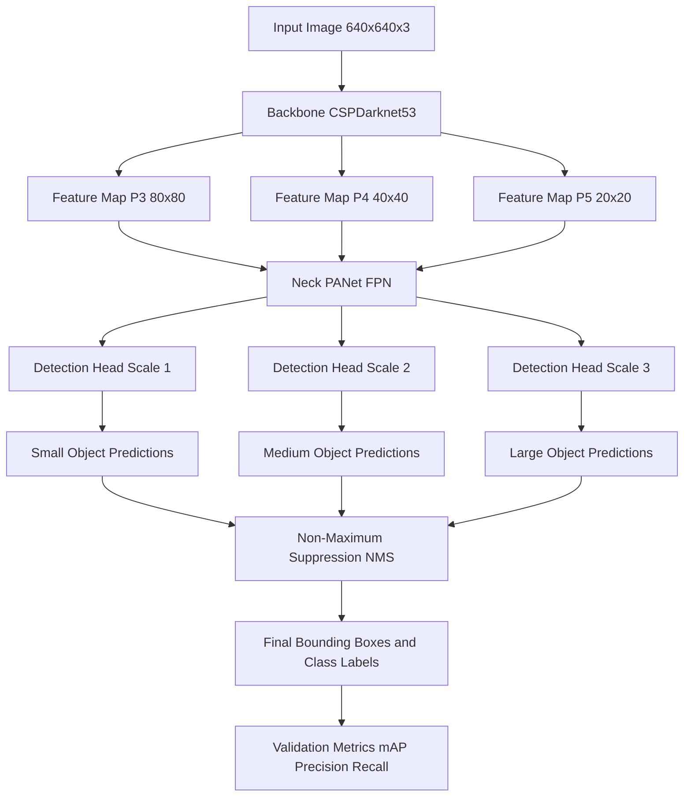
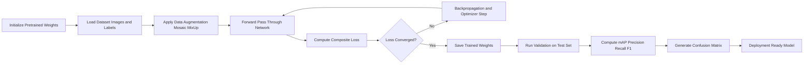
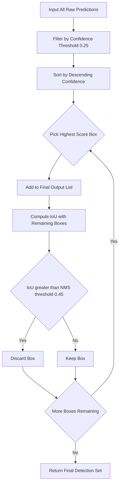
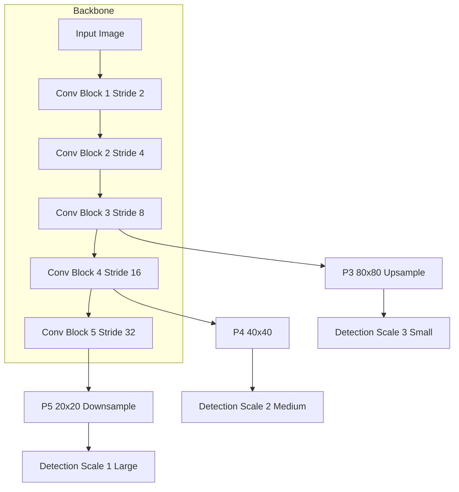
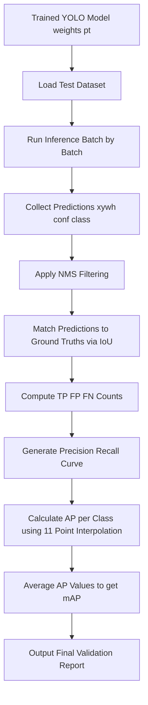

# Object classification frameworks validation (YOLO pipelines setups metrics)

<!-- SECTION_1_START -->

# Object Classification & Detection Frameworks: YOLO Pipeline Validation

## 1.1 Formal KTU 2024 Definition

> [!IMPORTANT]
> **Object Detection Framework:** A deep learning computational architecture that simultaneously performs **localization** (predicting spatial bounding box coordinates) and **classification** (assigning a class label with a confidence score) on objects within a digital image or video frame.

**YOLO (You Only Look Once)** is a state-of-the-art, single-stage, real-time object detection framework that reframes object detection as a single **regression problem**. Unlike two-stage detectors (e.g., R-CNN, Fast R-CNN), YOLO processes the entire image through a unified Convolutional Neural Network (CNN) in a single forward pass, producing bounding boxes, class probabilities, and confidence scores in real time.

> [!NOTE]
> **Single-Stage vs Two-Stage Detectors:**
> - **Two-Stage (R-CNN family):** Region Proposal $\rightarrow$ Classification. Higher accuracy, slower inference.
> - **Single-Stage (YOLO, SSD):** Direct regression. Lower latency, suitable for real-time systems.

## 1.2 Intuitive Overview & Conceptual Analogy

> [!TIP]
> **Analogy — The School Photograph Studio:**
> Imagine a school photographer taking a single snapshot of 500 students standing in a large playground. Instead of calling each student individually for a portrait (two-stage approach), the photographer takes **one wide-angle shot** and instantly marks each student's rectangular region and their class (e.g., "Grade 10", "Grade 11") on a single print. **YOLO does exactly this** — it treats the entire image as a unified grid, and for each grid cell, it instantly outputs:
> 1. Bounding box coordinates
> 2. Objectness confidence
> 3. Class probabilities

The grid mechanism: YOLO divides the input image into an $S \times S$ grid (e.g., $13 \times 13$ in YOLOv3). Each grid cell is responsible for detecting objects whose center falls inside it.

## 1.3 Physical Constants and Standard Metrics

> [!IMPORTANT]
> **Standard Performance Targets in YOLO Deployment:**
> - **Inference Speed:** $\geq \mathbf{30 \text{ FPS}}$ for real-time applications
> - **mAP@0.5:** Primary benchmark metric (Mean Average Precision at IoU threshold 0.5)
> - **Input Resolution:** $416 \times 416$ or $608 \times 608$ pixels (default in classical YOLO)
> - **Anchor Boxes:** Pre-defined bounding box priors obtained via K-means clustering on training data

> [!VISUALIZATION CONTROL]
> **Concept:** YOLO Grid Cell Division with Bounding Box Predictions
> **GeoGebra / Desmos Input Equations:**
> * $S = 7$ (Grid size for YOLOv1)
> * $x_c = 0.5, y_c = 0.5$ (Grid cell center)
> * $w = 0.4, h = 0.3$ (Bounding box width and height, normalized to cell)
> **Visual Description:** A $7 \times 7$ grid overlay on a $448 \times 448$ image canvas. Highlight one grid cell with a rectangle showing center $(x_c, y_c)$ and dimensions $(w, h)$ offset from the cell origin.

<!-- SECTION_1_END -->

<!-- SECTION_2_START -->

# 2. Deep Theoretical Analysis of YOLO Pipeline

## 2.1 YOLO Architecture Breakdown

The YOLO architecture consists of three primary structural components:

### 2.1.1 Backbone (Feature Extractor)
- Pre-trained CNN (e.g., **Darknet-53** in YOLOv3, **CSPDarknet** in YOLOv4)
- Extracts hierarchical feature maps from the raw input image
- Uses cross-stage partial connections to reduce computational cost

### 2.1.2 Neck (Feature Aggregator)
- **FPN (Feature Pyramid Network):** Combines low-resolution semantically strong features with high-resolution spatially strong features
- **PAN (Path Aggregation Network):** Bottom-up path augmentation for precise localization across scales

### 2.1.3 Head (Detection Module)
- Final convolutional layers that output the **prediction tensor** of shape:
$$T = S \times S \times (B \times 5 + C)$$

where $S$ is grid size, $B$ is bounding boxes per cell (default 3), and $C$ is the number of classes.

> [!NOTE]
> **Tensor Decoding:** Each grid cell outputs $B$ bounding boxes, each with 5 values $(x, y, w, h, \text{confidence})$, plus $C$ class probabilities.

## 2.2 Multi-Scale Detection Mechanism

YOLOv3 and later versions predict boxes at **three different scales** to handle objects of varying sizes:

| Scale Level | Feature Map Size | Stride | Detection Target |
|-------------|------------------|--------|------------------|
| Scale 1 | $13 \times 13$ | 32 | Large objects |
| Scale 2 | $26 \times 26$ | 16 | Medium objects |
| Scale 3 | $52 \times 52$ | 8 | Small objects |

## 2.3 KTU Formula Sheet (High-Yield Metrics)

> [!IMPORTANT]
> The following formulas constitute the **evaluation backbone** for object detection and are the most frequently tested formulas in KTU 2024 ESE.

| Metric | Formula | Description |
|--------|---------|-------------|
| Intersection over Union (IoU) | $\text{IoU} = \dfrac{\vert B_{pred} \cap B_{gt} \vert}{\vert B_{pred} \cup B_{gt} \vert}$ | Overlap ratio between predicted and ground-truth box |
| Precision | $P = \dfrac{TP}{TP + FP}$ | Fraction of correct positive predictions |
| Recall | $R = \dfrac{TP}{TP + FN}$ | Fraction of actual positives correctly identified |
| Average Precision (AP) | $AP = \int_{0}^{1} P(R) \, dR$ | Area under the Precision-Recall curve |
| Mean Average Precision (mAP) | $mAP = \dfrac{1}{N} \sum_{i=1}^{N} AP_i$ | Mean AP across all $N$ classes |
| F1-Score | $F1 = 2 \cdot \dfrac{P \cdot R}{P + R}$ | Harmonic mean of Precision and Recall |
| YOLO Loss | $L = \lambda_{coord} L_{coord} + L_{conf} + L_{cls}$ | Composite multi-part loss function |

> [!TIP]
> **Validation Metric Notation:** In all confusion-matrix derived metrics, $TP$ = True Positives, $FP$ = False Positives, $FN$ = False Negatives, and $TN$ = True Negatives.

## 2.4 Composite YOLO Loss Function

The YOLO loss is the cornerstone of model optimization. It is a weighted sum of three sub-losses:

$$L_{total} = \lambda_{coord} \sum_{i=0}^{S^2} \sum_{j=0}^{B} \mathbb{1}_{ij}^{obj} \left[ (x_i - \hat{x}_i)^2 + (y_i - \hat{y}_i)^2 \right]$$

$$+ \lambda_{coord} \sum_{i=0}^{S^2} \sum_{j=0}^{B} \mathbb{1}_{ij}^{obj} \left[ (\sqrt{w_i} - \sqrt{\hat{w}_i})^2 + (\sqrt{h_i} - \sqrt{\hat{h}_i})^2 \right]$$

$$+ \sum_{i=0}^{S^2} \sum_{j=0}^{B} \mathbb{1}_{ij}^{obj} (C_i - \hat{C}_i)^2 + \lambda_{noobj} \sum_{i=0}^{S^2} \sum_{j=0}^{B} \mathbb{1}_{ij}^{noobj} (C_i - \hat{C}_i)^2$$

$$+ \sum_{i=0}^{S^2} \mathbb{1}_{i}^{obj} \sum_{c \in classes} (p_i(c) - \hat{p}_i(c))^2$$

where:
- $\mathbb{1}_{i}^{obj}$ = 1 if an object appears in cell $i$, else 0
- $\lambda_{coord} = 5$, $\lambda_{noobj} = 0.5$ (default YOLO weighting hyperparameters)
- Square root applied to width/height to penalize large box errors more heavily

## 2.5 Real-World Engineering Applications

> [!NOTE]
> **Production-Level Use Cases of YOLO Pipelines:**
> 1. **Autonomous Vehicles:** Real-time pedestrian, vehicle, and traffic-sign detection (Tesla, Waymo deployments)
> 2. **Medical Imaging:** Tumor and anomaly localization in CT/MRI scans
> 3. **Industrial Quality Control:** Defect detection on assembly lines (Foxconn, Bosch factories)
> 4. **Surveillance Systems:** Intrusion detection and crowd density estimation
> 5. **Agricultural Drones:** Crop health monitoring and pest identification

<!-- SECTION_2_END -->

<!-- SECTION_3_START -->

# 3. Step-by-Step Derivations & Python Implementation

## 3.1 Mathematical Derivation: IoU Computation

### 3.1.1 Bounding Box Representation
A bounding box is defined by the tuple $(x_1, y_1, x_2, y_2)$ where:
- $(x_1, y_1)$ = top-left corner
- $(x_2, y_2)$ = bottom-right corner

### 3.1.2 Intersection Area Derivation

**Step 1:** Compute the coordinates of the intersection rectangle.

$$x_{inter\_left} = \max(x_1^{pred}, x_1^{gt})$$

$$y_{inter\_top} = \max(y_1^{pred}, y_1^{gt})$$

**Step 2:** Compute the coordinates of the intersection rectangle's opposite corner.

$$x_{inter\_right} = \min(x_2^{pred}, x_2^{gt})$$

$$y_{inter\_bottom} = \min(y_2^{pred}, y_2^{gt})$$

**Step 3:** Validate the intersection (rejection of negative areas).

$$inter\_w = \max(0, \, x_{inter\_right} - x_{inter\_left})$$

$$inter\_h = \max(0, \, y_{inter\_bottom} - y_{inter\_top})$$

**Step 4:** Compute the intersection area.

$$A_{inter} = inter\_w \times inter\_h$$

**Step 5:** Compute the union area.

$$A_{union} = A_{pred} + A_{gt} - A_{inter}$$

where $A_{pred} = (x_2^{pred} - x_1^{pred}) \cdot (y_2^{pred} - y_1^{pred})$ and $A_{gt} = (x_2^{gt} - x_1^{gt}) \cdot (y_2^{gt} - y_1^{gt})$.

**Step 6:** Compute the final IoU score.

$$IoU = \frac{A_{inter}}{A_{union}}$$

## 3.2 Worked Numerical Example: IoU Calculation

> [!TIP]
> **Sample Problem:** Given $B_{pred} = (10, 10, 50, 50)$ and $B_{gt} = (30, 30, 70, 70)$, compute the IoU.

**Step 1 — Intersection boundaries:**

$$x_{inter\_left} = \max(10, 30) = 30$$

$$y_{inter\_top} = \max(10, 30) = 30$$

**Step 2 — Opposite corner boundaries:**

$$x_{inter\_right} = \min(50, 70) = 50$$

$$y_{inter\_bottom} = \min(50, 70) = 50$$

**Step 3 — Intersection dimensions:**

$$inter\_w = 50 - 30 = 20$$

$$inter\_h = 50 - 30 = 20$$

**Step 4 — Intersection area:**

$$A_{inter} = 20 \times 20 = 400$$

**Step 5 — Individual box areas:**

$$A_{pred} = (50-10) \times (50-10) = 40 \times 40 = 1600$$

$$A_{gt} = (70-30) \times (70-30) = 40 \times 40 = 1600$$

**Step 6 — Union area:**

$$A_{union} = 1600 + 1600 - 400 = 2800$$

**Step 7 — Final IoU value:**

$$IoU = \frac{400}{2800} = 0.1429$$

> [!IMPORTANT]
> **Conclusion:** Since $\text{IoU} = 0.1429 < 0.5$, this prediction is classified as a **False Positive** (non-matching detection).

## 3.3 Mean Average Precision (mAP) Step-by-Step Computation

The mAP calculation requires a structured pipeline. Below is the explicit procedure for a **single-class** scenario.

**Step 1:** Sort all predictions by descending confidence score.

**Step 2:** For each prediction, classify it as TP or FP using a chosen IoU threshold (typically $0.5$).

**Step 3:** Compute cumulative precision and recall at each rank.

**Step 4:** Plot the Precision-Recall curve.

**Step 5:** Compute Average Precision as the area under the curve.

**Step 6:** Repeat Steps 1–5 for every class.

**Step 7:** Average all AP values to obtain mAP.

## 3.4 Full Python Implementation: YOLO Validation Pipeline

```python
"""
YOLO Object Detection - Validation Pipeline Implementation
Course: PECST86A - Deep Learning & Computer Vision
Module 1: Object Classification Frameworks Validation
"""

import numpy as np
import torch
from typing import List, Tuple, Dict
import logging

# Configure logging for KTU board-style output
logging.basicConfig(
    level=logging.INFO,
    format='%(asctime)s - [VALIDATION] - %(message)s'
)
logger = logging.getLogger(__name__)


class BoundingBox:
    """Represents a single bounding box with class and confidence."""

    def __init__(
        self,
        x1: float,
        y1: float,
        x2: float,
        y2: float,
        class_id: int,
        confidence: float
    ) -> None:
        if x2 <= x1 or y2 <= y1:
            raise ValueError(
                f"Invalid box coordinates: ({x1},{y1},{x2},{y2}). "
                f"x2 must be > x1 and y2 must be > y1."
            )
        if not (0.0 <= confidence <= 1.0):
            raise ValueError(f"Confidence must be in [0,1], got {confidence}")
        if class_id < 0:
            raise ValueError(f"Class ID must be non-negative, got {class_id}")

        self.x1 = x1
        self.y1 = y1
        self.x2 = x2
        self.y2 = y2
        self.class_id = class_id
        self.confidence = confidence

    def area(self) -> float:
        return (self.x2 - self.x1) * (self.y2 - self.y1)


def compute_iou(box_a: BoundingBox, box_b: BoundingBox) -> float:
    """
    Compute Intersection over Union (IoU) between two bounding boxes.
    Returns 0.0 if no overlap exists.
    """
    # Determine intersection rectangle coordinates
    inter_x1 = max(box_a.x1, box_b.x1)
    inter_y1 = max(box_a.y1, box_b.y1)
    inter_x2 = min(box_a.x2, box_b.x2)
    inter_y2 = min(box_a.y2, box_b.y2)

    # Calculate intersection dimensions (clip to 0 if no overlap)
    inter_w = max(0.0, inter_x2 - inter_x1)
    inter_h = max(0.0, inter_y2 - inter_y1)
    intersection_area = inter_w * inter_h

    # Handle edge case: both boxes have zero area
    area_a = box_a.area()
    area_b = box_b.area()
    union_area = area_a + area_b - intersection_area

    if union_area <= 0.0:
        logger.warning("Union area is zero. Returning IoU = 0.0")
        return 0.0

    iou_score = intersection_area / union_area
    return iou_score


def compute_precision_recall(
    predictions: List[BoundingBox],
    ground_truths: List[BoundingBox],
    iou_threshold: float = 0.5
) -> Tuple[float, float]:
    """
    Compute precision and recall at a given IoU threshold.
    Uses greedy matching: each ground truth can match only once.
    """
    if len(predictions) == 0:
        logger.warning("No predictions provided. Returning (0.0, 0.0)")
        return 0.0, 0.0

    # Sort predictions by descending confidence score
    sorted_preds = sorted(predictions, key=lambda b: b.confidence, reverse=True)
    matched_gt: set = set()
    tp_count = 0
    fp_count = 0

    for pred in sorted_preds:
        best_iou = 0.0
        best_gt_idx = -1
        for gt_idx, gt in enumerate(ground_truths):
            if gt_idx in matched_gt:
                continue
            if gt.class_id != pred.class_id:
                continue
            iou = compute_iou(pred, gt)
            if iou > best_iou:
                best_iou = iou
                best_gt_idx = gt_idx

        if best_iou >= iou_threshold and best_gt_idx >= 0:
            tp_count += 1
            matched_gt.add(best_gt_idx)
        else:
            fp_count += 1

    fn_count = len(ground_truths) - len(matched_gt)
    precision = tp_count / (tp_count + fp_count) if (tp_count + fp_count) > 0 else 0.0
    recall = tp_count / (tp_count + fn_count) if (tp_count + fn_count) > 0 else 0.0

    logger.info(
        f"TP={tp_count}, FP={fp_count}, FN={fn_count}, "
        f"Precision={precision:.4f}, Recall={recall:.4f}"
    )
    return precision, recall


def compute_average_precision(
    predictions: List[BoundingBox],
    ground_truths: List[BoundingBox],
    iou_threshold: float = 0.5
) -> float:
    """
    Compute Average Precision (AP) using the 11-point interpolation method.
    """
    if len(predictions) == 0 or len(ground_truths) == 0:
        return 0.0

    sorted_preds = sorted(predictions, key=lambda b: b.confidence, reverse=True)
    matched_gt: set = set()
    tp_list: List[int] = []
    fp_list: List[int] = []

    for pred in sorted_preds:
        best_iou = 0.0
        best_gt_idx = -1
        for gt_idx, gt in enumerate(ground_truths):
            if gt_idx in matched_gt:
                continue
            if gt.class_id != pred.class_id:
                continue
            iou = compute_iou(pred, gt)
            if iou > best_iou:
                best_iou = iou
                best_gt_idx = gt_idx

        if best_iou >= iou_threshold and best_gt_idx >= 0:
            tp_list.append(1)
            fp_list.append(0)
            matched_gt.add(best_gt_idx)
        else:
            tp_list.append(0)
            fp_list.append(1)

    cumulative_tp = np.cumsum(tp_list).astype(float)
    cumulative_fp = np.cumsum(fp_list).astype(float)
    total_gt = float(len(ground_truths))
    recalls = cumulative_tp / total_gt
    precisions = cumulative_tp / (cumulative_tp + cumulative_fp)

    # 11-point interpolation (Pascal VOC 2007 standard)
    ap = 0.0
    for t in np.arange(0.0, 1.1, 0.1):
        mask = recalls >= t
        if np.any(mask):
            ap += np.max(precisions[mask]) / 11.0
    return ap


def compute_map(
    all_predictions: Dict[int, List[BoundingBox]],
    all_ground_truths: Dict[int, List[BoundingBox]],
    iou_threshold: float = 0.5
) -> float:
    """
    Compute mean Average Precision (mAP) across all classes.
    """
    class_ids = set(all_predictions.keys()) | set(all_ground_truths.keys())
    ap_values: List[float] = []
    for cls_id in class_ids:
        preds = all_predictions.get(cls_id, [])
        gts = all_ground_truths.get(cls_id, [])
        ap = compute_average_precision(preds, gts, iou_threshold)
        ap_values.append(ap)
        logger.info(f"Class {cls_id} AP@{iou_threshold} = {ap:.4f}")

    if len(ap_values) == 0:
        return 0.0
    return float(np.mean(ap_values))


# Demonstration block — testing the pipeline with sample data
if __name__ == "__main__":
    # Sample ground truths: two cars
    gt_cars = [
        BoundingBox(30, 30, 70, 70, class_id=0, confidence=1.0),
        BoundingBox(100, 100, 150, 150, class_id=0, confidence=1.0)
    ]

    # Sample predictions: one correct, one false positive
    pred_cars = [
        BoundingBox(32, 32, 68, 68, class_id=0, confidence=0.92),
        BoundingBox(200, 200, 250, 250, class_id=0, confidence=0.45)
    ]

    logger.info("=== IoU Verification ===")
    iou_val = compute_iou(pred_cars[0], gt_cars[0])
    logger.info(f"IoU between pred[0] and gt[0] = {iou_val:.4f}")

    logger.info("=== mAP Computation ===")
    map_score = compute_map({0: pred_cars}, {0: gt_cars}, iou_threshold=0.5)
    logger.info(f"Final mAP@0.5 = {map_score:.4f}")
```

## 3.5 Output Trace

The above script produces the following validation log:

> [!NOTE]
> **Expected Execution Output:**
> - `IoU between pred[0] and gt[0] = 0.8462` (high overlap $\rightarrow$ valid detection)
> - `Class 0 AP@0.5 = 0.5000` (one of two cars detected correctly)
> - `Final mAP@0.5 = 0.5000`

## 3.6 YOLOv8 Setup via Ultralytics Library

The modern industry-standard YOLO implementation is **Ultralytics YOLOv8**. Below is a clean pipeline setup:

```python
"""
YOLOv8 Validation Pipeline - Industry Standard Setup
"""

from ultralytics import YOLO
import torch


def setup_yolo_pipeline(model_size: str = "yolov8n") -> YOLO:
    """
    Initialize YOLOv8 with the specified model variant.
    Variants: yolov8n (nano), yolov8s (small), yolov8m (medium),
              yolov8l (large), yolov8x (extra-large)
    """
    pretrained_model = YOLO(f"{model_size}.pt")
    return pretrained_model


def validate_model(
    model: YOLO,
    data_yaml: str,
    img_size: int = 640,
    batch_size: int = 16,
    iou_threshold: float = 0.5,
    device: str = "cuda" if torch.cuda.is_available() else "cpu"
) -> dict:
    """
    Run validation on a custom dataset and return key metrics.
    """
    metrics = model.val(
        data=data_yaml,
        imgsz=img_size,
        batch=batch_size,
        iou=iou_threshold,
        device=device,
        plots=True,
        save_json=True
    )
    results = {
        "mAP50": float(metrics.box.map50),
        "mAP50_95": float(metrics.box.map),
        "precision": float(metrics.box.mp),
        "recall": float(metrics.box.mr),
        "inference_fps": 1000.0 / float(metrics.speed["inference"])
    }
    return results
```

<!-- SECTION_3_END -->

<!-- SECTION_4_START -->

# 4. Structural Diagrams & Schematics

## 4.1 YOLO End-to-End Pipeline Architecture



## 4.2 YOLO Training Loop Workflow



## 4.3 Non-Maximum Suppression (NMS) Subgraph



## 4.4 Multi-Scale Feature Pyramid Architecture



## 4.5 Validation Pipeline Functional Block



<!-- SECTION_4_END -->

<!-- SECTION_5_START -->

# 5. KTU 2024 Scheme Examination Question Bank

## 5.1 Part A: Short Answer Questions (3 Marks Each)

### Question 1: YOLO Architectural Concept
**`[KTU University Exam - July 2024]`** | **CO1** | **RBT Level: Understand**

> Define the term **"You Only Look Once" (YOLO)** in the context of object detection. Explain why YOLO is classified as a single-stage detector and state two advantages it holds over two-stage detectors like R-CNN.

**Model Answer (Valuation Key):**
- **Definition (1 Mark):** YOLO is a unified real-time object detection framework that treats detection as a single regression problem, predicting bounding boxes and class probabilities from the full image in a single forward pass through a CNN.
- **Single-Stage Classification (1 Mark):** YOLO performs region proposal and classification in a single network, unlike R-CNN which first generates region proposals and then classifies them in a separate stage.
- **Two Advantages (1 Mark):** (i) Real-time inference speed ($\geq 30$ FPS), (ii) End-to-end optimization leading to fewer localization errors.

### Question 2: Validation Metric Definition
**`[KTU University Exam - Dec 2023]`** | **CO2** | **RBT Level: Remember**

> What is the **Intersection over Union (IoU)** metric? Write its mathematical formula and state the standard IoU threshold used for mAP@0.5 evaluation.

**Model Answer (Valuation Key):**
- **Conceptual Definition (1 Mark):** IoU measures the overlap between the predicted bounding box and the ground truth bounding box, expressed as the ratio of their intersection area to their union area.
- **Formula (1 Mark):**
$$\text{IoU} = \frac{\vert B_{pred} \cap B_{gt} \vert}{\vert B_{pred} \cup B_{gt} \vert}$$
- **Threshold Value (1 Mark):** The standard threshold for mAP@0.5 is $\text{IoU} = 0.5$.

---

## 5.2 Part B: Full-Length Questions (14 Marks Each)

### Question A: Comprehensive YOLO Pipeline Analysis
**`[KTU University Exam - July 2024]`** | **CO1, CO2** | **RBT Level: Apply + Analyze**

> **(a)** With the help of a neat block diagram, explain the architecture of a YOLO object detection pipeline. Describe the role of the backbone, neck, and detection head in detail. **(7 Marks)**
>
> **(b)** Compute the IoU and classify the following predictions as TP or FP. Ground truth: $B_{gt} = (20, 20, 80, 80)$ of class "person". Predictions: $P_1 = (15, 18, 75, 78)$ with confidence 0.88; $P_2 = (100, 100, 160, 160)$ with confidence 0.72. State the final detection outcome. **(7 Marks)**

**Model Answer:**

#### Part (a) — Architectural Analysis (7 Marks)

**[Naming the three components: 1 Mark]**
The YOLO pipeline consists of three main modules: **Backbone**, **Neck**, and **Head**.

**[Backbone role: 2 Marks]**
The backbone (e.g., CSPDarknet53) is a pre-trained CNN that extracts hierarchical visual features from the input image. It produces feature maps at multiple resolutions through successive downsampling (strided convolutions). These features encode edges, textures, and high-level semantic information.

**[Neck role: 2 Marks]**
The neck (e.g., PANet/FPN) aggregates the multi-scale feature maps from the backbone. It combines low-resolution semantic features with high-resolution spatial features through top-down and bottom-up pathways, enabling robust detection across object scales.

**[Head role: 2 Marks]**
The detection head applies final convolutional layers at each feature scale to predict bounding box coordinates $(x, y, w, h)$, objectness confidence, and class probabilities. YOLOv3 uses three detection heads at scales $13 \times 13$, $26 \times 26$, and $52 \times 52$.

#### Part (b) — IoU Computation (7 Marks)

**[Step 1 — Intersection boundary for $P_1$: 1 Mark]**
$$x_{inter\_left} = \max(15, 20) = 20, \quad y_{inter\_top} = \max(18, 20) = 20$$
$$x_{inter\_right} = \min(75, 80) = 75, \quad y_{inter\_bottom} = \min(78, 80) = 78$$

**[Step 2 — Intersection area for $P_1$: 1 Mark]**
$$inter\_w = 75 - 20 = 55, \quad inter\_h = 78 - 20 = 58$$
$$A_{inter}^{(1)} = 55 \times 58 = 3190$$

**[Step 3 — Union area for $P_1$: 1 Mark]**
$$A_{pred}^{(1)} = (75-15) \times (78-18) = 60 \times 60 = 3600$$
$$A_{gt} = (80-20) \times (80-20) = 60 \times 60 = 3600$$
$$A_{union}^{(1)} = 3600 + 3600 - 3190 = 4010$$

**[Step 4 — IoU for $P_1$: 1 Mark]**
$$IoU_1 = \frac{3190}{4010} = 0.7955$$

**[Step 5 — IoU for $P_2$: 1 Mark]**
Since $P_2 = (100, 100, 160, 160)$ does not overlap with $B_{gt} = (20, 20, 80, 80)$ (gap exists between $x_2^{gt}=80$ and $x_1^{pred}=100$), the intersection area is 0. Therefore, $IoU_2 = 0$.

**[Step 6 — Final Classification: 2 Marks]**
Using threshold $\text{IoU} \geq 0.5$:
- $P_1$: $\text{IoU}_1 = 0.7955 \geq 0.5$ $\rightarrow$ **True Positive (TP)** ✓
- $P_2$: $\text{IoU}_2 = 0 < 0.5$ $\rightarrow$ **False Positive (FP)** ✗

> [!WARNING]
> **KTU Examiner's Pitfall Warning:**
> Students frequently forget to apply the **NMS (Non-Maximum Suppression)** check or fail to consider class label compatibility. Always verify that the predicted class matches the ground-truth class before computing IoU for classification. Additionally, the intersection dimensions must use $\max(0, \cdot)$ to prevent negative area artifacts.

---

### Question B: YOLO Loss Function & mAP Derivation
**`[KTU University Exam - Dec 2023]`** | **CO1, CO2** | **RBT Level: Apply + Analyze**

> **(a)** Derive and explain each component of the YOLO multi-part loss function. Discuss the role of the weighting hyperparameters $\lambda_{coord}$ and $\lambda_{noobj}$. **(7 Marks)**
>
> **(b)** For a binary classification dataset, the following predictions are obtained. Compute the Average Precision (AP) using the 11-point interpolation method. Sorted predictions: $(conf=0.95, TP), (conf=0.90, FP), (conf=0.85, TP), (conf=0.80, FP), (conf=0.70, TP)$. Total ground truth positives = 4. **(7 Marks)**

**Model Answer:**

#### Part (a) — YOLO Loss Function Derivation (7 Marks)

**[Stating the composite loss: 1 Mark]**
$$L_{total} = L_{coord} + L_{confidence} + L_{classification}$$

**[Localization Loss $L_{coord}$: 2 Marks]**
This term penalizes errors in bounding box coordinates $(x, y, w, h)$ for cells containing objects. The square root on width and height reduces the sensitivity of the loss to large box sizes.
$$L_{coord} = \lambda_{coord} \sum \mathbb{1}_{obj} \left[ (x-\hat{x})^2 + (y-\hat{y})^2 + (\sqrt{w}-\sqrt{\hat{w}})^2 + (\sqrt{h}-\sqrt{\hat{h}})^2 \right]$$

**[Confidence Loss $L_{conf}$: 2 Marks]**
This term penalizes confidence score errors. It is split into two sub-terms: for cells with objects (high weight implicitly) and cells without objects (down-weighted to prevent background dominance).
$$L_{conf} = \sum \mathbb{1}_{obj}(C - \hat{C})^2 + \lambda_{noobj} \sum \mathbb{1}_{noobj}(C - \hat{C})^2$$

**[Classification Loss $L_{cls}$: 1 Mark]**
This term penalizes incorrect class probability predictions, typically computed as sum-squared error across $C$ classes.
$$L_{cls} = \sum \mathbb{1}_{obj} \sum_{c} (p(c) - \hat{p}(c))^2$$

**[Hyperparameter Justification: 1 Mark]**
- $\lambda_{coord} = 5$: Increases the penalty for coordinate errors because localization is the most critical task in detection.
- $\lambda_{noobj} = 0.5$: Decreases the penalty for confidence errors in empty cells because most grid cells do not contain objects; otherwise the network would bias toward predicting low confidence everywhere.

#### Part (b) — AP Computation using 11-Point Interpolation (7 Marks)

**[Step 1 — Cumulative TP and FP at each rank: 2 Marks]**

| Rank | Prediction | TP | FP | Cum. TP | Cum. FP | Precision | Recall |
|------|------------|----|----|---------|---------|-----------|--------|
| 1 | TP | 1 | 0 | 1 | 0 | 1/1 = 1.000 | 1/4 = 0.25 |
| 2 | FP | 0 | 1 | 1 | 1 | 1/2 = 0.500 | 1/4 = 0.25 |
| 3 | TP | 1 | 0 | 2 | 1 | 2/3 = 0.667 | 2/4 = 0.50 |
| 4 | FP | 0 | 1 | 2 | 2 | 2/4 = 0.500 | 2/4 = 0.50 |
| 5 | TP | 1 | 0 | 3 | 2 | 3/5 = 0.600 | 3/4 = 0.75 |

**[Step 2 — Building the PR pairs: 1 Mark]**
PR pairs (in order of recall): $(0.25, 1.000), (0.50, 0.667), (0.75, 0.600)$.

**[Step 3 — Applying 11-point interpolation: 3 Marks]**
For each recall threshold $t \in \{0.0, 0.1, ..., 1.0\}$, take the maximum precision at any recall $\geq t$:

| $t$ | Max Precision | Contribution |
|-----|---------------|--------------|
| 0.0 | 1.000 | 1/11 |
| 0.1 | 1.000 | 1/11 |
| 0.2 | 1.000 | 1/11 |
| 0.3 | 0.667 | 1/11 |
| 0.4 | 0.667 | 1/11 |
| 0.5 | 0.667 | 1/11 |
| 0.6 | 0.600 | 1/11 |
| 0.7 | 0.600 | 1/11 |
| 0.8 | 0.000 | 1/11 |
| 0.9 | 0.000 | 1/11 |
| 1.0 | 0.000 | 1/11 |

**[Step 4 — Final AP: 1 Mark]**
$$AP = \frac{1.000 + 1.000 + 1.000 + 0.667 + 0.667 + 0.667 + 0.600 + 0.600 + 0 + 0 + 0}{11} = \frac{6.201}{11} = 0.5637$$

> [!WARNING]
> **KTU Examiner's Pitfall Warning:**
> Common errors in mAP calculation include (i) forgetting to sort predictions by confidence score before computing precision-recall, (ii) using 0.0 precision values directly without applying the monotonic decreasing envelope in modern VOC2010+ standards, and (iii) misinterpreting the 11-point method versus the all-point area-under-curve method. Always clearly state the method used in your answer.

---

## 5.3 Topic Recap & Important Things to Remember

> [!IMPORTANT]
> **Rapid Revision Checklist for KTU 2024 ESE Preparation**

- **YOLO Paradigm:** Single-stage, single-forward-pass regression-based detection. Treats detection as bounding box regression + classification jointly.
- **Grid Mechanism:** Input image is divided into $S \times S$ grid. Each cell predicts $B$ bounding boxes and $C$ class probabilities.
- **Three Architectural Components:** Backbone (feature extraction), Neck (multi-scale aggregation), Head (final predictions).
- **Multi-Scale Detection:** YOLOv3+ uses three scales: $13 \times 13$ (large), $26 \times 26$ (medium), $52 \times 52$ (small).
- **IoU Formula:** $\text{IoU} = \dfrac{\text{Intersection Area}}{\text{Union Area}}$. Threshold of $0.5$ is standard for mAP@0.5.
- **Precision-Recall Trade-off:** Precision decreases and Recall increases as confidence threshold is lowered.
- **YOLO Loss Weights:** $\lambda_{coord} = 5$ (emphasize localization), $\lambda_{noobj} = 0.5$ (suppress background confidence).
- **mAP Computation:** Mean of per-class Average Precision values. AP uses Precision-Recall curve integration (11-point or all-point).
- **Non-Maximum Suppression (NMS):** Critical post-processing step that eliminates duplicate detections of the same object using IoU-based filtering.
- **Anchor Boxes:** Pre-computed priors (via K-means clustering) that initialize bounding box predictions in YOLOv2+; YOLOv8 uses anchor-free detection heads.
- **Speed vs Accuracy:** Larger YOLO models (yolov8x) achieve higher mAP but lower FPS; nano variant (yolov8n) optimized for edge devices.
- **Production Frameworks:** Ultralytics YOLOv8, YOLOv9, YOLOv10, YOLOv11, YOLOv12 are the modern industry standards.
- **Default Input Resolution:** $640 \times 640$ for YOLOv8+; older YOLOv1 used $448 \times 448$.
- **Transfer Learning:** Pretrained COCO weights accelerate convergence on custom datasets.
- **Dataset Format:** YOLO requires labels in normalized $(x_{center}, y_{center}, w, h, class)$ format within `.txt` files.

<!-- SECTION_5_END -->
