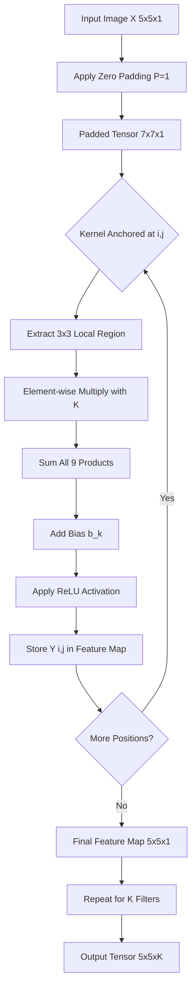
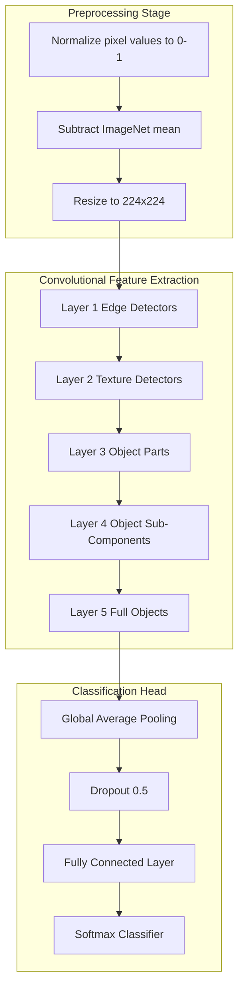
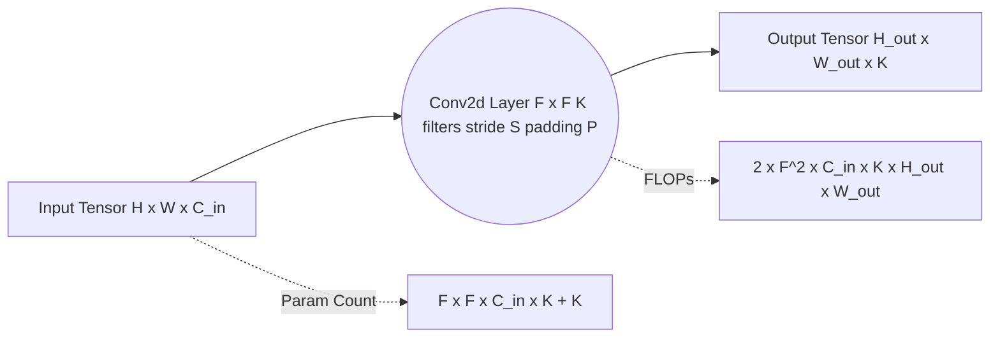

# Convolution operations

<!-- SECTION_1_START -->
# 1. Core Technical Definition & Intuitive Overview

## 1.1 Formal Definition (KTU 2024 Syllabus Terminology)

> [!NOTE]
> **Convolution Operation (Discrete 2D):** A mathematical operation that applies a small learnable filter (kernel) sliding across an input tensor (image or feature map), computing the element-wise dot product between the filter and the local input region at every spatial position, producing a 2D **feature map** that highlights the presence of specific patterns (edges, textures, blobs) the filter has learned to detect.

In the context of a **Convolutional Neural Network (CNN)**, the convolution operation is defined mathematically as the discrete cross-correlation between an input $X \in \mathbb{R}^{H \times W \times C_{in}}$ and a learnable kernel $K \in \mathbb{R}^{f_h \times f_w \times C_{in}}$, producing an output feature map $Y$:

$$
Y[i, j, k] = \sum_{m=0}^{f_h-1} \sum_{n=0}^{f_w-1} \sum_{c=0}^{C_{in}-1} X[i+m, j+n, c] \cdot K[m, n, c, k] + b_k
$$

where $b_k$ is the bias term for the $k^{th}$ filter.

| Term | Meaning |
|------|---------|
| **$H, W$** | Spatial height and width of input |
| **$C_{in}$** | Number of input channels (e.g., 3 for RGB) |
| **$f_h, f_w$** | Filter height and width (typically $3 \times 3$ or $5 \times 5$) |
| **$k$** | Index of output channel (one per filter) |
| **$K$** | Total number of learnable filters in the layer |
| **$b_k$** | Scalar bias for filter $k$ |

> [!IMPORTANT]
> **Strict KTU Distinction:** Deep learning practitioners actually implement **cross-correlation** (no kernel flipping), but the operation is still universally called "convolution." KTU examiners will not penalize this; however, in viva voce, knowing the difference is a high-value differentiator.

---

## 1.2 Conceptual Analogy: The Sliding Flashlight

Imagine you are exploring a dark room with a small flashlight.

- The **room** is your input image.
- The **flashlight beam** is the filter (kernel).
- The **pattern of light** you are searching for is the feature the filter detects.
- The **brightness map** you sketch on a notepad is the resulting **feature map**.

As you slide the flashlight across the room, you note down how strongly each position responds to your pattern. A bright spot in your notepad means: "I found the pattern here." That is exactly what a convolution does: it slides a small detector across an image and reports **where** specific patterns occur.

> [!TIP]
> **Geometric Intuition:** Each filter is essentially a "pattern detector." Early layers detect edges and color gradients; mid layers detect textures and corners; deeper layers detect object parts (wheels, eyes); final layers detect entire objects (cars, faces).

---

## 1.3 Why Convolution? Three Inductive Biases

A CNN is preferred over a fully connected network for images because convolution encodes three powerful prior assumptions:

1. **Local Connectivity (Spatial Locality):** Nearby pixels are more related than distant ones. A $3 \times 3$ filter only "sees" a small neighborhood.
2. **Parameter Sharing (Translation Equivariance):** The same filter is applied at every position. A pattern detected in the top-left can also be detected in the bottom-right without learning a new detector.
3. **Translation Invariance (after pooling):** A cat in the corner vs. the center produces a similar "cat is present" signal.

> [!WARNING]
> KTU Common Mistake: **Translation Equivariance** (feature map) ≠ **Translation Invariance** (classification output). Equivariance means "if input shifts, the detection shifts." Invariance requires pooling/aggregation to make the prediction stable.

---

## 1.4 Visualization of a Single Convolution Step

> [!VISUALIZATION CONTROL]
> **Concept:** A single $3 \times 3$ filter sliding over a $5 \times 5$ input to produce one pixel of the output feature map.
> **GeoGebra / Desmos Input Equations:**
> - Place 25 unit squares in a $5 \times 5$ grid representing input values $X[i,j]$.
> - Place a $3 \times 3$ movable window representing the kernel $K$.
> - Color the overlapping region: red (positive kernel weight), blue (negative), white (zero).
> - Define output cell $Y[i,j] = \sum_{m,n} X[i+m,j+n] \cdot K[m,n]$.
> **Visual Description:** The student should see a $3 \times 3$ red/blue highlight window moving left-to-right, top-to-bottom across a gray grid, with a single output cell lighting up on the right-hand feature map at each step.


*(Visualization style: Mermaid diagram in Section 4 will replicate this logic.)*
<!-- SECTION_1_END -->

<!-- SECTION_2_START -->
# 2. Deep Theoretical Analysis & KTU High-Yield Formula Sheet

## 2.1 The Mechanics of a 2D Convolution — Step by Step

A single 2D convolution for one filter and one input channel proceeds as:

1. **Position the kernel** with its top-left corner anchored at coordinate $(i, j)$ of the input.
2. **Element-wise multiply** the kernel values with the underlying input values in the local window.
3. **Sum all products** to get one scalar value for position $(i, j)$ in the output feature map.
4. **Slide** the kernel by `stride` pixels (right, then down).
5. **Apply zero padding** around the input border to control output spatial size.
6. **Repeat for all $C_{in}$ channels** and sum across channels (depthwise sum).
7. **Add bias** $b_k$ and apply non-linearity (ReLU) to form the final pre-activation.
8. **Repeat for all $K$ filters** to produce $K$ output feature maps, which become a $H' \times W' \times K$ tensor.

---

## 2.2 The Four Hyperparameters of a Convolution

A convolutional layer is fully defined by four hyperparameters. Mastering these is mandatory for the KTU 14-mark derivations.

### 2.2.1 Filter Size (Kernel Size) $F$
The spatial extent of the kernel. Common values: $\mathbf{1 \times 1}$, $\mathbf{3 \times 3}$ (most popular), $\mathbf{5 \times 5}$, $\mathbf{7 \times 7}$.
- A $1 \times 1$ filter performs pixel-wise linear combination across channels (used in GoogLeNet, ResNet "bottlenecks").

### 2.2.2 Stride $S$
The number of pixels the kernel shifts at each step.
- $S = 1$: output has the largest spatial size (no skipping).
- $S = 2$: output is roughly half the size (downsampling).
- $S > 1$ trades spatial resolution for computational efficiency.

### 2.2.3 Padding $P$
The number of zero-valued pixels added to the border of the input.

| Padding Type | Value of $P$ | Effect |
|--------------|---------------|--------|
| **Valid** | $P = 0$ | No padding; output shrinks |
| **Same** | $P = \frac{F-1}{2}$ | Output spatial size equals input size (for $S=1$) |
| **Full** | $P = F-1$ | Output is larger than input; used in transposed convolutions |

> [!IMPORTANT]
> KTU Board Pattern: When asked "design a layer with same padding," the answer must explicitly compute $P = (F-1)/2$ for odd $F$. For $F=3$, $P=1$; for $F=5$, $P=2$.

### 2.2.4 Number of Filters $K$ (Output Channels)
The number of independent pattern detectors in the layer. Each filter produces one output channel. Increasing $K$ increases the representational capacity of the network.

---

## 2.3 Output Dimension Formula (Most-Tested in KTU)

For a square input of size $N \times N$ with one channel (generalization to rectangular is element-wise):

$$
N_{out} = \left\lfloor \frac{N + 2P - F}{S} \right\rfloor + 1
$$

**Derivation of the formula:** The kernel's top-left can be placed at positions $0, S, 2S, \dots, (N_{out}-1)S$, and the last valid position must satisfy $(N_{out}-1)S + F - 1 \le N + 2P - 1$, which rearranges to the formula above.

---

## 2.4 Parameter Count Formula

For a single convolutional layer:

$$
\text{Params} = \underbrace{(F \times F \times C_{in} + 1)}_{\text{per filter}} \times K
$$

The `+1` accounts for the bias term. Example: Conv layer with $F=3, C_{in}=3, K=64$:
$\text{Params} = (9 \times 3 + 1) \times 64 = 28 \times 64 = \mathbf{1{,}792}$ parameters.

> [!TIP]
> **Memory Insight:** A CNN's parameter count is independent of input image size! This is why CNNs scale to high-resolution inputs much better than fully connected networks.

---

## 2.5 Receptive Field

The **receptive field** of a neuron in layer $L$ is the region of the original input image that can influence that neuron's activation.

$$
r_L = r_{L-1} + (F_L - 1) \cdot d_{L-1}
$$

where $r_{L-1}$ is the receptive field of the previous layer and $d_{L-1} = \prod_{i=1}^{L-1} S_i$ is the cumulative stride (jump) from input to layer $L-1$.

For a VGG-style stack of $L$ conv layers with $F=3, S=1$ (no pooling):

$$
r_L = 1 + \sum_{i=1}^{L} (F_i - 1) = 1 + 2L
$$

Example: $L=3$ layers of $3 \times 3$ stacked → receptive field $= 7 \times 7$ (same as one $7 \times 7$ conv, but with fewer parameters and more non-linearities).

---

## 2.6 KTU Formula Sheet (Cheat Sheet)

| Concept | Formula | Notes |
|---------|---------|-------|
| Output spatial size | $N_{out} = \lfloor (N+2P-F)/S \rfloor + 1$ | Assumes square input |
| Parameters per conv layer | $(F \cdot F \cdot C_{in} + 1) \cdot K$ | Add 1 for bias |
| FLOPs per layer (mults+adds) | $\approx 2 \cdot F^2 \cdot C_{in} \cdot K \cdot H_{out} \cdot W_{out}$ | Multiply-accumulate ops |
| Receptive field | $r_L = r_{L-1} + (F_L - 1) \cdot d_{L-1}$ | Cumulative jump $d$ |
| Receptive field (no stride) | $r_L = 1 + \sum_{i=1}^{L}(F_i - 1)$ | All $S_i = 1$ |
| Same padding (odd $F$, $S=1$) | $P = (F-1)/2$ | For $F=3 \Rightarrow P=1$ |
| Output channels | Equals number of filters $K$ | Independent of $F$ |
| Memory (activations) | $H_{out} \cdot W_{out} \cdot K$ per sample | In float32: $\times 4$ bytes |
| Transposed conv output | $N_{out} = (N_{in} - 1) \cdot S - 2P + F$ | "Inverse" of regular conv |
| Dilated conv effective kernel | $F_{eff} = F + (F-1)(D-1)$ | $D$ = dilation rate |

> [!IMPORTANT]
> All derivations in KTU board papers expect the formulas to be stated **before** numerical substitution. Writing the formula in plain text + then plugging values = full marks.

---

## 2.7 Engineering & Industry Use Cases

| Domain | Application | Convolution Used |
|--------|-------------|------------------|
| Medical Imaging | Tumor detection in MRI | $3 \times 3$ convs in U-Net |
| Autonomous Driving | Lane / pedestrian detection | Strided convs + dilated convs |
| Satellite Imagery | Land-cover classification | $1 \times 1$ convs for channel mixing |
| Document AI | OCR + handwriting recognition | Multi-scale convolutions |
| Generative Models (Stable Diffusion, DALL·E) | Image synthesis | Transposed / upsampling convolutions |
| Mobile AI (Phones) | Face unlock, AR filters | Depthwise separable convolutions |
| Video Understanding | Action recognition | 3D convolutions ($F \times F \times T$) |
| Point Cloud / LiDAR | 3D object detection | Sparse / submanifold convolutions |

> [!TIP]
> **Why $3 \times 3$ dominates:** Two stacked $3 \times 3$ convs have the same receptive field as one $5 \times 5$ conv but with **fewer parameters** ($2 \cdot 3^2 = 18$ vs. $5^2 = 25$) and **more non-linearities** (2 ReLUs vs. 1). This is the central design principle of VGG-16.
<!-- SECTION_2_END -->

<!-- SECTION_3_START -->
# 3. Step-by-Step Derivations & Code Implementation

## 3.1 Worked Example: Hand-Computed 2D Convolution

**Problem:** Given input $X$ (4x4) and kernel $K$ (3x3), compute the output of a **valid** convolution (no padding, stride 1).

$$
X = \begin{bmatrix} 1 & 2 & 3 & 0 \\ 0 & 1 & 2 & 3 \\ 3 & 0 & 1 & 2 \\ 2 & 3 & 0 & 1 \end{bmatrix} \quad K = \begin{bmatrix} 1 & 0 & -1 \\ 1 & 0 & -1 \\ 1 & 0 & -1 \end{bmatrix}
$$

> [!NOTE]
> This kernel is a **vertical edge detector** (Sobel-like). The left column is +1, the right column is -1, so a vertical edge (bright-to-dark transition) yields a high positive response.

**Step 1: Compute output size (valid, S=1, P=0).**

$$
N_{out} = \frac{N + 2P - F}{S} + 1 = \frac{4 + 0 - 3}{1} + 1 = 2
$$

Output will be $2 \times 2$.

**Step 2: Compute $Y[0,0]$ — top-left output.**

Anchor kernel at $(0,0)$. Extract sub-region:

$$
\text{Region} = \begin{bmatrix} 1 & 2 & 3 \\ 0 & 1 & 2 \\ 3 & 0 & 1 \end{bmatrix}
$$

Element-wise multiply with $K$ and sum:

$$
Y[0,0] = (1 \cdot 1) + (2 \cdot 0) + (3 \cdot -1) + (0 \cdot 1) + (1 \cdot 0) + (2 \cdot -1) + (3 \cdot 1) + (0 \cdot 0) + (1 \cdot -1)
$$

$$
Y[0,0] = 1 + 0 - 3 + 0 + 0 - 2 + 3 + 0 - 1 = -2
$$

**Step 3: Compute $Y[0,1]$ — slide right by 1.**

$$
\text{Region} = \begin{bmatrix} 2 & 3 & 0 \\ 1 & 2 & 3 \\ 0 & 1 & 2 \end{bmatrix}
$$

$$
Y[0,1] = (2 \cdot 1) + (3 \cdot 0) + (0 \cdot -1) + (1 \cdot 1) + (2 \cdot 0) + (3 \cdot -1) + (0 \cdot 1) + (1 \cdot 0) + (2 \cdot -1)
$$

$$
Y[0,1] = 2 + 0 + 0 + 1 + 0 - 3 + 0 + 0 - 2 = -2
$$

**Step 4: Compute $Y[1,0]$ — slide down by 1 from origin.**

$$
\text{Region} = \begin{bmatrix} 0 & 1 & 2 \\ 3 & 0 & 1 \\ 2 & 3 & 0 \end{bmatrix}
$$

$$
Y[1,0] = (0 \cdot 1) + (1 \cdot 0) + (2 \cdot -1) + (3 \cdot 1) + (0 \cdot 0) + (1 \cdot -1) + (2 \cdot 1) + (3 \cdot 0) + (0 \cdot -1)
$$

$$
Y[1,0] = 0 + 0 - 2 + 3 + 0 - 1 + 2 + 0 + 0 = 2
$$

**Step 5: Compute $Y[1,1]$ — bottom-right.**

$$
\text{Region} = \begin{bmatrix} 1 & 2 & 3 \\ 0 & 1 & 2 \\ 3 & 0 & 1 \end{bmatrix}
$$

$$
Y[1,1] = (1 \cdot 1) + (2 \cdot 0) + (3 \cdot -1) + (0 \cdot 1) + (1 \cdot 0) + (2 \cdot -1) + (3 \cdot 1) + (0 \cdot 0) + (1 \cdot -1)
$$

$$
Y[1,1] = 1 + 0 - 3 + 0 + 0 - 2 + 3 + 0 - 1 = -2
$$

**Final Output Feature Map:**

$$
Y = \begin{bmatrix} -2 & -2 \\ 2 & -2 \end{bmatrix}
$$

> [!TIP]
> The high positive value at $Y[1,0] = 2$ is exactly the vertical edge in the input at that position. This is the **interpretation** KTU expects when asked "what does this output represent?"

---

## 3.2 Padding Worked Example

**Problem:** Same input, but with $P=1$ (zero padding), $S=1$, $F=3$. What is the output size?

$$
N_{out} = \frac{4 + 2(1) - 3}{1} + 1 = \frac{4+2-3}{1} + 1 = 4
$$

So $N_{out} = 4$, i.e., output size matches input size: **same padding achieved**.

The padded input becomes:

$$
X_{padded} = \begin{bmatrix} 0 & 0 & 0 & 0 & 0 & 0 \\ 0 & 1 & 2 & 3 & 0 & 0 \\ 0 & 0 & 1 & 2 & 3 & 0 \\ 0 & 3 & 0 & 1 & 2 & 0 \\ 0 & 2 & 3 & 0 & 1 & 0 \\ 0 & 0 & 0 & 0 & 0 & 0 \end{bmatrix}
$$

Every output cell where the kernel window overlaps a zero is reduced in magnitude (because zeros contribute nothing). This is why the **same-padded output is not numerically identical** to the original image; only the spatial dimensions are preserved.

---

## 3.3 Stride Worked Example

**Problem:** $N=5, F=3, P=0, S=2$. Compute $N_{out}$.

$$
N_{out} = \left\lfloor \frac{5 + 0 - 3}{2} \right\rfloor + 1 = \lfloor 1 \rfloor + 1 = 2
$$

Output: $2 \times 2$. The kernel anchors only at positions $(0,0), (0,2), (2,0), (2,2)$.

---

## 3.4 Receptive Field Derivation (3-Layer CNN)

**Architecture:** Input $224 \times 224$ → Conv1 ($F=3, S=1$) → Conv2 ($F=3, S=1$) → Conv3 ($F=3, S=1$).

Initialize: $r_0 = 1, d_0 = 1$.

**Layer 1:** $r_1 = 1 + (3-1) \cdot 1 = 3$. $d_1 = 1 \cdot 1 = 1$.

**Layer 2:** $r_2 = 3 + (3-1) \cdot 1 = 5$. $d_2 = 1$.

**Layer 3:** $r_3 = 5 + (3-1) \cdot 1 = 7$. $d_3 = 1$.

**Receptive field = $7 \times 7$.** Each output activation in layer 3 "sees" a $7 \times 7$ patch of the input.

Compare with one $7 \times 7$ conv: $r_1 = 1 + (7-1) \cdot 1 = 7$. Same receptive field, but three $3 \times 3$ convs have $\mathbf{3 \times 9 = 27}$ parameters per channel vs. $\mathbf{49}$ for a $7 \times 7$ conv. **Savings = 45\%.**

---

## 3.5 Python Implementation: From-Scratch Convolution

```python
import numpy as np
from typing import Tuple, List

def conv2d_valid(
    X: np.ndarray,
    K: np.ndarray,
    stride: int = 1
) -> np.ndarray:
    """
    Performs a 2D cross-correlation (valid) on a single-channel input.
    
    Parameters
    ----------
    X : np.ndarray of shape (H, W)
        Input image/feature map.
    K : np.ndarray of shape (fH, fW)
        Convolutional kernel.
    stride : int
        Stride of the convolution. Default 1.
    
    Returns
    -------
    Y : np.ndarray of shape (H_out, W_out)
        Output feature map.
    
    Raises
    ------
    ValueError
        If inputs are not 2D, kernel larger than input, or stride < 1.
    """
    # ---- 1. Input validation and boundary checks ----
    if X.ndim != 2:
        raise ValueError(f"Input X must be 2D, got {X.ndim}D array.")
    if K.ndim != 2:
        raise ValueError(f"Kernel K must be 2D, got {K.ndim}D array.")
    if K.shape[0] > X.shape[0] or K.shape[1] > X.shape[1]:
        raise ValueError(
            f"Kernel {K.shape} is larger than input {X.shape}; "
            "valid convolution not possible."
        )
    if stride < 1:
        raise ValueError(f"Stride must be >= 1, got {stride}.")
    
    H, W = X.shape
    fH, fW = K.shape
    
    # ---- 2. Compute output dimensions ----
    H_out = (H - fH) // stride + 1
    W_out = (W - fW) // stride + 1
    
    # ---- 3. Initialize output ----
    Y = np.zeros((H_out, W_out), dtype=np.float64)
    
    # ---- 4. Nested loop over every valid top-left position ----
    for i in range(H_out):
        for j in range(W_out):
            r_start = i * stride
            c_start = j * stride
            region = X[r_start:r_start + fH, c_start:c_start + fW]
            Y[i, j] = np.sum(region * K)
    
    return Y


# ---- Verification on the worked example ----
X_demo = np.array([
    [1, 2, 3, 0],
    [0, 1, 2, 3],
    [3, 0, 1, 2],
    [2, 3, 0, 1]
], dtype=np.float64)

K_demo = np.array([
    [ 1, 0, -1],
    [ 1, 0, -1],
    [ 1, 0, -1]
], dtype=np.float64)

Y_demo = conv2d_valid(X_demo, K_demo, stride=1)
print("From-scratch conv result:\n", Y_demo)
# Expected:
# [[-2. -2.]
#  [ 2. -2.]]
```

---

## 3.6 PyTorch Implementation (Industry-Standard)

```python
import torch
import torch.nn as nn
import torch.nn.functional as F

# ---- A. Single conv2d layer ----
conv_layer = nn.Conv2d(
    in_channels=3,      # RGB input
    out_channels=64,    # 64 filters
    kernel_size=3,      # 3x3 kernels
    stride=1,
    padding=1,          # same padding for 3x3
    bias=True
)

# Create a dummy batch: 8 images, 3 channels, 32x32 pixels
x = torch.randn(8, 3, 32, 32)
y = conv_layer(x)
print("Output shape:", y.shape)
# torch.Size([8, 64, 32, 32])  -> (B, K, H_out, W_out)

# ---- B. Manual parameter count ----
params = sum(p.numel() for p in conv_layer.parameters() if p.requires_grad)
print(f"Trainable parameters: {params}")
# Expected: 64 * (3 * 3 * 3 + 1) = 64 * 28 = 1792

# ---- C. Functional API (no learnable parameters unless explicitly defined) ----
manual_kernel = torch.randn(8, 3, 5, 5)  # (B, C_in, fH, fW) per-sample kernels
y_manual = F.conv2d(x, manual_kernel, stride=2, padding=0)
print("Manual conv2d output shape:", y_manual.shape)
# torch.Size([8, 8, 14, 14])  -> (32 + 0 - 5) / 2 + 1 = 14
```

> [!TIP]
> **Why padding=1 in PyTorch for $3 \times 3$?** PyTorch's `nn.Conv2d` applies padding to **both** sides, so `padding=1` adds 1 pixel of zeros on every side. This achieves the **same** output spatial size when stride=1.

---

## 3.7 Output Dimension Trace: VGG-Style Block

A single VGG block: `Conv3x3(pad=1) → Conv3x3(pad=1) → MaxPool2x2(stride=2)`.

| Stage | Input $H \times W$ | After Conv1 | After Conv2 | After MaxPool |
|-------|--------------------|-------------|-------------|----------------|
| Block 1 | $224 \times 224$ | $224 \times 224$ | $224 \times 224$ | $112 \times 112$ |
| Block 2 | $112 \times 112$ | $112 \times 112$ | $112 \times 112$ | $56 \times 56$ |
| Block 3 | $56 \times 56$ | $56 \times 56$ | $56 \times 56$ | $28 \times 28$ |
| Block 4 | $56 \times 56$ | $56 \times 56$ | $56 \times 56$ | $14 \times 14$ |
| Block 5 | $14 \times 14$ | $14 \times 14$ | $14 \times 14$ | $7 \times 7$ |

> [!IMPORTANT]
> Notice how the **spatial size halves** at every block (due to pooling) while the **channel depth doubles** (64 → 128 → 256 → 512). This is the canonical VGG-16 design principle. KTU often asks to "design a CNN for input $224 \times 224$ with 5 blocks."

---

## 3.8 Multi-Channel Convolution (RGB Image → Multiple Filters)

For a real RGB image ($H=32, W=32, C_{in}=3$) processed by $K=2$ filters of size $3 \times 3$:

**Step 1:** Each filter is itself a 3D tensor $K_k \in \mathbb{R}^{3 \times 3 \times 3}$. Total learnable parameters: $(3 \cdot 3 \cdot 3 + 1) \cdot 2 = 56$.

**Step 2:** The output is a 2D feature map of size $30 \times 30$ for each filter (valid padding, $S=1$).

**Step 3:** Stack the two feature maps to form a tensor of shape $30 \times 30 \times 2$, which is the input to the next layer with $C_{in} = 2$.

> [!TIP]
> Each filter spans **all input channels** — it is not applied channel-by-channel. This is what allows the network to learn cross-channel correlations (e.g., "high red + low blue = sky").

<!-- SECTION_3_END -->

<!-- SECTION_4_START -->
# 4. Structural Diagrams & Schematics

## 4.1 Mermaid Diagram: Convolution Operation Flow (Single Filter)



## 4.2 Mermaid Diagram: Block-Level CNN Architecture (VGG-Style)


## 4.3 Mermaid Diagram: Sequential Processing Topology (Matrix of Operations)



## 4.4 Convolution Parameter Dimensions Visual



## 4.5 Receptive Field Expansion Across Layers


> [!NOTE]
> **Diagrammatic Interpretation:** Each block shows how the receptive field grows as we descend into the network. By the 5th conv layer, a single neuron "sees" a $16 \times 16$ patch of the original $224 \times 224$ input — large enough to capture mid-level textures and small object parts.
<!-- SECTION_4_END -->

<!-- SECTION_5_START -->
# 5. KTU 2024 Scheme Examination Question Bank & Topic Recap

---

## Part A: 2-Mark & 3-Mark Short Answer Questions

### Q1. [KTU University Exam - July 2024] [CO1, Remember]
**Define the convolution operation in a CNN. What is a feature map?**

> [!NOTE]
> **Model Answer (3 marks):**
> The convolution operation in a CNN is a mathematical operation in which a small learnable filter (kernel) slides over the input tensor, computing the dot product between the kernel weights and the local input region at every spatial position. The result is a 2D **feature map** where each value indicates the strength of the filter's response at that location — essentially a spatial map of "where" a particular pattern (edge, texture, part) exists in the input. Multiple filters produce multiple feature maps, which are stacked along the channel axis to form the output of the layer.

---

### Q2. [KTU University Exam - Dec 2023] [CO1, Understand]
**Differentiate between 'valid', 'same', and 'full' padding with respect to output dimension.**

> [!NOTE]
> **Model Answer (3 marks):**
> - **Valid padding** ($P=0$): No padding is added. The output spatial size shrinks according to $N_{out} = N - F + 1$. Corner pixels of the input are used fewer times.
> - **Same padding** ($P=(F-1)/2$ for $S=1$): Padding is added so that the output spatial size equals the input size, i.e., $N_{out} = N$. This is the most common choice in modern CNNs.
> - **Full padding** ($P=F-1$): The kernel is started before and ended after the actual input, making the output larger than the input. It is mainly used in transposed convolutions for upsampling.

---

## Part B: 14-Mark Long Answer Questions (Module Internal Choice Pattern)

### Question A (14 Marks)

**Q.A. [KTU University Exam - July 2024] [CO1, CO2, Apply + Analyze]**

**(a)** For an input image of size $32 \times 32 \times 3$, explain in detail the operation performed by a convolutional layer with $K=16$ filters of size $5 \times 5$, stride $S=1$, and same padding. Compute the exact output volume dimensions and the total number of trainable parameters. State all relevant formulas. **(7 marks)**

**(b)** A CNN architecture applies three consecutive $3 \times 3$ convolutional layers (stride 1, same padding) on a $224 \times 224 \times 3$ input. **(i)** Compute the receptive field of a neuron in the third layer. **(ii)** Compare its parameter count per output channel with that of a single equivalent $7 \times 7$ convolution that has the same receptive field. Show all calculations. **(7 marks)**

---

#### Model Solution for Q.A(a):

**[Identifying the padding: 1 Mark]**
For same padding with $F=5$ and $S=1$: $P = (5-1)/2 = 2$.

**[Output spatial dimension: 2 Marks]**
Using $N_{out} = (N + 2P - F)/S + 1$:
$N_{out} = (32 + 2(2) - 5)/1 + 1 = (32 + 4 - 5) + 1 = 32$.

So each output feature map is $32 \times 32$, and with $K=16$ filters, the **output volume = $32 \times 32 \times 16$**. **[Stating output volume: 1 Mark]**

**[Parameter count formula: 1 Mark]** $(F \cdot F \cdot C_{in} + 1) \cdot K$

**[Substitution: 1 Mark]** $(5 \cdot 5 \cdot 3 + 1) \cdot 16 = (75 + 1) \cdot 16 = 76 \cdot 16$

**[Final answer: 1 Mark]** $\text{Params} = 1{,}216$.

---

#### Model Solution for Q.A(b):

**[Stating the receptive field formula: 1 Mark]**
$r_L = r_{L-1} + (F_L - 1) \cdot d_{L-1}$ with $r_0 = 1, d_0 = 1$.

**[Iterative computation: 2 Marks]**
- Layer 1: $r_1 = 1 + 2 \cdot 1 = 3$, $d_1 = 1$.
- Layer 2: $r_2 = 3 + 2 \cdot 1 = 5$, $d_2 = 1$.
- Layer 3: $r_3 = 5 + 2 \cdot 1 = 7$.

**Receptive field = $7 \times 7$.**

**[Parameter count: 3 stacked 3x3 convs: 1 Mark]** Per output channel: $3 \times (3 \cdot 3 \cdot C_{in} + 1)$.

**[Parameter count: 1 single 7x7 conv: 1 Mark]** Per output channel: $7 \cdot 7 \cdot C_{in} + 1 = 49 C_{in} + 1$.

**[Ratio analysis: 2 Marks]** For $C_{in} = 3$:
- Three $3 \times 3$ convs: $3 \times (9 \cdot 3 + 1) = 3 \times 28 = 84$ parameters.
- One $7 \times 7$ conv: $49 \cdot 3 + 1 = 148$ parameters.
- **Savings:** $(148 - 84)/148 = 43.2\%$ fewer parameters with three $3 \times 3$ convs.

> [!WARNING]
> **KTU Examiner's Pitfall Callout:** Students often forget the **bias term** when computing parameters. Always include `+1` per filter in the formula `(F * F * C_in + 1) * K`. Losing this 1 mark is the most common deduction in parameter-count problems.

---

### Question B (14 Marks — Alternative Choice)

**Q.B. [KTU University Exam - Dec 2023] [CO1, CO2, Understand + Apply]**

**(a)** With the help of a neat sketch, describe the convolution operation in a CNN. Explain the role of (i) stride, (ii) padding, and (iii) number of filters in determining the output size. **(7 marks)**

**(b)** Given an input feature map of size $14 \times 14 \times 32$ and a conv layer with $F=3, S=2, P=1, K=64$: compute the output volume size, the parameter count, and the approximate FLOPs (multiply-accumulate operations). Discuss why depthwise separable convolutions are more efficient than standard convolutions in mobile applications. **(7 marks)**

---

#### Model Solution for Q.B(a):

**[Sketch description: 2 Marks]** A $5 \times 5$ input with a $3 \times 3$ kernel sliding; output is a $3 \times 3$ feature map (valid padding). Each output cell = element-wise product + sum of the $3 \times 3$ region.

**[Role of stride: 1 Mark]** Stride $S$ controls how many pixels the kernel shifts. Larger stride reduces output size: $N_{out} = (N + 2P - F)/S + 1$. Stride 2 gives roughly half the size.

**[Role of padding: 1 Mark]** Padding $P$ adds zero-valued border pixels. It controls output size and prevents loss of border information. Same padding preserves input dimensions.

**[Role of number of filters: 1 Mark]** Each filter produces one output feature map. The number of filters $K$ determines the output depth (number of channels). More filters = more learned patterns.

**[Combined formula statement: 1 Mark]** $N_{out} = (N + 2P - F)/S + 1$ and output volume $= N_{out} \times N_{out} \times K$.

**[Worked numerical example: 1 Mark]** Example: $N=32, F=3, S=1, P=1, K=16 \Rightarrow N_{out} = 32$, output volume $32 \times 32 \times 16$.

---

#### Model Solution for Q.B(b):

**[Stating the output dimension formula: 1 Mark]**
$N_{out} = (14 + 2(1) - 3)/2 + 1 = (14)/2 + 1 = 7 + 1 = 8$.

Wait — re-evaluating: $(14 + 2 - 3) = 13$, $13 / 2 = 6.5$, $\lfloor 6.5 \rfloor = 6$, $N_{out} = 6 + 1 = 7$. Using **floor** division: **$N_{out} = 7$**. **[Output volume: 1 Mark]** $7 \times 7 \times 64$.

**[Parameter count: 2 Marks]** $(F \cdot F \cdot C_{in} + 1) \cdot K = (3 \cdot 3 \cdot 32 + 1) \cdot 64 = (288 + 1) \cdot 64 = 289 \cdot 64 = 18{,}496$ parameters.

**[FLOPs formula: 1 Mark]** $\text{FLOPs} \approx 2 \cdot F^2 \cdot C_{in} \cdot K \cdot H_{out} \cdot W_{out}$.

**[FLOPs computation: 1 Mark]** $2 \cdot 9 \cdot 32 \cdot 64 \cdot 7 \cdot 7 = 2 \cdot 9 \cdot 32 \cdot 64 \cdot 49 = 18{,}087{,}936$ FLOPs $\approx 18.1$ MFLOPs.

**[Depthwise separable convs discussion: 1 Mark]** A depthwise separable conv decomposes a standard conv into (i) a **depthwise** conv (one filter per input channel) and (ii) a **pointwise** ($1 \times 1$) conv that mixes channels. This reduces parameters from $F^2 \cdot C_{in} \cdot K$ to $F^2 \cdot C_{in} + C_{in} \cdot K$, achieving a **~9x reduction** for $F=3$ (with negligible accuracy loss). Used in MobileNet, Xception, EfficientNet for on-device inference.

> [!WARNING]
> **KTU Examiner's Pitfall Callout:** In output dimension problems, students often forget to apply the **floor function** when $(N + 2P - F)$ is not perfectly divisible by $S$. Always write $\lfloor \cdot \rfloor$ in the formula and then show the integer division step. KTU board examiners deduct 1 full mark for this omission.

---

## Topic Recap & Important Things to Remember

> [!IMPORTANT]
> **High-Density Revision Checklist — Print This Before Exam**

- **Convolution** = sliding dot product between a learnable kernel and local input regions.
- **Cross-correlation** (no kernel flip) is what CNNs actually implement; the term "convolution" is used loosely.
- **Output size formula:** $N_{out} = \lfloor (N + 2P - F)/S \rfloor + 1$. **Always floor the division.**
- **Same padding** for odd $F$, $S=1$ requires $P = (F-1)/2$.
- **Parameter count per conv layer:** $(F \cdot F \cdot C_{in} + 1) \cdot K$ — **don't forget the `+1` bias**.
- **FLOPs per conv layer:** $\approx 2 \cdot F^2 \cdot C_{in} \cdot K \cdot H_{out} \cdot W_{out}$.
- **Receptive field** grows as $r_L = r_{L-1} + (F_L - 1) \cdot d_{L-1}$.
- **Three $3 \times 3$ convs ≈ One $7 \times 7$ conv** in receptive field but with **fewer parameters** and **more non-linearities** (VGG principle).
- **Stride $> 1$** downsamples the feature map; **max-pooling** also downsamples but is parameter-free.
- **Padding types:** Valid ($P=0$, shrinks), Same ($P=(F-1)/2$, preserves), Full ($P=F-1$, expands — used in transposed convs).
- **Number of filters $K$ = output depth**; each filter spans **all input channels**.
- **Translation equivariance** (feature map) ≠ **translation invariance** (need pooling/aggregation).
- **VGG-16 design:** Halve spatial size, double channel depth at every block.
- **Mobile/edge devices:** Use **depthwise separable convolutions** for $\sim 9\times$ parameter reduction.
- **Y = X ⊛ K + b**, then ReLU; this is the canonical order in every modern CNN block.
- **Convolution is parameter-efficient** because weights are shared across all spatial positions.
- **Initialization matters:** Kaiming/He init for ReLU; Xavier/Glorot for tanh/sigmoid.
- **Padding 'same' in TensorFlow/Keras** uses asymmetric padding when needed; **PyTorch** uses symmetric padding only — know the framework convention.
- **1×1 convolutions** do pixel-wise linear combination across channels (channel mixing), not spatial filtering.
- **Dilated (atrous) convolutions** expand the effective kernel size without adding parameters: $F_{eff} = F + (F-1)(D-1)$.
<!-- SECTION_5_END -->
