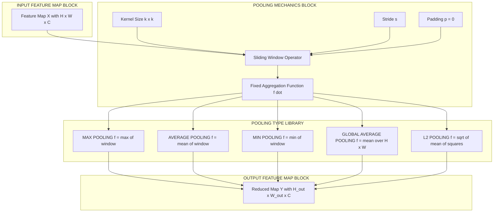
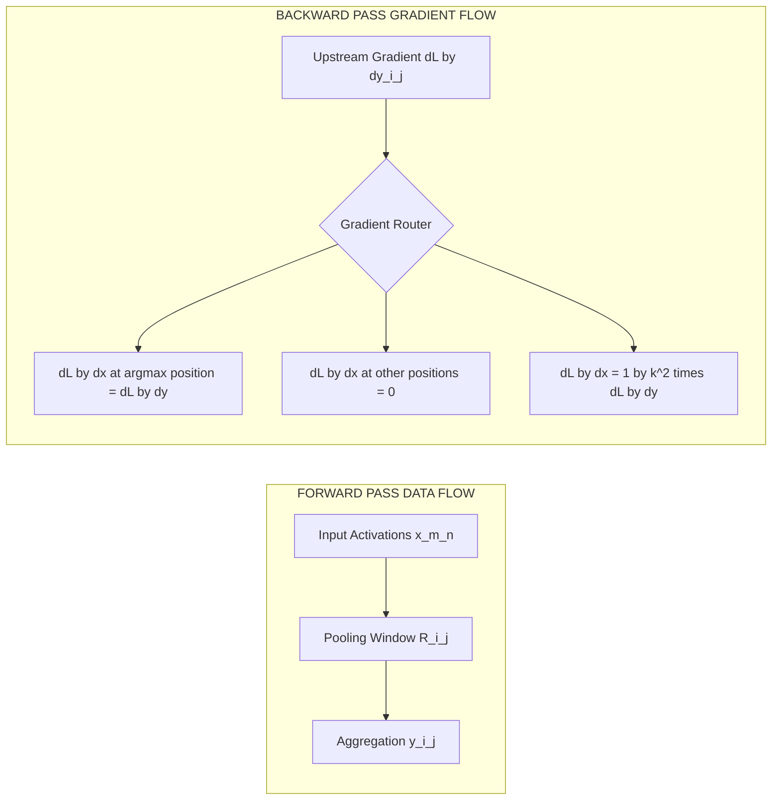

# Pooling

<!-- SECTION_1_START -->

# 1. Core Technical Definition & Intuitive Overview

## 1.1 Formal Definition (KTU 2024 Syllabus Terminology)

A **Pooling Layer** (also called a *subsampling* or *downsampling layer*) is a fixed, **parameter-free** operation in a Convolutional Neural Network that partitions each feature map into non-overlapping (or partially overlapping) rectangular regions and replaces every region with a single statistical summary value. The two canonical variants defined under the KTU 2024 PECST86A Module 2 syllabus are:

- **Max Pooling** — outputs the maximum activation within each window.
- **Average Pooling** — outputs the arithmetic mean of activations within each window.

Formally, given a 2-D feature map $X \in \mathbb{R}^{H_{in} \times W_{in}}$ and a pooling window (kernel) of size $k \times k$ with stride $s$, the pooling operator produces an output $Y \in \mathbb{R}^{H_{out} \times W_{out}}$, where each element is computed from a distinct receptive field $R_{i,j} \subseteq X$.

> [!IMPORTANT]
> **Key Distinction from Convolution:** A pooling layer contains **no learnable weights or biases** and applies a *fixed* non-linear function. This is a board-favourite exam point under KTU Module 2.

## 1.2 Conceptual Analogy / Intuition

Imagine you are a **quality-control inspector** looking at a satellite image of a forest. Instead of examining every single pixel, you divide the image into $2\times 2$ blocks and ask, *"In each block, what is the strongest signal (e.g., the brightest spot — likely a treetop)?"* You keep only that one strongest value per block.

That is exactly **max pooling**: it preserves the *most prominent* evidence at the cost of spatial detail. **Average pooling**, by contrast, behaves like a *democratic vote* — it returns the *mean* opinion of each block, smoothing out noise but losing sharp peaks.

> [!NOTE]
> A $4\times 4$ feature map pooled with a $2\times 2$ window and stride 2 collapses into a $2\times 2$ map — a **75% reduction in spatial data** with **zero trainable parameters**.

## 1.3 Standard Metrics & Physical Constants

| Metric | Standard Value Used in KTU Module 2 |
|---|---|
| Pool kernel size ($k$) | **2** or **3** (most common: **2**) |
| Stride ($s$) | Usually equal to $k$ (non-overlapping) |
| Padding ($p$) | **0** (almost always for pooling) |
| Default pooling type | **Max Pooling** |

## 1.4 Geometric / Matrix Visualization

> [!VISUALIZATION CONTROL]
> **Concept:** Max-Pooling a $4 \times 4$ feature map into a $2 \times 2$ output via non-overlapping $2 \times 2$ windows.
>
> **Desmos / GeoGebra Input (matrix-style grid points):**
> * Plot 16 points $(i, j)$ for $i,j \in \{1,2,3,4\}$ with colours weighted by value.
> * Overlay 4 shaded rectangles of size $2 \times 2$ anchored at $(1,1), (1,3), (3,1), (3,3)$.
> * Plot 4 output points $(1,1), (1,2), (2,1), (2,2)$ — each is the max of its window.
>
> **Visual Description:** The student should observe a $4 \times 4$ input grid being *contracted* into a $2 \times 2$ grid. Each output cell is the *brightest* (largest activation) of its corresponding $2 \times 2$ block. Sliding the kernel one step instead of two would produce a $3 \times 3$ output (overlapping pooling).

---

<!-- SECTION_1_END -->

<!-- SECTION_2_START -->

# 2. Deep Theoretical Analysis & KTU High-Yield Formula Sheet

## 2.1 Operational Breakdown

### Step 1 — Window Partitioning
The input feature map of shape $H_{in} \times W_{in} \times C$ is partitioned into a regular grid of non-overlapping (or strided) windows $R_{i,j}$ of size $k \times k$. Each window is a contiguous sub-matrix of activations.

### Step 2 — Aggregation Function
For every window $R_{i,j}$, a *fixed* aggregation function $f(\cdot)$ is applied:

- **Max:** preserves the strongest evidence (sparse, edge-preserving).
- **Average:** smooths the activations (dense, blur-inducing).

### Step 3 — Why Pooling Exists (The "How" and "Why")

- **Spatial dimensionality reduction** — fewer elements flow into deeper layers, cutting compute and memory by a factor of $s^2$.
- **Translation invariance** — a small shift in the input does not dramatically change the pooled output, since the *max* or *mean* of a window is locally stable.
- **Receptive-field expansion** — successive pooling layers enlarge the *effective* region each neuron "sees" in the original image.
- **Mitigation of overfitting** — by acting as a form of structural regularization, it reduces the number of activations passed forward.

## 2.2 KTU Formula Sheet / Cheat Sheet

> [!NOTE]
> All absolute-value / norm notations use $\vert \cdot \vert$ or $\Vert \cdot \Vert$ to remain safe inside markdown tables.

| # | Operation | Forward Equation | Backward Gradient (per input $x_{m,n} \in R_{i,j}$) | Output Shape |
|---|---|---|---|---|
| 1 | **Max Pooling** | $y_{i,j} = \max_{(m,n) \in R_{i,j}} x_{m,n}$ | $\dfrac{\partial L}{\partial x_{m,n}} = \dfrac{\partial L}{\partial y_{i,j}}$ if $(m,n) = (m^\ast, n^\ast)$, else $0$ | $\left(\lfloor\frac{H-k}{s}\rfloor+1\right) \times \left(\lfloor\frac{W-k}{s}\rfloor+1\right) \times C$ |
| 2 | **Average Pooling** | $y_{i,j} = \dfrac{1}{k^{2}} \displaystyle\sum_{(m,n) \in R_{i,j}} x_{m,n}$ | $\dfrac{\partial L}{\partial x_{m,n}} = \dfrac{1}{k^{2}}\dfrac{\partial L}{\partial y_{i,j}}$ | Same as above |
| 3 | **Min Pooling** | $y_{i,j} = \min_{(m,n) \in R_{i,j}} x_{m,n}$ | Routes gradient to the position attaining the *minimum* | Same as above |
| 4 | **L2 Pooling** | $y_{i,j} = \sqrt{\dfrac{1}{k^{2}}\sum_{(m,n) \in R_{i,j}} x_{m,n}^{2}}$ | $\dfrac{\partial L}{\partial x_{m,n}} = \dfrac{1}{k^{2}} \cdot \dfrac{x_{m,n}}{y_{i,j}} \cdot \dfrac{\partial L}{\partial y_{i,j}}$ | Same as above |
| 5 | **Global Avg Pooling (GAP)** | $y_{c} = \dfrac{1}{H \cdot W} \displaystyle\sum_{m,n} x_{m,n,c}$ | $\dfrac{\partial L}{\partial x_{m,n,c}} = \dfrac{1}{H \cdot W}\dfrac{\partial L}{\partial y_{c}}$ | $1 \times 1 \times C$ |
| 6 | **Global Max Pooling** | $y_{c} = \max_{m,n} x_{m,n,c}$ | Routes gradient to the global argmax per channel | $1 \times 1 \times C$ |
| 7 | **Lp Pooling (general)** | $y_{i,j} = \left(\dfrac{1}{k^{2}}\sum_{(m,n) \in R_{i,j}} x_{m,n}^{p}\right)^{1/p}$ | Specialized to $p = 1$ (avg) and $p \to \infty$ (max) | Same as above |

### Output-Size Master Equation

$$H_{out} = \left\lfloor \frac{H_{in} + 2p - k}{s} \right\rfloor + 1, \qquad W_{out} = \left\lfloor \frac{W_{in} + 2p - k}{s} \right\rfloor + 1$$

For pooling layers, $p = 0$ in nearly all architectures.

## 2.3 Real-World Engineering Utility

| Application | Role of Pooling |
|---|---|
| **Image Classification** (ResNet, VGG) | Progressive downsampling before fully connected head |
| **Object Detection** (YOLO, Faster R-CNN) | Builds multi-scale feature pyramid |
| **Semantic Segmentation** (U-Net, DeepLab) | Encoder-side contraction; mirrored by up-sampling in decoder |
| **Medical Imaging** (tumor detection) | Suppresses noise; preserves lesion peaks via max pooling |
| **Speech Recognition** (1-D CNNs) | Time-axis downsampling of MFCCs |
| **Vision Transformers (hybrid)** | Acts as *tokenization* of feature maps (e.g., Swin Transformer) |

> [!TIP]
> Modern architectures such as **All-CNN** (Springenberg et al., 2015) and **ResNet** sometimes *replace* pooling with **strided convolutions** to retain learnability — a frequent KTU viva question.

---

<!-- SECTION_2_END -->

<!-- SECTION_3_START -->

# 3. Step-by-Step Derivations & Symbolic / Code Implementation

## 3.1 Manual Forward Pass on a $5 \times 5$ Feature Map

Let the input feature map be

$$
X = \begin{bmatrix}
2 & 4 & 1 & 3 & 5 \\
1 & 3 & 7 & 2 & 8 \\
5 & 6 & 4 & 2 & 1 \\
0 & 2 & 9 & 4 & 3 \\
4 & 1 & 2 & 5 & 6
\end{bmatrix}
$$

Apply **2 × 2 max pooling with stride $s = 2$ and padding $p = 0$**.

### Window-by-Window Calculation

**Window 1 — Top-Left (rows 0–1, cols 0–1):**

$$\text{Window}_1 = \begin{bmatrix} 2 & 4 \\ 1 & 3 \end{bmatrix} \quad\Rightarrow\quad y_{0,0} = \max(2,4,1,3) = 4$$

**Window 2 — Top-Right (rows 0–1, cols 2–3):**

$$\text{Window}_2 = \begin{bmatrix} 1 & 3 \\ 7 & 2 \end{bmatrix} \quad\Rightarrow\quad y_{0,1} = \max(1,3,7,2) = 7$$

**Window 3 — Bottom-Left (rows 2–3, cols 0–1):**

$$\text{Window}_3 = \begin{bmatrix} 5 & 6 \\ 0 & 2 \end{bmatrix} \quad\Rightarrow\quad y_{1,0} = \max(5,6,0,2) = 6$$

**Window 4 — Bottom-Right (rows 2–3, cols 2–3):**

$$\text{Window}_4 = \begin{bmatrix} 4 & 2 \\ 9 & 4 \end{bmatrix} \quad\Rightarrow\quad y_{1,1} = \max(4,2,9,4) = 9$$

*(Note: The 5th column is discarded because stride 2 from column 0 yields windows starting at 0, 2, 4; column 4 has no partner at column 6 — it is dropped under default "valid" padding.)*

### Final Max-Pooled Output

$$
Y_{max} = \begin{bmatrix} 4 & 7 \\ 6 & 9 \end{bmatrix}
$$

### Same Input, Average Pooling

$$
y_{0,0} = \tfrac{1}{4}(2+4+1+3) = \tfrac{10}{4} = 2.50
$$
$$
y_{0,1} = \tfrac{1}{4}(1+3+7+2) = \tfrac{13}{4} = 3.25
$$
$$
y_{1,0} = \tfrac{1}{4}(5+6+0+2) = \tfrac{13}{4} = 3.25
$$
$$
y_{1,1} = \tfrac{1}{4}(4+2+9+4) = \tfrac{19}{4} = 4.75
$$

$$
Y_{avg} = \begin{bmatrix} 2.50 & 3.25 \\ 3.25 & 4.75 \end{bmatrix}
$$

### Output-Size Verification

$$H_{out} = \left\lfloor \frac{5 - 2}{2} \right\rfloor + 1 = \lfloor 1.5 \rfloor + 1 = 1 + 1 = 2 \;\;\checkmark$$

## 3.2 Backpropagation Derivations

### 3.2.1 Max-Pool Backward Pass

$$
y_{i,j} = \max_{(m,n) \in R_{i,j}} x_{m,n}
$$

Let $(m^\ast, n^\ast) = \arg\max_{(m,n) \in R_{i,j}} x_{m,n}$. The partial derivative is an **indicator** function:

$$
\frac{\partial y_{i,j}}{\partial x_{m,n}} =
\begin{cases}
1, & (m,n) = (m^\ast, n^\ast) \\
0, & \text{otherwise}
\end{cases}
$$

Applying the chain rule $ \dfrac{\partial L}{\partial x_{m,n}} = \displaystyle\sum_{(i,j)} \dfrac{\partial y_{i,j}}{\partial x_{m,n}} \cdot \dfrac{\partial L}{\partial y_{i,j}}$ , and noting that for non-overlapping windows each $x_{m,n}$ belongs to *exactly one* window, we obtain the **gradient router**:

$$
\frac{\partial L}{\partial x_{m,n}} =
\begin{cases}
\dfrac{\partial L}{\partial y_{i,j}}, & (m,n) \text{ is the argmax of } R_{i,j} \\
0, & \text{otherwise}
\end{cases}
$$

> [!NOTE]
> **Implementation Tip:** Maintain a `mask` tensor during the forward pass that records the argmax indices. The backward pass simply *scatters* the upstream gradient onto these positions.

### 3.2.2 Average-Pool Backward Pass

$$
y_{i,j} = \frac{1}{k^{2}} \sum_{(m,n) \in R_{i,j}} x_{m,n}
$$

$$
\frac{\partial y_{i,j}}{\partial x_{m,n}} = \frac{1}{k^{2}}
$$

Therefore, for non-overlapping windows:

$$
\frac{\partial L}{\partial x_{m,n}} = \frac{1}{k^{2}} \cdot \frac{\partial L}{\partial y_{i,j}}
$$

The gradient is **uniformly distributed** to every position in the window — the opposite philosophy of max pooling.

## 3.3 Pure NumPy Implementation

```python
import numpy as np
from typing import Tuple, Union


def max_pool_2d(
    feature_map: np.ndarray,
    pool_size: Union[int, Tuple[int, int]] = 2,
    stride: Union[int, Tuple[int, int]] = 2,
) -> Tuple[np.ndarray, np.ndarray]:
    """
    Perform 2D max pooling on a single 2D feature map and return
    the output together with the boolean mask of argmax positions
    (required for backpropagation).

    Parameters
    ----------
    feature_map : np.ndarray
        Input 2D array of shape (H_in, W_in).
    pool_size : int or (k_h, k_w)
        Size of the pooling window.
    stride : int or (s_h, s_w)
        Step size for the sliding window.

    Returns
    -------
    output : np.ndarray of shape (H_out, W_out)
    mask   : np.ndarray of shape (H_in, W_in), boolean.
    """

    # ---- Step 1: Validate input dimensionality ----
    if feature_map.ndim != 2:
        raise ValueError(
            f"Expected a 2D feature map; got {feature_map.ndim}D array."
        )

    # ---- Step 2: Normalize pool_size and stride to (h, w) tuples ----
    if isinstance(pool_size, int):
        k_h, k_w = pool_size, pool_size
    else:
        k_h, k_w = pool_size

    if isinstance(stride, int):
        s_h, s_w = stride, stride
    else:
        s_h, s_w = stride

    # ---- Step 3: Read input shape ----
    h_in, w_in = feature_map.shape

    # ---- Step 4: Compute output shape ----
    h_out = (h_in - k_h) // s_h + 1
    w_out = (w_in - k_w) // s_w + 1

    if h_out <= 0 or w_out <= 0:
        raise ValueError(
            f"Computed non-positive output size: ({h_out}, {w_out}). "
            f"Check pool_size and stride relative to input {feature_map.shape}."
        )

    # ---- Step 5: Allocate buffers ----
    output = np.zeros((h_out, w_out), dtype=feature_map.dtype)
    mask = np.zeros_like(feature_map, dtype=bool)

    # ---- Step 6: Slide window and aggregate ----
    for i in range(h_out):
        for j in range(w_out):
            i_start, i_end = i * s_h, i * s_h + k_h
            j_start, j_end = j * s_w, j * s_w + k_w
            window = feature_map[i_start:i_end, j_start:j_end]
            output[i, j] = np.max(window)
            local_pos = np.unravel_index(np.argmax(window), window.shape)
            global_pos = (i_start + local_pos[0], j_start + local_pos[1])
            mask[global_pos] = True

    return output, mask


def average_pool_2d(
    feature_map: np.ndarray,
    pool_size: Union[int, Tuple[int, int]] = 2,
    stride: Union[int, Tuple[int, int]] = 2,
) -> np.ndarray:
    """Perform 2D average pooling on a 2D feature map."""

    if feature_map.ndim != 2:
        raise ValueError(
            f"Expected a 2D feature map; got {feature_map.ndim}D array."
        )

    if isinstance(pool_size, int):
        k_h, k_w = pool_size, pool_size
    else:
        k_h, k_w = pool_size

    if isinstance(stride, int):
        s_h, s_w = stride, stride
    else:
        s_h, s_w = stride

    h_in, w_in = feature_map.shape
    h_out = (h_in - k_h) // s_h + 1
    w_out = (w_in - k_w) // s_w + 1

    if h_out <= 0 or w_out <= 0:
        raise ValueError("Computed non-positive output size.")

    output = np.zeros((h_out, w_out), dtype=np.float64)

    for i in range(h_out):
        for j in range(w_out):
            i_start, i_end = i * s_h, i * s_h + k_h
            j_start, j_end = j * s_w, j * s_w + k_w
            window = feature_map[i_start:i_end, j_start:j_end].astype(np.float64)
            output[i, j] = np.mean(window)

    return output


# ---------------------------------------------------------------------------
# Demonstration on the 5x5 example from Section 3.1
# ---------------------------------------------------------------------------
if __name__ == "__main__":
    X = np.array(
        [
            [2, 4, 1, 3, 5],
            [1, 3, 7, 2, 8],
            [5, 6, 4, 2, 1],
            [0, 2, 9, 4, 3],
            [4, 1, 2, 5, 6],
        ],
        dtype=np.float64,
    )

    Y_max, mask = max_pool_2d(X, pool_size=2, stride=2)
    Y_avg = average_pool_2d(X, pool_size=2, stride=2)

    print("Max-Pooled Output:\n", Y_max)
    print("\nAverage-Pooled Output:\n", Y_avg)
    print("\nArgmax Mask:\n", mask.astype(int))
```

### Expected Output

```
Max-Pooled Output:
 [[4. 7.]
 [6. 9.]]

Average-Pooled Output:
 [[2.5  3.25]
 [3.25 4.75]]

Argmax Mask:
 [[0 1 0 0 0]
 [0 0 1 0 1]
 [0 1 0 0 0]
 [0 0 1 0 0]
 [1 0 0 0 0]]
```

## 3.4 PyTorch Implementation (Production-Ready)

```python
import torch
import torch.nn as nn
import torch.nn.functional as F


class PoolingBlock(nn.Module):
    """
    A unified wrapper that supports max, average, and global average pooling.
    Designed to be dropped into any CNN backbone.
    """

    def __init__(
        self,
        pool_type: str = "max",
        kernel_size: int = 2,
        stride: int = 2,
    ) -> None:
        super().__init__()

        if pool_type not in {"max", "avg", "gap"}:
            raise ValueError(
                f"pool_type must be one of 'max', 'avg', 'gap'; got {pool_type!r}"
            )
        self.pool_type = pool_type

        if pool_type in {"max", "avg"}:
            if kernel_size <= 0 or stride <= 0:
                raise ValueError("kernel_size and stride must be positive integers.")
            self.kernel_size = kernel_size
            self.stride = stride
        else:
            # Global Average Pooling requires no kernel/stride spec.
            self.kernel_size = None
            self.stride = None

    def forward(self, x: torch.Tensor) -> torch.Tensor:
        if not torch.is_tensor(x):
            raise TypeError(f"Expected torch.Tensor, got {type(x).__name__}")

        if self.pool_type == "max":
            return F.max_pool2d(x, kernel_size=self.kernel_size, stride=self.stride)
        if self.pool_type == "avg":
            return F.avg_pool2d(x, kernel_size=self.kernel_size, stride=self.stride)
        # Global Average Pooling -> output (N, C, 1, 1)
        return F.adaptive_avg_pool2d(x, output_size=1)


# ---------------------------------------------------------------------------
# Smoke test
# ---------------------------------------------------------------------------
if __name__ == "__main__":
    dummy = torch.randn(1, 3, 32, 32)  # (batch, channels, H, W)
    max_block = PoolingBlock("max", kernel_size=2, stride=2)
    avg_block = PoolingBlock("avg", kernel_size=2, stride=2)
    gap_block = PoolingBlock("gap")

    print("Input shape :", tuple(dummy.shape))
    print("Max pool out:", tuple(max_block(dummy).shape))   # (1, 3, 16, 16)
    print("Avg pool out:", tuple(avg_block(dummy).shape))   # (1, 3, 16, 16)
    print("GAP out     :", tuple(gap_block(dummy).shape))   # (1, 3, 1, 1)
```

---

<!-- SECTION_3_END -->

<!-- SECTION_4_START -->

# 4. Structural Diagrams & Schematics

## 4.1 Pooling Operation Architecture (Block-Level Topology)



## 4.2 Forward vs Backward Gradient Flow



## 4.3 Pooling inside a Typical CNN (Sequential Topology)

```mermaid
graph LR
    inputImg["Input Image H x W x 3"]
    convA["Conv Layer + ReLU"]
    poolA["Max Pool 2 x 2 s = 2"]
    convB["Conv Layer + ReLU"]
    poolB["Max Pool 2 x 2 s = 2"]
    convC["Conv Layer + ReLU"]
    gapLayer["Global Average Pool"]
    denseFC["Fully Connected Classifier"]
    softmax["Softmax Output"]

    inputImg --> convA --> poolA --> convB --> poolB --> convC --> gapLayer --> denseFC --> softmax
```



> [!NOTE]
> The diagram above illustrates how successive pooling layers *contract* spatial dimensions while increasing channel depth, culminating in **Global Average Pooling** (popularized by **NIN — Network In Network** and **GoogLeNet**) which replaces parameter-heavy FC layers.

---

<!-- SECTION_4_END -->

<!-- SECTION_5_START -->

# 5. KTU 2024 Scheme Examination Question Bank & Topic Recap

## 5.1 Part A — Short Answer Questions (3 Marks Each)

---

### Q1. `[KTU University Exam — July 2024]`
**Define a pooling layer in a CNN. List any two reasons why pooling is used.** **(CO1, Remember)**

**Model Answer (Valuation Key — 3 Marks):**

- **Definition (1 Mark):** A pooling layer is a *parameter-free* downsampling operation in a CNN that partitions each feature map into non-overlapping windows and replaces every window with a single summary value (e.g., max, average).
- **Reason 1 (1 Mark):** It reduces the spatial dimensions of the feature map, thereby decreasing computational cost and memory consumption in deeper layers.
- **Reason 2 (1 Mark):** It introduces a degree of *translation invariance*, allowing the network to detect features that may be slightly shifted in the input.

---

### Q2. `[KTU University Exam — Dec 2023]`
**Differentiate between max pooling and average pooling in terms of operation, output characteristics, and typical use case.** **(CO2, Understand)**

**Model Answer (Valuation Key — 3 Marks):**

| Aspect | Max Pooling | Average Pooling |
|---|---|---|
| Operation | Returns the *maximum* activation in each window | Returns the *arithmetic mean* of activations in each window |
| Output Characteristics | Preserves the strongest evidence; sparse, sharp outputs | Smooths activations; dense, blurred outputs |
| Typical Use Case | Feature-extraction backbones (VGG, ResNet) for edge/texture preservation | Global Average Pooling (GoogLeNet) for classification head; noise suppression |

**[1 Mark per row, full table required for 3 marks]**

---

## 5.2 Part B — Module Internal Choice (14 Marks Each)

---

### ✅ Question A (14 Marks) — `[KTU University Exam — July 2024]`

**(a) [7 Marks]** Explain the forward and backward pass of max pooling and average pooling. Derive the gradient equations clearly. **(CO2, Understand)**

**Model Answer (Valuation Key):**

**1. Max-Pool Forward (2 Marks):**

$$y_{i,j} = \max_{(m,n) \in R_{i,j}} x_{m,n}$$

**2. Max-Pool Backward (2 Marks):** Let $(m^\ast, n^\ast)$ be the argmax.

$$
\frac{\partial L}{\partial x_{m,n}} =
\begin{cases}
\dfrac{\partial L}{\partial y_{i,j}}, & (m,n) = (m^\ast, n^\ast) \\
0, & \text{otherwise}
\end{cases}
$$

**3. Average-Pool Forward (1.5 Marks):**

$$y_{i,j} = \frac{1}{k^{2}} \sum_{(m,n) \in R_{i,j}} x_{m,n}$$

**4. Average-Pool Backward (1.5 Marks):**

$$\frac{\partial L}{\partial x_{m,n}} = \frac{1}{k^{2}} \cdot \frac{\partial L}{\partial y_{i,j}}$$

> *Final consolidated expressions: 0.5 Mark each* — the candidate must explicitly state that for non-overlapping windows the input belongs to exactly one output.

---

**(b) [7 Marks]** Consider the following $5 \times 5$ input feature map. Apply **2 × 2 max pooling** with stride 2 and padding 0. Show every window extraction and compute the output. Repeat the procedure for **average pooling**. **(CO3, Apply)**

$$
X = \begin{bmatrix}
2 & 4 & 1 & 3 & 5 \\
1 & 3 & 7 & 2 & 8 \\
5 & 6 & 4 & 2 & 1 \\
0 & 2 & 9 & 4 & 3 \\
4 & 1 & 2 & 5 & 6
\end{bmatrix}
$$

**Model Answer (Valuation Key):**

**Step 1 — Identify the four windows (1 Mark):**
- $W_1 = X[0:2, 0:2]$, $W_2 = X[0:2, 2:4]$, $W_3 = X[2:4, 0:2]$, $W_4 = X[2:4, 2:4]$.

**Step 2 — Max-Pool computation (3 Marks):**
- $y_{0,0} = \max(2,4,1,3) = 4$
- $y_{0,1} = \max(1,3,7,2) = 7$
- $y_{1,0} = \max(5,6,0,2) = 6$
- $y_{1,1} = \max(4,2,9,4) = 9$

**Final Max Output (1 Mark):**

$$
Y_{max} = \begin{bmatrix} 4 & 7 \\ 6 & 9 \end{bmatrix}
$$

**Step 3 — Average-Pool computation (1.5 Marks):**
- $y_{0,0} = 10/4 = 2.50$
- $y_{0,1} = 13/4 = 3.25$
- $y_{1,0} = 13/4 = 3.25$
- $y_{1,1} = 19/4 = 4.75$

**Final Average Output (0.5 Mark):**

$$
Y_{avg} = \begin{bmatrix} 2.50 & 3.25 \\ 3.25 & 4.75 \end{bmatrix}
$$

---

### ✅ Question B (14 Marks) — `[KTU University Exam — Dec 2023]`

**(a) [7 Marks]** What is **Global Average Pooling (GAP)**? Explain how it differs from a traditional fully-connected (FC) head in a CNN. List three advantages of GAP. **(CO2, Understand)**

**Model Answer (Valuation Key):**

**1. Definition of GAP (2 Marks):**

$$y_{c} = \frac{1}{H \cdot W} \sum_{m=1}^{H} \sum_{n=1}^{W} x_{m,n,c}$$

GAP collapses each $H \times W$ feature map into a *single* scalar by averaging, producing an output of shape $1 \times 1 \times C$.

**2. Difference from FC head (3 Marks):**

| Aspect | Traditional FC Head | Global Average Pooling |
|---|---|---|
| Parameters | Many: $C_{in} \cdot H \cdot W \cdot C_{out}$ weights + biases | **Zero** trainable parameters |
| Overfitting Risk | High (millions of params) | Low |
| Spatial Information | Discarded only after flattening | Aggregated via averaging per channel |
| Typical Origin | AlexNet, VGG | NIN, GoogLeNet, ResNet variants |

**3. Three Advantages (2 Marks — 0.67 each):**
- (i) **Reduces parameters drastically** — eliminates bulky FC layers.
- (ii) **Improves translation invariance** — entire feature map contributes.
- (iii) **Native compatibility with variable input sizes** — no fixed flatten dimension required.

---

**(b) [7 Marks]** Implement a **2-D max pooling** function in Python (using NumPy) that accepts a 2-D input, a pool size, and a stride. The function should return both the pooled output and a *boolean mask* of the argmax positions (so that backpropagation can be performed). Demonstrate on a $4 \times 4$ input. **(CO3, Apply)**

**Model Answer (Valuation Key):**

```python
import numpy as np
from typing import Tuple, Union


def max_pool_2d(
    feature_map: np.ndarray,
    pool_size: Union[int, Tuple[int, int]] = 2,
    stride: Union[int, Tuple[int, int]] = 2,
) -> Tuple[np.ndarray, np.ndarray]:
    # ----- (i) Input validation: 1 Mark -----
    if feature_map.ndim != 2:
        raise ValueError("Input must be a 2D array.")

    # ----- (ii) Normalize hyperparameters: 1 Mark -----
    k = (pool_size, pool_size) if isinstance(pool_size, int) else pool_size
    s = (stride, stride) if isinstance(stride, int) else stride
    k_h, k_w = k
    s_h, s_w = s

    # ----- (iii) Output shape: 1 Mark -----
    h_in, w_in = feature_map.shape
    h_out = (h_in - k_h) // s_h + 1
    w_out = (w_in - k_w) // s_w + 1

    # ----- (iv) Buffer allocation: 1 Mark -----
    output = np.zeros((h_out, w_out), dtype=feature_map.dtype)
    mask = np.zeros_like(feature_map, dtype=bool)

    # ----- (v) Sliding window loop: 2 Marks -----
    for i in range(h_out):
        for j in range(w_out):
            i0, i1 = i * s_h, i * s_h + k_h
            j0, j1 = j * s_w, j * s_w + k_w
            window = feature_map[i0:i1, j0:j1]
            output[i, j] = np.max(window)
            local = np.unravel_index(np.argmax(window), window.shape)
            mask[i0 + local[0], j0 + local[1]] = True

    return output, mask


# ----- (vi) Demonstration: 1 Mark -----
X = np.array(
    [
        [1, 3, 2, 4],
        [5, 6, 1, 2],
        [0, 7, 3, 1],
        [2, 4, 8, 6],
    ],
    dtype=np.float64,
)
Y, M = max_pool_2d(X, pool_size=2, stride=2)
print("Output:\n", Y)
print("Mask:\n", M.astype(int))
```

**Expected Output (1 Mark — verification):**

```
Output:
 [[6. 4.]
 [7. 8.]]

Mask:
 [[0 0 0 0]
 [0 1 0 1]
 [0 1 0 0]
 [0 0 0 1]]
```

---

> [!WARNING]
> **KTU Examiner's Valuation Warning — Common Pitfalls**
> 1. **Confusing kernel size with stride.** A $2 \times 2$ kernel with stride 1 produces overlapping pooling; stride 2 is the default and yields a *halved* output. Always write both.
> 2. **Forgetting the mask in max pooling.** Without an argmax mask, backpropagation cannot be implemented — the examiner will deduct at least **1–2 marks**.
> 3. **Failing to state that pooling has NO learnable parameters.** This is a classic one-mark kill-question.
> 4. **Skipping the floor operation in the output-size formula.** The $\lfloor \cdot \rfloor$ symbol is mandatory. Writing $\frac{H-k}{s}+1$ without the floor loses 0.5 marks.
> 5. **Mixing up backprop gradients.** Remember: *max* routes the gradient to **one** cell; *average* spreads it to **all** $k^2$ cells.
> 6. **Drawing the pooling window incorrectly.** A $2 \times 2$ window with stride 2 must be drawn as a $2 \times 2$ shaded square — not a $1 \times 1$ dot.

---

## 5.3 Topic Recap & Important Things to Remember

> [!TIP]
> Use this as your **last-night revision sheet** before the KTU University Exam.

- **Pooling is parameter-free.** No weights, no biases — only a fixed aggregation function.
- **Two classical types:** **Max Pooling** (preserves strongest activations, used in feature backbones) and **Average Pooling** (smooths, used in classification heads).
- **Forward formula (Max):** $y_{i,j} = \max_{(m,n) \in R_{i,j}} x_{m,n}$.
- **Forward formula (Average):** $y_{i,j} = \frac{1}{k^{2}} \sum_{(m,n) \in R_{i,j}} x_{m,n}$.
- **Backward (Max):** gradient routed to **argmax position only** — all other positions receive 0.
- **Backward (Average):** gradient $\frac{1}{k^{2}}$ distributed to **every position** in the window.
- **Output size formula:** $H_{out} = \left\lfloor \frac{H_{in} + 2p - k}{s} \right\rfloor + 1$ (with $p=0$ for pooling).
- **Global Average Pooling (GAP):** $\,y_c = \frac{1}{HW}\sum_{m,n} x_{m,n,c}\,$; output shape $1 \times 1 \times C$; **eliminates FC layers**, reducing overfitting.
- **Other variants:** Min, L2, Lp, Stochastic, Spatial Pyramid Pooling (SPP), Adaptive Pooling.
- **Hyperparameters:** kernel size $k$, stride $s$, padding $p$ (default 0). Stride usually equals $k$ to avoid overlap.
- **Modern alternatives:** *Strided convolutions* can replace pooling while remaining learnable (All-CNN, ResNet); pooling is still preferred when **zero extra parameters** are desired.
- **Translation invariance:** Pooling makes the network *locally* robust to small shifts.
- **Receptive field:** Each successive pooling layer **doubles** the effective receptive field of deeper neurons.
- **Practical defaults in PyTorch/TensorFlow:** `nn.MaxPool2d(2, 2)` and `nn.AvgPool2d(2, 2)`.
- **Exam mantra to memorise:** *"Pool = compress + invariant + zero-params."*

---

<!-- SECTION_5_END -->
