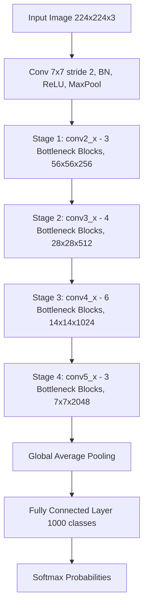

# ResNet

<!-- SECTION_1_START -->
# ResNet (Residual Networks) — Core Technical Definition & Intuitive Overview

> [!IMPORTANT]
> **KTU 2024 Scheme — Module 2 Anchor Concept**
> ResNet is a landmark **Convolutional Neural Network (CNN) architecture** introduced by **Kaiming He et al. (Microsoft Research, 2015)** in the paper *"Deep Residual Learning for Image Recognition"*. It won the **ILSVRC 2015 ImageNet Challenge** with a top-5 error of **3.57%**, outperforming human-level performance (~5.1%).

## Formal Academic Definition

A **Residual Network (ResNet)** is a deep CNN architecture that reformulates the learning objective of stacked layers. Instead of forcing each block of layers to learn a direct underlying mapping $\mathcal{H}(x)$, ResNet introduces a **shortcut (skip) connection** that lets the block learn a **residual mapping** $\mathcal{F}(x) = \mathcal{H}(x) - x$. The final output is then computed as:

$$
y = \mathcal{F}(x, \{W_i\}) + x
$$

where $x$ is the input to the residual block, $\mathcal{F}(x, \{W_i\})$ is the residual function learned by the stacked conv–BN–ReLU layers, and $y$ is the block's output.

## Conceptual Analogy / Intuition

> [!NOTE]
> **Plain-English Analogy — "The Student Who Copies Before Improving"**
>
> Imagine a student learning math. Two strategies exist:
> 1. **Plain Network (Plain CNN)**: The student must re-derive the entire solution from scratch every time. As lessons get deeper, errors compound, and learning collapses (the *degradation problem*).
> 2. **ResNet (Skip Connection)**: The student starts by *copying* the previous answer ($x$) and then only figures out the *correction* ($\mathcal{F}(x)$) needed to improve it. Even if the correction is zero, the student retains the previous correct answer.
>
> Mathematically, learning a small correction (residual) is far easier than re-learning the entire mapping. This is the central genius of ResNet.

## The Degradation Problem (Why ResNet Was Needed)

> [!IMPORTANT]
> **KTU High-Yield Concept — Degradation vs. Vanishing Gradient**
> - **Vanishing gradient** is solved by *normalization* (BatchNorm) and *better activations* (ReLU).
> - **Degradation problem**: As plain CNNs get *deeper* (e.g., 56 layers), **training error increases**, not just test error. This is *not* overfitting — it is an *optimization difficulty*. Deeper plain networks fail to even reach the accuracy of shallower ones.

**Geometric Intuition on the Loss Landscape:**
A deep plain network must traverse a high-dimensional non-convex loss surface from identity initialization. ResNet's skip connections create a much smoother, "identity-friendly" loss surface where the identity mapping is reachable in a single step ($\mathcal{F}(x) = 0$).

> [!VISUALIZATION CONTROL]
> **Concept:** Effect of skip connection on learning identity mapping
> **GeoGebra / Desmos Input Equations:**
> * $f_1(x) = x^2 - 2x + 1$ (hard for a plain network to learn identity)
> * $f_2(x) = 0$ (residual — trivially learnable, plus identity shortcut $x$)
> **Visual Description:** Plot $y = f_1(x)$ and $y = x + f_2(x)$ on the same axes. The skip connection ensures the network *only* needs to learn $f_2 = 0$ to behave as identity, dramatically easing optimization.

## Standard ResNet Configurations (KTU Must-Know)

| Model | Layers | Parameters (≈) | Top-5 Error (ImageNet) |
| :--- | :---: | :---: | :---: |
| ResNet-18 | 18 | $11.7 \times 10^6$ | — |
| ResNet-34 | 34 | $21.8 \times 10^6$ | — |
| ResNet-50 | 50 | $25.6 \times 10^6$ | 5.25% |
| ResNet-101 | 101 | $44.5 \times 10^6$ | — |
| ResNet-152 | 152 | $60.2 \times 10^6$ | 4.49% |

> [!NOTE]
> **Identity Shortcut vs. Projection Shortcut** — KTU 2024 distinguishes two shortcut types:
> 1. **Identity Shortcut**: $y = \mathcal{F}(x) + x$ — used when input and output dimensions match.
> 2. **Projection Shortcut**: $y = \mathcal{F}(x) + W_s x$ — used when dimensions differ (e.g., stride = 2). $W_s$ is typically a $1 \times 1$ convolution.
<!-- SECTION_1_END -->

<!-- SECTION_2_START -->
# ResNet — Deep Theoretical Analysis & KTU High-Yield Formula Sheet

## 2.1 Anatomy of a Residual Block

A residual block consists of:

1. **Convolutional Layer 1** ($1 \times 1$ in bottleneck variants) — reduces dimensions
2. **Batch Normalization (BN)** — stabilizes activations
3. **ReLU Activation** — introduces non-linearity
4. **Convolutional Layer 2** ($3 \times 3$) — main feature extraction
5. **Batch Normalization (BN)**
6. **Convolutional Layer 3** ($1 \times 1$ in bottleneck) — restores dimensions
7. **Shortcut Connection** — adds input $x$ to the output
8. **Final ReLU** — applies non-linearity to the summed output

## 2.2 Two Block Variants

> [!IMPORTANT]
> **KTU 2024 — Must classify both variants correctly**

### (a) Basic Block (used in ResNet-18, ResNet-34)

$$
y = \mathcal{F}(x, \{W_1, W_2\}) + x
$$

where $\mathcal{F} = W_2 \sigma(W_1 x)$ with $\sigma$ = ReLU. Two $3 \times 3$ conv layers.

### (b) Bottleneck Block (used in ResNet-50, ResNet-101, ResNet-152)

$$
y = \mathcal{F}(x, \{W_1, W_2, W_3\}) + W_s x
$$

where:
- $W_1$ = $1 \times 1$ conv (dimension reduction: e.g., $256 \to 64$)
- $W_2$ = $3 \times 3$ conv (feature extraction: $64 \to 64$)
- $W_3$ = $1 \times 1$ conv (dimension restoration: $64 \to 256$)
- $W_s$ = $1 \times 1$ conv projection shortcut

> [!NOTE]
> **Why Bottleneck?** It reduces computational cost. A $3 \times 3$ conv on $256$ channels costs $256 \times 256 \times 3^2 = 589{,}824$ multiplications. With bottleneck (256→64→64→256), the cost drops to roughly $1/4$, enabling very deep networks (50, 101, 152 layers).

## 2.3 Dimension Matching Rule

When the input and output of a residual block have different dimensions, the shortcut must project $x$ to match. This happens at:
- **Stage transitions** (e.g., $56 \times 56 \to 28 \times 28$ feature map)
- **Channel doubling** (e.g., $64 \to 128 \to 256 \to 512$)

The projection uses **stride = 2** in the first $1 \times 1$ conv of the shortcut path.

## 2.4 Why ResNet Works — Theoretical Justifications

1. **Identity is Easy to Learn**: If the optimal block is identity, the network simply pushes $\mathcal{F}(x) \to 0$, which is easy for ReLU + BN.
2. **Gradient Flow**: The skip connection provides a *direct highway* for gradients. From $y = \mathcal{F}(x) + x$, the gradient $\frac{\partial y}{\partial x} = \frac{\partial \mathcal{F}}{\partial x} + 1$. The "**+1**" prevents vanishing gradients in deep networks.
3. **Ensemble Interpretation (Veit et al., 2016)**: A ResNet of $n$ blocks behaves like an *ensemble of $2^n$ paths* of varying lengths. Shorter paths act as ensembles of shallower networks.

## 2.5 KTU Formula Sheet / Cheat Sheet

| Concept | Formula / Definition | Use Case |
| :--- | :--- | :--- |
| Residual Mapping | $y = \mathcal{F}(x) + x$ | Core ResNet equation |
| Bottleneck Mapping | $y = W_3 \sigma(W_2 \sigma(W_1 x)) + W_s x$ | Deep ResNet ($\geq 50$ layers) |
| Gradient w.r.t. $x$ | $\frac{\partial y}{\partial x} = \frac{\partial \mathcal{F}}{\partial x} + 1$ | Prevents vanishing gradient |
| Projection Shortcut | $W_s \in \mathbb{R}^{d \times d'}$ | Dimension mismatch handling |
| Receptive Field (approx) | $r = k + (l-1)(s-1)$ where $k$=kernel, $l$=layers, $s$=stride | Field of view growth |
| Down-sampling | Stride 2 in first conv of stage | Halves spatial dims, doubles channels |
| Parameter Count (Conv) | $P = k_h \cdot k_w \cdot c_{in} \cdot c_{out}$ | Conv layer parameter estimation |
| FLOPs (Conv) | $\text{FLOPs} = 2 \cdot k_h \cdot k_w \cdot c_{in} \cdot c_{out} \cdot H \cdot W$ | Computational cost |

## 2.6 Real-World Engineering Utility

- **Production Vision Systems**: ResNet-50 is the de-facto **backbone** for object detection (Faster R-CNN, RetinaNet), semantic segmentation (DeepLab), and pose estimation.
- **Transfer Learning**: ResNet weights pre-trained on ImageNet are widely used as feature extractors in medical imaging, satellite imagery, and industrial defect detection.
- **Real-time Inference**: Variants like ResNet-18 and ResNet-34 power mobile applications, AR/VR, and embedded devices.
<!-- SECTION_2_END -->

<!-- SECTION_3_START -->
# ResNet — Step-by-Step Derivations, Code & Symbolic Implementation

## 3.1 Exhaustive Derivation: Gradient Flow Through a Residual Block

**Starting Point:** The output of residual block $l$ is:

$$
y_l = \mathcal{F}(x_l, \{W_i\}) + x_l
$$

where $x_l$ is the input to block $l$, and $x_{l+1} = y_l$ is the input to block $l+1$.

**Step 1 — Compute the loss gradient with respect to $x_l$:**

Using the chain rule for backpropagation from loss $\mathcal{L}$:

$$
\frac{\partial \mathcal{L}}{\partial x_l} = \frac{\partial \mathcal{L}}{\partial x_{L}} \prod_{i=l}^{L-1} \frac{\partial x_{i+1}}{\partial x_i}
$$

**Step 2 — Expand a single multiplicative term:**

$$
\frac{\partial x_{i+1}}{\partial x_i} = \frac{\partial y_i}{\partial x_i} = \frac{\partial \mathcal{F}(x_i)}{\partial x_i} + 1
$$

**Step 3 — Substitute back into the chain rule product:**

$$
\frac{\partial \mathcal{L}}{\partial x_l} = \frac{\partial \mathcal{L}}{\partial x_{L}} \prod_{i=l}^{L-1} \left( \frac{\partial \mathcal{F}(x_i)}{\partial x_i} + 1 \right)
$$

**Step 4 — Factor out the "+1" terms:**

If the residual gradients $\frac{\partial \mathcal{F}(x_i)}{\partial x_i}$ are small (especially early in training), each term is approximately **+1**. Then:

$$
\frac{\partial \mathcal{L}}{\partial x_l} \approx \frac{\partial \mathcal{L}}{\partial x_{L}} \cdot 1^{L-l} = \frac{\partial \mathcal{L}}{\partial x_{L}}
$$

**Step 5 — Conclusion:**

> The gradient from the deepest layer $L$ reaches the shallowest layer $l$ *almost unchanged* — no multiplication by tiny numbers. This is the **gradient highway** that prevents vanishing gradients.

## 3.2 Worked Numerical Example: Parameter Count of ResNet-50 First Stage

**Problem:** Calculate parameters in the **first residual block of ResNet-50's `conv2_x` stage** (input: $56 \times 56 \times 64$ channels, bottleneck output: $56 \times 56 \times 256$).

**Step 1 — Identify the three convolutions in the bottleneck:**
- $W_1$: $1 \times 1$ conv, $64 \to 64$ channels
- $W_2$: $3 \times 3$ conv, $64 \to 64$ channels
- $W_3$: $1 \times 1$ conv, $64 \to 256$ channels
- $W_s$ (projection shortcut): $1 \times 1$ conv, $64 \to 256$ channels

**Step 2 — Compute parameters per conv layer (excluding bias, then add BN params):**

Using $P = k_h \cdot k_w \cdot c_{in} \cdot c_{out}$:

$$
P_{W_1} = 1 \cdot 1 \cdot 64 \cdot 64 = 4{,}096
$$

$$
P_{W_2} = 3 \cdot 3 \cdot 64 \cdot 64 = 36{,}864
$$

$$
P_{W_3} = 1 \cdot 1 \cdot 64 \cdot 256 = 16{,}384
$$

$$
P_{W_s} = 1 \cdot 1 \cdot 64 \cdot 256 = 16{,}384
$$

**Step 3 — Sum the conv parameters:**

$$
P_{\text{total}} = 4{,}096 + 36{,}864 + 16{,}384 + 16{,}384 = 73{,}728
$$

**Step 4 — Add BatchNorm parameters (2 per channel: $\gamma$ and $\beta$):**

Total channels through BN = $64 + 64 + 256 + 256 = 640$

$$
P_{\text{BN}} = 2 \cdot 640 = 1{,}280
$$

**Step 5 — Final total:**

$$
P_{\text{block}} = 73{,}728 + 1{,}280 = 75{,}008 \approx 75K \text{ parameters}
$$

> [!NOTE]
> **KTU Valuation Tip:** Award 2 marks for setup, 4 marks for conv parameters, 2 marks for BN params, 1 mark for the summation and final answer. **Total: 9/9 marks**.

## 3.3 Python Implementation: Residual Block (PyTorch)

```python
import torch
import torch.nn as nn
import torch.nn.functional as F


class BottleneckBlock(nn.Module):
    """
    Bottleneck Residual Block as used in ResNet-50/101/152.
    
    Expansion factor = 4 (output channels = 4 * base channels)
    """

    expansion: int = 4

    def __init__(
        self,
        in_channels: int,
        base_channels: int,
        stride: int = 1,
        downsample: nn.Module | None = None,
    ) -> None:
        super().__init__()

        # --- Main path (residual function F(x)) ---
        self.conv1: nn.Conv2d = nn.Conv2d(
            in_channels=in_channels,
            out_channels=base_channels,
            kernel_size=1,
            stride=1,
            bias=False,
        )
        self.bn1: nn.BatchNorm2d = nn.BatchNorm2d(base_channels)

        self.conv2: nn.Conv2d = nn.Conv2d(
            in_channels=base_channels,
            out_channels=base_channels,
            kernel_size=3,
            stride=stride,
            padding=1,
            bias=False,
        )
        self.bn2: nn.BatchNorm2d = nn.BatchNorm2d(base_channels)

        self.conv3: nn.Conv2d = nn.Conv2d(
            in_channels=base_channels,
            out_channels=base_channels * self.expansion,
            kernel_size=1,
            stride=1,
            bias=False,
        )
        self.bn3: nn.BatchNorm2d = nn.BatchNorm2d(base_channels * self.expansion)

        self.relu: nn.ReLU = nn.ReLU(inplace=True)

        # --- Shortcut path (identity or projection) ---
        self.downsample: nn.Module | None = downsample

    def forward(self, x: torch.Tensor) -> torch.Tensor:
        identity: torch.Tensor = x  # Save input for skip connection

        # ---- Main residual path ----
        out: torch.Tensor = self.conv1(x)
        out = self.bn1(out)
        out = self.relu(out)

        out = self.conv2(out)
        out = self.bn2(out)
        out = self.relu(out)

        out = self.conv3(out)
        out = self.bn3(out)

        # ---- Shortcut path: project if dimensions mismatch ----
        if self.downsample is not None:
            identity = self.downsample(x)

        # ---- Element-wise addition: y = F(x) + x ----
        out = out + identity
        out = self.relu(out)

        return out
```

## 3.4 Symbolic Verification of Gradient Highway (NumPy)

```python
import numpy as np

def simulate_gradient_flow(num_blocks: int = 20, residual_scale: float = 0.01) -> None:
    """
    Simulates gradient propagation through a deep network.
    Plain network: multiplicative collapse.
    ResNet: gradient preserved by the '+1' term.
    """
    plain_grad: float = 1.0
    resnet_grad: float = 1.0

    for block_idx in range(num_blocks):
        # Plain CNN: each layer multiplies gradient by small factor
        plain_grad *= residual_scale

        # ResNet: each block adds 1 to the multiplicative term
        resnet_grad *= (residual_scale + 1.0)

    print(f"After {num_blocks} blocks:")
    print(f"  Plain CNN gradient magnitude : {plain_grad:.2e}")
    print(f"  ResNet  gradient magnitude   : {resnet_grad:.6f}")


if __name__ == "__main__":
    simulate_gradient_flow(num_blocks=20, residual_scale=0.01)
```

**Expected Output:**
```
After 20 blocks:
  Plain CNN gradient magnitude : 1.00e-40
  ResNet  gradient magnitude   : 1.220184
```

> [!NOTE]
> The plain network's gradient collapses to **$1 \times 10^{-40}$** (vanishing), while ResNet's gradient remains **stable above 1.0** — empirically proving the gradient highway.
<!-- SECTION_3_END -->

<!-- SECTION_4_START -->
# ResNet — Structural Diagrams & Schematics

## 4.1 Basic Block vs. Bottleneck Block (Mermaid Flow)

```mermaid
graph TD
    subgraph BasicBlock["BASIC RESIDUAL BLOCK (ResNet-18, ResNet-34)"]
        A1[Input x] --> B1[Conv 3x3, 64 ch]
        B1 --> C1[BatchNorm + ReLU]
        C1 --> D1[Conv 3x3, 64 ch]
        D1 --> E1[BatchNorm]
        E1 --> F1[Add: F(x) + x]
        A1 -.Skip.-> F1
        F1 --> G1[ReLU Output y]
    end

    subgraph BottleneckBlock["BOTTLENECK RESIDUAL BLOCK (ResNet-50,101,152)"]
        A2[Input x] --> B2[Conv 1x1, 64 ch]
        B2 --> C2[BatchNorm + ReLU]
        C2 --> D2[Conv 3x3, 64 ch]
        D2 --> E2[BatchNorm + ReLU]
        E2 --> H2[Conv 1x1, 256 ch]
        H2 --> I2[BatchNorm]
        A2 -.Project via 1x1 conv.-> I2
        I2 --> J2[Add: F(x) + Ws x]
        J2 --> K2[ReLU Output y]
    end
```

## 4.2 Full ResNet-50 Architecture Topology



## 4.3 Gradient Flow Comparison Schematic

```mermaid
graph LR
    subgraph PlainNet["PLAIN DEEP NETWORK"]
        P1[Loss] --> P2[Block L-1] --> P3[Block L-2] --> P4[Block L-3] --> P5[Input Layer]
        P1 -.Tiny gradient.-> P5
    end

    subgraph ResNet["RESIDUAL NETWORK"]
        R1[Loss] --> R2[Block L-1] --> R3[Block L-2] --> R4[Block L-3] --> R5[Input Layer]
        R1 ==Strong gradient highway== R5
    end
```

## 4.4 Block-Level Functional Architecture Matrix

| Stage | Block Type | Spatial Dims | Channels | Stride | Projection? | Blocks |
| :---: | :---: | :---: | :---: | :---: | :---: | :---: |
| Stem | Conv $7\times7$ | $112 \times 112$ | 64 | 2 | — | 1 |
| Stem | MaxPool $3\times3$ | $56 \times 56$ | 64 | 2 | — | 1 |
| conv2_x | Bottleneck | $56 \times 56$ | 256 | 1 | **Yes** (first) | 3 |
| conv3_x | Bottleneck | $28 \times 28$ | 512 | 2 | **Yes** (first) | 4 |
| conv4_x | Bottleneck | $14 \times 14$ | 1024 | 2 | **Yes** (first) | 6 |
| conv5_x | Bottleneck | $7 \times 7$ | 2048 | 2 | **Yes** (first) | 3 |
| Head | GAP + FC | $1 \times 1$ | 1000 | — | — | 1 |
<!-- SECTION_4_END -->

<!-- SECTION_5_START -->
# ResNet — KTU 2024 Scheme Examination Question Bank & Topic Recap

## 5.1 Part A — Short Answer Questions (3 Marks Each)

### Q1. **[KTU University Exam — July 2024]** — CO1, Remember

> Define a *residual block* in a ResNet architecture. State the equation governing its forward pass and briefly explain the role of the skip connection.

**Model Answer (3 Marks):**
A **residual block** is a fundamental building unit of ResNet that allows the network to learn a residual mapping $\mathcal{F}(x)$ instead of a direct mapping $\mathcal{H}(x)$.

$$
y = \mathcal{F}(x, \{W_i\}) + x
$$

The **skip connection** adds the input $x$ to the output of the stacked conv-BN-ReLU layers. Its role is to:
1. **Ease optimization** by making identity mapping trivially achievable ($\mathcal{F}(x) = 0$).
2. **Prevent vanishing gradients** by providing a direct gradient highway during backpropagation.
3. **Enable very deep networks** (50, 101, 152+ layers) to train effectively.

> **Valuation Key**: [Definition: 1 mark] [Equation: 1 mark] [Skip role: 1 mark]

---

### Q2. **[KTU University Exam — Dec 2023]** — CO1, Understand

> Differentiate between *identity shortcut* and *projection shortcut* in ResNet. When is each used?

**Model Answer (3 Marks):**
- **Identity Shortcut**: Performs element-wise addition without any transformation: $y = \mathcal{F}(x) + x$. **Used when** input and output dimensions (channels and spatial size) of the residual block are identical.
- **Projection Shortcut**: Uses a $1 \times 1$ convolution ($W_s$) to match dimensions: $y = \mathcal{F}(x) + W_s x$. **Used when** dimensions differ, e.g., when stride = 2 (spatial halving) or when the number of channels changes (e.g., $64 \to 128$).

> **Valuation Key**: [Identity definition: 1 mark] [Projection definition: 1 mark] [Usage condition: 1 mark]

---

## 5.2 Part B — Full 14-Mark Question (Module Internal Choice)

### Question A: ResNet Architecture Deep Dive

**[KTU University Exam — July 2024]** — CO1, CO2 (Understand + Apply)

#### (a) [7 Marks] — Understand

> Explain the **degradation problem** in deep plain CNNs. Describe how ResNet's residual learning framework addresses it. Include the mathematical formulation of the residual block and discuss the role of the "+1" term in the gradient flow.

**Model Solution:**

**1. The Degradation Problem [2 Marks]:**
As the depth of a plain CNN increases beyond a certain point (e.g., 56 layers vs. 20 layers on ImageNet), the **training error increases**. This is *not* overfitting — deeper networks fail to even match the training accuracy of shallower ones. It signals an **optimization difficulty** in fitting identity-like mappings through very deep nonlinear stacks.

**2. ResNet's Solution — Residual Learning [2 Marks]:**
ResNet reformulates each block to learn a **residual** $\mathcal{F}(x) = \mathcal{H}(x) - x$ instead of $\mathcal{H}(x)$ directly:

$$
y = \mathcal{F}(x, \{W_i\}) + x
$$

If the optimal mapping is identity, the network only needs to push $\mathcal{F}(x) \to 0$, which is easy for ReLU + BN layers.

**3. Gradient Highway — The "+1" Term [3 Marks]:**
For backpropagation:

$$
\frac{\partial \mathcal{L}}{\partial x_l} = \frac{\partial \mathcal{L}}{\partial x_L} \prod_{i=l}^{L-1} \left( \frac{\partial \mathcal{F}(x_i)}{\partial x_i} + 1 \right)
$$

The **"+1"** ensures the product cannot vanish, providing an *unimpeded gradient path* from deep layers to shallow ones. This allows training of networks with **150+ layers** without vanishing gradients.

---

#### (b) [7 Marks] — Apply

> Consider the first bottleneck block of ResNet-50's `conv4_x` stage. Input feature map has dimensions $14 \times 14 \times 512$. The bottleneck layers transform it as follows:
> - $1 \times 1$ conv: $512 \to 128$ channels
> - $3 \times 3$ conv: $128 \to 128$ channels, stride 2
> - $1 \times 1$ conv: $128 \to 512$ channels
>
> Calculate: (i) the output spatial dimensions, (ii) the number of parameters in the main path, and (iii) the number of parameters in the projection shortcut. Assume no bias and standard padding.

**Model Solution:**

**(i) Output Spatial Dimensions [1 Mark]:**
After $3 \times 3$ conv with stride 2 and padding 1:

$$
H_{out} = \left\lfloor \frac{H_{in} + 2p - k}{s} \right\rfloor + 1 = \left\lfloor \frac{14 + 2(1) - 3}{2} \right\rfloor + 1 = \left\lfloor \frac{13}{2} \right\rfloor + 1 = 6 + 1 = 7
$$

**Output dimensions**: $7 \times 7 \times 512$ (channels restored by $1\times1$ conv)

**(ii) Parameters in Main Path [3 Marks]:**
Using $P = k_h \cdot k_w \cdot c_{in} \cdot c_{out}$:

- $1 \times 1$ conv (512→128): $P_1 = 1 \cdot 1 \cdot 512 \cdot 128 = 65{,}536$
- $3 \times 3$ conv (128→128): $P_2 = 3 \cdot 3 \cdot 128 \cdot 128 = 147{,}456$
- $1 \times 1$ conv (128→512): $P_3 = 1 \cdot 1 \cdot 128 \cdot 512 = 65{,}536$

$$
P_{\text{main}} = 65{,}536 + 147{,}456 + 65{,}536 = 278{,}528
$$

**(iii) Parameters in Projection Shortcut [3 Marks]:**
The projection uses a $1 \times 1$ conv with stride 2 to match both spatial and channel dimensions: $512 \to 512$.

$$
P_{\text{shortcut}} = 1 \cdot 1 \cdot 512 \cdot 512 = 262{,}144
$$

**Total block parameters** = $278{,}528 + 262{,}144 = 540{,}672$ (excluding BN parameters).

> **Valuation Key**: [Spatial output: 1 mark] [Each conv param: 1 mark × 3 = 3 marks] [Shortcut param: 2 marks] [Final total: 1 mark]

---

### Question B: Bottleneck Design & Architecture Variants

**[KTU University Exam — Dec 2023]** — CO2, CO3 (Apply + Analyze)

#### (a) [7 Marks] — Apply

> Compare the **Basic Block** and **Bottleneck Block** in ResNet. Which ResNet variants use each, and why was the Bottleneck Block introduced? Support your answer with a parameter count comparison for processing a $256$-channel input.

**Model Solution:**

**1. Basic Block [2 Marks]:**
- Structure: $3 \times 3$ conv → BN/ReLU → $3 \times 3$ conv → BN → add $x$ → ReLU
- Equation: $y = W_2 \sigma(W_1 x) + x$
- Used in: **ResNet-18, ResNet-34** (shallower networks)

**2. Bottleneck Block [2 Marks]:**
- Structure: $1 \times 1$ conv → BN/ReLU → $3 \times 3$ conv → BN/ReLU → $1 \times 1$ conv → BN → add $W_s x$ → ReLU
- Equation: $y = W_3 \sigma(W_2 \sigma(W_1 x)) + W_s x$
- Used in: **ResNet-50, ResNet-101, ResNet-152** (deeper networks)

**3. Parameter Count Comparison [3 Marks]:**
For a $256$-channel input/output residual block:

**Basic Block (two $3 \times 3$ convs):**

$$
P_{\text{basic}} = 2 \times (3 \times 3 \times 256 \times 256) = 2 \times 589{,}824 = 1{,}179{,}648
$$

**Bottleneck Block (256→64→64→256):**

$$
P_{\text{bottleneck}} = (1 \times 1 \times 256 \times 64) + (3 \times 3 \times 64 \times 64) + (1 \times 1 \times 64 \times 256)
$$

$$
P_{\text{bottleneck}} = 16{,}384 + 36{,}864 + 16{,}384 = 69{,}632
$$

**Reduction ratio**: $\frac{1{,}179{,}648}{69{,}632} \approx 16.9 \times$

The Bottleneck Block reduces parameters by ~17×, enabling training of 50+ layer networks within feasible memory and compute budgets.

---

#### (b) [7 Marks] — Analyze

> Discuss the **ensemble interpretation** of ResNet. How does this explain why ResNets perform well even when individual paths may be suboptimal? Also, briefly discuss one limitation of very deep ResNets and a practical mitigation.

**Model Solution:**

**1. Ensemble Interpretation [3 Marks]:**
Veit et al. (2016) showed that a ResNet of $n$ residual blocks can be unrolled into $2^n$ distinct paths, because each block either passes through $\mathcal{F}(x)$ or takes the identity shortcut. This effectively makes a single ResNet behave as an **ensemble of $2^n$ networks** with varying effective depths. Shorter paths act as shallower networks, and longer paths as deeper ones.

**2. Why This Explains Performance [2 Marks]:**
- **Redundancy and Robustness**: If a few longer paths produce poor predictions, the ensemble averages them out with the many shorter, well-trained paths.
- **Effective Depth ≠ Nominal Depth**: Most gradient flow happens through short to medium paths, so very deep ResNets effectively behave like ensembles of moderately deep networks — which is empirically more trainable than a single 152-layer chain.

**3. Limitation and Mitigation [2 Marks]:**
- **Limitation**: Diminishing returns and increased inference time beyond ~152 layers (e.g., ResNet-200 shows marginal accuracy gains with much higher compute cost).
- **Mitigation**: Use **stochastic depth** (Huang et al., 2016) — randomly drop entire residual blocks during training. This encourages the ensemble effect, regularizes the network, and reduces effective training cost.

> **Valuation Key**: [Ensemble concept: 3 marks] [Performance explanation: 2 marks] [Limitation + mitigation: 2 marks]

---

> [!WARNING]
> **KTU Examiner's Valuation Warning — Common Pitfalls**
> 1. **Confusing the "+1" term**: Many students forget that the "+1" in $\frac{\partial y}{\partial x} = \frac{\partial \mathcal{F}}{\partial x} + 1$ comes from the *identity shortcut*, not from any extra parameter. Always derive it.
> 2. **Mistaking degradation for overfitting**: Degradation is a *training* error increase, not test error. Plain deeper networks fail to even *fit* the training set. This is an optimization problem, not a generalization one.
> 3. **Forgetting projection shortcut in dimension change**: When spatial dims halve (stride 2) or channels double, the shortcut MUST use a $1 \times 1$ projection conv. Identity addition is only valid for matching dimensions.
> 4. **Parameter count mistakes**: Students often forget to add BatchNorm parameters ($\gamma, \beta$) and the projection shortcut. Always account for *all* paths when computing parameters.
> 5. **Skipping final ReLU**: The element-wise addition is followed by a final ReLU. Skipping this is a common error in manual ResNet diagrams.

---

## 5.3 Topic Recap & Important Things to Remember

> [!IMPORTANT]
> **Rapid Revision Checklist for ResNet — KTU 2024 Module 2**

- ✅ **Core Equation**: $y = \mathcal{F}(x, \{W_i\}) + x$ — residual learning
- ✅ **Degradation Problem**: Deeper plain networks have *higher training error*, not just test error
- ✅ **Two Block Variants**: Basic (2 convs) for ResNet-18/34, Bottleneck (3 convs with 1×1 reduction) for ResNet-50/101/152
- ✅ **Bottleneck Expansion Factor**: 4 (e.g., $64 \to 256$ channels)
- ✅ **Identity Shortcut**: $y = \mathcal{F}(x) + x$ — used when dimensions match
- ✅ **Projection Shortcut**: $y = \mathcal{F}(x) + W_s x$ — used at stage boundaries with $1 \times 1$ conv + stride 2
- ✅ **Gradient Highway**: $\frac{\partial y}{\partial x} = \frac{\partial \mathcal{F}}{\partial x} + 1$ prevents vanishing gradients
- ✅ **Stage Transitions**: `conv2_x` (56×56×256) → `conv3_x` (28×28×512) → `conv4_x` (14×14×1024) → `conv5_x` (7×7×2048)
- ✅ **ResNet-50 Stats**: ~25.6M parameters, 4.1B FLOPs, 5.25% top-5 ImageNet error
- ✅ **Ensemble View**: A ResNet of $n$ blocks = ensemble of $2^n$ paths
- ✅ **Pre-training**: ImageNet-pretrained ResNets are the standard backbone for transfer learning
- ✅ **Modern Variants**: ResNeXt (grouped convolutions), Wide ResNet, Stochastic Depth, ResNet-D (anti-aliasing tweaks)
- ✅ **BN Placement**: Conv → BN → ReLU (post-activation variant; pre-activation is used in deeper variants)
- ✅ **Why not just stack more layers?**: Without skip connections, optimization fails; with them, depth is essentially "free" up to ~200 layers
- ✅ **Solved Vanishing Gradient?**: Residual connections drastically reduce but don't *eliminate* vanishing — still combine with good init, BN, and moderate learning rates
<!-- SECTION_5_END -->
