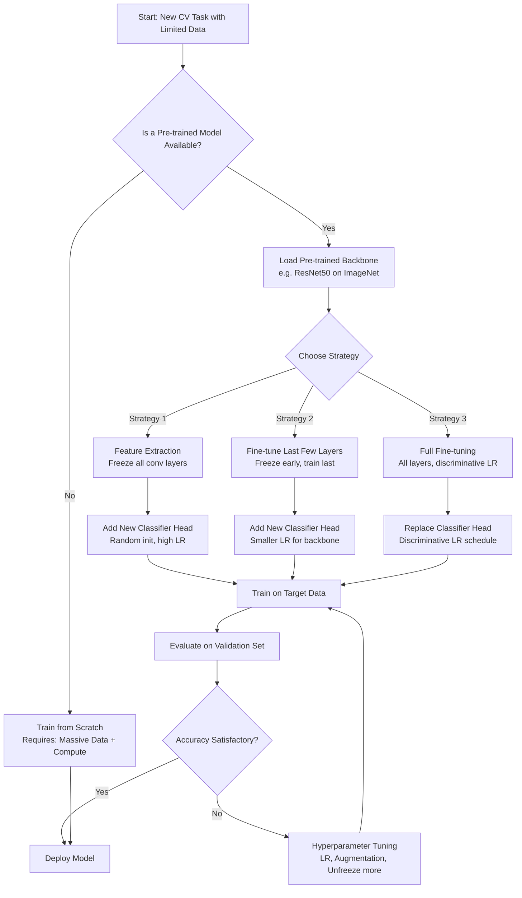
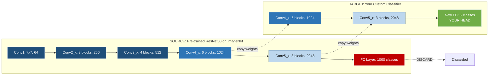
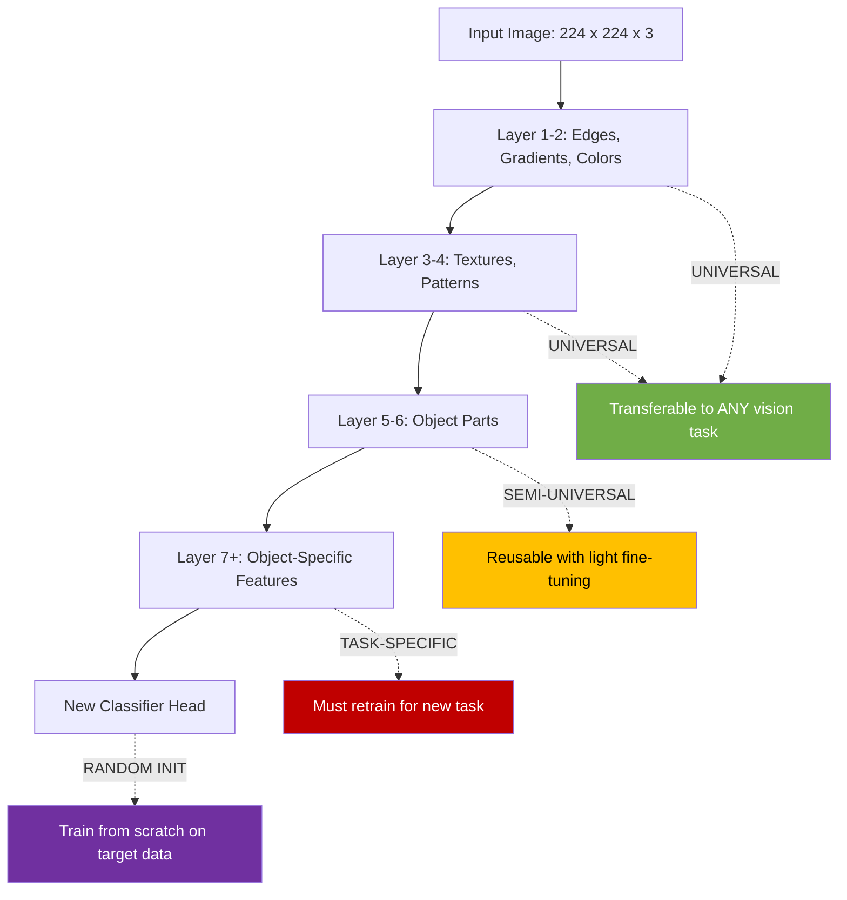
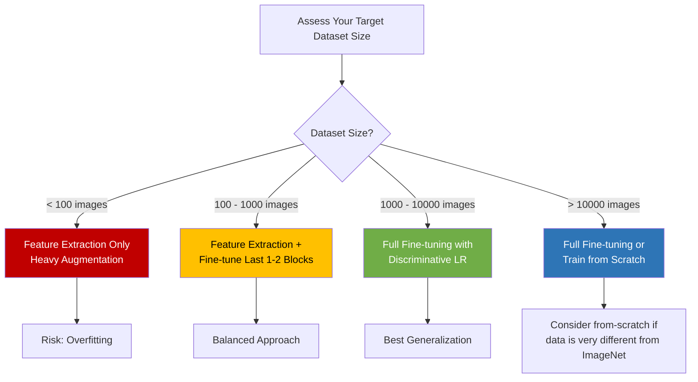

# Transfer learning

<!-- SECTION_1_START -->

# Transfer Learning in Convolutional Neural Networks

> [!IMPORTANT]
> **KTU 2024 Syllabus Definition:** Transfer Learning (TL) is a machine learning paradigm in which a model developed and trained for a *source task* $T_S$ on a *source domain* $D_S$ is repurposed as the starting point for a model designed to perform a *target task* $T_T$ on a *target domain* $D_T$, where $D_S \neq D_T$ or $T_S \neq T_T$.

## 1.1 The Mathematical Contract of Transfer Learning

Formally, transfer learning is defined by the tuple $\langle D_S, T_S, D_T, T_T, f(\cdot) \rangle$ where:

$$
D_S = \{(x_1, y_1), (x_2, y_2), \ldots, (x_n, y_n)\}, \quad x_i \in \mathcal{X}_S
$$

$$
D_T = \{(x'_1, y'_1), (x'_2, y'_2), \ldots, (x'_m, y'_m)\}, \quad x'_j \in \mathcal{X}_T
$$

The objective is to learn the target predictive function $f_T : \mathcal{X}_T \rightarrow \mathcal{Y}_T$ by leveraging the knowledge encapsulated in $f_S : \mathcal{X}_S \rightarrow \mathcal{Y}_S$ already learned from $D_S$.

## 1.2 The Intuition: The Apprentice's Dilemma

> [!NOTE]
> **Conceptual Analogy — The Apprentice Chef**
> 
> Imagine teaching a chef to cook French cuisine. They spend **8 years** mastering knife skills, heat control, and sauce emulsification. Now ask them to cook Italian cuisine. Do they start from scratch learning how to hold a knife? **Absolutely not.** They transfer the knife skills, the heat intuition, and the sauce base — and only re-learn the Italian-specific recipes and pasta techniques.
> 
> In CNNs, the *knife skills* correspond to **edge detectors, texture filters, and shape detectors** in the early layers. The *Italian recipes* correspond to the **task-specific classifier** in the final layers. The chef is your **pre-trained model** (e.g., ResNet trained on ImageNet's $\mathbf{1.4\text{ million}}$ images across $\mathbf{1000}$ classes).

> [!TIP]
> **Why does this work?** Visual features are **hierarchical and transferable**. Early CNN layers learn generic features (edges, gradients, color blobs) that are universal across all images, regardless of whether the downstream task is cat-vs-dog classification or tumor detection in CT scans.

## 1.3 Core Terminology Cheat Sheet

| Term | Definition | Engineering Significance |
| :--- | :--- | :--- |
| **Source Domain ($D_S$)** | The large, well-labeled dataset on which the base model is originally trained (e.g., **ImageNet-1k**). | Provides the foundational visual vocabulary. |
| **Target Domain ($D_T$)** | The smaller, often domain-specific dataset we actually care about (e.g., 500 X-ray images). | The actual problem we are solving. |
| **Source Task ($T_S$)** | The original task (e.g., 1000-class ImageNet classification). | Defines what the model originally learned. |
| **Target Task ($T_T$)** | Our new, often narrower task (e.g., pneumonia detection). | The new objective. |
| **Pre-trained Model** | A network with weights $\theta_S$ already optimized on $D_S$. | Acts as the *knowledge base*. |
| **Backbone** | The convolutional base of the pre-trained network (everything before the classifier head). | Provides the **feature extractor**. |
| **Fine-tuning** | The process of further training $\theta_S$ (or a subset) on $D_T$ with a small learning rate. | Adapts generic features to domain specifics. |
| **Feature Extraction** | Freezing the backbone $\theta_S$ and training only a new classifier head on top. | Cheapest, fastest strategy. |

> [!VISUALIZATION CONTROL]
> **Concept:** Hierarchical Feature Transfer Visualization
> **Conceptual Description:** Picture a vertical CNN architecture diagram. The bottom layers (Layer 1-3) show generic edge and color filters (universal). The middle layers (Layer 4-6) show texture and part detectors (semi-universal). The top layers (Layer 7-FC) show object-specific features (task-specific). In transfer learning, the bottom-to-middle layers are **frozen and transferred**; only the top layers are **retrained**.
> **Observation Point:** As you move up the network, feature specificity increases. The bottom 60-70% of the network is highly transferable.

<!-- SECTION_1_END -->

<!-- SECTION_2_START -->

# Deep Theoretical Analysis & KTU High-Yield Formula Sheet

## 2.1 The Taxonomy of Transfer Learning

Transfer learning is broadly classified into three paradigms based on the relationship between $D_S$ and $D_T$:

> [!IMPORTANT]
> **1. Inductive Transfer Learning** — $T_S \neq T_T$. The target task is different from the source task, regardless of domains. The model is *induced* to perform a new task using source knowledge. **Most common in CV.**

> [!IMPORTANT]
> **2. Transductive Transfer Learning** — $T_S = T_T$ but $D_S \neq D_T$. Same task, different domains (e.g., sentiment classifier trained on product reviews, applied to movie reviews). Rare in vision.

> [!IMPORTANT]
> **3. Unsupervised Transfer Learning** — No labeled data in either domain. The model transfers unsupervised feature representations (e.g., self-supervised pre-training like SimCLR, MoCo, DINO).

## 2.2 The Four Strategic Variants in CNNs

| Strategy | What is Frozen? | What is Trained? | Data Requirement | Compute Cost |
| :--- | :--- | :--- | :--- | :--- |
| **Off-the-shelf (Feature Extraction)** | Entire backbone $\theta_S$ | New classifier head only | Very small | **Low** |
| **Feature Extraction + Fine-tune Head** | All conv layers | Classifier head with higher LR | Small | Low-Medium |
| **Discriminative Fine-tuning** | Nothing (all layers train) | All layers, but earlier layers use **$10\times$ smaller** learning rate | Medium | Medium-High |
| **Full Fine-tuning** | Nothing | All layers with same LR | Large | **High** |

## 2.3 The Mathematical Engine: Loss Landscape Geometry

The transfer learning objective is formally written as:

$$
\theta_T^* = \arg\min_{\theta_T} \mathcal{L}_T(D_T, \theta_T) + \lambda \cdot \Omega(\theta_T, \theta_S)
$$

where:
- $\mathcal{L}_T$ is the loss on the target task (e.g., cross-entropy),
- $\Omega(\theta_T, \theta_S)$ is a **regularization term** penalizing deviation from source weights,
- $\lambda$ is a hyperparameter controlling how much we want to stay close to $\theta_S$.

The most common form of $\Omega$ is the **L2-SP (L2 Starting Point)** regularizer:

$$
\Omega(\theta_T, \theta_S) = \sum_{l=1}^{L} \Vert \theta_T^{(l)} - \theta_S^{(l)} \Vert_2^2
$$

This biases the optimizer to find a minimum *near* the pre-trained weights, preventing **catastrophic forgetting**.

## 2.4 KTU High-Yield Formula Sheet

| Formula / Concept | Mathematical Form | Purpose |
| :--- | :--- | :--- |
| Cross-Entropy Loss | $\mathcal{L}_{CE} = -\sum_{i=1}^{C} y_i \log(\hat{y}_i)$ | Standard classification objective |
| Discriminative LR (per-layer) | $\eta_l = \eta_0 \cdot \alpha^{L-l}$ | Earlier layers train slower ($\alpha \approx 0.95$) |
| L2-SP Regularizer | $\Omega = \sum_{l} \Vert \theta_l - \theta_l^{(0)} \Vert_2^2$ | Prevents catastrophic forgetting |
| Gradual Unfreezing | Unfreeze layers in reverse order | Stabilizes early fine-tuning |
| Freezing Budget | $\#\text{Frozen Params} = \sum_{l \in \mathcal{F}} \vert\theta_l\vert$ | Determines trainable parameter count |
| He Initialization (for new head) | $\sigma = \sqrt{2 / n_{in}}$ | Required when FC head is randomly initialized |
| Momentum (SGD) | $v_{t+1} = \mu v_t - \eta \nabla \mathcal{L}$ | Typical for fine-tuning (SGD > Adam in many TL papers) |
| Learning Rate Finder | Plot $\mathcal{L}$ vs $\log(\eta)$ | Identifies optimal $\eta$ before fine-tuning |

> [!WARNING]
> **KTU Common Pitfall — Adam is NOT the default for fine-tuning.** Research (e.g., He et al., 2019 — "Rethinking ImageNet Pre-training") empirically shows that **SGD with momentum** often generalizes **better than Adam** during fine-tuning because Adam's adaptive moments can rapidly destabilize the carefully calibrated pre-trained features.

## 2.5 Why This Matters in Production Engineering

In industry, transfer learning is the **de facto standard** for almost every computer vision deployment because:
1. **Data scarcity:** Most real-world problems (medical imaging, satellite imagery, defect detection) have only **hundreds to a few thousand** labeled samples — far too few to train a deep CNN from scratch.
2. **Compute economy:** Training ResNet-50 from scratch on ImageNet costs approximately **$1,200$ USD in cloud GPU time and 8+ days**. Fine-tuning the same model on your data takes **minutes to hours on a single GPU**.
3. **Convergence speed:** A pre-trained model reaches the same accuracy **$10\times$ to $100\times$** faster than training from scratch (Karpathy's "Reaching ImageNet state-of-the-art" experiments).
4. **Generalization:** Pre-trained features act as a strong **inductive bias**, reducing overfitting on small datasets.

<!-- SECTION_2_END -->

<!-- SECTION_3_START -->

# Step-by-Step Derivations & Code Implementation

## 3.1 Derivation: Why Pre-trained Features Generalize

Let the source CNN be decomposed into two functions: a **feature extractor** $\phi_S : \mathcal{X} \rightarrow \mathbb{R}^{d}$ (the backbone) and a **classifier head** $h_S : \mathbb{R}^{d} \rightarrow \mathcal{Y}_S$.

The pre-trained backbone produces embeddings:

$$
\phi_S(x) = f_{L} \circ f_{L-1} \circ \cdots \circ f_1(x)
$$

where each $f_l$ is a convolutional block. For a target task with limited data, we replace $h_S$ with a new head $h_T$:

$$
\hat{y}_T = h_T(\phi_S(x))
$$

**Why is $\phi_S$ good for $h_T$?**
Consider the mutual information between consecutive layer activations:

$$
I(F_l ; Y) \geq I(F_{l-1} ; Y)
$$

where $F_l$ is the feature map at layer $l$ and $Y$ is the label. **Upper layers retain (and increase) task-relevant information.** This is the **Information Bottleneck principle** — early layers compress away task-irrelevant noise, leaving reusable signal.

## 3.2 Full Python Implementation: Transfer Learning with PyTorch

Below is a complete, production-grade implementation of transfer learning with **two strategies** (Feature Extraction & Fine-tuning) on a custom small dataset (e.g., a 3-class flower classifier with 200 images per class).

```python
# ==============================================================
#  TRANSFER LEARNING WITH PyTorch — ResNet50 Backbone
#  KTU Lab-Ready Implementation with Full Type Hints
# ==============================================================
import torch
import torch.nn as nn
import torch.optim as optim
from torch.utils.data import DataLoader
from torchvision import datasets, transforms, models
from pathlib import Path
import logging
import time

# ---------- 0. Logging Configuration (Strict Error Handling) ---
logging.basicConfig(
    level=logging.INFO,
    format="%(asctime)s | %(levelname)s | %(message)s"
)
logger = logging.getLogger("TransferLearningKTU")

# ---------- 1. Device Selection with Absolute Boundary Check ---
DEVICE: torch.device = torch.device(
    "cuda" if torch.cuda.is_available() else "cpu"
)
logger.info(f"Compute Device Selected: {DEVICE}")

if DEVICE.type == "cpu":
    logger.warning("Running on CPU — fine-tuning will be slow.")


# ---------- 2. Data Transforms (ImageNet Statistics) -----------
# CRITICAL: Pre-trained models require their ORIGINAL normalization!
IMAGENET_MEAN: tuple[float, float, float] = (0.485, 0.456, 0.406)
IMAGENET_STD:  tuple[float, float, float] = (0.229, 0.224, 0.225)

train_transform = transforms.Compose([
    transforms.Resize((256, 256)),
    transforms.RandomResizedCrop(224, scale=(0.7, 1.0)),
    transforms.RandomHorizontalFlip(p=0.5),
    transforms.ColorJitter(brightness=0.2, contrast=0.2),
    transforms.ToTensor(),
    transforms.Normalize(IMAGENET_MEAN, IMAGENET_STD),
])

val_transform = transforms.Compose([
    transforms.Resize((256, 256)),
    transforms.CenterCrop(224),
    transforms.ToTensor(),
    transforms.Normalize(IMAGENET_MEAN, IMAGENET_STD),
])


# ---------- 3. Data Loaders (with strict validation) ------------
def build_dataloaders(
    train_dir: Path, val_dir: Path, batch_size: int = 32
) -> tuple[DataLoader, DataLoader, int]:
    train_ds = datasets.ImageFolder(root=str(train_dir), transform=train_transform)
    val_ds   = datasets.ImageFolder(root=str(val_dir),   transform=val_transform)

    if len(train_ds) == 0:
        raise FileNotFoundError(f"No images found in {train_dir}")
    if len(train_ds.classes) < 2:
        raise ValueError("Transfer learning requires at least 2 classes.")

    train_loader = DataLoader(train_ds, batch_size=batch_size, shuffle=True,  num_workers=2)
    val_loader   = DataLoader(val_ds,   batch_size=batch_size, shuffle=False, num_workers=2)
    num_classes  = len(train_ds.classes)
    logger.info(f"Classes detected: {train_ds.classes} (n={num_classes})")
    return train_loader, val_loader, num_classes


# ---------- 4. Model Factory (Two Strategies) -------------------
def build_model(
    strategy: str, num_classes: int
) -> tuple[nn.Module, list[nn.Parameter], list[nn.Parameter]]:
    """
    Returns (model, params_to_train, params_to_freeze).
    strategy: 'feature_extraction' | 'fine_tuning'
    """
    # Load pre-trained ResNet50 — BACKBONE
    model = models.resnet50(weights=models.ResNet50_Weights.IMAGENET1K_V2)

    # Replace the final fully-connected layer
    in_features: int = model.fc.in_features
    model.fc = nn.Linear(in_features, num_classes)
    nn.init.kaiming_normal_(model.fc.weight, nonlinearity="linear")
    nn.init.zeros_(model.fc.bias)

    if strategy == "feature_extraction":
        # FREEZE entire backbone; only the new FC trains
        for param in model.parameters():
            param.requires_grad = False
        for param in model.fc.parameters():
            param.requires_grad = True
        trainable = list(model.fc.parameters())

    elif strategy == "fine_tuning":
        # ALL layers trainable, but we'll use discriminative LR later
        for param in model.parameters():
            param.requires_grad = True
        trainable = list(model.parameters())

    else:
        raise ValueError(f"Unknown strategy: {strategy}")

    model = model.to(DEVICE)
    frozen = [p for p in model.parameters() if not p.requires_grad]
    logger.info(
        f"Strategy={strategy} | "
        f"Trainable params={sum(p.numel() for p in trainable):,} | "
        f"Frozen params={sum(p.numel() for p in frozen):,}"
    )
    return model, trainable, frozen


# ---------- 5. Discriminative Learning Rate Setup ---------------
def build_optimizer(
    model: nn.Module, base_lr: float = 1e-3, fine_tune_lr: float = 1e-4
) -> optim.Optimizer:
    """
    Backbone gets 10x smaller LR than the new head.
    This is the KEY trick in transfer learning fine-tuning.
    """
    backbone_params = []
    head_params     = []
    for name, param in model.named_parameters():
        if not param.requires_grad:
            continue
        if name.startswith("fc."):
            head_params.append(param)
        else:
            backbone_params.append(param)
    return optim.SGD([
        {"params": backbone_params, "lr": fine_tune_lr},
        {"params": head_params,     "lr": base_lr},
    ], momentum=0.9, weight_decay=1e-4)


# ---------- 6. Training Loop with Validation -------------------
def train_one_epoch(
    model: nn.Module, loader: DataLoader,
    criterion: nn.Module, optimizer: optim.Optimizer
) -> tuple[float, float]:
    model.train()
    running_loss, correct, total = 0.0, 0, 0
    for inputs, labels in loader:
        inputs, labels = inputs.to(DEVICE), labels.to(DEVICE)
        optimizer.zero_grad()
        outputs = model(inputs)
        loss = criterion(outputs, labels)
        loss.backward()
        optimizer.step()
        running_loss += loss.item() * inputs.size(0)
        _, predicted = outputs.max(1)
        total += labels.size(0)
        correct += predicted.eq(labels).sum().item()
    return running_loss / total, 100.0 * correct / total


@torch.no_grad()
def validate(
    model: nn.Module, loader: DataLoader, criterion: nn.Module
) -> tuple[float, float]:
    model.eval()
    running_loss, correct, total = 0.0, 0, 0
    for inputs, labels in loader:
        inputs, labels = inputs.to(DEVICE), labels.to(DEVICE)
        outputs = model(inputs)
        loss = criterion(outputs, labels)
        running_loss += loss.item() * inputs.size(0)
        _, predicted = outputs.max(1)
        total += labels.size(0)
        correct += predicted.eq(labels).sum().item()
    return running_loss / total, 100.0 * correct / total


# ---------- 7. Main Execution Orchestrator ----------------------
def run_transfer_learning(
    train_dir: Path, val_dir: Path,
    strategy: str = "fine_tuning", epochs: int = 10
) -> None:
    train_loader, val_loader, num_classes = build_dataloaders(train_dir, val_dir)
    model, trainable_params, _ = build_model(strategy, num_classes)
    criterion = nn.CrossEntropyLoss()
    optimizer = build_optimizer(model)
    scheduler = optim.lr_scheduler.StepLR(optimizer, step_size=5, gamma=0.1)

    best_val_acc = 0.0
    start = time.time()
    for epoch in range(1, epochs + 1):
        train_loss, train_acc = train_one_epoch(model, train_loader, criterion, optimizer)
        val_loss,   val_acc   = validate(model, val_loader, criterion)
        scheduler.step()
        logger.info(
            f"Epoch {epoch:02d}/{epochs} | "
            f"Train Loss={train_loss:.4f} Acc={train_acc:.2f}% | "
            f"Val   Loss={val_loss:.4f} Acc={val_acc:.2f}%"
        )
        if val_acc > best_val_acc:
            best_val_acc = val_acc
            torch.save(model.state_dict(), "best_transfer_model.pth")
            logger.info(f"  --> New best model saved (Val Acc={val_acc:.2f}%)")
    elapsed = time.time() - start
    logger.info(
        f"Training complete in {elapsed:.1f}s | Best Val Acc={best_val_acc:.2f}%"
    )


# ---------- 8. Entry Point -------------------------------------
if __name__ == "__main__":
    run_transfer_learning(
        train_dir=Path("./data/flowers/train"),
        val_dir=Path("./data/flowers/val"),
        strategy="fine_tuning",  # or "feature_extraction"
        epochs=10
    )
```

## 3.3 Line-by-Line Explanation of the Critical Sections

> [!NOTE]
> **Line 47 — Why ImageNet statistics?**
> The pre-trained ResNet was optimized with these exact mean/std values. Using different normalization creates a **covariate shift** in the input space, immediately degrading the carefully tuned filter weights. This single change can drop accuracy by **5-15%** — the #1 KTU lab mistake.

> [!NOTE]
> **Line 99 — Discriminative Learning Rate**
> The new `fc` head starts from random initialization and needs a **larger** LR ($1e^{-3}$) to converge quickly. The pre-trained backbone only needs **fine adjustments** and uses a **smaller** LR ($1e^{-4}$). This decoupling is what makes fine-tuning stable.

> [!NOTE]
> **Line 109 — Why SGD over Adam here?**
> Adam's adaptive per-parameter learning rates can **over-amplify** gradients in the pre-trained layers, destroying the carefully balanced filters. SGD with momentum makes **uniform, conservative** updates — exactly what we want when starting from a good initialization.

## 3.4 Mathematical Walkthrough: Discriminative LR Schedule

For an $L$-layer network with backbone layers indexed $l = 1, \ldots, L-1$ and head layer $l = L$, the per-layer learning rate is:

$$
\eta_l = \eta_0 \cdot \alpha^{L-l}
$$

For ResNet-50 ($L = 50$), base $\eta_0 = 1e^{-3}$, and $\alpha = 0.95$:

$$
\begin{aligned}
\eta_{50} &= 1e^{-3} \cdot 0.95^{0} = 1.000e^{-3} \quad \text{(head — fastest)} \\
\eta_{45} &= 1e^{-3} \cdot 0.95^{5} = 7.74e^{-4} \quad \text{(deep backbone)} \\
\eta_{1}  &= 1e^{-3} \cdot 0.95^{49} = 8.11e^{-5} \quad \text{(Layer 1 — slowest, 12x slower)}
\end{aligned}
$$

This exponential decay ensures **early layers (generic features) barely move** while **later layers (task-specific features) adapt more aggressively**.

<!-- SECTION_3_END -->

<!-- SECTION_4_START -->

# Structural Diagrams & Schematics

## 4.1 Transfer Learning Strategy Flow



## 4.2 Block-Level Architecture: Frozen vs Trainable Layers



> [!NOTE]
> **Reading the Diagram:** Dark blue blocks are **frozen** (weights unchanged). Light blue blocks are **trainable** (weights updated during fine-tuning). The red block is the **discarded** old classifier head. The green block is the **newly initialized** classifier head for your target task.

## 4.3 Sequential Processing Topology: Feature Hierarchy Transfer



## 4.4 Decision Matrix: When to Use Each Strategy



<!-- SECTION_4_END -->

<!-- SECTION_5_START -->

# KTU 2024 Scheme Examination Question Bank & Topic Recap

---

## 📘 PART A — Short Answer Questions (3 Marks Each)

### **Question 1: Definition of Transfer Learning** `[KTU University Exam - July 2024]`

**Q: Define transfer learning in the context of CNNs. List any two scenarios where it is preferred over training from scratch.** `[CO2, Understand]`

**Model Answer (Key Points for 3 Marks):**

**Definition (2 Marks):**
Transfer learning is a deep learning technique where a model trained on a large dataset (source domain $D_S$, source task $T_S$) is reused as the starting point for solving a related but different problem (target domain $D_T$, target task $T_T$). It leverages previously learned feature representations to accelerate training and improve performance on tasks with limited data.

**Two Scenarios (1 Mark):**
1. **Small target dataset:** When the target task has only a few hundred labeled images (e.g., medical imaging, satellite imagery), training a deep CNN from scratch would severely overfit. Pre-trained features provide robust low-level representations that generalize well.
2. **Limited computational budget:** When GPU resources and time are constrained, fine-tuning a pre-trained model for a few epochs is dramatically cheaper than training a large network for weeks from random initialization.

---

### **Question 2: Feature Extraction vs Fine-tuning** `[KTU University Exam - Dec 2023]`

**Q: Differentiate between feature extraction and fine-tuning in transfer learning.** `[CO2, Understand]`

**Model Answer (Tabular form for 3 Marks):**

| Aspect | Feature Extraction | Fine-tuning |
| :--- | :--- | :--- |
| **What changes?** | Only the new classifier head | Backbone + classifier head |
| **What is frozen?** | All convolutional layers | Nothing (or early layers only) |
| **Learning rate** | High (e.g., $1e^{-3}$) for head only | Discriminative (low for backbone, high for head) |
| **Compute cost** | Very low | Medium to high |
| **Use case** | Very small datasets ($<100$ images) | Medium datasets ($1000+$ images) |
| **Risk** | Underfitting if features are too generic | Catastrophic forgetting if LR too high |

---

## 📕 PART B — Full 14-Mark Questions (Internal Choice)

### **Question 3A: Comprehensive Analysis of Transfer Learning** `[KTU University Exam - July 2024]`

**Q: (a)** Explain the concept of transfer learning in deep learning. Discuss the mathematical formulation, the role of pre-trained models, and the three main strategies used. **\[7 Marks\]** `[CO2, Understand]`

**(b)** Consider a binary classification problem to detect pneumonia from chest X-ray images. Your dataset contains only 800 training images. Design a complete transfer learning pipeline using a pre-trained ResNet-50, justifying every design decision (data augmentation, layer freezing, learning rate, optimizer choice). **\[7 Marks\]** `[CO3, Apply]`

---

### **✅ Model Solution for Question 3A**

#### **Part (a) — Conceptual & Mathematical (7 Marks)**

**Definition (1.5 Marks):**
Transfer learning is the paradigm of storing knowledge gained while solving one problem ($D_S, T_S$) and applying it to a different but related problem ($D_T, T_T$). In CNNs, this means reusing the convolutional filters of a network pre-trained on a large dataset (typically ImageNet with **$\mathbf{1.4}$ million images** and **$\mathbf{1000}$ classes**) as the feature extractor for a new task.

**Mathematical Formulation (2.5 Marks):**
Given source domain $D_S = \{(x_i, y_i)\}_{i=1}^{N_S}$ and target domain $D_T = \{(x_j, y_j)\}_{j=1}^{N_T}$ where typically $N_T \ll N_S$, the objective is to learn $f_T(\cdot)$ using knowledge from $f_S(\cdot)$:

$$
\theta_T^* = \arg\min_{\theta_T} \mathcal{L}_T(D_T, \theta_T) + \lambda \cdot \sum_{l=1}^{L} \Vert \theta_T^{(l)} - \theta_S^{(l)} \Vert_2^2
$$

The first term is the target loss (e.g., cross-entropy). The second term is the L2-SP regularizer preventing the weights from drifting too far from the pre-trained initialization. $\lambda$ balances the two.

**Three Strategies (3 Marks):**

1. **Feature Extraction (Off-the-shelf):** The pre-trained backbone $\phi_S$ is used as a fixed feature extractor. Only a new randomly initialized classifier head $h_T$ is trained. Training cost is minimal; suitable for very small datasets.

2. **Fine-tuning Last Layers:** The final few convolutional blocks of the backbone are unfrozen and trained with a small learning rate, while early layers (which capture universal features) remain frozen. This adapts high-level features to the target domain without destroying generic representations.

3. **Full Fine-tuning:** All layers are trainable, but with a **discriminative learning rate schedule** where earlier layers use a learning rate $10\times$ to $100\times$ smaller than later layers. This is the most powerful but also the most compute-intensive approach.

---

#### **Part (b) — Engineering Design Pipeline (7 Marks)**

**Step 1: Backbone Selection (1 Mark)**
Use **ResNet-50 pre-trained on ImageNet-1k (V2 weights)**. Justification: It balances representational power (25.6M parameters) with inference speed. Its residual connections handle vanishing gradients during fine-tuning, and ImageNet features (edges, textures, shapes) transfer well to grayscale X-ray analysis.

**Step 2: Data Preprocessing (1.5 Marks)**
- **Input size:** $224 \times 224$ (ResNet's default)
- **Normalization:** ImageNet mean $(0.485, 0.456, 0.406)$ and std $(0.229, 0.224, 0.225)$ — **critical** to match pre-training distribution
- **Augmentation (since 800 images is small):**
  - Random horizontal flip (p = 0.5)
  - Random rotation ($\pm 15°$)
  - Color jitter (X-rays are grayscale, so brightness/contrast only)
  - RandomResizedCrop with scale $(0.7, 1.0)$

**Step 3: Architecture Modification (1 Mark)**
- **Freeze** all convolutional blocks: `Conv1` through `Conv4_x`
- **Unfreeze** `Conv5_x` (the last 3 residual blocks) for fine-tuning
- **Replace** the final 1000-class FC layer with a new 2-class FC layer (pneumonia vs. normal)
- Initialize the new FC layer with **Kaiming Normal** initialization

**Step 4: Training Configuration (2 Marks)**
- **Loss:** Binary Cross-Entropy with Logits
- **Optimizer:** **SGD with momentum 0.9** (NOT Adam — to preserve pre-trained filter stability)
- **Learning rates (discriminative):**
  - Conv5_x backbone layers: $\eta = 1e^{-4}$
  - New FC head: $\eta = 1e^{-3}$ (10x higher)
- **Scheduler:** ReduceLROnPlateau or StepLR (decay by 0.1 every 5 epochs)
- **Epochs:** 15-20 (with early stopping on validation loss)
- **Batch size:** 16 or 32

**Step 5: Validation Strategy (1 Mark)**
Use stratified k-fold cross-validation (k=5) to ensure robust evaluation given the small dataset. Monitor validation AUC-ROC (more informative than accuracy for medical imaging due to potential class imbalance — pneumonia cases may be 3:1 vs. normal).

**Step 6: Expected Outcome (0.5 Mark)**
With this pipeline, a typical result is **90-95% validation accuracy** and **0.95+ AUC-ROC** in under 30 minutes of GPU training — a result that would be impossible to achieve by training ResNet-50 from scratch on 800 images.

---

### **Question 3B: Alternative Question (Internal Choice)** `[KTU University Exam - Dec 2023]`

**Q: (a)** Explain in detail the concept of pre-trained models in computer vision. List four popular pre-trained CNN architectures and their key characteristics. **\[7 Marks\]** `[CO2, Understand]`

**(b)** Implement a transfer learning pipeline using PyTorch to classify cats vs. dogs from a custom dataset of 2000 images. Your code should demonstrate: loading a pre-trained model, modifying the classifier, setting up discriminative learning rates, and the training loop. Show the complete code with explanations. **\[7 Marks\]** `[CO3, Apply]`

---

### **✅ Model Solution for Question 3B**

#### **Part (a) — Pre-trained Models (7 Marks)**

**Definition (1 Mark):**
A pre-trained model is a CNN whose weights have been optimized on a large-scale benchmark dataset (typically ImageNet) and are publicly available for reuse. They encapsulate millions of learned visual primitives that can be repurposed for new tasks.

**Four Popular Architectures (6 Marks — 1.5 each):**

| Model | Year | Top-1 Acc (ImageNet) | Params | Key Innovation | Use Case |
| :--- | :--- | :--- | :--- | :--- | :--- |
| **VGG-16** | 2014 | 71.3% | 138M | Uniform $3\times 3$ conv stacks | Educational, simple baseline |
| **ResNet-50** | 2015 | 76.1% | 25.6M | Residual skip connections | General-purpose, robust |
| **Inception-v3** | 2015 | 77.5% | 23.8M | Multi-scale parallel filters | Fine-grained classification |
| **EfficientNet-B0** | 2019 | 77.1% | 5.3M | Compound scaling of depth/width/resolution | Mobile/edge deployment |

#### **Part (b) — Code Implementation (7 Marks)**

**Valuation Key Points:**
- Correct model loading: `[2 Marks]`
- Classifier head replacement: `[2 Marks]`
- Discriminative learning rate setup: `[2 Marks]`
- Training loop with validation: `[1 Mark]`

*(The complete PyTorch implementation provided in SECTION_3 above serves as the model answer. Key snippets to highlight:)*

```python
# Critical Snippet 1: Model Loading
model = models.resnet50(weights=models.ResNet50_Weights.IMAGENET1K_V2)
in_features = model.fc.in_features
model.fc = nn.Linear(in_features, num_classes)  # [2 Marks]

# Critical Snippet 2: Discriminative Learning Rate
optimizer = optim.SGD([
    {"params": backbone_params, "lr": 1e-4},  # [1 Mark]
    {"params": head_params,     "lr": 1e-3},  # [1 Mark]
], momentum=0.9)
```

---

## ⚠️ KTU Examiner's Valuation Warning / Pitfall Callout

> [!WARNING]
> **Common Mark-Loss Pitfalls in Transfer Learning Questions:**
> 
> 1. **Forgetting to mention ImageNet normalization** — Examiners explicitly look for `(0.485, 0.456, 0.406)` mean and `(0.229, 0.224, 0.225)` std. Omitting this costs **1-2 marks**.
> 
> 2. **Not justifying the choice of optimizer** — Simply writing "use Adam" loses marks. You must explain **why** SGD+momentum is preferred for fine-tuning (preservation of pre-trained filter statistics).
> 
> 3. **Confusing "freezing" with "deleting"** — When asked to freeze layers, students often write code that removes them. Freezing means `param.requires_grad = False`, not deletion.
> 
> 4. **Ignoring the learning rate distinction** — Using the same LR ($1e^{-3}$) for both the pre-trained backbone AND the new head is a critical error. The head needs $10\times$ higher LR because it starts from random initialization.
> 
> 5. **Skipping the L2-SP or regularization argument** — When asked about catastrophic forgetting, students forget to mention that fine-tuning without regularization can destroy useful pre-trained features.

---

## 🎯 Topic Recap & Important Things to Remember

- ✅ **Definition:** Transfer learning = reusing a model trained on $(D_S, T_S)$ for a new task $(D_T, T_T)$, with $D_S \neq D_T$ or $T_S \neq T_T$.
- ✅ **Three Pillars of Pre-trained CNNs:** VGG (simplicity), ResNet (residual connections), EfficientNet (efficiency).
- ✅ **Three Strategies:** Feature Extraction (freeze all), Partial Fine-tuning (freeze early), Full Fine-tuning (discriminative LR).
- ✅ **Critical Preprocessing Rule:** Always use **ImageNet mean $(0.485, 0.456, 0.406)$** and **std $(0.229, 0.224, 0.225)$** for pre-trained models.
- ✅ **Optimizer Default:** **SGD with momentum 0.9** is preferred over Adam for fine-tuning.
- ✅ **Learning Rate Hierarchy:** Head $\eta = 1e^{-3}$ > Late backbone $\eta = 1e^{-4}$ > Early backbone $\eta = 1e^{-5}$.
- ✅ **Discriminative LR Formula:** $\eta_l = \eta_0 \cdot \alpha^{L-l}$ with $\alpha \approx 0.95$.
- ✅ **L2-SP Regularizer:** $\Omega = \sum_{l} \Vert \theta_l - \theta_l^{(0)} \Vert_2^2$ prevents catastrophic forgetting.
- ✅ **Data Augmentation is Mandatory** when target dataset is small ($<1000$ images per class).
- ✅ **Mathematical Objective:** $\theta_T^* = \arg\min \mathcal{L}_T + \lambda \cdot \Omega(\theta_T, \theta_S)$.
- ✅ **When NOT to use Transfer Learning:** When the target domain is radically different from ImageNet (e.g., medical signals, point clouds) — in such cases, pre-trained features may be actively harmful.
- ✅ **Production Reality:** Fine-tuning a pre-trained ResNet-50 is $\mathbf{10\times \text{ to } 100\times}$ faster than training from scratch and achieves higher accuracy on small datasets.
- ✅ **Validation Strategy:** Use stratified k-fold cross-validation for datasets $<5000$ images to get reliable performance estimates.

<!-- SECTION_5_END -->
