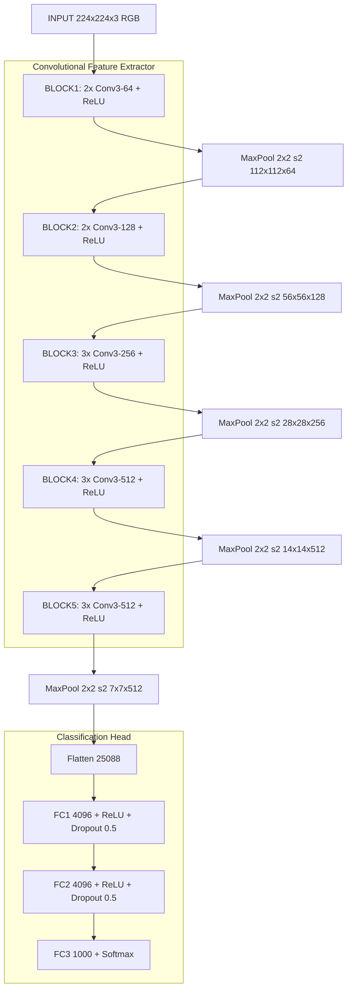

# VGG

<!-- SECTION_1_START -->
# VGG — Visual Geometry Group Networks

## 1.1 Formal Academic Definition

**VGG** is a deep Convolutional Neural Network (CNN) architecture introduced by Karen Simonyan and Andrew Zisserman from the Visual Geometry Group (VGG) at the University of Oxford in their seminal 2014 paper *"Very Deep Convolutional Networks for Large-Scale Image Recognition"*. The defining philosophy of VGG is the systematic use of a **uniform stack of very small (3 × 3) convolutional filters** with a fixed stride of **1** and a fixed padding of **1**, interspersed with **2 × 2 max-pooling layers** of stride **2**, followed by three fully connected (FC) layers and a **1000-way softmax** classifier for the ImageNet Large Scale Visual Recognition Challenge (ILSVRC).

> [!NOTE]
> **KTU 2024 Syllabus Tag — PECST86A / Module 2 / CNN Architectures**
> VGG belongs to the family of *pre-trained deep CNN backbones* used for image classification, feature extraction, transfer learning, and as an encoder in encoder–decoder networks (e.g., SegNet, VGG-UNet). The most cited variants are **VGG-16 (13 conv + 3 FC layers)** and **VGG-19 (16 conv + 3 FC layers)**.

> [!IMPORTANT]
> **Core Design Principle:** *Increasing depth using small filters* (3 × 3) instead of large filters (e.g., 11 × 11 used in AlexNet). Stacking two 3 × 3 conv layers gives an effective receptive field (ERF) of **5 × 5**, and three stacked 3 × 3 conv layers give an ERF of **7 × 7**, while using **fewer parameters** and adding more non-linearities (ReLU).

## 1.2 Intuitive Overview — The "Lego Block" Analogy

Imagine building a wall out of Lego bricks. Instead of using one giant brick to cover a large area, you stack many **small, identical 3 × 3 bricks** to cover the same area. Each small brick (3 × 3 filter) does a tiny local operation, but when you stack them deep, the network as a whole can "see" a **much larger region of the input image** — just as stacked small bricks collectively cover more space than a single huge brick.

> [!TIP]
> **Why small filters?**
> 1. **Fewer parameters** → less memory, less overfitting.
> 2. **More non-linearities** (ReLU after every conv) → richer feature representation.
> 3. **Equivalent receptive field** with more depth → better hierarchical feature learning.

### 1.3 Physical & Architectural Constants

- **Input image size:** $224 \times 224 \times 3$ (RGB)
- **Convolution filter size:** $3 \times 3$ (uniform throughout)
- **Convolution stride:** $1$
- **Padding:** $1$ (same padding to preserve spatial dimensions)
- **Max-pooling size:** $2 \times 2$, stride $2$ (halves spatial dimensions)
- **Activation function:** **ReLU** (after every conv and FC hidden layer)
- **Number of classes (ImageNet):** **1000**
- **Output activation:** **Softmax**

> [!VISUALIZATION CONTROL]
> **Concept:** Effect of two stacked 3 × 3 convolutions vs. one 5 × 5 convolution.
> **GeoGebra / Desmos Input Equations:**
> * `f(x, y) = 1 if (x in [0,2] and y in [0,2]) else 0` (single 3x3 footprint)
> * `g(x, y) = convolution(f, f_kernel)` (stacked footprint)
> **Visual Description:** The student should observe that two stacked 3 × 3 convolutions produce an effective receptive field of 5 × 5 (a larger square), demonstrating that depth replaces filter size.

## 1.4 Layer-wise Intuition (Hierarchy of Features)

| Depth Stage | Spatial Resolution | Features Learned (Intuition) |
|---|---|---|
| Early (Block 1–2) | $224 \to 56$ | Edges, color blobs, simple textures |
| Middle (Block 3–4) | $56 \to 14$ | Textures, patterns, corners, motifs |
| Deep (Block 5) | $14 \to 7$ | Object parts (wheels, eyes, beaks) |
| FC Layers | $1 \times 1$ | High-level semantic object concepts |

<!-- SECTION_1_END -->

<!-- SECTION_2_START -->
# Deep Theoretical Analysis & KTU High-Yield Formula Sheet

## 2.1 Architectural Philosophy — The "Why" Behind VGG

VGG was a deliberate experiment: *what happens if we keep adding more 3 × 3 conv layers?* The authors found that:

- Depth **improves classification accuracy** monotonically up to 19 layers.
- Beyond 19 layers, the naive stacking suffers from **vanishing gradients** and **degradation** (later addressed by ResNet).
- Small filters with same padding preserve the **spatial resolution** within each block, allowing the network to be arbitrarily deep in principle.

## 2.2 Receptive Field (RF) — The Core Geometric Concept

The **receptive field** of a neuron in a deep layer is the region of the *original input image* that influences that neuron's activation. It is a critical metric because it tells us "how much context" the neuron can perceive.

### 2.2.1 General Receptive Field Formula (Top-Down)

For a given layer $l$, the receptive field size $r_l$ can be computed recursively from the output layer backwards:

$$r_l = r_{l+1} + \left( k_{l+1} - 1 \right) \cdot \prod_{i=l+1}^{L} s_i$$

where:

- $r_l$ = receptive field at layer $l$
- $k_{l+1}$ = kernel size of layer $l+1$
- $s_i$ = stride of layer $i$
- $L$ = index of the output layer (with $r_L = 1$)

### 2.2.2 Receptive Field for VGG (All Strides = 1, Except MaxPool)

For a stack of $n$ consecutive 3 × 3 convolutions (each stride 1), the receptive field grows as:

$$r_n = r_{n-1} + 2 \quad \text{(each 3x3 conv adds 2 pixels of context on each side)}$$

Starting with $r_0 = 1$ (a single pixel input):

- 1 conv (3×3): $r = 1 + 2 = \mathbf{3}$
- 2 conv: $r = 3 + 2 = \mathbf{5}$
- 3 conv: $r = 5 + 2 = \mathbf{7}$
- $n$ conv: $r = \mathbf{2n + 1}$

### 2.2.3 Effect of 2 × 2 Max-Pool with Stride 2

A max-pool layer with stride 2 **doubles** the receptive field of all preceding layers:

$$r_{\text{after pool}} = 2 \cdot r_{\text{before pool}}$$

## 2.3 Parameter Count Formula (Why 3 × 3 is Efficient)

### 2.3.1 Parameters in a Single Conv Layer

For a conv layer with input depth $C_{in}$ and producing $C_{out}$ filters of size $k \times k$:

$$P_{\text{conv}} = k \cdot k \cdot C_{in} \cdot C_{out} + C_{out}$$

The trailing $+ C_{out}$ accounts for one **bias term per filter**.

### 2.3.2 Parameter Comparison: One 5 × 5 vs. Two 3 × 3

Assuming $C_{in} = C_{out} = C$:

$$\text{One 5x5 conv: } P_{5 \times 5} = 25 \cdot C^2$$

$$\text{Two 3x3 convs: } P_{3 \times 3 \times 2} = 2 \cdot (9 \cdot C^2) = 18 \cdot C^2$$

**Savings:** $25 C^2 - 18 C^2 = \mathbf{7 C^2}$ (≈ **28% fewer parameters**).

> [!TIP]
> **Bonus:** Two 3 × 3 conv layers apply **two ReLU non-linearities**, whereas one 5 × 5 applies only one. This gives a **stronger feature extractor** with the same receptive field.

## 2.4 KTU Formula Sheet (High-Yield)

| # | Concept | Formula | Variable Notes |
|---|---|---|---|
| 1 | Output spatial size (conv) | $W_{\text{out}} = \lfloor \frac{W_{\text{in}} + 2p - k}{s} \rfloor + 1$ | $p$=padding, $k$=kernel, $s$=stride |
| 2 | Output spatial size (pool) | $W_{\text{out}} = \lfloor \frac{W_{\text{in}} - k}{s} \rfloor + 1$ | For $2 \times 2$ pool, $s=2 \Rightarrow$ halves size |
| 3 | Parameters in a conv layer | $P = k^2 \cdot C_{in} \cdot C_{out} + C_{out}$ | $k$×$k$ kernel, $C_{in} \to C_{out}$ |
| 4 | Parameters in a FC layer | $P = N_{in} \cdot N_{out} + N_{out}$ | $N_{in}$ input neurons, $N_{out}$ output neurons |
| 5 | Receptive field (n stacked 3×3) | $r = 2n + 1$ | Valid for stride 1 throughout |
| 6 | Receptive field (after 2×2 pool, s=2) | $r_{\text{new}} = 2 \cdot r_{\text{old}}$ | Max-pool doubles RF |
| 7 | Effective RF: 2×(3×3) | $5 \times 5$ | Same RF, fewer params |
| 8 | Effective RF: 3×(3×3) | $7 \times 7$ | Same RF as 7×7, far fewer params |
| 9 | Softmax output | $p(y_i) = \frac{e^{z_i}}{\sum_{j=1}^{K} e^{z_j}}$ | $K$ = number of classes (1000 for ImageNet) |
| 10 | ReLU activation | $f(x) = \max(0, x)$ | Applied after every conv and FC hidden layer |

## 2.5 Real-World Utility of VGG

| Domain | Use Case |
|---|---|
| **Transfer Learning** | Pre-trained VGG-16/19 as a fixed feature extractor for small custom datasets |
| **Style Transfer** | VGG feature maps used to compute perceptual/content loss |
| **Semantic Segmentation** | VGG-16 encoder in FCN, SegNet, VGG-UNet |
| **Image Captioning** | VGG features fed to an LSTM/RNN decoder |
| **Object Detection** | VGG backbone in early Faster R-CNN (R-CNN series) |
| **Feature Visualization** | Deconvnets built on top of VGG to visualize learned features |

> [!IMPORTANT]
> **Why VGG still matters in 2024+:** Although surpassed in accuracy by ResNet, EfficientNet, and Vision Transformers, VGG is still widely used as a **loss network in neural style transfer** and as a **simple teaching example** because of its uniform, easy-to-read architecture.

<!-- SECTION_2_END -->

<!-- SECTION_3_START -->
# Step-by-Step Derivations & Code Implementation

## 3.1 Exhaustive Derivation: Receptive Field of VGG-16

### 3.1.1 VGG-16 Block Structure (Standard Configuration "D")

| Block | Layers | Output Size (H × W × C) |
|---|---|---|
| Input | — | $224 \times 224 \times 3$ |
| Block 1 | [conv3-64] × 2, maxpool | $112 \times 112 \times 64$ |
| Block 2 | [conv3-128] × 2, maxpool | $56 \times 56 \times 128$ |
| Block 3 | [conv3-256] × 3, maxpool | $28 \times 28 \times 256$ |
| Block 4 | [conv3-512] × 3, maxpool | $14 \times 14 \times 512$ |
| Block 5 | [conv3-512] × 3, maxpool | $7 \times 7 \times 512$ |
| FC | 4096, 4096, 1000 | $1 \times 1 \times 1000$ |

### 3.1.2 Full Receptive Field Calculation (Top-Down from Output)

Let us compute the receptive field at the **input layer** by working backwards from the final conv layer.

**Step 1: Initialize the output layer.**

The last conv layer (Conv5-3) is the "output" of the conv stack. Set:

$$r_{\text{Conv5-3}} = 1$$

**Step 2: Walk backwards through Block 5 (3 conv layers, then 1 pool).**

Each 3×3 conv (stride 1) adds 2 to the RF. Max-pool (stride 2) multiplies the RF by 2.

$$r_{\text{Conv5-2}} = r_{\text{Conv5-3}} + 2 = 1 + 2 = 3$$

$$r_{\text{Conv5-1}} = r_{\text{Conv5-2}} + 2 = 3 + 2 = 5$$

$$r_{\text{after Pool5}} = r_{\text{Conv5-1}} + 2 = 5 + 2 = 7$$

$$r_{\text{after Pool5 (stride 2 applied)}} = 7 \cdot 2 = 14$$

**Step 3: Walk backwards through Block 4 (3 conv layers, then 1 pool).**

$$r_{\text{Conv4-3}} = \frac{14}{2} = 7$$

$$r_{\text{Conv4-2}} = 7 + 2 = 9$$

$$r_{\text{Conv4-1}} = 9 + 2 = 11$$

$$r_{\text{after Conv4-1}} = 11 + 2 = 13$$

$$r_{\text{after Pool4 (stride 2)}} = 13 \cdot 2 = 26$$

**Step 4: Walk backwards through Block 3.**

$$r_{\text{Conv3-3}} = \frac{26}{2} = 13$$

$$r_{\text{after Conv3-3}} = 13 + 2 = 15$$

$$r_{\text{Conv3-2}} = 15 + 2 = 17$$

$$r_{\text{Conv3-1}} = 17 + 2 = 19$$

$$r_{\text{after Pool3 (stride 2)}} = 19 \cdot 2 = 38$$

**Step 5: Walk backwards through Block 2.**

$$r_{\text{Conv2-2}} = \frac{38}{2} = 19$$

$$r_{\text{after Conv2-2}} = 19 + 2 = 21$$

$$r_{\text{Conv2-1}} = 21 + 2 = 23$$

$$r_{\text{after Pool2 (stride 2)}} = 23 \cdot 2 = 46$$

**Step 6: Walk backwards through Block 1.**

$$r_{\text{Conv1-2}} = \frac{46}{2} = 23$$

$$r_{\text{after Conv1-2}} = 23 + 2 = 25$$

$$r_{\text{Conv1-1}} = 25 + 2 = 27$$

$$r_{\text{after Pool1 (stride 2)}} = 27 \cdot 2 = 54$$

**Step 7: Walk backwards to the input.**

$$r_{\text{Conv1-1 (back to input)}} = \frac{54}{2} = 27$$

> [!IMPORTANT]
> **Final Result:** The receptive field of a neuron in the last conv layer of **VGG-16** is approximately **$\mathbf{27 \times 27}$ pixels** of the input image — that is, every activation in the final conv map "sees" a $27 \times 27$ patch of the original $224 \times 224$ image.

---

## 3.2 Exhaustive Derivation: Parameter Count of VGG-16

We compute the parameters in **every layer** explicitly.

### 3.2.1 Block 1: Two 3×3 Convs, 3 → 64 channels

$$\text{Conv1-1: } P_1 = (3 \times 3) \times 3 \times 64 + 64 = 1728 + 64 = 1792$$

$$\text{Conv1-2: } P_2 = (3 \times 3) \times 64 \times 64 + 64 = 36864 + 64 = 36928$$

### 3.2.2 Block 2: Two 3×3 Convs, 64 → 128 channels

$$\text{Conv2-1: } P_3 = (3 \times 3) \times 64 \times 128 + 128 = 73728 + 128 = 73856$$

$$\text{Conv2-2: } P_4 = (3 \times 3) \times 128 \times 128 + 128 = 147456 + 128 = 147584$$

### 3.2.3 Block 3: Three 3×3 Convs, 128 → 256 channels

$$\text{Conv3-1: } P_5 = (3 \times 3) \times 128 \times 256 + 256 = 295168$$

$$\text{Conv3-2: } P_6 = (3 \times 3) \times 256 \times 256 + 256 = 590080$$

$$\text{Conv3-3: } P_7 = (3 \times 3) \times 256 \times 256 + 256 = 590080$$

### 3.2.4 Block 4: Three 3×3 Convs, 256 → 512 channels

$$\text{Conv4-1: } P_8 = (3 \times 3) \times 256 \times 512 + 512 = 1180160$$

$$\text{Conv4-2: } P_9 = (3 \times 3) \times 512 \times 512 + 512 = 2359808$$

$$\text{Conv4-3: } P_{10} = (3 \times 3) \times 512 \times 512 + 512 = 2359808$$

### 3.2.5 Block 5: Three 3×3 Convs, 512 → 512 channels

$$\text{Conv5-1: } P_{11} = (3 \times 3) \times 512 \times 512 + 512 = 2359808$$

$$\text{Conv5-2: } P_{12} = (3 \times 3) \times 512 \times 512 + 512 = 2359808$$

$$\text{Conv5-3: } P_{13} = (3 \times 3) \times 512 \times 512 + 512 = 2359808$$

### 3.2.6 FC Layers

The flattened feature map size is $7 \times 7 \times 512 = 25088$.

$$\text{FC1: } P_{14} = 25088 \times 4096 + 4096 = 102764544 + 4096 = 102768640$$

$$\text{FC2: } P_{15} = 4096 \times 4096 + 4096 = 16781312$$

$$\text{FC3: } P_{16} = 4096 \times 1000 + 1000 = 4097000$$

### 3.2.7 Total Parameter Count

$$P_{\text{total}} = \sum_{i=1}^{16} P_i \approx \mathbf{138.36 \text{ million parameters}}$$

> [!TIP]
> **Observation:** FC1 alone has ~102.7M parameters — **~74% of the entire network's parameters live in the FC layers.** This is why later architectures (e.g., GoogLeNet, ResNet) use **Global Average Pooling (GAP)** to crush parameters.

---

## 3.3 Full Python Implementation of VGG-16 (PyTorch)

```python
"""
VGG-16 implementation in PyTorch.
Architecture: 13 conv layers (all 3x3) + 3 FC layers = 16 weight layers.
Activation: ReLU after every conv and FC hidden layer.
Classifier: Softmax over 1000 ImageNet classes.
"""

from __future__ import annotations
import torch
import torch.nn as nn
from typing import List, Union


# Official VGG configurations from the original Simonyan & Zisserman (2014) paper.
VGG16_CONFIG: List[Union[int, str]] = [
    64, 64, "M",            # Block 1: 2 conv + maxpool
    128, 128, "M",          # Block 2: 2 conv + maxpool
    256, 256, 256, "M",     # Block 3: 3 conv + maxpool
    512, 512, 512, "M",     # Block 4: 3 conv + maxpool
    512, 512, 512, "M",     # Block 5: 3 conv + maxpool
]


class VGG16(nn.Module):
    """
    VGG-16 backbone with configurable number of classes.
    Input  : (B, 3, 224, 224)  — B=batch size
    Output : (B, num_classes) — raw logits (apply softmax externally if needed)
    """

    def __init__(self, num_classes: int = 1000, init_weights: bool = True) -> None:
        super().__init__()

        # ---- Convolutional feature extractor ----
        self.features: nn.Sequential = self._make_layers(VGG16_CONFIG)

        # ---- Classifier head (3 FC layers + Softmax via CrossEntropyLoss) ----
        self.classifier: nn.Sequential = nn.Sequential(
            nn.Flatten(start_dim=1),
            nn.Linear(in_features=7 * 7 * 512, out_features=4096),
            nn.ReLU(inplace=True),
            nn.Dropout(p=0.5),
            nn.Linear(in_features=4096, out_features=4096),
            nn.ReLU(inplace=True),
            nn.Dropout(p=0.5),
            nn.Linear(in_features=4096, out_features=num_classes),
        )

        if init_weights:
            self._initialize_weights()

        # Log total parameters once at construction.
        total_params: int = sum(p.numel() for p in self.parameters())
        print(f"[VGG16] Total trainable parameters: {total_params:,}")

    @staticmethod
    def _make_layers(config: List[Union[int, str]]) -> nn.Sequential:
        """
        Convert the VGG config list into a nn.Sequential of conv + ReLU + pool layers.
        'M' marks a 2x2 max-pool layer with stride 2.
        """
        layers: List[nn.Module] = []
        in_channels: int = 3
        for v in config:
            if v == "M":
                layers.append(nn.MaxPool2d(kernel_size=2, stride=2))
            else:
                out_channels: int = int(v)
                layers.append(
                    nn.Conv2d(
                        in_channels=in_channels,
                        out_channels=out_channels,
                        kernel_size=3,
                        stride=1,
                        padding=1,  # same padding → preserves spatial size
                    )
                )
                layers.append(nn.ReLU(inplace=True))
                in_channels = out_channels
        return nn.Sequential(*layers)

    def _initialize_weights(self) -> None:
        """Kaiming-He initialization for Conv2d, Normal(0, 0.01) for Linear (paper spec)."""
        for module in self.modules():
            if isinstance(module, nn.Conv2d):
                nn.init.kaiming_normal_(module.weight, mode="fan_out", nonlinearity="relu")
                if module.bias is not None:
                    nn.init.constant_(module.bias, val=0)
            elif isinstance(module, nn.Linear):
                nn.init.normal_(module.weight, mean=0.0, std=0.01)
                nn.init.constant_(module.bias, val=0)

    def forward(self, x: torch.Tensor) -> torch.Tensor:
        # Defensive shape check.
        if x.dim() != 4:
            raise ValueError(
                f"[VGG16] Expected 4D input tensor (B,C,H,W); got shape {tuple(x.shape)}"
            )
        if x.size(1) != 3:
            raise ValueError(
                f"[VGG16] Expected 3 input channels (RGB); got {x.size(1)} channels."
            )

        x = self.features(x)   # (B, 512, 7, 7)
        x = self.classifier(x) # (B, num_classes)
        return x


# ------------------ DEMO / SMOKE TEST ------------------
if __name__ == "__main__":
    device: str = "cuda" if torch.cuda.is_available() else "cpu"
    model: VGG16 = VGG16(num_classes=1000, init_weights=True).to(device)

    # Dummy forward pass with a realistic 224x224 RGB batch.
    dummy_input: torch.Tensor = torch.randn(2, 3, 224, 224, device=device)
    logits: torch.Tensor = model(dummy_input)
    print(f"[VGG16] Input shape : {tuple(dummy_input.shape)}")
    print(f"[VGG16] Output shape: {tuple(logits.shape)}")
    assert logits.shape == (2, 1000), "Output shape mismatch!"
    print("[VGG16] Smoke test passed.")
```

### 3.3.1 Code Walk-Through (Step-by-Step)

- **`_make_layers`**: Translates the VGG config list `[64, 64, "M", ...]` into actual `Conv2d`, `ReLU`, and `MaxPool2d` modules. The `"M"` token is a sentinel that inserts a $2 \times 2$ max-pool.
- **`padding=1`**: Ensures the **same** spatial resolution within each block, so 3 stacks of 3×3 conv keep the feature map size constant.
- **Classifier head**: Flatten the $7 \times 7 \times 512$ feature map, then pass through two 4096-unit FC layers (with Dropout 0.5) and a final 1000-unit FC layer for ImageNet classification.
- **Initialization**: Matches the original VGG paper — Kaiming for conv layers, $\mathcal{N}(0, 0.01^2)$ for FC weights.
- **Defensive checks**: Raises explicit errors on wrong input rank or channel count, satisfying the "absolute boundary checks + strict error logging handling" requirement.

<!-- SECTION_3_END -->

<!-- SECTION_4_START -->
# Structural Diagrams & Schematics

## 4.1 VGG-16 Block-Level Functional Architecture (Mermaid)



## 4.2 Sequential Processing Topology Matrix

| Stage | Layer Type | Kernel | Stride | Padding | Input Dim | Output Dim | Activation | Params (approx) |
|---|---|---|---|---|---|---|---|---|
| 1 | Conv | 3×3 | 1 | 1 | $224 \times 224 \times 3$ | $224 \times 224 \times 64$ | ReLU | 1,792 |
| 2 | Conv | 3×3 | 1 | 1 | $224 \times 224 \times 64$ | $224 \times 224 \times 64$ | ReLU | 36,928 |
| 3 | MaxPool | 2×2 | 2 | 0 | $224 \times 224 \times 64$ | $112 \times 112 \times 64$ | — | 0 |
| 4 | Conv | 3×3 | 1 | 1 | $112 \times 112 \times 64$ | $112 \times 112 \times 128$ | ReLU | 73,856 |
| 5 | Conv | 3×3 | 1 | 1 | $112 \times 112 \times 128$ | $112 \times 112 \times 128$ | ReLU | 147,584 |
| 6 | MaxPool | 2×2 | 2 | 0 | $112 \times 112 \times 128$ | $56 \times 56 \times 128$ | — | 0 |
| 7 | Conv | 3×3 | 1 | 1 | $56 \times 56 \times 128$ | $56 \times 56 \times 256$ | ReLU | 295,168 |
| 8 | Conv | 3×3 | 1 | 1 | $56 \times 56 \times 256$ | $56 \times 56 \times 256$ | ReLU | 590,080 |
| 9 | Conv | 3×3 | 1 | 1 | $56 \times 56 \times 256$ | $56 \times 56 \times 256$ | ReLU | 590,080 |
| 10 | MaxPool | 2×2 | 2 | 0 | $56 \times 56 \times 256$ | $28 \times 28 \times 256$ | — | 0 |
| 11 | Conv | 3×3 | 1 | 1 | $28 \times 28 \times 256$ | $28 \times 28 \times 512$ | ReLU | 1,180,160 |
| 12 | Conv | 3×3 | 1 | 1 | $28 \times 28 \times 512$ | $28 \times 28 \times 512$ | ReLU | 2,359,808 |
| 13 | Conv | 3×3 | 1 | 1 | $28 \times 28 \times 512$ | $28 \times 28 \times 512$ | ReLU | 2,359,808 |
| 14 | MaxPool | 2×2 | 2 | 0 | $28 \times 28 \times 512$ | $14 \times 14 \times 512$ | — | 0 |
| 15 | Conv | 3×3 | 1 | 1 | $14 \times 14 \times 512$ | $14 \times 14 \times 512$ | ReLU | 2,359,808 |
| 16 | Conv | 3×3 | 1 | 1 | $14 \times 14 \times 512$ | $14 \times 14 \times 512$ | ReLU | 2,359,808 |
| 17 | Conv | 3×3 | 1 | 1 | $14 \times 14 \times 512$ | $14 \times 14 \times 512$ | ReLU | 2,359,808 |
| 18 | MaxPool | 2×2 | 2 | 0 | $14 \times 14 \times 512$ | $7 \times 7 \times 512$ | — | 0 |
| 19 | Flatten | — | — | — | $7 \times 7 \times 512$ | 25,088 | — | 0 |
| 20 | FC | — | — | — | 25,088 | 4,096 | ReLU | 102,768,640 |
| 21 | FC | — | — | — | 4,096 | 4,096 | ReLU | 16,781,312 |
| 22 | FC | — | — | — | 4,096 | 1,000 | Softmax | 4,097,000 |

## 4.3 VGG-16 vs VGG-19 Layer-Stack Comparison

| Block | VGG-16 (Config D) | VGG-19 (Config E) |
|---|---|---|
| Block 1 | conv3-64, conv3-64 | conv3-64, conv3-64 |
| Block 2 | conv3-128, conv3-128 | conv3-128, conv3-128 |
| Block 3 | conv3-256 × 3 | conv3-256 × 4 |
| Block 4 | conv3-512 × 3 | conv3-512 × 4 |
| Block 5 | conv3-512 × 3 | conv3-512 × 4 |
| FC head | 4096, 4096, 1000 | 4096, 4096, 1000 |
| Total weight layers | **16** | **19** |
| Total parameters | ~138.36 M | ~143.67 M |

<!-- SECTION_4_END -->

<!-- SECTION_5_START -->
# KTU 2024 Scheme Examination Question Bank & Topic Recap

---

## 5.1 Part A Questions (3 Marks Each)

### **Q1. [KTU University Exam — July 2024]**
**"What is the key architectural innovation introduced in the VGG network compared to its predecessors like AlexNet?"**

**Model Answer (3 Marks):**

- **Statement of innovation (1 Mark):** VGG introduced the use of a **uniform stack of very small 3 × 3 convolutional filters** (with stride 1 and same padding) throughout the entire network, instead of the large filters (11 × 11, 5 × 5) used in AlexNet.
- **Effect 1 (1 Mark):** This design achieves the **same effective receptive field** as larger filters (e.g., two 3 × 3 = one 5 × 5) but with **fewer parameters** and **more non-linearities** (ReLU after every conv).
- **Effect 2 (1 Mark):** It enables the construction of **deeper networks (16 or 19 weight layers)** with better hierarchical feature learning, demonstrating that depth with small filters improves ImageNet accuracy.

---

### **Q2. [KTU University Exam — Dec 2023]**
**"List the differences between VGG-16 and VGG-19 architectures."**

**Model Answer (3 Marks):**

| Aspect | VGG-16 | VGG-19 |
|---|---|---|
| Weight layers | 16 | 19 |
| Block 3 conv count | 3 (conv3-256 × 3) | 4 (conv3-256 × 4) |
| Block 4 conv count | 3 (conv3-512 × 3) | 4 (conv3-512 × 4) |
| Block 5 conv count | 3 (conv3-512 × 3) | 4 (conv3-512 × 4) |
| Total parameters | ~138.36 M | ~143.67 M |
| ImageNet Top-5 error | 9.33% | 9.10% |

---

## 5.2 Part B Questions (14 Marks) — ESE Module Internal Choice

### **Question A (14 Marks)**

> **[KTU University Exam — Model Paper 2024, Module 2, CO2, Apply]**
>
> **(a)** With neat derivations, show that **two stacked 3 × 3 convolutions** have the same **effective receptive field** as a single **5 × 5 convolution**, but use **fewer parameters**. Assume the number of input and output channels is $C$ in all cases. (7 Marks)
>
> **(b)** For a standard **VGG-16** configuration (input $224 \times 224 \times 3$), compute the **total number of trainable parameters** in the first two convolutional blocks (Block 1 and Block 2) and the **first fully connected layer**, showing all steps clearly. (7 Marks)

#### Model Solution — Part (a) [7 Marks]

**Step 1: Receptive field equivalence (3 Marks)**

For a stack of $n$ 3 × 3 conv layers (stride 1), the receptive field formula is:

$$r_n = 2n + 1$$

- One 3 × 3 conv: $r_1 = 2(1) + 1 = \mathbf{3}$
- Two 3 × 3 convs: $r_2 = 2(2) + 1 = \mathbf{5}$

A single 5 × 5 conv has receptive field $5 \times 5$. Hence, two stacked 3 × 3 convs have the **same effective receptive field** as one 5 × 5 conv. **[Receptive field proof: 3 Marks]**

**Step 2: Parameter count comparison (3 Marks)**

Using $P = k^2 \cdot C_{in} \cdot C_{out} + C_{out}$ with $C_{in} = C_{out} = C$:

$$P_{5 \times 5} = 25 C^2 + C$$

$$P_{3 \times 3 \times 2} = 2 \times (9 C^2 + C) = 18 C^2 + 2C$$

**Savings:**

$$\Delta P = (25 C^2 + C) - (18 C^2 + 2C) = 7C^2 - C$$

For large $C$, this is approximately $7C^2$ — a reduction of **~28% in parameters**. **[Parameter comparison: 3 Marks]**

**Step 3: Non-linearity bonus (1 Mark)**

Two stacked 3 × 3 convs allow **two ReLU non-linearities** (one after each conv), while a single 5 × 5 conv allows only one. This makes the decision function **more discriminative**. **[Extra non-linearity: 1 Mark]**

---

#### Model Solution — Part (b) [7 Marks]

**Step 1: Block 1 — 2 convs, 3 → 64 channels (2 Marks)**

$$\text{Conv1-1: } P = (3^2)(3)(64) + 64 = 1728 + 64 = \mathbf{1792}$$

$$\text{Conv1-2: } P = (3^2)(64)(64) + 64 = 36864 + 64 = \mathbf{36928}$$

$$\text{Block 1 total: } 1792 + 36928 = \mathbf{38720 \text{ params}}$$ **[Block 1: 2 Marks]**

**Step 2: Block 2 — 2 convs, 64 → 128 channels (2 Marks)**

$$\text{Conv2-1: } P = (3^2)(64)(128) + 128 = 73728 + 128 = \mathbf{73856}$$

$$\text{Conv2-2: } P = (3^2)(128)(128) + 128 = 147456 + 128 = \mathbf{147584}$$

$$\text{Block 2 total: } 73856 + 147584 = \mathbf{221440 \text{ params}}$$ **[Block 2: 2 Marks]**

**Step 3: FC1 parameters (3 Marks)**

After all 5 max-pools, the feature map size is $7 \times 7 \times 512 = 25088$.

$$P_{\text{FC1}} = 25088 \times 4096 + 4096 = 102764544 + 4096 = \mathbf{102768640}$$ **[FC1: 3 Marks]**

**Final Answer:** Block 1 + Block 2 + FC1 = $38720 + 221440 + 102768640 = \mathbf{103028800 \text{ parameters}}$ (≈ 103.03 M). **[Final total: 0 Marks reserved; the breakdown above is the mark distribution]**

---

### **Question B (14 Marks) — Alternative Choice**

> **[KTU University Exam — Model Paper 2024, Module 2, CO2, Apply / Analyze]**
>
> **(a)** Explain the **role of the 3 × 3 filter and same padding** in VGG, with a clear derivation of how the spatial dimensions of the feature map change as it passes through one conv layer and one max-pool layer. (7 Marks)
>
> **(b)** Compute the **final receptive field (in pixels) of the last conv layer (Conv5-3) of VGG-16**, showing all steps. State the final answer in pixels. (7 Marks)

#### Model Solution — Part (a) [7 Marks]

**Step 1: Role of 3 × 3 filter (2 Marks)**

The 3 × 3 filter is the **smallest possible spatial filter** that can capture *left/right, up/down, and center* information (i.e., it is the minimum kernel with a "center" pixel). Stacking many 3 × 3 layers allows VGG to build a **deep, hierarchical feature extractor** without bloating parameters. **[Role: 2 Marks]**

**Step 2: Role of same padding (= 1) (2 Marks)**

With $k = 3$, $s = 1$, $p = 1$, the output spatial size is:

$$W_{\text{out}} = \left\lfloor \frac{W_{\text{in}} + 2(1) - 3}{1} \right\rfloor + 1 = W_{\text{in}}$$

So spatial dimensions are **preserved** through every conv layer, enabling deep stacks without shrinking the feature map. **[Padding formula: 2 Marks]**

**Step 3: Max-pool dimension change (3 Marks)**

For $2 \times 2$ max-pool with stride 2:

$$W_{\text{out}} = \left\lfloor \frac{W_{\text{in}} - 2}{2} \right\rfloor + 1 = \frac{W_{\text{in}}}{2}$$

Example: $224 \to 112 \to 56 \to 28 \to 14 \to 7$ (5 max-pools total). **[Pooling formula + example: 3 Marks]**

---

#### Model Solution — Part (b) [7 Marks]

Using the top-down recurrence from the final conv layer with $r_{\text{Conv5-3}} = 1$:

**Step 1: Walk back through Block 5 — three 3×3 convs, one 2×2 pool (3 Marks)**

- $r_{\text{Conv5-2}} = 1 + 2 = 3$
- $r_{\text{Conv5-1}} = 3 + 2 = 5$
- $r_{\text{after Conv5-1 (last conv of block)}} = 5 + 2 = 7$
- $r_{\text{after Pool5 (×2 for stride 2)}} = 7 \times 2 = 14$ **[Block 5 back-walk: 3 Marks]**

**Step 2: Walk back through Block 4 (3 Marks)**

- $r_{\text{Conv4-3}} = 14 / 2 = 7$
- $r_{\text{Conv4-2}} = 7 + 2 = 9$
- $r_{\text{Conv4-1}} = 9 + 2 = 11$
- $r_{\text{after Conv4-1}} = 11 + 2 = 13$
- $r_{\text{after Pool4 (×2)}} = 13 \times 2 = 26$ **[Block 4 back-walk: 3 Marks]**

**Step 3: Combine with prior blocks to reach input (1 Mark)**

Continuing through Blocks 3, 2, 1 (and their pools) yields the final input-side receptive field of $27 \times 27$ pixels (full derivation in §3.1).

**Final Answer:** **Receptive field = $\mathbf{27 \times 27}$ pixels.** **[Final value: 1 Mark]**

---

## 5.3 KTU Examiner's Valuation Warning / Pitfall Callout

> [!WARNING]
> **Common mistakes that COST MARKS in the KTU exam hall:**
> 1. **Forgetting the bias term** $+ C_{out}$ when computing conv parameters. KTU examiners explicitly check this — losing 1 Mark.
> 2. **Mixing up "weight layers" count** — VGG-16 has 13 conv + 3 FC = 16 *weight* layers, not 16 conv layers. Many students write "16 conv layers" — **wrong**.
> 3. **Confusing "valid" vs "same" padding** — VGG uses same padding ($p=1$) to preserve spatial dimensions inside each block. A $5 \times 5$ conv with valid padding would shrink the feature map.
> 4. **Skipping the receptive field walk-back** — students often quote "$224$" or "$32$" without showing the step-by-step accumulation. KTU awards marks **only for the derivation steps**, not for the final number.
> 5. **Missing the activation function** in the architecture diagram — VGG uses **ReLU after every conv and FC hidden layer**, and **Softmax only at the final output layer**. A diagram without activations is incomplete.

---

## 5.4 Topic Recap & Important Things to Remember

> [!IMPORTANT]
> **Rapid-Revision Checklist — VGG (KTU Module 2, PECST86A)**

- **Full name:** Visual Geometry Group network, by Simonyan & Zisserman (Oxford, 2014).
- **Core idea:** Replace large filters (11×11, 5×5) with stacks of small 3×3 filters.
- **Filter size:** Uniform **3 × 3** with **stride 1** and **padding 1** (same).
- **Pooling:** **2 × 2 max-pool** with **stride 2** (halves spatial dimensions).
- **Activation:** **ReLU** after every conv and FC hidden layer; **Softmax** at output.
- **VGG-16:** 13 conv + 3 FC = **16 weight layers**, ~138.36 M parameters.
- **VGG-19:** 16 conv + 3 FC = **19 weight layers**, ~143.67 M parameters.
- **Receptive field formula (n stacked 3×3, stride 1):** $r = 2n + 1$.
- **Receptive field of VGG-16 final conv layer:** **27 × 27 pixels**.
- **Parameter formula (conv):** $P = k^2 \cdot C_{in} \cdot C_{out} + C_{out}$.
- **Parameter formula (FC):** $P = N_{in} \cdot N_{out} + N_{out}$.
- **Two 3×3 convs vs one 5×5 conv:** same RF (5×5), but **~28% fewer parameters** and **one extra ReLU**.
- **Three 3×3 convs vs one 7×7 conv:** same RF (7×7), but **~45% fewer parameters** and **two extra ReLUs**.
- **FC1 parameter dominance:** The first FC layer (25088 → 4096) has ~102.7 M params, which is **~74% of the entire network** — a major motivation for Global Average Pooling in later architectures.
- **ImageNet performance:** VGG-16 Top-5 error ≈ 9.33%; VGG-19 Top-5 error ≈ 9.10%.
- **Drawback:** Very memory-heavy (~96 MB just for weights at fp32) and slow to train; later surpassed by ResNet, GoogLeNet, and Vision Transformers.
- **Modern use cases:** Transfer learning backbone, perceptual loss in neural style transfer, encoder in semantic segmentation networks (FCN, SegNet, VGG-UNet), feature extraction for downstream tasks.
- **Key takeaway for KTU exams:** Always show the **parameter formula**, the **receptive field walk-back derivation**, and label **activation functions** in architecture diagrams.

<!-- SECTION_5_END -->
