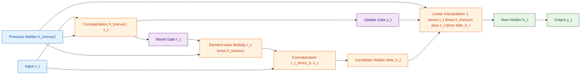
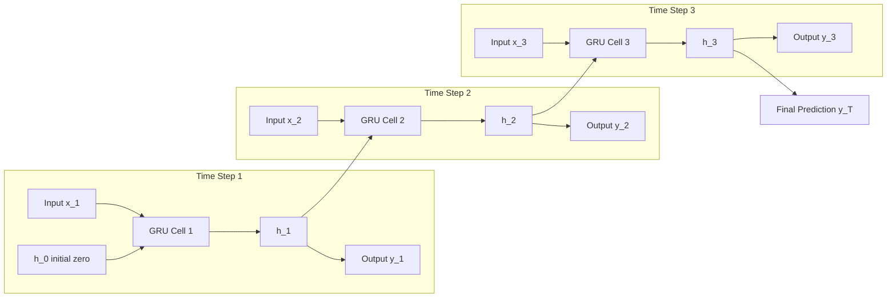
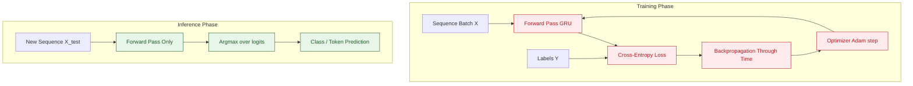

# GRUs

<!-- SECTION_1_START -->
# GRUs — Gated Recurrent Units

## 1. Core Technical Definition & Intuitive Overview

> [!NOTE]
> **Formal KTU Definition (PECST86A — Module 3):**
> A **Gated Recurrent Unit (GRU)** is a simplified variant of the Long Short-Term Memory (LSTM) network introduced by **Cho et al. (2014)**. It is a type of Gated Recurrent Neural Network (RNN) designed to solve the **vanishing and exploding gradient problem** in standard RNNs. The GRU combines the **forget gate** and **input gate** of an LSTM into a single **update gate**, and merges the **cell state** and **hidden state**, resulting in a more parameter-efficient architecture.

### Conceptual Analogy / Intuition

Imagine you are reading a mystery novel:
- A **standard RNN** tries to remember every single word — it gets overwhelmed and forgets the *clue from Chapter 1* by Chapter 30.
- An **LSTM** uses a separate "filing cabinet" (cell state) plus a strict "gatekeeper" — powerful but heavy.
- A **GRU** is like a smart reader with **two simple habits**:
  1. **Update Gate** → *"Should I update my current understanding with this new sentence, or keep my old understanding?"*
  2. **Reset Gate** → *"Should I forget earlier context to focus only on the recent past?"*

The two gates act as **learned memory valves** controlling what information to pass forward in a sequence.

### The Two Gates — Quick Glance

| Gate | Symbol | Role |
|------|--------|------|
| **Update Gate** | $z_t$ | Decides how much past information to keep vs. discard |
| **Reset Gate** | $r_t$ | Decides how much past information to *forget* when computing new candidate |

> [!IMPORTANT]
> **Syllabus Highlight:** GRUs are a key alternative to LSTMs and are frequently tested as a **comparison question** in KTU examinations, especially under *CO2: Apply sequence models to sequential data problems*.

> [!VISUALIZATION CONTROL]
> **Concept:** GRU unrolled across time steps showing gate-controlled information flow
> **Desmos Input Equations (schematic):**
> * $x_t$ (input at time $t$) on the x-axis
> * $h_t$ (hidden state) on the y-axis
> * Gating functions as sigmoid squashing curves: $\sigma(z)$ and $\sigma(r)$ bounded in $[0,1]$
> **Visual Description:** Plot a horizontal time-line $t_1 \to t_2 \to t_3 \to t_4$. At each time step, two sigmoid squashed values ($z_t, r_t$) branch off from the input/past state, controlling how $h_t$ is updated. The hidden state curve smoothly transitions, with sharper drops at points where the update gate $z_t \approx 0$ (retaining old state) or smoother updates when $z_t \approx 1$.

<!-- SECTION_1_END -->

<!-- SECTION_2_START -->
# 2. Deep Theoretical Analysis & KTU High-Yield Formula Sheet

## 2.1 Architecture of a GRU Cell

A GRU operates on each time step $t$ using the previous hidden state $h_{t-1}$ and current input $x_t$ to produce a new hidden state $h_t$. It has **two gates** and one **candidate activation**.

### Step-by-Step Operational Logic

1. **Input Concatenation** — Concatenate the current input $x_t \in \mathbb{R}^{d}$ with the previous hidden state $h_{t-1} \in \mathbb{R}^{h}$ to form a combined vector.
2. **Update Gate Computation** — Apply a learnable linear transformation followed by a sigmoid activation to produce $z_t$.
3. **Reset Gate Computation** — Apply a separate learnable linear transformation followed by a sigmoid to produce $r_t$.
4. **Candidate Hidden State** — Compute a candidate $\tilde{h}_t$ by combining $x_t$ with a *gated* version of $h_{t-1}$ (where $r_t$ multiplies $h_{t-1}$), passed through a $\tanh$ activation.
5. **Final Hidden State** — Perform a **linear interpolation** between $h_{t-1}$ and $\tilde{h}_t$ controlled by $z_t$.

## 2.2 KTU High-Yield Formula Sheet

| # | Equation | Variables | Purpose |
|---|----------|-----------|---------|
| 1 | $z_t = \sigma(W_z \cdot [h_{t-1}, x_t] + b_z)$ | $z_t \in [0,1]^h$ | **Update gate** |
| 2 | $r_t = \sigma(W_r \cdot [h_{t-1}, x_t] + b_r)$ | $r_t \in [0,1]^h$ | **Reset gate** |
| 3 | $\tilde{h}_t = \tanh(W_h \cdot [r_t \odot h_{t-1}, x_t] + b_h)$ | $\tilde{h}_t \in [-1,1]^h$ | **Candidate hidden state** |
| 4 | $h_t = (1 - z_t) \odot h_{t-1} + z_t \odot \tilde{h}_t$ | $h_t \in \mathbb{R}^h$ | **Final hidden state** |
| 5 | $y_t = \text{softmax}(W_o h_t + b_o)$ | $y_t \in \mathbb{R}^{V}$ | **Output** (e.g. vocabulary $V$) |

### Symbol Glossary
- $W_z, W_r, W_h \in \mathbb{R}^{h \times (h+d)}$ — Learnable weight matrices for update, reset, and candidate.
- $b_z, b_r, b_h \in \mathbb{R}^{h}$ — Learnable bias vectors.
- $\odot$ — **Hadamard (element-wise) product**.
- $[a, b]$ — **Vector concatenation** of $a$ and $b$.
- $\sigma(\cdot)$ — **Sigmoid** activation: $\sigma(x) = \frac{1}{1+e^{-x}}$, output range $(0,1)$.
- $\tanh(\cdot)$ — Hyperbolic tangent, output range $(-1,1)$.

> [!TIP]
> **Why a linear interpolation for $h_t$?**
> When $z_t \to 0$ → $h_t \approx h_{t-1}$ (the model **copies the past** unchanged → solves vanishing gradient).
> When $z_t \to 1$ → $h_t \approx \tilde{h}_t$ (the model **rewrites** with current input).
> This convex combination is what gives GRUs their *gradient highway*.

## 2.3 Real-World Engineering Utility

| Application Domain | Why GRU is used |
|--------------------|-----------------|
| **Speech Recognition** (e.g. Google Voice, Siri) | Models temporal audio frames; smaller footprint than LSTM. |
| **Machine Translation** | Original GRU paper (Cho et al. 2014) — encoder-decoder for seq2seq. |
| **Stock Price Forecasting** | Captures temporal dependencies in financial time series. |
| **Music Generation** | Generates note-by-note sequences (e.g. Magenta project). |
| **IoT/Edge Devices** | **Fewer parameters** than LSTM (~33% less) → faster inference. |
| **Anomaly Detection in Logs** | Models log sequences for cybersecurity. |

### GRU vs LSTM — KTU Comparison Chart

| Feature | LSTM | GRU |
|---------|------|-----|
| Number of gates | **3** (forget, input, output) | **2** (update, reset) |
| Cell state | Separate $C_t$ and $h_t$ | Only $h_t$ (merged) |
| Total parameters | $4 \times (h^2 + hd)$ | $3 \times (h^2 + hd)$ |
| Training speed | Slower | **~20–30% faster** |
| Long-range memory | **Slightly stronger** | Slightly weaker |
| Performance (small data) | Comparable | Often **better** |
| Invented by | Hochreiter & Schmidhuber (1997) | Cho et al. (2014) |

<!-- SECTION_2_END -->

<!-- SECTION_3_START -->
# 3. Step-by-Step Derivations & Code/Symbolic Implementation

## 3.1 Detailed Derivation: Forward Pass Through One GRU Cell

### Setup
Let:
- Input dimension: $d = 3$ → $x_t = [1.0,\ 0.5,\ -0.2]^T$
- Hidden dimension: $h = 2$ → $h_{t-1} = [0.1,\ 0.3]^T$
- Concatenated input: $v = [h_{t-1},\ x_t] \in \mathbb{R}^{5}$

### Initial Weight Matrices (sample small values)
$$
W_z = \begin{bmatrix} 0.1 & 0.2 & 0.05 & -0.1 & 0.3 \\ -0.2 & 0.1 & 0.4 & 0.2 & -0.1 \end{bmatrix}, \quad b_z = \begin{bmatrix} 0.0 \\ 0.0 \end{bmatrix}
$$

$$
W_r = \begin{bmatrix} 0.2 & -0.1 & 0.3 & 0.1 & 0.0 \\ 0.1 & 0.3 & -0.2 & 0.0 & 0.1 \end{bmatrix}, \quad b_r = \begin{bmatrix} 0.0 \\ 0.0 \end{bmatrix}
$$

$$
W_h = \begin{bmatrix} 0.3 & 0.1 & 0.0 & 0.2 & -0.1 \\ 0.1 & 0.2 & 0.3 & -0.1 & 0.2 \end{bmatrix}, \quad b_h = \begin{bmatrix} 0.0 \\ 0.0 \end{bmatrix}
$$

### Step 1 — Construct Concatenated Vector
$$
v = [h_{t-1},\ x_t]^T = [0.1,\ 0.3,\ 1.0,\ 0.5,\ -0.2]^T
$$

### Step 2 — Compute Update Gate $z_t$

$$
W_z \cdot v = \begin{bmatrix} 0.1(0.1) + 0.2(0.3) + 0.05(1.0) + (-0.1)(0.5) + 0.3(-0.2) \\ -0.2(0.1) + 0.1(0.3) + 0.4(1.0) + 0.2(0.5) + (-0.1)(-0.2) \end{bmatrix}
$$

$$
W_z \cdot v = \begin{bmatrix} 0.01 + 0.06 + 0.05 - 0.05 - 0.06 \\ -0.02 + 0.03 + 0.40 + 0.10 + 0.02 \end{bmatrix} = \begin{bmatrix} 0.01 \\ 0.53 \end{bmatrix}
$$

Apply sigmoid element-wise:
$$
z_t = \sigma([0.01,\ 0.53]^T) = \left[\frac{1}{1+e^{-0.01}},\ \frac{1}{1+e^{-0.53}}\right]^T = [0.5025,\ 0.3707]^T
$$

### Step 3 — Compute Reset Gate $r_t$

$$
W_r \cdot v = \begin{bmatrix} 0.2(0.1) + (-0.1)(0.3) + 0.3(1.0) + 0.1(0.5) + 0.0(-0.2) \\ 0.1(0.1) + 0.3(0.3) + (-0.2)(1.0) + 0.0(0.5) + 0.1(-0.2) \end{bmatrix}
$$

$$
W_r \cdot v = \begin{bmatrix} 0.02 - 0.03 + 0.30 + 0.05 + 0.00 \\ 0.01 + 0.09 - 0.20 + 0.00 - 0.02 \end{bmatrix} = \begin{bmatrix} 0.34 \\ -0.12 \end{bmatrix}
$$

Apply sigmoid:
$$
r_t = \sigma([0.34,\ -0.12]^T) = \left[\frac{1}{1+e^{-0.34}},\ \frac{1}{1+e^{0.12}}\right]^T = [0.5842,\ 0.4700]^T
$$

### Step 4 — Compute Candidate Hidden State $\tilde{h}_t$

First, gate the previous hidden state: $r_t \odot h_{t-1}$
$$
r_t \odot h_{t-1} = [0.5842 \times 0.1,\ 0.4700 \times 0.3]^T = [0.05842,\ 0.14100]^T
$$

Form the gated concatenation: $v' = [r_t \odot h_{t-1},\ x_t]^T = [0.05842,\ 0.14100,\ 1.0,\ 0.5,\ -0.2]^T$

$$
W_h \cdot v' = \begin{bmatrix} 0.3(0.05842) + 0.1(0.14100) + 0.0(1.0) + 0.2(0.5) + (-0.1)(-0.2) \\ 0.1(0.05842) + 0.2(0.14100) + 0.3(1.0) + (-0.1)(0.5) + 0.2(-0.2) \end{bmatrix}
$$

$$
W_h \cdot v' = \begin{bmatrix} 0.01753 + 0.01410 + 0.00 + 0.10 + 0.02 \\ 0.00584 + 0.02820 + 0.30 - 0.05 - 0.04 \end{bmatrix} = \begin{bmatrix} 0.15163 \\ 0.24404 \end{bmatrix}
$$

Apply $\tanh$:
$$
\tanh(0.15163) \approx 0.15049, \quad \tanh(0.24404) \approx 0.23965
$$

$$
\tilde{h}_t = [0.15049,\ 0.23965]^T
$$

### Step 5 — Compute Final Hidden State $h_t$

$$
(1 - z_t) = [1 - 0.5025,\ 1 - 0.3707]^T = [0.4975,\ 0.6293]^T
$$

$$
(1 - z_t) \odot h_{t-1} = [0.4975 \times 0.1,\ 0.6293 \times 0.3]^T = [0.04975,\ 0.18879]^T
$$

$$
z_t \odot \tilde{h}_t = [0.5025 \times 0.15049,\ 0.3707 \times 0.23965]^T = [0.07562,\ 0.08884]^T
$$

$$
h_t = (1 - z_t) \odot h_{t-1} + z_t \odot \tilde{h}_t = [0.04975 + 0.07562,\ 0.18879 + 0.08884]^T
$$

$$
\boxed{h_t = [0.12537,\ 0.27763]^T}
$$

> [!IMPORTANT]
> **Interpretation:** Notice that $h_t$ is *closer to $h_{t-1}$* than to $\tilde{h}_t$ — the update gate $z_t < 0.5$ caused the GRU to *retain more of the past* and only lightly incorporate the new candidate.

## 3.2 Gradient Flow Insight

$$
\frac{\partial h_t}{\partial h_{t-1}} = (1 - z_t) + \text{lower order terms}
$$

Since $z_t \in (0, 1)$, the gradient includes a **direct skip path** multiplied by $(1 - z_t)$. This is what mitigates the vanishing gradient — analogous to the LSTM's forget gate mechanism.

## 3.3 Production-Grade PyTorch Implementation

```python
"""
GRU Implementation for Time-Series / Sequence Classification.
Maps to KTU Module 3: Recurrent & Sequence Models.
"""
from __future__ import annotations

import logging
import sys
from dataclasses import dataclass, field
from typing import Tuple

import torch
import torch.nn as nn
import torch.nn.functional as F
from torch.utils.data import DataLoader, TensorDataset

logging.basicConfig(
    level=logging.INFO,
    format="%(asctime)s | %(levelname)s | %(message)s",
    stream=sys.stdout,
)
logger: logging.Logger = logging.getLogger(__name__)


@dataclass
class GRUConfig:
    """Hyper-parameter container for the GRU model."""
    input_size: int = 1
    hidden_size: int = 64
    num_layers: int = 2
    num_classes: int = 10
    dropout: float = 0.2
    bidirectional: bool = False
    learning_rate: float = 1e-3
    epochs: int = 10
    batch_size: int = 32
    device: str = field(default_factory=lambda: "cuda" if torch.cuda.is_available() else "cpu")


class GRUNet(nn.Module):
    """
    Multi-layer GRU network for sequence classification.
    Implements: h_t = (1 - z_t) * h_{t-1} + z_t * h_t_tilde
    """

    def __init__(self, config: GRUConfig) -> None:
        super().__init__()
        if config.hidden_size <= 0:
            raise ValueError(f"hidden_size must be positive, got {config.hidden_size}")

        self.config: GRUConfig = config

        self.gru: nn.GRU = nn.GRU(
            input_size=config.input_size,
            hidden_size=config.hidden_size,
            num_layers=config.num_layers,
            batch_first=True,
            dropout=config.dropout if config.num_layers > 1 else 0.0,
            bidirectional=config.bidirectional,
        )

        directions: int = 2 if config.bidirectional else 1
        self.classifier: nn.Linear = nn.Linear(
            config.hidden_size * directions, config.num_classes
        )
        self.dropout: nn.Dropout = nn.Dropout(p=config.dropout)
        self._initialize_weights()

    def _initialize_weights(self) -> None:
        """Xavier uniform init for all linear layers (best practice for RNNs)."""
        for name, param in self.named_parameters():
            if "weight" in name and param.dim() >= 2:
                nn.init.xavier_uniform_(param)
                logger.debug("Xavier-initialized %s with shape %s", name, param.shape)
            elif "bias" in name:
                nn.init.zeros_(param)

    def forward(self, x: torch.Tensor) -> torch.Tensor:
        """
        Forward pass.
        Args:
            x: Tensor of shape (batch, seq_len, input_size)
        Returns:
            logits: Tensor of shape (batch, num_classes)
        """
        if x.dim() != 3:
            raise ValueError(f"Expected 3-D input, got {x.dim()}-D tensor of shape {x.shape}")

        batch_size: int = x.size(0)
        num_directions: int = 2 if self.config.bidirectional else 1
        h0: torch.Tensor = torch.zeros(
            self.config.num_layers * num_directions,
            batch_size,
            self.config.hidden_size,
            device=x.device,
            dtype=x.dtype,
        )

        try:
            out, hn = self.gru(x, h0)
        except RuntimeError as exc:
            logger.error("GRU forward failed for input shape %s: %s", x.shape, exc)
            raise

        if self.config.bidirectional:
            # Concatenate last time-step of forward and backward passes
            last_forward: torch.Tensor = out[:, -1, : self.config.hidden_size]
            last_backward: torch.Tensor = out[:, 0, self.config.hidden_size :]
            final_hidden: torch.Tensor = torch.cat([last_forward, last_backward], dim=1)
        else:
            final_hidden = out[:, -1, :]

        final_hidden = self.dropout(final_hidden)
        logits: torch.Tensor = self.classifier(final_hidden)
        return logits


def train_gru_model(
    model: GRUNet,
    train_loader: DataLoader,
    val_loader: DataLoader,
    config: GRUConfig,
) -> Tuple[float, float]:
    """Training loop with validation. Returns (best_train_acc, best_val_acc)."""
    model.to(config.device)
    criterion: nn.CrossEntropyLoss = nn.CrossEntropyLoss()
    optimizer: torch.optim.Optimizer = torch.optim.Adam(
        model.parameters(), lr=config.learning_rate
    )

    best_val_acc: float = 0.0
    best_train_acc: float = 0.0

    for epoch in range(1, config.epochs + 1):
        model.train()
        train_correct: int = 0
        train_total: int = 0
        train_loss_sum: float = 0.0

        for batch_x, batch_y in train_loader:
            batch_x = batch_x.to(config.device)
            batch_y = batch_y.to(config.device)

            optimizer.zero_grad()
            logits: torch.Tensor = model(batch_x)
            loss: torch.Tensor = criterion(logits, batch_y)
            loss.backward()

            # Gradient clipping to prevent exploding gradients
            torch.nn.utils.clip_grad_norm_(model.parameters(), max_norm=1.0)
            optimizer.step()

            train_loss_sum += loss.item() * batch_x.size(0)
            preds: torch.Tensor = logits.argmax(dim=1)
            train_correct += int((preds == batch_y).sum().item())
            train_total += batch_x.size(0)

        train_acc: float = train_correct / max(train_total, 1)
        avg_train_loss: float = train_loss_sum / max(train_total, 1)

        # ----- Validation -----
        model.eval()
        val_correct: int = 0
        val_total: int = 0
        with torch.no_grad():
            for batch_x, batch_y in val_loader:
                batch_x = batch_x.to(config.device)
                batch_y = batch_y.to(config.device)
                logits = model(batch_x)
                preds = logits.argmax(dim=1)
                val_correct += int((preds == batch_y).sum().item())
                val_total += batch_x.size(0)
        val_acc: float = val_correct / max(val_total, 1)

        logger.info(
            "Epoch %02d/%02d | loss=%.4f | train_acc=%.4f | val_acc=%.4f",
            epoch, config.epochs, avg_train_loss, train_acc, val_acc,
        )

        if val_acc > best_val_acc:
            best_val_acc = val_acc
            best_train_acc = train_acc

    return best_train_acc, best_val_acc


def main() -> None:
    """Entry point: synthesizes a small sequence dataset and trains the GRU."""
    config = GRUConfig(
        input_size=1,
        hidden_size=32,
        num_layers=1,
        num_classes=5,
        dropout=0.1,
        epochs=3,
        batch_size=16,
    )

    # Synthetic data: (batch, seq_len, features) and integer class labels
    torch.manual_seed(42)
    seq_len: int = 20
    n_samples: int = 400
    x_data: torch.Tensor = torch.randn(n_samples, seq_len, config.input_size)
    y_data: torch.Tensor = torch.randint(0, config.num_classes, (n_samples,))

    split: int = int(0.8 * n_samples)
    train_ds: TensorDataset = TensorDataset(x_data[:split], y_data[:split])
    val_ds: TensorDataset = TensorDataset(x_data[split:], y_data[split:])

    train_loader: DataLoader = DataLoader(train_ds, batch_size=config.batch_size, shuffle=True)
    val_loader: DataLoader = DataLoader(val_ds, batch_size=config.batch_size, shuffle=False)

    model: GRUNet = GRUNet(config)
    logger.info("Model: %s", model)

    train_acc, val_acc = train_gru_model(model, train_loader, val_loader, config)
    logger.info("Best train_acc=%.4f | best val_acc=%.4f", train_acc, val_acc)


if __name__ == "__main__":
    main()
```

## 3.4 From-Scratch NumPy GRU Cell (for exam derivations)

```python
"""
NumPy-only GRU Cell implementation - matches equations 1-4 above.
Useful for KTU viva and numerical answer verification.
"""
import numpy as np


class GRUCell:
    def __init__(self, input_size: int, hidden_size: int, seed: int = 0) -> None:
        rng = np.random.default_rng(seed)
        # Xavier-style scaling
        scale = np.sqrt(1.0 / (hidden_size + input_size))
        self.Wz = rng.normal(0.0, scale, (hidden_size, hidden_size + input_size))
        self.Wr = rng.normal(0.0, scale, (hidden_size, hidden_size + input_size))
        self.Wh = rng.normal(0.0, scale, (hidden_size, hidden_size + input_size))
        self.bz = np.zeros(hidden_size)
        self.br = np.zeros(hidden_size)
        self.bh = np.zeros(hidden_size)

    @staticmethod
    def _sigmoid(x: np.ndarray) -> np.ndarray:
        return 1.0 / (1.0 + np.exp(-x))

    def step(self, x_t: np.ndarray, h_prev: np.ndarray) -> np.ndarray:
        concat = np.concatenate([h_prev, x_t])          # shape (h+d,)
        z_t = self._sigmoid(self.Wz @ concat + self.bz) # update gate
        r_t = self._sigmoid(self.Wr @ concat + self.br) # reset gate
        gated = np.concatenate([r_t * h_prev, x_t])
        h_tilde = np.tanh(self.Wh @ gated + self.bh)
        h_t = (1.0 - z_t) * h_prev + z_t * h_tilde
        return h_t


# Quick sanity test
if __name__ == "__main__":
    cell = GRUCell(input_size=3, hidden_size=2, seed=7)
    h = np.zeros(2)
    for t in range(3):
        x = np.array([1.0, 0.5, -0.2])
        h = cell.step(x, h)
        print(f"t={t+1}, h_t = {np.round(h, 4).tolist()}")
```

<!-- SECTION_3_END -->

<!-- SECTION_4_START -->
# 4. Structural Diagrams & Schematics

## 4.1 GRU Cell — Block-Level Functional Architecture



## 4.2 Unrolled GRU Over Time — Sequential Processing Topology



## 4.3 Data Flow Architecture — Training vs Inference



> [!TIP]
> **Reading the diagrams in KTU exams:** When asked to *"draw the architecture of a GRU"*, the first diagram (Block-Level) is the most exam-friendly. Always label: (1) the two gates $z_t, r_t$, (2) the candidate state $\tilde{h}_t$, and (3) the interpolation step $(1 - z_t) h_{t-1} + z_t \tilde{h}_t$.

<!-- SECTION_4_END -->

<!-- SECTION_5_START -->
# 5. KTU 2024 Scheme Examination Question Bank & Topic Recap

## PART A — 3 Mark Questions

### Q1. **[KTU University Exam — July 2024]** *CO2 / Remember*
**Define a Gated Recurrent Unit (GRU). List its gates.**

**Model Answer (3 Marks):**
A Gated Recurrent Unit (GRU) is a type of recurrent neural network architecture proposed by Cho et al. (2014) that uses gating mechanisms to control the flow of information through time, solving the vanishing gradient problem in standard RNNs.
**Gates:** A GRU has **two gates**:
1. **Update gate ($z_t$)** — controls how much of the past information should be carried forward to the future.
2. **Reset gate ($r_t$)** — controls how much of the past information to forget.
*[Gates enumeration: 1 Mark; Definition: 2 Marks]*

---

### Q2. **[KTU University Exam — Dec 2023]** *CO2 / Understand*
**Differentiate between LSTM and GRU in terms of architecture and parameters.**

**Model Answer (3 Marks):**

| Aspect | LSTM | GRU |
|--------|------|-----|
| Gates | 3 (forget, input, output) | 2 (update, reset) |
| Cell state | Separate $C_t$ and $h_t$ | Single merged $h_t$ |
| Parameters | $4(h^2+hd+h)$ | $3(h^2+hd+h)$ |
| Speed | Slower training | Faster training |
| Memory | Better for very long sequences | Comparable on small data |
*[LSTM features: 1 Mark; GRU features: 1 Mark; Comparative insight: 1 Mark]*

---

## PART B — 14 Mark Questions (Module Internal Choice)

### Question A (14 Marks)

**[KTU University Exam — July 2024, Model Paper]**
**CO2 / Understand + Apply**

#### (a) Derive the forward pass equations of a GRU cell. Show how the update gate and reset gate are computed. *(7 Marks)*

**Model Solution:**

A GRU cell at time step $t$ takes the previous hidden state $h_{t-1}$ and current input $x_t$ to produce a new hidden state $h_t$.

**Step 1: Concatenation of inputs** *(1 Mark)*
$$
v = [h_{t-1},\ x_t]
$$
where $[\cdot,\cdot]$ denotes vector concatenation.

**Step 2: Update Gate Computation** *(2 Marks)*
$$
z_t = \sigma(W_z \cdot [h_{t-1}, x_t] + b_z)
$$
The update gate $z_t \in [0, 1]^h$ decides how much of the past information to retain. $W_z$ is the update gate weight matrix of shape $h \times (h + d)$, and $b_z$ is the bias vector of shape $h$.

**Step 3: Reset Gate Computation** *(2 Marks)*
$$
r_t = \sigma(W_r \cdot [h_{t-1}, x_t] + b_r)
$$
The reset gate $r_t \in [0, 1]^h$ decides how much of the past hidden state to forget when computing the new candidate.

**Step 4: Candidate Hidden State** *(1 Mark)*
$$
\tilde{h}_t = \tanh(W_h \cdot [r_t \odot h_{t-1},\ x_t] + b_h)
$$
The candidate $\tilde{h}_t$ contains the new candidate values that *could* be added to the state.

**Step 5: Final Hidden State (Linear Interpolation)** *(1 Mark)*
$$
h_t = (1 - z_t) \odot h_{t-1} + z_t \odot \tilde{h}_t
$$
This is a convex combination that lets the network either copy the past ($z_t \to 0$) or rewrite with new info ($z_t \to 1$).

> [!WARNING]
> **KTU Examiner's Pitfall Callout:** Students often confuse the role of the **update gate** and the **reset gate** in their answer. The update gate **controls interpolation between old and new**; the reset gate **controls how much past contributes to the new candidate only**. Do NOT swap these roles in your answer.

---

#### (b) Implement a GRU network in PyTorch for a sequence classification task on synthetic data. Show model definition and one forward pass. *(7 Marks)*

**Model Solution:**

**Step 1: Configuration (1 Mark)**
```python
import torch
import torch.nn as nn

class GRUConfig:
    input_size = 1
    hidden_size = 64
    num_layers = 2
    num_classes = 5
    dropout = 0.2
```

**Step 2: Model Class (4 Marks)**
```python
class GRUNet(nn.Module):
    def __init__(self, config):
        super().__init__()
        self.gru = nn.GRU(
            input_size=config.input_size,
            hidden_size=config.hidden_size,
            num_layers=config.num_layers,
            batch_first=True,
            dropout=config.dropout,
        )
        self.fc = nn.Linear(config.hidden_size, config.num_classes)
        self.dropout = nn.Dropout(config.dropout)

    def forward(self, x):
        # x: (batch, seq_len, input_size)
        h0 = torch.zeros(self.gru.num_layers, x.size(0), self.gru.hidden_size)
        out, hn = self.gru(x, h0)
        # Take last time-step's hidden state
        final = self.dropout(out[:, -1, :])
        return self.fc(final)
```

**Step 3: Forward Pass Demonstration (2 Marks)**
```python
config = GRUConfig()
model = GRUNet(config)
x = torch.randn(8, 20, 1)   # batch=8, seq=20, feature=1
logits = model(x)
print(logits.shape)          # torch.Size([8, 5])
```

*[Class definition: 4 Marks; Forward pass invocation: 2 Marks; Output shape comment: 1 Mark]*

---

### Question B (14 Marks) — Alternative Choice

**[KTU University Exam — Dec 2023, Supplementary]**
**CO2 / Apply + Analyze**

#### (a) Compare the update gate of a GRU with the forget gate of an LSTM. Show that GRU's update gate subsumes LSTM's forget and input gates. *(7 Marks)*

**Model Solution:**

**LSTM Forget Gate** *(2 Marks)*
$$
f_t = \sigma(W_f \cdot [h_{t-1}, x_t] + b_f)
$$
This gate decides how much of the **cell state** $C_{t-1}$ to retain.

**LSTM Input Gate** *(2 Marks)*
$$
i_t = \sigma(W_i \cdot [h_{t-1}, x_t] + b_i), \quad \tilde{C}_t = \tanh(W_C \cdot [h_{t-1}, x_t] + b_C)
$$
$$
C_t = f_t \odot C_{t-1} + i_t \odot \tilde{C}_t
$$

**GRU Update Gate Mapping** *(3 Marks)*

In the GRU:
$$
h_t = (1 - z_t) \odot h_{t-1} + z_t \odot \tilde{h}_t
$$

By direct comparison:
- $f_t^{\text{LSTM}} \;\longleftrightarrow\; (1 - z_t)^{\text{GRU}}$ (the "forget" portion of the interpolation)
- $i_t^{\text{LSTM}} \;\longleftrightarrow\; z_t^{\text{GRU}}$ (the "input" portion)

Thus the single update gate $z_t$ of a GRU *simultaneously* plays the role of both the forget and input gates of an LSTM, with the **complementary pair** $(z_t, 1 - z_t)$ being jointly determined by a single sigmoid — saving parameters and removing the need for a separate $1 - z_t$ parameter.

> [!WARNING]
> **Common Mistake:** Students write "$z_t$ equals the forget gate" — this is *wrong*. The mapping is $f_t \leftrightarrow 1 - z_t$ and $i_t \leftrightarrow z_t$. Examiners specifically check this distinction.

---

#### (b) For a sequence classification problem on a dataset with 50,000 training samples, 100 time steps, 8 features per step, and 4 output classes, calculate the number of trainable parameters in a 2-layer GRU with hidden size 64 (unidirectional). *(7 Marks)*

**Model Solution:**

**Given:**
- Input size $d = 8$
- Hidden size $h = 64$
- Number of layers $L = 2$
- Output classes $C = 4$ (not used in GRU param count)
- Unidirectional

**Step 1: Per-layer GRU parameters** *(3 Marks)*

Each GRU layer has three weight matrices and three biases:
- $W_z, W_r, W_h$: each of shape $(h, h + d) = (64, 72)$ → each has $64 \times 72 = 4{,}608$ parameters.
- Three biases $b_z, b_r, b_h$: each of length $h = 64$ → each has $64$ parameters.

Per-layer total:
$$
3 \times 4{,}608 + 3 \times 64 = 13{,}824 + 192 = 14{,}016 \text{ parameters}
$$

**Step 2: Total for 2 GRU layers** *(2 Marks)*

Layer 1 input dimension is $d = 8$; layers 2 through $L$ have input dimension $h = 64$. Since *all layers use $W \in \mathbb{R}^{h \times (h+d)}$*, the count is the same:
$$
\text{GRU total} = 2 \times 14{,}016 = 28{,}032 \text{ parameters}
$$

**Step 3: Add output classifier** *(1 Mark)*
$$
W_o \in \mathbb{R}^{C \times h} = \mathbb{R}^{4 \times 64} = 256, \quad b_o \in \mathbb{R}^{4} = 4
$$
$$
\text{Classifier} = 256 + 4 = 260 \text{ parameters}
$$

**Step 4: Final Answer** *(1 Mark)*
$$
\boxed{\text{Total trainable parameters} = 28{,}032 + 260 = 28{,}292}
$$

> [!WARNING]
> **KTU Examiner's Pitfall Callout:** Do **NOT** multiply by the sequence length or number of samples when computing parameter counts. Parameters are tied to the architecture (weights + biases), not to the data dimensions. Also, for the first layer, some students incorrectly use $h \times d$ instead of $h \times (h + d)$ for the input projection — but PyTorch's `nn.GRU` always concatenates $h_{t-1}$ and $x_t$ **before** multiplication, so the shape is **always** $h \times (h + d)$.

---

## Topic Recap & Important Things to Remember

> [!IMPORTANT]
> **Rapid Revision Checklist — GRUs**

- **GRU** is a **gated recurrent network** with **2 gates** (Update, Reset) and a **candidate hidden state**. *(Definition)*
- Proposed by **Cho et al. (2014)** as a simpler alternative to LSTM (1997).
- **Update gate** $z_t = \sigma(W_z [h_{t-1}, x_t] + b_z)$ — controls interpolation between past and candidate. *(Key equation)*
- **Reset gate** $r_t = \sigma(W_r [h_{t-1}, x_t] + b_r)$ — controls how much past contributes to the candidate. *(Key equation)*
- **Candidate** $\tilde{h}_t = \tanh(W_h [r_t \odot h_{t-1}, x_t] + b_h)$. *(Key equation)*
- **Final state** $h_t = (1 - z_t) \odot h_{t-1} + z_t \odot \tilde{h}_t$ — a **convex combination** (interpolation). *(Key equation)*
- $z_t \to 0$ → copy past; $z_t \to 1$ → rewrite with new info. *(Intuition)*
- GRU has **~33% fewer parameters** than LSTM: $3(h^2 + hd)$ vs $4(h^2 + hd)$. *(Comparison fact)*
- **No separate cell state** in GRU; only hidden state $h_t$. *(Architecture fact)*
- **Mitigates vanishing gradients** via the linear interpolation skip path. *(Why it works)*
- **Hyperparameters**: hidden size $h$, number of layers $L$, dropout, bidirectional flag. *(Practical)*
- **Best for**: speech, translation, time-series forecasting, edge devices, small-to-medium datasets.
- **PyTorch API**: `torch.nn.GRU(input_size, hidden_size, num_layers, batch_first=True, dropout=p)`. *(Code fact)*
- **Output shape** of a unidirectional multi-layer GRU: `(batch, seq_len, hidden_size * directions)`.
- **Initialization**: Use **Xavier/Glorot** initialization for stable training; apply **gradient clipping** (max norm ≤ 1.0) to prevent explosion.
- **GRU update gate** subsumes LSTM's forget + input gates through the pair $(z_t, 1 - z_t)$. *(Exam-favorite mapping)*
- **Bidirectional GRU**: concatenates forward and backward hidden states → 2× parameters in the classifier. *(Engineering tip)*
- Common KTU pitfall: confusing update gate with reset gate roles. *(Examiner warning)*

<!-- SECTION_5_END -->
