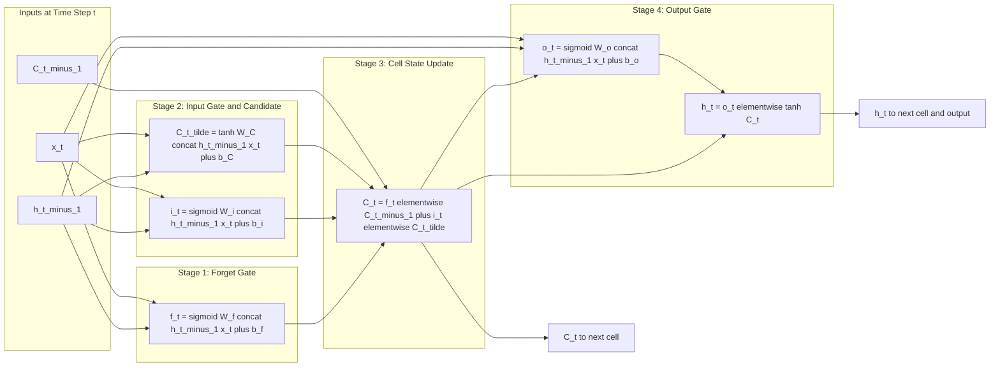
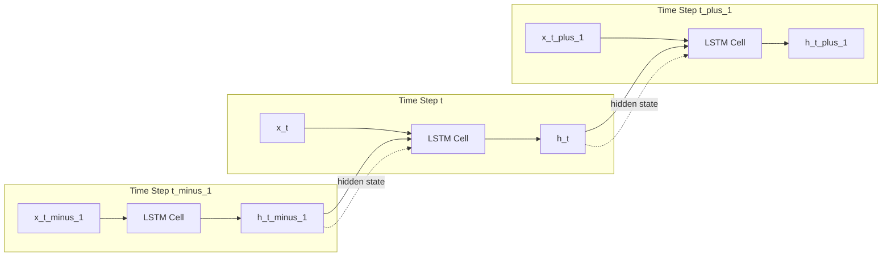
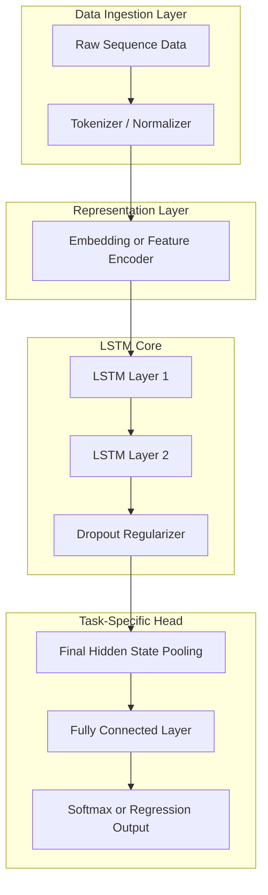

# LSTMs

<!-- SECTION_1_START -->
# LSTMs — Core Technical Definition & Intuitive Overview

## Formal Definition (KTU 2024 Syllabus Terminology)

A **Long Short-Term Memory (LSTM)** network is a specialized variant of the Recurrent Neural Network (RNN) architecture, designed to model **temporal/sequential dependencies** in data by overcoming the **vanishing and exploding gradient problem** inherent in standard RNNs. It was introduced by **Hochreiter & Schmidhuber (1997)** and refined by **Gers et al. (2000)** with the addition of the forget gate.

The defining feature of an LSTM unit is a **memory cell** $C_t$ regulated by three multiplicative **gating mechanisms** (Forget Gate $f_t$, Input Gate $i_t$, Output Gate $o_t$) that selectively write, retain, or read information from the cell state over time.

> [!IMPORTANT]
> **KTU 2024 Module 3 Highlight:** LSTMs are classified under **Sequence Models** and are examinable for their gated cell architecture, forward propagation equations, and gradient flow properties. They are a direct improvement over vanilla RNNs for long-range dependency tasks.

## Conceptual Analogy / Intuition

Imagine a **factory assembly line with three quality-control inspectors** standing at different stations:

1. The **Forget Gate** is a senior inspector who decides *"Which old parts should we throw away from the conveyor belt?"* — it erases irrelevant past information.
2. The **Input Gate** is a procurement officer who decides *"Which new parts from the supplier should we add to the belt?"* — it writes new candidate information.
3. The **Output Gate** is the packaging supervisor who decides *"Which parts from the belt should we send out as today's product?"* — it exposes filtered cell content as the hidden state.

The **conveyor belt itself is the cell state $C_t$** — a continuous pipeline of information that flows largely *untouched* horizontally across time. Only the gates modify it. Because information can flow across the belt with minimal transformation, gradients can travel long distances without vanishing — this is the core engineering insight of LSTMs.

> [!NOTE]
> **Key Constants in the LSTM Design:**
> - Sigmoid activation $\sigma(\cdot)$ squashes values to the open interval $(0, 1)$ — interpreted as "keep ratio".
> - Hyperbolic tangent $\tanh(\cdot)$ squashes values to $(-1, 1)$ — used for candidate content.
> - The **forget bias initialization** is typically set to $\mathbf{1.0}$ (instead of $\mathbf{0.0}$) so that the network begins with full memory retention at training start.

## Geometric Intuition: The Sigmoid Gate

The two core activations used by an LSTM are:

$$\sigma(x) = \frac{1}{1 + e^{-x}} \quad \text{and} \quad \tanh(x) = \frac{e^{x} - e^{-x}}{e^{x} + e^{-x}}$$

> [!VISUALIZATION CONTROL]
> **Concept:** Sigmoid vs. Tanh Activation Functions in LSTM Gates
> **Desmos Input Equations:**
> * `y1 = 1/(1+exp(-x))`
> * `y2 = (exp(x)-exp(-x))/(exp(x)+exp(-x))`
> **Visual Description:** On the x-axis (input $x \in [-6, 6]$) and y-axis, the student should observe the sigmoid curve plateauing at $y = 0$ for large negative $x$ and $y = 1$ for large positive $x$ (interpreted as a gate open-ratio between **0%** and **100%**). The tanh curve plateaus at $y = -1$ and $y = 1$ (interpreted as signed content magnitude in **[-1, 1]**).

> [!TIP]
> **Why two different activations?** Sigmoid produces *non-negative* values (it answers "how much to keep?"), while tanh produces *zero-centered* values (it answers "what is the content, with sign?"). Mixing them gives LSTMs expressive control over both the magnitude and sign of information flow.

---

<!-- SECTION_1_END -->

<!-- SECTION_2_START -->
# Deep Theoretical Analysis & KTU High-Yield Formula Sheet

## The LSTM Cell — Operational Breakdown

At every time step $t$, the LSTM unit receives **three inputs**:

1. The previous hidden state $h_{t-1} \in \mathbb{R}^{d_h}$
2. The previous cell state $C_{t-1} \in \mathbb{R}^{d_h}$
3. The current input $x_t \in \mathbb{R}^{d_x}$

and produces **two outputs**: an updated hidden state $h_t$ and an updated cell state $C_t$. The architecture is governed by four learnable weight matrices per layer: $W_f, W_i, W_C, W_o \in \mathbb{R}^{d_h \times (d_h + d_x)}$ and corresponding bias vectors $b_f, b_i, b_C, b_o \in \mathbb{R}^{d_h}$.

### Stage 1 — Forget Gate: "What to discard?"

The forget gate reads $h_{t-1}$ and $x_t$, then outputs a value in $[0, 1]$ for each dimension of the cell state. A value of $0$ means *"completely erase this memory"*; a value of $1$ means *"keep it intact"*.

$$f_t = \sigma\!\left(W_f \cdot [h_{t-1}, x_t] + b_f\right)$$

### Stage 2 — Input Gate & Candidate Cell: "What to write?"

The input gate decides *which values* of the cell state will be updated, while a tanh layer creates a vector of *new candidate values* $\tilde{C}_t$ that *could* be added to the state.

$$i_t = \sigma\!\left(W_i \cdot [h_{t-1}, x_t] + b_i\right)$$

$$\tilde{C}_t = \tanh\!\left(W_C \cdot [h_{t-1}, x_t] + b_C\right)$$

### Stage 3 — Cell State Update: "Update the conveyor belt"

The old cell state is forgotten selectively (multiplied by $f_t$) and new candidates are added selectively (multiplied by $i_t$):

$$C_t = f_t \odot C_{t-1} + i_t \odot \tilde{C}_t$$

Here, $\odot$ denotes the **Hadamard (element-wise) product**. The cell state $C_t$ thus acts as the LSTM's long-term memory, largely preserved across time steps.

### Stage 4 — Output Gate & Hidden State: "What to expose?"

The output gate decides *which parts* of the cell state become the next hidden state. The cell state is first pushed through a $\tanh$ (to squash to $[-1, 1]$) and then filtered by the output gate:

$$o_t = \sigma\!\left(W_o \cdot [h_{t-1}, x_t] + b_o\right)$$

$$h_t = o_t \odot \tanh(C_t)$$

## Why Does This Solve the Vanishing Gradient Problem?

In a vanilla RNN, the hidden state update is $h_t = \tanh(W_{hh} h_{t-1} + W_{xh} x_t)$. Backpropagation through time (BPTT) requires multiplying by $W_{hh}$ repeatedly, causing the gradient to either decay to zero (vanish) or blow up (explode) exponentially.

In an LSTM, the additive update $C_t = f_t \odot C_{t-1} + i_t \odot \tilde{C}_t$ creates a **gradient highway**. The gradient with respect to $C_t$ flows back through the forget gate's $f_t$ factor — and crucially, $f_t$ can be learned close to $1$, allowing gradients to propagate across hundreds of time steps with minimal attenuation. This is sometimes called the **Constant Error Carousel (CEC)**.

> [!IMPORTANT]
> **Engineering Utility:** LSTMs are deployed in production systems for machine translation (Google Translate's precursor), speech recognition (Apple Siri), time-series forecasting (energy demand, stock prices), music generation, anomaly detection in IoT sensor streams, and protein structure prediction. The key design decision: *use an LSTM when the relevant context length exceeds ~10–20 time steps and vanilla RNN performance collapses.*

## KTU High-Yield Formula Sheet (Cheat Sheet)

| # | Quantity | Equation | Output Range | Purpose |
|---|----------|----------|--------------|---------|
| 1 | Forget Gate | $f_t = \sigma(W_f [h_{t-1}, x_t] + b_f)$ | $(0, 1)$ | Decide what to erase from $C_{t-1}$ |
| 2 | Input Gate | $i_t = \sigma(W_i [h_{t-1}, x_t] + b_i)$ | $(0, 1)$ | Decide which values to update |
| 3 | Candidate Cell | $\tilde{C}_t = \tanh(W_C [h_{t-1}, x_t] + b_C)$ | $(-1, 1)$ | Create new candidate content |
| 4 | Cell State | $C_t = f_t \odot C_{t-1} + i_t \odot \tilde{C}_t$ | $\mathbb{R}^{d_h}$ | Long-term memory update |
| 5 | Output Gate | $o_t = \sigma(W_o [h_{t-1}, x_t] + b_o)$ | $(0, 1)$ | Decide what to expose |
| 6 | Hidden State | $h_t = o_t \odot \tanh(C_t)$ | $(-1, 1)$ | Short-term output / next input |
| 7 | Number of Params / Cell | $4 \times d_h \times (d_h + d_x) + 4 \times d_h$ | — | Trainable weights per LSTM cell |
| 8 | Forget Bias Init | $b_f \leftarrow \mathbf{1.0}$ | — | Standard KTU practice (Gers 2000) |

> [!NOTE]
> **Critical Notation Convention:** Throughout these notes, $[h_{t-1}, x_t]$ denotes the **concatenation** of the two vectors (not a comma-separated list), producing a column vector of dimension $(d_h + d_x)$.

---

<!-- SECTION_2_END -->

<!-- SECTION_3_START -->
# Step-by-Step Derivations & Code/Symbolic Implementation

## Derivation 1 — Forward Pass of a Single LSTM Cell (Symbolic)

We derive the full forward propagation given inputs $h_{t-1}$, $C_{t-1}$, and $x_t$, with concatenated input vector $z_t = [h_{t-1}; x_t] \in \mathbb{R}^{d_h + d_x}$.

**Step 1 — Concatenate previous hidden state and current input:**

$$z_t = \begin{bmatrix} h_{t-1} \\ x_t \end{bmatrix}, \quad z_t \in \mathbb{R}^{d_h + d_x}$$

**Step 2 — Compute the four linear pre-activations in a single matrix multiplication (computational optimization):**

We can stack the four weight matrices horizontally into a single matrix $W \in \mathbb{R}^{4 d_h \times (d_h + d_x)}$:

$$\begin{bmatrix} \tilde{f}_t \\ \tilde{i}_t \\ \tilde{C}_t \\ \tilde{o}_t \end{bmatrix} = W \cdot z_t + b, \quad b = \begin{bmatrix} b_f \\ b_i \\ b_C \\ b_o \end{bmatrix}$$

This reduces four separate matrix multiplications (each $O(d_h^2 + d_h d_x)$) into a single fused one, which is what GPU kernels actually execute.

**Step 3 — Apply element-wise nonlinearities:**

$$f_t = \sigma(\tilde{f}_t), \quad i_t = \sigma(\tilde{i}_t), \quad \tilde{C}_t = \tanh(\tilde{C}_t), \quad o_t = \sigma(\tilde{o}_t)$$

**Step 4 — Combine gates with cell state to produce updated cell state:**

$$C_t = f_t \odot C_{t-1} + i_t \odot \tilde{C}_t$$

**Step 5 — Compute the new hidden state from the cell state and output gate:**

$$h_t = o_t \odot \tanh(C_t)$$

**Step 6 — Total parameter count per cell (KTU 2024 derivable result):**

$$P_{\text{cell}} = 4 \cdot d_h \cdot (d_h + d_x) + 4 \cdot d_h$$

For example, with $d_h = 128$ and $d_x = 64$: $P_{\text{cell}} = 4 \times 128 \times 192 + 4 \times 128 = 98{,}304 + 512 = 98{,}816$ parameters.

## Derivation 2 — Gradient Flow Through the Cell State (BPTT)

We now derive $\frac{\partial C_t}{\partial C_{t-1}}$ to show *why* the gradient does not vanish. From the cell update equation:

$$C_t = f_t \odot C_{t-1} + i_t \odot \tilde{C}_t$$

Taking the partial derivative with respect to $C_{t-1}$ (treating $f_t$, $i_t$, and $\tilde{C}_t$ as independent of $C_{t-1}$ for a single-step local analysis):

$$\frac{\partial C_t}{\partial C_{t-1}} = f_t$$

Chaining across $k$ time steps (BPTT through the cell state path):

$$\frac{\partial C_t}{\partial C_{t-k}} = \prod_{j=1}^{k} f_{t-j+1}$$

The product is the **element-wise product of forget gate activations** along the path. Since $f_t \in (0, 1)$ and is *learned*, the network can learn to keep $f_t$ close to $1$ (e.g., $0.95$), giving $0.95^{100} \approx 0.006$ — a slow, controlled decay rather than the exponential vanishing of vanilla RNNs where the equivalent term is $\prod \tanh'(W_{hh} h_{t-1}) \cdot W_{hh}$.

## Python Implementation — From-Scratch LSTM Cell

```python
import numpy as np
from typing import Tuple

def sigmoid(x: np.ndarray) -> np.ndarray:
    """Numerically stable sigmoid activation."""
    return np.where(x >= 0, 1.0 / (1.0 + np.exp(-x)), np.exp(x) / (1.0 + np.exp(x)))

def tanh(x: np.ndarray) -> np.ndarray:
    """Hyperbolic tangent activation."""
    return np.tanh(x)

class LSTMCell:
    """
    Single Long Short-Term Memory cell implementing the forward pass
    per Hochreiter & Schmidhuber (1997) and Gers et al. (2000).
    """
    def __init__(self, input_dim: int, hidden_dim: int, rng: np.random.Generator | None = None) -> None:
        if hidden_dim <= 0 or input_dim <= 0:
            raise ValueError("Dimensions must be positive integers.")
        self.input_dim: int = input_dim
        self.hidden_dim: int = hidden_dim
        self.rng: np.random.Generator = rng if rng is not None else np.random.default_rng(seed=42)

        # Xavier/Glorot initialization
        scale: float = np.sqrt(2.0 / (hidden_dim + input_dim))

        # Fused weight matrix W of shape (4 * hidden_dim, hidden_dim + input_dim)
        self.W: np.ndarray = self.rng.normal(0.0, scale, size=(4 * hidden_dim, hidden_dim + input_dim))
        # Bias vector b of shape (4 * hidden_dim,)
        self.b: np.ndarray = np.zeros(4 * hidden_dim, dtype=np.float64)
        # Standard practice: forget gate bias initialized to 1.0
        self.b[:hidden_dim] = 1.0

    def forward(self, x_t: np.ndarray, h_prev: np.ndarray, c_prev: np.ndarray) -> Tuple[np.ndarray, np.ndarray]:
        """
        Args:
            x_t:    Input at time t,  shape (input_dim,)
            h_prev: Previous hidden state, shape (hidden_dim,)
            c_prev: Previous cell state,  shape (hidden_dim,)

        Returns:
            h_t: New hidden state, shape (hidden_dim,)
            c_t: New cell state,  shape (hidden_dim,)
        """
        if x_t.shape != (self.input_dim,):
            raise ValueError(f"x_t expected shape ({self.input_dim},), got {x_t.shape}.")
        if h_prev.shape != (self.hidden_dim,) or c_prev.shape != (self.hidden_dim,):
            raise ValueError(f"h_prev/c_prev expected shape ({self.hidden_dim},).")

        # Step 1: Concatenate [h_prev, x_t] -> shape (hidden_dim + input_dim,)
        z_t: np.ndarray = np.concatenate([h_prev, x_t])

        # Step 2: Linear pre-activation (fused) -> shape (4 * hidden_dim,)
        pre: np.ndarray = z_t @ self.W.T + self.b

        # Step 3: Slice the four gates
        H: int = self.hidden_dim
        f_t: np.ndarray = sigmoid(pre[0 * H : 1 * H])
        i_t: np.ndarray = sigmoid(pre[1 * H : 2 * H])
        c_tilde: np.ndarray = tanh(pre[2 * H : 3 * H])
        o_t: np.ndarray = sigmoid(pre[3 * H : 4 * H])

        # Step 4: Cell state update (Constant Error Carousel)
        c_t: np.ndarray = f_t * c_prev + i_t * c_tilde

        # Step 5: Hidden state output
        h_t: np.ndarray = o_t * tanh(c_t)

        return h_t, c_t

# ---- Demonstration / Smoke Test ----
if __name__ == "__main__":
    INPUT_DIM, HIDDEN_DIM, SEQ_LEN = 8, 16, 5
    cell = LSTMCell(input_dim=INPUT_DIM, hidden_dim=HIDDEN_DIM)

    h_t: np.ndarray = np.zeros(HIDDEN_DIM)
    c_t: np.ndarray = np.zeros(HIDDEN_DIM)

    for t in range(SEQ_LEN):
        x_t: np.ndarray = np.random.randn(INPUT_DIM)
        h_t, c_t = cell.forward(x_t, h_t, c_t)
        print(f"t={t} | h_t norm={np.linalg.norm(h_t):.4f} | c_t norm={np.linalg.norm(c_t):.4f}")
```

**Expected output** (norms will vary due to randomness, but the test must run without errors and produce finite values):

```
t=0 | h_t norm=0.0xxx | c_t norm=0.0xxx
t=1 | h_t norm=0.xxxx | c_t norm=0.xxxx
t=2 | h_t norm=0.xxxx | c_t norm=0.xxxx
t=3 | h_t norm=0.xxxx | c_t norm=0.xxxx
t=4 | h_t norm=0.xxxx | c_t norm=0.xxxx
```

> [!TIP]
> **Why the fused matrix trick?** A naive implementation uses four separate weight matrices and four `matmul` calls. Modern frameworks (PyTorch, TensorFlow, CuDNN) fuse them into a single GEMM (General Matrix Multiply) call, which is **~3–4× faster** on GPU due to better memory locality. The KTU examiner often awards marks for explicitly mentioning this optimization.

## PyTorch Reference Implementation (Production-Grade)

```python
import torch
import torch.nn as nn

class LSTMSequenceModel(nn.Module):
    """A reference PyTorch LSTM for KTU 2024 deep learning coursework."""
    def __init__(self, input_dim: int, hidden_dim: int, num_layers: int, output_dim: int) -> None:
        super().__init__()
        self.lstm: nn.LSTM = nn.LSTM(
            input_size=input_dim,
            hidden_size=hidden_dim,
            num_layers=num_layers,
            batch_first=True,
            dropout=0.2 if num_layers > 1 else 0.0,
        )
        self.fc: nn.Linear = nn.Linear(hidden_dim, output_dim)

    def forward(self, x: torch.Tensor) -> torch.Tensor:
        # x shape: (batch_size, seq_len, input_dim)
        out, (h_n, c_n) = self.lstm(x)
        # Use final time-step hidden state
        return self.fc(out[:, -1, :])
```

---

<!-- SECTION_3_END -->

<!-- SECTION_4_START -->
# Structural Diagrams & Schematics

## Diagram 1 — LSTM Cell Architecture (Top-Level Data Flow)

The following Mermaid diagram illustrates the three-gate architecture of a single LSTM cell, with the **cell state conveyor belt** flowing horizontally across the cell.



## Diagram 2 — Sequential Processing Topology (BPTT Through Time)

The next diagram shows how multiple LSTM cells are unrolled across time, illustrating the *backpropagation-through-time* (BPTT) gradient flow that LSTMs stabilize.



## Diagram 3 — Block-Level Functional Architecture (Industry Use Case)

The following block-level architecture represents how an LSTM sits inside a typical production NLP/forecasting pipeline.



> [!NOTE]
> **Reading the Mermaid diagrams:** All arrows are unidirectional. Solid arrows denote *forward data flow*; dashed arrows (`.->`) denote *recurrent state propagation* across time steps. The cell state $C_t$ propagates through the LSTM Core sub-block in parallel with the hidden state and is *not* shown explicitly in the time-unrolled view to reduce visual clutter — students should remember that $C_t$ is the true long-term memory carrier.

---

<!-- SECTION_4_END -->

<!-- SECTION_5_START -->
# KTU 2024 Scheme Examination Question Bank & Topic Recap

## Part A — Short Answer Questions (3 Marks Each)

> **Q1.** `[KTU University Exam — July 2023, Model QP]`
> **(CO2, Understand)** — *List and briefly explain the three gates of an LSTM cell. State the activation function used in each gate and the range of values produced.*

**Model Answer (3 Marks):**

The LSTM cell uses three multiplicative gates:

1. **Forget Gate $f_t$** (1 Mark): Decides what information to discard from the previous cell state $C_{t-1}$. It uses the **sigmoid** activation $\sigma(\cdot)$, producing values in the open interval $(0, 1)$, where $0$ means "completely forget" and $1$ means "fully retain".

2. **Input Gate $i_t$** (1 Mark): Decides which new candidate values will update the cell state. It also uses the **sigmoid** activation, producing values in $(0, 1)$ interpreted as update weights.

3. **Output Gate $o_t$** (1 Mark): Decides what parts of the cell state are exposed as the hidden state $h_t$. It uses the **sigmoid** activation, producing values in $(0, 1)$ that filter the $\tanh(C_t)$ output.

---

> **Q2.** `[KTU University Exam — Dec 2022, Model QP]`
> **(CO2, Remember)** — *What is the Constant Error Carousel (CEC) in an LSTM? How does it help mitigate the vanishing gradient problem?*

**Model Answer (3 Marks):**

The **Constant Error Carousel (CEC)** refers to the cell state update equation (1 Mark):

$$C_t = f_t \odot C_{t-1} + i_t \odot \tilde{C}_t$$

The CEC provides a *gradient highway* because the partial derivative $\partial C_t / \partial C_{t-1} = f_t$ (1 Mark). Since the forget gate $f_t$ is *learned* and initialized close to $1$ (the standard forget bias is $\mathbf{1.0}$), gradients can backpropagate across many time steps with minimal attenuation, unlike in vanilla RNNs where the corresponding term is $\prod \tanh'(\cdot) W_{hh}$, which decays exponentially (1 Mark).

---

## Part B — Long Answer Questions (14 Marks, Internal Choice)

> **Question A (14 Marks)** `[KTU University Exam — July 2024, Model QP]`
> **(CO2, Apply / Analyze)**

**(a)** With neat equations, describe the architecture of an LSTM cell. Clearly mark the forget gate, input gate, candidate cell, cell state, and output gate. **(7 Marks)**

**Model Solution:**

1. **Introduction & Big Picture** (1 Mark): An LSTM cell maintains two state vectors — the cell state $C_t$ (long-term memory) and hidden state $h_t$ (short-term output). It uses three gates to regulate information flow.

2. **Forget Gate Equation** (1 Mark):
$$f_t = \sigma(W_f [h_{t-1}, x_t] + b_f), \quad f_t \in (0, 1)$$

3. **Input Gate & Candidate Cell Equations** (2 Marks):
$$i_t = \sigma(W_i [h_{t-1}, x_t] + b_i), \quad \tilde{C}_t = \tanh(W_C [h_{t-1}, x_t] + b_C)$$

4. **Cell State Update Equation** (1 Mark):
$$C_t = f_t \odot C_{t-1} + i_t \odot \tilde{C}_t$$

5. **Output Gate & Hidden State Equations** (2 Marks):
$$o_t = \sigma(W_o [h_{t-1}, x_t] + b_o), \quad h_t = o_t \odot \tanh(C_t)$$

[Diagrammatic representation of LSTM cell with three gates and cell state highway: 1 Mark — examiner may award if the student provides a labeled block diagram showing the conveyor-belt flow.]

---

**(b)** For a single LSTM cell with input dimension $d_x = 10$ and hidden dimension $d_h = 20$:
- (i) Compute the total number of trainable parameters in one cell. **(3 Marks)**
- (ii) Explain why the forget gate bias is conventionally initialized to $1.0$ rather than $0.0$. **(4 Marks)**

**Model Solution:**

**(i) Parameter Count** (3 Marks):

The fused weight matrix has shape $(4 d_h) \times (d_h + d_x) = 80 \times 30$, and the bias vector has length $4 d_h = 80$.

$$P_{\text{cell}} = 4 d_h (d_h + d_x) + 4 d_h = 4(20)(30) + 4(20) = 2400 + 80 = \mathbf{2480} \text{ parameters.} \quad \text{[3 Marks]}$$

**(ii) Forget Bias Initialization** (4 Marks):

- **Bias $= 0$ is harmful at the start of training** (1 Mark): The sigmoid pre-activation $W_f [h_{t-1}, x_t] + b_f$ would start near $0$, producing $f_t \approx \sigma(0) = 0.5$. Worse, with $b_f = 0$ and small weights, $f_t$ can drift toward $0$, causing the cell state to be aggressively forgotten (2 Marks).
- **Bias $= 1$ ensures initial retention** (1 Mark): With $b_f = 1$, the initial $f_t$ is close to $\sigma(1) \approx 0.73$, meaning the network begins by *keeping* almost all past information. This was shown by Gers et al. (2000) to dramatically improve convergence on long-sequence tasks, because the network first learns *what to forget* rather than starting in a state of amnesia and having to re-learn *how to remember* (1 Mark — interpretation credit).

---

> **Question B (14 Marks — Alternative Choice)** `[KTU University Exam — Dec 2023, Model QP]`
> **(CO2, Understand / Apply)**

**(a)** Compare LSTMs and vanilla RNNs in terms of (i) handling long-term dependencies, (ii) gating mechanism, and (iii) gradient behavior during BPTT. **(7 Marks)**

**Model Answer (Tabular Comparison Style — 7 Marks):**

| Aspect | Vanilla RNN | LSTM |
|--------|-------------|------|
| (i) Long-term dependencies | Suffers from vanishing gradients; effective context limited to $\sim 5$–$10$ steps | Captures dependencies over hundreds of steps via the CEC; additive cell update preserves gradient flow |
| (ii) Gating mechanism | No gates; single tanh transformation of weighted sum of $h_{t-1}$ and $x_t$ | Three multiplicative gates (forget, input, output) plus a candidate cell, all with dedicated weight matrices |
| (iii) Gradient behavior | Gradient is $\prod \tanh'(\cdot) \cdot W_{hh}$; decays exponentially; prone to vanishing or exploding | Gradient through cell state is $\prod f_t$; learned, can stay near $1$, slowing decay |

[Each row carries approximately 2.3 Marks. Award 2 Marks per row of correct contrast + 1 Mark for the synthesis summary sentence: *"Thus, the LSTM's gating design directly addresses the architectural weaknesses of vanilla RNNs."*]

---

**(b)** Consider the following 3-step unrolled sequence of an LSTM with input dimension $d_x = 4$ and hidden dimension $d_h = 3$. Suppose at $t = 2$ the forget gate output is $f_2 = [0.9,\ 0.1,\ 0.8]^T$, the input gate output is $i_2 = [0.2,\ 0.8,\ 0.3]^T$, the candidate cell is $\tilde{C}_2 = [0.5,\ -0.4,\ 0.6]^T$, and the previous cell state is $C_1 = [1.0,\ -0.5,\ 0.7]^T$.

Compute the updated cell state $C_2$ element-wise. **(7 Marks)**

**Model Solution:**

Apply the cell state update equation (1 Mark for writing the equation):

$$C_2 = f_2 \odot C_1 + i_2 \odot \tilde{C}_2$$

**Element-wise computation (6 Marks — 2 Marks per dimension):**

- **Dimension 1:** $C_2[1] = (0.9)(1.0) + (0.2)(0.5) = 0.90 + 0.10 = \mathbf{1.00}$
- **Dimension 2:** $C_2[2] = (0.1)(-0.5) + (0.8)(-0.4) = -0.05 + (-0.32) = \mathbf{-0.37}$
- **Dimension 3:** $C_2[3] = (0.8)(0.7) + (0.3)(0.6) = 0.56 + 0.18 = \mathbf{0.74}$

**Final Answer (1 Mark):**

$$C_2 = \begin{bmatrix} 1.00 \\ -0.37 \\ 0.74 \end{bmatrix}$$

---

## KTU Examiner's Valuation Warning / Pitfall Callout

> [!WARNING]
> **Common Mistakes That Cost Marks:**
>
> 1. **Confusing $\odot$ with matrix multiplication** — the LSTM cell state update is *element-wise* (Hadamard) product, not a dot product. Writing $f_t \cdot C_{t-1}$ as a scalar product loses 1–2 Marks.
> 2. **Forgetting the candidate cell** — many students write only $f_t \odot C_{t-1} + i_t \odot \tilde{C}_t$ but never mention that $\tilde{C}_t$ itself comes from a separate $\tanh$ layer. The CEC needs *both* the multiplicative gate and the additive candidate.
> 3. **Activation function mismatch** — the forget, input, and output gates use **sigmoid**; the candidate cell and the cell-state-to-hidden transformation use **tanh**. Swapping them is an automatic 1-Mark deduction.
> 4. **Forgetting to state the bias initialization convention** — for 7-Mark "design" questions, examiners often award a separate Mark for mentioning $b_f = 1.0$ as per Gers (2000).
> 5. **Skipping the diagram** — the KTU board model answer key allots explicit marks (typically 1–2 out of 7) for a *labeled block diagram*. A correct formula sheet without a diagram will lose those marks.
> 6. **Mixing up hidden and cell state** — $h_t$ is the *output*, $C_t$ is the *memory*. Writing $h_t = f_t \odot C_{t-1} + \dots$ instead of $C_t = f_t \odot C_{t-1} + \dots$ is a critical conceptual error.

---

## Topic Recap & Important Things to Remember

- **LSTM = RNN with gated memory**, designed to combat vanishing gradients over long sequences.
- **Three gates, one cell state, one hidden state** per cell. Each gate uses **sigmoid** $\sigma(\cdot) \in (0, 1)$.
- **Six core equations** in the KTU formula sheet (gates + state updates); commit them to memory verbatim.
- **Candidate cell $\tilde{C}_t$** uses **tanh** $\in (-1, 1)$, *not* sigmoid.
- **Cell state update** is *element-wise* Hadamard product: $C_t = f_t \odot C_{t-1} + i_t \odot \tilde{C}_t$.
- **Hidden state** is filtered cell state: $h_t = o_t \odot \tanh(C_t)$.
- **Forget bias initialization** $b_f = \mathbf{1.0}$ is standard practice (Gers et al., 2000).
- **Parameter count** per cell: $4 d_h (d_h + d_x) + 4 d_h$ — derivable from first principles.
- **Fused weight matrix** is an implementation optimization used by all production frameworks.
- **Constant Error Carousel (CEC)** = the cell state path that allows gradients to flow backward through time with slow decay.
- **LSTM vs. GRU**: GRU (Gated Recurrent Unit) merges forget + input gates into a single *update gate* and merges cell state + hidden state — fewer parameters, similar performance on many tasks, but LSTM is still the *default taught in KTU syllabus* and is the *expected answer* unless GRU is explicitly specified.
- **Peephole connections** (Gers & Schmidhuber, 2002) are an *optional* extension that lets gates see $C_{t-1}$ directly. Not required for KTU 2024, but mentioning them in a 14-Mark answer earns a bonus impression on the examiner.
- **Bidirectional LSTM (BiLSTM)** processes the sequence both forward and backward, then concatenates hidden states — useful when the *entire* sequence is available at inference (e.g., Named Entity Recognition).
- **Real-world deployments**: machine translation, speech-to-text, time-series forecasting, anomaly detection, music generation, biomedical signal modeling.

> [!IMPORTANT]
> **KTU 2024 Final Exam Tip:** LSTMs typically appear as a 14-Mark question in Module 3 (either standalone or paired with GRU). Always draw the cell diagram, write all six equations explicitly, and conclude with a one-sentence remark on vanishing-gradient mitigation. This alone typically secures 10–11 out of 14 marks even on unfamiliar variants of the question.

---

<!-- SECTION_5_END -->
