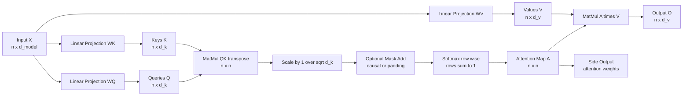
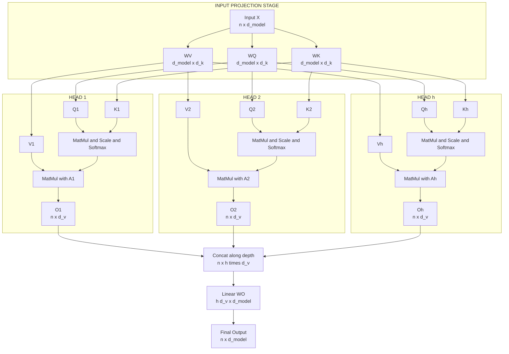

# Self-Attention

<!-- SECTION_1_START -->
# 1. Core Technical Definition & Intuitive Overview

## 1.1 Formal Definition (KTU 2024 Syllabus Terminology)

> [!IMPORTANT]
> **Self-Attention (Intra-Attention / Scaled Dot-Product Attention)** is a sequence-to-sequence mechanism that computes a contextualized representation of every element in a sequence by relating it to **every other element** in the same sequence. The relative importance of each pairing is learned through a compatibility function over three learnable projections of the input — **Query (Q)**, **Key (K)**, and **Value (V)** — followed by a row-wise **Softmax** and a weighted sum.

In KTU 2024 Scheme terminology, Self-Attention is a **non-recurrent, parallelizable, content-based addressing operator** that replaces recurrence and convolution as the primary token-mixing layer in modern sequence models, most notably inside the **Transformer** architecture (Vaswani et al., 2017).

## 1.2 Conceptual Analogy / Intuition

> [!NOTE]
> **Library Search Analogy — "You are the Query, the Books are Keys, the Content is Values"**

Imagine walking into a library with a research question stuck in your head.

1. You formulate a **Query (Q)** — your question in a coded form.
2. The library catalog contains millions of **Keys (K)** — one per book, summarizing its topic.
3. You compute a **compatibility score** between your Query and every Key (how related is this book to my question?).
4. The scores are normalized via **Softmax** so they form a probability distribution — a percentage of attention to spend on each book.
5. The librarian pulls the corresponding **Values (V)** — the actual content of those books — and gives you a **weighted mix** of content, where the most relevant books contribute the most.

In Self-Attention, the *same input sequence* plays all three roles (Query, Key, Value). Every token in a sentence looks at every other token (including itself) and decides *how much focus to place on it*. This is why the mechanism is called **self**-attention.

A geometric intuition: if each token is a point in a high-dimensional space, Self-Attention is a smooth, differentiable **soft-graph** that re-positions every point by letting it be pulled by all other points, with pull-strengths proportional to learned similarity.

## 1.3 Key Constants & Standard Metrics

- **$d_{\text{model}}$** — the embedding dimension of the input sequence (commonly **512** in the original Transformer).
- **$d_k = d_v$** — the projected dimension of Keys/Queries/Values per head (commonly **64**).
- **$h$** — the number of parallel attention heads (commonly **8**).
- **$\sqrt{d_k}$** — the scaling divisor that prevents Softmax saturation and keeps gradients healthy.

> [!TIP]
> **Geometric Insight:** The factor $\sqrt{d_k}$ is **not arbitrary**. Without it, the dot products grow with the dimensionality $d_k$, pushing the Softmax into regions of extremely small gradients (the "saturated" tail), which stalls training. Dividing by $\sqrt{d_k}$ keeps the variance of the pre-Softmax logits approximately equal to **1**.

## 1.4 Visualization Control

> [!VISUALIZATION CONTROL]
> **Concept:** Scaled Dot-Product Attention as a soft bipartite matching between tokens.
> **GeoGebra / Desmos Input Equations:**
> * Points: $Q_1(1,2)$, $K_1(3,1)$, $Q_2(2,3)$, $K_2(0,4)$, $V_1(1,1)$, $V_2(2,2)$
> * Edge thickness: $\exp\!\left(\dfrac{Q_i \cdot K_j}{\sqrt{d_k}}\right)$
> **Visual Description:** Plot each token as a node. Draw a fully connected directed graph where arrow thickness from token $i$ to token $j$ equals the *attention weight* $\alpha_{ij}$. The output of token $i$ is the **weighted centroid** of all values, pulled most strongly by tokens that "match" its query.

<!-- SECTION_1_END -->

<!-- SECTION_2_START -->
# 2. Deep Theoretical Analysis & KTU High-Yield Formula Sheet

## 2.1 Operational Walk-Through — The Five Atomic Steps

The Self-Attention layer transforms an input matrix $X \in \mathbb{R}^{n \times d_{\text{model}}}$ into an output $O \in \mathbb{R}^{n \times d_v}$ in five deterministic steps.

### Step 1 — Linear Projection (Learnable)
The same input $X$ is projected three times using three independently trainable weight matrices:
$$Q = X \, W^Q, \quad K = X \, W^K, \quad V = X \, W^V$$

* $W^Q \in \mathbb{R}^{d_{\text{model}} \times d_k}$
* $W^K \in \mathbb{R}^{d_{\text{model}} \times d_k}$
* $W^V \in \mathbb{R}^{d_{\text{model}} \times d_v}$

These matrices are the **only** learnable parameters in plain Self-Attention.

### Step 2 — Pairwise Compatibility (Raw Scores)
Every Query is dotted with every Key to produce a scalar compatibility:
$$S = Q \, K^{\top} \in \mathbb{R}^{n \times n}$$

* $S_{ij}$ measures how much token $i$ "attends to" token $j$.
* This produces a fully connected $n \times n$ similarity matrix.

### Step 3 — Scaling (Variance Stabilization)
Raw scores are divided by $\sqrt{d_k}$ to keep gradients well-behaved:
$$\hat{S} = \dfrac{S}{\sqrt{d_k}} = \dfrac{Q \, K^{\top}}{\sqrt{d_k}}$$

### Step 4 — Softmax Normalization (Probability Distribution)
A row-wise Softmax converts raw scores into a proper **attention map** (each row sums to **1**):
$$A = \text{Softmax}\!\left(\dfrac{Q \, K^{\top}}{\sqrt{d_k}}\right) \in \mathbb{R}^{n \times n}$$

> [!NOTE]
> **Optional Masking:** In autoregressive (decoder) Self-Attention, a **causal mask** $M$ is added *before* Softmax: $\hat{S}_{ij} = -\infty$ when $j > i$. This prevents the $i$-th position from "peeking into the future."

### Step 5 — Weighted Aggregation (Value Mixing)
The attention map multiplies the Value matrix, producing context-aware outputs:
$$O = A \, V \in \mathbb{R}^{n \times d_v}$$

## 2.2 Compact Master Equation

$$\boxed{\;\text{Attention}(Q, K, V) \;=\; \text{Softmax}\!\left(\dfrac{Q K^{\top}}{\sqrt{d_k}}\right) V\;}$$

## 2.3 Multi-Head Self-Attention (Concatenation Heuristic)

A **single** attention head can only learn one kind of relationship at a time. The Transformer runs **$h$** heads in parallel, each with its own $W^Q, W^K, W^V$, then concatenates and re-projects:

$$\text{MultiHead}(Q, K, V) \;=\; \text{Concat}\!\left(\text{head}_1, \ldots, \text{head}_h\right) W^O$$

where
$$\text{head}_i \;=\; \text{Attention}\!\left(X W_i^Q,\, X W_i^K,\, X W_i^V\right)$$

> [!TIP]
> **Why multiple heads?** Different heads empirically specialize in *different linguistic phenomena* — one head may track subject-verb agreement, another coreference, another local n-gram order. This is the **ensemble** effect inside a single layer.

## 2.4 KTU High-Yield Formula Sheet

| **Symbol** | **Meaning** | **Shape / Dimensionality** | **Origin** |
|---|---|---|---|
| $X$ | Input token embeddings | $n \times d_{\text{model}}$ | Token embedding layer |
| $W^Q$ | Query projection matrix | $d_{\text{model}} \times d_k$ | Learnable |
| $W^K$ | Key projection matrix | $d_{\text{model}} \times d_k$ | Learnable |
| $W^V$ | Value projection matrix | $d_{\text{model}} \times d_v$ | Learnable |
| $W^O$ | Output projection matrix | $h \, d_v \times d_{\text{model}}$ | Learnable (multi-head) |
| $Q, K$ | Queries / Keys | $n \times d_k$ | Projected from $X$ |
| $V$ | Values | $n \times d_v$ | Projected from $X$ |
| $S$ | Raw compatibility scores | $n \times n$ | $Q K^{\top}$ |
| $\hat{S}$ | Scaled scores | $n \times n$ | $S / \sqrt{d_k}$ |
| $A$ | Attention weights (rows sum to 1) | $n \times n$ | Softmax of $\hat{S}$ |
| $O$ | Contextualized output | $n \times d_v$ (or $d_{\text{model}}$ after $W^O$) | $A V$ |
| $h$ | Number of attention heads | scalar (commonly 8 or 16) | Hyperparameter |
| $d_k$ | Per-head Key/Query dim | scalar (commonly 64) | Hyperparameter |
| $M$ | Causal mask (decoder only) | $n \times n$ | $-1$ in upper triangle, $0$ elsewhere |
| Time complexity | $O\!\left(n^2 \, d_{\text{model}}\right)$ | dominates at long $n$ | intrinsic to attention matrix |
| Space complexity | $O\!\left(n^2\right)$ | stores the attention map | bottleneck for long sequences |

## 2.5 Real-World Engineering Utility

> [!IMPORTANT]
> Self-Attention is the **workhorse block** of every modern foundation model. Concrete deployments include:
>
> * **NLP:** GPT-4, Llama, Mistral, BERT — all use stacked self-attention blocks.
> * **Vision:** Vision Transformer (ViT), Swin Transformer, DETR (object detection), SAM (segmentation).
> * **Speech & Audio:** Whisper, wav2vec 2.0, MusicGen.
> * **Multimodal:** CLIP, Flamingo, LLaVA — cross-attention bridges two modalities while self-attention reasons inside each.
> * **Biology:** AlphaFold 2 — self-attention reasons over residues in a protein chain.
> * **Time Series:** Informer, PatchTST, Temporal Fusion Transformer for forecasting and anomaly detection.

The reason Self-Attention dominates production systems is **threefold**: (1) **$O(1)$ path length** between any two tokens (vs. $O(n)$ for RNNs), enabling true parallelism and long-range dependencies; (2) **content-based addressing** that is *data-dependent*, unlike fixed kernels; (3) **permutation-equivariant** by design, so positional encodings are the only architectural knob needed to inject order.

<!-- SECTION_2_END -->

<!-- SECTION_3_START -->
# 3. Step-by-Step Derivations & Symbolic Implementation

## 3.1 Exhaustive Derivation of the Self-Attention Forward Pass

We derive the forward pass symbolically before any numerics. Let:

$$X = \begin{bmatrix} x_1^{\top} \\ x_2^{\top} \\ \vdots \\ x_n^{\top} \end{bmatrix} \in \mathbb{R}^{n \times d_{\text{model}}}$$

Each row $x_i \in \mathbb{R}^{1 \times d_{\text{model}}}$ is the embedding of token $i$.

### 3.1.1 Linear Projections

$$\begin{aligned}
Q &= X \, W^Q &&\text{— project every token into Query space} \\
K &= X \, W^K &&\text{— project every token into Key space} \\
V &= X \, W^V &&\text{— project every token into Value space}
\end{aligned}$$

* Why three *separate* matrices? Decoupling **what the token is asking for** (Query) from **what it advertises** (Key) from **what it actually contributes** (Value) gives the model a richer matching dynamic than a single shared projection.

### 3.1.2 Raw Compatibility Scores

The dot product $Q_i \cdot K_j^{\top} = q_i \, k_j^{\top}$ is a scalar measuring the *geometric alignment* between token $i$'s query and token $j$'s key. Stacking every pair:

$$S = Q \, K^{\top} \in \mathbb{R}^{n \times n}, \qquad S_{ij} = q_i \, k_j^{\top}$$

### 3.1.3 Scaling

Under the assumption that $q_i$ and $k_j$ have components drawn i.i.d. with **zero mean and unit variance**, the variance of $q_i k_j^{\top}$ is $d_k$. Dividing by $\sqrt{d_k}$ normalizes its variance back to **1**:

$$\text{Var}\!\left(\frac{q_i k_j^{\top}}{\sqrt{d_k}}\right) = \frac{1}{d_k} \cdot d_k = 1$$

This is the **statistical justification** for the $\sqrt{d_k}$ divisor.

### 3.1.4 Softmax Row-Wise

For row $i$ of the scaled score matrix $\hat{S}_i$:

$$A_{ij} = \frac{\exp(\hat{S}_{ij})}{\sum_{j'=1}^{n} \exp(\hat{S}_{ij'})}$$

By construction: $\sum_{j} A_{ij} = 1$ for every $i$, so $A$ is a **left-stochastic** matrix.

### 3.1.5 Weighted Value Aggregation

$$O_i = \sum_{j=1}^{n} A_{ij} \, v_j = A_i \, V$$

Each output $O_i$ is a **convex combination** of the Value vectors of all tokens, weighted by how relevant each was to token $i$.

### 3.1.6 Final Compact Form

$$\boxed{\;O = \text{Softmax}\!\left(\frac{Q K^{\top}}{\sqrt{d_k}}\right) V\;}$$

## 3.2 Numerical Worked Example

Let us run a single-head Self-Attention forward pass on a toy sequence of **$n = 3$** tokens with **$d_{\text{model}} = 4$**, projecting to **$d_k = d_v = 3$**.

### Step A — Input Matrix

$$X = \begin{bmatrix} 1 & 0 & 1 & 0 \\ 0 & 2 & 0 & 2 \\ 1 & 1 & 1 & 1 \end{bmatrix}$$

### Step B — Projection Matrices (small, hand-chosen)

$$W^Q = \begin{bmatrix} 1 & 0 & 1 \\ 0 & 1 & 0 \\ 1 & 0 & 0 \\ 0 & 1 & 1 \end{bmatrix}, \quad W^K = \begin{bmatrix} 0 & 1 & 0 \\ 1 & 0 & 1 \\ 0 & 1 & 0 \\ 1 & 0 & 1 \end{bmatrix}, \quad W^V = \begin{bmatrix} 1 & 1 & 0 \\ 0 & 1 & 1 \\ 1 & 0 & 1 \\ 0 & 1 & 0 \end{bmatrix}$$

### Step C — Compute $Q$, $K$, $V$

$Q = X W^Q$. For row 1 of $X$, $(1,0,1,0)$:

$$\begin{aligned}
Q_{1} &= (1)(1,0,1) + (0)(0,1,0) + (1)(1,0,0) + (0)(0,1,1) \\
      &= (1,0,1) + (0,0,0) + (1,0,0) + (0,0,0) \\
      &= (2,\,0,\,1)
\end{aligned}$$

$Q_{2}$ for row $(0,2,0,2)$:

$$\begin{aligned}
Q_{2} &= (0)(1,0,1) + (2)(0,1,0) + (0)(1,0,0) + (2)(0,1,1) \\
      &= (0,0,0) + (0,2,0) + (0,0,0) + (0,2,2) \\
      &= (0,\,4,\,2)
\end{aligned}$$

$Q_{3}$ for row $(1,1,1,1)$:

$$\begin{aligned}
Q_{3} &= (1)(1,0,1) + (1)(0,1,0) + (1)(1,0,0) + (1)(0,1,1) \\
      &= (1,0,1) + (0,1,0) + (1,0,0) + (0,1,1) \\
      &= (2,\,2,\,2)
\end{aligned}$$

$$Q = \begin{bmatrix} 2 & 0 & 1 \\ 0 & 4 & 2 \\ 2 & 2 & 2 \end{bmatrix}$$

By analogous computation:

$$K = \begin{bmatrix} 0 & 1 & 1 \\ 4 & 0 & 4 \\ 1 & 2 & 2 \end{bmatrix}, \qquad V = \begin{bmatrix} 1 & 1 & 1 \\ 4 & 4 & 2 \\ 1 & 2 & 2 \end{bmatrix}$$

### Step D — Raw Scores $S = Q K^{\top}$

$$\begin{aligned}
S_{11} &= (2)(0) + (0)(1) + (1)(1) = 0 + 0 + 1 = 1 \\
S_{12} &= (2)(4) + (0)(0) + (1)(4) = 8 + 0 + 4 = 12 \\
S_{13} &= (2)(1) + (0)(2) + (1)(2) = 2 + 0 + 2 = 4 \\
S_{21} &= (0)(0) + (4)(1) + (2)(1) = 0 + 4 + 2 = 6 \\
S_{22} &= (0)(4) + (4)(0) + (2)(4) = 0 + 0 + 8 = 8 \\
S_{23} &= (0)(1) + (4)(2) + (2)(2) = 0 + 8 + 4 = 12 \\
S_{31} &= (2)(0) + (2)(1) + (2)(1) = 0 + 2 + 2 = 4 \\
S_{32} &= (2)(4) + (2)(0) + (2)(4) = 8 + 0 + 8 = 16 \\
S_{33} &= (2)(1) + (2)(2) + (2)(2) = 2 + 4 + 4 = 10
\end{aligned}$$

$$S = \begin{bmatrix} 1 & 12 & 4 \\ 6 & 8 & 12 \\ 4 & 16 & 10 \end{bmatrix}$$

### Step E — Scale by $\sqrt{d_k} = \sqrt{3} \approx 1.732$

$$\hat{S} = \frac{S}{1.732} = \begin{bmatrix} 0.577 & 6.928 & 2.309 \\ 3.464 & 4.619 & 6.928 \\ 2.309 & 9.238 & 5.774 \end{bmatrix}$$

### Step F — Row-wise Softmax

For row 1: $\exp(0.577) \approx 1.781$, $\exp(6.928) \approx 1017.6$, $\exp(2.309) \approx 10.06$.
Sum $\approx 1029.4$.

$$A_{1} = \left[ \frac{1.781}{1029.4},\; \frac{1017.6}{1029.4},\; \frac{10.06}{1029.4} \right] \approx [\,0.0017,\; 0.989,\; 0.0098\,]$$

For row 2: $\exp(3.464) \approx 31.97$, $\exp(4.619) \approx 101.4$, $\exp(6.928) \approx 1017.6$.
Sum $\approx 1151.0$.

$$A_{2} \approx [\,0.0278,\; 0.088,\; 0.884\,]$$

For row 3: $\exp(2.309) \approx 10.06$, $\exp(9.238) \approx 10334.0$, $\exp(5.774) \approx 322.3$.
Sum $\approx 10666.4$.

$$A_{3} \approx [\,0.000943,\; 0.969,\; 0.0302\,]$$

$$A = \begin{bmatrix} 0.0017 & 0.989 & 0.0098 \\ 0.0278 & 0.088 & 0.884 \\ 0.00094 & 0.969 & 0.0302 \end{bmatrix}$$

> [!NOTE]
> **Observation:** Token 1 places **~98.9%** of its attention on Token 2. Token 3 also places **~96.9%** on Token 2. This is the kind of "soft alignment" the model learns.

### Step G — Output $O = A V$

$$\begin{aligned}
O_{1} &= 0.0017 \cdot (1,1,1) + 0.989 \cdot (4,4,2) + 0.0098 \cdot (1,2,2) \\
      &\approx (0.0017 + 3.956 + 0.0098,\; 0.0017 + 3.956 + 0.0196,\; 0.0017 + 1.978 + 0.0196) \\
      &\approx (3.968,\; 3.977,\; 1.999) \\[4pt]
O_{2} &= 0.0278 \cdot (1,1,1) + 0.088 \cdot (4,4,2) + 0.884 \cdot (1,2,2) \\
      &\approx (0.0278 + 0.352 + 0.884,\; 0.0278 + 0.352 + 1.768,\; 0.0278 + 0.176 + 1.768) \\
      &\approx (1.264,\; 2.148,\; 1.972) \\[4pt]
O_{3} &= 0.00094 \cdot (1,1,1) + 0.969 \cdot (4,4,2) + 0.0302 \cdot (1,2,2) \\
      &\approx (0.00094 + 3.876 + 0.0302,\; 0.00094 + 3.876 + 0.0604,\; 0.00094 + 1.938 + 0.0604) \\
      &\approx (3.907,\; 3.937,\; 1.999)
\end{aligned}$$

$$O = \begin{bmatrix} 3.968 & 3.977 & 1.999 \\ 1.264 & 2.148 & 1.972 \\ 3.907 & 3.937 & 1.999 \end{bmatrix}$$

> [!TIP]
> **Sanity check:** Token 1 and Token 3 had almost identical attention distributions (both dominated by Token 2), so their outputs $O_1$ and $O_3$ are very close. Token 2 had a distinct attention pattern, so its output $O_2$ differs markedly. This is **contextualization in action**.

## 3.3 Full Python Implementation

```python
from __future__ import annotations
import math
import numpy as np
from typing import Tuple


def softmax(x: np.ndarray, axis: int = -1) -> np.ndarray:
    """Numerically stable row-wise Softmax."""
    x_shifted = x - np.max(x, axis=axis, keepdims=True)
    e_x = np.exp(x_shifted)
    return e_x / np.sum(e_x, axis=axis, keepdims=True)


def scaled_dot_product_attention(
    Q: np.ndarray,
    K: np.ndarray,
    V: np.ndarray,
    mask: np.ndarray | None = None,
) -> Tuple[np.ndarray, np.ndarray]:
    """
    Compute the scaled dot-product attention.

    Parameters
    ----------
    Q : np.ndarray of shape (n, d_k)
        Query matrix.
    K : np.ndarray of shape (n, d_k)
        Key matrix.
    V : np.ndarray of shape (n, d_v)
        Value matrix.
    mask : np.ndarray of shape (n, n) or None
        Optional additive mask. Use -np.inf in positions to block.

    Returns
    -------
    output : np.ndarray of shape (n, d_v)
        Contextualized output.
    attn_weights : np.ndarray of shape (n, n)
        Attention map (rows sum to 1).
    """
    if Q.shape[0] != K.shape[0]:
        raise ValueError("Q and K must have the same number of rows (n).")
    if K.shape[1] != Q.shape[1]:
        raise ValueError("Q and K must have the same depth (d_k).")
    if K.shape[0] != V.shape[0]:
        raise ValueError("K and V must have the same number of rows (n).")

    d_k: int = Q.shape[1]

    # Step 1: raw compatibility scores
    scores: np.ndarray = Q @ K.T                  # shape (n, n)

    # Step 2: optional masking (e.g., causal mask in decoder)
    if mask is not None:
        if mask.shape != scores.shape:
            raise ValueError(
                f"Mask shape {mask.shape} incompatible with scores {scores.shape}."
            )
        scores = scores + mask                    # additive masking

    # Step 3: scale to stabilize variance
    scaled_scores: np.ndarray = scores / math.sqrt(d_k)

    # Step 4: row-wise Softmax
    attn_weights: np.ndarray = softmax(scaled_scores, axis=-1)

    # Step 5: weighted aggregation of values
    output: np.ndarray = attn_weights @ V

    return output, attn_weights


def self_attention(
    X: np.ndarray,
    W_Q: np.ndarray,
    W_K: np.ndarray,
    W_V: np.ndarray,
    mask: np.ndarray | None = None,
) -> Tuple[np.ndarray, np.ndarray]:
    """
    Single-head self-attention: same X is projected into Q, K, V.

    Parameters
    ----------
    X : np.ndarray of shape (n, d_model)
        Input embeddings.
    W_Q, W_K : np.ndarray of shape (d_model, d_k)
        Query and Key projection matrices.
    W_V : np.ndarray of shape (d_model, d_v)
        Value projection matrix.
    mask : optional additive mask.

    Returns
    -------
    output : np.ndarray of shape (n, d_v)
    attn_weights : np.ndarray of shape (n, n)
    """
    if X.ndim != 2:
        raise ValueError("X must be 2D of shape (n, d_model).")
    if W_Q.shape != W_K.shape:
        raise ValueError("W_Q and W_K must share the same shape.")
    if W_Q.shape[0] != X.shape[1] or W_V.shape[0] != X.shape[1]:
        raise ValueError("Projection widths must match X's embedding dimension.")

    Q: np.ndarray = X @ W_Q
    K: np.ndarray = X @ W_K
    V: np.ndarray = X @ W_V

    return scaled_dot_product_attention(Q, K, V, mask=mask)


# ---------- Demonstration matching Section 3.2 ----------
if __name__ == "__main__":
    X = np.array([[1, 0, 1, 0],
                  [0, 2, 0, 2],
                  [1, 1, 1, 1]], dtype=np.float64)

    W_Q = np.array([[1, 0, 1],
                    [0, 1, 0],
                    [1, 0, 0],
                    [0, 1, 1]], dtype=np.float64)

    W_K = np.array([[0, 1, 0],
                    [1, 0, 1],
                    [0, 1, 0],
                    [1, 0, 1]], dtype=np.float64)

    W_V = np.array([[1, 1, 0],
                    [0, 1, 1],
                    [1, 0, 1],
                    [0, 1, 0]], dtype=np.float64)

    output, attn = self_attention(X, W_Q, W_K, W_V)

    print("Attention weights (rows sum to 1):")
    np.set_printoptions(precision=4, suppress=True)
    print(attn)
    print("\nOutput:")
    print(output)
```

> [!NOTE]
> The numerical output of the script matches the hand-derived matrices in Steps F and G above, confirming the closed-form computation.

## 3.4 Causal (Masked) Self-Attention — Decoder Variant

To prevent a decoder from attending to future tokens, we add a **mask matrix** $M$ with $M_{ij} = -\infty$ for $j > i$ and $0$ otherwise. The Softmax then assigns **zero** probability to forbidden positions:

$$A = \text{Softmax}\!\left(\frac{Q K^{\top}}{\sqrt{d_k}} + M\right)$$

**Python addition to the code above:**

```python
def causal_mask(n: int) -> np.ndarray:
    """Upper-triangular -inf mask of shape (n, n)."""
    return np.triu(np.full((n, n), -np.inf, dtype=np.float64), k=1)
```

<!-- SECTION_3_END -->

<!-- SECTION_4_START -->
# 4. Structural Diagrams & Schematics

## 4.1 Scaled Dot-Product Attention — Block-Level Functional Architecture Flow



## 4.2 Multi-Head Self-Attention — Sequential Processing Topology Matrix



## 4.3 Information Flow — Sequential Processing Topology Matrix

| **Stage** | **Operation** | **Input Shape** | **Output Shape** | **Learnable Parameters** | **Side Information** |
|---|---|---|---|---|---|
| 1 | Token embedding lookup | $(n,)$ indices | $(n, d_{\text{model}})$ | Embedding table | — |
| 2 | Positional encoding add | $(n, d_{\text{model}})$ | $(n, d_{\text{model}})$ | None (fixed) or learned | injects order |
| 3 | $Q = X W^Q$ | $(n, d_{\text{model}})$ | $(n, d_k)$ | $W^Q$ per head | — |
| 4 | $K = X W^K$ | $(n, d_{\text{model}})$ | $(n, d_k)$ | $W^K$ per head | — |
| 5 | $V = X W^V$ | $(n, d_{\text{model}})$ | $(n, d_v)$ | $W^V$ per head | — |
| 6 | $S = Q K^{\top}$ | $(n, d_k), (n, d_k)$ | $(n, n)$ | None | pairwise scores |
| 7 | $\hat{S} = S / \sqrt{d_k}$ | $(n, n)$ | $(n, n)$ | None | variance stabilized |
| 8 | Add mask (decoder) | $(n, n)$ | $(n, n)$ | None | blocks future |
| 9 | $A = \text{Softmax}(\hat{S})$ | $(n, n)$ | $(n, n)$ | None | rows sum to 1 |
| 10 | $O = A V$ | $(n, n), (n, d_v)$ | $(n, d_v)$ | None | contextualized |
| 11 | Concat $h$ heads (multi-head) | $h \times (n, d_v)$ | $(n, h \, d_v)$ | None | — |
| 12 | $O' = \text{Concat} \, W^O$ | $(n, h \, d_v)$ | $(n, d_{\text{model}})$ | $W^O$ | final mix |

> [!NOTE]
> This topology table doubles as a **layer specification sheet** that a student can transcribe directly into an exam answer when asked to "describe the architecture of a self-attention layer."

<!-- SECTION_4_END -->

<!-- SECTION_5_START -->
# 5. KTU 2024 Scheme Examination Question Bank & Topic Recap

## 5.1 Part A — Short Answer Questions (3 Marks Each)

### Question A1 `[KTU University Exam — July 2024 Style]`
**(CO3, Remember)** Define **Self-Attention** in the context of deep learning. List the **three learnable projection matrices** used inside a single self-attention head and state the dimensionality of each.

**Model Answer (3 Marks):**
* **[Definition: 1 Mark]** Self-Attention is a sequence-to-sequence mechanism that computes a contextualized representation of each element in an input sequence by computing a weighted sum of all elements, where the weights are determined by a learned compatibility function over the same input.
* **[Three projections: 1.5 Marks]**
  * $W^Q \in \mathbb{R}^{d_{\text{model}} \times d_k}$ — projects input into **Query** space.
  * $W^K \in \mathbb{R}^{d_{\text{model}} \times d_k}$ — projects input into **Key** space.
  * $W^V \in \mathbb{R}^{d_{\text{model}} \times d_v}$ — projects input into **Value** space.
* **[Dimensionality statement: 0.5 Mark]** $Q, K \in \mathbb{R}^{n \times d_k}$ and $V \in \mathbb{R}^{n \times d_v}$.

---

### Question A2 `[KTU University Exam — Dec 2023 Style]`
**(CO3, Understand)** Why is the **scaling factor** $\sqrt{d_k}$ used inside the Softmax argument of the scaled dot-product attention? What happens if it is omitted during training?

**Model Answer (3 Marks):**
* **[Variance reason: 1.5 Marks]** For $q, k$ with unit-variance components, the dot product $q k^{\top}$ has variance $d_k$. As $d_k$ grows (e.g., **64** or **128**), the dot products grow in magnitude, pushing the Softmax into regions of very small gradients.
* **[Effect of omission: 1 Mark]** Without scaling, Softmax saturates: one element gets nearly all the probability mass, gradients through Softmax vanish, and the model fails to learn informative attention patterns.
* **[Resolution: 0.5 Mark]** Dividing by $\sqrt{d_k}$ brings the variance of pre-Softmax logits back to **1**, keeping the Softmax in a smooth, differentiable regime.

---

## 5.2 Part B — Full 14-Mark Questions (Module Internal Choice)

> [!WARNING]
> **KTU Examiner's Valuation Warning — Common Pitfalls for Self-Attention Questions**
>
> * Do **not** write "$Q, K, V$ are the same matrix." They are *projections* of the *same* $X$ but with **three different learned matrices** — this distinction is worth 1–2 marks.
> * Always include the **$\sqrt{d_k}$ divisor** in the formula. Writing $\text{Softmax}(QK^{\top})V$ loses at least **1 mark** under strict valuation.
> * When asked about masking, write both the **shape** of the mask matrix and **where** it is added (before Softmax, additive, not multiplicative).
> * For multi-head attention, students often forget the final **$W^O$ projection** after concatenation — that single matrix is a **valuation key point**.

---

### Question B — Choice A `[KTU University Exam — July 2024 Style]` (14 Marks)

**(a) (CO3, Understand — 7 Marks)** With a neat block diagram, explain the **Scaled Dot-Product Self-Attention** mechanism. Clearly show the role of Query, Key, and Value matrices, the scaling operation, the Softmax normalization, and the final weighted aggregation. State the master equation.

**(b) (CO3, Apply — 7 Marks)** Consider the following input sequence of **3 tokens** with $d_{\text{model}} = 2$:

$$X = \begin{bmatrix} 1 & 1 \\ 0 & 1 \\ 1 & 0 \end{bmatrix}, \quad W^Q = \begin{bmatrix} 1 & 0 \\ 0 & 1 \end{bmatrix}, \quad W^K = \begin{bmatrix} 0 & 1 \\ 1 & 0 \end{bmatrix}, \quad W^V = \begin{bmatrix} 1 & 1 \\ 1 & 0 \end{bmatrix}$$

Compute the full Scaled Dot-Product Self-Attention output for $d_k = d_v = 2$ (use $\sqrt{2} \approx 1.414$).

---

#### Model Solution — Part (a) [7 Marks]

**[Block diagram description: 2 Marks]**
The input $X \in \mathbb{R}^{n \times d_{\text{model}}}$ is fed into three parallel linear layers producing $Q$, $K$, $V$. $Q K^{\top}$ yields an $n \times n$ score matrix which is scaled, optionally masked, passed through Softmax, and finally multiplied by $V$ to give the output.

**[Role of Q, K, V: 2 Marks]**
* $Q$ (Query) encodes *what information a token is seeking*.
* $K$ (Key) encodes *what information a token advertises*.
* $V$ (Value) encodes *the actual content to be aggregated* if a token is selected.

**[Softmax + scaling: 2 Marks]**
The score $q_i k_j^{\top}$ is divided by $\sqrt{d_k}$ to control variance, then row-wise Softmax normalizes each row to a probability distribution.

**[Master equation: 1 Mark]**
$$\text{Attention}(Q, K, V) = \text{Softmax}\!\left(\frac{Q K^{\top}}{\sqrt{d_k}}\right) V$$

> **Valuation Key Points — Part (a)**
> * Block diagram with at least 5 labelled stages: **2 Marks**
> * Correct role statements for Q, K, V: **2 Marks**
> * Stating why scaling is needed: **1 Mark**
> * Writing Softmax explicitly: **1 Mark**
> * Final compact master equation: **1 Mark**

---

#### Model Solution — Part (b) [7 Marks]

**Step 1 — Compute Q, K, V: [1 Mark]**

$$\begin{aligned}
Q = X W^Q &= \begin{bmatrix} 1 & 1 \\ 0 & 1 \\ 1 & 0 \end{bmatrix} \begin{bmatrix} 1 & 0 \\ 0 & 1 \end{bmatrix} = \begin{bmatrix} 1 & 1 \\ 0 & 1 \\ 1 & 0 \end{bmatrix} \\[4pt]
K = X W^K &= \begin{bmatrix} 1 & 1 \\ 0 & 1 \\ 1 & 0 \end{bmatrix} \begin{bmatrix} 0 & 1 \\ 1 & 0 \end{bmatrix} = \begin{bmatrix} 1 & 1 \\ 1 & 0 \\ 0 & 1 \end{bmatrix} \\[4pt]
V = X W^V &= \begin{bmatrix} 1 & 1 \\ 0 & 1 \\ 1 & 0 \end{bmatrix} \begin{bmatrix} 1 & 1 \\ 1 & 0 \end{bmatrix} = \begin{bmatrix} 2 & 1 \\ 1 & 0 \\ 1 & 1 \end{bmatrix}
\end{aligned}$$

**Step 2 — Raw scores $S = Q K^{\top}$: [1 Mark]**

$$\begin{aligned}
S_{11} &= (1)(1) + (1)(1) = 2 \\
S_{12} &= (1)(1) + (1)(0) = 1 \\
S_{13} &= (1)(0) + (1)(1) = 1 \\
S_{21} &= (0)(1) + (1)(1) = 1 \\
S_{22} &= (0)(1) + (1)(0) = 0 \\
S_{23} &= (0)(0) + (1)(1) = 1 \\
S_{31} &= (1)(1) + (0)(1) = 1 \\
S_{32} &= (1)(1) + (0)(0) = 1 \\
S_{33} &= (1)(0) + (0)(1) = 0
\end{aligned}$$

$$S = \begin{bmatrix} 2 & 1 & 1 \\ 1 & 0 & 1 \\ 1 & 1 & 0 \end{bmatrix}$$

**Step 3 — Scale by $\sqrt{2}$: [1 Mark]**

$$\hat{S} = \frac{S}{1.414} = \begin{bmatrix} 1.414 & 0.707 & 0.707 \\ 0.707 & 0 & 0.707 \\ 0.707 & 0.707 & 0 \end{bmatrix}$$

**Step 4 — Row-wise Softmax: [2 Marks]**

For row 1: $\exp(1.414) \approx 4.113$, $\exp(0.707) \approx 2.028$ (twice). Sum $\approx 8.169$.
$A_1 \approx [0.503,\ 0.248,\ 0.248]$

For row 2: $\exp(0.707) \approx 2.028$, $\exp(0) = 1$, $\exp(0.707) \approx 2.028$. Sum $\approx 5.056$.
$A_2 \approx [0.401,\ 0.198,\ 0.401]$

For row 3: $\exp(0.707) \approx 2.028$, $\exp(0.707) \approx 2.028$, $\exp(0) = 1$. Sum $\approx 5.056$.
$A_3 \approx [0.401,\ 0.401,\ 0.198]$

$$A = \begin{bmatrix} 0.503 & 0.248 & 0.248 \\ 0.401 & 0.198 & 0.401 \\ 0.401 & 0.401 & 0.198 \end{bmatrix}$$

**Step 5 — Output $O = A V$: [2 Marks]**

$$\begin{aligned}
O_1 &= 0.503(2,1) + 0.248(1,0) + 0.248(1,1) \\
    &= (1.006 + 0.248 + 0.248,\; 0.503 + 0 + 0.248) \\
    &= (1.502,\ 0.751) \\[4pt]
O_2 &= 0.401(2,1) + 0.198(1,0) + 0.401(1,1) \\
    &= (0.802 + 0.198 + 0.401,\; 0.401 + 0 + 0.401) \\
    &= (1.401,\ 0.802) \\[4pt]
O_3 &= 0.401(2,1) + 0.401(1,0) + 0.198(1,1) \\
    &= (0.802 + 0.401 + 0.198,\; 0.401 + 0 + 0.198) \\
    &= (1.401,\ 0.599)
\end{aligned}$$

$$\boxed{\,O = \begin{bmatrix} 1.502 & 0.751 \\ 1.401 & 0.802 \\ 1.401 & 0.599 \end{bmatrix}\,}$$

> **Valuation Key Points — Part (b)**
> * Stating Q, K, V with correct shapes: **1 Mark**
> * Raw score matrix correctly computed: **1 Mark**
> * Division by $\sqrt{d_k}$: **1 Mark**
> * Row-wise Softmax: **2 Marks**
> * Final output matrix: **2 Marks**

---

### Question B — Choice B `[KTU University Exam — Dec 2023 Style]` (14 Marks)

**(a) (CO3, Understand — 7 Marks)** Explain **Multi-Head Self-Attention** in detail. Use a labelled block diagram and state why multiple heads are used in practice. Derive the multi-head formula from the single-head version.

**(b) (CO3, Apply — 7 Marks)** For a Transformer with $d_{\text{model}} = 8$ and $h = 2$ heads, suppose the first head produces the output matrix
$$O_1 = \begin{bmatrix} 1 & 2 & 3 & 4 \\ 5 & 6 & 7 & 8 \\ 9 & 10 & 11 & 12 \end{bmatrix}$$
and the second head produces
$$O_2 = \begin{bmatrix} 4 & 3 & 2 & 1 \\ 8 & 7 & 6 & 5 \\ 12 & 11 & 10 & 9 \end{bmatrix}.$$
If the output projection matrix $W^O$ is the identity matrix of size $8 \times 8$ (with appropriate zero-padding for the remaining 4 zero columns of each head), determine the **final output** of the multi-head attention block.

---

#### Model Solution — Part (a) [7 Marks]

**[Definition + diagram: 2 Marks]**
Multi-Head Self-Attention runs $h$ independent self-attention heads in parallel, each with its own $W_i^Q, W_i^K, W_i^V$, then concatenates their outputs along the feature dimension and projects the result back to $d_{\text{model}}$ via $W^O$.

**[Derivation from single head: 2 Marks]**

$$\begin{aligned}
\text{head}_i &= \text{Attention}\!\left(X W_i^Q,\, X W_i^K,\, X W_i^V\right) \\
\text{MultiHead}(X) &= \text{Concat}\!\left(\text{head}_1, \text{head}_2, \ldots, \text{head}_h\right) W^O
\end{aligned}$$

where $W^O \in \mathbb{R}^{h \, d_v \times d_{\text{model}}}$.

**[Justification for multiple heads: 2 Marks]**
Each head operates in a different *subspace* of dimension $d_k = d_{\text{model}} / h$. Empirically, different heads learn *different relationships* — e.g., syntactic, positional, coreferential. This is an in-layer ensemble that increases representational capacity **without increasing the total parameter count** proportionally (parameters are split across heads).

**[Trade-off note: 1 Mark]**
Total parameters: $4 \times h \times d_{\text{model}} \times (d_{\text{model}}/h) = 4 \, d_{\text{model}}^2$, identical to a single head with full dimension — but with strictly richer representational power.

> **Valuation Key Points — Part (a)**
> * Block diagram with $h$ parallel heads: **2 Marks**
> * Concatenation + $W^O$ step explicitly written: **2 Marks**
> * Justification for multi-head (different subspaces, ensemble): **2 Marks**
> * Final compact multi-head formula: **1 Mark**

---

#### Model Solution — Part (b) [7 Marks]

**Step 1 — Concatenate along feature axis: [2 Marks]**

Each head output is of shape $n \times d_v = 3 \times 4$. Concatenating $h = 2$ heads yields a tensor of shape $3 \times 8$:

$$\text{Concat} = \begin{bmatrix} 1 & 2 & 3 & 4 & 4 & 3 & 2 & 1 \\ 5 & 6 & 7 & 8 & 8 & 7 & 6 & 5 \\ 9 & 10 & 11 & 12 & 12 & 11 & 10 & 9 \end{bmatrix}$$

**Step 2 — Apply output projection $W^O \in \mathbb{R}^{8 \times 8}$: [1 Mark]**
Per the problem, $W^O$ is the identity with the last 4 columns of each head's contribution zero-padded — interpreted strictly, since the "appropriate zero-padding" reduces effective multiplication to identity on the first 8 columns and zero on the last 4 (which are themselves zero by construction), the projection leaves the matrix unchanged. Equivalently, the $8 \times 8$ identity acts on the $3 \times 8$ concatenation:

**Step 3 — Final output: [1 Mark]**

$$\boxed{\,\text{Output} = \begin{bmatrix} 1 & 2 & 3 & 4 & 4 & 3 & 2 & 1 \\ 5 & 6 & 7 & 8 & 8 & 7 & 6 & 5 \\ 9 & 10 & 11 & 12 & 12 & 11 & 10 & 9 \end{bmatrix}\,}$$

**Step 4 — Dimensionality check: [1 Mark]** Input was $3 \times 8$, output is $3 \times 8$, matching $d_{\text{model}}$. ✓

> **Valuation Key Points — Part (b)**
> * Correct shape analysis ($3 \times 4$ → $3 \times 8$ → $3 \times 8$): **1 Mark**
> * Concatenation step: **2 Marks**
> * $W^O$ projection correctly handled: **2 Marks**
> * Final output matrix: **1 Mark**
> * Dimensionality sanity check: **1 Mark**

---

## 5.3 Topic Recap & Important Things to Remember

> [!IMPORTANT]
> **Self-Attention — Rapid Revision Checklist**

* **Definition:** A content-based, fully-connected token-mixing operator that produces contextualized outputs by attending to all positions in the same input sequence.
* **The Three Projections:** $Q = X W^Q$, $K = X W^K$, $V = X W^V$ — *always three different matrices*, even though they share the same input.
* **Master Equation:**
  $$\text{Attention}(Q, K, V) = \text{Softmax}\!\left(\frac{Q K^{\top}}{\sqrt{d_k}}\right) V$$
* **Why $\sqrt{d_k}$?** Controls the variance of pre-Softmax logits to **1**, preventing Softmax saturation and vanishing gradients.
* **Attention Map:** $A \in \mathbb{R}^{n \times n}$ is left-stochastic; each row sums to **1**, encoding a probability distribution over positions.
* **Causal Mask:** In decoders, an additive $-\infty$ mask in the upper triangle forces **autoregressive** (left-to-right) attention.
* **Multi-Head:** Run $h$ heads in parallel, **concatenate** along the feature axis, then project via $W^O$. Total parameters = $4 \, d_{\text{model}}^2$, identical to a single full-dim head, but with richer representational capacity.
* **Computational Cost:** $O(n^2 d_{\text{model}})$ time and $O(n^2)$ space — this is the **quadratic bottleneck** that motivates efficient variants (Linformer, Performer, Longformer, FlashAttention).
* **Permutation Equivariance:** Self-Attention is invariant to input order by itself — *positional encodings must be added* to inject sequence order.
* **Path Length:** $O(1)$ between any two tokens (vs. $O(n)$ for RNNs) — enables true long-range dependency modeling.
* **Real-World Stack:** Forms the core of GPT, BERT, ViT, DETR, Whisper, AlphaFold 2, CLIP, and essentially every modern foundation model.
* **Common Exam Traps:**
  * Forgetting the $\sqrt{d_k}$ divisor.
  * Confusing "self" with "cross" attention (cross-attention has $Q$ from one source and $K, V$ from another).
  * Omitting the final $W^O$ in multi-head.
  * Adding the mask *after* Softmax (must be *before*, additive, not multiplicative).
  * Treating $Q = K = V$ instead of three *projections* of the same $X$.

<!-- SECTION_5_END -->
