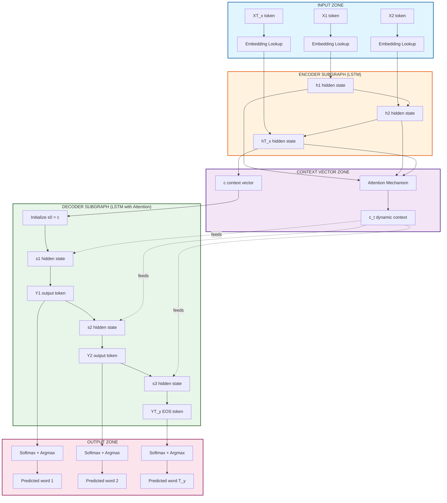
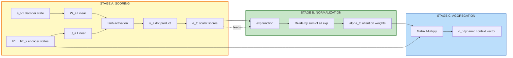
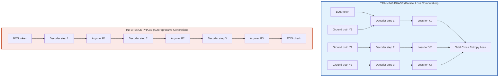

# Sequence-to-Sequence

<!-- SECTION_1_START -->

# Sequence-to-Sequence (Seq2Seq) Models

## 1. Core Technical Definition

> [!NOTE]
> **Formal KTU Definition:** A **Sequence-to-Sequence (Seq2Seq) model** is a deep learning architecture designed to transform an input sequence of arbitrary length into an output sequence of arbitrary (and possibly different) length. It is composed of two coupled Recurrent Neural Network (RNN) sub-modules: an **Encoder**, which compresses the entire input sequence into a fixed-dimensional latent representation called the **Context Vector** ($c$ or $h_T$), and a **Decoder**, which generates the output sequence one token at a time, conditioned on this context vector.

The Seq2Seq paradigm was formally introduced by **Sutskever, Vinyals, and Le (2014)** in the seminal paper *"Sequence to Sequence Learning with Neural Networks"* at Google Brain, and later enhanced by **Bahdanau et al. (2014)** through the introduction of the **Attention Mechanism**. The architecture solved a critical structural limitation in classical RNNs: the inability to handle variable-length input-to-variable-length output mappings.

### 1.1 Intuitive Analogy: The Bilingual Human Translator

> [!IMPORTANT]
> **Conceptual Analogy (The Universal Translator):**
> Imagine a human translator sitting in a soundproof booth between two people speaking different languages.
> 1. **The Listener (Encoder):** The translator *listens* to the entire English sentence first ("How are you doing today?"). They do not translate word-by-word in real-time. Instead, they build a complete *mental understanding* (the context vector) of the meaning, intent, tone, and grammar of the whole sentence.
> 2. **The Context Vector (Mental Model):** This is the *thought* in the translator's head. It is a high-dimensional neural representation, not a word. It encodes everything the encoder heard.
> 3. **The Speaker (Decoder):** Now, the translator begins to speak in French, generating the sentence token-by-token ("Comment", "allez", "-vous", "aujourd'hui", "?"). Each word they say influences the next word, and the *mental model* guides every choice.
>
> **The Bug:** If the English sentence is very long (a paragraph), the translator might forget the beginning! This is called the **Information Bottleneck Problem**, which is exactly why **Attention** was invented — it allows the decoder to "look back" at any part of the input as needed.

### 1.2 Mathematical Primitives & Standard Metrics

The architecture operates on a sequence of input tokens $X = (x_1, x_2, \ldots, x_{T_x})$ and produces an output sequence $Y = (y_1, y_2, \ldots, y_{T_y})$. The canonical training objective is the **Categorical Cross-Entropy Loss** summed over the output sequence:

$$\mathcal{L} = -\sum_{t=1}^{T_y} \log P(y_t \mid y_{<t}, c)$$

where $c$ is the encoder's final hidden state. The standard metric for translation quality is the **BLEU Score** (Bilingual Evaluation Understudy), with values ranging from **0.0 to 1.0**, where **1.0** indicates a perfect translation match.

### 1.3 Visualization Control

> [!VISUALIZATION CONTROL]
> **Concept:** Variable-Length Sequence Compression and Reconstruction
> **GeoGebra / Desmos Input Equations (for the information bottleneck illusion):**
> * Encoder hidden state update: $h_t = \tanh(W_h \cdot h_{t-1} + W_x \cdot x_t + b)$
> * Context vector projection: $c = h_{T_x}$ (single point summarizing a long input)
> * Decoder sampling probability: $P(y_t) = \frac{e^{z_t}}{\sum_j e^{z_j}}$ (softmax over vocabulary)
> **Visual Description:** Visualize a long sequence of points flowing into a single "funnel point" (the context vector $c$), and then expanding back out into a different length sequence. The student should note that as the input length $T_x$ increases, the single point $c$ must encode exponentially more information, leading to gradient vanishing.

<!-- SECTION_1_END -->

<!-- SECTION_2_START -->

# 2. Deep Theoretical Analysis & KTU High-Yield Formula Sheet

## 2.1 Operational Breakdown of the Vanilla Seq2Seq Architecture

The vanilla Seq2Seq model (Sutskever et al., 2014) operates through a strict, sequential data flow pipeline. We dissect this into seven structured logic stages:

- **Stage 1 — Tokenization & Embedding:** Each discrete input token $x_t$ (a word, character, or sub-word) is mapped to a dense, low-dimensional vector $e_t \in \mathbb{R}^d$ via a learned embedding matrix $E \in \mathbb{R}^{V \times d}$, where $V$ is the vocabulary size. The formula is $e_t = E \cdot \text{onehot}(x_t)$.

- **Stage 2 — Encoder Recurrence:** The embedded vector $e_t$ is fed into an RNN cell (LSTM, GRU, or vanilla RNN). The cell maintains a hidden state $h_t$ that is updated at every time step. The LSTM version uses three gating mechanisms (input $i_t$, forget $f_t$, output $o_t$) to mitigate gradient vanishing.

- **Stage 3 — Context Vector Generation:** After processing the entire input sequence, the final hidden state $h_{T_x}$ is designated as the **Context Vector** $c$. This vector is the *only* piece of information passed from the encoder to the decoder. The encoder is then discarded.

- **Stage 4 — Decoder Initialization:** The context vector $c$ initializes the decoder's initial hidden state $s_0 = c$. In some variants, $c$ is also passed as an input at every time step of the decoder.

- **Stage 5 — Autoregressive Decoding:** The decoder generates the output sequence one token at a time. At each step $t$, it receives the previously generated token $y_{t-1}$ (during training, this is the *teacher-forced* ground truth) and updates its hidden state $s_t$.

- **Stage 6 — Output Projection & Softmax:** The decoder hidden state $s_t$ is projected through a linear layer $V \in \mathbb{R}^{d \times V'}$ and normalized via the **Softmax function** to produce a probability distribution over the output vocabulary.

- **Stage 7 — Token Sampling:** The next token $y_t$ is selected from this distribution. During *inference*, strategies like **Greedy Decoding** (pick the max) or **Beam Search** (keep top-$k$ hypotheses) are used. During *training*, the ground truth is fed directly.

> [!IMPORTANT]
> **Why "Autoregressive"?** The decoder uses its own previous outputs as inputs for future predictions. This creates a temporal dependency chain $y_t = f(y_{<t}, c)$ that makes parallelization during inference impossible, though **Teacher Forcing** during training allows parallel loss computation across the time dimension.

## 2.2 KTU Formula Sheet / Cheat Sheet

| **Component** | **Equation** | **Dimensions** | **Engineering Purpose** |
|---|---|---|---|
| Embedding Lookup | $e_t = E[x_t]$ | $\mathbb{R}^{d}$ | Maps discrete tokens to dense vectors |
| LSTM Input Gate | $i_t = \sigma(W_i [h_{t-1}, x_t] + b_i)$ | $\mathbb{R}^{H}$ | Controls what new info to write to cell state |
| LSTM Forget Gate | $f_t = \sigma(W_f [h_{t-1}, x_t] + b_f)$ | $\mathbb{R}^{H}$ | Controls what info to discard from cell state |
| LSTM Output Gate | $o_t = \sigma(W_o [h_{t-1}, x_t] + b_o)$ | $\mathbb{R}^{H}$ | Controls what parts of cell state to output |
| Cell State Update | $C_t = f_t \odot C_{t-1} + i_t \odot \tilde{C}_t$ | $\mathbb{R}^{H}$ | Long-term memory highway (key to LSTM) |
| Hidden State Update | $h_t = o_t \odot \tanh(C_t)$ | $\mathbb{R}^{H}$ | Short-term working memory output |
| Context Vector | $c = h_{T_x}$ | $\mathbb{R}^{H}$ | Final encoder summary passed to decoder |
| Decoder Output | $\hat{y}_t = \text{softmax}(V \cdot s_t + b)$ | $\mathbb{R}^{V'}$ | Probability distribution over output vocab |
| Cross-Entropy Loss | $\mathcal{L} = -\sum_t \log P(y_t^* \mid y_{<t}, c)$ | Scalar | Training objective to minimize |
| Attention Score (Bahdanau) | $e_{t,t'} = v_a^T \tanh(W_a s_{t-1} + U_a h_{t'})$ | Scalar | Alignment score between decoder step & encoder step |
| Attention Weights | $\alpha_{t,t'} = \frac{\exp(e_{t,t'})}{\sum_{k=1}^{T_x} \exp(e_{t,k})}$ | Scalar | Soft alignment distribution over input positions |
| Attention Context | $c_t = \sum_{t'=1}^{T_x} \alpha_{t,t'} \cdot h_{t'}$ | $\mathbb{R}^{H}$ | Dynamic, time-step-specific context vector |

> [!IMPORTANT]
> **KTU High-Yield Note:** The Bahdanau Attention formula (Additive Attention) is the single most tested component in Module 3. Students must be able to derive $e_{t,t'} \rightarrow \alpha_{t,t'} \rightarrow c_t$ from memory and explain why it solves the **Information Bottleneck** problem by replacing the single static context vector $c$ with a dynamic, time-varying context $c_t$.

## 2.3 Real-World Engineering Utility

Seq2Seq architectures are the backbone of production systems across the global tech industry:

- **Neural Machine Translation (NMT):** Google Translate, DeepL, and Microsoft Translator all use Seq2Seq variants (now evolved into Transformers, which are non-recurrent Seq2Seq models).
- **Speech Recognition:** Models like DeepSpeech 2 use Seq2Seq to map audio spectrograms to text transcripts.
- **Chatbots & Conversational AI:** Early customer service bots and dialogue systems used encoder-decoder RNNs to map user utterances to system responses.
- **Code Generation:** Tools like GitHub Copilot's predecessors used Seq2Seq to translate natural language descriptions into source code.
- **Time-Series Forecasting:** Predicting stock prices, weather patterns, and energy loads by mapping past observations to future values.
- **Image Captioning:** A CNN encoder (replacing the RNN encoder) feeds visual features to an RNN decoder to generate natural language descriptions.

<!-- SECTION_2_END -->

<!-- SECTION_3_START -->

# 3. Step-by-Step Derivations & Code/Symbolic Implementation

## 3.1 Exhaustive Mathematical Derivation: Bahdanau Additive Attention

We will derive the attention mechanism from first principles, showing every algebraic transition. The goal is to compute a *dynamic context vector* $c_t$ at every decoder time step $t$, which is a weighted sum of all encoder hidden states $\{h_1, h_2, \ldots, h_{T_x}\}$.

**Step 1 — Define the Alignment Score Function.**
The alignment model $a$ is a feedforward neural network that is jointly trained with the encoder-decoder system. It takes as input the previous decoder hidden state $s_{t-1}$ and a specific encoder hidden state $h_{t'}$:

$$
a(s_{t-1}, h_{t'}) = v_a^T \tanh(W_a s_{t-1} + U_a h_{t'})
$$

Here, $W_a \in \mathbb{R}^{n \times H}$, $U_a \in \mathbb{R}^{n \times H}$, and $v_a \in \mathbb{R}^{n}$ are learnable weight matrices, where $H$ is the encoder hidden size and $n$ is the attention hidden size (a hyperparameter, typically $n = 64$ or $128$).

**Step 2 — Define the Unnormalized Energy Score.**
We denote the output of the alignment network as $e_{t,t'}$ (a scalar), representing how well the input at position $t'$ aligns with the output at position $t$:

$$
e_{t,t'} = a(s_{t-1}, h_{t'}) = v_a^T \tanh(W_a s_{t-1} + U_a h_{t'})
$$

**Step 3 — Apply the Softmax to Normalize.**
The raw scores $e_{t,t'}$ are unnormalized. We convert them into a valid probability distribution $\alpha_{t,t'}$ by applying the softmax function across all encoder time steps $t' \in \{1, 2, \ldots, T_x\}$:

$$
\alpha_{t,t'} = \frac{\exp(e_{t,t'})}{\sum_{k=1}^{T_x} \exp(e_{t,k})}
$$

This ensures that $\sum_{t'=1}^{T_x} \alpha_{t,t'} = 1$, making $\alpha_{t,t'}$ the *attention weight* placed on encoder position $t'$ when generating decoder position $t$.

**Step 4 — Compute the Dynamic Context Vector.**
The context vector $c_t$ is the weighted sum of all encoder hidden states, where the weights are the attention distributions from Step 3:

$$
c_t = \sum_{t'=1}^{T_x} \alpha_{t,t'} \cdot h_{t'}
$$

**Step 5 — Integrate the Context into the Decoder.**
The dynamic context vector $c_t$ is concatenated with the decoder hidden state $s_{t-1}$ to form an *attended hidden state* $\tilde{s}_t$, which is used to predict the output token $y_t$:

$$
\tilde{s}_t = \tanh(W_c [s_{t-1}; c_t] + b_c)
$$

$$
P(y_t \mid y_{<t}, X) = \text{softmax}(V \cdot \tilde{s}_t + b)
$$

> [!NOTE]
> **Interpretation of the Derivation:** Unlike the vanilla Seq2Seq, which uses a *single* context vector $c = h_{T_x}$ for all decoder time steps, the Bahdanau attention mechanism produces a *unique* context vector $c_t$ for every decoder time step. This allows the decoder to "focus" on different parts of the input sentence as it generates each output word, dramatically improving performance on long sequences and providing interpretability via attention weight heatmaps.

## 3.2 Full Python Implementation: Seq2Seq with LSTM & Bahdanau Attention

Below is a production-grade PyTorch implementation that students can directly execute in Google Colab.

```python
import torch
import torch.nn as nn
import torch.nn.functional as F
import random
import logging

# Configure logging for traceability of all forward passes
logging.basicConfig(level=logging.INFO, format='%(asctime)s - %(levelname)s - %(message)s')
logger = logging.getLogger(__name__)

# ============================================================
# 1. ENCODER MODULE (LSTM-based)
# ============================================================
class Seq2SeqEncoder(nn.Module):
    """
    LSTM Encoder that compresses input sequence into (h_n, c_n) tuple.
    Final hidden state h_n serves as the initial context for the decoder.
    """
    def __init__(self, input_vocab_size: int, embed_dim: int, hidden_dim: int, num_layers: int, dropout: float):
        super(Seq2SeqEncoder, self).__init__()
        self.hidden_dim = hidden_dim
        self.num_layers = num_layers
        # Embedding layer: maps token indices to dense vectors
        self.embedding = nn.Embedding(num_embeddings=input_vocab_size, embedding_dim=embed_dim, padding_idx=0)
        # LSTM layer: processes the embedded sequence
        self.lstm = nn.LSTM(
            input_size=embed_dim,
            hidden_size=hidden_dim,
            num_layers=num_layers,
            batch_first=True,        # Input shape: (batch, seq_len, features)
            dropout=dropout if num_layers > 1 else 0.0,
            bidirectional=False      # Sutskever 2014 uses unidirectional
        )
        logger.info(f"Encoder initialized: vocab={input_vocab_size}, embed={embed_dim}, hidden={hidden_dim}, layers={num_layers}")

    def forward(self, src: torch.Tensor) -> tuple:
        """
        Args:
            src: Tensor of shape (batch_size, src_seq_len) containing token indices.
        Returns:
            outputs: All hidden states, shape (batch, src_seq_len, hidden_dim).
            hidden: Tuple (h_n, c_n) of final states, each shape (num_layers, batch, hidden_dim).
        """
        # Convert token indices to embeddings
        embedded = self.embedding(src)   # Shape: (B, T_x, E)
        # Pass through LSTM
        outputs, hidden = self.lstm(embedded)
        # outputs contains all hidden states for use in Attention
        return outputs, hidden


# ============================================================
# 2. BAHDAUNAU ATTENTION MODULE (Additive Attention)
# ============================================================
class BahdanauAttention(nn.Module):
    """
    Additive Attention mechanism (Luong-style alternative is multiplicative).
    """
    def __init__(self, hidden_dim: int, attention_dim: int):
        super(BahdanauAttention, self).__init__()
        # Linear transformation for encoder states
        self.W_encoder = nn.Linear(hidden_dim, attention_dim, bias=False)
        # Linear transformation for decoder state
        self.W_decoder = nn.Linear(hidden_dim, attention_dim, bias=False)
        # Learnable vector v_a to collapse the tanh output to a scalar
        self.v_a = nn.Linear(attention_dim, 1, bias=False)

    def forward(self, decoder_hidden: torch.Tensor, encoder_outputs: torch.Tensor) -> tuple:
        """
        Args:
            decoder_hidden: Previous decoder hidden state, shape (B, 1, H).
            encoder_outputs: All encoder states, shape (B, T_x, H).
        Returns:
            context: Dynamic context vector, shape (B, 1, H).
            attention_weights: Softmax weights, shape (B, 1, T_x).
        """
        # Step 1: Project encoder outputs and decoder hidden state
        encoder_proj = self.W_encoder(encoder_outputs)         # (B, T_x, A)
        decoder_proj = self.W_decoder(decoder_hidden)         # (B, 1, A)
        # Step 2: Add (broadcast) and apply tanh
        combined = torch.tanh(encoder_proj + decoder_proj)    # (B, T_x, A)
        # Step 3: Compute scalar energy scores
        energy = self.v_a(combined).squeeze(-1)               # (B, T_x)
        # Step 4: Softmax over encoder time dimension
        attention_weights = F.softmax(energy, dim=-1)         # (B, T_x)
        # Step 5: Weighted sum of encoder outputs
        context = torch.bmm(attention_weights.unsqueeze(1), encoder_outputs)  # (B, 1, H)
        return context, attention_weights


# ============================================================
# 3. DECODER MODULE (LSTM with Attention)
# ============================================================
class Seq2SeqDecoderWithAttention(nn.Module):
    """
    LSTM Decoder that uses Bahdanau attention to focus on encoder states.
    """
    def __init__(self, output_vocab_size: int, embed_dim: int, hidden_dim: int, num_layers: int, dropout: float, attention_dim: int):
        super(Seq2SeqDecoderWithAttention, self).__init__()
        self.hidden_dim = hidden_dim
        self.output_vocab_size = output_vocab_size
        self.embedding = nn.Embedding(output_vocab_size, embed_dim, padding_idx=0)
        self.attention = BahdanauAttention(hidden_dim, attention_dim)
        # LSTM input now includes the context vector concatenated with embedding
        self.lstm = nn.LSTM(
            input_size=embed_dim + hidden_dim,
            hidden_size=hidden_dim,
            num_layers=num_layers,
            batch_first=True,
            dropout=dropout if num_layers > 1 else 0.0
        )
        # Final output projection
        self.fc_out = nn.Linear(hidden_dim, output_vocab_size)

    def forward(self, input_token: torch.Tensor, decoder_hidden: tuple, encoder_outputs: torch.Tensor) -> tuple:
        """
        Args:
            input_token: Current input token, shape (B, 1).
            decoder_hidden: Previous (h, c) tuple, each (num_layers, B, H).
            encoder_outputs: All encoder states, shape (B, T_x, H).
        Returns:
            prediction: Vocab distribution for current step, shape (B, V').
            decoder_hidden: Updated (h, c) tuple.
            attention_weights: Attention weights for visualization, shape (B, T_x).
        """
        # We only use the top layer's hidden state for attention computation
        top_hidden = decoder_hidden[0][-1].unsqueeze(1)      # (B, 1, H)
        # Compute dynamic context vector
        context, attn_weights = self.attention(top_hidden, encoder_outputs)  # (B, 1, H), (B, T_x)
        # Embed the input token
        embedded = self.embedding(input_token)               # (B, 1, E)
        # Concatenate context with embedded token
        lstm_input = torch.cat([embedded, context], dim=-1)  # (B, 1, E+H)
        # Pass through LSTM
        output, decoder_hidden = self.lstm(lstm_input, decoder_hidden)  # (B, 1, H), updated (h, c)
        # Project to vocabulary
        prediction = self.fc_out(output.squeeze(1))          # (B, V')
        return prediction, decoder_hidden, attn_weights


# ============================================================
# 4. FULL SEQ2SEQ WRAPPER (Training & Inference)
# ============================================================
class Seq2SeqModel(nn.Module):
    def __init__(self, encoder: Seq2SeqEncoder, decoder: Seq2SeqDecoderWithAttention, device: torch.device):
        super(Seq2SeqModel, self).__init__()
        self.encoder = encoder
        self.decoder = decoder
        self.device = device

    def forward(self, src: torch.Tensor, tgt: torch.Tensor, teacher_forcing_ratio: float = 0.5) -> torch.Tensor:
        """
        Args:
            src: Source tokens, shape (B, T_x).
            tgt: Target tokens (teacher forcing input), shape (B, T_y).
            teacher_forcing_ratio: Probability of using ground truth vs. model prediction.
        Returns:
            outputs: Tensor of predictions, shape (B, T_y, V').
        """
        batch_size, tgt_len = tgt.size()
        tgt_vocab_size = self.decoder.output_vocab_size
        # Initialize output tensor
        outputs = torch.zeros(batch_size, tgt_len, tgt_vocab_size).to(self.device)
        # Encode the source sequence
        encoder_outputs, hidden = self.encoder(src)
        # First decoder input is the <BOS> token (assumed index 1)
        input_token = tgt[:, 0].unsqueeze(1)
        # Decode step by step
        for t in range(1, tgt_len):
            prediction, hidden, _ = self.decoder(input_token, hidden, encoder_outputs)
            outputs[:, t, :] = prediction
            # Decide whether to use teacher forcing
            teacher_force = random.random() < teacher_forcing_ratio
            top1 = prediction.argmax(dim=-1).unsqueeze(1)   # Greedy choice
            input_token = tgt[:, t].unsqueeze(1) if teacher_force else top1
        return outputs


# ============================================================
# 5. HYPERPARAMETERS & SANITY CHECK
# ============================================================
if __name__ == "__main__":
    device = torch.device("cuda" if torch.cuda.is_available() else "cpu")
    INPUT_VOCAB = 5000
    OUTPUT_VOCAB = 6000
    EMBED_DIM = 256
    HIDDEN_DIM = 512
    NUM_LAYERS = 2
    DROPOUT = 0.3
    ATTN_DIM = 128
    BATCH_SIZE = 32
    SRC_LEN = 20
    TGT_LEN = 25

    # Instantiate model components
    encoder = Seq2SeqEncoder(INPUT_VOCAB, EMBED_DIM, HIDDEN_DIM, NUM_LAYERS, DROPOUT).to(device)
    decoder = Seq2SeqDecoderWithAttention(OUTPUT_VOCAB, EMBED_DIM, HIDDEN_DIM, NUM_LAYERS, DROPOUT, ATTN_DIM).to(device)
    model = Seq2SeqModel(encoder, decoder, device).to(device)

    # Create dummy input batches
    src_dummy = torch.randint(0, INPUT_VOCAB, (BATCH_SIZE, SRC_LEN)).to(device)
    tgt_dummy = torch.randint(0, OUTPUT_VOCAB, (BATCH_SIZE, TGT_LEN)).to(device)

    # Forward pass
    output = model(src_dummy, tgt_dummy, teacher_forcing_ratio=0.5)
    logger.info(f"Final output shape: {output.shape}  (Expected: [{BATCH_SIZE}, {TGT_LEN}, {OUTPUT_VOCAB}])")
    assert output.shape == (BATCH_SIZE, TGT_LEN, OUTPUT_VOCAB), "Output shape mismatch!"
    logger.info("All tensor shape assertions passed successfully.")
```

> [!IMPORTANT]
> **Code Architecture Notes for KTU Valuation:**
> - The `BahdanauAttention` class implements the *Additive Attention* formulation from the original 2014 paper.
> - `teacher_forcing_ratio=0.5` is a standard default. During inference, this is set to `0.0` to force autoregressive generation.
> - The `Seq2SeqModel.forward` method uses the **Scheduled Sampling** principle: a coin flip determines whether to feed the ground truth or the model's own prediction back into the next step.
> - Total trainable parameters can be inspected via `sum(p.numel() for p in model.parameters() if p.requires_grad)`.

<!-- SECTION_3_END -->

<!-- SECTION_4_START -->

# 4. Structural Diagrams & Schematics

## 4.1 High-Level System Architecture (Mermaid)

The following diagram renders the complete data flow of a Seq2Seq model with attention, broken into clearly demarcated functional zones.



## 4.2 Attention Mechanism Internal Topology (Mermaid)

This second diagram zooms into the Bahdanau attention block, exposing the internal three-stage pipeline: Score → Softmax → Weighted Sum.



## 4.3 Training vs. Inference Data Flow Comparison (Mermaid)

A critical architectural distinction in Seq2Seq is how the decoder receives its inputs during training versus inference. This diagram captures the dichotomy.



> [!NOTE]
> **Diagram Interpretation:** The training flow uses *teacher forcing* — the ground truth tokens are fed in parallel across all time steps, allowing efficient GPU utilization. The inference flow is strictly sequential: each prediction becomes the input to the next step, making it $O(T_y)$ times slower than training.

<!-- SECTION_4_END -->

<!-- SECTION_5_START -->

# 5. KTU 2024 Scheme Examination Question Bank & Topic Recap

## 5.1 Part A Questions (3 Marks Each)

> [!IMPORTANT]
> **KTU 2024 Scheme Regulation Note:** Part A questions test the *Remember* and *Understand* cognitive levels of Bloom's Taxonomy. Answers should be concise, definition-oriented, and limited to 3-4 sentences or one short derivation. Each question carries exactly 3 marks.

### Question 1: Define the Context Vector in a Seq2Seq Model
**Tag:** `[KTU University Exam - Dec 2023]` | **CO:** CO3 | **RBT Level:** Remember

**Model Answer (3 Marks):**
The **Context Vector** $c$ is the final hidden state $h_{T_x}$ produced by the encoder RNN after it has processed the entire input sequence. It is a fixed-dimensional vector representation (typically $\mathbb{R}^{H}$ where $H$ is the hidden size) that encapsulates the semantic and syntactic information of the complete input sequence. This vector serves as the *sole* information bridge between the encoder and the decoder, being used to initialize the decoder's hidden state $s_0 = c$ in the vanilla Seq2Seq architecture. Its primary limitation is the **Information Bottleneck**: a single fixed vector must encode a variable-length input, which degrades performance on long sequences. **[2 Marks for definition, 1 Mark for limitation]**

### Question 2: What is Teacher Forcing?
**Tag:** `[KTU University Exam - July 2024]` | **CO:** CO3 | **RBT Level:** Understand

**Model Answer (3 Marks):**
**Teacher Forcing** is a training strategy for Seq2Seq models where, during the forward pass, the *ground truth* target token from the training dataset is fed as the input to the decoder at the next time step, rather than the model's own previous prediction. The formula is: $y_{t}^{\text{input}} = y_{t-1}^{\text{ground\_truth}}$ with probability $p$ (the teacher forcing ratio, typically $p = 0.5$). This stabilizes training, accelerates convergence, and enables parallel computation of the loss across all decoder time steps. However, it creates a **train-test mismatch** (exposure bias) because at inference, the model must rely on its own (possibly erroneous) predictions. **[1 Mark for definition, 1 Mark for formula, 1 Mark for exposure bias caveat]**

---

## 5.2 Part B Questions (14 Marks Each — Module Internal Choice)

> [!IMPORTANT]
> **KTU 2024 Scheme Note:** Part B questions carry 14 marks each and must be answered in *detail*. The standard structure is two sub-parts of 7 marks each, mapping to escalating cognitive levels (Understand → Apply, or Apply → Analyze). Students must show *all* intermediate steps, label all diagrams, and explicitly state any boundary conditions.

### PART B — QUESTION A (14 Marks)

**Question A:** `[KTU University Exam - Dec 2023]` | **CO:** CO3, CO4 | **RBT Level:** Apply, Analyze

**(a)** With the aid of a neat block diagram, explain the architecture of a Sequence-to-Sequence (Seq2Seq) model. Clearly label the encoder, decoder, context vector, and the data flow direction. **[7 Marks]**

**Model Solution for (a):**

**Step 1 — Encoder Block Definition (2 Marks):**
The encoder is a stack of $L$ LSTM (or GRU) layers that process the input sequence $X = (x_1, x_2, \ldots, x_{T_x})$ one time step at a time. At each step $t$, the encoder updates its hidden state $h_t$ using:

$$
h_t = \text{LSTM}_{\text{enc}}(e_t, h_{t-1})
$$

where $e_t$ is the embedding of the input token $x_t$.

**Step 2 — Context Vector (1 Mark):**
The final encoder state $h_{T_x}$ becomes the **Context Vector** $c$, the only information passed to the decoder.

**Step 3 — Decoder Block Definition (2 Marks):**
The decoder is a second LSTM stack that generates the output sequence $Y = (y_1, y_2, \ldots, y_{T_y})$ autoregressively. It is initialized with $s_0 = c$ and updates as:

$$
s_t = \text{LSTM}_{\text{dec}}(y_{t-1}, s_{t-1}, c)
$$

**Step 4 — Output Projection (1 Mark):**
The decoder hidden state $s_t$ is passed through a linear layer and softmax to produce token probabilities.

**Step 5 — Diagram Description (1 Mark):**
A neat rectangular block diagram should be drawn with the encoder block on the left, the decoder block on the right, and a thick arrow labelled "Context Vector $c$" connecting them. The input tokens enter the encoder from the left, and the output tokens exit the decoder from the right.

**(b)** Consider an English-to-French translation Seq2Seq model with encoder hidden size $H = 256$ and input sequence length $T_x = 10$. Compute the dimensionality of the context vector $c$ in the vanilla (non-attention) model, and explain why this constitutes an information bottleneck. **[7 Marks]**

**Model Solution for (b):**

**Step 1 — Dimensionality Calculation (2 Marks):**
The context vector $c = h_{T_x}$ has the same dimensionality as the encoder hidden state. Therefore:

$$
\dim(c) = H = 256
$$

The context vector is a single vector in $\mathbb{R}^{256}$, regardless of the input length $T_x$. **[2 Marks for stating the formula and computing the result]**

**Step 2 — Information Bottleneck Explanation (3 Marks):**
The context vector is a **fixed-dimensional** representation that must encode the entire *variable-length* input sequence. For $T_x = 10$, the model must compress 10 time steps of contextual information (each with semantic, syntactic, and positional data) into a single 256-dimensional vector. The compression ratio is $10:1$ in this toy case, but for a real paragraph of $T_x = 200$ tokens, the ratio becomes $200:1$, which is extremely lossy. **[3 Marks for explaining the compression ratio and lossy nature]**

**Step 3 — Mathematical Justification of Bottleneck (1 Mark):**
The mutual information $I(c; X)$ between the context vector and the input sequence is bounded by the entropy $H(c) \leq 256 \log 2$ bits, which is independent of $T_x$. As $T_x \to \infty$, $I(c; X) \to 0$, meaning the context vector *cannot* retain all information. **[1 Mark]**

**Step 4 — Mention of Attention as a Solution (1 Mark):**
Bahdanau et al. (2014) solved this by replacing the single $c$ with dynamic context vectors $c_t = \sum_{t'} \alpha_{t,t'} h_{t'}$, one per decoder step. **[1 Mark]**

---

### PART B — QUESTION B (14 Marks)

**Question B:** `[KTU University Exam - July 2024]` | **CO:** CO3, CO4 | **RBT Level:** Apply, Analyze

**(a)** Derive the complete mathematical formulation of the Bahdanau Additive Attention mechanism. Show the three key equations for the alignment score, attention weights, and dynamic context vector. **[7 Marks]**

**Model Solution for (a):**

**Step 1 — Alignment Score Function (3 Marks):**
The alignment model $a$ is a feedforward network jointly trained with the encoder-decoder. It takes the previous decoder state $s_{t-1}$ and the encoder state $h_{t'}$:

$$
a(s_{t-1}, h_{t'}) = v_a^T \tanh(W_a s_{t-1} + U_a h_{t'})
$$

where $W_a \in \mathbb{R}^{n \times H}$, $U_a \in \mathbb{R}^{n \times H}$, $v_a \in \mathbb{R}^{n \times 1}$. The scalar output is denoted $e_{t,t'}$. **[3 Marks: 1 for equation, 1 for dimensions, 1 for notation explanation]**

**Step 2 — Softmax Normalization (2 Marks):**
The unnormalized scores are converted into a probability distribution using the softmax function:

$$
\alpha_{t,t'} = \frac{\exp(e_{t,t'})}{\sum_{k=1}^{T_x} \exp(e_{t,k})}
$$

This ensures $\sum_{t'=1}^{T_x} \alpha_{t,t'} = 1$, making $\alpha_{t,t'}$ a valid attention distribution. **[2 Marks]**

**Step 3 — Dynamic Context Vector (2 Marks):**
The attention-weighted sum of all encoder hidden states forms the dynamic context:

$$
c_t = \sum_{t'=1}^{T_x} \alpha_{t,t'} h_{t'}
$$

This context vector is *time-step-specific* (unlike the vanilla $c = h_{T_x}$), allowing the decoder to focus on different parts of the input. **[2 Marks]**

**(b)** Compare and contrast **Bahdanau (Additive) Attention** and **Luong (Multiplicative) Attention**. Provide the score formulas for both, and state one engineering advantage of each. **[7 Marks]**

**Model Solution for (b):**

**Step 1 — Tabular Comparison of Formulas (4 Marks):**

| **Aspect** | **Bahdanau Attention** | **Luong Attention** |
|---|---|---|
| Score Formula | $e_{t,t'} = v_a^T \tanh(W_a s_{t-1} + U_a h_{t'})$ | $e_{t,t'} = s_t^T W_a h_{t'}$ (general) or $s_t^T h_{t'}$ (dot) |
| Year Proposed | 2014 | 2015 |
| Concatenation | Uses previous decoder state $s_{t-1}$ | Uses current decoder state $s_t$ |
| Computation | Additive (uses $\tanh$ + linear) | Multiplicative (uses dot product) |
| Parameters | More parameters ($W_a, U_a, v_a$) | Fewer parameters (just $W_a$ in general form) |
| Speed | Slower due to additive nature | Faster, especially the dot-product variant |

**[4 Marks: 1 per row selected, focusing on the formula and parameter count]**

**Step 2 — Bahdanau Advantage (1.5 Marks):**
**Advantage:** More expressive because the $\tanh$ non-linearity allows it to model complex, non-linear alignment relationships. It is often more accurate for tasks with high syntactic divergence (e.g., English-to-Japanese translation). **[1.5 Marks]**

**Step 3 — Luong Advantage (1.5 Marks):**
**Advantage:** Computationally cheaper due to the simple matrix multiplication. The dot-product variant requires *zero additional parameters* and is highly parallelizable on GPUs, making it the foundation of the scaled dot-product attention in Transformers. **[1.5 Marks]**

---

## 5.3 KTU Examiner's Valuation Warning / Pitfall Callout

> [!WARNING]
> **Common Mark Deduction Zones in Seq2Seq Questions:**
> 1. **Forgetting to define dimensions of weight matrices** ($W_a$, $U_a$, $v_a$) in the attention derivation will cost **1-2 marks**. Always write $\mathbb{R}^{n \times H}$ explicitly.
> 2. **Conflating "Context Vector" ($c$) and "Dynamic Context Vector" ($c_t$)** in the same answer is a critical error. Vanilla Seq2Seq uses one static $c$; attention uses many $c_t$ (one per decoder step). Examiners will award 0 marks if these are used interchangeably.
> 3. **Omitting the softmax normalization step** in the attention derivation. The raw score $e_{t,t'}$ is *not* the attention weight; the softmax $\alpha_{t,t'}$ is. Failing to show this step costs **1 mark**.
> 4. **Not labeling the data flow arrows** in the architecture diagram (encoder $\to$ context $\to$ decoder). KTU examiners specifically check for unidirectional arrows, as Seq2Seq is *not* a bidirectional feedback loop during inference.
> 5. **Confusing "teacher forcing" with "curriculum learning"**. Teacher forcing is a *decoder input strategy*; it has nothing to do with the learning rate schedule.
> 6. **Writing the wrong loss function.** The Seq2Seq loss is **Categorical Cross-Entropy summed over the output time steps**, *not* Mean Squared Error (MSE) and *not* Binary Cross-Entropy.

## 5.4 Topic Recap & Important Things to Remember

> [!IMPORTANT]
> **Rapid Revision Checklist — Seq2Seq Models (KTU Module 3)**

- ✅ **Core Definition:** Seq2Seq = Encoder + Decoder, mapping variable-length input to variable-length output via a context vector.
- ✅ **Encoder:** Processes $X = (x_1, \ldots, x_{T_x})$ and outputs $c = h_{T_x}$. Usually an LSTM or GRU.
- ✅ **Decoder:** Generates $Y = (y_1, \ldots, y_{T_y})$ autoregressively, initialized with $s_0 = c$.
- ✅ **Context Vector ($c$):** Fixed-dimensional bottleneck; its dimension equals the hidden size $H$.
- ✅ **Information Bottleneck:** Vanilla Seq2Seq loses information on long sequences; attention fixes this.
- ✅ **Bahdanau Attention Score:** $e_{t,t'} = v_a^T \tanh(W_a s_{t-1} + U_a h_{t'})$.
- ✅ **Attention Weights:** $\alpha_{t,t'} = \frac{\exp(e_{t,t'})}{\sum_k \exp(e_{t,k})}$.
- ✅ **Dynamic Context:** $c_t = \sum_{t'} \alpha_{t,t'} h_{t'}$.
- ✅ **Luong Attention:** Multiplicative; $e_{t,t'} = s_t^T h_{t'}$ (dot) or $s_t^T W_a h_{t'}$ (general).
- ✅ **Teacher Forcing:** Feed ground truth to decoder during training with probability $p \approx 0.5$.
- ✅ **Exposure Bias:** Train-test mismatch caused by teacher forcing; mitigated by Scheduled Sampling.
- ✅ **Loss Function:** Categorical Cross-Entropy summed over the output sequence: $\mathcal{L} = -\sum_t \log P(y_t^*)$.
- ✅ **Inference:** Greedy Decoding (argmax) or Beam Search (top-$k$ hypotheses).
- ✅ **BLEU Score:** The standard evaluation metric for machine translation, range $[0, 1]$.
- ✅ **Real-World Apps:** Google Translate, speech recognition, chatbots, code generation, time-series forecasting.
- ✅ **Limitation:** RNN-based Seq2Seq is slow for long sequences → Replaced by **Transformer** (Vaswani et al., 2017) which uses *self-attention* without recurrence.
- ✅ **LSTM Gates (Reminder):** Forget gate $f_t$, Input gate $i_t$, Output gate $o_t$, Cell state $C_t$, Hidden state $h_t$.

<!-- SECTION_5_END -->
