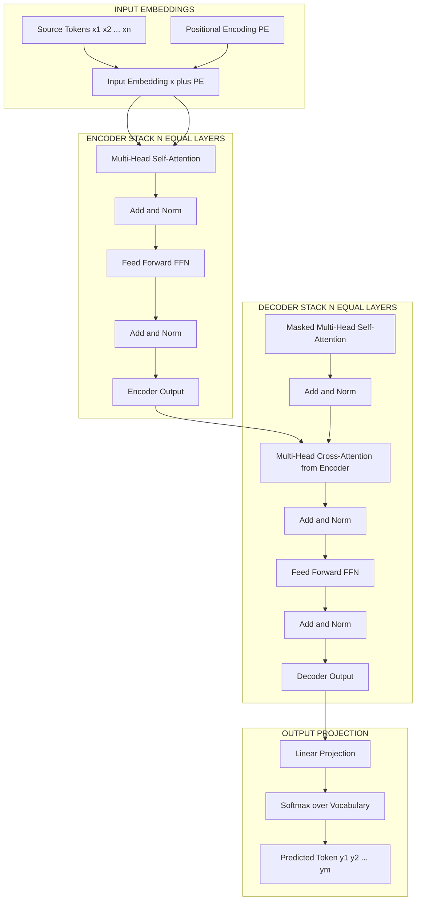
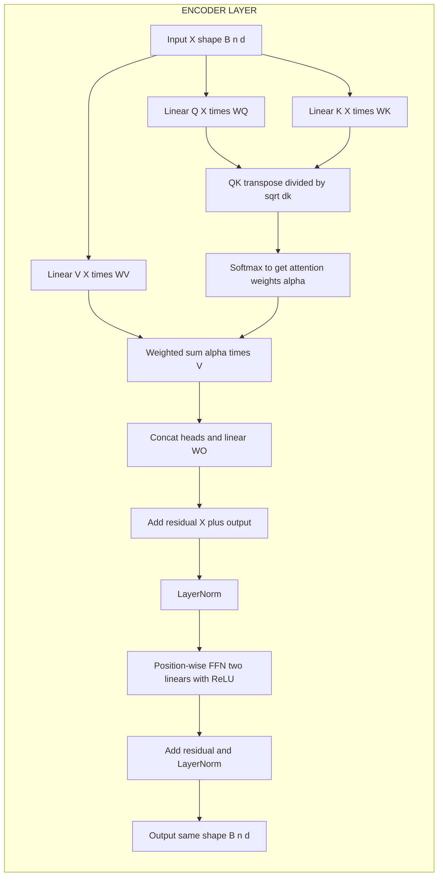
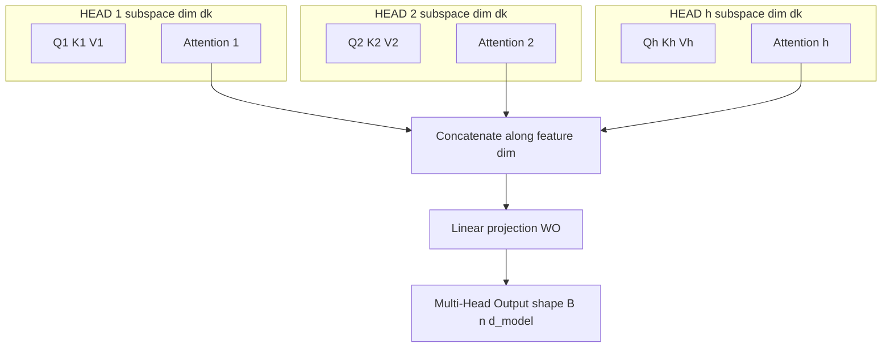

# Transformer basics

<!-- SECTION_1_START -->
# Transformer Basics — Core Technical Definition & Intuitive Overview

## 1. Formal Academic Definition (KTU 2024 Syllabus Terminology)

A **Transformer** is a deep learning architecture that relies entirely on the **self-attention mechanism** to model temporal or sequential dependencies, eliminating the need for recurrence and convolutions. It was introduced by Vaswani et al. (2017) in *"Attention Is All You Need."* In KTU 2024 Scheme terms, the Transformer is defined as:

> A sequence-to-sequence model composed of stacked **encoder** and **decoder** layers, where each layer contains a **multi-head self-attention sub-layer** followed by a **position-wise feed-forward network (FFN)**, with **residual connections** and **layer normalization** applied around each sub-layer. **Positional encodings** are added to input embeddings to inject order information.

The fundamental operation is the **Scaled Dot-Product Attention**, defined as:

$$
\text{Attention}(Q, K, V) = \text{softmax}\!\left(\frac{Q K^{\top}}{\sqrt{d_k}}\right) V
$$

where $Q$, $K$, $V$ are the Query, Key, and Value matrices, and $d_k$ is the dimension of the keys.

> [!IMPORTANT]
> **KTU Syllabus Highlight:** The Transformer is the *backbone* of all modern Large Language Models (LLMs) such as BERT, GPT, T5, LLaMA, and vision transformers (ViT). The model dimension is typically **$d_{\text{model}} = 512$** in the original paper, with **$h = 8$** attention heads.

## 2. Conceptual Analogy — Reading a Sentence Like a Human

Imagine you are reading the sentence: *"The **animal** didn't cross the street because **it** was too tired."* To understand what *"it"* refers to, your brain does **not** read word-by-word in a strict left-to-right loop (like an RNN). Instead, it instantly links *"it"* back to *"animal"* across the entire sentence.

That is exactly what **self-attention** does. For every word (token), the Transformer looks at **every other word** in the sequence and decides how much to "pay attention" to each one. Words that are contextually related get higher attention weights.

> [!NOTE]
> **Core Definitions You Must Memorize for KTU:**
> - **Query ($Q$):** Represents "what am I looking for?"
> - **Key ($K$):** Represents "what do I contain?" (used for matching)
> - **Value ($V$):** Represents "the actual information I carry."
> - **Self-Attention:** $Q$, $K$, $V$ all come from the **same input sequence**.
> - **Cross-Attention:** $Q$ comes from the decoder, while $K$ and $V$ come from the encoder.

## 3. Why Transformers Replaced RNNs — The "Why" Behind the Architecture

| Limitation of RNN/LSTM | How Transformer Solves It |
|---|---|
| Sequential processing → slow training | **Parallelization** across all positions |
| Long-range dependencies vanish | **Direct** pairwise attention $\Rightarrow O(1)$ path length |
| Information bottleneck through hidden state | **Every token attends to every other token** explicitly |
| Hard to scale to long sequences | Scales efficiently on GPUs/TPUs |

> [!VISUALIZATION CONTROL]
> **Concept:** Self-Attention as a fully-connected weighted graph over sequence tokens.
> **GeoGebra / Desmos Input (conceptual grid representation):**
> * Set points $t_1, t_2, t_3, t_4$ on the x-axis representing tokens.
> * Plot weighted edges $\alpha_{ij}$ from $t_i$ to $t_j$ where $0 \le \alpha_{ij} \le 1$ and $\sum_j \alpha_{ij} = 1$.
> **Visual Description:** You should observe a complete directed graph where every token is connected to every other token, with thicker arrows indicating higher attention weight $\alpha_{ij}$. The weight from $t_4$ (it) to $t_1$ (animal) should be visibly the largest in the famous "it/animal" example.

<!-- SECTION_1_END -->

<!-- SECTION_2_START -->
# Deep Theoretical Analysis & KTU High-Yield Formula Sheet

## 1. Anatomy of the Scaled Dot-Product Attention

Given an input sequence of $n$ tokens, each embedded into a vector of dimension $d_{\text{model}}$, we project them into three matrices using **learned linear transformations**:

$$
Q = X W^Q, \quad K = X W^K, \quad V = X W^V
$$

where $X \in \mathbb{R}^{n \times d_{\text{model}}}$, and $W^Q, W^K \in \mathbb{R}^{d_{\text{model}} \times d_k}$, $W^V \in \mathbb{R}^{d_{\text{model}} \times d_v}$.

The attention computation proceeds in **four logical steps**:

1. **Compute similarity scores** between every query and every key:
$$
\text{scores} = Q K^{\top} \in \mathbb{R}^{n \times n}
$$
Each entry $\text{scores}_{ij}$ measures how much token $i$ should attend to token $j$.

2. **Scale** the scores by $\sqrt{d_k}$ to prevent gradient saturation in softmax when $d_k$ is large:
$$
\text{scaled\_scores} = \frac{Q K^{\top}}{\sqrt{d_k}}
$$
Without scaling, large dot products push softmax into regions of extremely small gradients.

3. **Apply softmax** row-wise to obtain normalized attention weights:
$$
\alpha = \text{softmax}\!\left(\frac{Q K^{\top}}{\sqrt{d_k}}\right)
$$
Each row of $\alpha$ is a probability distribution summing to **1**.

4. **Weighted sum** with the Value matrix to produce the output:
$$
\text{Attention}(Q, K, V) = \alpha V
$$

## 2. Multi-Head Attention — "Multiple Perspectives"

Instead of performing a single attention function, the Transformer projects $Q$, $K$, $V$ into **$h$ different subspaces** and runs attention in parallel. Each head can learn to focus on different linguistic phenomena (e.g., one head tracks syntax, another tracks coreference, another tracks semantic similarity).

$$
\text{MultiHead}(Q, K, V) = \text{Concat}(\text{head}_1, \ldots, \text{head}_h)\, W^O
$$

where each head is:

$$
\text{head}_i = \text{Attention}(Q W_i^Q, K W_i^K, V W_i^V)
$$

Typically, $d_k = d_v = d_{\text{model}} / h$. In the original paper, $d_{\text{model}} = 512$ and $h = 8$, so $d_k = d_v = 64$.

## 3. Positional Encoding — Injecting Order Information

Self-attention is **permutation-invariant** — it treats input as a *bag of tokens*. To inject sequence order, fixed or learned positional vectors are added to the token embeddings:

$$
\text{Input}_{\text{final}} = \text{TokenEmbedding}(x_i) + \text{PositionalEncoding}(i)
$$

The original paper uses **sinusoidal positional encoding**:

$$
PE_{(pos, 2i)} = \sin\!\left(\frac{pos}{10000^{2i / d_{\text{model}}}}\right)
$$

$$
PE_{(pos, 2i+1)} = \cos\!\left(\frac{pos}{10000^{2i / d_{\text{model}}}}\right)
$$

where $pos$ is the token position and $i$ is the dimension index. Sinusoidal PE allows the model to **extrapolate** to sequence lengths longer than those seen during training.

## 4. Layer Normalization & Residual Connections

Each sub-layer (attention and FFN) is wrapped in a residual + normalization block:

$$
\text{output} = \text{LayerNorm}(x + \text{Sublayer}(x))
$$

This stabilizes training of very deep Transformer stacks (up to 96 layers in GPT-2, 128 in GPT-4-class models).

## 5. KTU Formula Sheet / Cheat Sheet

| Concept | Formula | Key Notes |
|---|---|---|
| Scaled Dot-Product Attention | $\text{Attention}(Q,K,V) = \text{softmax}\!\left(\frac{QK^{\top}}{\sqrt{d_k}}\right) V$ | Scaling factor $\sqrt{d_k}$ is **mandatory** |
| Multi-Head Attention Output | $\text{Concat}(\text{head}_1,\ldots,\text{head}_h) W^O$ | $h$ parallel heads, each dim $d_{\text{model}}/h$ |
| Sinusoidal PE (even index) | $PE_{(pos,2i)} = \sin(pos / 10000^{2i/d_{\text{model}}})$ | Wavelength grows exponentially with $i$ |
| Sinusoidal PE (odd index) | $PE_{(pos,2i+1)} = \cos(pos / 10000^{2i/d_{\text{model}}})$ | Complementary to even-index sine |
| Position-wise FFN | $\text{FFN}(x) = \max(0, x W_1 + b_1) W_2 + b_2$ | Two linear layers with ReLU; inner dim typically $4 d_{\text{model}}$ |
| Residual + LayerNorm | $\text{LayerNorm}(x + \text{Sublayer}(x))$ | Applied around every sub-layer |
| Attention complexity per layer | $O(n^2 \cdot d)$ | $n$ = sequence length, $d$ = model dim |
| Original paper hyperparameters | $d_{\text{model}}=512$, $h=8$, $d_k=d_v=64$, $N=6$ layers | Memorize for KTU short-answer questions |

> [!NOTE]
> **Real-World Engineering Utility:** Transformers power **BERT** (encoder-only, used in search ranking, document classification), **GPT** (decoder-only, used in ChatGPT, code generation, translation), **ViT** (Vision Transformer for image classification), **DETR** (object detection), and **Whisper** (speech recognition). The Transformer is the universal sequence-modeling primitive of modern AI.

<!-- SECTION_2_END -->

<!-- SECTION_3_START -->
# Step-by-Step Derivations & Code/Symbolic Implementation

## 1. Worked Numerical Example — Scaled Dot-Product Attention by Hand

**Problem Setup (KTU-style numerical):** Let a 3-token input have embeddings forming matrix $X \in \mathbb{R}^{3 \times 4}$:

$$
X = \begin{bmatrix} 1 & 0 & 1 & 0 \\ 0 & 2 & 0 & 2 \\ 1 & 1 & 1 & 1 \end{bmatrix}
$$

Let the learned projection matrices be:

$$
W^Q = \begin{bmatrix} 1 & 0 \\ 0 & 1 \\ 1 & 0 \\ 0 & 1 \end{bmatrix},\quad W^K = \begin{bmatrix} 0 & 1 \\ 1 & 0 \\ 0 & 1 \\ 1 & 0 \end{bmatrix},\quad W^V = I_4
$$

with $d_k = 2$ and scaling factor $\sqrt{d_k} = \sqrt{2}$.

**Step 1: Compute $Q = X W^Q$**

$$
Q = \begin{bmatrix} 1 & 0 & 1 & 0 \\ 0 & 2 & 0 & 2 \\ 1 & 1 & 1 & 1 \end{bmatrix} \begin{bmatrix} 1 & 0 \\ 0 & 1 \\ 1 & 0 \\ 0 & 1 \end{bmatrix} = \begin{bmatrix} 2 & 0 \\ 0 & 4 \\ 2 & 2 \end{bmatrix}
$$

**Step 2: Compute $K = X W^K$**

$$
K = \begin{bmatrix} 1 & 0 & 1 & 0 \\ 0 & 2 & 0 & 2 \\ 1 & 1 & 1 & 1 \end{bmatrix} \begin{bmatrix} 0 & 1 \\ 1 & 0 \\ 0 & 1 \\ 1 & 0 \end{bmatrix} = \begin{bmatrix} 0 & 2 \\ 4 & 0 \\ 2 & 2 \end{bmatrix}
$$

**Step 3: Compute $V = X W^V = X$ (since $W^V = I_4$)**

$$
V = \begin{bmatrix} 1 & 0 & 1 & 0 \\ 0 & 2 & 0 & 2 \\ 1 & 1 & 1 & 1 \end{bmatrix}
$$

**Step 4: Compute raw attention scores $Q K^{\top}$**

$$
Q K^{\top} = \begin{bmatrix} 2 & 0 \\ 0 & 4 \\ 2 & 2 \end{bmatrix} \begin{bmatrix} 0 & 4 & 2 \\ 2 & 0 & 2 \end{bmatrix} = \begin{bmatrix} 0 & 8 & 4 \\ 8 & 0 & 8 \\ 4 & 8 & 8 \end{bmatrix}
$$

**Step 5: Scale by $\sqrt{d_k} = \sqrt{2}$**

$$
\frac{Q K^{\top}}{\sqrt{2}} = \begin{bmatrix} 0 & 5.657 & 2.828 \\ 5.657 & 0 & 5.657 \\ 2.828 & 5.657 & 5.657 \end{bmatrix}
$$

**Step 6: Apply softmax row-wise**

Row 1: $\exp([0, 5.657, 2.828]) = [1.000,\ 287.3,\ 16.89]$, sum $= 305.19$

$$
\text{softmax row 1} = [0.0033,\ 0.9415,\ 0.0553]
$$

Row 2: $\exp([5.657, 0, 5.657]) = [287.3,\ 1.000,\ 287.3]$, sum $= 575.6$

$$
\text{softmax row 2} = [0.4991,\ 0.0017,\ 0.4991]
$$

Row 3: $\exp([2.828, 5.657, 5.657]) = [16.89,\ 287.3,\ 287.3]$, sum $= 591.5$

$$
\text{softmax row 3} = [0.0286,\ 0.4857,\ 0.4857]
$$

**Step 7: Compute attention output $\alpha V$**

$$
\alpha V = \begin{bmatrix} 0.0033 & 0.9415 & 0.0553 \\ 0.4991 & 0.0017 & 0.4991 \\ 0.0286 & 0.4857 & 0.4857 \end{bmatrix} \begin{bmatrix} 1 & 0 & 1 & 0 \\ 0 & 2 & 0 & 2 \\ 1 & 1 & 1 & 1 \end{bmatrix} = \begin{bmatrix} 0.0586 & 1.938 & 0.0586 & 1.938 \\ 1.4991 & 0.5024 & 1.4991 & 0.5024 \\ 0.5143 & 1.457 & 0.5143 & 1.457 \end{bmatrix}
$$

This is the final self-attention output.

## 2. Full PyTorch Implementation of a Transformer Encoder Block

```python
import torch
import torch.nn as nn
import torch.nn.functional as F
import math


class PositionalEncoding(nn.Module):
    """Sinusoidal positional encoding as in Vaswani et al. 2017."""

    def __init__(self, d_model: int, max_len: int = 5000, dropout: float = 0.1) -> None:
        super().__init__()
        self.dropout = nn.Dropout(p=dropout)

        pe = torch.zeros(max_len, d_model)
        position = torch.arange(0, max_len, dtype=torch.float32).unsqueeze(1)
        div_term = torch.exp(
            torch.arange(0, d_model, 2, dtype=torch.float32)
            * (-math.log(10000.0) / d_model)
        )
        pe[:, 0::2] = torch.sin(position * div_term)
        pe[:, 1::2] = torch.cos(position * div_term)
        pe = pe.unsqueeze(0)  # shape: (1, max_len, d_model)
        self.register_buffer("pe", pe)

    def forward(self, x: torch.Tensor) -> torch.Tensor:
        # x shape: (batch_size, seq_len, d_model)
        seq_len = x.size(1)
        if seq_len > self.pe.size(1):
            raise ValueError(
                f"Input sequence length {seq_len} exceeds maximum supported "
                f"length {self.pe.size(1)}"
            )
        x = x + self.pe[:, :seq_len, :]
        return self.dropout(x)


class MultiHeadSelfAttention(nn.Module):
    """Standard multi-head self-attention with learned linear projections."""

    def __init__(self, d_model: int, num_heads: int, dropout: float = 0.1) -> None:
        super().__init__()
        if d_model % num_heads != 0:
            raise ValueError(
                f"d_model ({d_model}) must be divisible by num_heads ({num_heads})"
            )
        self.d_model = d_model
        self.num_heads = num_heads
        self.d_k = d_model // num_heads

        self.w_q = nn.Linear(d_model, d_model, bias=False)
        self.w_k = nn.Linear(d_model, d_model, bias=False)
        self.w_v = nn.Linear(d_model, d_model, bias=False)
        self.w_o = nn.Linear(d_model, d_model, bias=False)
        self.attn_dropout = nn.Dropout(p=dropout)

    def _split_heads(self, x: torch.Tensor) -> torch.Tensor:
        # (B, n, d_model) -> (B, h, n, d_k)
        B, n, _ = x.size()
        return x.view(B, n, self.num_heads, self.d_k).transpose(1, 2)

    def forward(
        self, x: torch.Tensor, mask: torch.Tensor | None = None
    ) -> torch.Tensor:
        B, n, _ = x.size()
        Q = self._split_heads(self.w_q(x))
        K = self._split_heads(self.w_k(x))
        V = self._split_heads(self.w_v(x))

        scores = torch.matmul(Q, K.transpose(-2, -1)) / math.sqrt(self.d_k)
        if mask is not None:
            scores = scores.masked_fill(mask == 0, float("-inf"))
        attn = F.softmax(scores, dim=-1)
        attn = self.attn_dropout(attn)

        context = torch.matmul(attn, V)  # (B, h, n, d_k)
        context = context.transpose(1, 2).contiguous().view(B, n, self.d_model)
        return self.w_o(context)


class FeedForward(nn.Module):
    """Position-wise feed-forward network: two linear layers with ReLU."""

    def __init__(self, d_model: int, d_ff: int, dropout: float = 0.1) -> None:
        super().__init__()
        self.linear1 = nn.Linear(d_model, d_ff)
        self.linear2 = nn.Linear(d_ff, d_model)
        self.dropout = nn.Dropout(p=dropout)

    def forward(self, x: torch.Tensor) -> torch.Tensor:
        return self.linear2(self.dropout(F.relu(self.linear1(x))))


class TransformerEncoderBlock(nn.Module):
    """A single Transformer encoder layer (post-LN variant)."""

    def __init__(
        self,
        d_model: int = 512,
        num_heads: int = 8,
        d_ff: int = 2048,
        dropout: float = 0.1,
    ) -> None:
        super().__init__()
        self.attn = MultiHeadSelfAttention(d_model, num_heads, dropout)
        self.ffn = FeedForward(d_model, d_ff, dropout)
        self.norm1 = nn.LayerNorm(d_model)
        self.norm2 = nn.LayerNorm(d_model)
        self.dropout = nn.Dropout(p=dropout)

    def forward(
        self, x: torch.Tensor, mask: torch.Tensor | None = None
    ) -> torch.Tensor:
        attn_out = self.attn(x, mask)
        x = self.norm1(x + self.dropout(attn_out))
        ffn_out = self.ffn(x)
        x = self.norm2(x + self.dropout(ffn_out))
        return x


def main() -> None:
    torch.manual_seed(42)
    B, n, d_model = 2, 10, 512
    x = torch.randn(B, n, d_model)

    pe = PositionalEncoding(d_model=d_model, max_len=100)
    block = TransformerEncoderBlock(d_model=d_model, num_heads=8, d_ff=2048)

    x_pe = pe(x)
    out = block(x_pe)
    print(f"Input shape : {x.shape}")
    print(f"Output shape: {out.shape}")
    assert out.shape == x.shape, "Output shape must match input shape"
    print("Transformer encoder block executed successfully.")


if __name__ == "__main__":
    main()
```

**Key implementation details students must know:**

- The `register_buffer` call ensures `pe` is moved to the correct device with the model (`.to('cuda')`) but is **not** treated as a trainable parameter.
- The `_split_heads` operation reshapes `(B, n, d_model)` into `(B, h, n, d_k)` to enable batched attention across heads.
- The `masked_fill` with `-inf` is used in the decoder to prevent attending to future tokens (causal masking) and in padding masking to ignore `<pad>` tokens.
- `LayerNorm` normalizes across the **feature dimension** (per token, across $d_{\text{model}}$), unlike `BatchNorm` which normalizes across the batch dimension.

## 3. Complexity Comparison Table

| Model | Layer Type | Complexity per Layer | Sequential Ops | Maximum Path Length |
|---|---|---|---|---|
| RNN | Recurrent | $O(n \cdot d^2)$ | $O(n)$ | $O(n)$ |
| CNN | Convolution | $O(k \cdot n \cdot d^2)$ | $O(1)$ | $O(\log_k n)$ |
| **Transformer (Self-Attention)** | **Self-Attention** | $O(n^2 \cdot d)$ | $O(1)$ | $O(1)$ |

where $n$ is sequence length, $d$ is representation dimension, and $k$ is kernel size.

<!-- SECTION_3_END -->

<!-- SECTION_4_START -->
# Structural Diagrams & Schematics

## 1. High-Level Transformer Encoder–Decoder Architecture



## 2. Data Flow Inside One Encoder Block



## 3. Multi-Head Attention Parallelism Schematic



## 4. Sequential Processing Topology Matrix

| Stage | Module | Input Shape | Output Shape | Purpose |
|---|---|---|---|---|
| 1 | Token Embedding | $(B, n)$ | $(B, n, d_{\text{model}})$ | Map token IDs to dense vectors |
| 2 | Positional Encoding | $(B, n, d_{\text{model}})$ | $(B, n, d_{\text{model}})$ | Inject order information |
| 3 | Multi-Head Self-Attention | $(B, n, d_{\text{model}})$ | $(B, n, d_{\text{model}})$ | Contextualize tokens via attention |
| 4 | Add \& Norm | $(B, n, d_{\text{model}})$ | $(B, n, d_{\text{model}})$ | Stabilize gradient flow |
| 5 | Position-wise FFN | $(B, n, d_{\text{model}})$ | $(B, n, d_{\text{model}})$ | Apply non-linear transformation per position |
| 6 | Add \& Norm | $(B, n, d_{\text{model}})$ | $(B, n, d_{\text{model}})$ | Stabilize gradient flow |
| 7 | Stack $N$ times | $(B, n, d_{\text{model}})$ | $(B, n, d_{\text{model}})$ | Build deep representation |

> [!NOTE]
> **Mermaid Safety Note:** All node IDs are alphanumeric (e.g., `HA1`, `CONC`, `WO`), and all labels with special characters are wrapped in double quotes to ensure clean Mermaid compilation.

<!-- SECTION_4_END -->

<!-- SECTION_5_START -->
# KTU 2024 Scheme Examination Question Bank & Topic Recap

---

## Part A — Short Answer Questions (3 Marks Each)

### Question 1
**[KTU University Exam – July 2024]** Define **Scaled Dot-Product Attention**. Why is the scaling factor $\sqrt{d_k}$ essential in the softmax computation?

**Model Answer (3 Marks):**

Scaled Dot-Product Attention computes a weighted sum of value vectors, where weights are derived from the compatibility of queries and keys:

$$
\text{Attention}(Q, K, V) = \text{softmax}\!\left(\frac{QK^{\top}}{\sqrt{d_k}}\right) V
$$

**Why scaling is essential (2 Marks):** As $d_k$ grows, the dot products $Q K^{\top}$ grow in magnitude, pushing the softmax into regions where it produces outputs very close to 0 or 1. This results in extremely small gradients during back-propagation, which **stalls learning**. Dividing by $\sqrt{d_k}$ normalizes the variance of the dot products back to approximately 1, keeping gradients healthy.

**Stating the formula: 1 Mark.** Identifying variance/gradient issue: **1 Mark.** Connecting scaling to training stability: **1 Mark.**

---

### Question 2
**[KTU University Exam – Dec 2023]** Differentiate between **self-attention** and **cross-attention** in the Transformer decoder.

**Model Answer (3 Marks):**

| Aspect | Self-Attention | Cross-Attention |
|---|---|---|
| Source of $Q$, $K$, $V$ | All three from the **same** sequence (decoder input) | $Q$ from **decoder**, $K$ and $V$ from **encoder output** |
| Purpose | Builds contextual representations of decoder tokens | Allows decoder to "look at" the encoded source sequence |
| Masking | **Causal mask** applied (no peeking at future tokens) | **No causal mask** (full attention to encoder states) |
| Where used | First sub-layer of decoder | Second sub-layer of decoder |

**Correct distinction: 1 Mark. Tabular comparison with both rows: 2 Marks.**

---

## Part B — Long Answer Questions (14 Marks with Internal Choice)

### Question A (14 Marks)
**[KTU University Exam – July 2024 | CO2, Apply | Module 3]**

**(a)** [7 Marks] With a neat block diagram, explain the architecture of a **Transformer encoder**. List all sub-layers and state the role of **layer normalization** and **residual connections**.

**(b)** [7 Marks] Given a 2-token input with embeddings $x_1 = [1, 1]$ and $x_2 = [0, 1]$, and projection matrices $W^Q = W^K = W^V = I_2$ with $d_k = 2$, compute the self-attention output matrix. Show all intermediate steps including scaling and softmax.

---

**Model Solution:**

**(a) [7 Marks] Transformer Encoder Architecture**

The encoder consists of $N = 6$ identical layers. Each layer has two sub-layers:

1. **Multi-Head Self-Attention sub-layer**
2. **Position-wise Feed-Forward Network (FFN)**

Each sub-layer is wrapped in a **residual connection** followed by **layer normalization**:

$$
\text{output} = \text{LayerNorm}(x + \text{Sublayer}(x))
$$

**Roles:**

- **Residual connections** allow gradients to flow directly through the skip path, mitigating the vanishing gradient problem in deep networks. They also act as "highways" that preserve the original input signal. **[2 Marks]**
- **Layer normalization** normalizes activations across the feature dimension $d_{\text{model}}$ for each token independently, stabilizing the distribution of inputs to the next layer and accelerating convergence. **[2 Marks]**

**Block diagram: 2 Marks.** Listing sub-layers (Multi-Head Attention + FFN): **1 Mark.**

```
x → Multi-Head Self-Attention → Add & Norm → FFN → Add & Norm → Output
```

**(b) [7 Marks] Numerical Self-Attention Computation**

**Step 1: Form the input matrix** (stacking $x_1, x_2$ as rows): **[1 Mark]**

$$
X = \begin{bmatrix} 1 & 1 \\ 0 & 1 \end{bmatrix}
$$

**Step 2: Compute $Q$, $K$, $V$** (since $W^Q = W^K = W^V = I_2$): **[1 Mark]**

$$
Q = K = V = X = \begin{bmatrix} 1 & 1 \\ 0 & 1 \end{bmatrix}
$$

**Step 3: Compute $Q K^{\top}$:** **[1 Mark]**

$$
Q K^{\top} = \begin{bmatrix} 1 & 1 \\ 0 & 1 \end{bmatrix} \begin{bmatrix} 1 & 0 \\ 1 & 1 \end{bmatrix} = \begin{bmatrix} 2 & 1 \\ 1 & 1 \end{bmatrix}
$$

**Step 4: Scale by $\sqrt{d_k} = \sqrt{2}$:** **[1 Mark]**

$$
\frac{QK^{\top}}{\sqrt{2}} = \begin{bmatrix} 1.414 & 0.707 \\ 0.707 & 0.707 \end{bmatrix}
$$

**Step 5: Apply softmax row-wise:** **[2 Marks]**

Row 1: $\exp([1.414, 0.707]) = [4.113, 2.028]$, sum $= 6.141$
$$
\text{row}_1 = [0.6697, 0.3303]
$$

Row 2: $\exp([0.707, 0.707]) = [2.028, 2.028]$, sum $= 4.056$
$$
\text{row}_2 = [0.5000, 0.5000]
$$

$$
\alpha = \begin{bmatrix} 0.6697 & 0.3303 \\ 0.5000 & 0.5000 \end{bmatrix}
$$

**Step 6: Compute attention output $\alpha V$:** **[1 Mark]**

$$
\alpha V = \begin{bmatrix} 0.6697 & 0.3303 \\ 0.5000 & 0.5000 \end{bmatrix} \begin{bmatrix} 1 & 1 \\ 0 & 1 \end{bmatrix} = \begin{bmatrix} 0.6697 & 1.0000 \\ 0.5000 & 1.0000 \end{bmatrix}
$$

**Final answer:** The self-attention output is

$$
\begin{bmatrix} 0.6697 & 1.0000 \\ 0.5000 & 0.5000 \end{bmatrix}
$$

Interpretation: Token 1 attends 67% to itself and 33% to token 2; token 2 attends equally to both tokens. **[Bonus observation, not required for marks.]**

---

### Question B (14 Marks) — ALTERNATIVE CHOICE
**[KTU University Exam – Dec 2023 | CO3, Apply | Module 3]**

**(a)** [7 Marks] What is **Multi-Head Attention**? Explain with a neat diagram how $h$ parallel attention heads are concatenated to form the final output. Why is it beneficial to use multiple heads instead of a single attention head?

**(b)** [7 Marks] Compute the **sinusoidal positional encoding** values for position $pos = 2$ and dimensions $i = 0$ and $i = 1$, assuming $d_{\text{model}} = 4$. Show the full formula substitution.

---

**Model Solution:**

**(a) [7 Marks] Multi-Head Attention**

Multi-Head Attention runs $h$ scaled dot-product attention operations in parallel, each on a different learned linear projection of $Q$, $K$, $V$. This allows the model to **jointly attend to information from different representation subspaces** at different positions.

**Mathematical formulation: [2 Marks]**

$$
\text{MultiHead}(Q, K, V) = \text{Concat}(\text{head}_1, \ldots, \text{head}_h) W^O
$$

$$
\text{head}_i = \text{Attention}(X W_i^Q, X W_i^K, X W_i^V)
$$

**Diagram: [2 Marks]**

```
X ──┬── WQ ──> Q ──┐
    ├── WK ──> K ──┼──> Head 1 ──┐
    └── WV ──> V ──┘             │
                                  ├── Concat ──> WO ──> Output
X ──┬── WQ ──> Q ──┐             │
    ├── WK ──> K ──┼──> Head 2 ──┤
    └── WV ──> V ──┘             │
                                  │
                ... (h heads) ... │
```

**Benefits of multiple heads: [3 Marks]**
1. Each head can learn a **different relationship pattern** — syntactic, semantic, positional, or long-range coreference.
2. A single attention head can only focus on one type of relationship at a time; multiple heads give the model a **richer, multi-perspective** view.
3. Empirically, multi-head attention consistently **outperforms** single-head attention of the same total parameter count, as it allows specialization.

**(b) [7 Marks] Sinusoidal Positional Encoding Computation**

**Formula: [2 Marks]**

$$
PE_{(pos, 2i)} = \sin\!\left(\frac{pos}{10000^{2i / d_{\text{model}}}}\right)
$$

$$
PE_{(pos, 2i+1)} = \cos\!\left(\frac{pos}{10000^{2i / d_{\text{model}}}}\right)
$$

**Substitution for $pos = 2$, $i = 0$ (even index, sine): [2 Marks]**

$$
PE_{(2, 0)} = \sin\!\left(\frac{2}{10000^{0/4}}\right) = \sin(2.0) = 0.9093
$$

**Substitution for $pos = 2$, $i = 1$ (odd index, cosine): [2 Marks]**

$$
PE_{(2, 1)} = \cos\!\left(\frac{2}{10000^{2/4}}\right) = \cos\!\left(\frac{2}{10000^{0.5}}\right) = \cos\!\left(\frac{2}{100}\right) = \cos(0.02) = 0.9998
$$

**Final answer: [1 Mark]**

$$
PE_{(2, 0)} \approx 0.9093, \quad PE_{(2, 1)} \approx 0.9998
$$

---

> [!WARNING]
> **KTU Examiner's Valuation Warning / Common Pitfalls:**
> 1. **Forgetting the $\sqrt{d_k}$ scaling** in attention computation → **lose 1–2 marks** in numerical problems. Always show the scaled matrix explicitly.
> 2. **Confusing row-wise vs column-wise softmax.** Softmax in attention is **row-wise** (each query's distribution over keys). Applying it column-wise is a common error.
> 3. **Omitting residual connections** in the encoder block diagram → **lose 1 mark** in 7-mark architecture questions. Always show the **Add & Norm** block.
> 4. **Mixing up self-attention and cross-attention** in the decoder. Self-attention has a **causal mask**; cross-attention does **not**.
> 5. **Not stating dimensions** in matrix multiplications during numericals. KTU examiners award marks for dimension-tracking clarity.
> 6. **Writing $10000^{2i/d_{\text{model}}}$ without parentheses** in the PE formula. The full denominator is $\sqrt{10000^{2i/d_{\text{model}}}}$ — be careful with the order of operations.
> 7. **Saying "sinusoidal PE is trainable"** — it is **fixed (non-trainable)** in the original Transformer. Only learned PE (as in BERT, GPT-2) is trainable.

---

## Topic Recap & Important Things to Remember

- **Transformer = Self-Attention + Feed-Forward + Residual + LayerNorm + Positional Encoding.** All five components are non-negotiable.
- The fundamental attention formula is $\text{softmax}\!\left(\frac{QK^{\top}}{\sqrt{d_k}}\right) V$. Memorize it verbatim.
- **$Q$, $K$, $V$** are obtained by **three different learned linear projections** of the same input matrix $X$. They are not the input itself.
- The **scaling factor $\sqrt{d_k}$** prevents softmax saturation and is mathematically justified by the variance of dot products growing linearly with $d_k$.
- **Multi-Head Attention** splits $d_{\text{model}}$ into $h$ subspaces of dimension $d_k = d_v = d_{\text{model}}/h$, runs attention in parallel, and concatenates. Output projection is via $W^O$.
- **Self-attention** = $Q, K, V$ from the same sequence. **Cross-attention** = $Q$ from decoder, $K, V$ from encoder. The decoder uses both.
- **Sinusoidal PE** uses alternating $\sin$ (even indices) and $\cos$ (odd indices) with geometrically increasing wavelengths controlled by $10000^{2i/d_{\text{model}}}$.
- **Positional encoding is added (not concatenated)** to token embeddings: $\text{input} = \text{embedding} + \text{PE}$.
- **Residual connections** wrap each sub-layer: $\text{LayerNorm}(x + \text{Sublayer}(x))$.
- **LayerNorm normalizes across the feature dimension** per token (not across the batch).
- **Original paper hyperparameters** (frequently asked): $d_{\text{model}}=512$, $h=8$, $d_k=d_v=64$, $N=6$ encoder + 6 decoder layers, $d_{ff}=2048$.
- **Complexity** of self-attention is $O(n^2 \cdot d)$ per layer — quadratic in sequence length. This is the main scalability bottleneck (motivates Linformer, Performer, Longformer).
- **Causal masking** in the decoder sets upper-triangular entries of $QK^{\top}$ to $-\infty$ before softmax, preventing attention to future tokens.
- Transformers enable **full parallelization** during training, unlike RNNs which are inherently sequential — this is why they scale.
- Modern descendants: **BERT (encoder-only)**, **GPT (decoder-only)**, **T5 (encoder-decoder)**, **ViT (vision)**, **DETR (detection)**, **Whisper (speech)**.

<!-- SECTION_5_END -->
