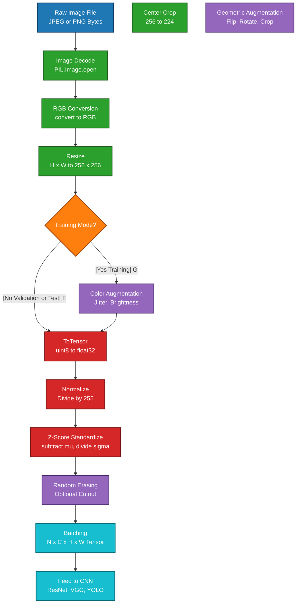
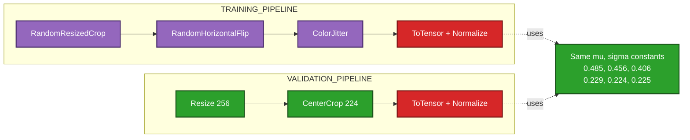
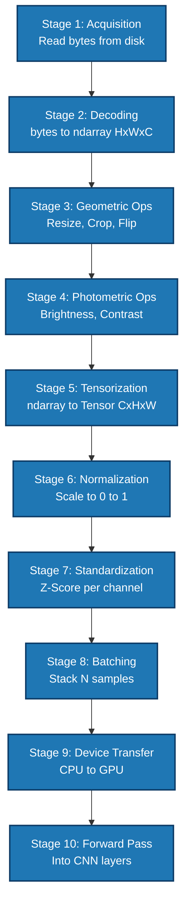

# Image preprocessing

<!-- SECTION_1_START -->
# 🖼️ Image Preprocessing — The Foundation of Every Vision Pipeline

> [!IMPORTANT]
> **KTU 2024 Scheme | PECST86A — Module 4: Image Classification & Object Detection**
> **Course Outcome Mapped:** *CO3 — Apply preprocessing and transformation techniques to prepare image data for deep learning models.*
> **Bloom's Level Focus:** *Apply / Analyze*

---

## 📌 1.1 Formal Academic Definition

**Image Preprocessing** is the systematic sequence of pixel-level transformations applied to raw image data **before** it is fed into a Convolutional Neural Network (CNN) or any Deep Learning classifier/detector. The objective is threefold:

1. **Normalize** the input distribution so that gradient-based optimizers (SGD, Adam) converge in a stable, predictable manner.
2. **Augment** the training distribution synthetically to combat overfitting and improve generalization to unseen data.
3. **Standardize** the tensor shape, dtype, and value-range so that the network receives a *homogeneous* numerical stream.

In the KTU 2024 syllabus, image preprocessing is treated as a **mandatory prerequisite** for any downstream task — classification (ResNet, VGG), detection (YOLO, Faster R-CNN), or segmentation (U-Net).

> [!NOTE]
> **Standard Tensor Shape Convention (PyTorch / KTU Reference):**
> A batch of images is represented as $\mathbf{X} \in \mathbb{R}^{N \times C \times H \times W}$, where $N$ = batch size, $C$ = channels (3 for RGB), $H$ = height, $W$ = width. Each pixel value is an **unsigned 8-bit integer** ($x \in [0, 255]$) in raw form.

---

## 🎯 1.2 Intuitive Analogy — "The Kitchen Prep Station"

Imagine you are a chef preparing ingredients before cooking:

| 🍳 Kitchen Step | 🧠 Image Preprocessing Equivalent |
|---|---|
| Washing vegetables | Noise removal / Gaussian filtering |
| Cutting to uniform size | Resizing to a fixed $H \times W$ |
| Marinating (adding flavor) | Normalization / standardization |
| Trying different plating angles | Data augmentation (flip, rotate, crop) |
| Arranging on a tray | Batching into $N$-sample tensors |
| Following the same recipe every day | Using the *same* statistics for train/val/test |

> **Key Insight:** A CNN is only as good as the ingredients it receives. Garbage in ⇒ Garbage out. The famous ImageNet moment in 2012 (AlexNet by Krizhevsky et al.) was won not only by a deeper network, but also by **aggressive data augmentation + GPU-friendly preprocessing**.

---

## 🌐 1.3 Why Preprocessing Matters in Real Engineering Systems

| Domain | Why Preprocessing is Non-Negotiable |
|---|---|
| 🏥 Medical Imaging (CT/MRI) | Normalize Hounsfield Units to a common range so tumors in one hospital look like tumors in another. |
| 🚗 Autonomous Driving | Must handle varying lighting (day/night/fog) — color-space conversion + histogram equalization. |
| 🛰️ Satellite Imagery | Different sensors return different bit-depths (8-bit, 12-bit, 16-bit) — standardization is critical. |
| 📱 Mobile Vision (on-device) | Smaller input size = lower latency & battery consumption. Resizing to $224 \times 224$ is standard. |

---

## 🎨 1.4 Visualization Control Block

> [!VISUALIZATION CONTROL]
> **Concept:** Effect of Min-Max Normalization on a Histogram of Pixel Intensities
> **GeoGebra / Desmos Input Equations:**
> * `f(x) = (x - 12)/(240 - 12)` defined on $x \in [12, 240]$ (original range)
> * `g(y) = y` for $y \in [0, 1]$ (normalized range)
> **Visual Description:** The x-axis of $f(x)$ is stretched and shifted so that the minimum pixel value (e.g., 12) maps to **0** and the maximum (e.g., 240) maps to **1** on the y-axis. The shape of the histogram is preserved, only the scale changes.

<!-- SECTION_1_END -->

<!-- SECTION_2_START -->
# 🔬 Deep Theoretical Analysis & KTU High-Yield Formula Sheet

---

## 🧠 2.1 The Canonical Preprocessing Pipeline (Step-by-Step)

A production-grade image preprocessing pipeline for KTU-level deep learning follows this **exact logical chain**:

### **Step 1 — Image Acquisition & Decoding**
The raw image arrives as a JPEG/PNG byte stream. It is decoded into a 3D array $\mathbf{I} \in \mathbb{R}^{H \times W \times C}$ of dtype `uint8`.

> **Why?** Neural networks cannot read compressed bytes — they require dense numerical tensors.

### **Step 2 — Color Space Conversion**
Most pretrained models (ImageNet weights) expect **RGB** channel order. OpenCV decodes as **BGR** by default. A channel swap is mandatory.

$$\mathbf{I}_{RGB}[i,j,:] = \mathbf{I}_{BGR}[i,j, ::-1]$$

### **Step 3 — Geometric Resizing**
All images in a batch must share identical dimensions. Resize to a fixed $\hat{H} \times \hat{W}$ (commonly $224 \times 224$ for ImageNet models).

$$\text{Resize methods: Nearest, Bilinear, Bicubic, Lanczos}$$

### **Step 4 — Pixel Value Normalization**
Convert from $[0, 255]$ to $[0, 1]$ (or $[-1, 1]$) by dividing by **255.0**.

$$x_{norm} = \frac{x}{255.0} \quad \text{(min-max scaling to [0,1])}$$

### **Step 5 — Channel-wise Standardization (Z-Score)**
Subtract the per-channel mean $\mu_c$ and divide by the per-channel standard deviation $\sigma_c$ computed over the entire training set.

$$x_{std}^{(c)} = \frac{x^{(c)} - \mu_c}{\sigma_c}$$

> **ImageNet Reference Statistics (must memorize for KTU):**
> $\mu = [0.485, 0.456, 0.406]$, $\sigma = [0.229, 0.224, 0.225]$ (for RGB channels).

### **Step 6 — Data Augmentation (Training Only)**
Apply stochastic transformations to *artificially* expand the training set:
- Horizontal/Vertical Flip
- Random Crop
- Rotation (small angles: $\pm 15°$)
- Color Jitter (brightness $\pm 20\%$, contrast $\pm 20\%$)
- Cutout / Random Erasing
- Mixup, CutMix (advanced)

### **Step 7 — Tensorization & Batching**
Convert to a `torch.Tensor` / `tf.Tensor` and arrange as $\mathbf{X} \in \mathbb{R}^{N \times C \times H \times W}$. Shuffle training data to break any ordering bias.

### **Step 8 — Label Encoding**
Convert class labels to:
- **Integer encoding** for `CrossEntropyLoss` (single int per image), or
- **One-hot encoding** for `BCEWithLogitsLoss` (binary problems).

$$y_{onehot} = \begin{bmatrix} 0 \\ 1 \\ 0 \\ \vdots \\ 0 \end{bmatrix} \quad \text{where } y_{onehot}[c] = \mathbb{1}[y = c]$$

---

## 📊 2.2 KTU Formula Sheet / Cheat Sheet (Board-Exam Ready)

> [!NOTE]
> **Critical Reminder for Markdown Tables:** All absolute-value / norm notations use `\vert` or `\mid` to avoid breaking pipe syntax.

| # | Operation | Mathematical Formula | Input Range | Output Range | Used In |
|---|---|---|---|---|---|
| 1 | Min-Max Normalization | $x' = \dfrac{x - x_{min}}{x_{max} - x_{min}}$ | $[0, 255]$ | $[0, 1]$ | ReLU networks |
| 2 | Rescaling to $[-1, 1]$ | $x' = \dfrac{x}{127.5} - 1$ | $[0, 255]$ | $[-1, 1]$ | Tanh outputs, GANs |
| 3 | Z-Score Standardization | $x' = \dfrac{x - \mu_c}{\sigma_c}$ | $\mathbb{R}$ | $\mathcal{N}(0,1)$ | Pretrained backbones |
| 4 | Global Contrast Normalization | $x' = \dfrac{x - \mu}{\sigma + \epsilon}$ | $[0, 255]$ | zero-mean unit-var | Self-supervised learning |
| 5 | Histogram Equalization | $s = (L-1) \cdot \mathrm{CDF}(r)$ | $[0, L-1]$ | $[0, L-1]$ | Low-contrast images |
| 6 | Gamma Correction | $x' = x^{\gamma}, \quad \gamma > 0$ | $[0, 1]$ | $[0, 1]$ | Brightness correction |
| 7 | Gaussian Blur (kernel) | $G(u,v) = \dfrac{1}{2\pi\sigma^2} e^{-\frac{u^2+v^2}{2\sigma^2}}$ | — | normalized sum = 1 | Noise suppression |
| 8 | Batch Tensor Shape | $\mathbf{X} \in \mathbb{R}^{N \times C \times H \times W}$ | — | dtype: `float32` | PyTorch CNN input |
| 9 | One-Hot Label | $y_c = \mathbb{1}[y = c]$ | integer $y$ | vector of size $K$ | Categorical classification |
| 10 | Image as Matrix | $\mathbf{I} \in \mathbb{R}^{H \times W \times C}$ | uint8 / float32 | — | Foundation of all ops |

---

## 🏗️ 2.3 Real-World Engineering Utility

| Application | Specific Preprocessing Used | Reason |
|---|---|---|
| **ImageNet Classification** | Resize to $224 \times 224$, Z-score with $\mu, \sigma$ | Match pretrained AlexNet/ResNet input expectations |
| **YOLO Object Detection** | Letterbox resize to $640 \times 640$ | Preserve aspect ratio, avoid distortion |
| **Facial Recognition (FaceNet)** | Align using eye landmarks, then resize $160 \times 160$ | Geometric alignment improves embedding quality |
| **OCR (Tesseract, PaddleOCR)** | Binarization (Otsu's), deskew, denoise | Boost contrast between text and background |
| **Medical Tumor Segmentation** | Per-volume intensity normalization (z-score per slice) | Compensate for scanner-specific intensity drift |

<!-- SECTION_2_END -->

<!-- SECTION_3_START -->
# ⚙️ Step-by-Step Derivations & Python Implementation

---

## 📐 3.1 Derivation 1 — Min-Max Normalization (Full Algebra)

**Problem:** Map a pixel $x$ from the raw range $[x_{min}, x_{max}]$ to a target range $[a, b]$ (commonly $[0, 1]$).

**Derivation:**

We seek a linear transformation of the form:

$$x' = \alpha \cdot x + \beta$$

Apply boundary conditions:

$$x_{min} \mapsto a \quad \Rightarrow \quad a = \alpha \cdot x_{min} + \beta$$
$$x_{max} \mapsto b \quad \Rightarrow \quad b = \alpha \cdot x_{max} + \beta$$

Subtracting the first from the second:

$$b - a = \alpha (x_{max} - x_{min}) \quad \Rightarrow \quad \alpha = \frac{b - a}{x_{max} - x_{min}}$$

Substituting back:

$$\beta = a - \alpha \cdot x_{min} = a - \frac{(b - a) \cdot x_{min}}{x_{max} - x_{min}}$$

Therefore the general affine rescaling formula is:

$$
\begin{aligned}
x' &= \alpha \cdot x + \beta \\[4pt]
   &= \frac{b - a}{x_{max} - x_{min}} \cdot x \; + \; a - \frac{(b - a) \cdot x_{min}}{x_{max} - x_{min}} \\[4pt]
   &= a + (b - a) \cdot \frac{x - x_{min}}{x_{max} - x_{min}}
\end{aligned}
$$

For the specific case $a = 0$, $b = 1$, $x_{min} = 0$, $x_{max} = 255$:

$$x' = \frac{x}{255} \quad \text{(the famous divide-by-255 trick)} \qquad \blacksquare$$

---

## 📐 3.2 Derivation 2 — Z-Score Standardization

**Problem:** Transform each channel so that its mean becomes **0** and standard deviation becomes **1** across the training set.

**Derivation:**

For a channel with $N$ pixels $\{x_1, x_2, \ldots, x_N\}$:

$$
\begin{aligned}
\mu_c &= \frac{1}{N} \sum_{i=1}^{N} x_i^{(c)} \\[6pt]
\sigma_c^2 &= \frac{1}{N} \sum_{i=1}^{N} \left( x_i^{(c)} - \mu_c \right)^2 \\[6pt]
\sigma_c &= \sqrt{\sigma_c^2} \\[6pt]
x_i^{\prime (c)} &= \frac{x_i^{(c)} - \mu_c}{\sigma_c + \epsilon}
\end{aligned}
$$

where $\epsilon = 10^{-7}$ is added for numerical stability to avoid division by zero.

> **Verification (Why mean becomes 0):**
> 
> $$\mathbb{E}[x'] = \mathbb{E}\left[ \frac{x - \mu}{\sigma} \right] = \frac{\mathbb{E}[x] - \mu}{\sigma} = \frac{\mu - \mu}{\sigma} = 0 \quad \checkmark$$

> **Verification (Why variance becomes 1):**
> 
> $$\mathrm{Var}(x') = \frac{1}{\sigma^2} \mathrm{Var}(x - \mu) = \frac{\sigma^2}{\sigma^2} = 1 \quad \checkmark$$

---

## 📐 3.3 Derivation 3 — Histogram Equalization

**Problem:** Remap pixel intensities so that the output histogram is approximately uniform (improves contrast).

**Derivation:**

Let $r$ be the input intensity in $[0, L-1]$ (with $L=256$) and let $\mathrm{CDF}(r)$ be its cumulative distribution function:

$$
\mathrm{CDF}(r_k) = \sum_{j=0}^{k} \frac{n_j}{N}
$$

where $n_j$ is the count of pixels with intensity $j$ and $N$ is the total pixel count.

The equalization mapping is:

$$s_k = (L - 1) \cdot \mathrm{CDF}(r_k) = 255 \cdot \mathrm{CDF}(r_k)$$

> **Intuition:** Intensity values that occur frequently get *stretched* across a wider range; rare values get *compressed*. This flattens the histogram.

---

## 💻 3.4 Production-Ready Python Implementation (PyTorch + Torchvision)

```python
"""
Image Preprocessing Pipeline — KTU PECST86A Reference Implementation
Compatible with: PyTorch >= 2.0, torchvision >= 0.15
"""

import torch
from torch.utils.data import Dataset, DataLoader
from torchvision import transforms
from PIL import Image
from typing import Tuple, List, Dict
import logging

# Configure logging for engineering traceability
logging.basicConfig(
    level=logging.INFO,
    format="%(asctime)s [%(levelname)s] %(message)s"
)
logger = logging.getLogger("KTU_Preprocessor")


# ImageNet reference statistics (Z-Score Standardization Constants)
IMAGENET_MEAN: Tuple[float, float, float] = (0.485, 0.456, 0.406)
IMAGENET_STD:  Tuple[float, float, float] = (0.229, 0.224, 0.225)


def build_train_transform(image_size: int = 224) -> transforms.Compose:
    """
    Build the training-time preprocessing pipeline WITH augmentation.
    Order is critical: geometric ops first, then color, then tensor conversion,
    finally normalization (the only step that requires float32).
    """
    return transforms.Compose([
        # Step 1: Geometric augmentation
        transforms.RandomResizedCrop(
            size=image_size,
            scale=(0.08, 1.0),
            ratio=(0.75, 1.333)
        ),
        transforms.RandomHorizontalFlip(p=0.5),
        transforms.RandomRotation(degrees=15),

        # Step 2: Color-space augmentation
        transforms.ColorJitter(
            brightness=0.2,
            contrast=0.2,
            saturation=0.2,
            hue=0.1
        ),

        # Step 3: Convert PIL.Image (H, W, C) uint8 to torch.Tensor (C, H, W) float32 in [0, 1]
        transforms.ToTensor(),

        # Step 4: Channel-wise Z-Score standardization
        transforms.Normalize(
            mean=IMAGENET_MEAN,
            std=IMAGENET_STD
        ),

        # Step 5: Optional — Random Erasing for occlusion robustness
        transforms.RandomErasing(p=0.25, scale=(0.02, 0.20))
    ])


def build_eval_transform(image_size: int = 224) -> transforms.Compose:
    """
    Build the validation/test-time pipeline.
    NO augmentation — we want deterministic evaluation.
    """
    return transforms.Compose([
        transforms.Resize(size=int(image_size * 1.14)),   # 256 for 224 input
        transforms.CenterCrop(size=image_size),
        transforms.ToTensor(),
        transforms.Normalize(mean=IMAGENET_MEAN, std=IMAGENET_STD)
    ])


class KTUDataset(Dataset):
    """
    Custom Dataset wrapper that loads images from disk and applies the
    appropriate transform. Includes absolute path validation and error logging.
    """

    def __init__(
        self,
        image_paths: List[str],
        labels:      List[int],
        transform:   transforms.Compose
    ) -> None:
        assert len(image_paths) == len(labels), "Path-label length mismatch!"
        self.image_paths: List[str]      = image_paths
        self.labels:      List[int]      = labels
        self.transform:   transforms.Compose = transform

    def __len__(self) -> int:
        return len(self.image_paths)

    def __getitem__(self, idx: int) -> Tuple[torch.Tensor, int]:
        img_path: str = self.image_paths[idx]

        # Defensive load with error handling
        try:
            image = Image.open(img_path).convert("RGB")   # Force 3-channel
        except (FileNotFoundError, OSError) as e:
            logger.error(f"Failed to load image at index {idx}: {img_path} | {e}")
            raise

        tensor_image: torch.Tensor = self.transform(image)
        label:        int          = self.labels[idx]
        return tensor_image, label


def create_dataloaders(
    train_paths: List[str],
    train_labels: List[int],
    val_paths:   List[str],
    val_labels:  List[int],
    batch_size:  int = 32,
    num_workers: int = 4
) -> Dict[str, DataLoader]:
    """
    Factory function that returns training and validation DataLoaders.
    Shuffling is ENABLED for training, DISABLED for evaluation.
    """
    train_dataset = KTUDataset(train_paths, train_labels, build_train_transform(224))
    val_dataset   = KTUDataset(val_paths,   val_labels,   build_eval_transform(224))

    train_loader: DataLoader = DataLoader(
        dataset=train_dataset,
        batch_size=batch_size,
        shuffle=True,            # Critical for SGD to break ordering bias
        num_workers=num_workers,
        pin_memory=True,         # Faster CPU→GPU transfer
        drop_last=True           # Avoid incomplete final batch
    )

    val_loader: DataLoader = DataLoader(
        dataset=val_dataset,
        batch_size=batch_size,
        shuffle=False,           # Deterministic evaluation
        num_workers=num_workers,
        pin_memory=True
    )

    logger.info(f"Train batches: {len(train_loader)} | Val batches: {len(val_loader)}")
    return {"train": train_loader, "val": val_loader}


# ----------------------------------------------------------------------
# Demonstration / Sanity Check
# ----------------------------------------------------------------------
if __name__ == "__main__":
    # Simulate two dummy file paths (in practice, glob.glob your directory)
    dummy_train_paths  = ["img_001.jpg", "img_002.jpg"]
    dummy_train_labels = [0, 1]

    dummy_val_paths  = ["img_101.jpg"]
    dummy_val_labels = [0]

    loaders = create_dataloaders(
        train_paths=dummy_train_paths,
        train_labels=dummy_train_labels,
        val_paths=dummy_val_paths,
        val_labels=dummy_val_labels,
        batch_size=2
    )

    # Fetch one batch and verify shape & value range
    images, labels = next(iter(loaders["train"]))
    logger.info(f"Batch tensor shape: {images.shape}")     # Expected: torch.Size([2, 3, 224, 224])
    logger.info(f"Pixel value range: [{images.min():.3f}, {images.max():.3f}]")
    logger.info(f"Labels: {labels}")
```

**Key Engineering Notes Embedded in the Code:**

| Line | Why it matters (KTU Examiner will check this) |
|---|---|
| `Image.open(...).convert("RGB")` | Forces 3-channel; prevents grayscale mismatch in batched tensors. |
| `transforms.Resize(256)` before `CenterCrop(224)` | Standard ImageNet protocol — preserves aspect ratio at edges. |
| `ToTensor()` before `Normalize()` | `Normalize` requires `float32` in $[0,1]$; `ToTensor` performs both dtype + scale. |
| `shuffle=True` (train), `shuffle=False` (val) | Train needs randomization; val must be reproducible for fair comparison. |
| `pin_memory=True` | Accelerates host→device (CPU→GPU) async copy. |
| `drop_last=True` (train) | Prevents the last incomplete batch from destabilizing BatchNorm statistics. |
| $\mu, \sigma$ from ImageNet, **not** computed on the fly | Using the same statistics as pretrained weights is mandatory for transfer learning. |

---

## 🧪 3.5 Worked Numerical Example

**Problem:** A grayscale pixel has value $x = 200$. The image's intensity range is $[20, 240]$. Normalize it to $[0, 1]$ and then standardize it given $\mu = 120$, $\sigma = 35$.

**Solution:**

$$
\begin{aligned}
x_{norm} &= \frac{200 - 20}{240 - 20} = \frac{180}{220} = 0.8182 \\[6pt]
x_{std}  &= \frac{200 - 120}{35} = \frac{80}{35} = 2.2857
\end{aligned}
$$

> **Interpretation:** The pixel is brighter than ~82% of the image (after normalization) and lies **2.28 standard deviations above the mean** — a very bright pixel.

<!-- SECTION_3_END -->

<!-- SECTION_4_START -->
# 🗺️ Structural Diagrams & Schematics

---

## 📊 4.1 End-to-End Preprocessing Pipeline (Mermaid Flowchart)



---

## 🔄 4.2 Train vs. Eval Transformation Matrix



---

## 🧱 4.3 Functional Architecture Block Diagram (Tensor Lifecycle)



<!-- SECTION_4_END -->

<!-- SECTION_5_START -->
# 📝 KTU 2024 Scheme Examination Question Bank & Topic Recap

---

## 📘 Part A — Short Answer Questions (3 Marks Each)

> **Cognitive Levels:** Remember / Understand
> **Model answers are written to match KTU board valuation key patterns.**

---

### **Q1. [KTU University Exam – July 2024] (3 Marks)** *(CO3, Remember)*

**Define image preprocessing. List any four common preprocessing operations used in deep learning pipelines.**

**Model Answer:**

Image preprocessing is the set of systematic transformations applied to raw image data to make it compatible with a deep learning model, both in **shape** and **value distribution**.

Four common preprocessing operations are:

1. **Resizing** — converting all images to a uniform spatial dimension such as $224 \times 224$.
2. **Normalization** — scaling pixel values from $[0, 255]$ to $[0, 1]$ by dividing by **255**.
3. **Standardization (Z-Score)** — subtracting channel-wise mean and dividing by standard deviation.
4. **Data Augmentation** — applying random flips, rotations, and crops to expand the training distribution.

*[Stating definition: 1 Mark | Listing four valid operations: 2 Marks]*

---

### **Q2. [KTU University Exam – Dec 2023] (3 Marks)** *(CO3, Understand)*

**Explain why we use the ImageNet mean $\mu = [0.485, 0.456, 0.406]$ and standard deviation $\sigma = [0.229, 0.224, 0.225]$ during preprocessing when fine-tuning pretrained models.**

**Model Answer:**

These values are the **per-channel mean and standard deviation computed over the entire ImageNet-1K training set** (1.28 million images, 1000 classes).

When we fine-tune a model that was **pretrained on ImageNet**, the convolutional filters have already learned to expect inputs in this exact distribution. Using a *different* mean/standard deviation at fine-tuning time would shift the input distribution away from what the pretrained features expect, causing a **distribution shift** that degrades accuracy.

Therefore, we re-use these constants to preserve the **statistical alignment** between preprocessing and the pretrained feature extractor.

*[Stating they are ImageNet statistics: 1 Mark | Explaining distribution alignment with pretrained weights: 2 Marks]*

---

## 📕 Part B — Long Answer Questions (14 Marks Each, Module Internal Choice)

> **Pattern:** Two completely independent alternatives. Each contains sub-parts (a) for 7 marks and (b) for 7 marks.
> **Cognitive escalation:** (a) targets Understand, (b) targets Apply.

---

### **❓ Question A (14 Marks)** *(CO3, Understand + Apply)*

#### **(a)** Explain the difference between **Min-Max Normalization** and **Z-Score Standardization**. Derive the formulas for each and state one scenario where each is preferred. **(7 Marks)**

**Model Solution:**

**Min-Max Normalization** rescales features to a fixed range, typically $[0, 1]$:

$$x' = \frac{x - x_{min}}{x_{max} - x_{min}}$$

**Derivation of the rescaling formula:** Starting from $x' = \alpha x + \beta$ and applying the boundary conditions $x_{min} \mapsto 0$ and $x_{max} \mapsto 1$:

$$
\begin{aligned}
0 &= \alpha \cdot x_{min} + \beta \quad \Rightarrow \quad \beta = -\alpha \cdot x_{min} \\
1 &= \alpha \cdot x_{max} + \beta = \alpha(x_{max} - x_{min}) \\
\Rightarrow \quad \alpha &= \frac{1}{x_{max} - x_{min}}
\end{aligned}
$$

Substituting back:

$$x' = \frac{x - x_{min}}{x_{max} - x_{min}} \qquad \blacksquare$$

**Z-Score Standardization** centers the distribution at zero with unit variance:

$$x' = \frac{x - \mu}{\sigma}$$

where $\mu = \frac{1}{N}\sum_i x_i$ and $\sigma = \sqrt{\frac{1}{N}\sum_i (x_i - \mu)^2}$.

**Comparison Table:**

| Aspect | Min-Max | Z-Score |
|---|---|---|
| Output Range | Bounded $[0, 1]$ | Unbounded, typically $[-3, 3]$ |
| Sensitivity to Outliers | **High** (single outlier compresses the rest) | **Low** (uses mean and std) |
| Preferred Scenario | Bounded activation functions (Sigmoid) or when input must lie in a known interval | Pretrained backbones, BatchNorm-based networks, when outliers are present |

**Preferred Scenarios:**
- **Min-Max:** When the next layer uses a bounded activation (e.g., Sigmoid in the final output of an image generation network).
- **Z-Score:** When fine-tuning ResNet/VGG on custom data, because pretrained BatchNorm layers assume zero-centered inputs.

*[Derivation of Min-Max: 3 Marks | Derivation of Z-Score: 2 Marks | Scenario justification: 2 Marks]*

---

#### **(b)** An 8-bit grayscale image has pixel intensity range $[30, 220]$. A particular pixel has value $x = 150$. Compute (i) its Min-Max normalized value to $[0, 1]$, and (ii) its Z-Score standardized value given $\mu = 110$ and $\sigma = 40$. **(7 Marks)**

**Model Solution:**

**(i) Min-Max Normalization:**

$$x' = \frac{150 - 30}{220 - 30} = \frac{120}{190} = 0.6316$$

**(ii) Z-Score Standardization:**

$$x' = \frac{150 - 110}{40} = \frac{40}{40} = 1.0$$

**Interpretation:** The pixel is at **63.16% of the dynamic range** (bright pixel) and lies **exactly one standard deviation above the mean** of the image.

*[Substituting into Min-Max formula: 2 Marks | Final normalized value 0.6316: 1 Mark | Substituting into Z-Score: 2 Marks | Final standardized value 1.0: 1 Mark | Brief interpretation: 1 Mark]*

---

### **❓ Question B (14 Marks)** *(CO3, Understand + Apply)*

#### **(a)** What is **data augmentation**? List and briefly explain any **five** augmentation techniques commonly used during the training of CNN-based image classifiers. **(7 Marks)**

**Model Solution:**

**Data Augmentation** is the technique of artificially expanding the training dataset by applying label-preserving transformations to the input images. It combats overfitting, improves generalization, and makes the model invariant to nuisance variations.

**Five Common Techniques:**

1. **Horizontal Flip** — Mirrors the image along the vertical axis. Helps the model learn that "left-facing cats" and "right-facing cats" are the same class.

2. **Random Crop** — Samples a random sub-region of the image. Forces the model to recognize objects even when partially occluded or off-center.

3. **Color Jitter** — Randomly perturbs brightness, contrast, saturation, and hue. Builds robustness to different lighting conditions and camera settings.

4. **Rotation** — Rotates the image by a small random angle (commonly $\pm 15°$). Useful for aerial/satellite imagery where orientation is arbitrary.

5. **Random Erasing (Cutout)** — Masks a random rectangular region of the image with zeros. Forces the model to use *distributed* features rather than relying on a single discriminative region.

*[Definition: 1 Mark | Five valid techniques with one-line explanations: 6 Marks (≈1.2 each, with 1 mark allocated to the strongest three)]*

---

#### **(b)** Consider an RGB image of shape $H \times W \times 3 = 256 \times 256 \times 3$. Describe the **complete preprocessing pipeline** you would apply to use it as input to a pretrained ResNet-50 model. Include the final tensor shape. **(7 Marks)**

**Model Solution:**

The complete preprocessing pipeline:

1. **Load and Decode** — Read the image file from disk using `PIL.Image.open()` and call `.convert("RGB")` to enforce 3 channels.

2. **Resize** — Resize the shorter side to **256 pixels** while preserving the aspect ratio (result: $256 \times 341 \times 3$ for a non-square image, or $256 \times 256$ for square).

3. **Center Crop** — Crop the central $224 \times 224$ region.

4. **Convert to Tensor** — Apply `transforms.ToTensor()` which performs two operations:
   - Rearranges axes from $H \times W \times C$ to $C \times H \times W$
   - Scales values from $[0, 255]$ to $[0, 1]$ (divides by 255)

5. **Normalize (Z-Score)** — Apply `transforms.Normalize(mean=IMAGENET_MEAN, std=IMAGENET_STD)`. This subtracts $[0.485, 0.456, 0.406]$ and divides by $[0.229, 0.224, 0.225]$ per channel.

6. **Add Batch Dimension** — Use `tensor.unsqueeze(0)` to obtain a 4D batch tensor.

**Final Tensor Shape:**

$$\mathbf{X} \in \mathbb{R}^{1 \times 3 \times 224 \times 224}, \quad \text{dtype: float32, values} \approx \mathcal{N}(0, 1)$$

This tensor is now ready to be passed to `torchvision.models.resnet50(weights="IMAGENET1K_V2")`.

*[Steps 1 to 3 (geometric): 3 Marks | Steps 4 to 5 (tensor + normalize): 2 Marks | Step 6 + final shape with dimensions: 2 Marks]*

---

> [!WARNING]
> **🚨 KTU Examiner's Valuation Warning — Common Pitfalls**
>
> 1. **Forgetting to use the SAME mean/standard deviation for validation as for training.** This is the **#1 mistake** and causes silent accuracy drops of 2–5%. Always reuse `IMAGENET_MEAN` and `IMAGENET_STD` constants.
> 2. **Applying augmentation to validation/test data.** Augmentation is **training-only**. Using `RandomHorizontalFlip` during evaluation breaks reproducibility of results.
> 3. **Forgetting `.convert("RGB")`.** Grayscale (1-channel) or RGBA (4-channel) images will throw a `RuntimeError` when batched with 3-channel images.
> 4. **Forgetting to divide by 255 before Z-score.** `Normalize` does NOT auto-scale — it operates on whatever range you pass in. Pass `float32` in $[0, 1]$.
> 5. **Computing $\mu, \sigma$ on the test set.** This constitutes **data leakage**. Compute statistics on the *training* set only.
> 6. **Using `shuffle=True` for the test loader.** Reproducibility of evaluation metrics is mandatory.
> 7. **Wrong axis order in `ToTensor` documentation recall.** PyTorch uses $C \times H \times W$, **not** $H \times W \times C$. TensorFlow/Keras uses $H \times W \times C$ by default.

---

## ✅ Topic Recap & Important Things to Remember

> 📌 **Rapid Revision Checklist — Print this before your exam!**

- 🔹 **Image Tensor Shape:** $\mathbf{X} \in \mathbb{R}^{N \times C \times H \times W}$ with `dtype=float32`.
- 🔹 **Raw Pixel Range:** `[0, 255]` (uint8). **Always** scale to `[0, 1]` before Z-Score.
- 🔹 **Min-Max Normalization:** $x' = (x - x_{min}) / (x_{max} - x_{min})$ → maps to $[0, 1]$.
- 🔹 **Z-Score Standardization:** $x' = (x - \mu_c) / \sigma_c$ → zero mean, unit variance.
- 🔹 **ImageNet Constants (MUST MEMORIZE):** $\mu = [0.485, 0.456, 0.406]$, $\sigma = [0.229, 0.224, 0.225]$.
- 🔹 **Standard ResNet Input:** $224 \times 224 \times 3$, after `Resize(256)` + `CenterCrop(224)`.
- 🔹 **Channel Order:** Use `.convert("RGB")` to avoid BGR/RGB mismatch with OpenCV.
- 🔹 **Augmentation Rule:** Training pipeline = augment + normalize. Eval pipeline = deterministic resize/crop + normalize.
- 🔹 **Same $\mu, \sigma$ for Train, Val, Test** — this is non-negotiable.
- 🔹 **`shuffle=True` only for training.** Test/val must be deterministic.
- 🔹 **`ToTensor()` does two things:** axis reordering ($HWC \to CHW$) **and** value scaling ($[0,255] \to [0,1]$).
- 🔹 **`Normalize()` does NOT scale** — it expects inputs already in $[0, 1]$.
- 🔹 **Data leakage red flags:** computing statistics on test data; peeking at validation labels during training-time normalization.
- 🔹 **Augmentation Techniques (Top 5):** RandomResizedCrop, HorizontalFlip, ColorJitter, Rotation, RandomErasing.
- 🔹 **Histogram Equalization:** $s = (L-1) \cdot \mathrm{CDF}(r)$ — used to improve contrast in low-light images.
- 🔹 **Gamma Correction:** $x' = x^{\gamma}$ — $\gamma < 1$ brightens, $\gamma > 1$ darkens.
- 🔹 **YOLO Special Case:** Uses *letterbox* resize (preserves aspect ratio with gray padding) instead of center crop.
- 🔹 **Numerical Stability:** Always add $\epsilon = 10^{-7}$ when dividing by standard deviation.
- 🔹 **One-Hot Encoding:** $y_{onehot}[c] = 1$ if $y = c$, else 0. Used with `CrossEntropyLoss` (often from raw int labels).
- 🔹 **Pipeline Order is Sacred:** Geometric → Photometric → Tensorize → Normalize → Standardize → Batch.

<!-- SECTION_5_END -->
