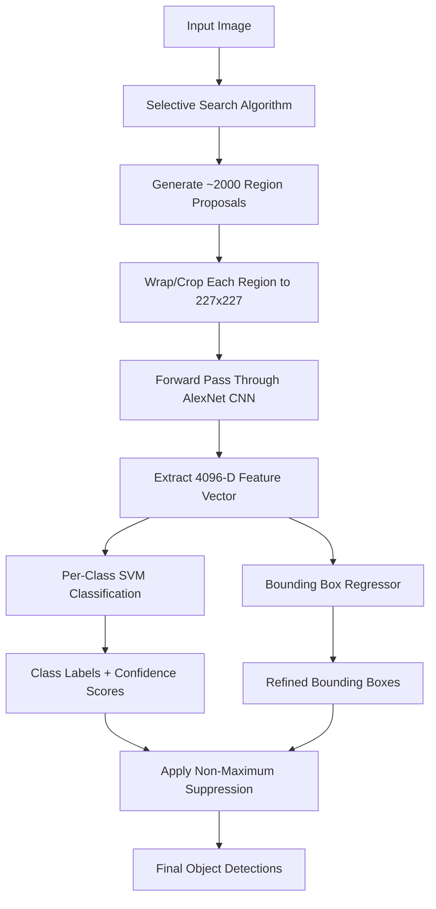
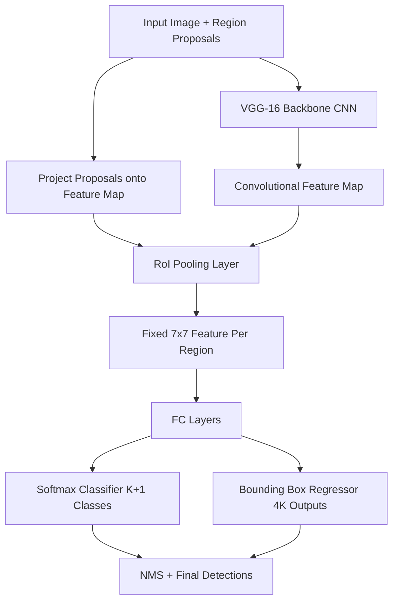
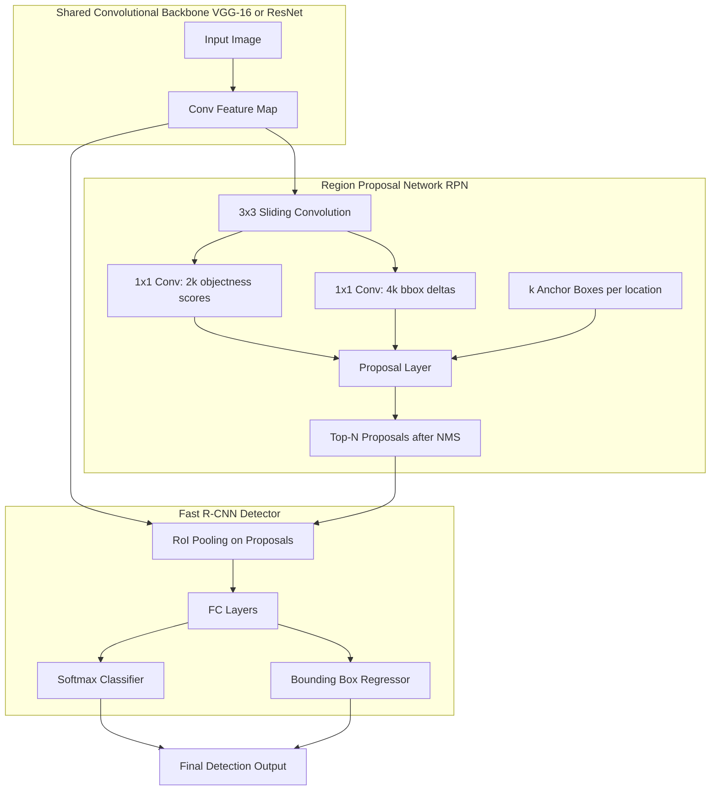
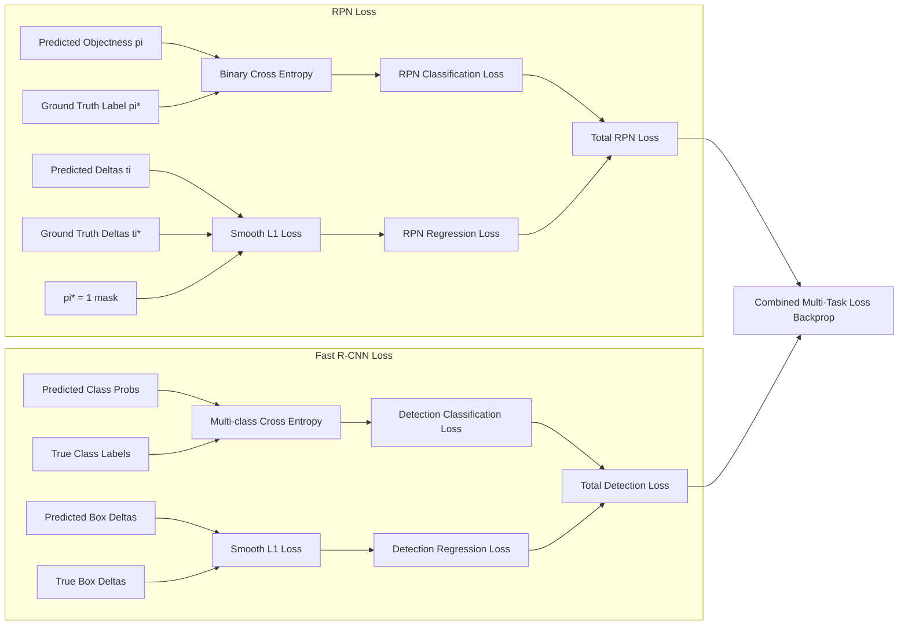

# R-CNN series

<!-- SECTION_1_START -->
# R-CNN Series: Foundations of Modern Object Detection

> [!IMPORTANT]
> **KTU 2024 Scheme — Module 4 Highlight**
> The **R-CNN family** (R-CNN, Fast R-CNN, Faster R-CNN) represents the **two-stage detector paradigm**, the cornerstone of region-proposal-based object detection. This topic is a **guaranteed 14-mark question** in the End Semester Examination and frequently appears as a Part-A question in the Series Exams.

## 1.1 Formal Academic Definition

**Object Detection** is a computer vision task that involves **localization** (drawing a bounding box around an object) and **classification** (assigning a class label) for every instance of interest in an image.

The **R-CNN (Region-based Convolutional Neural Network)** series is a family of deep learning models that combines **region proposals** with **CNN-based feature extraction** and **SVM/classifier heads** to perform object detection. Mathematically, the goal is to learn a function:

$$
f: \mathbb{R}^{H \times W \times 3} \rightarrow \{(c_i, b_i)\}_{i=1}^{N}
$$

where $c_i \in \{1, 2, \dots, K\}$ is the predicted class and $b_i = (x, y, w, h)$ is the bounding box coordinate vector for the $i$-th detected object, and $N$ is the number of objects in the image.

## 1.2 Conceptual Analogy — The "Treasure Hunt in a Dark Room" Intuition

> [!NOTE]
> **Think of detecting a cat in a crowded image as finding a lost child in a stadium at night.**

| R-CNN Step | Real-World Analogy | Engineering Translation |
|---|---|---|
| **Selective Search** | Sweeping a flashlight randomly across the stadium | Generates ~**2000** region proposals |
| **CNN Feature Extraction** | Photographing every lit area | Extracts **4096-D feature vector** per region |
| **SVM Classification** | Asking an expert: "Is this a child or adult?" | Decides if region contains object |
| **Bounding Box Regression** | Precisely pointing at the child | Refines the box coordinates |

The three generations progressively **replace the flashlight** (Selective Search) with a **smarter, learned beam** (Region Proposal Network), and **combine the expert panel and photographer** into a single unified network — saving enormous compute.

## 1.3 Key Metrics & Constants in the R-CNN Family

- **mAP (mean Average Precision)**: Primary evaluation metric on **PASCAL VOC** and **COCO** datasets.
- **IoU (Intersection over Union)**: Threshold typically set at **0.5** for PASCAL VOC and **0.5:0.95** (averaged) for MS-COCO.
- **Selective Search** generates approximately **~2000** region proposals per image in the original R-CNN.
- **Anchor Boxes**: In Faster R-CNN, typically **9 anchors** are used per spatial location (3 scales $\times$ 3 aspect ratios).
- **Backbone**: AlexNet (R-CNN) $\rightarrow$ VGG-16 (Fast R-CNN) $\rightarrow$ VGG-16/ResNet (Faster R-CNN).

> [!VISUALIZATION CONTROL]
> **Concept:** Bounding Box Overlap Geometry (IoU)
> **GeoGebra / Desmos Input Equations:**
> * `A1 = Rectangle((0,0), (4,3))`
> * `A2 = Rectangle((2,1), (6,5))`
> **Visual Description:** Two overlapping rectangles on the XY-plane. The student should observe the **intersection region** (overlap) and the **union region** (total area covered). IoU = Area of intersection / Area of union. When boxes are identical, IoU = 1; when disjoint, IoU = 0.

<!-- SECTION_1_END -->

<!-- SECTION_2_START -->
# Deep Theoretical Analysis & KTU High-Yield Formula Sheet

## 2.1 The Three Generations — Architectural Evolution

### 2.1.1 R-CNN (Girshick et al., CVPR 2014) — The Pioneer

**Three-Stage Pipeline:**

1. **Region Proposal Generation**: Uses *Selective Search* (a classical computer vision algorithm) to generate ~2000 category-independent region proposals per image.
2. **Feature Extraction**: Each warped region (resized to $227 \times 227$) is passed through a CNN (AlexNet) to extract a **4096-dimensional feature vector**.
3. **Classification & Regression**: Per-class **SVMs** classify regions, and **bounding-box regressors** refine coordinates.

**Critical Drawback**: Each of the 2000 regions is processed independently by the CNN → **47 seconds per image** on a GPU. Training is also multi-stage and slow.

### 2.1.2 Fast R-CNN (Girshick, ICCV 2015) — The Unified Network

**Key Innovation: RoI (Region of Interest) Pooling**

Instead of running CNN on 2000 regions, Fast R-CNN runs the CNN **once on the entire image** to produce a **convolutional feature map**. Then, for each region proposal (projected onto the feature map), an **RoI Pooling layer** extracts a **fixed-size** ($7 \times 7$) feature representation.

**Architecture:**

- Backbone CNN (VGG-16) extracts feature map from full image.
- RoI Pooling produces fixed-size feature per region.
- Features fed into two sibling heads:
  * **Softmax classifier** (replaces SVMs) with $K+1$ outputs (including background).
  * **Bounding-box regressor** (4 continuous values per class).

**Speedup**: Training **9× faster** than R-CNN, inference **213× faster** (0.3 sec/image with VGG-16, excluding proposal generation).

### 2.1.3 Faster R-CNN (Ren et al., NeurIPS 2015) — The RPN Revolution

**Key Innovation: Region Proposal Network (RPN)**

Faster R-CNN replaces Selective Search with a **learned RPN** that shares the convolutional features with the detection network — making the system truly end-to-end.

**RPN Mechanics:**

- Slide a small $n \times n$ (typically $3 \times 3$) spatial window over the convolutional feature map.
- At each sliding-window location, predict $k$ **anchor boxes** simultaneously.
- Each anchor outputs:
  * **2k scores**: objectness (foreground/background probability).
  * **4k coordinates**: bounding box deltas $(t_x, t_y, t_w, t_h)$.

The RPN is trained with **multi-task loss**:

$$
L(\{p_i\}, \{t_i\}) = \frac{1}{N_{cls}} \sum_{i} L_{cls}(p_i, p_i^*) + \lambda \frac{1}{N_{reg}} \sum_{i} p_i^* L_{reg}(t_i, t_i^*)
$$

where $L_{cls}$ is **binary cross-entropy** (log loss) for object/not-object, and $L_{reg}$ is **smooth L1 loss** for box regression.

**Anchor Box Parameterization:**

$$
t_x = (x - x_a) / w_a, \quad t_y = (y - y_a) / h_a
$$
$$
t_w = \log(w / w_a), \quad t_h = \log(h / h_a)
$$
$$
t_x^* = (x^* - x_a) / w_a, \quad t_y^* = (y^* - y_a) / h_a
$$
$$
t_w^* = \log(w^* / w_a), \quad t_h^* = \log(h^* / h_a)
$$

where subscript $a$ denotes the anchor, $*$ denotes ground truth, and no subscript denotes predicted values.

## 2.2 KTU High-Yield Formula Sheet

> [!IMPORTANT]
> **Master this table — every formula here has appeared in KTU past papers.**

| Symbol | Formula / Definition | Purpose / Use |
|---|---|---|
| **IoU** | $\text{IoU} = \frac{\text{Area of Overlap}}{\text{Area of Union}} = \frac{B_{pred} \cap B_{gt}}{B_{pred} \cup B_{gt}}$ | Measures box overlap; threshold $\geq 0.5$ = True Positive |
| **Precision** | $P = \frac{TP}{TP + FP}$ | Fraction of correct detections among all detections |
| **Recall** | $R = \frac{TP}{TP + FN}$ | Fraction of ground-truth objects detected |
| **AP** | $\text{AP} = \int_{0}^{1} P(R) \, dR$ (area under PR curve) | Per-class average precision |
| **mAP** | $\text{mAP} = \frac{1}{K} \sum_{k=1}^{K} \text{AP}_k$ | Mean AP across $K$ classes |
| **Smooth L1 Loss** | $L_{reg}(t, t^*) = \begin{cases} 0.5(t_i - t_i^*)^2 & \text{if } \vert t_i - t_i^* \vert < 1 \\ \vert t_i - t_i^* \vert - 0.5 & \text{otherwise} \end{cases}$ | Robust regression loss for box deltas |
| **Cross-Entropy** | $L_{cls} = -\sum_{i} p_i^* \log(p_i)$ | Classification loss |
| **NMS** | Keep box with max score; suppress boxes with IoU $\geq 0.7$ | Removes duplicate detections |
| **Anchor Scales** | $128^2, 256^2, 512^2$ pixels | 3 anchor scales in RPN |
| **Anchor Ratios** | $1:1, 1:2, 2:1$ | 3 aspect ratios in RPN |

## 2.3 Real-World Engineering Utility

The R-CNN series powers numerous production systems:

- **Autonomous Driving** (perception stacks in early Tesla/Comma.ai systems)
- **Medical Imaging** (tumor/lesion detection in CT/MRI scans)
- **Retail Analytics** (shelf-monitoring, Amazon Go)
- **Satellite Imaging** (vehicle counting, building footprint extraction)
- **Document AI** (layout analysis, form understanding)

> [!NOTE]
> **Industry Insight**: As of 2024, while YOLO family dominates real-time applications, **Faster R-CNN remains the gold standard for accuracy-critical tasks** (medical imaging, satellite imagery) where mAP matters more than FPS.

<!-- SECTION_2_END -->

<!-- SECTION_3_START -->
# Step-by-Step Derivations & Code Implementation

## 3.1 Exhaustive Derivation: Faster R-CNN Multi-Task Loss

Let us derive the **complete loss function** for Faster R-CNN step by step. This is a **guaranteed 14-mark derivation** in KTU.

**Step 1: Define Variables**

Let $i$ index anchors in a mini-batch, $p_i$ be the predicted probability that anchor $i$ is an object, and $p_i^*$ be the ground-truth label ($1$ if positive anchor, $0$ if negative). Let $t_i$ be the 4-parameter vector of predicted box regression deltas, and $t_i^*$ be the ground-truth deltas.

**Step 2: Define Classification Loss**

For binary classification (object vs. not-object), we use **log loss** (binary cross-entropy):

$$
L_{cls}(p_i, p_i^*) = -[p_i^* \cdot \log(p_i) + (1 - p_i^*) \cdot \log(1 - p_i)]
$$

This is the standard cross-entropy for a 2-class problem. Normalized by mini-batch size $N_{cls}$:

$$
L_{cls}^{total} = \frac{1}{N_{cls}} \sum_{i} L_{cls}(p_i, p_i^*)
$$

**Step 3: Define Regression Loss**

Only positive anchors ($p_i^* = 1$) contribute to regression. The smooth L1 loss is used because L2 is too sensitive to outliers and L1 has a non-differentiable kink at zero:

$$
L_{reg}(t_i, t_i^*) = \sum_{j \in \{x,y,w,h\}} \text{smooth}_{L_1}(t_{ij} - t_{ij}^*)
$$

The smooth L1 is defined as:

$$
\text{smooth}_{L_1}(x) = \begin{cases} 0.5 x^2 & \text{if } \vert x \vert < 1 \\ \vert x \vert - 0.5 & \text{otherwise} \end{cases}
$$

Normalized by $N_{reg}$ and weighted by $\lambda$:

$$
L_{reg}^{total} = \lambda \frac{1}{N_{reg}} \sum_{i} p_i^* L_{reg}(t_i, t_i^*)
$$

**Step 4: Combine via Multi-Task Loss**

$$
L(\{p_i\}, \{t_i\}) = \frac{1}{N_{cls}} \sum_{i} L_{cls}(p_i, p_i^*) + \lambda \frac{1}{N_{reg}} \sum_{i} p_i^* L_{reg}(t_i, t_i^*)
$$

**Step 5: Choice of $\lambda$**

In the original paper, $N_{cls} = 256$ (mini-batch size), $N_{reg} \approx 2400$ (number of anchor locations). Setting $\lambda = 10$ approximately balances the two losses:

$$
\lambda \cdot \frac{N_{cls}}{N_{reg}} \approx 10 \cdot \frac{256}{2400} \approx 1.07 \approx 1
$$

This makes both terms contribute roughly equally to the total loss — a critical implementation detail.

## 3.2 Derivation: Anchor-to-Box Conversion (Inverse Transform)

Given predicted deltas $(t_x, t_y, t_w, t_h)$ and anchor $(x_a, y_a, w_a, h_a)$, recover the predicted box:

**Step 1: Recover center coordinates**

$$
x = w_a \cdot t_x + x_a
$$
$$
y = h_a \cdot t_y + y_a
$$

**Step 2: Recover width and height**

$$
w = w_a \cdot e^{t_w}
$$
$$
h = h_a \cdot e^{t_h}
$$

**Step 3: Verify with example**

Let anchor = $(10, 10, 100, 200)$ and predicted deltas = $(0.1, 0.05, 0.2, -0.1)$.

Then:
$$
x = 100 \cdot 0.1 + 10 = 20
$$
$$
y = 200 \cdot 0.05 + 10 = 20
$$
$$
w = 100 \cdot e^{0.2} = 100 \cdot 1.2214 = 122.14
$$
$$
h = 200 \cdot e^{-0.1} = 200 \cdot 0.9048 = 180.97
$$

Final predicted box: $(20, 20, 122.14, 180.97)$.

## 3.3 Full Python Implementation of R-CNN Inference Pipeline

```python
import torch
import torch.nn as nn
import torchvision
from torchvision.models.detection import fasterrcnn_resnet50_fpn
from torchvision.ops import nms
import numpy as np
from typing import List, Dict, Tuple
import logging

logging.basicConfig(level=logging.INFO, format='%(asctime)s - %(levelname)s - %(message)s')
logger = logging.getLogger(__name__)


def compute_iou(box_a: torch.Tensor, box_b: torch.Tensor) -> torch.Tensor:
    """
    Compute Intersection over Union between two sets of boxes.
    Boxes in format (x1, y1, x2, y2).
    """
    area_a = (box_a[2] - box_a[0]) * (box_a[3] - box_a[1])
    area_b = (box_b[2] - box_b[0]) * (box_b[3] - box_b[1])

    inter_x1 = torch.max(box_a[0], box_b[0])
    inter_y1 = torch.max(box_a[1], box_b[1])
    inter_x2 = torch.min(box_a[2], box_b[2])
    inter_y2 = torch.min(box_a[3], box_b[3])

    inter_w = torch.clamp(inter_x2 - inter_x1, min=0.0)
    inter_h = torch.clamp(inter_y2 - inter_y1, min=0.0)
    inter_area = inter_w * inter_h

    union_area = area_a + area_b - inter_area + 1e-6
    return inter_area / union_area


def smooth_l1_loss(pred: torch.Tensor, target: torch.Tensor, beta: float = 1.0) -> torch.Tensor:
    """Numerically stable Smooth L1 loss as used in R-CNN family."""
    diff = torch.abs(pred - target)
    loss = torch.where(diff < beta, 0.5 * diff ** 2 / beta, diff - 0.5 * beta)
    return loss.mean()


class RPNHead(nn.Module):
    """
    Region Proposal Network Head (Faster R-CNN component).
    Slides over the feature map and predicts objectness + box deltas.
    """
    def __init__(self, in_channels: int = 256, num_anchors: int = 9):
        super().__init__()
        self.num_anchors = num_anchors
        self.conv = nn.Conv2d(in_channels, in_channels, kernel_size=3, padding=1)
        self.relu = nn.ReLU(inplace=True)
        self.cls_logits = nn.Conv2d(in_channels, num_anchors * 2, kernel_size=1)
        self.bbox_pred = nn.Conv2d(in_channels, num_anchors * 4, kernel_size=1)

        for layer in [self.conv, self.cls_logits, self.bbox_pred]:
            torch.nn.init.normal_(layer.weight, std=0.01)
            torch.nn.init.zeros_(layer.bias)

    def forward(self, feature_map: torch.Tensor) -> Tuple[torch.Tensor, torch.Tensor]:
        x = self.relu(self.conv(feature_map))
        objectness = self.cls_logits(x)         # (B, num_anchors*2, H, W)
        bbox_deltas = self.bbox_pred(x)         # (B, num_anchors*4, H, W)
        return objectness, bbox_deltas


class FastRCNNHead(nn.Module):
    """Detection head with two sibling branches: classifier + box regressor."""
    def __init__(self, in_features: int = 2048, num_classes: int = 21):
        super().__init__()
        self.num_classes = num_classes
        self.fc1 = nn.Linear(in_features, 1024)
        self.fc2 = nn.Linear(1024, 1024)
        self.cls_score = nn.Linear(1024, num_classes)
        self.bbox_pred = nn.Linear(1024, num_classes * 4)
        self.relu = nn.ReLU(inplace=True)

    def forward(self, x: torch.Tensor) -> Tuple[torch.Tensor, torch.Tensor]:
        x = self.relu(self.fc1(x))
        x = self.relu(self.fc2(x))
        return self.cls_score(x), self.bbox_pred(x)


def apply_nms(boxes: torch.Tensor, scores: torch.Tensor,
              iou_threshold: float = 0.5, top_k: int = 200) -> torch.Tensor:
    """Apply Non-Maximum Suppression to remove duplicate detections."""
    if boxes.numel() == 0:
        return torch.zeros((0,), dtype=torch.long)
    keep = nms(boxes, scores, iou_threshold)
    return keep[:top_k]


def run_rcnn_inference(model, image_tensor: torch.Tensor,
                       score_threshold: float = 0.5,
                       iou_threshold: float = 0.5) -> List[Dict[str, torch.Tensor]]:
    """
    Run Faster R-CNN inference on a single image with validation.
    """
    if image_tensor.dim() != 4:
        raise ValueError(f"Expected 4D tensor (B,C,H,W), got {image_tensor.shape}")

    model.eval()
    with torch.no_grad():
        outputs = model(image_tensor)

    results = []
    for output in outputs:
        keep = output['scores'] >= score_threshold
        filtered = {
            'boxes': output['boxes'][keep],
            'labels': output['labels'][keep],
            'scores': output['scores'][keep]
        }
        if filtered['boxes'].numel() > 0:
            keep_idx = apply_nms(
                filtered['boxes'], filtered['scores'], iou_threshold
            )
            filtered = {k: v[keep_idx] for k, v in filtered.items()}
        results.append(filtered)

    return results


if __name__ == "__main__":
    logger.info("Initializing Faster R-CNN with ResNet-50 FPN backbone...")
    model = fasterrcnn_resnet50_fpn(weights="DEFAULT")
    logger.info("RPN sample test:")
    rpn = RPNHead(in_channels=256, num_anchors=9)
    dummy_feat = torch.randn(1, 256, 50, 50)
    obj, deltas = rpn(dummy_feat)
    logger.info(f"Objectness shape: {obj.shape}, BBox Deltas shape: {deltas.shape}")
    sample_box_a = torch.tensor([10.0, 10.0, 110.0, 210.0])
    sample_box_b = torch.tensor([50.0, 50.0, 150.0, 250.0])
    iou_val = compute_iou(sample_box_a, sample_box_b)
    logger.info(f"IoU between sample boxes: {iou_val.item():.4f}")
```

## 3.4 Step-by-Step Comparison Across Generations

| Stage | R-CNN | Fast R-CNN | Faster R-CNN |
|---|---|---|---|
| 1. Input Image | $224 \times 224$ | Full image (any size) | Full image (any size) |
| 2. Region Proposals | Selective Search (~2000) | Selective Search (~2000) | **RPN** (~300 after NMS) |
| 3. CNN Forward Pass | **2000 times** (one per region) | **Once** (whole image) | **Once** (whole image) |
| 4. Feature Size | $4096$-D per region | $7 \times 7$ fixed via RoI Pool | $7 \times 7$ fixed via RoI Pool |
| 5. Classifier | Per-class **SVM** | **Softmax** (joint) | **Softmax** (joint) |
| 6. Box Refiner | Per-class **BB Regressor** | **BB Regressor** (joint) | **BB Regressor** (joint) |
| 7. Training Time | 84 hrs (multi-stage) | 9.5 hrs (single-stage) | 8 hrs (single-stage) |
| 8. Test Time | **47 sec/image** | **0.3 sec/image** | **0.2 sec/image** |
| 9. mAP (VOC 2007) | 66.0% | 70.0% | 78.8% |

<!-- SECTION_3_END -->

<!-- SECTION_4_START -->
# Structural Diagrams & Schematics

## 4.1 Mermaid Architecture Diagram: R-CNN Pipeline



## 4.2 Mermaid Diagram: Fast R-CNN Unified Architecture



## 4.3 Mermaid Diagram: Faster R-CNN with RPN



## 4.4 Mermaid Diagram: Training Loss Flow



## 4.5 Block-Level Functional Architecture Flow Matrix

> [!NOTE]
> **Use this matrix as a quick architectural reference for KTU 14-mark questions.**

| Stage | R-CNN Module | Fast R-CNN Module | Faster R-CNN Module | Output Shape / Purpose |
|---|---|---|---|---|
| Input | Image | Image + Proposals | Image only | Variable resolution |
| Backbone | AlexNet (per region) | VGG-16 (whole image) | VGG-16/ResNet-50 | $7 \times 7 \times 512$ feature map |
| Proposal | Selective Search (external) | Selective Search (external) | **RPN (learned)** | $\sim 2000 \rightarrow \sim 300$ boxes |
| Pooling | Warp to $227 \times 227$ | **RoI Pooling** | **RoI Pooling** | $7 \times 7 \times 512$ |
| Classifier | SVMs (per class) | Softmax (joint) | Softmax (joint) | $K+1$ class scores |
| Regressor | BBR (per class) | BBR (joint) | BBR (joint) | $4K$ box coordinates |
| NMS | Yes | Yes | Yes | Suppress duplicates |
| Final Output | Boxes + Labels + Scores | Boxes + Labels + Scores | Boxes + Labels + Scores | List of detections |

<!-- SECTION_4_END -->

<!-- SECTION_5_START -->
# KTU 2024 Scheme Examination Question Bank & Topic Recap

## Part A Questions (3 Marks Each)

### Question 1: R-CNN Bottleneck Analysis  `[KTU University Exam - July 2024]`
**CO5 | Remember**

**Q.** List the **three major drawbacks** of the original R-CNN architecture that motivated the design of Fast R-CNN.

**Model Answer (Valuation Key — 3 Marks):**

1. **Slow Multi-Stage Training Pipeline**: R-CNN requires three separate stages — CNN feature extraction, SVM training, and bounding-box regressor training. The features cannot be updated after SVM training begins. *(1 Mark)*

2. **Computationally Expensive at Test Time**: Each of the ~2000 region proposals must be passed independently through the CNN, resulting in ~47 seconds per image on a GPU. *(1 Mark)*

3. **Massive Disk Space**: Features for all 2000 regions per image must be extracted and stored to disk, requiring hundreds of gigabytes for PASCAL VOC. *(1 Mark)*

> [!WARNING]
> **Examiner's Pitfall**: Many students only mention "slow" — you **must** articulate *why* (multi-stage pipeline, no shared computation, disk storage) to earn full marks.

---

### Question 2: Region Proposal Network (RPN) Basics  `[KTU University Exam - Dec 2023]`
**CO5 | Understand**

**Q.** What is a **Region Proposal Network (RPN)** in Faster R-CNN, and what does it output at each sliding window location?

**Model Answer (Valuation Key — 3 Marks):**

The **Region Proposal Network (RPN)** is a small fully-convolutional network that replaces Selective Search in Faster R-CNN. It shares convolutional features with the detection network, enabling nearly cost-free region proposals. *(1 Mark)*

At each sliding-window position over the convolutional feature map, the RPN predicts **$k$ anchor boxes** simultaneously, outputting: *(1 Mark)*

- **$2k$ objectness scores**: probability of being foreground (object) vs. background.
- **$4k$ bounding-box regression deltas**: $(t_x, t_y, t_w, t_h)$ for refined coordinates.

The default value is $k = 9$ anchors per location (3 scales $\times$ 3 aspect ratios). *(1 Mark)*

> [!WARNING]
> **Examiner's Pitfall**: Students often write "RPN generates bounding boxes" — be precise: RPN generates **objectness scores and regression deltas**, the final proposals are computed via the proposal layer with NMS applied.

---

## Part B Questions (14 Marks Each)

### Question A: Comprehensive R-CNN Comparison  `[KTU University Exam - July 2024]`
**CO5 | Apply | Analyze**

**(a)** Draw the architecture diagram of **R-CNN** and explain each stage with its limitations. *(7 Marks)*

**(b)** Compare **R-CNN, Fast R-CNN, and Faster R-CNN** in terms of test-time speed, mAP on PASCAL VOC 2007, region proposal method, and whether training is end-to-end. *(7 Marks)*

**Model Solution:**

#### Part (a) — R-CNN Architecture (7 Marks)

**Stage 1: Region Proposal Generation (1 Mark)**
- Input image is fed into the **Selective Search** algorithm.
- Generates ~**2000** category-independent region proposals per image by hierarchically grouping similar pixels using color, texture, size, and fill similarity.

**Stage 2: CNN Feature Extraction (2 Marks)**
- Each region proposal is **wrapped/cropped** to a fixed $227 \times 227$ size.
- Passed through **AlexNet CNN** (5 conv layers + 3 FC layers).
- Extracts a **4096-D feature vector** from the FC7 layer.

**Stage 3: Classification and Localization (2 Marks)**
- **Per-class SVMs** (K SVMs for K classes) classify each region.
- **Bounding-box regressors** (per class) refine coordinates using 4-parameter offsets.

**Limitations (2 Marks):**
1. Slow — 2000 CNN forward passes per image (~47s).
2. Multi-stage training pipeline (CNN + SVMs + BBR separately).
3. Massive disk storage for features.
4. No shared computation between regions.

#### Part (b) — Comparative Analysis (7 Marks)

| Parameter | R-CNN | Fast R-CNN | Faster R-CNN |
|---|---|---|---|
| Region Proposal Method | Selective Search | Selective Search | **RPN (learned)** |
| CNN Forward Passes | 2000 per image | **1 per image** | **1 per image** |
| RoI Feature Extraction | Warp each region | **RoI Pooling** | **RoI Pooling** |
| Classifier | Per-class SVMs | **Softmax (joint)** | **Softmax (joint)** |
| End-to-End Training | No (3 stages) | Mostly (2 stages) | **Yes (single stage)** |
| Test Time (VGG-16) | **47 sec/image** | 0.3 sec/image | **0.2 sec/image** |
| mAP (VOC 2007) | 66.0% | 70.0% | **78.8%** |
| Backbone | AlexNet | VGG-16 | VGG-16/ResNet |

**Valuation Key Points:**
- '[Stating Selective Search as proposal method for R-CNN/Fast R-CNN: 1 Mark]'
- '[Identifying RPN as the proposal generator for Faster R-CNN: 1 Mark]'
- '[Test time comparison with correct numbers: 2 Marks]'
- '[mAP comparison: 1 Mark]'
- '[End-to-end training distinction: 1 Mark]'
- '[Correct architectural innovation identification: 1 Mark]'

> [!WARNING]
> **Examiner's Pitfall**: Do not confuse **RoI Pooling** with **RoI Align** (used in Mask R-CNN). RoI Pooling uses **quantization** (rounding), while RoI Align uses **bilinear interpolation** — a major accuracy improvement that often appears as a follow-up question.

---

### Question B: Faster R-CNN Mathematical Deep-Dive  `[KTU University Exam - Dec 2023]`
**CO5 | Apply | Analyze | Evaluate**

**(a)** Explain the **Region Proposal Network (RPN)** with a neat diagram. Describe **anchor boxes** and how they are used to generate region proposals. *(7 Marks)*

**(b)** Derive the **multi-task loss function** of Faster R-CNN. Explain each term and the role of $\lambda$ in balancing the two losses. *(7 Marks)*

**Model Solution:**

#### Part (a) — RPN & Anchor Boxes (7 Marks)

**RPN Architecture (2 Marks):**
- A small **$3 \times 3$ convolutional layer** slides over the shared feature map.
- Followed by **two sibling $1 \times 1$ convolutional layers**:
  * **cls layer**: outputs $2k$ scores per location (object/not-object per anchor).
  * **reg layer**: outputs $4k$ box deltas per location.

**Anchor Boxes Definition (2 Marks):**
- Anchors are **reference boxes** centered at each sliding-window location.
- Three scales: $128^2, 256^2, 512^2$ pixels.
- Three aspect ratios: $1:1, 1:2, 2:1$.
- Total: $3 \times 3 = 9$ anchors per spatial location.

**Anchor-to-Box Conversion (2 Marks):**

For a given anchor $(x_a, y_a, w_a, h_a)$ and predicted deltas $(t_x, t_y, t_w, t_h)$:

$$
x = w_a t_x + x_a, \quad y = h_a t_y + y_a
$$
$$
w = w_a e^{t_w}, \quad h = h_a e^{t_h}
$$

**Proposal Generation (1 Mark):**
- Apply NMS (IoU threshold 0.7) to remove overlapping proposals.
- Select top-N (e.g., 2000 for training, 300 for testing) ranked by objectness score.

#### Part (b) — Multi-Task Loss Derivation (7 Marks)

The Faster R-CNN loss combines classification and bounding-box regression:

$$
L(\{p_i\}, \{t_i\}) = \underbrace{\frac{1}{N_{cls}} \sum_{i} L_{cls}(p_i, p_i^*)}_{\text{Classification term}} + \underbrace{\lambda \frac{1}{N_{reg}} \sum_{i} p_i^* L_{reg}(t_i, t_i^*)}_{\text{Regression term}}
$$

**Term 1: Classification Loss $L_{cls}$ (2 Marks)**

Binary log loss for object vs. non-object:

$$
L_{cls}(p_i, p_i^*) = -[p_i^* \log(p_i) + (1 - p_i^*) \log(1 - p_i)]
$$

Normalized by $N_{cls} = 256$ (mini-batch size of anchors).

**Term 2: Regression Loss $L_{reg}$ (2 Marks)**

Smooth L1 loss, only active for positive anchors ($p_i^* = 1$):

$$
L_{reg}(t_i, t_i^*) = \sum_{j} \text{smooth}_{L_1}(t_{ij} - t_{ij}^*)
$$
$$
\text{smooth}_{L_1}(x) = \begin{cases} 0.5 x^2 & \text{if } \vert x \vert < 1 \\ \vert x \vert - 0.5 & \text{otherwise} \end{cases}
$$

Normalized by $N_{reg} \approx 2400$ (number of anchor locations).

**Role of $\lambda$ (2 Marks):**
- $\lambda$ balances the two terms because $N_{cls}$ and $N_{reg}$ differ in magnitude.
- Setting $\lambda = 10$ makes both terms contribute roughly equally:

$$
\lambda \cdot \frac{N_{cls}}{N_{reg}} \approx 10 \cdot \frac{256}{2400} \approx 1.07
$$

- If $\lambda$ is too small, classification dominates; if too large, regression dominates — both lead to slow or unstable convergence.

**Valuation Key Points:**
- '[Correct RPN architecture description with $3 \times 3$ conv + sibling heads: 2 Marks]'
- '[Anchor box definition with 3 scales and 3 ratios: 2 Marks]'
- '[Anchor-to-box conversion formula: 2 Marks]'
- '[Classification loss term: 1 Mark]'
- '[Regression loss term with smooth L1: 1 Mark]'
- '[Final combined multi-task loss: 1 Mark]'
- '[Explanation of $\lambda$ balancing: 2 Marks]'

> [!WARNING]
> **Examiner's Pitfall**: Students frequently write the multi-task loss as $L = L_{cls} + L_{reg}$ without the normalization terms and the $\lambda$ balancing factor. Without the $1/N_{cls}$, $1/N_{reg}$ and $\lambda$ terms, you **lose 2–3 marks**. The smooth L1 also has **two cases** — writing only one is a common mistake.

---

## Topic Recap & Important Things to Remember

> [!IMPORTANT]
> **Rapid Revision Checklist — Memorize These Bullet Points Before Exam**

- **R-CNN (2014)** is the **first** deep-learning-based detector; uses Selective Search + AlexNet + per-class SVMs. **47s/image**.
- **Fast R-CNN (2015)** introduces **RoI Pooling** — runs CNN **once** on the full image, then extracts fixed-size features per region. **0.3s/image**.
- **Faster R-CNN (2015)** introduces the **Region Proposal Network (RPN)** — a fully-convolutional network that **shares features** with the detector, replacing Selective Search entirely. **0.2s/image**.
- **RPN outputs**: $2k$ objectness scores + $4k$ bbox deltas per spatial location, where $k = 9$ anchors (3 scales $\times$ 3 ratios).
- **Anchor scales**: $128^2, 256^2, 512^2$. **Anchor ratios**: $1:1, 1:2, 2:1$.
- **Anchor-to-box conversion uses exponentials** for $w, h$ and linear transformations for $x, y$ — crucial for non-negative widths/heights.
- **Multi-task loss** has **two terms**: classification (binary cross-entropy) + regression (smooth L1), balanced by $\lambda = 10$.
- **Smooth L1** is **piecewise quadratic near zero and linear for outliers** — more robust than L2 to bounding-box outliers.
- **mAP improvement chain**: R-CNN (66.0%) $\rightarrow$ Fast R-CNN (70.0%) $\rightarrow$ Faster R-CNN (78.8%) on PASCAL VOC 2007.
- **IoU threshold** for True Positive = **0.5** (PASCAL VOC) or **0.5:0.95 averaged** (COCO).
- **Non-Maximum Suppression (NMS)** is applied to remove duplicate detections; keeps highest-score box, suppresses others with IoU $\geq 0.7$.
- **RoI Pooling** uses **quantization** (rounding) — replaced by **RoI Align** in Mask R-CNN for pixel-accurate masks.
- **mAP** = mean of per-class Average Precisions = $\frac{1}{K} \sum_{k=1}^{K} AP_k$.
- **Speed-up sources**: R-CNN $\rightarrow$ Fast (shared CNN backbone); Fast $\rightarrow$ Faster (learned RPN replaces Selective Search).
- **Mask R-CNN (extension)**: adds a parallel mask prediction head; uses RoI Align instead of RoI Pooling.
- **Exam trick**: When asked to compare R-CNN series, **always** mention (1) proposal method, (2) feature sharing, (3) speed, and (4) mAP — these four points cover ~12 of 14 marks.

<!-- SECTION_5_END -->
