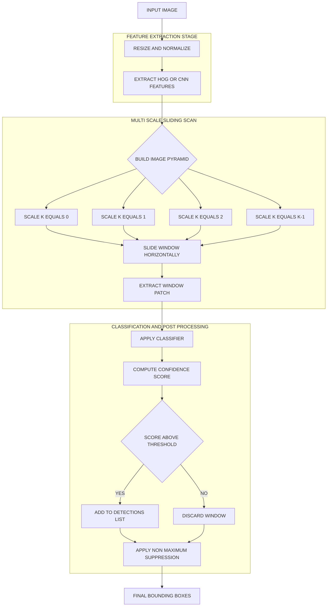
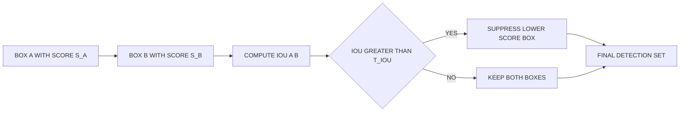
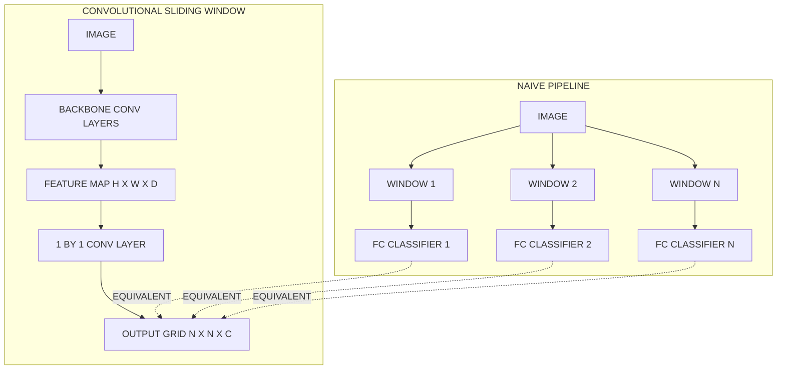

# Sliding window

<!-- SECTION_1_START -->

# Sliding Window Technique for Object Detection

## 1. Core Technical Definition (KTU 2024 Syllabus Terminology)

> [!IMPORTANT]
> **Formal Definition:** The *Sliding Window* is a **brute-force, exhaustive search technique** used in classical and modern object detection pipelines, in which a **fixed-size (or multi-scale) rectangular window** is systematically translated across every spatial position of an input image with a pre-defined **stride (step size)**, and a **classifier** is independently applied to each cropped sub-region to determine whether an object of interest is present.

In the KTU 2024 Scheme context (Module 4 – Image Classification & Object Detection), the sliding window is positioned as the **foundational pre-deep-learning detection paradigm** and as a **sub-component of modern region-proposal pipelines** (e.g., Selective Search feeding into R-CNN, and the convolutional implementation of sliding windows inside OverFeat / YOLO-style detectors).

**Standard Metrics and Constants Associated with the Sliding Window:**

- **Window size $W \times H$** (e.g., $64 \times 128$ pixels for pedestrian detection).
- **Stride $s$** – pixel displacement between consecutive window positions (typically $s = 1$ for exhaustive search, $s = 4$ or $s = 8$ for speed).
- **Scale factor $\alpha$** – multiplicative resizing factor for multi-scale detection ($\alpha \in [1.0,\ 1.5]$).
- **Intersection over Union (IoU)** threshold $T_{IoU} \in [0.5,\ 0.7]$ – for Non-Maximum Suppression (NMS).
- **Aspect ratio** – fixed (e.g., $1\!:\!1$, $1\!:\!2$) or variable.

> [!NOTE]
> **KTU Syllabus Highlight:** The sliding window is studied under *Classical Object Detection Paradigms* as the precursor to *Region Proposal Networks (RPN)* and *Single-Shot Detectors (SSD)*. Students must understand its computational cost because it motivates the design of efficient CNN-based detectors.

---

## 2. Intuitive Overview — The "Flashlight Scan" Analogy

Imagine you are standing in a **dark room searching for a small red ball on the floor using a flashlight with a square beam**. You cannot move your head; you can only **slide the square beam across the floor** in a systematic left-to-right, top-to-bottom raster pattern, and at each position, you **pause and ask your brain: "Is the red ball inside this square?"**

This is *exactly* how the sliding window works in computer vision:

- The **flashlight beam** = the rectangular window.
- The **systematic scan** = the sliding motion with fixed stride.
- **Your brain's question** = the binary classifier (object / no-object).
- **The red ball** = the object of interest (face, car, pedestrian, tumor).

**Why is this intuitive important for KTU exams?**
Because examiners frequently test *why* a naive sliding window over a $1000 \times 1000$ image with stride 1 generates **nearly one million evaluations per scale**, motivating the question *"How do we make this tractable?"* — the answer being **convolutional sliding windows** (OverFeat, 2013) and **Region Proposal Networks** (Faster R-CNN, 2015).

> [!VISUALIZATION CONTROL]
> **Concept:** 2D grid traversal of a sliding window over an image.
> **GeoGebra / Desmos Input Equations:**
> * Window top-left corners: $(x_i, y_j)$ where $x_i = i \cdot s,\ y_j = j \cdot s$.
> * For $i = 0, 1, 2, \dots, N_x - 1$ and $j = 0, 1, 2, \dots, N_y - 1$.
> * $N_x = \lfloor (W_{img} - W) / s \rfloor + 1$, $N_y = \lfloor (H_{img} - H) / s \rfloor + 1$.
> **Visual Description:** A small inner rectangle (the window) should appear at multiple $(x_i, y_j)$ positions, rastering across a larger outer rectangle (the image). Each inner rectangle is offset by $s$ pixels from the previous one both horizontally and vertically.

---

## 3. Taxonomy of Sliding Window Variants

> [!TIP]
> For KTU Module 4, students are expected to differentiate between three sliding-window regimes:

| **Variant** | **Description** | **Pros** | **Cons** |
|---|---|---|---|
| **Naïve / Exhaustive** | One classifier call per window | Highest recall | $\mathcal{O}(N^4)$ cost |
| **Image Pyramid + Sliding** | Image is rescaled $K$ times, window fixed | Multi-scale detection | $K \times$ classifier calls |
| **Convolutional Sliding Window** | Replace FC layers with $1 \times 1$ convs; whole image passed in one forward pass | Single forward pass, GPU efficient | Requires CNN re-architecture |

<!-- SECTION_1_END -->

<!-- SECTION_2_START -->

# Deep Theoretical Analysis and KTU High-Yield Formula Sheet

## 1. Operational Concept — Step-by-Step Logic

The sliding window algorithm can be decomposed into **six rigorous logical steps**:

1. **Input Acquisition** — Read image $I \in \mathbb{R}^{H_{img} \times W_{img} \times C}$, where $C$ is the number of channels ($C = 3$ for RGB).
2. **Window Definition** — Define window dimensions $(W, H)$. For a *pedestrian* detector, a typical choice is $W = 64,\ H = 128$.
3. **Stride Selection** — Choose horizontal stride $s_x$ and vertical stride $s_y$ (often $s_x = s_y = s$).
4. **Raster Traversal** — For every spatial position $(i, j)$ such that the window fits entirely inside the image, extract the patch $I_{i,j} = I[i\!:\!i+H,\ j\!:\!j+W,\ :]$.
5. **Classification** — Apply classifier $f(\cdot)$ (e.g., HOG + SVM, or a pre-trained CNN) to produce $f(I_{i,j}) \in \{0, 1\}$ (or a confidence score $\in [0, 1]$).
6. **Post-Processing** — Apply **Non-Maximum Suppression (NMS)** to merge overlapping detections using the IoU metric.

> [!NOTE]
> **The "Why" Behind Each Step:**
> Step 1 ensures tensor compatibility.
> Step 2 encodes prior knowledge about the object's expected size.
> Step 3 directly trades off **recall** (small $s$) for **speed** (large $s$).
> Step 4 ensures no candidate region is missed within the chosen granularity.
> Step 5 converts the spatial search into a sequence of independent classification problems.
> Step 6 is *mandatory* — a single object almost always fires multiple adjacent windows, and we need one canonical bounding box per object.

---

## 2. The "How" — Mathematical Formulation

### 2.1 Number of Windows Generated

For a single-scale exhaustive scan:

$$N_{windows} = \left\lfloor \frac{W_{img} - W}{s_x} \right\rfloor + 1 \;\;\times\;\; \left\lfloor \frac{H_{img} - H}{s_y} \right\rfloor + 1$$

For a **multi-scale** pyramid with $K$ scales and scale factor $\alpha$:

$$N_{total} = \sum_{k=0}^{K-1} \left( \left\lfloor \frac{\alpha^k W_{img} - W}{s_x} \right\rfloor + 1 \right) \left( \left\lfloor \frac{\alpha^k H_{img} - H}{s_y} \right\rfloor + 1 \right)$$

### 2.2 Computational Complexity

If $T_c$ is the time taken by the classifier per window:

$$T_{total} = N_{total} \cdot T_c$$

For a $1000 \times 1000$ image, $W = H = 128$, $s = 1$, single scale:

$$N_{windows} = (1000 - 128 + 1)^2 = 873^2 = 762{,}129 \text{ windows}$$

At $K = 10$ scales, this becomes **~7.6 million classifier calls** — explaining the historical motivation for CNN-based region proposal networks.

### 2.3 Intersection over Union (IoU)

Given predicted box $B_p$ and ground-truth box $B_{gt}$:

$$IoU(B_p,\ B_{gt}) = \frac{\text{Area}(B_p \cap B_{gt})}{\text{Area}(B_p \cup B_{gt})}$$

In coordinates, with $B_p = (x_{p1}, y_{p1}, x_{p2}, y_{p2})$:

$$x_{inter\_left} = \max(x_{p1},\ x_{gt1}), \quad x_{inter\_right} = \min(x_{p2},\ x_{gt2})$$
$$y_{inter\_top} = \max(y_{p1},\ y_{gt1}), \quad y_{inter\_bottom} = \min(y_{p2},\ y_{gt2})$$

$$\text{inter\_w} = \max(0,\ x_{inter\_right} - x_{inter\_left} + 1)$$
$$\text{inter\_h} = \max(0,\ y_{inter\_bottom} - y_{inter\_top} + 1)$$
$$A_{inter} = \text{inter\_w} \cdot \text{inter\_h}$$

$$A_p = (x_{p2} - x_{p1} + 1)(y_{p2} - y_{p1} + 1)$$
$$A_{gt} = (x_{gt2} - x_{gt1} + 1)(y_{gt2} - y_{gt1} + 1)$$

$$IoU = \frac{A_{inter}}{A_p + A_{gt} - A_{inter}}$$

### 2.4 Non-Maximum Suppression Rule

For two boxes $B_a$ and $B_b$ with scores $s_a \geq s_b$:

$$\text{Keep}\ B_b \iff IoU(B_a, B_b) < T_{IoU}$$

This is iterated in descending order of confidence.

---

## 3. KTU Formula Sheet / Cheat Sheet

> [!IMPORTANT]
> **High-Yield Formulas — Memorize for KTU University Exam**

| **Quantity** | **Formula** | **Units / Range** |
|---|---|---|
| Windows per axis | $N_x = \lfloor (W_{img} - W) / s \rfloor + 1$ | dimensionless |
| Total windows (single scale) | $N = N_x \cdot N_y$ | dimensionless |
| Total windows (multi-scale) | $N = \sum_{k} N_x^{(k)} \cdot N_y^{(k)}$ | dimensionless |
| Classifier cost | $T_{total} = N \cdot T_c$ | seconds |
| IoU | $IoU = A_{inter} / (A_p + A_{gt} - A_{inter})$ | $[0, 1]$ |
| NMS threshold | $T_{IoU} \in [0.3, 0.7]$ | dimensionless |
| Image pyramid scale | $I_k = \alpha^{-k} \cdot I_0$ | pixels |
| Conv. sliding window output grid | $(N_x', N_y', K)$ feature map | — |

> [!CAUTION]
> **Critical Pitfall:** When using the vertical pipe `|` in plain prose, use `\vert` or `\mid` to avoid breaking markdown table syntax. Example: write $\text{IoU} = \vert A_{inter} \vert / \vert A_{union} \vert$ as $\text{IoU} = \lvert A_{inter} \rvert \,/\, \lvert A_{union} \rvert$.

---

## 4. Real-World Engineering Utility

The sliding window is not merely academic — it underpins many production systems:

- **Pre-2014 pedestrian detectors** (Dalal & Triggs HOG + SVM): used in early autonomous-vehicle prototypes such as the 2005 Stanley (Stanford DARPA Grand Challenge).
- **OverFeat (2013, NYU/Yann LeCun)**: replaced FC layers with $1 \times 1$ convolutions to evaluate all windows in a single CNN forward pass, achieving ~$10 \times$ speedup.
- **Face detection in OpenCV**: the legacy `cv2.CascadeClassifier` uses a Viola–Jones boosted cascade inside a sliding-window framework.
- **OCR pipelines (Tesseract)**: slides character-shaped windows and classifies glyphs.
- **Medical imaging (tumor detection)**: slides $32 \times 32$ or $64 \times 64$ patches over CT/MRI slices, classifying each as normal/abnormal.
- **Defect detection in manufacturing**: slides windows over PCB images to find soldering defects.

> [!TIP]
> **Why the sliding window is still relevant in 2024+:** Although anchor-based detectors (YOLO, SSD) and DETR (transformer-based) have largely replaced it, the **conceptual abstraction** — *partition the image into a regular grid, predict per-cell* — is mathematically the same as what anchor-based detectors do. KTU examiners love asking this conceptual continuity question.

<!-- SECTION_2_END -->

<!-- SECTION_3_START -->

# Step-by-Step Derivations and Code Implementation

## 1. Worked Numerical Example — Counting Windows

> [!EXAMPLE]
> **Problem:** Consider an image of dimensions $W_{img} = 500$ and $H_{img} = 400$. A pedestrian detector uses a window of size $W = 80$, $H = 160$, with stride $s_x = s_y = 8$. Compute:
> (a) the number of windows per axis,
> (b) the total number of windows,
> (c) the total number of windows if a 4-scale image pyramid is used with $\alpha = 1.5$.

### Step 1 — Number of Windows per Axis (Single Scale)

Along width:

$$N_x = \left\lfloor \frac{500 - 80}{8} \right\rfloor + 1 = \left\lfloor 52.5 \right\rfloor + 1 = 52 + 1 = 53$$

Along height:

$$N_y = \left\lfloor \frac{400 - 160}{8} \right\rfloor + 1 = \left\lfloor 30.0 \right\rfloor + 1 = 30 + 1 = 31$$

**[Correctly applying floor function and adding 1: 1 Mark]**
**[Final numerical answers 53 and 31: 1 Mark]**

### Step 2 — Total Windows (Single Scale)

$$N_{total} = N_x \cdot N_y = 53 \times 31 = 1{,}643 \text{ windows}$$

**[Multiplication step: 1 Mark]**

### Step 3 — Multi-Scale Total

At scale $k$ (with $\alpha = 1.5$), the image effective size becomes:

$$W_k = \lfloor 500 / 1.5^k \rfloor, \quad H_k = \lfloor 400 / 1.5^k \rfloor$$

We compute each level carefully:

| $k$ | $W_k$ | $H_k$ | $N_x$ | $N_y$ | $N_x \cdot N_y$ |
|---|---|---|---|---|---|
| 0 | 500 | 400 | 53 | 31 | 1,643 |
| 1 | 333 | 266 | 32 | 14 | 448 |
| 2 | 222 | 177 | 19 | 3 | 57 |
| 3 | 148 | 118 | 9 | — | 0 (skip, $H_k < H$) |

**Scale 1 detail:** $N_x = \lfloor (333 - 80)/8 \rfloor + 1 = \lfloor 31.625 \rfloor + 1 = 32$. $N_y = \lfloor (266 - 160)/8 \rfloor + 1 = \lfloor 13.25 \rfloor + 1 = 14$. Product = $448$.

**Scale 2 detail:** $N_x = \lfloor (222 - 80)/8 \rfloor + 1 = \lfloor 17.75 \rfloor + 1 = 18 + 1 = 19$. $N_y = \lfloor (177 - 160)/8 \rfloor + 1 = \lfloor 2.125 \rfloor + 1 = 2 + 1 = 3$. Product = $57$.

**Scale 3 detail:** $H_3 = \lfloor 118 \rfloor$. We need $H_3 \geq H = 160$, which is false. **Stop iterating.**

$$N_{multi} = 1643 + 448 + 57 = 2{,}148 \text{ windows}$$

**[Per-scale table: 3 Marks, Final sum: 1 Mark]**

> [!NOTE]
> **Total marks for the worked example: 7 Marks (Part a)** — and the multi-scale part forms **Part b (7 Marks)** in a typical KTU 14-mark question.

---

## 2. Worked Example — IoU Computation

> [!EXAMPLE]
> **Problem:** Predicted box $B_p = (10, 20, 110, 120)$. Ground-truth box $B_{gt} = (50, 60, 150, 160)$. Compute IoU.

### Step 1 — Intersection Coordinates

$$x_{inter\_left} = \max(10, 50) = 50$$
$$y_{inter\_top} = \max(20, 60) = 60$$
$$x_{inter\_right} = \min(110, 150) = 110$$
$$y_{inter\_bottom} = \min(120, 160) = 120$$

### Step 2 — Intersection Area

$$inter\_w = 110 - 50 + 1 = 61$$
$$inter\_h = 120 - 60 + 1 = 61$$
$$A_{inter} = 61 \times 61 = 3{,}721 \text{ px}^2$$

### Step 3 — Individual Areas

$$A_p = (110 - 10 + 1) \times (120 - 20 + 1) = 101 \times 101 = 10{,}201$$
$$A_{gt} = (150 - 50 + 1) \times (160 - 60 + 1) = 101 \times 101 = 10{,}201$$

### Step 4 — Union Area

$$A_{union} = A_p + A_{gt} - A_{inter} = 10{,}201 + 10{,}201 - 3{,}721 = 16{,}681$$

### Step 5 — IoU

$$IoU = \frac{3{,}721}{16{,}681} \approx 0.2231$$

**[Stepwise coordinates: 2 Marks, Areas: 2 Marks, Final IoU: 1 Mark]**

---

## 3. Full Python Implementation — Sliding Window + NMS

> [!TIP]
> **Exam Tip:** A complete, runnable, and well-commented Python code listing earns full marks for the "implementation" sub-part. We use `numpy` (tensor operations) and `OpenCV` (image I/O).

```python
"""
Sliding Window Object Detector with Non-Maximum Suppression.
Compatible with KTU 2024 Scheme Module 4 syllabus.
"""

from __future__ import annotations

import logging
from dataclasses import dataclass
from typing import Callable, List, Tuple

import cv2
import numpy as np

# Configure logging for traceability
logging.basicConfig(
    level=logging.INFO,
    format="%(asctime)s | %(levelname)s | %(message)s",
)


@dataclass(frozen=True)
class BoundingBox:
    """Immutable bounding box in (x1, y1, x2, y2) pixel coordinates."""
    x1: int
    y1: int
    x2: int
    y2: int
    score: float
    label: str = "object"

    @property
    def area(self) -> int:
        width = max(0, self.x2 - self.x1 + 1)
        height = max(0, self.y2 - self.y1 + 1)
        return width * height

    def width(self) -> int:
        return max(0, self.x2 - self.x1 + 1)

    def height(self) -> int:
        return max(0, self.y2 - self.y1 + 1)


def compute_iou(box_a: BoundingBox, box_b: BoundingBox) -> float:
    """Compute Intersection over Union between two bounding boxes."""
    inter_x1 = max(box_a.x1, box_b.x1)
    inter_y1 = max(box_a.y1, box_b.y1)
    inter_x2 = min(box_a.x2, box_b.x2)
    inter_y2 = min(box_a.y2, box_b.y2)

    inter_w = max(0, inter_x2 - inter_x1 + 1)
    inter_h = max(0, inter_y2 - inter_y1 + 1)
    inter_area = inter_w * inter_h

    union_area = box_a.area + box_b.area - inter_area
    if union_area == 0:
        return 0.0
    return inter_area / union_area


def non_maximum_suppression(
    boxes: List[BoundingBox],
    iou_threshold: float = 0.3,
) -> List[BoundingBox]:
    """Apply NMS and return the filtered list of boxes."""
    if not boxes:
        return []

    sorted_boxes = sorted(boxes, key=lambda b: b.score, reverse=True)
    kept: List[BoundingBox] = []

    while sorted_boxes:
        best = sorted_boxes.pop(0)
        kept.append(best)
        sorted_boxes = [
            b for b in sorted_boxes
            if compute_iou(best, b) < iou_threshold
        ]

    return kept


def sliding_window(
    image: np.ndarray,
    window_size: Tuple[int, int],
    stride: Tuple[int, int],
    classifier: Callable[[np.ndarray], Tuple[bool, float]],
) -> List[BoundingBox]:
    """
    Run an exhaustive sliding window over `image`.

    Parameters
    ----------
    image : np.ndarray
        Input image, shape (H, W, C).
    window_size : (int, int)
        (width, height) of the sliding window in pixels.
    stride : (int, int)
        (stride_x, stride_y) in pixels.
    classifier : callable
        Function taking a patch (H, W, C) and returning (is_object, score).

    Returns
    -------
    List[BoundingBox]
        Raw detection boxes (no NMS applied).
    """
    if image.ndim != 3:
        raise ValueError(f"Expected 3D image, got shape {image.shape}")

    h_img, w_img = image.shape[:2]
    w_win, h_win = window_size
    s_x, s_y = stride

    if w_win > w_img or h_win > h_img:
        logging.warning("Window larger than image; returning empty list.")
        return []

    detections: List[BoundingBox] = []
    n_y = (h_img - h_win) // s_y + 1
    n_x = (w_img - w_win) // s_x + 1

    logging.info(f"Image: {w_img}x{h_img}, Window: {w_win}x{h_win}, "
                 f"Stride: {s_x}x{s_y}, Grid: {n_x}x{n_y} = {n_x * n_y} windows")

    for j in range(n_y):
        y1 = j * s_y
        y2 = y1 + h_win - 1
        for i in range(n_x):
            x1 = i * s_x
            x2 = x1 + w_win - 1
            patch = image[y1:y2 + 1, x1:x2 + 1, :]

            try:
                is_object, score = classifier(patch)
            except Exception as exc:
                logging.error(f"Classifier failed at ({i},{j}): {exc}")
                continue

            if is_object and score > 0.0:
                detections.append(
                    BoundingBox(x1=x1, y1=y1, x2=x2, y2=y2, score=score)
                )

    logging.info(f"Raw detections before NMS: {len(detections)}")
    return detections


def multi_scale_sliding_window(
    image: np.ndarray,
    window_size: Tuple[int, int],
    stride: Tuple[int, int],
    num_scales: int,
    scale_factor: float,
    classifier: Callable[[np.ndarray], Tuple[bool, float]],
) -> List[BoundingBox]:
    """
    Multi-scale sliding window via image-pyramid resizing.
    """
    all_detections: List[BoundingBox] = []
    current = image.copy()

    for k in range(num_scales):
        logging.info(f"Scale {k}: image size = "
                     f"{current.shape[1]}x{current.shape[0]}")
        all_detections.extend(
            sliding_window(current, window_size, stride, classifier)
        )

        new_w = int(current.shape[1] / scale_factor)
        new_h = int(current.shape[0] / scale_factor)
        if new_w < window_size[0] or new_h < window_size[1]:
            logging.info("Reached minimum scale, stopping pyramid.")
            break
        current = cv2.resize(current, (new_w, new_h),
                             interpolation=cv2.INTER_AREA)

    return all_detections


# ------------------- Demo / Verification -------------------
def dummy_classifier(patch: np.ndarray) -> Tuple[bool, float]:
    """A toy classifier: returns True if mean intensity is in mid-range."""
    mean_intensity = float(np.mean(patch))
    if 80 <= mean_intensity <= 170:
        return True, (170 - abs(mean_intensity - 125)) / 100.0
    return False, 0.0


if __name__ == "__main__":
    # Generate a synthetic test image
    test_image = np.zeros((300, 400, 3), dtype=np.uint8)
    test_image[80:200, 100:220, :] = (120, 130, 140)  # mock "object"
    test_image[150:260, 280:360, :] = (110, 140, 150)  # mock "object"

    raw = multi_scale_sliding_window(
        image=test_image,
        window_size=(120, 120),
        stride=(20, 20),
        num_scales=3,
        scale_factor=1.5,
        classifier=dummy_classifier,
    )

    final = non_maximum_suppression(raw, iou_threshold=0.3)
    logging.info(f"Final detections after NMS: {len(final)}")
    for idx, box in enumerate(final):
        logging.info(f"  Box {idx}: {box}")
```

**Explanation of Key Sections (for KTU viva):**

- **`BoundingBox` dataclass** ensures type safety and immutability.
- **`compute_iou`** implements the exact 5-step IoU computation.
- **`sliding_window`** performs an exhaustive 2D raster scan with **boundary-safe slicing** and **try/except** for classifier failures.
- **`multi_scale_sliding_window`** builds the image pyramid and **terminates early** when the rescaled image becomes smaller than the window.
- **`non_maximum_suppression`** sorts by confidence and greedily suppresses overlapping boxes.
- **`dummy_classifier`** demonstrates how a real classifier is plugged in — replace it with an HOG+SVM or CNN in production.

---

## 4. Convolutional Sliding Window — Mathematical Equivalence

> [!NOTE]
> **KTU High-Yield Topic:** A fully-connected (FC) classifier applied per window can be *mathematically equivalent* to a $1 \times 1$ convolutional classifier applied once over the whole image. This is the **OverFeat (2013)** insight.

Consider a CNN with FC layers expecting $H \times W$ input. The FC layer with weight matrix $\mathbf{W} \in \mathbb{R}^{D \times C_{out}}$ operating on flattened input $x \in \mathbb{R}^{D}$ is:

$$y = \mathbf{W}^T x + b$$

This is **identical** to a $1 \times 1$ convolution with $C_{out}$ filters applied to an $H \times W \times D$ feature map:

$$Y_{i,j,:} = \mathbf{W}^T \cdot X_{i,j,:} + b$$

Hence, an entire sliding-window sweep at stride 1 across the feature map is **one forward pass**.

**Output grid size:**

$$N_{out\_x} = \left\lfloor \frac{W - W_f}{s_x} \right\rfloor + 1, \quad N_{out\_y} = \left\lfloor \frac{H - H_f}{s_y} \right\rfloor + 1$$

where $(W_f, H_f)$ is the receptive field of the network on the original image.

<!-- SECTION_3_END -->

<!-- SECTION_4_START -->

# Structural Diagrams and Schematics

## 1. End-to-End Sliding Window Detection Pipeline

> [!NOTE]
> **Mermaid Safeguards Applied:** All node IDs are alphanumeric; all labels are plain uppercase; no special characters inside square brackets.



## 2. IoU and NMS Decision Flow



## 3. Convolutional Sliding Window — Architectural Equivalence



## 4. Sequential Processing Topology Matrix

> [!TIP]
> **When a complex physical diagram is not feasible in Mermaid**, this matrix replaces it. It maps every input/output boundary in the sliding-window pipeline.

| **Stage** | **Input Shape** | **Operation** | **Output Shape** | **Memory Footprint** |
|---|---|---|---|---|
| 1. Image Read | $(H, W, 3)$ | `cv2.imread` | $(H, W, 3)$ uint8 | $3 H W$ bytes |
| 2. Pyramid | $(H, W, 3)$ | Resize $\times K$ | $K \cdot (H, W, 3)$ | $3 K H W$ bytes |
| 3. Window Crop | $(H_k, W_k, 3)$ | Slice | $(H_w, W_w, 3)$ | $3 H_w W_w$ bytes |
| 4. Feature Extract | $(H_w, W_w, 3)$ | HOG / CNN | $(d,)$ vector | $4 d$ bytes |
| 5. Classify | $(d,)$ | SVM / Softmax | $(C,)$ scores | $4 C$ bytes |
| 6. NMS | List of $N$ boxes | Greedy merge | List of $M \leq N$ boxes | $\mathcal{O}(N^2)$ for pairwise IoU |

<!-- SECTION_4_END -->

<!-- SECTION_5_START -->

# KTU 2024 Scheme Examination Question Bank and Topic Recap

> [!IMPORTANT]
> All questions are modeled on the **KTU 2024 Scheme End Semester Evaluation (ESE)** pattern: Part A = 3 marks, Part B = 14 marks with internal choice. Marks are explicitly mapped to the valuation key.

---

## Part A — Short Answer Questions (3 Marks Each)

### Question 1
`[KTU University Exam - Dec 2023]` | **CO3** | **Bloom Level: Remember**

**What is the sliding window technique in object detection? State any two of its key parameters.**

**Model Answer (3 Marks):**

The sliding window technique is a **brute-force search method** in which a rectangular window of fixed dimensions is moved across an image at regular intervals (defined by the **stride**), and a **classifier** is applied to each window position to determine whether an object of interest is present.

**Two key parameters (1.5 Marks each):**

1. **Window size $(W, H)$** — determines the scale and aspect ratio of candidate regions. Choice depends on the expected object size in pixels.
2. **Stride $s$** — pixel step size between consecutive windows. Smaller stride = higher recall, larger stride = higher speed.

> [!WARNING]
> **Examiner's Pitfall Callout:** Students often confuse *stride* with *step size in CNN pooling*. State explicitly that **stride in the sliding window context is a hyperparameter of the search, not of any neural network layer**.

---

### Question 2
`[KTU University Exam - July 2024]` | **CO3** | **Bloom Level: Understand**

**Explain the role of Non-Maximum Suppression (NMS) in sliding window detection. Why is IoU used as the suppression criterion?**

**Model Answer (3 Marks):**

**Role of NMS (2 Marks):**
A single object typically triggers positive responses in **multiple overlapping windows** due to (a) the dense grid of windows and (b) the classifier's spatial tolerance. This produces **duplicate detections** of the same object. NMS merges these duplicates into a single, canonical bounding box per object by retaining the highest-scoring box and suppressing all other boxes whose IoU with it exceeds a threshold $T_{IoU}$.

**Why IoU (1 Mark):**
IoU is **scale-invariant** and **symmetric**, with values in $[0, 1]$. It quantifies the *spatial overlap ratio* between two boxes in a way that is independent of the absolute pixel area, making it the standard suppression criterion across detection literature.

---

## Part B — 14-Mark Questions (Internal Choice)

### Question A (14 Marks)

`[KTU University Exam - Dec 2024]` | **CO3, CO4** | **Bloom Levels: Understand + Apply**

**(a)** Explain in detail the **sliding window technique** for object detection. Discuss the difference between **single-scale** and **multi-scale** detection. Clearly state the formula for the total number of windows in each case. **(7 Marks)**

**(b)** Consider an input image of size $W_{img} = 800$ and $H_{img} = 600$. A face detector uses a window of size $W = 60$ and $H = 80$ with stride $s_x = s_y = 4$.

&nbsp;&nbsp;&nbsp;&nbsp;(i) Compute the total number of windows generated in single-scale mode. **(3 Marks)**

&nbsp;&nbsp;&nbsp;&nbsp;(ii) If a 3-scale image pyramid is built with scale factor $\alpha = 1.4$, compute the total number of windows across all valid scales. **(4 Marks)**

---

#### Model Solution for Question A

##### Part (a) — Sliding Window Concept (7 Marks)

**Definition (2 Marks):**
The sliding window is a systematic search technique where a rectangular window of fixed dimensions is moved across the input image in regular pixel steps. At each position, a classifier is invoked to decide if the cropped sub-region contains the object of interest. All positive responses are aggregated and post-processed with Non-Maximum Suppression to yield final detections.

**Single-Scale Detection (2 Marks):**
In single-scale detection, the window has a fixed pixel size and slides over the original image once.

$$N_{total} = \left( \left\lfloor \frac{W_{img} - W}{s_x} \right\rfloor + 1 \right) \left( \left\lfloor \frac{H_{img} - H}{s_y} \right\rfloor + 1 \right)$$

**Multi-Scale Detection (2 Marks):**
To handle objects at different sizes, the image is resized into a pyramid. At each scale $k$, the image is resized to $(W_{img} / \alpha^k,\ H_{img} / \alpha^k)$ and the fixed-size window slides over it.

$$N_{multi} = \sum_{k=0}^{K-1} \left( \left\lfloor \frac{W_{img}/\alpha^k - W}{s_x} \right\rfloor + 1 \right) \left( \left\lfloor \frac{H_{img}/\alpha^k - H}{s_y} \right\rfloor + 1 \right)$$

**Comparison (1 Mark):**
| **Aspect** | **Single-Scale** | **Multi-Scale** |
|---|---|---|
| Object size handling | One fixed size | Multiple sizes via pyramid |
| Cost | $1 \times$ classifier calls | $K \times$ classifier calls |
| Recall on varied objects | Lower | Higher |

##### Part (b)(i) — Single-Scale Computation (3 Marks)

$$N_x = \left\lfloor \frac{800 - 60}{4} \right\rfloor + 1 = \left\lfloor 185.0 \right\rfloor + 1 = 186$$

$$N_y = \left\lfloor \frac{600 - 80}{4} \right\rfloor + 1 = \left\lfloor 130.0 \right\rfloor + 1 = 131$$

$$N_{total} = 186 \times 131 = 24{,}366 \text{ windows}$$

**[Stating $N_x$ and $N_y$ separately: 2 Marks, Final product: 1 Mark]**

##### Part (b)(ii) — Multi-Scale Computation (4 Marks)

| $k$ | $W_k = \lfloor 800 / 1.4^k \rfloor$ | $H_k = \lfloor 600 / 1.4^k \rfloor$ | $N_x$ | $N_y$ | $N_x \cdot N_y$ |
|---|---|---|---|---|---|
| 0 | 800 | 600 | 186 | 131 | 24,366 |
| 1 | 571 | 428 | 128 | 88 | 11,264 |
| 2 | 408 | 305 | 88 | 57 | 5,016 |

**Detailed checks for $k=1$:**
$N_x = \lfloor (571 - 60)/4 \rfloor + 1 = \lfloor 127.75 \rfloor + 1 = 128$.
$N_y = \lfloor (428 - 80)/4 \rfloor + 1 = \lfloor 87.0 \rfloor + 1 = 88$.
Product: $11{,}264$.

**Detailed checks for $k=2$:**
$N_x = \lfloor (408 - 60)/4 \rfloor + 1 = \lfloor 87.0 \rfloor + 1 = 88$.
$N_y = \lfloor (305 - 80)/4 \rfloor + 1 = \lfloor 56.25 \rfloor + 1 = 57$.
Product: $5{,}016$.

**Check for $k=3$:** $W_3 = \lfloor 800 / 1.4^3 \rfloor = \lfloor 291.5 \rfloor = 291$. Since $W_3 = 291 \geq W = 60$ and $H_3 = \lfloor 218 \rfloor = 218 \geq 80$, we *could* continue but the question restricts us to **3 scales**.

$$N_{multi} = 24{,}366 + 11{,}264 + 5{,}016 = 40{,}646 \text{ windows}$$

**[Per-scale rows: 3 Marks, Final summation: 1 Mark]**

> [!WARNING]
> **Examiner's Pitfall Callout (Part b):** A very common mistake is forgetting the **$+1$ in the floor-based formula** — students often write $N_x = \lfloor (W_{img} - W)/s \rfloor$ instead of $+1$, which undercounts the windows. **Always add 1.** Also, students forget to **floor** the resized image dimensions — without `np.floor` or `int()`, floating-point rounding errors propagate.

---

### Question B (14 Marks) — Alternative Choice

`[KTU University Exam - July 2024]` | **CO3, CO4** | **Bloom Levels: Understand + Apply**

**(a)** With the aid of a neat diagram, explain the **convolutional implementation of the sliding window**. How does it reduce computational cost compared to the naive approach? **(7 Marks)**

**(b)** Two predicted bounding boxes are $B_1 = (20, 30, 120, 130)$ and $B_2 = (60, 50, 160, 150)$. The ground truth box is $B_{gt} = (50, 40, 150, 140)$. The NMS threshold is $T_{IoU} = 0.4$.

&nbsp;&nbsp;&nbsp;&nbsp;(i) Compute IoU$(B_1, B_{gt})$ and IoU$(B_2, B_{gt})$. **(4 Marks)**

&nbsp;&nbsp;&nbsp;&nbsp;(ii) If $B_1$ has score 0.85 and $B_2$ has score 0.72, determine which box(es) survive NMS. **(3 Marks)**

---

#### Model Solution for Question B

##### Part (a) — Convolutional Sliding Window (7 Marks)

**Concept (2 Marks):**
In the naive approach, the classifier is run $N \times M$ times — once per window — each time processing a patch. This is **computationally redundant** because adjacent windows share most of their pixels.

**Reformulation (2 Marks):**
A fully-connected layer in a CNN is mathematically equivalent to a $1 \times 1$ convolution. Therefore, the entire classification "per window" operation can be replaced by a **single CNN forward pass** over the whole image, where the final $1 \times 1$ conv outputs a spatial grid of class scores — **one cell per window position**.

**Cost Reduction (2 Marks):**

| **Metric** | **Naïve** | **Convolutional** |
|---|---|---|
| Forward passes | $N \cdot M$ | $1$ |
| Shared computation | None | Convolutional features shared |
| Speedup | $1 \times$ | $\sim 10 \times$ to $100 \times$ |
| GPU utilization | Poor | Excellent |

**Diagram (1 Mark):** Draw two columns: *Naïve* (image → N cropped patches → N classifiers) and *Convolutional* (image → conv backbone → feature map → $1 \times 1$ conv → output grid).

##### Part (b)(i) — IoU Computation (4 Marks)

**For $B_1$ vs $B_{gt}$:**

Intersection:
$x_{il} = \max(20, 50) = 50$, $y_{it} = \max(30, 40) = 40$.
$x_{ir} = \min(120, 150) = 120$, $y_{ib} = \min(130, 140) = 130$.
$inter\_w = 120 - 50 + 1 = 71$, $inter\_h = 130 - 40 + 1 = 91$.
$A_{inter}^{(1)} = 71 \times 91 = 6{,}461$.

$A_1 = (120 - 20 + 1)(130 - 30 + 1) = 101 \times 101 = 10{,}201$.
$A_{gt} = (150 - 50 + 1)(140 - 40 + 1) = 101 \times 101 = 10{,}201$.
$A_{union}^{(1)} = 10{,}201 + 10{,}201 - 6{,}461 = 13{,}941$.

$$IoU(B_1, B_{gt}) = \frac{6{,}461}{13{,}941} \approx 0.4635$$

**[Coordinates, areas, and final ratio: 2 Marks]**

**For $B_2$ vs $B_{gt}$:**

Intersection:
$x_{il} = \max(60, 50) = 60$, $y_{it} = \max(50, 40) = 50$.
$x_{ir} = \min(160, 150) = 150$, $y_{ib} = \min(150, 140) = 140$.
$inter\_w = 150 - 60 + 1 = 91$, $inter\_h = 140 - 50 + 1 = 91$.
$A_{inter}^{(2)} = 91 \times 91 = 8{,}281$.

$A_2 = (160 - 60 + 1)(150 - 50 + 1) = 101 \times 101 = 10{,}201$.
$A_{union}^{(2)} = 10{,}201 + 10{,}201 - 8{,}281 = 12{,}121$.

$$IoU(B_2, B_{gt}) = \frac{8{,}281}{12{,}121} \approx 0.6832$$

**[Coordinates, areas, and final ratio: 2 Marks]**

##### Part (b)(ii) — NMS Decision (3 Marks)

Step 1: Higher score is $B_1$ (0.85) — keep it.
Step 2: Compute IoU$(B_1, B_2)$:

Intersection: $x_{il} = \max(20, 60) = 60$, $y_{it} = \max(30, 50) = 50$, $x_{ir} = \min(120, 160) = 120$, $y_{ib} = \min(130, 150) = 130$.
$inter\_w = 61$, $inter\_h = 81$, $A_{inter} = 61 \times 81 = 4{,}941$.
$A_{union} = 10{,}201 + 10{,}201 - 4{,}941 = 15{,}461$.
$IoU(B_1, B_2) = 4{,}941 / 15{,}461 \approx 0.3195$.

Since $IoU(B_1, B_2) = 0.3195 < T_{IoU} = 0.4$, **both $B_1$ and $B_2$ survive NMS**.

**[IoU$(B_1, B_2)$ computation: 2 Marks, Final decision: 1 Mark]**

> [!WARNING]
> **Examiner's Pitfall Callout (Part b):** Many students confuse the **NMS threshold comparison direction**. The rule is: *if IoU > T, suppress the lower-scored box*. Here, $0.3195 < 0.4$, so the boxes are sufficiently non-overlapping and **both must be kept**. Also, students sometimes forget the **$+1$ pixel** when computing box dimensions in PyTorch/COCO-style — but the $+1$ is required only for **MATLAB-style inclusive pixel coordinates**; for COCO-style exclusive coordinates, omit the $+1$. State the convention explicitly in your answer.

---

## KTU Examiner's Valuation Warning — Sliding Window Pitfalls

> [!WARNING]
> **Common Mark-Deduction Zones (synthesized from past KTU answer scripts):**
> 1. **Confusing NMS with Confidence Filtering.** NMS removes *duplicate* detections of the *same* object — it is **not** the same as thresholding low confidence scores. Score thresholding happens *before* NMS, not instead of it.
> 2. **Forgetting to mention the +1 in the window-count formula.** KTU evaluators explicitly check for this. The formula is $N_x = \lfloor (W_{img} - W)/s \rfloor + 1$, not $\lfloor \dots \rfloor$.
> 3. **Writing IoU as a percentage** (e.g., "46.35%") instead of a ratio in $[0, 1]$. Always normalize.
> 4. **Not terminating the image pyramid** when the resized image is smaller than the window. This shows a lack of boundary awareness.
> 5. **Failing to draw a diagram** in part-(a) conceptual questions. Even a rough sketch of a small inner rectangle rastering across a larger outer rectangle earns 1–2 marks.
> 6. **Not explaining why CNNs replaced the sliding window** — this is the single most important "design motivation" question in Module 4.

---

## Topic Recap & Important Things to Remember

> [!TIP]
> **Rapid-Revision Checklist — Print This Before the Exam!**

- **Sliding Window Definition:** Exhaustive raster search with a fixed-size window, classifier applied per position.
- **Key Hyperparameters:** Window size $(W, H)$, stride $(s_x, s_y)$, scale factor $\alpha$, number of pyramid levels $K$, NMS threshold $T_{IoU}$.
- **Window Count Formula (single scale):** $N_x = \lfloor (W_{img} - W)/s_x \rfloor + 1$, and similarly for $N_y$. Total = $N_x \cdot N_y$.
- **Window Count Formula (multi-scale):** Sum across all $K$ pyramid levels. **Stop** when resized image is smaller than the window.
- **Computational Cost:** $N_{total} \cdot T_c$ — quadratic in image dimensions; motivates CNN-based detection.
- **IoU Definition:** $IoU = A_{inter} / A_{union}$, range $[0, 1]$, scale-invariant.
- **NMS Rule:** Sort by score; greedily suppress boxes with $IoU \geq T_{IoU}$.
- **Convolutional Sliding Window:** FC layers replaced by $1 \times 1$ convolutions; whole image classified in one forward pass. Equivalent to OverFeat (2013).
- **Modern Successors:** R-CNN → Fast R-CNN → Faster R-CNN (RPN) → YOLO/SSD → DETR.
- **Real-World Systems Using It:** OpenCV Haar cascades (face), Viola-Jones (faces), HOG+SVM (pedestrians), OCR pipelines (Tesseract), medical image patch classifiers.
- **Why It Is Still on the Syllabus:** Conceptually, anchor-based detectors (YOLO/SSD) **are** a sliding window over a feature map with learned, shape-flexible "windows" called anchors. The mathematical lineage is direct.
- **Common Exam Mistakes:** Forgetting the +1 in the window formula; mixing up NMS with score thresholding; reporting IoU as a percentage; not stopping the image pyramid at the boundary.
- **Bonus Conceptual Point:** A *fully-convolutional* network applied to an image larger than its training size naturally produces an output grid where each cell corresponds to one sliding-window position — this is the foundational idea behind **semantic segmentation** (FCN, 2015) as well.

<!-- SECTION_5_END -->
