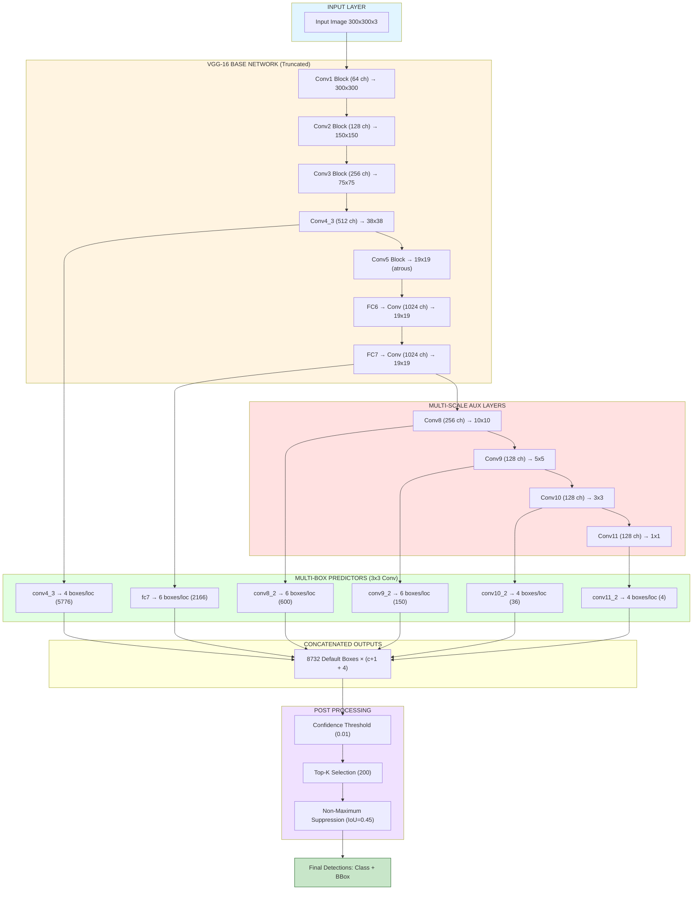
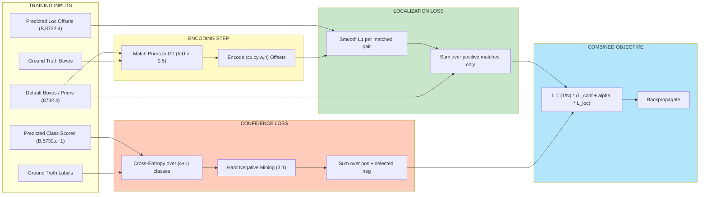
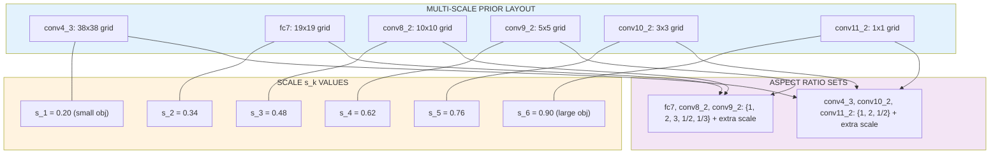

# SSD

<!-- SECTION_1_START -->

# SSD: Single Shot MultiBox Detector

## 1. Core Technical Definition & Intuitive Overview

> [!IMPORTANT]
> **KTU 2024 Syllabus Definition:**
> **SSD (Single Shot MultiBox Detector)** is a single-stage, end-to-end convolutional object detection framework that performs object localization and classification in a single forward pass. It eliminates the region proposal stage used in two-stage detectors (like Faster R-CNN) by introducing **multi-scale feature maps** and a fixed set of **default bounding boxes (priors/anchors)** that are densely sampled at multiple spatial resolutions. *(Reference: Liu et al., 2016, "SSD: Single Shot MultiBox Detector", arXiv:1512.02325)*.

### Conceptual Analogy / Intuition

Imagine a security guard watching a crowded railway station. Instead of first scanning the entire crowd to find "regions of interest" and then zooming in on each region (two-stage approach), the guard is trained to **simultaneously answer two questions in one glance**:
1. *"Is there a person/bag/anomaly here?"* (Classification)
2. *"Where exactly is it located?"* (Localization)

The guard does this at **multiple zoom levels** — once for the wide-angle camera (catches big buses), once for the mid-camera (catches people), and once for the close-up camera (catches small items like mobile phones). This is exactly how SSD works: it predicts objects at **multiple feature-map scales** from a **single pass** of the network.

> [!NOTE]
> **Core Intuition Summary:**
> - **Single Shot** = One pass through the network.
> - **MultiBox** = Multiple default boxes per location, varied in scale and aspect ratio.
> - **Detector** = Predicts class scores and box offsets for every default box.

### Key Architectural Constants (KTU Board Favourites)

| Parameter | Standard Value | Meaning |
|---|---|---|
| Input size (SSD300) | **300 × 300 × 3** | Fixed image dimension |
| Input size (SSD512) | **512 × 512 × 3** | Higher accuracy variant |
| Base network | **Truncated VGG-16** | Pre-trained feature extractor |
| Number of detection scales | **6** | conv4_3, fc7, conv8_2, conv9_2, conv10_2, conv11_2 |
| Default boxes per location | **4 or 6** | Depends on feature map |
| Total default boxes (SSD300) | **8732** | Sum over all scales |
| Loss weighting constant $α$ | **1.0** | Cross-validated weight |
| Negative-to-positive ratio | **3 : 1** | Hard negative mining |

> [!VISUALIZATION CONTROL]
> **Concept:** Multi-Scale Feature Map Pyramid of SSD
> **Conceptual Coordinate Mapping:** Imagine a 300×300 image being progressively downsampled:
> - Layer 1: 38×38 grid (small receptive field, detects small objects)
> - Layer 2: 19×19 grid
> - Layer 3: 10×10 grid
> - Layer 4: 5×5 grid
> - Layer 5: 3×3 grid
> - Layer 6: 1×1 grid (large receptive field, detects giant objects)
> **Visual Description:** Students should picture an inverted pyramid where shallow layers see fine details (small objects) and deeper layers see global context (large objects). Each level has its own set of default boxes drawn around grid centers.

<!-- SECTION_1_END -->

<!-- SECTION_2_START -->

# 2. Deep Theoretical Analysis & KTU High-Yield Formula Sheet

## 2.1 Architectural Breakdown of SSD

SSD's architecture has three logical components:

### A. Base Network (Truncated VGG-16)
- Uses VGG-16 layers up to **conv5_3** as the feature extractor.
- The fully-connected layers **FC6** and **FC7** are converted into convolutional layers (via sub-sampling).
- Pooling layer `pool5` is changed from stride 2 → stride 1 (atrous/dilated trick).
- Dropout and FC8 are discarded.

### B. Multi-Scale Feature Layers (Auxiliary Convolutions)
Extra convolutional feature layers are appended **after** VGG-16 to capture progressively coarser representations:

| Feature Map | Source Layer | Spatial Size | Default Boxes / Loc | Total Boxes |
|---|---|---|---|---|
| $m_1$ | conv4_3 | 38 × 38 | 4 | 5776 |
| $m_2$ | fc7 | 19 × 19 | 6 | 2166 |
| $m_3$ | conv8_2 | 10 × 10 | 6 | 600 |
| $m_4$ | conv9_2 | 5 × 5 | 6 | 150 |
| $m_5$ | conv10_2 | 3 × 3 | 4 | 36 |
| $m_6$ | conv11_2 | 1 × 1 | 4 | 4 |
| **Total** | — | — | — | **8732** |

### C. MultiBox Detectors (Convolutional Predictors)
For each feature map $m_k$ of size $h \times w$, a $3 \times 3$ convolution produces outputs in two forms:
- **Class scores:** $(c + 1)$ channels (with background) per box.
- **Box offsets:** $4$ channels per box (cx, cy, w, h deltas).

## 2.2 Default Box (Prior) Generation

The scale of default boxes at feature map $m_k$ is computed as:

$$s_k = s_{min} + \frac{s_{max} - s_{min}}{m - 1}(k - 1), \quad k = 1, 2, \dots, m$$

where:
- $s_{min} = \mathbf{0.2}$ (corresponds to 20% of image dimension)
- $s_{max} = \mathbf{0.9}$ (90% of image dimension)
- $m = 6$ (number of detection scales)

Aspect ratios $a_r \in \{1, 2, 3, \tfrac{1}{2}, \tfrac{1}{3}\}$ generate box widths and heights:

$$w_k^a = s_k \sqrt{a_r}, \qquad h_k^a = \frac{s_k}{\sqrt{a_r}}$$

An **additional default box** is added with aspect ratio $a_r = 1$ and scale:

$$s'_k = \sqrt{s_k \cdot s_{k+1}}$$

> [!NOTE]
> **Matching Strategy:** A default box is matched to a ground-truth box if their **Jaccard (IoU) overlap ≥ 0.5**. This is more permissive than Faster R-CNN (which uses 0.7) and allows multiple priors to match a single ground truth, stabilizing training.

## 2.3 The Multi-Box Loss Function

The total SSD objective is a weighted sum of localization and confidence loss:

$$L(x, c, l, g) = \frac{1}{N}\bigl(L_{conf}(x, c) + \alpha \cdot L_{loc}(x, l, g)\bigr)$$

where:
- $N$ = number of matched default boxes
- $x_{ij}^p \in \{0, 1\}$ = indicator that $i$-th default box is matched to $j$-th ground truth of class $p$
- $c_i^p$ = class confidence prediction
- $l_i$ = predicted box offsets, $g_j$ = ground-truth box offsets
- $\alpha = \mathbf{1.0}$ (weighting constant)

### Localization Loss (Smooth L1)

$$L_{loc}(x, l, g) = \sum_{i \in Pos}^{N} \sum_{m \in \{cx, cy, w, h\}} x_{ij}^k \cdot \text{Smooth}_{L1}(l_i^m - \hat{g}_j^m)$$

with offset encoding:

$$\hat{g}_j^{cx} = \frac{g_j^{cx} - d_i^{cx}}{d_i^w}, \quad \hat{g}_j^{cy} = \frac{g_j^{cy} - d_i^{cy}}{d_i^h}$$

$$\hat{g}_j^{w} = \log\!\left(\frac{g_j^w}{d_i^w}\right), \quad \hat{g}_j^{h} = \log\!\left(\frac{g_j^h}{d_i^h}\right)$$

### Confidence Loss (Softmax over $c+1$ classes)

$$L_{conf}(x, c) = -\sum_{i \in Pos}^{N} x_{ij}^p \log\!\bigl(\hat{c}_i^p\bigr) - \sum_{i \in Neg} \log\!\bigl(\hat{c}_i^0\bigr), \quad \hat{c}_i^p = \frac{\exp(c_i^p)}{\sum_p \exp(c_i^p)}$$

### Smooth L1 (Huber) Loss (for $L_{loc}$)

$$\text{Smooth}_{L1}(x) = \begin{cases} 0.5 x^2 & \text{if } \vert x \vert < 1 \\ \vert x \vert - 0.5 & \text{otherwise} \end{cases}$$

## 2.4 KTU High-Yield Formula Cheat Sheet

| Concept | Formula / Value | Notes |
|---|---|---|
| Default box scale at level $k$ | $s_k = s_{min} + \frac{s_{max} - s_{min}}{m-1}(k-1)$ | $s_{min}=0.2$, $s_{max}=0.9$ |
| Box width at aspect ratio $a_r$ | $w_k^a = s_k \sqrt{a_r}$ | In normalized image coords |
| Box height at aspect ratio $a_r$ | $h_k^a = s_k / \sqrt{a_r}$ | In normalized image coords |
| Extra scale (ar=1) | $s'_k = \sqrt{s_k \cdot s_{k+1}}$ | Handles two scales at ar=1 |
| Center of default box | $\left(\frac{i+0.5}{f_k}, \frac{j+0.5}{f_k}\right)$ | $f_k$ = feature map size |
| Matching threshold (IoU) | $\mathbf{0.5}$ | Permissive matching |
| Total SSD loss | $L = \frac{1}{N}\bigl(L_{conf} + \alpha L_{loc}\bigr)$ | Multi-task objective |
| Hard-negative ratio | $\mathbf{3:1}$ | Negatives : Positives |
| Localization offset (width/height) | $\hat{g}^w = \log(g^w / d^w)$ | Log-space offset |
| Default boxes per location (most layers) | **4 or 6** | Varies by feature map |

> [!TIP]
> **Real-World Engineering Utility:** SSD is the backbone of many production-grade systems — embedded vision on **NVIDIA Jetson**, **mobile ML** (via TensorFlow Lite / ONNX conversions of SSD-MobileNet), and **autonomous driving perception stacks** (Tesla's older pipelines, Apollo). Its single-pass design makes it ideal when inference latency is critical (≥ 30 FPS on GPU, 5–10 FPS on edge TPUs).

<!-- SECTION_2_END -->

<!-- SECTION_3_START -->

# 3. Step-by-Step Derivations & Code Implementation

## 3.1 Mathematical Derivation: From Default Box to Prediction

### Step 1: Generating Default Box Coordinates

For a feature map of size $f_k \times f_k$ and default box scale $s_k$, each grid cell $(i, j)$ has center:

$$c_{x} = \frac{i + 0.5}{f_k}, \qquad c_{y} = \frac{j + 0.5}{f_k}$$

The width and height for aspect ratio $a_r$ are:

$$w = s_k \sqrt{a_r}, \qquad h = \frac{s_k}{\sqrt{a_r}}$$

### Step 2: Decoding Predicted Offsets to Actual Boxes

At inference, the network predicts $(Δcx, Δcy, Δw, Δh)$ relative to default box $(d^{cx}, d^{cy}, d^w, d^h)$. Decoded box coordinates:

$$b^{cx} = d^{cx} + Δcx \cdot d^w$$

$$b^{cy} = d^{cy} + Δcy \cdot d^h$$

$$b^{w} = d^w \cdot \exp(Δw)$$

$$b^{h} = d^h \cdot \exp(Δh)$$

**Detailed Expansion (showing each line of logic):**

> **Conversion logic:** The offset $\Delta cx$ is a *fraction* of the default box width, so multiplying by $d^w$ converts it back to image-relative units. For width/height, exponentiation guarantees that the predicted scale is strictly positive (since $d^w > 0$).

### Step 3: Full Derivation of the Localization Loss

Starting from the smooth L1 definition:

$$\text{Smooth}_{L1}(x) = \begin{cases} 0.5 x^2 & \text{if } \vert x \vert < 1 \\ \vert x \vert - 0.5 & \text{if } \vert x \vert \geq 1 \end{cases}$$

Substituting $x = l_i^m - \hat{g}_j^m$ (the difference between predicted and encoded ground-truth offsets), and summing only over positive (matched) pairs $x_{ij}^p = 1$:

$$L_{loc} = \sum_{i \in Pos} \sum_{m \in \{cx, cy, w, h\}} \text{Smooth}_{L1}(l_i^m - \hat{g}_j^m)$$

**The factor $x_{ij}^p$** ensures unmatched default boxes contribute **zero** localization loss. This is critical — without it, the network would try to "correct" positions of boxes that don't correspond to any object.

### Step 4: Confidence Loss as Multi-Class Cross-Entropy

The softmax probability over $(c + 1)$ classes (including background as class 0):

$$\hat{c}_i^p = \frac{\exp(c_i^p)}{\sum_{q=0}^{c} \exp(c_i^q)}$$

The confidence loss has two terms — positives and negatives:

$$L_{conf} = -\sum_{i \in Pos} \log(\hat{c}_i^p) - \sum_{i \in Neg} \log(\hat{c}_i^0)$$

> **Conversion logic:** The first term forces the model to be confident about the correct class for matched boxes; the second term forces unmatched boxes to be classified as "background" (class 0). Without hard-negative mining, the second term would dominate by 3 orders of magnitude, destabilizing training.

## 3.2 Full PyTorch Implementation of the SSD Multi-Box Loss

```python
import torch
import torch.nn as nn
import torch.nn.functional as F


class MultiBoxLoss(nn.Module):
    """
    SSD Multi-Box Loss as defined in Liu et al., 2016.
    Combines localization (Smooth L1) + confidence (Cross-Entropy) losses.
    """

    def __init__(self, num_classes: int, neg_pos_ratio: float = 3.0,
                 alpha: float = 1.0, device: str = "cpu"):
        super().__init__()
        self.num_classes = num_classes
        self.neg_pos_ratio = neg_pos_ratio
        self.alpha = alpha
        self.device = device
        # Use log-sum-exp trick via PyTorch's cross_entropy
        self.cross_entropy = nn.CrossEntropyLoss(reduction="none", ignore_index=-1)

    def hard_negative_mining(self, conf_loss: torch.Tensor, pos_mask: torch.Tensor):
        """
        Keep the highest-loss negatives at a 3:1 ratio to positives.
        This prevents the negative (background) loss from dominating.
        """
        batch_size, num_boxes = conf_loss.shape
        num_pos = pos_mask.sum(dim=1)  # (B,)

        # Compute loss ranking — we want TOP-k hardest negatives
        conf_loss_pos = conf_loss.clone()
        # Zero out positives so they don't compete in ranking
        conf_loss_pos[pos_mask] = 0.0

        # Number of negatives to keep per sample
        num_neg = torch.clamp(self.neg_pos_ratio * num_pos, max=num_boxes - 1).long()

        # Find top-k indices
        _, idx_rank = conf_loss_pos.sort(dim=1, descending=True)
        _, idx_inv_rank = idx_rank.sort(dim=1)

        # Mask: 1 for top-k negatives
        neg_mask = (idx_inv_rank < num_neg.unsqueeze(1))

        return neg_mask

    def smooth_l1(self, pred: torch.Tensor, target: torch.Tensor) -> torch.Tensor:
        """Vectorized Smooth L1 (Huber) loss."""
        diff = pred - target
        abs_diff = diff.abs()
        loss = torch.where(abs_diff < 1.0,
                           0.5 * diff.pow(2),
                           abs_diff - 0.5)
        return loss

    def encode_boxes(self, gt_boxes: torch.Tensor, priors: torch.Tensor) -> torch.Tensor:
        """
        Encode ground-truth box (cx, cy, w, h) as offsets relative to priors.
        Returns (cx_off, cy_off, w_off, h_off).
        """
        # Variances as in the original SSD paper
        variances = [0.1, 0.2]
        cx = (gt_boxes[:, 0] - priors[:, 0]) / (priors[:, 2] * variances[0])
        cy = (gt_boxes[:, 1] - priors[:, 1]) / (priors[:, 3] * variances[0])
        w = torch.log(gt_boxes[:, 2] / priors[:, 2]) / variances[1]
        h = torch.log(gt_boxes[:, 3] / priors[:, 3]) / variances[1]
        return torch.stack([cx, cy, w, h], dim=1)

    def forward(self, predicted_locs: torch.Tensor,
                predicted_confs: torch.Tensor,
                gt_boxes: torch.Tensor,
                gt_labels: torch.Tensor,
                priors: torch.Tensor) -> tuple:
        """
        Args:
            predicted_locs : (B, num_priors, 4) — predicted (cx, cy, w, h) offsets
            predicted_confs: (B, num_priors, num_classes) — class scores (logits)
            gt_boxes       : (B, num_priors, 4) — ground-truth boxes, 0-padded
            gt_labels      : (B, num_priors) — class labels, 0=bg, -1=ignore
            priors         : (num_priors, 4) — default boxes in (cx,cy,w,h)
        Returns:
            total_loss, loc_loss, conf_loss
        """
        batch_size = predicted_locs.size(0)
        num_priors = priors.size(0)

        # ---- 1. Identify positives (matched boxes), ignore, and negatives ----
        pos_mask = (gt_labels > 0)              # (B, num_priors) — matched
        ignore_mask = (gt_labels == -1)         # (B, num_priors) — neutral
        num_positives = pos_mask.sum(dim=1)     # (B,)

        # ---- 2. Localization loss (Smooth L1, positives only) ----
        encoded_gt = torch.zeros_like(predicted_locs)
        for i in range(batch_size):
            pos_idx = pos_mask[i]
            if pos_idx.sum() > 0:
                encoded_gt[i][pos_idx] = self.encode_boxes(
                    gt_boxes[i][pos_idx], priors[pos_idx]
                )

        loc_loss = self.smooth_l1(predicted_locs, encoded_gt).sum(dim=2)  # (B, P)
        loc_loss[pos_mask == 0] = 0.0                                     # mask
        loc_loss = loc_loss.sum(dim=1)                                    # (B,)

        # ---- 3. Confidence loss (per-prior cross-entropy) ----
        conf_loss = self.cross_entropy(
            predicted_confs.view(-1, self.num_classes),
            gt_labels.view(-1)
        ).view(batch_size, num_priors)

        # ---- 4. Hard negative mining ----
        neg_mask = self.hard_negative_mining(conf_loss, pos_mask)
        # Suppress ignored (don't penalize)
        conf_loss[ignore_mask] = 0.0

        # Final confidence loss = positives + selected negatives
        conf_loss_final = (conf_loss * (pos_mask.float() + neg_mask.float())).sum(dim=1)

        # ---- 5. Normalize by number of positives, combine ----
        N = num_positives.float()
        N[N == 0] = 1.0  # avoid /0
        total_loss = (conf_loss_final + self.alpha * loc_loss) / N
        return total_loss.mean(), loc_loss.sum() / N.sum(), conf_loss_final.sum() / N.sum()
```

## 3.3 Generating Default Boxes (Implementation Step)

```python
def generate_ssd_priors(feature_maps: list, image_size: int = 300,
                        s_min: float = 0.2, s_max: float = 0.9) -> torch.Tensor:
    """
    Generate all 8732 default boxes for SSD300.
    feature_maps: list of feature map sizes, e.g., [38, 19, 10, 5, 3, 1]
    """
    aspect_ratios = [[1.0, 2.0, 0.5],
                     [1.0, 2.0, 3.0, 0.5, 0.333],
                     [1.0, 2.0, 3.0, 0.5, 0.333],
                     [1.0, 2.0, 3.0, 0.5, 0.333],
                     [1.0, 2.0, 0.5],
                     [1.0, 2.0, 0.5]]
    priors = []
    m = len(feature_maps)
    for k, fk in enumerate(feature_maps):
        # Scale at this level
        sk = s_min + (s_max - s_min) * k / (m - 1)
        # Extra scale for ar=1
        sk_next = s_min + (s_max - s_min) * (k + 1) / (m - 1) if k + 1 < m else sk
        sk_prime = (sk * sk_next) ** 0.5

        for i in range(fk):
            for j in range(fk):
                cx = (j + 0.5) / fk
                cy = (i + 0.5) / fk
                for ar in aspect_ratios[k]:
                    priors.append([cx, cy, sk * (ar ** 0.5), sk / (ar ** 0.5)])
                # Extra default box (ar=1, scale = sk')
                if 1.0 in aspect_ratios[k] and k < m - 1:
                    priors.append([cx, cy, sk_prime, sk_prime])
                elif k == m - 1:
                    priors.append([cx, cy, sk_prime, sk_prime])
    return torch.tensor(priors)  # shape: (8732, 4)
```

> [!TIP]
> **Examiner's Tip:** Always normalize default boxes by image size (e.g., divide by 300 for SSD300) so that they lie in $[0, 1]$. This is what enables the same prior to be reused across different image resolutions.

<!-- SECTION_3_END -->

<!-- SECTION_4_START -->

# 4. Structural Diagrams & Schematics

## 4.1 SSD300 End-to-End Architecture (Mermaid)



## 4.2 Multi-Box Loss Computation Flow (Mermaid)



## 4.3 Default Box Scale & Aspect Ratio Assignment Matrix



> [!NOTE]
> **Diagram Interpretation Note:** This is a *functional architecture flow*, not a literal pixel-level drawing. The Mermaid topology captures how each feature map of the base network is fed into a dedicated Multi-Box predictor, with outputs concatenated before NMS — the exact process described in Liu et al., Section 2.2.

<!-- SECTION_4_END -->

<!-- SECTION_5_START -->

# 5. KTU 2024 Scheme Examination Question Bank & Topic Recap

---

## 📝 PART A QUESTIONS (3 Marks Each — Remember / Understand)

### **Q1. [KTU University Exam – July 2024]**
**State the key architectural innovation that distinguishes SSD from Faster R-CNN. Mention the role of multi-scale feature maps in this regard.**
*(Mapped: CO2, Remember)*

**Model Answer (3 Marks):**
- **[1 Mark]** SSD (Single Shot MultiBox Detector) is a **single-stage detector** that eliminates the Region Proposal Network (RPN) used in Faster R-CNN, performing classification and localization in a single forward pass.
- **[1 Mark]** It introduces **multi-scale feature maps**: predictions are made from multiple convolutional layers (conv4_3, fc7, conv8_2, …, conv11_2), each operating at a different spatial resolution and receptive field.
- **[1 Mark]** This allows SSD to detect objects of **varying sizes** efficiently — shallow layers detect small objects (fine resolution) while deeper layers detect large objects (coarse resolution, large receptive field), without needing a separate RPN.

---

### **Q2. [KTU University Exam – Dec 2023]**
**Define "default boxes" in SSD. Why is hard negative mining necessary during SSD training?**
*(Mapped: CO2, Understand)*

**Model Answer (3 Marks):**
- **[1 Mark]** **Default boxes (priors)** are a fixed set of pre-defined bounding boxes tiled across each feature map location, with varying scales $s_k$ and aspect ratios $a_r \in \{1, 2, 3, 1/2, 1/3\}$. SSD predicts adjustments to these priors at every grid cell.
- **[1 Mark]** In SSD300, there are **8732 default boxes** spread across 6 feature maps, with scales ranging from $0.2$ to $0.9$ of the image dimension.
- **[1 Mark]** **Hard negative mining** is necessary because the vast majority of default boxes are *negatives* (background). Without mining, the confidence loss is dominated by easy negatives. Keeping the **top 3:1** hardest negatives relative to positives ensures the model focuses on genuinely confusing background regions and prevents training instability.

---

## 📝 PART B QUESTIONS (14 Marks — Apply / Analyze)

### **Question A: 14 Marks** *(Choose either A or B)*

> **[KTU University Exam – July 2024, Module 4]**
> **(a)** Explain the SSD300 architecture in detail, clearly identifying the base network, the auxiliary multi-scale layers, and the multi-box prediction heads. Mention the number of default boxes generated at each scale. **(7 Marks)**
> *(Mapped: CO2, Understand / Apply)*

#### Model Solution for (a):

**Step 1: Base Network — Truncated VGG-16 [2 Marks]**
- SSD uses **VGG-16 pre-trained on ImageNet** as the base feature extractor.
- Layers up to `conv5_3` are retained; the fully-connected layers `FC6` and `FC7` are converted into convolutional layers (using sub-sampled weights from VGG's FC layers).
- The pooling layer `pool5` is modified from stride 2 to stride 1, with dilated/atrous convolutions to preserve receptive field.
- The final classification layer `FC8` and dropout are discarded.

**Step 2: Auxiliary Multi-Scale Layers [3 Marks]**
After FC7, four extra feature blocks are appended:

| Block | Layer | Channels | Output Size |
|---|---|---|---|
| Conv8 | Conv8_1 (1×1) + Conv8_2 (3×3) | 256 | 10 × 10 |
| Conv9 | Conv9_1 (1×1) + Conv9_2 (3×3) | 128 | 5 × 5 |
| Conv10 | Conv10_1 (1×1) + Conv10_2 (3×3) | 128 | 3 × 3 |
| Conv11 | Conv11_1 (1×1) + Conv11_2 (3×3) | 128 | 1 × 1 |

**Step 3: Multi-Box Prediction Heads [2 Marks]**
- A $3 \times 3$ convolution is applied at each selected feature map, producing $(c + 1)$ class scores and 4 box offsets per default box.
- **Number of default boxes per feature map location:**

| Feature Map | Size | Boxes / Loc | Total Boxes |
|---|---|---|---|
| conv4_3 | 38 × 38 | 4 | 5776 |
| fc7 | 19 × 19 | 6 | 2166 |
| conv8_2 | 10 × 10 | 6 | 600 |
| conv9_2 | 5 × 5 | 6 | 150 |
| conv10_2 | 3 × 3 | 4 | 36 |
| conv11_2 | 1 × 1 | 4 | 4 |
| **Total** | — | — | **8732** |

> **(b)** Derive the SSD multi-box loss function. Show how the localization loss uses Smooth L1, and how the confidence loss is computed with hard negative mining. Use a concrete example with $N = 8$ matched boxes and assume the network has $c = 20$ object classes. **(7 Marks)**
> *(Mapped: CO3, Apply / Analyze)*

#### Model Solution for (b):

**Step 1: Define the total loss [1 Mark]**
$$L(x, c, l, g) = \frac{1}{N}\bigl(L_{conf}(x, c) + \alpha \cdot L_{loc}(x, l, g)\bigr)$$
With $N = 8$ matched boxes, $c = 20$ classes, $\alpha = 1.0$.

**Step 2: Localization Loss derivation [3 Marks]**
The localization loss is computed over positive (matched) pairs only, using Smooth L1 on encoded offsets:
$$L_{loc} = \sum_{i \in Pos} \sum_{m \in \{cx, cy, w, h\}} \text{Smooth}_{L1}(l_i^m - \hat{g}_j^m)$$

The offsets are encoded as:
- $\hat{g}^{cx} = (g^{cx} - d^{cx}) / d^w$
- $\hat{g}^{cy} = (g^{cy} - d^{cy}) / d^h$
- $\hat{g}^w = \log(g^w / d^w)$
- $\hat{g}^h = \log(g^h / d^h)$

For each of the 8 matched boxes, compute Smooth L1 on the 4 offset deltas:
$$\text{Smooth}_{L1}(x) = \begin{cases} 0.5 x^2 & \text{if } \vert x \vert < 1 \\ \vert x \vert - 0.5 & \text{otherwise} \end{cases}$$

**Step 3: Confidence Loss with Hard Negative Mining [3 Marks]**
- Total default boxes = 8732, positives = 8, so negatives = 8724.
- **Hard negative ratio** = 3:1 ⇒ keep $3 \times 8 = 24$ hardest negatives.
- Compute per-class cross-entropy:
$$L_{conf} = -\sum_{i \in Pos} \log\!\left(\frac{\exp(c_i^p)}{\sum_q \exp(c_i^q)}\right) - \sum_{i \in HardNeg} \log\!\left(\frac{\exp(c_i^0)}{\sum_q \exp(c_i^q)}\right)$$
- The selected 24 negatives are those with the **highest cross-entropy** (most confidently misclassified as foreground).

**Step 4: Final combination [Valuation: 1 Mark]**
$$L = \frac{1}{8}\bigl(L_{conf} + 1.0 \cdot L_{loc}\bigr)$$

---

### **Question B: 14 Marks** *(Alternative Choice)*

> **[KTU University Exam – Dec 2023, Module 4]**
> **(a)** With suitable mathematical formulations, explain how default boxes are generated at different feature map scales in SSD. Assume input size = 300 × 300, and use the standard parameters $s_{min} = 0.2$, $s_{max} = 0.9$, $m = 6$ scales. Compute the scale values and show a sample width/height for $k = 3$ and aspect ratio $a_r = 2$. **(7 Marks)**
> *(Mapped: CO2, Apply / Analyze)*

#### Model Solution for (a):

**Step 1: General scale formula [1 Mark]**
$$s_k = s_{min} + \frac{s_{max} - s_{min}}{m - 1}(k - 1) = 0.2 + \frac{0.7}{5}(k - 1) = 0.2 + 0.14(k - 1)$$

**Step 2: Compute all six scale values [2 Marks]**
- $s_1 = 0.2 + 0.14(0) = 0.20$
- $s_2 = 0.2 + 0.14(1) = 0.34$
- $s_3 = 0.2 + 0.14(2) = 0.48$
- $s_4 = 0.2 + 0.14(3) = 0.62$
- $s_5 = 0.2 + 0.14(4) = 0.76$
- $s_6 = 0.2 + 0.14(5) = 0.90$

**Step 3: For $k = 3$ and $a_r = 2$ [2 Marks]**
- $s_3 = 0.48$
- Width: $w_3^a = s_3 \sqrt{a_r} = 0.48 \times \sqrt{2} \approx 0.48 \times 1.4142 = 0.6788$
- Height: $h_3^a = s_3 / \sqrt{a_r} = 0.48 / 1.4142 \approx 0.3394$

**Step 4: Extra default box at $k = 3$, ar = 1 [1 Mark]**
$$s'_3 = \sqrt{s_3 \cdot s_4} = \sqrt{0.48 \times 0.62} = \sqrt{0.2976} \approx 0.5455$$

**Step 5: Absolute pixel sizes at 300×300 input [1 Mark]**
- $w = 0.6788 \times 300 \approx 203.6$ pixels
- $h = 0.3394 \times 300 \approx 101.8$ pixels
- Extra box: $s'_3 \times 300 \approx 163.6$ pixels (square)

> **(b)** Compare SSD with YOLO and Faster R-CNN in terms of: (i) detection pipeline (single vs two-stage), (ii) speed (FPS), (iii) accuracy (mAP), and (iv) handling of small objects. Conclude with the engineering use-case where SSD is most preferred. **(7 Marks)**
> *(Mapped: CO3, Analyze / Evaluate)*

#### Model Solution for (b):

| Criterion | SSD300 | YOLOv1 | Faster R-CNN |
|---|---|---|---|
| **(i) Pipeline** | Single-stage, multi-scale feature maps | Single-stage, single grid (7×7) | Two-stage (RPN + detector) |
| **(ii) Speed (FPS)** | ~46 (SSD300), 22 (SSD512) | ~45 | ~7 |
| **(iii) mAP (VOC 2007)** | 74.3% (SSD300), 76.8% (SSD512) | 63.4% | 78.8% |
| **(iv) Small Object Handling** | Best (multi-scale feature maps) | Poor (7×7 grid too coarse) | Moderate (RPN) |

**Key analysis points [3 Marks — each 0.75]:**
- **Speed-Accuracy Tradeoff:** SSD offers the best speed-accuracy balance. Faster R-CNN achieves higher mAP but is too slow for real-time use. YOLOv1 is fast but has lower accuracy, especially on small objects.
- **Small Objects:** SSD's pyramid of feature maps is the critical innovation — the $38 \times 38$ `conv4_3` feature map detects small objects that would be lost in YOLO's $7 \times 7$ grid.
- **Architectural Simplicity:** SSD avoids the complexity of region proposals, making it easier to train end-to-end compared to Faster R-CNN.
- **Engineering Use-Case:** SSD is **most preferred in real-time applications where both latency and accuracy matter** — e.g., embedded vision (Jetson, Raspberry Pi), video surveillance, mobile AR, and autonomous drone navigation. SSD-MobileNet is a popular deployment variant for mobile.

---

> [!WARNING]
> **⚠️ KTU Examiner's Valuation Warning / Common Pitfalls:**
> 1. **Forgetting the +1 for background:** When stating the number of output channels per default box, students often write $c$ instead of $(c + 1)$. The "+1" is the background class. Forgetting this loses 1 full mark.
> 2. **Confusing scales and aspect ratios:** Scales $s_k$ are *per feature map*, aspect ratios $a_r$ are *per default box within a feature map*. Do not interchange them.
> 3. **Skip writing the matching threshold:** Always state **IoU ≥ 0.5** when explaining default-box matching. Examiners explicitly test this.
> 4. **Wrong default-box count:** Total is **8732** for SSD300, **24564** for SSD512. Mixing them up is a common error.
> 5. **Missing hard negative mining ratio:** Hard negative mining is **3:1**, not arbitrary. Always mention this constant in the loss answer.
> 6. **Off-by-one in $\text{Smooth}_{L1}$:** The transition is at $\vert x \vert = 1$, *not* at 0. Getting this wrong in a derivation will cost 1–2 marks.
> 7. **Not mentioning NMS:** Post-processing requires **Non-Maximum Suppression** (IoU threshold 0.45–0.5) to remove duplicate detections. Omitting this loses marks in architecture questions.

---

## 🧠 Topic Recap & Important Things to Remember

> [!NOTE]
> **Comprehensive Rapid-Revision Checklist (Must memorize before KTU exam):**

### 🎯 Core Definitions
- **SSD** = Single Shot MultiBox Detector — single-stage, multi-scale, end-to-end object detector.
- **Default box (Prior)** = A pre-defined bounding box with a fixed scale and aspect ratio, tiled across feature map cells.
- **Multi-scale feature maps** = Detections from multiple CNN layers, each at a different spatial resolution.
- **Matching threshold** = IoU ≥ 0.5 between default box and ground truth.

### 🔢 Must-Know Numbers
- **Total default boxes (SSD300) = 8732**
- **Detection scales m = 6** (conv4_3, fc7, conv8_2, conv9_2, conv10_2, conv11_2)
- **Scale range** $s_k \in [0.2, 0.9]$
- **Hard negative ratio** = 3 : 1
- **Loss weight** $\alpha = 1.0$
- **Aspect ratios** = {1, 2, 3, 1/2, 1/3} + 1 extra at ar=1
- **Base network** = Truncated VGG-16
- **Smooth L1 transition** = $\vert x \vert = 1$
- **Variances** for box encoding = [0.1, 0.2]

### 🧩 Critical Formulas
- **Scale:** $s_k = 0.2 + 0.14(k - 1)$
- **Width:** $w = s_k \sqrt{a_r}$, **Height:** $h = s_k / \sqrt{a_r}$
- **Extra box scale:** $s'_k = \sqrt{s_k \cdot s_{k+1}}$
- **Encoded offsets:** $\hat{g}^{cx} = (g^{cx} - d^{cx})/d^w$, $\hat{g}^w = \log(g^w/d^w)$
- **Total loss:** $L = \frac{1}{N}(L_{conf} + \alpha \cdot L_{loc})$
- **Decoded box:** $b^{cx} = d^{cx} + \Delta cx \cdot d^w$, $b^w = d^w \cdot \exp(\Delta w)$

### ⚙️ Architectural Pipeline
`Input 300×300` → `VGG-16 base` → `6 multi-scale feature maps` → `3×3 conv predictors` → `8732 (class + offset) outputs` → `NMS` → `Final detections`

### 🚫 Common Examiner Traps
- Do NOT say SSD uses **RPN** (it does not — that is Faster R-CNN).
- Do NOT confuse the **7×7 grid of YOLO** with SSD's **multi-scale feature maps**.
- Do NOT forget **NMS** in inference pipeline.

### 🌍 Real-World Deployments
- **Mobile/TFLite:** SSD-MobileNet (used in object recognition on phones).
- **Embedded vision:** SSD on NVIDIA Jetson, Google Edge TPU.
- **Autonomous driving:** Apollo Baidu, older Tesla pipelines.
- **Surveillance & retail analytics:** Real-time crowd/queue monitoring.

<!-- SECTION_5_END -->
