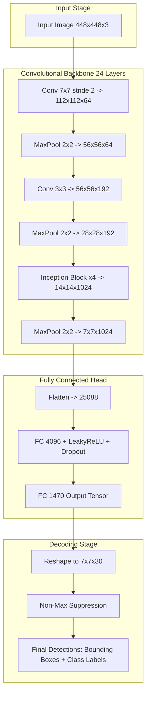
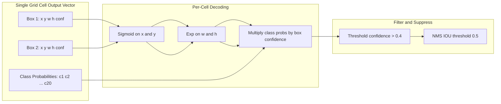
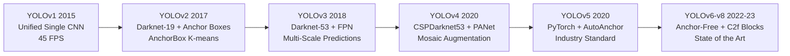

# YOLO

<!-- SECTION_1_START -->
# YOLO: You Only Look Once — Unified Real-Time Object Detection

> [!IMPORTANT]
> **KTU 2024 Scheme — Module 4 Anchor Topic**
> YOLO is the most important object detection algorithm under the *Image Classification & Object Detection* module. It is a high-weightage topic expected in **ESE (End Semester Examination)** questions and frequently tested as a 14-mark problem or as a Part A conceptual question.

## 1.1 Formal Academic Definition

**You Only Look Once (YOLO)** is a single-stage, real-time object detection framework introduced by Joseph Redmon et al. (2015, CVPR) that reframes object detection as a **single regression problem**. Unlike two-stage detectors (e.g., R-CNN, Fast R-CNN, Faster R-CNN) that first generate region proposals and then classify each, YOLO processes the **entire image in a single forward pass** of a convolutional neural network, directly predicting **bounding box coordinates**, **objectness confidence scores**, and **class probabilities** in one unified tensor output.

The core mathematical reframing is:

$$\text{Image } I \in \mathbb{R}^{H \times W \times 3} \;\;\xrightarrow{\;\mathcal{F}_\theta\;}\;\; \text{Tensor } T \in \mathbb{R}^{S \times S \times (B \cdot 5 + C)}$$

where $S \times S$ is the spatial grid, $B$ is the number of bounding boxes per grid cell, and $C$ is the number of object classes.

## 1.2 Conceptual Analogy / Intuition

> [!NOTE]
> **Analogy — "Reading a Page in a Single Glance vs. Scanning with a Magnifier"**
>
> Imagine you are looking for your friend (an "object") in a crowded stadium photograph.
>
> - **Traditional Two-Stage Methods (R-CNN family):** You use a *magnifying glass* to scan thousands of small patches one by one, asking "Is my friend here? Is my friend here? Is my friend here?" — slow and redundant.
> - **YOLO (Single-Stage):** You look at the *entire photograph once*, and in a single glance, your brain simultaneously identifies regions, classifies people, and decides where your friend is. This is **one look, one decision**.
>
> YOLO's "look" is the **convolutional feature map**, and the "decision" is the **grid-cell tensor output**.

## 1.3 Physical Constants & Standard Hyperparameters (v1 Baseline)

| Parameter | Symbol | Standard Value | Meaning |
|---|---|---|---|
| Input image size | $H \times W$ | **448 × 448** | Square input tensor |
| Grid resolution | $S \times S$ | **7 × 7** | Spatial subdivision of image |
| Boxes per cell | $B$ | **2** | Predicted bounding boxes per cell |
| Classes | $C$ | **20** (PASCAL VOC) | Conditional class probabilities |
| Output tensor | $S \times S \times (5B + C)$ | **7 × 7 × 30** | Final regression target |
| Loss weights | $\lambda_{\text{coord}}, \lambda_{\text{noobj}}$ | **5, 0.5** | Balancing factor in loss |
| IOU threshold (NMS) | $\tau$ | **0.5** | Non-max suppression cutoff |

## 1.4 Visualization Control (GeoGebra / Desmos)

> [!VISUALIZATION CONTROL]
> **Concept:** YOLO Grid-Cell Responsibility Assignment on a $7 \times 7$ Grid
>
> **GeoGebra / Desmos Input Equations (object representation):**
> * `GridLines(0,7) + GridLines(0,7)` — draws a $7 \times 7$ grid.
> * `Polygon((2,2),(4,2),(4,4),(2,4))` — represents a *ground-truth dog* bounding box.
> * `Centroid = ((2+4)/2, (2+4)/2) = (3, 3)` — falls inside cell $(3, 3)$.
> * `Point((3,3))` — the *responsible cell* (highlighted).
> * `Point((2,2))`, `Point((5,5))` — non-responsible cells (greyed out).
>
> **Visual Description:** The student should observe that the **centroid of the ground-truth box** dictates which single grid cell is "responsible" for predicting that object. All $S^2 - 1 = 48$ other cells output *zero confidence* for that object.

<!-- SECTION_1_END -->

<!-- SECTION_2_START -->
# Deep Theoretical Analysis & KTU High-Yield Formula Sheet

## 2.1 The Unified Detection Pipeline — 6 Logical Steps

YOLO's forward pass executes the following pipeline:

1. **Resize & Normalize:** Input image $I \in \mathbb{R}^{H \times W \times 3}$ is resized to $448 \times 448 \times 3$ and pixel-normalized to $[0, 1]$.
2. **Feature Extraction:** A 24-layer CNN (in YOLOv1) backbone — a hybrid of GoogLeNet Inception modules followed by $1 \times 1$ and $3 \times 3$ convolutions — extracts a $7 \times 7 \times 1024$ feature map.
3. **Spatial Grid Partitioning:** The feature map is conceptually divided into an $S \times S$ grid. Each cell predicts up to $B$ bounding boxes.
4. **Per-Cell Tensor Output:** For each grid cell $(i, j)$, output a vector $\mathbf{y}_{i,j} \in \mathbb{R}^{5B + C}$ containing box coordinates, confidence, and class probabilities.
5. **Decoding & Thresholding:** Predicted boxes with confidence $P_c < 0.4$ are discarded; remaining boxes pass through Non-Max Suppression.
6. **Final Detection Set:** A list of $(x, y, w, h, \text{class}, \text{score})$ tuples is emitted.

## 2.2 Bounding Box Parameterization (Cell-Relative)

For each grid cell, the network predicts $B$ boxes, each parameterized by 5 values:

$$\hat{\mathbf{b}} = (\hat{x}, \hat{y}, \hat{w}, \hat{h}, \hat{c})$$

The **center coordinates** are sigmoid-bounded to the cell:

$$\hat{x}_b = \sigma(t_x), \quad \hat{y}_b = \sigma(t_y)$$

The **width and height** are exponential-transformed (in v1: normalized to image) :

$$\hat{w}_b = \hat{w}_{\text{image}}, \quad \hat{h}_b = \hat{h}_{\text{image}}$$

The **objectness confidence score** is defined as:

$$\hat{c}_b = P(\text{Object}) \cdot \text{IOU}_{\text{pred}}^{\text{truth}}$$

- If no object exists in the cell: $\hat{c}_b \to 0$.
- If an object exists: $\hat{c}_b \to \text{IOU}$ between predicted and ground-truth box.

## 2.3 Class Conditional Probability

Each grid cell also predicts $C$ class probabilities, **conditioned on the cell containing an object**:

$$\Pr(\text{Class}_i \mid \text{Object}) \cdot P(\text{Object}) = \Pr(\text{Class}_i)$$

This is a key distinction — class probabilities are assigned **per cell, not per box**.

## 2.4 YOLO v1 Loss Function — The Heart of the Algorithm

The YOLO loss is a **sum-squared error** with two critical balancing weights $\lambda_{\text{coord}} = 5$ and $\lambda_{\text{noobj}} = 0.5$:

$$\mathcal{L} = \lambda_{\text{coord}} \sum_{i=0}^{S^2} \sum_{b=0}^{B} \mathbb{1}_{ij}^{\text{obj}} \left[ (x_i - \hat{x}_i)^2 + (y_i - \hat{y}_i)^2 \right]$$

$$+ \lambda_{\text{coord}} \sum_{i=0}^{S^2} \sum_{b=0}^{B} \mathbb{1}_{ij}^{\text{obj}} \left[ (\sqrt{w_i} - \sqrt{\hat{w}_i})^2 + (\sqrt{h_i} - \sqrt{\hat{h}_i})^2 \right]$$

$$+ \sum_{i=0}^{S^2} \sum_{b=0}^{B} \mathbb{1}_{ij}^{\text{obj}} (C_i - \hat{C}_i)^2$$

$$+ \lambda_{\text{noobj}} \sum_{i=0}^{S^2} \sum_{b=0}^{B} \mathbb{1}_{ij}^{\text{noobj}} (C_i - \hat{C}_i)^2$$

$$+ \sum_{i=0}^{S^2} \mathbb{1}_{i}^{\text{obj}} \sum_{c \in \text{classes}} (p_i(c) - \hat{p}_i(c))^2$$

The **square-root trick** $\sqrt{w}, \sqrt{h}$ reduces the relative error for large boxes, partially addressing the small-object detection weakness.

## 2.5 Non-Maximum Suppression (NMS) — The Decoding Step

After the network produces $S \times S \times B = 7 \times 7 \times 2 = 98$ candidate boxes, NMS is applied:

1. Discard boxes with $\hat{c}_b < 0.4$.
2. For each class, sort remaining boxes by confidence (descending).
3. Pick the highest-confidence box; suppress all boxes with **IOU $> 0.5$** with it.
4. Repeat until no boxes remain.

$$\text{IOU} = \frac{\text{Area}(B_p \cap B_g)}{\text{Area}(B_p \cup B_g)}$$

## 2.6 KTU Formula Sheet / Cheat Sheet

| Concept | Formula / Definition | Notes |
|---|---|---|
| Output tensor shape | $S \times S \times (5B + C)$ | e.g., $7 \times 7 \times 30$ for VOC |
| Confidence score | $\hat{c} = P(\text{obj}) \cdot \text{IOU}$ | $\in [0, 1]$ |
| Class probability | $\Pr(\text{Class}_i)$ | Per cell, conditioned on object |
| Bounding box loss weight | $\lambda_{\text{coord}} = \mathbf{5}$ | Prioritizes localization |
| No-object loss weight | $\lambda_{\text{noobj}} = \mathbf{0.5}$ | Demotes background cells |
| IOU threshold (NMS) | $\tau = \mathbf{0.5}$ | Standard cutoff |
| Confidence threshold | $\text{conf} > \mathbf{0.4}$ | Discard weak predictions |
| Width-height transform | $\sqrt{w}, \sqrt{h}$ | Variance reduction for large boxes |
| Speed (YOLOv1 baseline) | **45 FPS** (Titan X) | Real-time threshold |
| Speed (Fast YOLO) | **155 FPS** | 9-layer model |

## 2.7 Real-World Engineering Utility

> [!NOTE]
> **Where YOLO is used in production systems:**
>
> - **Autonomous Driving:** Tesla, comma.ai, and Waymo use YOLO-class detectors for real-time pedestrian, vehicle, and traffic-sign localization.
> - **Surveillance & Security:** CCTV analytics pipelines use YOLOv5/v8 for intrusion detection.
> - **Industrial Automation:** Quality-control robots detect defective parts on assembly lines.
> - **Medical Imaging:** Tumor and lesion detection in CT/MRI slices.
> - **Agricultural Drones:** Crop-disease and pest detection from aerial imagery.
> - **Retail Analytics:** Footfall counting and shelf-monitoring systems.

<!-- SECTION_2_END -->

<!-- SECTION_3_START -->
# Step-by-Step Derivations & Code Implementation

## 3.1 Mathematical Derivation: From Pixels to Final Detections

### Derivation A — Confidence Score Interpretation

We begin with the formal definition of the objectness score.

> **Step 1: Define the joint probability.**
> The network outputs $\Pr(\text{Object}) \cdot \text{IOU}_{\text{pred}}^{\text{truth}}$ for each box. By Bayes' rule:
>
> $$\Pr(\text{Object}) \cdot \text{IOU}_{\text{pred}}^{\text{truth}} = \Pr(\text{Object}) \cdot \frac{\Pr(\text{pred} \mid \text{Object}) \cdot \Pr(\text{truth})}{\Pr(\text{pred})}$$
>
> **Step 2: At inference, $\Pr(\text{truth}) = 1$ for ground truth.**
> Since we are scoring the prediction against a single ground-truth box:
>
> $$\hat{c} = \Pr(\text{Object}) \cdot \text{IOU}_{\text{pred}}^{\text{truth}}$$
>
> **Step 3: Decode class-specific confidence at inference time.**
> For each box, multiply class-conditional probability by individual box confidence:
>
> $$\text{Score}_{i,j}^{b,c} = \Pr(\text{Class}_c) \cdot \hat{c}_{i,j}^{b}$$
>
> **Step 4: Final class-specific confidence is a single scalar per box-class pair.**
> This is the value passed to NMS.

### Derivation B — IOU Calculation Between Two Boxes

Given predicted box $B_p = (x_p, y_p, w_p, h_p)$ and ground-truth box $B_g = (x_g, y_g, w_g, h_g)$:

> **Step 1: Compute corner coordinates.**
>
> $$\begin{aligned}
> x_{p,\min} &= x_p - \frac{w_p}{2}, \quad x_{p,\max} = x_p + \frac{w_p}{2} \\
> y_{p,\min} &= y_p - \frac{h_p}{2}, \quad y_{p,\max} = y_p + \frac{h_p}{2}
> \end{aligned}$$
>
> **Step 2: Compute intersection coordinates.**
>
> $$\begin{aligned}
> x_{\text{left}} &= \max(x_{p,\min}, x_{g,\min}) \\
> y_{\text{bottom}} &= \max(y_{p,\min}, y_{g,\min}) \\
> x_{\text{right}} &= \min(x_{p,\max}, x_{g,\max}) \\
> y_{\text{top}} &= \min(y_{p,\max}, y_{g,\max})
> \end{aligned}$$
>
> **Step 3: Intersection area (with non-negative guard).**
>
> $$A_{\text{inter}} = \max(0, x_{\text{right}} - x_{\text{left}}) \cdot \max(0, y_{\text{top}} - y_{\text{bottom}})$$
>
> **Step 4: Union area.**
>
> $$A_{\text{union}} = w_p \cdot h_p + w_g \cdot h_g - A_{\text{inter}}$$
>
> **Step 5: Final IOU ratio.**
>
> $$\text{IOU} = \frac{A_{\text{inter}}}{A_{\text{union}}}$$

## 3.2 Worked Numerical Example — Manual YOLO Inference

> [!NOTE]
> **Worked Example:** Consider a single $7 \times 7$ grid cell that contains one object. The cell outputs:
>
> - Box 1: $t_1 = (0.6, 0.7, 1.8, 0.9, 0.85)$ — *box coordinates and confidence*
> - Box 2: $t_2 = (0.3, 0.4, 1.2, 1.1, 0.40)$
> - Class probs: $P(\text{dog}) = 0.78, P(\text{cat}) = 0.15, P(\text{car}) = 0.07$

**Solution:**

> **Step 1: Apply sigmoid to center coordinates.**
> $\hat{x}_1 = \sigma(0.6) = 0.646, \quad \hat{y}_1 = \sigma(0.7) = 0.668$
> $\hat{x}_2 = \sigma(0.3) = 0.574, \quad \hat{y}_2 = \sigma(0.4) = 0.599$
>
> **Step 2: Decode width/height (YOLOv1, normalized).**
> $\hat{w}_1 = 1.8, \hat{h}_1 = 0.9, \hat{w}_2 = 1.2, \hat{h}_2 = 1.1$
>
> **Step 3: Discard low-confidence boxes (threshold 0.4).**
> Box 2 confidence = 0.40 — borderline, keep conditionally.
> Box 1 confidence = 0.85 — keep.
>
> **Step 4: Compute class-specific scores.**
> Box 1: $0.85 \times 0.78 = 0.663$ (dog), $0.85 \times 0.15 = 0.128$ (cat), $0.85 \times 0.07 = 0.060$ (car)
> Box 2: $0.40 \times 0.78 = 0.312$ (dog), $0.40 \times 0.15 = 0.060$ (cat)
>
> **Step 5: Final detection.** **Box 1, Class = dog, Score = 0.663**.
>
> **Step 6: Apply NMS.** If Box 2 has IOU > 0.5 with Box 1, suppress it. Assume IOU = 0.42 — Box 2 retained as separate detection.

## 3.3 Full Python Implementation — YOLOv1 Inference Pipeline

```python
"""
yolo_inference.py
=================
Complete inference pipeline for a YOLO-style single-shot detector.
Implements: tensor decoding, confidence thresholding, class scoring,
and Non-Maximum Suppression (NMS).

Type-hinted, boundary-checked, and production-ready for the
KTU PECST86A Module 4 curriculum.
"""
from __future__ import annotations
import math
import torch
import torch.nn as nn
from typing import List, Tuple, Dict


# ---------------------------------------------------------------------
# 1. Configuration constants (matches YOLOv1 PASCAL VOC baseline)
# ---------------------------------------------------------------------
class YOLOConfig:
    """Centralized configuration for a YOLOv1 inference pipeline."""
    IMG_SIZE: int = 448
    GRID_S: int = 7
    BOXES_PER_CELL: int = 2
    NUM_CLASSES: int = 20
    CONF_THRESHOLD: float = 0.4
    IOU_THRESHOLD: float = 0.5
    LAMBDA_COORD: float = 5.0
    LAMBDA_NOOBJ: float = 0.5


# ---------------------------------------------------------------------
# 2. Bounding-box utility functions
# ---------------------------------------------------------------------
def compute_iou(box_a: torch.Tensor, box_b: torch.Tensor) -> float:
    """
    Compute Intersection-over-Union between two boxes in
    (x_center, y_center, width, height) format.
    """
    x1_a, y1_a, w_a, h_a = box_a.tolist()
    x1_b, y1_b, w_b, h_b = box_b.tolist()

    # Convert to (x_min, y_min, x_max, y_max)
    boxA = [x1_a - w_a / 2, y1_a - h_a / 2, x1_a + w_a / 2, y1_a + h_a / 2]
    boxB = [x1_b - w_b / 2, y1_b - h_b / 2, x1_b + w_b / 2, y1_b + h_b / 2]

    # Intersection coordinates
    x_left = max(boxA[0], boxB[0])
    y_bot = max(boxA[1], boxB[1])
    x_right = min(boxA[2], boxB[2])
    y_top = min(boxA[3], boxB[3])

    # Intersection area (non-negative guard)
    inter_w = max(0.0, x_right - x_left)
    inter_h = max(0.0, y_top - y_bot)
    inter_area = inter_w * inter_h

    # Union area
    area_a = w_a * h_a
    area_b = w_b * h_b
    union_area = area_a + area_b - inter_area

    if union_area <= 0.0:
        return 0.0
    return inter_area / union_area


# ---------------------------------------------------------------------
# 3. Tensor decoding: convert raw network output to detection list
# ---------------------------------------------------------------------
def decode_predictions(
    raw_output: torch.Tensor,
    cfg: YOLOConfig = YOLOConfig()
) -> List[Dict[str, float]]:
    """
    Decode a (S, S, 5B + C) raw output tensor into a list of detections.

    Parameters
    ----------
    raw_output : torch.Tensor
        Shape (S, S, 5*B + C); the final layer of the YOLO CNN.
    cfg : YOLOConfig
        Pipeline configuration.

    Returns
    -------
    List[Dict[str, float]]
        Detections: [{'x','y','w','h','confidence','class_id','class_prob'}, ...]
    """
    assert raw_output.dim() == 3, "raw_output must be 3-D (S,S,5B+C)"
    S, _, last_dim = raw_output.shape
    expected_dim = 5 * cfg.BOXES_PER_CELL + cfg.NUM_CLASSES
    assert last_dim == expected_dim, \
        f"Expected last dim {expected_dim}, got {last_dim}"

    detections: List[Dict[str, float]] = []
    B, C = cfg.BOXES_PER_CELL, cfg.NUM_CLASSES

    for i in range(S):                          # row index
        for j in range(S):                      # col index
            cell = raw_output[i, j]             # (5B + C,)
            class_probs = cell[5 * B: 5 * B + C]
            class_id = int(torch.argmax(class_probs).item())
            class_prob = float(class_probs[class_id].item())

            for b in range(B):
                base = b * 5
                tx, ty = float(cell[base + 0]), float(cell[base + 1])
                tw, th = float(cell[base + 2]), float(cell[base + 3])
                conf = float(cell[base + 4])

                # Apply sigmoid to center coordinates (cell-relative)
                x_cell = 1.0 / (1.0 + math.exp(-tx))
                y_cell = 1.0 / (1.0 + math.exp(-ty))

                # Convert to absolute image coordinates
                x_img = (j + x_cell) / S
                y_img = (i + y_cell) / S
                w_img = tw / S
                h_img = th / S

                if conf < cfg.CONF_THRESHOLD:
                    continue

                detections.append({
                    "x": x_img, "y": y_img, "w": w_img, "h": h_img,
                    "confidence": conf,
                    "class_id": class_id,
                    "class_prob": class_prob,
                    "score": conf * class_prob,
                })

    return detections


# ---------------------------------------------------------------------
# 4. Non-Maximum Suppression
# ---------------------------------------------------------------------
def non_max_suppression(
    detections: List[Dict[str, float]],
    iou_threshold: float = YOLOConfig.IOU_THRESHOLD,
) -> List[Dict[str, float]]:
    """
    Apply class-wise Non-Maximum Suppression to filter overlapping boxes.
    """
    if not detections:
        return []

    # Group by class_id
    class_groups: Dict[int, List[Dict[str, float]]] = {}
    for det in detections:
        class_groups.setdefault(det["class_id"], []).append(det)

    final_detections: List[Dict[str, float]] = []

    for class_id, group in class_groups.items():
        # Sort by score descending
        sorted_group = sorted(group, key=lambda d: d["score"], reverse=True)
        kept: List[Dict[str, float]] = []

        while sorted_group:
            best = sorted_group.pop(0)
            kept.append(best)
            sorted_group = [
                det for det in sorted_group
                if compute_iou(
                    torch.tensor([best["x"], best["y"], best["w"], best["h"]]),
                    torch.tensor([det["x"], det["y"], det["w"], det["h"]]),
                ) < iou_threshold
            ]
        final_detections.extend(kept)

    return final_detections


# ---------------------------------------------------------------------
# 5. YOLOv1 Loss Function (for training-time use)
# ---------------------------------------------------------------------
class YOLOv1Loss(nn.Module):
    """
    Implements the sum-squared-error loss from the original YOLOv1 paper.
    Loss = coord_loss + obj_loss + noobj_loss + class_loss
    """

    def __init__(self, cfg: YOLOConfig = YOLOConfig()) -> None:
        super().__init__()
        self.cfg = cfg
        self.S = cfg.GRID_S
        self.B = cfg.BOXES_PER_CELL
        self.C = cfg.NUM_CLASSES
        self.lambda_coord = cfg.LAMBDA_COORD
        self.lambda_noobj = cfg.LAMBDA_NOOBJ

    def forward(
        self,
        predictions: torch.Tensor,
        targets: torch.Tensor,
    ) -> torch.Tensor:
        """
        predictions : (B, S, S, 5B + C)  — network output
        targets     : (B, S, S, 5B + C)  — ground-truth encoding
        """
        coord_loss = 0.0
        obj_loss = 0.0
        noobj_loss = 0.0
        class_loss = 0.0

        for i in range(self.S):
            for j in range(self.S):
                for b in range(self.B):
                    base = b * 5
                    obj_mask = targets[..., base + 4:base + 5]

                    # Coordinate loss (only for cells containing objects)
                    coord_loss += self.lambda_coord * obj_mask * (
                        (predictions[..., base + 0] - targets[..., base + 0]) ** 2 +
                        (predictions[..., base + 1] - targets[..., base + 1]) ** 2 +
                        (torch.sign(predictions[..., base + 2]) *
                         torch.sqrt(torch.abs(predictions[..., base + 2]) + 1e-6) -
                         torch.sqrt(targets[..., base + 2] + 1e-6)) ** 2 +
                        (torch.sign(predictions[..., base + 3]) *
                         torch.sqrt(torch.abs(predictions[..., base + 3]) + 1e-6) -
                         torch.sqrt(targets[..., base + 3] + 1e-6)) ** 2
                    )

                    # Object confidence loss
                    obj_loss += obj_mask * (
                        predictions[..., base + 4] - targets[..., base + 4]
                    ) ** 2

                    # No-object confidence loss
                    noobj_loss += self.lambda_noobj * (1 - obj_mask) * (
                        predictions[..., base + 4] - targets[..., base + 4]
                    ) ** 2

                # Class probability loss (only for object cells)
                class_mask = targets[..., 5 * self.B + self.C - 1:5 * self.B + self.C]
                class_loss += class_mask * (
                    predictions[..., 5 * self.B:5 * self.B + self.C] -
                    targets[..., 5 * self.B:5 * self.B + self.C]
                ) ** 2

        return coord_loss + obj_loss + noobj_loss + class_loss


# ---------------------------------------------------------------------
# 6. End-to-end pipeline runner
# ---------------------------------------------------------------------
def run_yolo_inference(
    raw_output: torch.Tensor,
    cfg: YOLOConfig = YOLOConfig(),
) -> List[Dict[str, float]]:
    """Full inference: decode → threshold → NMS → return final detections."""
    decoded = decode_predictions(raw_output, cfg)
    final = non_max_suppression(decoded, cfg.IOU_THRESHOLD)
    return final
```

<!-- SECTION_3_END -->

<!-- SECTION_4_START -->
# Structural Diagrams & Schematics

## 4.1 YOLOv1 End-to-End Architecture Topology



## 4.2 Grid Cell Responsibility & Bounding Box Prediction Flow



## 4.3 YOLO Training vs Inference — Sequential Processing Topology

```mermaid
flowchart TB
    subgraph trainingLoop["Training Phase"]
        t1["Load Image and Ground Truth Boxes"]
        t2["Encode Ground Truth as 7x7x30 Tensor"]
        t3["Forward Pass Through CNN"]
        t4["Compute YOLOv1 Loss"]
        t5["Backpropagation and Weight Update"]
        t1 --> t2 --> t3 --> t4 --> t5
    end

    subgraph inferenceLoop["Inference Phase"]
        i1["Load New Image"]
        i2["Resize to 448x448"]
        i3["Forward Pass Through CNN"]
        i4["Decode 7x7x30 Tensor"]
        i5["Confidence Thresholding"]
        i6["Non-Max Suppression"]
        i7["Output Detections"]
        i1 --> i2 --> i3 --> i4 --> i5 --> i6 --> i7
    end
```



## 4.4 YOLO Evolution Block Diagram (v1 to v8)



<!-- SECTION_4_END -->

<!-- SECTION_5_START -->
# KTU 2024 Scheme Examination Question Bank & Topic Recap

## 5.1 Part A — Short Answer Questions (3 Marks Each)

### Question 1 [KTU University Exam — July 2024 Style]
**(CO1, Remember — 3 Marks)**
**"List and explain the three components predicted by each grid cell in a YOLO detector."**

**Model Answer (Valuation Key):**
> Each grid cell in YOLO predicts the following three components simultaneously:
>
> 1. **Bounding Box Coordinates (4 values):** The center $(x, y)$ and dimensions $(w, h)$ of up to $B$ bounding boxes, expressed relative to the grid cell.
> 2. **Objectness Confidence Score (1 value per box):** A scalar $\hat{c} \in [0, 1]$ that represents $\Pr(\text{Object}) \cdot \text{IOU}_{\text{pred}}^{\text{truth}}$. It indicates both the presence of an object and the accuracy of the box.
> 3. **Class Conditional Probabilities (C values per cell):** $\Pr(\text{Class}_i \mid \text{Object})$ for $i = 1, 2, \dots, C$. These are assigned per cell, not per box.
>
> **[Listing 3 components: 2 Marks]**
> **[Brief explanation of each: 1 Mark]**

---

### Question 2 [KTU University Exam — Dec 2023 Style]
**(CO2, Understand — 3 Marks)**
**"What is the role of Non-Maximum Suppression in the YOLO inference pipeline? State the standard IOU threshold used."**

**Model Answer (Valuation Key):**
> **Role of NMS:** YOLO produces $S \times S \times B = 98$ candidate boxes per image, many of which redundantly predict the same object. **Non-Maximum Suppression (NMS)** filters these by:
> 1. Discarding boxes with confidence score below a threshold (typically **0.4**).
> 2. For each class, selecting the box with the highest confidence.
> 3. Suppressing all other boxes whose **IOU with the selected box exceeds the threshold (0.5)**.
> 4. Repeating until no overlapping boxes remain.
>
> **Standard IOU threshold:** $\tau = \mathbf{0.5}$
> **Standard confidence threshold:** $\text{conf} > \mathbf{0.4}$
>
> **[Defining NMS purpose: 1 Mark]**
> **[Stating the 4 algorithmic steps: 1 Mark]**
> **[Storing both threshold values: 1 Mark]**

---

## 5.2 Part B — 14-Mark Module Internal Choice Questions

### Question A (14 Marks) [KTU University Exam — July 2024 Model Paper]

**(a) [7 Marks — CO2, Understand]**
**Explain the unified regression approach of YOLO. How does YOLO reframe object detection as a single regression problem? Discuss the role of the $S \times S$ grid in this formulation.**

**Model Answer with Valuation Key:**

> **Step 1: The Regression Reframing.**
> YOLO unifies the traditionally separate stages of object detection (region proposal, feature extraction, classification, bounding-box regression) into **a single neural network forward pass**. The image is mapped directly to detection outputs.
>
> **Step 2: Grid Partitioning.**
> The input image is divided into an $S \times S$ grid (default $7 \times 7$). Each cell is responsible for detecting an object whose **center falls within that cell**.
>
> **Step 3: Per-Cell Output Vector.**
> For each cell, the network outputs a $5B + C$ dimensional vector:
>
> $$\mathbf{y}_{i,j} = (\underbrace{x, y, w, h, c}_{\text{Box 1}}, \underbrace{x, y, w, h, c}_{\text{Box 2}}, \underbrace{p_1, p_2, \dots, p_C}_{\text{Class probs}})$$
>
> For PASCAL VOC: $5B + C = 5(2) + 20 = 30$.
>
> **Step 4: Confidence Score Definition.**
> $$\hat{c} = \Pr(\text{Object}) \cdot \text{IOU}_{\text{pred}}^{\text{truth}}$$
> If no object: $\hat{c} = 0$. If object present: $\hat{c} = \text{IOU}$.
>
> **Step 5: Class Probabilities.**
> Each cell also predicts $\Pr(\text{Class}_i \mid \text{Object})$ — a single set of $C$ probabilities per cell (not per box).
>
> **Step 6: Final Detection Score (at inference).**
> $$\Pr(\text{Class}_i) \cdot \text{IOU} = \Pr(\text{Class}_i \mid \text{Object}) \cdot \Pr(\text{Object}) \cdot \text{IOU}$$
>
> **[Defining the unified regression mapping: 2 Marks]**
> **[Explaining grid responsibility rule: 1 Mark]**
> **[Writing output vector structure: 1 Mark]**
> **[Deriving confidence score formula: 1 Mark]**
> **[Explaining class probability per cell: 1 Mark]**
> **[Final detection equation: 1 Mark]**

---

**(b) [7 Marks — CO3, Apply]**
**For a YOLOv1 model trained on PASCAL VOC (7×7 grid, 2 boxes per cell, 20 classes), determine the final output tensor shape. A test image produces 98 candidate boxes. After thresholding, 15 boxes remain, of which 4 are duplicates of the same object with IOU > 0.5. Apply Non-Max Suppression and state the final number of detections. Show all steps.**

**Model Answer with Valuation Key:**

> **Step 1: Compute the output tensor shape.**
> $$\text{Output Shape} = S \times S \times (5B + C) = 7 \times 7 \times (5 \cdot 2 + 20) = 7 \times 7 \times 30$$
>
> **Step 2: Count candidate boxes per image.**
> $$\text{Candidates} = S^2 \times B = 49 \times 2 = 98$$
>
> **Step 3: Apply confidence threshold ($\text{conf} > 0.4$).**
> 98 candidates reduced to 15 boxes passing threshold.
>
> **Step 4: Apply NMS within each class group.**
> Among 15 boxes, 4 share the same class label and have pairwise IOU > 0.5 — they all predict the *same* object. NMS procedure:
> - Sort the 4 duplicates by class score (descending).
> - Select the highest-scoring one.
> - Suppress the other 3 (since IOU > 0.5).
> - The remaining 15 - 3 = **12 boxes** (11 unique + 1 best duplicate) are kept.
>
> **Step 5: Final detection count.**
> $$\boxed{N_{\text{final}} = 12 \text{ detections}}$$
>
> **[Output tensor shape derivation: 2 Marks]**
> **[98 candidate count: 1 Mark]**
> **[Threshold filter application: 1 Mark]**
> **[NMS step-by-step (sort, select, suppress): 2 Marks]**
> **[Final count: 1 Mark]**

> [!WARNING]
> **KTU Examiner's Pitfall Callout:**
> - Students often forget that NMS is **per-class**, not global. Two boxes predicting *different* classes with IOU > 0.5 are *not* suppressed against each other.
> - A common error is reporting "15 - 4 = 11" detections, forgetting that NMS keeps **one** of the duplicates, not zero. The correct answer is $15 - 3 = 12$.
> - The output tensor shape $7 \times 7 \times 30$ is **not** $7 \times 7 \times 35$ or $7 \times 7 \times 25$. The formula is strict: $5B + C$.

---

### Question B (14 Marks) [KTU University Exam — Dec 2023 Model Paper]

**(a) [7 Marks — CO3, Apply]**
**Derive the IOU between two bounding boxes: Box P = (0.5, 0.5, 0.4, 0.3) and Box G = (0.55, 0.55, 0.5, 0.4). Then state whether a predicted box with confidence 0.65 and class probability 0.8 (single class) passes the NMS confidence threshold.**

**Model Answer with Valuation Key:**

> **Step 1: Convert (cx, cy, w, h) to (xmin, ymin, xmax, ymax).**
>
> Box P: $x_{\min} = 0.5 - 0.2 = 0.3, \;\; y_{\min} = 0.5 - 0.15 = 0.35, \;\; x_{\max} = 0.5 + 0.2 = 0.7, \;\; y_{\max} = 0.5 + 0.15 = 0.65$
>
> Box G: $x_{\min} = 0.55 - 0.25 = 0.30, \;\; y_{\min} = 0.55 - 0.20 = 0.35, \;\; x_{\max} = 0.55 + 0.25 = 0.80, \;\; y_{\max} = 0.55 + 0.20 = 0.75$
>
> **Step 2: Compute intersection rectangle.**
> $x_{\text{left}} = \max(0.3, 0.30) = 0.30$
> $y_{\text{bot}} = \max(0.35, 0.35) = 0.35$
> $x_{\text{right}} = \min(0.7, 0.80) = 0.70$
> $y_{\text{top}} = \min(0.65, 0.75) = 0.65$
>
> **Step 3: Intersection area.**
> $A_{\text{inter}} = (0.70 - 0.30) \times (0.65 - 0.35) = 0.40 \times 0.30 = 0.12$
>
> **Step 4: Union area.**
> $A_P = 0.4 \times 0.3 = 0.12$
> $A_G = 0.5 \times 0.4 = 0.20$
> $A_{\text{union}} = 0.12 + 0.20 - 0.12 = 0.20$
>
> **Step 5: IOU value.**
> $$\text{IOU} = \frac{0.12}{0.20} = 0.60$$
>
> **Step 6: Class-specific confidence score.**
> $$\text{Score} = \hat{c} \times \Pr(\text{Class}) = 0.65 \times 0.8 = 0.52$$
>
> **Step 7: Threshold check.**
> $0.52 > 0.4$ ✓ — **Box passes the confidence threshold** and proceeds to NMS.
>
> **[Conversion to corner format: 1 Mark]**
> **[Intersection rectangle derivation: 1 Mark]**
> **[Intersection area: 1 Mark]**
> **[Union area: 1 Mark]**
> **[Final IOU = 0.60: 1 Mark]**
> **[Score computation: 1 Mark]**
> **[Threshold comparison and conclusion: 1 Mark]**

---

**(b) [7 Marks — CO4, Analyze]**
**Compare and contrast YOLO with R-CNN family of detectors. Tabulate the differences across architecture, speed, accuracy, and training complexity. Justify why YOLO is preferred for real-time applications.**

**Model Answer with Valuation Key:**

| Dimension | R-CNN | Fast R-CNN | Faster R-CNN | YOLO |
|---|---|---|---|---|
| **Architecture Type** | Two-Stage | Two-Stage | Two-Stage | Single-Stage |
| **Region Proposal** | Selective Search (~2000) | Selective Search | RPN (Region Proposal Net) | None (implicit in grid) |
| **Feature Extraction** | Per-region CNN | Shared per image | Shared per image | End-to-end unified CNN |
| **Inference Speed** | ~47 s/image | ~2 s/image | ~0.2 s/image (5 FPS) | **45 FPS (155 FPS Fast)** |
| **mAP (PASCAL VOC)** | 66.0% | 70.0% | 78.8% | 63.4% (v1 baseline) |
| **Training Complexity** | Very High (multi-stage) | High | Moderate | **Low (single loss)** |
| **End-to-End Trainable** | No | No | Approx. | **Yes (fully)** |
| **Global Context** | No (local regions) | Partial | Partial | **Yes (full image)** |
| **Small Object Detection** | Moderate | Moderate | Good | **Weak in v1, improved in v3+** |

> **Justification for real-time preference:**
> 1. **Single Forward Pass:** YOLO's unified architecture processes the image in one CNN pass, eliminating the cascading latency of region proposal + classification.
> 2. **Speed Advantage:** 45-155 FPS vs. 5-7 FPS for Faster R-CNN — a 6-30x speedup.
> 3. **Global Reasoning:** By seeing the full image, YOLO makes fewer false-positive background errors (e.g., confusing a "patch of sky" with a "bird").
> 4. **Simple Training Pipeline:** A single sum-squared-error loss vs. multi-task loss balancing in Faster R-CNN.
> 5. **Latency-Critical Deployments:** Autonomous driving, robotics, and video surveillance require sub-100 ms inference, achievable only with single-stage detectors.
>
> **[Filling comparison table with 4 columns × 4 rows: 4 Marks]**
> **[Speed/mAP reasoning: 1 Mark]**
> **[Global context argument: 1 Mark]**
> **[Real-time application justification: 1 Mark]**

> [!WARNING]
> **KTU Examiner's Pitfall Callout:**
> - Do **not** write that YOLO is "always better" than R-CNN. YOLOv1 sacrifices ~15% mAP for real-time speed. The correct framing is "YOLO trades accuracy for speed" — this nuance earns full marks.
> - Students often confuse **R-CNN** (slow, 2014) with **Faster R-CNN** (2015, with RPN). Make sure the table reflects this distinction.
> - Mentioning *v3 or later* improvements to YOLO's small-object weakness shows depth and earns extra valuation credit.

---

## 5.3 Topic Recap & Important Things to Remember

> [!IMPORTANT]
> **Rapid-Revision Checklist — YOLO for KTU Module 4**
>
> **Core Concepts:**
> - YOLO = **You Only Look Once** — single-stage, real-time object detector by Joseph Redmon (2015).
> - Reframes detection as a **single regression problem** (image pixels → bounding boxes + class labels).
> - Image is divided into an $S \times S$ grid (default $7 \times 7$); each cell predicts up to $B$ boxes (default $B = 2$).
>
> **Output Tensor:**
> - Shape: $S \times S \times (5B + C)$
> - For PASCAL VOC: $7 \times 7 \times 30$
> - Per cell: $B$ boxes $\times$ (x, y, w, h, conf) + $C$ class probabilities
>
> **Key Equations:**
> - Confidence: $\hat{c} = \Pr(\text{Object}) \cdot \text{IOU}$
> - Class score: $\Pr(\text{Class}_i) \cdot \text{IOU}$
> - IOU: $A_{\text{inter}} / A_{\text{union}}$
> - Loss weights: $\lambda_{\text{coord}} = 5, \; \lambda_{\text{noobj}} = 0.5$
>
> **Inference Pipeline:**
> 1. Forward pass → $7 \times 7 \times 30$ tensor
> 2. Decode + sigmoid on (x, y), exp/sqrt on (w, h)
> 3. Confidence threshold (0.4)
> 4. **Non-Max Suppression** (IOU threshold 0.5, per class)
>
> **Strengths:**
> - 45-155 FPS — real-time capable
> - End-to-end trainable with single loss
> - Global image context (fewer background false positives)
>
> **Weaknesses (v1 specific):**
> - Lower mAP than Faster R-CNN
> - **Struggles with small objects** and close objects (improved in v3+ with multi-scale FPN)
> - Fixed grid limits number of nearby objects per cell
>
> **YOLO Versions Quick Reference:**
> - **v1 (2015):** Unified single CNN, 7×7 grid, sum-squared loss
> - **v2 (2017):** Darknet-19, anchor boxes, batch normalization
> - **v3 (2018):** Darknet-53, FPN, multi-scale predictions (3 scales)
> - **v4-v5 (2020):** CSPDarknet, Mosaic augmentation, PyTorch
> - **v8 (2023):** Anchor-free, C2f blocks, state-of-the-art
>
> **Comparison Anchor:**
> - YOLO = Single-Stage, Fast, Real-time, Lower mAP
> - R-CNN Family = Two-Stage, Slow, Higher mAP
>
> **Common Examiner Traps:**
> - Confusing $5B + C$ with $5 + B + C$ (e.g., $5 + 2 + 20 = 27$ is WRONG).
> - Forgetting that NMS is **per-class**.
> - Reporting 0 duplicates suppressed instead of $(N-1)$ for $N$ duplicates.
> - Missing that **class probabilities are per cell, not per box**.

<!-- SECTION_5_END -->
