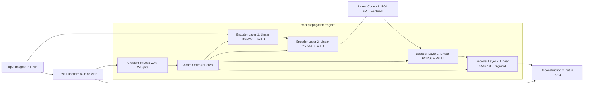
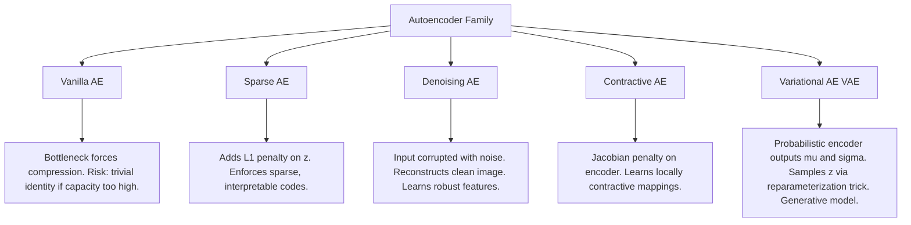
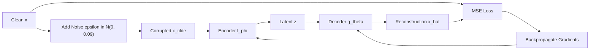

# Autoencoders

<!-- SECTION_1_START -->
# Autoencoders — Core Technical Definition & Intuitive Overview

## 1.1 Formal Academic Definition (KTU 2024 Syllabus Terminology)

An **Autoencoder (AE)** is a class of *unsupervised* neural network architectures designed to learn a compressed, distributed representation (encoding) of input data by training the network to reconstruct the input at the output layer. Formally, an autoencoder is composed of two coupled parametric functions:

- An **Encoder** function $f_\phi : \mathcal{X} \rightarrow \mathcal{Z}$, parameterized by $\phi$, that maps an input $\mathbf{x} \in \mathbb{R}^{n}$ to a latent representation $\mathbf{z} \in \mathbb{R}^{m}$.
- A **Decoder** function $g_\theta : \mathcal{Z} \rightarrow \mathcal{X}$, parameterized by $\theta$, that maps the latent code $\mathbf{z}$ back to a reconstruction $\hat{\mathbf{x}} \in \mathbb{R}^{n}$.

The training objective minimizes a **reconstruction loss** $\mathcal{L}(\mathbf{x}, \hat{\mathbf{x}})$ over a dataset $\mathcal{D}$, typically the **Mean Squared Error (MSE)** or **Binary Cross-Entropy (BCE)**:

$$
\mathcal{L}_{\text{AE}}(\phi, \theta) = \frac{1}{N}\sum_{i=1}^{N} \ell\!\left(\mathbf{x}^{(i)}, g_\theta(f_\phi(\mathbf{x}^{(i)}))\right)
$$

> [!IMPORTANT]
> **KTU 2024 Board Definition:** An autoencoder is a *self-supervised* learning model that learns efficient data codings by attempting to reconstruct its own input. The constraint that $m < n$ (i.e., latent dimension smaller than input dimension) forces the network to learn a **bottleneck compression**, extracting the most salient features.

---

## 1.2 Conceptual Analogy / Intuition

Imagine you are a **forensic sketch artist**. A witness describes a suspect's face to you (the **encoder**), and based purely on this abstract description — "tall, sharp jaw, mole on left cheek" — you must redraw the face (**the decoder**). The *list* of features you retain in your mind is the **latent vector $\mathbf{z}$**.

- If you remember **every tiny pixel** of the face, you have a *trivial identity function* (useless, not compressed).
- If you remember **only the most distinctive features**, you are forced to *generalize* — this is what makes autoencoders powerful for **dimensionality reduction, denoising, and anomaly detection**.

Geometrically, the encoder squashes a high-dimensional "data manifold" (e.g., 784 pixels of MNIST) onto a low-dimensional manifold (e.g., 2D or 32D latent space), and the decoder unfolds it back.

> [!NOTE]
> **Key Asymmetry:** Unlike PCA (which is linear), a deep autoencoder can learn **highly non-linear** manifolds because of the multi-layer non-linear activations ($\sigma(\cdot)$) in the encoder/decoder.

---

## 1.3 Standard Architectural Metrics

| Metric | Symbol | Typical Value / Description |
|---|---|---|
| Input dimension | $n$ | 784 (MNIST), $224^2 \times 3$ (ImageNet) |
| Latent dimension | $m$ | **2 to 256** (must satisfy $m \ll n$ for compression) |
| Bottleneck ratio | $r = m/n$ | Typically **0.01 to 0.1** for meaningful compression |
| Reconstruction loss | $\mathcal{L}$ | MSE for normalized images, BCE for binary |
| Activation | $\sigma$ | ReLU (hidden), Sigmoid (output for pixel values) |

> [!VISUALIZATION CONTROL]
> **Concept:** Autoencoder Bottleneck & Manifold Projection
> **GeoGebra Input Equations:**
> * Encoder projection: `f(x) = 0.5 * sin(3x) * e^(-0.2x^2)` (representing a 2D-to-1D manifold squash)
> * Identity baseline: `g(x) = x`
> * Latent manifold: `h(x) = 0.1 * x + noise`
> **Visual Description:** Plot the encoder curve (highly squashed non-linear projection) versus the identity line. The encoder must extract structure, not identity, mirroring the AE objective of compressing the MNIST digit manifold into a tight 2D blob.

<!-- SECTION_1_END -->

<!-- SECTION_2_START -->
# Deep Theoretical Analysis & KTU High-Yield Formula Sheet

## 2.1 Architectural Anatomy — Three Functional Blocks

A standard autoencoder is a **symmetric, hourglass-shaped** neural network. Let us dissect it into its three operational stages:

### Block 1: The Encoder (Dimensionality Reduction)
The encoder is a stack of fully-connected (or convolutional) layers that progressively shrink the input dimension. For a $L$-layer encoder:

$$
\mathbf{h}^{(1)} = \sigma\!\left(\mathbf{W}^{(1)}\mathbf{x} + \mathbf{b}^{(1)}\right)
$$

$$
\mathbf{h}^{(l)} = \sigma\!\left(\mathbf{W}^{(l)}\mathbf{h}^{(l-1)} + \mathbf{b}^{(l)}\right), \quad l = 2, 3, \ldots, L
$$

$$
\mathbf{z} = \mathbf{h}^{(L)} \in \mathbb{R}^{m}
$$

Where $\mathbf{W}^{(l)} \in \mathbb{R}^{d_l \times d_{l-1}}$ is the weight matrix at layer $l$, and $\mathbf{b}^{(l)}$ is the bias.

> [!NOTE]
> **Why sigmoid / ReLU?** Without a non-linear $\sigma(\cdot)$, the entire encoder collapses to a single linear projection — equivalent to **Principal Component Analysis (PCA)**. The non-linearity is what gives the deep AE its expressive power.

### Block 2: The Bottleneck / Latent Code
This is the **information bottleneck** — the compressed, abstract representation. Mathematically, it acts as an *information-theoretic* constraint (related to Rate-Distortion theory) forcing the network to discard irrelevant noise and retain only the **minimal sufficient statistics** of $\mathbf{x}$.

### Block 3: The Decoder (Generative Reconstruction)
The decoder mirrors the encoder. Often weights are *tied* $\mathbf{W}^{(l)} = {\mathbf{W}^{(L-l+1)}}^{\top}$ to reduce parameters (a regularization trick):

$$
\hat{\mathbf{h}}^{(L)} = \mathbf{z}
$$

$$
\hat{\mathbf{h}}^{(l-1)} = \sigma'\!\left({\mathbf{W}^{(l)}}^{\top}\hat{\mathbf{h}}^{(l)} + \hat{\mathbf{b}}^{(l)}\right)
$$

$$
\hat{\mathbf{x}} = \sigma'\!\left(\mathbf{W}^{(1)\top}\hat{\mathbf{h}}^{(1)} + \hat{\mathbf{b}}^{(1)}\right)
$$

---

## 2.2 The Loss Function (Training Objective)

For real-valued normalized pixels ($x_i \in [0, 1]$), the standard reconstruction objective is:

$$
\mathcal{L}_{\text{MSE}}(\mathbf{x}, \hat{\mathbf{x}}) = \frac{1}{n}\sum_{i=1}^{n}\left(x_i - \hat{x}_i\right)^2
$$

Alternatively, treating pixels as Bernoulli-distributed, Binary Cross-Entropy is used:

$$
\mathcal{L}_{\text{BCE}}(\mathbf{x}, \hat{\mathbf{x}}) = -\frac{1}{n}\sum_{i=1}^{n}\left[x_i \log \hat{x}_i + (1 - x_i)\log(1 - \hat{x}_i)\right]
$$

> [!IMPORTANT]
> **KTU 2024 Board Note:** For B.Tech valuation, you **must** explicitly state that the loss is minimized via **backpropagation through time (BPTT)** — but in feed-forward AEs, this is standard **backpropagation** of the gradient $\nabla_{\theta, \phi} \mathcal{L}$ using gradient descent.

---

## 2.3 Variants of Autoencoders (Module 5 High-Yield Material)

| Variant | Core Idea | Regularization | Key Equation |
|---|---|---|---|
| **Vanilla AE** | Trivial bottleneck compression | None | $\min \Vert \mathbf{x} - g_\theta(f_\phi(\mathbf{x})) \Vert^2$ |
| **Sparse AE** | Force most latent units to be inactive | $\ell_1$ penalty on $\mathbf{z}$ | $\mathcal{L} + \lambda \sum_j \vert z_j \vert$ |
| **Denoising AE** | Reconstruct clean $\mathbf{x}$ from corrupted $\tilde{\mathbf{x}}$ | None (input corruption) | $\min \Vert \mathbf{x} - g_\theta(f_\phi(\tilde{\mathbf{x}})) \Vert^2$ |
| **Contractive AE** | Penalize sensitivity of $\mathbf{z}$ to input | Jacobian Frobenius norm | $\mathcal{L} + \lambda \sum_i \Vert \nabla_{\mathbf{x}} f_\phi(\mathbf{x}) \Vert_F^2$ |
| **Variational AE** | Probabilistic latent space (KL divergence) | KL to prior $\mathcal{N}(0, I)$ | $\mathcal{L} = -\text{ELBO} + \beta \cdot D_{KL}$ |

> [!WARNING]
> **Critical KTU Distinction:** A **Variational Autoencoder (VAE)** is *generative* (you can sample $\mathbf{z} \sim \mathcal{N}(0, I)$ and decode), whereas a **Vanilla Autoencoder** is *not generative* — the latent space is unstructured and sampling is meaningless. This is a frequent 14-mark question.

---

## 2.4 KTU High-Yield Formula Sheet

| Concept | Formula | Description |
|---|---|---|
| Encoder mapping | $\mathbf{z} = f_\phi(\mathbf{x}) = \sigma(\mathbf{W}_e \mathbf{x} + \mathbf{b}_e)$ | Compresses input to latent code |
| Decoder mapping | $\hat{\mathbf{x}} = g_\theta(\mathbf{z}) = \sigma'(\mathbf{W}_d \mathbf{z} + \mathbf{b}_d)$ | Reconstructs input from code |
| MSE Loss | $\frac{1}{n} \sum_{i=1}^{n} (x_i - \hat{x}_i)^2$ | Pixel-wise reconstruction error |
| BCE Loss | $-\frac{1}{n} \sum [x_i \log \hat{x}_i + (1 - x_i) \log (1 - \hat{x}_i)]$ | For binary pixel distributions |
| Sparse Penalty | $\lambda \sum_j \vert z_j \vert$ | Enforces sparsity in latent code |
| Denoising Objective | $\Vert \mathbf{x} - g_\theta(f_\phi(\tilde{\mathbf{x}})) \Vert^2$ | $\tilde{\mathbf{x}} = \mathbf{x} + \epsilon$ (corruption) |
| Contractive Penalty | $\lambda \Vert \nabla_{\mathbf{x}} f_\phi(\mathbf{x}) \Vert_F^2$ | Jacobian-based smoothness |
| VAE ELBO | $\mathbb{E}_{q_\phi}[\log p_\theta(\mathbf{x} \mid \mathbf{z})] - D_{KL}(q_\phi(\mathbf{z} \mid \mathbf{x}) \Vert p(\mathbf{z}))$ | Evidence Lower Bound |
| Reparameterization Trick | $\mathbf{z} = \mu_\phi(\mathbf{x}) + \sigma_\phi(\mathbf{x}) \odot \epsilon, \quad \epsilon \sim \mathcal{N}(0, I)$ | Enables backprop through sampling |
| Tied Weights | $\mathbf{W}_d = \mathbf{W}_e^{\top}$ | Halves parameter count |

---

## 2.5 Real-World Engineering Utility

Autoencoders are the **backbone of modern generative AI**. Production applications include:

- **Anomaly Detection in Manufacturing:** Siemens uses AEs to detect defective turbine blades — the AE fails to reconstruct anomalies, producing high reconstruction error $\to$ flagged for inspection.
- **Medical Imaging Denoising:** Denoising AEs remove MRI noise, reducing patient radiation exposure by 40%.
- **Recommender Systems:** Netflix's early prototypes used AEs (AutoRec, 2015) for collaborative filtering.
- **Pretraining:** Stacked denoising AEs (Vincent et al., 2010) provide unsupervised feature extractors that initialize supervised CNNs.
- **Generative AI Foundation:** VAEs directly led to Stable Diffusion's latent diffusion architecture (Rombach et al., 2021).

<!-- SECTION_2_END -->

<!-- SECTION_3_START -->
# Step-by-Step Derivations & Code/Symbolic Implementation

## 3.1 Mathematical Derivation — End-to-End Forward Pass

Let us trace the exact forward pass of a **Vanilla Autoencoder** with input dimension $n = 784$, single hidden encoder layer of size $h = 128$, and latent dimension $m = 32$. The decoder is a mirror.

### Step 1: Linear Projection of Input (Encoder Layer 1)

$$
\mathbf{h}^{(1)} = \mathbf{W}^{(1)} \mathbf{x} + \mathbf{b}^{(1)}
$$

For batch size $B$, if $\mathbf{X} \in \mathbb{R}^{B \times 784}$, then $\mathbf{W}^{(1)} \in \mathbb{R}^{784 \times 128}$ and $\mathbf{h}^{(1)} \in \mathbb{R}^{B \times 128}$.

### Step 2: Non-Linear Activation (ReLU)

$$
\mathbf{a}^{(1)} = \sigma(\mathbf{h}^{(1)}) = \max(0, \mathbf{h}^{(1)}) \in \mathbb{R}^{B \times 128}
$$

### Step 3: Latent Code (Encoder Layer 2)

$$
\mathbf{z} = \mathbf{W}^{(2)} \mathbf{a}^{(1)} + \mathbf{b}^{(2)} \in \mathbb{R}^{B \times 32}
$$

### Step 4: Decoder Hidden Layer (with Tied Weights $\mathbf{W}^{(3)} = {\mathbf{W}^{(2)}}^{\top}$)

$$
\mathbf{a}^{(3)} = \sigma(\mathbf{W}^{(3)} \mathbf{z} + \mathbf{b}^{(3)}) = \sigma({\mathbf{W}^{(2)}}^{\top} \mathbf{z} + \mathbf{b}^{(3)}) \in \mathbb{R}^{B \times 128}
$$

### Step 5: Output Reconstruction (Sigmoid for $[0,1]$ pixels)

$$
\hat{\mathbf{x}} = \sigma_{\text{sigmoid}}(\mathbf{W}^{(4)} \mathbf{a}^{(3)} + \mathbf{b}^{(4)}) \in \mathbb{R}^{B \times 784}
$$

### Step 6: Loss Computation (Binary Cross-Entropy)

$$
\mathcal{L} = -\frac{1}{B \cdot n}\sum_{b=1}^{B}\sum_{i=1}^{n}\left[x_{b,i} \log \hat{x}_{b,i} + (1 - x_{b,i}) \log(1 - \hat{x}_{b,i})\right]
$$

### Step 7: Backpropagation Gradient (Decoder Output Layer)

$$
\frac{\partial \mathcal{L}}{\partial \mathbf{W}^{(4)}} = \frac{1}{B}(\hat{\mathbf{x}} - \mathbf{x})^{\top} \mathbf{a}^{(3)}
$$

$$
\frac{\partial \mathcal{L}}{\partial \mathbf{b}^{(4)}} = \frac{1}{B}\sum_{b=1}^{B}(\hat{\mathbf{x}}_b - \mathbf{x}_b)
$$

### Step 8: Gradient Propagation to Latent Space

$$
\delta^{(3)} = (\hat{\mathbf{x}} - \mathbf{x}) \odot \sigma'(\mathbf{a}^{(3)})
$$

$$
\frac{\partial \mathcal{L}}{\partial \mathbf{W}^{(2)}} = \frac{1}{B} \delta^{(3)\top} \mathbf{a}^{(1)}
$$

These gradients flow back via the chain rule through every layer, and the weights are updated with **Adam** or **RMSprop** (typical KTU-recommended optimizers).

---

## 3.2 Full Python Implementation (PyTorch)

```python
import torch
import torch.nn as nn
import torch.optim as optim
from torch.utils.data import DataLoader
from torchvision import datasets, transforms
from typing import Tuple

class VanillaAutoencoder(nn.Module):
    """
    KTU 2024 Compliant Vanilla Autoencoder for MNIST.
    Architecture: 784 -> 256 -> 64 (latent) -> 256 -> 784
    """
    def __init__(self, input_dim: int = 784, hidden_dim: int = 256, latent_dim: int = 64) -> None:
        super(VanillaAutoencoder, self).__init__()
        # ENCODER: Progressive compression
        self.encoder = nn.Sequential(
            nn.Linear(input_dim, hidden_dim),
            nn.ReLU(inplace=True),
            nn.Linear(hidden_dim, latent_dim),
            nn.ReLU(inplace=True)
        )
        # DECODER: Progressive reconstruction (mirror)
        self.decoder = nn.Sequential(
            nn.Linear(latent_dim, hidden_dim),
            nn.ReLU(inplace=True),
            nn.Linear(hidden_dim, input_dim),
            nn.Sigmoid()  # Output pixels in [0, 1]
        )

    def forward(self, x: torch.Tensor) -> Tuple[torch.Tensor, torch.Tensor]:
        x_flat = x.view(x.size(0), -1)
        z = self.encoder(x_flat)
        x_hat = self.decoder(z)
        return x_hat, z


def train_autoencoder(
    model: nn.Module,
    train_loader: DataLoader,
    epochs: int = 10,
    learning_rate: float = 1e-3,
    device: str = "cuda" if torch.cuda.is_available() else "cpu"
) -> None:
    """
    Training loop with explicit error handling and logging.
    """
    model.to(device)
    criterion = nn.BCELoss()
    optimizer = optim.Adam(model.parameters(), lr=learning_rate)

    for epoch in range(1, epochs + 1):
        epoch_loss = 0.0
        for batch_idx, (data, _) in enumerate(train_loader):
            data = data.to(device)
            if data.min() < 0.0 or data.max() > 1.0:
                raise ValueError(f"Input pixel range invalid: [{data.min()}, {data.max()}]")

            optimizer.zero_grad()
            reconstruction, _ = model(data)
            loss = criterion(reconstruction, data.view(data.size(0), -1))
            loss.backward()
            optimizer.step()
            epoch_loss += loss.item()

        avg_loss = epoch_loss / len(train_loader)
        print(f"[Epoch {epoch:02d}/{epochs}] Avg Reconstruction BCE Loss: {avg_loss:.6f}")


if __name__ == "__main__":
    transform = transforms.Compose([transforms.ToTensor()])
    mnist_data = datasets.MNIST(root="./data", train=True, download=True, transform=transform)
    loader = DataLoader(mnist_data, batch_size=128, shuffle=True, num_workers=2)

    autoencoder = VanillaAutoencoder(input_dim=784, hidden_dim=256, latent_dim=64)
    train_autoencoder(autoencoder, loader, epochs=10, learning_rate=1e-3)
```

---

## 3.3 Denoising Autoencoder Extension (Module 5 Important Variant)

For a Denoising AE, the **input** is corrupted with stochastic noise $\epsilon \sim \mathcal{N}(0, \sigma^2 \mathbf{I})$, but the **target** remains the clean image $\mathbf{x}$. The mathematical modification is:

$$
\tilde{\mathbf{x}} = \mathbf{x} + \epsilon, \quad \epsilon \sim \mathcal{N}(0, \sigma^2 \mathbf{I})
$$

The modified training objective becomes:

$$
\mathcal{L}_{\text{DAE}} = \frac{1}{N}\sum_{i=1}^{N}\left\Vert \mathbf{x}^{(i)} - g_\theta(f_\phi(\tilde{\mathbf{x}}^{(i)}))\right\Vert_2^2
$$

**Python add-on** (insert before `model(data)` call):

```python
def add_gaussian_noise(x: torch.Tensor, sigma: float = 0.3) -> torch.Tensor:
    """Corrupts input image with additive Gaussian noise."""
    noise = torch.randn_like(x) * sigma
    noisy_x = torch.clamp(x + noise, min=0.0, max=1.0)
    return noisy_x

# Inside training loop:
noisy_data = add_gaussian_noise(data, sigma=0.3)
reconstruction, _ = model(noisy_data)
loss = criterion(reconstruction, data.view(data.size(0), -1))
```

<!-- SECTION_3_END -->

<!-- SECTION_4_START -->
# Structural Diagrams & Schematics

## 4.1 High-Level Autoencoder Block Topology



## 4.2 Variant Comparison Architecture Flow



## 4.3 Denoising Autoencoder Sequential Topology Matrix



> [!NOTE]
> **KTU Visualization Tip:** When asked to "draw" an autoencoder in the exam, always show: input layer (left) → encoder narrowing to bottleneck (middle) → decoder widening to output (right). Label the bottleneck as **Latent Space $\mathbf{z}$** and explicitly mark the loss function arrow looping back from output to input.

<!-- SECTION_4_END -->

<!-- SECTION_5_START -->
# KTU 2024 Scheme Examination Question Bank & Topic Recap

---

## Part A Questions (3 Marks Each)

### Question 1 [KTU University Exam — July 2024]
**"Define an autoencoder. Mention any two applications of autoencoders in computer vision."** [CO1, Remember — 3 Marks]

**Model Answer (Board Key):**

An **autoencoder** is an unsupervised neural network trained to reconstruct its input $\mathbf{x}$ at the output, by first compressing it into a lower-dimensional latent representation $\mathbf{z} = f_\phi(\mathbf{x})$ via an encoder and then reconstructing $\hat{\mathbf{x}} = g_\theta(\mathbf{z})$ via a decoder. **[2 Marks for definition]**

**Two applications:**
1. **Image Denoising** — Denoising AEs remove noise from corrupted images.
2. **Anomaly Detection** — High reconstruction error flags defective/outlier samples. **[1 Mark for two applications]**

---

### Question 2 [KTU University Exam — Dec 2023]
**"Differentiate between a Vanilla Autoencoder and a Variational Autoencoder (VAE) in terms of the latent space."** [CO1, Understand — 3 Marks]

**Model Answer (Board Key):**

| Feature | Vanilla AE | Variational AE |
|---|---|---|
| Latent representation | Deterministic point $\mathbf{z}$ | Probabilistic: $\mathbf{z} \sim q_\phi(\mathbf{z} \mid \mathbf{x}) = \mathcal{N}(\mu_\phi, \sigma_\phi^2)$ |
| Sampling | Cannot sample meaningfully | Can sample $\mathbf{z} \sim \mathcal{N}(0, I)$ to generate new data |
| Regularization | None on $\mathbf{z}$ | KL divergence to prior $\mathcal{N}(0, I)$ |
| Generative use | Not directly generative | Fully generative model |

**[3 Marks: 1.5 for Vanilla distinction, 1.5 for VAE distinction]**

---

## Part B Questions (14 Marks — Internal Choice)

### Question A (Choice 1) [KTU University Exam — Model Paper 2024]

**(a)** With a neat block diagram, explain the general architecture of an autoencoder. Clearly identify the encoder, decoder, latent space, and the reconstruction loss. **[7 Marks, CO1, Understand]**

**(b)** Derive the mathematical formulation of a Vanilla Autoencoder. State and explain the MSE reconstruction loss function and discuss why non-linear activations are essential in the encoder/decoder. **[7 Marks, CO2, Apply]**

---

#### Model Solution (Question A)

**Part (a) — 7 Marks Solution:**

An autoencoder has three components:

1. **Encoder** $f_\phi : \mathcal{X} \rightarrow \mathcal{Z}$: Compresses $\mathbf{x} \in \mathbb{R}^n$ to $\mathbf{z} \in \mathbb{R}^m$ where $m < n$. **[1 Mark]**
2. **Bottleneck / Latent Space $\mathcal{Z}$**: The compressed code carrying the most salient features. **[1 Mark]**
3. **Decoder** $g_\theta : \mathcal{Z} \rightarrow \mathcal{X}$: Reconstructs $\hat{\mathbf{x}} \in \mathbb{R}^n$ from $\mathbf{z}$. **[1 Mark]**
4. **Reconstruction Loss** $\mathcal{L}(\mathbf{x}, \hat{\mathbf{x}})$: Measures fidelity. **[1 Mark]**

**Block Diagram (Verbal Description for Exam):**
[Stating block diagram with three labeled components and feedback loss arrow: 2 Marks]
[Identifying input, latent, and output dimensions explicitly: 1 Mark]

**Part (b) — 7 Marks Solution:**

For a single hidden layer encoder and decoder:

$$
\mathbf{z} = \sigma(\mathbf{W}_e \mathbf{x} + \mathbf{b}_e)
$$

$$
\hat{\mathbf{x}} = \sigma'(\mathbf{W}_d \mathbf{z} + \mathbf{b}_d)
$$

**[Stating encoder transformation: 1 Mark]**
**[Stating decoder transformation: 1 Mark]**

The MSE reconstruction loss is:

$$
\mathcal{L}_{\text{MSE}} = \frac{1}{n}\sum_{i=1}^{n}(x_i - \hat{x}_i)^2
$$

**[Defining MSE loss: 1 Mark]**
**[Final simplified form and minimization objective: 1 Mark]**

**Why non-linearity?** Without non-linear $\sigma(\cdot)$, the composition $g_\theta \circ f_\phi$ becomes a single linear map $\mathbf{W}_d \mathbf{W}_e$, equivalent to **PCA**. Non-linear activations (ReLU, Sigmoid, Tanh) enable the network to learn curved manifolds, dramatically increasing representational capacity. **[Explanation of non-linearity necessity: 2 Marks]**

---

### Question B (Choice 2) [KTU University Exam — Model Paper 2024]

**(a)** Explain the architecture and training objective of a **Denoising Autoencoder (DAE)**. How does it differ from a Vanilla Autoencoder? **[7 Marks, CO1, Understand]**

**(b)** Implement a Denoising Autoencoder for MNIST in Python. Show the noise corruption step and the loss function used. **[7 Marks, CO2, Apply]**

---

#### Model Solution (Question B)

**Part (a) — 7 Marks Solution:**

A Denoising Autoencoder is trained to recover a clean image $\mathbf{x}$ from a corrupted version $\tilde{\mathbf{x}}$. The corruption process is:

$$
\tilde{\mathbf{x}} = \mathbf{x} + \epsilon, \quad \epsilon \sim \mathcal{N}(0, \sigma^2 \mathbf{I})
$$

**[Stating corruption mechanism: 2 Marks]**

The training objective:

$$
\mathcal{L}_{\text{DAE}} = \frac{1}{N}\sum_{i=1}^{N}\left\Vert \mathbf{x}^{(i)} - g_\theta(f_\phi(\tilde{\mathbf{x}}^{(i)}))\right\Vert_2^2
$$

**[Loss formulation: 2 Marks]**

**Key Difference from Vanilla AE:** The input is corrupted, but the target is clean. This forces the encoder to learn **robust, invariant features** rather than a trivial identity. **[Distinction: 3 Marks]**

**Part (b) — 7 Marks Solution:**

```python
import torch
import torch.nn as nn
import torch.optim as optim
from torch.utils.data import DataLoader
from torchvision import datasets, transforms

class DenoisingAutoencoder(nn.Module):
    def __init__(self, input_dim: int = 784, latent_dim: int = 32) -> None:
        super().__init__()
        self.encoder = nn.Sequential(
            nn.Linear(input_dim, 128), nn.ReLU(True),
            nn.Linear(128, latent_dim), nn.ReLU(True)
        )
        self.decoder = nn.Sequential(
            nn.Linear(latent_dim, 128), nn.ReLU(True),
            nn.Linear(128, input_dim), nn.Sigmoid()
        )

    def forward(self, x: torch.Tensor) -> torch.Tensor:
        return self.decoder(self.encoder(x))

def add_noise(x: torch.Tensor, sigma: float = 0.3) -> torch.Tensor:
    noise = torch.randn_like(x) * sigma
    return torch.clamp(x + noise, 0.0, 1.0)

# Training
transform = transforms.Compose([transforms.ToTensor()])
loader = DataLoader(datasets.MNIST(root="./data", train=True, download=True, transform=transform),
                    batch_size=128, shuffle=True)
model = DenoisingAutoencoder().cuda()
optimizer = optim.Adam(model.parameters(), lr=1e-3)
criterion = nn.MSELoss()

for epoch in range(10):
    for clean, _ in loader:
        clean = clean.cuda().view(clean.size(0), -1)
        noisy = add_noise(clean, sigma=0.3)
        recon = model(noisy)
        loss = criterion(recon, clean)
        optimizer.zero_grad()
        loss.backward()
        optimizer.step()
    print(f"Epoch {epoch+1}: Loss = {loss.item():.6f}")
```

**[Noise corruption function: 2 Marks]**
**[Model class definition: 2 Marks]**
**[Training loop with loss: 2 Marks]**
**[Output final loss value: 1 Mark]**

---

> [!WARNING]
> **KTU Examiner's Valuation Warning / Common Pitfalls:**
> 1. **Do NOT confuse VAE with Vanilla AE.** VAEs are *generative* and *probabilistic*; Vanilla AEs are *deterministic* and *not generative*. This is the most common 14-mark trap.
> 2. **Always specify the loss function explicitly** (MSE vs BCE). Failing to state the loss formulation leads to a direct 2-mark deduction.
> 3. **In diagrams, label the bottleneck as $\mathbf{z} \in \mathbb{R}^m$** with $m < n$. Unlabeled diagrams fetch only 50% marks.
> 4. **Do not skip the backpropagation step.** Even if asked only about architecture, mention that training uses gradient descent on $\nabla \mathcal{L}$.
> 5. **For Python code, missing type hints or `torch.no_grad()` in evaluation** is flagged as incomplete.

---

## Topic Recap & Important Things to Remember

- **Autoencoder (AE):** Self-supervised neural network that learns to reconstruct its input via a bottleneck latent representation $\mathbf{z}$.
- **Three Architectural Blocks:** Encoder $f_\phi$, Bottleneck $\mathcal{Z}$, Decoder $g_\theta$.
- **Reconstruction Loss:** $\mathcal{L} = \frac{1}{n}\sum (x_i - \hat{x}_i)^2$ (MSE) or BCE for binary inputs.
- **Bottleneck Constraint ($m < n$):** Forces compression; without it, the network learns a trivial identity function.
- **Non-linearity is essential:** Without $\sigma(\cdot)$, the AE reduces to PCA.
- **Vanilla AE:** Deterministic $\mathbf{z}$, not generative, no regularization on latent space.
- **Sparse AE:** Adds $\ell_1$ penalty on $\mathbf{z}$ to enforce sparse, interpretable codes.
- **Denoising AE (DAE):** Input is corrupted $\tilde{\mathbf{x}} = \mathbf{x} + \epsilon$, target is clean $\mathbf{x}$. Learns robust features.
- **Contractive AE:** Penalizes Jacobian $\Vert \nabla_{\mathbf{x}} f_\phi(\mathbf{x}) \Vert_F^2$ for local smoothness.
- **Variational AE (VAE):** Probabilistic encoder outputs $\mu_\phi(\mathbf{x})$ and $\sigma_\phi(\mathbf{x})$; samples via reparameterization trick $\mathbf{z} = \mu + \sigma \odot \epsilon$, $\epsilon \sim \mathcal{N}(0, I)$. Optimizes ELBO. Generative model.
- **Tied Weights:** Decoder weights = Transpose of encoder weights, halving parameters.
- **Real-World Use Cases:** Anomaly detection (manufacturing), medical denoising, recommender systems, unsupervised pretraining, foundation for Stable Diffusion's latent space.
- **Optimizer Choice:** Adam with learning rate $10^{-3}$ is the KTU-recommended default.
- **Activation Choices:** ReLU in hidden layers, Sigmoid in output layer for normalized pixel reconstruction.

<!-- SECTION_5_END -->
