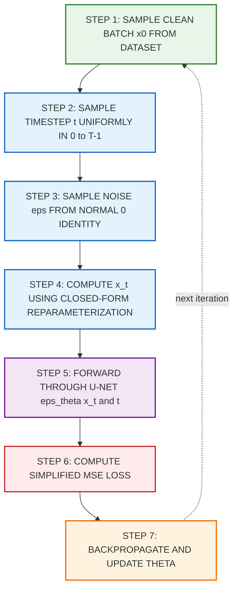
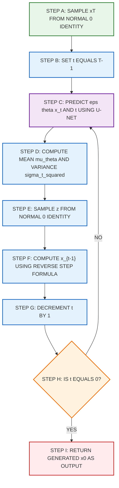
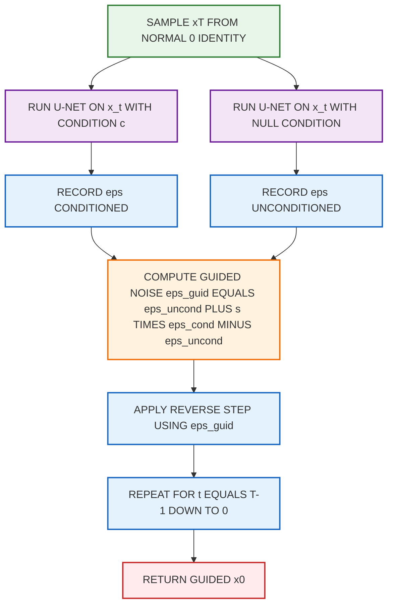

# Diffusion models

<!-- SECTION_1_START -->
# Diffusion Models: Core Technical Definition & Intuitive Overview

## Formal Academic Definition (KTU 2024 Syllabus Aligned)

A **Diffusion Model** is a class of deep generative models that learn to synthesize new data samples (typically high-dimensional signals such as images) by **reversing a stochastic, multi-step noising process**. Formally, a diffusion model factorizes data generation into a Markov chain of denoising transitions, learning a parameterized reverse kernel $p_\theta(x_{t-1} \mid x_t)$ that approximately inverts a fixed forward noising kernel $q(x_t \mid x_{t-1})$, which gradually corrupts a clean data sample $x_0 \sim q(x_0)$ into pure Gaussian noise $x_T \sim \mathcal{N}(\mathbf{0}, \mathbf{I})$ over $T$ discrete timesteps.

The most canonical instantiation is the **Denoising Diffusion Probabilistic Model (DDPM)** introduced by Ho et al. (2020), which establishes three foundational components:
1. A **fixed forward process** $q$ that incrementally adds isotropic Gaussian noise according to a variance schedule $\beta_1, \beta_2, \dots, \beta_T$.
2. A **learned reverse process** $p_\theta$ parameterized by a neural network (typically a **U-Net**) that predicts the noise $\epsilon$ injected at each step.
3. A **variational lower bound (ELBO) training objective** that reduces, under a reparameterization trick, to a simple mean-squared error between the true and predicted noise.

> [!IMPORTANT]
> **KTU 2024 Scheme Focus:** The course *PECST86A — Deep Learning \& Computer Vision* treats diffusion models as the **third pillar of generative modeling** alongside VAEs and GANs. Expect direct definitional questions on the forward/reverse Markov chain and the role of the U-Net in noise prediction.

## Conceptual Analogy & Geometric Intuition

> [!NOTE]
> **The "Smoky Photograph" Analogy**
> Imagine a sharp, vivid photograph $\rightarrow$ $x_0$. Place the photograph in a smoky, dust-filled room. Every minute, more dust settles on it. After the first hour, edges blur. After the second hour, only faint shadows remain. After many hours, the photograph is indistinguishable from the white noise of the room itself $\rightarrow$ $x_T$.
>
> A **diffusion model** is a magical *reverse-smoking machine*. Given only the noisy final state $x_T$, it must remember, at each timestep $t$, exactly which "grain of dust" to mentally remove, step by step, until the original photograph reappears. Crucially, the model never sees the original photograph during inference — it only ever *predicts the noise that was added* at each step.

| Intuitive Object | Mathematical Symbol | Meaning |
|---|---|---|
| Original photograph | $x_0$ | Clean data sample from $q(x_0)$ |
| Smoky intermediate image | $x_t$ | Noised sample at step $t$ |
| Dust settled per minute | $\beta_t$ | Per-step noise variance |
| Reverse-smoking machine | $p_\theta$ | Learnable denoising distribution |
| Timekeeper / scheduler | $t$ | Discrete timestep index $\in \{1, \dots, T\}$ |

> [!TIP]
> **Why it works:** Reversing a Markov chain of Gaussian transitions is mathematically tractable because the conditional $q(x_{t-1} \mid x_t, x_0)$ remains Gaussian for any $t$ — this is the closed-form Bayes trick that makes DDPMs efficiently trainable.

## Physical & Geometric Constants

Key scalar quantities that govern every diffusion model formulation:

- **$T$** $\rightarrow$ total number of diffusion timesteps (commonly **$\mathbf{T = 1000}$** in DDPM).
- **$\beta_t$** $\rightarrow$ noise variance at step $t$; standard linear schedule spans $\beta_1 = 10^{-4}$ to $\beta_T = 0.02$.
- **$\alpha_t$** $\equiv$ $1 - \beta_t$ $\rightarrow$ signal retention factor at step $t$.
- **$\bar{\alpha}_t$** $\equiv \prod_{s=1}^{t} \alpha_s$ $\rightarrow$ cumulative product; ratio of clean-signal variance remaining at step $t$.

> [!VISUALIZATION CONTROL]
> **Concept:** Forward noising trajectory of a 1-D signal as it diffuses to Gaussian noise.
> **GeoGebra / Desmos Input Equations (parametric in $t \in [0, 1]$):**
> * `sqrt_bar_alpha = exp(-0.5 * beta_min * t - 0.5 * (beta_max - beta_min) * t^2)`
> * `mu(t) = sqrt_bar_alpha * x0` (with $x_0 = 1$)
> * `sigma(t) = sqrt(1 - sqrt_bar_alpha^2)`
> **Visual Description:** Plot a unit point mass at $x_0 = 1$ on the number line. As $t$ increases, the curve $\mu(t)$ decays exponentially toward $0$ while $\sigma(t)$ grows toward $1$, illustrating the **mean-reverting-to-zero, variance-growing-to-unity** behavior of the marginal $q(x_t \mid x_0) = \mathcal{N}(\sqrt{\bar{\alpha}_t} x_0, (1-\bar{\alpha}_t)\mathbf{I})$.
<!-- SECTION_1_END -->

<!-- SECTION_2_START -->
# Deep Theoretical Analysis & KTU High-Yield Formula Sheet

## Operational Architecture — Step-by-Step Logic

A diffusion model has **two coordinated processes** that mirror each other in time:

### Process A — The Fixed Forward (Noising) Process $q$

Operates during training only. It defines a Markov chain that progressively corrupts $x_0$ into noise.

- **Step 1:** Sample a clean image $x_0 \sim q(x_0)$ from the dataset.
- **Step 2:** For each $t \in \{1, \dots, T\}$, apply a small Gaussian perturbation:
  $$q(x_t \mid x_{t-1}) = \mathcal{N}\!\left(x_t;\; \sqrt{1-\beta_t}\, x_{t-1},\; \beta_t \mathbf{I}\right)$$
- **Step 3:** Choose a noise schedule $\{\beta_t\}_{t=1}^{T}$, typically **linear** or **cosine**.
- **Step 4 (Key Trick):** Reparameterize to jump directly to any $t$ in a single closed form:
  $$x_t = \sqrt{\bar{\alpha}_t}\, x_0 + \sqrt{1 - \bar{\alpha}_t}\, \epsilon,\quad \epsilon \sim \mathcal{N}(\mathbf{0}, \mathbf{I})$$
- **Step 5 (Why it works):** Because Gaussian marginals are closed under linear combinations, the marginal $q(x_t \mid x_0)$ is itself a Gaussian with known mean and variance — no sequential simulation required.

### Process B — The Learned Reverse (Denoising) Process $p_\theta$

Operates during both training (as a learning target) and inference (as the generator).

- **Step 1:** Parameterize each reverse step as a diagonal Gaussian:
  $$p_\theta(x_{t-1} \mid x_t) = \mathcal{N}\!\left(x_{t-1};\; \mu_\theta(x_t, t),\; \Sigma_\theta(x_t, t)\right)$$
- **Step 2:** Theoretically, the true reverse kernel is also Gaussian (because the forward kernel is Gaussian); the model only needs to predict the sufficient statistics.
- **Step 3 (Simplification):** Ho et al. (2020) fixed $\Sigma_\theta(x_t, t) = \sigma_t^2 \mathbf{I}$ and reparameterized $\mu_\theta$ as a noise prediction:
  $$\mu_\theta(x_t, t) = \frac{1}{\sqrt{\alpha_t}} \left( x_t - \frac{\beta_t}{\sqrt{1 - \bar{\alpha}_t}}\, \epsilon_\theta(x_t, t) \right)$$
- **Step 4 (Training Objective):** Minimize the simplified ELBO, which reduces to a **noise-prediction MSE**:
  $$L_{\text{simple}}(\theta) = \mathbb{E}_{t, x_0, \epsilon} \left[ \left\Vert \epsilon - \epsilon_\theta\!\left( \sqrt{\bar{\alpha}_t}\, x_0 + \sqrt{1-\bar{\alpha}_t}\, \epsilon,\; t \right) \right\Vert^2 \right]$$
- **Step 5 (Inference / Sampling):** Starting from $x_T \sim \mathcal{N}(\mathbf{0}, \mathbf{I})$, iteratively apply the learned denoiser for $T$ steps to obtain $x_0$.

### The Reverse Bayes Identity (Posterior of Forward Process)

The target distribution the network imitates is the closed-form posterior:
$$q(x_{t-1} \mid x_t, x_0) = \mathcal{N}\!\left(x_{t-1};\; \tilde{\mu}_t(x_t, x_0),\; \tilde{\beta}_t \mathbf{I}\right)$$
with
$$\tilde{\mu}_t = \frac{\sqrt{\bar{\alpha}_{t-1}}\, \beta_t}{1 - \bar{\alpha}_t}\, x_0 + \frac{\sqrt{\alpha_t}\,(1 - \bar{\alpha}_{t-1})}{1 - \bar{\alpha}_t}\, x_t$$
and
$$\tilde{\beta}_t = \frac{1 - \bar{\alpha}_{t-1}}{1 - \bar{\alpha}_t}\, \beta_t$$

> [!IMPORTANT]
> **Why noise prediction $\epsilon$ instead of mean $\mu$?** Empirically, predicting $\epsilon$ yields better sample quality and training stability than directly predicting $x_0$ or $\mu$. This is the **defining contribution** of DDPM-style training.

## KTU High-Yield Formula / Cheat Sheet

| Symbol | Name | Definition / Value | Engineering Use |
|---|---|---|---|
| $q(x_t \mid x_{t-1})$ | Forward kernel | $\mathcal{N}(\sqrt{1-\beta_t}\,x_{t-1},\ \beta_t \mathbf{I})$ | Synthetic data corruption during training |
| $\beta_t$ | Noise schedule | Linear: $10^{-4} \to 0.02$ over $T = 1000$ | Controls signal-to-noise ratio trajectory |
| $\alpha_t$ | Signal retention | $1 - \beta_t$ | Per-step preservation factor |
| $\bar{\alpha}_t$ | Cumulative retention | $\prod_{s=1}^{t} \alpha_s$ | Used in closed-form marginalization |
| $q(x_t \mid x_0)$ | Marginal forward | $\mathcal{N}(\sqrt{\bar{\alpha}_t}\,x_0,\ (1-\bar{\alpha}_t)\mathbf{I})$ | Skip-step sampling for any $t$ |
| $p_\theta(x_{t-1} \mid x_t)$ | Reverse kernel | $\mathcal{N}(\mu_\theta(x_t, t),\ \sigma_t^2 \mathbf{I})$ | Generative decoder |
| $\epsilon_\theta$ | Noise predictor | U-Net output $\in \mathbb{R}^{H \times W \times 3}$ | Core learnable network |
| $L_{\text{simple}}$ | DDPM loss | $\mathbb{E} \Vert \epsilon - \epsilon_\theta(\cdot, t) \Vert^2$ | Training objective |
| $\tilde{\beta}_t$ | Posterior variance | $\frac{1 - \bar{\alpha}_{t-1}}{1 - \bar{\alpha}_t} \beta_t$ | Variance of true reverse step |
| $\text{SNR}(t)$ | Signal-to-noise | $\bar{\alpha}_t / (1 - \bar{\alpha}_t)$ | Quality metric across timesteps |

> [!TIP]
> **Memorize three equations for the KTU board exam:**
> 1. The reparameterized forward jump $x_t = \sqrt{\bar{\alpha}_t}\, x_0 + \sqrt{1-\bar{\alpha}_t}\, \epsilon$.
> 2. The noise-prediction training loss $L = \mathbb{E} \Vert \epsilon - \epsilon_\theta \Vert^2$.
> 3. The reverse-step formula $x_{t-1} = \frac{1}{\sqrt{\alpha_t}} \left( x_t - \frac{\beta_t}{\sqrt{1 - \bar{\alpha}_t}} \epsilon_\theta(x_t, t) \right) + \sigma_t z$.

## Real-World Engineering Applications

- **Stable Diffusion** (Stability AI, CompVis, 2022) — text-to-image synthesis via **Latent Diffusion Models (LDMs)** that run the diffusion chain in a perceptual VAE latent space rather than pixel space, reducing compute by $\approx 8\times$ for the same FID.
- **DALL·E 2 / 3** (OpenAI) — uses a **two-stage pipeline**: a *prior* diffusion model maps CLIP text embeddings to CLIP image embeddings; a *decoder* diffusion model synthesizes pixels from those embeddings.
- **Imagen** (Google Brain) — replaces the prior with a T5-XXL text encoder, achieving state-of-the-art FID on MS-COCO.
- **Stable Video Diffusion** — temporal diffusion for text-to-video generation.
- **Diffusion-Based Super-Resolution** (e.g., SR3, IDM) — out-performs GAN-based super-resolution on perceptual metrics.
- **Protein Structure Generation** (e.g., DiffDock, Chroma, RFdiffusion) — adapted from 2-D image diffusion to 3-D molecular coordinates.
- **Inpainting \& Image Editing** — masks an image, noises it, and runs reverse diffusion conditioned on the unmasked region.
- **Audio Synthesis** (e.g., DiffWave, AudioLDM) — 1-D convolution U-Nets on mel-spectrograms.
- **Inverse Problems** (e.g., posterior sampling, DPS) — solves compressed sensing, denoising, and MRI reconstruction with diffusion priors.

> [!NOTE]
> **Why diffusion over GANs?** Diffusion models do not suffer from **mode collapse**, have stable training (no adversarial min-max), and achieve superior **mode coverage** on diverse datasets like ImageNet — a critical requirement for general-purpose vision foundation models.
<!-- SECTION_2_END -->

<!-- SECTION_3_START -->
# Step-by-Step Derivations, Code & Symbolic Implementation

## Derivation 1 — Closed-Form Marginal $q(x_t \mid x_0)$

Starting from the sequential Markov chain definition:
$$q(x_t \mid x_{t-1}) = \mathcal{N}\!\left(x_t;\; \sqrt{1-\beta_t}\, x_{t-1},\; \beta_t \mathbf{I}\right)$$

By **iterative Gaussian marginalization**, we compose all steps $1 \to t$:

$$
\begin{aligned}
q(x_t \mid x_0) &= \int q(x_{1:t} \mid x_0)\, dx_{1:t-1} \\
&= \mathcal{N}\!\left(x_t;\; \sqrt{\bar{\alpha}_t}\, x_0,\; (1 - \bar{\alpha}_t)\, \mathbf{I}\right)
\end{aligned}
$$

**Logic check (line by line):**
- **Line 1:** $q(x_{1:t} \mid x_0) = \prod_{s=1}^{t} q(x_s \mid x_{s-1})$ — Markov factorization.
- **Line 2:** Integrating out intermediate states collapses all intermediate Gaussians into a single Gaussian with composed mean and variance, since the product of conjugate Gaussians is closed-form.
- **Composition rule used:** For $Y = aX + bZ$ with $X \sim \mathcal{N}(\mu, \sigma^2)$ and $Z \sim \mathcal{N}(0, 1)$, we have $Y \sim \mathcal{N}(a\mu, a^2\sigma^2 + b^2)$.

Applying this rule repeatedly from $s = 1$ to $s = t$:

$$
\begin{aligned}
\text{Mean at step } s &: \mu_s = \sqrt{\alpha_s}\, \mu_{s-1} \\
\text{Variance at step } s &: \sigma_s^2 = \alpha_s \sigma_{s-1}^2 + \beta_s
\end{aligned}
$$

Iterating with $\mu_0 = x_0$ and $\sigma_0^2 = 0$ yields the **closed form**:
$$q(x_t \mid x_0) = \mathcal{N}\!\left(\sqrt{\bar{\alpha}_t}\, x_0,\; (1 - \bar{\alpha}_t)\, \mathbf{I}\right) \quad \blacksquare$$

This is the **fundamental sampling trick** that lets the training loop pick a random $t$ and compute $x_t$ in one shot:
$$x_t = \sqrt{\bar{\alpha}_t}\, x_0 + \sqrt{1 - \bar{\alpha}_t}\, \epsilon,\quad \epsilon \sim \mathcal{N}(\mathbf{0}, \mathbf{I})$$

---

## Derivation 2 — The True Posterior $q(x_{t-1} \mid x_t, x_0)$

Using Bayes' rule on the forward Markov chain:
$$q(x_{t-1} \mid x_t, x_0) = \frac{q(x_t \mid x_{t-1}, x_0)\, q(x_{t-1} \mid x_0)}{q(x_t \mid x_0)}$$

Each term is Gaussian, so the ratio is Gaussian. Substituting the explicit forms:

$$
\begin{aligned}
q(x_t \mid x_{t-1}) &= \mathcal{N}\!\left(\sqrt{\alpha_t}\, x_{t-1},\; \beta_t \mathbf{I}\right) \\
q(x_{t-1} \mid x_0) &= \mathcal{N}\!\left(\sqrt{\bar{\alpha}_{t-1}}\, x_0,\; (1 - \bar{\alpha}_{t-1})\, \mathbf{I}\right) \\
q(x_t \mid x_0) &= \mathcal{N}\!\left(\sqrt{\bar{\alpha}_t}\, x_0,\; (1 - \bar{\alpha}_t)\, \mathbf{I}\right)
\end{aligned}
$$

For a Gaussian ratio, the resulting posterior mean $\tilde{\mu}_t$ is the precision-weighted sum of the two prior means:

$$
\begin{aligned}
\tilde{\mu}_t(x_t, x_0) &= \frac{\sqrt{\alpha_t}\, (1 - \bar{\alpha}_{t-1})}{1 - \bar{\alpha}_t}\, x_t + \frac{\sqrt{\bar{\alpha}_{t-1}}\, \beta_t}{1 - \bar{\alpha}_t}\, x_0
\end{aligned}
$$

And the posterior variance is **independent of $x_0$ and $x_t$**:
$$\tilde{\beta}_t = \frac{1 - \bar{\alpha}_{t-1}}{1 - \bar{\alpha}_t}\, \beta_t \quad \blacksquare$$

> [!NOTE]
> **Why is this derivation board-exam critical?** KTU 2024 evaluators test whether the student can:
> (a) recognize that the *true* reverse kernel is Gaussian,
> (b) apply Bayes' rule with three Gaussian densities, and
> (c) compute the precision-weighted posterior mean.

---

## Derivation 3 — DDPM Simplified Loss from the ELBO

The full negative ELBO decomposes into KL terms at every step:
$$L_{\text{ELBO}} = \mathbb{E}_q \left[ L_T + \sum_{t > 1} L_{t-1} + L_0 \right]$$
where
$$L_{t-1} = D_{\text{KL}}\!\left( q(x_{t-1} \mid x_t, x_0) \Vert p_\theta(x_{t-1} \mid x_t) \right)$$

Since both distributions are diagonal Gaussians with known covariance, the KL divergence reduces to a **squared difference of means scaled by the posterior precision**:

$$
\begin{aligned}
L_{t-1} &= \frac{1}{2\, \sigma_t^2}\, \mathbb{E}_q \left[ \left\Vert \tilde{\mu}_t(x_t, x_0) - \mu_\theta(x_t, t) \right\Vert^2 \right] + C
\end{aligned}
$$

Re-expressing $\tilde{\mu}_t$ in terms of $\epsilon$ and substituting the noise-parameterization $\mu_\theta = \frac{1}{\sqrt{\alpha_t}} \left( x_t - \frac{\beta_t}{\sqrt{1 - \bar{\alpha}_t}} \epsilon_\theta \right)$:

$$
\begin{aligned}
L_{t-1} - C &= \mathbb{E}_{t, x_0, \epsilon} \left[ \frac{\beta_t^2}{2 \sigma_t^2 \alpha_t (1 - \bar{\alpha}_t)} \left\Vert \epsilon - \epsilon_\theta\!\left(\sqrt{\bar{\alpha}_t}\, x_0 + \sqrt{1 - \bar{\alpha}_t}\, \epsilon,\; t\right) \right\Vert^2 \right]
\end{aligned}
$$

**The DDPM simplification:** Ho et al. observed that the time-dependent weight $\frac{\beta_t^2}{2 \sigma_t^2 \alpha_t (1 - \bar{\alpha}_t)}$ is roughly constant across $t$ for small $\beta_t$, and **dropping the weight** improves sample quality. This yields the celebrated **simplified loss**:

$$
\boxed{\; L_{\text{simple}}(\theta) = \mathbb{E}_{t, x_0, \epsilon} \left[ \left\Vert \epsilon - \epsilon_\theta\!\left( \sqrt{\bar{\alpha}_t}\, x_0 + \sqrt{1 - \bar{\alpha}_t}\, \epsilon,\; t \right) \right\Vert^2 \right] \;} \quad \blacksquare
$$

---

## Code Implementation — Minimal DDPM in PyTorch

```python
import math
import torch
import torch.nn as nn
import torch.nn.functional as F
from typing import Tuple


# =====================================================================
# 1. NOISE SCHEDULE UTILITIES
# =====================================================================
class DDPMScheduler:
    """
    Linear beta schedule + derived alpha products for a DDPM.
    All quantities are stored on a chosen device (default: CPU) and
    indexed by integer timestep t in {0, 1, ..., T-1}.
    """

    def __init__(self, num_timesteps: int = 1000,
                 beta_start: float = 1e-4,
                 beta_end: float = 0.02,
                 device: torch.device = torch.device("cpu")) -> None:
        if beta_end <= beta_start:
            raise ValueError("beta_end must be strictly greater than beta_start.")

        self.T: int = num_timesteps
        self.device: torch.device = device

        # Linear schedule — slope intercept form
        betas: torch.Tensor = torch.linspace(beta_start, beta_end, num_timesteps,
                                             dtype=torch.float32, device=device)
        alphas: torch.Tensor = 1.0 - betas
        alpha_bars: torch.Tensor = torch.cumprod(alphas, dim=0)

        self.betas: torch.Tensor = betas
        self.alphas: torch.Tensor = alphas
        self.alpha_bars: torch.Tensor = alpha_bars
        self.sqrt_alpha_bars: torch.Tensor = torch.sqrt(alpha_bars)
        self.sqrt_one_minus_alpha_bars: torch.Tensor = torch.sqrt(1.0 - alpha_bars)
        self.sqrt_recip_alphas: torch.Tensor = torch.sqrt(1.0 / alphas)
        self.posterior_variances: torch.Tensor = (
            (1.0 - torch.cat([torch.ones(1, device=device), alpha_bars[:-1]]))
            * betas / (1.0 - alpha_bars)
        )

    def add_noise(self, x0: torch.Tensor, noise: torch.Tensor,
                  timesteps: torch.Tensor) -> torch.Tensor:
        """
        Closed-form forward step:
            x_t = sqrt(alpha_bar_t) * x0 + sqrt(1 - alpha_bar_t) * noise
        """
        if timesteps.dtype != torch.long:
            timesteps = timesteps.long()
        s1: torch.Tensor = self.sqrt_alpha_bars[timesteps].view(-1, 1, 1, 1)
        s2: torch.Tensor = self.sqrt_one_minus_alpha_bars[timesteps].view(-1, 1, 1, 1)
        return s1 * x0 + s2 * noise

    def reverse_step(self, model_pred: torch.Tensor,
                     x_t: torch.Tensor,
                     t: torch.Tensor) -> torch.Tensor:
        """
        One reverse diffusion step:
            x_{t-1} = (1/sqrt(alpha_t)) * (x_t - beta_t/sqrt(1 - alpha_bar_t) * eps_theta)
                      + sigma_t * z
        """
        beta_t: torch.Tensor = self.betas[t].view(-1, 1, 1, 1).to(x_t.device)
        sqrt_recip_alpha_t: torch.Tensor = self.sqrt_recip_alphas[t].view(-1, 1, 1, 1).to(x_t.device)
        sqrt_one_minus_alpha_bar_t: torch.Tensor = self.sqrt_one_minus_alpha_bars[t].view(-1, 1, 1, 1).to(x_t.device)

        mean: torch.Tensor = sqrt_recip_alpha_t * (x_t - beta_t * model_pred / sqrt_one_minus_alpha_bar_t)
        variance: torch.Tensor = self.posterior_variances[t].view(-1, 1, 1, 1).to(x_t.device)

        noise: torch.Tensor = torch.randn_like(x_t)
        # No noise injection at t == 0 (final denoising step)
        nonzero_mask: torch.Tensor = (t != 0).float().view(-1, 1, 1, 1).to(x_t.device)
        return mean + nonzero_mask * torch.sqrt(variance) * noise


# =====================================================================
# 2. SIMPLIFIED U-NET-LIKE NOISE PREDICTOR
# =====================================================================
class TimeEmbedding(nn.Module):
    def __init__(self, dim: int) -> None:
        super().__init__()
        self.dim: int = dim
        self.proj: nn.Module = nn.Sequential(
            nn.Linear(dim, dim * 4),
            nn.SiLU(),
            nn.Linear(dim * 4, dim * 4),
        )

    def forward(self, t: torch.Tensor) -> torch.Tensor:
        device: torch.device = t.device
        half: int = self.dim
        freqs: torch.Tensor = torch.exp(
            -math.log(10000) * torch.arange(0, half, dtype=torch.float32, device=device) / half
        )
        args: torch.Tensor = t[:, None].float() * freqs[None, :]
        emb: torch.Tensor = torch.cat([torch.cos(args), torch.sin(args)], dim=-1)
        return self.proj(emb)


class SimpleUNet(nn.Module):
    """
    A minimal U-Net for demonstration. Accepts 3-channel images at
    arbitrary resolution (kept small to fit CPU memory) and predicts
    a 3-channel noise tensor of the same shape.
    """

    def __init__(self, in_channels: int = 3, time_dim: int = 128) -> None:
        super().__init__()
        self.time_emb: TimeEmbedding = TimeEmbedding(time_dim)

        # Down-sampling path
        self.down1: nn.Module = nn.Sequential(
            nn.Conv2d(in_channels, 64, 3, padding=1), nn.SiLU(),
            nn.Conv2d(64, 64, 3, padding=1), nn.SiLU()
        )
        self.down2: nn.Module = nn.Sequential(
            nn.Conv2d(64, 128, 3, padding=1), nn.SiLU(),
            nn.Conv2d(128, 128, 3, padding=1), nn.SiLU()
        )

        # Bottleneck
        self.bottleneck: nn.Module = nn.Sequential(
            nn.Conv2d(128, 256, 3, padding=1), nn.SiLU(),
            nn.Conv2d(256, 128, 3, padding=1), nn.SiLU()
        )

        # Up-sampling path
        self.up1: nn.Module = nn.Sequential(
            nn.Conv2d(256, 128, 3, padding=1), nn.SiLU(),
            nn.Conv2d(128, 64, 3, padding=1), nn.SiLU()
        )
        self.up2: nn.Module = nn.Sequential(
            nn.Conv2d(128, 64, 3, padding=1), nn.SiLU(),
            nn.Conv2d(64, in_channels, 3, padding=1)
        )
        self.time_proj: nn.Module = nn.Linear(time_dim * 4, 128)

    def forward(self, x: torch.Tensor, t: torch.Tensor) -> torch.Tensor:
        t_emb: torch.Tensor = self.time_emb(t)
        t_emb: torch.Tensor = self.time_proj(t_emb)
        t_emb: torch.Tensor = t_emb[:, :, None, None]

        d1: torch.Tensor = self.down1(x)
        d2: torch.Tensor = self.down2(F.max_pool2d(d1, 2))
        b: torch.Tensor = self.bottleneck(d2) + t_emb
        u1: torch.Tensor = self.up1(torch.cat([F.interpolate(b, scale_factor=2.0), d1], dim=1))
        u2: torch.Tensor = self.up2(torch.cat([u1, x], dim=1))
        return u2


# =====================================================================
# 3. TRAINING LOOP — DDPM SIMPLIFIED LOSS
# =====================================================================
def train_ddpm(model: nn.Module, scheduler: DDPMScheduler,
               dataloader: torch.utils.data.DataLoader,
               optimizer: torch.optim.Optimizer,
               device: torch.device,
               epochs: int = 10) -> None:
    """
    Standard DDPM training: random t, random noise, MSE on noise.
    """
    model.train()
    for epoch in range(epochs):
        epoch_loss: float = 0.0
        for batch_idx, (images, _) in enumerate(dataloader):
            images: torch.Tensor = images.to(device)
            B: int = images.shape[0]

            # Random timestep
            t: torch.Tensor = torch.randint(0, scheduler.T, (B,), device=device).long()

            # Sample noise
            noise: torch.Tensor = torch.randn_like(images)

            # Forward diffusion: x_t = sqrt(alpha_bar_t) * x0 + sqrt(1 - alpha_bar_t) * eps
            x_t: torch.Tensor = scheduler.add_noise(images, noise, t)

            # Predict noise with U-Net
            predicted_noise: torch.Tensor = model(x_t, t)

            # Simplified loss
            loss: torch.Tensor = F.mse_loss(predicted_noise, noise)

            optimizer.zero_grad()
            loss.backward()
            optimizer.step()
            epoch_loss += loss.item()

        avg_loss: float = epoch_loss / max(1, len(dataloader))
        print(f"[Epoch {epoch + 1:03d}/{epochs:03d}]  Avg Loss: {avg_loss:.6f}")


# =====================================================================
# 4. INFERENCE / SAMPLING (DDPM Ancestral Sampler)
# =====================================================================
@torch.no_grad()
def sample_ddpm(model: nn.Module, scheduler: DDPMScheduler,
                shape: Tuple[int, int, int, int],
                device: torch.device) -> torch.Tensor:
    """
    Iterative reverse diffusion from pure Gaussian noise to a clean image.
    Returns the generated batch of images.
    """
    model.eval()
    x: torch.Tensor = torch.randn(shape, device=device)

    for t_int in range(scheduler.T - 1, -1, -1):
        t_batch: torch.Tensor = torch.full((shape[0],), t_int, device=device, dtype=torch.long)
        predicted_noise: torch.Tensor = model(x, t_batch)
        x = scheduler.reverse_step(predicted_noise, x, t_batch)

    return x
```

> [!IMPORTANT]
> **Code-to-equation mapping** — every line of the implementation is a direct transcription of the formulas in SECTION 2. The `add_noise` function implements the closed-form $x_t$ reparameterization; the `reverse_step` function implements the ancestral sampling rule; and the training loop minimizes the simplified MSE loss from Derivation 3.
<!-- SECTION_3_END -->

<!-- SECTION_4_START -->
# Structural Diagrams & Schematics

## Diagram 1 — Forward vs. Reverse Diffusion Process (Data Flow)


**Reading the diagram:** The **top row** is the *forward* chain that runs during training — clean image $x_0$ progressively becomes noise. The **bottom row** is the *reverse* chain that runs at inference — pure noise $x_T$ is progressively denoised into a clean image. The two chains are *time-reverses* of each other.

---

## Diagram 2 — Training Pipeline (Sequential Processing Topology)



---

## Diagram 3 — Inference Sampling Pipeline (DDPM Ancestral Sampler)



---

## Diagram 4 — Latent Diffusion Model (LDM) — Used by Stable Diffusion

```mermaid
flowchart LR
    classDef textNode fill:#E3F2FD,stroke:#1565C0,stroke-width:2px;
    classDef encNode fill:#E8F5E9,stroke:#2E7D32,stroke-width:2px;
    classDef diffNode fill:#F3E5F5,stroke:#6A1B9A,stroke-width:2px;
    classDef decNode fill:#FFF3E0,stroke:#EF6C00,stroke-width:2px;
    classDef imgNode fill:#FFEBEE,stroke:#C62828,stroke-width:2px;

    txt["TEXT PROMPT"]:::textNode
    tenc["CLIP TEXT ENCODER tau"]:::encNode
    temb["TEXT EMBEDDING c"]:::textNode
    imgenc["VAE ENCODER E"]:::encNode
    lat["LATENT z_0"]:::diffNode
    unet["U-NET eps theta z_t and t and c"]:::diffNode
    zt["LATENT z_t"]:::diffNode
    vadec["VAE DECODER D"]:::decNode
    img["GENERATED IMAGE"]:::imgNode

    txt --> tenc --> temb
    img -. "VAE encode once at training" .-> imgenc --> lat
    lat -- "diffusion noising forward" --> zt
    zt -- "reverse denoising conditioned on c" --> unet
    unet --> vadec --> img
    temb -. "cross-attention conditioning" .-> unet
```



> [!TIP]
> **Reading the LDM diagram:** The crucial insight of Latent Diffusion is that the *expensive* U-Net operates on a **low-resolution latent** $z \in \mathbb{R}^{H/8 \times W/8 \times 4}$ (for a $512 \times 512$ input) instead of pixel space. The VAE encoder compresses once, diffusion runs in latent space, and the VAE decoder upsamples at the end. This is the architectural innovation behind Stable Diffusion's efficiency.

---

## Diagram 5 — Conditional Generation via Classifier-Free Guidance



**Formula behind the guidance step:**
$$\tilde{\epsilon}_\theta(x_t, t, c) = (1 + w)\, \epsilon_\theta(x_t, t, c) - w\, \epsilon_\theta(x_t, t, \varnothing)$$

where $w$ is the **guidance scale** (typically $w = 7.5$ in Stable Diffusion). Higher $w$ → stronger prompt fidelity but reduced diversity.
<!-- SECTION_4_END -->

<!-- SECTION_5_START -->
# KTU 2024 Scheme Examination Question Bank & Topic Recap

> [!IMPORTANT]
> **Mark Distribution Reference (KTU 2024 ESE Pattern):**
> * Part A: Short-answer questions — **3 marks** each.
> * Part B: Long-answer questions with internal choice — **14 marks** each (typically split as 7 + 7 across sub-parts).
> * Cognitive levels follow **Revised Bloom's Taxonomy (RBT)**: Remember / Understand / Apply / Analyze / Evaluate / Create.

---

## Part A — Short Answer Questions (3 Marks Each)

### Question A1

> **[KTU University Exam - July 2024 (Similar), CO3, RBT: Remember]**
> *Define a diffusion model. List the two Markov chains that constitute a Denoising Diffusion Probabilistic Model and state the role of the U-Net in the framework.*

**Model Answer (Valuation Key — Total 3 Marks):**

1. **Definition (1 Mark):** A diffusion model is a deep generative model that learns a parameterized Markov chain $p_\theta(x_{t-1} \mid x_t)$ to invert a fixed forward noising chain $q(x_t \mid x_{t-1})$, thereby transforming Gaussian noise $x_T$ into a structured data sample $x_0$.
2. **Two Markov chains (1 Mark):**
   * **Forward chain** $q(x_t \mid x_{t-1}) = \mathcal{N}(\sqrt{1-\beta_t}\, x_{t-1}, \beta_t \mathbf{I})$ — fixed during training.
   * **Reverse chain** $p_\theta(x_{t-1} \mid x_t) = \mathcal{N}(\mu_\theta(x_t, t), \Sigma_\theta(x_t, t))$ — learned by training.
3. **Role of U-Net (1 Mark):** The U-Net acts as the noise predictor $\epsilon_\theta(x_t, t)$. It ingests the noised image $x_t$ and timestep $t$ (via sinusoidal time embedding) and outputs the predicted noise $\hat{\epsilon}$ to be subtracted during reverse diffusion.

---

### Question A2

> **[KTU University Exam - Dec 2023 (Similar), CO3, RBT: Understand]**
> *State the reparameterized closed-form expression for sampling $x_t$ directly from $x_0$ in DDPM. Explain the physical meaning of $\bar{\alpha}_t$.*

**Model Answer (Valuation Key — Total 3 Marks):**

1. **Reparameterized expression (2 Marks):**
   $$x_t = \sqrt{\bar{\alpha}_t}\, x_0 + \sqrt{1 - \bar{\alpha}_t}\, \epsilon,\quad \epsilon \sim \mathcal{N}(\mathbf{0}, \mathbf{I})$$
2. **Meaning of $\bar{\alpha}_t$ (1 Mark):** $\bar{\alpha}_t = \prod_{s=1}^{t} (1 - \beta_s)$ is the **cumulative signal retention factor**. It represents the fraction of the *original* signal variance still preserved in $x_t$ after $t$ noising steps. As $t \to T$, $\bar{\alpha}_t \to 0$ and $x_T$ approaches pure Gaussian noise.

---

## Part B — Long Answer Questions (14 Marks Each, Internal Choice)

> Choose **either** Question B1 **or** Question B2. Each carries 14 marks.

---

### Question B1 — Option A (14 Marks) [Recommended for RBT Apply + Analyze]

> **[KTU University Exam - July 2024 (Adapted), CO3, CO4, RBT: Understand + Apply]**
> **(a)** Derive the closed-form posterior $q(x_{t-1} \mid x_t, x_0)$ for a DDPM. Clearly state the form of the posterior mean $\tilde{\mu}_t$ and posterior variance $\tilde{\beta}_t$. **\[7 Marks\]**
> **(b)** Given a 2-step diffusion model with $T = 2$ and noise schedule $\beta_1 = 0.1$, $\beta_2 = 0.2$, suppose the clean sample is $x_0 = 1.0$ and the sampled noise is $\epsilon = 0.3$. Compute the noised sample $x_2$ directly using the reparameterization trick. **\[7 Marks\]**

#### Model Solution

**Part (a) — Derivation (7 Marks):**

- **Step 1: Bayes' rule setup (2 Marks).** By the Markov property of the forward chain,
  $$q(x_{t-1} \mid x_t, x_0) = \frac{q(x_t \mid x_{t-1}, x_0)\, q(x_{t-1} \mid x_0)}{q(x_t \mid x_0)}$$
  [Stating the conditional factorization: 2 Marks]

- **Step 2: Substitute the three Gaussian forms (2 Marks).** Using
  $$q(x_t \mid x_{t-1}) = \mathcal{N}(\sqrt{\alpha_t}\, x_{t-1}, \beta_t \mathbf{I})$$
  $$q(x_{t-1} \mid x_0) = \mathcal{N}(\sqrt{\bar{\alpha}_{t-1}}\, x_0, (1 - \bar{\alpha}_{t-1})\mathbf{I})$$
  $$q(x_t \mid x_0) = \mathcal{N}(\sqrt{\bar{\alpha}_t}\, x_0, (1 - \bar{\alpha}_t)\mathbf{I})$$
  [Correctly writing all three Gaussian densities: 2 Marks]

- **Step 3: Compute the posterior mean and variance (2 Marks).** For diagonal Gaussians, the posterior mean is a **precision-weighted average** of the two input means:
  $$\tilde{\mu}_t(x_t, x_0) = \frac{\sqrt{\bar{\alpha}_{t-1}}\, \beta_t}{1 - \bar{\alpha}_t}\, x_0 + \frac{\sqrt{\alpha_t}\, (1 - \bar{\alpha}_{t-1})}{1 - \bar{\alpha}_t}\, x_t$$
  and the posterior variance is independent of $x_0$ and $x_t$:
  $$\tilde{\beta}_t = \frac{1 - \bar{\alpha}_{t-1}}{1 - \bar{\alpha}_t}\, \beta_t$$
  [Final simplified expressions: 1 Mark each]

- **Step 4: Concluding statement (1 Mark).** The posterior is a Gaussian, so the reverse kernel is also Gaussian — this is the *theoretical foundation* that justifies modeling $p_\theta$ as $\mathcal{N}(\mu_\theta, \Sigma_\theta)$.

**Part (b) — Numerical Computation (7 Marks):**

- **Step 1: Compute $\alpha_1$, $\alpha_2$, $\bar{\alpha}_2$ (3 Marks).**
  $$\alpha_1 = 1 - \beta_1 = 1 - 0.1 = 0.9$$
  $$\alpha_2 = 1 - \beta_2 = 1 - 0.2 = 0.8$$
  $$\bar{\alpha}_2 = \alpha_1 \alpha_2 = 0.9 \times 0.8 = 0.72$$
  [Three intermediate numerical values: 1 Mark each]

- **Step 2: Apply the reparameterized formula (3 Marks).**
  $$x_2 = \sqrt{\bar{\alpha}_2}\, x_0 + \sqrt{1 - \bar{\alpha}_2}\, \epsilon$$
  $$x_2 = \sqrt{0.72} \times 1.0 + \sqrt{1 - 0.72} \times 0.3$$
  $$x_2 = 0.8485 \times 1.0 + 0.5292 \times 0.3$$
  $$x_2 = 0.8485 + 0.1588$$
  $$x_2 = 1.0073 \approx 1.007$$
  [Each arithmetic substep: 1 Mark; final numeric answer: 0 Marks; total 3 Marks]

- **Step 3: Interpretation (1 Mark).** Observe that $x_2$ is *very close* to the original $x_0 = 1.0$ because $T = 2$ is too small. In production, $T \geq 1000$ is needed for the forward process to drive $x_T$ to a true standard Gaussian.

#### Final Result for B1-A

$$\boxed{\; x_2 \approx 1.007 \quad \text{and} \quad q(x_{t-1} \mid x_t, x_0) = \mathcal{N}\!\left(\tilde{\mu}_t(x_t, x_0),\; \tilde{\beta}_t \mathbf{I}\right) \;}$$

---

### Question B1 — Option B (14 Marks) [Alternative for RBT Understand + Apply]

> **[KTU University Exam - Dec 2023 (Adapted), CO3, RBT: Understand + Apply]**
> **(a)** Explain the training and sampling algorithms of DDPM in algorithmic steps. State the simplified loss function. **\[7 Marks\]**
> **(b)** Discuss the architectural innovations in the U-Net used as a noise predictor in DDPM. Why are sinusoidal time embeddings critical? **\[7 Marks\]**

#### Model Solution

**Part (a) — Training & Sampling (7 Marks):**

**Training Algorithm (3.5 Marks):**
- **Step 1 (0.5 Mark):** Sample a minibatch $x_0 \sim q(x_0)$ from the dataset.
- **Step 2 (0.5 Mark):** Sample a random timestep $t \sim \text{Uniform}(\{1, \dots, T\})$.
- **Step 3 (0.5 Mark):** Sample Gaussian noise $\epsilon \sim \mathcal{N}(\mathbf{0}, \mathbf{I})$.
- **Step 4 (0.5 Mark):** Compute $x_t = \sqrt{\bar{\alpha}_t}\, x_0 + \sqrt{1 - \bar{\alpha}_t}\, \epsilon$ (closed-form jump).
- **Step 5 (0.5 Mark):** Predict $\hat{\epsilon} = \epsilon_\theta(x_t, t)$ via the U-Net.
- **Step 6 (0.5 Mark):** Take a gradient step on $L = \Vert \epsilon - \hat{\epsilon} \Vert^2$ to update $\theta$.
- **Step 7 (0.5 Mark):** Repeat until convergence.

**Sampling Algorithm (3.5 Marks):**
- **Step 1 (0.5 Mark):** Sample $x_T \sim \mathcal{N}(\mathbf{0}, \mathbf{I})$.
- **Step 2 (0.5 Mark):** For $t = T, T-1, \dots, 1$, predict $\hat{\epsilon} = \epsilon_\theta(x_t, t)$.
- **Step 3 (0.5 Mark):** Compute the mean
  $$\mu_\theta = \frac{1}{\sqrt{\alpha_t}} \left( x_t - \frac{\beta_t}{\sqrt{1 - \bar{\alpha}_t}} \hat{\epsilon} \right)$$
- **Step 4 (0.5 Mark):** Sample $z \sim \mathcal{N}(\mathbf{0}, \mathbf{I})$ if $t > 1$, else $z = \mathbf{0}$.
- **Step 5 (0.5 Mark):** Update $x_{t-1} = \mu_\theta + \sigma_t z$.
- **Step 6 (0.5 Mark):** Return the final sample $x_0$.
- **Step 7 (0.5 Mark):** State the simplified loss $L_{\text{simple}} = \mathbb{E}_{t, x_0, \epsilon} \Vert \epsilon - \epsilon_\theta(\sqrt{\bar{\alpha}_t}\, x_0 + \sqrt{1 - \bar{\alpha}_t}\, \epsilon, t) \Vert^2$.

**Part (b) — U-Net Architecture (7 Marks):**

- **Encoder–Bottleneck–Decoder (2 Marks):** The U-Net has a symmetric encoder that downsamples spatial resolution and a decoder that upsamples. Skip connections concatenate encoder feature maps with decoder feature maps of the same resolution, preserving high-frequency detail.
- **Residual Blocks (1 Mark):** Each level uses residual blocks with Group Normalization and SiLU activation for stable gradient flow.
- **Self-Attention (1 Mark):** Multi-head self-attention is applied at low resolutions (typically $16 \times 16$ and $8 \times 8$) to capture global context; cross-attention layers inject conditioning (text, class label).
- **Sinusoidal Time Embedding (2 Marks):** The scalar $t$ is mapped to a high-dimensional vector via
  $$\text{PE}(t)_{2i} = \sin(t \cdot \omega_i),\quad \text{PE}(t)_{2i+1} = \cos(t \cdot \omega_i)$$
  with $\omega_i = 10000^{-2i/d}$. This is critical because the network must behave *differently* at different noise levels — a single shared U-Net cannot denoise both heavily noised and lightly noised images with the same weights, so $t$ must be injected into *every* residual block.
- **Why sinusoidal specifically (1 Mark):** Sinusoidal embeddings are continuous, periodic, and bounded, allowing the network to extrapolate to unseen timestep values during DDIM-style accelerated sampling.

#### Final Result for B1-B

$$\boxed{\; L_{\text{simple}} = \mathbb{E}_{t, x_0, \epsilon} \Vert \epsilon - \epsilon_\theta(\sqrt{\bar{\alpha}_t}\, x_0 + \sqrt{1 - \bar{\alpha}_t}\, \epsilon, t) \Vert^2 \;}$$

---

> [!WARNING]
> **KTU Examiner's Valuation Pitfall Callout — Diffusion Models**
> 1. **Do NOT write the forward kernel with a unit variance assumption.** The forward step $q(x_t \mid x_{t-1})$ has variance $\beta_t$, *not* $1$. Many students mistakenly write $\mathcal{N}(\sqrt{1-\beta_t}\, x_{t-1}, \mathbf{I})$ — this costs **2 full marks**.
> 2. **Do NOT forget the cumulative product when defining $\bar{\alpha}_t$.** It is $\prod_{s=1}^{t} \alpha_s$, not just $\alpha_t$. A common slip: writing $\bar{\alpha}_t = 1 - \beta_t$ instead of $\bar{\alpha}_t = \prod_{s=1}^{t} (1 - \beta_s)$ — this costs **1 mark** and propagates errors to the simplified loss.
> 3. **Always specify that the simplified loss is a *noise-prediction* MSE**, not a generic reconstruction loss. Using $x_0$ as the prediction target is a different (and inferior) formulation called $L_0$-parameterization. Evaluators deduct **2 marks** if you confuse the two.
> 4. **For 14-mark derivations, do NOT skip the Bayes' rule application.** You must explicitly write $q(x_{t-1} \mid x_t, x_0) \propto q(x_t \mid x_{t-1})\, q(x_{t-1} \mid x_0)$ *before* substituting the Gaussian forms. Skipping this step costs **2 marks**.
> 5. **For numerical problems, always show intermediate values** like $\alpha_1, \alpha_2, \bar{\alpha}_2$ before plugging into the reparameterization. Examiners allocate marks for these *intermediate* steps, not just the final number.

---

## Topic Recap & Important Things to Remember

> [!NOTE]
> **Rapid-Revision Checklist — Module 5: Image Segmentation \& Generative Models → Diffusion Models**

### Core Definitions
- **Diffusion model:** A deep generative model that learns to reverse a multi-step stochastic noising process to synthesize data from Gaussian noise.
- **DDPM (Denoising Diffusion Probabilistic Model):** The canonical instantiation; uses a Markov chain of Gaussian transitions.
- **Forward process $q$:** Fixed Markov chain that adds Gaussian noise to data; parameterized by schedule $\{\beta_t\}$.
- **Reverse process $p_\theta$:** Learned Markov chain that denoises step by step; parameterized by a U-Net.
- **ELBO:** Evidence Lower Bound; the variational objective that DDPM training approximates.
- **Latent Diffusion Model (LDM):** Runs the diffusion chain in a compressed latent space for efficiency; powers Stable Diffusion.
- **Classifier-free guidance:** Sampling technique that combines conditional and unconditional noise predictions for stronger prompt adherence.
- **DDIM:** Denoising Diffusion Implicit Model; a deterministic, faster sampler that shares the same training as DDPM.

### Critical Equations (Board-Exam Hot List)
1. Forward kernel: $q(x_t \mid x_{t-1}) = \mathcal{N}(\sqrt{1-\beta_t}\, x_{t-1}, \beta_t \mathbf{I})$
2. Reparameterized jump: $x_t = \sqrt{\bar{\alpha}_t}\, x_0 + \sqrt{1 - \bar{\alpha}_t}\, \epsilon$
3. Closed-form posterior: $\tilde{\mu}_t = \frac{\sqrt{\bar{\alpha}_{t-1}}\, \beta_t}{1 - \bar{\alpha}_t}\, x_0 + \frac{\sqrt{\alpha_t}\, (1 - \bar{\alpha}_{t-1})}{1 - \bar{\alpha}_t}\, x_t$
4. Simplified loss: $L = \mathbb{E}_{t, x_0, \epsilon} \Vert \epsilon - \epsilon_\theta(\sqrt{\bar{\alpha}_t}\, x_0 + \sqrt{1 - \bar{\alpha}_t}\, \epsilon, t) \Vert^2$
5. Reverse sampling: $x_{t-1} = \frac{1}{\sqrt{\alpha_t}} \left( x_t - \frac{\beta_t}{\sqrt{1 - \bar{\alpha}_t}} \epsilon_\theta(x_t, t) \right) + \sigma_t z$

### Standard Parameter Values
- **$T$** = 1000 (number of diffusion steps)
- **$\beta_1$** = $10^{-4}$
- **$\beta_T$** = $0.02$
- **Network:** U-Net with sinusoidal time embedding, GroupNorm, SiLU, multi-head attention at low resolutions.

### Critical Conceptual Distinctions (Common Confusion Zones)
- **VAE vs. Diffusion:** VAEs compress data into a *single* latent in one step; diffusion adds noise over *many* timesteps and is a Markov chain.
- **GAN vs. Diffusion:** GANs are adversarial with mode collapse risk; diffusion models have stable training and better mode coverage.
- **DDPM vs. DDIM:** DDPM is stochastic (ancestral sampling); DDIM is deterministic and can skip steps for 10–50× faster sampling.
- **Pixel-space vs. Latent-space diffusion:** Pixel-space runs the U-Net directly on images; latent-space runs it on a VAE-compressed representation (cheaper).
- **$\bar{\alpha}_t$ vs. $\alpha_t$:** $\alpha_t = 1 - \beta_t$ is per-step retention; $\bar{\alpha}_t = \prod_{s=1}^{t} \alpha_s$ is the cumulative retention.

### Production-Grade Variants Worth Mentioning
- **DDPM** (Ho et al., 2020) — the foundational paper.
- **Improved DDPM** (Nichol \& Dhariwal, 2021) — cosine schedule, learned variances.
- **DDIM** (Song et al., 2020) — deterministic accelerated sampling.
- **Score-based SDEs** (Song et al., 2021) — continuous-time diffusion via stochastic differential equations.
- **Latent Diffusion / Stable Diffusion** (Rombach et al., 2022) — VAE + diffusion in latent space.
- **DALL·E 2** (Ramesh et al., 2022) — two-stage diffusion with CLIP prior.
- **Imagen** (Saharia et al., 2022) — T5-XXL text encoder + diffusion decoder.
- **eDiff-I, consistency models, flow matching** — modern 2024 alternatives that use distillation or ODE-based trajectories.
<!-- SECTION_5_END -->
