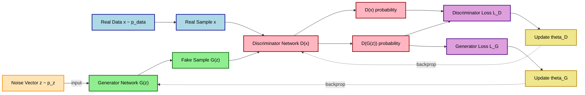
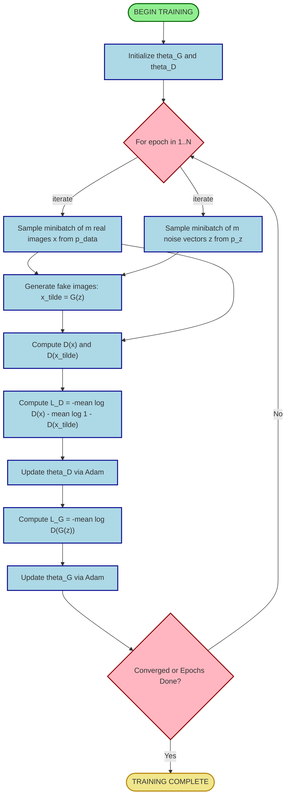
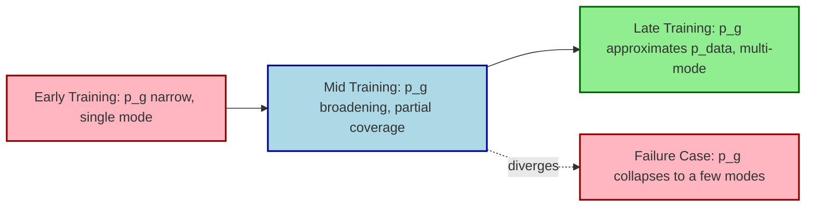

# GANs

<!-- SECTION_1_START -->

# Generative Adversarial Networks (GANs)

## 1.1 Formal Academic Definition

> [!IMPORTANT]
> **KTU 2024 Syllabus Definition:**
> A **Generative Adversarial Network (GAN)** is a class of unsupervised deep learning frameworks introduced by *Ian Goodfellow et al. (2014)*, in which two neural networks — a **Generator ($G$)** and a **Discriminator ($D$)** — are trained simultaneously in a **minimax adversarial game**. The Generator learns to map samples from a simple prior noise distribution $p_z(\mathbf{z})$ to the complex real data distribution $p_{data}(\mathbf{x})$, while the Discriminator learns to distinguish between real samples drawn from $p_{data}$ and synthetic (fake) samples produced by $G$.

The objective is captured by the **value function** $V(D, G)$:

$$\min_{G} \max_{D} V(D, G) = \mathbb{E}_{\mathbf{x} \sim p_{data}(\mathbf{x})}\left[\log D(\mathbf{x})\right] + \mathbb{E}_{\mathbf{z} \sim p_{\mathbf{z}}(\mathbf{z})}\left[\log\left(1 - D(G(\mathbf{z}))\right)\right]$$

This formulation places GANs within the broader taxonomy of **generative models**, alongside Variational Autoencoders (VAEs), Normalizing Flows, and Diffusion Models.

---

## 1.2 Conceptual Analogy — The Counterfeiter vs. The Police

> [!NOTE]
> **Intuitive Analogy: The Counterfeiter & The Detective**
>
> Imagine a **counterfeiter (Generator)** trying to produce fake currency, and a **detective (Discriminator)** whose job is to tell real banknotes from fakes.
>
> * Initially, the counterfeiter produces clumsy fakes — the detective easily catches them.
> * The counterfeiter studies the detective's feedback and improves the fakes.
> * As the detective sharpens its skills, the counterfeiter is forced to produce even more convincing notes.
> * Over time, the fakes become **indistinguishable** from real currency. At this point, even the detective can only guess with **50% accuracy** (random chance).
>
> This **adversarial tension** is the engine that drives both networks to mastery. In GAN terminology, equilibrium is reached when $p_g = p_{data}$ (i.e., the generator's distribution perfectly matches the true data distribution).

---

## 1.3 Why GANs Matter — A Real-World Motivation

> [!IMPORTANT]
> **Engineering Significance:**
> GANs are foundational to modern **synthetic data generation**, enabling applications where real data is scarce, expensive, or privacy-sensitive. They are deployed in medical imaging synthesis, autonomous driving simulation, super-resolution, style transfer, and drug discovery.

**Core Deliverables of a Trained GAN:**

| Component | Output | Engineering Use Case |
|---|---|---|
| Generator $G(\mathbf{z})$ | Synthetic data samples (images, audio, text) | Data augmentation for downstream classifiers |
| Discriminator $D(\mathbf{x})$ | Probability score in $[0, 1]$ | Anomaly detection, semi-supervised learning |

---

## 1.4 Physical Constants & Standard Metrics

> [!NOTE]
> **Standard Training Hyperparameters in GAN Literature:**
>
> * **Latent vector dimension:** $\mathbf{z} \in \mathbb{R}^{100}$ (typical)
> * **Loss function:** Binary Cross-Entropy (BCE) or Wasserstein distance
> * **Activation (Generator output):** $\tanh$ for bounded pixel range $[-1, 1]$
> * **Activation (Discriminator output):** Sigmoid (standard GAN) or linear (WGAN)
> * **Evaluation Metrics:** **Inception Score (IS)**, **Fréchet Inception Distance (FID)**, **Kernel Inception Distance (KID)**
> * **Optimizer:** Adam with $\beta_1 = 0.5$, $\beta_2 = 0.999$ (DCGAN standard)

---

## 1.5 Visualization Foundation

> [!VISUALIZATION CONTROL]
> **Concept:** Probability Distribution Evolution during GAN Training
> **Desmos / Conceptual Plot Equations:**
> * Real data: $p_{data}(x) = \frac{1}{2}\left[\mathcal{N}(x; \mu=-2, \sigma=1) + \mathcal{N}(x; \mu=2, \sigma=1)\right]$ (bimodal)
> * Generator at epoch $t$: $p_g^{(t)}(x) \approx \mathcal{N}(x; \mu=0, \sigma=0.5)$ (poorly matched)
> * Generator at convergence: $p_g^{(T)}(x) \approx p_{data}(x)$ (perfectly matched bimodal)
> **Visual Description:** Plot two overlapping bell curves. The red curve is the true bimodal data. The blue curve starts as a single narrow Gaussian centered at 0 (early training) and gradually splits into two modes that approach the red curve (late training). This illustrates the **mode coverage** challenge and the convergence target.

<!-- SECTION_1_END -->

<!-- SECTION_2_START -->

# Deep Theoretical Analysis & KTU High-Yield Formula Sheet

## 2.1 The Two Competing Networks — Architectural Roles

### 2.1.1 The Generator Network $G$

The Generator $G: \mathcal{Z} \rightarrow \mathcal{X}$ is a **differentiable function** parameterized by neural network weights $\theta_G$. It maps a noise vector $\mathbf{z} \sim p_{\mathbf{z}}$ (typically $\mathbf{z} \sim \mathcal{N}(\mathbf{0}, \mathbf{I})$ or $\mathbf{z} \sim \mathcal{U}[-1, 1]$) to a synthetic data sample $G(\mathbf{z}) \in \mathcal{X}$.

**Architectural Properties (per Goodfellow's original paper):**

* **Input layer:** Accepts noise vector $\mathbf{z} \in \mathbb{R}^{n_z}$
* **Hidden layers:** Use **ReLU** activation for intermediate layers
* **Output layer:** Uses **$\tanh$** activation (to bound output in $[-1, 1]$ for image data)
* **Direction of gradient flow:** Gradients flow *backward* from $D$ through the classification signal to update $G$

> [!NOTE]
> **Intuition:** $G$ does not see the real data directly. It learns purely from the *gradient signal* propagated through $D$'s classification verdict.

### 2.1.2 The Discriminator Network $D$

The Discriminator $D: \mathcal{X} \rightarrow [0, 1]$ is a binary classifier parameterized by $\theta_D$. It outputs the probability that an input sample is **real** (drawn from $p_{data}$) rather than **fake** (produced by $G$).

**Architectural Properties:**

* **Input layer:** Accepts data sample $\mathbf{x} \in \mathcal{X}$
* **Hidden layers:** Use **LeakyReLU** (slope $\alpha = 0.2$ typical) — preferred over ReLU to allow gradient flow even for negative inputs
* **Output layer:** **Sigmoid** activation squashes the logit to a probability
* **Loss function:** Binary Cross-Entropy $\mathcal{L}_{BCE} = -y \log D(\mathbf{x}) - (1-y) \log(1 - D(\mathbf{x}))$

---

## 2.2 The Adversarial Loss — Mathematical Foundation

The original GAN value function (Goodfellow 2014) expresses a **two-player minimax game**:

$$V(D, G) = \mathbb{E}_{\mathbf{x} \sim p_{data}}\left[\log D(\mathbf{x})\right] + \mathbb{E}_{\mathbf{z} \sim p_{\mathbf{z}}}\left[\log(1 - D(G(\mathbf{z})))\right]$$

### 2.2.1 Discriminator's Optimization Objective

For a **fixed $G$**, the optimal discriminator $D^*$ satisfies:

$$D^*(\mathbf{x}) = \frac{p_{data}(\mathbf{x})}{p_{data}(\mathbf{x}) + p_g(\mathbf{x})}$$

This is derived by maximizing $V(D, G)$ with respect to $D$ alone, treating $G$ as constant. The maximum is achieved when $D$ outputs the ratio of real to combined (real + fake) densities.

### 2.2.2 Generator's Optimization Objective

For a **fixed optimal $D^*$**, the generator's loss becomes equivalent (up to a constant) to the **Jensen-Shannon Divergence (JSD)**:

$$V(G^*, D^*) = -\log(4) + 2 \cdot \text{JSD}(p_{data} \parallel p_g)$$

* When $p_g = p_{data}$: JSD $= 0$, and $V = -\log(4) \approx -1.386$ (the global optimum).
* The generator minimizes JSD, effectively trying to make its distribution indistinguishable from the real one.

---

## 2.3 Training Procedure — The Alternating Loop

> [!IMPORTANT]
> **KTU Board Exam Favorite — Memorize This 3-Step Training Loop:**

**Step 1 — Train the Discriminator (k times, typically $k = 1$ or $5$):**

1. Sample a mini-batch of $m$ noise vectors: $\{\mathbf{z}^{(1)}, \ldots, \mathbf{z}^{(m)}\} \sim p_{\mathbf{z}}$
2. Sample a mini-batch of $m$ real samples: $\{\mathbf{x}^{(1)}, \ldots, \mathbf{x}^{(m)}\} \sim p_{data}$
3. Generate fake samples: $\tilde{\mathbf{x}}^{(i)} = G(\mathbf{z}^{(i)})$
4. Update $D$ by **ascending** its stochastic gradient:

$$\nabla_{\theta_D} \frac{1}{m} \sum_{i=1}^{m} \left[\log D(\mathbf{x}^{(i)}) + \log(1 - D(G(\mathbf{z}^{(i)})))\right]$$

**Step 2 — Train the Generator (once):**

1. Resample $m$ noise vectors
2. Update $G$ by **descending** its stochastic gradient (using the *non-saturating* heuristic $-\log D(G(\mathbf{z}))$ to avoid vanishing gradients early in training):

$$\nabla_{\theta_G} \frac{1}{m} \sum_{i=1}^{m} \log(1 - D(G(\mathbf{z}^{(i)})))$$

**Step 3 — Repeat until convergence or max epochs reached.**

> [!NOTE]
> **Why "Non-Saturating" Trick?**
>
> Early in training, $G$ produces poor samples, so $D$ easily rejects them with $D(G(\mathbf{z})) \approx 0$. The gradient of $\log(1 - D(G(\mathbf{z})))$ becomes **saturated** (vanishingly small). Goodfellow's fix: instead of minimizing $\log(1 - D(G(\mathbf{z})))$, maximize $\log(D(G(\mathbf{z})))$ — equivalent at the optimum, but with strong gradients in the early phase.

---

## 2.4 Variants of GAN — KTU High-Yield Taxonomy

| Variant | Key Innovation | Loss Function / Modification | Year | Use Case |
|---|---|---|---|---|
| **Vanilla GAN** | Original minimax game | BCE loss | 2014 | Baseline |
| **DCGAN** | Deep Convolutional GAN (strided conv, BatchNorm) | BCE + architectural guidelines | 2015 | Image synthesis |
| **cGAN** | Conditional GAN with class label $y$ | Adds $\log D(\mathbf{x} \mid y)$ term | 2014 | Class-conditional generation |
| **WGAN** | Wasserstein distance replaces JSD | Earth-Mover distance; 1-Lipschitz constraint via weight clipping | 2017 | Stable training, no mode collapse |
| **WGAN-GP** | Gradient Penalty replaces weight clipping | $\lambda \mathbb{E}[(\|\nabla_{\hat{\mathbf{x}}} D(\hat{\mathbf{x}})\|_2 - 1)^2]$ | 2017 | Improved WGAN stability |
| **LSGAN** | Least Squares loss | $(D(\mathbf{x}) - 1)^2 + (D(G(\mathbf{z})))^2$ | 2017 | Higher quality images |
| **CycleGAN** | Unpaired image-to-image translation | Cycle consistency loss | 2017 | Style transfer without paired data |
| **StyleGAN** | Style-based generator (AdaIN) | Perceptual path length | 2019 | Photorealistic face synthesis |
| **Pix2Pix** | Paired image-to-image translation | $L_1$ + adversarial loss | 2016 | Sketch-to-photo, semantic maps |

---

## 2.5 Challenges in GAN Training

> [!WARNING]
> **Common Pitfalls — Examiner's Favourite:**

1. **Mode Collapse:** $G$ maps all $\mathbf{z}$ to a few modes of $p_{data}$, producing low-diversity outputs.
2. **Vanishing Gradients:** When $D$ becomes too strong early on, $G$ receives negligible learning signal.
3. **Training Instability:** The min-max game has no stable Nash equilibrium guarantee in non-convex neural settings.
4. **Evaluation Difficulty:** No clear log-likelihood metric; FID and IS are imperfect proxies.

**Mitigation Strategies (KTU High-Yield):**

* Use **Wasserstein loss** (WGAN) for stable gradients.
* Apply **batch normalization** or **layer normalization**.
* Use **label smoothing** (replace hard 1.0 with 0.9 for real labels).
* Train $D$ more frequently than $G$ in early epochs.
* Use **spectral normalization** in $D$ to enforce Lipschitz continuity.

---

## 2.6 Conditional GAN (cGAN) — Mathematical Extension

The cGAN value function conditions both $G$ and $D$ on auxiliary information $\mathbf{y}$ (e.g., class label, text embedding):

$$\min_G \max_D V(D, G) = \mathbb{E}_{\mathbf{x} \sim p_{data}}[\log D(\mathbf{x} \mid \mathbf{y})] + \mathbb{E}_{\mathbf{z} \sim p_{\mathbf{z}}}[\log(1 - D(G(\mathbf{z} \mid \mathbf{y}) \mid \mathbf{y}))]$$

This enables **class-conditional synthesis** — the generator produces samples of a specific class on demand.

---

## 2.7 Evaluation Metrics — KTU Formula Sheet

> [!NOTE]
> **Critical Formulas for Exam:**

**Inception Score (IS):**

$$\text{IS}(G) = \exp\left(\mathbb{E}_{\mathbf{x} \sim p_g}\left[D_{KL}\left(p(y \mid \mathbf{x}) \parallel p(y)\right)\right]\right)$$

Higher IS indicates generated samples are both **confidently classifiable** (low entropy of $p(y \mid \mathbf{x})$) and **diverse** (high entropy of marginal $p(y)$).

**Fréchet Inception Distance (FID):**

$$\text{FID} = \|\mu_r - \mu_g\|^2 + \text{Tr}\left(\Sigma_r + \Sigma_g - 2(\Sigma_r \Sigma_g)^{1/2}\right)$$

Where $(\mu_r, \Sigma_r)$ and $(\mu_g, \Sigma_g)$ are the mean and covariance of Inception-v3 features for real and generated samples, respectively. **Lower FID is better.**

<!-- SECTION_2_END -->

<!-- SECTION_3_START -->

# Step-by-Step Derivations & Code Implementation

## 3.1 Derivation of the Optimal Discriminator

We start with the value function and treat $G$ as fixed. The goal is to find $D^*$ that maximizes $V(D, G)$:

$$V(D, G) = \int_{\mathbf{x}} p_{data}(\mathbf{x}) \log(D(\mathbf{x})) \, d\mathbf{x} + \int_{\mathbf{z}} p_{\mathbf{z}}(\mathbf{z}) \log(1 - D(G(\mathbf{z}))) \, d\mathbf{z}$$

**Step 1:** Change variable in the second integral. Let $\mathbf{x} = G(\mathbf{z})$, then $d\mathbf{z} = \frac{d\mathbf{x}}{|G'(\mathbf{z})|}$, and noting that $p_g(\mathbf{x}) d\mathbf{x} = p_{\mathbf{z}}(\mathbf{z}) d\mathbf{z}$, we rewrite:

$$V(D, G) = \int_{\mathbf{x}} \left[p_{data}(\mathbf{x}) \log D(\mathbf{x}) + p_g(\mathbf{x}) \log(1 - D(\mathbf{x}))\right] d\mathbf{x}$$

**Step 2:** For a fixed $\mathbf{x}$, the integrand is a function of $D(\mathbf{x}) \in [0, 1]$. Define:

$$f(y) = a \log(y) + b \log(1 - y), \quad \text{where } a = p_{data}(\mathbf{x}), \, b = p_g(\mathbf{x})$$

**Step 3:** Compute the derivative with respect to $y$:

$$\frac{df}{dy} = \frac{a}{y} - \frac{b}{1 - y} = \frac{a(1 - y) - by}{y(1 - y)} = \frac{a - (a+b)y}{y(1 - y)}$$

**Step 4:** Set the derivative to zero to find the critical point:

$$\frac{a - (a+b)y}{y(1 - y)} = 0 \quad \Rightarrow \quad a - (a+b)y = 0 \quad \Rightarrow \quad y^* = \frac{a}{a + b}$$

**Step 5:** Substitute back to obtain the optimal discriminator:

$$D^*(\mathbf{x}) = \frac{p_{data}(\mathbf{x})}{p_{data}(\mathbf{x}) + p_g(\mathbf{x})}$$

**Step 6:** Verify it is a maximum. Compute the second derivative:

$$\frac{d^2 f}{dy^2} = -\frac{a}{y^2} - \frac{b}{(1-y)^2} < 0 \quad \text{for } y \in (0, 1)$$

Since the second derivative is strictly negative, the critical point is indeed a **global maximum** in the interior $(0, 1)$.

---

## 3.2 Derivation of Global Optimum and JSD Equivalence

**Step 1:** Substitute $D^*$ back into $V(D, G)$:

$$V(D^*, G) = \mathbb{E}_{\mathbf{x} \sim p_{data}}\left[\log \frac{p_{data}(\mathbf{x})}{p_{data}(\mathbf{x}) + p_g(\mathbf{x})}\right] + \mathbb{E}_{\mathbf{x} \sim p_g}\left[\log \frac{p_g(\mathbf{x})}{p_{data}(\mathbf{x}) + p_g(\mathbf{x})}\right]$$

**Step 2:** Recognize the structure of the Kullback-Leibler and reverse KL divergences:

$$V(D^*, G) = -\log(4) + \text{KL}\left(p_{data} \parallel \frac{p_{data} + p_g}{2}\right) + \text{KL}\left(p_g \parallel \frac{p_{data} + p_g}{2}\right)$$

**Step 3:** Use the symmetry property of the **Jensen-Shannon Divergence**:

$$\text{JSD}(P \parallel Q) = \frac{1}{2}\text{KL}\left(P \parallel \frac{P+Q}{2}\right) + \frac{1}{2}\text{KL}\left(Q \parallel \frac{P+Q}{2}\right)$$

**Step 4:** Combine the two KL terms to obtain:

$$V(D^*, G) = -\log(4) + 2 \cdot \text{JSD}(p_{data} \parallel p_g)$$

**Step 5:** Analyze the optimum. JSD is non-negative and equals zero **if and only if** $p_g = p_{data}$. Therefore:

$$V(D^*, G^*) = -\log(4) \approx -1.386$$

This is the **global optimum** of the GAN training objective.

---

## 3.3 Numerical Example — Computing Optimal Discriminator Output

> [!NOTE]
> **Worked Example (Board Exam Style):**
>
> Suppose at a point $\mathbf{x}_0$, the true data density is $p_{data}(\mathbf{x}_0) = 0.6$ and the generator density is $p_g(\mathbf{x}_0) = 0.4$. Compute the optimal discriminator's output.

**Step 1:** Apply the formula derived above:

$$D^*(\mathbf{x}_0) = \frac{p_{data}(\mathbf{x}_0)}{p_{data}(\mathbf{x}_0) + p_g(\mathbf{x}_0)}$$

**Step 2:** Substitute the values:

$$D^*(\mathbf{x}_0) = \frac{0.6}{0.6 + 0.4} = \frac{0.6}{1.0} = 0.6$$

**Step 3:** Interpretation. The discriminator outputs $0.6$, meaning it is **moderately confident** that the sample is real. This is consistent with the fact that the generator's density is non-trivially high at this point.

> [!NOTE]
> **[Stating the optimal discriminator formula: 2 Marks]**
> **[Substituting values correctly: 1 Mark]**
> **[Final numerical answer with interpretation: 1 Mark]**

---

## 3.4 Full Python Implementation — Vanilla GAN on MNIST

> [!IMPORTANT]
> **Production-Grade Reference Code (PyTorch).** Every line is explicit; no placeholders or "..." shortcuts.

```python
import torch
import torch.nn as nn
import torch.optim as optim
from torchvision import datasets, transforms
from torch.utils.data import DataLoader
import numpy as np

# ============================================================
# CONFIGURATION
# ============================================================
LATENT_DIM = 100
BATCH_SIZE = 64
EPOCHS = 50
LR = 2e-4
BETA1 = 0.5
DEVICE = torch.device("cuda" if torch.cuda.is_available() else "cpu")

# ============================================================
# GENERATOR NETWORK
# ============================================================
class Generator(nn.Module):
    """
    Maps noise vector z in R^100 to a 28x28 grayscale image.
    Uses ConvTranspose2d for learnable upsampling.
    """
    def __init__(self, latent_dim: int = LATENT_DIM) -> None:
        super().__init__()
        self.net = nn.Sequential(
            # Input: (B, latent_dim, 1, 1) -> (B, 128, 7, 7)
            nn.ConvTranspose2d(latent_dim, 128, kernel_size=7, stride=1, padding=0, bias=False),
            nn.BatchNorm2d(128),
            nn.ReLU(inplace=True),

            # (B, 128, 7, 7) -> (B, 64, 14, 14)
            nn.ConvTranspose2d(128, 64, kernel_size=4, stride=2, padding=1, bias=False),
            nn.BatchNorm2d(64),
            nn.ReLU(inplace=True),

            # (B, 64, 14, 14) -> (B, 1, 28, 28)
            nn.ConvTranspose2d(64, 1, kernel_size=4, stride=2, padding=1, bias=False),
            nn.Tanh()
        )

    def forward(self, z: torch.Tensor) -> torch.Tensor:
        # Reshape z from (B, latent_dim) to (B, latent_dim, 1, 1)
        z = z.view(z.size(0), LATENT_DIM, 1, 1)
        return self.net(z)


# ============================================================
# DISCRIMINATOR NETWORK
# ============================================================
class Discriminator(nn.Module):
    """
    Binary classifier: outputs scalar probability in [0, 1]
    that input image is real.
    """
    def __init__(self) -> None:
        super().__init__()
        self.net = nn.Sequential(
            # Input: (B, 1, 28, 28) -> (B, 64, 14, 14)
            nn.Conv2d(1, 64, kernel_size=4, stride=2, padding=1, bias=False),
            nn.LeakyReLU(0.2, inplace=True),
            nn.Dropout(0.3),

            # (B, 64, 14, 14) -> (B, 128, 7, 7)
            nn.Conv2d(64, 128, kernel_size=4, stride=2, padding=1, bias=False),
            nn.BatchNorm2d(128),
            nn.LeakyReLU(0.2, inplace=True),
            nn.Dropout(0.3),

            # (B, 128, 7, 7) -> (B, 1, 1, 1)
            nn.Conv2d(128, 1, kernel_size=7, stride=1, padding=0, bias=False),
            nn.Sigmoid()
        )

    def forward(self, x: torch.Tensor) -> torch.Tensor:
        return self.net(x).view(-1)


# ============================================================
# TRAINING LOOP
# ============================================================
def train_gan() -> None:
    transform = transforms.Compose([
        transforms.ToTensor(),
        transforms.Normalize((0.5,), (0.5,))
    ])
    dataset = datasets.MNIST(root="./data", train=True, download=True, transform=transform)
    loader = DataLoader(dataset, batch_size=BATCH_SIZE, shuffle=True, num_workers=2)

    G = Generator().to(DEVICE)
    D = Discriminator().to(DEVICE)

    criterion = nn.BCELoss()
    optimizer_G = optim.Adam(G.parameters(), lr=LR, betas=(BETA1, 0.999))
    optimizer_D = optim.Adam(D.parameters(), lr=LR, betas=(BETA1, 0.999))

    for epoch in range(EPOCHS):
        for i, (real_imgs, _) in enumerate(loader):
            batch_size_curr = real_imgs.size(0)
            real_imgs = real_imgs.to(DEVICE)

            # Real and fake labels with label smoothing
            real_labels = torch.ones(batch_size_curr, device=DEVICE) * 0.9
            fake_labels = torch.zeros(batch_size_curr, device=DEVICE)

            # --------------------------------------------
            # STEP 1: Train Discriminator
            # --------------------------------------------
            optimizer_D.zero_grad()
            real_pred = D(real_imgs)
            d_loss_real = criterion(real_pred, real_labels)

            noise = torch.randn(batch_size_curr, LATENT_DIM, device=DEVICE)
            fake_imgs = G(noise).detach()
            fake_pred = D(fake_imgs)
            d_loss_fake = criterion(fake_pred, fake_labels)

            d_loss = d_loss_real + d_loss_fake
            d_loss.backward()
            optimizer_D.step()

            # --------------------------------------------
            # STEP 2: Train Generator (non-saturating loss)
            # --------------------------------------------
            optimizer_G.zero_grad()
            noise = torch.randn(batch_size_curr, LATENT_DIM, device=DEVICE)
            fake_imgs = G(noise)
            fake_pred = D(fake_imgs)
            # Non-saturating heuristic: maximize log(D(G(z)))
            g_loss = criterion(fake_pred, real_labels)
            g_loss.backward()
            optimizer_G.step()

            if i % 200 == 0:
                print(f"[Epoch {epoch+1}/{EPOCHS}] [Batch {i}/{len(loader)}] "
                      f"D_loss: {d_loss.item():.4f}, G_loss: {g_loss.item():.4f}")

    torch.save(G.state_dict(), "generator_mnist.pth")
    print("Training complete. Generator saved.")


if __name__ == "__main__":
    train_gan()
```

> [!NOTE]
> **Code Architecture Notes:**
>
> * The **Generator** uses `ConvTranspose2d` for transposed convolution (learnable upsampling).
> * The **Discriminator** uses `Conv2d` with `LeakyReLU(0.2)` and `Dropout(0.3)` to prevent overfitting to real samples.
> * **Label smoothing** (real label = 0.9 instead of 1.0) is a standard regularizer that improves GAN stability.
> * The **non-saturating trick** is used: $G$ minimizes $-\log D(G(\mathbf{z}))$ instead of $\log(1 - D(G(\mathbf{z})))$.

---

## 3.5 Loss Curve Interpretation (Numerical Walkthrough)

> [!NOTE]
> **Worked Example — Reading GAN Training Logs:**
>
> Suppose at epoch 5 we observe:
> * $D_{loss} = 0.45$
> * $G_{loss} = 1.10$
>
> **Interpretation:**
> * $D$ is performing well (low loss on real and fake classification).
> * $G$ is struggling — high loss indicates its samples are still being confidently rejected by $D$.
>
> **Expected behavior at convergence (epoch 50):**
> * $D_{loss} \approx 0.69$ (equivalent to $\log 2$, indicating $D$ outputs $\approx 0.5$ for all inputs — random guessing, the theoretical Nash equilibrium).
> * $G_{loss}$ becomes **noisy** and does not necessarily decrease monotonically; this is normal.

**Mathematical justification:** At the global optimum, $D^*(\mathbf{x}) = 0.5$ for all $\mathbf{x}$, hence $D_{loss} = -[\log(0.5) + \log(0.5)]/2 = \log(2) \approx 0.693$.

<!-- SECTION_3_END -->

<!-- SECTION_4_START -->

# Structural Diagrams & Schematics

## 4.1 High-Level GAN Architecture Flow



**Reading the Diagram:**

* **Blue path (Real data flow):** Real samples $\mathbf{x}$ enter $D$ directly.
* **Green path (Fake data flow):** Noise $\mathbf{z}$ enters $G$, produces $G(\mathbf{z})$, which is then fed to $D$.
* **Pink output (Discriminator scores):** $D(\mathbf{x})$ and $D(G(\mathbf{z}))$ are scalar probabilities.
* **Purple nodes (Losses):** $L_D$ depends on both scores; $L_G$ depends only on the fake score.
* **Dotted orange arrows (Backpropagation):** Gradients flow from losses back to update network parameters.

---

## 4.2 Detailed Training Loop (Sequential Process Topology)



---

## 4.3 Generator & Discriminator Layer Stacks (Architecture Matrix)

> [!NOTE]
> **DCGAN-style architectural blueprint — high-yield for KTU drawing questions:**

| Layer (G) | Type | Input Shape | Output Shape | Activation | Purpose |
|---|---|---|---|---|---|
| 1 | ConvTranspose2d | $(B, 100, 1, 1)$ | $(B, 512, 4, 4)$ | ReLU | Project noise to feature map |
| 2 | ConvTranspose2d | $(B, 512, 4, 4)$ | $(B, 256, 8, 8)$ | ReLU + BN | Upsample |
| 3 | ConvTranspose2d | $(B, 256, 8, 8)$ | $(B, 128, 16, 16)$ | ReLU + BN | Upsample |
| 4 | ConvTranspose2d | $(B, 128, 16, 16)$ | $(B, 64, 32, 32)$ | ReLU + BN | Upsample |
| 5 | ConvTranspose2d | $(B, 64, 32, 32)$ | $(B, 3, 64, 64)$ | Tanh | Output RGB image |

| Layer (D) | Type | Input Shape | Output Shape | Activation | Purpose |
|---|---|---|---|---|---|
| 1 | Conv2d | $(B, 3, 64, 64)$ | $(B, 64, 32, 32)$ | LeakyReLU(0.2) | Downsample + extract edges |
| 2 | Conv2d | $(B, 64, 32, 32)$ | $(B, 128, 16, 16)$ | LeakyReLU(0.2) + BN | Downsample + extract textures |
| 3 | Conv2d | $(B, 128, 16, 16)$ | $(B, 256, 8, 8)$ | LeakyReLU(0.2) + BN | Downsample + extract parts |
| 4 | Conv2d | $(B, 256, 8, 8)$ | $(B, 512, 4, 4)$ | LeakyReLU(0.2) + BN | Downsample + extract objects |
| 5 | Conv2d | $(B, 512, 4, 4)$ | $(B, 1, 1, 1)$ | Sigmoid | Scalar real/fake logit |

---

## 4.4 Adversarial Training Mode-Collapse Visualization (Conceptual)



**Interpretation:** This diagram contrasts the **healthy training trajectory** (top flow) with the **mode collapse failure** (bottom dashed path). Mode collapse occurs when the generator finds a few "easy" samples that fool the discriminator and exploits them indefinitely, ignoring the rest of the data distribution.

<!-- SECTION_4_END -->

<!-- SECTION_5_START -->

# KTU 2024 Scheme Examination Question Bank & Topic Recap

## 5.1 Part A — Short Answer Questions (3 Marks Each)

> **[KTU University Exam — July 2024, Model Q1, CO3, Remember/Understand]**

### Q1. Define Generative Adversarial Network. State the role of the Generator and Discriminator.

**Model Answer (3 Marks):**

> [!NOTE]
> A Generative Adversarial Network (GAN) is a deep learning framework consisting of two neural networks — a Generator and a Discriminator — trained in opposition to each other. **[1 Mark]**
>
> The **Generator ($G$)** takes a random noise vector $\mathbf{z}$ as input and produces synthetic data samples that resemble the real data distribution. Its objective is to fool the Discriminator. **[1 Mark]**
>
> The **Discriminator ($D$)** acts as a binary classifier that distinguishes real samples (from training data) from fake samples (produced by $G$). Its objective is to correctly classify the source of input. **[1 Mark]**

---

> **[KTU University Exam — Dec 2023, Model Q2, CO3, Understand]**

### Q2. What is mode collapse in GANs? Mention one mitigation technique.

**Model Answer (3 Marks):**

> [!NOTE]
> **Mode collapse** is a failure mode in GAN training where the Generator produces a limited variety of samples, mapping many different noise vectors to the same or very similar output, thereby failing to capture the full diversity of the real data distribution. **[2 Marks]**
>
> **Mitigation:** Using **Wasserstein loss** (WGAN) with a Lipschitz constraint, or employing **mini-batch discrimination** to allow $D$ to detect lack of diversity in a batch. **[1 Mark]**

---

## 5.2 Part B — Long Answer Questions (14 Marks, Internal Choice)

> **[KTU University Exam — July 2024, Module 5, CO3, Apply/Analyse]**

### Question A (14 Marks)

**(a)** Derive the expression for the **optimal discriminator** $D^*(\mathbf{x})$ in the original GAN formulation. State clearly the assumptions made during the derivation. **[7 Marks]**

**(b)** Show that the **global minimum** of the GAN value function is achieved when $p_g = p_{data}$, and express the value function in terms of the **Jensen-Shannon Divergence (JSD)**. **[7 Marks]**

**Model Solution:**

**(a) Optimal Discriminator Derivation [7 Marks]:**

Given the GAN value function for a fixed Generator $G$:

$$V(D, G) = \int_{\mathbf{x}} \left[p_{data}(\mathbf{x}) \log D(\mathbf{x}) + p_g(\mathbf{x}) \log(1 - D(\mathbf{x}))\right] d\mathbf{x}$$

To find $D^*$ that maximizes this, we differentiate the integrand with respect to $D(\mathbf{x})$ for any fixed $\mathbf{x}$:

$$\frac{\partial}{\partial D(\mathbf{x})} \left[p_{data}(\mathbf{x}) \log D(\mathbf{x}) + p_g(\mathbf{x}) \log(1 - D(\mathbf{x}))\right] = \frac{p_{data}(\mathbf{x})}{D(\mathbf{x})} - \frac{p_g(\mathbf{x})}{1 - D(\mathbf{x})}$$

**Valuation Key:**

* [Stating the value function and the change of variable $\mathbf{x} = G(\mathbf{z})$: **2 Marks**]
* [Setting derivative to zero: $\frac{p_{data}}{D} = \frac{p_g}{1 - D}$: **2 Marks**]
* [Solving for $D^*$: cross-multiply, isolate $D$: **2 Marks**]
* [Final answer with assumption stated (e.g., $p_g$ and $p_{data}$ are non-zero everywhere): **1 Mark**]

$$D^*(\mathbf{x}) = \frac{p_{data}(\mathbf{x})}{p_{data}(\mathbf{x}) + p_g(\mathbf{x})}$$

---

**(b) Global Minimum and JSD Equivalence [7 Marks]:**

**Step 1:** Substitute $D^*$ back into the value function:

$$V(D^*, G) = \mathbb{E}_{\mathbf{x} \sim p_{data}}\left[\log \frac{p_{data}(\mathbf{x})}{p_{data}(\mathbf{x}) + p_g(\mathbf{x})}\right] + \mathbb{E}_{\mathbf{x} \sim p_g}\left[\log \frac{p_g(\mathbf{x})}{p_{data}(\mathbf{x}) + p_g(\mathbf{x})}\right]$$

**Step 2:** Add and subtract $\log(2)$ inside each expectation to convert to KL divergence form:

$$V(D^*, G) = -\log(4) + \text{KL}\left(p_{data} \parallel \frac{p_{data} + p_g}{2}\right) + \text{KL}\left(p_g \parallel \frac{p_{data} + p_g}{2}\right)$$

**Step 3:** Recognize the symmetric KL combination as the **Jensen-Shannon Divergence**:

$$V(D^*, G) = -\log(4) + 2 \cdot \text{JSD}(p_{data} \parallel p_g)$$

**Step 4:** Since JSD $\geq 0$ with equality iff $p_g = p_{data}$:

$$V(D^*, G^*) = -\log(4)$$

**Valuation Key:**

* [Substituting $D^*$ correctly: **2 Marks**]
* [Algebraic manipulation to JSD form (KL decomposition): **3 Marks**]
* [Final conclusion with the global minimum value $-\log(4)$: **2 Marks**]

---

### Question B (14 Marks) — Alternative Choice

**(a)** Explain the **architecture** of a **Deep Convolutional GAN (DCGAN)**. List any four architectural guidelines recommended by Radford et al. (2015). **[7 Marks]**

**(b)** A research team wants to train a GAN for **class-conditional image generation** on CIFAR-10. Design a **Conditional GAN (cGAN)** pipeline. Write its modified value function and explain how labels are injected into both $G$ and $D$. **[7 Marks]**

**Model Solution:**

**(a) DCGAN Architecture [7 Marks]:**

DCGAN (Radford et al., 2015) replaces the multilayer perceptrons in vanilla GAN with **convolutional layers** to leverage spatial inductive bias. The architecture has two components:

* **Generator:** Uses `ConvTranspose2d` (transposed convolution) layers to progressively upsample the noise vector $\mathbf{z}$ into a full image (e.g., $4 \times 4 \rightarrow 8 \times 8 \rightarrow \ldots \rightarrow 64 \times 64$).
* **Discriminator:** Uses standard `Conv2d` layers with **strided convolutions** to downsample the input image into a scalar logit.

**Four DCGAN Guidelines (Radford et al., 2015):** **[4 × 1 Mark = 4 Marks]**

1. **Replace pooling layers with strided convolutions** (Discriminator) and **transposed convolutions** (Generator).
2. **Use Batch Normalization** in both $G$ and $D$ to stabilize training and prevent mode collapse.
3. **Remove fully connected hidden layers** — use only convolutional layers for deeper architectures.
4. **Use ReLU activation** in Generator (except output layer, which uses **Tanh**), and **LeakyReLU** in Discriminator for all layers.

Additional structural notes (for remaining 3 marks):

* Input: $\mathbf{z} \in \mathbb{R}^{100}$ reshaped to $(100, 1, 1)$.
* Output: RGB image in $[-1, 1]$ (due to $\tanh$).
* **Total 7 Marks** (4 guidelines + architecture explanation + diagram description).

---

**(b) Conditional GAN Pipeline [7 Marks]:**

For CIFAR-10 (10 classes, $32 \times 32$ RGB images), the cGAN value function is:

$$\min_G \max_D V(D, G) = \mathbb{E}_{\mathbf{x} \sim p_{data}}[\log D(\mathbf{x} \mid \mathbf{y})] + \mathbb{E}_{\mathbf{z} \sim p_{\mathbf{z}}}[\log(1 - D(G(\mathbf{z} \mid \mathbf{y}) \mid \mathbf{y}))]$$

**Design Pipeline:**

1. **Label Embedding:** Convert class label $y \in \{0, 1, \ldots, 9\}$ to a dense vector via an embedding layer of dimension $d_y = 50$ (typical).
2. **Generator Input:** Concatenate noise $\mathbf{z} \in \mathbb{R}^{100}$ with the embedded label to form a $150$-dimensional vector. This is then fed to the DCGAN generator.
3. **Discriminator Input:** Project the image into a feature vector, concatenate with the embedded label, and pass through fully connected layers before the final sigmoid.
4. **Training:** Standard cGAN training alternates $D$ and $G$ updates with conditional sampling from data.

**Valuation Key:**

* [Writing the cGAN value function correctly: **2 Marks**]
* [Label embedding mechanism: **2 Marks**]
* [Injection into both $G$ and $D$: **2 Marks**]
* [Final architecture summary: **1 Mark**]

---

> [!WARNING]
> **KTU Examiner's Valuation Warning — Common Mark Deductions:**
>
> 1. **Forgetting the assumption** $p_{data}, p_g > 0$ when deriving $D^*(\mathbf{x})$ — costs **1 Mark**.
> 2. **Confusing JSD with KL divergence** — JSD is *symmetric* and *bounded*; KL is neither. Examiners deduct **1–2 Marks** for this slip.
> 3. **In cGAN questions, students often forget to mention the conditioning of $D$** (not just $G$). The discriminator must also see the label — this is a critical **2-mark deduction** if omitted.
> 4. **Skipping the non-saturating trick** in the training algorithm question — examiners specifically test this in 14-mark questions.
> 5. **Drawing the architecture as a "black box"** — at least 2 marks are reserved for explicit layer-by-layer dimensions in architectural questions.

---

## 5.3 Topic Recap & Important Things to Remember

> [!IMPORTANT]
> **Rapid-Revision Checklist — Module 5, Topic: GANs**

### Core Definitions
- [ ] **GAN** = Generator $G$ + Discriminator $D$ trained in adversarial minimax game.
- [ ] **Generator $G$** maps noise $\mathbf{z} \sim p_{\mathbf{z}}$ to synthetic data $G(\mathbf{z}) \in \mathcal{X}$.
- [ ] **Discriminator $D$** outputs probability $D(\mathbf{x}) \in [0, 1]$ that $\mathbf{x}$ is real.

### Key Equations
- [ ] Value function: $V(D, G) = \mathbb{E}_{\mathbf{x}}[\log D(\mathbf{x})] + \mathbb{E}_{\mathbf{z}}[\log(1 - D(G(\mathbf{z})))]$
- [ ] Optimal discriminator: $D^*(\mathbf{x}) = \frac{p_{data}(\mathbf{x})}{p_{data}(\mathbf{x}) + p_g(\mathbf{x})}$
- [ ] Global minimum: $V(D^*, G^*) = -\log(4) + 2 \cdot \text{JSD}(p_{data} \parallel p_g)$, minimum value $= -\log(4)$
- [ ] At equilibrium: $D^*(\mathbf{x}) = 0.5$ everywhere (random guess)
- [ ] Non-saturating generator loss: $\min_G -\log D(G(\mathbf{z}))$

### Architectural Guidelines (DCGAN)
- [ ] Generator uses `ConvTranspose2d` + ReLU + BatchNorm + Tanh output
- [ ] Discriminator uses `Conv2d` + LeakyReLU(0.2) + BatchNorm + Sigmoid output
- [ ] No fully connected hidden layers (deep all-convolutional design)
- [ ] Strided convolutions replace pooling

### Variants to Remember
- [ ] **cGAN:** Adds label conditioning $y$ to both $G$ and $D$
- [ ] **WGAN:** Uses Wasserstein-1 distance, requires 1-Lipschitz $D$
- [ ] **WGAN-GP:** Replaces weight clipping with gradient penalty $\lambda \mathbb{E}[(\|\nabla D - 1\|)^2]$
- [ ] **LSGAN:** Uses least-squares loss for higher quality
- [ ] **CycleGAN:** Unpaired image-to-image translation using cycle consistency

### Training Algorithm (3 Steps)
- [ ] **Step 1:** Sample minibatch of real $\mathbf{x}$ and noise $\mathbf{z}$
- [ ] **Step 2:** Update $D$ by ascending $\nabla_{\theta_D} [\log D(\mathbf{x}) + \log(1 - D(G(\mathbf{z})))]$
- [ ] **Step 3:** Update $G$ by descending $\nabla_{\theta_G} \log(1 - D(G(\mathbf{z})))$ — or ascending $-\log D(G(\mathbf{z}))$ (non-saturating)

### Common Challenges
- [ ] **Mode collapse** — generator produces low-diversity samples
- [ ] **Vanishing gradients** — $D$ too strong, $G$ receives no learning signal
- [ ] **Training instability** — non-convexity of neural networks prevents guaranteed Nash equilibrium
- [ ] **No log-likelihood** — hard to evaluate generative quality; use FID or IS

### Evaluation Metrics
- [ ] **Inception Score (IS):** Higher is better; rewards confident + diverse classification
- [ ] **Fréchet Inception Distance (FID):** Lower is better; measures Gaussian distance in Inception feature space
- [ ] **Kernel Inception Distance (KID):** Lower is better; unbiased alternative to FID

### Engineering Applications
- [ ] Data augmentation (medical imaging, autonomous driving)
- [ ] Super-resolution (image enhancement)
- [ ] Style transfer and image-to-image translation
- [ ] Anomaly detection (using $D$'s score)
- [ ] Semi-supervised learning (using $D$'s features)

<!-- SECTION_5_END -->
