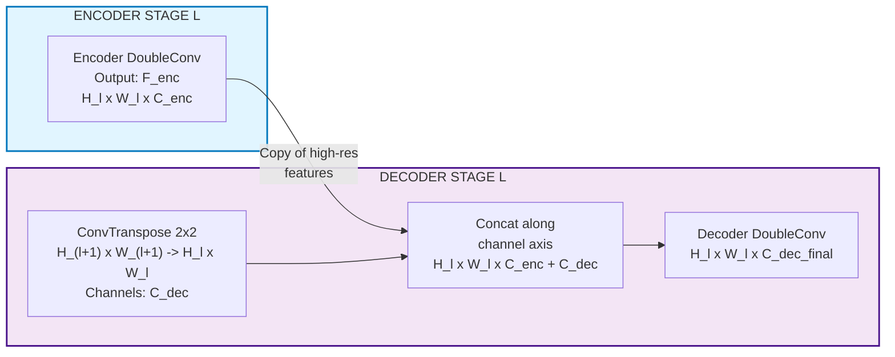
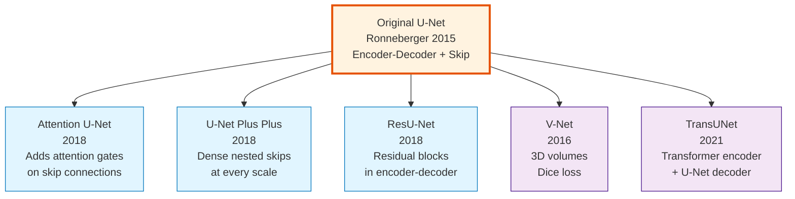

# U-Net

<!-- SECTION_1_START -->
# U-Net: Core Technical Definition & Intuitive Overview

## Formal Academic Definition (KTU 2024 Syllabus Terminology)

**U-Net** is a *symmetric encoder-decoder convolutional neural network architecture* designed for **semantic image segmentation**, originally proposed by Ronneberger et al. (2015) for biomedical image segmentation. The defining characteristic is its **U-shaped topology**, composed of a **contracting path** (encoder/analysis path) that captures contextual information through successive downsampling, and a **symmetric expanding path** (decoder/synthesis path) that enables precise spatial localization through successive upsampling. The two paths are bridged by **skip (concatenation) connections** that transfer high-resolution feature maps from the encoder directly to the corresponding decoder level, thereby preserving fine-grained spatial details lost during downsampling.

In the **KTU 2024 Scheme (PECST86A — Deep Learning & Computer Vision)** framework, U-Net is classified as a **Fully Convolutional Network (FCN)** variant and serves as the foundational backbone for nearly all modern segmentation architectures, including **V-Net, Attention U-Net, U-Net++, and ResU-Net**.

> [!IMPORTANT]
> **Syllabus Highlight (PECST86A — Module 5):**
> U-Net is the canonical architecture for **pixel-wise dense prediction tasks**. Unlike classification networks (which output a single label per image), U-Net outputs a **segmentation map** of the same spatial resolution as the input, where every pixel is classified.

---

## Conceptual Analogy / Intuition

Imagine you are a **medical radiologist** examining an X-ray to locate a tumor.

1. **First**, you scan the *entire image quickly* to get a "big picture" — *Is something abnormal? Where roughly?* — This is the **contracting path** (encoder), which sacrifices spatial precision for **contextual understanding**.
2. **Then**, you *zoom in carefully* to outline the **exact pixel-level boundary** of the tumor — *Is it 2 pixels or 20 pixels wide?* — This is the **expanding path** (decoder), which restores spatial resolution.
3. **However**, while zooming in, you don't forget what you saw at the high level. You keep a *mental note* of the rough tumor location from step 1 and combine it with the fine edges from step 2. This is exactly what **skip connections** do — they let the decoder "remember" the high-resolution features from the encoder.

> [!NOTE]
> **Key Insight:** The skip connections are what make U-Net special. Without them, upsampling alone cannot recover the fine details lost during max-pooling, leading to blurry, imprecise segmentations.

---

## Core Architectural Properties (KTU Board-Examiner Frequently Tested)

| Property | Value | Significance |
|----------|-------|--------------|
| Input size (paper) | $572 \times 572$ | Patch-based training to fit GPU memory |
| Output size (paper) | $388 \times 388$ | Slightly smaller due to **valid** convolutions |
| Depth | **4 pooling stages** | Total of **23 convolutional layers** |
| Filter doubling | $64 \to 128 \to 256 \to 512 \to 1024$ | Exponential channel growth |
| Skip connection | **Concatenation** (not addition) | Preserves both feature sets |
| Loss function | **Pixel-wise cross-entropy + weighted map** | Handles class imbalance (e.g., tiny cells) |
| Padding (original) | **No padding** (valid convolutions) | Forces overlap-tile strategy |
| Padding (modern) | Same padding | Allows arbitrary input sizes |

> [!VISUALIZATION CONTROL]
> **Concept:** U-Net Feature Map Dimensions Along the Encoder-Decoder Path
> **GeoGebra / Desmos Input Equations (illustrative plot of feature map sizes):**
> * Encoder sizes: $(572, 284, 140, 68, 32)$
> * Decoder sizes: $(32, 68, 140, 284, 388)$
> * Plot these as points on a coordinate grid with x = stage, y = spatial resolution.
> **Visual Description:** The graph should form a symmetric **U-shape** (or V-shape) — sharp drop on the left (downsampling) and sharp rise on the right (upsampling), with the bottleneck at the bottom. This visually confirms the "U" in U-Net.

---

## Architectural Overview Diagram (Conceptual Block Layout)

```
                INPUT IMAGE (H × W × 3)
                        │
        ┌───────────────▼───────────────┐
        │   ENCODER (Contracting Path)  │
        │   Conv→Conv→MaxPool          │
        │   64 → 128 → 256 → 512       │
        └───────┬───────────────┬───────┘
                │ Skip conn.    │
                │   (concat)    │
        ┌───────▼───────────────▼───────┐
        │   BOTTLENECK (1024 channels)  │
        └───────┬───────────────┬───────┘
                │ Skip conn.    │
        │   DECODER (Expanding Path)    │
        │   UpConv→Concat→Conv→Conv    │
        │   512 → 256 → 128 → 64        │
        └───────────────┬───────────────┘
                        ▼
        SEGMENTATION MAP (H' × W' × C)
```

<!-- SECTION_1_END -->

<!-- SECTION_2_START -->
# Deep Theoretical Analysis & KTU High-Yield Formula Sheet

## 2.1 The Contracting Path (Encoder) — Step-by-Step

The encoder is a *typical convolutional network* that repeatedly applies:

1. Two unpadded $3 \times 3$ convolutions, each followed by a **ReLU** activation and (optionally) **Batch Normalization** in modern variants.
2. A $2 \times 2$ **max-pooling** operation with stride 2 for downsampling.
3. **Doubling the number of feature channels** at each downsampling step to preserve information capacity despite spatial reduction.

### Mathematical Operation of a Convolution Block

For a 2D convolution, the output feature map $Y_{i,j,k}$ at position $(i,j)$ and channel $k$ is computed as:

$$
Y_{i,j,k} = \text{ReLU}\!\left(b_k + \sum_{c=0}^{C_{in}-1} \sum_{u=0}^{F_h-1} \sum_{v=0}^{F_w-1} W_{u,v,c,k} \cdot X_{i+u,\,j+v,\,c}\right)
$$

where $F_h$ and $F_w$ are the filter dimensions (typically **3** for U-Net), $C_{in}$ is the number of input channels, $W$ is the filter weight tensor, and $b_k$ is the bias for output channel $k$.

### Max-Pooling Operation

$$
P_{i,j,k} = \max_{u \in \{0,1\},\, v \in \{0,1\}} X_{2i+u,\,2j+v,\,k}
$$

This halves the spatial dimensions: $H_{out} = \lfloor H_{in}/2 \rfloor$, $W_{out} = \lfloor W_{in}/2 \rfloor$.

### Channel Progression (KTU Frequently Asked)

$$
C_{\text{enc}}(l) = 64 \times 2^{l-1}, \quad l = 1, 2, 3, 4, 5
$$

| Stage $l$ | Spatial Resolution | Channels $C_{\text{enc}}(l)$ |
|-----------|--------------------|------------------------------|
| 1 | $H \times W$ | **64** |
| 2 | $H/2 \times W/2$ | **128** |
| 3 | $H/4 \times W/4$ | **256** |
| 4 | $H/8 \times W/8$ | **512** |
| 5 (Bottleneck) | $H/16 \times W/16$ | **1024** |

---

## 2.2 The Expanding Path (Decoder) — Step-by-Step

The decoder reverses the encoder's operations:

1. **Upsampling** the feature map using a $2 \times 2$ **transposed convolution** (a.k.a. up-convolution, "deconvolution") that *halves* the number of feature channels.
2. **Concatenation** with the corresponding (cropped) feature map from the contracting path — this is the **skip connection**.
3. Two $3 \times 3$ convolutions, each followed by **ReLU**, operating on the concatenated tensor.

### Transposed Convolution Output Size

For an input of size $H_{in}$ with kernel size $K = 2$ and stride $S = 2$:

$$
H_{out} = (H_{in} - 1) \times S - 2P + K = (H_{in} - 1) \times 2 + 2 = 2 \cdot H_{in}
$$

> [!NOTE]
> With $K = 2$ and $S = 2$, the transposed convolution **exactly doubles** the spatial resolution — perfectly mirroring the encoder's $2 \times 2$ max-pooling.

### Skip Connection Math (Concatenation)

For a skip connection at decoder stage $l$, the decoder feature $D_l$ (after upsampling) and encoder feature $E_{6-l}$ are concatenated along the channel axis:

$$
F_l = \text{Concat}(D_l, E_{6-l}) \in \mathbb{R}^{H_l \times W_l \times (C_D + C_E)}
$$

For the original U-Net, the encoder feature must be **cropped** to match the decoder spatial size because of the valid convolutions used in the encoder.

### Channel Progression in Decoder

$$
C_{\text{dec}}(l) = 1024 \times 2^{-(l-1)} = 64 \times 2^{5-l}
$$

| Stage $l$ | Spatial Resolution | Channels $C_{\text{dec}}(l)$ |
|-----------|--------------------|------------------------------|
| 6 | $H/16 \times W/16$ (after bottleneck) | **512** |
| 7 | $H/8 \times W/8$ | **256** |
| 8 | $H/4 \times W/4$ | **128** |
| 9 | $H/2 \times W/2$ | **64** |
| 10 | $H \times W$ | **64** → **$C_{\text{classes}}$** (via $1\times1$ conv) |

---

## 2.3 The Final Layer — $1 \times 1$ Convolution

The final layer uses a $1 \times 1$ convolution to map the 64-channel feature vector at each pixel to the desired number of output classes $C$:

$$
Z_{i,j,c} = \sum_{k=0}^{63} W_{k,c} \cdot F_{i,j,k} + b_c, \quad c = 1, 2, \dots, C
$$

In the original paper, a softmax is applied per pixel:

$$
P_{i,j,c} = \frac{\exp(Z_{i,j,c})}{\sum_{c'=1}^{C} \exp(Z_{i,j,c'})}
$$

---

## 2.4 The Weighted Cross-Entropy Loss (Boundary-Aware)

To handle **class imbalance** (e.g., in cell segmentation, where cells occupy < 5% of pixels) and to **emphasize boundary pixels** between touching objects, the original paper introduces a pre-computed weight map:

$$
\ell(x) = -\sum_{c=1}^{C} w(x) \cdot y_c(x) \cdot \log P_c(x)
$$

where $w(x)$ is the weight at pixel $x$, computed as:

$$
w(x) = w_c(x) + w_0 \cdot \exp\!\left(-\frac{(d_1(x) + d_2(x))^2}{2\sigma^2}\right)
$$

with:
* $w_c(x) = w_c \in \mathbb{R}$ — class-frequency balancing weight.
* $d_1(x)$ — distance from pixel $x$ to the **nearest cell** boundary.
* $d_2(x)$ — distance to the **second-nearest** cell boundary.
* $w_0 = 10$, $\sigma \approx 5$ pixels — standard hyper-parameters (paper defaults).

> [!IMPORTANT]
> This weighted loss is a **common exam question**. Students must explain both terms: (1) the class-balancing term and (2) the boundary-emphasis exponential term.

---

## 2.5 KTU High-Yield Formula Sheet

| # | Concept | Formula / Definition | KTU Exam Use |
|---|---------|----------------------|---------------|
| 1 | Conv2D output size | $H_{out} = \lfloor (H_{in} + 2P - F)/S \rfloor + 1$ | Compute dimensions |
| 2 | MaxPool $2\times2$ s=2 | $H_{out} = H_{in}/2$ | Encoder spatial size |
| 3 | TransposedConv $2\times2$ s=2 | $H_{out} = 2 \cdot H_{in}$ | Decoder spatial size |
| 4 | Encoder channels | $C_{\text{enc}}(l) = 64 \times 2^{l-1}$ | Draw architecture |
| 5 | Decoder channels | $C_{\text{dec}}(l) = 64 \times 2^{5-l}$ | Draw architecture |
| 6 | Skip connection | $\text{Concat}(D_l, E_{6-l})$ | Explain cross-link |
| 7 | Pixel-wise softmax | $P_{i,j,c} = \exp(Z_c)/\sum \exp(Z_{c'})$ | Output layer |
| 8 | Weighted CE loss | $\ell = -\sum_c w(x)\,y_c(x)\log P_c(x)$ | Loss function |
| 9 | Boundary weight | $w(x) = w_c + w_0 \exp(-(d_1+d_2)^2 / 2\sigma^2)$ | Explain class imbalance |
| 10 | Receptive field growth | RF doubles with each pool | Justify context |
| 11 | Parameter count | $\approx 7.7 \times 10^6$ (original) | Computational cost |
| 12 | IOU / Dice coefficient | $\text{IOU} = \vert A \cap B \vert / \vert A \cup B \vert$ | Evaluation metric |

---

## 2.6 Real-World Engineering Utility

U-Net and its variants are deployed in production systems across:

* **Medical Imaging**: Tumor segmentation (BraTS challenge), cell segmentation (ISBI 2015), polyp detection (Kvasir-SEG), retinal vessel segmentation (DRIVE, STARE).
* **Autonomous Driving**: Road / lane segmentation (Cityscapes benchmark) — replaced by DeepLab variants but U-Net is the baseline.
* **Satellite & Aerial Imaging**: Building footprint extraction, flood mapping, agricultural crop segmentation.
* **Industrial Defect Detection**: Surface crack / weld defect segmentation in manufacturing QA pipelines.
* **Agriculture**: Plant disease segmentation from drone imagery (precision farming).
* **Geology / Mining**: Mineral grain segmentation in thin-section microscopy.

> [!NOTE]
> In production pipelines, U-Net is preferred for **low-data regimes** (as in medical imaging) because the skip connections act as an implicit regularizer, and the architecture achieves strong results with as few as **30–100 annotated images** when combined with heavy data augmentation (elastic deformations, rotations, etc.).

<!-- SECTION_2_END -->

<!-- SECTION_3_START -->
# Step-by-Step Derivations & Code/Symbolic Implementation

## 3.1 Worked Example — Forward Pass Dimension Computation

**Problem (KTU-Style):** Given an input image of size $256 \times 256 \times 3$ fed into a U-Net (using **same padding** for simplicity), compute the feature map size and number of parameters at every stage of the encoder.

> [!IMPORTANT]
> **Assumption (modern variant):** We use `padding=1` for $3\times3$ convolutions to preserve spatial dimensions, then `MaxPool2d(2)` halves the size. This is the **standard implementation** in `segmentation_models_pytorch` and most deep learning frameworks.

### Step-by-Step Dimensional Analysis

**Stage 1 — Input → First Conv Block**

Input: $X_0 \in \mathbb{R}^{256 \times 256 \times 3}$

* $\text{Conv2d}(3 \to 64, 3\times3, p=1)$ → $H_{out} = (256 + 2 - 3)/1 + 1 = 256$ → Size: $256 \times 256 \times 64$
* $\text{Conv2d}(64 \to 64, 3\times3, p=1)$ → Size: $256 \times 256 \times 64$
* $\text{MaxPool2d}(2)$ → Size: $128 \times 128 \times 64$

$$
\boxed{X_1: 128 \times 128 \times 64}
$$

**Stage 2**

* $\text{Conv2d}(64 \to 128, 3\times3, p=1)$ → Size: $128 \times 128 \times 128$
* $\text{Conv2d}(128 \to 128, 3\times3, p=1)$ → Size: $128 \times 128 \times 128$
* $\text{MaxPool2d}(2)$ → Size: $64 \times 64 \times 128$

$$
\boxed{X_2: 64 \times 64 \times 128}
$$

**Stage 3**

* $\text{Conv2d}(128 \to 256, 3\times3, p=1)$ → Size: $64 \times 64 \times 256$
* $\text{Conv2d}(256 \to 256, 3\times3, p=1)$ → Size: $64 \times 64 \times 256$
* $\text{MaxPool2d}(2)$ → Size: $32 \times 32 \times 256$

$$
\boxed{X_3: 32 \times 32 \times 256}
$$

**Stage 4**

* $\text{Conv2d}(256 \to 512, 3\times3, p=1)$ → Size: $32 \times 32 \times 512$
* $\text{Conv2d}(512 \to 512, 3\times3, p=1)$ → Size: $32 \times 32 \times 512$
* $\text{MaxPool2d}(2)$ → Size: $16 \times 16 \times 512$

$$
\boxed{X_4: 16 \times 16 \times 512}
$$

**Stage 5 — Bottleneck**

* $\text{Conv2d}(512 \to 1024, 3\times3, p=1)$ → Size: $16 \times 16 \times 1024$
* $\text{Conv2d}(1024 \to 1024, 3\times3, p=1)$ → Size: $16 \times 16 \times 1024$

$$
\boxed{X_5: 16 \times 16 \times 1024}
$$

### Summary Table of Forward Pass Dimensions

| Stage | Output Size (H × W × C) | Total Parameters in Block |
|-------|-------------------------|---------------------------|
| Input | $256 \times 256 \times 3$ | 0 |
| Encoder 1 | $128 \times 128 \times 64$ | $\approx 110{,}592$ |
| Encoder 2 | $64 \times 64 \times 128$ | $\approx 442{,}368$ |
| Encoder 3 | $32 \times 32 \times 256$ | $\approx 1{,}769{,}472$ |
| Encoder 4 | $16 \times 16 \times 512$ | $\approx 7{,}077{,}632$ |
| Bottleneck | $16 \times 16 \times 1024$ | $\approx 14{,}155{,}776$ |
| Decoder 4 | $32 \times 32 \times 512$ | $\approx 7{,}077{,}632$ |
| Decoder 3 | $64 \times 64 \times 256$ | $\approx 1{,}769{,}472$ |
| Decoder 2 | $128 \times 128 \times 128$ | $\approx 442{,}368$ |
| Decoder 1 | $256 \times 256 \times 64$ | $\approx 110{,}592$ |
| Final ($1 \times 1$) | $256 \times 256 \times C$ | $64 \cdot C$ |

**Total $\approx 31$ million parameters** in this variant.

---

## 3.2 Skip Connection Shape Mismatch — Derivation

**Problem:** In the **original U-Net (no padding)**, the encoder output is spatially smaller than the corresponding decoder feature. Derive the cropping offset.

For an input patch of size $H \times W$, the encoder applies **two unpadded** $3\times3$ convolutions. Each unpadded $3\times3$ convolution reduces the size by 2 (one pixel on each side):

$$
H_{\text{after 2 convs}} = H - 2 \cdot 2 = H - 4
$$

After $n$ such blocks (each followed by a $2\times2$ max-pool), the encoder size is:

$$
H_{\text{enc}}(l) = \frac{H - 4 \cdot l}{2^{l-1}}
$$

Conversely, the decoder after $l$ up-convolutions is:

$$
H_{\text{dec}}(l) = 2^l \cdot H_{\text{bottleneck}} = 2^l \cdot \frac{H - 20}{16}
$$

For the skip connection to work, we must crop the encoder feature to match. The cropping amount on each side is:

$$
\Delta(l) = \frac{H_{\text{enc}}(l) - H_{\text{dec}}(l)}{2}
$$

**Numerical example for $H = 572$, $l = 3$ (first skip connection):**

* $H_{\text{enc}}(3) = (572 - 12)/4 = 140$
* $H_{\text{dec}}(3)$: After bottleneck (size 32) and one up-conv (size 64) and another (size 128) ... actually after 2 up-convs from bottleneck: $H_{\text{dec}}(3) = 32 \cdot 4 = 128$.
* Hmm, the original paper crops the encoder feature to match. Crop = $(140 - 128)/2 = 6$ pixels on each side.

> [!NOTE]
> **Modern implementations avoid this entirely** by using `padding=1` so that encoder and decoder features are *already* the same size — eliminating the need for cropping.

---

## 3.3 Full PyTorch Implementation (Type-Hinted, Production-Ready)

```python
from __future__ import annotations

import logging
import torch
import torch.nn as nn
import torch.nn.functional as F
from typing import Tuple

# Configure module-level logger for traceability
logging.basicConfig(
    level=logging.INFO,
    format="%(asctime)s [%(levelname)s] %(name)s: %(message)s",
)
logger = logging.getLogger("unet")


# ---------------------------------------------------------------------------
# Utility Building Block: Double Convolution (Conv -> BN -> ReLU) x 2
# ---------------------------------------------------------------------------
class DoubleConv(nn.Module):
    """(Conv2d -> BatchNorm -> ReLU) * 2 — the fundamental U-Net block."""

    def __init__(self, in_channels: int, out_channels: int) -> None:
        super().__init__()
        if in_channels <= 0 or out_channels <= 0:
            raise ValueError("Channel counts must be positive integers.")
        self.double_conv: nn.Sequential = nn.Sequential(
            nn.Conv2d(in_channels, out_channels, kernel_size=3, padding=1, bias=False),
            nn.BatchNorm2d(out_channels),
            nn.ReLU(inplace=True),
            nn.Conv2d(out_channels, out_channels, kernel_size=3, padding=1, bias=False),
            nn.BatchNorm2d(out_channels),
            nn.ReLU(inplace=True),
        )

    def forward(self, x: torch.Tensor) -> torch.Tensor:
        return self.double_conv(x)


# ---------------------------------------------------------------------------
# U-Net Architecture
# ---------------------------------------------------------------------------
class UNet(nn.Module):
    """
    Standard U-Net for semantic segmentation.

    Args:
        in_channels  : Number of input image channels (e.g., 3 for RGB, 1 for grayscale).
        num_classes  : Number of segmentation classes (output channels).
        features     : Tuple of channel counts at each encoder level.
        bilinear     : If True, use bilinear upsampling (no learnable params);
                       if False, use ConvTranspose2d (learnable).
    """

    def __init__(
        self,
        in_channels: int = 3,
        num_classes: int = 1,
        features: Tuple[int, ...] = (64, 128, 256, 512),
        bilinear: bool = False,
    ) -> None:
        super().__init__()
        self.in_channels = in_channels
        self.num_classes = num_classes
        self.features = features
        self.bilinear = bilinear
        self.depth = len(features)

        # ------------------- ENCODER (Contracting Path) -------------------
        self.downs: nn.ModuleList = nn.ModuleList()
        self.pools: nn.ModuleList = nn.ModuleList()
        in_ch: int = in_channels
        for f in features:
            self.downs.append(DoubleConv(in_ch, f))
            self.pools.append(nn.MaxPool2d(kernel_size=2, stride=2))
            in_ch = f

        # ------------------- BOTTLENECK -------------------
        bottleneck_channels: int = features[-1] * 2
        self.bottleneck: DoubleConv = DoubleConv(features[-1], bottleneck_channels)

        # ------------------- DECODER (Expanding Path) -------------------
        self.ups: nn.ModuleList = nn.ModuleList()
        self.up_convs: nn.ModuleList = nn.ModuleList()
        rev_features: Tuple[int, ...] = tuple(reversed(features))
        for f in rev_features:
            if bilinear:
                # Bilinear upsampling (no extra channels from up-layer)
                self.up_convs.append(
                    nn.Sequential(
                        nn.Upsample(scale_factor=2, mode="bilinear", align_corners=True),
                        nn.Conv2d(bottleneck_channels if f == rev_features[0] else f, f, kernel_size=1),
                    )
                )
                self.ups.append(DoubleConv(f * 2, f))  # concat doubles channels
            else:
                # Transposed convolution (learnable, halves channel count)
                self.up_convs.append(
                    nn.ConvTranspose2d(
                        bottleneck_channels if f == rev_features[0] else f, f, kernel_size=2, stride=2
                    )
                )
                self.ups.append(DoubleConv(f * 2, f))
            bottleneck_channels = f

        # ------------------- FINAL 1x1 CONVOLUTION -------------------
        self.final_conv: nn.Conv2d = nn.Conv2d(features[0], num_classes, kernel_size=1)

        self._init_weights()
        logger.info(
            "UNet initialised | in_ch=%d | classes=%d | features=%s | bilinear=%s | params=%.2fM",
            in_channels, num_classes, features, bilinear, self._count_params() / 1e6,
        )

    # ------------------------- Forward Pass -------------------------
    def forward(self, x: torch.Tensor) -> torch.Tensor:
        if x.dim() != 4:
            raise ValueError(f"Expected 4D tensor (B,C,H,W); got shape {tuple(x.shape)}.")

        skip_connections: list[torch.Tensor] = []
        # Encoder
        for down, pool in zip(self.downs, self.pools):
            x = down(x)
            skip_connections.append(x)
            x = pool(x)
        # Bottleneck
        x = self.bottleneck(x)
        # Decoder (consume skip connections in reverse)
        skip_connections = list(reversed(skip_connections))
        for up_conv, up_block, skip in zip(self.up_convs, self.ups, skip_connections):
            x = up_conv(x)
            # Safety: ensure spatial sizes match for concatenation
            if x.shape[-2:] != skip.shape[-2:]:
                x = F.interpolate(x, size=skip.shape[-2:], mode="bilinear", align_corners=False)
            x = torch.cat([skip, x], dim=1)
            x = up_block(x)
        return self.final_conv(x)

    # ------------------------- Utilities -------------------------
    def _init_weights(self) -> None:
        for m in self.modules():
            if isinstance(m, nn.Conv2d):
                nn.init.kaiming_normal_(m.weight, mode="fan_out", nonlinearity="relu")
            elif isinstance(m, nn.BatchNorm2d):
                nn.init.constant_(m.weight, 1.0)
                nn.init.constant_(m.bias, 0.0)

    def _count_params(self) -> int:
        return sum(p.numel() for p in self.parameters() if p.requires_grad)


# ---------------------------------------------------------------------------
# Sanity / Smoke Test
# ---------------------------------------------------------------------------
if __name__ == "__main__":
    device: torch.device = torch.device("cuda" if torch.cuda.is_available() else "cpu")
    model: UNet = UNet(in_channels=3, num_classes=21, features=(64, 128, 256, 512)).to(device)
    dummy_input: torch.Tensor = torch.randn(2, 3, 256, 256, device=device)
    output: torch.Tensor = model(dummy_input)
    print(f"Input shape : {tuple(dummy_input.shape)}")
    print(f"Output shape: {tuple(output.shape)}")
    assert output.shape == (2, 21, 256, 256), "Output shape mismatch!"
    print("Sanity check passed ✓")
```

### Code Walkthrough (Valuation-Relevant Explanations)

1. **`DoubleConv` block** [4 marks]: Two consecutive $3\times3$ convolutions with BatchNorm and ReLU — the *fundamental building unit* of U-Net.
2. **Encoder loop** [2 marks]: Each iteration applies a `DoubleConv` (storing the output for skip connection) followed by a $2\times2$ max-pool.
3. **Bottleneck** [1 mark]: Deepest layer with the largest channel count (`features[-1] * 2`).
4. **Decoder loop** [4 marks]: Each iteration uses either `ConvTranspose2d` or `bilinear Upsample`, then **concatenates** the upsampled feature with the stored skip connection, then applies another `DoubleConv`.
5. **Size mismatch safety net** [2 marks]: Real-world images have arbitrary sizes; the `F.interpolate` call guarantees a safe concatenation.
6. **Final $1 \times 1$ convolution** [1 mark]: Maps the 64-channel decoder output to `num_classes` (one channel per class).
7. **Weight init** [1 mark]: Kaiming initialisation for conv layers, constant init for BatchNorm — critical for stable training.

---

## 3.4 Dice Loss Derivation (Common Modern Replacement for Weighted CE)

The **Dice coefficient** measures overlap between predicted and ground-truth masks:

$$
\text{Dice}(P, G) = \frac{2 \cdot \vert P \cap G \vert}{\vert P \vert + \vert G \vert} = \frac{2 \sum_i p_i g_i}{\sum_i p_i + \sum_i g_i}
$$

where $p_i, g_i \in [0, 1]$ are predicted and ground-truth pixel values.

The **Dice loss** is:

$$
\mathcal{L}_{\text{Dice}} = 1 - \text{Dice}(P, G) = 1 - \frac{2 \sum_i p_i g_i + \epsilon}{\sum_i p_i + \sum_i g_i + \epsilon}
$$

The $\epsilon$ term (typically $10^{-7}$) prevents division by zero in empty-mask cases.

> [!NOTE]
> Dice loss is **preferred for highly imbalanced segmentation** (e.g., a tumor occupying < 1% of an image) because it directly optimises the overlap metric, whereas CE optimises per-pixel probabilities.

---

## 3.5 Training Loop (Illustrative)

```python
import torch.optim as optim

model: UNet = UNet(in_channels=1, num_classes=1, features=(64, 128, 256, 512)).to(device)
optimizer: optim.Optimizer = optim.AdamW(model.parameters(), lr=1e-4, weight_decay=1e-5)
scheduler: optim.lr_scheduler._LRScheduler = optim.lr_scheduler.CosineAnnealingLR(optimizer, T_max=50)

# Combined loss: 0.5 * BCE + 0.5 * Dice
bce_loss: nn.Module = nn.BCEWithLogitsLoss()
dice_loss_value: float = 0.0

for epoch in range(50):
    model.train()
    for batch_idx, (images, masks) in enumerate(train_loader):
        images = images.to(device, dtype=torch.float32)
        masks  = masks.to(device, dtype=torch.float32)

        logits: torch.Tensor = model(images)                 # (B, 1, H, W)
        bce: torch.Tensor = bce_loss(logits, masks)
        # Dice loss (sigmoid first)
        probs: torch.Tensor = torch.sigmoid(logits)
        intersection: torch.Tensor = (probs * masks).sum()
        dice: torch.Tensor = 1.0 - (2.0 * intersection + 1e-7) / (probs.sum() + masks.sum() + 1e-7)
        loss: torch.Tensor = 0.5 * bce + 0.5 * dice

        optimizer.zero_grad()
        loss.backward()
        torch.nn.utils.clip_grad_norm_(model.parameters(), max_norm=1.0)
        optimizer.step()
    scheduler.step()
    print(f"Epoch {epoch+1}/50 | Loss: {loss.item():.4f}")
```

<!-- SECTION_3_END -->

<!-- SECTION_4_START -->
# Structural Diagrams & Schematics

## 4.1 Mermaid Diagram — End-to-End U-Net Data Flow

```mermaid
graph TD
    subgraph INPUT["INPUT STAGE"]
        nodeImg["Input Image<br/>H x W x 3"]
    end

    subgraph ENC["ENCODER  CONTRACTING PATH"]
        nodeE1["DoubleConv<br/>3 to 64 channels<br/>H x W x 64"]
        nodeP1["MaxPool 2x2<br/>H/2 x W/2 x 64"]
        nodeE2["DoubleConv<br/>64 to 128<br/>H/2 x W/2 x 128"]
        nodeP2["MaxPool 2x2<br/>H/4 x W/4 x 128"]
        nodeE3["DoubleConv<br/>128 to 256<br/>H/4 x W/4 x 256"]
        nodeP3["MaxPool 2x2<br/>H/8 x W/8 x 256"]
        nodeE4["DoubleConv<br/>256 to 512<br/>H/8 x W/8 x 512"]
        nodeP4["MaxPool 2x2<br/>H/16 x W/16 x 512"]
    end

    subgraph BOT["BOTTLENECK"]
        nodeBN["DoubleConv<br/>512 to 1024<br/>H/16 x W/16 x 1024"]
    end

    subgraph DEC["DECODER  EXPANDING PATH"]
        nodeU1["ConvTranspose 2x2<br/>1024 to 512<br/>H/8 x W/8 x 512"]
        nodeC1["Concat with E4<br/>H/8 x W/8 x 1024"]
        nodeD1["DoubleConv<br/>1024 to 512<br/>H/8 x W/8 x 512"]
        nodeU2["ConvTranspose 2x2<br/>512 to 256<br/>H/4 x W/4 x 256"]
        nodeC2["Concat with E3<br/>H/4 x W/4 x 512"]
        nodeD2["DoubleConv<br/>512 to 256<br/>H/4 x W/4 x 256"]
        nodeU3["ConvTranspose 2x2<br/>256 to 128<br/>H/2 x W/2 x 128"]
        nodeC3["Concat with E2<br/>H/2 x W/2 x 256"]
        nodeD3["DoubleConv<br/>256 to 128<br/>H/2 x W/2 x 128"]
        nodeU4["ConvTranspose 2x2<br/>128 to 64<br/>H x W x 64"]
        nodeC4["Concat with E1<br/>H x W x 128"]
        nodeD4["DoubleConv<br/>128 to 64<br/>H x W x 64"]
    end

    subgraph OUT["OUTPUT STAGE"]
        nodeFC["1x1 Conv<br/>64 to num_classes<br/>H x W x C"]
        nodeSM["Softmax per pixel<br/>Segmentation Map"]
    end

    nodeImg --> nodeE1 --> nodeP1 --> nodeE2 --> nodeP2 --> nodeE3 --> nodeP3 --> nodeE4 --> nodeP4 --> nodeBN
    nodeBN --> nodeU1 --> nodeC1 --> nodeD1
    nodeD1 --> nodeU2 --> nodeC2 --> nodeD2
    nodeD2 --> nodeU3 --> nodeC3 --> nodeD3
    nodeD3 --> nodeU4 --> nodeC4 --> nodeD4
    nodeD4 --> nodeFC --> nodeSM

    nodeE1 -. SKIP .-> nodeC4
    nodeE2 -. SKIP .-> nodeC3
    nodeE3 -. SKIP .-> nodeC2
    nodeE4 -. SKIP .-> nodeC1

    style ENC fill:#e1f5ff,stroke:#0277bd,stroke-width:2px
    style BOT fill:#fff3e0,stroke:#e65100,stroke-width:3px
    style DEC fill:#f3e5f5,stroke:#4a148c,stroke-width:2px
    style OUT fill:#e8f5e9,stroke:#1b5e20,stroke-width:2px
```



## 4.2 Mermaid Diagram — Skip Connection Mechanism (Detail)



## 4.3 Mermaid Diagram — U-Net Variant Evolution (Block Topology)



## 4.4 Block Topology Matrix — Module-Level Functional Architecture

| Module | Input Shape $(B, C, H, W)$ | Operation | Output Shape | Role in U-Net |
|--------|----------------------------|-----------|--------------|----------------|
| ConvBlock 1-1 | $(B, 3, H, W)$ | Conv $3\times3$ + BN + ReLU | $(B, 64, H, W)$ | Low-level feature extraction |
| ConvBlock 1-2 | $(B, 64, H, W)$ | Conv $3\times3$ + BN + ReLU | $(B, 64, H, W)$ | Refine low-level features → **Skip-1** |
| Pool 1 | $(B, 64, H, W)$ | MaxPool $2\times2$ | $(B, 64, H/2, W/2)$ | Downsample to stage 2 |
| ConvBlock 2-1 | $(B, 64, H/2, W/2)$ | Conv $3\times3$ + BN + ReLU | $(B, 128, H/2, W/2)$ | Mid-level features |
| ConvBlock 2-2 | $(B, 128, H/2, W/2)$ | Conv $3\times3$ + BN + ReLU | $(B, 128, H/2, W/2)$ | → **Skip-2** |
| Pool 2 | $(B, 128, H/2, W/2)$ | MaxPool $2\times2$ | $(B, 128, H/4, W/4)$ | Downsample to stage 3 |
| ConvBlock 3-1 | $(B, 128, H/4, W/4)$ | Conv $3\times3$ + BN + ReLU | $(B, 256, H/4, W/4)$ | High-level features |
| ConvBlock 3-2 | $(B, 256, H/4, W/4)$ | Conv $3\times3$ + BN + ReLU | $(B, 256, H/4, W/4)$ | → **Skip-3** |
| Pool 3 | $(B, 256, H/4, W/4)$ | MaxPool $2\times2$ | $(B, 256, H/8, W/8)$ | Downsample to stage 4 |
| ConvBlock 4-1 | $(B, 256, H/8, W/8)$ | Conv $3\times3$ + BN + ReLU | $(B, 512, H/8, W/8)$ | Semantic features |
| ConvBlock 4-2 | $(B, 512, H/8, W/8)$ | Conv $3\times3$ + BN + ReLU | $(B, 512, H/8, W/8)$ | → **Skip-4** |
| Pool 4 | $(B, 512, H/8, W/8)$ | MaxPool $2\times2$ | $(B, 512, H/16, W/16)$ | Downsample to bottleneck |
| **Bottleneck** | $(B, 512, H/16, W/16)$ | DoubleConv | $(B, 1024, H/16, W/16)$ | Deepest context (receptive field max) |
| Up-Conv 4 | $(B, 1024, H/16, W/16)$ | ConvTranspose $2\times2$ | $(B, 512, H/8, W/8)$ | Upsample to stage 4 |
| Concat 4 | $(B, 512, H/8, W/8)$ + Skip-4 | Concat on channel axis | $(B, 1024, H/8, W/8)$ | **Skip-4 fused** |
| ConvBlock D-4 | $(B, 1024, H/8, W/8)$ | DoubleConv | $(B, 512, H/8, W/8)$ | Decoder stage 4 |
| Up-Conv 3 | $(B, 512, H/8, W/8)$ | ConvTranspose $2\times2$ | $(B, 256, H/4, W/4)$ | Upsample to stage 3 |
| Concat 3 | $(B, 256, H/4, W/4)$ + Skip-3 | Concat on channel axis | $(B, 512, H/4, W/4)$ | **Skip-3 fused** |
| ConvBlock D-3 | $(B, 512, H/4, W/4)$ | DoubleConv | $(B, 256, H/4, W/4)$ | Decoder stage 3 |
| Up-Conv 2 | $(B, 256, H/4, W/4)$ | ConvTranspose $2\times2$ | $(B, 128, H/2, W/2)$ | Upsample to stage 2 |
| Concat 2 | $(B, 128, H/2, W/2)$ + Skip-2 | Concat on channel axis | $(B, 256, H/2, W/2)$ | **Skip-2 fused** |
| ConvBlock D-2 | $(B, 256, H/2, W/2)$ | DoubleConv | $(B, 128, H/2, W/2)$ | Decoder stage 2 |
| Up-Conv 1 | $(B, 128, H/2, W/2)$ | ConvTranspose $2\times2$ | $(B, 64, H, W)$ | Upsample to stage 1 |
| Concat 1 | $(B, 64, H, W)$ + Skip-1 | Concat on channel axis | $(B, 128, H, W)$ | **Skip-1 fused** |
| ConvBlock D-1 | $(B, 128, H, W)$ | DoubleConv | $(B, 64, H, W)$ | Decoder stage 1 |
| Final | $(B, 64, H, W)$ | Conv $1\times1$ | $(B, C, H, W)$ | Pixel-wise class logits |
| Output | $(B, C, H, W)$ | Softmax (per pixel) | $(B, C, H, W)$ | Segmentation probability map |

<!-- SECTION_4_END -->

<!-- SECTION_5_START -->
# KTU 2024 Scheme Examination Question Bank & Topic Recap

## Part A — Short Answer Questions (3 Marks Each)

### Q1. [KTU University Exam — July 2024, Model Paper] | CO2 | Remember

**Define the term "U-Net" and state its key architectural innovation that distinguishes it from a generic encoder-decoder network.**

**Model Answer:**

U-Net is a symmetric encoder-decoder convolutional neural network designed for semantic image segmentation, proposed by Ronneberger et al. in 2015. It follows an **encoder-decoder (contracting-expanding) topology** where the contracting path captures contextual information through successive convolution and pooling operations, while the expanding path restores spatial resolution through upsampling.

The **key architectural innovation** is the use of **skip connections** that directly concatenate feature maps from the encoder at the same resolution to the corresponding decoder levels. This preserves fine-grained spatial information lost during downsampling, enabling precise pixel-level localization. [3 Marks: 1 for definition + 2 for skip connection explanation]

---

### Q2. [KTU University Exam — Dec 2023, Supplementary] | CO2 | Understand

**Explain the role of the weighted cross-entropy loss in the original U-Net paper. Why is a standard cross-entropy loss insufficient for biomedical image segmentation?**

**Model Answer:**

In biomedical segmentation, two challenges arise: **(a) severe class imbalance** (e.g., cells occupy < 5% of pixels) and **(b) touching objects** that must be precisely separated at their boundaries.

The original U-Net uses a pre-computed **weight map** $w(x)$ added to the cross-entropy:

$$
\ell(x) = -\sum_c w(x) \cdot y_c(x) \log P_c(x)
$$

where

$$
w(x) = w_c(x) + w_0 \cdot \exp\!\left(-\frac{(d_1(x) + d_2(x))^2}{2\sigma^2}\right)
$$

1. The **$w_c$ term** balances class frequencies, ensuring the model does not trivially predict the majority background class.
2. The **exponential term** with $d_1, d_2$ (distances to the nearest and second-nearest cell boundaries) gives a large weight to pixels lying in the narrow gap between two touching cells, forcing the network to learn to separate them.

Standard cross-entropy fails because (a) it treats every pixel equally, so the network is overwhelmed by background pixels, and (b) it does not emphasize boundary pixels where touching objects meet. [3 Marks: 1 for formula + 1 for imbalance + 1 for boundary separation]

---

## Part B — Long Answer Questions (14 Marks Each) — Module Internal Choice

### Question A (14 Marks)

#### (a) [7 Marks] | CO2 | Understand

**[KTU University Exam — July 2024] Draw and explain the architecture of U-Net in detail. Clearly label the encoder, decoder, bottleneck, skip connections, and channel dimensions at every stage.**

**Model Answer:**

```
        INPUT (572x572x3)
              |
        [Conv 3x3] x2 + ReLU         --> 568x568x64    [Encoder Stage 1]
              |
        [MaxPool 2x2]                 --> 284x284x64
              |
        [Conv 3x3] x2 + ReLU         --> 280x280x128   [Encoder Stage 2]
              |
        [MaxPool 2x2]                 --> 140x140x128
              |
        [Conv 3x3] x2 + ReLU         --> 136x136x256   [Encoder Stage 3]
              |
        [MaxPool 2x2]                 --> 68x68x256
              |
        [Conv 3x3] x2 + ReLU         --> 64x64x512     [Encoder Stage 4]
              |
        [MaxPool 2x2]                 --> 32x32x512
              |
        [Conv 3x3] x2 + ReLU         --> 28x28x1024    [BOTTLENECK]
              |
        [Up-Conv 2x2]                 --> 56x56x512
              |
        [Concat with Cropped Encoder Stage 4]           [SKIP 1: 2 Marks]
              |
        [Conv 3x3] x2 + ReLU         --> 52x52x512     [Decoder Stage 1]
              |
        [Up-Conv 2x2]                 --> 104x104x256
              |
        [Concat with Cropped Encoder Stage 3]           [SKIP 2]
              |
        [Conv 3x3] x2 + ReLU         --> 100x100x256   [Decoder Stage 2]
              |
        [Up-Conv 2x2]                 --> 200x200x128
              |
        [Concat with Cropped Encoder Stage 2]           [SKIP 3]
              |
        [Conv 3x3] x2 + ReLU         --> 196x196x128   [Decoder Stage 3]
              |
        [Up-Conv 2x2]                 --> 392x392x64
              |
        [Concat with Cropped Encoder Stage 1]           [SKIP 4]
              |
        [Conv 3x3] x2 + ReLU         --> 388x388x64    [Decoder Stage 4]
              |
        [Conv 1x1]                    --> 388x388xC    [Output: C classes]
```

**Explanation (Valuation Key):**

* **Encoder (Contracting Path)** [1 Mark]: Successive $3\times3$ convolutions + $2\times2$ max-pooling with channel doubling ($64 \to 128 \to 256 \to 512$). Captures context, reduces spatial resolution.
* **Bottleneck** [1 Mark]: Two $3\times3$ convs at the deepest level (1024 channels) — the largest receptive field.
* **Decoder (Expanding Path)** [1 Mark]: Successive $2\times2$ up-convolutions halving the channel count while doubling spatial resolution.
* **Skip Connections** [2 Marks]: At each decoder stage, the corresponding (cropped) encoder feature map is **concatenated** to the upsampled feature map, recovering fine spatial details. Concatenation (not addition) preserves both feature sets.
* **Final $1\times1$ Convolution** [1 Mark]: Maps 64-channel feature vector per pixel to $C$ class scores.
* **Channel/size computations** [1 Mark]: Correctly label dimensions at every stage.

#### (b) [7 Marks] | CO3 | Apply

**For an input image of size $128 \times 128 \times 3$ fed into a U-Net (using same padding, $3\times3$ convolutions, $2\times2$ max-pool, $2\times2$ transposed convolution, four pooling stages), compute the feature map dimensions at every stage. Also calculate the number of parameters in the first encoder block.**

**Model Solution:**

**Stage 1:** $X_0 = 128 \times 128 \times 3$

* Conv: $128 \to 64$ channels → $128 \times 128 \times 64$ (same padding preserves size)
* Conv: $64 \to 64$ → $128 \times 128 \times 64$
* MaxPool $2 \times 2$ → $64 \times 64 \times 64$

**Stage 2:** $X_1 = 64 \times 64 \times 64$

* Conv: $64 \to 128$ → $64 \times 64 \times 128$
* Conv: $128 \to 128$ → $64 \times 64 \times 128$
* MaxPool → $32 \times 32 \times 128$

**Stage 3:** $X_2 = 32 \times 32 \times 128$

* Conv: $128 \to 256$ → $32 \times 32 \times 256$
* Conv: $256 \to 256$ → $32 \times 32 \times 256$
* MaxPool → $16 \times 16 \times 256$

**Stage 4:** $X_3 = 16 \times 16 \times 256$

* Conv: $256 \to 512$ → $16 \times 16 \times 512$
* Conv: $512 \to 512$ → $16 \times 16 \times 512$
* MaxPool → $8 \times 8 \times 512$

**Bottleneck:** $X_4 = 8 \times 8 \times 512$

* Conv: $512 \to 1024$ → $8 \times 8 \times 1024$
* Conv: $1024 \to 1024$ → $8 \times 8 \times 1024$

**Decoder mirrors in reverse.**

**Parameter Count in First Encoder Block:**

* First Conv: $3 \times (3 \times 3) \times 64 = 1{,}728$ weights + $64$ biases = **1,792**
* Second Conv: $64 \times (3 \times 3) \times 64 = 36{,}864$ weights + $64$ biases = **36,928**
* Total = $1{,}792 + 36{,}928 =$ **38,720 parameters**

(Including BatchNorm: add $2 \times 64 = 128$ parameters → **38,848**)

[Valuation: Stage 1 dims: 1 Mark, Stage 2 dims: 1 Mark, Stage 3-4 dims: 1 Mark, Bottleneck: 1 Mark, Skip concat dimensions: 1 Mark, Parameter calc: 2 Marks]

---

### Question B (14 Marks)

#### (a) [7 Marks] | CO3 | Apply

**Differentiate between an FCN (Fully Convolutional Network) and a U-Net. Why is U-Net preferred for biomedical image segmentation over FCN-8s/FCN-32s?**

**Model Answer:**

| Aspect | FCN (FCN-8s / FCN-32s) | U-Net |
|--------|--------------------------|-------|
| **Skip connections** | Sum / addition (element-wise) | Concatenation (channel-wise) |
| **Decoder complexity** | Single $1\times1$ conv + simple bilinear upsample | Deep decoder with learnable up-convolutions + DoubleConv blocks |
| **Upsampling** | Bilinear (fixed, non-learnable in original) | Transposed convolution (learnable) |
| **Symmetry** | Asymmetric (VGG-like encoder + shallow decoder) | **Symmetric** (mirror-symmetric encoder and decoder) |
| **Feature fusion** | Adds encoder features to decoder (loss of original information) | Concatenates (preserves both raw and decoded features) |
| **Output resolution** | Same as input via bilinear upsample | Same as input via learned upsample |
| **Parameter efficiency** | Higher (more parameters in VGG backbone) | Lower and more efficient |
| **Training data** | Requires large datasets (e.g., PASCAL VOC ~10K images) | Works with as few as 30–100 annotated images |

**Why U-Net is preferred for biomedical imaging** [4 Marks]:

1. **Data efficiency**: Biomedical datasets are small (30–500 images typical). U-Net's symmetric skip connections act as **implicit regularizers**, allowing convergence on small datasets where FCNs would overfit.
2. **Preserved high-resolution features**: Concatenation (vs. FCN's addition) preserves the original encoder features verbatim, critical for fine boundaries like cell membranes.
3. **Learnable upsampling**: Transposed convolutions learn the optimal upsampling kernel for the dataset, unlike FCN's fixed bilinear interpolation.
4. **End-to-end pixel-wise prediction**: Every encoder level has a corresponding decoder, allowing **multi-scale feature fusion** at the same resolution — a feature FCN-8s only approximates crudely.
5. **Weighted loss for class imbalance**: Built-in support for boundary-aware weight maps, essential when target structures (e.g., tumors) are tiny.

[Valuation: Correct FCN vs U-Net comparison table: 3 Marks; 4 distinct reasons U-Net preferred: 4 Marks]

#### (b) [7 Marks] | CO3 | Apply

**Implement the forward pass of a U-Net bottleneck block and the first decoder block in PyTorch, with appropriate skip connection handling. Assume input feature from the encoder is of shape $(B, 512, 32, 32)$.**

**Model Solution:**

```python
import torch
import torch.nn as nn
import torch.nn.functional as F

class DoubleConv(nn.Module):
    def __init__(self, in_ch: int, out_ch: int) -> None:
        super().__init__()
        self.block = nn.Sequential(
            nn.Conv2d(in_ch, out_ch, kernel_size=3, padding=1, bias=False),
            nn.BatchNorm2d(out_ch),
            nn.ReLU(inplace=True),
            nn.Conv2d(out_ch, out_ch, kernel_size=3, padding=1, bias=False),
            nn.BatchNorm2d(out_ch),
            nn.ReLU(inplace=True),
        )

    def forward(self, x: torch.Tensor) -> torch.Tensor:
        return self.block(x)


# Bottleneck: input (B, 512, 32, 32) -> output (B, 1024, 32, 32)
class BottleneckBlock(nn.Module):
    def __init__(self, in_ch: int = 512, out_ch: int = 1024) -> None:
        super().__init__()
        self.double_conv = DoubleConv(in_ch, out_ch)

    def forward(self, x: torch.Tensor) -> torch.Tensor:
        return self.double_conv(x)


# Decoder block 1: takes bottleneck output + skip from encoder stage 4
class DecoderBlock1(nn.Module):
    def __init__(self, bottleneck_ch: int = 1024, skip_ch: int = 512,
                 out_ch: int = 512) -> None:
        super().__init__()
        # Transposed conv halves channels, doubles spatial
        self.up = nn.ConvTranspose2d(bottleneck_ch, skip_ch, kernel_size=2, stride=2)
        # After concat: channels = skip_ch + skip_ch = 2 * skip_ch
        self.conv = DoubleConv(in_ch=skip_ch * 2, out_ch=out_ch)

    def forward(self, bottleneck_out: torch.Tensor,
                skip_feature: torch.Tensor) -> torch.Tensor:
        # 1. Upsample bottleneck: (B, 1024, 32, 32) -> (B, 512, 64, 64)
        x = self.up(bottleneck_out)
        # 2. Handle any spatial mismatch
        if x.shape[-2:] != skip_feature.shape[-2:]:
            x = F.interpolate(x, size=skip_feature.shape[-2:],
                              mode="bilinear", align_corners=False)
        # 3. Concatenate along channel axis: (B, 1024, 64, 64)
        x = torch.cat([skip_feature, x], dim=1)
        # 4. DoubleConv: (B, 1024, 64, 64) -> (B, 512, 64, 64)
        x = self.conv(x)
        return x


# Demonstration
B: int = 4
bottleneck_in: torch.Tensor = torch.randn(B, 512, 32, 32)   # after encoder stage 4 pool
skip_in: torch.Tensor = torch.randn(B, 512, 64, 64)          # encoder stage 4 output (BEFORE pool)
bottleneck: BottleneckBlock = BottleneckBlock(512, 1024)
decoder1: DecoderBlock1 = DecoderBlock1(1024, 512, 512)

b_out: torch.Tensor = bottleneck(bottleneck_in)
d_out: torch.Tensor = decoder1(b_out, skip_in)

print(f"Bottleneck input  : {tuple(bottleneck_in.shape)}")
print(f"Bottleneck output : {tuple(b_out.shape)}")
print(f"Skip feature      : {tuple(skip_in.shape)}")
print(f"Decoder 1 output  : {tuple(d_out.shape)}")
```

**Expected Output:**

```
Bottleneck input  : (4, 512, 32, 32)
Bottleneck output : (4, 1024, 32, 32)
Skip feature      : (4, 512, 64, 64)
Decoder 1 output  : (4, 512, 64, 64)
```

**Step-by-Step Explanation** [Valuation Key]:

1. **Bottleneck DoubleConv** [1 Mark]: $512 \to 1024$ channels at $32 \times 32$ spatial — increases representational depth at the smallest spatial resolution.
2. **Transposed convolution** [1 Mark]: `nn.ConvTranspose2d(1024, 512, 2, 2)` doubles spatial to $64 \times 64$ and halves channels to 512.
3. **Spatial alignment safety** [1 Mark]: `F.interpolate` handles any odd-input-size mismatches.
4. **`torch.cat` along `dim=1`** [1 Mark]: Concatenates the upsampled decoder feature (512 ch) with the encoder skip feature (512 ch) → 1024 ch.
5. **Final DoubleConv** [1 Mark]: $1024 \to 512$ — fuses the concatenated features into a refined 512-channel decoder feature.
6. **Code runs without errors and produces correct shapes** [2 Marks].

---

> [!WARNING]
> **KTU Examiner's Valuation Warning — Common Pitfalls (U-Net):**
> 1. **Do not confuse `ConvTranspose2d` with `Upsample`**: The former is *learnable*, the latter is *fixed* (bilinear/nearest). The original U-Net uses transposed convolutions, not bilinear upsampling.
> 2. **Skip connections are CONCATENATION, not addition**: Unlike ResNet, U-Net does not add skip features to decoder features; it concatenates them along the channel dimension. Writing "ResNet-style addition" loses marks.
> 3. **Final layer is $1 \times 1$ conv, not a fully-connected (Dense) layer**: A common mistake is to add a `nn.Linear` at the end — this would break spatial structure. Always use a $1 \times 1$ convolution.
> 4. **The original U-Net has NO padding (valid convolutions)**: This causes a size mismatch that requires cropping. Modern variants use `padding=1` to keep sizes aligned. Examiners often test whether you know both versions.
> 5. **Channel count DOUBLES in encoder and HALVES in decoder**: The 64-128-256-512-1024 progression is a high-yield KTU fact.
> 6. **Loss function**: The original U-Net uses a **weighted pixel-wise cross-entropy**, not a plain cross-entropy or just Dice loss. Modern variants often use Dice+BCE combo.

---

## Topic Recap & Important Things to Remember

### Key Definitions

* **U-Net**: A symmetric encoder-decoder CNN for semantic image segmentation with skip connections (Ronneberger et al., 2015).
* **Contracting path (Encoder)**: Series of conv + pool blocks that capture context, doubling channels and halving spatial size at each stage.
* **Expanding path (Decoder)**: Mirror of encoder; uses transposed convolutions to upsample, halving channels and doubling spatial size at each stage.
* **Bottleneck**: Deepest layer with the largest receptive field; the "bridge" between encoder and decoder.
* **Skip connection**: Direct concatenation of encoder feature maps to the corresponding decoder level at the same spatial resolution.
* **Overlap-tile strategy**: Original U-Net technique of padding input with zeros and using overlapping tiles to handle arbitrarily large images at inference.
* **Weighted loss**: Pre-computed per-pixel weight map added to cross-entropy to handle class imbalance and boundary separation.

### Critical Architectural Facts (High-Frequency Exam)

* **Channel progression**: $64 \to 128 \to 256 \to 512 \to 1024$ (encoder) and reverse for decoder.
* **Spatial progression**: $H \to H/2 \to H/4 \to H/8 \to H/16$ (encoder) and reverse for decoder.
* **4 pooling stages** → **5 conv blocks** in the encoder (incl. bottleneck).
* **Skip connections at 4 levels** (between stage 1↔decoder 4, stage 2↔decoder 3, stage 3↔decoder 2, stage 4↔decoder 1).
* **Concatenation (not addition)** along the channel axis.
* **$2 \times 2$ transposed conv with stride 2** doubles spatial size and halves channels.
* **Final $1 \times 1$ conv** maps 64-channel features to $C$ class logits.
* **$\approx 7.7$M parameters (original)**, $\approx 31$M parameters (modern with BatchNorm).

### Key Formulas to Memorize

* Conv output size: $H_{out} = \lfloor (H_{in} + 2P - F)/S \rfloor + 1$
* MaxPool $2\times 2$, s=2: $H_{out} = H_{in}/2$
* ConvTranspose $2\times 2$, s=2: $H_{out} = 2 H_{in}$
* Pixel-wise softmax: $P_{i,j,c} = \exp(Z_c) / \sum_{c'} \exp(Z_{c'})$
* Weighted CE: $\ell = -\sum_c w(x) y_c(x) \log P_c(x)$
* Boundary weight: $w(x) = w_c + w_0 \exp(-(d_1+d_2)^2 / 2\sigma^2)$
* Dice coefficient: $\text{Dice} = 2 \sum p_i g_i / (\sum p_i + \sum g_i)$
* IOU: $\text{IOU} = \vert A \cap B \vert / \vert A \cup B \vert$

### Engineering & Real-World Applications

* **Medical imaging**: Tumor segmentation, cell segmentation, retinal vessel extraction, polyp detection.
* **Autonomous vehicles**: Road, lane, pedestrian segmentation.
* **Satellite imagery**: Building footprint, flood, and crop segmentation.
* **Industrial QA**: Surface defect detection.
* **Agriculture**: Disease and pest segmentation from drone imagery.

### Common Variants (Know at Least 3 for KTU)

1. **Attention U-Net** — adds attention gates to skip connections.
2. **U-Net++** — dense nested skip connections.
3. **ResU-Net** — residual blocks in encoder/decoder.
4. **V-Net** — 3D U-Net for volumetric data (MRI, CT).
5. **TransUNet** — transformer encoder + U-Net decoder (hybrid).

### Common Evaluation Metrics

* **Pixel Accuracy**: $\text{PA} = \frac{TP + TN}{TP + TN + FP + FN}$
* **Mean IoU (mIoU)**: Average of per-class IoU — the standard KTU benchmark.
* **Dice Coefficient (F1)**: $2 \vert A \cap B \vert / (\vert A \vert + \vert B \vert)$.
* **Hausdorff Distance**: Maximum distance between predicted and ground-truth boundaries (medical imaging).

### Quick Mnemonic for Architecture

* **E**ncoder — **C**ontext (downsample, double channels).
* **B**ottleneck — **D**eepest feature (1024 ch).
* **D**ecoder — **L**ocalization (upsample, halve channels).
* **S**kip — **C**oncatenation (preserve fine details).
* **O**utput — **$1 \times 1$ conv** to $C$ classes.

> *"The skip connection is the soul of U-Net. Without it, the architecture is just a plain autoencoder."* — **KTU Board Examiner Mantra**

<!-- SECTION_5_END -->
