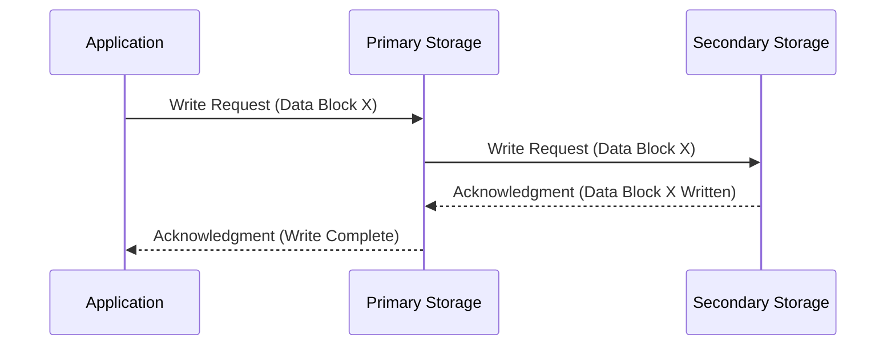

# STORAGE SYSTEMS: Module 3 - Business Continuity, Backup, and Recovery

## Topic: Replication - Synchronous Replication

---

### 1. Introduction to Replication in Storage Systems

*   **Definition:** Replication is the process of creating and maintaining identical copies of data on different storage devices or locations.
*   **Purpose:** To ensure data availability, durability, and facilitate disaster recovery and business continuity.
*   **Key Goals:**
    *   **Availability:** Providing continuous access to data even if one storage system fails.
    *   **Durability:** Protecting data from loss due to hardware failures, site disasters, or human error.
    *   **Disaster Recovery (DR):** Enabling recovery of operations at an alternate site if the primary site becomes unavailable.
    *   **Business Continuity (BC):** Minimizing downtime and ensuring that critical business functions can continue during an outage.

---

### 2. Understanding Replication Types

Replication can be broadly categorized based on how and when data changes are propagated to the secondary copy:

*   **Synchronous Replication:** Writes are acknowledged only after data is written to both primary and secondary storage.
*   **Asynchronous Replication:** Writes are acknowledged to the application as soon as they are written to the primary storage. Data is then propagated to the secondary storage at a later time.
*   **Semi-synchronous Replication:** A hybrid approach where writes are acknowledged after data is written to primary storage and a subset of secondary storage.

This module focuses specifically on **Synchronous Replication**.

---

### 3. Synchronous Replication: The Core Concept

*   **Definition:** Synchronous replication ensures that a write operation to the primary storage system is not considered complete until it has been successfully written to both the primary storage and at least one secondary storage location.
*   **Mechanism:**
    1.  An application initiates a write operation to the primary storage.
    2.  The primary storage system receives the write request.
    3.  The primary storage system immediately sends the write data to the secondary storage system.
    4.  The secondary storage system acknowledges the successful write to the primary storage.
    5.  Upon receiving the acknowledgment from the secondary system, the primary storage system acknowledges the write operation back to the application.
*   **Key Characteristic: Zero Data Loss (RPO = 0)**
    *   **Recovery Point Objective (RPO):** The maximum amount of data loss that an organization can tolerate.
    *   With synchronous replication, because a write is not confirmed until it's on both systems, there is **zero data loss** in the event of a primary site failure. The secondary copy will be an exact replica of the primary at the exact moment of failure.

---

### 4. How Synchronous Replication Works (Detailed Flow)

**Explanation of the Flow:**

1.  **Application Initiates Write:** The application sends a write request with specific data (e.g., Data Block X) to the primary storage system.
2.  **Primary Stores and Forwards:** The primary storage system receives Data Block X. Before acknowledging the write to the application, it immediately forwards this data block to the designated secondary storage system.
3.  **Secondary Acknowledges Write:** The secondary storage system writes Data Block X to its own storage media. Once successfully written, it sends an acknowledgment back to the primary storage system.
4.  **Primary Acknowledges Application:** Only after the primary storage system receives the acknowledgment from the secondary system does it consider the write operation complete and sends the acknowledgment back to the application.

---

### 5. Advantages of Synchronous Replication

*   **Zero Data Loss (RPO=0):** This is the most significant advantage. In a disaster scenario where the primary site is lost, no data is missing from the secondary site.
*   **High Data Integrity:** Ensures that data on the secondary site is always an exact, up-to-the-moment copy of the primary.
*   **Simplified Failover:** In case of a primary system failure, the secondary system can be brought online almost immediately with no data missing, facilitating faster recovery.
*   **Suitable for Critical Applications:** Ideal for applications where even a single lost transaction could have severe financial or operational consequences (e.g., financial trading systems, e-commerce transaction processing).

---

### 6. Disadvantages of Synchronous Replication

*   **Performance Impact (Latency):** The primary bottleneck is the network latency between the primary and secondary sites. The write operation must wait for the round-trip time (RTT) for the data to reach the secondary and be acknowledged. This can significantly slow down write operations, especially over long distances.
*   **Distance Limitations:** Due to the latency issue, synchronous replication is generally limited to geographically close locations (e.g., within the same data center, between adjacent data centers). Beyond a certain distance, the latency becomes unacceptable for most applications.
*   **Increased Cost:** Requires higher bandwidth and potentially more robust network infrastructure to minimize latency.
*   **Reduced Write Throughput:** The overall speed of write operations is dictated by the slowest link in the chain, which is often the network transmission to the secondary site.
*   **Potential for Primary Site Failure to Impact Secondary:** If the link between primary and secondary fails, and the primary cannot write to the secondary, applications might experience write failures (depending on implementation) unless failover mechanisms are in place.

---

### 7. Key Factors to Consider for Synchronous Replication

*   **Network Bandwidth and Latency:** Crucial for performance. The distance between sites directly impacts latency.
*   **Application Sensitivity to Latency:** How much write latency can the application tolerate?
*   **RPO Requirements:** Is zero data loss an absolute requirement?
*   **Distance Between Sites:** The primary constraint for synchronous replication.
*   **Cost of Infrastructure:** Higher bandwidth and reliable network links come at a cost.
*   **Failover Procedures:** How will the failover to the secondary site be managed?

---

### 8. Use Cases for Synchronous Replication

*   **Tier-0 and Tier-1 Applications:** Mission-critical applications that cannot tolerate any data loss.
    *   Financial services (trading platforms, core banking systems)
    *   Healthcare (patient record systems, critical medical devices)
    *   E-commerce (real-time transaction processing)
    *   Telecommunications
*   **Disaster Recovery for High-Availability Clusters:** Ensuring that clustered applications remain available with minimal interruption even if the primary site is unavailable.
*   **Data Migration:** Can be used to move data between storage systems with minimal downtime.

---

### 9. Practice Questions & Answers

**Question 1:**
What is the primary advantage of using synchronous replication?

**Answer 1:**
The primary advantage of synchronous replication is **zero data loss (RPO=0)**. This means that in the event of a failure at the primary site, no data is lost because the write operation is only acknowledged to the application after it has been successfully written to both the primary and secondary storage locations.

**Question 2:**
Which factor is the biggest limitation for implementing synchronous replication over long distances?

**Answer 2:**
The biggest limitation for implementing synchronous replication over long distances is **network latency**. The round-trip time for data to travel to the secondary site and receive an acknowledgment back at the primary site directly impacts the performance of write operations, making it impractical for very long distances.

**Question 3:**
Describe the data flow for a write operation using synchronous replication.

**Answer 3:**
1.  The application sends a write request to the primary storage.
2.  The primary storage receives the write and immediately sends the data to the secondary storage.
3.  The secondary storage writes the data and sends an acknowledgment back to the primary storage.
4.  Upon receiving the acknowledgment from the secondary, the primary storage acknowledges the write operation back to the application.

**Question 4:**
If an application is highly sensitive to write latency, would synchronous or asynchronous replication be a better choice, assuming the secondary site is geographically distant? Explain why.

**Answer 4:**
**Asynchronous replication** would likely be a better choice. Synchronous replication introduces latency directly into the application's write operations because it waits for the data to be written to the secondary site and acknowledged. For a distant secondary site, this latency can be significant and degrade application performance. Asynchronous replication acknowledges writes to the application as soon as they hit the primary, then replicates the data later, thus not impacting application write performance directly, although it carries a risk of some data loss (RPO > 0).

---

### 10. Important Points to Remember

*   **Synchronous Replication = Zero Data Loss (RPO=0).**
*   **Performance is directly impacted by network latency.**
*   **Ideal for short distances (e.g., within a data center or between nearby sites).**
*   **Essential for mission-critical applications that cannot tolerate any data loss.**
*   **Higher cost due to bandwidth and infrastructure requirements.**
*   **The secondary copy is an exact, real-time replica of the primary.**

---

### Learning Outcomes Checklist:

*   [X] Understand the concept of replication and its importance in storage systems for business continuity and disaster recovery.
*   [X] Differentiate between synchronous and other replication methods (briefly introduced).
*   [X] Explain the fundamental mechanism of synchronous replication.
*   [X] Understand the Recovery Point Objective (RPO) and how synchronous replication achieves RPO=0.
*   [X] Identify the advantages of synchronous replication (zero data loss, data integrity, simplified failover).
*   [X] Recognize the disadvantages of synchronous replication (performance impact, distance limitations, cost).
*   [X] Discuss key factors to consider when implementing synchronous replication (network, application sensitivity, distance).
*   [X] Provide examples of use cases where synchronous replication is appropriate.

---
