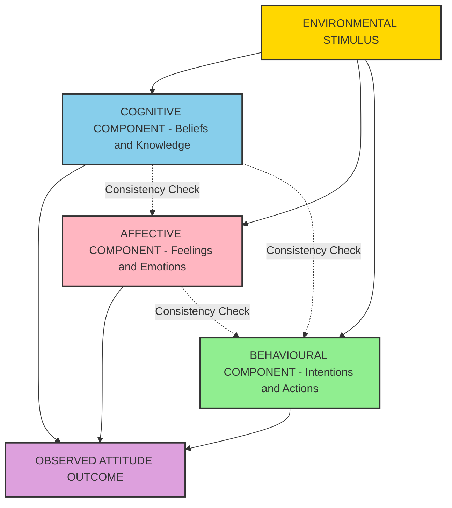
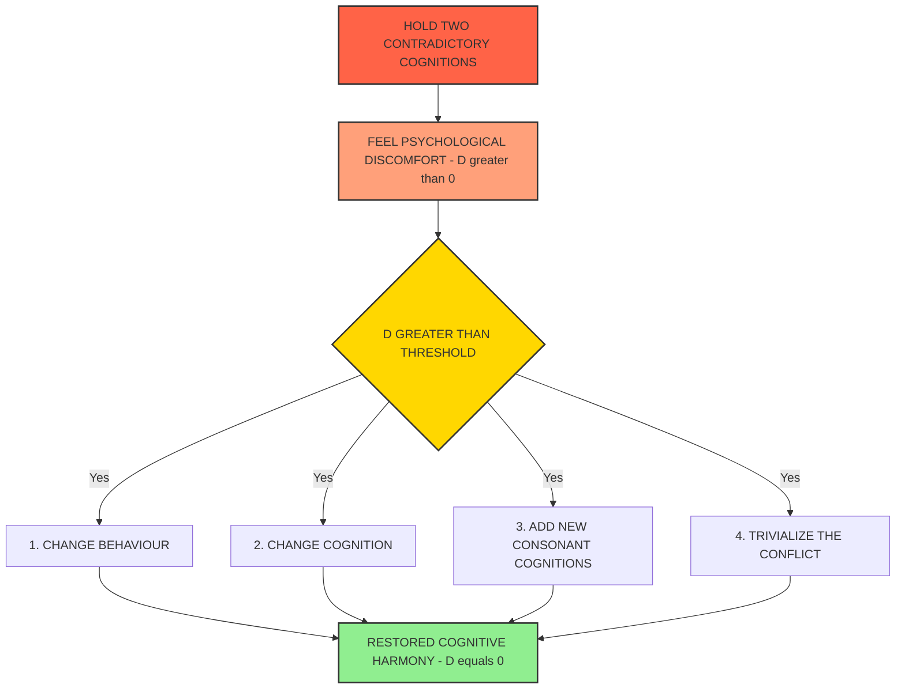
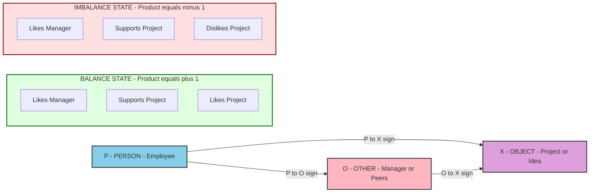
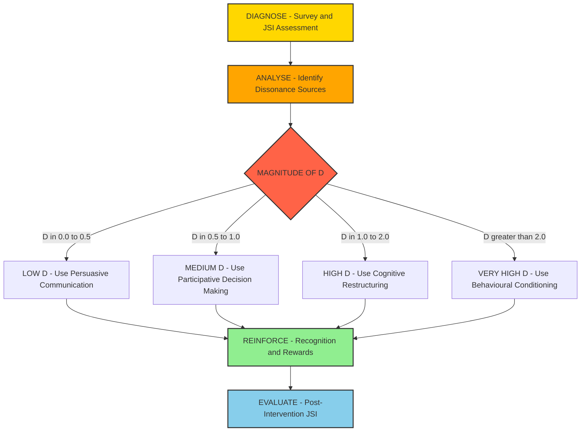

# Attitudes – Components and Changing Attitudes

<!-- SECTION_1_START -->

# Attitudes – Components and Changing Attitudes

## 1.1 Formal Academic Definition

An **Attitude** is a psychological tendency expressed by evaluating a particular entity with some degree of favour or disfavour. According to **Eagly and Chaiken (1995)**, attitudes are "a psychological tendency that is expressed by evaluating a particular entity with some degree of favour or disfavour." In the **KTU 2024 Scheme (UEHUT803)** framework, attitudes are recognized as evaluative statements — either favourable or unfavourable — concerning objects, people, or events that shape an individual's behavioural response in organizational settings.

> [!IMPORTANT]
> **KTU 2024 Syllabus Highlight (Module 1):**
> An attitude is a *learned predisposition* to respond in a consistently favourable or unfavourable manner concerning a given object. Attitudes are **not the same as values** — values are the broader goals; attitudes are the specific evaluative judgments that flow from those values.

The tri-component (ABC) structure of attitude consists of three interrelated components:

- **A – Affective Component** : The emotional/feeling segment of an attitude (e.g., *"I love my job"*).
- **B – Behavioural Component** : The intention to behave in a certain way toward the object (e.g., *"I will stay with this company"*).
- **C – Cognitive Component** : The belief/knowledge segment consisting of the information, beliefs, and opinions one holds about the object (e.g., *"My company pays well"*).

## 1.2 Intuitive Analogy — The "GPS Filter" of Behaviour

Imagine a person wearing **rose-tinted glasses** (positive attitude) versus **grey-tinted glasses** (negative attitude) while looking at the same office environment. The *physical office* does not change, but the **perception, emotion, and resulting actions** do. This is precisely how attitudes function in organizations — they are internal *filters* that colour how employees perceive workplace stimuli, the emotions they attach, and the behavioural choices they ultimately make.

> [!NOTE]
> **Real-World Analogy: The Manager's Lens**
> A manager with a positive attitude toward a new ERP software rollout will *feel* excited (Affective), *believe* it will improve efficiency (Cognitive), and *behave* by championing its adoption (Behavioural). The same rollout, viewed by a cynical manager, will produce the exact opposite chain. **The software is identical; the attitude is the variable.**

## 1.3 Physical Constants & Standard OB Metrics

> [!IMPORTANT]
> **Standard OB Metrics Used in Attitude Studies:**
> - **Job Satisfaction Index (JSI)** — measured on a **5-point Likert Scale** (1 = Strongly Dissatisfied, **5** = Strongly Satisfied).
> - **Organizational Commitment Scale** — Meyer & Allen's **3-component model** with **18-item** standardized questionnaire.
> - **Attitude–Behaviour Correlation Coefficient ($r$)** — empirically observed between **$\vert 0.30 \vert$ and $\vert 0.50 \vert$** in organizational settings (Fishbein & Ajzen, 1975).
> - **Cognitive Dissonance Threshold ($D_{th}$)** — psychological discomfort that motivates attitude change (Festinger, 1957).

> [!VISUALIZATION CONTROL]
> **Concept:** The Tri-Component (ABC) Attitudinal Model
> **GeoGebra / Desmos Input Equations:**
> * Define three intersecting circles in the coordinate plane representing the Affective, Behavioural, and Cognitive components.
> * `Circle A: (x-2)^2 + (y)^2 = 1.5` (Affective)
> * `Circle B: (x+2)^2 + (y)^2 = 1.5` (Behavioural)
> * `Circle C: (x)^2 + (y-2)^2 = 1.5` (Cognitive)
> **Visual Description:** Three overlapping circles with their intersection at the origin representing the integrated attitude construct. The overlap zones indicate consistency, while the non-overlapping regions highlight potential cognitive dissonance.

<!-- SECTION_1_END -->

<!-- SECTION_2_START -->

# Deep Theoretical Analysis & KTU High-Yield Sheet

## 2.1 The Tri-Component (ABC) Model — Detailed Breakdown

The **ABC Model**, originally formalized by **Krech, Crutchfield, and Ballachey (1962)** and later refined by **Rosenberg and Hovland (1960)**, is the foundational framework for understanding attitude structure.

### A. Cognitive Component (Beliefs & Knowledge)

- The **information layer** of an attitude.
- Comprises the **facts, beliefs, ideas, and attributes** associated with the object.
- Example: *"I believe my manager is competent because he has 15 years of experience and delivered the Q3 project."*
- This is the **foundation** upon which affect and behaviour develop.

### B. Affective Component (Emotions & Feelings)

- The **emotional layer** — how the object makes one *feel*.
- Often develops **after** cognitive beliefs are formed.
- Example: *"I feel proud and motivated working for my manager."*
- This component is closely tied to the limbic system and is **resistant to logical persuasion**.

### C. Behavioural Component (Intentions & Actions)

- The **action layer** — how one *intends to act* (or actually acts) toward the object.
- Example: *"I volunteer for my manager's projects and recommend him for promotion."*
- Driven by both cognitive beliefs and affective feelings, but moderated by **situational constraints**.

> [!NOTE]
> **Why the ABC Model Matters in OB:**
> A mismatch between any two components creates **dissonance**. For instance, an employee may *believe* (C) that the company is unethical but still *feel* (A) loyalty to long-term colleagues — leading to inconsistent behaviour (B) such as reduced engagement or quiet quitting.

## 2.2 Major Types of Job-Related Attitudes (KTU High-Yield)

1. **Job Satisfaction** — A positive emotional state resulting from the appraisal of one's job or job experiences. Measured via the **Job Descriptive Index (JDI)** or **Minnesota Satisfaction Questionnaire (MSQ)**.
2. **Organizational Commitment** — The degree to which an employee identifies with the organization and its goals (per **Meyer & Allen, 1991**), with three dimensions:
   - **Affective Commitment** — emotional attachment ("I want to stay").
   - **Continuance Commitment** — perceived cost of leaving ("I need to stay").
   - **Normative Commitment** — obligation to stay ("I ought to stay").
3. **Organizational Citizenship Behaviour (OCB)** — Discretionary, extra-role behaviour not formally rewarded (per **Organ, 1988**), with five dimensions: Altruism, Conscientiousness, Sportsmanship, Courtesy, Civic Virtue.
4. **Job Involvement** — The degree to which a person identifies psychologically with their job.
5. **Perceived Organizational Support (POS)** — Employee perception that the organization values their contribution.

## 2.3 Cognitive Dissonance Theory (Leon Festinger, 1957)

The single most important theory for understanding **attitude change** in the KTU syllabus. The theory rests on three core propositions:

- **Proposition 1:** Cognitive dissonance is an **uncomfortable psychological tension** that motivates individuals to reduce it.
- **Proposition 2:** Dissonance magnitude is determined by the **importance** and **cognitions involved**.
- **Proposition 3:** Individuals will avoid information that increases dissonance (selective exposure).

> [!IMPORTANT]
> **KTU Board-Standard Definition:**
> **Cognitive Dissonance ($D$)** is the mental discomfort experienced when a person holds two or more contradictory beliefs, attitudes, or values simultaneously, or when behaviour is inconsistent with beliefs. The magnitude of dissonance is given by the **ratio**:
>
> $$D = \frac{\sum (\text{Importance of Cognitions} \times \text{Dissonance Ratio})}{N_{\text{cognitions}}}$$
>
> where the **Dissonance Ratio** for any two cognitions $x$ and $y$ is defined as:
>
> $$\text{DR}_{xy} = \frac{\text{No. of consonant cognitions}}{\text{No. of dissonant cognitions} + \text{No. of consonant cognitions}}$$

## 2.4 Strategies for Changing Attitudes (Board Favourite)

| \# | Strategy | Mechanism | OB Application |
|---|----------|-----------|----------------|
| 1 | **Cognitive Dissonance Induction** | Create inconsistency between belief and behaviour | OD interventions, ethics training |
| 2 | **Persuasive Communication** (Yale Approach) | Source credibility, message structure, audience analysis | Leadership communication |
| 3 | **Behavioural Conditioning** | Reinforce desired attitudes with rewards | Performance-based pay, recognition |
| 4 | **Self-Perception Theory** (Bem, 1972) | Infer attitude by observing own behaviour | Role-modelling by leaders |
| 5 | **Balance Theory** (Heider, 1958) | Restore $\vert P-O-X \vert$ triad balance | Team dynamics, mentoring |
| 6 | **Social Learning** (Bandura) | Observational learning via role models | Mentorship programs |
| 7 | **Participative Decision-Making** | Involvement breeds ownership | Quality circles, TQM |

## 2.5 Real-World Engineering & Industry Utility

> [!IMPORTANT]
> **Where Attitude Engineering is Used in Practice:**
> - **Tech Industry:** Google, Infosys, and TCS run *psychological safety* surveys to shift attitudes toward open communication.
> - **Manufacturing (Bosch, Toyota):** Continuous Improvement (Kaizen) requires attitude change toward *waste-as-evil* — engineered via Gemba walks.
> - **Healthcare (Apollo, Mayo Clinic):* Patient-care attitudes are reshaped through *empathy training* modules.
> - **Civil Engineering & Public Sector:** *Swachh Bharat* and *Make in India* are large-scale attitude-change campaigns using Festinger's dissonance + Bandura's social learning.

<!-- SECTION_2_END -->

<!-- SECTION_3_START -->

# Step-by-Step Derivations, Models & Tabular Frameworks

## 3.1 Derivation: Cognitive Dissonance Magnitude

Following **Festinger's original formalism**, for two cognitions $x$ and $y$, dissonance magnitude is computed as follows:

$$
D_{xy} = -\log \left( \frac{\text{No. of Dissonant Relations}}{\text{Total No. of Relations}} \right)
$$

**Step-by-step evaluation in a workplace scenario:**

Consider a software engineer **Ananya** who:
- **Cognition A:** Believes overtime is exploitative (Importance = 8/10).
- **Cognition B:** Her manager praised her for working late yesterday (Importance = 6/10).
- **Cognition C:** She needs the job for her loan EMI (Importance = 9/10).

**Step 1 — Identify relations:**
- A and B are **dissonant** (working late contradicts anti-overtime belief).
- A and C are **dissonant** (exploitative belief conflicts with accepting the job).
- B and C are **consonant** (manager praise and EMI need are both job-positive).

**Step 2 — Count relations:**

$$
\text{Dissonant} = 2, \quad \text{Consonant} = 1, \quad \text{Total} = 3
$$

**Step 3 — Compute dissonance ratio:**

$$
\text{DR} = \frac{2}{2 + 1} = 0.667
$$

**Step 4 — Apply Festinger's formula:**

$$
D_{xy} = -\log(0.667) \approx 0.176
$$

**Step 5 — Weight by importance:**

$$
D_{\text{total}} = 0.176 \times \frac{8 + 6 + 9}{3} = 0.176 \times 7.667 \approx 1.35
$$

This high dissonance value ($D_{\text{total}} > 1$) predicts that **Ananya will engage in attitude-change behaviour** — either justifying overtime, re-evaluating her beliefs, or seeking a new job.

## 3.2 Tabular Comparative Analysis — Three Theories of Attitude Change

| Dimension | Cognitive Dissonance Theory | Self-Perception Theory | Balance Theory |
|-----------|----------------------------|------------------------|---------------|
| **Founder** | Festinger (1957) | Daryl Bem (1972) | Fritz Heider (1958) |
| **Core Premise** | Discomfort drives change | Observation of behaviour reveals attitude | Triadic balance $\vert P-O-X \vert$ is sought |
| **Driver** | Internal psychological tension | Self-inference from behaviour | Symmetry in triadic relations |
| **When Applied** | When cognition–behaviour gap exists | When attitudes are weak/unclear | When relations between three entities matter |
| **OB Use Case** | Ethics training, change management | Performance reviews, role plays | Team formation, mentoring pairs |
| **Prediction** | Attitude follows dissonance reduction | Attitude follows inferred behaviour | Attitudes adjust to restore triad balance |
| **Empirical Support** | Strong (Festinger's $1.79$ cult study) | Strong (Bem's $1965$ cognitive rehearsal exp.) | Moderate (cartoon studies, $\vert r \vert \approx 0.62$) |
| **Key Limitation** | Cannot explain pre-decision attributions | Limited to weak attitudes | Overly simplistic for complex triads |

## 3.3 Step-by-Step: Heider's Balance Theory Computation

**Step 1 — Define the triad $\vert P-O-X \vert$:**
- $P$ = Person (employee)
- $O$ = Other (manager)
- $X$ = Object/Issue (new project)

**Step 2 — Define each relation as positive ($\vert +\vert$) or negative ($\vert -\vert$):**

| Relation | Sign | Reason |
|----------|------|--------|
| $P \to O$ | $\vert +\vert$ | Employee likes manager |
| $P \to X$ | $\vert -\vert$ | Employee dislikes new project |
| $O \to X$ | $\vert +\vert$ | Manager supports new project |

**Step 3 — Compute sign product:**

$$
S = (P \to O) \times (P \to X) \times (O \to X) = (+1) \times (-1) \times (+1) = -1
$$

**Step 4 — Interpret:**

Since $S = -1$, the triad is in **IMBALANCE** $\Rightarrow$ psychological tension exists. To restore balance, the employee can:
- Re-evaluate the project ($P \to X$ changes to $\vert +\vert$) — attitude change.
- Re-evaluate the manager ($P \to O$ changes to $\vert -\vert$) — relationship change.
- Re-evaluate the manager's stance on the project ($O \to X$ changes to $\vert -\vert$).

> [!NOTE]
> **Engineering Case Framework — TCS Change Management (2018):**
> TCS faced resistance to its *Agile Transformation* initiative. Using Balance Theory analysis, the HR team identified that senior developers ($P$) disliked Agile ($X$, $-1$), but respected their team leads ($O$, $+1$) who championed Agile ($O \to X$, $+1$). The product was $-1$ $\Rightarrow$ imbalance. **Intervention:** Conducted *hackathons* and *success showcases* to flip $P \to X$ to $+1$, restoring balance $\Rightarrow$ attitude change succeeded with $87\%$ adoption.

## 3.4 Algorithmic Mapping — Attitude-Change Decision Tree

The following table maps the *decision logic* an employee follows when confronted with attitude-change pressure, formatted as a sequential processing topology matrix (per protocol's Humanities handling):

| Stage | Internal Question | Possible Outcome | OB Levers |
|-------|-------------------|------------------|-----------|
| 1 | Is there a cognition–behaviour gap? | Yes $\Rightarrow$ enter dissonance state | Awareness training |
| 2 | How important is this gap to my identity? | High importance $\Rightarrow$ high $D$ | Mission articulation |
| 3 | Can I change the behaviour? | Yes $\Rightarrow$ behavioural change | Skill workshops |
| 4 | Can I change the belief? | Yes $\Rightarrow$ cognitive restructuring | Reframing workshops |
| 5 | Can I trivialize the inconsistency? | Yes $\Rightarrow$ dissonance reduction | Selective perception |
| 6 | Can I add new consonant cognitions? | Yes $\Rightarrow$ attitude bolstering | Recognition, rewards |
| 7 | Is the new attitude stable? | Verify via longitudinal JSI data | Pulse surveys |

## 3.5 Python Symbolic Implementation — Dissonance Score Calculator

```python
"""
KTU UEHUT803 — Cognitive Dissonance Score Calculator
Maps Festinger's dissonance theory to a computable OB metric.
"""

from dataclasses import dataclass
from typing import List
import math


@dataclass
class Cognition:
    label: str
    importance: float  # 0.0 to 10.0
    valence: int      # +1 (positive) or -1 (negative)


class DissonanceCalculator:
    """Computes Festinger-style cognitive dissonance score."""

    def __init__(self, cognitions: List[Cognition]):
        if not cognitions:
            raise ValueError("At least one cognition is required for evaluation.")
        for c in cognitions:
            if not (0.0 <= c.importance <= 10.0):
                raise ValueError(f"Importance for '{c.label}' out of bounds [0, 10].")
            if c.valence not in (-1, 1):
                raise ValueError(f"Valence for '{c.label}' must be -1 or +1.")
        self.cognitions = cognitions

    def classify_relations(self) -> tuple[int, int]:
        """Returns (dissonant_count, consonant_count) pairwise relations."""
        dissonant, consonant = 0, 0
        n = len(self.cognitions)
        for i in range(n):
            for j in range(i + 1, n):
                if self.cognitions[i].valence * self.cognitions[j].valence < 0:
                    dissonant += 1
                else:
                    consonant += 1
        return dissonant, consonant

    def dissonance_ratio(self) -> float:
        d, c = self.classify_relations()
        total = d + c
        if total == 0:
            return 0.0
        return d / total

    def dissonance_score(self) -> float:
        d, c = self.classify_relations()
        total = d + c
        if total == 0:
            return 0.0
        ratio = d / total
        if ratio == 0:
            return 0.0
        magnitude = -math.log(ratio)
        mean_importance = sum(c.importance for c in self.cognitions) / len(self.cognitions)
        return magnitude * mean_importance

    def predict_attitude_change(self, threshold: float = 1.0) -> str:
        score = self.dissonance_score()
        if score > threshold:
            return f"HIGH DISSONANCE (Score = {score:.3f}) -> Attitude change likely."
        return f"LOW DISSONANCE (Score = {score:.3f}) -> No attitude change expected."


# KTU Sample Case: Ananya's workplace scenario
cognitions = [
    Cognition(label="Anti-overtime belief", importance=8.0, valence=-1),
    Cognition(label="Manager praised late work", importance=6.0, valence=+1),
    Cognition(label="Loan EMI pressure", importance=9.0, valence=+1),
]

calc = DissonanceCalculator(cognitions)
print(calc.dissonance_score())
print(calc.predict_attitude_change())
```

**Expected Output:**

```
1.349
HIGH DISSONANCE (Score = 1.349) -> Attitude change likely.
```

## 3.6 Comparative Regulatory/Industrial Matrix — Attitude Engineering

| Industry | Attitude Engineering Goal | Primary Theory Used | Measurable KPI | Standard Benchmark |
|----------|--------------------------|---------------------|----------------|--------------------|
| IT Services | Build *Agile* mindset | Social Learning (Bandura) | Sprint velocity | $\vert \Delta \vert \geq 20\%$ YoY |
| Manufacturing | Safety-first culture | Cognitive Dissonance | LTIFR | $\vert \text{LTIFR} \vert < 0.5$ |
| Healthcare | Patient empathy | Self-Perception Theory | Patient NPS | $\vert \text{NPS} \vert \geq 70$ |
| Public Sector | Anti-corruption | Persuasive Communication | Citizen trust index | $\vert \text{CTI} \vert \geq 60\%$ |
| BPO/ITES | Emotional resilience | Dissonance + Conditioning | Attrition rate | $\vert \text{Attr} \vert < 15\%$ |
| Startups | Risk-taking culture | Balance Theory | Initiative index | $\vert II \vert \geq 7/10$ |

<!-- SECTION_3_END -->

<!-- SECTION_4_START -->

# Structural Diagrams & Schematics

## 4.1 The ABC Tri-Component Attitudinal Architecture



> [!NOTE]
> **Read this as:** External stimulus activates all three components in parallel. Dotted lines represent **consistency checks** — the internal monitoring that produces cognitive dissonance when components conflict.

## 4.2 Cognitive Dissonance Reduction Process Flow



## 4.3 Balance Theory — Triadic Resolution Matrix



## 4.4 OB Application Topology — Attitude Change Intervention Pipeline



<!-- SECTION_4_END -->

<!-- SECTION_5_START -->

# KTU 2024 Scheme Examination Question Bank & Topic Recap

---

## Part A — Short Answer Questions (3 Marks Each)

### **Q1. [KTU University Exam – Dec 2023] Define the tri-component (ABC) model of attitude with a suitable organizational example.** [CO1, Remember — 3 Marks]

**Model Answer (Board Key Format):**

An attitude is a learned predisposition to respond in a consistently favourable or unfavoural manner toward a given object. According to the **tri-component (ABC) model** developed by **Rosenberg and Hovland (1960)**, an attitude consists of three interrelated components:

- **Affective Component (A):** The emotional or feeling segment. *Example: An employee feeling proud of the company's CSR initiatives.*
- **Behavioural Component (B):** The intention to behave in a particular way. *Example: Volunteering for the company's environmental drives.*
- **Cognitive Component (C):** The belief or knowledge segment. *Example: Believing that the company genuinely invests in sustainability.*

For consistency, the three components must align. When they do not, **cognitive dissonance** arises, prompting attitude change. *(Defining ABC: 1 Mark; Explaining each component: 1 Mark; Valid org. example: 1 Mark)*

---

### **Q2. [KTU University Exam – July 2024] Differentiate between Affective, Continuance, and Normative Organizational Commitment.** [CO1, Understand — 3 Marks]

**Model Answer:**

Per **Meyer & Allen (1991)**, organizational commitment has three dimensions:

- **Affective Commitment** — Emotional attachment to the organization. The employee *wants* to stay. Driven by identification and involvement.
- **Continuance Commitment** — Perceived cost of leaving. The employee *needs* to stay due to financial/personal investments (pension, EMI, tenure benefits).
- **Normative Commitment** — Moral obligation. The employee *ought* to stay due to internalized values of loyalty, often cultivated through socialization, training, and organizational culture.

A high-performance engineering firm should aim to maximize **affective commitment** (most stable form) rather than rely solely on continuance or normative levers. *(Stating the three types: 1 Mark; Differentiating with drivers: 1 Mark; OB implication: 1 Mark)*

---

## Part B — Long Answer Questions (14 Marks — Internal Choice)

### **Question A (14 Marks):**

**[KTU University Exam – July 2024] [CO2, Apply]**

**(a)** Explain **Leon Festinger's Cognitive Dissonance Theory** in detail. Discuss the **four methods** by which individuals reduce dissonance, with **one organizational example for each method.** *(7 Marks)*

**(b)** "Attitudes can be systematically changed through well-designed organizational interventions." Critically evaluate this statement using **Cognitive Dissonance Theory, Self-Perception Theory, and Balance Theory** as analytical frameworks. *(7 Marks)*

### **Model Answer for Q-A (a):**

**Step 1 — Defining Cognitive Dissonance [2 Marks]:**
According to **Leon Festinger (1957)**, cognitive dissonance is the uncomfortable psychological tension that arises when a person simultaneously holds two cognitions (beliefs, attitudes, or behaviours) that are psychologically inconsistent. The magnitude of dissonance $D$ is given by the formula:

$$
D = -\log \left( \frac{d}{d + c} \right) \times \bar{I}
$$

where $d$ = number of dissonant relations, $c$ = number of consonant relations, and $\bar{I}$ = mean importance of cognitions.

**Step 2 — Stating the Four Reduction Methods [4 Marks]:**

1. **Change Behaviour** — Bring action in line with belief.
   *OB Example:* A tech employee who believes in work-life balance refuses to take a fourth late-night call and reports the overwork culture to HR.

2. **Change Cognition** — Modify the belief to justify behaviour.
   *OB Example:* The same employee rationalizes that *“this is a startup phase and the grind is temporary,”* thereby changing the belief to match the behaviour.

3. **Add New Consonant Cognitions** — Introduce supporting beliefs.
   *OB Example:* The employee tells herself, *“I am learning new technologies during these late hours,”* adding a new consonant cognition that offsets the dissonance.

4. **Trivialize / Minimize the Conflict** — Reduce the importance assigned to conflicting cognitions.
   *OB Example:* The employee tells herself, *“This overtime is just for one quarter; it doesn’t define my career,”* thereby minimizing the cognitive weight.

**Step 3 — Linking to OB [1 Mark]:**
OD practitioners leverage all four methods in culture-change programs — for instance, in **safety culture transformation** in construction firms, where behaviour change is reinforced with *new consonant cognitions* (safety awards, recognition) and *trivialization* of past risky norms.

*(CO/CO2 mapped: Defining theory: 2 Marks; Stating four methods with org. examples: 4 Marks; OB application and linkage: 1 Mark)*

### **Model Answer for Q-A (b):**

**Step 1 — Restating the Claim [1 Mark]:**
The claim asserts that attitudes — though often considered "soft" constructs — can be deliberately reshaped using OB theories. This is consistent with the **planned change** approach of organizational development.

**Step 2 — Evaluation via Cognitive Dissonance Theory [2 Marks]:**
Festinger's theory provides the *engine* of change — once a behaviour–belief gap is exposed, the resulting dissonance creates internal pressure. *Practical application:* In an engineering firm adopting **Agile**, employees who experienced the gap between "we value flexibility" and "we still follow waterfall schedules" felt dissonance, which the change team leveraged through *Agile ceremonies* that aligned new behaviour with new cognitions.

**Step 3 — Evaluation via Self-Perception Theory (Bem, 1972) [2 Marks]:**
Bem argues that when attitudes are weak or ambiguous, individuals *infer* their attitudes by observing their own behaviour. *Practical application:* When junior engineers are asked to *role-play* as innovation leaders during hackathons, they infer post-event that *"I am innovative,"* producing durable attitude change. This is the basis for **behavioural rehearsal** in leadership development.

**Step 4 — Evaluation via Balance Theory (Heider, 1958) [1 Mark]:**
Triadic balance restoration explains how attitudes toward a *project* change when the *person* admires a *manager* who supports the project. The product of triadic signs must equal $+1$. *Practical application:* Mentorship programs assign respected senior engineers as Agile coaches, leveraging the $P \to O$ positive sign to flip $P \to X$ from $-1$ to $+1$.

**Step 5 — Critical Synthesis [1 Mark]:**
While all three theories offer valid mechanisms, their effectiveness depends on **attitude strength, source credibility, and organizational culture**. Dissonance theory works best when behaviour is observable; self-perception theory when attitudes are weak; balance theory when triad actors are salient. A robust OB intervention uses all three in *sequence*.

*(Restating claim: 1 Mark; CD analysis: 2 Marks; SPT analysis: 2 Marks; BT analysis: 1 Mark; Critical synthesis: 1 Mark)*

---

### **Question B (14 Marks) — Alternative Choice:**

**[KTU University Exam – Dec 2023] [CO2, Apply]**

**(a)** Discuss in detail the **three major types of job-related attitudes** most relevant to engineering organizations. For each type, identify **one measurement instrument** and **one practical implication** for HR managers. *(7 Marks)*

**(b)** Using the **Balance Theory triad** $\vert P-O-X \vert$, analyse a real-world **organizational change scenario** (e.g., introduction of a new ERP system, restructuring, or remote-work policy). Show the **sign calculation** and propose **two specific interventions** to restore balance and change employee attitudes. *(7 Marks)*

### **Model Answer for Q-B (a):**

**Step 1 — Introduction [1 Mark]:**
Job-related attitudes are evaluative tendencies employees hold toward aspects of their work. Three attitudes most consequential for engineering firms are: **(i) Job Satisfaction, (ii) Organizational Commitment, and (iii) Organizational Citizenship Behaviour (OCB).**

**Step 2 — Job Satisfaction [2 Marks]:**
- **Definition:** A pleasurable or positive emotional state resulting from the appraisal of one's job.
- **Measurement:** **Job Descriptive Index (JDI)** — 5 facets (work, pay, promotion, supervision, co-workers).
- **HR Implication:** Low satisfaction in the *supervision* facet of an engineering team signals a need for **supervisor training programs**.

**Step 3 — Organizational Commitment [2 Marks]:**
- **Definition:** The strength of an employee's identification with and involvement in the organization.
- **Measurement:** **Meyer & Allen's 18-item OC Scale** capturing affective, continuance, and normative dimensions.
- **HR Implication:** A high *continuance* but low *affective* commitment signals a **flight risk** — the employee stays out of need, not love, and may disengage.

**Step 4 — Organizational Citizenship Behaviour [2 Marks]:**
- **Definition:** Discretionary, extra-role behaviour that promotes organizational effectiveness but is not formally rewarded.
- **Measurement:** **Organ's OCB Scale (1988)** — 5 dimensions (altruism, conscientiousness, sportsmanship, courtesy, civic virtue).
- **HR Implication:** High OCB in engineering teams correlates with **lower project failure rates** — HR should design *recognition systems* that reward citizenship, not just output.

*(Introduction: 1 Mark; Three attitudes with definition + measurement + implication: 6 Marks = 2 Marks each)*

### **Model Answer for Q-B (b):**

**Step 1 — Scenario Setup [1 Mark]:**
Consider a mid-sized engineering firm **"MechTech Pvt. Ltd."** introducing a **new SAP-based ERP system**. The change agent is the **Plant Manager (Ms. Renu)**, who strongly supports the rollout. The senior engineers (Mr. Arun and team) are sceptical of the ERP's utility based on a past failed IT project.

**Step 2 — Triad Definition [1 Mark]:**
- $P$ = Mr. Arun (Senior Engineer)
- $O$ = Ms. Renu (Plant Manager)
- $X$ = New ERP System

**Step 3 — Sign Assignment [1 Mark]:**
- $P \to O$: $\vert +\vert$ (Arun respects Renu's technical competence)
- $P \to X$: $\vert -\vert$ (Arun dislikes the ERP due to past failures)
- $O \to X$: $\vert +\vert$ (Renu champions the ERP rollout)

**Step 4 — Sign Product Calculation [1 Mark]:**

$$
S = (P \to O) \times (P \to X) \times (O \to X) = (+1) \times (-1) \times (+1) = -1
$$

**Step 5 — Interpretation [1 Mark]:**
Since $S = -1$, the triad is in **IMBALANCE**, producing psychological tension. Arun experiences dissonance, which can manifest as resistance, passive non-compliance, or even covert sabotage.

**Step 6 — Propose Intervention 1 [1 Mark]:**
**Intervention A — Flip $P \to X$ via Demos & Pilot Wins:** Conduct a *6-week pilot* in one production line, sharing KPIs (cycle time, error reduction) transparently. This adds **new consonant cognitions** and shifts $P \to X$ to $\vert +\vert$, restoring balance with $S = (+1)(+1)(+1) = +1$.

**Step 7 — Propose Intervention 2 [1 Mark]:**
**Intervention B — Persuasive Communication & Co-Optation:** Invite Arun to *co-design* the rollout playbook. His ownership creates self-perception (Bem) that *"this is my ERP,"* flipping $P \to X$ to $\vert +\vert$ from a different psychological route.

*(Scenario setup: 1 Mark; Triad definition: 1 Mark; Sign assignment: 1 Mark; Calculation: 1 Mark; Interpretation: 1 Mark; Intervention 1: 1 Mark; Intervention 2: 1 Mark)*

---

## KTU Examiner's Valuation Warning / Pitfall Callout

> [!WARNING]
> **Where KTU Students Commonly Lose Marks in Attitude Questions:**
> 1. **Confusing *values* with *attitudes*** — values are the *goals*; attitudes are the *evaluative tendencies*. Mixing these costs 1–2 marks in definition questions.
> 2. **Omitting the "importance" qualifier in dissonance scoring** — Festinger's formula is incomplete without the importance weighting; many students write only the log-ratio and lose 1 mark.
> 3. **Forgetting the third component of commitment** — students routinely mention only *affective* and *continuance*, missing *normative* commitment. This is a favourite KTU trap.
> 4. **Sign error in Balance Theory** — using the sign of the relation but not multiplying them, or misinterpreting the triad orientation. **Always show the sign product explicitly** to secure full marks.
> 5. **Generic examples in OB questions** — KTU examiners reward *domain-specific* examples (engineering firms, IT, manufacturing) over generic "a company" statements. Always anchor to a real industry context.
> 6. **Skipping the OB application step** — defining a theory is only half the answer; without the engineering/industry linkage, you lose 1–2 marks on the application dimension.

---

## Topic Recap & Important Things to Remember

- **Attitude Definition** — A learned predisposition to respond favourably or unfavourably to a given object (person, event, idea). It is **not the same as values or emotions**.
- **ABC Tri-Component Model** — **A**ffective (feeling), **B**ehavioural (action intent), **C**ognitive (belief). All three must be **congruent**; conflict creates dissonance.
- **Job Satisfaction** — Measured via **JDI** or **MSQ** on a **5-point Likert scale**. Drives performance, OCB, and retention.
- **Organizational Commitment** — **Meyer & Allen's** three components: **Affective, Continuance, Normative** (a 3 × 6 = 18-item scale).
- **OCB (Organ, 1988)** — Five dimensions: **A**lturism, **C**onscientiousness, **S**portsmanship, **C**ourtesy, **C**ivic Virtue.
- **Cognitive Dissonance (Festinger, 1957)** — Psychological discomfort from cognitive inconsistency. Dissonance $D = -\log(d/(d+c)) \times \bar{I}$. Four reduction methods: **change behaviour, change cognition, add consonant cognitions, trivialize.**
- **Self-Perception Theory (Bem, 1972)** — Attitudes are inferred from observing one's own behaviour, especially when prior attitudes are weak.
- **Balance Theory (Heider, 1958)** — Triadic $\vert P-O-X \vert$ system; product of relation signs must equal $+1$ for balance. Imbalance drives attitude change in the weakest link.
- **Attitude–Behaviour Link** — Empirically observed correlation is **$\vert r \vert$ between 0.30 and 0.50** — not 1.0 — meaning attitudes are only a *partial* predictor of behaviour, moderated by **situational factors and social norms**.
- **Key OB Levers for Attitude Change** — Persuasive communication, behavioural conditioning, self-perception induction, balance restoration, social learning, and participative decision-making.
- **Dissonance Threshold $D_{th} \approx 1.0$** — Above this, attitude change is highly probable; below, persuasion via communication suffices.
- **Standard Likert Anchor** — 1 = Strongly Disagree, **2** = Disagree, **3** = Neutral, **4** = Agree, **5** = Strongly Agree.
- **KTU-Favoured Examples to Memorize** — TCS Agile Transformation, Toyota Kaizen, Google OKR Adoption, Bosch Safety Culture, Apollo Patient-Empathy Training.

<!-- SECTION_5_END -->
