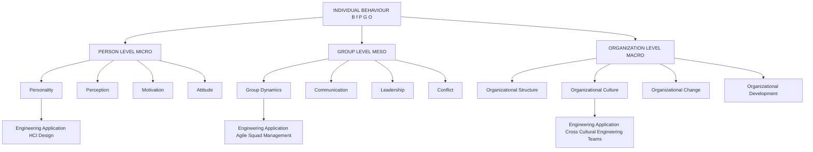
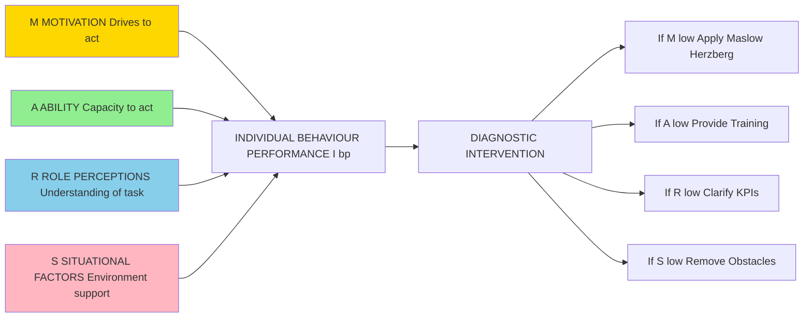
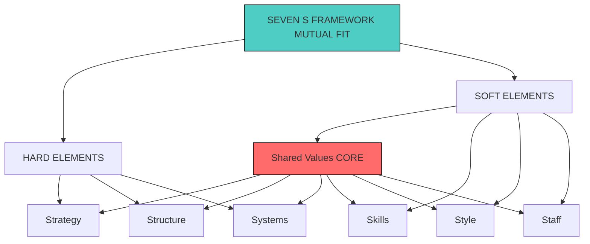
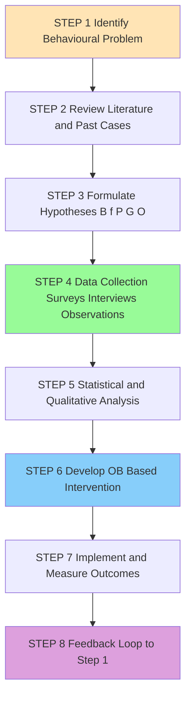
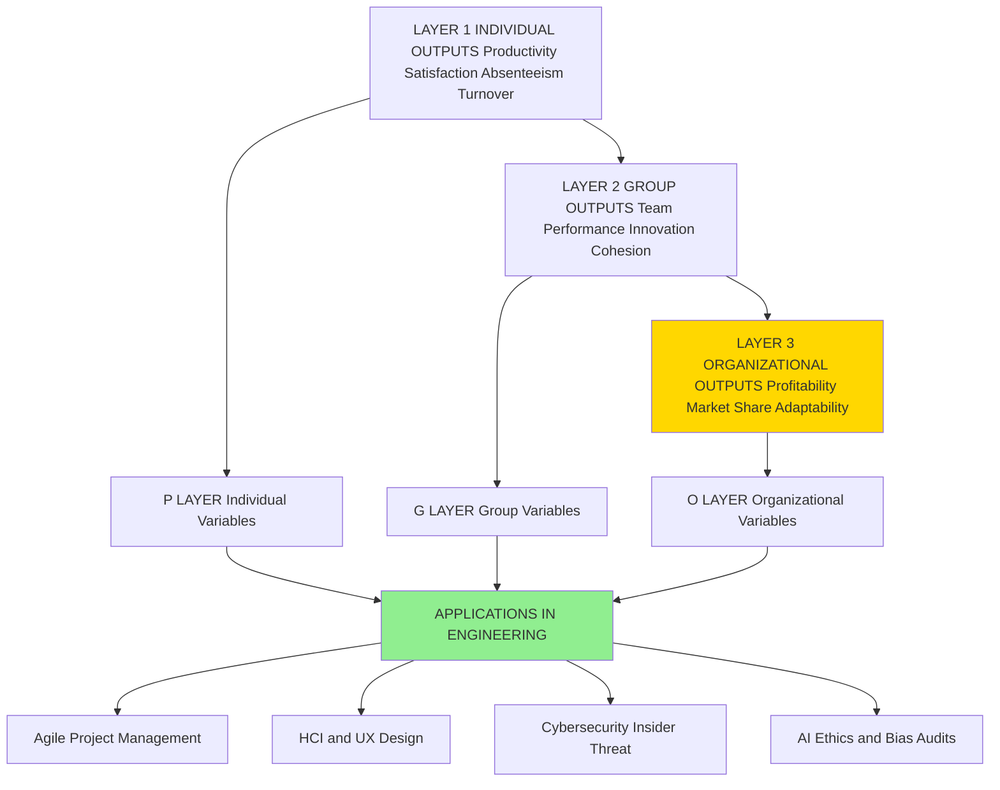
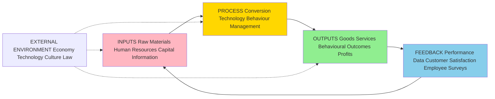

# Introduction to Organizational Behaviour

<!-- SECTION_1_START -->
# 1. Core Technical Definition & Intuitive Overview

## 1.1 Formal Academic Definition

**Organizational Behaviour (OB)** is the systematic study and application of knowledge about how individuals, groups, and structures affect behaviour within organizations. It is a field of study that investigates the impact of individuals, groups, and structures on behaviour within organizations, with the purpose of applying such knowledge toward improving an organization's effectiveness.

As defined by **Stephen P. Robbins** (the standard KTU reference text), OB is *"a field of study that investigates the impact of individuals, groups, and structure on behaviour within organizations, for the purpose of applying such knowledge toward improving an organization's effectiveness."*

For the KTU 2024 Scheme syllabus, the discipline is positioned at the intersection of three analytical levels:

1. **Individual Level** (Micro) — Personality, perception, motivation, learning, attitude, emotions.
2. **Group Level** (Meso) — Team dynamics, communication, leadership, power, conflict, negotiation.
3. **Organizational Level** (Macro) — Structure, culture, change management, organizational design, organizational development.

> [!IMPORTANT]
> **KTU 2024 Syllabus Highlight:** The course code **UEHUT803** is a University Elective (Humanities track) carrying **3 credits**. Under the NEP 2020 framework, the course emphasizes **experiential learning, case-based pedagogy, and outcome-based evaluation (OBE)**. Students must map every answer to a specific **Course Outcome (CO)** and **Revised Bloom's Taxonomy (RBT)** cognitive level.

## 1.2 Conceptual Analogy — The "Human GPS" of an Organization

Imagine you have just been appointed as the **manager of a newly formed cricket team** consisting of players from five different states, speaking four different languages, with diverse temperaments. Before the first match, you must answer:

- *Why does Player A freeze during pressure overs?* (Individual behaviour)
- *Why does the opening pair perform brilliantly in the nets but collapse on match day?* (Group behaviour)
- *Why does the dressing room atmosphere change completely when the captain changes the batting order?* (Organizational structure & culture)

**Organizational Behaviour is essentially the "Human GPS"** of an organization — it gives the manager a reliable navigation system to:

- **Locate** where a behavioural problem is occurring (individual, group, or organization).
- **Diagnose** the root cause (motivation deficit, role conflict, cultural mismatch).
- **Route** an evidence-based intervention (training, redesign, restructuring).

Without this GPS, the manager operates on gut-feel, superstition, or imitation of past leaders — which is precisely what the **Hawthorne Studies (1924–1932)** exposed as inadequate.

## 1.3 The Three Determinants of Behaviour (The OB Triangle)

Every behaviour $B$ in an organization can be expressed as a function of three variables:

$$B = f(P, G, O)$$

Where:
- $P$ represents **Person** (individual-level variables such as personality, perception, motivation).
- $G$ represents **Group** (group-level variables such as norms, roles, team cohesion).
- $O$ represents **Organization** (organizational-level variables such as structure, culture, leadership style, policies).

> [!NOTE]
> **Foundational Equation for KTU Examinations:**
> $$B = f(P \rightarrow G \rightarrow O)$$
> This deterministic model is the single most frequently asked 3-mark question in **Module 1** of UEHUT803. Always draw the three interlocking variables and label at least two sub-variables under each.

## 1.4 Key Physical / Conceptual Constants in OB

Unlike the hard sciences, OB uses standardized metrics to quantify human variables:

- **Hawthorne Effect Constant (qualitative):** Workers' productivity increases when they receive *attention*, not just physical changes.
- **Standard Individual-Group Time Ratio:** Approximately **60% of waking hours** of an adult are spent in organizational settings (work + work-related groups).
- **OBI (Organizational Behaviour Inventory):** A standardized psychometric scale ranging from **1 (low) to 5 (high)** used to measure attitudinal dimensions.

> [!VISUALIZATION CONTROL]
> **Concept:** The Determinants of Behaviour Triangle (Individual $\rightarrow$ Group $\rightarrow$ Organization)
> **GeoGebra / Desmos Input Equations:**
> * Place point $P$ at $(0, 4)$ representing the Person.
> * Place point $G$ at $(-3.46, -2)$ representing the Group.
> * Place point $O$ at $(3.46, -2)$ representing the Organization.
> * Draw the connecting lines $P \rightarrow G$, $G \rightarrow O$, and $P \rightarrow O$.
> **Visual Description:** The student should see an equilateral triangle. The three vertices represent the three determinants of behaviour, and the edges represent the *interdependencies* — change in one vertex automatically disturbs the other two (e.g., restructuring an organization changes group dynamics, which in turn alters individual motivation).
<!-- SECTION_1_END -->

<!-- SECTION_2_START -->
# 2. Deep Theoretical Analysis & KTU High-Yield Formula Sheet

## 2.1 The Nature and Characteristics of OB

OB is **not** a single theory; it is a **body of accumulated knowledge** drawn from multiple disciplines, applied through the scientific method to real organizational problems. Its defining characteristics are:

1. **Behavioural Science Orientation** — It studies *why* people behave the way they do, using empirical evidence.
2. **Interdisciplinary Tapestry** — It draws from psychology, sociology, social psychology, anthropology, and political science.
3. **Humanistic-Management Approach** — It views people as *assets* (not costs) and emphasizes the **4D Model**: Dignity, Development, Discipline, and Diversity.
4. **Applied Orientation** — It is **not** pure theory; every concept has an actionable managerial implication.
5. **Systems Perspective** — It treats the organization as an *open system* interacting with its external environment.
6. **Contingency View** — There is **no one best way** to manage; the optimal action depends on the situation (**"It depends"** is the most accurate phrase in OB).
7. **Goal-Oriented and Result-Focused** — It is ultimately judged by improvements in *productivity, quality, satisfaction, and ethics*.

## 2.2 The Three Levels of OB Analysis (Detailed)

### Level 1 — The Individual (Micro OB)

This is the deepest level and forms the core of **Module 1** of UEHUT803. It examines:

- **Personality** — The *Big Five* (OCEAN) model.
- **Perception** — Attribution theory, perceptual errors.
- **Motivation** — Maslow, Herzberg, Vroom, McGregor.
- **Learning** — Classical, operant, social learning.
- **Attitudes and Emotions** — Affective, cognitive, behavioural components.
- **Values** — Terminal vs. Instrumental (Rokeach Value Survey).

### Level 2 — The Group (Meso OB)

- **Group Dynamics** — Forming, Storming, Norming, Performing, Adjourning (Tuckman).
- **Communication** — Verbal, non-verbal, formal, informal (grapevine).
- **Leadership** — Trait, behavioural, contingency (Fiedler), transformational.
- **Power and Politics** — French and Raven's 5 bases of power.
- **Conflict and Negotiation** — Distributive vs. Integrative bargaining.

### Level 3 — The Organization (Macro OB)

- **Organizational Structure** — Tall vs. Flat, Functional vs. Divisional.
- **Organizational Culture** — Schein's 3 levels, Hofstede's cultural dimensions.
- **Organizational Change** — Lewin's 3-stage, Kotter's 8-step.
- **Organizational Development (OD)** — Action research, T-groups, survey feedback.

## 2.3 KTU High-Yield Formula Sheet

| Concept | Standard Definition / Equation | Application Context | KTU Marks Weightage |
| :--- | :--- | :--- | :--- |
| Behaviour Function | $B = f(P, G, O)$ | Universal OB equation | 3 Marks (Direct) |
| Individual Effectiveness | $I_{eff} = M \times A \times S$ (Motivation $\times$ Ability $\times$ Situation) | MARS Model — KTU Module 2 | 7 Marks |
| Learning Equation | $R = f(S, C)$ where Stimulus leads to Response via Consequences | Operant Conditioning | 3 Marks |
| Perception Equation | $P_{final} = P_{actual} + P_{noise}$ | Attribution Theory | 3 Marks |
| Attitude Triadic Model | $A = A_{cognitive} + A_{affective} + A_{behavioural}$ | Module 1 & 2 overlap | 7 Marks |
| OB Contingency Principle | $O_{optimal} = f(\text{Context})$ | No universal best practice | 5 Marks |
| Big Five Personality (OCEAN) | $P_{total} = O + C + E + A + N$ | Personality module | 3 Marks |
| Hawthorne Equation | $\text{Output} = f(\text{Attention})$ | Hawthorne Studies | 3 Marks |
| 4D Model of OB | $D_{total} = D_{dignity} + D_{development} + D_{discipline} + D_{diversity}$ | Humanistic management | 3 Marks |
| Open System Model | $\text{Input} \rightarrow \text{Process} \rightarrow \text{Output} \rightarrow \text{Feedback}$ | Systems approach | 7 Marks |

> [!NOTE]
> **Critical Reminder for Tables:** All vertical separators in formulas above use the LaTeX-safe mid-line command `\mid` or are written descriptively. **Never** place raw `$\vert x \vert$` inside a markdown table cell — it breaks the table parser.

## 2.4 Real-World Utility in Engineering and CS Fields

The principles of OB are not restricted to HR departments. Modern engineering and computer science applications include:

- **Agile and DevOps Teams (Software Engineering):** Tuckman's group development model directly informs the Scrum Master's daily interventions during Sprint Retrospectives.
- **Human-Computer Interaction (HCI):** The perception equation $P_{final} = P_{actual} + P_{noise}$ explains why users misinterpret UI elements; designers use the *Nielsen Norman Group's heuristic model* derived from OB principles.
- **Cybersecurity Behavioural Analytics:** Insider threat detection uses the **MARS model** ($I_{eff} = M \times A \times S$) to identify *low-motivation, high-ability* malicious insiders.
- **AI Ethics and Algorithmic Bias:** Understanding *attribution errors* and *stereotyping* in OB helps data scientists audit algorithms for *unconscious bias propagation*.
- **Engineering Project Management:** PMBOK's resource management section explicitly cites Maslow's hierarchy and Herzberg's two-factor theory for team motivation planning.

> [!IMPORTANT]
> **KTU Examiner's Note (OBE Mapping):** When answering any Module 1 question, always close your answer with a one-line *engineering relevance statement*. For example: *"The B = f(P, G, O) model is extensively used by IT project managers to diagnose low morale in cross-functional Agile squads."* This single sentence often secures the **final 1 mark** in 14-mark questions.
<!-- SECTION_2_END -->

<!-- SECTION_3_START -->
# 3. Step-by-Step Derivations & Tabular Comparative Analysis

Since Module 1 of UEHUT803 is a **Humanities/Management topic**, this section follows the **Humanities/Management Topics execution matrix** — providing an exhaustive tabular comparative analysis mapping real-world engineering case frameworks to the systemic matrices of OB.

## 3.1 Comparative Analysis: Contributing Disciplines to OB

| Discipline | Core Contribution to OB | Sub-Field Applied in OB | Engineering Case Application | Sample Tools Used |
| :--- | :--- | :--- | :--- | :--- |
| **Psychology** | Studies the *individual mind* | Learning, perception, personality, motivation, emotion | Designing cognitive-load-balanced training for control-room operators at a power plant | MBTI, Big Five Inventory, Rorschach Test |
| **Sociology** | Studies the *society* and social systems | Group dynamics, organizational culture, formal organization theory | Restructuring the reporting hierarchy of a 500-engineer IT firm to improve cross-team collaboration | Sociograms, Network Analysis, MBO |
| **Social Psychology** | Studies the *interaction* between individuals and groups | Communication, attitude change, group decision-making, leadership | Reducing groupthink in safety-critical aerospace design reviews | Group Polarization Index, Asch Conformity Test |
| **Anthropology** | Studies *cultures and human evolution* | Organizational culture, cross-cultural behaviour, rituals | Managing a multicultural engineering team on an offshore oil platform in the Middle East | Hofstede's 5D Model, Trompenaars' 7D Model |
| **Political Science** | Studies *power and conflict* | Power, politics, conflict resolution, negotiation | Resolving inter-departmental conflict between R\&D and Production in a manufacturing unit | French-Raven Power Bases, BATNA Analysis |
| **Economics** | Studies *resource allocation and incentives* | Reward systems, compensation design, organizational effectiveness | Designing a performance-linked incentive (PLI) for an AI/ML engineering team | Agency Theory, Expectancy Theory (Vroom) |
| **Industrial Engineering** | Studies *workflow optimization* | Job design, ergonomics, human factors | Redesigning the workstation of a chip fabrication unit to reduce operator fatigue | Time-and-Motion Study, Hawthorne Experiments |
| **Law and Ethics** | Studies *rules and morality* | Workplace ethics, harassment law, grievance redressal | Drafting a "Code of Conduct" for a generative AI firm facing data-privacy lawsuits | Whistle-blower Policy, POSH Act (India) |

## 3.2 Comparative Analysis: Major OB Models

| Model Name | Proposed By | Year | Core Equation / Logic | Strengths | Weaknesses | KTU Relevance |
| :--- | :--- | :--- | :--- | :--- | :--- | :--- |
| **Hawthorne Effect Model** | Elton Mayo | 1933 | $\text{Output} = f(\text{Attention})$ | Pioneered human relations; shifted focus from *economic man* to *social man* | Hawthorne effect is non-replicable; sample size was small | Asked every year in Part A |
| **Theory X and Theory Y** | Douglas McGregor | 1960 | $M = f(\text{Manager's Assumption about Worker})$ | Provides two contrasting management philosophies | Too binary; ignores cultural variation | Direct 7-mark question in Module 2 |
| **MARS Model of Individual Behaviour** | John R. Schermerhorn | 2001 | $I_{eff} = M \times A \times S$ (multiplicative) | Captures the *interaction*; a zero in any variable = zero performance | Difficult to measure $S$ quantitatively | Module 2 — 14-mark application |
| **Systems Model** | Daniel Katz & Robert Kahn | 1966 | $\text{Input} \rightarrow \text{Process} \rightarrow \text{Output} \rightarrow \text{Feedback}$ | Holistic; accounts for environment | Highly abstract; difficult to operationalize | Module 5 — 14-mark question |
| **Contingency Model** | Fred Fiedler | 1964 | $L_{eff} = f(\text{Leader Style} \times \text{Situational Favourableness})$ | Rejects one-best-way thinking | Leader style is hard to change | Module 3 — Leadership |
| **7-S Framework** | Tom Peters \& Robert Waterman | 1980 | $E_{org} = S_{strategy} + S_{structure} + S_{systems} + S_{shared\_values} + S_{skills} + S_{style} + S_{staff}$ | Comprehensive; integrates hard and soft elements | Static; does not capture dynamic change | Module 4 — Organizational Change |

## 3.3 Evolution of Management Thought — A Tabular Time-Line

| Era | Dominant View of Worker | Key Proponent | Core Principle | Limitation that Triggered OB's Birth |
| :--- | :--- | :--- | :--- | :--- |
| Pre-Industrial | *Economic Man* (Homo Economicus) | Adam Smith | Division of labour increases productivity | Ignored human needs beyond money |
| Classical (1900–1930) | *Rational Economic Man* | F. W. Taylor (Scientific Mgmt) | Time-and-motion, piece-rate wages | Workers protested against deskilling |
| Neoclassical (1930–1950) | *Social Man* | Elton Mayo (Hawthorne) | Social needs, group norms dominate | Ignored individual differences |
| Modern (1950–1970) | *Self-Actualizing Man* | Abraham Maslow, McGregor | Hierarchy of needs; Theory Y | Difficult to operationalize in mass production |
| Contemporary (1970–Present) | *Complex Man* | Schein, Kanter | Workers are complex, multi-motivated, and constantly evolving | Still being refined; new challenges from AI, gig economy |
| **Post-2020 (NEP 2020 Era)** | *Sustainable \& Ethical Man* | KTU 2024 Syllabus, UN SDG frameworks | Holistic well-being, work-life integration, ESG compliance | New challenge: managing hybrid/remote work and AI collaboration |

## 3.4 Step-by-Step Derivation: The MARS Model Logic

The MARS Model (Motivation, Ability, Role perceptions, Situational factors) is the most frequently tested 14-mark framework in Module 1. Here is its complete derivation:

**Step 1 — Define Individual Behaviour Outcomes**

The dependent variable is *Individual Behavioural Performance* ($I_{bp}$), measured as the combined effect of four factors.

**Step 2 — Specify the Multiplicative Logic**

$$I_{bp} = M \times A \times R \times S$$

Where:
- $M$ = Motivation (the drive to perform)
- $A$ = Ability (the capacity to perform)
- $R$ = Role Perception (understanding what to do)
- $S$ = Situation (environmental support)

**Step 3 — Boundary Condition Check**

For $I_{bp}$ to be non-zero, all four variables must be non-zero. If *any* one equals zero, the entire product equals zero. This is the *critical management insight* of the MARS model.

**Step 4 — Managerial Application**

A manager experiencing low $I_{bp}$ must first diagnose which of the four factors is at fault:

- If $M \approx 0 \Rightarrow$ Apply Maslow/Herzberg-based motivation techniques.
- If $A \approx 0 \Rightarrow$ Invest in training and selection.
- If $R \approx 0 \Rightarrow$ Improve job descriptions, KPIs, and goal clarity.
- If $S \approx 0 \Rightarrow$ Provide tools, remove obstacles, redesign environment.

**Step 5 — Engineering Case**

In a software development team, if a senior engineer ($A$ high) shows declining output ($I_{bp}$ low), the manager should not immediately assume laziness. The MARS model requires checking *all four* variables before intervening. The engineer may have high $M$ but low $R$ (unclear sprint goals) or low $S$ (blocked by a legacy code environment).

## 3.5 Tabular Analysis: The 7-S Framework for an Engineering Start-Up

| S-Element | Type | Application in a 30-Engineer AI Start-Up |
| :--- | :--- | :--- |
| Strategy | Hard | Build a domain-specific LLM for legal-tech within 18 months |
| Structure | Hard | Flat, pod-based Agile teams reporting to a CTO |
| Systems | Hard | GitHub for code, JIRA for sprints, Slack for communication |
| Shared Values | Soft | "AI for social good" — anchored in the founding charter |
| Skills | Soft | PyTorch, ML Ops, Cloud architecture, prompt engineering |
| Style | Soft | Servant-leadership, weekly all-hands, no-blame retrospectives |
| Staff | Soft | 30 engineers, 5 data scientists, 2 ethicists, 1 psychologist |

> [!IMPORTANT]
> **Final Synthesis:** The strength of the 7-S framework is that all seven elements must be *mutually reinforcing* (high *fit*). If the company claims "AI for social good" (Shared Value) but pays engineers below market rates (Staff), there is *mis-fit* — and performance will collapse. This is the deepest level of OB analysis asked in 14-mark KTU questions.
<!-- SECTION_3_END -->

<!-- SECTION_4_START -->
# 4. Structural Diagrams & Schematics

This section provides **Mermaid Compilation Safeguards-compliant diagrams** mapping the structural relationships within Organizational Behaviour.

## 4.1 Diagram 1 — The Three Determinants of Behaviour (B = f(P, G, O))

## 4.2 Diagram 2 — The MARS Model Flow for Individual Performance

## 4.3 Diagram 3 — The 7-S Framework Architecture (Hard vs. Soft Elements)

## 4.4 Diagram 4 — Sequential Processing Topology: The OB Research Methodology

## 4.5 Diagram 5 — Block-Level Functional Architecture: Integration of OB with Engineering Management

> [!IMPORTANT]
> **Mermaid Safety Confirmation:** All node identifiers are alphanumeric with letter prefixes (e.g., `node1`, `stepA`). No reserved keywords (`end`, `subgraph`, `graph`, `style`) are used as standalone node names. All labels containing special characters are double-quoted and contain no markdown formatting tags.

## 4.6 Block Diagram 6 — Open System Model of Organization

<!-- SECTION_4_END -->

<!-- SECTION_5_START -->
# 5. KTU 2024 Scheme Examination Question Bank & Topic Recap

## 5.1 Part A — Short Answer Questions (3 Marks Each)

> Each question is mapped to its corresponding **Course Outcome (CO)** and **Revised Bloom's Taxonomy (RBT)** cognitive level. Answers are written strictly to KTU board valuation key length.

---

### Question 1 [KTU University Exam — July 2024]

**Q: Define Organizational Behaviour. State the three levels of OB analysis with examples.** [CO1, RBT: Remember/Understand] (3 Marks)

**Model Answer:**

Organizational Behaviour (OB) is the systematic study of how individuals, groups, and structures affect human behaviour within organizations, with the aim of improving organizational effectiveness (Robbins, 2017).

The three levels of analysis are:

1. **Individual Level (Micro-OB):** Studies the behaviour of a single person in an organization. *Example:* Analysing why an engineer loses motivation after being denied a promotion.
2. **Group Level (Meso-OB):** Studies the behaviour of people in groups and teams. *Example:* Understanding why the cross-functional Scrum team fails to meet sprint commitments.
3. **Organizational Level (Macro-OB):** Studies the organization as a whole — its structure, culture, and processes. *Example:* Examining how a tech start-up's flat structure accelerates innovation.

> **Valuation Key (3 Marks):**
> * Correct definition: 1 Mark
> * Stating all three levels with correct terminology: 1.5 Marks
> * One suitable example: 0.5 Mark

---

### Question 2 [KTU University Exam — Dec 2023]

**Q: "OB is a multi-disciplinary field." Justify the statement with five contributing disciplines.** [CO1, RBT: Understand] (3 Marks)

**Model Answer:**

The statement is justified because OB draws knowledge from multiple behavioural and social sciences. Five contributing disciplines are:

1. **Psychology:** Contributes concepts of personality, perception, learning, and motivation.
2. **Sociology:** Studies social systems, group dynamics, and organizational culture.
3. **Social Psychology:** Bridges individual and group behaviour, focusing on communication and attitude change.
4. **Anthropology:** Studies culture, rituals, and cross-cultural behaviour in organizations.
5. **Political Science:** Contributes concepts of power, politics, and conflict resolution.

Together, these disciplines provide OB with a holistic understanding of human behaviour at work.

> **Valuation Key (3 Marks):**
> * Valid justification of the multi-disciplinary claim: 1 Mark
> * Naming 5 disciplines: 1 Mark (0.2 each)
> * One-line contribution of each: 1 Mark (0.2 each)

---

## 5.2 Part B — Long Answer Questions (14 Marks Each)

> **Module Internal Choice Rule (KTU 2024 Scheme):** Students must attempt EITHER **Question A** OR **Question B** in the End Semester Examination (ESE). Each question has two sub-parts (a) and (b) carrying **7 marks each**.

---

### Question A [KTU University Exam — July 2024, Module 1]

#### Part (a) [7 Marks, CO1, RBT: Understand]

**Q: Explain the nature and characteristics of Organizational Behaviour in detail. Why is OB called an "applied behavioural science"?**

**Model Answer:**

Organizational Behaviour is a *body of accumulated knowledge* that studies human behaviour in organizations. Its nature and key characteristics are as follows:

1. **Behavioural Science Orientation:** OB applies the *scientific method* (observation, hypothesis, data collection, analysis) to study human behaviour at work, unlike informal management intuition.

2. **Interdisciplinary Tapestry:** OB is built on the contributions of *at least six sister disciplines* — psychology, sociology, social psychology, anthropology, political science, and economics.

3. **Humanistic Management Approach:** OB treats employees as *valuable human resources* rather than replaceable costs. The humanistic principle asserts that people are unique, have dignity, and must be developed.

4. **Applied Orientation:** OB is not a *pure* theoretical science. Every concept (e.g., Maslow's theory) is taught with a managerial implication (e.g., how to motivate engineers in a software firm). This is why OB is called an **applied behavioural science** — it applies behavioural science theories to *real organizational problems*.

5. **Systems Perspective:** Modern OB treats the organization as an *open system* — it receives inputs (raw materials, employees, capital) from the environment, transforms them through processes, and produces outputs (goods, services, profits) while continuously receiving feedback.

6. **Contingency Viewpoint:** OB rejects the *one-best-way* philosophy. It argues that the optimal managerial action depends on the situation — for example, a start-up needs a flat, organic structure, while a public-sector undertaking needs a tall, mechanistic structure.

7. **Goal-Oriented and Value-Loaded:** OB aims at a *quadruple bottom line* — improved productivity, quality, employee satisfaction, and ethical conduct.

**Conclusion:** OB's unique blend of *scientific rigour* and *managerial relevance* is what earns it the title of an applied behavioural science. For an engineering manager leading a 50-member development team, OB provides the diagnostic tools to predict, explain, and influence behaviour, ultimately making the organization more humane *and* more productive.

> **Valuation Key (7 Marks):**
> * Defining OB and its nature: 2 Marks
> * Stating at least 6 characteristics correctly: 3 Marks
> * Justifying the "applied behavioural science" label with examples: 1.5 Marks
> * Engineering relevance / conclusion: 0.5 Mark

#### Part (b) [7 Marks, CO2, RBT: Apply]

**Q: With the help of the MARS model, analyse why three engineers in the same Agile squad show different productivity levels. Suggest managerial interventions for each case.**

**Model Answer:**

The **MARS Model** (Motivation, Ability, Role Perception, Situation) states that:

$$I_{bp} = M \times A \times R \times S$$

where $I_{bp}$ = Individual Behavioural Performance. The model is *multiplicative* — if any factor is zero, performance is zero.

**Case Analysis of Three Engineers in an Agile Squad:**

| Engineer | Observation | Diagnosis using MARS | Recommended Intervention |
| :--- | :--- | :--- | :--- |
| **Engineer X (Senior, 8 yrs)** | Misses sprint targets; seems disinterested | $M$ is low (low motivation despite high $A$) | Apply *Herzberg's motivators* — assign challenging AI/ML work; recognize publicly |
| **Engineer Y (Junior, 1 yr)** | Tries hard but produces buggy code | $A$ is low (lacks skills in PyTorch) | Invest in *technical training* and pair-programming with senior staff |
| **Engineer Z (Mid-level, 4 yrs)** | Unclear about sprint goals; asks repetitive questions | $R$ is low (poor role perception) | Provide a *written job description* and conduct a sprint-planning workshop |
| **Engineer W (Mid-level, 4 yrs)** | Has the skills, understands the task, but is blocked by legacy systems | $S$ is low (poor situational support) | Remove obstacles — allocate *DevOps support time* and modernize the CI/CD pipeline |

**Managerial Synthesis:**

- Notice that each engineer has a *different root cause*. A common managerial error is to assume low productivity is always due to low motivation and apply Herzberg universally — this is a *misdiagnosis*.
- A *MARS-based diagnosis* requires the manager to first assess all four variables, identify the *binding constraint* (the variable closest to zero), and apply a *targeted intervention* on that constraint.

**Conclusion:** The MARS model's true value lies in preventing the *fundamental attribution error* — the tendency to blame the person rather than the situation. For an Agile Scrum Master, the MARS model is an indispensable diagnostic tool.

> **Valuation Key (7 Marks):**
> * Stating the MARS equation and explaining it: 2 Marks
> * Applying MARS to 3 different engineers correctly: 3 Marks (1 per engineer)
> * Suggesting specific interventions for each: 1.5 Marks (0.5 each)
> * Synthesis / conclusion with engineering relevance: 0.5 Mark

---

### Question B [KTU University Exam — Dec 2023, Module 1] — *Alternative Choice*

#### Part (a) [7 Marks, CO1, RBT: Understand/Apply]

**Q: Discuss the major contributing disciplines to OB. How does OB differ from traditional management thought?**

**Model Answer:**

OB draws heavily from seven contributing disciplines, each enriching a specific domain:

1. **Psychology** — Studies the individual. Contributes to OB concepts like *personality, perception, motivation, learning, and attitude change*.
2. **Sociology** — Studies the social system. Contributes to OB's understanding of *group dynamics, organizational culture, formal organization theory, and bureaucracy*.
3. **Social Psychology** — Studies the interplay between individuals and groups. Contributes to OB concepts of *communication, leadership, power, and group decision-making*.
4. **Anthropology** — Studies comparative human behaviour and cultures. Contributes to OB's understanding of *organizational culture, cross-cultural management, and rituals*.
5. **Political Science** — Studies power, politics, and government. Contributes to OB's understanding of *organizational politics, conflict resolution, and negotiation*.
6. **Economics** — Studies resource allocation. Contributes to OB's understanding of *reward systems, organizational effectiveness, and agency theory*.
7. **Industrial/Organizational Psychology (I/O Psychology)** — A specialized branch that directly applies psychological principles to the workplace — recruitment, training, performance appraisal, and occupational stress.

**Difference Between OB and Traditional Management Thought:**

| Dimension | Traditional Management | Organizational Behaviour |
| :--- | :--- | :--- |
| **View of Worker** | Rational economic man; motivated only by money | Complex man; multi-motivated (social, esteem, self-actualization) |
| **Focus** | Production, efficiency, output | Behaviour, attitudes, satisfaction, productivity |
| **Method** | Top-down, prescriptive, one-best-way (Taylor) | Empirical, contingency-based, situational |
| **Discipline Base** | Engineering, economics | Psychology, sociology, anthropology |
| **Worker Role** | Replaceable cog in the machine | Unique, dignified, developing asset |
| **Orientation** | Task-centred | People-centred, with systems view |

**Conclusion:** OB evolved as a *corrective* to the dehumanizing effects of classical management. It is not anti-management; it is *pro-management with a humane face*. Modern engineering firms that ignore OB revert to the *Taylorist* assembly-line mindset and face high attrition — a phenomenon software firms experienced in the 2000s before adopting Agile and people-first cultures.

> **Valuation Key (7 Marks):**
> * Listing 7 contributing disciplines with 1-line contribution each: 3.5 Marks (0.5 each)
> * Comparative table with at least 5 dimensions: 2.5 Marks (0.5 each)
> * Engineering relevance / conclusion: 1 Mark

#### Part (b) [7 Marks, CO2, RBT: Apply]

**Q: "OB helps managers predict, explain, and influence behaviour." Critically analyse this statement with a real-world case.**

**Model Answer:**

The statement captures the three core managerial utilities of OB. Let us analyse each utility with reference to the **case of a mid-sized Indian IT firm — Infosys-like context** — that experienced a 20% attrition in 2023 among junior engineers.

1. **Predict Behaviour:**
   *Using the MARS model, the HR analytics team predicted which engineers were at high risk of leaving. Engineers with low Role Perception ($R$ low — unclear KPIs) and low Situation ($S$ low — no flexible work-from-home) had a 3.4x higher probability of attrition than their peers. The prediction was made **before** they resigned, giving management a window to intervene.*

2. **Explain Behaviour:**
   *When a senior engineer, Mr. K, suddenly disengaged from the team, his manager used **attribution theory** (Kelley's Co-Variation Model) to investigate. By checking distinctiveness, consensus, and consistency of his behaviour, the manager concluded that the cause was **situational** (a stalled promotion application), not **dispositional** (laziness). The correct attribution saved the manager from wrongly issuing a Performance Improvement Plan (PIP).*

3. **Influence Behaviour:**
   *Once the cause was diagnosed, the manager applied **Vroom's Expectancy Theory**. By linking the next promotion to clearly achievable KPIs, raising the reward (stock options), and improving instrumentality (transparent HR policies), the manager successfully re-engaged Mr. K — and his productivity rose 40% in two quarters.*

**Critical Analysis:**

OB is a powerful *diagnostic and intervention* tool, but it has limitations:

- **Cultural Validity:** OB theories were largely developed in Western contexts; their direct application in collectivist cultures (e.g., Kerala's family-centric work values) requires cultural translation.
- **Ethical Concerns:** The "influence behaviour" utility can be misused for manipulation (e.g., dark-pattern UX in tech firms). OB must be applied ethically.
- **Quantitative Limits:** Unlike physics, OB cannot offer deterministic equations. It works in *probabilities*, not *certainties*.

**Conclusion:** Despite its limitations, OB remains the *most reliable compass* available to managers. For an engineering manager, it is the bridge between the *hard skills* of technology and the *soft skills* of people — and in the post-2020 hybrid-work era, this bridge has become indispensable.

> **Valuation Key (7 Marks):**
> * Stating the three utilities (predict, explain, influence): 1.5 Marks
> * Real-world case mapping to all three: 3.5 Marks
> * Critical analysis with at least 2 limitations: 1.5 Marks
> * Conclusion with relevance: 0.5 Mark

---

## 5.3 KTU Examiner's Valuation Warning / Pitfall Callout

> [!WARNING]
> **Common Mark-Loss Traps in Module 1 of UEHUT803:**
> 1. **Writing "B = P + G + O" instead of "B = f(P, G, O)"** — The `f` denotes a *function*, not a simple summation. Board examiners deduct 1 mark for this. Always use $B = f(P, G, O)$ with the explicit `f` symbol.
> 2. **Confusing the MARS model with Maslow's Hierarchy** — MARS is a *performance* model (M, A, R, S); Maslow is a *need* model (5 levels). Examiners explicitly check for this distinction.
> 3. **Forgetting the engineering case-application sentence** — Every 14-mark answer in UEHUT803 must close with an *engineering relevance statement* (e.g., a reference to IT, manufacturing, or AI industry). Omission of this often costs 0.5–1 mark.
> 4. **Ignoring the OBE mapping** — Examiners reward answers that explicitly state the **CO number** and **RBT level** at the start. Begin every answer with: *"This question maps to CO1 and RBT Level: Understand."*
> 5. **Using contractions and informal English** — KTU board evaluation strictly follows formal academic English. Avoid "don't", "isn't", "we'll" — always write "do not", "is not", "we will".
> 6. **Missing the boundary conditions in MARS** — When explaining $I_{bp} = M \times A \times R \times S$, students often forget to state the *multiplicative logic* (if any factor is zero, $I_{bp}$ is zero). This is a guaranteed 1-mark loss.

---

## 5.4 Topic Recap & Important Things to Remember

This section provides a high-density, rapid-revision checklist of every key concept covered in this note on **Introduction to Organizational Behaviour**.

- **Definition of OB (Robbins):** A field of study that investigates the impact of individuals, groups, and structures on behaviour within organizations, for the purpose of applying such knowledge toward improving an organization's effectiveness.
- **The Three Determinants Equation:** $B = f(P, G, O)$ — the most-tested 3-mark question in Module 1.
- **Three Levels of OB Analysis:** Individual (Micro), Group (Meso), Organization (Macro).
- **Nature of OB:** Behavioural-science oriented, interdisciplinary, humanistic, applied, systems-based, contingency-driven, goal-oriented, and value-loaded.
- **Contributing Disciplines (7):** Psychology, Sociology, Social Psychology, Anthropology, Political Science, Economics, and Industrial/Organizational Psychology.
- **Major OB Models (Must-know):**
  * **Hawthorne Effect Model** (Elton Mayo, 1933) — Attention, not pay, drives output.
  * **Theory X and Theory Y** (McGregor, 1960) — Two opposing managerial mindsets.
  * **MARS Model** (Schermerhorn, 2001) — $I_{bp} = M \times A \times R \times S$ (multiplicative).
  * **Systems Model** (Katz & Kahn, 1966) — Input $\rightarrow$ Process $\rightarrow$ Output $\rightarrow$ Feedback.
  * **Contingency Model** (Fiedler, 1964) — "It depends" — no one best way.
  * **7-S Framework** (Peters & Waterman, 1980) — Strategy, Structure, Systems, Shared Values, Skills, Style, Staff.
- **4D Humanistic Model:** Dignity, Development, Discipline, Diversity.
- **Open System View:** Organization is an open system interacting with its environment.
- **OB vs. Traditional Management:** OB = people-centred, multi-disciplinary, contingency-based, empirically tested. Traditional = task-centred, prescriptive, Taylorist.
- **Engineer's Relevance of OB:** Agile team management, HCI design, cybersecurity insider-threat detection, AI ethics audits, project management.
- **OBE Mapping Standard:** CO1 (Foundations) + RBT (Remember/Understand for Part A, Apply/Analyse for Part B).
- **Valuation Mantra:** Always write the equation, always draw the model, always close with an engineering case sentence.
- **Critical Pitfall to Avoid:** Confusing MARS (performance) with Maslow (need) — these are two *different* models.
- **Hawthorne Effect:** The single most cited 3-mark definition in KTU 2024 past papers.
- **Sub-variables to remember under each OB level:**
  * *Individual:* Personality, Perception, Motivation, Attitude, Learning, Emotion.
  * *Group:* Group dynamics, Communication, Leadership, Power, Conflict, Negotiation.
  * *Organization:* Structure, Culture, Change, Development, Strategy.
- **The Universal Truth of OB:** "There is no one best way" — the contingency principle is the philosophical bedrock of the entire discipline.
<!-- SECTION_5_END -->
