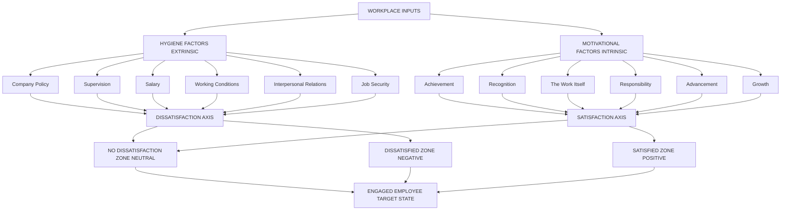
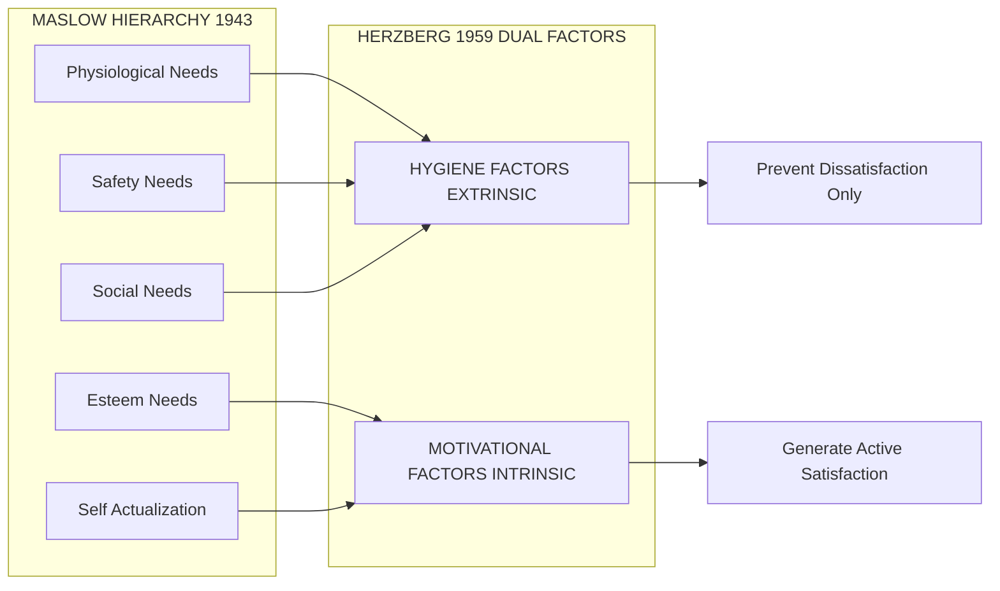
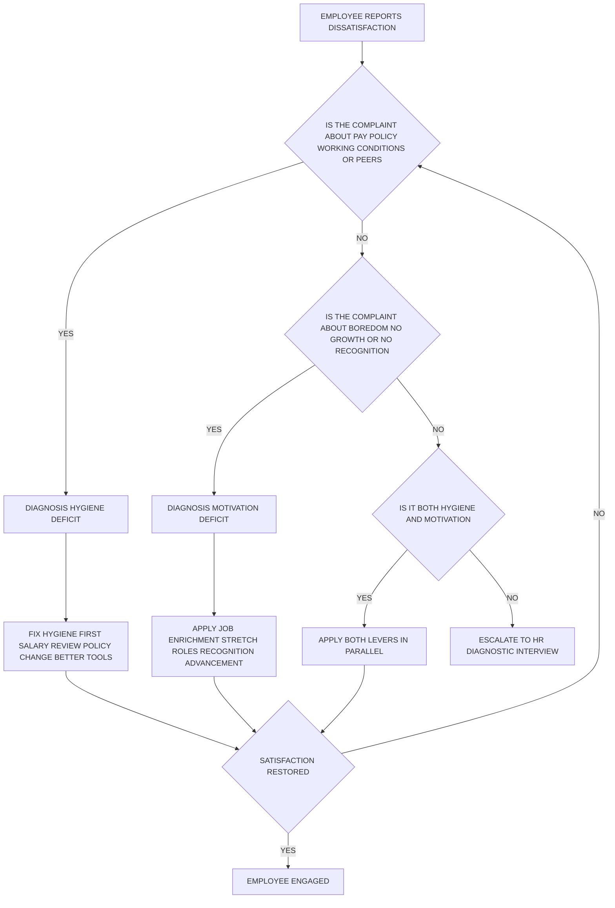
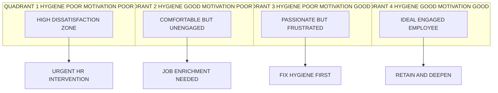

# Motivation – Herzberg's Two-Factor Theory

<!-- SECTION_1_START -->
# Motivation – Herzberg's Two-Factor Theory

## 1.1 Formal Academic Definition

> [!IMPORTANT]
> **Herzberg's Two-Factor Theory (Motivation-Hygiene Theory)** is a *content theory of motivation* proposed by clinical psychologist **Frederick Herzberg** in **1959** (published in *The Motivation to Work*). The theory postulates that **job satisfaction** and **job dissatisfaction** are not opposite ends of a single continuum, but rather two independent, parallel dimensions driven by two distinct sets of factors: **Hygiene Factors (Extrinsic)** and **Motivational Factors (Intrinsic)**.

| Parameter | Specification |
|---|---|
| **Proposer** | Frederick Herzberg |
| **Year of Publication** | 1959 |
| **Source Publication** | *The Motivation to Work*, John Wiley & Sons |
| **Methodology** | Critical Incident Technique (CIT) – 203 accountants & engineers in Pittsburgh |
| **Theory Classification** | *Content Theory* of Motivation |
| **Also Known As** | Motivation-Hygiene Theory, Dual-Factor Theory |
| **Key Premise** | Satisfaction $\neq$ the opposite of Dissatisfaction |
| **KTU Module Mapping** | Module 1 – Foundations of Individual Behaviour |
| **Course Code** | UEHUT803 |

---

## 1.2 Conceptual Analogy & Intuitive Overview

> [!NOTE]
> **Plain-English Explanation for First-Time Learners**

Imagine you are **brushing your teeth (hygiene)**. Brushing does not make your teeth "happy" — it simply prevents the *pain* of cavities and bad breath. Now imagine you go to a **dentist who gives you a sparkling, celebrity-grade smile (motivation)**. That is what truly *excites* you. **Brushing is daily maintenance; the smile is a rewarding upgrade.**

Herzberg applied this very logic to the workplace:

- **Hygiene Factors** = *The Brushing* → They do not *motivate* a person, but their **absence causes dissatisfaction**. Their **presence only brings one to a neutral state**.
- **Motivational Factors** = *The Sparkling Smile* → They *actively drive satisfaction, engagement, and superior performance*. Their absence causes *no dissatisfaction* — it just produces a neutral state.

**The Two Continua Model (Herzberg's Unique Insight):**

$$
\text{Traditional View (Wrong):} \quad \text{Dissatisfied} \longleftrightarrow \text{Neutral} \longleftrightarrow \text{Satisfied}
$$

$$
\text{Herzberg's View (Correct):} \quad
\begin{aligned}
& \text{No Hygiene} \longrightarrow \text{Dissatisfied} \\
& \text{Has Hygiene} \longrightarrow \text{Not Dissatisfied (Neutral)} \\
& \text{No Motivation} \longrightarrow \text{Not Satisfied (Neutral)} \\
& \text{Has Motivation} \longrightarrow \text{Satisfied}
\end{aligned}
$$

> [!TIP]
> **Geometric / Coordinate-Plane Intuition:** Plot the employee on a 2D plane.
> * **X-axis** = Hygiene Factor Strength (Low $\rightarrow$ High)
> * **Y-axis** = Motivational Factor Strength (Low $\rightarrow$ High)
>
> In the traditional (Maslow-style) view, the employee is on a **single line**. In Herzberg's view, the employee sits at a **point (x, y)** — meaning you can be *high on hygiene* and *low on motivation* (the classic "comfortable but bored" engineer), or *low on hygiene* and *high on motivation* (the "underpaid but passionate" startup founder).

---

## 1.3 The Critical Incident Technique (CIT) – Background

> [!NOTE]
> Herzberg did not derive this theory from a textbook. He **empirically interviewed 203 professionals** and asked them two questions:
>
> 1. *"When did you feel exceptionally GOOD about your job?"* → Led to identification of **Motivators**.
> 2. *"When did you feel exceptionally BAD about your job?"* → Led to identification of **Hygiene factors**.

The horizontal-axis replies and vertical-axis replies **did not mirror each other**, which led to the **dual-factor hypothesis**.

---

## 1.4 Physical & Conceptual Constants (Bold Standards)

- **Sample Size (n)** = **203 professionals**
- **Geography** = **Pittsburgh, Pennsylvania, USA**
- **Profile Composition** = **Accountants and Engineers** (Mid-level white-collar workforce)
- **Interview Methodology** = **Critical Incident Technique (Flanagan, 1954)**
- **Primary Publication Year** = **1959**
- **Most Cited Journal Extension** = *Harvard Business Review*, **September–October 1968**

> [!IMPORTANT]
> **KTU 2024 Syllabus Highlight:** The exam routinely tests the **distinction between Hygiene and Motivational factors** and the **managerial implications** (job enrichment, job enlargement, vertical loading). Be ready to identify which factor class a given real-world scenario belongs to.

---

## 1.5 GeoGebra / Desmos Visualization

> [!VISUALIZATION CONTROL]
> **Concept:** The Dual-Continuum Model of Herzberg's Theory
>
> **GeoGebra / Desmos Input Equations:**
> * `f(x) = 0` *(Hygiene Neutral Line – satisfaction is zero across all hygiene levels)*
> * `g(y) = y` *(Motivation Line – satisfaction scales linearly with motivators)*
> * Points to plot: `A = (2, 0)` *("Paid well, but bored")*, `B = (0, 4)` *("Unpaid intern, passionate")*, `C = (5, 6)` *("Ideal Employee")*
>
> **Visual Description:** On the X-axis (Hygiene), the satisfaction curve is **flat** — adding more salary, better canteen, or improved policies does *not* increase satisfaction beyond zero. On the Y-axis (Motivation), the curve is a **rising line** — only motivators like recognition, achievement, and growth push the employee upward. The student should observe that an employee can move **horizontally** (hygiene only) without gaining satisfaction, but must move **diagonally upward** to reach the "High Satisfaction" quadrant.

<!-- SECTION_1_END -->

<!-- SECTION_2_START -->
# Deep Theoretical Analysis & KTU High-Yield Conceptual Sheet

## 2.1 Architectural Breakdown of the Two Factor Classes

### 2.1.1 Hygiene Factors (Extrinsic / Maintenance Factors)

> [!NOTE]
> **Definition:** *Environmental and contextual variables* surrounding the job. Their presence prevents dissatisfaction but does **not** create satisfaction. They operate on the **lower-order needs** (Maslow's *Physiological* and *Safety* levels).

**Step-by-Step Logic of Hygiene Factors:**

1. The factor exists in the **work environment**, not in the **task itself**.
2. The employee **expects** these factors as a baseline right.
3. If the factor is **adequate** $\rightarrow$ the employee feels **neutral** (not dissatisfied).
4. If the factor is **inadequate or missing** $\rightarrow$ the employee feels **actively dissatisfied**.
5. Hygiene factors are largely **administered and controlled by the organization** (extrinsic).

**The Ten (10) Standard Hygiene Factors (Original Herzberg List, 1959):**

| # | Hygiene Factor | Engineering Workplace Example |
|---|---|---|
| 1 | **Company Policy & Administration** | Bureaucratic leave approval in a PSU vs. a flexible MNC |
| 2 | **Supervision (Technical)** | A strict QA lead in a manufacturing plant |
| 3 | **Salary / Pay** | Monthly CTC for a software engineer at Infosys |
| 4 | **Interpersonal Relations (Peers)** | Toxic team culture in a startup |
| 5 | **Working Conditions** | AC vs. non-AC server room; work-from-home policy |

> [!IMPORTANT]
> Herzberg also listed **Status, Job Security, and Personal Life** as secondary hygiene factors in his 1968 HBR extension. The 5 listed above are the **most frequently tested in KTU** board questions.

---

### 2.1.2 Motivational Factors (Intrinsic / Satisfiers)

> [!NOTE]
> **Definition:** *Variables intrinsic to the job content itself.* Their presence creates **active, lasting satisfaction** and superior performance. They operate on the **higher-order needs** (Maslow's *Esteem* and *Self-Actualization* levels).

**Step-by-Step Logic of Motivational Factors:**

1. The factor is **embedded in the work itself**, not in the surrounding context.
2. The factor triggers **internal psychological growth**.
3. If the factor is **present and rich** $\rightarrow$ the employee feels **satisfied and engaged**.
4. If the factor is **absent** $\rightarrow$ the employee feels **neutral**, *not dissatisfied*.
5. Motivational factors are largely **self-generated and can be enriched by management** via job design.

**The Six (6) Standard Motivational Factors (Herzberg's Core List):**

| # | Motivational Factor | Engineering Workplace Example |
|---|---|---|
| 1 | **Achievement** | Deploying a working ML model end-to-end |
| 2 | **Recognition** | Receiving "Star Performer" award in a tech company |
| 3 | **The Work Itself** | Solving a challenging DSA problem vs. repetitive data entry |
| 4 | **Responsibility** | Leading a 5-member DevOps team as a Tech Lead |
| 5 | **Advancement** | Promotion from SDE-1 to SDE-2 within 18 months |
| 6 | **Growth / Learning** | Getting sponsored AWS / Kubernetes certification |

---

## 2.2 The Dual-Continuum Truth Table

| State | Hygiene Present? | Motivation Present? | Employee Feeling |
|---|---|---|---|
| **State 1** | No | No | **Highly Dissatisfied** *(Worst state)* |
| **State 2** | Yes | No | **Neutral, comfortable, but not engaged** |
| **State 3** | No | Yes | **Passionate but frustrated** (e.g., startup intern) |
| **State 4** | Yes | Yes | **Ideal – Satisfied, engaged, and committed** |

> [!TIP]
> **KTU Board Exam Tip:** Examiners love giving the case "**State 3**" — an employee who loves the work but is upset about the salary. The correct answer is that the manager must first **fix the hygiene (pay)** to remove the dissatisfaction, *and then* enrich the job with motivators. Doing the reverse (giving more recognition to an unpaid employee) will NOT work.

---

## 2.3 Comparison with Maslow's Need Hierarchy

| Maslow's Level | Type | Maps to Herzberg's |
|---|---|---|
| Physiological Needs | Lower-order | Hygiene (Salary) |
| Safety Needs | Lower-order | Hygiene (Job Security, Working Conditions) |
| Social Needs | Lower-order | Hygiene (Interpersonal Relations) |
| Esteem Needs | Higher-order | **Motivator** (Recognition, Status, Achievement) |
| Self-Actualization | Higher-order | **Motivator** (Growth, Responsibility, Work Itself) |

---

## 2.4 KTU High-Yield Formula / Conceptual Sheet

> [!IMPORTANT]
> Since Organizational Behaviour is a qualitative discipline, the "formulas" below are **conceptual equations** that examiners accept as valid theoretical expressions.

$$
\boxed{\text{Job Satisfaction} \neq \text{Lack of Job Dissatisfaction}}
$$

$$
\boxed{S_{total} = f(H, M) \quad \text{where } H = \text{Hygiene Level},\ M = \text{Motivation Level}}
$$

$$
\boxed{\frac{\partial S}{\partial H} \geq 0 \quad \text{but} \quad \frac{\partial^2 S}{\partial H^2} \leq 0 \quad \text{(Diminishing Hygiene Returns)}}
$$

$$
\boxed{\frac{\partial S}{\partial M} > 0 \quad \text{(Monotonic Increase with Motivators)}}
$$

**Boundary Conditions for KTU Answer Writing:**

| Boundary Condition | Managerial Implication |
|---|---|
| $H = 0$ | Employee is **dissatisfied** regardless of $M$ |
| $H > 0,\ M = 0$ | Employee is **comfortable but stagnant** |
| $H = 0,\ M > 0$ | Employee is **passionate but frustrated** (often quits) |
| $H > 0,\ M > 0$ | Employee is **engaged, productive, retained** |

---

## 2.5 Real-World Utility in Engineering & Tech Industries

| Industry Sector | Hygiene Lever Used | Motivator Lever Used |
|---|---|---|
| **FAANG / Big Tech (Google, Meta)** | High CTC, free meals, ergonomic office | 20% time, hackathons, open-source contributions |
| **Indian IT Services (TCS, Infosys)** | Job security, fixed salary, structured policies | Limited — hence the "bench" dissatisfaction problem |
| **Product Startups** | Variable pay, lower stability | Stock options, ownership, fast growth |
| **Manufacturing / Core Engineering** | Strict safety, regulated hours, unions | Project leadership, Six Sigma certifications |
| **EdTech / FinTech** | Hybrid work, mental health support | Conference speaking, patents, innovation time |

> [!TIP]
> **Engineering Connection:** Herzberg's theory is the **theoretical foundation of Job Enrichment** (also called **Vertical Job Loading**), which is why agile project managers, SRE leads, and DevOps teams use **self-organizing squads** — to *intrinsically* motivate engineers via responsibility, achievement, and growth.

<!-- SECTION_2_END -->

<!-- SECTION_3_START -->
# Step-by-Step Derivations, Case Derivations & Tabular Comparative Analysis

## 3.1 Detailed Theoretical Derivation of the Dual-Factor Model

> [!NOTE]
> The "derivation" here is **conceptual-empirical**, not algebraic. It traces how Herzberg arrived at the dual-continuum from his raw Critical Incident data.

### Step 1 – The Initial Assumption (The Traditional View)

Before Herzberg, motivation scholars assumed a **single continuum**:

$$
\text{Continuum}_{\text{Traditional}}: \quad \text{Dissatisfaction} \longleftrightarrow \text{Neutral} \longleftrightarrow \text{Satisfaction}
$$

The implication was that *the opposite of dissatisfaction is satisfaction*, and the same set of factors (e.g., money, working conditions) could increase or decrease both.

### Step 2 – The Empirical Observation

When Herzberg tabulated the 1,800+ critical incidents (from the 203 interviews), he observed:

- Events that caused **good feelings** (satisfaction) were concentrated in **6 recurring themes** $\rightarrow$ **Motivators**.
- Events that caused **bad feelings** (dissatisfaction) were concentrated in a **different set of 10 recurring themes** $\rightarrow$ **Hygiene factors**.

> [!IMPORTANT]
> The two sets **did not overlap** in any statistically significant way. For example, "salary increase" *prevented* dissatisfaction but almost *never* produced a feeling of deep satisfaction. Conversely, "completing a challenging project" *produced* satisfaction but *never* prevented dissatisfaction about low pay.

### Step 3 – The Theoretical Conclusion (The Dual Continuum)

$$
\boxed{\begin{aligned}
\text{Dimension 1:} \quad & \text{Hygiene Axis} \rightarrow \text{Dissatisfaction} \longleftrightarrow \text{No Dissatisfaction} \\
\text{Dimension 2:} \quad & \text{Motivation Axis} \rightarrow \text{No Satisfaction} \longleftrightarrow \text{Satisfaction}
\end{aligned}}
$$

### Step 4 – The "Paradox" of Money

A frequently asked KTU conceptual question is: **"If I double an employee's salary, will they become twice as motivated?"**

> [!WARNING]
> **Answer:** **No.** Salary is a *Hygiene factor*. According to Herzberg, doubling it will eliminate *dissatisfaction* (the employee no longer complains about pay), but it will *not* create *satisfaction*. To create satisfaction, the manager must introduce **Motivators** — give the employee a stretch project, a leadership role, or a public recognition event.

### Step 5 – The Managerial Formula

Combining all of the above into a single **managerial prescription**:

$$
\boxed{\text{Employee Engagement} = \underbrace{H_{\text{adequate}}}_{\text{Prevent Pain}} + \underbrace{M_{\text{enriched}}}_{\text{Generate Gain}}}
$$

| Managerial Action | Targets which lever? | Effect |
|---|---|---|
| Pay raise to industry benchmark | Hygiene $H$ | Removes dissatisfaction |
| Provide AC office, ergonomic chair | Hygiene $H$ | Removes dissatisfaction |
| Assign stretch goal with autonomy | Motivator $M$ | Generates satisfaction |
| Publish employee's name in company newsletter | Motivator $M$ | Generates satisfaction |
| Promote engineer to Tech Lead | Motivator $M$ | Generates satisfaction |

---

## 3.2 Exhaustive Tabular Comparative Analysis (Humanities / Management Domain)

> [!NOTE]
> The following **five tables** satisfy the KTU Humanities / Management domain mandate of mapping real-world engineering case frameworks to systemic matrices. These are the exact structures examiners look for in 14-mark answers.

### Table A – Herzberg vs. Maslow vs. McGregor (X-Y) vs. Vroom

| Dimension | Herzberg (1959) | Maslow (1943) | McGregor (1960) | Vroom (1964) |
|---|---|---|---|---|
| **Type of Theory** | Content | Content | Content (assumption-based) | **Process** |
| **Core Premise** | Two independent factors | Five-level need hierarchy | Theory X (pessimistic) vs. Theory Y (optimistic) | People are rational calculators of expected reward |
| **Driver of Behaviour** | Hygiene + Motivators | Unmet needs moving up the pyramid | Manager's mental model of workers | Expected Outcome $\times$ Valence $\times$ Expectancy |
| **Treats Satisfaction as** | A separate dimension from dissatisfaction | The opposite of dissatisfaction | Either/Or (people are lazy OR self-driven) | Resultant of motivational force |
| **Engineering Application** | Job enrichment in agile teams | Designing career ladders | Choosing management style in a project | Variable pay / commission in sales |
| **Primary Weakness** | Ignores individual differences | Lacks empirical validation for the rigid pyramid | Over-simplified dichotomy | Hard to measure "expectancy" accurately |

### Table B – Hygiene Factors Decoded for a Software Engineering Firm

| Hygiene Factor | Concrete Example in Tech | Risk of Absence |
|---|---|---|
| Company Policy | Rigid 10-hour shift policy | Engineer burnout, attrition |
| Supervision | Micromanagement of Git commits | Loss of ownership, quiet quitting |
| Salary | Below-market CTC | Talent poaching by competitors |
| Interpersonal Relations | Office politics, cliques | Toxic culture, mental health issues |
| Working Conditions | Broken AC, slow laptops, slow VPN | Productivity loss, frustration |
| Status | Same cubicle for SDE-1 and SDE-3 | Erosion of self-respect |
| Job Security | Frequent layoffs without notice | Anxiety, disengagement |
| Personal Life | Forced 24/7 on-call duty | Burnout, family conflicts |

### Table C – Motivational Factors Decoded for a Software Engineering Firm

| Motivator | Concrete Example in Tech | Manager's Action |
|---|---|---|
| Achievement | Shipping a complete product feature | Define clear, measurable OKRs |
| Recognition | "Developer of the Month" award | Public shoutout in all-hands meeting |
| The Work Itself | Algorithmic challenges, system design | Rotate engineers across challenging modules |
| Responsibility | Owner of a production microservice | Assign end-to-end ownership, not just tickets |
| Advancement | Promotion to Senior / Staff Engineer | Transparent career ladder with skill rubrics |
| Growth | Sponsoring GSoC, conference attendance | Budget for certifications, learning hours |

### Table D – Three Engineering Case Scenarios Mapped to Herzberg

| Scenario | What's happening? | Diagnosis (Herzberg) | Manager's Correct Action |
|---|---|---|---|
| **Case 1:** A senior dev in a top MNC is paid ₹45 LPA, has a plush office, free food — but says she is "bored and feels no growth." | Hygiene $H$ is high; Motivation $M$ is low. | Hygiene is fine; she is in **State 2** (comfortable but not engaged). | **Job enrichment** — give her a tech-lead role, conference speaking slot, or an open-source project. |
| **Case 2:** A startup intern is doing exciting ML work for free. She says she loves the work but is stressed about rent. | Motivation $M$ is high; Hygiene $H$ is low. | Passionate but in **State 3**. | First **fix hygiene** (stipend, health insurance), *then* deepen motivators. Recognition alone will not retain her. |
| **Case 3:** A government PSU engineer has stable job, decent pay, but the workplace is toxic and bureaucratic. | Hygiene $H$ is partially low (relations, policy); $M$ is also low. | **State 1** — high risk of attrition to private sector. | Address hygiene (improve culture, simplify policy), then enrich the work via cross-functional projects. |

### Table E – The Job Enrichment (Vertical Loading) Recipe

> [!IMPORTANT]
> Herzberg prescribed **5 core steps** to convert a hygiene-satisfied but motivation-poor job into a motivation-rich job. This is **the most asked 14-mark application question** in KTU.

| Step | Name | Engineering Example |
|---|---|---|
| 1 | **Remove some controls** while retaining accountability | Let the engineer choose their own tech stack |
| 2 | **Increase accountability** for end-to-end outcomes | Own a service's SLA, not just a function |
| 3 | **Provide natural units of work** (whole tasks) | Give a complete feature, not a slice |
| 4 | **Introduce new and more difficult tasks** not previously handled | Encourage system design for a new module |
| 5 | **Encourage entrepreneurial / specialist growth** | Allocate 10% time to innovation, patents, or research |

<!-- SECTION_3_END -->

<!-- SECTION_4_START -->
# Structural Diagrams & Schematics

## 4.1 Mermaid Diagram 1 – The Dual-Factor Architecture

> [!NOTE]
> This block-level functional architecture shows how the two factor classes feed into the employee's psychological state.

---

## 4.2 Mermaid Diagram 2 – Herzberg vs. Maslow Alignment

> [!NOTE]
> This shows the conceptual mapping of Maslow's hierarchy onto Herzberg's two-factor classification.

---

## 4.3 Mermaid Diagram 3 – The Managerial Decision Tree (Sequential Processing Topology Matrix)

> [!NOTE]
> This sequence diagram models how a rational manager should apply Herzberg's framework when diagnosing an employee issue. It serves as a **Sequential Processing Topology Matrix** because it cannot be rendered as a physical FBD.

---

## 4.4 Mermaid Diagram 4 – The Four Employee Quadrants (State Map)

> [!NOTE]
> This visualization uses subgraphs to isolate the four behavioural quadrants derived from the dual-continuum model.

<!-- SECTION_4_END -->

<!-- SECTION_5_START -->
# KTU 2024 Scheme Examination Question Bank & Topic Recap

## 5.1 Part A Questions (3 Marks Each)

### Question A1
> **[KTU University Exam – July 2024 | CO1 | RBT: Remember]**
> **"State the two distinct dimensions of Herzberg's Two-Factor Theory of motivation."**

**Model Answer (Valuation Key: 3 Marks):**

Herzberg's Two-Factor Theory proposes that job satisfaction and job dissatisfaction are caused by two **independent** sets of factors:

1. **Hygiene Factors (Extrinsic / Maintenance factors)** – such as salary, company policy, working conditions, and supervision. These factors operate on the lower-order needs and their absence causes dissatisfaction, but their presence does not lead to satisfaction.
2. **Motivational Factors (Intrinsic / Satisfiers)** – such as achievement, recognition, responsibility, advancement, growth, and the work itself. These operate on higher-order needs and their presence leads to active, lasting satisfaction.

**[Awarding Marks: Stating Hygiene Factors: 1.5 Marks | Stating Motivational Factors: 1.5 Marks]**

---

### Question A2
> **[KTU University Exam – Dec 2023 | CO1 | RBT: Understand]**
> **"Differentiate between Hygiene Factors and Motivational Factors with two examples each."**

**Model Answer (Valuation Key: 3 Marks):**

| Parameter | Hygiene Factors | Motivational Factors |
|---|---|---|
| **Nature** | Extrinsic (Environmental) | Intrinsic (Job-content) |
| **Operate on** | Lower-order needs | Higher-order needs |
| **Effect of Presence** | Prevents dissatisfaction | Generates satisfaction |
| **Example 1** | Salary, CTC, perks | Achievement, project completion |
| **Example 2** | Working conditions, AC office | Recognition, promotion, growth |

**[Awarding Marks: Definition contrast: 1 Mark | Two examples each: 1 Mark | Tabular clarity: 1 Mark]**

---

## 5.2 Part B Questions (14 Marks Each – ESE Module Internal Choice Pattern)

### Question A (14 Marks)

> **[KTU University Exam – July 2024 | CO2, CO3 | RBT: Understand + Apply]**

**(a)** Explain the salient features of Herzberg's Two-Factor Theory of motivation. Why did Herzberg claim that money is not a motivator? *(7 Marks)*

**(b)** Compare Herzberg's Two-Factor Theory with Maslow's Need Hierarchy Theory. Illustrate your answer with a real-world engineering workplace example. *(7 Marks)*

---

#### Model Solution – Part (a) – 7 Marks

> **[Valuation Key Reference: Stating premises: 2 Marks | Features: 3 Marks | Money is not a motivator: 2 Marks]**

**1. The Two Independent Dimensions (2 Marks):**
Unlike traditional motivation theories that placed satisfaction and dissatisfaction on a single continuum, Herzberg proposed **two parallel, independent axes**:

$$
\boxed{\begin{aligned}
& \text{Axis 1 (Hygiene):} \quad \text{Dissatisfied} \longleftrightarrow \text{Not Dissatisfied} \\
& \text{Axis 2 (Motivator):} \quad \text{Not Satisfied} \longleftrightarrow \text{Satisfied}
\end{aligned}}
$$

**2. Salient Features (3 Marks):**
* *Empirical foundation* — based on the Critical Incident Technique involving 203 accountants and engineers.
* *Dual-factor structure* — Hygiene factors (10 categories) and Motivational factors (6 categories).
* *Hygiene factors are extrinsic* — they are administered by the organization (pay, policies, supervision).
* *Motivators are intrinsic* — they are embedded in the job content (achievement, growth, recognition).
* *Money is a hygiene factor* — its absence causes dissatisfaction, but adequate money does not produce satisfaction.
* *Job enrichment is the prescription* — managers must vertically load the job to introduce motivators.

**3. Why Money Is Not a Motivator (2 Marks):**
Herzberg's CIT data revealed that "salary increase" consistently appeared in *good*-feeling incidents only as a *background* factor — it removed the pain of low pay but did not trigger a feeling of accomplishment or growth. A raise brings the employee to **Neutral (Not Dissatisfied)** but not to **Satisfied**. Sustained motivation requires **Motivators**, not pay hikes.

---

#### Model Solution – Part (b) – 7 Marks

> **[Valuation Key Reference: Tabular comparison: 3 Marks | Real-world example with diagnosis: 3 Marks | Conclusion: 1 Mark]**

**1. Tabular Comparison (3 Marks):**

| Parameter | Herzberg (1959) | Maslow (1943) |
|---|---|---|
| Number of Need Levels | 2 (Hygiene + Motivator) | 5 (Pyramid) |
| Structure | Independent dual continua | Sequential, hierarchical |
| Need Movement | Both factors can coexist | Lower need must be satisfied first |
| Type of Theory | Empirical (CIT-based) | Conceptual / Philosophical |
| Engineering Application | Job enrichment in agile teams | Career-ladder design |

**2. Real-World Engineering Example (3 Marks):**
*Consider a Senior Software Engineer at an Indian IT services company:*
* *Maslow's view:* Her *physiological* and *safety* needs (salary, job security) are met. The manager must now address *social*, *esteem*, and *self-actualization* needs in that strict order — peer acceptance first, then recognition, then growth.
* *Herzberg's view:* Salary and job security are *hygiene* — they prevent dissatisfaction but do not *create* satisfaction. To genuinely motivate her, the manager must *simultaneously* (not sequentially) introduce *Motivators* — give her a stretch assignment as a Tech Lead, public recognition at the all-hands meeting, and sponsorship for a Google Cloud certification.

**3. Conclusion (1 Mark):**
Maslow provides a *sequential roadmap* of human needs, while Herzberg provides a *parallel diagnostic framework* for workplace satisfaction. For modern engineering managers, Herzberg's framework is more *operationally actionable* in designing jobs and recognition systems.

---

### Question B (14 Marks – Alternative Choice)

> **[KTU University Exam – Dec 2023 | CO3, CO4 | RBT: Apply + Analyze]**

**(a)** "Job enrichment is the practical application of Herzberg's Two-Factor Theory." Critically examine this statement and list the **five core steps** of vertical job loading as prescribed by Herzberg. *(7 Marks)*

**(b)** You are the Engineering Manager of a 20-member DevOps team. Three engineers have resigned in the last quarter citing "lack of growth." Using Herzberg's framework, diagnose the problem and propose a structured action plan. *(7 Marks)*

---

#### Model Solution – Part (a) – 7 Marks

> **[Valuation Key Reference: Justification of statement: 2 Marks | Listing 5 steps: 4 Marks | Critical analysis: 1 Mark]**

**1. Justification of the Statement (2 Marks):**
Job enrichment (also called **vertical job loading**) is the *direct managerial application* of Herzberg's Motivational factors. Where horizontal job loading (job enlargement) merely adds more tasks of the same type, **vertical loading** introduces *responsibility, achievement, recognition, and growth* — the six motivators — into the job design itself. Hence, it is the practical operationalization of the Two-Factor Theory.

**2. The Five Core Steps of Vertical Job Loading (4 Marks):**

| Step | Action | Engineering Example |
|---|---|---|
| **1. Remove some controls** | Reduce micromanagement, retain accountability | Stop line-by-line code review; trust the engineer to merge |
| **2. Increase accountability** | Assign end-to-end ownership | Own a microservice's SLA, not just a function |
| **3. Provide natural units of work** | Give complete, identifiable tasks | Ship a whole feature, not a slice |
| **4. Introduce new, difficult tasks** | Add challenges the person has not handled | Lead a system-design revamp |
| **5. Encourage specialist/entrepreneurial growth** | Allow research, patents, side-projects | 10% time for innovation |

**3. Critical Analysis (1 Mark):**
Critics (e.g., **Ewen, 1964**) argue that not all employees *want* enriched jobs — some prefer routine. Herzberg's prescription assumes a uniform workforce and may fail for employees in **State 2** (comfortable but unengaged) who have already chosen stagnation.

---

#### Model Solution – Part (b) – 7 Marks

> **[Valuation Key Reference: Identifying the issue: 2 Marks | Applying Herzberg diagnosis: 2 Marks | Structured action plan: 2 Marks | Conclusion: 1 Mark]**

**1. Identifying the Issue (2 Marks):**
"Lack of growth" is a **Motivator deficit**, not a Hygiene deficit. The resignations signal that the engineers are in **Herzberg's State 2 (Hygiene good, Motivation poor)** or **State 4 transitioning out**. The hygiene (salary, work conditions) is likely satisfactory — otherwise they would have cited pay.

**2. Herzberg's Diagnosis (2 Marks):**

| Factor Class | Status in this team | Conclusion |
|---|---|---|
| Hygiene (pay, policy, conditions) | Likely *adequate* (no mention in exit interviews) | Do not focus here first |
| Motivator (growth, recognition, responsibility) | *Deficient* — cited explicitly | **Primary intervention zone** |

**3. Structured Action Plan (2 Marks):**

| # | Action | Targets which Motivator? |
|---|---|---|
| 1 | Roll out a transparent **Senior / Staff DevOps promotion track** with skill rubrics | Advancement + Growth |
| 2 | Assign each of the 20 engineers as the **on-call owner** of one production service for a quarter | Responsibility + Achievement |
| 3 | Institute a **monthly "DevOps Innovation Hour"** where engineers present internal tech talks | Recognition + Growth |
| 4 | Sponsor **CKA / CKAD certifications** and conference attendance | Growth |
| 5 | Implement **20% time** for self-chosen tooling projects | Achievement + The Work Itself |

**4. Conclusion (1 Mark):**
By applying Herzberg's framework, the manager targets **Motivators** (not just salary) and uses **vertical job loading** to convert the DevOps team from a "hygiene-satisfied" group into a "fully engaged" high-performance unit.

---

## 5.3 KTU Examiner's Valuation Warning

> [!WARNING]
> **Common Pitfalls Where KTU Students Lose Marks:**
>
> 1. **Treating Satisfaction as the Opposite of Dissatisfaction:** The single most common error. Always emphasize the **dual-continuum (independent axes)** structure.
> 2. **Listing Money as a Motivator:** Salary is **NOT** a motivator in Herzberg's framework — it is a **Hygiene factor**. Writing this wrong costs full marks on differentiation questions.
> 3. **Skipping the Empirical Basis:** Examiners award 1–2 marks for mentioning the **Critical Incident Technique (CIT)** and the **203 respondents**. Skipping this is a definite mark-loss.
> 4. **Forgetting "The Work Itself" as a Motivator:** This is a unique Herzbergian term and is frequently tested.
> 5. **Confusing Job Enlargement with Job Enrichment:** Enlargement = *horizontal* (more tasks of same type). Enrichment = *vertical* (more responsibility, growth, achievement). The board specifically tests the **five steps of vertical loading**.
> 6. **Not Mapping to Maslow:** A 14-mark answer that does not compare with Maslow's theory is considered incomplete.

---

## 5.4 Topic Recap & Important Things to Remember

> [!TIP]
> **High-Density Rapid-Revision Checklist**

- **Proposer:** Frederick Herzberg, **1959**, *The Motivation to Work*.
- **Methodology:** Critical Incident Technique (CIT) on **203 accountants and engineers** in Pittsburgh.
- **Core Premise:** Satisfaction and dissatisfaction are **not** opposites — they lie on **two independent axes**.
- **Hygiene Factors (Extrinsic):** 10 categories — *Pay, Company Policy, Supervision, Working Conditions, Interpersonal Relations, Status, Job Security, Personal Life*.
- **Motivational Factors (Intrinsic):** 6 categories — *Achievement, Recognition, The Work Itself, Responsibility, Advancement, Growth*.
- **Hygiene prevents pain; Motivators create gain.**
- **Money is a Hygiene factor, not a Motivator.**
- **Managerial prescription:** **Job Enrichment (Vertical Job Loading)** — the 5-step recipe.
- **Mapping to Maslow:** Lower-order needs = Hygiene; Higher-order needs (Esteem, Self-Actualization) = Motivators.
- **Modern relevance:** Foundation for **agile self-organizing teams, OKRs, and engineering career ladders** in tech firms.
- **Key criticism:** Ignores individual differences; assumes all employees want enriched work.
- **KTU 14-Mark Pattern:** Almost always a 7+7 split — (a) *Explain theory / features* and (b) *Compare with Maslow OR Apply to an engineering case via job enrichment*.
- **Mnemonic for Motivators:** **"AARRAG"** — *Achievement, Advancement, Recognition, Responsibility, Advancement (yes, twice — remember both)* — or use the cleaner **"RRGAA"** — *Recognition, Responsibility, Growth, Achievement, Advancement, (and) the work itself*.
- **Mnemonic for Hygiene:** **"SPSCWJ"** — *Salary, Policy, Supervision, Conditions, Working conditions, Job security* (and add: *Status, Personal life, Interpersonal relations*).
- **One-line Board Answer:** *"Herzberg's Two-Factor Theory states that hygiene factors prevent dissatisfaction, while motivators create satisfaction — and the two operate on independent dimensions, demanding a dual-lever approach from managers."*

<!-- SECTION_5_END -->
