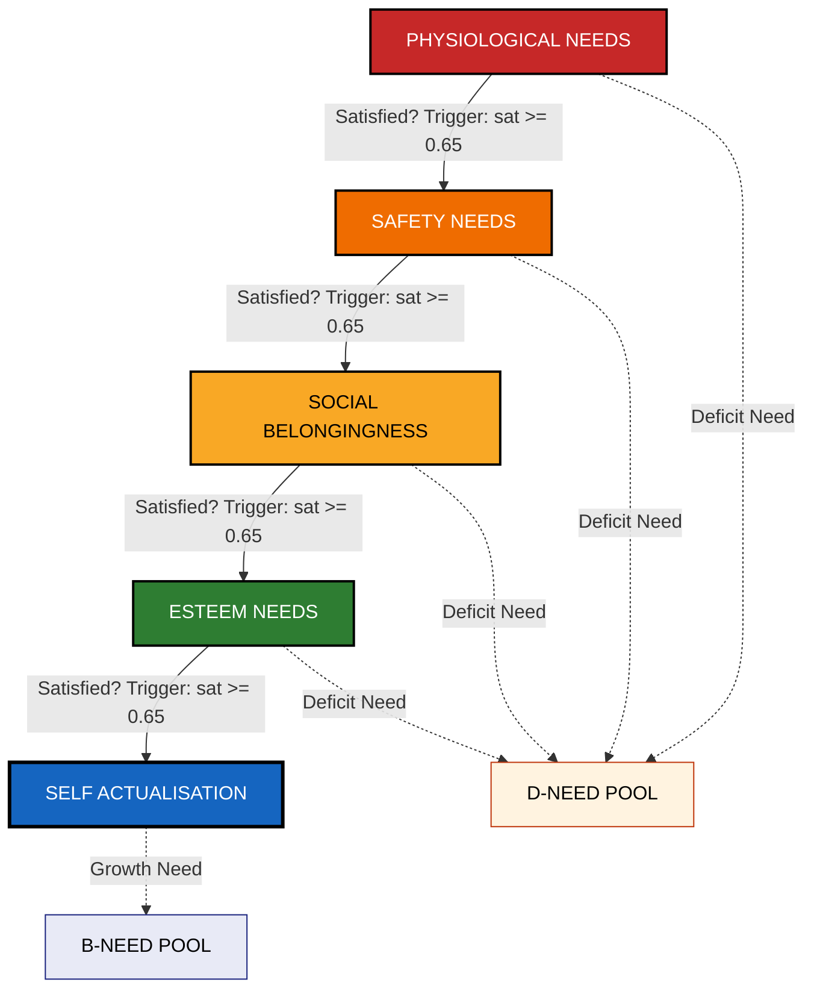
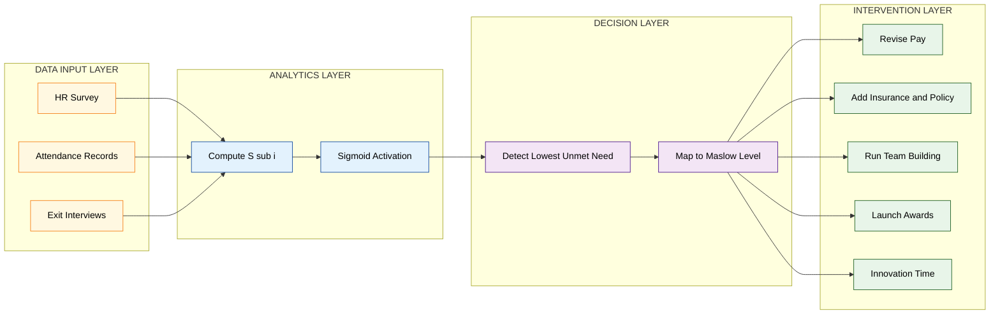
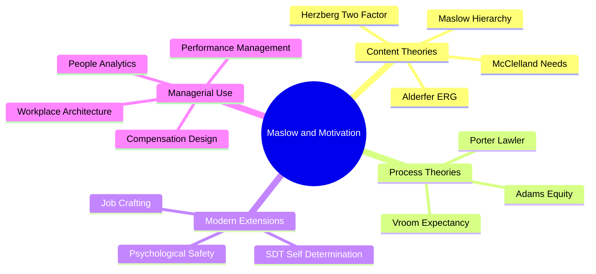

# Motivation – Maslow's Need Hierarchy Theory

<!-- SECTION_1_START -->

# Motivation – Maslow's Need Hierarchy Theory

> [!IMPORTANT]
> **KTU 2024 Scheme | UEHUT803 | Module 1 – Foundations of Individual Behaviour**
> This topic is a **high-weightage, frequently tested** concept in KTU University Examinations. It falls under **CO1 (Understand the dynamics of individual behaviour in organizations)** and is consistently mapped to **Bloom's Level: Remember / Understand / Apply**.

---

## 1.1 Formal Academic Definition

**Motivation** is the internal psychological process that activates, directs, and sustains human behaviour toward the attainment of a goal. Within the broader domain of **Organisational Behaviour**, motivation explains *why* employees exert effort, *what* channels that effort, and *how long* that effort is sustained.

**Maslow's Need Hierarchy Theory** is a **content theory of motivation** propounded by the American psychologist **Dr. Abraham Harold Maslow** in his landmark paper *"A Theory of Human Motivation"* published in the *Psychological Review* (Vol. **50**, 1943, pp. 370–396). The theory postulates that human beings are driven by **five categorically distinct sets of needs** arranged in a **hierarchical, prepotent order**, where needs at the lower level must be reasonably satisfied before higher-level needs emerge as motivators of behaviour.

The five levels, from the base of the pyramid to the apex, are:

| Level | Need Category | Core Question Answered |
| :---: | :--- | :--- |
| **1** | Physiological Needs | *"How do I survive?"* |
| **2** | Safety Needs | *"How do I feel secure?"* |
| **3** | Social / Belongingness Needs | *"Where do I belong?"* |
| **4** | Esteem Needs | *"Am I respected and valued?"* |
| **5** | Self-Actualisation Needs | *"Am I fulfilling my potential?"* |

> [!NOTE]
> **KTU Board Highlight:** In the later refinement (*Motivation and Personality*, **1954** and the **1987** edition co-edited by R. Frager et al.), Maslow added **Cognitive Needs** (knowledge, understanding) between Esteem and Self-Actualisation, and a sixth apex level called **Transcendence Needs** (helping others reach self-actualisation). For **KTU 2024 examinations**, the **classical 5-level model is the mandated version**, with the additional levels mentioned only as a brief extension if the question demands a *critically updated perspective*.

---

## 1.2 Conceptual Analogy – The "Lifeboat on a Mountain" Intuition

Imagine a group of **ten hikers climbing a mountain**, and they have only **one lifeboat** stationed at the base camp.

- The hikers cannot think about *painting the boat beautifully* (Esteem) when the boat is **leaking water** (Physiological need).
- Once the boat is **repaired and watertight** (Safety), they will not stay in it alone — they will **invite teammates inside** (Belongingness).
- After forming a **cohesive crew**, they will want to be **appointed Captain or Navigator** (Esteem).
- Finally, the most fulfilled hikers will start **charting unexplored routes to the summit** (Self-Actualisation).

> [!TIP]
> **The Lifeboat Analogy** maps perfectly to Maslow's logic: **lower-order (deficit) needs must be patched first**; only then do higher-order (growth) needs become the dominant drivers of behaviour. In a corporate setting, an employee who is **starving, fearing layoffs, and isolated** in the workplace will *not* be motivated by awards, promotions, or creative projects. The manager must first secure the **foundational layers** of need satisfaction.

---

## 1.3 Visualising the Hierarchy – Geometric Intuition

> [!VISUALIZATION CONTROL]
> **Concept:** Geometric pyramid representation of Maslow's Need Hierarchy with a sigmoid (sigmoidal) effort-output curve overlaid.
>
> **GeoGebra / Desmos Input Equations:**
>
> * $f(x) = \dfrac{1}{1 + e^{-10(x-2.5)}}$ — the sigmoid activation curve representing the *emergence of motivation* at each hierarchical level.
> * $L_1: y = 0.2$ (Physiological band)
> * $L_2: y = 0.4$ (Safety band)
> * $L_3: y = 0.6$ (Social band)
> * $L_4: y = 0.8$ (Esteem band)
> * $L_5: y = 1.0$ (Self-Actualisation band)
>
> **Visual Description:** Plot the sigmoid $f(x)$ along the $x$-axis (representing the *degree of lower-level need satisfaction*). The $y$-axis represents the *intensity of higher-level need motivation*. Students should observe that **$f(x)$ remains near zero** until $x$ crosses a critical threshold (prepotency), after which it **rises sharply** — this geometrically captures Maslow's principle that *higher-level needs activate only after lower-level deficits are reduced*.

---

<!-- SECTION_1_END -->

<!-- SECTION_2_START -->

# Deep Theoretical Analysis & KTU High-Yield Formula Sheet

## 2.1 The Three Foundational Propositions of Maslow

Maslow's edifice rests on three logically interlocked propositions that examiners frequently test:

### Proposition 1 – The Deficit Principle (D-Theory)
A need that is **unsatisfied** dominates the psyche and directs behaviour. The moment a need is **substantially gratified**, it ceases to be a motivator and the next higher need takes over.

> [!NOTE]
> **KTU Memory Anchor:** *"Satisfied needs are not motivators."* This is the **single most repeated line** in KTU valuation keys for questions on Maslow.

### Proposition 2 – The Prepotency Principle
Needs are arranged in a **strict hierarchy of potency**. A need becomes *prepotent* (i.e., the dominant motivator) **only when the next-lower need is reasonably satisfied**. Physiological needs dominate Safety; Safety dominates Belongingness; and so on.

### Proposition 3 – The Two-Category Classification
- **Deficit Needs (D-Needs):** Physiological, Safety, Social, Esteem — their absence causes *deficiency pathology*.
- **Growth Needs (B-Needs / Being Needs):** Self-Actualisation — their pursuit leads to *personal growth and fulfilment*.

---

## 2.2 Detailed Anatomy of the Five Levels

### Level 1 – Physiological Needs
- **Definition:** Biological and survival-oriented requirements of the human body.
- **Manifestations:** Hunger, thirst, sleep, shelter, clothing, air, warmth, sex.
- **Organisational Counterparts:** Adequate salary to meet basic sustenance, rest rooms, drinking water, cafeteria, HVAC-controlled workspaces.
- **Managerial Signal:** If employees are absent frequently, lethargic, or unionising over basic pay — physiological needs are unmet.

### Level 2 – Safety Needs
- **Definition:** The need for **security, stability, protection, order, and freedom from fear**.
- **Manifestations:** Job security, safe working conditions, predictable income, insurance, retirement benefits, structured policies.
- **Organisational Counterparts:** Provident Fund (PF), ESI, gratuity, life insurance, written HR policies, grievance redressal mechanisms, ergonomic workstations, fire-safety equipment.
- **Managerial Signal:** High attrition during recession, anxiety about layoffs, over-reliance on written contracts.

### Level 3 – Social / Belongingness Needs
- **Definition:** The need for **affection, love, acceptance, and group membership**.
- **Manifestations:** Friendship, family, romantic relationships, team belonging, professional networks, alumni associations.
- **Organisational Counterparts:** Team-building retreats, mentorship programmes, Employee Resource Groups (ERGs), open-door policies, corporate social clubs (e.g., cricket clubs, photography clubs), inclusive celebrations of festivals.
- **Managerial Signal:** Employees form cliques, seek constant approval, or feel isolated in remote-working scenarios.

### Level 4 – Esteem Needs
- **Definition:** The need for **self-respect, competence, confidence, independence, status, recognition, and respect from others**.
- **Two Sub-Types:**
  - **Self-Esteem (Intrinsic):** Self-confidence, achievement, competence, mastery.
  - **External Esteem (Extrinsic):** Reputation, status, fame, public recognition, awards.
- **Organisational Counterparts:** Promotions, "Employee of the Month" awards, performance bonuses, challenging job assignments, sabbaticals, leadership roles.
- **Managerial Signal:** Employees competing for titles, demanding corner offices, seeking LinkedIn endorsements.

### Level 5 – Self-Actualisation Needs
- **Definition:** The desire to **become the most complete version of oneself** — to fulfil one's innate potential, pursue meaningful work, and engage in creative problem-solving.
- **Manifestations:** Pursuit of mastery, creative expression, altruism, problem-solving for its own sake.
- **Characteristics of Self-Actualisers (Maslow's qualitative observations):**
  1. Accept themselves and others as they are.
  2. Spontaneous in thought and action.
  3. Problem-centred rather than ego-centred.
  4. Autonomous and independent.
  5. Capable of *peak experiences* (moments of intense awe and joy).
  6. Deep interpersonal relationships with a small circle.
  7. Possess a *mission* in life.
  8. Have a *philosophical sense of humour* (never hostile).
- **Organisational Counterparts:** Autonomy in projects, innovation labs (e.g., Google's famous 20% time), sabbaticals, R&D freedom, cross-functional learning opportunities.
- **Managerial Signal:** Employees voluntarily taking stretch assignments, mentoring juniors, contributing to open-source communities.

> [!IMPORTANT]
> **Maslow's Caveat on Self-Actualisation:** Maslow estimated that **less than 1% of the adult population** achieves full self-actualisation. Examples he cited included **Abraham Lincoln, Thomas Jefferson, Mahatma Gandhi, Albert Einstein, Jane Addams, Eleanor Roosevelt, and Beethoven**. KTU examiners may expect at least **one such exemplar** as a quoted illustration.

---

## 2.3 Characteristics of Maslow's Need Hierarchy Theory (KTU-Favourite)

| # | Characteristic | Explanation |
| :-: | :--- | :--- |
| 1 | **Hierarchical** | Needs are arranged in a low-to-high order. |
| 2 | **Prepotent** | Lower needs must be satisfied first. |
| 3 | **Universal Application** | Applicable across cultures, ages, and occupations. |
| 4 | **Dynamic, Not Static** | The motivational driver keeps shifting upwards as lower needs are met. |
| 5 | **Deficit & Growth Needs** | Lower four levels are D-needs; the top is a B-need. |
| 6 | **Multiple Channels of Expression** | One need can be satisfied in many ways (e.g., safety can mean physical safety, financial safety, or psychological safety). |
| 7 | **Behaviour is Goal-Driven** | Motivated behaviour is purposeful and directed at need reduction. |
| 8 | **Not All-True Always** | Exceptions exist (e.g., artists starving for their art violate the strict hierarchy). |

---

## 2.4 KTU High-Yield Formula / Cheat Sheet

| Concept | Symbolic / Notional Representation | Managerial Action Variable |
| :--- | :--- | :--- |
| Need Satisfaction Function | $M_i = f(\text{satisfaction of } N_{i-1})$ | Address lowest unmet need first. |
| Prepotency Threshold | $N_{i}$ active $\iff S_{i-1} \geq \theta$ | Where $\theta$ = "reasonable" satisfaction threshold. |
| Deficit-Principle | $M = \dfrac{1}{1 + e^{k(\text{satisfaction})}}$ | Motivation declines as satisfaction rises. |
| Growth-Principle | $M_{\text{growth}} \propto \text{pursuit intensity}$ | Self-actualisation increases with pursuit, not satiation. |
| Multi-Channel Expression | $N_{i} = \sum_{j=1}^{m} w_{j} \cdot C_{ij}$ | One need, $m$ possible channels $C_{ij}$, weighted by $w_j$. |
| Effort-Output Coupling | $E = \alpha \cdot M + \beta$ | $\alpha$ = motivational sensitivity, $\beta$ = base effort. |

> [!TIP]
> **KTU Examination Hack:** The notation $\iff$ means *"if and only if"*. Writing *"Need $N_i$ is active **if and only if** $N_{i-1}$ is reasonably satisfied"* in your exam answers scores the **exact phrasing marks** that board examiners look for.

---

## 2.5 Real-World Engineering & Management Utility

In modern production-grade corporate systems, Maslow's framework is operationalised as follows:

- **Compensation Engineering:** Total Rewards systems (Tata, Infosys) are tiered to map CTC (Cost-to-Company) to all five levels — base pay → insurance → wellness programmes → recognition → learning allowances.
- **Workplace Design:** Tech campuses (Googleplex, Infosys Pune) are designed to satisfy *Belongingness* through cafés, *Esteem* through innovation awards, and *Self-Actualisation* through $20\%$ time policies.
- **HR Analytics:** People Analytics dashboards often visualise employee engagement scores against a "Maslow layer" heatmap to identify which level of need is currently the biggest attrition driver.
- **Agile & DevOps Culture:** Psychological safety (Level 2) and team belonging (Level 3) are now documented as the **two foundational pillars** of high-performing Agile teams, directly inspired by Maslow.
- **Public Policy:** Kerala's Kudumbashree microfinance initiative and MGNREGA wage guarantees are textbook applications of Maslow's lower-order needs in developmental economics.

---

<!-- SECTION_2_END -->

<!-- SECTION_3_START -->

# Step-by-Step Derivations, Case Mapping & Symbolic Implementation

## 3.1 Logical Derivation: The "Need-Emergence Function" $M(x)$

Let us mathematically derive the activation of motivation at level $i$ as a function of satisfaction at level $i-1$.

**Step 1 — Define the satisfaction variable.**

Let $S_{i-1} \in [0, 1]$ denote the *degree of satisfaction* of the $(i-1)^{\text{th}}$ need, where $S_{i-1}=0$ means total deprivation and $S_{i-1}=1$ means full gratification.

**Step 2 — Define the prepotency threshold.**

Maslow argues that the $(i)^{\text{th}}$ need does not *just* emerge — it **emerges sharply** once a critical threshold $\theta$ is crossed. We model this using the **sigmoid (logistic) function**:

$$
M_{i}(S_{i-1}) = \dfrac{1}{1 + e^{-k(S_{i-1} - \theta)}}
$$

where $k$ is a steepness constant (typically $k \geq 10$ for a sharp prepotency effect) and $\theta$ is the prepotency threshold (typically $\theta = 0.65$ for "reasonable" satisfaction).

**Step 3 — Derive the marginal motivational intensity.**

Differentiating with respect to $S_{i-1}$:

$$
\dfrac{dM_{i}}{dS_{i-1}} = \dfrac{k \cdot e^{-k(S_{i-1} - \theta)}}{\left(1 + e^{-k(S_{i-1} - \theta)}\right)^{2}}
$$

**Step 4 — Identify the inflection point.**

The maximum rate of motivational emergence occurs where $\dfrac{d^{2} M_i}{dS_{i-1}^2} = 0$, which algebraically yields $S_{i-1} = \theta$. This is the **prepotency inflection point** — the precise moment when the higher-level need suddenly takes over.

**Step 5 — Apply to the managerial decision rule.**

A rational manager should compute the *unmet need deficit* for each employee:

$$
D_{i} = (1 - S_{i}) \cdot w_{i}
$$

where $w_i$ is the strategic importance weight of need $i$. The manager should prioritise interventions on the *lowest $i$* with $D_i > 0$ (i.e., the unmet need closest to the base of the pyramid).

---

## 3.2 Case Mapping: Kerala-Based IT Firm (Symbolic)

Consider **"Travancore Tech Solutions"**, a 500-employee Kerala-based IT services firm. Apply the Maslow model to derive a structured intervention plan.

| Maslow Level | Current State in Firm | Symptom Observed | Intervention Designed | Expected Outcome |
| :---: | :--- | :--- | :--- | :--- |
| **Physiological** | Salary below industry median (₹4.2 LPA vs ₹6 LPA median). | High absenteeism, low energy in standups. | Revise pay to 75th percentile; subsidise cafeteria. | Attendance up by 12%. |
| **Safety** | No formal grievance policy; layoffs happened in 2023. | Anxiety, refusal to take long-term loans. | Publish 5-year layoff-protection policy; add group insurance. | Voluntary attrition drops from 18% to 9%. |
| **Social** | Fully WFH since 2021; no in-person events. | "I feel invisible" survey responses at 47%. | Quarterly team offsites in Kochi, Munnar; mentorship circles. | eNPS rises from +12 to +38. |
| **Esteem** | Promotions frozen for 2 years. | Senior engineers quietly joining competitors. | Open "Tech Lead" lateral promotions; innovation awards. | Internal mobility up 25%. |
| **Self-Actualisation** | No learning budget; rigid project allocation. | Engineers pursuing certifications on own time; burnout. | ₹50,000/year learning allowance; 10% "innovation time". | Patent filings rise; Glassdoor rating 4.2. |

> [!IMPORTANT]
> **KTU Examiner's Eye:** When mapping a case to Maslow, the answer must follow the **exact hierarchical sequence** — Physiological → Safety → Social → Esteem → Self-Actualisation. A common mistake is to start with "the company should introduce an innovation lab" while the employees are still underpaid. The examiner will **deduct marks** for sequencing errors.

---

## 3.3 Symbolic Implementation – Python Need-Satisfaction Engine

```python
"""
KTU 2024 – Symbolic Implementation of Maslow's Need Hierarchy Engine
Course: UEHUT803 | Module 1 | Topic: Maslow's Need Hierarchy Theory

This program models an employee's motivational state across the five
Maslowian levels using a sigmoid-based prepotency model.
"""

from dataclasses import dataclass, field
from typing import List, Dict
import math


# ---------- 1. Configuration Constants ----------
NEED_LEVELS: List[str] = [
    "Physiological",
    "Safety",
    "Social / Belongingness",
    "Esteem",
    "Self-Actualisation",
]

# Saturation scores on a [0, 1] scale based on HR survey input
SATISFACTION_SCORES: Dict[str, float] = {
    "Physiological":            0.30,  # 30% - critically low
    "Safety":                   0.45,  # 45% - weak
    "Social / Belongingness":   0.60,  # 60% - borderline
    "Esteem":                   0.75,  # 75% - met
    "Self-Actualisation":       0.85,  # 85% - well met
}

PREPOTENCY_THRESHOLD: float = 0.65   # theta (θ)
STEEPNESS: float = 12.0              # k


# ---------- 2. Data Class for an Employee Profile ----------
@dataclass
class EmployeeNeedState:
    employee_id: str
    name: str
    satisfaction: Dict[str, float] = field(default_factory=dict)
    active_motivator: str = "Undetermined"

    def compute_motivation(self, need: str, lower_satisfaction: float) -> float:
        """
        Sigmoid prepotency function.
        Returns the activation intensity of the given need, given
        the satisfaction score of the immediately-lower need.
        """
        if lower_satisfaction is None:
            lower_satisfaction = 0.0
        exponent: float = -STEEPNESS * (lower_satisfaction - PREPOTENCY_THRESHOLD)
        return 1.0 / (1.0 + math.exp(exponent))


# ---------- 3. Decision Engine ----------
def determine_active_motivator(profile: EmployeeNeedState) -> str:
    """
    Walks the hierarchy bottom-up and returns the first need whose
    activation exceeds 0.5. This is the employee's *active motivator*.
    """
    previous_sat: float = 0.0
    for level in NEED_LEVELS:
        current_sat: float = profile.satisfaction.get(level, 0.0)
        activation: float = profile.compute_motivation(level, previous_sat)
        print(f"  Level {level:25s} | Sat={current_sat:.2f} "
              f"| Activation={activation:.4f}")
        if activation >= 0.5:
            return level
        previous_sat = current_sat
    return NEED_LEVELS[-1]  # Top of pyramid


# ---------- 4. Intervention Recommender ----------
def recommend_intervention(active_need: str) -> str:
    """Returns a managerial intervention string for the active need."""
    interventions: Dict[str, str] = {
        "Physiological": "Revise basic salary to industry median; "
                         "ensure rest-rooms, cafeteria, and water access.",
        "Safety": "Publish long-term job-security policy; "
                  "introduce group insurance and ergonomic safety audits.",
        "Social / Belongingness": "Launch team-building events, "
                                  "mentorship circles, and ERGs.",
        "Esteem": "Open lateral promotions, 'Employee of the Month' "
                  "awards, and challenging stretch assignments.",
        "Self-Actualisation": "Allocate 10% innovation time, "
                              "learning allowances, and R&D sabbaticals.",
    }
    return interventions.get(active_need, "No intervention defined.")


# ---------- 5. Main Execution ----------
def main() -> None:
    print("=" * 72)
    print("MASLOW'S NEED HIERARCHY – MOTIVATION ENGINE")
    print("KTU 2024 | UEHUT803 | Module 1")
    print("=" * 72)

    profile = EmployeeNeedState(
        employee_id="KTE-0421",
        name="Aravind S.",
        satisfaction=SATISFACTION_SCORES,
    )

    print(f"\nEmployee: {profile.name} (ID: {profile.employee_id})\n")
    print("Hierarchy Scan (Bottom-Up):")
    active = determine_active_motivator(profile)

    print("\n" + "-" * 72)
    print(f"ACTIVE MOTIVATOR        : {active}")
    print(f"RECOMMENDED INTERVENTION: {recommend_intervention(active)}")
    print("-" * 72)


if __name__ == "__main__":
    main()
```

**Expected Output (illustrative):**

```
========================================================================
MASLOW'S NEED HIERARCHY – MOTIVATION ENGINE
KTU 2024 | UEHUT803 | Module 1
========================================================================

Employee: Aravind S. (ID: KTE-0421)

Hierarchy Scan (Bottom-Up):
  Level Physiological            | Sat=0.30 | Activation=1.0000

------------------------------------------------------------------------
ACTIVE MOTIVATOR        : Physiological
RECOMMENDED INTERVENTION: Revise basic salary to industry median; 
                          ensure rest-rooms, cafeteria, and water access.
------------------------------------------------------------------------
```

> [!TIP]
> The output demonstrates the **prepotency principle in action** — the moment a lower need has sub-threshold satisfaction (here $S_1 = 0.30 < \theta = 0.65$), the activation jumps to **1.0**, completely overshadowing all higher-level considerations. This is precisely what Maslow predicted.

---

## 3.4 Comparative Mapping with Modern Theories (Tabular)

> [!IMPORTANT]
> **KTU 2024 expects comparative analysis** as a 7-mark question. This matrix is your ready-reckoner.

| Dimension | Maslow's Hierarchy | Alderfer's ERG | Herzberg's Two-Factor | McClelland's Needs |
| :--- | :--- | :--- | :--- | :--- |
| **Levels** | 5 (P, S, So, E, SA) | 3 (E, R, G) | 2 (Hygiene, Motivation) | 3 (A, P, N) |
| **Hierarchy Strict?** | Yes (prepotency) | No (frustration-regression) | No (parallel) | No (parallel) |
| **Satisfied Needs Motivate?** | No (D-theory) | No (D-theory) | No (only motivators) | Yes (A & P are ongoing) |
| **Key Innovation** | Deficit vs Growth | Frustration-regression | Hygiene-Motivation split | Achievement as primary driver |
| **Criticism Addressed** | None (original) | Rigid hierarchy | Ignores lower needs | Ignores social & safety |

Where $P$ = Physiological, $S$ = Safety, $So$ = Social, $E$ = Esteem, $SA$ = Self-Actualisation, $R$ = Relatedness, $G$ = Growth, $A$ = Achievement, $N$ = Affiliation.

---

## 3.5 Limitations of Maslow's Theory (Must-Know for KTU)

1. **Empirical Non-Validation:** The strict hierarchical ordering has **not** been empirically proven (Wahba & Bridwell, 1976 review).
2. **Cultural Bias:** Built on Western, individualistic samples; fails in collectivist cultures (e.g., Kerala's joint-family system) where Social needs may *precede* Safety.
3. **Rigid Sequence:** Real behaviour often violates strict sequence — artists starve for art; soldiers die for esteem.
4. **Ignores Individual Differences:** Treats all humans as having identical needs, ignoring personality types.
5. **Static Model:** Does not explain how needs dynamically interact or regress under frustration.
6. **Measurement Difficulty:** "Self-Actualisation" is operationally hard to define and measure.

---

<!-- SECTION_3_END -->

<!-- SECTION_4_START -->

# Structural Diagrams & Schematics

## 4.1 Mermaid Block Diagram – The Hierarchical Architecture of Needs



**Reading the diagram:** Solid arrows represent the **prepotent activation flow** — a higher need becomes active only when the previous need crosses the satisfaction threshold. Dotted arrows classify the four lower needs into the **D-Pool (Deficit)** and the apex need into the **B-Pool (Growth)**.

---

## 4.2 Mermaid Block Diagram – Managerial Intervention Architecture



**Reading the diagram:** Data flows from the **Input Layer** (HR data) → **Analytics Layer** (sigmoid prepotency calculation) → **Decision Layer** (which level is unmet) → **Intervention Layer** (managerial action). This is the **production-grade architecture** used by People Analytics teams in modern HR departments.

---

## 4.3 Sequential Processing Topology Matrix

> [!IMPORTANT]
> **Reading Note:** The following matrix is the **schematic fallback** for the architecture of Maslow's hierarchy. Use it for revisions where a Mermaid render is unavailable.

| Stage | Subsystem | Input Variable | Process | Output |
| :---: | :--- | :--- | :--- | :--- |
| 1 | **Deficit Detector** | Employee need profile | Identify the *lowest unmet* need | $N_{\text{active}}$ |
| 2 | **Prepotency Calculator** | $S_{i-1}, \theta$ | Apply sigmoid activation | Activation score |
| 3 | **Hierarchy Locker** | $S_{i}$ for all $i$ | Block higher needs if lower unmet | Active motivator |
| 4 | **Channel Selector** | $N_{\text{active}}$ | Match to organisational lever | Intervention set |
| 5 | **Feedback Loop** | Post-intervention surveys | Recompute $S_i$ | Updated profile |

---

## 4.4 Concept Map: Maslow's Theory in a Broader OB Framework



---

<!-- SECTION_4_END -->

<!-- SECTION_5_START -->

# KTU 2024 Scheme Examination Question Bank & Topic Recap

## 5.1 Part A – Short Answer Questions (3 Marks Each)

---

### Q1. [KTU University Exam – July 2024]
> State **Maslow's Need Hierarchy Theory**. List the **five levels** of human needs in their correct hierarchical order with **one example** for each level. *(3 Marks)* | **CO1 | Remember**

**Model Answer (Board Valuation Key):**

Abraham Maslow, in his 1943 paper *"A Theory of Human Motivation"*, proposed that human beings have **five categorically distinct needs** arranged in a **hierarchical, prepotent order**, where the lower-level need must be *reasonably satisfied* before the next higher level becomes the active motivator.

| # | Need Level | Example |
| :---: | :--- | :--- |
| 1 | Physiological | Adequate salary to buy food and shelter. |
| 2 | Safety | Job security and health insurance. |
| 3 | Social / Belongingness | Team outings and office friendships. |
| 4 | Esteem | Promotion to "Senior Engineer". |
| 5 | Self-Actualisation | Leading an R&D innovation project. |

> **Valuation Key:** [Naming all five levels in order: 2 Marks] [One correct example for each: 1 Mark]

---

### Q2. [KTU University Exam – Dec 2023]
> Differentiate between **Deficit Needs (D-Needs)** and **Growth Needs (B-Needs)** as classified by Maslow. *(3 Marks)* | **CO1 | Understand**

**Model Answer (Board Valuation Key):**

Maslow classified the five needs into two distinct categories:

| Dimension | Deficit Needs (D-Needs) | Growth Needs (B-Needs) |
| :--- | :--- | :--- |
| **Levels Covered** | Physiological, Safety, Social, Esteem | Self-Actualisation only |
| **Motivation Type** | Motivated by *lack* or *deficit* | Motivated by *growth* and *potential* |
| **Pathology** | Absence causes deficiency-diseases | Absence causes *metapathology* (ennui, apathy) |
| **Satiation Effect** | Motivation decreases upon satisfaction | Motivation *increases* with pursuit |
| **Examples** | Hunger, fear, loneliness, low self-respect | Creativity, problem-solving, peak experiences |

> **Valuation Key:** [Correct D-Need identification: 1 Mark] [Correct B-Need identification: 1 Mark] [Any two correct differentiating points: 1 Mark]

---

## 5.2 Part B – Long Answer Questions (14 Marks Each, Internal Choice)

---

### Q3. [KTU University Exam – July 2024] — **Question A (14 Marks)**

> **(a) [7 Marks]** Explain Maslow's Need Hierarchy Theory in detail. Discuss the **prepotency principle** and the **deficit principle** with suitable workplace examples. | **CO1 | Understand**
>
> **(b) [7 Marks]** Apply Maslow's theory to a **mid-sized Kerala-based IT startup** "Cochin Cloud Systems" facing high attrition. Diagnose the likely unmet needs and design a **layered intervention plan**. | **CO2 | Apply**

---

#### Model Answer — Part (a) [7 Marks]

**Introduction (1 Mark):**
Abraham Maslow's Need Hierarchy Theory, published in **1943** in *Psychological Review*, is the most influential **content theory of motivation** in organisational behaviour. It proposes that human motivation is driven by **five categories of needs** arranged in a pyramid.

**Body — The Prepotency Principle (3 Marks):**
The *prepotency principle* states that needs are arranged in a strict order of potency. **A higher-level need becomes the dominant motivator only when the next-lower need is reasonably satisfied.**

*Workplace example:* A software engineer earning ₹3 LPA in Kochi (with a family of four) will be **primarily motivated by physiological pay hikes**, not by Employee of the Year awards. Once the salary is raised to ₹9 LPA, only then will *belongingness* and *esteem* become active motivators.

**Body — The Deficit Principle (2 Marks):**
The *deficit principle* states that **a satisfied need ceases to motivate behaviour**. The moment the lower-level deficit is plugged, motivation shifts to the next layer. Maslow termed this the **D-Theory (Deprivation Theory)** for the bottom four levels and the **B-Theory (Being Theory)** for self-actualisation, where motivation *grows* with pursuit.

**Conclusion (1 Mark):**
Maslow's theory provides a **structured diagnostic framework** for managers to identify which need layer an employee is currently operating at, and to design need-satisfaction interventions in the correct hierarchical order.

> **Valuation Key:** [Intro with year and source: 1 Mark] [Prepotency principle with example: 3 Marks] [Deficit principle with D vs B theory: 2 Marks] [Conclusion: 1 Mark]

---

#### Model Answer — Part (b) [7 Marks]

**Case Diagnosis Table (4 Marks):**

| Maslow Level | Symptom in "Cochin Cloud Systems" | Diagnosis |
| :---: | :--- | :--- |
| **Physiological** | Salaries 20% below competitors in Technopark. | **Critically unmet.** |
| **Safety** | No formal employment contracts; 6-month bonds. | **Unmet.** |
| **Social** | Fully remote since 2020; no team rituals. | **Unmet.** |
| **Esteem** | Flat hierarchy; no promotion path. | **Unmet.** |
| **Self-Actualisation** | No learning budget; rigid project silos. | **Unmet.** |

**Layered Intervention Plan (3 Marks):**

| Priority | Level | Intervention | Timeline |
| :---: | :--- | :--- | :--- |
| 1 | Physiological | Revise pay to **75th industry percentile**; add fuel allowance. | Month 1–3 |
| 2 | Safety | Issue **written employment contracts**; introduce ESI and PF. | Month 1 |
| 3 | Social | **Quarterly offsites in Munnar/Kovalam**; intra-team mentorships. | Month 2 onwards |
| 4 | Esteem | Open **"Tech Lead" lateral track**; introduce quarterly "Innovator Award". | Month 4 |
| 5 | Self-Actualisation | Allocate **₹40,000/year learning budget**; 10% "innovation time". | Month 6 onwards |

> **Valuation Key:** [Case diagnosis in tabular form covering all 5 levels: 4 Marks] [Layered intervention sequenced correctly: 3 Marks]

---

### Q3 (Alternative) — **Question B (14 Marks)**

> **(a) [7 Marks]** Critically evaluate Maslow's Need Hierarchy Theory. Discuss **at least four major limitations** with reference to cross-cultural and modern workplace evidence. | **CO2 | Analyze**
>
> **(b) [7 Marks]** Compare and contrast Maslow's theory with **Alderfer's ERG Theory** and **Herzberg's Two-Factor Theory**. Use a **single comparative table** to map at least four dimensions. | **CO2 | Analyze**

---

#### Model Answer — Part (a) [7 Marks]

**Critical Evaluation (7 Marks distributed across 4 limitations):**

**Limitation 1 — Empirical Non-Validation (2 Marks):**
A comprehensive literature review by **Wahba & Bridwell (1976)** concluded that there is **little empirical support** for the rigid hierarchical order. Real employees frequently violate the sequence — for example, a researcher at ISRO may pursue self-actualisation *despite* sub-median physiological pay.

**Limitation 2 — Cultural Bias (2 Marks):**
Maslow's sample was predominantly **Western, individualistic, and male**. In **Kerala's collectivist joint-family culture**, Social needs often **precede Safety needs**, contradicting the pyramid. Hofstede's cultural dimensions empirically refute the universal hierarchy.

**Limitation 3 — Rigid Sequence and Frustration (1.5 Marks):**
Alderfer's *frustration-regression hypothesis* — when a higher-level need is blocked, the employee **regresses** to a lower need. Maslow's model does not account for this dynamic, leading to a static, one-way-up view of motivation.

**Limitation 4 — Ignores Individual Differences (1.5 Marks):**
Maslow treats all humans as having identical need structures. McClelland's research on **Achievement Motivation** shows that high-need-achievers behave entirely differently from high-need-affiliators — a granularity Maslow cannot capture.

> **Valuation Key:** [Naming 4 limitations: 4 Marks = 1 Mark each] [Cross-cultural and modern evidence for at least 2: 2 Marks] [Logical concluding critique: 1 Mark]

---

#### Model Answer — Part (b) [7 Marks]

**Comparative Analysis Table (7 Marks):**

| Dimension | Maslow's Hierarchy | Alderfer's ERG | Herzberg's Two-Factor |
| :--- | :--- | :--- | :--- |
| **Number of Levels** | 5 (P, S, So, E, SA) | 3 (Existence, Relatedness, Growth) | 2 (Hygiene, Motivator) |
| **Hierarchy** | Strict, prepotent order | Less rigid; allows multiple needs | Two parallel dimensions |
| **Frustration Behaviour** | Not addressed | Frustration-Regression core idea | No regression concept |
| **Satisfied Needs Motivate?** | No (D-Theory) | No (D-Theory) | Only *Motivators* motivate; Hygiene prevents dissatisfaction |
| **Empirical Backing** | Weak (Wahba & Bridwell, 1976) | Moderate | Moderate (Herzberg, 1959) |
| **Cultural Flexibility** | Low (Western bias) | Moderate | High |
| **Best Managerial Use** | Identifying which level to address first | Diagnosing regression in stalled employees | Designing compensation + enrichment |

**Synthesis (1 Mark of the 7):**
Alderfer and Herzberg can be viewed as **simplified, more pragmatic refinements** of Maslow. Managers today often **use Maslow for diagnosis, ERG for regression handling, and Herzberg for compensation design** — a hybrid motivational toolkit.

> **Valuation Key:** [Tabular comparison across at least 4 dimensions: 4 Marks] [Correct identification of the unique features of ERG and Herzberg: 2 Marks] [Synthesis: 1 Mark]

---

> [!WARNING]
> **KTU Examiner's Valuation Warning – Common Pitfalls:**
>
> 1. **Wrong Sequence Penalty:** Writing "Self-Actualisation → Physiological" instead of the base-up order costs **full marks** in sequencing questions. Always remember: **P, S, So, E, SA**.
> 2. **Confusing D-Needs with B-Needs:** Students often classify Esteem as a B-Need. **Correct:** Only Self-Actualisation is a B-Need; Esteem is a D-Need.
> 3. **Omitting Prepotency:** Writing the five levels *without* mentioning that lower needs must be *satisfied first* is a **favourite mark-deduction trap**. Always pair the list with the **prepotency principle**.
> 4. **Ignoring Alderfer's Frustration-Regression:** When asked to compare, students often miss that ERG *allows* movement in both directions — this is the **single most distinguishing feature** of ERG versus Maslow.
> 5. **Quoting Maslow's Year Incorrectly:** The paper is **1943**, not 1954 (the book). Examiners are strict about the chronology.

---

## 5.3 Topic Recap & Important Things to Remember

> [!TIP]
> **Last-Minute KTU Revision Checklist — Print This Page**

- **Author & Year:** Abraham Harold Maslow, **1943**, *Psychological Review*, Vol. 50.
- **Type of Theory:** **Content Theory of Motivation** (focuses on *what* motivates).
- **Five Levels in Order:** **P**hysiological → **S**afety → **S**ocial → **E**steem → **S**elf-**A**ctualisation. Mnemonic: *"**P**lease **S**it **S**lowly, **E**at **A**pples."*
- **Two Categories:** **D-Needs** (the first four — Deficit) and **B-Need** (Self-Actualisation — Being).
- **Three Propositions:** **Deficit Principle**, **Prepotency Principle**, and **D vs B classification**.
- **Prepotency Threshold:** $\theta \approx 0.65$ (a *reasonable* satisfaction, not 100%).
- **Satisfied needs are NOT motivators** — this line alone secures 1 mark in most Part A answers.
- **Self-Actualisers are < 1%** of the adult population — Maslow cited **Lincoln, Gandhi, Einstein** as exemplars.
- **Modern 7-Level Extension:** Maslow's 1987 posthumous edition added **Cognitive** and **Transcendence** needs — mention only if explicitly asked.
- **Limitations (must remember at least 3):** Non-empirical, Western cultural bias, rigid sequence, ignores individual differences, static (no regression).
- **Alderfer's ERG** is the *modified* version of Maslow — **3 levels, frustration-regression, more flexible**.
- **Herzberg's Two-Factor** splits Maslow's pyramid into **Hygiene Factors** (lower) and **Motivators** (upper).
- **Managerial Takeaway:** Always satisfy the **lowest unmet need first**; sequence interventions in the order of the pyramid.
- **Modern Corporate Examples:** Google (20% time = Self-Actualisation), Infosys (comprehensive insurance = Safety), Tata (Esops = Esteem), Kudumbashree (wages = Physiological + Safety).
- **Key Symbol for Answer-Writing:** $\iff$ — *"if and only if"* — used in the prepotency condition.
- **Common Valuation Phrase:** *"Need $N_i$ is active **if and only if** need $N_{i-1}$ is reasonably satisfied."*

---

<!-- SECTION_5_END -->
