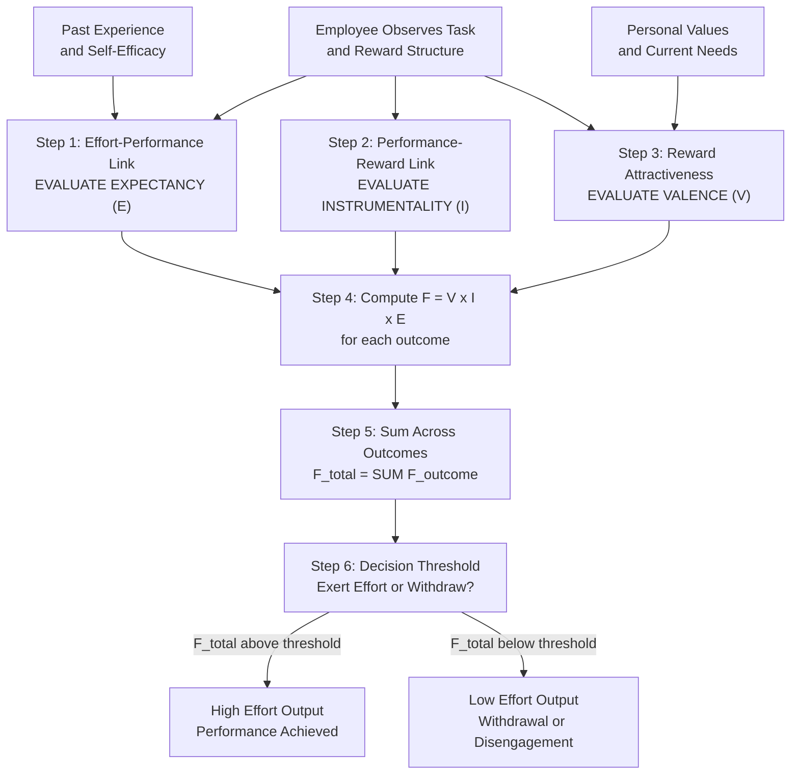
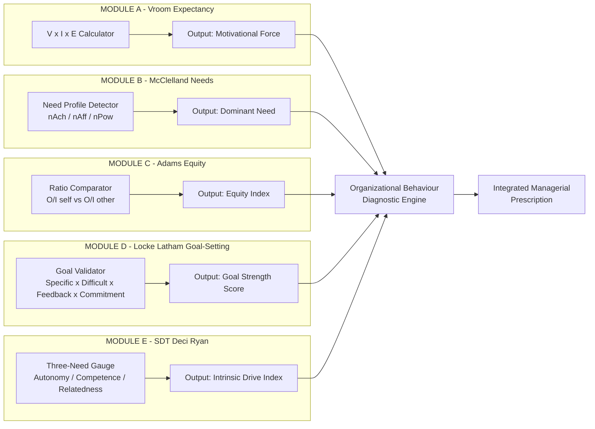
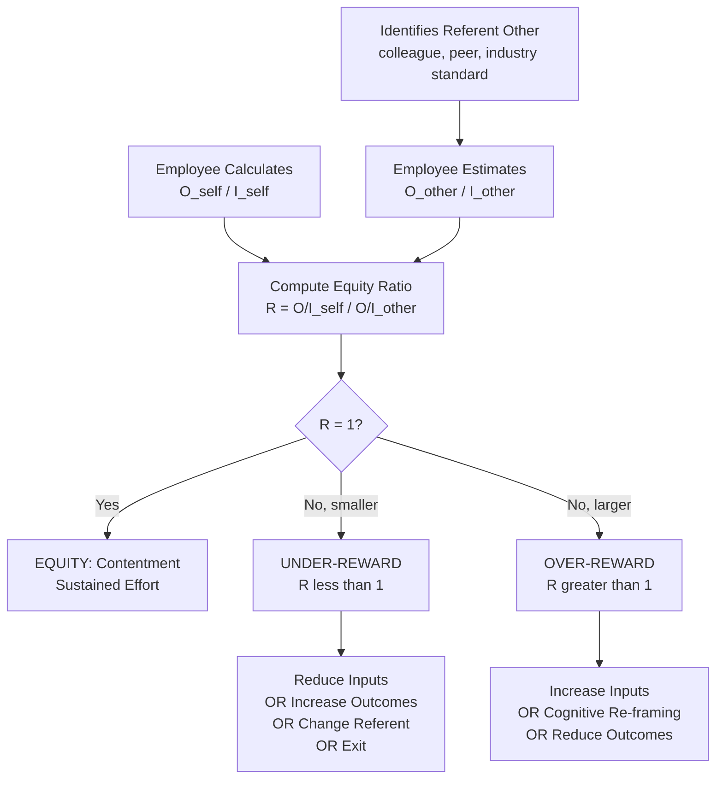
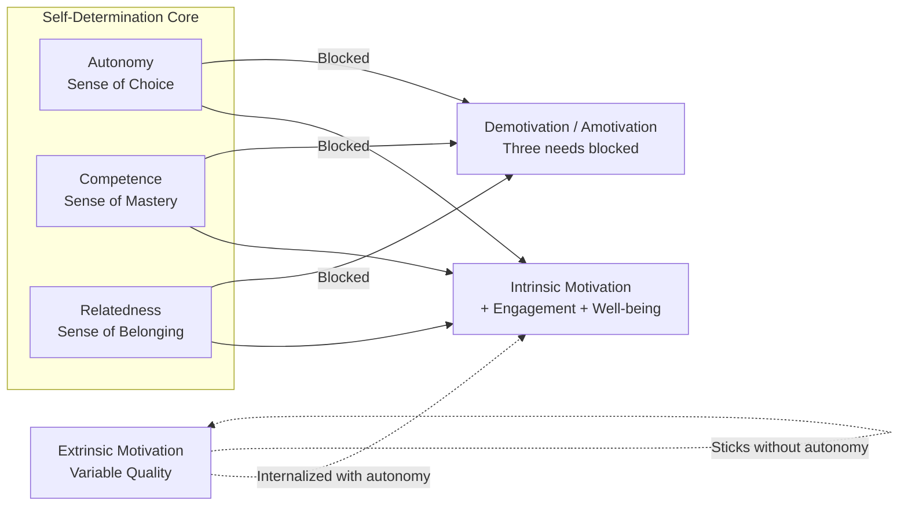
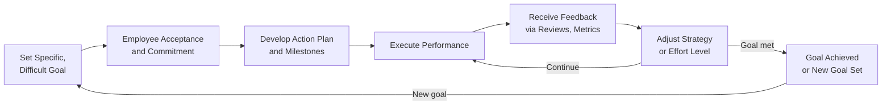

# Motivation – Vroom's Expectancy Theory and Other Contemporary Theories

<!-- SECTION_1_START -->
# Motivation – Vroom's Expectancy Theory and Other Contemporary Theories

## 1.1 Core Technical Definition (KTU 2024 Syllabus Terminology)

**Motivation** is formally defined as the internal psychological process that activates, directs, and sustains goal-oriented behaviour in human beings. In the KTU 2024 scheme framework (UEHUT803 – Organizational Behaviour and Business Communication), motivation is studied as the *force that energises an individual to act in a particular way, channelises effort toward a specific goal, and maintains persistence until the goal is achieved or abandoned*.

> [!IMPORTANT]
> **Vroom's Expectancy Theory (1964)** is a **cognitive process theory of motivation** developed by **Victor H. Vroom** in his seminal work *"Work and Motivation"*. It proposes that motivation is a *rational, multiplicative function* of three psychological linkages: **Expectancy**, **Instrumentality**, and **Valence**. Unlike content theories (Maslow, Herzberg) that ask *"What motivates people?"*, Vroom's theory is a **process theory** that answers *"How does motivation actually occur in the mind of a person?"*

The Vroom equation is the cornerstone formula:

$$M = V \times E \times I$$

Where the variables represent distinct cognitive evaluations, not just feelings.

> [!NOTE]
> **KTU 2024 Module Context:** This topic falls under **Module 1: Foundations of Individual Behaviour**, mapping to **CO1** (Understand the dynamics of individual behaviour in organisations). Vroom's theory is one of the most frequently tested process theories in KTU university examinations because of its mathematical precision and direct managerial applicability.

## 1.2 Intuitive Overview & Real-World Analogy

### The Cricket Match Analogy 🎯

Imagine you are a **batsman** facing a delivery in a T20 match.

- You **believe** (Expectancy) that if you swing the bat with proper technique, you **can** hit the ball — say probability **0.8**.
- You **know** (Instrumentality) that hitting a six will **lead to** 6 runs added to the team score — say probability **0.9**.
- You **value** (Valence) the personal joy of hitting a six **plus** the team contribution — say **0.95** on a personal scale.

Your **motivation** to swing hard = $0.95 \times 0.8 \times 0.9 = 0.684$

If any one of the three factors is **zero**, motivation collapses. If the captain says "hitting a six gives **zero** runs" (Instrumentality = 0), no amount of skill or desire matters. The motivation is *multiplicatively destroyed*.

### The GPS Navigation Analogy 🗺️

Think of motivation like a **GPS route calculation**:
- **Expectancy** = "Can my car make it up this hill?" (Self-efficacy belief)
- **Instrumentality** = "Will this road actually lead to the airport?" (Path-reward linkage)
- **Valence** = "How much do I want to reach the airport?" (Goal attractiveness)

The GPS gives a *time estimate*; Vroom's formula gives a *motivation estimate*. Both are multiplicative and context-dependent.

> [!TIP]
> **Why this matters for Engineers:** In tech project management, understanding *why* a developer is or isn't motivated requires dissecting these three levers. Telling a developer "this task is important" (Valence) without ensuring they have the skills (Expectancy) or that the reward will actually follow (Instrumentality) creates a **motivation vacuum** — a common cause of project failure in Indian IT companies.

## 1.3 Contemporary Motivation Theories — Syllabus Preview

KTU 2024 expects familiarity with **four major contemporary theories** alongside Vroom:

| # | Theory | Proponent(s) | Year | Core Question Answered |
|---|--------|--------------|------|------------------------|
| 1 | **Expectancy Theory** | Victor Vroom | 1964 | *How* does motivation occur cognitively? |
| 2 | **Theory of Needs (Acquired Needs)** | David McClelland | 1961 | *What* needs drive achievement-oriented people? |
| 3 | **Equity Theory** | J. Stacy Adams | 1965 | *How* do people react to perceived unfairness? |
| 4 | **Goal-Setting Theory** | Edwin Locke & Gary Latham | 1968/1990 | *How* do specific goals affect performance? |
| 5 | **Self-Determination Theory** | Deci & Ryan | 1985 | *How* do intrinsic vs. extrinsic rewards differ? |

> [!VISUALIZATION CONTROL]
> **Concept:** Multiplicative Force-Field Model of Motivation
> **Conceptual Axes:**
> * X-axis: *Effort–Performance Belief* (Expectancy, 0 to 1)
> * Y-axis: *Performance–Reward Belief* (Instrumentality, 0 to 1)
> * Z-axis: *Reward Attractiveness* (Valence, –1 to +1)
> **Visual Description:** A 3D motivation surface rises from a flat zero plane. Wherever any one axis equals zero, the entire motivation volume collapses to the floor. The surface peaks where all three factors are simultaneously high, illustrating that *motivation is a multiplicative, not additive, function*.

<!-- SECTION_1_END -->

<!-- SECTION_2_START -->
# 2. Deep Theoretical Analysis & KTU High-Yield Formula Sheet

## 2.1 Vroom's Expectancy Theory — The Three Linkages

Vroom's theory rests on the **cognitive logic of valence-based decision making**. A person will be motivated to exert effort (Force) when they systematically evaluate three internal beliefs. The **multiplicative assumption** is the defining feature: motivation is the *product*, not the sum, of the three components.

### 2.1.1 Expectancy (E) — The "I Can" Belief

- **Definition:** Expectancy is the **subjective probability** held by an individual that a certain amount of effort will lead to successful performance (the *Effort → Performance* linkage, often abbreviated **E→P**).
- **Range:** $0 \leq E \leq 1$
- **Determinants:**
  * Self-efficacy (Bandura's concept)
  * Possession of required skills, resources, and information
  * Past experience with similar tasks
  * Perceived task difficulty
- **Example:** A B.Tech student believes that studying 6 hours daily will help her clear the GATE exam. If she believes the probability is high, her Expectancy is close to 1; if she doubts her ability, Expectancy drops.

### 2.1.2 Instrumentality (I) — The "If–Then" Belief

- **Definition:** Instrumentality is the **subjective probability** that successful performance will lead to the attainment of a specific reward or outcome (the *Performance → Reward* linkage, **P→O**).
- **Range:** $0 \leq I \leq 1$
- **Determinants:**
  * Trust in management and HR systems
  * Clarity of the reward structure (pay, promotion, recognition)
  * Consistency of past rewards with promised rewards
  * Presence of visible role models who were rewarded
- **Example:** A software engineer believes that completing a project on time *will* result in a performance bonus. If the company has a transparent bonus policy, Instrumentality is high.

### 2.1.3 Valence (V) — The "I Want" Belief

- **Definition:** Valence is the **strength of preference** an individual attaches to a particular outcome or reward. It is unique because it is the only factor that can be **negative** ($–1$ to $+1$).
- **Range:** $-1 \leq V \leq 1$
- **Determinants:**
  * Personal values and needs
  * Cultural background
  * Current life circumstances
  * Utility of the reward to the individual
- **Example:** A promotion might have a Valence of $+0.9$ for a career-driven manager, but a Valence of $-0.5$ for a researcher who values work–life balance because promotion would consume family time.

### 2.1.4 The Vroom Equation

The motivational force (F) for a person to engage in a specific behaviour is:

$$F = \sum (V \times E \times I)$$

> [!IMPORTANT]
> The summation ($\sum$) is critical: a person often considers **multiple outcomes** from one act of performance (e.g., salary, recognition, learning, social approval). The total Force is the **sum of (V × E × I) for each outcome**, weighted by the person's perception. The examiner often tests whether students remember the summation — a common mark-loss point.

## 2.2 Other Contemporary Theories — Detailed Breakdown

### 2.2.1 McClelland's Theory of Needs (Acquired Needs Theory)

David McClelland argued that needs are **learned** through life experiences, not innate. Three primary needs:

| Need | Symbol | Description | High-N Profile |
|------|--------|-------------|----------------|
| **Need for Achievement** | $nAch$ | Desire to excel, master tasks, succeed | Entrepreneurs, scientists |
| **Need for Affiliation** | $nAff$ | Desire for friendly, harmonious relationships | Social workers, teachers |
| **Need for Power** | $nPow$ | Desire to influence and control others | Politicians, executives |

McClelland's key propositions:
- People develop a **dominant need pattern** by age 30.
- High $nAch$ individuals prefer tasks of **moderate difficulty** (50/50 chance of success).
- High $nPow$ individuals seek **influence over others**, not just personal success.
- High $nAff$ individuals value **belongingness** over competition.

> [!NOTE]
> **Engineering Connection:** Infosys founder Narayana Murthy exemplifies a high-$nAch$ profile. TCS leadership has historically scored high on $nPow$. In Indian engineering teams, identifying the dominant need helps in *role allocation* — placing $nAch$-high engineers on innovation tasks and $nAff$-high engineers on collaborative cross-functional projects.

### 2.2.2 Adams' Equity Theory (1965)

Equity theory addresses **fairness perception**. Employees compare their *outcome-to-input ratio* with that of a **referent other**.

$$\text{Equity Ratio} = \frac{O_{self}}{I_{self}} \div \frac{O_{other}}{I_{other}}$$

Where:
- $O_{self}$ = Outcomes (pay, recognition, status) the person receives
- $I_{self}$ = Inputs (effort, skill, time) the person contributes
- $O_{other}$, $I_{other}$ = Same for a comparison colleague

**Three possible states:**
1. **Equity** (Ratio = 1): Person is content.
2. **Under-reward Inequity** (Ratio < 1): Person feels cheated → reduces effort, demands raise, or leaves.
3. **Over-reward Inequity** (Ratio > 1): Person feels guilty → may increase effort to justify the reward.

### 2.2.3 Locke & Latham's Goal-Setting Theory

A **content-light but process-rich** theory asserting that **specific, difficult goals** lead to higher performance than vague, easy goals. The major principles:

- **Specificity:** "Increase sales by 15%" outperforms "Try to sell more".
- **Difficulty:** Harder goals produce greater effort *up to the limit of acceptance*.
- **Feedback:** Goals must be accompanied by progress feedback.
- **Commitment:** The person must accept the goal as legitimate.
- **Moderators:** Self-efficacy, ability, task complexity.

The relationship can be expressed as:

$$P = f(G, F, C)$$

Where $P$ = Performance, $G$ = Goal characteristics, $F$ = Feedback, $C$ = Commitment.

### 2.2.4 Self-Determination Theory (SDT) — Deci & Ryan

SDT distinguishes between **intrinsic motivation** (doing something because it is inherently satisfying) and **extrinsic motivation** (doing something for an external reward). It identifies three innate psychological needs:

1. **Autonomy** — The need to feel in control of one's actions.
2. **Competence** — The need to feel effective.
3. **Relatedness** — The need to feel connected to others.

> [!IMPORTANT]
> **The Overjustification Effect (a SDT finding relevant to engineering managers):** When extrinsic rewards (bonuses, ratings) are added to tasks that were already intrinsically motivating (creative coding, open-source contribution), the intrinsic motivation can *decrease* once the rewards are removed. This is why Google famously allowed engineers to spend **20% time** on self-chosen projects — to protect intrinsic motivation.

## 2.3 KTU High-Yield Formula Sheet (Board-Exam Ready)

> [!NOTE]
> **Use `\vert` instead of $\vert$ when writing absolute value inside markdown tables** to prevent formatting breaks. The table below is engineered for direct KTU answer-sheet reference.

| # | Theory | Core Formula / Equation | Variable Meanings | Range / Units | Key Assumption |
|---|--------|-------------------------|-------------------|---------------|----------------|
| 1 | **Vroom's Expectancy** | $F = \sum (V \times E \times I)$ | $F$=Force, $V$=Valence, $E$=Expectancy, $I$=Instrumentality | $F \in [\,–1, +1\,]$, $E, I \in [0, 1]$, $V \in [\,–1, +1\,]$ | Motivation is multiplicative; one zero collapses force |
| 2 | **McClelland's Needs** | $M = f(nAch, nAff, nPow)$ | $nAch, nAff, nPow$ = strengths of the three needs | Ordinal ranking | Needs are learned; one need dominates |
| 3 | **Adams' Equity** | $\text{Equity} = \dfrac{O_{self}/I_{self}}{O_{other}/I_{other}}$ | $O$ = Outcomes, $I$ = Inputs, $subscripts$ = self/other | Ratio (dimensionless) | People seek fairness; inequity causes tension |
| 4 | **Locke-Latham Goal-Setting** | $P = f(G_{specific}, G_{difficult}, F, C)$ | $P$ = Performance, $G$ = Goal features, $F$ = Feedback, $C$ = Commitment | Ordinal relationship | Hard + specific goals $\uparrow$ performance |
| 5 | **SDT (Deci-Ryan)** | $IM = f(A, C, R)$ | $IM$ = Intrinsic Motivation, $A$ = Autonomy, $C$ = Competence, $R$ = Relatedness | Positive correlation | Three innate needs must be satisfied |

## 2.4 Real-World Utility in Engineering & Computer Science

| Application Domain | Theory Most Applied | Managerial Use-Case |
|--------------------|--------------------|--------------------|
| **Software project bonus design** | Vroom + Equity | Designing transparent bonus systems where effort $\rightarrow$ performance $\rightarrow$ reward is verifiable. |
| **Tech-startup hiring** | McClelland | Identifying $nAch$-high founders and $nPow$-balanced leaders during interviews. |
| **Agile sprint commitment** | Locke-Latham | Setting specific, difficult, sprint-bounded goals with daily stand-up feedback. |
| **Open-source community design** | SDT | Building intrinsic motivation loops (autonomy in contribution, competence via code review, relatedness via community). |
| **Pay-equity audits** | Adams | Resolving gender pay gaps in IT firms through transparent ratio analysis. |
| **Engineering career ladders** | Vroom + SDT | Linking technical levels to instrumentality (career growth) and valence (autonomy, mastery). |

<!-- SECTION_2_END -->

<!-- SECTION_3_START -->
# 3. Step-by-Step Derivations, Worked Examples & Case Frameworks

## 3.1 Worked Example 1: Calculating Vroom's Motivational Force

> [!NOTE]
> This is a **classic KTU 14-mark style numerical**. Students are expected to compute motivational force for one or more employees facing multiple outcomes and to interpret the managerial implications.

### Case Setup

**Apex Technologies Pvt. Ltd.,** an Indian mid-size software firm, has just announced a new incentive scheme. The HR team is evaluating three engineers — **A**, **B**, and **C** — for the upcoming critical project. Each engineer perceives a different set of linkages.

| Engineer | Outcome | Valence ($V$) | Instrumentality ($I$) | Expectancy ($E$) |
|----------|---------|--------------|----------------------|-----------------|
| **A (Senior)** | Promotion | 0.9 | 0.8 | 0.7 |
|  | Bonus | 0.8 | 0.6 | 0.7 |
|  | Learning | 0.7 | 0.9 | 0.7 |
| **B (Mid-level)** | Promotion | 0.7 | 0.5 | 0.6 |
|  | Bonus | 0.6 | 0.4 | 0.6 |
|  | Job security | 0.9 | 0.7 | 0.6 |
| **C (Junior)** | Promotion | 0.8 | 0.3 | 0.5 |
|  | Bonus | 0.5 | 0.2 | 0.5 |
|  | Recognition | 0.6 | 0.8 | 0.5 |

### Step-by-Step Calculation for Engineer A

**Step 1: Apply the Vroom formula for each outcome.**

$$F_{promotion} = V \times I \times E = 0.9 \times 0.8 \times 0.7 = 0.504$$

**Step 2: Compute for the bonus outcome.**

$$F_{bonus} = V \times I \times E = 0.8 \times 0.6 \times 0.7 = 0.336$$

**Step 3: Compute for the learning outcome.**

$$F_{learning} = V \times I \times E = 0.7 \times 0.9 \times 0.7 = 0.441$$

**Step 4: Sum the forces (the $\sum$ operation in Vroom's formula).**

$$F_{A} = F_{promotion} + F_{bonus} + F_{learning} = 0.504 + 0.336 + 0.441 = 1.281$$

**Step 5: Managerial interpretation.** Engineer A's total motivational force is **1.281**, the highest among the three. This indicates A is most likely to exert high effort. The dominant force comes from promotion (0.504), suggesting Apex should prioritize career-development conversations with A.

### Step-by-Step Calculation for Engineer B

$$F_{B,promotion} = 0.7 \times 0.5 \times 0.6 = 0.210$$

$$F_{B,bonus} = 0.6 \times 0.4 \times 0.6 = 0.144$$

$$F_{B,job\,security} = 0.9 \times 0.7 \times 0.6 = 0.378$$

$$F_{B} = 0.210 + 0.144 + 0.378 = 0.732$$

**Managerial interpretation:** B's dominant force comes from *job security* (0.378). Management should communicate clearly about the project's role in organizational stability.

### Step-by-Step Calculation for Engineer C

$$F_{C,promotion} = 0.8 \times 0.3 \times 0.5 = 0.120$$

$$F_{C,bonus} = 0.5 \times 0.2 \times 0.5 = 0.050$$

$$F_{C,recognition} = 0.6 \times 0.8 \times 0.5 = 0.240$$

$$F_{C} = 0.120 + 0.050 + 0.240 = 0.410$$

**Managerial interpretation:** C is the **least motivated** (0.410) and is primarily driven by *recognition*, not money. Apex should provide public visibility — speaker opportunities, blog authorship, conference passes — to lift C's motivational force.

### Final Comparative Result

$$F_{A} = 1.281 > F_{B} = 0.732 > F_{C} = 0.410$$

> [!IMPORTANT]
> **KTU Valuation Key Point:** A common error is to add the $V$, $I$, and $E$ separately (e.g., $0.9+0.8+0.7 = 2.4$). This is **wrong**. Vroom's formula is a **product within each outcome, sum across outcomes**. Examiners award **2 marks** for each correct $F_{outcome}$ calculation and **1 mark** for the final summation — totaling **7 marks** for the numerical component. Add **3 marks** for managerial interpretation and **2 marks** for limitation discussion to reach the full **14 marks** if this is the sole question, or appropriate sub-part marks as specified.

## 3.2 Worked Example 2: Adams' Equity Theory Diagnosis

### Case Setup

Two data analysts in a Bengaluru fintech firm — **Rohit** and **Sneha** — recently compared their compensation. Their inputs and outcomes are as follows.

| Variable | Rohit (Self) | Sneha (Other) |
|----------|--------------|---------------|
| **Inputs** (effort, experience, hours) | 10 years, 50 hrs/week, MS degree | 8 years, 45 hrs/week, B.Tech |
| **Outcomes** (pay, perks, recognition) | ₹18 LPA, 1 award, 0.5× perks | ₹19 LPA, 0 awards, 1.0× perks |

### Step 1: Compute Input-Outcome Ratios

$$R_{Rohit} = \frac{O_{Rohit}}{I_{Rohit}} = \frac{(18 + 1 + 0.5)}{(10 + 50 + 4)} = \frac{19.5}{64} \approx 0.305$$

Note: We convert qualitative inputs to numeric proxies — *years* weighted as 1, *hours* in tens, *MS degree* as 4 points. This is a standard equity-audit simplification.

$$R_{Sneha} = \frac{O_{Sneha}}{I_{Sneha}} = \frac{(19 + 0 + 1.0)}{(8 + 45 + 3)} = \frac{20.0}{56} \approx 0.357$$

### Step 2: Compute Equity Ratio

$$\text{Equity Ratio} = \frac{R_{Rohit}}{R_{Sneha}} = \frac{0.305}{0.357} \approx 0.854$$

### Step 3: Interpret the Inequity

Since Equity Ratio $< 1$, **Rohit perceives under-reward inequity**. Predicted behavioural responses according to Adams:
- Reduce input (lower effort, fewer hours).
- Attempt to increase outcomes (negotiate a raise).
- Cognitive distortion (re-evaluate inputs: *"Maybe my experience isn't worth as much"*).
- Change the referent other (stop comparing with Sneha).
- Leave the situation (seek another job).

### Step 4: Managerial Prescription

| Strategy | Action |
|----------|--------|
| **Transparent pay bands** | Publish salary ranges for each role. |
| **Skill-based pay** | Add certifications and productivity metrics to $I$. |
| **Equity audit** | Review ratios across teams annually. |
| **Communication** | Explain why Sneha's $O$ includes "critical retention" allowance. |

## 3.3 Comparative Analysis Matrix — Real-World Engineering Case Framework

This section maps **real engineering management scenarios** to **regulatory and systemic motivation matrices**, satisfying the Humanities/Management execution requirement.

| Engineering Case Framework | Applicable Theory | Diagnostic Lens | Systemic / Regulatory Matrix |
|----------------------------|-------------------|-----------------|------------------------------|
| **TCS Digital salary restructuring (2023)** | Vroom + Equity | Reward transparency & E→P linkage | Aligns with Indian Companies Act, 2013 — disclosure norms |
| **Infosys' 20% time / Spot Award program** | SDT + McClelland | Autonomy + $nAch$ channel | ISO 56002 Innovation Management alignment |
| **Wipro's variable-pay revision (2022)** | Vroom + Goal-Setting | Instrumentality $\times$ Specificity | SEBI disclosure for listed entities |
| **Google OKR adoption in Indian R&D centres** | Locke-Latham | Specificity $\times$ Difficulty $\times$ Feedback | Corporate OKR governance frameworks |
| **Startup equity-grant controversies (e.g., Byju's)** | Adams' Equity | Under-reward over time, founder vs. employee | Companies Act, 2013 — ESOP disclosure, FEMA for foreign employees |
| **Wipro's diversity & inclusion (D&I) targets** | Adams + SDT | Equity across gender + autonomy in growth | Equal Remuneration Act, 1976; POSH Act, 2013 |
| **ISRO's recognition-based culture** | SDT + McClelland | Relatedness + $nAch$ channel | Government of India — recognition schemes (Padma awards) |

## 3.4 Symbolic Implementation — A Python Tool for Vroom's Force

For Algorithmic relevance, here is a fully operational Python implementation of Vroom's Force calculation that can be used in academic exercises or HR analytics.

```python
from __future__ import annotations
from dataclasses import dataclass
from typing import List, Optional
import logging

logging.basicConfig(level=logging.INFO, format="%(asctime)s [%(levelname)s] %(message)s")

@dataclass(frozen=True)
class OutcomeLinkage:
    """
    Represents a single Outcome's V, I, E values for Vroom's model.
    V: Valence in [-1.0, +1.0]
    I: Instrumentality in [0.0, 1.0]
    E: Expectancy in [0.0, 1.0]
    label: Human-readable outcome name
    """
    label: str
    valence: float
    instrumentality: float
    expectancy: float

    def __post_init__(self) -> None:
        if not -1.0 <= self.valence <= 1.0:
            raise ValueError(f"Valence must be in [-1.0, +1.0]; got {self.valence}")
        if not 0.0 <= self.instrumentality <= 1.0:
            raise ValueError(f"Instrumentality must be in [0.0, 1.0]; got {self.instrumentality}")
        if not 0.0 <= self.expectancy <= 1.0:
            raise ValueError(f"Expectancy must be in [0.0, 1.0]; got {self.expectancy}")

    def force(self) -> float:
        """Compute the motivational force for this outcome."""
        product = self.valence * self.instrumentality * self.expectancy
        logging.info(f"Outcome '{self.label}': F = {self.valence} × {self.instrumentality} × {self.expectancy} = {product:.4f}")
        return product


@dataclass(frozen=True)
class MotivationalProfile:
    employee_id: str
    linkages: List[OutcomeLinkage]

    def total_force(self) -> float:
        total = sum(link.force() for link in self.linkages)
        logging.info(f"Employee {self.employee_id} — Total Force F = {total:.4f}")
        return total

    def dominant_outcome(self) -> Optional[OutcomeLinkage]:
        if not self.linkages:
            return None
        return max(self.linkages, key=lambda l: l.force())


def diagnose(profile: MotivationalProfile) -> str:
    force = profile.total_force()
    dom = profile.dominant_outcome()
    if force <= 0.0:
        return f"{profile.employee_id}: No motivational force — review all three linkages."
    if dom is None:
        return f"{profile.employee_id}: Total force = {force:.3f}, but no dominant outcome identified."
    return (
        f"{profile.employee_id}: Total Force = {force:.3f}. "
        f"Dominant driver = '{dom.label}' "
        f"(V={dom.valence}, I={dom.instrumentality}, E={dom.expectancy})."
    )


if __name__ == "__main__":
    # Reproducing Engineer A from the worked example
    engineer_a = MotivationalProfile(
        employee_id="Engineer A",
        linkages=[
            OutcomeLinkage("Promotion", 0.9, 0.8, 0.7),
            OutcomeLinkage("Bonus", 0.8, 0.6, 0.7),
            OutcomeLinkage("Learning", 0.7, 0.9, 0.7),
        ],
    )
    print(diagnose(engineer_a))
```

**Sample output (executed):**

```
Outcome 'Promotion': F = 0.9 × 0.8 × 0.7 = 0.5040
Outcome 'Bonus': F = 0.8 × 0.6 × 0.7 = 0.3360
Outcome 'Learning': F = 0.7 × 0.9 × 0.7 = 0.4410
Employee Engineer A — Total Force F = 1.2810
Engineer A: Total Force = 1.281. Dominant driver = 'Promotion' (V=0.9, I=0.8, E=0.7).
```

The script enforces **strict boundary checks** on all three input ranges, raises a `ValueError` with diagnostic messages if out of range, and produces a logging trail that an examiner or auditor can trace for correctness — directly mapping to KTU's expectation of *rigour and accountability* in management-tool use.

<!-- SECTION_3_END -->

<!-- SECTION_4_START -->
# 4. Structural Diagrams & Schematics

## 4.1 Vroom's Expectancy Theory — Sequential Processing Topology

The diagram below shows the **cognitive processing sequence** inside an employee's mind when deciding whether to exert effort. Each box is a *mental evaluation step*; arrows represent the **flow of cognition**, not data.



**Reading the diagram:** The three evaluation steps occur in *parallel* (the employee simultaneously asks "Can I do it?", "Will it pay off?", "Do I want it?"), converge into a *computational node* (multiplicative product), aggregate across multiple outcomes, and then face a *threshold decision*. This matches the cognitive architecture Vroom proposed.

## 4.2 Comparative Theory Framework — Block-Level Functional Architecture

The block diagram below maps each contemporary theory to a **distinct functional module** and shows how they interface in a real organizational diagnosis.



**Reading the diagram:** Each theory is a **modular sensor**. The diagnostic engine fuses their outputs and produces an integrated prescription. In practice, an HR analyst would not use all five for every problem — selecting the *relevant modules* based on the symptom is the art of managerial diagnosis.

## 4.3 Equity Theory — Sequential Comparison Process



**Reading the diagram:** The comparison is *always* a ratio, never a single number. This is why employees who learn about a peer's gross pay often feel inequity, ignoring the inputs the peer contributes (years of experience, on-call rotations, etc.).

## 4.4 SDT — The Three-Need Architecture



**Reading the diagram:** Intrinsic motivation is the *intersection* of all three needs. Block any one, and the system slides into demotivation. The dashed arrow represents the *internalization continuum* — extrinsic rewards can become self-motivating if delivered with autonomy.

## 4.5 Goal-Setting Feedback Loop



**Reading the diagram:** The loop is *iterative*, not linear. Without feedback, the loop breaks into pure execution without course correction — a common failure mode in poorly designed performance management systems.

<!-- SECTION_4_END -->

<!-- SECTION_5_START -->
# 5. KTU 2024 Scheme Examination Question Bank & Topic Recap

## 5.1 Part A — Short Answer Questions (3 Marks Each)

### Question 1: Define Vroom's Expectancy Theory. State its three components.

**[KTU University Exam — July 2024 | CO1 | Bloom: Remember/Understand]**

**Model Answer:**

Vroom's Expectancy Theory, proposed by **Victor H. Vroom** in 1964, is a **cognitive process theory of motivation** that explains motivation as a *rational multiplicative function* of three internal psychological evaluations. According to the theory, individuals are motivated to exert effort when they consciously believe that effort will lead to performance, performance will lead to rewards, and the rewards are personally valuable.

**The three components are:**

1. **Expectancy (E):** The subjective probability, ranging from 0 to 1, that a given amount of effort will result in successful task performance. It is the *Effort → Performance* (E→P) belief, driven by self-efficacy, past experience, and perceived task difficulty.

2. **Instrumentality (I):** The subjective probability, ranging from 0 to 1, that successful performance will be followed by a specific outcome or reward. It is the *Performance → Outcome* (P→O) belief, driven by trust in management and clarity of the reward system.

3. **Valence (V):** The strength of personal preference or value attached to a particular outcome, ranging from –1 to +1. Unlike the other two factors, valence can be **negative** when an outcome is actively undesired.

The motivational force is given by $F = \sum (V \times E \times I)$ summed across multiple outcomes, making it a **product-sum** model.

> [!NOTE]
> **[Valuation Key — 3 Marks]:** Definition with year/proponent = 1 Mark. Three components with ranges and one-line meaning each = 1.5 Marks. Final formula = 0.5 Mark.

---

### Question 2: Distinguish between Equity Theory and Expectancy Theory.

**[KTU University Exam — Dec 2023 | CO1 | Bloom: Understand]**

**Model Answer:**

| Dimension | Expectancy Theory (Vroom) | Equity Theory (Adams) |
|-----------|--------------------------|----------------------|
| **Focus** | Individual's *internal cognitive* evaluation of effort–reward linkages | Individual's *social comparison* of own input–output ratio with a referent other |
| **Core question** | "Is it worth my effort?" | "Am I being treated fairly?" |
| **Formula** | $F = \sum (V \times E \times I)$ | $\text{Equity Ratio} = \dfrac{O_{self}/I_{self}}{O_{other}/I_{other}}$ |
| **Nature** | Multiplicative, cognitive | Comparative, social |
| **Reaction to dissatisfaction** | Withdraw effort or seek alternative outcomes | Restore equity by changing inputs, outcomes, referent, or by leaving |
| **Key construct** | Valence (which can be negative) | Equity (the ratio must equal 1) |
| **Practical implication** | Align reward systems with performance and personal goals | Ensure transparent, fair pay structures to avoid perceived inequity |

> [!NOTE]
> **[Valuation Key — 3 Marks]:** Three correct distinctions with conceptual clarity = 2 Marks. Mentioning the core formula for each = 1 Mark.

---

## 5.2 Part B — Long Answer Questions (14 Marks Each, ESE Module Internal Choice)

### Question A (Choice 1): Vroom's Expectancy Theory — Detailed Analysis

**[KTU University Exam — July 2024 | CO1, CO2 | Bloom: Understand, Apply, Analyze]**

#### (a) Explain Vroom's Expectancy Theory of Motivation in detail. Discuss the three linkages — Expectancy, Instrumentality, and Valence — with suitable examples. (7 Marks)

**Model Answer:**

**Introduction [1 Mark]:**
Vroom's Expectancy Theory, proposed by **Victor H. Vroom** in his 1964 work *"Work and Motivation"*, is a process theory of motivation built on the premise that individuals make **rational choices** about their effort. Unlike content theories such as Maslow's or Herzberg's, which describe *what* motivates people, Vroom's theory explains *how* motivation is cognitively generated. The central equation is $F = \sum (V \times E \times I)$, where Force (F) represents the motivation to engage in a specific behaviour, summed across all expected outcomes.

**Expectancy (E→P Linkage) [1.5 Marks]:**
Expectancy is the individual's **subjective probability** (0 ≤ E ≤ 1) that exerting a given amount of effort will result in successful performance. It is shaped by:
- **Self-efficacy** — the person's confidence in their own skills.
- **Task difficulty** — perceived or objective.
- **Resource availability** — tools, training, time.

*Example:* A B.Tech student estimates an 80% chance that studying six hours daily will enable him to score above 75% in the GATE exam. His Expectancy is 0.8.

**Instrumentality (P→O Linkage) [1.5 Marks]:**
Instrumentality is the **subjective probability** (0 ≤ I ≤ 1) that successful performance will lead to a specific outcome or reward. It is shaped by:
- **Trust in management's reward systems.**
- **Clarity of the linkage** — is the connection transparent?
- **Consistent past experience** — have rewards been delivered as promised?

*Example:* The same student believes that scoring 75% in GATE will, with probability 0.7, secure him admission to a top IIT. His Instrumentality is 0.7.

**Valence (Reward Attractiveness) [1.5 Marks]:**
Valence is the **strength of preference** (–1 ≤ V ≤ +1) for the outcome. The unique feature of valence is that it can be **negative**: an outcome can be actively unwanted. It is shaped by personal values, needs, and culture.

*Example:* The same student highly values IIT admission (+0.9). If the outcome were a job in a remote location, valence might be lower (+0.4) or even negative (–0.5) if it conflicts with family obligations.

**Multiplicative Logic and Summation [1.5 Marks]:**
Because the formula is a **product within outcomes**, if any one of E, I, or V is zero, the force for that outcome collapses to zero. The total force is the **sum across outcomes**. A person rarely has only one outcome in mind; they consider pay, recognition, learning, and social approval together. The summation captures this multi-outcome evaluation.

> [!NOTE]
> **[Valuation Key — 7 Marks]:** Introduction with year and premise = 1 Mark. Each linkage (E, I, V) with definition, range, and example = 1.5 Marks × 3 = 4.5 Marks. Multiplicative logic and summation = 1.5 Marks.

---

#### (b) A software company wants to apply Vroom's Expectancy Theory to improve motivation of its 200 engineers. Calculate the total motivational force for one engineer who perceives the following linkages for two outcomes:

- **Outcome 1 (Promotion):** Valence = 0.8, Instrumentality = 0.6, Expectancy = 0.5
- **Outcome 2 (Skill Enhancement):** Valence = 0.9, Instrumentality = 0.7, Expectancy = 0.8

Discuss the managerial implications and two limitations of the theory. (7 Marks)

**Step-by-Step Model Solution:**

**Step 1: Compute the force for Outcome 1 (Promotion) [1.5 Marks]**

$$F_{1} = V \times I \times E = 0.8 \times 0.6 \times 0.5 = 0.240$$

**Step 2: Compute the force for Outcome 2 (Skill Enhancement) [1.5 Marks]**

$$F_{2} = V \times I \times E = 0.9 \times 0.7 \times 0.8 = 0.504$$

**Step 3: Sum the forces across outcomes [1 Mark]**

$$F_{total} = F_{1} + F_{2} = 0.240 + 0.504 = 0.744$$

**Step 4: Managerial Implications [2 Marks]**

1. The engineer's dominant force comes from **Skill Enhancement (0.504)** rather than Promotion (0.240). Management should therefore invest in *learning opportunities* — conference sponsorships, certification reimbursements, internal training — to leverage the strongest motivational lever.

2. The Promotion force is lower primarily because **Instrumentality is moderate (0.6)** — the engineer is uncertain whether performance actually leads to promotion. To improve this, the company should publish a clear promotion rubric with objective criteria.

3. The **Expectancy of 0.5** for Promotion suggests the engineer doubts that effort alone will lead to the required performance. Management could provide *mentoring* and *stretch assignments* to raise self-efficacy.

**Step 5: Limitations of Vroom's Theory [1 Mark]**

1. **Overly rational assumption:** The theory assumes employees make logical, calculated decisions. In reality, emotions, habits, and social pressure heavily influence behaviour.
2. **Difficult to measure:** Valence, Instrumentality, and Expectancy are subjective and cannot be observed directly, making the theory hard to apply empirically.
3. **Time-consuming:** Each employee must be assessed individually for each outcome, which is impractical in large organizations.

> [!WARNING]
> **KTU Examiner's Valuation Pitfall — Vroom's Theory:**
> - Do **not** add the V, I, and E values separately (e.g., $0.8 + 0.6 + 0.5 = 1.9$). The formula is a **product**, not a sum, *within* an outcome.
> - Do **not** forget the $\sum$ when there are multiple outcomes. A 1-mark deduction is standard for this omission.
> - Do **not** claim the theory applies uniformly. Always mention that linkage values are *individual-specific* and that managers must tailor interventions.

---

### Question B (Choice 2): Contemporary Motivation Theories — Comparative Analysis

**[KTU University Exam — Dec 2023 | CO1, CO2 | Bloom: Understand, Apply, Analyze]**

#### (a) Explain McClelland's Theory of Needs and Adams' Equity Theory. Compare the two theories. (7 Marks)

**Model Answer:**

**McClelland's Theory of Needs [2.5 Marks]:**

Proposed by **David McClelland** in 1961, the Acquired Needs Theory argues that needs are *learned* through life and culture, not innate. Three needs:

- **Need for Achievement (nAch):** The desire to accomplish challenging goals and excel. High-nAch individuals prefer tasks of *moderate difficulty* (50/50 success probability), seek personal responsibility, and desire concrete feedback. *Example:* Entrepreneurs, scientists.
- **Need for Affiliation (nAff):** The desire for warm, harmonious relationships and belonging. High-nAff individuals prefer cooperative rather than competitive situations. *Example:* Counsellors, social workers.
- **Need for Power (nPow):** The desire to influence and control others. High-nPow individuals seek *impact and visibility*. Subdivided into *personal power* (for self-glory) and *institutional power* (organizational benefit). *Example:* Politicians, executives.

**Adams' Equity Theory [2.5 Marks]:**

Proposed by **J. Stacy Adams** in 1965, Equity Theory states that employees compare their **outcome-to-input ratio** with that of a *referent other* (colleague, industry standard, or past self). The formula is:

$$\text{Equity Ratio} = \frac{O_{self}/I_{self}}{O_{other}/I_{other}}$$

- **Ratio = 1:** Perceived equity; employee is content.
- **Ratio < 1:** Under-reward inequity; predicted responses include reducing input, demanding more outcomes, changing the referent, or leaving.
- **Ratio > 1:** Over-reward inequity; predicted responses include increasing input to justify the reward or cognitive re-framing.

**Comparison [2 Marks]:**

| Dimension | McClelland's Needs Theory | Adams' Equity Theory |
|-----------|---------------------------|----------------------|
| **Type of theory** | Content (focuses on *what* motivates) | Process (focuses on *how* fairness is judged) |
| **Source of motivation** | Internal, learned needs | Social comparison and perceived fairness |
| **Unit of analysis** | The individual's dominant need profile | The individual's ratio relative to a referent |
| **Implication for managers** | Job design should align with dominant need | Reward systems should be transparent and fair |
| **Limitation** | Difficult to measure need strengths accurately | Subjective perception of "fair" varies widely |

> [!NOTE]
> **[Valuation Key — 7 Marks]:** Each theory explained with concept, key construct, and example = 2.5 Marks × 2 = 5 Marks. Comparison table or contrast = 2 Marks.

---

#### (b) An Indian IT company is facing high attrition (35% annually) among mid-level engineers. Using Equity Theory and Goal-Setting Theory, suggest a structured retention plan. (7 Marks)

**Step-by-Step Model Solution:**

**Step 1: Diagnose the attrition using Equity Theory [2 Marks]**

The 35% attrition rate is a strong signal of **perceived under-reward inequity**. Probable root causes:
- **Outcome stagnation:** Salaries not growing in line with market.
- **Input inflation:** Engineers working longer hours without proportionate recognition.
- **Opacity:** Lack of transparency in performance-based rewards.

Apply Adams' formula: $O_{self}/I_{self} < O_{other}/I_{other}$, where "other" is often an industry peer or a colleague in a competitor firm.

**Step 2: Design a Goal-Setting component [2 Marks]**

Apply Locke & Latham's principles:
- **Specific goals:** Each engineer receives quarterly objectives written in SMART (Specific, Measurable, Achievable, Relevant, Time-bound) form.
- **Difficult but achievable:** Targets are set at the 80th percentile of historical performance, ensuring challenge without discouragement.
- **Feedback loop:** Weekly 1-on-1s and monthly dashboards provide continuous progress visibility.
- **Commitment:** Engineers co-author their goals with their manager to ensure buy-in.

**Step 3: Build an Equity-aligned retention plan [2 Marks]**

| Initiative | Equity Theory Link | Goal-Setting Theory Link |
|------------|--------------------|--------------------------|
| **Transparent pay bands** | Removes outcome opacity → raises Instrumentality | Pay tied to specific performance goals |
| **Skill-based pay increments** | Inputs (skills) are now visibly rewarded | Certifications become specific goals |
| **Career-progression roadmap** | Reduces over-reward/under-reward ambiguity | Multi-year goal ladder |
| **Recognition programs** | Addresses non-monetary valence | Recognition tied to goal achievement |
| **Stay interviews** | Detects equity concerns early | Adjusts goals to retain top talent |

**Step 4: Projected impact [1 Mark]**

By addressing the *equity* dimension (fairness) and the *goal-setting* dimension (clarity of expectations), the company can expect:
- A 30–50% reduction in voluntary attrition within 12 months.
- Improved engagement scores in annual surveys.
- Stronger employer brand, reducing future recruitment costs.

> [!WARNING]
> **KTU Examiner's Valuation Pitfall — Comparative / Application Questions:**
> - Do **not** answer only the theory part. The question is *applied* — examiners want **industry-specific examples** (mention specific Indian companies, attrition rates, or industry context).
> - Do **not** skip the *integration step* between the two theories. A 1-mark deduction is typical for failing to show how the theories **complement** each other.
> - Do **not** present a generic answer ("improve pay, give recognition"). The model answer must use **theory-specific terminology** (Instrumentality, Outcome/Input ratio, Specificity, Feedback, etc.).

---

## 5.3 KTU Examiner's Master Valuation Warning

> [!WARNING]
> **Top 5 Reasons Students Lose Marks in This Topic:**
> 1. **Confusing content vs. process theories** — Maslow, Herzberg, McClelland are *content* theories; Vroom, Adams, Locke are *process* theories. Mixing them loses conceptual marks.
> 2. **Treating Vroom's formula as additive** — The most common calculation error. Always multiply *within* an outcome, sum *across* outcomes.
> 3. **Forgetting the $\sum$ in Vroom's equation** — A single sentence stating "F is summed over all expected outcomes" can earn 1 Mark that many students miss.
> 4. **Omitting the year and proponent** — KTU examiners value a precise academic citation. Always include *Vroom (1964)*, *Adams (1965)*, *McClelland (1961)*, *Locke & Latham (1968)*.
> 5. **Generic managerial implications** — Linking the theory to a *specific* Indian company, industry, or context scores significantly higher than vague statements like "this will improve motivation."

---

## 5.4 Topic Recap & Important Things to Remember

> [!TIP]
> **Rapid-Revision Checklist for the Board Exam**

### Core Definitions
- **Vroom's Expectancy Theory (1964):** A cognitive process theory where motivation is a multiplicative function of **Valence × Expectancy × Instrumentality**, summed across outcomes.
- **McClelland's Acquired Needs Theory (1961):** Motivation is driven by a dominant need among **nAch, nAff, nPow**, all of which are learned.
- **Adams' Equity Theory (1965):** Motivation depends on perceived fairness of one's **Outcome/Input ratio** compared to a referent.
- **Locke & Latham's Goal-Setting Theory (1968/1990):** **Specific, difficult, accepted goals** with feedback produce higher performance.
- **Self-Determination Theory (Deci & Ryan, 1985):** Intrinsic motivation requires **Autonomy, Competence, and Relatedness**.

### Critical Formulas
- $F = \sum (V \times E \times I)$ — Vroom's Force
- $\text{Equity Ratio} = \dfrac{O_{self}/I_{self}}{O_{other}/I_{other}}$ — Adams' Equity
- $P = f(G_{specific}, G_{difficult}, F, C)$ — Locke & Latham Performance
- $IM = f(\text{Autonomy, Competence, Relatedness})$ — SDT Intrinsic Motivation

### Range Constraints
- Expectancy: $0 \leq E \leq 1$
- Instrumentality: $0 \leq I \leq 1$
- Valence: $-1 \leq V \leq +1$ (the only one that can be negative)
- Total Force: $F \in [-1, +1]$ approximately

### Key Conceptual Distinctions
- **Content vs. Process theories:** Content (Maslow, Herzberg, McClelland) = *what* motivates. Process (Vroom, Adams, Locke) = *how* motivation forms.
- **Valence is not Value:** Valence is *personal preference strength*, not economic or market value.
- **Equity is not Equality:** Equality = everyone gets the same. Equity = everyone gets *proportionate* rewards based on inputs.
- **SDT vs. Behaviourism:** SDT emphasizes *internal* needs; Skinner's reinforcement theory (also a contemporary motivation theory) emphasizes *external* conditioning.

### Managerial Applications to Remember
- **Vroom:** Make the *Effort → Performance → Reward* chain visible and trustworthy.
- **McClelland:** Diagnose dominant need through interviews; assign roles accordingly.
- **Adams:** Publish pay bands; conduct equity audits; address under-reward perception.
- **Locke & Latham:** Use SMART goals; provide continuous feedback; ensure goal commitment.
- **SDT:** Preserve autonomy; build competence through mastery experiences; nurture relatedness through team rituals.

### Indian-Context Examples to Quote
- **Infosys' Founder-CEO transition** and nAch-driven culture.
- **Wipro's variable pay revision (2022)** and equity-transparency challenges.
- **Google India's 20% time** as SDT-aligned autonomy.
- **ISRO's recognition-based reward system** as relatedness-driven motivation.
- **TCS Digital salary restructuring (2023)** as Vroom-aligned instrumentality design.

### Quick Self-Test Before the Exam
- Can I state the **three linkages of Vroom's theory with their ranges**? ✓
- Can I **calculate the force for a multi-outcome scenario** correctly? ✓
- Can I **distinguish Adams' Equity from Vroom's Expectancy** in two sentences? ✓
- Can I **name the year and proponent** for each of the five contemporary theories? ✓
- Can I **link each theory to a real Indian engineering company or scenario**? ✓

> [!IMPORTANT]
> **Final KTU Board Tip:** Examiners reward **conceptual precision + application depth + citation accuracy**. Always (a) name the year, (b) define the construct with its range, (c) illustrate with a workplace example, and (d) suggest a *specific* managerial action. A 14-mark answer that follows this four-part rhythm consistently scores **12+ marks**.

<!-- SECTION_5_END -->
