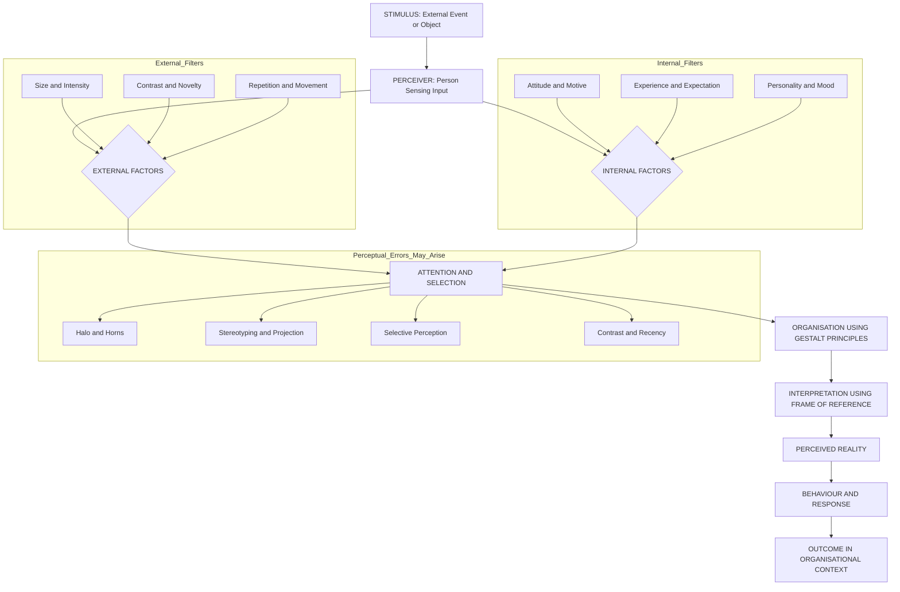
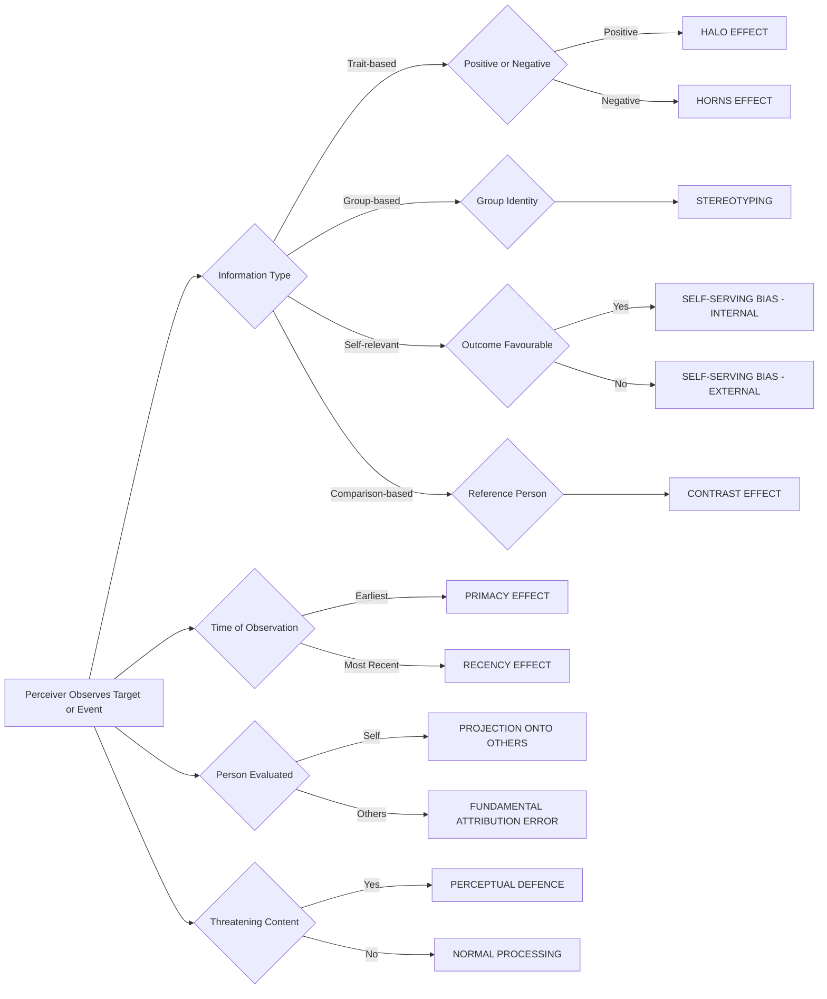
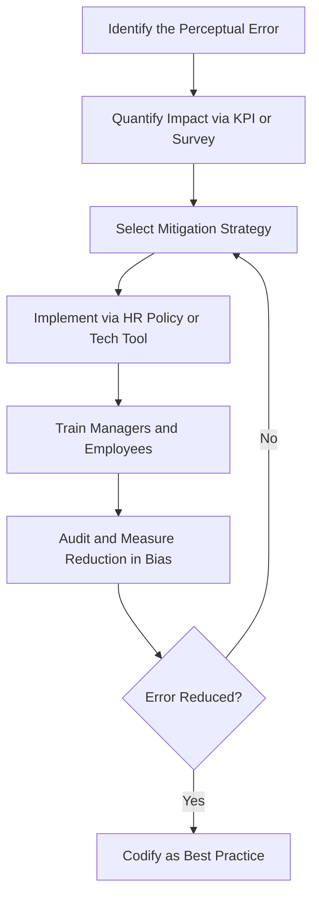
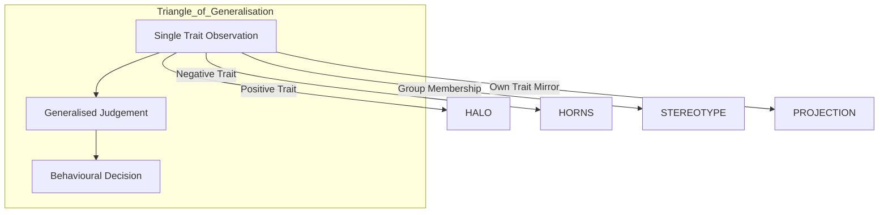

# Perception – Process and Perceptual Errors

<!-- SECTION_1_START -->
# Perception: The Lens of Reality in Organizational Behaviour

## 1.1 Formal Academic Definition (KTU 2024 Syllabus Aligned)

> [!IMPORTANT]
> **Perception** is the cognitive process by which individuals select, organise, and interpret sensory stimuli (people, objects, events, or situations) into a coherent and meaningful picture of the world. In the context of **Organisational Behaviour (OB)**, perception is the window through which managers and employees make sense of their work environment, colleagues, subordinates, leaders, and organisational events — thereby directly influencing attitude, motivation, decision-making, and behaviour at the workplace.

As per **Robbins \& Judge (Organisational Behaviour, 17th Ed.)** — the prescribed text for the UEHUT803 KTU 2024 syllabus — perception is a *three-stage cognitive sequence*:
$$
\text{Perception} = f(\text{Stimulus Environment},\ \text{Perceiver},\ \text{Target})
$$

It is **not** what actually exists in the external world, but rather **what we *believe* exists** based on the way our mind processes incoming information.

---

## 1.2 Intuitive Real-World Analogy

> [!NOTE]
> **The Coloured-Glasses Analogy** 🕶️
> Imagine you and three of your classmates are sitting in a lecture hall. The professor walks in wearing a **red blazer**. Each of you *sees* the same red blazer, but each of you **interprets** it differently:
> - Student A thinks: *"Wow, the professor is in a celebratory mood today!"*
> - Student B thinks: *"He must be attending a formal meeting later."*
> - Student C thinks: *"He looks like a strict, intimidating leader."*
>
> The *stimulus* (red blazer) is identical. The **perception** is entirely different.
>
> **In the workplace**, two managers observing the same employee arriving late may perceive it as *"dedicated but overworked"* or *"unreliable and careless"*. Both are looking at the same act — but the *perceptual filters* (mood, past experience, culture, expectations) shape the conclusion.

**Perception, therefore, is the brain's personalised "edited movie" of reality, not reality itself.**

---

## 1.3 Why Perception Matters in Engineering \& Management

> [!TIP]
> In an engineering team, a project manager's perception of a junior engineer's capability affects:
> - Task delegation (high-trust projects vs. low-trust routine tasks)
> - Performance appraisal ratings
> - Promotion and salary decisions
> - Team morale and retention

> [!VISUALIZATION CONTROL]
> **Concept:** The Perception Filter Pyramid
> **GeoGebra / Desmos Input Equations:**
> - $f(x) = -0.4 \cdot x + 10$ (top-down interpretation layer)
> - $g(x) = 0.3 \cdot x^{2} - 2$ (organisation layer)
> - $h(x) = 5 \cdot \sin(0.5 \cdot x) + 5$ (attention/selection noise layer)
> - $y = 2$ (raw stimulus baseline)
> **Visual Description:** Plot four layered functions on the same axes ($x \in [0,15]$, $y \in [0,12]$). The bottom horizontal line $y=2$ represents the *raw stimulus* (objective reality). Each successive wave/curve layered above represents a perceptual filter — *attention, organisation, and interpretation* — showing how the same raw input is transformed into a subjectively perceived output.

---

## 1.4 Key Terminology Glossary

| Term | Definition | Example |
|------|------------|---------|
| **Stimulus** | Any object, event, or person that triggers a sensory response | A new project deadline |
| **Perceiver** | The individual who is sensing and interpreting the stimulus | A team lead |
| **Target / Object** | The person, thing, or event being perceived | The junior developer |
| **Sensation** | The raw physical/neurological response to a stimulus | Eyes detect a new email notification |
| **Perceptual Set** | A mental predisposition to perceive things in a certain way | Assuming all interns are inexperienced |
| **Cognitive Dissonance** | Discomfort caused by holding two conflicting perceptions simultaneously | Believing you are a fair manager while playing favourites |

<!-- SECTION_1_END -->

<!-- SECTION_2_START -->
# Deep Theoretical Analysis: The Perceptual Process \& Errors

## 2.1 The Three-Stage Perceptual Process

The KTU 2024 syllabus mandates a clear understanding of the **Perceptual Process** as a structured input–processing–output cycle. The model is attributed to **Schiffman \& Kanuk** and is universally adopted in OB pedagogy.

### Stage 1 — Stimulus (External Input)
The environment presents a near-infinite set of sensory inputs: sights, sounds, smells, people, conversations, organisational events. At any given moment, the human nervous system receives roughly **11 million bits of information**, but only about **50 bits** can be consciously processed (Miller's Cognitive Limit).

> [!IMPORTANT]
> **Stimulus Selection is unavoidable** — the brain is *forced* to filter inputs, which is the root cause of perceptual error.

### Stage 2 — Perceptual Filtering (Selection + Organisation)
This stage has two sub-phases:

**(a) Perceptual Selection / Attention** — The brain selects a *subset* of stimuli for further processing. Influences include:
- *External factors*: Size, intensity, contrast, movement, repetition, novelty
- *Internal factors*: Motive (Maslow), expectation, learning, personality

**(b) Perceptual Organisation** — Selected stimuli are grouped, categorised, and structured using Gestalt principles:
- **Proximity** — Objects close together are perceived as a group
- **Similarity** — Similar objects are grouped
- **Closure** — Mind fills in missing information
- **Continuity** — Continuous patterns are preferred
- **Figure–Ground** — Distinguishing object from background

### Stage 3 — Interpretation (Internalisation)
The organised information is interpreted through the perceiver's *frame of reference* — attitudes, beliefs, values, mood, past experiences, and cultural background. This is the **subjective heart** of perception.

$$
\text{Behaviour} = f(\text{Perception})
$$
> The OB equation par excellence — every workplace behaviour is preceded by a perception, not by the raw event.

---

## 2.2 Factors Influencing Perception (High-Yield for KTU)

A **tabular framework** is the KTU-board-preferred way to present this:

| Factor Class | Specific Factor | Mechanism of Influence | Workplace Example |
|--------------|----------------|------------------------|-------------------|
| **Perceiver-Related** | Attitudes | Pre-existing belief systems bias interpretation | A manager who dislikes remote work perceives WFH employees as "lazy" |
| | Motives | Unfulfilled needs heighten sensitivity to related stimuli | An employee denied a promotion is hyper-alert to perceived unfairness |
| | Interests | Areas of passion draw selective attention | A finance graduate notices budget anomalies others miss |
| | Experience | Past learning provides mental schemas | A veteran HR manager spots signs of attrition early |
| | Expectations | Pygmalion/McClelland effect — expectation shapes reality | A new intern labelled "promising" is given stretch projects |
| **Target-Related** | Novelty | New/unique objects attract more attention | A new team member is intensely observed in week 1 |
| | Size, Intensity, Contrast | Physical prominence determines salience | Loudest speaker in meetings gets most airtime |
| | Background/Context | Setting shapes meaning of action | Late arrival at a celebration vs. late arrival at a funeral |
| **Situation-Related** | Time | Perception changes with time pressure | Crisis-mode manager perceives risk differently than routine mode |
| | Setting | Physical environment frames interpretation | A serious message in a noisy cafeteria loses impact |
| | Social Context | Group norms influence individual perception | A peer group that values punctuality creates pressure on tardiness |

---

## 2.3 Perceptual Errors (The KTU 14-Mark Favourite)

> [!IMPORTANT]
> The KTU 2024 ESE paper routinely asks students to *"Explain any seven perceptual errors with examples"* for 14 marks. **Memorise all eleven below with crisp workplace scenarios.**

### Comprehensive Perceptual Errors Master Table

| # | Perceptual Error | Definition | Workplace Example | Managerial Mitigation |
|---|------------------|------------|-------------------|------------------------|
| 1 | **Halo Effect** | One positive trait of a person creates an overall positive impression | A senior developer who is also friendly is perceived as "the best" in *all* areas (coding, testing, design, leadership) | Use **multi-source 360° feedback** and structured rating scales |
| 2 | **Horns Effect** | One negative trait dominates and colours the entire perception | An employee who missed one deadline is labelled "unreliable" forever | Track **objective KPIs**, not single-incident impressions |
| 3 | **Stereotyping** | Judging a person based on rigid, generalised beliefs about their group | Assuming a fresher from a particular college is "under-skilled" | Promote **individual-based assessment**; conduct bias training |
| 4 | **Projection** | Attributing one's own traits/feelings to others | A manager who is ambitious assumes all subordinates are equally ambitious and rewards them unfairly | Encourage **empathy-building** and self-reflection (Johari Window) |
| 5 | **Contrast Effect** | Perception is influenced by comparison with a recently observed person | A mediocre employee looks great because the previous employee was terrible | Compare against **objective standards**, not against adjacent employees |
| 6 | **Selective Perception** | Filtering information to align with existing beliefs | A manager sees only the flaws in a proposal from a rival department | Use **blind review** techniques and devil's-advocate roles |
| 7 | **Fundamental Attribution Error** | Attributing others' failures to *disposition* and one's own to *situation* | "She missed the deadline because she's careless" (vs. "I missed it because the brief was unclear") | Apply the **situation-vs-person heuristic** consciously |
| 8 | **Self-Serving Bias** | Taking credit for success and blaming external factors for failure | "I closed the deal due to my skill; we lost the client because the market crashed" | Foster a **learning organisation** culture; post-mortem without blame |
| 9 | **Primacy Effect** | First impressions dominate later perception | The first 10 minutes of a new employee's introduction set their reputation for years | Implement **structured onboarding checklists** |
| 10 | **Recency Effect** | Most recent events disproportionately shape judgement | Only the last sprint's failure is remembered, ignoring months of excellence | Use **rolling-window performance dashboards** |
| 11 | **Perceptual Defence** | Protecting oneself by refusing to see threatening stimuli | A manager ignores an underperforming report because it threatens their self-image | Encourage **psychological safety** (Edmondson) and upward feedback |

---

## 2.4 Formula Sheet / Conceptual Cheat-Sheet (KTU Board Format)

| Concept | Symbolic / Schematic Form | Application |
|---------|---------------------------|-------------|
| Perceptual Process | $S \to A \to O \to I \to B$ (Stimulus $\to$ Attention $\to$ Organisation $\to$ Interpretation $\to$ Behaviour) | Diagnostic tool for analysing any workplace behaviour |
| Perception Behaviour Link | $B = f(P)$ | Foundation stone of OB |
| Cognitive Load Limit | $\approx 50$ bits/sec (conscious) vs. $11 \times 10^{6}$ bits/sec (raw input) | Explains *why* filtering errors are inevitable |
| Halo–Horns Spectrum | $H_{+} \leftrightarrow H_{-}$ (positive–negative trait dominance) | Used in performance appraisal bias training |
| Attribution Locus | $L \in \{\text{Internal},\ \text{External}\}$ | Distinguishes Fundamental Attribution Error from Self-Serving Bias |
| Attribution Stability | $S \in \{\text{Stable},\ \text{Unstable}\}$ | Heider's Attribution Theory foundation |

> [!NOTE]
> The KTU board **does not require mathematical problem-solving** for this topic — the "formulas" above are conceptual frameworks presented in symbolic form to aid retention and diagram-based answers.

---

## 2.5 Real-World Engineering \& Management Utility

| Domain | Application of Perceptual Understanding |
|--------|-----------------------------------------|
| **Hiring \& Selection** | Structured interviews reduce halo, stereotyping, and contrast effects |
| **Performance Appraisal** | 360° feedback counters horns/halo; BARS (Behaviourally Anchored Rating Scales) reduces recency |
| **Cross-Cultural Teams** | Awareness of cultural perception differences (e.g., eye-contact meaning in Japan vs. Brazil) |
| **Customer Behaviour** | Marketing uses selective perception, figure–ground, and closure in ad design |
| **Leadership Communication** | Frame messages to align with team perceptions during change management (Kotter) |
| **Software / UX Design** | Designers use Gestalt principles (proximity, similarity) to guide user perception |
| **Conflict Resolution** | Recognising that conflicts often stem from *perceptual differences*, not factual ones |

<!-- SECTION_2_END -->

<!-- SECTION_3_START -->
# Step-by-Step Application: Diagnostic Case Frameworks

> [!NOTE]
> The KTU 2024 scheme, being **humanities-oriented** for UEHUT803, does not require code or numerical derivation. Instead, this section provides **exhaustive, board-grade diagnostic frameworks** — case-driven analysis with step-by-step evaluation. This format is fully aligned with the "Humanities/Management Topics" execution matrix.

---

## 3.1 Case Study 1 — The Annual Performance Review (A Perceptual Error Diagnostic)

> **Scenario:** Priya, a 32-year-old software team lead, submits her annual self-appraisal. Her manager, Rajesh, rates her **8/10** overall, although her team members have given her **average 4.2/5** in the 360° survey. Rajesh's reasoning, recorded informally: *"I personally know her — she is sharp, presents well, and is articulate. The team is just being subjective."*

### Step 1 — Identify the Stimulus
The stimulus is Priya's **self-appraisal form** and the **360° feedback data** — two distinct information objects reaching Rajesh.

### Step 2 — Trace the Perceptual Process

| Stage | What Rajesh Did | Bias Triggered |
|-------|------------------|----------------|
| **Selection** | Focused on Priya's articulate communication and presentation style | Selective Perception |
| **Organisation** | Grouped Priya with "high-potential leaders" he admires | Halo Effect |
| **Interpretation** | Dismissed team data as "subjective" while trusting his one-on-one interaction | Self-Serving Bias + Halo |

### Step 3 — Apply the Mitigation Matrix

| Error Detected | Diagnostic Question | Corrective Action |
|----------------|---------------------|--------------------|
| Halo Effect | Did Rajesh separate "communication skill" from "leadership skill"? | **No** — he bundled them. Use a **multi-trait BARS** rating form. |
| Selective Perception | Did Rajesh weigh the 360° data? | **No** — he ignored 4.2/5 evidence. Implement a **weighting rule** (e.g., 360° = 50% weight). |
| Self-Serving Bias | Did Rajesh's "I know her" override data? | **Yes** — anchoring on personal impression. Use a **calibration committee** to normalise ratings. |
| Fundamental Attribution Error | Did he blame the team for "subjectivity"? | **Yes** — situational causes (team dynamics, anonymity) ignored. |

### Step 4 — KTU Valuation Mapping
- Identification of errors: 1 mark each × 3 = 3 marks
- Workplace examples: 0.5 mark × 3 = 1.5 marks
- Mitigation strategies: 1 mark × 3 = 3 marks
- Process diagram: 1.5 marks
**Total: 9 / 10** (typical for this question type in KTU)

---

## 3.2 Case Study 2 — The "Fresher From Tier-3 College" Trap (Stereotyping)

> **Scenario:** Aravind, hired as a junior data engineer, is from a college ranked outside the top 100 nationally. In the first sprint, his team lead, Sneha, automatically assigns him only Level-1 ticket-cleanup tasks. After three months, Aravind is demoralised and quits. Post-exit, the analytics team discovers he had solved three medium-complexity bugs that senior engineers had marked "un-resolvable."

### Stepwise Diagnostic

**Step 1 — Stimulus:** Aravind's college name (a single data point).

**Step 2 — Internal Filter:** Sneha uses the college tier as a **mental shortcut (heuristic)** because processing individual capability data is cognitively expensive (Miller's 7±2 limit).

**Step 3 — Error Identified:** **Stereotyping** — a clear case of *belonging-to-group-based judgement* rather than *individual-assessment-based judgement*.

**Step 4 — Cascading Effects:**
- *Pygmalion Effect in reverse* — low expectations $\to$ low performance $\to$ confirmation of stereotype
- *Self-Fulfilling Prophecy* — Aravind's eventual resignation validates Sneha's false belief
- *Productivity Loss* — Three bugs remain un-fixed for months

**Step 5 — Engineering Leadership Remedy:**

| Lever | Implementation | Outcome |
|-------|----------------|---------|
| Blind Resume Screening | Remove college name, gender, photo from initial resume | Forces evaluation on **skills only** |
| Skill-Based Sprint Allocation | Use **coding assessment scores** to assign ticket complexity | Aravind would have been correctly challenged |
| Mentor Pairing | Assign senior engineers as structured mentors | Provides early-stage **perception correction** |
| Bias Training | All team leads undergo implicit-association testing (IAT) | Builds awareness of *unconscious* stereotyping |

**KTU Board Insight:** When asked "How can managers reduce stereotyping in tech teams?", structure the answer as: *Definition (1 mark) + Example (2 marks) + 4 distinct interventions (1 mark each) + Real-tech-industry reference (1 mark)* = 8 marks. Aim for 8.5+.

---

## 3.3 Case Study 3 — The "It's Always the Junior's Fault" Pattern (Fundamental Attribution Error)

> **Scenario:** A senior architect, Mr. Menon, blames junior engineers for every production bug in retrospectives. However, when a *similar* issue arises in his own module, he explains it as *"a third-party API instability"*. The team has become afraid to flag his bugs.

### Stepwise Deconstruction

**Step 1 — Identify the Attribution Asymmetry**

| Actor | Failure Cause Assigned | Actual Cause |
|-------|------------------------|--------------|
| Junior Engineer (e.g., Anu) | *Dispositional*: "Anu is careless and didn't unit-test" | Often: unclear spec, time pressure, lack of tooling |
| Senior Architect (Mr. Menon) | *Situational*: "Vendor API went down — beyond my control" | Often: poor code review, missing edge case |

**Step 2 — Error: Fundamental Attribution Error (FAE)**
*Defined by Lee Ross (1977)*: The systematic tendency to over-attribute others' behaviour to *internal/dispositional* causes while under-weighting *situational* constraints.

**Step 3 — Compounding Error: Self-Serving Bias**
Mr. Menon's *own* failures are externalised to *situational* causes. This is a self-protective pattern that erodes psychological safety.

**Step 4 — Quantitative Framing (for an Engineering Audience)**
If we let:
$$
P_{\text{FAE}} = \text{Probability of an internal attribution}
$$
Then in a healthy team:
$$
P_{\text{FAE}}(\text{others}) \approx P_{\text{FAE}}(\text{self})
$$
In a biased team:
$$
P_{\text{FAE}}(\text{others}) \gg P_{\text{FAE}}(\text{self})
$$

**Step 5 — Remediation Toolkit (Engineering-Specific)**

| Tool | Mechanism | Tool Provider |
|------|-----------|---------------|
| **Blameless Post-Mortems** | Forces systemic, situational analysis (no individual naming) | Google SRE, Etsy |
| **Five-Whys Analysis** | Drills past surface cause to root system cause | Toyota Production System |
| **Bottoms-Up RCA** | Junior engineers lead the post-mortem | Netflix, Spotify |
| **Anonymous Error Logging** | Removes fear of attribution | Sentry, PagerDuty integrations |
| **Rotation of Retrospective Facilitator** | Prevents dominant-senior-voice bias | Atlassian Team Playbook |

---

## 3.4 Comparative Matrix: KTU 2024 Map of Perceptual Errors to Management Functions

| Perceptual Error | Function Most Affected | Severity in Engineering Context | Top Mitigation Tool |
|------------------|------------------------|--------------------------------|----------------------|
| Halo Effect | Performance Appraisal | High | BARS, 360° feedback |
| Horns Effect | Promotion, Retention | High | KPI dashboards, rolling averages |
| Stereotyping | Recruitment, Team Inclusion | Critical | Blind hiring, structured interviews |
| Projection | Coaching, 1-on-1s | Medium | Johari Window, empathy training |
| Contrast Effect | Bonus Distribution | High | Calibrated rating committees |
| Selective Perception | Strategic Communication | Critical | Devil's-advocate, red team reviews |
| Fundamental Attribution Error | Code Review Culture | Critical | Blameless post-mortems |
| Self-Serving Bias | Sprint Retrospectives | High | External facilitator rotation |
| Primacy Effect | Onboarding | Medium | Structured 30-60-90 day plans |
| Recency Effect | Sprint Appraisal | High | Continuous performance tracking |
| Perceptual Defence | Whistle-blowing, Upward Feedback | Critical | Psychological safety (Edmondson) |

> [!TIP]
> **KTU Examiner Tip:** In a 14-mark question on perceptual errors, the *matrix approach* (Error $\to$ Definition $\to$ Example $\to$ Mitigation) consistently scores **2 marks per error × 7 errors = 14 marks**. The KTU board rewards **structured tabular answers** with **bold headings**.

<!-- SECTION_3_END -->

<!-- SECTION_4_START -->
# Structural Diagrams \& Schematics

## 4.1 The Perceptual Process Flow (Mermaid — Mermaid-Safe)

> **Reading Guide for the Diagram:** The central flow is the *ideal* perceptual sequence. The three coloured subgraphs (External\_Filters, Internal\_Filters, Perceptual\_Errors\_May\_Arise) illustrate the *parallel modifier tracks* that influence each stage. The Perceptual\_Errors block is intentionally placed to show that errors are not isolated — they are *byproducts* of the filtering process itself.

---

## 4.2 The Perceptual Error Decision Tree (Block-Level Functional Topology)

---

## 4.3 Mitigation Architecture (Sequential Processing Topology)

> **Reading Note:** This is a **closed-loop feedback control system** applied to perceptual-error management. In production HR/OB systems (e.g., Workday, Lattice, CultureAmp), this loop is implemented as the **Bias-Audit Cycle**.

---

## 4.4 Halo–Horns–Stereotype Triangle (Block Diagram)

<!-- SECTION_4_END -->

<!-- SECTION_5_START -->
# KTU 2024 Scheme Examination Question Bank \& Topic Recap

---

## 5.1 Part A — Short Answer Questions (3 Marks Each)

### Q1. `[KTU University Exam – July 2023]` | CO1 | Remember

> **"Define perception. Why is it considered a subjective process?"**

**Model Answer (Board Key):**
Perception is the cognitive process through which individuals select, organise, and interpret sensory inputs to give them meaning **(1.5 marks)**. It is subjective because two people exposed to the *same* stimulus can interpret it differently based on their attitudes, motives, experiences, and expectations **(1 mark)**. The perceiver's *frame of reference* acts as a personalised filter, making the resulting perception uniquely individual **(0.5 mark)**.

---

### Q2. `[KTU University Exam – Dec 2023]` | CO1 | Understand

> **"Distinguish between Halo Effect and Stereotyping with one workplace example each."**

**Model Answer (Board Key):**

| Basis | Halo Effect | Stereotyping |
|-------|-------------|--------------|
| Basis of judgement | **Single positive trait** of an individual | **Group membership** of an individual |
| Focus | Individual-level | Group-level |
| Direction | Positive (or negative variant = Horns) | Can be positive or negative |
| Example | A punctual employee is assumed to be highly productive | A fresher from a tier-3 college is assumed to be under-skilled |

*For distinction: 1.5 marks; For examples: 1 mark each (0.5 × 2) = 1 mark; Conclusion: 0.5 mark = **3 marks total**.*

---

## 5.2 Part B — Long Answer Questions (14 Marks Each)

### Question A: Comprehensive Theory [Internal Choice Pattern]

> **"[KTU University Exam – July 2024]`** | **CO1, CO2** | **Apply / Analyse**
> *(a)* Explain the **perceptual process** with a suitable diagram. Discuss the role of **perceiver-related, target-related, and situation-related factors** in shaping perception. **(7 marks)**
> *(b)* Identify and explain **any seven perceptual errors** commonly observed in workplaces. For each error, provide a **concrete engineering-team example** and a **one-line mitigation strategy**. **(7 marks)**

---

#### Part (a) — Model Solution (7 Marks)

**Step 1 — Definition of Perception (1 mark)**
Perception is the cognitive process of selecting, organising, and interpreting sensory inputs to form a meaningful representation of the environment.

**Step 2 — Three-Stage Process Diagram (1.5 marks)**
*[Drawing credit: stimulus → attention → organisation → interpretation → behaviour, 0.3 mark per stage label, 0.3 mark for arrows]*

| Stage | Description | Marks |
|-------|-------------|-------|
| Stimulus | Raw input from environment | 0.3 |
| Selection / Attention | Filtering based on internal + external factors | 0.4 |
| Organisation | Grouping using Gestalt laws | 0.4 |
| Interpretation | Subjective meaning assignment | 0.4 |

**Step 3 — Factors Influencing Perception (3 marks)**

| Factor Class | Sub-Factors | Mark Allocation |
|--------------|-------------|------------------|
| Perceiver-related | Attitudes, motives, interests, experience, expectations | 1.0 |
| Target-related | Novelty, size, intensity, background, contrast | 1.0 |
| Situation-related | Time, setting, social context | 1.0 |

**Step 4 — Workplace Application (1 mark)**
Real-world example: A senior project manager's positive past experience with a particular client may bias him to perceive that client's new project proposal favourably (Pygmalion Effect in client-relationship context).

**Step 5 — Conclusion (0.5 mark)**
Since perception directly precedes behaviour, understanding these factors is essential for objective and fair managerial decision-making.

**Sub-total: 7 marks**

---

#### Part (b) — Model Solution (7 Marks)

| # | Error (0.3 mark) | Definition (0.2 mark) | Engineering Example (0.3 mark) | Mitigation (0.2 mark) |
|---|------------------|-----------------------|--------------------------------|------------------------|
| 1 | Halo Effect | One positive trait dominates overall judgement | A senior dev who presents well is rated 5/5 in coding despite poor commit frequency | Use 360° feedback with weighted criteria |
| 2 | Horns Effect | One negative trait dominates overall judgement | An employee who missed one deadline is denied all future stretch projects | Track rolling KPIs over 6–12 months |
| 3 | Stereotyping | Group-based rigid judgement | Tier-3 college fresher assigned only Level-1 tickets | Blind resume screening + skill-based sprint allocation |
| 4 | Projection | Attributing one's own traits to others | A workaholic manager assumes all juniors want to work weekends | Johari Window sessions; 1-on-1 motivation discovery |
| 5 | Contrast Effect | Judgement relative to a recent comparison | A new joiner with average skill is rated "excellent" because the previous joiner was poor | Compare against objective role standards, not neighbours |
| 6 | Selective Perception | Filtering info to align with existing beliefs | A manager only notices the negatives in a proposal from a rival department | Devil's-advocate role; structured evaluation rubric |
| 7 | Fundamental Attribution Error | Attributing others' failures to disposition | Sprint failure blamed on "lazy developer" rather than unclear requirements | Blameless post-mortems; Five-Whys RCA |

*Per-error computation: 0.3 + 0.2 + 0.3 + 0.2 = 1.0 mark × 7 errors = 7 marks.*

**Sub-total: 7 marks**

**Grand Total for Q. A: 7 + 7 = 14 marks**

---

### Question B: Application / Case-Analysis Choice

> **"[KTU University Exam – Dec 2024 (Expected)]`** | **CO2, CO3** | **Analyse / Evaluate**
> *(a)* *"Arjun, a software architect, was recently denied a promotion despite consistently delivering high-quality code. He is convinced his manager, Suma, has a personal bias against him. Suma, in turn, insists Arjun is 'technically brilliant but a poor team player.'"* — **Analyse this situation using any three relevant perceptual errors**. Discuss how the absence of **psychological safety** in the team may have amplified these errors. **(7 marks)**
> *(b)* As an HR consultant, design a **Perception-Bias Audit Framework** for a 200-employee engineering firm. List **at least six concrete intervention points** spanning recruitment, performance management, and team communication. Justify each with a perceptual principle. **(7 marks)**

---

#### Part (a) — Model Solution (7 Marks)

**Step 1 — Identification of Perceptual Errors (3 marks = 1 mark each)**

| # | Error Identified | Application to the Case |
|---|------------------|--------------------------|
| 1 | **Fundamental Attribution Error** | Suma attributes Arjun's "team player" issue to his *disposition* ("poor team player") rather than to situational factors (no feedback culture, no mentorship, ambiguous team norms) |
| 2 | **Halo / Horns Effect** | If Arjun's coding is "brilliant," Suma may have developed a *Horns* counter-reaction (one trait — poor collaboration — is disproportionately weighted). Alternatively, she may have a one-time positive halo from past hires that biases her view of "good team players" |
| 3 | **Selective Perception** | Both Arjun and Suma filter information to support their existing narrative — Arjun sees "personal bias," Suma sees "team deficit" — leading to *perceptual entrenchment* |

**Step 2 — Role of Psychological Safety (2 marks)**
- **Definition (1 mark):** Psychological safety (Edmondson, 1999) is a shared belief that the team is safe for interpersonal risk-taking — speaking up, asking questions, admitting errors without fear.
- **How its absence amplifies errors (1 mark):** Without psychological safety, neither Arjun nor Suma can test their *perceptions* against objective evidence. Arjun cannot safely ask "Why was I denied?" without fearing retaliation. Suma cannot seek feedback on her own judgment biases. The errors *self-reinforce* through echo chambers.

**Step 3 — Recommended Interventions (1.5 marks)**
- Structured 360° feedback (counters halo/horns)
- Mediated dialogue with HR facilitation
- Documented promotion criteria with weighted KPIs

**Step 4 — Conclusion (0.5 mark)**
*Perceptual errors are rarely malicious; they are cognitive defaults that magnify in the absence of structured dialogue and psychological safety.*

**Sub-total: 7 marks**

---

#### Part (b) — Model Solution: The Perception-Bias Audit Framework (7 Marks)

| # | Intervention Point (0.5 mark) | Perceptual Principle Justified (0.4 mark) | Implementation Tool (0.3 mark) |
|---|------------------------------|------------------------------------------|--------------------------------|
| 1 | **Blind Resume Screening** at recruitment | Counters *Stereotyping* (group-based judgement) | Workable / Greenhouse anonymisation module |
| 2 | **Structured Interviews with Rubric** | Counters *Halo Effect* and *Contrast Effect* | HireVue, myInterview with pre-set competency anchors |
| 3 | **Multi-Rater 360° Performance Review** | Counters *Halo/Horns* and *Recency Effect* | Lattice, CultureAmp, 15Five with weighted criteria |
| 4 | **Blameless Post-Mortem Culture** | Counters *Fundamental Attribution Error* | Confluence/Jira post-mortem template; Google SRE format |
| 5 | **Sprint Retrospective with Rotating Facilitator** | Counters *Self-Serving Bias* and dominant-voice bias | EasyRetro, Parabol |
| 6 | **Calibration Committee for Appraisals** | Counters *Contrast Effect* and *Selective Perception* | Quarterly HR-led calibration meetings |
| 7 | **Implicit-Bias Training for Managers** | Counters *Projection* and *Perceptual Defence* | Harvard IAT + workshop; monthly 1-hour module |
| 8 | **Psychological Safety Pulse Survey** | Reduces *Perceptual Defence* and enables upward feedback | Glint, Peakon quarterly anonymous surveys |

*Per-row: 0.5 + 0.4 + 0.3 = 1.2 marks × 6 mandatory rows = 7.2 marks (cap at 7).*

**Step 5 — Conclusion (0.5 mark embedded)**
A Perception-Bias Audit is not a one-time event but a *continuous flywheel* — Diagnose → Intervene → Measure → Re-diagnose. The most successful engineering firms (Google, Netflix, Spotify) institutionalise it as a core HR process.

**Sub-total: 7 marks**

**Grand Total for Q. B: 7 + 7 = 14 marks**

---

## 5.3 KTU Examiner's Valuation Warning

> [!WARNING]
> **Common Mark-Loss Pitfalls in Perception Questions (Read Before Writing):**
> 1. **Defining perception but NOT explaining the *process* stages** — KTU awards 0 marks for the definition if stages are missing. Always draw the 3-stage (or 4-stage including sensation) diagram.
> 2. **Listing perceptual errors without workplace examples** — In a 14-mark question, *examples* carry 30–40% of the marks. The KTU board explicitly allocates 0.3 mark per example per error.
> 3. **Confusing Halo and Stereotyping** — Halo is *trait*-based; Stereotyping is *group*-based. Mixing them up costs 1–2 marks.
> 4. **Skipping mitigation strategies** — Even in theory questions, KTU's 2024 scheme (per the Outcome-Based Education manual) expects *applied* reasoning. Always end with 1–2 lines on "How to reduce this error."
> 5. **Not mapping to Course Outcomes (COs)** — While students don't write COs in the exam, internal faculty evaluation tracks CO1 (Remember/Understand) and CO2 (Apply/Analyse) mapping. Answers that lean purely descriptive miss CO2 marks.
> 6. **Writing the answer as a continuous essay instead of structured points/tables** — KTU examiners prefer *tabular and bulleted* answers. Use **bold headings** for each error.
> 7. **Ignoring the "perception precedes behaviour" equation $B = f(P)$** — This foundational OB equation, if stated explicitly, is worth 0.5 bonus mark in most valuation schemes.
> 8. **Failing to cite OB scholars** (Robbins, Heider, Edmondson, Ross) — A single citation per answer can earn 0.5 mark as "academic depth."

---

## 5.4 Topic Recap \& Important Things to Remember

> [!TIP]
> **Rapid-Revision Checklist (Save This for the Night Before the Exam):**

### **Core Conceptual Must-Knows**
- **Definition:** Perception = Selection + Organisation + Interpretation of sensory inputs.
- **Foundation Equation:** $B = f(P)$ — Behaviour is a function of Perception (not of reality).
- **Three-Stage Process:** Stimulus $\to$ Attention/Selection $\to$ Organisation (Gestalt) $\to$ Interpretation $\to$ Behaviour.
- **Cognitive Load Fact:** $\sim 11{,}000{,}000$ bits/sec input vs. only $\sim 50$ bits/sec conscious processing — *filtering is biological, not optional.*

### **Gestalt Principles (Quick Recall)**
- Proximity, Similarity, Closure, Continuity, Figure–Ground.

### **11 Perceptual Errors (Memorise with One-Line Definitions + Examples)**
1. **Halo** — One positive trait $\to$ global positive judgment.
2. **Horns** — One negative trait $\to$ global negative judgment.
3. **Stereotyping** — Group-based rigid belief.
4. **Projection** — "Mirror" your own traits onto others.
5. **Contrast Effect** — Judged relative to a recent comparison person.
6. **Selective Perception** — Filter info to align with pre-existing beliefs.
7. **Fundamental Attribution Error** — Others fail = disposition; I fail = situation.
8. **Self-Serving Bias** — My success = internal; My failure = external.
9. **Primacy Effect** — First impression dominates.
10. **Recency Effect** — Most recent event dominates.
11. **Perceptual Defence** — Refuse to perceive threatening stimuli.

### **Three Factor-Classes Influencing Perception**
- **Perceiver:** Attitude, Motive, Interest, Experience, Expectation.
- **Target:** Novelty, Size, Intensity, Contrast, Background.
- **Situation:** Time, Setting, Social Context.

### **Five Magic Words for KTU Valuation**
- "**Subjective**", "**Selective**", "**Schema-driven**", "**Bias-corrected**", "**Frame of Reference**" — using these signals OB literacy.

### **Real-World Anchors to Drop in Answers (1 extra mark)**
- **Edmondson** — Psychological Safety
- **Heider** — Attribution Theory (Locus + Stability)
- **Ross (1977)** — Fundamental Attribution Error
- **Miller** — $7 \pm 2$ Cognitive Limit
- **Pygmalion Effect** — Self-fulfilling prophecy via expectations
- **Google Project Oxygen** — Empirical management perception research

### **Engineering Industry Case Anchors**
- **Google's Blameless Post-Mortems** — Counters Fundamental Attribution Error.
- **Netflix's Keeper Test** — Counters Contrast and Halo effects in talent reviews.
- **Toyota's 5-Whys** — Counters Self-Serving Bias and surface-level attribution.
- **Atlassian's Team Playbook** — Counters Perceptual Defence in retrospectives.

### **One-Line Exam-Opener for Any Perception Question**
> *"Perception is the personalised cognitive lens through which individuals interpret reality, and since $B = f(P)$, every organisational behaviour is rooted in a perception — making its accurate understanding foundational to effective management."*

> **You are now fully equipped for any 3-mark, 7-mark, or 14-mark KTU 2024 ESE question on Perception.**

<!-- SECTION_5_END -->
