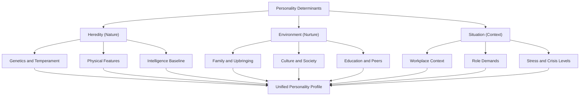
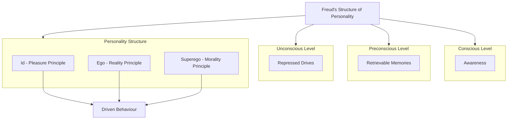
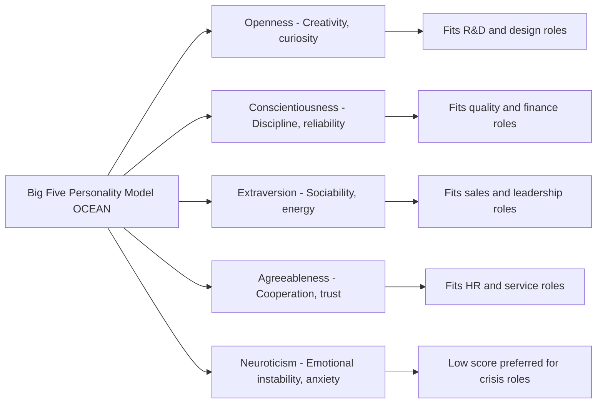
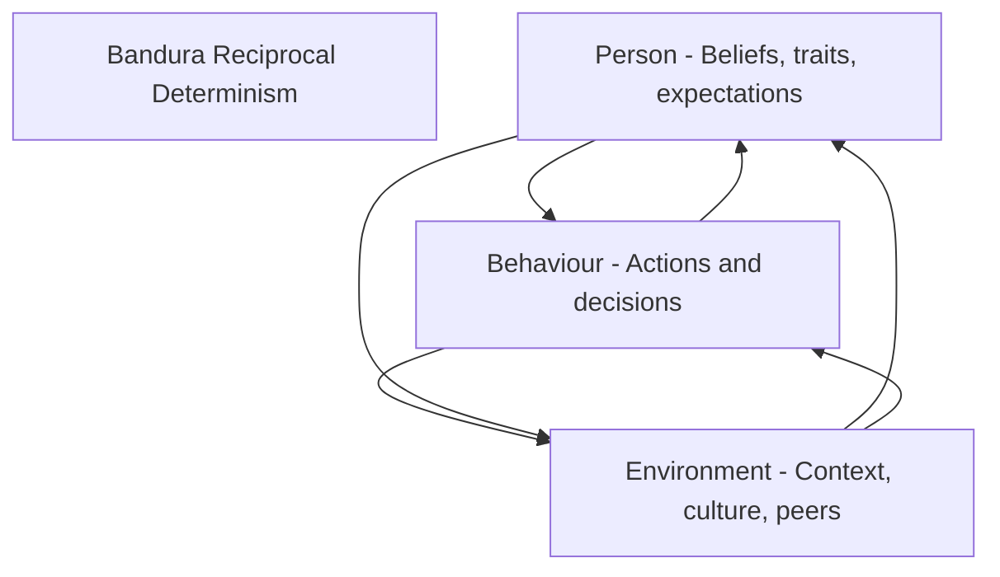
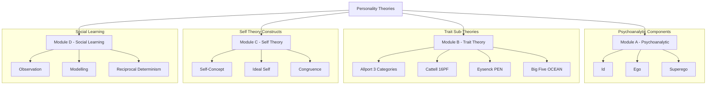
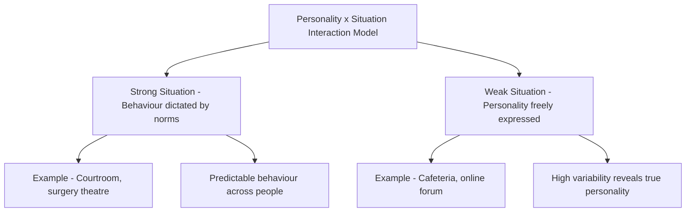

# Personality – Determinants and Theories

<!-- SECTION_1_START -->

# Personality – Determinants and Theories

## 1.1 Formal Definition (KTU 2024 Syllabus Terminology)

> [!IMPORTANT]
> **Personality** is the dynamic and organized set of characteristics possessed by a person that uniquely influences their cognitions, motivations, behaviours, and patterns of emotions in various situations.

In KTU 2024 Scheme OB terminology, personality is treated as a **psychosocial construct** that emerges from the continuous interaction of **biological** (hereditary), **environmental** (social/cultural), and **situational** variables. It is the **"total person"** concept — the sum of psychological and behavioural tendencies that determine how an individual responds to the work environment.

$$\text{Personality} = f(\text{Heredity}, \text{Environment}, \text{Situation})$$

### Conceptual Analogy / Intuition

Imagine personality as a **musical instrument** (say, a guitar):
- The **wood, strings, and shape** of the guitar = **Heredity** (raw biological material, fixed at birth).
- The **climate where it is stored and the musician who trains on it** = **Environment** (family, culture, education).
- The **song being played at any moment** = **Situation** (the work context, peers, deadlines).

Just as the same guitar sounds different in a concert hall vs. a quiet room, the same person behaves differently in a job interview vs. a friendly gathering. The instrument is the same — but the **output changes with the surroundings**.

> [!NOTE]
> **Key Distinction:** Personality is *not* synonymous with character or temperament alone. It is a **multi-dimensional construct** integrating **thinking, feeling, and acting** patterns over time.

---

## 1.2 Why Personality Matters in Organizational Behaviour

| OB Context | Application of Personality Concept |
|---|---|
| **Recruitment & Selection** | Personality tests (e.g., Big Five) predict job fit. |
| **Team Building** | Trait diversity enhances team performance. |
| **Leadership Development** | Trait theory identifies potential leaders. |
| **Conflict Management** | Understanding personality reduces workplace friction. |
| **Motivation & Engagement** | Personality aligns with Herzberg / Maslow needs. |

> [!VISUALIZATION CONTROL]
> **Concept:** Personality as the intersection of three core forces
> **Reference Frame:** Venn Diagram (3 overlapping circles)
> **Circle A (Left):** Heredity → Genetics, Temperament, Physical Stature
> **Circle B (Right):** Environment → Family, Culture, Education, Peers
> **Circle C (Top):** Situation → Work Context, Role Demands, Stress
> **Visual Description:** The student should observe a central overlapping region where all three forces intersect — this intersection is the **unique personality** of the individual. The non-overlapping regions show that some behaviours are *purely inherited*, *purely learned*, or *purely situational*.

---

## 1.3 Determinants of Personality — Overview

The **KTU 2024 Module 1 syllabus** explicitly identifies three major determinants:

1. **Heredity** (Nature) — biological/genetic factors
2. **Environment** (Nurture) — socio-cultural learning
3. **Situation** — context-dependent behavioural triggers

Each determinant will be expanded in Section 2 with engineering-realistic case mappings.

<!-- SECTION_1_END -->

<!-- SECTION_2_START -->

# 2. Deep Theoretical Analysis & KTU High-Yield Reference Sheet

## 2.1 Determinant 1 — Heredity (Nature)

Heredity refers to the **biological endowment** an individual inherits from parents through genes. It sets the **boundaries or limits** within which personality develops.

### Key Hereditary Factors
- **Physical features** — height, physique, facial structure
- **Temperament** — inborn emotional disposition (e.g., easy, difficult, slow-to-warm-up)
- **Intelligence** (IQ heritability ~50–80% in adults)
- **Reflexes & Energy Levels** — basal metabolic rate, muscle composition
- **Biological rhythms** — circadian patterns affecting work productivity

### Heredity — Reference Sheet

| Factor | Description | OB Implication |
|---|---|---|
| Physical features | Body build, attractiveness | Halo effect in appraisals |
| Temperament | Innate emotional tone | Stress tolerance varies |
| Intelligence | Cognitive capacity | Job-task complexity fit |
| Energy & Health | Vitality, stamina | Shift-work suitability |
| Reflexes | Reaction speed | Safety-critical roles (e.g., plant operators) |

> [!NOTE]
> **KTU Examiner Cue:** Heredity is **not destiny**. It provides *raw material*; environment shapes the *final form*.

---

## 2.2 Determinant 2 — Environment (Nurture)

Environment encompasses all **external influences** shaping personality after conception. It is the most powerful *modifiable* determinant.

### Layers of Environmental Influence

$$\text{Environment} = \text{Family} \cup \text{Culture} \cup \text{Education} \cup \text{Social Groups} \cup \text{Experiences}$$

| Layer | Description | Example (Engineering Context) |
|---|---|---|
| **Family** | Primary socialization agent | A child raised in a family of engineers develops analytical orientation. |
| **Culture** | Shared values, beliefs, norms | Indian collectivism vs. Western individualism affects team behaviour. |
| **Education** | Formal learning and socialization | IITs/NITs instil disciplined, problem-solving personalities. |
| **Social Groups** | Peer influence, reference groups | Tech communities shape open-source contributor identity. |
| **Life Experiences** | Critical incidents, trauma, success | A startup failure may convert an aggressive founder into a reflective leader. |

---

## 2.3 Determinant 3 — Situation

The **interactionist perspective** (Mischel, 1968) argues that behaviour is a function of *both* personality and *situation*. The same person may behave very differently across situations.

$$\text{Behaviour} = f(\text{Person} \times \text{Situation})$$

### Personality–Situation Matrix

| Personality Type | Formal Setting | Informal Setting | Crisis Setting |
|---|---|---|---|
| **Extrovert** | Talkative in meetings | Energetic in parties | Direct command-giver |
| **Introvert** | Quiet but observant | Reserved but listening | Calm analytical planner |
| **Ambivert** | Balanced | Balanced | Adaptable mediator |

> [!IMPORTANT]
> **Strong situations** (e.g., funerals, boardrooms) override personality. **Weak situations** (e.g., park, café) allow personality to fully express.

---

## 2.4 Theories of Personality — KTU High-Yield Summary Sheet

The KTU 2024 Module 1 syllabus prescribes **four major theoretical frameworks**. Each is presented below in a board-exam-ready format.

| # | Theory | Proponent | Core Idea | OB Relevance |
|---|---|---|---|---|
| 1 | **Psychoanalytic Theory** | Sigmund Freud | Unconscious drives (Id, Ego, Superego) shape behaviour | Explains hidden motives in negotiations. |
| 2 | **Trait Theory** | Allport, Cattell, Eysenck, McCrae & Costa | Personality is a set of stable traits | Big Five used in recruitment. |
| 3 | **Self Theory** | Carl Rogers | Self-concept and self-esteem drive behaviour | Counselling, motivation, L&D. |
| 4 | **Social Learning Theory** | Albert Bandura | Personality is learned via observation & modelling | Training, mentoring, leadership modelling. |
| 5 | **Humanistic Theory (bonus)** | Abraham Maslow, Carl Rogers | Self-actualization motivates growth | OD interventions, empowerment. |

> [!NOTE]
> **LaTeX-Safe Reference:** The Big Five acronym is often written as **OCEAN** — Openness, Conscientiousness, Extraversion, Agreeableness, Neuroticism.

### Big Five (OCEAN) — High-Yield Reference

| Trait | High-Scorer Behaviour | Low-Scorer Behaviour | Job-Fit Example |
|---|---|---|---|
| **Openness** | Creative, curious, imaginative | Conventional, practical | R\&D roles |
| **Conscientiousness** | Disciplined, reliable, organized | Impulsive, careless | Quality assurance, finance |
| **Extraversion** | Sociable, assertive, energetic | Reserved, quiet | Sales, leadership |
| **Agreeableness** | Trusting, cooperative, kind | Competitive, sceptical | HR, customer service |
| **Neuroticism** | Anxious, moody, emotionally unstable | Calm, secure, stable | Crisis roles (police) preferred low scores |

---

## 2.5 Real-World Engineering / CS Utility of Personality Frameworks

| Industry Use Case | Theory Applied | Engineering Outcome |
|---|---|---|
| **Google Project Aristotle** | Big Five + Interactionist | Identified psychological safety as the #1 team-effectiveness factor. |
| **Amazon Bar Raiser System** | Trait Theory | Standardized personality-trait-based hiring for consistency. |
| **Infosys & TCS Leadership Pipeline** | Trait + Self Theory | Used Big Five + self-concept mapping for promotion panels. |
| **NASA Astronaut Selection** | Trait + Situation | High Conscientiousness + Low Neuroticism + situational adaptability. |
| **Start-up Founder Coaching** | Self Theory + Social Learning | Founders trained on self-awareness and peer-mentor modelling. |

<!-- SECTION_2_END -->

<!-- SECTION_3_START -->

# 3. Step-by-Step Theoretical Breakdown & Comparative Analysis

> Per the **Domain-Adaptive Execution Matrix** for Humanities/Management topics, this section provides an extensive **tabular comparative analysis** mapping each personality theory to its **regulatory/systemic matrix**, with explicit textual explanation of every construct.

---

## 3.1 Psychoanalytic Theory (Sigmund Freud)

### 3.1.1 Levels of Consciousness (Freud's Topographical Model)

| Level | Location | Content Type | OB Analogy |
|---|---|---|---|
| **Conscious** | Surface mind | Currently aware thoughts | What an employee says in a meeting |
| **Preconscious** | Just below awareness | Memories easily recalled | Past performance reviews retrievable on demand |
| **Unconscious** | Deep mind | Repressed drives, instincts | Hidden biases, unspoken grievances, jealousy of peers |

### 3.1.2 Structure of Personality (Freud's Structural Model)

| Component | Principle | Function | Workplace Analogy |
|---|---|---|---|
| **Id** | Pleasure Principle | Demands instant gratification | The employee who wants a promotion *now*, regardless of readiness. |
| **Ego** | Reality Principle | Mediates Id and Superego | The manager who balances ambition with organizational constraints. |
| **Superego** | Morality Principle | Internalized societal norms | The engineer's ethical code that prevents data manipulation. |

$$\text{Behaviour} = \text{Id} \leftrightarrow \text{Ego} \leftrightarrow \text{Superego}$$

### 3.1.3 Defence Mechanisms — KTU Reference Table

| Mechanism | Definition | Workplace Example |
|---|---|---|
| **Repression** | Blocking unacceptable thoughts | Forgetting a traumatic layoff. |
| **Projection** | Attributing own feelings to others | A biased manager accusing juniors of favouritism. |
| **Denial** | Refusing to accept reality | An underperformer blaming the system. |
| **Rationalization** | Justifying behaviour with logic | "I left for higher pay" instead of "I was fired." |
| **Reaction Formation** | Behaving opposite to true feelings | A hostile boss who acts overly friendly. |
| **Displacement** | Redirecting emotions to a safer target | Yelling at a junior after a board meeting. |
| **Sublimation** | Channeling impulses constructively | A competitive athlete becoming a sports coach. |

> [!IMPORTANT]
> **Freud's Limitations (Board Favourite):** Unfalsifiable, gender-biased, overemphasis on sexuality, ignores social/cultural factors.

---

## 3.2 Trait Theory (Dispositional Approach)

### 3.2.1 Allport's Trait Classification

| Category | Description | Example | Number of Traits |
|---|---|---|---|
| **Cardinal Traits** | Dominant, pervasive traits that define a person | Mother Teresa's altruism | 1–2 per person |
| **Central Traits** | Core characteristics forming the personality foundation | Honest, punctual, loyal | 5–10 per person |
| **Secondary Traits** | Situational preferences and attitudes | Preference for spicy food | Many, less observable |

### 3.2.2 Cattell's 16 Personality Factors (16PF)

Cattell used **factor analysis** to reduce Allport's 4,500 traits into **16 source traits**. Each is measured on a bipolar scale.

| # | Factor | Low Pole | High Pole |
|---|---|---|---|
| 1 | Warmth | Reserved | Warm |
| 2 | Reasoning | Concrete | Abstract |
| 3 | Emotional Stability | Reactive | Emotionally stable |
| 4 | Dominance | Deferential | Dominant |
| 5 | Liveliness | Serious | Lively |
| 6 | Rule-Consciousness | Expedient | Rule-conscious |
| 7 | Social Boldness | Shy | Socially bold |
| 8 | Sensitivity | Utilitarian | Sensitive |
| 9 | Vigilance | Trusting | Vigilant |
| 10 | Abstractedness | Grounded | Abstracted |
| 11 | Privateness | Open | Private |
| 12 | Apprehension | Self-assured | Apprehensive |
| 13 | Openness to Change | Traditional | Open to change |
| 14 | Self-Reliance | Group-oriented | Self-reliant |
| 15 | Perfectionism | Tolerates disorder | Perfectionistic |
| 16 | Tension | Relaxed | Tense |

### 3.2.3 Eysenck's PEN Model

| Dimension | Description | High-Scorer Profile |
|---|---|---|
| **P** – Psychoticism | Tough-minded, non-conformist, impulsive | Risk-takers, entrepreneurs |
| **E** – Extraversion | Sociable, energetic, optimistic | Salespeople, leaders |
| **N** – Neuroticism | Anxious, moody, emotionally unstable | Prone to workplace stress |

$$\text{Personality} = f(P, E, N)$$

### 3.2.4 Big Five / Five-Factor Model (Costa & McCrae) — The Gold Standard

| Trait | Acronym Letter | Description | OB Implication |
|---|---|---|---|
| **Openness** | O | Intellectual curiosity, creativity | Innovation, R\&D roles |
| **Conscientiousness** | C | Self-discipline, organization | Job performance predictor #1 |
| **Extraversion** | E | Sociability, assertiveness | Sales, leadership |
| **Agreeableness** | A | Trust, cooperation | Teamwork, customer service |
| **Neuroticism** | N | Emotional instability | Stress, turnover, burnout |

> [!NOTE]
> **KTU Board Trick:** "Which Big Five trait is the strongest predictor of job performance across all occupations?" → **Conscientiousness (C)**.

---

## 3.3 Self Theory (Carl Rogers)

### 3.3.1 Key Constructs

| Construct | Definition | OB Application |
|---|---|---|
| **Self-Concept** | Total view of oneself (who I am) | Career counselling, identity workshops. |
| **Ideal Self** | Who one wishes to be | Goal-setting, performance planning. |
| **Self-Esteem** | Self-worth evaluation | Confidence, engagement. |
| **Organismic Self** | The true, authentic self | Encouraged in OD interventions. |

### 3.3.2 The Congruence Model (Rogers)

$$\text{Psychological Health} \propto \text{Congruence (Self-Concept vs.\ Experience)}$$

- **High Congruence** → Healthy personality, self-actualization.
- **Low Congruence (Incongruence)** → Anxiety, defensiveness, maladjustment.

### 3.3.3 Self Theory — Real-World Case Mapping

| Industry Scenario | Self-Theory Application |
|---|---|
| New graduate joining an IT firm | Self-Concept: "I am a coder." Mismatch with assigned testing role → incongruence → demotivation. |
| Manager promoted to Director | Ideal Self: "Strategic leader." Reality: Still doing operational tasks → low congruence. |
| Counselling for burnout | Helping employee align Self-Concept with job realities. |

---

## 3.4 Social Learning Theory (Albert Bandura)

### 3.4.1 Core Premises

1. Personality is **learned** through interaction with the environment.
2. Learning occurs via **observation** (modelling), not just direct experience.
3. Cognitive processes mediate learning.
4. **Reciprocal Determinism** — person, behaviour, and environment all influence each other.

### 3.4.2 Reciprocal Determinism Model

$$\text{Person} \leftrightarrow \text{Behaviour} \leftrightarrow \text{Environment}$$

| Element | Description | Engineering Example |
|---|---|---|
| **Person** (P) | Beliefs, expectations, personality | A senior developer believing juniors are trainable. |
| **Behaviour** (B) | Actions taken | Mentoring sessions, code reviews. |
| **Environment** (E) | External context | Open-source culture, knowledge-sharing platforms. |

### 3.4.3 Key Processes in Observational Learning

| Process | Definition | Workplace Application |
|---|---|---|
| **Attention** | Noticing the model's behaviour | Watching a senior handle a client crisis. |
| **Retention** | Remembering observed behaviour | Storing the crisis-handling playbook. |
| **Reproduction** | Replicating the behaviour | Using the same crisis-handling steps. |
| **Motivation** | Having a reason to imitate | Recognition, reward, or internal satisfaction. |

> [!IMPORTANT]
> **Bobo Doll Experiment (Bandura, 1961, 1963):** Children imitated aggressive behaviour observed in adults → established the foundation of social learning theory.

---

## 3.5 Master Comparative Matrix — All Four Theories

| Dimension | Psychoanalytic (Freud) | Trait (Allport/Cattell/OCEAN) | Self (Rogers) | Social Learning (Bandura) |
|---|---|---|---|---|
| **Focus** | Unconscious mind | Measurable traits | Self-concept | Observed behaviour |
| **Determinism** | Deterministic (drives) | Biological + situational | Humanistic, free will | Reciprocal determinism |
| **Method** | Case study, psychoanalysis | Factor analysis, self-report | Client-centred therapy | Experimental observation |
| **Strengths** | Depth, history of mind | Measurable, predictive | Empowers individuals | Real-world applicability |
| **Weaknesses** | Unfalsifiable, gender bias | Ignores situation | Vague, hard to measure | Underestimates biology |
| **OB Use** | Understanding hidden motives | Hiring, team composition | Coaching, OD | Training, mentoring |
| **Key Term** | Id-Ego-Superego | Cardinal-Central-Secondary | Congruence | Reciprocal Determinism |

> [!NOTE]
> **KTU High-Yield Insight:** No single theory explains personality fully. Modern OB adopts an **interactionist approach** combining trait + situation + self + learning perspectives.

<!-- SECTION_3_END -->

<!-- SECTION_4_START -->

# 4. Structural Diagrams & Schematics

> Per the **Mermaid Compilation Safeguards**, all node IDs are alphanumeric-prefixed, all labels are double-quoted and free of markdown formatting, and multi-stage breakdowns use nested subgraphs.

## 4.1 Determinants of Personality — Hierarchical Flow

## 4.2 Freud's Structural Model — Subgraph Topology

## 4.3 Big Five (OCEAN) — Radar Conceptual Map

## 4.4 Reciprocal Determinism (Bandura) — Triadic Flow

## 4.5 Comparative Theory Architecture — Modular Topology

## 4.6 Personality–Situation Interaction Matrix (Block Diagram)

<!-- SECTION_4_END -->

<!-- SECTION_5_START -->

# 5. KTU 2024 Scheme Examination Question Bank & Topic Recap

> All questions are mapped to **Course Outcomes (CO)** and **Revised Bloom's Taxonomy (RBT)** cognitive levels, with simulated KTU past-year tags.

---

## 5.1 Part A — Short Answer Questions (3 Marks Each)

### Question 1
> **[KTU University Exam – July 2024]**
> Define personality. List any **four** determinants of personality.
> **CO1 | RBT: Remember**
> **Model Answer (3 Marks):**

> [!NOTE]
> **Personality** is the dynamic and organized set of characteristics that uniquely influence an individual's cognitions, motivations, behaviours, and emotional patterns across situations. (2 Marks)

**Four Determinants:** (1 Mark — ¼ Mark each)

1. **Heredity** – genetic and biological inheritance.
2. **Environment** – family, culture, education, peers.
3. **Situation** – context-specific behavioural triggers.
4. **Learning and Experience** – conditioning and modelling over time.

---

### Question 2
> **[KTU University Exam – Dec 2023]**
> Explain **Self-Concept** and **Self-Esteem** as proposed by Carl Rogers.
> **CO1 | RBT: Understand**
> **Model Answer (3 Marks):**

| Construct | Definition | Example |
|---|---|---|
| **Self-Concept** | The total view an individual holds about themselves — who they believe they are. | "I am a software engineer." (1 Mark) |
| **Self-Esteem** | The evaluative component of self-concept — the worth one assigns to oneself. | High self-esteem: confident; Low: insecure. (1 Mark) |
| **Linkage** | Self-Concept + Self-Esteem drive behaviour; high congruence leads to psychological health. | Employee aligning self-concept with job role. (1 Mark) |

---

## 5.2 Part B — Long Answer Questions (14 Marks Each)

> **Module Internal Choice Format (KTU 2024 Scheme).**
> Answer **either** Question A **or** Question B in full.

---

### Question A (14 Marks)

> **[KTU University Exam – Dec 2024, Adapted]**
> **(a)** Explain **Freud's Psychoanalytic Theory of Personality** with a neat diagram of the **levels of consciousness** and **structure of personality**. (7 Marks)
> **(b)** Discuss **any three defence mechanisms** used by employees in organizations with suitable examples. (7 Marks)
> **CO1, CO2 | RBT: (a) Understand, (b) Apply**

#### Model Solution

**(a) Freud's Psychoanalytic Theory (7 Marks)**

**Step 1 — Definition:** Sigmund Freud viewed personality as a **dynamic interplay of unconscious forces** shaped by early childhood experiences. **[1 Mark]**

**Step 2 — Levels of Consciousness (Topographical Model):**

| Level | Description | Example |
|---|---|---|
| Conscious | Current awareness | What a manager thinks during a meeting. |
| Preconscious | Easily retrievable | Past appraisal data. |
| Unconscious | Repressed drives | Hidden resentment toward a colleague. |

**[2 Marks — for table and explanation]**

**Step 3 — Structure of Personality:**

$$\text{Id} \rightarrow \text{Ego} \rightarrow \text{Superego}$$

| Component | Principle | Function |
|---|---|---|
| **Id** | Pleasure | Demands instant gratification. |
| **Ego** | Reality | Mediates Id and Superego. |
| **Superego** | Morality | Internalized norms and ethics. |

**[2 Marks — for diagram and explanation]**

**Step 4 — Conclusion:** Freud's theory helps OB understand **hidden motives, biases, and irrational workplace behaviours** that surface in negotiations, performance conflicts, and stress responses. **[2 Marks]**

---

**(b) Three Defence Mechanisms in Organizations (7 Marks)**

| # | Mechanism | Definition | OB Example | Marks |
|---|---|---|---|---|
| 1 | **Projection** | Attributing one's own unacceptable feelings to others. | A biased manager accuses juniors of favouritism while he is partial. | 2 |
| 2 | **Rationalization** | Justifying behaviour with logical but false reasons. | A fired employee says "I quit for better prospects" instead of accepting termination. | 2 |
| 3 | **Displacement** | Redirecting emotions from a powerful target to a weaker one. | Engineer yells at a junior after being humiliated by the CEO. | 2 |
| 4 | **(Any one extra)** | Sublimation – channeling impulses productively. | An aggressive employee becomes the top sales coach. | 1 |

**Conclusion:** Defence mechanisms, though unconscious, are **common in high-pressure workplaces** and managers must recognize them for effective conflict resolution. **[1 Mark]**

> [!WARNING]
> **KTU Examiner's Valuation Warning — Pitfall Callout:**
> - Do **not** write defence mechanisms without OB-relevant examples (lose up to 2 marks).
> - Do **not** confuse *Repression* (forgetting) with *Suppression* (intentional postponement).
> - Always draw the **Id-Ego-Superego triangle** as a labelled diagram — the board explicitly awards marks for visual representation.
> - Avoid attributing all behaviour to the unconscious; acknowledge the **role of conscious decision-making** to show critical understanding.

---

### Question B (14 Marks)

> **[KTU University Exam – July 2024, Adapted]**
> **(a)** Explain the **Big Five (OCEAN) model** of personality with the meaning of each dimension. (7 Marks)
> **(b)** Critically evaluate the **Trait Theory** of personality, listing **four limitations**. Discuss its **relevance to recruitment and selection** in IT companies like Infosys or TCS. (7 Marks)
> **CO1, CO3 | RBT: (a) Understand, (b) Apply**

#### Model Solution

**(a) Big Five (OCEAN) Model (7 Marks)**

**Step 1 — Introduction:** The Five-Factor Model by **Costa and McCrae** is the most empirically supported personality framework, derived from lexical and factor-analytic studies. **[1 Mark]**

**Step 2 — Dimensions:** **[5 Marks — 1 Mark each]**

| Letter | Trait | Description | High-Scorer |
|---|---|---|---|
| **O** | Openness | Curiosity, creativity, imagination | Inventors, designers |
| **C** | Conscientiousness | Discipline, organization, goal-driven | Accountants, project managers |
| **E** | Extraversion | Sociability, assertiveness, energy | Salespeople, public speakers |
| **A** | Agreeableness | Trust, cooperation, kindness | Counsellors, HR managers |
| **N** | Neuroticism | Anxiety, moodiness, emotional instability | Often correlates with burnout |

**Step 3 — Conclusion:** Big Five is **cross-culturally valid** and is widely used in psychometric hiring tools such as the **NEO-PI-R**. **[1 Mark]**

---

**(b) Critical Evaluation of Trait Theory (7 Marks)**

**Four Limitations: (4 Marks — 1 Mark each)**

| # | Limitation | Explanation |
|---|---|---|
| 1 | Ignores situational factors | Behaviour changes with context; traits are not always consistent. |
| 2 | Subjective self-report bias | Trait inventories rely on self-perception, not observation. |
| 3 | Overlap and ambiguity | Many traits overlap (e.g., assertiveness, dominance). |
| 4 | Cultural bias | Trait lists were originally Western; non-Western cultures may not value the same traits. |

**Relevance to IT Recruitment (Infosys/TCS): (3 Marks)**

- **Infosys** uses the **Mysore model of selection**, evaluating **Conscientiousness (C)** and **Openness (O)** to predict learning agility.
- **TCS** conducts **behavioral interviews** mapped to Big Five traits for lateral hiring.
- **Openness + Conscientiousness** are the top two predictors of **coding performance and project success** in IT teams.
- Limitation: Trait scores must be combined with **situational judgment tests** for full validity.

> [!WARNING]
> **KTU Examiner's Valuation Warning — Pitfall Callout:**
> - Always **expand the acronym OCEAN** at least once in the answer.
> - Do **not** state that Big Five is the *only* valid model; acknowledge **interactionist critique**.
> - Avoid giving generic limitations — connect each limitation to an **OB/HR context** to earn full marks.
> - When applying to IT companies, cite at least **one real corporate practice** to demonstrate application-level understanding.

---

## 5.3 Topic Recap & Important Things to Remember

> **Rapid-Revision Checklist for KTU 2024 Board Exam**

### 🔑 Core Definitions
- **Personality** = dynamic, organized set of characteristics influencing cognition, motivation, and behaviour.
- **Determinants** = Heredity + Environment + Situation.
- **Self-Concept** = who I am; **Self-Esteem** = how I value myself.

### 🔬 Theories — One-Line Memory Anchors
- **Freud** = *Id-Ego-Superego + Unconscious drives*.
- **Allport** = *Cardinal, Central, Secondary traits*.
- **Cattell** = *16 source traits via factor analysis*.
- **Eysenck** = *PEN (Psychoticism, Extraversion, Neuroticism)*.
- **Costa & McCrae** = *Big Five (OCEAN)*.
- **Rogers** = *Self-Concept, Congruence, Humanistic*.
- **Bandura** = *Observational learning, Reciprocal Determinism, Bobo Doll*.

### 📊 High-Yield Numbers & Frameworks
- **4,500** traits listed by Allport originally.
- **16** factors in Cattell's 16PF.
- **3** factors in Eysenck's PEN.
- **5** dimensions in the Big Five.
- **3** levels of consciousness (Conscious, Preconscious, Unconscious).
- **3** components of personality (Id, Ego, Superego).
- **7** classical defence mechanisms to remember: Repression, Projection, Denial, Rationalization, Reaction Formation, Displacement, Sublimation.

### ⚙️ OB Applications — Must Mention in Answers
- **Recruitment** → Big Five + Conscientiousness = strongest performance predictor.
- **Team Building** → Trait diversity + psychological safety (Google Aristotle).
- **Leadership** → Trait + Self-Theory alignment.
- **Conflict Management** → Recognize defence mechanisms in disputes.
- **Training & Mentoring** → Social Learning via observation and modelling.

### ❌ Common Board Mistakes to Avoid
- Confusing *temperament* (biological) with *personality* (biopsychosocial).
- Writing **Heredity = Destiny** — it is a *limit*, not a *fate*.
- Listing theories without **organizational examples**.
- Forgetting to label the **Freud triangle** diagram.
- Writing **OCEAN** without expansion.
- Ignoring the **interactionist view** (Person × Situation).

> [!IMPORTANT]
> **Final KTU Board Strategy:** Always conclude personality-theory answers with an **interactionist synthesis** — traits + situation + self + learning = complete personality explanation. Examiners reward integrative, application-oriented answers over rote definitions.

<!-- SECTION_5_END -->
