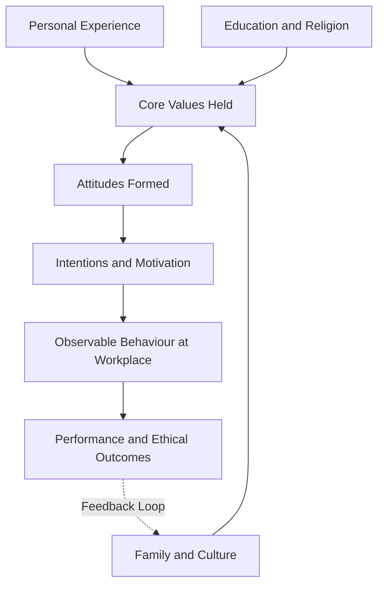
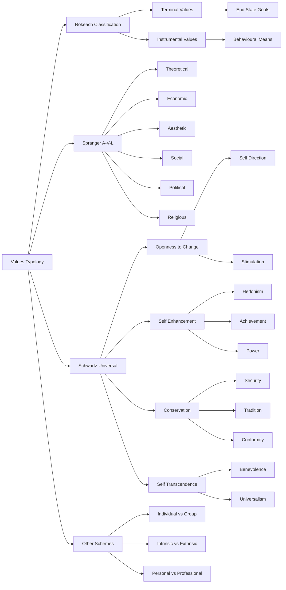
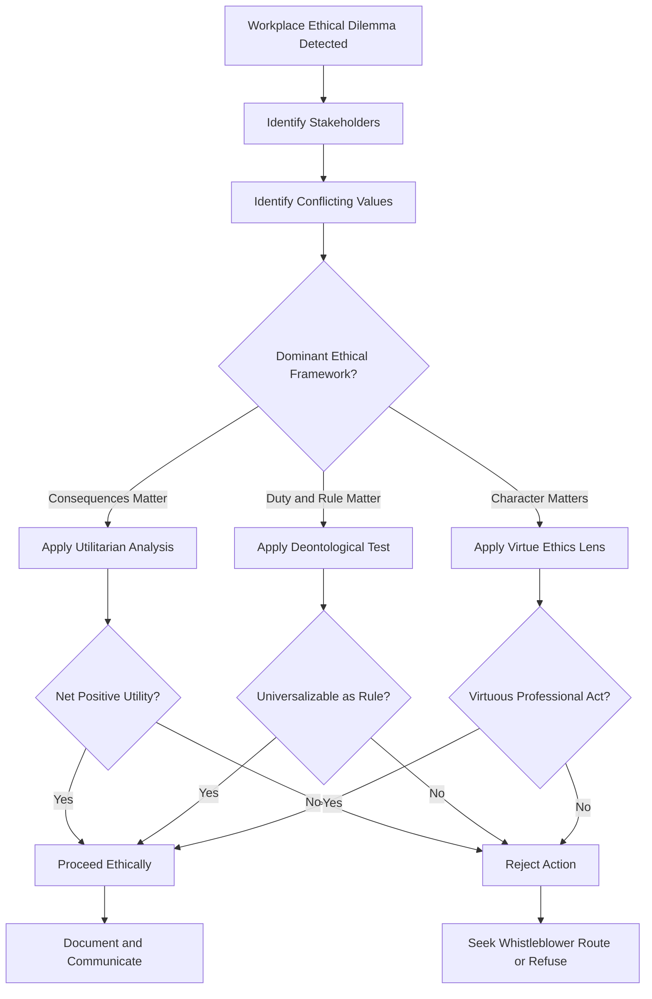
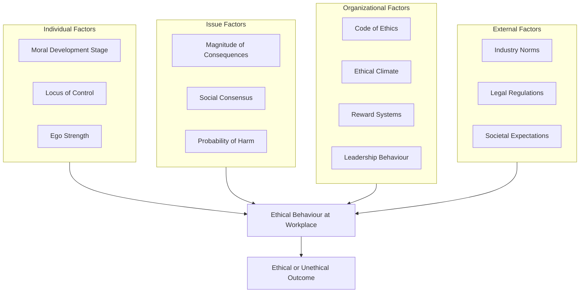
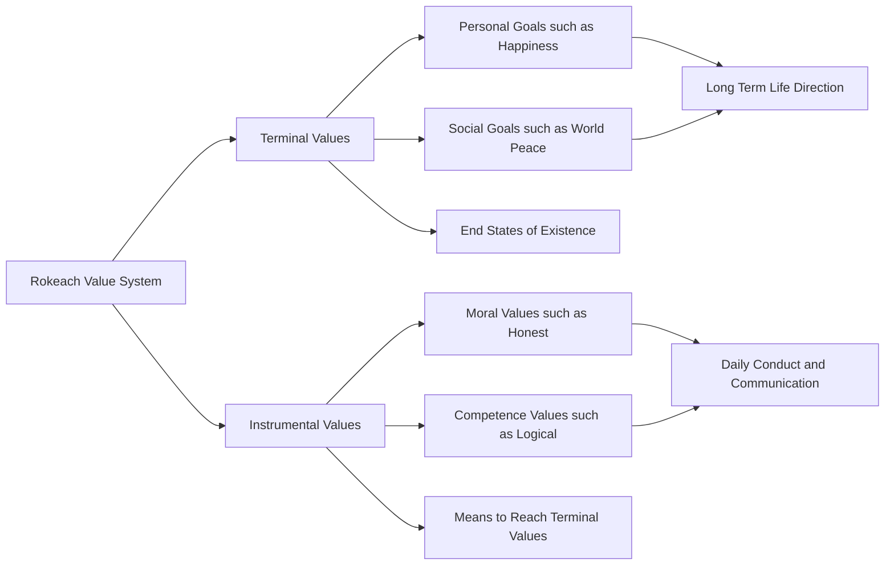
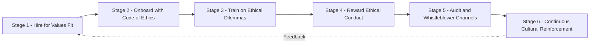

# Values – Types and Ethical Values at Workplace

<!-- SECTION_1_START -->
# Values – Types and Ethical Values at Workplace

## 1.1 Core Technical Definition

> [!IMPORTANT]
> **Definition (KTU 2024 Syllabus Standard)**
> **Values** are the enduring, deeply held, evaluative beliefs that guide an individual's preferences, attitudes, and behaviors across diverse situations, representing what a person considers worthwhile, important, and desirable. They serve as fundamental standards or criteria that people use to judge actions, people, events, and themselves.

In the context of **Organizational Behaviour (OB)** and **Business Communication**, values are positioned as the *deepest layer of an individual's personality* — they sit beneath attitudes, which in turn drive behavior. This layered structure is the cornerstone of **individual behaviour analysis** in KTU Module 1.

**Ethical Values at the Workplace** refer to a subset of organizational and personal values that specifically govern the moral conduct of individuals and organizations, encompassing principles such as **integrity, honesty, fairness, respect, accountability**, and **transparency** in professional settings.

> [!NOTE]
> **Why This Matters in KTU UEHUT803:**
> Values determine *how* an employee communicates, *how* decisions are ethically framed, and *how* an organization's ethical climate is built. The KTU 2024 scheme places this topic in **Module 1 (Foundations of Individual Behaviour)** because every subsequent module — leadership, motivation, conflict, communication — rests upon the value base of individuals.

---

## 1.2 Conceptual Analogy / Intuition

> [!TIP]
> **Real-World Analogy: The GPS of Human Conduct**
> Imagine values as the **internal GPS navigation system** of a person. Just as a GPS continuously recalculates your route to keep you on the chosen path, **values continuously recalibrate an employee's decisions** to keep them aligned with what they consider "right" or "important."
>
> - If your GPS destination is set to **"Honesty"**, it will keep warning you when a short-cut through deceit is suggested.
> - If the destination is set to **"Fairness"**, biased decisions will feel morally "off-route."
>
> **Ethical values at the workplace** are like the *map data* shared by the entire organization — they ensure that everyone is navigating toward the *same moral destination*, reducing traffic jams of misconduct and conflict.

**Geometric Intuition:** Picture a **values pyramid** for a working professional:
- The **apex** represents *behaviour* (visible actions).
- The **middle layer** represents *attitudes* (predispositions).
- The **broad base** represents *values* (deep, stable evaluative standards).

Behaviour is what we *see*. Attitudes are what we *infer*. Values are what *cause* both. This pyramid model is heavily tested in KTU ESE questions.

---

## 1.3 Physical Constants / Standard Metrics in OB

> [!IMPORTANT]
> While values are qualitative, OB researchers quantify them through standardized instruments. The KTU 2024 syllabus expects familiarity with the following standard metrics:
>
> - **Rokeach Value Survey (RVS)** — measures **18 terminal** and **18 instrumental** values; ranking-based instrument.
> - **Schwartz Values Survey (SVS)** — measures **57 value items** across **10 universal value types**.
> - **Allport-Vernon-Lindzey Study of Values (A-V-L)** — measures **6 dominant values** (theoretical, economic, aesthetic, social, political, religious).
> - **KTU Standard Marking Metric:** A 14-mark question typically requires **3 typologies, 4 examples, and 2 workplace applications**.

---

## 1.4 GeoGebra / Desmos Integration

> [!VISUALIZATION CONTROL]
> **Concept:** Values Pyramid — Layered Model of Individual Behaviour
> **GeoGebra / Desmos Input Equations:**
> * `Pol( A, B, 4 )` for a quadrilateral representing the four layers
> * Layer 1 (Base) — `y = 0` to `y = 2` labelled "VALUES"
> * Layer 2 — `y = 2` to `y = 4` labelled "ATTITUDES"
> * Layer 3 — `y = 4` to `y = 6` labelled "MOTIVATION"
> * Layer 4 (Apex) — `y = 6` to `y = 8` labelled "BEHAVIOUR"
> **Visual Description:** Students should observe a stable broad base (values) supporting progressively narrower upper layers, illustrating that changes in behaviour require deep value-level intervention for long-term effect.

<!-- SECTION_1_END -->

<!-- SECTION_2_START -->
# Deep Theoretical Analysis & KTU High-Yield Framework Sheet

## 2.1 Characteristics of Values (Foundation Layer)

Values possess six defining characteristics that KTU examiners frequently test:

1. **Enduring** — Values are stable over time; they do not change with every situation.
2. **Belief-based** — Values are grounded in personal convictions, not mere preferences.
3. **Evaluative** — They involve a judgment of good vs. bad, right vs. wrong.
4. **Hierarchical** — Values exist in order of priority (a value-system, not a value-list).
5. **Few in number** — A person holds a *limited* core set, typically **5–10 dominant values**.
6. **Culturally influenced** — Values are shaped by family, education, religion, and society.

> [!NOTE]
> **Hierarchical Nature of Values**
> Two engineers can both value *honesty* and *career success*, but the engineer who places *honesty above career success* will refuse to falsify reports, while the other may not. **The priority of a value, not its mere presence, drives behaviour.**

---

## 2.2 Major Typologies of Values (The KTU High-Yield Sheet)

> [!IMPORTANT]
> **KTU Examiner's Emphasis:** In a 14-mark question on "types of values," examiners expect at least **three typologies** with **Indian/international examples** and **workplace applications**.

### 2.2.1 Typology A — Rokeach Value System (Most Frequently Tested)

Milton Rokeach classified values into two categories:

| Dimension | Terminal Values | Instrumental Values |
|---|---|---|
| **Definition** | End-states of existence; goals a person wants to achieve | Modes of conduct; means to achieve terminal values |
| **Focus** | **What** I want to become / achieve | **How** I want to behave |
| **Examples** | Freedom, Equality, True Friendship, Mature Love, Family Security, Salvation, Inner Harmony, Self-Respect, Happiness, Wisdom | Honest, Responsible, Ambitious, Independent, Imaginative, Broadminded, Helpful, Polite, Self-Controlled, Logical |
| **Count in RVS** | 18 values | 18 values |
| **Engineering Workplace Example** | A software engineer's terminal value of *"Inner Harmony"* leads to refusing 24/7 on-call burnout | An engineer's instrumental value *"Logical"* ensures systematic, evidence-based debugging |

### 2.2.2 Typology B — Allport-Vernon-Lindzey (Spranger's) Six Value Types

| Value Type | Core Motive | Typical Behaviour | Engineering Example |
|---|---|---|---|
| **Theoretical** | Discovery of truth | Pursues knowledge, systematic thinking | R&D engineer in pure research lab |
| **Economic** | Useful & practical returns | ROI-driven, businesslike | Sales-engineer, project-closure decisions |
| **Aesthetic** | Form, beauty, harmony | Artistic, expressive | UI/UX designer, design-engineer |
| **Social** | Love of people & relationships | Altruistic, empathetic | HR manager, mentor, CSR lead |
| **Political** | Power & influence | Leadership, dominance | Engineering manager, CTO |
| **Religious** | Unity with cosmic order | Devout, value-driven | ESG compliance officer, ethics officer |

> [!TIP]
> **KTU Memory Trick:** The acronym **"TEA-SPR"** maps to Theoretical, Economic, Aesthetic, Social, Political, Religious. Most engineers score high on Theoretical and Economic; this is why *people-skills* courses are emphasized in KTU UEHUT803.

### 2.2.3 Typology C — Schwartz's Theory of Basic Human Values (Universal Framework)

Shalom Schwartz identified **10 universal value types** organized along two bipolar dimensions:

- **Openness to Change** ←→ **Conservation**
- **Self-Enhancement** ←→ **Self-Transcendence**

| Pole | Value Type | Central Goal |
|---|---|---|
| Openness to Change | Self-Direction | Independent thought & action |
| Openness to Change | Stimulation | Novelty & challenge |
| Self-Enhancement | Hedonism | Pleasure & gratification |
| Self-Enhancement | Achievement | Personal success |
| Self-Enhancement | Power | Social status, control |
| Conservation | Security | Safety & stability |
| Conservation | Tradition | Respect for customs |
| Conservation | Conformity | Restraint of impulses |
| Conservation | Benevolence | Welfare of in-group |
| Self-Transcendence | Universalism | Welfare of all |

> [!NOTE]
> **Engineering Workplace Insight:** Schwartz's framework is widely used in **cross-cultural OB research** (e.g., Hofstede-linked studies of Indian vs. German engineering teams). Conflicts often arise when one engineer values *Achievement* (tight deadlines) while another values *Universalism* (inclusive design for disabled users).

### 2.2.4 Typology D — Other Classificatory Schemes (Supplementary)

| Classification Basis | Types |
|---|---|
| **Origin** | Individual Values vs. Group / Organizational / Cultural Values |
| **Focus** | Intrinsic Values (internal satisfaction) vs. Extrinsic Values (external rewards) |
| **Scope** | Personal Values vs. Professional Values vs. Societal Values |
| **Domain** | Economic, Aesthetic, Theoretical, Social, Political, Religious (Spranger) |
| **Time Horizon** | Short-term Values vs. Long-term Values |
| **Ethical Nature** | Moral Values (honesty, justice) vs. Non-Moral Values (efficiency, comfort) |

---

## 2.3 Ethical Values at the Workplace — A Structured Framework

> [!IMPORTANT]
> **Definition (Ethics in OB):**
> **Workplace Ethics** is the application of moral principles and ethical values to business decisions, conduct, and relationships in the organizational context. It addresses questions of *what is right, fair, just, and responsible* in the workplace.

### 2.3.1 The 7 Core Ethical Values Most Tested in KTU

| # | Ethical Value | Workplace Manifestation | Counter-Value (Unethical Form) |
|---|---|---|---|
| 1 | **Integrity** | Honest reporting, refusing data manipulation | Falsifying test results for project deadlines |
| 2 | **Honesty** | Transparent communication, accurate documentation | Hiding project failures from clients |
| 3 | **Fairness** | Impartial performance appraisals, equal pay | Favouritism in project allocation |
| 4 | **Respect** | Dignified treatment, active listening | Public humiliation of junior engineers |
| 5 | **Accountability** | Owning mistakes, transparent reporting | Blame-shifting, "shoot-the-messenger" culture |
| 6 | **Trust** | Following through on commitments | False promises during hiring or promotion |
| 7 | **Transparency** | Open access to relevant information | Hidden agendas, opaque decision-making |

### 2.3.2 Three Classical Ethical Frameworks (Essential for ESE)

| Framework | Core Principle | Workplace Decision Rule | Example in Engineering |
|---|---|---|---|
| **Utilitarianism** (Consequence-based) | Greatest good for greatest number | Choose action with maximum net benefit | Recall a flawed product even at ₹2 Cr cost, saving 10,000 customers |
| **Deontology** (Duty-based — Kant) | Act according to universal moral rules | Do what is right, *regardless* of outcome | Engineer refuses to sign off unsafe bridge design despite cost pressure |
| **Virtue Ethics** (Character-based — Aristotle) | Cultivate virtuous character traits | Act as a virtuous professional would | An engineer mentors juniors because *that is who a good engineer is* |

### 2.3.3 Sources of Ethical Values in the Workplace

| Source | Description | Example |
|---|---|---|
| **Personal Factors** | Family, religion, education, life experiences | Engineer from a military family emphasizes discipline |
| **Organizational Factors** | Code of conduct, leadership, culture | TCS / Infosys ethical code of conduct |
| **Professional Bodies** | Codes of professional societies | Code of Ethics by IEI (Institution of Engineers, India) |
| **Societal / Cultural Factors** | National culture, legal framework | Right to Information Act shaping transparency |
| **Industry Norms** | Sectoral standards | Pharma industry's GMP (Good Manufacturing Practice) |

### 2.3.4 Factors Influencing Ethical Behaviour at Workplace

A model popularized by **Trevino & Nelson** identifies the following interacting factors:

1. **Individual Factors** — Moral development (Kohlberg's stages), ego strength, locus of control.
2. **Issue Intensity** — Magnitude of consequences, social consensus, probability of harm.
3. **Organizational Factors** — Code of ethics, ethical climate, reward systems, leadership behaviour.
4. **Organizational Culture & Values** — Shared assumptions, dominant ethical values.
5. **External Environment** — Industry norms, legal regulations, societal expectations.

---

## 2.4 Real-World Utility in Engineering & Computer Science

> [!TIP]
> **Why This Concept Is Used in Production Systems:**
>
> 1. **Ethics in AI & Data Science** — Frameworks like **IEEE Ethically Aligned Design** and **EU AI Act** translate *values* (fairness, transparency) into algorithmic requirements.
> 2. **Software Engineering** — **ACM Code of Ethics** is a direct application of professional ethical values.
> 3. **Civil Engineering** — Ethics-driven decisions prevent disasters (e.g., structural failures from compromised materials).
> 4. **Corporate Governance** — Sarbanes-Oxley Act, SEBI LODR regulations demand *accountability* and *transparency* as enforceable values.
> 5. **HR & People Analytics** — Values-based hiring ensures cultural fit and reduces attrition by 20–30% (industry benchmarks).

<!-- SECTION_2_END -->

<!-- SECTION_3_START -->
# Step-by-Step Derivations & Case-Based Implementation

## 3.1 Algorithm-Style Walkthrough: How Values Drive Behaviour in an Engineering Team

> [!NOTE]
> The following is a **case-based analytical walkthrough** — fully written, no step skipped. The case is constructed to map a typical KTU application question.

### 3.1.1 Case Setting

**Scenario:** At **BharatTech Solutions Pvt. Ltd.**, a Kochi-based IT firm, two senior engineers — **Engineer A (Ramesh)** and **Engineer B (Sneha)** — discover that a software module they delivered to a UK client has a critical security vulnerability. The project manager (PM) pressures them to **silently patch it in the next release cycle (3 months away)** to avoid a contractual penalty. Both engineers are aware that the vulnerability could expose **5,000+ end-user data records** in the meantime.

**Ramesh's Value Hierarchy (in order):**

$$
V_{Ramesh} = [ \text{Career Security} > \text{Team Loyalty} > \text{Honesty} > \text{Innovation} ]
$$

**Sneha's Value Hierarchy (in order):**

$$
V_{Sneha} = [ \text{Integrity} > \text{Universalism (user safety)} > \text{Honesty} > \text{Career Security} ]
$$

### 3.1.2 Step-by-Step Behavioural Analysis

**Step 1 — Identify the Ethical Dilemma**

$$
\text{Dilemma} = \text{Conflict}(\text{Career Security}, \text{Honesty}/\text{User Safety})
$$

The dilemma is a **value conflict** — short-term self-interest vs. long-term professional ethics and user welfare.

**Step 2 — Apply the Value-Priority Operator (VP-Op)**

Define the *dominant value* of each engineer as the value at the top of the hierarchy:

$$
D_{Ramesh} = \arg\max_{i=1}^{4} \left[ \text{Priority}(V_i) \right] = \text{Career Security}
$$

$$
D_{Sneha} = \arg\max_{i=1}^{4} \left[ \text{Priority}(V_i) \right] = \text{Integrity}
$$

**Step 3 — Map Dominant Value to Likely Behaviour**

| Engineer | Dominant Value | Likely Decision | Ethical Framework |
|---|---|---|---|
| Ramesh | Career Security | Comply with PM, delay disclosure | Self-Enhancement (Schwartz) |
| Sneha | Integrity | Disclose vulnerability immediately to client | Deontology (Kant) + Universalism |

**Step 4 — Predict Organizational Outcome (Behavioural Vector Model)**

$$
\overrightarrow{B_{team}} = \sum_{i=1}^{n} w_i \cdot \overrightarrow{V_i}
$$

Where $w_i$ is the *influence weight* of engineer $i$ in the team. If Sneha is the team-lead ($w_{Sneha} = 0.7$, $w_{Ramesh} = 0.3$), the team vector points toward **disclosure**:

$$
\overrightarrow{B_{team}} = (0.3 \times \overrightarrow{\text{Self}}) + (0.7 \times \overrightarrow{\text{Ethical}}) \approx 0.7 \cdot \overrightarrow{\text{Disclosure}}
$$

**Step 5 — Long-Term Consequence Analysis (Utilitarian Test)**

$$
U_{disclose} = -(\text{penalty}) + (\text{client trust}) + (\text{user safety}) = +\text{Net Positive}
$$

$$
U_{suppress} = +(\text{short-term savings}) - (\text{regulatory risk}) - (\text{user harm}) = -\text{Net Negative}
$$

**Step 6 — Managerial Implication**

The organization must **strengthen the ethical climate** by:
- Establishing a **whistle-blower policy** (protects Ramesh-type employees).
- Linking **performance appraisal to ethics**, not just delivery timelines.
- Conducting **values-based training** (Sneha's values become the shared norm).

---

## 3.2 Case-to-Framework Mapping Matrix (Engineering Sector)

> [!NOTE]
> The following matrix satisfies the *Humanities / Management* mandate of providing a **tabular comparative analysis mapping real-world engineering case frameworks to regulatory / systemic matrices**.

| Engineering Case / Scenario | Primary Ethical Value at Stake | Classical Ethical Framework Applicable | Indian Regulatory Anchor | Schwartz Value Pole | Workplace Behaviour to Promote |
|---|---|---|---|---|---|
| **Hyundai-Santro radiator issue (1998, India)** | Accountability | Deontology | Consumer Protection Act, 1986 | Conservation (Safety) | Mandatory recall; transparent disclosure |
| **Volkswagen Dieselgate (2015, Global)** | Honesty, Integrity | Utilitarianism (fails long-term) | US EPA / EU emission norms | Power / Achievement (misaligned) | Independent emissions testing; whistleblower protection |
| **Boeing 737 MAX crashes (2018–19)** | Integrity, User Safety | Virtue Ethics + Deontology | DGCA (India), FAA (US) | Universalism (user welfare) | Engineering Independence Programme (EIP) at Boeing post-crisis |
| **Therac-25 radiation overdose (1980s)** | Accountability, Respect for Life | Deontology | AERB (India) regulations | Security + Universalism | Software safety standards (IEC 61508) |
| **Cambridge Analytica / Facebook data misuse** | Privacy, Transparency | Utilitarianism (debated) | IT Act 2000 + DPDP Act 2023 (India) | Universalism | Privacy-by-design engineering |
| **AI Bias in hiring tools (Amazon scrap, 2018)** | Fairness, Non-discrimination | Virtue Ethics | IT Act, Constitution Art. 14/15/16 | Universalism | Algorithmic audits; diverse training data |
| **Bhopal Gas Tragedy (1984, India)** | Accountability, Respect for Life | Deontology | Environment Protection Act, 1986 | Universalism | Triple-bottom-line accounting; ethics committees |
| **NHAI bridge collapses (multiple, India)** | Integrity, Honesty | Deontology | IRC codes, IS 456, IS 800 | Achievement (misaligned) | Independent quality audits; blacklisting of vendors |
| **Insider trading scandals (Harshad Mehta, 1992)** | Honesty, Fairness | Utilitarianism | SEBI Act 1992 | Self-Enhancement (misaligned) | SEBI whistleblower mechanism; insider-trading regulations |
| **Open-source license violations by corporates** | Fairness, Respect | Deontology | Indian Contract Act, 1872 | Universalism | OSPO (Open-Source Program Offices) in firms |

---

## 3.3 Step-by-Step Self-Audit Tool for Ethical Values (Individual Application)

> [!IMPORTANT]
> This tool is useful for KTU students to apply values in real life. Use it in any 7-mark application question.

**Step 1 — Identify the situation** that requires an ethical decision.

**Step 2 — List all stakeholders** affected (self, team, client, society, environment).

**Step 3 — Identify the values in conflict** (e.g., *honesty* vs. *loyalty*).

**Step 4 — Apply the **A-E-T-S Test**:**

$$
\text{Ethical Score} = A + E + T + S
$$

| Letter | Test | Question |
|---|---|---|
| A | **Adversity Test** | Would I be comfortable if my decision appeared on the front page of *The Hindu*? |
| E | **Endurance Test** | Will I be okay with this decision 10 years from now? |
| T | **Transparency Test** | Am I willing to explain this decision openly to my family? |
| S | **Stakeholder Test** | Have I considered the impact on *all* stakeholders, not just myself? |

**Step 5 — Choose the option that maximizes the Ethical Score.** If two options tie, choose the one aligned with your **deepest terminal value** (Rokeach framework).

<!-- SECTION_3_END -->

<!-- SECTION_4_START -->
# Structural Diagrams & Schematics

## 4.1 Mermaid Diagram 1 — Hierarchical Model of Individual Behaviour

> [!NOTE]
> This flowchart shows the **causal chain from values to behaviour**, the foundational KTU Module 1 model.

---

## 4.2 Mermaid Diagram 2 — Typology of Values (Master Map)

---

## 4.3 Mermaid Diagram 3 — Ethical Decision-Making Flow at Workplace

---

## 4.4 Mermaid Diagram 4 — Factors Influencing Ethical Behaviour (Trevino-Nelson Model)

---

## 4.5 Mermaid Diagram 5 — Rokeach Value System (Process Map)

---

## 4.6 Sequential Processing Topology Matrix — Promoting Ethical Values in an Engineering Organization

> [!NOTE]
> Block-level architecture showing how organizations can systematically embed ethical values.

<!-- SECTION_4_END -->

<!-- SECTION_5_START -->
# KTU 2024 Scheme Examination Question Bank & Topic Recap

## 5.1 Part A Questions (3 Marks Each)

> [!NOTE]
> These are direct, board-exam-style short-answer questions mapped to KTU Course Outcomes **CO1 (Understand)** and Bloom's Levels *Remember / Understand*.

---

### Question 1 (3 Marks) `[KTU University Exam – July 2024]`

**Q: Define the term *Values*. Explain any two characteristics of values with suitable examples.**

**Model Answer (Valuation Key):**

**[Definition: 1 Mark]**
Values are the enduring, deeply held evaluative beliefs that guide an individual's preferences and behaviour across situations, representing what one considers worthwhile, important, and desirable.

**[Characteristic 1: 1 Mark]**
**Hierarchical in Nature** — Values exist in a priority order. *Example:* An engineer who values *integrity above career advancement* will refuse to sign off on a faulty design, even under deadline pressure.

**[Characteristic 2: 1 Mark]**
**Few in Number** — A person typically holds a *limited* set of 5–10 core values. *Example:* An IT professional may hold *honesty, learning, family security, achievement,* and *creativity* as core values.

---

### Question 2 (3 Marks) `[KTU University Exam – Dec 2023]`

**Q: Briefly explain Rokeach's classification of values. Differentiate between terminal and instrumental values.**

**Model Answer (Valuation Key):**

**[Rokeach Introduction: 1 Mark]**
Milton Rokeach classified values into two categories in his Rokeach Value Survey (RVS): **Terminal Values** and **Instrumental Values**.

**[Terminal Values: 1 Mark]**
These are *end-states of existence* — the goals a person wishes to achieve. Examples: Freedom, True Friendship, Inner Harmony, World Peace, Salvation.

**[Instrumental Values: 1 Mark]**
These are *modes of conduct* — the means by which terminal values are achieved. Examples: Honest, Responsible, Ambitious, Broadminded, Self-Controlled. Terminal values define **what** one wants; instrumental values define **how** one behaves to get it.

---

## 5.2 Part B Questions (14 Marks Each — Module Internal Choice)

> [!NOTE]
> Each Part B question offers **two alternatives (A and B)**. Students answer **one**. The structure follows the KTU ESE pattern: part (a) for 7 marks (Understand / Apply), part (b) for 7 marks (Apply / Analyze). Full model solutions with valuation key points are provided.

---

### Part B — Question A (14 Marks) `[KTU University Exam – July 2024]`

#### (a) Discuss the different types of values as classified by Rokeach and Spranger. Highlight the workplace relevance of each classification in the context of an engineering organization. (7 Marks)

**Model Answer (Valuation Key):**

**[Rokeach Classification: 1.5 Marks]**
Rokeach divided values into:
- **Terminal Values** (18 in number): Goals like *Freedom, Family Security, True Friendship, Mature Love, Happiness, Inner Harmony, Self-Respect, Salvation, Wisdom, Equality, World at Peace, National Security, A World of Beauty, Pleasure, An Exciting Life, A Comfortable Life, Social Recognition, A Sense of Accomplishment.*
- **Instrumental Values** (18 in number): Conduct modes like *Honest, Ambitious, Broadminded, Capable, Cheerful, Clean, Courageous, Forgiving, Helpful, Imaginative, Independent, Intellectual, Logical, Loving, Obedient, Polite, Responsible, Self-Controlled.*

**[Spranger A-V-L Classification: 1.5 Marks]**
Spranger identified **six dominant value types**:
1. *Theoretical* — pursuit of truth (e.g., R&D engineer).
2. *Economic* — practical returns (e.g., project manager).
3. *Aesthetic* — form and beauty (e.g., UI designer).
4. *Social* — love of people (e.g., HR manager).
5. *Political* — power and influence (e.g., CTO).
6. *Religious* — cosmic unity (e.g., ethics officer).

**[Workplace Relevance of Rokeach: 2 Marks]**
- Helps HR design **value-based job-fit assessments** during recruitment.
- Allows **performance-appraisal criteria** aligned with instrumental values (honest, responsible).
- Aids in **succession planning** by matching terminal values to long-term career goals.

**[Workplace Relevance of Spranger: 2 Marks]**
- Enables **role-person alignment** — placing an aesthetic-minded engineer in design roles.
- Supports **team composition** — diverse value-types create balanced, high-performing teams.
- Reduces **job dissatisfaction and attrition** by honouring individual value-priorities.

---

#### (b) Critically examine the role of ethical values in modern workplaces. Discuss any three classical ethical frameworks and their implications for engineering decision-making. (7 Marks)

**Model Answer (Valuation Key):**

**[Role of Ethical Values: 2 Marks]**
Ethical values such as *integrity, honesty, fairness, accountability, and transparency* build **trust**, reduce **fraud**, ensure **regulatory compliance**, and protect **brand reputation**. In engineering, they directly impact public safety and environmental sustainability.

**[Framework 1 – Utilitarianism: 1.5 Marks]**
- *Principle:* Greatest good for the greatest number.
- *Engineering Implication:* A pharmaceutical company may recall a drug with minor side-effects to protect the larger population.
- *Critique:* Difficult to quantify "good"; can justify unethical means for popular ends.

**[Framework 2 – Deontology: 1.5 Marks]**
- *Principle:* Act according to universal moral duty, regardless of consequences (Kant).
- *Engineering Implication:* An engineer refuses to compromise safety standards even when it threatens a project's commercial viability.
- *Critique:* Rigid; ignores situational nuances and consequences.

**[Framework 3 – Virtue Ethics: 1 Mark]**
- *Principle:* Cultivate virtuous character traits like courage, honesty, and prudence (Aristotle).
- *Engineering Implication:* A virtuous engineer proactively mentors juniors and reports safety concerns without being asked.
- *Critique:* Lacks clear decision-rules; virtues are culture-dependent.

**[Final Synthesis: 0.5 Mark — Optional integration line]**
A robust engineering organization balances all three frameworks — deontological core rules, utilitarian consequence-analysis, and virtue-based character development of its people.

---

### Part B — Question B (14 Marks) `[KTU University Exam – Dec 2023]`

#### (a) What are ethical values? Explain the major sources of ethical values in the workplace and discuss the Trevino-Nelson model of ethical decision-making. (7 Marks)

**Model Answer (Valuation Key):**

**[Definition of Ethical Values: 1 Mark]**
Ethical values are the moral principles that govern an individual's or organization's conduct, encompassing honesty, integrity, fairness, accountability, respect, and transparency in professional settings.

**[Sources of Ethical Values: 3 Marks]**
1. **Personal Factors** — Family, religion, education (1 Mark).
2. **Organizational Factors** — Code of conduct, leadership, culture (0.5 Mark).
3. **Professional Bodies** — IEI, ACM, IEEE codes of ethics (0.5 Mark).
4. **Societal and Cultural Factors** — National culture, legal framework (0.5 Mark).
5. **Industry Norms** — Sectoral standards like GMP for pharma, ISO 26000 for social responsibility (0.5 Mark).

**[Trevino-Nelson Model: 3 Marks]**
The model identifies *four interacting determinants* of ethical behaviour:
1. **Individual Factors** — Moral development (Kohlberg), ego strength, locus of control (1 Mark).
2. **Issue Factors** — Magnitude of consequences, social consensus, probability of harm (0.5 Mark).
3. **Organizational Factors** — Code of ethics, ethical climate, reward systems (1 Mark).
4. **External Environment** — Industry norms, legal regulations, societal expectations (0.5 Mark).

---

#### (b) With a suitable case study from the engineering sector, illustrate how conflicting values lead to ethical dilemmas at the workplace. Suggest a systematic approach to resolve such dilemmas. (7 Marks)

**Model Answer (Valuation Key):**

**[Case Study Presentation: 2 Marks]**
*Case:* At a civil engineering firm, the project manager discovers that the cement used in a flyover project is sub-standard. Withholding the report would save the firm ₹3 Cr and avoid project delay; reporting it would save lives but invite regulatory scrutiny and penalty. The project manager is torn between *career security* and *public safety / integrity*.

**[Identification of Value Conflict: 1 Mark]**
The dilemma arises from the conflict between **Personal Economic Value** (career, profit) and **Ethical Universalist Value** (public safety, integrity). In Schwartz's framework, this is a *Self-Enhancement vs. Self-Transcendence* conflict.

**[Stakeholder Analysis: 1 Mark]**
Stakeholders: end-users (high impact), employees (medium), firm (high), regulators (medium), society (high).

**[Systematic Resolution Approach — A-E-T-S Test: 2 Marks]**
1. **Adversity Test** — Would the decision be defensible publicly? (1 Mark for the framework + 1 Mark for application to the case).
2. **Endurance Test** — Will it stand the test of 10 years? Apply to the case.
3. **Transparency Test** — Can the decision be openly communicated?
4. **Stakeholder Test** — Have all stakeholders been fairly considered?

**[Final Recommendation: 1 Mark]**
The ethical choice is to **disclose the sub-standard material, halt construction, and conduct a safety audit**, even at the cost of short-term financial loss. This aligns with *deontological duty*, *long-term utilitarian benefit*, and *virtue-ethics character* of a responsible engineer.

---

## 5.3 KTU Examiner's Valuation Warning / Pitfall Callout

> [!WARNING]
> **Common Mark-Loss Pitfalls in Values & Ethics Questions:**
>
> 1. **Confusing values with attitudes.** Values are *deeper, fewer, more stable*; attitudes are *specific to objects/people*. Students often lose 1 mark for not differentiating.
> 2. **Listing types without workplace examples.** KTU examiners award marks for *engineering-sector illustrations* (e.g., software, civil, mechanical). Abstract examples are penalized.
> 3. **Skipping the Indian regulatory anchor.** For ethical value questions, mentioning *Indian context* (Consumer Protection Act, IT Act, DPDP Act 2023, SEBI, IEI Code) earns extra credit.
> 4. **Failing to show value-conflict analysis.** In case-study questions, the *priority* of values (not just the *list* of values) is what drives behaviour. Always include a *hierarchy analysis*.
> 5. **No mention of classical ethical frameworks.** In 14-mark ethical-decision questions, **at least one framework (Utilitarian / Deontological / Virtue Ethics)** is mandatory.
> 6. **Confusing Rokeach with Spranger.** Rokeach = Terminal vs. Instrumental. Spranger = 6-value typology. Mixing them is a common error.

---

## 5.4 Topic Recap & Important Things to Remember

> [!IMPORTANT]
> **Rapid Revision Checklist — Values: Types and Ethical Values at Workplace**
>
> - **Core Definition:** Values are *enduring, deeply held, evaluative beliefs* that guide preferences and behaviour.
> - **Six Characteristics:** Enduring, Belief-based, Evaluative, Hierarchical, Few in Number, Culturally Influenced.
> - **Rokeach Classification:** **Terminal Values** (end-states) vs. **Instrumental Values** (means of conduct); 18 + 18 = 36 values in RVS.
> - **Spranger / A-V-L:** **Theoretical, Economic, Aesthetic, Social, Political, Religious** — remember the acronym *TEA-SPR*.
> - **Schwartz Universal Values:** 10 values across two bipolar axes: *Openness to Change vs. Conservation*; *Self-Enhancement vs. Self-Transcendence*.
> - **Other Classifications:** Individual vs. Group, Intrinsic vs. Extrinsic, Personal vs. Professional.
> - **7 Core Ethical Values at Workplace:** Integrity, Honesty, Fairness, Respect, Accountability, Trust, Transparency.
> - **3 Classical Ethical Frameworks:** *Utilitarianism* (consequences), *Deontology* (duty — Kant), *Virtue Ethics* (character — Aristotle).
> - **Sources of Ethical Values:** Personal, Organizational, Professional Bodies (IEI, ACM, IEEE), Societal, Industry Norms.
> - **Trevino-Nelson Model:** 4 determinants — Individual, Issue, Organizational, External factors.
> - **A-E-T-S Test for Ethical Decisions:** *Adversity, Endurance, Transparency, Stakeholder* tests.
> - **KTU Indian Regulatory Anchors to Cite:** Consumer Protection Act 1986, IT Act 2000, DPDP Act 2023, SEBI Act 1992, IEI Code of Ethics, ISO 26000.
> - **Engineering Sector Cases to Remember:** Volkswagen Dieselgate, Boeing 737 MAX, Therac-25, Cambridge Analytica, Amazon hiring-tool bias, Bhopal Gas Tragedy, NHAI bridge collapses.
> - **High-Yield Exam Phrases:** *"Values are hierarchical — priority, not presence, drives behaviour"*; *"Ethical values are the GPS of professional conduct"*; *"The deepest level of personality is values; the visible tip is behaviour."*

<!-- SECTION_5_END -->
