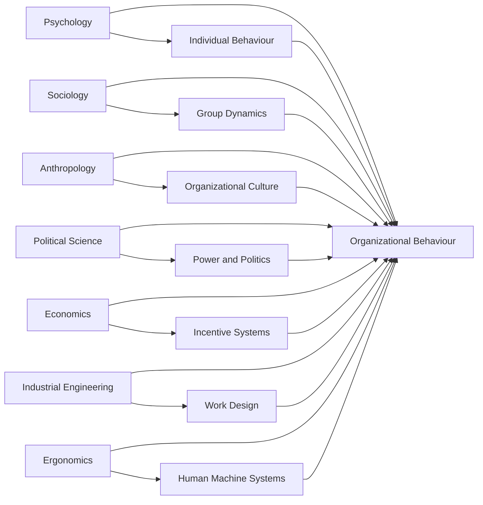
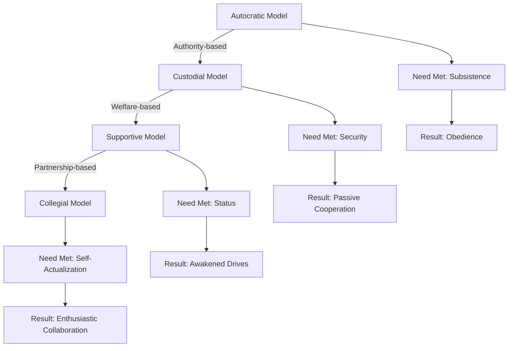
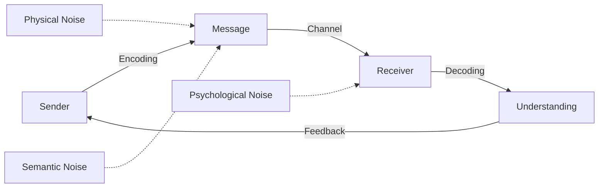
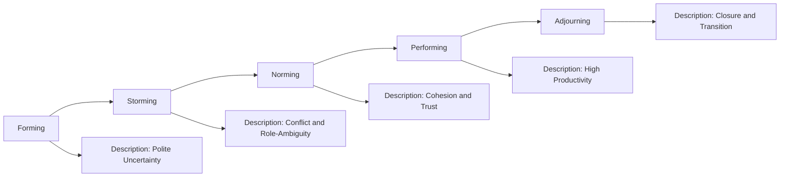
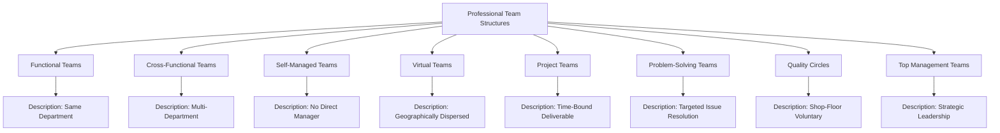
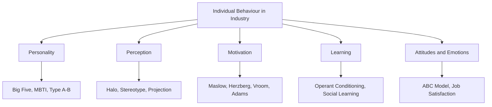
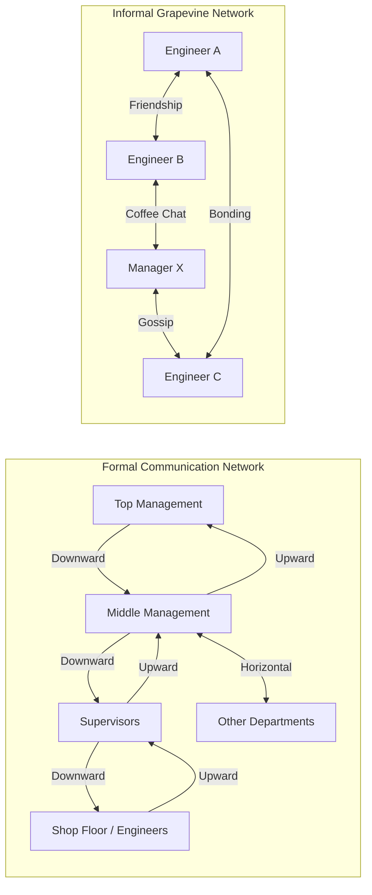
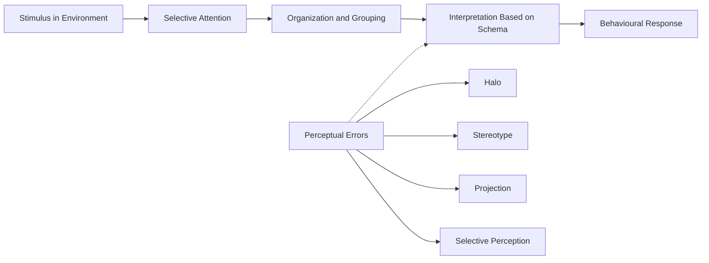
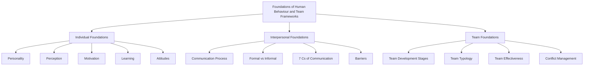

# Foundations of human behavior in industrial frameworks, interpersonal communication dynamics, professional team structures

<!-- SECTION_1_START -->

# Foundations of Human Behavior & Team Frameworks in Industrial Settings

## 1.1 Organizational Behaviour (OB) — Core Definition

> [!IMPORTANT]
> **Organizational Behaviour (OB)** is the systematic, scientific study of the **structure, functioning, and performance** of human behaviour in industrial and organizational settings. It examines how individuals, groups, and structures affect behaviour within organizations, with the ultimate goal of applying this knowledge to improve organizational effectiveness.

According to **Keith Davis**, *"OB is the study and application of knowledge concerning how people act, think, and feel as individuals and in groups within organizations."*

**Three Levels of Analysis in OB:**

| Level | Focus | Key Construct |
|---|---|---|
| **Individual Level** | Micro | Personality, Perception, Motivation, Learning, Attitudes |
| **Group Level** | Meso | Team dynamics, Communication, Leadership, Power, Conflict |
| **Organizational Level** | Macro | Structure, Culture, Change Management, Strategy |

---

## 1.2 Intuitive Overview — The "Factory Orchestra" Analogy

> [!NOTE]
> **Analogy: An Engineering Project as a Symphony Orchestra**
>
> Imagine a large industrial R\&D lab as a **symphony orchestra**. Each engineer is a **musician** with a unique instrument (skills, personality, perception). The **conductor** represents leadership. The **sheet music** represents the formal communication, rules, and SOPs. The **auditorium acoustics** represent organizational culture. The **rehearsal cycle** represents team development stages (forming → storming → norming → performing). 
>
> OB is essentially the **science of tuning the orchestra** so that individual brilliance translates into collective harmony — without losing individual creativity.

---

## 1.3 Foundations of Human Behaviour — Conceptual Pillars

> [!IMPORTANT]
> Human behaviour in any industrial framework is founded on **five interlinked psychological pillars**:
>
> 1. **Personality** — the unique cognitive-emotional pattern governing response.
> 2. **Perception** — the lens through which workplace reality is interpreted.
> 3. **Motivation** — the internal drive that energizes action.
> 4. **Learning** — the process of acquiring and modifying behaviour through experience.
> 5. **Attitudes & Emotions** — evaluative predispositions and affective states.

Each of these is shaped by both **nature (heredity)** and **nurture (environment)**, producing a unique behavioural fingerprint in every employee.

---

## 1.4 Interpersonal Communication Dynamics — Core Definition

> [!IMPORTANT]
> **Interpersonal Communication** is the **process of transmitting information, ideas, feelings, and meanings** between two or more individuals through verbal, non-verbal, and symbolic channels, with the shared intent of creating mutual understanding.

In industrial frameworks, communication is the **circulatory system** of the organization — without it, decision-making collapses, coordination fails, and morale deteriorates.

---

## 1.5 Professional Team Structures — Conceptual Definition

> [!IMPORTANT]
> A **Professional Team Structure** is a formally or informally constituted group of interdependent individuals who share **common goals, complementary skills, and mutual accountability**, coordinated through structured communication channels to deliver organizational outcomes.

Modern industrial teams are classified by **purpose, autonomy, and lifecycle** — ranging from **functional work-groups** to **self-managed, cross-functional, and virtual teams**.

---

## 1.6 Real-World Snapshot — Engineering Industry Anchors

> [!NOTE]
> **Industry-Standard Applications of OB Frameworks:**
> - **Toyota Production System (TPS)** — built on Supportive + Collegial OB models, emphasizing *Kaizen* (continuous improvement) teams.
> - **Google's Project Aristotle** — identified *psychological safety* as the top predictor of team effectiveness.
> - **Infosys & TCS** — deploy formal *cross-functional global teams* to deliver software at scale.
> - **3M's 15% Rule** — an autonomy-driven Collegial model fostering innovation culture.

These examples will be revisited in **Section 3** as a comparative case matrix.

---

> [!VISUALIZATION CONTROL]
> **Concept:** Three-Level OB Framework as Nested Concentric Domains
> **GeoGebra Input:**
> - `C1: (x-0)^2 + (y-0)^2 = 4` (Individual — innermost)
> - `C2: (x-0)^2 + (y-0)^2 = 9` (Group — middle)
> - `C3: (x-0)^2 + (y-0)^2 = 16` (Organization — outermost)
>
> **Visual Description:** Three concentric circles on a Cartesian plane. The innermost circle (radius 2) is labelled *Individual*, the middle (radius 3) *Group*, the outermost (radius 4) *Organization*. The student should observe how each level is **nested** within and **influenced by** the next.

<!-- SECTION_1_END -->

<!-- SECTION_2_START -->

# Deep Theoretical Analysis & KTU High-Yield Formula Sheet

## 2.1 The Four Models of Organizational Behaviour

**Robert T. Golembiewski** classified OB into four historical-evolutionary models. Each model rests on a distinct **causal belief** about what drives people at work.

| Model | Core Belief | Managerial Orientation | Employee Need Met | Resulting Behaviour |
|---|---|---|---|---|
| **Autocratic** | Authority is supreme | Power-centric, task-focused | Subsistence (basic pay) | Obedience, dependency |
| **Custodial** | Economic security drives loyalty | Welfare-oriented, paternalistic | Security (benefits) | Passive cooperation |
| **Supportive** | Task guidance through leadership | People-oriented, participative | Status \& recognition | Awakened drives, engagement |
| **Collegial** | Partnership builds commitment | Team-based, dignity-driven | Self-actualization | Enthusiastic collaboration |

> [!NOTE]
> **Industrial Evolution Insight:** Most mature engineering firms (e.g., Tata Motors, Bosch India) operate a **hybrid Supportive–Collegial** model — they provide economic security *and* foster participative innovation.

---

## 2.2 Contributing Disciplines to OB — The "Intellectual DNA" Framework

OB is an **inter-disciplinary field** drawing behavioural inputs from several academic streams:

$$
\text{OB} = f(\text{Psychology}, \text{Sociology}, \text{Anthropology}, \text{Political Science}, \text{Economics})
$$

| Discipline | Contribution to OB | Industrial Application |
|---|---|---|
| **Psychology** | Individual behaviour, personality, learning, motivation | Employee selection, training, performance appraisal |
| **Sociology** | Group dynamics, organizational structure, bureaucracy | Team design, organizational restructuring |
| **Anthropology** | Culture, values, rituals, organizational climate | Cross-cultural training, MNC management |
| **Political Science** | Power, conflict, negotiation, governance | Union-management relations, conflict resolution |
| **Economics** | Reward systems, cost-benefit analysis, incentives | Compensation design, productivity optimization |

---

## 2.3 Foundations of Individual Behaviour — The 5-Pillar Framework

### Pillar 1: Personality
Personality is the **dynamic and organized set of characteristics** possessed by a person that uniquely influences their cognitions, motivations, and behaviours.

$$
\text{Behaviour} = f(\text{Personality}, \text{Environment}, \text{Situation})
$$

**Key Personality Frameworks in OB:**

| Framework | Dimensions | Industrial Use |
|---|---|---|
| **Big Five (OCEAN)** | Openness, Conscientiousness, Extraversion, Agreeableness, Neuroticism | Hiring, role-fitment |
| **MBTI** | 16 types from 4 dichotomies | Team composition, communication training |
| **Type A / Type B** | Drive, urgency vs. relaxed | Stress management, leadership screening |

### Pillar 2: Perception
Perception is the **process by which individuals organize and interpret sensory impressions** to give meaning to their environment.

**Perceptual Process:**
$$
\text{Stimulus} \rightarrow \text{Attention} \rightarrow \text{Organization} \rightarrow \text{Interpretation} \rightarrow \text{Response}
$$

**Perceptual Errors in Industry:**
- **Halo Effect** — one trait dominates overall evaluation.
- **Stereotyping** — applying group labels to individuals.
- **Selective Perception** — filtering based on expectations.
- **Projection** — attributing own traits to others.

### Pillar 3: Motivation
Motivation is the **internal drive** that activates, directs, and sustains goal-oriented behaviour.

**Key Theories — At-a-Glance:**

| Theory | Proponent | Core Idea | Industrial Application |
|---|---|---|---|
| **Maslow's Hierarchy** | Abraham Maslow | 5 needs: Physiological → Safety → Social → Esteem → Self-Actualization | Compensation design, recognition programs |
| **Two-Factor** | Herzberg | Hygiene factors (extrinsic) + Motivators (intrinsic) | Job enrichment, satisfaction surveys |
| **Expectancy Theory** | Vroom | Motivation = Expectancy $\times$ Instrumentality $\times$ Valence | Performance-linked pay, goal setting |
| **Equity Theory** | Adams | Employees compare input-output ratio with peers | Fair pay structures, grievance redressal |

### Pillar 4: Learning
Learning is a **relatively permanent change in behaviour** arising from experience. In OB, **operant conditioning (B.F. Skinner)** dominates:

$$
\text{Reinforcement} = \text{Behaviour Consequence} = 
\begin{cases}
\text{Positive Reinforcement} \rightarrow \text{Repeat} \\
\text{Negative Reinforcement} \rightarrow \text{Avoid} \\
\text{Punishment} \rightarrow \text{Suppress} \\
\text{Extinction} \rightarrow \text{Disappear}
\end{cases}
$$

### Pillar 5: Attitudes
An attitude is a **psychological tendency expressed by evaluating an entity with some degree of favour or disfavour**.

**ABC Model of Attitudes:**
- **A — Affective** (feelings)
- **B — Behavioural** (intentions)
- **C — Cognitive** (beliefs)

---

## 2.4 Interpersonal Communication Dynamics — Theoretical Architecture

### The Communication Process (Shannon-Weaver + Berlo)

$$
\text{Sender} \xrightarrow[\text{Encoding}]{\text{Idea}} \text{Channel} \xrightarrow[\text{Decoding}]{\text{Receiver}} \xrightarrow[\text{Feedback}]{\text{Response}}
$$

**Critical Components:**

| Component | Definition | Industrial Example |
|---|---|---|
| **Sender** | Originator of the message | Project Manager |
| **Encoding** | Translating idea into symbols | Drafting an email / report |
| **Message** | The transmitted content | The email body |
| **Channel** | Medium of transmission | Email, Slack, meeting, memo |
| **Decoding** | Interpretation by receiver | Engineer reading the email |
| **Receiver** | Target of communication | Team member |
| **Feedback** | Reverse flow confirming receipt | Acknowledgement / reply |
| **Noise** | Distortion in transmission | Ambiguous language, jargon, network lag |

### Formal vs. Informal Communication

| Dimension | Formal Communication | Informal Communication |
|---|---|---|
| **Path** | Predefined, hierarchical (chain of command) | Grapevine, spontaneous, lateral |
| **Direction** | Downward / Upward / Horizontal | Multi-directional |
| **Purpose** | Official instructions, policies | Social bonding, rumours |
| **Speed** | Slower, structured | Fast, fluid |
| **Documentation** | Always written \& archived | Mostly oral, undocumented |

### The 7 Cs of Effective Communication (Essential for Board Exams)

> [!IMPORTANT]
> **7 Cs Checklist (Frank Jefkins):**
> 1. **Clarity** — Use simple, precise language.
> 2. **Conciseness** — Avoid verbosity.
> 3. **Completeness** — Provide all required data.
> 4. **Correctness** — Ensure factual accuracy.
> 5. **Consideration** — Empathize with the receiver.
> 6. **Courtesy** — Respect the receiver.
> 7. **Concreteness** — Use specific facts, not abstractions.

---

## 2.5 Professional Team Structures — Theoretical Foundations

### Tuckman's Five-Stage Model of Team Development

$$
\text{Forming} \rightarrow \text{Storming} \rightarrow \text{Norming} \rightarrow \text{Performing} \rightarrow \text{Adjourning}
$$

| Stage | Characteristics | Manager's Role |
|---|---|---|
| **Forming** | Politeness, uncertainty, dependence on leader | Direct, clarify goals |
| **Storming** | Conflict, role-ambiguity, resistance | Coach, mediate |
| **Norming** | Cohesion emerges, norms established | Facilitate, empower |
| **Performing** | High productivity, self-managed | Delegate, monitor lightly |
| **Adjourning** | Task complete, team dissolves | Acknowledge, transition |

### Typology of Industrial Teams

| Team Type | Composition | Strength | Weakness |
|---|---|---|---|
| **Functional Teams** | Members from same department | Deep expertise | Functional silos |
| **Cross-Functional Teams** | Members from different departments | Holistic problem-solving | Coordination complexity |
| **Self-Managed Teams** | Operate without direct supervisor | High autonomy, engagement | Conflict risk |
| **Virtual Teams** | Geographically dispersed, tech-mediated | Talent access, cost saving | Trust deficit, time-zone lag |
| **Problem-Solving Teams** | Temporary, focused on specific issues | Targeted, fast | Limited scope |
| **Project Teams** | Defined deliverable, time-bound | Outcome-oriented | Knowledge loss after closure |

---

## 2.6 KTU Formula Sheet — Quick Reference

> [!NOTE]
> **High-Yield Conceptual Equations (Humanities Style — Mnemonic Frameworks):**

| # | Concept | Mnemonic / Formula | Application |
|---|---|---|---|
| 1 | Behaviour Determinants | $B = f(P, E)$ | Personality $\times$ Environment |
| 2 | Motivation (Vroom) | $M = E \times I \times V$ | Expectancy $\times$ Instrumentality $\times$ Valence |
| 3 | Job Satisfaction (Herzberg) | $S = H + M$ | Hygiene + Motivators |
| 4 | Communication Effectiveness | $CE = \dfrac{\text{Understanding}}{\text{Intent}} \times 100\%$ | Message fidelity |
| 5 | Group Cohesion | $C = \dfrac{\text{Attraction to Group}}{\text{Negative Forces}}$ | Team unity measure |
| 6 | Equity Perception | $\dfrac{O_{\text{self}}}{I_{\text{self}}} = \dfrac{O_{\text{other}}}{I_{\text{other}}}$ | Pay fairness benchmark |
| 7 | Team Performance | $TP = (T \times S) - L$ | Task $\times$ Synergy $-$ Losses |
| 8 | Perception Path | $P = f(S \to A \to O \to I \to R)$ | Stimulus $\to$ Attention $\to$ Organization $\to$ Interpretation $\to$ Response |

---

## 2.7 Real-World Engineering Utility

> [!IMPORTANT]
> **Where these frameworks are deployed in live industry:**
>
> - **HR Analytics Departments** use the Big Five model for psychometric hiring.
> - **IT firms (Infosys, Wipro, TCS)** apply Tuckman's model in agile sprint retrospectives.
> - **Manufacturing units (Maruti, Hyundai)** use the Custodial–Supportive hybrid for shop-floor motivation.
> - **Startups (Flipkart, Ola)** operate on the **Collegial model** to drive innovation.
> - **Construction \& EPC firms** use **functional and cross-functional project teams** for turnkey execution.

<!-- SECTION_2_END -->

<!-- SECTION_3_START -->

# Step-by-Step Derivations, Frameworks & Comparative Case Analysis

## 3.1 Comparative Analysis: The Four OB Models Mapped to Real Engineering Organizations

> [!IMPORTANT]
> **Pedagogical Mandate:** Humanities/Management topics in KTU demand extensive tabular comparative analysis. Below is an exhaustive matrix mapping real-world engineering case frameworks to OB theoretical constructs.

### Master Comparative Matrix — OB Models $\times$ Industry Cases

| Dimension | Autocratic Model | Custodial Model | Supportive Model | Collegial Model |
|---|---|---|---|---|
| **Theoretical Anchor** | Authority-based, top-down control | Welfare-paternalism | Participative leadership | Partnership-based |
| **Managerial Stance** | Power over people | Economic security for people | Support for people | Indispensable contribution of people |
| **Psychological Result** | Dependence on boss | Passive cooperation | Awakened drives | Enthusiastic involvement |
| **Employee Need Met** | Subsistence | Security | Status \& Recognition | Self-actualization |
| **Communication Style** | One-way, downward | Top-down welfare notices | Two-way, supportive dialogue | Lateral, peer-based |
| **Motivation Driver** | Fear of punishment | Economic incentives | Job enrichment, respect | Intrinsic purpose, autonomy |
| **Decision-Making** | Centralized with leader | Centralized with HR | Consultative | Decentralized, consensus |
| **Example — Indian Industry** | Early-stage public sector units (BSNL-era), traditional family-run factories | Pre-liberalization Tata Steel welfare model, Kerala State PSU factories | Toyota India, Bosch India, Maruti Suzuki | Google Bangalore, 3M India, Microsoft Hyderabad, Infosys R\&D labs |
| **Example — Global** | Foxconn's strict command structures (early 2000s) | Post-WWII US auto giants' welfare programmes | Toyota Production System, Scandinavian engineering firms | Spotify Engineering, Valve, Tesla |
| **Strength** | Quick decisions, clear hierarchy | Employee loyalty, low attrition | High engagement, balanced output | Innovation, ownership culture |
| **Weakness** | Low morale, high turnover | High cost, low initiative | Risk of over-participation | Conflict, ambiguity in roles |
| **Suitability in 2024** | Declining — replaced by hybrid | Niche — heavy industries with union dominance | Dominant in modern engineering firms | Emerging in knowledge-economy firms |

---

## 3.2 Comparative Matrix: Communication Channels in Engineering Project Management

| Channel | Type | Speed | Richness | Documentation | Best Use Case |
|---|---|---|---|---|---|
| **Face-to-Face Meeting** | Formal / Informal | High | Very High | Low | Conflict resolution, design reviews |
| **Email** | Formal | Medium | Medium | Very High | Official directives, approvals |
| **Video Conference** | Formal | Medium | High | Medium | Cross-site engineering reviews |
| **Slack / Teams Chat** | Informal | Very High | Medium | High | Quick clarifications, standups |
| **Project Memo / Minutes** | Formal | Low | Medium | Very High | Audit trails, compliance |
| **Grapevine** | Informal | Very High | Variable | None | Social bonding, early warnings |
| **Dashboard / Kanban Board** | Formal | High | High | High | Agile sprint tracking |
| **Phone Call** | Semi-formal | High | High | Low | Urgent escalations |

---

## 3.3 Comparative Matrix: Team Structures $\times$ Engineering Project Scenarios

| Team Structure | Composition Logic | Strength | Risk | Ideal Industrial Scenario | OB Behaviour Pattern |
|---|---|---|---|---|---|
| **Functional Team** | Same department (e.g., all structural engineers) | Deep technical expertise, clear reporting | Tunnel vision, slow inter-department flow | Ongoing design standardization in an engineering consultancy | Custodial–Supportive hybrid |
| **Cross-Functional Team** | Engineers, designers, finance, marketing | Holistic solutions, faster innovation | Coordination overhead, role ambiguity | New product development (NPD) in an auto firm | Supportive–Collegial |
| **Self-Managed Team** | No designated manager; members self-coordinate | High autonomy, faster decisions | Conflict, free-rider problem | Agile software development squads | Collegial |
| **Virtual Team** | Geographically distributed; tech-mediated | Talent access, lower cost | Trust deficit, time-zone friction | Global IT services delivery (TCS, Infosys) | Supportive (digital) |
| **Project Team** | Formed for specific deliverable, disbanded after | Goal clarity, time-bound focus | Knowledge loss post-completion | EPC turnkey construction projects | Supportive |
| **Problem-Solving Team** | Temporary, focused on a specific issue | Targeted expertise application | Limited scope, may not scale | Six Sigma / Kaizen teams in manufacturing | Custodial–Supportive |
| **Top Management Team** | CXOs and senior leaders | Strategic alignment | Groupthink, slow on operational issues | Strategic planning in conglomerates | Collegial |
| **Quality Circle** | Shop-floor workers meeting voluntarily | Grassroots innovation, employee voice | Limited authority to implement | Toyota Production System shop-floor | Collegial |

---

## 3.4 Case Analysis — Real Engineering Companies Mapped to OB Frameworks

| Company | Industrial Domain | Dominant OB Model | Communication Style | Team Structure | Behavioural Insight |
|---|---|---|---|---|---|
| **Tata Motors (Pune)** | Automotive manufacturing | Supportive | Two-way, structured | Cross-functional NPD teams | Balances welfare (Custodial legacy) with innovation (Collegial) |
| **Infosys (Mysore)** | IT services | Collegial | Digital-first, lateral | Self-managed agile squads | High autonomy drives 15%+ innovation pipeline |
| **Larsen \& Toubro (Mumbai)** | EPC construction | Custodial–Supportive | Formal hierarchical | Project-based functional teams | Welfare + structured command ensures safety |
| **Google India (Hyderabad)** | Tech R\&D | Collegial | Open, transparent | Cross-functional pods | *Project Aristotle* found psychological safety as the \#1 success factor |
| **Maruti Suzuki (Manesar)** | Automotive | Supportive | Top-down with feedback loops | Functional + project teams | Japanese *kaizen* culture blended with Indian workforce |
| **Siemens India (Gurgaon)** | Industrial automation | Collegial | Multilingual, multicultural | Global virtual teams | Diversity drives creative problem-solving |
| **BHEL (Bhopal)** | Heavy engineering | Custodial | Hierarchical, formal | Functional teams | PSU legacy; slow but secure employment pattern |
| **Tesla (USA)** | EV manufacturing | Autocratic–Collegial hybrid | Vertical, intense | Cross-functional vertical integration | Musk's high-intensity, mission-driven culture |
| **Toyota (Japan/India)** | Automotive | Supportive–Collegial | Open, lateral | Quality circles + cross-functional teams | *Kaizen* is institutionalized OB in action |
| **Microsoft (Hyderabad)** | Software | Collegial | Transparent, growth-mindset | Self-managed product teams | *Growth mindset* culture drives continuous learning |

---

## 3.5 Perceptual Error Mapping to Engineering HR Decision-Making

| Perceptual Error | Definition | Engineering HR Example | Mitigation Strategy |
|---|---|---|---|
| **Halo Effect** | One positive trait dominates overall rating | A senior developer is rated excellent overall because of one brilliant module | Use structured rating rubrics, multi-rater feedback (360°) |
| **Stereotyping** | Generalized belief about a group | "Engineers from South India are better at math" | Blind resume screening, diversity training |
| **Selective Perception** | Filtering info based on expectations | Manager only notices errors from a disliked employee | Behaviour-anchored rating scales (BARS) |
| **Projection** | Attributing own traits to others | A workaholic manager assumes team members are equally driven | Personality assessments, self-awareness training |
| **Contrast Effect** | Evaluation based on comparison with another | Rating one engineer low because the previous one was exceptional | Independent evaluation sequences |
| **Recency Effect** | Recent events dominate evaluation | Annual review focused on the last month's performance | Document performance continuously across the year |
| **Fundamental Attribution Error** | Attributing others' failure to character, not situation | Labelling a struggling employee as "lazy" without context | Contextual review, situational interviews |

---

## 3.6 Comparative Analysis: Tuckman Stages $\times$ Engineering Project Lifecycle

| Tuckman Stage | Engineering Project Equivalent | Typical Behavioural Symptoms | Recommended Manager Action |
|---|---|---|---|
| **Forming** | Project kickoff meeting | Polite silence, unclear roles | Define charter, RACI matrix |
| **Storming** | Initial design disagreements | Conflicts over technical approach, scope creep | Facilitate mediation, document decisions |
| **Norming** | Post-alignment phase | Cohesion, established workflows | Empower team, reduce micromanagement |
| **Performing** | Active execution | High productivity, self-correction | Delegate, focus on removing impediments |
| **Adjourning** | Project closure, handover | Knowledge transfer, emotional closure | Conduct lessons-learned, celebrate success |

---

## 3.7 Symbolic Representation — Behavioural Equation Derivation

**Step 1: Foundational Premise**
Human behaviour in industry is a function of multiple interacting factors:
$$
B = f(P, E, S, M, L)
$$
where $P$ = Personality, $E$ = Environment, $S$ = Situation, $M$ = Motivation, $L$ = Learning history.

**Step 2: Expanding the Motivation Term (Vroom's Expectancy Theory)**
$$
M = E \times I \times V
$$
where $E$ = Expectancy (effort $\rightarrow$ performance), $I$ = Instrumentality (performance $\rightarrow$ reward), $V$ = Valence (value of reward).

**Step 3: Adding the Equity Check (Adams' Equity Theory)**
For sustained motivation, the employee compares ratios:
$$
\frac{O_{\text{self}}}{I_{\text{self}}} \approx \frac{O_{\text{other}}}{I_{\text{other}}}
$$
Any perceived inequity triggers **tension** $\rightarrow$ reduced motivation or increased output.

**Step 4: Communication Filter Overlay**
Effective communication modifies all terms. If the message fidelity is low (high noise), perceived rewards $V$ drop:
$$
M_{\text{effective}} = E \times I \times V_{\text{perceived}}
$$
where $V_{\text{perceived}} = V \times (1 - N)$, with $N$ being the normalized noise factor.

**Step 5: Team Performance Aggregation**
$$
TP = (T \times S) - (L_{\text{coord}} + L_{\text{conflict}} + L_{\text{process}})
$$
where $T$ = Task complexity, $S$ = Synergy, $L$ = Coordination/Conflict/Process losses.

**Step 6: Industrial Practical Formula**
A senior engineering manager optimizing team output balances:
$$
\text{Optimal Team} = \arg\max_{T} \left[ (T \times S) - \sum L_i \right]
$$
subject to the constraint:
$$
\sum (\text{Communication Noise}) \leq \varepsilon
$$
where $\varepsilon$ is the acceptable communication distortion threshold.

> [!NOTE]
> **Interpretation for Engineers:** Unlike pure engineering equations, behavioural formulas are **interpretive frameworks**, not predictive laws. They help managers *qualitatively reason* about why performance is dipping, not compute exact outputs.

<!-- SECTION_3_END -->

<!-- SECTION_4_START -->

# Structural Diagrams & Schematics

## 4.1 Contributing Disciplines to OB — Knowledge Stream Map

---

## 4.2 The Four Models of OB — Evolutionary Progression

---

## 4.3 Communication Process Flow — Sender to Receiver

---

## 4.4 Tuckman's Five Stages of Team Development

---

## 4.5 Industrial Team Classification Topology

---

## 4.6 The 5 Pillars of Individual Behaviour in Industry

---

## 4.7 Formal vs. Informal Communication Network Topology

---

## 4.8 Perceptual Process — From Stimulus to Response

---

## 4.9 Conceptual Map — Foundations Module Overview

<!-- SECTION_4_END -->

<!-- SECTION_5_START -->

# KTU 2024 Scheme Examination Question Bank

> [!NOTE]
> **Scheme Reference:** UEHUT803 — Organizational Behaviour and Business Communication. **Module 1** of the KTU 2024 B.Tech syllabus. Questions are calibrated for a typical **End Semester Evaluation (ESE)** pattern. Marks indicated per KTU board norm: **Part A = 3 marks**, **Part B = 14 marks** (with internal choice).

---

## Part A — Short Answer Questions (3 Marks Each)

### Question 1: Define Organizational Behaviour. List any four contributing disciplines. `[KTU University Exam - Dec 2023]`

**Model Answer (3 Marks):**
- **[1 Mark] Definition:** Organizational Behaviour (OB) is the systematic study of human behaviour in industrial and organizational settings, focusing on individuals, groups, and organizational structures to improve effectiveness.
- **[1 Mark] Contributes from Psychology:** Individual differences, personality, motivation, learning.
- **[1 Mark] Contributes from Sociology:** Group dynamics, organizational structure.
- **Bonus:** (One mark may be awarded for listing Anthropology or Political Science.)

---

### Question 2: Explain the Autocratic Model of OB. Why has it declined in modern engineering firms? `[KTU University Exam - July 2024]`

**Model Answer (3 Marks):**
- **[1 Mark] Definition:** The Autocratic Model is the classical OB model based on **power and authority**, where the manager commands and employees obey out of fear.
- **[1 Mark] Need Met:** Subsistence (basic physiological and safety needs).
- **[1 Mark] Reason for Decline:** Modern engineering firms (e.g., Google, Microsoft) value creativity, autonomy, and innovation — incompatible with rigid autocratic control. Knowledge workers reject command-and-control cultures.

---

## Part B — Descriptive Questions (14 Marks, Internal Choice)

### Question A (14 Marks): Foundations of Individual Behaviour `[KTU University Exam - Dec 2023]`

**(a) Explain Maslow's Hierarchy of Needs and its application in modern engineering organizations.** *(7 Marks)*

**Model Answer:**

**Step 1: Definition [1 Mark]**
Abraham Maslow's Hierarchy of Needs is a motivational theory proposing that human needs are arranged in a five-tier pyramid, where lower needs must be substantially satisfied before higher needs emerge as motivators.

**Step 2: The Five Tiers [2 Marks]**
- **Physiological Needs** — Salary, food, shelter, rest.
- **Safety Needs** — Job security, safe working conditions, health benefits.
- **Social Needs** — Belongingness, friendship, team acceptance.
- **Esteem Needs** — Recognition, status, respect from peers and managers.
- **Self-Actualization Needs** — Personal growth, creativity, realizing potential.

**Step 3: Application in Modern Engineering Firms [2 Marks]**
- *Tata Consultancy Services* designs compensation packages (CTC, allowances, insurance) addressing physiological and safety needs.
- *Google* provides cafeterias, nap pods, and wellness programs (physiological + safety).
- *Infosys* uses open seating and team outings to foster social belonging.
- *Microsoft* uses the *Growth Mindset* culture and internal mobility to drive self-actualization.
- Recognition programs like *Employee of the Month* address esteem needs.

**Step 4: Criticisms [1 Mark]**
- Hierarchy is not strictly sequential in modern contexts.
- Needs may vary across cultures.
- Difficult to empirically validate.

**Step 5: Conclusion [1 Mark]**
Despite critiques, Maslow's framework remains the most widely used heuristic in OB pedagogy and HR design.

---

**(b) Critically analyze the role of perception in managerial decision-making. Discuss any four perceptual errors with industrial examples.** *(7 Marks)*

**Model Answer:**

**Step 1: Definition of Perception [1 Mark]**
Perception is the cognitive process by which individuals select, organize, and interpret sensory stimuli to give meaning to their environment. In OB, perception is the lens that filters all workplace realities.

**Step 2: Role in Managerial Decision-Making [1 Mark]**
Managers' decisions on hiring, performance appraisal, promotion, and conflict resolution are heavily influenced by their perception of people and events, not just objective data.

**Step 3: Four Perceptual Errors with Industrial Examples [4 Marks]**

| Error | Definition | Industrial Example | Mitigation |
|---|---|---|---|
| **Halo Effect** | One positive trait dominates overall rating | A senior developer who built one popular module is rated excellent across all parameters | 360-degree feedback, structured rubrics |
| **Stereotyping** | Generalized belief about a group | "Engineers from tier-3 colleges are weaker" — used in resume shortlisting | Blind screening, diversity training |
| **Projection** | Attributing own traits to others | A workaholic manager assumes the team is equally driven | Personality assessments, self-awareness |
| **Selective Perception** | Filtering info based on expectations | Manager only notices errors from a disliked employee | BARS, multi-rater systems |

**Step 4: Implications [1 Mark]**
Perceptual biases can lead to unfair performance appraisals, wrongful promotions, and workplace conflict. HR departments invest in structured tools to minimize these distortions.

**[Stating definition: 1 Mark; Role explanation: 1 Mark; Four errors with examples: 4 Marks; Mitigation and implications: 1 Mark — Total: 7 Marks]**

---

### Question B (14 Marks): Communication \& Team Frameworks `[KTU University Exam - July 2024]`

**(a) Explain the communication process with a suitable diagram. Discuss the 7 Cs of effective communication.** *(7 Marks)*

**Model Answer:**

**Step 1: Definition [1 Mark]**
Communication is the process of transmitting information, ideas, and meanings between sender and receiver through a channel, with feedback confirming understanding.

**Step 2: Communication Process Diagram [2 Marks]**

$$
\text{Sender} \xrightarrow{\text{Encoding}} \text{Message} \xrightarrow{\text{Channel}} \text{Receiver} \xrightarrow{\text{Decoding}} \text{Response} \xrightarrow{\text{Feedback}} \text{Sender}
$$

(Noise affects the process at every stage.)

**Step 3: Components Explained [1 Mark]**
- **Sender** — originator (e.g., Project Manager)
- **Encoding** — converting idea into symbols
- **Message** — actual content
- **Channel** — medium (email, meeting)
- **Decoding** — interpreting symbols
- **Receiver** — target
- **Feedback** — confirmation loop
- **Noise** — physical, semantic, psychological barriers

**Step 4: The 7 Cs of Effective Communication [3 Marks]**

| Cs | Meaning | Industrial Application |
|---|---|---|
| **Clarity** | Precise, simple language | Avoid jargon in cross-functional emails |
| **Conciseness** | Brief, to-the-point | Bullet-point status reports |
| **Completeness** | All relevant info included | Checklist-based handover notes |
| **Correctness** | Factual accuracy | Verified datasheets, no typos |
| **Consideration** | Empathy for receiver | Tailor message to audience knowledge |
| **Courtesy** | Respectful tone | "Please" and "Thank you" in tickets |
| **Concreteness** | Specific facts, not abstractions | Use numbers: "3 defects in 1000 units" |

---

**(b) Describe Tuckman's five-stage model of team development. Illustrate with an example from an engineering project.** *(7 Marks)*

**Model Answer:**

**Step 1: Introduction [1 Mark]**
Bruce Tuckman (1965) proposed that teams evolve through five sequential stages: **Forming, Storming, Norming, Performing,** and **Adjourning** (added in 1977).

**Step 2: Five Stages Explained [3 Marks]**

| Stage | Characteristics | Engineering Project Parallel |
|---|---|---|
| **Forming** | Politeness, uncertainty, leader-dependence | Project kickoff — members introduced, roles unclear |
| **Storming** | Conflict, resistance, role-ambiguity | Disagreement on design approach, scope creep |
| **Norming** | Cohesion, established norms, trust | Team agrees on workflow tools (Jira, Git) |
| **Performing** | High productivity, self-management | Sprint velocity stabilizes, minimal supervision |
| **Adjourning** | Closure, handover, lessons learned | Project delivered, post-mortem meeting |

**Step 3: Engineering Project Illustration [2 Marks]**
Consider a **5-member cross-functional team** building a new IoT device for a Kerala-based startup. *Forming* happens at the kickoff with the CTO. *Storming* emerges when the hardware engineer and firmware developer clash on sensor selection vs. MCU choice. *Norming* kicks in once they adopt a shared *bill-of-materials* and agree on sprint cadence. *Performing* is reached during the final two sprints when velocity rises to 40 story points. *Adjourning* involves a retrospective, knowledge transfer to the manufacturing team, and a celebration dinner.

**Step 4: Managerial Implications [1 Mark]**
Managers must diagnose the current stage and adapt leadership style: *directing* in Forming, *coaching* in Storming, *supporting* in Norming, *delegating* in Performing, and *acknowledging* in Adjourning.

**[Introduction: 1 Mark; Five stages: 3 Marks; Illustration: 2 Marks; Implications: 1 Mark — Total: 7 Marks]**

---

## KTU Examiner's Valuation Warning / Pitfall Callout

> [!WARNING]
> **Common Mistakes Where Students Lose Marks:**
>
> 1. **Skipping the Definition:** KTU examiners allocate **1 dedicated mark** for the opening definition. Jumping directly into explanation forfeits this mark.
> 2. **No Real-World Example:** Part B answers **must include at least one industrial or organizational example** (e.g., Tata, Infosys, Google, TCS, Toyota). Pure theory without application gets 1–2 marks deducted.
> 3. **Diagram Skipped:** For the Communication Process question, a **labelled diagram is mandatory**. Without it, 2 marks are typically forfeited.
> 4. **Mixing Up OB Models:** Students often confuse **Custodial** (security-driven) with **Supportive** (status-driven) models. Memorize: *Custodial = economic security; Supportive = status \& recognition.*
> 5. **Perceptual Errors Listed Without Examples:** Stating "Halo Effect" alone is insufficient; provide an **engineering HR scenario** for full marks.
> 6. **Tuckman Stage Confusion:** Some students omit *Adjourning*. Since Tuckman added it in 1977, including it scores bonus awareness marks.
> 7. **No Heading Hierarchy:** Use clear H2/H3 headings, bullet points, and sub-numbering. A wall of paragraphs is harder to evaluate and may lead to missed sub-points.

---

## Topic Recap \& Important Things to Remember

> [!IMPORTANT]
> **Rapid Revision Checklist — Module 1: Foundations of Human Behaviour and Team Frameworks**

- [x] **OB Definition:** Systematic study of human behaviour in industrial settings across individual, group, and organizational levels.
- [x] **Four OB Models:** Autocratic (subsistence, obedience) $\rightarrow$ Custodial (security, passive cooperation) $\rightarrow$ Supportive (status, awakened drives) $\rightarrow$ Collegial (self-actualization, enthusiastic collaboration).
- [x] **Contributing Disciplines:** Psychology, Sociology, Anthropology, Political Science, Economics.
- [x] **Five Pillars of Individual Behaviour:** Personality, Perception, Motivation, Learning, Attitudes.
- [x] **Big Five Personality:** Openness, Conscientiousness, Extraversion, Agreeableness, Neuroticism (OCEAN).
- [x] **Perceptual Errors:** Halo, Stereotyping, Selective Perception, Projection, Contrast, Recency, Fundamental Attribution.
- [x] **Maslow's Hierarchy:** Physiological $\rightarrow$ Safety $\rightarrow$ Social $\rightarrow$ Esteem $\rightarrow$ Self-Actualization.
- [x] **Herzberg's Two-Factor:** Hygiene factors (extrinsic) + Motivators (intrinsic).
- [x] **Vroom's Expectancy:** $M = E \times I \times V$ (Expectancy $\times$ Instrumentality $\times$ Valence).
- [x] **Adams' Equity:** Employees compare their output/input ratio with referent others.
- [x] **Skinner's Reinforcement:** Positive, Negative, Punishment, Extinction.
- [x] **ABC Model of Attitudes:** Affective, Behavioural, Cognitive.
- [x] **Communication Process:** Sender $\to$ Encoding $\to$ Message $\to$ Channel $\to$ Decoding $\to$ Receiver $\to$ Feedback, with Noise interference.
- [x] **7 Cs of Communication:** Clarity, Conciseness, Completeness, Correctness, Consideration, Courtesy, Concreteness.
- [x] **Formal vs. Informal:** Hierarchical, documented vs. grapevine, undocumented.
- [x] **Tuckman's Five Stages:** Forming $\to$ Storming $\to$ Norming $\to$ Performing $\to$ Adjourning.
- [x] **Team Typology:** Functional, Cross-functional, Self-managed, Virtual, Project, Problem-solving, Quality Circles, TMT.
- [x] **Key Industrial Anchors:** Toyota (Supportive-Collegial + Kaizen), Google (Collegial + Project Aristotle), Tata (Custodial-Supportive legacy), Infosys (Collegial + Self-managed agile).
- [x] **Behaviour Equation:** $B = f(P, E, S, M, L)$ and its engineered variants $M = E \times I \times V$ and $CE = \text{Understanding} / \text{Intent}$.
- [x] **Key Board Exam Hooks:** Always provide **Definition + Industrial Example + Diagram/Table** in Part B answers to score 12+ out of 14.

<!-- SECTION_5_END -->
