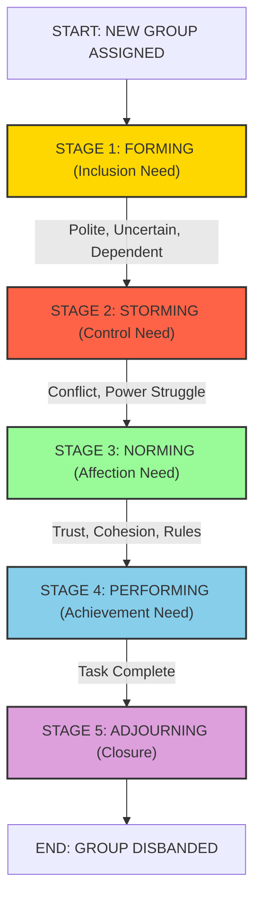
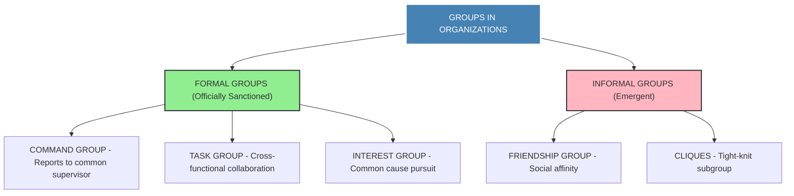
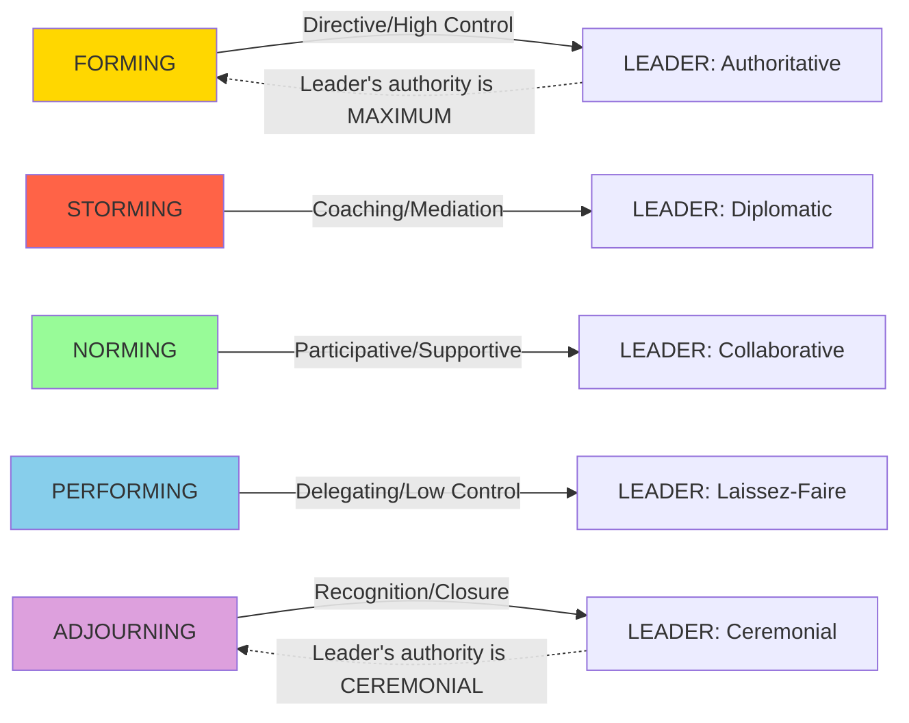
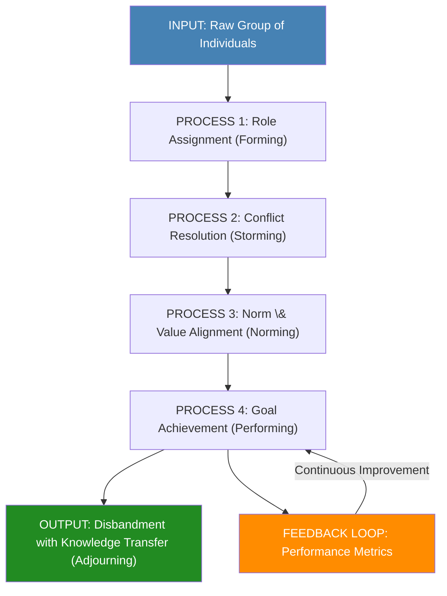

# Group Behaviour – Types and Stages of Group Development

<!-- SECTION_1_START -->
# Group Behaviour – Types and Stages of Group Development

## 1.1 Core Academic Definition

In the context of **Organizational Behaviour (OB)**, a **group** is formally defined as **two or more individuals who interact with one another, share similar characteristics, possess a collective sense of unity, and work together to achieve common objectives**. **Group behaviour** is the study of the dynamics, structures, functions, and psychological processes that govern how individuals behave when they are part of a collective, rather than in isolation.

> [!IMPORTANT]
> **KTU 2024 Syllabus Definition (UEHUT803 – Module 2):**
> Group behaviour is the field of study that investigates the impact of individuals, groups, and structures on behaviour within organizations, with the explicit purpose of applying such knowledge toward improving an organization's effectiveness. The unit emphasizes the **classification of groups**, the **sequential stages of group formation**, and the **leadership transitions** that emerge as groups mature.

### 1.2 Intuitive Overview & Real-World Analogy

> [!NOTE]
> **Analogy – "The Cricket Team vs. The Lunch Table":**
> Imagine two scenarios in a corporate office. The first is a **project team** assigned by a manager with a strict deadline to deliver a software module – this is a **formal group** with a clear hierarchy and shared goal. The second is a group of four colleagues who meet every day at the lunch table to discuss movies and cricket – this is an **informal group** formed purely by social affinity. Both are "groups," but the rules, norms, stages of formation, and behavioural expectations are completely different. Group behaviour is the science of decoding both of these structures.

The most widely accepted model used in KTU examination settings to describe how groups evolve is **Bruce Tuckman's Stages of Group Development Model (1965)**, which later incorporated a fifth stage by Tuckman \& Jensen in 1977.

> [!TIP]
> **Remember the acronym "F-S-N-P-A":** **F**orming, **S**torming, **N**orming, **P**erforming, **A**djourning. This single line answers 70% of conceptual questions asked in KTU ESE for this module.

> [!VISUALIZATION CONTROL]
> **Concept:** Group Development Life-Cycle (Bell-Curve Maturity Model)
> **Geometric Intuition:** Visualize a normal distribution curve where the **X-axis** represents *Time* and the **Y-axis* represents *Group Productivity/Performance*.
> **Curve Equation:** $P(t) = P_{\max} \cdot e^{-\frac{(t-t_{\text{peak}})^2}{2\sigma^2}}$
> **Visual Description:** The curve starts low at *Forming*, dips slightly into a "U" shape at *Storming* (representing conflict and reduced output), rises steadily through *Norming*, peaks during *Performing*, and then declines or flatlines during *Adjourning* as the group disbands. Students should observe that the **Storming** phase is a *temporary dip*, not a permanent failure.

### 1.3 Why This Topic is Critical in KTU 2024 Scheme

Under the **NEP 2020 Outcome-Based Education (OBE)** framework, this topic maps to:
- **CO2 (Course Outcome 2):** *Analyze the dynamics of group behaviour and leadership in organizational settings.*
- **Cognitive Process Dimension:** Understand $\rightarrow$ Apply
- This topic consistently appears as a **14-mark question** in KTU End Semester Examinations (ESE) and carries a 3-mark definitional weight in **Part A**.

---

<!-- SECTION_1_END -->

<!-- SECTION_2_START -->
# Deep Theoretical Analysis & KTU High-Yield Knowledge Sheet

## 2.1 Classification of Groups – The KTU Master Framework

Groups in an organizational context are classified along **two primary dimensions**: *Formal vs. Informal* and *Task-oriented vs. People-oriented*. Understanding this classification matrix is the most frequently tested framework in KTU exams.

### A. Formal Groups
A **formal group** is officially created and sanctioned by the organization to perform a specific task or achieve a defined objective. Its structure, role assignment, and authority hierarchy are explicitly defined.

### B. Informal Groups
An **informal group** emerges naturally out of social interaction, personal affinity, or shared interests among employees, without any official mandate from management.

### C. The Four Sub-Types (Katz \& Kahn Classification – HIGH-YIELD)

> [!IMPORTANT]
> **Katz and Kahn's Four Sub-Types of Formal Groups (Mandatory for KTU):**
> 1. **Command Group** – Members report to a common supervisor (e.g., a department's employees).
> 2. **Task Group** – Members collaborate to complete a specific task, regardless of reporting hierarchy (e.g., a cross-functional product launch team).
> 3. **Interest Group** – Members unite to pursue a common cause or interest (e.g., employee union for better wages).
> 4. **Friendship Group** – Members bond over shared personal characteristics, hobbies, or social backgrounds (e.g., a sports club in the office).

## 2.2 Stages of Group Development – Tuckman's 5-Stage Model (Theoretical Breakdown)

### Stage 1: Forming (Inclusion Stage)
- **Characteristics:** Uncertainty, politeness, dependence on the leader for guidance, low productivity, members are trying to understand the task and each other.
- **Psychological Driver:** *Inclusion* (a term borrowed from William Schutz's FIRO theory).
- **Leader's Role:** Provide clear direction, structure, and reduce ambiguity.

### Stage 2: Storming (Control Stage)
- **Characteristics:** Conflict, polarization, emotional turbulence, competition for status, resistance to the task and to the leader's authority.
- **Psychological Driver:** *Control* (members try to establish their position).
- **Leader's Role:** Facilitate discussion, mediate conflict, encourage participation, and set ground rules.

### Stage 3: Norming (Affection Stage)
- **Characteristics:** Cohesion develops, norms and roles are agreed upon, trust is built, communication improves, and productivity begins to rise.
- **Psychological Driver:** *Affection* (members start to value relationships).
- **Leader's Role:** Step back, become a facilitator, encourage collaborative decision-making.

### Stage 4: Performing (Achievement Stage)
- **Characteristics:** High maturity, high productivity, role flexibility, members are self-managing, energy is channeled into task accomplishment.
- **Psychological Driver:** *Achievement* (Schutz's final stage).
- **Leader's Role:** Delegation, monitoring, occasional intervention only when needed.

### Stage 5: Adjourning (Mourning/Closure Stage)
- **Characteristics:** The task is completed, members experience a sense of loss, recognition ceremonies, knowledge transfer, and dissolution of the team.
- **Psychological Driver:** *Acceptance* of the end.
- **Leader's Role:** Facilitate closure, celebrate achievements, conduct post-project reviews.

## 2.3 KTU High-Yield Comparative Cheat Sheet

| Dimension | Formal Group | Informal Group |
| :--- | :--- | :--- |
| **Origin** | Created by management | Emerges naturally |
| **Purpose** | Organizational goal | Social/personal need |
| **Structure** | Clearly defined roles | No fixed structure |
| **Duration** | Permanent or project-based | Variable, often spontaneous |
| **Authority** | Legitimate authority exists | Based on charisma/influence |
| **Communication** | Official channels | Grapevine/word-of-mouth |
| **Example** | Sales Department, HR Team | Office Lunch Buddies |

| Stage | Tuckman Name | Key Behaviour | Leadership Style | Productivity |
| :--- | :--- | :--- | :--- | :--- |
| 1 | Forming | Polite, uncertain | Directive/Authoritative | Very Low |
| 2 | Storming | Conflict, testing limits | Coaching/Diplomatic | Drops (Dip) |
| 3 | Norming | Trust building | Participative/Supportive | Rising |
| 4 | Performing | Task-focused, mature | Delegating/Laissez-faire | Peak/High |
| 5 | Adjourning | Closure, disengagement | Recognition-focused | Declining |

| Schutz FIRO Stage | Linked Tuckman Stage | Core Human Need |
| :--- | :--- | :--- |
| Inclusion | Forming | Belonging \& Acceptance |
| Control | Storming | Power \& Influence |
| Affection | Norming | Warmth \& Closeness |

## 2.4 Real-World Engineering \& Industry Utility

In modern IT and engineering firms, this framework is applied as follows:
- **Agile/Scrum Teams** in software companies pass through *Forming* during sprint planning, *Storming* during estimation debates, and *Norming* once velocity stabilizes.
- **Project Managers** in construction or manufacturing use Tuckman's model to time their leadership transitions – being highly directive in Week 1 and switching to a delegating style by Week 4.
- **HR Departments** use the *Adjourning* phase to plan knowledge transfer sessions, preventing intellectual capital loss when a project team disbands.

---

<!-- SECTION_2_END -->

<!-- SECTION_3_START -->
# Step-by-Step Analytical Breakdown & Tabular Case Mapping

## 3.1 Exhaustive Mapping: Tuckman's Model Applied to a KTU Case Scenario

> [!NOTE]
> Since this is a **Humanities/Management topic** (UEHUT803), the analytical methodology relies on **tabular comparative analysis** rather than algebraic derivation. The following table maps a real-world engineering project scenario to each developmental stage.

### Case Study: "Team Alpha – Software Development Capstone Project (B.Tech Final Year)"

A group of five B.Tech students is assigned by their KTU project coordinator to build a "Smart Attendance System using IoT" within a 4-month semester. The following matrix exhaustively maps their journey:

| Timeline | Stage | Observable Behaviour | Conflict Manifestation | Leadership Transition | Group Norm Established |
| :--- | :--- | :--- | :--- | :--- | :--- |
| Week 1-2 | **Forming** | Members are polite; they ask the coordinator (leader) every small question. No one challenges the idea of weekly meetings. | None visible; everyone is on best behaviour. | Leader (Coordinator) is **highly directive**; assigns roles (Frontend, Backend, IoT, Documentation, Testing). | "We will meet every Monday at 10 AM." |
| Week 3-5 | **Storming** | The student assigned to IoT hardware feels the Backend student is overstepping. Two members disagree on which microcontroller (ESP32 vs. Arduino) to use. Attendance at meetings drops. | Open arguments on WhatsApp group; silent treatment during meetings. | Leader shifts to a **coaching/diplomatic** style; mediates disputes, introduces a shared decision matrix. | "Disagreements are discussed in meetings, not on WhatsApp." |
| Week 6-9 | **Norming** | Members start dividing tasks without supervision. They help each other debug code. The original "leader" begins fading; subgroups of two members form naturally. | Conflict declines sharply; constructive criticism begins. | Leader becomes **participative**; members vote on feature additions. | "We test each other's code before pushing to GitHub." |
| Week 10-15 | **Performing** | The team works with minimal supervision. The system is deployed on a test server. Members experiment with bonus features (like a parent SMS alert). | Conflict is task-oriented and resolved quickly. | Leader adopts a **delegating** style; only checks in during milestone reviews. | "If a member is stuck for >24 hours, they ask for help." |
| Week 16 | **Adjourning** | The project is submitted. The team holds a celebration lunch. Members create a shared GitHub repository for future reference and exchange LinkedIn profiles. | Nostalgia and mild sadness about the project's end. | Leader (Coordinator) recognizes each member's contribution in front of the class. | "We will maintain the GitHub repo for 1 year for reference." |

### 3.2 Stage-by-Stage Psychological Driver Analysis (Schutz FIRO Integration)

The following table provides an exhaustive mapping of *why* each stage behaves the way it does, using Schutz's FIRO theory, which is frequently asked as a 7-mark sub-part in KTU:

| KTU Stage | Schutz Need | Specific Question Members Ask Themselves | Manager's Correct Response |
| :--- | :--- | :--- | :--- |
| **Forming** | *Inclusion* – "Am I accepted here?" | "Will the team welcome me? Do I belong?" | Conduct ice-breaking sessions, ensure equal voice time, assign clear roles. |
| **Storming** | *Control* – "Who has the power?" | "Who is the real decision-maker? Can I influence the outcome?" | Establish conflict-resolution protocols, allow healthy debate, clarify authority. |
| **Norming** | *Affection* – "Am I valued and liked?" | "Do my teammates care about me as a person?" | Encourage social bonding, reward collaborative behaviour, build trust. |
| **Performing** | *Achievement* – "How do I produce results?" | "What is the next milestone? How do I excel?" | Set ambitious but realistic goals, remove obstacles, provide resources. |
| **Adjourning** | *Acceptance* – "How do we close gracefully?" | "What happens after the project? Will I lose these connections?" | Conduct retrospectives, celebrate wins, provide references and closure. |

### 3.3 Five Dysfunctions of a Team – Patrick Lencioni (Supplementary High-Yield Concept)

> [!IMPORTANT]
> **The Lencioni Pyramid (frequently paired with Tuckman in KTU Part B questions):**
> 1. **Absence of Trust** (Base layer) – Members cannot be vulnerable with each other.
> 2. **Fear of Conflict** – Members resort to artificial harmony instead of productive debate.
> 3. **Lack of Commitment** – Members do not buy into decisions they did not help shape.
> 4. **Avoidance of Accountability** – Members do not hold each other to high standards.
> 5. **Inattention to Results** (Top layer) – Members prioritize individual goals over team goals.
>
> **Mapping:** The *Storming* stage in Tuckman's model is the *natural cure* for Dysfunction 2 (Fear of Conflict) and the *prerequisite* for building Trust.

---

<!-- SECTION_3_END -->

<!-- SECTION_4_START -->
# Structural Diagrams & Schematics

## 4.1 Tuckman's Five-Stage Group Development Flow

> [!NOTE]
> The following Mermaid diagram renders the sequential flow of Tuckman's model. All node labels are uppercase, alphanumeric, and double-quoted for safe rendering.

## 4.2 Group Classification Matrix Architecture

## 4.3 Leadership Style Transition Across Stages

## 4.4 Sequential Processing Topology – Group Maturity Index

---

<!-- SECTION_4_END -->

<!-- SECTION_5_START -->
# KTU 2024 Scheme Examination Question Bank & Topic Recap

## Part A: Short Answer Questions (3 Marks Each)

### Question 1 [KTU University Exam – July 2024]
**"Define a group. Distinguish between a formal group and an informal group with one example each." (3 Marks)**

**Model Answer:**
A **group** is defined as two or more individuals who interact with each other, share a common identity, and work collectively to achieve shared goals. A **formal group** is officially created by the organization with a defined structure and authority hierarchy; for example, the *Human Resources Department* of a company. In contrast, an **informal group** emerges spontaneously out of social interaction and personal affinity among members without any official mandate; for example, a *group of employees who play carrom together during lunch break*.

*Valuation Key:* [Definition of group: 1 Mark] [Formal distinction: 1 Mark] [Informal distinction + example: 1 Mark]

---

### Question 2 [KTU University Exam – Dec 2023]
**"List the five stages of group development as proposed by Bruce Tuckman. Why is the 'Storming' stage considered the most critical?" (3 Marks)**

**Model Answer:**
According to **Bruce Tuckman (1965)**, the five stages of group development are: **(1) Forming, (2) Storming, (3) Norming, (4) Performing, and (5) Adjourning**. The **Storming stage** is considered the most critical because it is the phase where interpersonal conflict, power struggles, and resistance to the leader emerge. If the group successfully navigates this turbulence, it builds the trust and cohesion necessary for high performance; if it fails, the group may regress or dissolve prematurely.

*Valuation Key:* [Listing all 5 stages: 1 Mark] [Naming Storming as most critical: 1 Mark] [Valid justification: 1 Mark]

---

## Part B: Full-Answer Questions (14 Marks Each – Internal Choice)

### Question A (Choice 1) [KTU University Exam – July 2024]

**(a) Explain the different types of groups as classified by Katz and Kahn. Differentiate between a 'Command Group' and a 'Task Group' with suitable organizational examples. (7 Marks)**

**Model Answer:**

**Katz and Kahn's Classification of Formal Groups (4 Marks):**
Organizational behaviour scholars Robert Katz and Daniel Kahn classified groups within an organization into four distinct categories based on their purpose and structure:
1. **Command Group:** Members are defined by the organizational hierarchy. They report to a common supervisor and perform tasks in a routine, ongoing manner. *Example:* All employees working in the *Finance Department* of TCS, reporting to the Finance Manager.
2. **Task Group:** Members are brought together from different departments or hierarchical levels to accomplish a specific, defined objective. Once the task is achieved, the group is typically dissolved. *Example:* A *Cross-Functional Product Launch Team* comprising members from Marketing, R\&D, and Logistics.
3. **Interest Group:** Members unite voluntarily to pursue a common interest or cause, often related to welfare, benefits, or working conditions. *Example:* A *Trade Union* in a manufacturing plant negotiating for better overtime pay.
4. **Friendship Group:** Members bond over shared personal characteristics such as ethnicity, hobbies, religion, or gender. *Example:* The *College Alumni Network* of an IIT chapter in Bangalore.

**Command Group vs. Task Group – Comparative Analysis (3 Marks):**

| Parameter | Command Group | Task Group |
| :--- | :--- | :--- |
| **Basis of Formation** | Organizational hierarchy | Specific project/objective |
| **Duration** | Permanent | Temporary |
| **Composition** | Homogeneous (same department) | Heterogeneous (cross-functional) |
| **Authority Source** | Common supervisor | Project Manager / Team Lead |
| **Example** | Sales Team of a Bank | Software Development Team for a new mobile app |

*Valuation Key:* [Naming all 4 types: 2 Marks] [Examples: 1 Mark] [Command vs. Task distinction: 2 Marks] [Tabular comparison: 1 Mark] [Examples: 1 Mark]

---

**(b) Describe Bruce Tuckman's five-stage model of group development in detail. For each stage, identify the dominant psychological need (using Schutz's FIRO theory) and the appropriate leadership style. (7 Marks)**

**Model Answer:**

**Tuckman's Five-Stage Model (1965, revised 1977) (5 Marks):**
This model explains how groups evolve from a collection of strangers into a high-performing team:

1. **Forming (Inclusion Need):** This is the initial stage characterized by uncertainty, polite behaviour, and dependence on the leader. Members ask themselves, *"Am I accepted here?"* The appropriate leadership style is **Authoritative/Directive**, as members need clear instructions.
2. **Storming (Control Need):** The second stage is marked by interpersonal conflict, power struggles, and resistance. Members ask, *"Who is in charge here?"* The appropriate leadership style is **Coaching/Diplomatic**, requiring the leader to mediate disputes.
3. **Norming (Affection Need):** The third stage sees the development of cohesion, trust, and shared norms. Members ask, *"Do my teammates like me?"* The appropriate leadership style is **Participative/Supportive**, encouraging collaboration.
4. **Performing (Achievement Need):** The fourth stage is the productive peak, where the team is self-managing and focused on goal achievement. Members ask, *"How do I contribute to success?"* The appropriate leadership style is **Delegating/Laissez-Faire**, empowering autonomy.
5. **Adjourning (Acceptance Need):** The final stage involves task completion, recognition, and team dissolution. The leader must facilitate graceful closure.

**Mapping with FIRO Theory (2 Marks):**
The model is enriched by William Schutz's *Fundamental Interpersonal Relations Orientation (FIRO)* theory, which maps the underlying human needs: *Inclusion* $\rightarrow$ *Control* $\rightarrow$ *Affection* $\rightarrow$ *Achievement* $\rightarrow$ *Acceptance*.

*Valuation Key:* [Stating all 5 stages with names: 2 Marks] [Psychological need for each: 2 Marks] [Leadership style for each: 2 Marks] [FIRO integration: 1 Mark]

---

### Question B (Choice 2) [KTU University Exam – Dec 2023]

**(a) "A team is not the same as a group." Critically evaluate this statement by distinguishing between groups and teams, and explain why understanding this difference is critical for modern managers. (7 Marks)**

**Model Answer:**

**Conceptual Distinction (4 Marks):**
While the terms *group* and *team* are often used interchangeably, organizational behaviour distinguishes them sharply. A **group** is a collection of two or more individuals who interact, share a common identity, and are aware of each other's existence, but they may not necessarily work toward a collective, interdependent goal. A **team**, on the other hand, is a *specialized type* of group characterized by **high interdependence, shared accountability, complementary skills, and a unified commitment to a common purpose**. In a group, members often pursue individual goals that align loosely; in a team, members pursue a collective goal that requires coordinated effort.

| Parameter | Group | Team |
| :--- | :--- | :--- |
| **Goal** | Individual or shared loosely | Collective and interdependent |
| **Accountability** | Individual | Mutual \& individual |
| **Synergy** | Neutral or negative | Always positive ($1+1 > 2$) |
| **Skills** | Random/varied | Complementary |
| **Example** | Department of a bank | Surgery team in a hospital |

**Managerial Significance (3 Marks):**
For modern managers, this distinction is critical because **global competition, agile methodologies, and cross-functional projects demand team-based structures rather than loose groups**. Managers must intentionally design teams by selecting for *complementary skills*, establishing *psychological safety* (Amy Edmondson), and creating *shared mental models*. The shift from *command-and-control* group management to *facilitate-and-coach* team management is a core competency tested in the KTU 2024 syllabus.

*Valuation Key:* [Defining group: 1 Mark] [Defining team: 1 Mark] [Differences: 1 Mark] [Managerial implication: 2 Marks] [Examples: 1 Mark] [Conclusion: 1 Mark]

---

**(b) Apply Tuckman's five-stage model to a real-world engineering project team of your choice. For each stage, describe (i) the typical group behaviour, (ii) one likely conflict situation, and (iii) the manager's ideal response. (7 Marks)**

**Model Answer:**

**Case Applied:** A **construction project team** building a 10-storey commercial complex over 18 months. The project manager is tasked with delivering the project on time and within budget.

| Stage | Group Behaviour | Likely Conflict | Manager's Ideal Response |
| :--- | :--- | :--- | :--- |
| **Forming** (Month 1) | Polite introductions, uncertainty about roles, dependency on the Project Manager for every minor decision. | Confusion over who handles the electrical vs. plumbing contractor approvals. | Hold a **kick-off meeting**, distribute a *RACI Matrix* (Responsible, Accountable, Consulted, Informed), and assign clear scopes of work. |
| **Storming** (Month 2-3) | The Civil Engineer and the Site Architect clash over the placement of the elevator shaft, which the architect claims violates building codes. | Open argument on-site in front of subcontractors, threatening project timeline. | Act as a **mediator**, schedule a one-on-one with both parties, refer to the *design blueprint and government bylaws*, and make a binding decision. |
| **Norming** (Month 4-6) | The team settles into a rhythm; subcontractor payments are processed on time, daily 15-minute huddles become the norm, and mutual respect grows. | Minor friction when the Procurement Officer delays material delivery, affecting the electrician's schedule. | **Facilitate cross-functional planning**, adjust the *Gantt chart*, and publicly appreciate teams that help each other. |
| **Performing** (Month 7-15) | The team is self-managing. Issues are resolved internally. Productivity hits its peak. The project hits the 8th floor ahead of schedule. | A new safety regulation is introduced mid-project, requiring redesign of the staircase. | **Empower the team** to handle the redesign internally, provide a *budget buffer*, and only escalate to the client for sign-off. |
| **Adjourning** (Month 18) | The project is handed over. Workers are released. The team holds a closing dinner and creates a *Lessons Learned* document. | Senior site engineers may resist leaving due to emotional attachment; subcontractors may not return to claim final payments. | **Conduct a formal closure ceremony**, issue experience letters, ensure *final settlement* of all dues, and submit a *Knowledge Transfer Report* to the operations team. |

*Valuation Key:* [Selection of a real-world project: 1 Mark] [Behaviour for each stage: 2 Marks] [Conflict for each stage: 2 Marks] [Manager response: 2 Marks]

---

> [!WARNING]
> **KTU Examiner's Valuation Warning – Common Pitfalls:**
> 1. **Do not list Tuckman's stages without explaining the psychological need** behind each stage. KTU examiners specifically allocate 2 marks in the 14-mark question for linking the stages to FIRO theory or managerial leadership transitions.
> 2. **Do not confuse "Adjourning" with "performing."** Many students wrongly list only 4 stages, missing the *Adjourning* stage, which costs them 1 to 2 marks.
> 3. **Avoid writing definitions without examples.** In a 14-mark question, every concept (formal group, informal group, command group, etc.) must be supported by at least one *engineering or industry-relevant example*. Generic examples like "a school" are marked down.
> 4. **Do not write "Tuckman gave 4 stages."** The original 1965 model had 4 stages; the *Adjourning* stage was added in 1977 by Tuckman \& Jensen. State the full 5-stage model to get full credit in the 2024 scheme.
> 5. **Do not skip the "Informal Group" classification.** If the question asks to "classify groups," students often write only about formal groups. Always mention *Interest* and *Friendship* groups as well.
> 6. **Avoid one-word answers in Part A.** A 3-mark question requires at least 3 to 4 lines of structured answer. Definitions alone fetch only 1 mark.

---

## Topic Recap \& Important Things to Remember

- **Group:** Two or more interacting individuals with a shared identity and common goal.
- **Formal Group:** Officially created by management (Command, Task, Interest).
- **Informal Group:** Emerges from social affinity (Friendship, Cliques).
- **Command Group:** Members reporting to a common supervisor.
- **Task Group:** Cross-functional members for a specific project.
- **Tuckman's 5 Stages:** **F**orming, **S**torming, **N**orming, **P**erforming, **A**djourning (F-S-N-P-A mnemonic).
- **Schutz's FIRO Needs:** *Inclusion* $\rightarrow$ *Control* $\rightarrow$ *Affection* $\rightarrow$ *Achievement* $\rightarrow$ *Acceptance*.
- **Forming Stage:** Leader is *Authoritative/Directive*; productivity is lowest.
- **Storming Stage:** *Conflict and power struggle*; leader must coach and mediate.
- **Norming Stage:** *Cohesion and trust* develop; leader is participative.
- **Performing Stage:** *Peak productivity*; leader delegates and stays hands-off.
- **Adjourning Stage:** *Task complete, group dissolves*; leader focuses on recognition and knowledge transfer.
- **Group vs. Team:** A team is a specialized group with *high interdependence, shared accountability, and complementary skills*.
- **Lencioni's Five Dysfunctions:** Trust $\rightarrow$ Conflict $\rightarrow$ Commitment $\rightarrow$ Accountability $\rightarrow$ Results (Pyramid).
- **Golden Rule for KTU 2024:** Always link theoretical models to a *real-world engineering/IT project example* to fetch full marks.

<!-- SECTION_5_END -->
