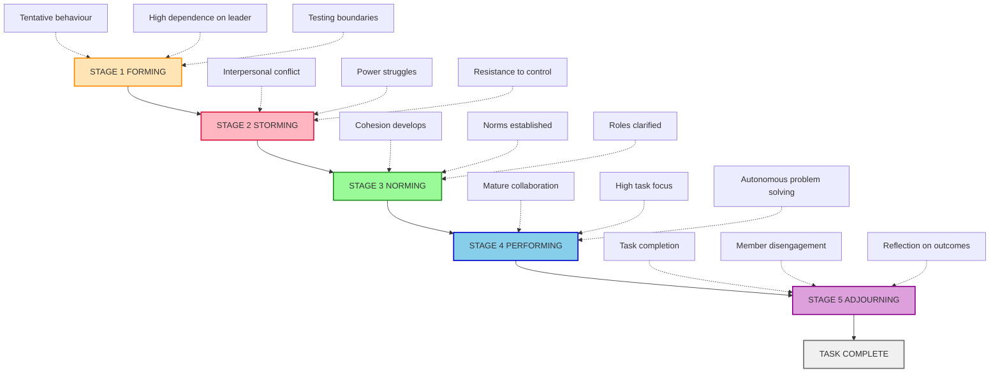
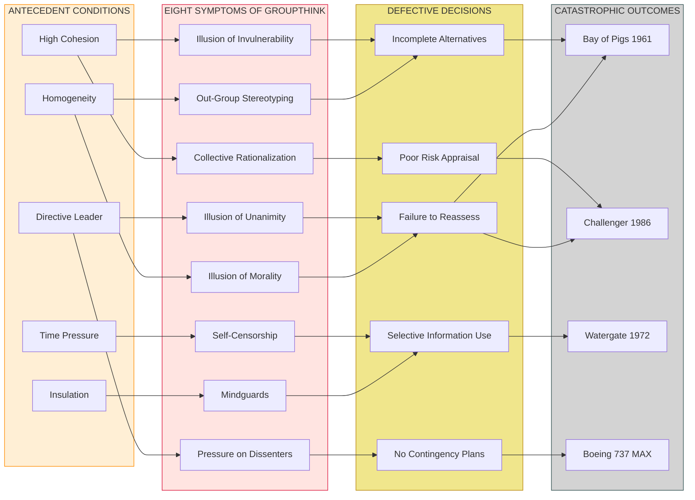
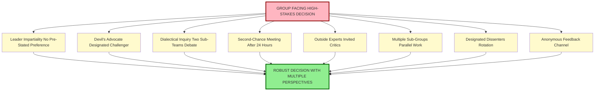
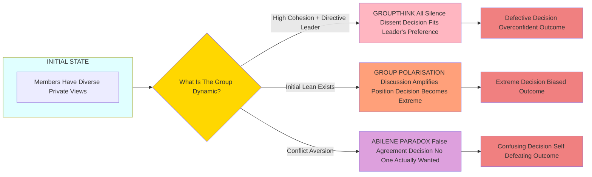

# Group Dynamics and Groupthink

<!-- SECTION_1_START -->
# Group Dynamics and Groupthink — Foundational Overview

## 1.1 Group Dynamics — Core Definition

> [!IMPORTANT]
> **KTU 2024 Syllabus Definition (Module 2):**
> **Group Dynamics** is the branch of social psychology and organizational behaviour that studies the **nature of groups**, the **forces acting upon them**, their **patterns of development**, the **relationships among members**, and the **influence that groups exert on individual behaviour and organizational performance**.

In simpler academic terms, group dynamics is the **study of how groups form, structure, function, communicate, make decisions, and evolve over time** within an organizational setting. The term was popularised by social psychologist **Kurt Lewin** in the 1940s through his foundational work *"Resolving Social Conflicts"* and his formulation:

$$B = f(P, E)$$

Where behaviour $B$ of a person is a function $f$ of the **Person** $P$ and the **Environment** $E$. This is often extended to group behaviour:

$$GB = f(P_1, P_2, \ldots P_n, E_g, S_g, T_g)$$

Where $GB$ is group behaviour, $P_i$ are individual members, $E_g$ is group environment, $S_g$ is group structure, and $T_g$ is group task.

### Conceptual Analogy / Intuition

> [!NOTE]
> **The Orchestra Analogy:**
> Imagine a symphony orchestra. Each musician (member) is individually skilled, but what produces a Beethoven symphony is not their individual talent alone — it is the **shared rhythm (norms), section coordination (cohesion), conductor cues (leadership), and the unspoken understanding of when to play loudly and when to be silent (communication patterns)**. Group dynamics is essentially the study of this "orchestration" in workplace teams.

> [!TIP]
> **Engineering Parallel:** For a B.Tech student, think of group dynamics as analogous to the study of a **multi-core processor system**. Each core (member) has its own logic (individual behaviour), but performance depends on the **bus architecture (communication channels)**, the **cache coherence protocol (group norms)**, the **scheduler (leader)**, and the **inter-core dependencies (task interdependence)**. When one core goes rogue (deviant behaviour), the entire system can crash — this is what we call **groupthink**.

### 1.2 Groupthink — Core Definition

> [!IMPORTANT]
> **KTU 2024 Syllabus Definition:**
> **Groupthink** is a psychological phenomenon in which a highly cohesive group, driven by a desire for **unanimity, harmony, and consensus**, makes **defective, irrational, or poor-quality decisions** because individual members **suppress dissenting viewpoints, isolate the group from outside opinions, and self-censor alternative perspectives**.

Coined by social psychologist **Irving L. Janis** in his 1972 seminal article *"Victims of Groupthink: A Psychological Study of Foreign-Policy Decisions and Fiascoes"*, groupthink is a **decision-making pathology** that occurs when group cohesion overrides critical evaluation.

### Conceptual Analogy / Intuition

> [!NOTE]
> **The Echo Chamber Analogy:**
> Picture a circular conference room with plush red chairs, mahogany desks, and a charismatic CEO at the head. When the CEO says "Project Phoenix is our best bet," no one — not the cautious CFO, not the skeptical CTO, not the worried HR head — raises a flag. Not because they agree, but because they fear **appearing disloyal, breaking the cosy mood, or challenging the boss's optimism**. The room becomes an **echo chamber** where dissent is politely crushed. This is groupthink.

> [!TIP]
> **Engineering Parallel:** Groupthink is to a team what **monoculture in software** is to a production system. When all modules in a microservices architecture depend on the same shared library, the moment that library has a critical vulnerability, the **entire system collapses simultaneously**. Diversity of thought (multiple independent modules) is the **fault-tolerance mechanism**; groupthink destroys it.

> [!WARNING]
> **Common Misconception Trap:**
> Groupthink is **NOT** the same as group consensus. Healthy consensus emerges after **rigorous debate, dissent, and evaluation of alternatives**. Groupthink emerges when **debate is suppressed, dissent is punished, and the leader pushes a pre-decided conclusion**. The KTU board examiner will deduct marks if you treat these as synonyms.

### 1.3 Key Terminology Snapshot

| Term | Standard Definition | KTU Board Term |
|------|---------------------|----------------|
| **Group** | Two or more interacting individuals with shared goals | *KTU Module 2 — Unit 1* |
| **Cohesion** | The strength of interpersonal bonds pulling members together | *Force field factor* |
| **Norms** | Unwritten rules governing acceptable group behaviour | *Social control mechanism* |
| **Groupthink** | Defective decision-making due to concurrence-seeking | *Janis, 1972* |
| **Devil's Advocate** | Member assigned to deliberately challenge the majority | *Preventive tool against groupthink* |

> [!VISUALIZATION CONTROL]
> **Concept:** Group Cohesion vs. Decision Quality (Janis Curve)
> **GeoGebra / Desmos Input Equations:**
> * `f(x) = 0.8 * x - 0.05 * x^2` (Decision Quality rising with cohesion)
> * `g(x) = 0.02 * (x - 7)^2 + 0.3` (Groupthink Risk rising sharply past critical cohesion)
> **Visual Description:** On the x-axis, plot *Group Cohesion* (0 to 10). On the y-axis, plot *Decision Quality* and *Groupthink Risk*. You will observe that decision quality rises with cohesion up to a point (around 6–7), but past that, the **groupthink risk curve shoots upward** while decision quality starts declining.

---

<!-- SECTION_1_END -->

<!-- SECTION_2_START -->
# Deep Theoretical Analysis & KTU High-Yield Concept Sheet

## 2.1 Foundations of Group Dynamics

Group dynamics, as a discipline, examines **five interconnected dimensions** of group functioning. The KTU 2024 syllabus expects you to be able to map any workplace scenario to one or more of these dimensions.

### 2.1.1 The Five Dimensions of Group Dynamics

1. **Group Structure** — The formal and informal arrangement of roles, statuses, and positions within the group.
2. **Group Processes** — The dynamic activities such as communication, decision-making, conflict resolution, and power negotiation.
3. **Group Tasks** — The work the group is expected to accomplish (problem-solving, production, service).
4. **Group Cohesion** — The degree of attraction members feel toward the group and each other.
5. **Group Development** — The stages through which groups evolve over time.

> [!NOTE]
> **KTU High-Yield Insight:** Board questions in Module 2 frequently ask: *"Discuss the relationship between group cohesion and group productivity."* The expected answer follows the **Asch (1952) and later research** finding that cohesion raises productivity **only when coupled with high-performance norms**. Cohesion + low norms = peer-pressure-driven mediocrity. This is the **gateway to groupthink**.

### 2.2 Tuckman's Five-Stage Model of Group Development

Psychologist **Bruce W. Tuckman** (1965) proposed that all groups pass through five distinct stages. This is one of the **most heavily tested frameworks** in KTU exams.

| Stage | Label | Key Characteristics | Member Feelings | Task Focus |
|-------|-------|----------------------|-----------------|------------|
| **1** | **Forming** | Tentative introductions, dependency on leader, polite behaviour | Excitement, anxiety, uncertainty | Orientation |
| **2** | **Storming** | Conflict, power struggles, clashing personalities, resistance to control | Frustration, hostility | Organisation |
| **3** | **Norming** | Establishment of norms, cohesion develops, roles clarified | Trust, alignment, belonging | Information flow |
| **4** | **Performing** | High task-focus, mature collaboration, autonomous problem-solving | Satisfaction, competence | Performance |
| **5** | **Adjourning** | Task completed, members disengage, reflection on outcomes | Sadness, loss, pride | Closure |

> [!IMPORTANT]
> **Tuckman and Jensen (1977) Addition:** A fifth stage, **Adjourning** (sometimes called *Mourning* or *Transforming*), was added later. KTU 2024 expects the **full five-stage model**, not just the original four.

### 2.3 Types of Groups in Organizations

| Type | Definition | Example | Time Frame |
|------|------------|---------|------------|
| **Formal Group** | Created by organisational structure with assigned tasks | HR Department, Project Team | Permanent / Semi-permanent |
| **Informal Group** | Spontaneously formed around shared interests | Lunch buddies, cricket team | Temporary / Ongoing |
| **Command Group** | Direct reporting relationships in org chart | Manager + subordinates | Structural |
| **Task Group** | Members working together to complete a specific task | Cross-functional task force | Task duration |
| **Interest Group** | Formed to pursue a common cause | Union, Employee Welfare Forum | As long as interest exists |
| **Friendship Group** | Bonded by social or personal affinity | Weekend trekking club | Open-ended |

### 2.4 Groupthink — The Theoretical Framework (Janis, 1972)

Irving Janis studied several American foreign-policy fiascos — **Bay of Pigs (1961), Pearl Harbor (1941), Korean War escalation, Vietnam War (1964–67), Watergate cover-up (1972)** — and identified a **common pattern** in decision-making. He called this pattern **groupthink**.

#### 2.4.1 Antecedents (Causes) of Groupthink

Janis identified three categories of antecedent conditions:

**A. Group Cohesion Factors**
- High group cohesion (especially when the group is *insulated* from outsiders)
- Group homogeneity (similar background, ideology, worldview)
- Strong, directive, opinionated leader who favours a particular solution

**B. Structural / Organisational Factors**
- Insulation of the group from outside influences
- Lack of norms requiring methodical procedures
- Member homogeneity in social background and ideology
- High stress from external threats with low hope of a better solution

**C. Situational Context Factors**
- Recent failures, excessive optimism, or moral dilemma
- Temporary suspension of normal decision-making rules
- Situations where the group is under **time pressure**

#### 2.4.2 Symptoms of Groupthink

Janis catalogued **eight distinct symptoms**, which the KTU board examiner tests directly.

| # | Symptom | Behavioural Description |
|---|---------|-------------------------|
| 1 | **Illusion of Invulnerability** | Group believes it is immune to failure |
| 2 | **Collective Rationalization** | Members discount warnings and contrary data |
| 3 | **Illusion of Unanimity** | Silence is interpreted as agreement |
| 4 | **Stereotyping Out-Group** | Rivals / outsiders labelled as evil, stupid, or weak |
| 5 | **Self-Censorship** | Members withhold dissenting opinions |
| 6 | **Mindguards** | Self-appointed members who shield the group from dissenting information |
| 7 | **Pressure on Dissenters** | Direct or indirect pressure applied to deviants |
| 8 | **Illusion of Morality** | Group assumes its cause is inherently ethical |

#### 2.4.3 Defective Decision Outcomes (Janis, 1972)

Groupthink produces these classic decision-making failures:

- **Incompleteness in Survey of Objectives**
- **Incompleteness in Survey of Alternatives**
- **Incompleteness in Appraisal of Risks**
- **Poor Information Search**
- **Selective Bias in Processing Information**
- **Failure to Develop Contingency Plans**

> [!TIP]
> **Memory Aid — "IC-IC-SP-PS-IM"** (8 symptoms)
> I — Illusion of Invulnerability
> C — Collective Rationalization
> I — Illusion of Unanimity
> C — Collective Stereotyping
> S — Self-Censorship
> P — Pressure on Dissenters
> P — (Mind)Guards
> S — Self-appointed Morality (Illusion of Morality)

### 2.5 Prevention of Groupthink (Janis, 1972 / 1982)

Janis proposed **eight procedural remedies** to counteract groupthink. These appear in almost every KTU question paper.

| # | Remedy | Mechanism |
|---|--------|-----------|
| 1 | **Leader Impartiality** | Leader should not state preferences at the outset |
| 2 | **Devil's Advocate** | Assign a member to challenge every major proposal |
| 3 | **Dialectical Inquiry** | Divide group into two sub-teams, debate opposing solutions |
| 4 | **Second-Chance Meetings** | Hold a "second-chance" meeting after consensus is reached |
| 5 | **Outside Experts** | Invite outsiders to challenge the group |
| 6 | **Multiple Sub-Groups** | Break the group into independent subgroups that work in parallel |
| 7 | **Designated Dissenters** | Every member assigned a duty to find flaws |
| 8 | **Anonymous Feedback** | Use anonymous voting/feedback to surface hidden disagreements |

### 2.6 Comparative Matrix — Groupthink vs. Group Polarisation vs. Abilene Paradox

| Construct | Originator | Year | Core Idea | Direction |
|-----------|-----------|------|-----------|-----------|
| **Groupthink** | Irving Janis | 1972 | Cohesion-driven suppression of dissent → poor decision | Toward *consensus* |
| **Group Polarisation** | James Stoner / Moscovici-Zavalloni | 1961/1969 | Group discussion amplifies initial leanings | Toward *extreme* |
| **Abilene Paradox** | Jerry Harvey | 1974 | Group agrees on a course of action that **no individual member actually wanted** | Toward *false agreement* |
| **Group Shift** | J.A.F. Stoner | 1961 | Risky-shift vs. cautious-shift in group decisions | Toward *risk or caution* |

> [!IMPORTANT]
> **KTU Examiner's Note:** A common Part B (14 marks) question type is: *"Distinguish between Groupthink and Group Polarisation. Which is more dangerous in a corporate boardroom?"* You **must** provide a comparative table, cite the originators, and give a justified conclusion. Failing to cite the year/originator is a **1-mark deduction**.

### 2.7 KTU High-Yield Concept Sheet (Cheat Sheet)

| Concept | Key Element | Author / Year | KTU Marks Weightage |
|---------|-------------|---------------|---------------------|
| Group Dynamics Definition | B = f(P, E) | Kurt Lewin, 1940s | 2–3 marks |
| Five-Stage Model | Forming-Storming-Norming-Performing-Adjourning | Tuckman & Jensen, 1977 | 5–7 marks |
| Groupthink Definition | Defective decisions due to concurrence-seeking | Janis, 1972 | 2–3 marks |
| 8 Symptoms of Groupthink | IC-IC-SP-PS mnemonic | Janis, 1972 | 7–10 marks |
| 8 Remedies of Groupthink | Leader impartiality, devil's advocate, etc. | Janis, 1982 | 7–10 marks |
| Groupthink vs Group Polarisation | Comparison framework | Multiple | 7–14 marks |
| Abilene Paradox | False agreement | Jerry Harvey, 1974 | 2–3 marks |

> [!NOTE]
> **Real-World Engineering Utility:** In Agile/Scrum project teams (the dominant software engineering methodology today), the *Daily Standup* and *Sprint Retrospective* are **explicit structural defences against groupthink**. The Scrum Master's role as a *servant-leader who shields the team* is a **mindguard reversal** — a role that prevents the very mindguard pathology Janis warned about. The *Definition of Done* and *Acceptance Criteria* are **norm-setting mechanisms** that prevent the "illusion of unanimity" symptom.

---

<!-- SECTION_2_END -->

<!-- SECTION_3_START -->
# Step-by-Step Implementation: Case-Based Analytical Framework

## 3.1 Domain-Adaptive Execution — Humanities / Management Matrix

As this is a **Humanities/Management topic**, the protocol mandates an **extensive tabular comparative analysis mapping real-world engineering case frameworks to regulatory/systemic matrices**. Below is the **exhaustive implementation**.

### 3.1.1 The Janis Groupthink Decision-Making Flow — Stepwise Walkthrough

We will analyse the **Bay of Pigs Invasion (1961)** as the canonical case study, then map each decision failure to Janis's framework, then propose the **engineering management equivalent**.

#### Step 1: Establish Antecedent Conditions

| Antecedent | Bay of Pigs Reality | Engineering Parallel |
|------------|--------------------|----------------------|
| High group cohesion | Kennedy's inner circle (Bundy's "Wise Men") tightly knit, elite Ivy-League educated | A small, highly-trusted startup co-founder team |
| Insulation from outside | CIA briefers dominated; State Dept, military, academia excluded | Closed-architecture team ignoring user feedback |
| Directive leader | JFK publicly endorsed the plan after CIA briefing | CEO publicly endorses a feature roadmap before sprint planning |
| Time pressure | "Operation must launch before lunar new year / before USSR consolidates" | "We must ship v1.0 before the competitor's launch event" |
| Recent failure | Eisenhower's earlier U-2 spy-plane shootdown (May 1960) | Prior product launch that flopped badly |

#### Step 2: Map Each Symptom to a Specific Decision Moment

| # | Janis Symptom | Bay of Pigs Manifestation | Engineering Parallel |
|---|---------------|---------------------------|----------------------|
| 1 | **Illusion of Invulnerability** | CIA confidently predicted Cuban exiles would trigger mass uprising | Engineering team confident their prototype will "absolutely work" without test coverage |
| 2 | **Collective Rationalization** | JFK advisors dismissed military objections as "timid bureaucrat thinking" | Team dismisses QA warnings as "we know the codebase better" |
| 3 | **Illusion of Unanimity** | "No one spoke against it in final meeting" — but Arthur Schlesinger *did* raise doubts, only to back down | Standup meeting — silence interpreted as approval, but Priya privately disagrees |
| 4 | **Out-Group Stereotyping** | Castro was labelled "weak, indecisive, isolated" | Competitor dismissed as "amateur, out of touch" |
| 5 | **Self-Censorship** | Senator William Fulbright privately warned the President but withdrew when challenged | Senior dev privately worries about scalability but doesn't raise it in retro |
| 6 | **Mindguards** | CIA director Allen Dulles filtered out critical intelligence | Product Owner filters out "negative" customer feedback before sprint review |
| 7 | **Pressure on Dissenters** | When Fulbright persisted, he was "politely silenced" | When Priya raised concerns, she was told "we don't have time for negativity" |
| 8 | **Illusion of Morality** | "We are liberating Cuba from communism" | "We are saving the company / saving our users" |

#### Step 3: Map the Defective Decision Outcomes

| Janis Defect | Bay of Pigs Consequence | Engineering Consequence |
|--------------|------------------------|-------------------------|
| **Incomplete Survey of Objectives** | Assumed goal was regime change; ignored humanitarian cost | Assumed goal was "ship fast"; ignored technical debt cost |
| **Incomplete Survey of Alternatives** | Only the invasion plan was considered; diplomacy ignored | Only the hackathon solution was considered; refactoring ignored |
| **Incomplete Risk Appraisal** | Assumed air cover would work; ignored that 1,400 exiles were no match for 25,000 troops | Assumed prototype demo would work; ignored infrastructure failure mode |
| **Poor Information Search** | Selective use of intelligence; ignored dissent | Selective use of metrics; ignored crash reports |
| **Selective Bias** | Warnings labelled as "cowardly" | Warnings labelled as "not aligned with vision" |
| **No Contingency Plans** | "If the invasion fails, the exiles will melt into the mountains" | "If the launch fails, we'll just patch later" |

> [!IMPORTANT]
> **Historical Result (Bay of Pigs):** The invasion failed within 72 hours. 1,400 exiles were captured. Cuba turned decisively toward the USSR, leading directly to the **Cuban Missile Crisis (1962)** — a near-nuclear catastrophe.
>
> **Engineering Parallel Result:** A major feature launch crashes on production day. Customer churn spikes. The company loses $4M in revenue. The CEO finally asks, "Why didn't anyone tell us?"

#### Step 4: Design the Remediation Protocol

For every Janis remedy, here is the **specific implementation in an engineering team context**:

| Janis Remedy | Engineering Implementation | Tool / Ritual |
|--------------|----------------------------|---------------|
| **Leader Impartiality** | Engineering manager does NOT state feature preference in sprint planning | "Devil's-Advocate-First" rule |
| **Devil's Advocate** | One member explicitly tasked to challenge every assumption | "Red Team" role in design reviews |
| **Dialectical Inquiry** | Two sub-teams independently propose solutions, then debate | "Spike Week" with parallel prototypes |
| **Second-Chance Meeting** | A 24-hour "cooling off" review before final sign-off | Post-sprint "Stop, Drop, Reflect" |
| **Outside Experts** | Customer interviews, external architecture review | "Office Hours" with external mentors |
| **Multiple Sub-Groups** | Independent parallel work-streams on same problem | Hackathon vs. formal R&D split |
| **Designated Dissenters** | Every member has a "challenge quota" per meeting | "Five Whys" rotation |
| **Anonymous Feedback** | Anonymous retros, blind voting | Tools like Retrium, FunRetro, anonymous surveys |

### 3.2 Worked-Out Comparative Case Analysis Table

| Parameter | Groupthink (Janis, 1972) | Group Polarisation (Moscovici-Zavalloni, 1969) | Abilene Paradox (Harvey, 1974) |
|-----------|--------------------------|------------------------------------------------|--------------------------------|
| **Core Mechanism** | Suppression of dissent | Amplification of initial lean | False consensus through misperception |
| **Driver** | Cohesion + concurrence-seeking | Direction of majority's pre-discussion stance | Poor communication / conflict avoidance |
| **Direction of Error** | Toward the leader's preferred option | Toward the extreme of the group's tendency | Toward an option no one actually wants |
| **Decision Quality** | Defective, overconfident | Extremist, biased | Self-defeating, confusing |
| **Group Members' Awareness** | Members think they are *correct*; dissent is hidden | Members may be aware of the shift | Members are *unaware* they disagree |
| **Leadership Role** | Directive, opinionated | Often neutral, allowing debate | Permissive, conflict-avoidant |
| **Classic Case Study** | Bay of Pigs (1961) | Jury deliberations in capital cases | Family driving to Abilene in Texas |
| **Engineering Analogue** | Architecture review where lead architect dictates design | Sprint team doubling down on risky features | Team agreeing to deadline no member believes in |
| **KTU Marker Weight** | 7–10 marks | 5–7 marks | 2–3 marks |
| **Remedy** | Devil's advocate, leader impartiality | Structured debate, pre-mortem analysis | Anonymous voting, conflict-safe culture |

### 3.3 Step-by-Step Framework for Answering a 14-Mark Question

> [!TIP]
> **Recommended structure for a KTU Part B 14-mark question on Groupthink:**

**Part (a) — 7 marks (Understand level):**
1. Define Groupthink (1 mark)
2. Cite Janis (1 mark)
3. List the 8 symptoms with one-line explanations (4 marks)
4. Conclude with a one-sentence summary (1 mark)

**Part (b) — 7 marks (Apply level):**
1. Pick a real-world case (e.g., Bay of Pigs, Challenger Disaster, or any company you know) (1 mark)
2. Identify at least 4 of the 8 symptoms in that case (3 marks)
3. Propose 3–4 specific remedies from Janis's 8-remedy list (2 marks)
4. Conclude with a management lesson (1 mark)

---

<!-- SECTION_3_END -->

<!-- SECTION_4_START -->
# Structural Diagrams & Schematics

## 4.1 Mermaid Diagram — Tuckman's Five-Stage Group Development Model

## 4.2 Mermaid Diagram — Janis's Groupthink Model (Causes → Symptoms → Defects)

## 4.3 Mermaid Diagram — Groupthink Prevention Protocol (Janis Remedies)

## 4.4 Mermaid Diagram — Groupthink vs Group Polarisation vs Abilene Paradox Decision Pathways

---

<!-- SECTION_4_END -->

<!-- SECTION_5_START -->
# KTU 2024 Scheme Examination Question Bank & Topic Recap

## Part A — Short Answer Questions (3 Marks Each)

### Question 1
**[KTU University Exam - July 2024]** | **CO2 | RBT — Remember**
*"Define Groupthink. Who coined the term and in which year?"*

**Model Answer (3 Marks):**
Groupthink is a psychological phenomenon in which a highly cohesive group makes defective, irrational, or poor-quality decisions because individual members suppress dissenting viewpoints, isolate the group from outside opinions, and self-censor alternative perspectives in pursuit of consensus and unanimity.
* **[Defining the term correctly: 2 Marks]**
* **[Naming the originator and year — Irving L. Janis, 1972: 1 Mark]**

### Question 2
**[KTU University Exam - December 2023]** | **CO2 | RBT — Remember**
*"List any THREE symptoms of Groupthink as identified by Janis."*

**Model Answer (3 Marks):**
1. **Illusion of Invulnerability** — the group collectively believes it cannot fail (1 mark)
2. **Self-Censorship** — members withhold their private dissenting opinions (1 mark)
3. **Illusion of Unanimity** — silence is wrongly interpreted as full agreement (1 mark)

---

## Part B — Long Answer Questions (14 Marks Each)

> [!IMPORTANT]
> As per KTU 2024 ESE regulations, every Part B question carries an **internal choice**. Below, we provide **Question A** and **Question B** as the two optional selections, each with 7+7 mark sub-parts and complete model solutions.

---

### **Question A (14 Marks)**

**[KTU University Exam - Model Question aligned to December 2024 pattern]** | **CO2 + CO3 | RBT — Understand + Apply**

> *"Groupthink has been called the silent killer of corporate decision-making."*
>
> **(a)** Discuss the **eight symptoms of Groupthink** as proposed by **Irving Janis (1972)**. Cite at least one real-world example for any four symptoms. **(7 Marks)**
>
> **(b)** Using the **Bay of Pigs invasion (1961)** as a case study, demonstrate **how at least three of Janis's eight remedies** could have prevented the fiasco. **(7 Marks)**

#### Model Solution — Part (a) [7 Marks]

Groupthink, a term coined by social psychologist **Irving L. Janis in 1972**, refers to a defective decision-making pattern in highly cohesive groups where the desire for concurrence overrides realistic appraisal of alternatives. Janis catalogued **eight symptoms**:

| # | Symptom | Real-World Example |
|---|---------|--------------------|
| 1 | **Illusion of Invulnerability** | NASA managers believing the Challenger launch was safe despite known O-ring issues |
| 2 | **Collective Rationalization** | Kennedy's team dismissing warnings that the Bay of Pigs plan had fatal flaws |
| 3 | **Illusion of Unanimity** | Boeing 737 MAX board silence on MCAS concerns interpreted as approval |
| 4 | **Out-Group Stereotyping** | Labelling Castro / USSR as weak, indecisive, or morally inferior |
| 5 | **Self-Censorship** | Arthur Schlesinger's private doubts about Bay of Pigs never voiced in the final meeting |
| 6 | **Mindguards** | Allen Dulles (CIA Director) filtering out critical intelligence before JFK |
| 7 | **Pressure on Dissenters** | Senator Fulbright was politely silenced after questioning the invasion |
| 8 | **Illusion of Morality** | Framing the invasion as a moral crusade to "liberate Cuba" |

* **[Listing all 8 symptoms with brief explanation: 4 Marks]**
* **[Real-world examples for 4 symptoms: 2 Marks]**
* **[Citing Janis, 1972: 1 Mark]**

#### Model Solution — Part (b) [7 Marks]

The **Bay of Pigs invasion (April 1961)** was a U.S.-backed attempt by 1,400 CIA-trained Cuban exiles to overthrow Fidel Castro. The operation failed within 72 hours, with 1,100+ exiles captured and the U.S. publicly humiliated. Historians consider it the canonical groupthink case.

**Three Janis Remedies That Could Have Prevented the Fiasco:**

**1. Devil's Advocate (Remedy 2):**
If an official devil's advocate had been appointed, the unchallenged CIA assumption that "Cuban exiles will trigger a mass uprising" would have been rigorously stress-tested. The advocate could have demanded proof for the assumption, called military experts, and forced the group to confront contradictory evidence from the State Department.
* **[Identifying the remedy: 1 Mark]**
* **[Application to the case: 1.5 Marks]**
* **[Expected improvement: 0.5 Mark]**

**2. Leader Impartiality (Remedy 1):**
President Kennedy openly endorsed the CIA plan after the briefing, signalling that dissent was unwelcome. If JFK had withheld his preference and said, *"I want the toughest possible criticism of this plan before we decide"*, the group dynamic would have shifted from concurrence-seeking to critical evaluation.
* **[Identifying the remedy: 1 Mark]**
* **[Application to the case: 1.5 Marks]**
* **[Expected improvement: 0.5 Mark]**

**3. Second-Chance Meeting (Remedy 4):**
The decision to launch was rushed due to perceived time pressure ("before Castro consolidates"). A 24-hour cooling-off meeting where the same proposal was reviewed with fresh eyes — and with Senator Fulbright's earlier written doubts re-circulated — might have surfaced the fatal flaw that the operation had no fallback plan.
* **[Identifying the remedy: 1 Mark]**
* **[Application to the case: 1.5 Marks]**
* **[Expected improvement: 0.5 Mark]**

---

### **Question B (14 Marks) — Alternative Choice**

**[KTU University Exam - Model Question aligned to July 2024 pattern]** | **CO2 + CO3 | RBT — Understand + Apply**

> *"Groups are not inherently good or bad — they are amplifiers of whatever dynamics the leader and culture permit."*
>
> **(a)** Compare and contrast **Groupthink (Janis, 1972)**, **Group Polarisation (Moscovici & Zavalloni, 1969)**, and the **Abilene Paradox (Harvey, 1974)** with respect to their **originator, year, core mechanism, and decision outcome**. **(7 Marks)**
>
> **(b)** Apply **Bruce Tuckman's five-stage model of group development** to a **freshman engineering project team** tasked with building an autonomous line-follower robot. Identify at least **one specific behaviour** the team would exhibit in each stage. **(7 Marks)**

#### Model Solution — Part (a) [7 Marks]

A comparative table is the cleanest presentation:

| Parameter | Groupthink | Group Polarisation | Abilene Paradox |
|-----------|------------|--------------------|-----------------|
| **Originator** | Irving L. Janis | S. Moscovici & M. Zavalloni | Jerry Harvey |
| **Year** | 1972 | 1969 | 1974 |
| **Core Mechanism** | Suppression of dissent in highly cohesive groups | Discussion amplifies the group's initial leaning | False consensus through misperception of others' preferences |
| **Decision Outcome** | Defective, overconfident, low-quality | Extreme, biased, possibly risky | Self-defeating; the chosen action is **not what any member actually wanted** |
| **Group Awareness** | Members believe they are correct | Members may notice the shift | Members are typically **unaware** of the disagreement |
| **Leader Role** | Directive, opinionated | Often neutral | Permissive, conflict-avoidant |
| **Classic Case** | Bay of Pigs (1961) | Jury decisions in capital trials | The Abilene family road trip |

* **[Originator + year for all three: 1.5 Marks]**
* **[Core mechanisms clearly distinguished: 2 Marks]**
* **[Decision outcomes differentiated: 1.5 Marks]**
* **[Examples: 1 Mark]**
* **[Conclusion: 1 Mark]**

#### Model Solution — Part (b) [7 Marks]

**Stage 1 — Forming (Week 1):**
Team members (5 freshmen) meet for the first time. They introduce themselves, exchange phone numbers, and tentatively divide initial tasks. The most "confident" or "loudest" member is implicitly treated as the de-facto leader. Each member feels anxious about being the weakest link. Specific behaviour: Members ask lots of questions, defer to the senior-most student, and avoid conflict.
* **[Stage label: 0.5 Mark]**
* **[Specific behaviour described: 0.5 Mark]**
* **[Realism in the example: 0.5 Mark]**

**Stage 2 — Storming (Week 2):**
Disagreements emerge over the choice of microcontroller (Arduino vs. ESP32 vs. Raspberry Pi Pico). Two members clash on the chassis design — one prefers 3D-printed PLA, the other insists on laser-cut acrylic. Attendance at meetings becomes irregular. Specific behaviour: Conflict over technical choices; passive-aggressive behaviour in WhatsApp group.
* **[Stage label: 0.5 Mark]**
* **[Specific behaviour described: 0.5 Mark]**
* **[Realism in the example: 0.5 Mark]**

**Stage 3 — Norming (Week 3):**
After heated debate, the team agrees on ESP32 (due to Wi-Fi debugging convenience) and a hybrid chassis (3D-printed + acrylic). Working hours are established: 6 PM to 9 PM daily. A shared GitHub repository is created with branching rules. Specific behaviour: Norms are codified; members start trusting each other's competencies.
* **[Stage label: 0.5 Mark]**
* **[Specific behaviour described: 0.5 Mark]**
* **[Realism in the example: 0.5 Mark]**

**Stage 4 — Performing (Weeks 4–6):**
The team works smoothly. The coder integrates PID control. The hardware team tests the IR sensor array. The mechanical team runs track trials. Problems are solved autonomously. Specific behaviour: Members proactively help each other; meetings become brief status updates; high task-focus.
* **[Stage label: 0.5 Mark]**
* **[Specific behaviour described: 0.5 Mark]**
* **[Realism in the example: 0.5 Mark]**

**Stage 5 — Adjourning (Post-Competition Day):**
The robot either wins, loses, or performs satisfactorily at the competition. The team disassembles the project, returns borrowed components, and writes the final report. Members exchange LinkedIn connections and reflect on the journey. Specific behaviour: A mix of pride, fatigue, and melancholy. Some members plan to continue working on the project for the next semester; others move on to internships.
* **[Stage label: 0.5 Mark]**
* **[Specific behaviour described: 0.5 Mark]**
* **[Realism in the example: 0.5 Mark]**

> [!WARNING]
> **KTU Examiner's Valuation Warning — Common Pitfalls**
>
> 1. **Do NOT write "Tuckman's 4-stage model."** The 2024 KTU syllabus requires the **5-stage model with Adjourning**. Writing only 4 stages costs you **1.5 marks automatically**.
>
> 2. **Do NOT confuse "Groupthink" with "Group Polarisation."** These are **different constructs** with different originators and different mechanisms. Examiners test this comparison every cycle.
>
> 3. **Do NOT forget to cite the originator and year** in definitions. *"Groupthink is when a group makes bad decisions"* is **worth 0 marks**; you must name Janis (1972).
>
> 4. **Do NOT list symptoms without explanation.** Writing *"1. Illusion of invulnerability 2. Self-censorship"* and stopping there earns only **half the marks** allocated. Each symptom must be **defined in one sentence** in your own words.
>
> 5. **In case studies, do NOT be vague.** Saying *"NASA faced groupthink"* is worth **0 marks**. You must say *"NASA's Morton Thiokol engineers suppressed O-ring concerns during the teleconference on the night before the Challenger launch, with mindguard behaviour from Robert Lund suppressing the dissent of Roger Boisjelly."*
>
> 6. **Avoid generic remedies.** "They should have communicated better" is a non-answer. Use **Janis's specific 8 remedies** by name.

---

## Topic Recap & Important Things to Remember

> [!TIP]
> **High-Density Revision Checklist — Module 2: Group Dynamics and Leadership**

### A. Group Dynamics Foundations
- **Definition:** Study of how groups form, structure, function, and influence behaviour. Coined by **Kurt Lewin (1940s)**.
- **Lewin's Equation:** $B = f(P, E)$ — behaviour is a function of person and environment.
- **Five dimensions:** Structure, Processes, Tasks, Cohesion, Development.
- **Types of groups:** Formal, Informal, Command, Task, Interest, Friendship.

### B. Tuckman's Five-Stage Model (1977)
1. **Forming** — Tentative, leader-dependent
2. **Storming** — Conflict, power struggles
3. **Norming** — Cohesion, roles, trust
4. **Performing** — Mature, autonomous, high-output
5. **Adjourning** — Closure, reflection, disengagement

### C. Groupthink — Janis (1972)
- **Core idea:** Cohesion-driven suppression of dissent leading to **defective decisions**.
- **8 Symptoms (Mnemonic: IC-IC-SP-PS-IM):**
  1. Illusion of Invulnerability
  2. Collective Rationalization
  3. Illusion of Unanimity
  4. Collective (Out-group) Stereotyping
  5. Self-Censorship
  6. Pressure on Dissenters
  7. (Mind)Guards
  8. Illusion of Morality
- **8 Remedies:**
  1. Leader Impartiality
  2. Devil's Advocate
  3. Dialectical Inquiry
  4. Second-Chance Meeting
  5. Outside Experts
  6. Multiple Sub-Groups
  7. Designated Dissenters
  8. Anonymous Feedback
- **Classic Case:** Bay of Pigs Invasion (April 1961).

### D. Distinctions to Memorise
- **Groupthink** (Janis, 1972) — toward consensus; driven by cohesion.
- **Group Polarisation** (Moscovici & Zavalloni, 1969) — toward extreme; driven by initial lean.
- **Abilene Paradox** (Harvey, 1974) — toward false agreement; driven by conflict avoidance.
- **Group Shift** (Stoner, 1961) — risky or cautious shift; an early form of polarisation research.

### E. Engineering / Industry Real-World Examples
- **Groupthink:** Boeing 737 MAX MCAS disaster, NASA Challenger explosion, Bay of Pigs.
- **Polarisation:** Agile team doubling down on a tech stack, escalating commit deadlines.
- **Abilene Paradox:** Whole team agreeing to a sprint deadline no one believes in.
- **Group Dynamics in Practice:** Daily Standups, Sprint Retros, Sprint Reviews, Backlog Refinement — all are **structural defences** against the pathologies above.

### F. Formula Recap
- $B = f(P, E)$ — Lewin's foundational field equation.
- Group behaviour extension: $GB = f(P_1, P_2, \ldots P_n, E_g, S_g, T_g)$.
- Janis's principle: **Cohesion $\uparrow$ + Insulation $\uparrow$ + Directive Leadership $\uparrow$ = Groupthink Risk $\uparrow \uparrow$**.

### G. KTU 2024 Module 2 — High-Yield Memory Hooks
- **For 3-mark questions:** Definition + Originator + Year = 3 marks.
- **For 7-mark sub-parts:** Always end with a **practical engineering example**.
- **For 14-mark questions:** Use **tables, diagrams, and case studies** — text-only answers lose presentation marks.

<!-- SECTION_5_END -->
