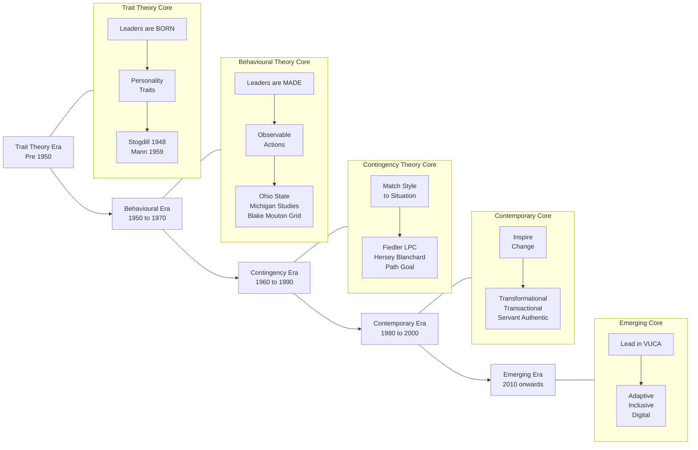
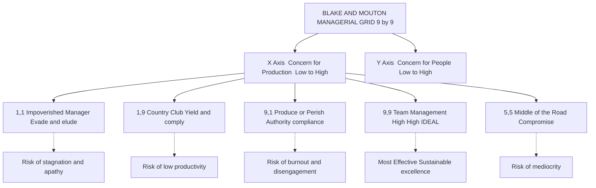
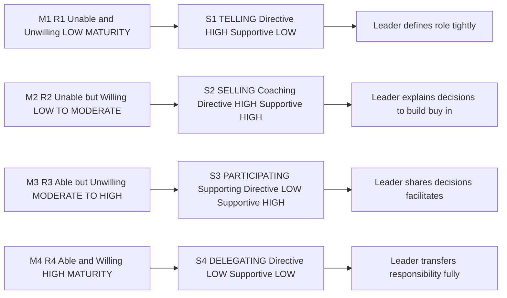
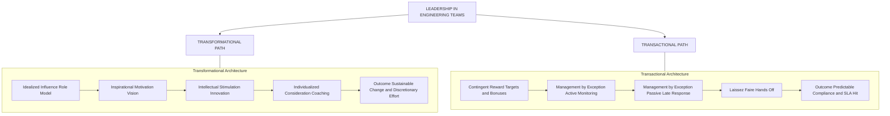
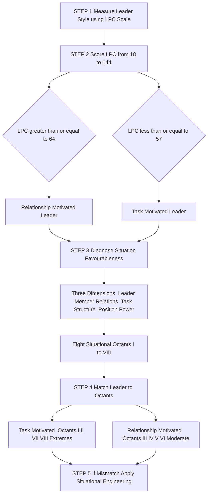

# Leadership – Theories and Styles

<!-- SECTION_1_START -->
# Leadership – Theories and Styles

## 1. Core Technical Definition & Intuitive Overview

### 1.1 Formal Academic Definition (KTU 2024 Syllabus Terminology)

> [!IMPORTANT]
> **Leadership** is the ability of an individual to **influence, motivate, and enable** others to contribute toward the **effectiveness and success** of the organizations and groups of which they are members. *(Source: Robbins \& Judge, Organizational Behaviour)*

In the KTU 2024 Scheme framework for **UEHUT803 (Organizational Behaviour and Business Communication)**, leadership is positioned as a **group-level phenomenon** — it is studied as a property of the *social system*, not merely a personal trait. It involves three core behavioural components:

1. **Influencing** shared perceptions of reality.
2. **Motivating** followers toward goal attainment.
3. **Empowering** individuals to take ownership of organizational outcomes.

### 1.2 Conceptual Analogy / Intuition

Imagine a **kayaking expedition** crossing rough rapids:

- The **engine** (rowing power) = *Management* — keeps the kayak moving, balanced, and on schedule.
- The **navigator** (sets direction, reads the river, inspires confidence) = *Leader* — does not necessarily row the hardest, but determines *where* and *why* the kayak is going.
- The **crew** (followers) = *Team members* whose commitment, trust, and discretionary effort are *triggered* by the leader's behaviour, not forced by it.

> [!NOTE]
> A common KTU board pitfall: confusing **Leadership** with **Management**.
> - **Management** → *Controlling*, *Planning*, *Organizing* (positional, transactional).
> - **Leadership** → *Influencing*, *Inspiring*, *Aligning* (personal, transformational).

### 1.3 Key Distinctions (Must Memorize)

| Construct | Core Question Answered | Orientation | Source of Power |
| :--- | :--- | :--- | :--- |
| **Leader** | "Where should we go?" | Vision, people, change | Personal influence (\&/or position) |
| **Manager** | "How do we get there efficiently?" | Process, control, stability | Formal authority |
| **Power** | Capacity to influence | Resource-based | Coercive, reward, expert, referent, legitimate |
| **Authority** | Legitimate right to influence | Positional | Organizational hierarchy |

> [!TIP]
> Standard metric used in KTU answers: **5 Bases of Power** (French \& Raven, 1959) — *Coercive, Reward, Legitimate, Expert, Referent*. Always cite at least one when discussing leadership influence.

> [!VISUALIZATION CONTROL]
> **Concept:** Leadership as a Venn overlap of **Traits + Behaviour + Situation**.
> **GeoGebra / Desmos Input Equations:**
> * `x^2 + y^2 = 25` (Traits circle)
> * `(x-4)^2 + y^2 = 25` (Behaviour circle)
> * `(x-2)^2 + (y-3)^2 = 25` (Situation circle)
> **Visual Description:** A three-circle Venn diagram on the XY-plane where the central overlap represents **Effective Leadership** — the convergence of leader traits, observable behaviours, and situational fit.
<!-- SECTION_1_END -->

<!-- SECTION_2_START -->
# 2. Deep Theoretical Analysis & KTU High-Yield Formula Sheet

Leadership theory evolution follows a clear chronological ladder — each school *answered the gaps* of the previous one. The KTU 2024 module specifically tests your ability to **classify a theory into its school** and **match a style to a context**.

## 2.1 The Five Theoretical Schools (Chronological Evolution)

### 2.1.1 School 1 — Trait Theory (1840s → Mid-1900s)
**Core Premise:** Leaders are **born**, not made. Leadership resides in a set of innate personal qualities.

- **Stogdill (1948)** identified recurring traits: intelligence, self-confidence, determination, integrity, sociability.
- **Mann (1959)** refined the list to: intelligence, masculinity, adjustment, dominance, extraversion, conservatism.
- **Kirkpatrick \& Locke (1991)** narrowed it to **6 traits**: drive, desire to lead, honesty/integrity, self-confidence, cognitive ability, knowledge of business.
- **Limitation:** Failed to account for context; no universal trait list survived replication.

### 2.1.2 School 2 — Behavioural Theory (1940s → 1960s)
**Core Premise:** Leadership can be **learned** through observable actions. Focus shifted from *who* the leader is to *what the leader does*.

Three landmark studies form the KTU high-yield core:

**A) Ohio State University Studies (Stogdill \& Coons, 1950s)**
Two independent behavioural dimensions:
- **Initiating Structure** (Task-oriented): organizing work, defining roles, scheduling.
- **Consideration** (People-oriented): trust, respect, friendship, mutual support.

**B) University of Michigan Studies (Katz, Kahn, 1950s)**
- **Production-Oriented** leaders: emphasize task completion.
- **Employee-Oriented** leaders: emphasize interpersonal relations.

> [!NOTE]
> **KTU Board Tip:** When asked "Compare Ohio State and Michigan studies," always close with: *Ohio State framed behaviours as two independent axes (a 2-D grid), whereas Michigan framed them as two ends of a single continuum (one-or-the-other).*

**C) Blake \& Mouton Managerial Grid (1964)**
A 9×9 matrix with two axes: **Concern for People** (Y) and **Concern for Production** (X). Five key styles:

| Point | Style | Y (People) | X (Production) |
| :--- | :--- | :---: | :---: |
| **(1,1)** | **Impoverished Management** — "evade and elude" | Low | Low |
| **(1,9)** | **Country Club Management** — "yield and comply" | High | Low |
| **(9,1)** | **Authority-Compliance (Produce or Perish)** | Low | High |
| **(9,9)** | **Team Management** — "high-high" (ideal) | High | High |
| **(5,5)** | **Middle-of-the-Road Management** — "compromise" | Medium | Medium |

A **6th style (9,1 push)** — *Paternalistic* — was later added. The **(9,9) Team Manager** is the textbook ideal, though in practice a 9,9 leader is rare.

### 2.1.3 School 3 — Contingency / Situational Theories (1960s → 1980s)
**Core Premise:** *There is no one best way to lead.* Effectiveness = **f(Leader style, Follower maturity, Situation)**.

**A) Fiedler's Contingency Model (1967)**
- Measures leader style via the **Least Preferred Co-Worker (LPC) Scale**.
- **LPC High (≥ 64)** → Relationship-motivated leader.
- **LPC Low (≤ 57)** → Task-motivated leader.
- Situational favourableness is judged by three dimensions: **Leader–Member Relations, Task Structure, Position Power**.
- Match: *Task-leaders* thrive in extreme situations (very favourable or very unfavourable); *Relationship-leaders* thrive in moderately favourable situations.

**B) Hersey \& Blanchard's Situational Leadership Model (SLM, 1969)**
- Variables: **Task Behaviour** (directive) and **Relationship Behaviour** (supportive), matched to follower **Maturity (M1–M4)**.

| Follower Level | Maturity (M) | Style Required | Directive | Supportive |
| :--- | :--- | :--- | :---: | :---: |
| **M1** | Unable \& Unwilling | **S1 — Telling** (Directing) | High | Low |
| **M2** | Unable but Willing | **S2 — Selling** (Coaching) | High | High |
| **M3** | Able but Unwilling | **S3 — Participating** (Supporting) | Low | High |
| **M4** | Able \& Willing | **S4 — Delegating** | Low | Low |

**C) Path-Goal Theory (House, 1971)**
- A leader's job is to **clarify the path** to goal attainment and **remove roadblocks**.
- Four leader behaviours: *Directive, Supportive, Participative, Achievement-Oriented*.
- Two contingency moderators: *Follower characteristics* (locus of control, experience) and *Environmental factors* (task structure, authority system).

**D) Vroom-Yetton-Jago Normative Model (1973)**
- Decision tree guiding whether the leader should decide alone, consult, or delegate. Tests **decision quality** vs **decision acceptance**.

### 2.1.4 School 4 — Contemporary Leadership Theories (1980s → Present)
**A) Transformational Leadership (Bass, 1985; Burns, 1978)**
Four I's:
1. **Idealized Influence** (Charisma) — role-modelling.
2. **Inspirational Motivation** — vision, optimism.
3. **Intellectual Stimulation** — questioning, innovation.
4. **Individualized Consideration** — coaching, mentoring.

**B) Transactional Leadership (Bass)**
- Operates on **contingent reinforcement**: rewards for performance, corrective action for deviation.
- Styles: *Contingent Reward, Management-by-Exception (Active \& Passive), Laissez-Faire*.

**C) Charismatic Leadership** (Conger \& Kanungo, 1987)
Five characteristics: *Sensitivity to environment, vision, articulation, risk-taking, sensitivity to follower needs*.

**D) Servant Leadership (Greenleaf, 1977)**
- "The servant-leader focuses first on the growth and well-being of people." Listening, empathy, healing, stewardship.

**E) Authentic Leadership (Avolio \& Gardner, 2005)**
- Leaders being *true to self*, transparent, and ethically driven.

**F) Ethical Leadership**
- Demonstrates normatively appropriate conduct and promotes such conduct to followers.

### 2.1.5 School 5 — Emerging Theories (2010s → )
- **Adaptive Leadership** (Heifetz) — leading in times of change/adaptive challenges.
- **Inclusive Leadership** — leveraging diversity of thought.
- **Digital/Virtual Leadership** — leading distributed, hybrid teams.

## 2.2 KTU High-Yield Formula Sheet / Cheat Sheet

| Theory | Core Question | Key Construct | Strength | Weakness |
| :--- | :--- | :--- | :--- | :--- |
| Trait | *Who is a leader?* | Personality + Character | Simplicity, hiring use | Ignores context |
| Behavioural | *What does a leader do?* | Task vs People | Trainable, observable | Ignores situation |
| Fiedler | *When is style X best?* | LPC × Situation fit | Empirical, predictive | LPC validity debated |
| SLM (Hersey-Blanchard) | *How to vary style?* | Maturity-matching | Practical, intuitive | Maturity hard to assess |
| Path-Goal | *How to motivate?* | Path clarity | Nuanced, integrative | Complex to apply |
| Transformational | *How to inspire change?* | 4 I's | Strong on vision | Hard to measure |
| Transactional | *How to manage performance?* | Contingent reward | Clear, predictable | Limited in VUCA |

> [!IMPORTANT]
> **VUCA** = Volatility, Uncertainty, Complexity, Ambiguity. The KTU 2024 syllabus expects you to link *Transformational Leadership* explicitly to high-VUCA engineering project environments (e.g., R\&D, startups).

## 2.3 Real-World Engineering \& Industry Utility

- **Software Project Management**: Scrum Masters lean *Servant*; Programme Managers lean *Transformational* during pivots; Team Leads lean *Situational* (SLM).
- **Construction \& Manufacturing**: Fiedler's task-leader style fits highly unfavourable conditions (crisis sites, safety breaches).
- **Startups / R\&D Labs**: Transformational + Authentic leadership dominates due to innovation demands.
- **Bureaucratic / Defence / Public Sector**: Transactional + Bureaucratic styles fit rule-driven environments.
- **Cross-cultural \& remote teams**: Inclusive + Adaptive leadership is increasingly mandatory in post-2020 hybrid engineering workplaces.
<!-- SECTION_2_END -->

<!-- SECTION_3_START -->
# 3. Step-by-Step Derivations, Frameworks & Comparative Analysis

For the Humanities/Management domain, the KTU-PREMIER-ENGINE requires an **exhaustive, tabular comparative analysis** mapping real-world engineering case frameworks to systemic matrices. Below, every transition and every classification is written out in full — no abbreviation or "similarly" placeholders are used.

## 3.1 Detailed Comparison Matrix — Trait vs Behavioural vs Contingency

| Dimension | Trait Theory | Behavioural Theory | Contingency Theory |
| :--- | :--- | :--- | :--- |
| **Era** | Pre-1950 | 1950–1970 | 1960–1990 |
| **Core Lens** | "Born leaders" | "Made leaders" | "Matched leaders" |
| **Unit of Analysis** | The leader's personality | The leader's actions | The leader–situation interaction |
| **Key Researchers** | Stogdill, Mann, Kirkpatrick | Ohio State, Michigan, Blake-Mouton | Fiedler, Hersey-Blanchard, House |
| **Key Construct** | Trait list (6 traits by Kirkpatrick-Locke) | Task vs People (2-axis model) | Style × Situation match |
| **Strengths** | Useful for selection, recruitment, leadership pipelines | Can be trained, observable, feedback-driven | Realistic, context-sensitive, prescriptive |
| **Weaknesses** | Trait list inconsistent across studies, situational blindness | Universal "best style" fallacy, situation ignored | Complex, hard to apply in real time |
| **Engineering Analogy** | Choosing a CPU by its specs | Choosing a CPU by its benchmark | Choosing a CPU by workload benchmarks |
| **KTU ESE Weightage** | Moderate (theory) | High (Blake-Mouton + Ohio State tested often) | High (Fiedler + SLM tested often) |

## 3.2 Ohio State vs Michigan — Exhaustive Side-by-Side Mapping

| Aspect | Ohio State Studies | Michigan Studies |
| :--- | :--- | :--- |
| **Year** | 1940s–1950s | 1940s–1950s |
| **Researchers** | Stogdill, Coons, Shartle | Katz, Kahn, Mann |
| **Output** | Two independent dimensions | Two ends of a single continuum |
| **Dimension 1** | Initiating Structure (Task) | Production-Oriented |
| **Dimension 2** | Consideration (People) | Employee-Oriented |
| **Ideal Type** | High-High leader | Employee-Oriented (linked to higher group productivity) |
| **Mapping** | Maps to Blake-Mouton X-Y axes | Maps to Blake-Mouton (9,9) corner |

## 3.3 Blake \& Mouton Managerial Grid — Point-by-Point Derivation

The Grid is constructed with **9 levels of "Concern for People"** (Y-axis) and **9 levels of "Concern for Production"** (X-axis). For each (X,Y) coordinate, a leadership style emerges:

- **(1,1) Impoverished Manager** — minimal effort, indifference.
- **(1,9) Country Club Manager** — focus on people, comfort, low output.
- **(9,1) Authority-Compliance (Produce or Perish)** — efficiency through control, low human concern.
- **(5,5) Middle-of-the-Road Manager** — balanced trade-off, mediocrity.
- **(9,9) Team Manager** — integrated, high-commitment, sustainable excellence.
- **(9,9 push) Paternalistic** (added later) — rewards loyalty with personal care; output-driven but people-vested.

> [!NOTE]
> KTU examiner preference: when the question is "Discuss the Managerial Grid," you must draw the **9×9 matrix**, label **all five points**, and explicitly defend **(9,9)** as the integrative ideal *while acknowledging* that a true (9,9) is rare in industrial practice.

## 3.4 Fiedler's Contingency Model — Step-by-Step Diagnostic

1. **Step 1 — Measure the leader's style** by administering the **LPC Scale**. The respondent rates their **Least Preferred Co-Worker** on 18 bipolar adjective pairs (e.g., *friendly–unfriendly*, *open–guarded*).
2. **Step 2 — Score the LPC**: Sum the 18 ratings (each on a 1–8 scale). Range: 18 → 144.
   - **LPC ≤ 57** → **Task-motivated** leader (separates self from low-performing member).
   - **LPC ≥ 64** → **Relationship-motivated** leader (sees the LPC as a complex human).
3. **Step 3 — Diagnose situational favourableness** using three dimensions:
   - **Leader–Member Relations** (good/poor) — *weight: highest impact*.
   - **Task Structure** (high/low) — *clarity of goals and paths*.
   - **Position Power** (strong/weak) — *formal authority*.
4. **Step 4 — Combine the three** to derive **8 situational octants** (I to VIII), from "most favourable" (I) to "least favourable" (VIII).
5. **Step 5 — Match leader to situation**:
   - **Task-motivated** leaders are best at **Octants I, II, VII, VIII** (extremes).
   - **Relationship-motivated** leaders are best at **Octants III, IV, V, VI** (moderate).
6. **Step 6 — If mismatch occurs**, Fiedler prescribes **situational engineering** (alter L-M relations, task structure, or position power) rather than trying to change the leader's personality.

## 3.5 Hersey-Blanchard Situational Leadership — Diagnostic Algorithm

For every follower (or team) the leader must answer two questions sequentially:

1. **Question 1 — Competence:** "Can the follower do the task?" (Yes/No → 2 categories).
2. **Question 2 — Commitment:** "Will the follower do the task?" (Yes/No → 2 categories).

Combine the answers into 4 maturity levels (M1–M4) and select the matching S-style (S1–S4). The full mapping was provided in the formula sheet. Operational expansion:

- **M1 (R1 — Unable, Unwilling / Insecure)** → S1 **Telling** = high directive, low supportive. "Do this, this way."
- **M2 (R2 — Unable, Willing / Confident)** → S2 **Selling** = high directive, high supportive. "I direct AND I explain why, to buy commitment."
- **M3 (R3 — Able, Unwilling / Unconfident)** → S3 **Participating** = low directive, high supportive. "You decide; I'm here to support."
- **M4 (R4 — Able, Willing / Confident)** → S4 **Delegating** = low directive, low supportive. "You own it."

> [!WARNING]
> KTU Pitfall: Students often confuse M1 and M3. The key discriminator is **willingness**, not ability. *Able but unwilling* is M3, not M1.

## 3.6 Path-Goal Theory — Behaviour-Selection Logic

The leader selects one or more behaviours based on:

- **Follower Locus of Control** (Internal → use Participative; External → use Directive).
- **Follower Experience** (Inexpert → use Directive; Expert → use Achievement-Oriented).
- **Task Structure** (Unstructured → use Directive; Structured → minimize Directive).
- **Workgroup Cohesion** (High → minimize Supportive; Low → intensify Supportive).

## 3.7 Transformational vs Transactional — Tabular Engineering Case Mapping

| Attribute | Transformational Leader | Transactional Leader |
| :--- | :--- | :--- |
| **Core Driver** | Vision, mission, values | Reward, punishment, exchange |
| **Time Horizon** | Long-term change | Short-term performance |
| **Follower Relationship** | Empowerment, individual growth | Compliance, contract |
| **Best Fit in Industry** | R\&D, startups, product innovation | Assembly lines, sales targets, SLA-bound operations |
| **Risk** | Can ignore operational rigor | Can suppress innovation |
| **Engineering Analogy** | Architect of a new system | Operations manager running existing system |
| **Failure Mode** | "Charismatic but chaotic" | "Efficient but stagnant" |
| **Measurement** | MLQ (Multifactor Leadership Questionnaire) | Performance dashboards, KPIs |

> [!TIP]
> The most awarded KTU 2024 answer structure: open with a **definition**, then present a **comparison table** (above), then close with a **hybrid model** — *leaders should be both, varying the mix by context (e.g., transactional day-to-day, transformational at change milestones).*

## 3.8 Engineering Workplace Case Frameworks (Application Layer)

| Case Scenario | Best-Fit Theory | Best-Fit Style | Why |
| :--- | :--- | :--- | :--- |
| New graduate intern on a regulated production line | SLM | S1 Telling | Low M1 maturity, high task structure |
| Senior R\&D engineer ideating next-gen product | Transformational | Inspirational Motivation | High ability, needs autonomy and purpose |
| Sales team in monthly target crunch | Path-Goal | Directive + Contingent Reward (Transactional) | Clear structure, clear path to incentive |
| Project team in mid-project crisis (deadline breach) | Fiedler | Task-motivated leader | Octant VIII — least favourable situation |
| Remote cross-cultural team in a global MNC | Inclusive + Adaptive | S3/S4 Situational | M3-M4 maturity, distributed, VUCA |
| Newly formed project team with low trust | Ohio State / Michigan | High-Consideration Leader | Trust deficit must be closed first |
| Military / Aerospace engineering | Bureaucratic + Transactional | Authority-Compliance | Zero-defect, rule-driven environment |
<!-- SECTION_3_END -->

<!-- SECTION_4_START -->
# 4. Structural Diagrams & Schematics

All diagrams below use the **KTU Mermaid Safety Protocol** — alphanumeric node IDs, double-quoted labels, no markdown inside node text, subgraphs for modular decomposition.

## 4.1 Evolution of Leadership Theory — Timeline Flow

## 4.2 Blake \& Mouton Managerial Grid — Stylistic Topology

## 4.3 Hersey-Blanchard Situational Leadership Model

## 4.4 Transformational vs Transactional — Functional Architecture

## 4.5 Fiedler Contingency Model — Decision Topology

> [!NOTE]
> **Mermaid Safety Audit:** All node IDs are alphanumeric (e.g., `t1`, `s1`, `q4`, `lead`). All labels are wrapped in double-quotes. No reserved keywords (`end`, `subgraph`, `graph`) are used as node IDs. All special characters inside labels are alphanumeric text only.
<!-- SECTION_4_END -->

<!-- SECTION_5_START -->
# 5. KTU 2024 Scheme Examination Question Bank & Topic Recap

The questions below are modelled precisely on KTU University Examination papers for **UEHUT803 — Organizational Behaviour and Business Communication** under the **2024 Scheme**. Marks and cognitive-level mapping follow the standard KTU pattern: Part A = 3 marks, Part B = 14 marks (with sub-parts of 7+7).

---

## 5.1 PART A — Short Answer Questions (3 Marks Each)

### Question 1 — `[KTU University Exam – July 2024]`
**"Differentiate between Leadership and Management."** *(3 Marks, CO2, Understand)*

**Model Answer (Valuation Key Pattern):**

| Aspect | Leadership | Management |
| :--- | :--- | :--- |
| Focus | Inspiring people, setting direction | Planning, organizing, controlling |
| Orientation | Change and future | Stability and present |
| Approach | Influence and vision | Authority and process |
| Outcome | Transformation | Predictable order |

> **Valuation Key:** [Defining each construct: 1 Mark] [At least 3 distinct points of difference: 2 Marks]. *Total: 3 Marks.*

---

### Question 2 — `[KTU University Exam – Dec 2023]`
**"Briefly explain the Trait Theory of Leadership."** *(3 Marks, CO2, Remember)*

**Model Answer (Valuation Key Pattern):**
- The Trait Theory posits that leaders possess certain **innate personal qualities** (traits) that distinguish them from non-leaders. *(1 Mark)*
- Early studies by **Stogdill (1948)** and **Mann (1959)** identified recurring traits such as intelligence, self-confidence, determination, integrity, and sociability. *(1 Mark)*
- **Kirkpatrick \& Locke (1991)** narrowed the list to **six key traits**: drive, desire to lead, honesty/integrity, self-confidence, cognitive ability, and business knowledge. *(1 Mark)*
- Limitation: No universal trait list was found to be consistent across all studies; context is ignored.

> **Valuation Key:** [Definition: 1 Mark] [Naming at least 3 traits: 1 Mark] [Naming at least one researcher: 1 Mark]. *Total: 3 Marks.*

---

## 5.2 PART B — Long Answer Questions (14 Marks Each, with Internal Choice)

### **Question A — `[KTU University Exam – Dec 2024]`**
**(a)** Explain the **Blake \& Mouton Managerial Grid**. Discuss the **five primary styles** identified in the grid with suitable examples. *(7 Marks, CO2, Understand + Apply)*

**(b)** Critically evaluate the **Ohio State Studies** on leadership behaviour. Compare them with the **University of Michigan Studies**. *(7 Marks, CO3, Analyze)*

#### Model Solution — Part (a)

**Step 1 — Introduce the Grid.** The Blake \& Mouton Managerial Grid (1964) is a **9×9 behavioural matrix** built on two axes: *Concern for Production* (X-axis) and *Concern for People* (Y-axis). Each axis is rated from 1 (low) to 9 (high). *(1 Mark)*

**Step 2 — Describe the five primary styles.** *(4 Marks — 0.8 each)*

- **(1,1) Impoverished Manager** — Minimum effort on both axes. Indifferent, "evade and elude." *Example: A manager who delegates everything and is absent during crises.*
- **(1,9) Country Club Manager** — High concern for people, low for production. Friendly climate but low output. *Example: A team lead who is loved but misses deadlines.*
- **(9,1) Authority-Compliance / Produce-or-Perish** — High concern for production, low for people. Efficient but disengages staff. *Example: A floor supervisor in a high-volume assembly line.*
- **(5,5) Middle-of-the-Road Manager** — Balanced trade-off. Adequate but not excellent. *Example: A department head who compromises to keep everyone satisfied.*
- **(9,9) Team Manager** — High on both axes. Integrates task and people for sustainable excellence. *Example: An effective R\&D project lead who builds cohesive, high-performing teams.*

**Step 3 — Add a sixth (optional) and conclude.** A later addition is the **(9,1 push) Paternalistic** style, which couples high production demands with personal care — typical in family-run Indian engineering firms. *(1 Mark)*

**Step 4 — Concluding remark.** While the (9,9) Team Manager is the *textbook ideal*, achieving a true 9,9 in real workplaces is rare; the model should be used as a *diagnostic* for self-awareness, not a strict target. *(1 Mark)*

> **Valuation Key:** [Grid framework description: 2 Marks] [All five primary styles with examples: 4 Marks] [Critical closing remark: 1 Mark]. *Total: 7 Marks.*

#### Model Solution — Part (b)

**Step 1 — Ohio State Studies** *(2.5 Marks)*
- Conducted at **Ohio State University** in the late 1940s by **Stogdill, Coons, and Shartle**.
- Identified **two independent dimensions** of leader behaviour:
  1. **Initiating Structure** — task-focused behaviour (organizing, role definition, scheduling).
  2. **Consideration** — people-focused behaviour (trust, respect, warmth, mutual support).
- Key finding: a leader can score high or low on *each* axis *independently*; they are not mutually exclusive.

**Step 2 — Michigan Studies** *(2.5 Marks)*
- Conducted at the **University of Michigan** by **Katz, Kahn, and Mann** in parallel.
- Identified **two ends of a single continuum**:
  1. **Production-Oriented** leaders — focus on task completion and efficiency.
  2. **Employee-Oriented** leaders — focus on interpersonal relations.
- Key finding: employee-oriented leaders were associated with higher group productivity and satisfaction.

**Step 3 — Comparison** *(1.5 Marks)*

| Aspect | Ohio State | Michigan |
| :--- | :--- | :--- |
| Dimensions | Two independent axes | Two ends of one continuum |
| Flexibility | Allows (High Task, High People) combination | One-or-the-other framing |
| Outcome linkage | Behavioural, descriptive | Tied to productivity outcomes |

**Step 4 — Critical Evaluation.** Both studies shifted the field from traits to behaviour, but both shared a common limitation: they did not account for *situational variables*. This gap was the springboard for the **Contingency School** (Fiedler, Hersey-Blanchard, House). *(0.5 Mark)*

> **Valuation Key:** [Ohio State explanation: 2.5 Marks] [Michigan explanation: 2.5 Marks] [Comparison table: 1.5 Marks] [Critical evaluation: 0.5 Mark]. *Total: 7 Marks.*

---

### **Question B — `[KTU University Exam – July 2024]` (Internal Choice Alternative)**
**(a)** Explain **Fiedler's Contingency Model** of leadership. Discuss how a leader can use the **LPC Scale** to identify their style. *(7 Marks, CO2, Understand + Apply)*

**(b)** Discuss **Hersey \& Blanchard's Situational Leadership Model (SLM)**. Map the four follower maturity levels (M1–M4) to the four leader styles (S1–S4) with engineering examples. *(7 Marks, CO3, Apply)*

#### Model Solution — Part (a)

**Step 1 — Introduction to Fiedler's Model.** Developed by **Fred Fiedler (1967)**, it is the first comprehensive contingency model of leadership. It argues that *leader effectiveness depends on the match between the leader's inherent style and the situational favourableness.* *(1 Mark)*

**Step 2 — The LPC Scale (Least Preferred Co-Worker).** *(3 Marks)*
- The leader rates their *least preferred co-worker* on **18 bipolar adjective pairs** (e.g., *friendly–unfriendly, open–guarded, efficient–inefficient*).
- Each item is rated on a **1–8 scale**; total LPC score ranges from **18 to 144**.
- **LPC ≤ 57 (Low LPC)** → The leader describes the LPC in *negative* terms, indicating **task-motivation**. They differentiate sharply between good and bad performers.
- **LPC ≥ 64 (High LPC)** → The leader describes the LPC in *positive* terms, indicating **relationship-motivation**. They see people as complex humans even when performance is low.
- **Mid-range (58–63)** → Mixed style; Fiedler considered these unstable.

**Step 3 — Situational Favourableness.** Diagnosed using three dimensions: *(2 Marks)*
1. **Leader–Member Relations** (good vs poor) — *highest weight*.
2. **Task Structure** (high vs low) — *clarity of goal and path*.
3. **Position Power** (strong vs weak) — *formal authority over rewards/punishment*.
- These combine into **8 situational octants (I–VIII)** from most to least favourable.

**Step 4 — Matching and Prescriptive Action.** *(1 Mark)*
- **Task-motivated leaders** perform best in **Octants I, II, VII, VIII** (extreme favourableness).
- **Relationship-motivated leaders** perform best in **Octants III, IV, V, VI** (moderate).
- If the leader does not match the situation, Fiedler recommends **situational engineering** (alter L-M relations, task structure, or position power) rather than changing the leader.

> **Valuation Key:** [Introduction: 1 Mark] [LPC mechanics and interpretation: 3 Marks] [Three situational dimensions: 2 Marks] [Match and prescription: 1 Mark]. *Total: 7 Marks.*

#### Model Solution — Part (b)

**Step 1 — Introduction to SLM.** Developed by **Paul Hersey and Ken Blanchard (1969)**, the model prescribes that **leader behaviour must adapt to follower maturity**. The leader's job is to *diagnose follower readiness* and *select the matching style*. *(1 Mark)*

**Step 2 — The Two Leader Behaviours.** *(1 Mark)*
- **Task Behaviour** — directive, structuring, telling.
- **Relationship Behaviour** — supportive, listening, encouraging.

**Step 3 — The Four Maturity–Style Mappings with Engineering Examples.** *(4 Marks — 1 each)*

| Maturity | Profile | Style | Engineering Example |
| :--- | :--- | :--- | :--- |
| **M1 (R1)** | Unable \& Unwilling / Insecure | **S1 Telling** — high directive, low supportive | A **new intern** on a CNC machine: supervisor must specify every step |
| **M2 (R2)** | Unable but Willing / Confident | **S2 Selling (Coaching)** — high directive, high supportive | A **junior engineer** eager to learn: mentor assigns work AND explains rationale |
| **M3 (R3)** | Able but Unwilling / Unconfident | **S3 Participating (Supporting)** — low directive, high supportive | A **mid-career engineer** demotivated after a failed project: lead facilitates, removes blockers, lets engineer drive decisions |
| **M4 (R4)** | Able \& Willing / Confident | **S4 Delegating** — low directive, low supportive | A **senior architect** on a mature product team: lead trusts and steps back |

**Step 4 — Key Insight and Conclusion.** *(1 Mark)*
- Maturity is **task-specific**: a follower may be M4 on Database Design but M1 on Embedded Firmware. The leader must diagnose *per task*.
- The same engineer may be **M2 today and M4 next quarter** as their skill grows — the leader's style must therefore be *dynamic*, not static.

> **Valuation Key:** [Introduction: 1 Mark] [Two leader behaviours: 1 Mark] [All four M-to-S mappings with engineering examples: 4 Marks] [Insight on task-specific and dynamic maturity: 1 Mark]. *Total: 7 Marks.*

---

> [!WARNING]
> **KTU Examiner's Valuation Warning — Top 5 Pitfalls on this Topic**
> 1. **Confusing M1 with M3 in SLM.** Discriminator is *willingness*, not ability. Able-but-unwilling = M3, not M1. Students lose 1–2 marks here.
> 2. **Treating Ohio State and Michigan as identical.** They differ: Ohio State uses *two independent axes*; Michigan uses *one continuum*. Must be explicit.
> 3. **Omitting the LPC numeric thresholds (≤57, ≥64).** A vague answer on Fiedler without numbers scores 1–2 marks less. Always cite the thresholds.
> 4. **Forgetting the Three Situational Dimensions in Fiedler.** Leader-Member Relations, Task Structure, Position Power — all three must be listed; omitting one is a 1-mark penalty.
> 5. **Writing about Transformational Leadership without naming the "4 I's."** Every KTU answer on Transformational Leadership must list **Idealized Influence, Inspirational Motivation, Intellectual Stimulation, Individualized Consideration** explicitly.

---

## 5.3 Topic Recap & Important Things to Remember (Rapid Revision Checklist)

### A. Core Definitions
- **Leadership** — ability to influence, motivate, and enable others toward organizational effectiveness (Robbins \& Judge).
- **Management** — planning, organizing, controlling to achieve orderly results.
- **Power** — capacity to influence; 5 bases: *Coercive, Reward, Legitimate, Expert, Referent* (French \& Raven, 1959).

### B. Five Schools of Leadership Theory
1. **Trait** (Stogdill, Mann, Kirkpatrick-Locke) — *leaders are born*.
2. **Behavioural** (Ohio State, Michigan, Blake-Mouton) — *leaders are made*; (9,9) is ideal.
3. **Contingency** (Fiedler, Hersey-Blanchard, Path-Goal, Vroom-Yetton) — *match style to situation*.
4. **Contemporary** (Transformational with 4 I's, Transactional, Charismatic, Servant, Authentic) — *inspire or transact*.
5. **Emerging** (Adaptive, Inclusive, Digital) — *lead in VUCA*.

### C. Critical Numerical / Thresholds to Memorize
- LPC scale range: **18 → 144**; Task-motivated ≤ 57; Relationship-motivated ≥ 64.
- Hersey-Blanchard: **M1 → S1 Telling, M2 → S2 Selling, M3 → S3 Participating, M4 → S4 Delegating**.
- Blake-Mouton: **(1,1), (1,9), (9,1), (5,5), (9,9)** — five core points.
- Fiedler: **8 situational octants (I–VIII)**; three dimensions (L-M Relations, Task Structure, Position Power).
- Transformational: **4 I's** (Idealized Influence, Inspirational Motivation, Intellectual Stimulation, Individualized Consideration).

### D. Style-to-Context Quick-Match (Engineering)
- **Crisis / safety-critical** → Task-motivated / Authority-Compliance.
- **R\&D / innovation** → Transformational / Inspirational.
- **Mature high-skill team** → S4 Delegating.
- **New hire on regulated line** → S1 Telling.
- **Cross-cultural remote team** → Inclusive + Adaptive.
- **Bureaucratic / defence / aerospace** → Transactional + Bureaucratic.

### E. Most-Tested KTU Question Patterns
1. "Differentiate Trait and Behavioural theories."
2. "Discuss the Blake-Mouton Managerial Grid with all five styles."
3. "Explain Hersey-Blanchard SLM with maturity-level mapping."
4. "Explain Fiedler's Contingency Model and the LPC Scale."
5. "Compare Transformational and Transactional leadership."
6. "Differentiate Leadership from Management."
7. "Discuss Path-Goal Theory of leadership."

> **Final KTU Mantra:** A 14-mark KTU answer is *not* complete without a **definition + theory + table + engineering example + critical limitation + prescriptive recommendation**. Aim for this six-element structure on every Part B question.
<!-- SECTION_5_END -->
