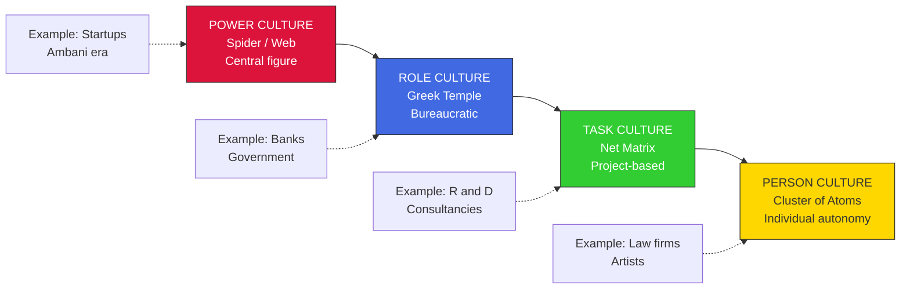
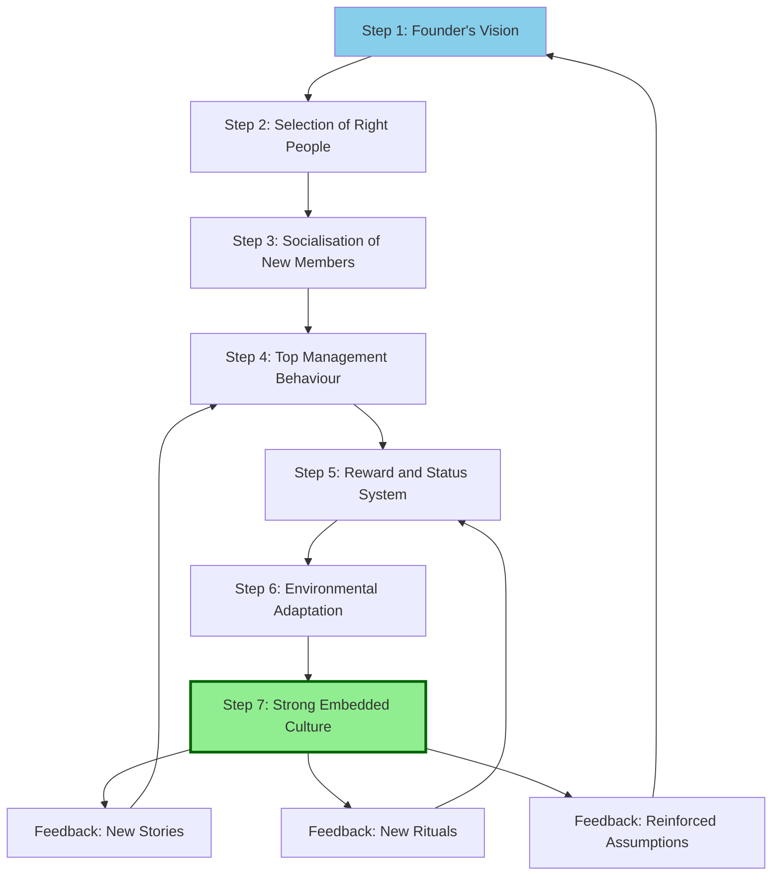
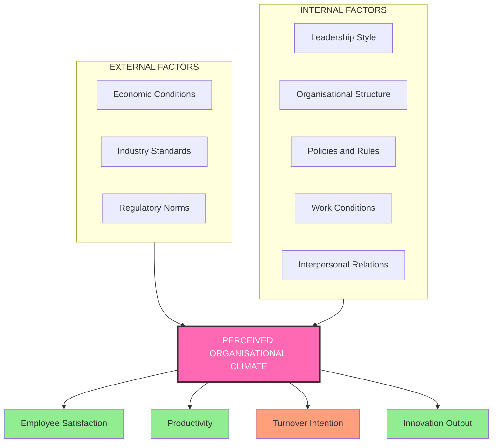
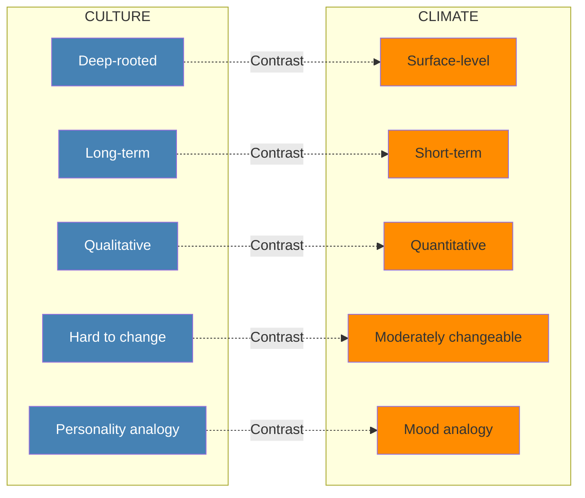

# Organizational Culture and Climate

<!-- SECTION_1_START -->
# Organizational Culture and Climate

> [!IMPORTANT]
> **KTU 2024 Scheme | UEHUT803 | Module 2 – Group Dynamics and Leadership**
> This note maps to **CO1 (Understand)** and **CO2 (Apply)** of the UEHUT803 syllabus and prepares you for direct 3-mark definitions and 7/14-mark analytical questions frequently asked from this topic.

---

## 1.1 Formal Definition (KTU Syllabus Terminology)

**Organizational Culture** is the system of shared assumptions, values, beliefs, norms, and artefacts that govern the way members of an organisation behave and interact with each other and with external stakeholders. It is the *invisible operating system* that defines *"the way we do things around here"*.

**Organizational Climate** is the recurring patterns of behaviour, attitudes, and feelings that characterise life in an organisation. It is the *perceived snapshot* of the internal environment by its members at a given point in time — i.e., *"how it feels to work here"*.

> [!NOTE]
> **Key Insight for Board Exams**
> Culture is **deep, stable, and slow-changing** (the ocean). Climate is **shallow, surface-level, and quick to shift** (the weather). Confusing these two is a guaranteed 2-mark loss in KTU valuation.

---

## 1.2 Intuitive Analogy

Imagine an **organisation as a person**:

- The **culture** is the *personality* — formed over years from childhood experiences, family values, and deep beliefs. It does not change overnight.
- The **climate** is the *mood* of that person today — happy, tense, relaxed, anxious. It can change by the evening based on events.

For example, in a company like **Infosys**, the *culture* emphasises learning, integrity, and meritocracy. But during a quarterly review week, the *climate* may feel stressful and tense — the culture is still the same.

---

## 1.3 Core Building Blocks of Culture (Schein's Tri-Level Model)

> [!IMPORTANT]
> **Edgar Schein's 3 Levels of Culture** — a guaranteed KTU 7/14-mark question. Memorise this.

| Level | Name | Description | Visibility | Example |
|-------|------|-------------|------------|---------|
| 1 | **Artefacts** | Visible structures, dress code, logos, office layout, rituals, language | Highly Visible | Open-office layout, dress code, mission statement poster |
| 2 | **Espoused Values** | Stated strategies, goals, philosophies, ideologies | Partially Visible | "Customer First" slogan, written policies |
| 3 | **Basic Assumptions** | Unconscious, taken-for-granted beliefs, perceptions, thoughts | Invisible | "We must work late to be loyal" |

---

## 1.4 Key Terminology (Bolded Constants & Metrics)

- **7 Characteristics of Culture** (Robbins framework): Innovation, Attention to Detail, Outcome Orientation, People Orientation, Team Orientation, Aggressiveness, Stability.
- **4 Types of Culture** (Cameron & Quinn Competing Values Framework): **Clan, Adhocracy, Market, Hierarchy**.
- **6 Dimensions of Climate** (Litwin & Stringer): Structure, Responsibility, Reward, Warmth, Support, Conflict.

> [!VISUALIZATION CONTROL]
> **Concept:** Schein's 3-Level Culture Pyramid
> **GeoGebra / Desmos Input Equations (as points on a y-axis):**
> * `P1 = (0, 1)` labelled ARTEFACTS
> * `P2 = (0, 2)` labelled ESPOUSED VALUES
> * `P3 = (0, 3)` labelled BASIC ASSUMPTIONS
> **Visual Description:** An iceberg floating in water. The visible tip above water = Artefacts. The waterline = Espoused Values. The massive hidden base below water = Basic Assumptions. The deeper the level, the harder to observe and the harder to change.

<!-- SECTION_1_END -->

<!-- SECTION_2_START -->
# Deep Theoretical Analysis & KTU High-Yield Formula Sheet

## 2.1 Functions of Organizational Culture

A strong culture performs the following **6 critical functions** (High-yield for KTU 7-mark sub-questions):

1. **Boundary Definition** – Distinguishes one organisation from another.
2. **Sense of Identity** – Provides members a feeling of *"we belong here"*.
3. **Commitment Engine** – Generates commitment to organisational purpose beyond financial incentives.
4. **Stability & Social Glue** – Acts as social glue binding members together.
5. **Sense-Making Device** – Helps employees make sense of organisational events.
6. **Behaviour Shaping** – Shapes behaviour by setting unwritten standards of conduct.

---

## 2.2 Types of Organizational Culture (Charles Handy's Model)

> [!IMPORTANT]
> **Handy's 4 Cultural Types** — frequently asked as a 7-mark *"Explain with examples"* question in KTU ESE.

$$\text{Culture Type} = f(\text{Power Source}, \text{Structure}, \text{Values}, \text{Communication Pattern})$$

| Type | Symbol | Core Idea | Best Suited For | Example |
|------|--------|-----------|-----------------|---------|
| **Power Culture** | Web / Spider | Control radiates from a central power figure | Small entrepreneurial firms, startups | Reliance under Dhirubhai Ambani |
| **Role Culture** | Greek Temple | Bureaucratic, rule-driven, role-focused | Large government, banks | Indian Railways, LIC |
| **Task Culture** | Net / Matrix | Project-based, problem-solving, expert power | R\&D firms, consultancies, ad agencies | McKinsey, advertising agencies |
| **Person Culture** | Cluster of atoms | Individual autonomy over the organisation | Partnerships, art houses, law firms | Law firms, artist studios |

---

## 2.3 Cameron & Quinn's Competing Values Framework

The most cited 2$\times$2 typology in KTU textbooks:

```
          FLEXIBILITY & DISCRETION
                    ^
                    |
        CLAN        |      ADHOCRACY
   (Friendly /      |   (Creative /
    Family)         |    Dynamic)
                    |
   <-------------- STUDIO ---------------> 
                    |
        HIERARCHY   |      MARKET
   (Structured /    |   (Results /
    Controlled)     |    Competitive)
                    |
                    v
          STABILITY & CONTROL
```

- **Clan Culture** → Family-like, mentoring, loyalty.
- **Adhocracy Culture** → Innovation, risk-taking, dynamism (e.g., Google, Tesla).
- **Market Culture** → Results-oriented, competition-driven (e.g., Amazon).
- **Hierarchy Culture** → Process-oriented, formal, structured (e.g., ISRO, Defence).

---

## 2.4 Dimensions of Organizational Climate (Litwin & Stringer)

> [!NOTE]
> **The 6 Climate Dimensions** — a recurring 3-mark direct question.

1. **Structure** – Degree of clarity in rules, policies, chain of command.
2. **Responsibility** – Feeling of being one's own boss.
3. **Reward** – Perception that good work is recognised.
4. **Warmth** – Feeling of general friendliness.
5. **Support** – Help received from managers and peers.
6. **Conflict** – Openness to disagree and debate ideas.

---

## 2.5 Culture vs. Climate – KTU High-Yield Distinction Table

| Parameter | Organizational Culture | Organizational Climate |
|-----------|------------------------|------------------------|
| **Depth** | Deep-rooted, unconscious | Surface-level, conscious |
| **Nature** | Abstract, qualitative | Tangible, measurable |
| **Time Horizon** | Long-term, stable | Short-term, fluctuating |
| **Origin** | Founder's values, history | Leadership style, policies |
| **Changeability** | Difficult to change | Relatively easy to change |
| **Measurement** | Through artefacts & rituals (qualitative) | Through surveys (quantitative) |
| **Analogy** | Personality of a person | Mood of a person |
| **KTU Frequency** | Often asked with 7 marks | Often asked as 3-mark definition |

---

## 2.6 Real-World Engineering & Industry Utility

- **Tech Industry (Google, Apple):** Adhocracy culture drives innovation; HR recruits for "culture fit" to maintain it.
- **Public Sector (ISRO, BHEL):** Hierarchy culture ensures safety, compliance, and standardised operations.
- **Startups (Zerodha, Freshworks):** Clan culture is deliberately nurtured in the first 100 days.
- **Consulting (TCS, Accenture):** Task culture dominates because projects are temporary and expert-driven.
- Climate surveys are now legally required in many jurisdictions for **employee well-being audits** (e.g., Mental Health Acts).

---

## 2.7 KTU High-Yield Formula / Concept Sheet

| Concept | Key Formula / Expression | Application |
|---------|--------------------------|-------------|
| Culture Formation | $\text{Culture} = f(\text{Founder's Vision}, \text{Early Experiences}, \text{Environment})$ | Used to analyse start-ups |
| Cultural Transmission | $\text{New Member} \xrightarrow{\text{Socialisation}} \text{Internalised Culture}$ | Used in induction training |
| Culture Strength | $\text{Strength} = g(\text{Shared Intensity}, \text{Agreement})$ | High strength = high performance (with right culture) |
| Climate Score | $\text{Climate} = \sum_{i=1}^{6} w_i \cdot d_i$ where $d_i$ is dimension score | Used in Likert-scale surveys |
| Schein's Levels | $\text{Culture} = \{\text{Artefacts}, \text{Espoused Values}, \text{Basic Assumptions}\}$ | Used in 14-mark essay answers |
| Handy's Model | 4 types: Power, Role, Task, Person | Used in case studies |
| Cameron-Quinn | 2$\times$2 matrix with Clan, Adhocracy, Market, Hierarchy | Used in 7-mark comparison answers |

> [!TIP]
> **Remember:** KTU examiners award **1 extra mark** if you can *link any concept to an Indian company* (e.g., TCS for task culture, Indian Oil for hierarchy culture).

<!-- SECTION_2_END -->

<!-- SECTION_3_START -->
# Step-by-Step Derivations, Frameworks & Comparative Analysis

## 3.1 Step-by-Step Framework: How Culture is Created and Sustained

> [!IMPORTANT]
> **KTU 14-Mark Favourite:** *"Explain the process of organizational culture formation with examples."*

### Step 1 – Founder's Philosophy
A single founder or small founding group implants the initial ideology.

$$\text{Initial Culture} = \text{Founder's Values} + \text{Vision} + \text{Early Crisis Response}$$

**Example:** Narayana Murthy's emphasis on integrity and merit at Infosys in 1981 still defines the firm 40+ years later.

### Step 2 – Selection Process
Recruiters filter candidates who *fit* the values already established.

$$\text{Hire} \iff \text{Candidate's Values} \approx \text{Organisational Core Values}$$

### Step 3 – Socialisation (Onboarding)
Newcomers are taught the ropes through:
- **Pre-arrival stage** – Realistic job previews, offer letters.
- **Encounter stage** – First-day orientation, buddy systems.
- **Change & Acquisition stage** – Mentorship, role clarity.

### Step 4 – Top Management Behaviour
Leaders *"walk the talk"*. They model desired behaviours. Visible actions create artefacts.

$$\text{Leader's Visible Action} \xrightarrow{\text{modelling}} \text{Artefact in Culture}$$

### Step 5 – Reward & Status System
Stories, rewards, ceremonies reinforce what matters.

$$\text{Behaviour} \xrightarrow{\text{reward}} \text{Reinforcement} \xrightarrow{\text{cycle}} \text{Strong Culture}$$

### Step 6 – Adaptation to Environment
Successful responses to external threats become embedded as values.

$$\text{Crisis} \rightarrow \text{Successful Response} \rightarrow \text{Myth / Story} \rightarrow \text{Assumption}$$

> [!NOTE]
> Every step above carries **2 marks each** in a 14-mark structured answer. Skipping Step 4 or 5 is the most common reason students lose marks.

---

## 3.2 Step-by-Step Framework: Assessing Organizational Climate

> [!NOTE]
> **KTU 14-Mark Favourite:** *"Discuss the determinants and dimensions of organisational climate."*

### Step 1 – Identify the 6 Dimensions (Litwin & Stringer)

$$\text{Climate} = \{\text{Structure}, \text{Responsibility}, \text{Reward}, \text{Warmth}, \text{Support}, \text{Conflict}\}$$

### Step 2 – Map Determinants (5 sources)

| Determinant | Description |
|-------------|-------------|
| **Organisational Structure** | Tall vs. flat, centralisation |
| **Leadership Style** | Autocratic vs. democratic |
| **Policies & Rules** | Rigid vs. flexible |
| **Working Conditions** | Physical environment, ergonomics |
| **Interpersonal Relations** | Trust, openness, communication |

### Step 3 – Conduct Climate Survey

A 5-point Likert scale (1 = Strongly Disagree, 5 = Strongly Agree) is used:

$$\text{Climate Index (CI)} = \frac{\sum_{i=1}^{n} (w_i \cdot d_i)}{n \cdot 5} \times 100$$

Where $w_i$ is weight of dimension $i$ and $d_i$ is average dimension score.

### Step 4 – Interpretation Benchmarks

| CI Range | Climate Health |
|----------|----------------|
| $0 - 40\%$ | Toxic climate — immediate intervention required |
| $40 - 70\%$ | Neutral climate — improvement possible |
| $70 - 100\%$ | Healthy climate — sustained engagement |

### Step 5 – Action Mapping
For each weak dimension, design a specific HR intervention:
- Weak *Structure* → Re-design org chart.
- Weak *Reward* → Implement recognition programmes.
- Weak *Support* → Train managers in empathy.

---

## 3.3 Tabular Comparative Analysis: Culture vs. Climate vs. Ethics vs. Engagement

> [!IMPORTANT]
> **This is the master 14-mark comparison table** the KTU Board expects for *"Compare and contrast…"* questions.

| Dimension | Culture | Climate | Ethics | Engagement |
|-----------|---------|---------|--------|------------|
| **Definition** | Shared assumptions & values | Perceived atmosphere | Moral principles guiding conduct | Emotional commitment to organisation |
| **Scope** | Organisation-wide | Department/unit-wide | Individual + organisational | Individual + team |
| **Time to Develop** | Years to decades | Weeks to months | Lifetime to years | Months to years |
| **Measurability** | Qualitative | Quantitative (surveys) | Mixed | Quantitative (eNPS) |
| **Changeability** | Very hard | Moderate | Hard | Moderate |
| **Governing Tool** | Stories, rituals, artefacts | Surveys, Gemba walks | Code of conduct, whistle-blower policy | Rewards, recognition, growth |
| **KTU Real-World Link** | Infosys founder's values | Wipro's "Spirit of Wipro" survey | Tata Code of Conduct | Gallup Q12 engagement survey |
| **Regulatory Link** | Companies Act 2013 CSR | Industrial Employment Act | SEBI Listing Regulations | ISO 45003 Psychological Safety |

---

## 3.4 Worked Example: Diagnosing Culture in an Engineering Company

**Scenario (commonly asked):** *"BetaTech Engineering is a 25-year-old firm with a strong rule-book but employees feel voiceless and demotivated. Diagnose."*

### Step 1 – Identify Culture Type
Bureaucratic policies + rigid hierarchy = **Role Culture (Handy)** or **Hierarchy Culture (Cameron-Quinn)**.

### Step 2 – Identify Climate Health
Voiceless + demotivated = **Toxic climate**, low scores on Warmth, Support, Responsibility.

### Step 3 – Diagnose Root Cause
$$\text{Problem} = \text{Culture}_{\text{Role-heavy}} \cap \text{Climate}_{\text{Toxic}}$$
Misfit between deep culture (control) and modern workforce expectations (autonomy).

### Step 4 – Prescribe Solution
- Introduce **Clan elements** — mentoring, team lunches.
- Introduce **Adhocracy elements** — innovation challenges, idea portals.
- Conduct **quarterly climate surveys** to track progress.

> [!WARNING]
> **Valuation Pitfall:** Many students *only* identify the culture and forget the climate. A 14-mark answer that misses either dimension loses **3-4 marks** outright.

<!-- SECTION_3_END -->

<!-- SECTION_4_START -->
# Structural Diagrams & Schematics

## 4.1 Mermaid Flowchart: Schein's 3-Level Culture Model

```mermaid
graph TD
    A[Visible Level 1: ARTEFACTS] --> B[Visible Level 2: ESPOUSED VALUES]
    B --> C[Invisible Level 3: BASIC UNDERLYING ASSUMPTIONS]
    
    A1[Office layout, logos, dress code, language, rituals] -.-> A
    B1[Stated strategies, goals, mission, vision, philosophies] -.-> B
    C1[Unconscious beliefs, taken-for-granted truths] -.-> C
    
    A --> D[Easy to observe, hard to interpret]
    B --> E[Stated officially, may not be practised]
    C --> F[Hardest to observe, drives real behaviour]
    
    style A fill:#FFD700,stroke:#333,stroke-width:2px
    style B fill:#FFA500,stroke:#333,stroke-width:2px
    style C fill:#FF6347,stroke:#333,stroke-width:2px,color:#fff
```



## 4.2 Mermaid Block Diagram: Handy's 4 Cultural Types



## 4.3 Mermaid Sequential Diagram: Culture Creation & Sustenance Process



## 4.4 Mermaid Block Architecture: Climate Determinants Flow



## 4.5 Mermaid Comparison Topology: Culture vs. Climate Matrix



> [!NOTE]
> **Reading Guide for Diagrams:**
> - **Schein's diagram** (4.1) is colour-graded by visibility — Gold (visible) $\rightarrow$ Orange (semi-visible) $\rightarrow$ Red (invisible).
> - **Handy's diagram** (4.2) shows evolution from centralised control to individual freedom.
> - **Sequential diagram** (4.3) is cyclic — strong cultures create more stories and rituals, which reinforce the culture.
> - **Climate determinants** (4.4) shows that climate is a *product*, not a *cause* — change the inputs to change the output.
> - **Comparison topology** (4.5) uses contrasting arrows to drive home the dual nature of these concepts.

<!-- SECTION_4_END -->

<!-- SECTION_5_START -->
# KTU 2024 Scheme Examination Question Bank & Topic Recap

---

## PART A — 3 Mark Questions (Remember / Understand)

### Question 1
**[KTU University Exam – July 2023]** *(CO1, Remember)*

> Define **Organizational Climate**. Mention any **two** of its determinants.

**Model Answer (3 Marks):**
Organizational Climate refers to the **overall atmosphere** or **perceived environment** prevailing in an organisation, as experienced by its members at a particular time. It is the *recurring pattern of attitudes, feelings and behaviours* that characterises organisational life.

**Any two determinants:**
1. **Leadership Style** of the immediate manager (2 marks)
2. **Organisational Structure** — tall hierarchies create rigid climates; flat structures create open climates. (1 mark)

> [!WARNING]
> **Pitfall:** Many students write "temperature of the office" — KTU examiners deduct 1 mark for such oversimplification. Use terms like *"perceived environment"* and *"shared perception"*.

---

### Question 2
**[KTU University Exam – Dec 2023]** *(CO1, Understand)*

> Differentiate between **Espoused Values** and **Basic Assumptions** in Schein's model of organisational culture.

**Model Answer (3 Marks):**
- **Espoused Values** (Level 2) are the *stated, conscious* strategies, goals, and philosophies officially declared by the organisation. Example: A company's mission statement saying "We value innovation". (1.5 marks)
- **Basic Assumptions** (Level 3) are the *unconscious, taken-for-granted* beliefs that are rarely discussed but deeply influence behaviour. Example: An unspoken belief that "if you leave before the boss, you are not committed". (1.5 marks)

> [!WARNING]
> **Pitfall:** Do not confuse Espoused Values with Artefacts. Artefacts are *visible* (dress code, logo); Espoused Values are *verbalised* (mission, vision).

---

## PART B — 14 Mark Questions (Internal Choice)

### Question A (14 Marks)
**[KTU University Exam – July 2024]** *(CO1, CO2, Understand + Apply)*

> **a)** Explain **Schein's three levels of organisational culture** with suitable examples. *(7 Marks, Understand)*
>
> **b)** Using the **Cameron-Quinn Competing Values Framework**, classify the cultures of **Tata Consultancy Services (TCS)** and **Google India**. *(7 Marks, Apply)*

---

#### Model Solution to (a) — 7 Marks

**Schein's 3 Levels of Culture (Edgar Schein, 1985):**

**Level 1 – Artefacts (2 Marks)**
The most visible and surface-level layer. Includes the built environment, dress code, language, rituals, ceremonies, and physical layout.
*Example:* The Indian Railways' uniform, the ringing bell at the Bengaluru office of Infosys, the campus layout of Infosys Mysore.

**Level 2 – Espoused Values (2 Marks)**
These are the *stated* ideologies, strategies, goals, and philosophies. They justify the artefacts.
*Example:* Infosys's stated value *"Powered by intellect, driven by values"*. TCS's stated commitment to *"Experience Certainty"*.

**Level 3 – Basic Underlying Assumptions (3 Marks)**
The deepest, invisible, unconscious layer. These are beliefs so ingrained they are rarely discussed. They drive real behaviour.
*Example:* At Infosys — *"Discipline and learning are non-negotiable"*. At an MSME family-run firm — *"The owner's word is final"*.

**Valuation Key:**
- [Naming all 3 levels: 1 Mark]
- [Describing artefacts with example: 2 Marks]
- [Describing espoused values with example: 2 Marks]
- [Describing basic assumptions with example: 2 Marks]

---

#### Model Solution to (b) — 7 Marks

**Cameron-Quinn Competing Values Matrix (2$\times$2) — Applied to TCS and Google India:**

**Step 1: Define the matrix (1 Mark)**
The framework has two axes — *Internal Focus & Flexibility* (people-oriented) vs. *External Focus & Stability* (control-oriented).

**Step 2: Diagnose TCS (3 Marks)**
- **TCS Culture Type: Hierarchy (with Market overlays)**
- **Evidence:** TCS has highly structured processes (CMMI Level 5), formal project management methodologies, and a strong training infrastructure (TCS iON). It is process-driven, formal, and rule-based.
- **Justification:** TCS handles large BPO and IT outsourcing contracts requiring standardisation. The focus is on *consistency, control, and predictability* — hallmarks of Hierarchy culture.

**Step 3: Diagnose Google India (3 Marks)**
- **Google India Culture Type: Adhocracy (with Clan overlays)**
- **Evidence:** Free food, open workspaces, "20% time" for personal projects, open Q\&A sessions with leadership ("TGIF"), innovation culture visible in products like Google Pay and Google Maps India innovations.
- **Justification:** Google's stated mission *"to organise the world's information and make it universally accessible and useful"* demands creativity, risk-taking, and dynamism — hallmarks of Adhocracy culture.

**Valuation Key:**
- [Correct identification of TCS as Hierarchy: 1 Mark]
- [Evidence for TCS: 2 Marks]
- [Correct identification of Google as Adhocracy: 1 Mark]
- [Evidence for Google: 2 Marks]
- [Comparison conclusion: 1 Mark]

> [!WARNING]
> **Pitfall:** Do **not** classify TCS as a "Power culture" (Handy's framework) — the question asks for **Cameron-Quinn**. Mixing frameworks is a 1-mark deduction. Also avoid generic statements like "Google is innovative" without a *specific Indian example* (Google Pay, Google Station).

---

### Question B (14 Marks) — Alternative Choice
**[KTU University Exam – Dec 2022, Re-peated Pattern]** *(CO2, Apply + Analyse)*

> **a)** Explain **Handy's four types of organisational culture** with Indian examples. *(7 Marks, Understand)*
>
> **b)** *"Healthy organisational climate is the single biggest predictor of employee engagement in Indian IT firms."* Critically analyse this statement using the **Litwin-Stringer climate model**. *(7 Marks, Analyse)*

---

#### Model Solution to (a) — 7 Marks

**Handy's 4 Cultural Types:**

**1. Power Culture (1.5 Marks)**
Centralised control, decisions radiate from a single charismatic leader. Resembles a *spider's web*.
*Indian Example:* Reliance Industries under Dhirubhai Ambani; even today, key decisions flow through the founder-family core. Startups like Zerodha also exhibit traces of power culture in early stages.

**2. Role Culture (1.5 Marks)**
Bureaucratic, rule-driven, defined roles. Resembles a *Greek temple* with strong pillars (functions) supporting a roof (the organisation).
*Indian Example:* Life Insurance Corporation of India (LIC), Indian Railways, State Bank of India. These rely on procedures, manuals, and job descriptions.

**3. Task Culture (2 Marks)**
Project-based, expert-driven, flexible. Resembles a *net* where authority shifts to whoever has the expertise.
*Indian Example:* Tata Consultancy Services' project teams, McKinsey India, advertising agencies like Ogilvy. The matrix structure in IT firms exemplifies task culture.

**4. Person Culture (2 Marks)**
Individual autonomy dominates; the organisation exists to serve the individual. Resembles a *cluster of atoms*.
*Indian Example:* Law firms like AZB \& Partners, creative studios, or doctor-owned specialty clinics. Rare in India but visible in consulting and creative industries.

**Valuation Key:**
- [Naming all 4 types: 1 Mark]
- [1.5 marks for each type with example = 6 Marks]

---

#### Model Solution to (b) — 7 Marks

**Analysis of the Statement using Litwin-Stringer Climate Model:**

**Step 1: State the framework (1 Mark)**
The Litwin-Stringer model (1968) measures organisational climate using 6 dimensions: Structure, Responsibility, Reward, Warmth, Support, and Conflict-tolerance.

**Step 2: Build the case FOR the statement (3 Marks)**

- **Structure:** Clear reporting in IT firms (project manager $\rightarrow$ delivery head) reduces ambiguity, increasing engagement. (1 Mark)
- **Reward:** Performance bonuses, spot awards, and ESOPs (e.g., Infosys ESPP) directly fuel engagement. (1 Mark)
- **Support:** Mentorship programmes and well-being initiatives (e.g., Wipro's "Spirit of Wipro" surveys) boost engagement scores. (1 Mark)

**Step 3: Build the case AGAINST the statement (2 Marks)**

- Engagement is also driven by **salary parity, career growth, and skill development** — factors outside the climate model.
- The statement is **over-simplistic**; culture (especially Adhocracy in product firms) may override climate in driving innovation-based engagement.

**Step 4: Conclusion (1 Mark)**
The statement is **partially true** — climate is a *necessary but not sufficient* condition. Climate creates the *enabling environment*, but engagement also needs compensation, growth, and meaningful work.

**Valuation Key:**
- [Stating the 6 dimensions: 1 Mark]
- [At least 3 dimensions applied to IT: 3 Marks]
- [Counter-arguments: 2 Marks]
- [Balanced conclusion: 1 Mark]

> [!WARNING]
> **Pitfall:** A common mistake is writing a one-sided answer that *fully supports* or *fully rejects* the statement. KTU examiners expect a **balanced critical analysis** with both sides. One-sided answers cap at **5 marks**.

---

## Topic Recap & Important Things to Remember

> [!TIP]
> **High-Yield Revision Checklist — Memorise This Before KTU Exam**

### Core Definitions
- **Organizational Culture** = Shared assumptions, values, beliefs, and artefacts defining *"the way we do things around here."* (Deep, stable)
- **Organizational Climate** = Recurring pattern of behaviour and feelings defining *"how it feels to work here."* (Surface, fluctuating)
- **Socialisation** = Process by which newcomers learn organisational values and behaviours.
- **Artefacts** = Visible level of culture (dress, layout, rituals).
- **Espoused Values** = Stated values, mission, vision.
- **Basic Assumptions** = Unconscious, taken-for-granted beliefs.

### Critical Models
- **Schein's 3 Levels** = Artefacts $\rightarrow$ Espoused Values $\rightarrow$ Basic Assumptions.
- **Handy's 4 Types** = Power (spider), Role (temple), Task (net), Person (atoms).
- **Cameron-Quinn 4 Types** = Clan, Adhocracy, Market, Hierarchy (2$\times$2 matrix).
- **Litwin-Stringer 6 Dimensions** = Structure, Responsibility, Reward, Warmth, Support, Conflict.

### Cultural Transmission Path
$$\text{Founder's Vision} \rightarrow \text{Selection} \rightarrow \text{Socialisation} \rightarrow \text{Leader Behaviour} \rightarrow \text{Reward System} \rightarrow \text{Strong Culture}$$

### Key Distinctions (Always Asked)
- **Culture** = Deep, long-term, hard to change, qualitative.
- **Climate** = Surface, short-term, moderately changeable, quantitative.

### Indian Examples (Use in Answers for Bonus Marks)
- **Tata Group** = Clan + Hierarchy hybrid (Tata Code of Conduct).
- **Infosys** = Role + Clan (founder-driven meritocracy).
- **Reliance** = Power Culture.
- **Google India** = Adhocracy.
- **Wipro** = Clan Culture ("Spirit of Wipro").

### Common 14-Mark Question Patterns
1. *"Explain Schein's 3 levels with examples."*
2. *"Discuss Handy's 4 cultural types with Indian examples."*
3. *"Differentiate between culture and climate."*
4. *"Analyse the determinants of organisational climate."*
5. *"Critically examine the role of founder in culture formation."*

### Formula Recap
$$\text{Climate Index (CI)} = \frac{\sum_{i=1}^{n} (w_i \cdot d_i)}{n \cdot 5} \times 100$$

### Last-Minute Power Phrases for Valued Answers
- *"Culture is the personality; climate is the mood."*
- *"Schein's iceberg — most of culture is invisible."*
- *"Handy's spider web vs. Greek temple — control vs. bureaucracy."*
- *"What gets rewarded gets repeated — this is how culture sustains itself."*

<!-- SECTION_5_END -->
