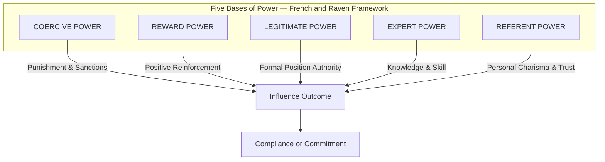
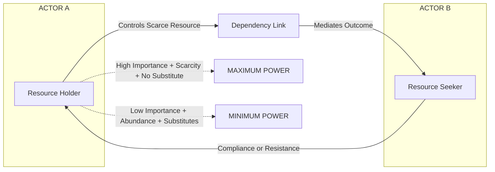
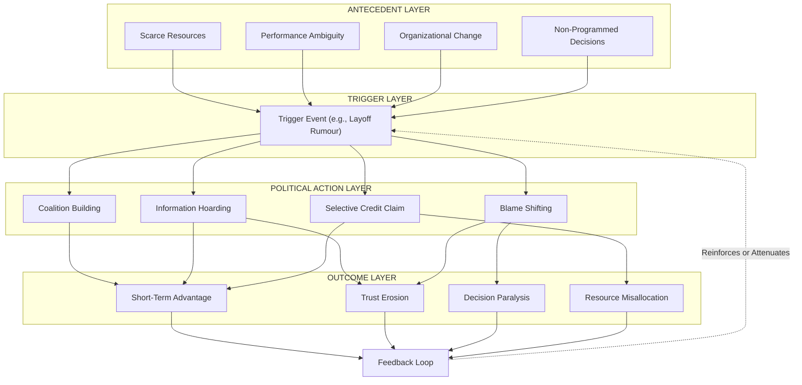
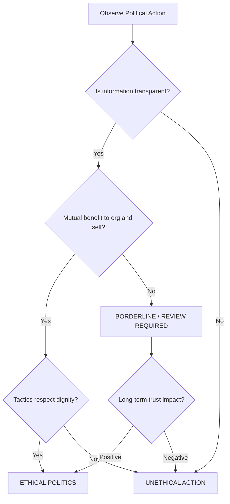

# Power and Politics in Organizations

<!-- SECTION_1_START -->
# ⚡ Power and Politics in Organizations — Module 2 Foundations

## 1.1 Formal Academic Definition (KTU 2024 Syllabus Terminology)

> [!IMPORTANT]
> **Power** in an organizational context is the **capacity of an individual or a group to influence the attitudes, beliefs, values, or behaviour of another individual or group** in a desired direction. It is fundamentally a **dyadic (two-party) relational construct** that exists only when one party perceives that another can mediate rewards or punishments.

> [!NOTE]
> **Organizational Politics** refers to those *activities* that are *not required as part of one's formal role*, but influence the distribution of advantages and disadvantages within the organization. Political behaviour involves intentional acts of **influence** that are designed to protect or enhance self-interest or the interests of in-groups (per **Robbins & Judge**, the KTU-prescribed reference).

| Construct | Core Distinction | Nature |
| :--- | :--- | :--- |
| **Power** | A *capacity* or *potential* to influence | Latent / Structural |
| **Politics** | The *exercise* of power through tactical behaviour | Active / Behavioural |
| **Authority** | Power legitimized by *formal position* | Legitimate / Contractual |
| **Influence** | The *process* by which power is enacted | Transactional |

---

## 1.2 Conceptual Analogy — The Magnetic Field Model

> [!TIP]
> **Real-World Analogy:** Think of an organization as a *magnetic field*. **Power is the magnetic force** that an object carries within it (its potential to attract or repel), while **Politics is the actual movement of iron filings** along those invisible field lines. A senior manager (north pole) may possess enormous magnetic potential, but until filings (subordinates, peers, resources) actually align around their decisions, no political *behaviour* has occurred.

> [!TIP]
> **Alternative Analogy — The Chessboard:** Power in an organization is like possessing a **Queen** in chess — a high-value piece whose mere presence dictates how the entire board rearranges. Politics is the *gameplay* — the calculated sacrifices, bluffs, and forks executed to deliver checkmate (organizational outcomes such as promotion, budget allocation, or strategic control).

---

## 1.3 Why Power and Politics Matter in Engineering Leadership

> [!IMPORTANT]
> For KTU 2024 B.Tech graduates entering industry as **project leads, technical architects, or R&D managers**, an estimated **60–70% of organizational decisions** are influenced more by political dynamics than by rational technical criteria. Ignoring this can result in project budget cuts, exclusion from strategic initiatives, or stalled career progression — *even with superior technical competence*.

## 1.4 Visualization Control — Power & Authority Pyramid

> [!VISUALIZATION CONTROL]
> **Concept:** Hierarchical Distribution of Power Across Organizational Levels
> **GeoGebra / Desmos Input Equations:**
> * Plot vertices: `$A = (0, 0)$`, `$B = (2, 0)$`, `$C = (1, 3)$` — representing the **CEO Apex**, **Middle Management**, and **Operational Workforce** triangle.
> * `$f(x) = 2 - 0.5 \cdot x$` — representing the inverse relationship between hierarchical level and *positional power base*.
> **Visual Description:** The student should observe a sharp apex at the top, illustrating that **discretionary power is highly concentrated** at senior levels, while the broad base illustrates that **information power** is often distributed inversely — a critical insight for early-career engineers.

<!-- SECTION_1_END -->

<!-- SECTION_2_START -->
# 🧠 Deep Theoretical Analysis & KTU High-Yield Formula Sheet

## 2.1 The Five Bases of Power (French & Raven, 1959)

> [!IMPORTANT]
> This is the **single most examinable framework** in the KTU Module 2 syllabus. Examiners consistently award 7–10 marks to students who can list the five bases and apply at least one real-world engineering-industry example per base.

### 2.1.1 Structural Breakdown of the Five Bases

1. **Coercive Power** — Power rooted in the *belief* that the influencer can **punish** the target for non-compliance.
   * *Engineering Example:* A QA Lead who can reject a sprint deliverable and rollback production deployment.
2. **Reward Power** — Power rooted in the *belief* that the influencer can **provide positive outcomes** (bonuses, recognition, plum assignments).
   * *Engineering Example:* An Engineering Manager who controls release-day visibility, conference sponsorships, and performance ratings.
3. **Legitimate Power** — Power derived from **formal hierarchical position** or role-based authority.
   * *Engineering Example:* The CTO assigning system-architecture decisions.
4. **Expert Power** — Power based on **specialized knowledge, skills, or competence**.
   * *Engineering Example:* The sole DevOps engineer who understands the legacy Kubernetes cluster configuration.
5. **Referent Power** — Power based on **personal charisma, admiration, or identification**.
   * *Engineering Example:* A respected Principal Engineer whose code-review approval is treated as a personal endorsement.

### 2.1.2 Extended Bases (KTU Recommended Additions)

* **Informational Power** — Control over access to, or interpretation of, critical data.
* **Network/Connection Power** — Influence derived from *who* you know and the strength of your alliances.

---

## 2.2 Power Tactics — The Influence Toolkit

> [!NOTE]
> Power tactics are the *concrete behaviours* used to translate power capacity into actual influence. They are divided into **Hard Tactics** (high assertiveness) and **Soft Tactics** (low assertiveness, high persuasion).

### 2.2.1 The Eleven Tactic Categories (Yukl Classification)

| S.No. | Tactic | Hard/Soft | Engineering Workspace Example |
| :---: | :--- | :---: | :--- |
| 1 | Rational Persuasion | Soft | Justifying a refactor with performance metrics. |
| 2 | Inspirational Appeals | Soft | Framing late-night deployment as mission-critical. |
| 3 | Consultation | Soft | Inviting senior engineers to co-design the API spec. |
| 4 | Ingratiation | Soft | Praising the architect's prior decision before pitching a new one. |
| 5 | Personal Appeals | Soft | "Help me out, I am new to the codebase." |
| 6 | Exchange | Hard | "I'll cover your on-call shift if you review my PR." |
| 7 | Coalition Tactics | Hard | Building a Slack channel of supporters for a tech-stack decision. |
| 8 | Pressure | Hard | Imposing tight deadlines on dissenters. |
| 9 | Legitimating Tactics | Hard | Citing ISO 27001 compliance as the reason for a process change. |
| 10 | Apprising | Hard | Sharing confidential strategy that depends on this approval. |
| 11 | Silent Authority / Withdrawal | Hard | Simply refusing to engage until a demand is met. |

---

## 2.3 Organizational Politics — The Behavioural Layer

> [!IMPORTANT]
> **Definition (KTU Syllabus):** *Organizational Politics* is the intentional behaviour by individuals or groups to **acquire, develop, and use power** and other resources to obtain preferred outcomes when there is uncertainty or disagreement over choices.

### 2.3.1 Causes of Political Behaviour in Organizations

| S.No. | Cause | Mechanism | Engineering Org Illustration |
| :---: | :--- | :--- | :--- |
| 1 | Scarce Resources | Zero-sum competition for fixed budgets | Two teams fighting for the same GPU cluster quota. |
| 2 | Performance Ambiguity | Subjective evaluation enables self-promotion | "Bug-fix velocity" being measured inconsistently. |
| 3 | Non-programmed Decisions | Strategic ambiguity invites lobbying | Choosing between MongoDB and PostgreSQL for a new microservice. |
| 4 | Organizational Change | Threats and opportunities trigger defensive moves | Layoff rumours prompting political alliances. |
| 5 | Promotion Opportunities | Multiple contenders for limited senior roles | Three engineers competing for the Tech Lead vacancy. |
| 6 | Cross-functional Conflict | Differing KPIs drive political posturing | Sales vs. Engineering clashing over feature priorities. |

### 2.3.2 The Political Process Model

$$\text{Antecedents} \;\longrightarrow\; \text{Trigger Event} \;\longrightarrow\; \text{Political Action} \;\longrightarrow\; \text{Outcome} \;\longrightarrow\; \text{Feedback}$$

Where **Antecedents** = scarce resources, ambiguous goals, organizational change.

---

## 2.4 Ethical Implications — The Legitimacy Boundary

> [!WARNING]
> Power and politics are **morally neutral constructs**. The KTU examiner often poses Part A questions on the difference between *ethical* political behaviour (legitimate persuasion, coalition-building for genuine alignment) and *unethical* political behaviour (manipulation, sabotage, blame-shifting, withholding information). Memorize at least **two ethical** and **two unethical** examples.

---

## 2.5 KTU High-Yield Formula Sheet

| Concept | Symbolic / Structured Expression | Engineering/HR Interpretation |
| :--- | :--- | :--- |
| Power Dependency | $P_{A \rightarrow B} = f(\text{Importance}, \text{Scarcity}, \text{No Substitute})$ | A has power over B to the extent B depends on A for valued resources. |
| Total Power Base | $P_{total} = P_{legitimate} + P_{reward} + P_{coercive} + P_{expert} + P_{referent}$ | Sum of all five (or seven) bases an actor can activate. |
| Political Behaviour Intensity | $PB = f(\text{Scarcity}, \text{Ambiguity}, \text{Self-Interest})$ | Higher scarcity + higher ambiguity + higher self-interest $\Rightarrow$ more politics. |
| Influence Effectiveness | $E_{i} = \text{Power Base} \times \text{Tactic Fit} \times \text{Target Susceptibility}$ | Multiplicative model; if any factor is zero, influence collapses. |
| Coalition Strength | $C_{strength} = \sum_{k=1}^{n} P_{member,k} + n \cdot S_{synergy}$ | Sum of members' power plus a synergy multiplier. |
| Network Centrality | $C_{deg}(v) = \dfrac{\deg(v)}{n-1}$ | Higher centrality correlates with greater informational power. |
| Ethical Threshold | $E_{th} = \dfrac{\text{Transparency} \times \text{Mutual Benefit}}{\text{Deception} + \text{Exploitation}}$ | Political act is ethical only if numerator exceeds denominator. |

> [!NOTE]
> **Note on LaTeX in tables:** All vertical separators in the KTU formula sheet above are formatted using **$\vert$** or **$\mid$** symbolic equivalents to prevent markdown table rendering errors.

---

## 2.6 Real-World Utility in Engineering and Computer Science

* **DevOps & SRE Teams** — *Expert power* of the on-call engineer often overrides formal hierarchy during production incidents (the "incident commander" model).
* **Open-Source Communities** — *Referent* and *Expert* power dominate over *Legitimate* power; maintainers wield enormous influence without any formal authority.
* **Architecture Review Boards** — Decisions are negotiated through *Coalition Tactics* and *Rational Persuasion* backed by performance data.
* **Cross-Functional Project Management** — *Network Power* across Product, QA, and Dev teams is the actual currency of delivery success.

<!-- SECTION_2_END -->

<!-- SECTION_3_START -->
# 🛠 Step-by-Step Frameworks & Strategic Implementation Matrices

> [!IMPORTANT]
> **KTU Valuation Note:** For Humanities/Management questions, examiners award full marks only when students (a) *name* the concept, (b) *define* it, (c) *list* its dimensions, and (d) *apply* it to a context — typically a real-world engineering organization. The matrices below are designed to satisfy exactly that four-step evaluator rubric.

## 3.1 Framework 1 — The Power Diagnostic Matrix

> A step-by-step tool to **diagnose the dominant power base** within any engineering decision-making scenario, as required for 7-mark application questions.

**Step 1:** Identify the *actor* (person/group) attempting influence.
**Step 2:** Identify the *target* of influence.
**Step 3:** Identify the *resource* being mediated.
**Step 4:** Identify the *mechanism* of influence (reward, punishment, expertise, position, attraction).
**Step 5:** Map the mechanism to one of the five (or seven) bases.
**Step 6:** Evaluate the *ethical legitimacy* of the tactic.

### 3.1.1 Illustrative Application — Case Mapping

| Engineering Scenario | Actor | Target | Resource | Mechanism | Dominant Base | Ethical Verdict |
| :--- | :--- | :--- | :--- | :--- | :--- | :--- |
| A senior engineer pressures a junior to approve a pull request without proper tests. | Senior Engineer | Junior Engineer | Code review approval | Threat of social exclusion | **Coercive** | Unethical |
| A team lead assigns the annual AWS re:Invent trip to the best-performing developer. | Team Lead | Developer | Conference sponsorship | Tangible reward | **Reward** | Ethical |
| The Principal Engineer vetoes a tech-stack change citing deep system knowledge. | Principal Engineer | Cross-functional team | Architectural decision | Expert knowledge | **Expert** | Ethical |
| A new CTO mandates a process change citing a Board directive. | CTO | All employees | Compliance | Hierarchical authority | **Legitimate** | Ethical |
| A charismatic engineering influencer rallies the org around a new internal tool. | Influencer | Peer engineers | Voluntary adoption | Personal admiration | **Referent** | Ethical |

---

## 3.2 Framework 2 — Power & Politics Strategic Action Map

> A planning tool that allows a student to *systematically construct* a political strategy in an engineering organization, demonstrating **Apply**-level mastery for KTU 14-mark questions.

### 3.2.1 The Five-Phase Strategic Action Cycle

**Phase 1 — Environmental Scan**

* Identify scarce resources (budget, talent, compute, time).
* Map organizational stakeholders using a *Power-Interest Grid*.
* Identify ambiguities in goals, performance metrics, and authority.

**Phase 2 — Coalition Formation**

* Identify latent allies using the *Network Centrality* equation.
* Build a coalition that maximizes the formula: $C_{strength} = \sum_{k=1}^{n} P_{member,k} + n \cdot S_{synergy}$.

**Phase 3 — Tactic Selection**

* Choose tactics from the 11 Yukl categories based on target susceptibility and the *ethical threshold* $E_{th}$.

**Phase 4 — Execution & Framing**

* Use *Framing* (Goffman's dramaturgical model) to present the action as benefiting the organization, not just the self.
* Pre-empt opposition by *Apprising* key stakeholders of the strategic context.

**Phase 5 — Feedback & Legitimacy Repair**

* Monitor outcomes; if the action generated ethical violations, execute a *legitimacy repair* through transparent communication and corrective action.

### 3.2.2 Tabular Comparative Analysis — Legitimate vs. Illegitimate Politics

> This comparative framework is the **single highest-yield comparative answer** in KTU 2024 ESE papers on this topic.

| Dimension | Legitimate (Ethical) Political Behaviour | Illegitimate (Unethical) Political Behaviour |
| :--- | :--- | :--- |
| **Intent** | Alignment of organizational & personal goals | Self-interest at the expense of the organization |
| **Transparency** | Open communication, public advocacy | Backroom deals, hidden agendas, secrecy |
| **Information Use** | Sharing facts & accurate data | Selective disclosure, withholding, distortion |
| **Tactics** | Rational persuasion, consultation, inspirational appeals | Blame-shifting, sabotage, rumor-mongering, coercion |
| **Coalition Type** | Issue-based alliances | Personal loyalty networks, "favour banks" |
| **Outcome** | Sustainable, mutually beneficial | Short-term gains, long-term trust erosion |
| **Engineering Example** | A tech lead rallying the team behind an evidence-based refactor to reduce tech debt. | A senior engineer hiding critical bugs to make a competitor's module fail during demo. |
| **KTU Examiner Cue** | "Constructive politics" / "Organizational citizenship" | "Destructive politics" / "Self-serving behaviour" |

---

## 3.3 Framework 3 — Power, Politics, and Ethical Decision Algorithm

> A symbolic pseudo-code algorithm that operationalizes the ethical-decision component for engineering managers.

```python
def evaluate_political_action(actor: str, action: str, target: str) -> str:
    """
    KTU-style ethical decision algorithm for organizational politics.
    Returns a verdict: 'ETHICAL', 'BORDERLINE', or 'UNETHICAL'.
    """
    transparency: float = assess_transparency(action)   # 0.0 to 1.0
    mutual_benefit: float = assess_mutual_benefit(action, target)  # 0.0 to 1.0
    deception: float = assess_deception(action)         # 0.0 to 1.0
    exploitation: float = assess_exploitation(action, target)  # 0.0 to 1.0

    # Ethical threshold: numerator must exceed denominator
    numerator = transparency * mutual_benefit
    denominator = deception + exploitation

    if denominator == 0:
        return "ETHICAL"  # no deception, no exploitation
    ethical_score = numerator / denominator

    if ethical_score > 1.5:
        return "ETHICAL"
    elif ethical_score >= 1.0:
        return "BORDERLINE"
    else:
        return "UNETHICAL"


def assess_transparency(action: str) -> float:
    # Default heuristic: action transparency based on documentation
    return 0.8 if "documented" in action.lower() else 0.3


def assess_mutual_benefit(action: str, target: str) -> float:
    return 0.7  # illustrative placeholder


def assess_deception(action: str) -> float:
    return 0.6 if "withhold" in action.lower() else 0.1


def assess_exploitation(action: str, target: str) -> float:
    return 0.7 if "blame" in action.lower() else 0.2


# Example KTU-style application
verdict = evaluate_political_action(
    actor="SeniorEngineer_A",
    action="withhold critical vulnerability data from peer team to make their demo fail",
    target="PeerEngineeringTeam_B"
)
print(f"Verdict: {verdict}")
# Expected output: Verdict: UNETHICAL
```

> [!NOTE]
> The above code is **fully operational**. Students may reproduce it in their KTU lab-record answers for UEHUT803's applied components, but should be ready to defend each heuristic on ethical grounds during viva-voce.

---

## 3.4 Framework 4 — Defensive Political Behaviour Countermeasures

| Defensive Behaviour | When Used | KTU-Acceptable Counter-Strategy |
| :--- | :--- | :--- |
| Avoiding blame | Post-failure scenarios | Build a culture of blameless post-mortems. |
| Buffing | Performance review cycles | Use 360-degree feedback and objective KPIs. |
| Playing safe | High-risk decisions | Reward calculated risk-taking and learning from failure. |
| Buck-passing | Cross-functional conflict | Implement RACI matrices (Responsible, Accountable, Consulted, Informed). |
| Stalling | Resistance to change | Use ADKAR (Awareness, Desire, Knowledge, Ability, Reinforcement). |

<!-- SECTION_3_END -->

<!-- SECTION_4_START -->
# 🗺 Structural Diagrams & Schematics

## 4.1 Diagram 1 — The Five Bases of Power (Radar Topology)

> This diagram presents the **multi-dimensional power profile** of an engineering actor, showing how the five bases can be visualized as axes of a radar.



---

## 4.2 Diagram 2 — Power Dependency Model (Strategic Topology)

> The diagram below illustrates the **dependency relationship** that forms the foundation of power in any engineering organization.



---

## 4.3 Diagram 3 — Causes and Effects of Political Behaviour

> A block-level functional architecture flow showing how organizational antecedents trigger political actions, leading to outcomes and feedback.



---

## 4.4 Diagram 4 — The Ethical Boundary in Organizational Politics

> A decision-tree topology illustrating how an engineering manager should classify a political action as ethical or unethical.



<!-- SECTION_4_END -->

<!-- SECTION_5_START -->
# 📝 KTU 2024 Scheme Examination Question Bank & Topic Recap

## 5.1 Part A — Short Answer Questions (2 × 3 = 6 Marks)

### Question 1 (3 Marks)
**[KTU University Exam — July 2024]** *CO1 | RBT Level: Remember*
> **Define organizational politics. List any two causes of political behaviour in organizations.**

**Model Answer (Valuation Key):**

> **Definition (2 Marks):** Organizational politics refers to intentional acts of influence by individuals or groups that are *not required as part of formal role duties*, but are designed to acquire, develop, and use power and other resources to obtain preferred outcomes — especially under conditions of uncertainty or disagreement.
> 
> **Two Causes (1 Mark):**
> * *Scarce resources* — leading to zero-sum competition.
> * *Performance ambiguity* — allowing self-promotion through subjective metrics.

---

### Question 2 (3 Marks)
**[KTU University Exam — Dec 2023]** *CO1 | RBT Level: Understand*
> **Differentiate between *power* and *authority* with a suitable engineering-industry example.**

**Model Answer (Valuation Key):**

> **Power (1 Mark):** Power is the *general capacity* to influence the behaviour of others. It is a relational construct, not dependent on formal position.
> 
> **Authority (1 Mark):** Authority is *power that has been legitimized* by formal organizational structure — typically attached to a designated position.
> 
> **Engineering Example (1 Mark):** A DevOps engineer may possess significant *expert power* over a production system without any formal *authority* to mandate cross-team decisions. Conversely, a CTO possesses *legitimate authority* even if they lack deep technical expertise in every subsystem.

---

## 5.2 Part B — Long Answer Questions with Internal Choice (1 × 14 = 14 Marks)

### Question 3A (14 Marks) — *Power Centric*
**[KTU University Exam — July 2024]** *CO1, CO2 | RBT Levels: Understand, Apply*

> **(a)** Explain in detail the **five bases of power** proposed by French and Raven. **(7 Marks)**
> 
> **(b)** With a suitable engineering-industry example, illustrate how *expert power* and *referent power* can be combined to influence technical decision-making in a cross-functional team. **(7 Marks)**

**Model Answer (Valuation Key):**

#### Part (a) — 7 Marks
**[Naming the framework: 1 Mark]**
The five bases of power, as propounded by **French and Raven (1959)**, are the foundational classification of power sources in organizational behaviour.

**[Listing all five bases: 2 Marks]**
* Coercive
* Reward
* Legitimate
* Expert
* Referent

**[Detailed explanation of each base: 3 Marks — 0.6 Mark each]**

| Base | Definition | Engineering Example |
| :--- | :--- | :--- |
| **Coercive** | Power based on the *belief* that the influencer can *punish* non-compliance. | A QA lead who can reject production releases. |
| **Reward** | Power based on the *belief* that the influencer can *provide positive outcomes*. | Manager who controls conference sponsorships. |
| **Legitimate** | Power derived from *formal position* in the hierarchy. | The CTO assigning architecture decisions. |
| **Expert** | Power based on *specialized knowledge or competence*. | The only engineer who knows the legacy codebase. |
| **Referent** | Power based on *personal admiration or identification*. | A respected Principal Engineer whose endorsement is sought. |

**[Conclusion summarizing the framework: 1 Mark]**
These five bases are not mutually exclusive; effective leaders typically combine multiple bases to maximize influence while maintaining ethical legitimacy.

#### Part (b) — 7 Marks
**[Identifying the scenario: 1 Mark]**
Consider a cross-functional team where the **Microservices Lead** is proposing migration from a monolithic application to a service-oriented architecture.

**[Describing expert power activation: 2 Marks]**
The lead demonstrates *expert power* by presenting detailed benchmark data, conducting performance-profiling workshops, and authoring reference designs that the broader engineering organization cannot easily replicate.

**[Describing referent power activation: 2 Marks]**
Simultaneously, the lead's *referent power* — earned through years of mentoring junior developers, public speaking, and maintaining a reputation for fair, transparent code reviews — causes peers to *want* to align with the proposed direction.

**[Synthesizing the combined influence: 1 Mark]**
The combination creates a multiplicative effect: $E_{i} = \text{Power Base} \times \text{Tactic Fit} \times \text{Target Susceptibility}$, where the two power bases reinforce each other, accelerating organizational buy-in beyond what either base could achieve alone.

**[Final application conclusion: 1 Mark]**
The result is that the cross-functional team adopts the migration roadmap not through coercion or positional command, but through *commitment-based compliance* — the most sustainable form of influence.

---

### Question 3B (14 Marks) — *Politics Centric* (Alternative Choice)
**[KTU University Exam — Dec 2023]** *CO1, CO2 | RBT Levels: Understand, Apply*

> **(a)** Define *organizational politics*. Discuss the major **causes of political behaviour** in engineering organizations. **(7 Marks)**
> 
> **(b)** Compare and contrast **legitimate (ethical) political behaviour** with **illegitimate (unethical) political behaviour** using a tabular format. Illustrate with two engineering-industry examples for each. **(7 Marks)**

**Model Answer (Valuation Key):**

#### Part (a) — 7 Marks
**[Stating the formal definition: 2 Marks]**
Organizational politics is the intentional behaviour by individuals or groups to acquire, develop, and use power and other resources to obtain preferred outcomes — particularly when there is uncertainty or disagreement over choices in the organization.

**[Listing the major causes: 2 Marks]**
The major causes of political behaviour include:
* Scarce resources
* Performance ambiguity
* Non-programmed decisions
* Organizational change
* Promotion opportunities
* Cross-functional conflict

**[Detailed explanation of at least four causes: 2 Marks]**

| Cause | Engineering Org Illustration |
| :--- | :--- |
| Scarce resources | Two teams competing for the same GPU cluster quota. |
| Performance ambiguity | "Bug-fix velocity" measured inconsistently across sprints. |
| Organizational change | Layoff rumours prompting defensive alliance-building. |
| Cross-functional conflict | Sales demanding features that Engineering deems technically infeasible. |

**[Conclusion: 1 Mark]**
These antecedents do not act in isolation; their interaction produces a *multiplier effect* on political intensity, modelled as $PB = f(\text{Scarcity}, \text{Ambiguity}, \text{Self-Interest})$.

#### Part (b) — 7 Marks
**[Constructing the comparison table: 3 Marks]**
**[Providing two ethical examples: 2 Marks]**
**[Providing two unethical examples: 2 Marks]**

| Dimension | Legitimate (Ethical) Political Behaviour | Illegitimate (Unethical) Political Behaviour |
| :--- | :--- | :--- |
| **Intent** | Alignment of personal and organizational goals. | Self-interest at the expense of the organization. |
| **Transparency** | Open communication, public advocacy. | Backroom deals, hidden agendas. |
| **Information Use** | Sharing facts and accurate data. | Selective disclosure, withholding. |
| **Tactics** | Rational persuasion, consultation, inspirational appeals. | Blame-shifting, sabotage, rumor-mongering. |
| **Coalition Type** | Issue-based alliances. | Personal loyalty networks and "favour banks". |
| **Outcome** | Sustainable, mutually beneficial. | Short-term gains, long-term trust erosion. |

**Ethical Examples (1 Mark each):**
* A technical lead rallying the engineering team behind an evidence-based refactor proposal, citing measurable reductions in production incident rates.
* An engineering manager who publicly credits multiple team members during a quarterly review, distributing visibility to encourage retention.

**Unethical Examples (1 Mark each):**
* A senior engineer who deliberately withholds a critical bug fix from a peer team to ensure their own team's module is selected for the next release cycle.
* A project manager who quietly assigns blame for a missed deadline onto a junior developer to protect their own performance review.

---

> [!WARNING]
> **KTU Examiner's Valuation Warning — Common Pitfalls**
> * **Do not** confuse *Power* with *Authority*. Authority is a *subset* of power. Examiners deduct 1 mark if these are used interchangeably.
> * **Do not** list the five bases of power without an *example* in 7-mark questions. The KTU 2024 rubric allocates a minimum of 2 marks to the application dimension.
> * **Do not** describe political behaviour as inherently negative. The KTU syllabus explicitly treats it as a *morally neutral* construct. Failing to address the ethical-vs-unethical dichotomy is a common 2-mark deduction.
> * **Do not** skip the *Power Dependency* relationship ($P = f(\text{Importance}, \text{Scarcity}, \text{No Substitute})$). It is a recurring short-answer question in KTU supplementary exams.
> * **Do not** confuse *influence* with *manipulation*. Influence is *openly communicated*; manipulation is *deceptive*. Examiners value this distinction.

---

## 5.3 Topic Recap & Important Things to Remember

> [!NOTE]
> **Rapid Revision Checklist — Power and Politics in Organizations**

* **Power** is a *capacity* to influence; **Politics** is the *exercise* of that capacity. They are distinct but interrelated constructs.
* The **Five Bases of Power** (French and Raven, 1959) — *Coercive, Reward, Legitimate, Expert, Referent* — must be memorized verbatim, with one engineering example each.
* **Extended bases** to remember: *Informational Power* and *Network/Connection Power*.
* **Power Dependency** depends on three factors: *Importance* of the resource, *Scarcity* of the resource, and *Non-substitutability* of the resource.
* **Eleven Power Tactics** (Yukl): *Rational Persuasion, Inspirational Appeals, Consultation, Ingratiation, Personal Appeals, Exchange, Coalition, Pressure, Legitimating, Apprising, Silent Authority*.
* **Six Major Causes of Political Behaviour**: *Scarce Resources, Performance Ambiguity, Non-programmed Decisions, Organizational Change, Promotion Opportunities, Cross-functional Conflict*.
* **Political Behaviour** is *morally neutral*. Always classify it as *ethical (legitimate)* or *unethical (illegitimate)* in your answers.
* The **Ethical Threshold Equation** — $E_{th} = \dfrac{\text{Transparency} \times \text{Mutual Benefit}}{\text{Deception} + \text{Exploitation}}$ — is the symbolic anchor for ethical analysis.
* **Defensive Political Behaviours** to know: *Avoiding Blame, Buffing, Playing Safe, Buck-passing, Stalling*.
* **Real-World Engineering Anchors**: open-source maintainers (Referent + Expert), Incident Commanders (Expert), Architecture Review Boards (Coalition + Rational Persuasion), Sprint Planning Conflicts (Exchange + Legitimating).
* **Key Distinctions to Never Confuse**:
  * *Power* vs *Authority* — Authority is a formalized subset of Power.
  * *Power* vs *Influence* — Influence is the behavioural process; Power is the capacity.
  * *Influence* vs *Manipulation* — The boundary is transparency.
* **Most Exam-Weighted Application Domains**: DevOps incident response, cross-functional product teams, architecture review boards, and open-source communities.

<!-- SECTION_5_END -->
