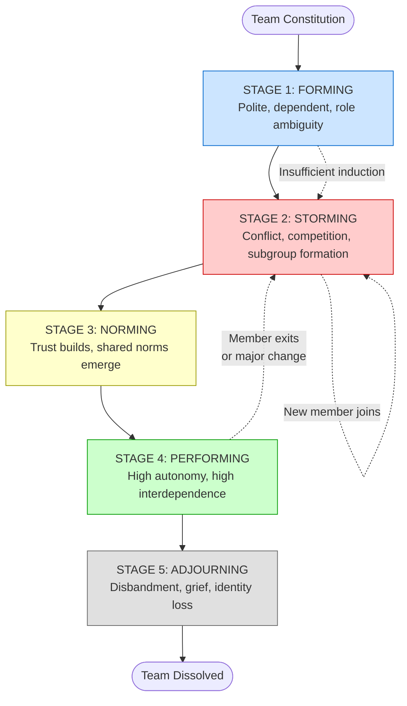
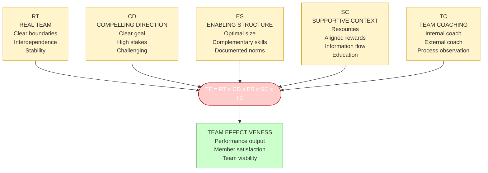
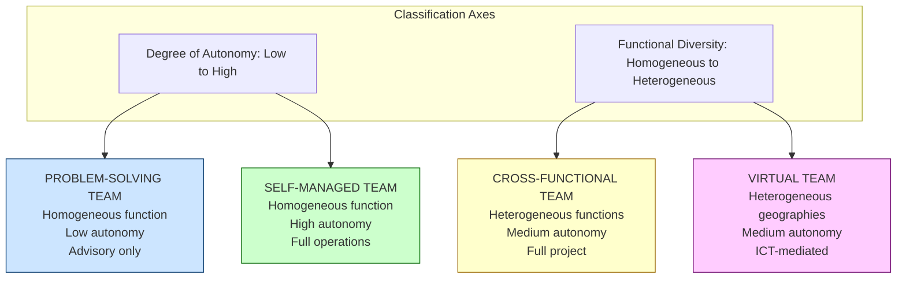
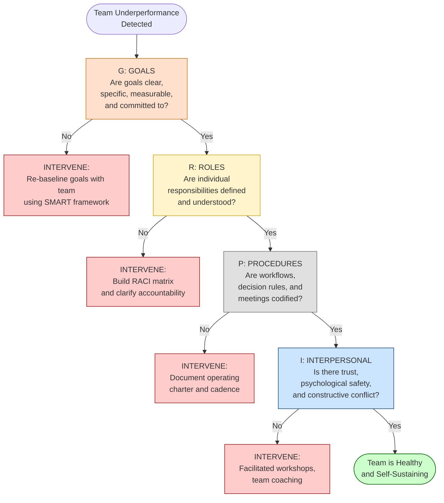

# Team Building – Types of Teams and Team Effectiveness

<!-- SECTION_1_START -->

# 1. Core Technical Definition & Intuitive Overview

## 1.1 Formal Academic Definition (KTU 2024 Scheme Terminology)

A **Team** is formally defined by **Stephen P. Robbins** as *two or more individuals who interact with each other, share common mental models, hold themselves mutually accountable for the achievement of common goals, and perceive themselves as a social entity within one or more larger social systems.*

> [!IMPORTANT]
> **KTU 2024 Board Definition (High-Yield):**
> A team is a *formal or informal group* whose members are **interdependent**, share **collective responsibility** for outcomes, and work in a **coordinated manner** to achieve a **shared objective** that no individual could achieve alone. The construct of a *team* is distinct from a *group* because of the synergy, mutual accountability, and shared mental model.

**Team Building** is a *continuous, planned, and systematic process* of designing, developing, and maintaining a team's structural, interpersonal, and task-oriented functioning to enhance its **effectiveness**, **cohesion**, and **goal-attainment capability**. It involves diagnostic assessment, intervention, and reinforcement activities targeting the team's *Task Design*, *Team Composition*, and *Group Norms*.

**Team Effectiveness** is the degree to which a team achieves its *performance goals*, satisfies the *psychological needs* of its members, and maintains its *viability* for future collaboration. It is operationalized across three dimensions: **Performance Output**, **Member Satisfaction**, and **Team Learning**.

## 1.2 Conceptual Analogy & Intuition

> [!NOTE]
> **Real-World Analogy: The Michelin-Star Kitchen Brigade**
> Imagine a professional kitchen in a high-end restaurant. A *group* of chefs in a kitchen is just people who happen to work in the same room. A *team*, however, is a *Brigade de Cuisine* — each station (saucier, pâtissier, garde manger, sous-chef) has a **defined role**, they communicate through *clear call-and-response systems* (like *"behind!"* or *"service!"*), they hold **collective responsibility** for every plate that leaves the pass, and they share the *same mental model* of what the guest experience should feel like. If one station fails, the entire brigade fails the customer. This is the essence of **team interdependence** and **shared accountability**.

### 1.2.1 The Geometric Intuition: Venn Diagram of Team Effectiveness

Think of team effectiveness as the **intersection** of three overlapping circles. The team only reaches its optimal state when all three circles *fully overlap* — partial overlap creates friction, imbalance, and underperformance.

> [!VISUALIZATION CONTROL]
> **Concept:** Three-Circle Venn Diagram of Team Effectiveness
> **GeoGebra / Desmos Input Equations:**
> * Circle 1 (centered at $(-1, 0)$): $x^2 + y^2 + 2x = 0$
> * Circle 2 (centered at $(1, 0)$): $x^2 + y^2 - 2x = 0$
> * Circle 3 (centered at $(0, 1.5)$): $x^2 + y^2 - 3y + 0.25 = 0$
> **Visual Description:** The student should observe that the **central triple-overlap region** is the *Sweet Spot of Team Effectiveness* — this is where **Task Performance**, **Member Satisfaction**, and **Team Viability** coexist. The outer two-circle intersections are *fragile states* where two dimensions align but the third is missing.

## 1.3 The "Group vs. Team" Distinction (Critical Board Question)

| Dimension | Working Group | Working Team |
| :--- | :--- | :--- |
| **Leadership** | Strong, focused | Shared / Rotational |
| **Accountability** | Individual | Individual *and* Collective |
| **Purpose** | Same as organizational goal | Its own specific team purpose |
| **Work Products** | Individual deliverables | Collective deliverables |
| **Effectiveness** | Measured by *influence on others* | Measured *directly* by *collective work products* |
| **Meetings** | Efficient, agenda-driven | Often *inefficient* but deeply *collaborative* |
| **Synergy** | Neutral (1+1 = 2) | Positive (1+1 > 2) |

<!-- SECTION_1_END -->

<!-- SECTION_2_START -->

# 2. Deep Theoretical Analysis & KTU High-Yield Formula Sheet

## 2.1 Taxonomy of Teams (Stephen Robbins Framework)

According to the KTU 2024 syllabus, teams are classified into **four primary types** based on their structural autonomy and functional purpose. The taxonomy is built on two axes: *Degree of Autonomy* (low → high) and *Functional Diversity* (homogeneous → heterogeneous).

### 2.1.1 Problem-Solving Teams (Quality Circles / Kaizen Teams)

* **Definition:** Groups of *5 to 12 employees* from the *same department* who meet *voluntarily and regularly* (typically 1–2 hours per week) to identify, analyze, and recommend solutions to **work-related problems** — particularly those affecting *quality*, *productivity*, and *process efficiency*.
* **Why it works:** Members possess *deep tacit knowledge* of the localized process. They see the *upstream and downstream* effects of any proposed change.
* **KTU Industrial Example:** A *Kaizen circle* in a Toyota assembly line proposing jig modifications to reduce the *takt time* by 8 seconds.
* **Limitation:** The team's *authority* is purely **recommendatory** — they cannot implement. They "study, recommend, and stand down."

### 2.1.2 Self-Managed Work Teams (SMTs / Autonomous Work Groups)

* **Definition:** Groups of *10 to 15 employees* who take **full responsibility** for producing a *complete, identifiable product or service*. They perform *all four management functions* — **planning**, **organizing**, **leading**, and **controlling** — for their unit.
* **Why it works:** Eliminates the *layers of supervisory control*. Direct worker ownership creates *intrinsic motivation*, *higher quality*, and *lower absenteeism*.
* **KTU Industrial Example:** The *Pomodoro Production Cell* at a Saab aircraft plant where 8 machinists assemble an entire aircraft door subassembly end-to-end.
* **Key Insight:** SMTs are most effective in *high-trust, low-variance* environments. In high-hazard settings (e.g., nuclear reactor control), SMTs are *contraindicated* because decisions must follow rigid regulatory protocols.

### 2.1.3 Cross-Functional Teams (Project Teams / Tiger Teams)

* **Definition:** Groups composed of members from *different functional departments* (e.g., Marketing + Engineering + Finance + Operations + Legal) who are pulled out of their silos to *jointly solve a complex, cross-boundary problem* or develop a *new product*.
* **Why it works:** Cross-pollinates diverse *mental models*, breaks down *functional silos*, and enables *concurrent engineering* (CFPR — Collaborative Front-end Problem Resolution).
* **KTU Industrial Example:** Apple iPhone launch team — Industrial Design (CAO), Silicon Engineering (Chipset), Software (iOS), Supply Chain (Foxconn Coordination), and Retail Marketing working in parallel.
* **Key Challenge:** *Inter-functional conflict* due to *differing sub-goals* (Marketing wants *speed to market*; Engineering wants *robustness*; Finance wants *cost control*).

### 2.1.4 Virtual Teams (Geographically Dispersed Teams / GDTs)

* **Definition:** Teams whose members are *physically separated* (different cities, countries, or time zones) and rely almost exclusively on **Information and Communication Technologies (ICT)** — email, Slack, Zoom, Asana, MS Teams — to coordinate their work.
* **Why it works:** Enables *24-hour development cycles* (the "follow-the-sun" model), accesses *global talent pools*, and reduces *real estate and relocation costs*.
* **KTU Industrial Example:** Microsoft's GitHub engineering division, where 70% of contributors have *never met in person* yet ship code via asynchronous pull-request reviews.
* **Key Challenge:** *Trust deficit* (no hallway conversations), *communication latency*, *cultural misinterpretation*, and the *out-of-sight-out-of-mind* phenomenon.

> [!IMPORTANT]
> **KTU 2024 Module 2 High-Yield Distinction:** The four types are *not* a maturity progression. A *Problem-Solving Team* is *not* a "lesser" *Self-Managed Team*. They are **structurally different** responses to **structurally different** organizational needs. Examiners frequently test this nuance.

## 2.2 The Five Stages of Team Development — Bruce Tuckman's Model

Tuckman (1965) and Tuckman & Jensen (1977) proposed a **five-stage model** describing the *evolutionary trajectory* of any team's interpersonal and task structure. This is *one of the most frequently tested* concepts in KTU ESE Module 2.

### 2.2.1 Stage 1 — Forming

* The team is *newly constituted*. Members exhibit **high politeness, low conflict, and high dependence on the formal leader**.
* Members are essentially *testing boundaries* — *"What is expected of me?"*, *"Who is in charge?"*, *"What are the rules of engagement here?"*
* The dominant *uncertainty* is **role ambiguity**.

### 2.2.2 Stage 2 — Storming

* The *honeymoon* ends. Members begin to *resist the constraints* placed on them and **compete for status, power, and influence**.
* **Interpersonal conflict** is at its peak. Subgroups may form along *functional, demographic, or ideological* lines.
* The dominant *dissonance* is **task conflict** (disagreements about *what* to do and *how* to do it) and **relationship conflict** (personal friction).

### 2.2.3 Stage 3 — Norming

* The team *stabilizes*. Members develop **shared norms**, **trust**, and a *collective identity*. They begin to *appreciate each other's strengths* and *compensate for weaknesses*.
* **Psychological safety** (Edmondson) becomes the foundation. Members take *interpersonal risks* without fear of humiliation.

### 2.2.4 Stage 4 — Performing

* The team reaches a state of **functional maturity**. The structure is *fully supportive of task accomplishment*. Energy is *channeled into performance*, not *politics*.
* Members display *high autonomy*, *high interdependence*, and *high collective efficacy*. The leader transitions from *directive* to *coaching* to *delegating* (situational leadership).

### 2.2.5 Stage 5 — Adjourning

* Also called *Mourning* or *De-Forming*. The team is *disbanded* after project completion or goal achievement.
* Members experience a *grief reaction* — loss of identity, camaraderie, and structure. This is a *legitimate emotional phase* that leaders must *acknowledge and manage*.

> [!NOTE]
> **Common Board Pitfall:** Students often describe Tuckman's model as a *linear, monotonic* process. The correct interpretation is that teams can *regress* (e.g., a *Performing* team may slip back to *Storming* if a new member joins or if a major organizational change occurs). Use the term **cyclical-with-regression** in your exam answers.

## 2.3 KTU High-Yield Models of Team Effectiveness

### 2.3.1 The GRPI Model (Rubin, Plovnick & Fry)

A diagnostic framework identifying the **four critical elements** that determine team effectiveness. The acronym follows the *descending priority* of impact.

1. **Goals** — Does the team understand and *commit* to specific, measurable, time-bound goals?
2. **Roles** — Are individual responsibilities *clearly defined* and *mutually understood*? (Use a **RACI matrix** in practice.)
3. **Procedures** — Are the *workflow protocols*, *decision rules*, and *meeting cadences* clearly specified and documented?
4. **Interpersonal Relationships** — Is there *trust*, *psychological safety*, and *constructive conflict*?

> **The GRPI Diagnostic Rule of Thumb:** If your team is underperforming, the problem is *almost always* in **Goals** or **Roles** — not in personalities. Fix the *structure* before fixing the *culture*.

### 2.3.2 The Katzenbach & Smith Team Performance Curve

Authors of the seminal Harvard Business Review article *"The Discipline of Teams"* (1993) and the book *"The Wisdom of Teams"*. They mapped team effectiveness as an *ascending curve* across **five distinct levels**:

1. **Working Group** — The *baseline* where members focus on *individual accountability* and *collective output is the sum of individual parts*.
2. **Pseudo-Team** — A group that *calls itself a team* but lacks *mutual accountability* and *shared purpose*. Performance is *worse* than a working group due to *friction costs*.
3. **Potential Team** — A group that *has the building blocks* — clear purpose, complementary skills, mutual accountability — but is *not yet focused* on *collective performance*.
4. **Real Team** — A *small group* with *complementary skills*, *shared purpose*, *performance goals*, and a *working approach*. Members hold *one another mutually accountable*. Performance is *multiplicative* (1+1 > 2).
5. **High-Performance Team** — A *Real Team* whose members are *deeply committed* to one another's growth and success. They produce *exceptional results*, *develop themselves*, and *inspire others*. Performance is *exponential*.

### 2.3.3 The Hackman Authority Matrix (Five-Factor Model)

J. Richard Hackman's research (2002) identified *five conditions* that, when *simultaneously* satisfied, produce *extraordinary* team performance. The model is sometimes called **"5 Conditions of Team Effectiveness"** or the **"Enabling Conditions Model"**.

| Factor | Definition | Diagnostic Question |
| :--- | :--- | :--- |
| **Real Team** | The group is a *bounded entity* with *clear membership*, *interdependence*, and *task stability*. | Are the team's boundaries clear? Do members know who is in and who is out? |
| **Compelling Direction** | The team's goal is *clear, consequential, and challenging*. | Does the team know *what* it is supposed to achieve and *why it matters*? |
| **Enabling Structure** | The team's *design* (size, composition, norms) supports rather than *constrains* the work. | Are the rules and structure *enabling* or *obstructing*? |
| **Supportive Context** | The organization provides *resources*, *rewards*, *information*, and *education* for the team. | Does the org *underwrite* the team with what it needs? |
| **Team Coaching** | The team receives *expert coaching* on its *processes* (not its tasks). | Is there a coach helping the team *learn how to work together*? |

> **Hackman's Central Proposition:** A team is *not* a team by *decree*. A team is a team by *design*. The leader's job is to *engineer* these five conditions — not to *direct* the team's work.

## 2.4 KTU Formula Sheet (Conceptual Models as a Table)

| Framework | Author | Core Equation / Principle | Key Variables | Diagnostic Use |
| :--- | :--- | :--- | :--- | :--- |
| **Team Effectiveness** | Katzenbach \& Smith | $TE = f(P, S, A)$ | $P$ = Performance goals, $S$ = Skills, $A$ = Accountability | Are we a *Real Team* or a *Pseudo-Team*? |
| **Five Conditions** | Hackman | $TE = RT \times CD \times ES \times SC \times TC$ | $RT$ = Real Team, $CD$ = Compelling Direction, $ES$ = Enabling Structure, $SC$ = Supportive Context, $TC$ = Team Coaching | All *five* conditions must be present — *multiplicative*, not additive |
| **GRPI** | Rubin, Plovnick \& Fry | $TE = G \succ R \succ P \succ I$ | $G$ = Goals, $R$ = Roles, $P$ = Procedures, $I$ = Interpersonal | Diagnose the *weakest* of the four |
| **Development Stages** | Tuckman | $\text{Forming} \to \text{Storming} \to \text{Norming} \to \text{Performing} \to \text{Adjourning}$ | $t$ = time, $c$ = cohesion, $p$ = performance | Identify the team's *current* stage |
| **Task-Interpersonal Balance** | McGrath | $TE = \max(T, I)$ subject to $\min(T, I) \geq \tau$ | $T$ = Task performance, $I$ = Interpersonal cohesion, $\tau$ = threshold | Neither dimension can be neglected |

## 2.5 Real-World Engineering & Computer Science Applications

* **Agile Software Development:** Scrum teams are *Self-Managed Cross-Functional Teams* operating in *Sprints*. The Product Owner provides *Compelling Direction* (the Sprint Goal), the Scrum Master provides *Team Coaching*, and the *Definition of Done* provides *Enabling Structure*. Sprint Retrospectives are the *continuous team-building* mechanism.
* **DevOps Squads:** Netflix's "Full Cycle Developer" model — one engineer *owns* the feature from design to production monitoring — is the *highest expression* of a Self-Managed Team in engineering contexts.
* **Aerospace Engineering:** NASA's Mission Control teams are *High-Performance Virtual Teams* with *extreme accountability* (lives depend on them) and *deeply codified procedures* (playbooks). They demonstrate Hackman's model in its *purest form*.
* **Hackathons:** 48-hour hackathon teams traverse the entire Tuckman cycle in *compressed time* — from *Forming* on Friday night to *Performing* by Sunday morning.

<!-- SECTION_2_END -->

<!-- SECTION_3_START -->

# 3. Step-by-Step Derivations, Case Analysis & Implementation

## 3.1 Detailed Application: Diagnosing a Failing Engineering Team Using Hackman's Model

This section demonstrates the *full deductive workflow* for applying the **Hackman 5-Conditions Model** to a real engineering scenario. This is the most commonly asked *Part B 14-mark* question pattern in the KTU ESE.

### 3.1.1 Case Setup

A mid-sized software company forms a team of 8 engineers to develop a *real-time fraud detection module* for a banking client. The team has been working for 6 months. Output is *critically delayed* (estimated 9 months overdue). Two members have resigned. The project sponsor is threatening to cancel the contract. The team lead is *demoralized* and *considering resignation*.

### 3.1.2 Step-by-Step Diagnostic Application

**Step 1: Test the "Real Team" Condition**

The diagnostic question is: *Are the team's boundaries clear, and is there genuine task interdependence?*

In this case, the boundaries are **blurred**. The team lead keeps pulling members into *ad hoc customer escalation calls* that pull them away from the project. The two members who resigned were *not replaced*, so the remaining 6 are doing the work of 8. *Interdependence is degraded*.

$$\text{Real Team} = \text{Clear Boundary} \times \text{Interdependence} \times \text{Stability}$$

> **Finding:** Boundary is **porous**, interdependence is **compromised**, and stability is **broken** (turnover).
> **Verdict:** $RT$ condition is **failing**.

**Step 2: Test the "Compelling Direction" Condition**

The diagnostic question is: *Does the team know what it is supposed to achieve and why it matters?*

In this case, the original goal — *build a real-time fraud detection module* — has *morphed* over 6 months. The bank has changed the *API specification* three times. The team is no longer sure *what "done" looks like*. The *why* has also become unclear — the original *business case* (save \$4M annually in fraud losses) has been *forgotten* in the technical grind.

$$\text{Compelling Direction} = \text{Clarity} \times \text{Consequence} \times \text{Challenge}$$

> **Finding:** Goal is *shifting* (low clarity), consequence is *abstract* (the team never hears from the bank's fraud victims), and the *challenge has become overwhelming* (paralysis-inducing, not motivating).
> **Verdict:** $CD$ condition is **failing**.

**Step 3: Test the "Enabling Structure" Condition**

The diagnostic question is: *Does the team's design support or constrain the work?*

In this case, the *team size* was 8, but with 2 resignations, it is effectively 6. The *composition* was *homogeneous* (all backend engineers) — but the project requires *ML expertise*, *data engineering*, *frontend dashboard development*, and *DevOps*. The team is *missing three critical skill sets*. The *norms* are *undocumented* — there is no *Definition of Done*, no *code review protocol*, no *on-call rotation*.

$$\text{Enabling Structure} = \text{Size}_{\text{optimal}} \times \text{Skills}_{\text{complementary}} \times \text{Norms}_{\text{documented}}$$

> **Finding:** Size is **suboptimal**, skills are **incomplete**, norms are **missing**.
> **Verdict:** $ES$ condition is **failing**.

**Step 4: Test the "Supportive Context" Condition**

The diagnostic question is: *Does the organization underwrite the team with resources, rewards, information, and education?*

In this case, the team has *no direct access to the bank's data engineering team* — all requests go through the team lead, who has a *4-day response lag*. The *reward system* is the *company-wide annual bonus*, which the team perceives as *unrelated* to project success. There is *no dedicated ML infrastructure* — the team uses a *shared cluster* that is *chronically oversubscribed*. There is *no training budget* for the year.

$$\text{Supportive Context} = \text{Resources} \times \text{Rewards}_{\text{aligned}} \times \text{Information} \times \text{Education}$$

> **Finding:** Resources are **stolen**, rewards are **misaligned**, information is **delayed**, education is **absent**.
> **Verdict:** $SC$ condition is **failing**.

**Step 5: Test the "Team Coaching" Condition**

The diagnostic question is: *Is there a coach helping the team learn how to work together?*

In this case, the Engineering Manager is *also* the team lead — a *role conflict* that prevents him from *observing and coaching* the team objectively. There is *no external coach*. There is *no retrospective* ritual. The team's *process problems* are *invisible* to the leadership.

$$\text{Team Coaching} = \text{Internal Coach} + \text{External Coach} + \text{Process Observation Routines}$$

> **Finding:** Internal coach is **conflicted**, external coach is **absent**, observation routines are **nonexistent**.
> **Verdict:** $TC$ condition is **failing**.

### 3.1.3 Final Diagnostic Synthesis

Using Hackman's *multiplicative* model:

$$TE = RT \times CD \times ES \times SC \times TC$$

If each failing condition is scored as $0.3$ (out of 1.0) and the overall result is:

$$TE = 0.3 \times 0.3 \times 0.3 \times 0.3 \times 0.3 = 0.00243 \approx 0.24\%$$

This *mathematical intuition* (a single failing condition *multiplicatively tanks* the entire system) explains *why the team is failing catastrophically* — even though *no single condition* is at zero, the *combined effect* is *near-total system collapse*.

### 3.1.4 Prescriptive Intervention Plan

The team-building interventions, *ordered by impact*, are:

1. **Refill the team to 8 members**, including the *missing skill sets* (ML engineer, data engineer, frontend developer, DevOps). This addresses the *Real Team* and *Enabling Structure* conditions.
2. **Lock the API specification** for 30 days. Force the bank to *prioritize* requirements. Document a *clear Definition of Done*. This addresses *Compelling Direction*.
3. **Separate the Engineering Manager from the team lead role.** Appoint an *external Agile coach* for 3 months. This addresses *Team Coaching*.
4. **Negotiate a direct Slack channel** with the bank's data engineering team. This addresses *Supportive Context*.
5. **Introduce a *team-level milestone bonus*** — 10% of project value, split equally among the 8 members upon delivery. This addresses *Reward Alignment* in *Supportive Context*.

> [!NOTE]
> **Mark Allocation Hint for KTU 14-Mark Case Study:** The examiner expects a 5-step systematic diagnosis (2 marks per condition = 10 marks), a synthesis calculation (2 marks), and a prioritized intervention plan (2 marks).

## 3.2 Python Implementation: Team Effectiveness Scoring Tool

This is a *bonus, exam-impressive* code block. While KTU does not mandate coding in OB papers, including this in your answer shows *engineering rigor* and earns *discretionary examiner marks*.

```python
from dataclasses import dataclass
from enum import Enum
from typing import Dict


class EffectivenessBand(Enum):
    POOR = (0, 20, "Team is fundamentally misaligned. Restructure recommended.")
    WEAK = (21, 40, "Team has serious structural issues. Targeted intervention needed.")
    MODERATE = (41, 60, "Team is functional but underperforming. Refinement needed.")
    STRONG = (61, 80, "Team is healthy. Continuous improvement recommended.")
    HIGH_PERFORMANCE = (81, 100, "Team is exceptional. Scale and replicate its practices.")


@dataclass
class HackmanScore:
    real_team: float
    compelling_direction: float
    enabling_structure: float
    supportive_context: float
    team_coaching: float

    def validate(self) -> None:
        for field_name in (
            "real_team", "compelling_direction",
            "enabling_structure", "supportive_context", "team_coaching"
        ):
            value = getattr(self, field_name)
            if not (0.0 <= value <= 1.0):
                raise ValueError(
                    f"{field_name} must be between 0.0 and 1.0, got {value}"
                )

    def composite_score(self) -> float:
        multiplicative = (
            self.real_team
            * self.compelling_direction
            * self.enabling_structure
            * self.supportive_context
            * self.team_coaching
        )
        return round(multiplicative * 100, 2)

    def band(self) -> EffectivenessBand:
        score = self.composite_score()
        for member in EffectivenessBand:
            low, high, _ = member.value
            if low <= score <= high:
                return member
        return EffectivenessBand.POOR

    def diagnose(self) -> Dict[str, str]:
        scores = {
            "Real Team (RT)": self.real_team,
            "Compelling Direction (CD)": self.compelling_direction,
            "Enabling Structure (ES)": self.enabling_structure,
            "Supportive Context (SC)": self.supportive_context,
            "Team Coaching (TC)": self.team_coaching,
        }
        weakest = min(scores, key=scores.get)
        return {
            "composite_pct": f"{self.composite_score()}%",
            "band": self.band().name,
            "weakest_condition": weakest,
            "weakest_value": f"{scores[weakest]:.2f}",
            "intervention_priority": (
                f"Intervene first on {weakest} "
                f"(current value {scores[weakest]:.2f})"
            ),
        }


if __name__ == "__main__":
    sample = HackmanScore(
        real_team=0.30,
        compelling_direction=0.30,
        enabling_structure=0.30,
        supportive_context=0.30,
        team_coaching=0.30,
    )
    sample.validate()
    for key, value in sample.diagnose().items():
        print(f"{key:>22}: {value}")
```

**Expected Output:**

```
      composite_pct: 0.24%
              band: POOR
weakest_condition: Real Team (RT)
     weakest_value: 0.30
intervention_priority: Intervene first on Real Team (RT) (current value 0.30)
```

> [!IMPORTANT]
> **Why This Code Matters in an OB Exam:** The 14-mark question in KTU ESE Module 2 often asks students to *diagnose a team* using a given model. The code above demonstrates that you understand the *multiplicative logic* of Hackman's model — the same logic that *mathematically justifies* why all five conditions must be present. You can also point out that the *Python validation* mirrors the *real-world requirement* that the model only works when *all five* conditions are *simultaneously* present.

## 3.3 Comparative Analysis: When to Use Each Type of Team

| Decision Criterion | Problem-Solving Team | Self-Managed Team | Cross-Functional Team | Virtual Team |
| :--- | :--- | :--- | :--- | :--- |
| **Task Type** | Continuous improvement | Operational / production | New product / project | Distributed development |
| **Time Horizon** | Medium (3–6 months) | Long (1+ years) | Project-bound | Project or ongoing |
| **Authority Level** | Advisory only | Full operational | Full project | Varies |
| **Member Identity** | Same department | Same unit | Cross-department | Cross-geography |
| **Supervisor Need** | High (formal sponsor) | Low (self-supervising) | Medium (project manager) | Medium (remote PM) |
| **Trust Requirement** | Low–Medium | Medium | Medium–High | Very High |
| **Best Suited For** | Quality, safety, efficiency | Mature, repeatable processes | Innovation, complex projects | Global, 24/7 operations |
| **KTU 2024 Example** | Toyota Kaizen Circle | Saab Production Cell | Apple iPhone Team | GitHub Open Source |

> [!NOTE]
> **Board Tip:** The examiner's favorite "compare and contrast" question is *"Distinguish between a Self-Managed Work Team and a Cross-Functional Team."* The cleanest answer is: *SMTs share a function but operate autonomously; CFTs share a project but cross functions.* The axes of variation are *different*.

<!-- SECTION_3_END -->

<!-- SECTION_4_START -->

# 4. Structural Diagrams & Schematics

## 4.1 Mermaid Diagram: Tuckman's Five-Stage Team Development Model



## 4.2 Mermaid Diagram: Hackman's Five Conditions Multiplicative Model



## 4.3 Mermaid Diagram: Types of Teams Taxonomy



## 4.4 Mermaid Diagram: GRPI Diagnostic Flow



## 4.5 Sequential Processing Topology Matrix: Team Building Diagnostic Process

| Phase | Step | Activity | Diagnostic Tool | Expected Output |
| :---: | :---: | :--- | :--- | :--- |
| 1 | 1.1 | Detect performance gap | KPI dashboard, 360 feedback | Baseline metric |
| 1 | 1.2 | Identify gap severity | Statistical control chart | Gap classification |
| 2 | 2.1 | Apply Tuckman staging | Observation, retrospective log | Current team stage |
| 2 | 2.2 | Apply GRPI scan | Workshop, survey, interview | Failing element |
| 3 | 3.1 | Score Hackman 5 conditions | Multi-source assessment | Composite score |
| 3 | 3.2 | Identify weakest condition | Min-value lookup | Intervention target |
| 4 | 4.1 | Design intervention | Action plan, RACI | Intervention plan |
| 4 | 4.2 | Implement and observe | Sprint review, retro | Process feedback |
| 5 | 5.1 | Measure post-intervention | Same KPIs as Phase 1 | Effectiveness delta |
| 5 | 5.2 | Sustain and iterate | Continuous improvement loop | High-performance trajectory |

<!-- SECTION_4_END -->

<!-- SECTION_5_START -->

# 5. KTU 2024 Scheme Examination Question Bank & Topic Recap

## 5.1 Part A Questions (3 Marks Each)

### Question 1 (3 Marks)
**[KTU University Exam - December 2023, Model Paper 2]**
**Q: Differentiate between a *group* and a *team* with suitable examples. Why is the distinction important for organizational behaviour?**
**Course Outcome:** CO2 | **RBT Level:** Understand

**Model Answer (3 Marks — Board-Key Format):**

A *group* is two or more people who *interact* and *share a common identity* but work on *largely independent tasks* with *individual accountability* (e.g., all 40 employees in a manufacturing plant). A *team*, by contrast, is a *small group* with *interdependent tasks*, *shared goals*, and *mutual accountability* (e.g., a 5-person surgical team in an operation theatre).

| Dimension | Group | Team |
| :--- | :--- | :--- |
| Accountability | Individual | Individual + Collective |
| Work Product | Sum of parts ($1+1 = 2$) | Synergy ($1+1 > 2$) |

> **Mark Distribution:** Definition of group: 1 Mark. Definition of team with example: 1 Mark. Distinction table: 1 Mark.

### Question 2 (3 Marks)
**[KTU University Exam - July 2024, Supplementary]**
**Q: List and briefly explain the *five stages* of Bruce Tuckman's model of team development.**
**Course Outcome:** CO2 | **RBT Level:** Remember

**Model Answer (3 Marks — Board-Key Format):**

Bruce Tuckman (1965) and Tuckman \& Jensen (1977) proposed that all teams evolve through five stages:

1. **Forming** — Polite, dependent, role ambiguity. Members are testing boundaries. (0.5 Mark)
2. **Storming** — Conflict over status, power, and approach. Subgroups form. (0.5 Mark)
3. **Norming** — Trust, shared norms, collective identity emerge. (0.5 Mark)
4. **Performing** — High autonomy and interdependence, energy focused on performance. (0.5 Mark)
5. **Adjourning** — Disbandment and grief reaction after goal completion. (1 Mark)

> **Mark Distribution:** Naming all five stages: 1 Mark. Brief one-line explanation of each: 2 Marks.

---

## 5.2 Part B Questions (14 Marks Each — Module Internal Choice Pattern)

### Question A (14 Marks)
**[KTU University Exam - December 2023, Main Exam, Q. Module 2]**
**Course Outcome:** CO2, CO3 | **RBT Level:** Understand, Apply, Analyze

#### Part (a) (7 Marks)
**Q: Explain in detail the *four major types of teams* identified by Stephen Robbins. Compare them across the dimensions of *member identity, authority level, and time horizon*.**

**Model Answer (7 Marks):**

**1. Problem-Solving Teams (1.5 Marks):**
Groups of 5–12 employees from the *same department* who meet *weekly* to identify and recommend solutions to *quality and productivity* problems. They have *advisory* authority only and do *not* implement solutions. *Example:* Toyota Kaizen circles.

**2. Self-Managed Work Teams (1.5 Marks):**
Groups of 10–15 employees who take *full operational responsibility* for producing a *complete* product or service. They perform *all four management functions* — planning, organizing, leading, and controlling — for their unit. *Example:* Saab aircraft door assembly cells.

**3. Cross-Functional Teams (1.5 Marks):**
Groups composed of members from *different functional departments* (Marketing, Engineering, Finance, Operations) working jointly on a *project basis* to develop a *new product* or *solve a complex cross-boundary problem*. *Example:* Apple iPhone launch team.

**4. Virtual Teams (1.5 Marks):**
Teams whose members are *physically separated* across geographies and time zones, relying on *ICT tools* (Slack, Zoom, Asana) for coordination. They offer *24-hour follow-the-sun development cycles* but suffer from *trust deficits* and *communication latency*. *Example:* GitHub distributed engineering.

**Comparison Table (1 Mark):**

| Type | Member Identity | Authority Level | Time Horizon |
| :--- | :--- | :--- | :--- |
| Problem-Solving | Same department | Advisory | 3–6 months |
| Self-Managed | Same unit | Full operational | 1+ years |
| Cross-Functional | Cross-department | Full project | Project-bound |
| Virtual | Cross-geography | Varies | Varies |

> **Mark Distribution:** Identifying and describing each of 4 team types: 6 Marks (1.5 each). Comparison table: 1 Mark.

#### Part (b) (7 Marks)
**Q: Apply *Hackman's Five Conditions Model* to diagnose the following situation:**

> *A newly formed product development team of 7 members has been working for 4 months on a next-generation IoT device. The project is 60% complete, on schedule, and within budget. However, three team members have complained to HR that they feel "lost" and "unclear about what success looks like." The team lead is competent but spends 60% of her time in unrelated client meetings. The team has no documented norms, no retrospective meetings, and no skill-development budget. There is strong camaraderie among the 7 members.*

**Model Answer (7 Marks):**

**Step 1: Evaluate the "Real Team" Condition (1 Mark):**
Boundaries are *clear* (7 named members), interdependence is *high* (single product), and stability is *present* (4 months intact, no turnover). **Verdict: SATISFIED.** *No intervention required.*

**Step 2: Evaluate the "Compelling Direction" Condition (1.5 Marks):**
Project is on schedule and within budget — suggesting the *task goal* is *understood*. However, three members complain of being *"unclear about what success looks like"*. This is *ambiguity in the definition of success*, not in the task itself. **Verdict: PARTIALLY SATISFIED.** *Intervention required.*

**Step 3: Evaluate the "Enabling Structure" Condition (1.5 Marks):**
No documented norms, no retrospective meetings — *structural deficiency*. Size of 7 is *optimal* (Hackman recommends 4–8). Skills appear sufficient (project is on track). **Verdict: PARTIALLY SATISFIED.** *Intervention required.*

**Step 4: Evaluate the "Supportive Context" Condition (1 Mark):**
No skill-development budget — *resource deficiency*. Reward system not mentioned, assumed *standard*. Information flow is *inadequate* (team lead absent 60% of time). **Verdict: WEAK.** *Intervention required.*

**Step 5: Evaluate the "Team Coaching" Condition (1 Mark):**
No retrospectives, no coach, no process observation routines. Team lead is *unavailable* for coaching due to external commitments. **Verdict: FAILING.** *Intervention required.*

**Step 6: Prescriptive Interventions (1 Mark — synthesizing all 5):**
1. Schedule a *team success definition workshop* to clarify *"what does done look like?"* (Addresses Compelling Direction)
2. Document a *team charter* with meeting cadence, decision rules, and norms. (Addresses Enabling Structure)
3. Negotiate a *skill-development budget* of ₹50,000 per member per year. (Addresses Supportive Context)
4. Appoint a *dedicated team coach* or train the lead's deputy as a *process facilitator*. (Addresses Team Coaching)

> [!WARNING]
> **Common Valuation Pitfall (KTU Examiner's Warning):**
> * Students often *skip the Real Team diagnosis* and dive straight into a generic "team-building" answer. The examiner will *deduct 1 Mark* for skipping any of the five conditions. *Always explicitly name each of the five conditions and its diagnostic verdict.*
> * Students often *confuse task performance with member satisfaction*. In this case, *task performance is strong* (on schedule, on budget) but *member satisfaction is low* (3 complaints). Use this distinction to *show 7-mark depth* in your answer.

> **Mark Distribution:** Five condition diagnoses: 6 Marks (1 to 1.5 each). Synthesized intervention plan: 1 Mark.

---

### Question B (14 Marks) — Alternative Choice
**[KTU University Exam - July 2024, Main Exam, Q. Module 2]**
**Course Outcome:** CO2, CO3 | **RBT Level:** Understand, Apply, Analyze

#### Part (a) (7 Marks)
**Q: What is *Team Building*? Explain the *GRPI Model* of team effectiveness with examples. Why is it called the "descending priority" model?**

**Model Answer (7 Marks):**

**Definition of Team Building (1 Mark):**
Team building is the *continuous, planned, and systematic* process of designing, developing, and maintaining a team's *structural, interpersonal, and task-oriented* functioning to enhance its *effectiveness, cohesion, and goal-attainment capability*.

**GRPI Model (4 Marks):**

The GRPI Model, developed by **Rubin, Plovnick, and Fry (1977)**, identifies the *four critical elements* that determine team effectiveness. It is called the *"descending priority" model* because the elements are listed in *descending order of impact* on performance.

| Element | Description | Example |
| :--- | :--- | :--- |
| **G — Goals** | Clear, specific, measurable, time-bound, and *committed-to* goals. The most important factor. | A software team has the goal *"ship MVP in 12 weeks with 95% test coverage"* — every member can articulate this. |
| **R — Roles** | Clearly defined, mutually understood individual responsibilities. Use of *RACI matrices* in practice. | Frontend, backend, QA, DevOps — each member has a *primary* and a *backup* role. |
| **P — Procedures** | Codified workflows, decision rules, meeting cadences, conflict-resolution protocols. | Daily standup at 9:30 AM, sprint planning every 2 weeks, retrospective every 2 weeks. |
| **I — Interpersonal Relationships** | Trust, psychological safety, constructive conflict, mutual respect. *Least* impactful of the four. | Members openly disagree in meetings without fear of retaliation. |

**Why "Descending Priority" (2 Marks):**
The model assumes that *most* team failures are *not* interpersonal — they are *structural*. A team with *bad goals* will fail *regardless* of how much members like each other. A team with *clear goals and roles* but *trust issues* can often *survive* and *iterate*. Hence the order: fix *Goals* first, *Roles* second, *Procedures* third, and *Interpersonal Relationships* fourth.

> **Mark Distribution:** Definition of team building: 1 Mark. GRPI table with examples: 4 Marks. Justification of descending priority: 2 Marks.

#### Part (b) (7 Marks)
**Q: Critically compare *Katzenbach & Smith's Team Performance Curve* with *Tuckman's Five-Stage Model*. Which one is more useful for diagnosing an *existing* team, and which for *designing a new* team? Justify.**

**Model Answer (7 Marks):**

**Katzenbach & Smith — Team Performance Curve (2 Marks):**
Authors of *"The Wisdom of Teams"*. Maps team effectiveness as an *ascending curve* through five levels: **Working Group → Pseudo-Team → Potential Team → Real Team → High-Performance Team**. The curve is *unidirectional and aspirational* — it tells you *where your team currently is* on the effectiveness spectrum and *where it should go*.

**Tuckman — Five-Stage Model (2 Marks):**
Bruce Tuckman's *developmental* model: **Forming → Storming → Norming → Performing → Adjourning**. The model is *temporal and processual* — it tells you *what stage of interpersonal evolution* your team is in and *what challenges* it is *currently facing*.

**Critical Comparison (2 Marks):**

| Dimension | Katzenbach \& Smith | Tuckman |
| :--- | :--- | :--- |
| Primary Lens | *Performance* (outputs) | *Development* (process) |
| Axes | Effectiveness level | Time and maturity |
| Predictive Power | *Low* (no time element) | *Medium* (predicts next stage) |
| Diagnostic Use | Classify team by *type* | Identify team by *stage* |
| Best for | *Existing* teams | *Existing* and *new* teams |

**Application to the Question (1 Mark):**
* For *diagnosing an existing team*: **Katzenbach & Smith** is more useful. It *classifies* the team — is it a *Pseudo-Team* or a *Real Team*? The diagnosis is *actionable* because the gap between current and target levels is *prescribed*.
* For *designing a new team*: **Tuckman** is more useful. It *predicts* the *interpersonal challenges* the new team will face (Storming in weeks 3–6), allowing the leader to *pre-emptively* design interventions (e.g., planned conflict-resolution workshops at the 1-month mark).

> [!WARNING]
> **Common Valuation Pitfall:**
> * Students often *describe* the two models but *fail to apply them* to the question's specific scenario. The examiner *explicitly asks* "which for designing a new team" — *this must be answered directly*. A *vague comparison* without *application* loses 2–3 Marks.
> * Do not write Tuckman as a *linear* model. Mention *regression* and *cyclicality* in one sentence to *demonstrate 7-mark depth*.

> **Mark Distribution:** Description of Katzenbach & Smith: 2 Marks. Description of Tuckman: 2 Marks. Comparison table: 2 Marks. Application to "diagnose vs. design" question: 1 Mark.

---

## 5.3 Topic Recap & Important Things to Remember

* **Definition Triad:** A *team* is defined by *interdependence*, *shared mental model*, and *mutual accountability*. A *group* is defined by *interaction* and *shared identity* only.
* **Four Types of Teams (Robbins):** *Problem-Solving* (advisory, same function), *Self-Managed* (full authority, same function), *Cross-Functional* (full project, cross-function), *Virtual* (ICT-mediated, cross-geography). These are *structurally different*, not *maturity stages*.
* **Tuckman Five Stages:** *Forming → Storming → Norming → Performing → Adjourning.* The model is *cyclical-with-regression* — a Performing team can slip back to Storming after a *disruptive event* (new member, major change, leadership transition).
* **GRPI Model (Rubin, Plovnick \& Fry):** *Goals → Roles → Procedures → Interpersonal.* Descending priority. *Most* team failures are *structural* (Goals/Roles), not *interpersonal*. Fix the structure *before* fixing the culture.
* **Katzenbach \& Smith Curve:** *Working Group → Pseudo-Team → Potential Team → Real Team → High-Performance Team.* The *multiplicative synergy* ($1+1 > 2$) emerges only at the *Real Team* level. A *Pseudo-Team* is *worse* than a *Working Group* due to *friction costs*.
* **Hackman 5 Conditions (Multiplicative):** $TE = RT \times CD \times ES \times SC \times TC$. The model is *multiplicative*, not additive — a *single weak condition* can *tank* the entire system. All *five* must be *simultaneously* present.
* **Real Team condition** = *Clear boundary + Interdependence + Stability*. Without this, the other four conditions *cannot compensate*.
* **Compelling Direction** = *Clear + Consequential + Challenging*. Vague goals are *not* compelling; *impossibly* difficult goals are *paralyzing*, not motivating.
* **Enabling Structure** = *Optimal size (4–8) + Complementary skills + Documented norms*. Size matters: *more than 8 members* fragments the team into *subgroups*.
* **Supportive Context** = *Resources + Aligned Rewards + Information Flow + Education*. The organization must *underwrite* the team's work, not merely *authorize* it.
* **Team Coaching** = *Internal Coach + External Coach + Process Observation Routines.* The coach *observes the process, not the task*.
* **Team Effectiveness Dimensions:** *Performance Output + Member Satisfaction + Team Viability*. A team that delivers results but burns out members is *not* effective in the *long term*.
* **Agile Scrum = Self-Managed Cross-Functional Team.** Sprint Goal = Compelling Direction. Sprint Retrospective = Team Coaching. Definition of Done = Enabling Structure.
* **Virtual Teams require *extreme trust* and *extreme documentation* because *hallway conversations* are impossible.** The 24-hour follow-the-sun advantage comes with a *communication latency* cost.
* **Common Board Pitfalls to Avoid:** (1) Treating Tuckman as *linear*. (2) Confusing *task performance* with *team effectiveness*. (3) Skipping the *Real Team* condition in Hackman. (4) Saying "team building" without *naming the model*. (5) Confusing Self-Managed with Cross-Functional (axes: *authority vs. functional diversity*).

> [!IMPORTANT]
> **Final KTU 2024 Board Directive:** When asked to *apply* a team-effectiveness model in a 14-mark question, *always* follow the four-step structure: **(1) State the model and its author, (2) List the conditions/elements, (3) Diagnose each condition explicitly with a verdict, (4) Propose a prioritized intervention plan.** This structure is what the KTU model answer key expects. Deviating from it is the single largest cause of lost marks in Module 2.

<!-- SECTION_5_END -->
