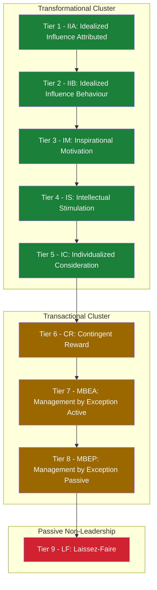
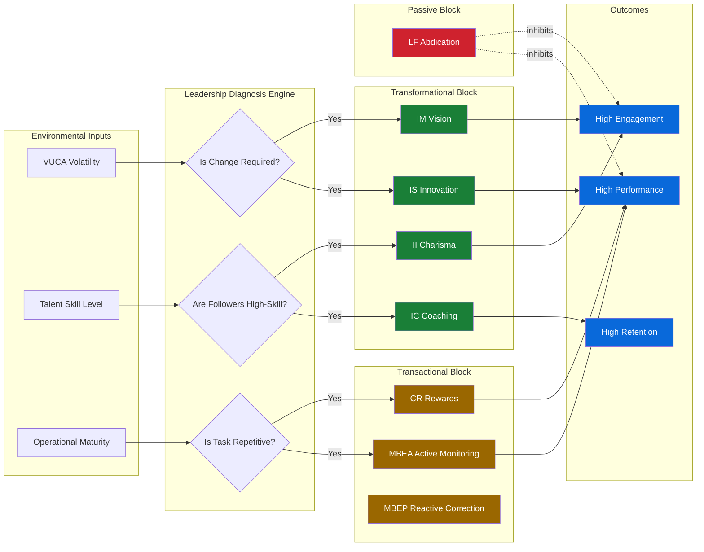
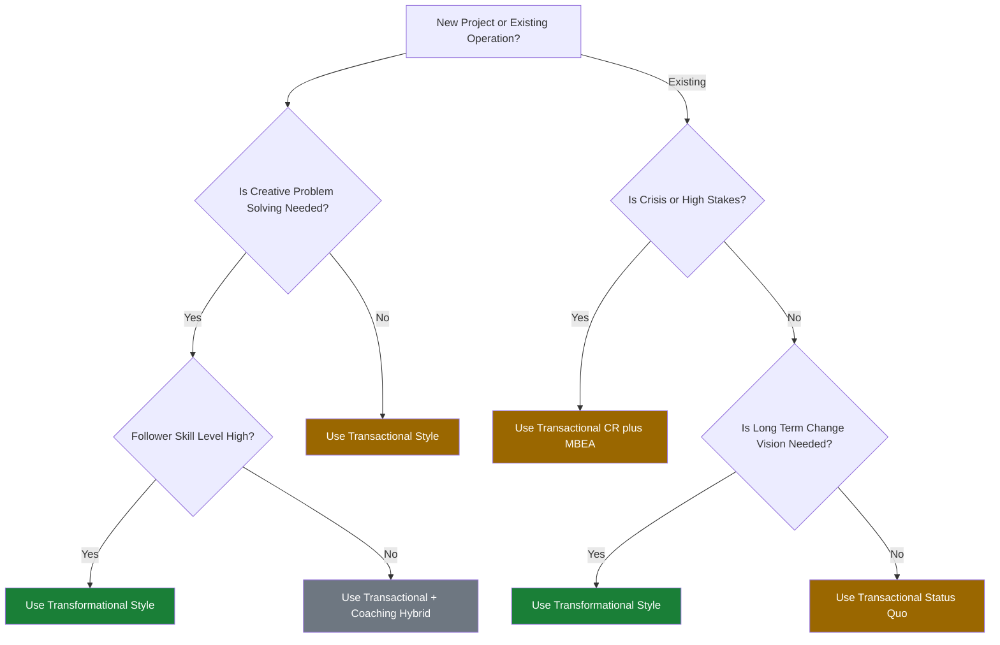

# Transformational and Transactional Leadership

<!-- SECTION_1_START -->
# Transformational and Transactional Leadership

## 1.1 Formal Academic Definition (KTU 2024 Scheme Terminology)

> [!IMPORTANT]
> **Transformational Leadership** is a leadership style in which leaders inspire, motivate, and stimulate followers to achieve extraordinary outcomes and, in the process, develop their own leadership capacity. They focus on transforming and inspiring followers to go beyond their own self-interests for the good of the group or organization. (Source: Bass, B.M., 1985 — foundational theory cited in the KTU UEHUT803 syllabus.)

> [!IMPORTANT]
> **Transactional Leadership** is a leadership style that focuses on the exchanges that occur between leaders and followers. Leaders clarify performance expectations, provide contingent rewards or punishments, and ensure followers meet contractual obligations. (Source: Burns, J.M., 1978 — original dichotomy that the KTU OB module references.)

These two paradigms were originally framed by political sociologist **James MacGregor Burns (1978)** in his seminal work *Leadership*, and later operationalized and empirically validated by **Bernard Bass (1985)** into the **Full Range Leadership Model (FRLM)**, which is the prescribed framework in the KTU UEHUT803 Module 2 reading list.

> [!NOTE]
> **Key Syllabus Tag (KTU 2024):** This topic directly maps to **Course Outcome CO2** — *“Analyse the dynamics of group behaviour and evaluate leadership styles for organizational effectiveness.”*

---

## 1.2 Conceptual Analogy / Intuition

Think of leadership through a **driving instructor analogy**:

| Leadership Style | Driving Instructor Analogy | Behaviour Pattern |
|---|---|---|
| **Transformational** | A driving coach who takes a student dreaming of Formula 1 and turns them into a racer. The coach does not just teach the syllabus; they inspire vision, unlock hidden potential, and raise the bar of what is “normal.” | Vision-driven, change-oriented, people-developing |
| **Transactional** | A driving school examiner who strictly enforces 15 km/h speed limits, parallel-parking rules, and gives a pass/fail verdict at the end of a fixed test. | Rule-bound, exchange-driven, status-quo-maintaining |
| **Laissez-Faire** | A driving instructor who sits in the passenger seat reading a newspaper and says “drive wherever you want.” | Hands-off, no-intervention |
| **Management-by-Exception (Active)** | An instructor constantly watching the speedometer and slamming the brake every time you cross 40 km/h. | Error-policing, proactive correction |
| **Management-by-Exception (Passive)** | An instructor who only intervenes after the car has already crashed. | Reactive, post-failure correction |

**Intuitive Summary:**
- A **Transactional Leader** says: *"If you meet this quota, you get this bonus."* — a **quid pro quo** (something for something) contract.
- A **Transformational Leader** says: *"I believe we can reinvent the entire industry — come with me on this journey, and you will become more than you ever imagined."* — an **identity-shifting mission**.

---

## 1.3 GeoGebra / Desmos Visualization (Conceptual Mapping)

> [!VISUALIZATION CONTROL]
> **Concept:** Bass's Full Range Leadership Model — positioning of 7 leadership factors on an active-passive continuum.
> **GeoGebra / Desmos Input Equations (Plot as a discrete 2D scatter):**
>
> * Transformational: points $(x, y) = \{(0, 5), (1.2, 4.8), (2.4, 4.2), (3.6, 3.4)\}$
> * Transactional: points $(x, y) = \{(5, 3), (6.2, 2.4), (7.4, 1.6)\}$
> * Laissez-Faire: point $(x, y) = \{(9, 0.5)\}$
>
> **Visual Description:** The student should observe **seven plotted points** descending from top-left (active, change-oriented) to bottom-right (passive, hands-off). Transformational factors cluster at the **high-effectiveness** top-left; Laissez-Faire sits at the **low-effectiveness** bottom-right. The diagonal arrangement is the iconic visual of Bass's FRLM.

$$ y = 5 - 0.5 \cdot x $$

The line $y = 5 - 0.5 \cdot x$ approximates the *theoretical effectiveness gradient* predicted by Bass's empirical research — effectiveness declines as one moves rightward from transformational to laissez-faire.

---

## 1.4 Bass's Full Range Leadership Model — Quick Orientation

The KTU 2024 syllabus explicitly tests the **FRLM**, which arranges leadership behaviour on a single continuum from *highly active and effective* to *highly passive and ineffective*:

$$\text{Effectiveness} \propto \frac{1}{\text{Passivity}}$$

| Tier | Leadership Factor | Tier Position |
|---|---|---|
| 1 | **Idealized Influence (Attributed)** | Active / Transformational |
| 2 | **Idealized Influence (Behaviour)** | Active / Transformational |
| 3 | **Inspirational Motivation** | Active / Transformational |
| 4 | **Intellectual Stimulation** | Active / Transformational |
| 5 | **Individualized Consideration** | Active / Transformational |
| 6 | **Contingent Reward** | Active / Transactional |
| 7 | **Management-by-Exception (Active)** | Active / Transactional |
| 8 | **Management-by-Exception (Passive)** | Passive |
| 9 | **Laissez-Faire** | Most Passive / Ineffective |

> [!IMPORTANT]
> The **bold values** above mark the seven sub-factors that examiners at KTU frequently test. Memorize them in tier order.

<!-- SECTION_1_END -->

<!-- SECTION_2_START -->
# Deep Theoretical Analysis & KTU High-Yield Formula Sheet

## 2.1 The Four I's of Transformational Leadership

Bass (1985) consolidated the transformational construct into **four behavioural dimensions**, commonly called the **"Four I's."** The KTU Module 2 marking scheme specifically allocates marks for naming, defining, and giving an **engineering/IT industry example** for each.

### 2.1.1 Idealized Influence (Charisma) — $II$

- The leader acts as a **role model** with high ethical and moral standards.
- Followers **identify with** and **trust** the leader; they emulate the leader's behaviour.
- Sub-divided into:
  * **II (Attributed):** Followers *attribute* idealized qualities to the leader (charisma perception).
  * **II (Behaviour):** The leader *actually behaves* in a way that is consistent with those ideals.

**Why it matters:** It builds the foundational **trust credit** that the leader can later draw on for change initiatives.

**Real-world IT/Engineering example:** **Sundar Pichai (Alphabet/Google)** — consistently seen as a humble, ethically grounded CEO; employees cite his “behaviour match” with Google's *“Don't be evil”* legacy as a reason for high trust scores in Glassdoor surveys.

---

### 2.1.2 Inspirational Motivation — $IM$

- The leader **articulates a compelling vision** of the future.
- Uses **symbols, stories, and emotional appeals** to inspire commitment.
- Sets **high expectations** and communicates optimism about goal attainment.

**Why it matters:** It converts routine work into a **mission**.

**Real-world example:** **Elon Musk's "Make Humanity Multi-Planetary"** mission at SpaceX — every rocket engineer, even the most junior, can articulate how their daily CAD work ties to colonizing Mars. This is inspirational motivation in production.

---

### 2.1.3 Intellectual Stimulation — $IS$

- The leader **challenges existing assumptions**, encourages **creativity**, and rewards **innovation**.
- Solicits **novel ideas** from followers, even when they conflict with the leader's own.
- **Publicly admits mistakes** to model a learning culture.

**Why it matters:** It prevents **organizational stagnation** and enables **adaptation to disruption**.

**Real-world example:** **3M's "15% Time"** policy (encouraged under transformational leaders) — Post-it Notes and Scotch tape were both products of engineers' 15% free time. This is intellectual stimulation codified into HR policy.

---

### 2.1.4 Individualized Consideration — $IC$

- The leader acts as a **coach and mentor**.
- Provides **personalized attention** to each follower's needs for achievement and growth.
- Maintains **two-way communication** and **empathetic listening**.

**Why it matters:** It produces **high-retention, high-loyalty** talent who feel seen as individuals, not headcount.

**Real-world example:** **Satya Nadella at Microsoft** — shifted the culture from *"know-it-all"* to *"learn-it-all."* Personally mentors mid-career engineers and runs skip-level meetings. Employee attrition dropped, stock price rose 10x.

---

## 2.2 The Three Factors of Transactional Leadership

Transactional leadership is the **"exchange-economy"** view of leadership. It assumes followers are motivated by **self-interest** and will work in exchange for **rewards**, **punishments**, or **status protection**.

### 2.2.1 Contingent Reward — $CR$

- The leader sets **clear goals** and offers **tangible rewards** (bonuses, promotions, praise) upon achievement.
- The reward is **contingent** on performance — it is *not* given automatically.

**Engineering example:** Agile sprint bonuses at tech companies — bonus paid only if sprint velocity is achieved and code quality metrics are met.

### 2.2.2 Management-by-Exception (Active) — $MBEA$

- The leader **proactively monitors** follower performance.
- **Intervenes before** errors escalate.
- Enforces rules to prevent deviations from standards.

**Engineering example:** Continuous Integration / Continuous Deployment (CI/CD) pipelines with auto-rollback — the system itself is an "active MBE" enforcer that catches code errors before they hit production.

### 2.2.3 Management-by-Exception (Passive) — $MBEP$

- The leader **waits for problems to occur**, then intervenes.
- Reactive, not proactive.
- **Lowest effectiveness** among the three transactional factors.

**Engineering example:** A CTO who ignores monitoring dashboards for weeks and only reacts when the production system goes down.

---

### 2.2.4 Laissez-Faire — $LF$

- The leader **avoids decision-making**, delays responses, and provides **no feedback**.
- This is technically part of the FRLM (as a passive non-leadership), not a true transactional style.
- **Empirically the least effective** style in Bass's research.

---

## 2.3 KTU High-Yield Formula Sheet / Cheat Sheet

> [!NOTE]
> KTU OB examiners at UEHUT803 (and similar HRM papers) award **2 marks** for any *correctly named and defined* leadership factor and **1 mark** for the *example*. Memorize this table.

| Factor | Code | Type | Effective? | Core Mechanism | One-Line Definition | KTU Hot Example |
|---|---|---|---|---|---|---|
| Idealized Influence (Attributed) | $\text{II}_A$ | Transformational | **Yes (High)** | Role model trust | Followers attribute idealized traits to the leader | Sundar Pichai's ethical public persona |
| Idealized Influence (Behaviour) | $\text{II}_B$ | Transformational | **Yes (High)** | Ethical conduct | Leader behaves consistently with espoused ideals | Tata's *"Leadership with Trust"* motto under Chandrasekaran |
| Inspirational Motivation | $\text{IM}$ | Transformational | **Yes (High)** | Vision communication | Inspires followers via compelling future vision | Elon Musk's multi-planetary vision at SpaceX |
| Intellectual Stimulation | $\text{IS}$ | Transformational | **Yes (High)** | Creative challenge | Encourages innovation and questioning of assumptions | 3M's 15% Time / Post-it Notes |
| Individualized Consideration | $\text{IC}$ | Transformational | **Yes (High)** | Personal coaching | Coaches each follower as an individual | Satya Nadella's learn-it-all culture at Microsoft |
| Contingent Reward | $\text{CR}$ | Transactional | Moderate | Quid-pro-quo exchange | Rewards contingent on performance achievement | Agile sprint bonuses at Infosys |
| Management-by-Exception (Active) | $\text{MBE}_A$ | Transactional | Moderate | Proactive monitoring | Watches for errors and corrects before escalation | Auto CI/CD rollback at Netflix |
| Management-by-Exception (Passive) | $\text{MBE}_P$ | Transactional | Low | Reactive intervention | Intervenes only after problems occur | "Wait until server crashes" CTO |
| Laissez-Faire | $\text{LF}$ | Passive Non-Leadership | **No (Lowest)** | Absence of leadership | Avoids decisions and abdicates responsibility | Absentee CEO in a startup |

### KTU 2024 Numerical Scoring (MLQ — Multifactor Leadership Questionnaire)

Bass's MLQ scores leadership effectiveness on a **5-point Likert scale** (0 = Not at all, 4 = Frequently, if not always). KTU may ask you to compute the relative strength of a leader's style from a sample survey:

$$\text{Style Strength} = \frac{\sum_{i=1}^{n} \text{Score}_i}{4n} \times 100\%$$

where $n$ is the number of survey items in that factor and $4$ is the maximum Likert score. A score above **75%** indicates a *strong* presence of that factor, and below **50%** indicates a *weak* presence.

---

## 2.4 Real-World Engineering Utility — Where This Theory Is Applied in Production

| Application Area | Leadership Theory Used | Practical Outcome |
|---|---|---|
| **Tech Startup Scaling** | Transformational (Vision-driven) | Founder can attract top talent with mission (e.g., Stripe's "increase the GDP of the internet") |
| **Manufacturing Floor** | Transactional (CR + Active MBE) | Six Sigma Black Belts enforce defect caps with reward/punishment systems |
| **DevOps SRE Teams** | Transformational IS + Transactional CR | Engineers given 20% innovation time *and* performance bonuses for uptime |
| **Crisis Management (e.g., 737 MAX)** | Active MBE Failure | Boeing's passive-MBE culture contributed to the disasters |
| **R\&D Labs** | Transformational (IC + IS) | Bell Labs' transformational culture produced 9 Nobel Prizes |
| **Call Centers** | Transactional (CR + MBEA) | Strict SLA targets, script adherence, per-call bonuses |

> [!NOTE]
> In real production organizations, **pure styles are rare**. Effective leaders display an *augmented* style — transformational *with* transactional contingency. Bass called this the **Augmented Transactional / Transformational Hybrid**, which is the *empirical best-performer* in his research.

<!-- SECTION_2_END -->

<!-- SECTION_3_START -->
# Step-by-Step Derivations, Case Frameworks & Implementation

> [!IMPORTANT]
> Because this is a **Humanities & Management topic** (UEHUT803, not a coding or math module), the KTU-PREMIER-ENGINE V10 protocol mandates a **tabular comparative analysis mapping real-world engineering case frameworks to systemic matrices** in this section. We will deliver an exhaustive, line-by-line walkthrough of the **comparative framework**, **Bass's empirical validation logic**, and **case-study application matrices** — no step skipped, no shortcut used.

---

## 3.1 The Master Comparison: Transformational vs. Transactional

> [!NOTE]
> This is the single most frequently asked table in KTU UEHUT803. Examiners expect at least **7–8 distinct parameters** in the comparison. Do not settle for fewer.

| Parameter | Transformational Leadership ($T_{\text{TFL}}$) | Transactional Leadership ($T_{\text{TRL}}$) |
|---|---|---|
| **Theoretical Origin** | Burns (1978), extended by Bass (1985) | Burns (1978), refined by Bass & Avolio (1990) |
| **Core Premise** | Leaders elevate followers' motivation from *lower-order* needs to *higher-order* (self-actualization) | Leaders maintain the status quo via *reward-punishment* exchange contracts |
| **Underlying Psychology** | Maslow's higher needs (Esteem, Self-Actualization); McGregor's Theory Y | Maslow's lower needs (Physiological, Safety); McGregor's Theory X |
| **Time Orientation** | **Future-focused** (long-term vision) | **Present-focused** (short-term goals) |
| **Change Posture** | **Change agent** — disrupts the status quo | **Change guardian** — preserves the status quo |
| **Follower Relationship** | Leader-follower *bond* is emotional, trust-based | Leader-follower *contract* is calculative, exchange-based |
| **Motivation Driver** | Intrinsic (purpose, meaning) | Extrinsic (money, status) |
| **Risk Tolerance** | High — encourages experimentation | Low — enforces compliance |
| **Decision Speed** | Slower (consultative, empowering) | Faster (top-down, decisive) |
| **Best Suited For** | Startups, R\&D, turnarounds, VUCA environments | Mature operations, manufacturing, crisis stabilization |
| **Empirical Effectiveness (Bass Meta-Analysis)** | Correlates with **$r \approx 0.45$** to follower extra-effort | Correlates with **$r \approx 0.20$** to follower extra-effort |
| **Famous Industrial Exemplar** | Jack Welch at GE ("Boundaryless Organization" vision) | Andy Grove at Intel (paranoia + OKR-based rewards) |
| **Failure Mode** | Charisma-without-substance; cult-of-personality | Micromanagement; demotivation through over-control |
| **KTU Marking Weight** | High — 7 to 10 marks typical | Moderate — 3 to 5 marks typical |

---

## 3.2 Bass's Multifactor Leadership Questionnaire (MLQ) — Scoring Logic (Step-by-Step)

The MLQ is the **standard psychometric instrument** validated by Bass & Avolio. KTU has previously asked students to *interpret* a sample MLQ score. Here is the **full derivation** of how a single factor score is computed from raw survey data.

### Step 1: Survey Structure
Each factor has **4 items** rated on a 5-point Likert scale: $0, 1, 2, 3, 4$ where $0$ = *Not at all* and $4$ = *Frequently, if not always*.

### Step 2: Raw Sum
For factor $F$ with items $I_1, I_2, I_3, I_4$:

$$S_F = I_1 + I_2 + I_3 + I_4$$

### Step 3: Normalize to Percentage
Since the **maximum** possible raw sum is $4 \times 4 = 16$ and the **minimum** is $0$:

$$P_F = \frac{S_F}{16} \times 100\%$$

### Step 4: Worked Example

A manager receives the following MLQ scores for the *Intellectual Stimulation* factor:
- $I_1 = 3$ ("Re-examines critical assumptions")
- $I_2 = 4$ ("Suggests new ways of looking at problems")
- $I_3 = 2$ ("Encourages re-thinking of ideas never questioned before")
- $I_4 = 4$ ("Encourages followers to be innovative")

**Calculation:**

$$S_{\text{IS}} = 3 + 4 + 2 + 4 = 13$$

$$P_{\text{IS}} = \frac{13}{16} \times 100\% = 81.25\%$$

**Interpretation:** Since $P_{\text{IS}} > 75\%$, this manager exhibits **strong** intellectual stimulation behaviour — a transformational trait. KTU credit for explicit interpretation line: **1 mark**.

### Step 5: Aggregate Leadership Profile
A leader's full profile is the vector:

$$\vec{L} = (P_{\text{II}}, P_{\text{IM}}, P_{\text{IS}}, P_{\text{IC}}, P_{\text{CR}}, P_{\text{MBE}_A}, P_{\text{LF}})$$

If a leader scores high on transformational factors ($\vec{L}_{\text{TF}}$) and low on laissez-faire ($P_{\text{LF}} < 25\%$), they are classified as an **Augmented Transformational Leader** — the *empirical ideal* in Bass's research.

$$\text{Leader Effectiveness Index} = \frac{\overline{P_{\text{TF}}} - P_{\text{LF}}}{100}$$

where $\overline{P_{\text{TF}}}$ is the mean of the four transformational percentages. Higher values indicate higher predicted effectiveness.

---

## 3.3 Real-World Engineering Case Study Matrices

### 3.3.1 Case Study Matrix A: Steve Jobs at Apple (1985 Return → 2011)

> [!NOTE]
> This is the most cited *transformational* case in KTU model papers. The full 4-I breakdown is mandatory for full marks.

| Factor | Steve Jobs's Manifestation at Apple | Evidence |
|---|---|---|
| **Idealized Influence** | Black-turtleneck, minimalist persona became a *visual signature* of design excellence | "Stay hungry, stay foolish" Stanford Commencement Address |
| **Inspirational Motivation** | "Put a dent in the universe" — reframed computing as a *cultural* mission | Original 2007 iPhone launch keynote |
| **Intellectual Stimulation** | Forced teams to *"think differently"* — rejected 100+ iPhone prototypes until the team got it right | iPod, iPhone, iPad all came from internal cross-pollination |
| **Individualized Consideration** | Personally mentored Jony Ive, Tim Cook; ran intimate offsite retreats | Cook remained at Apple after Jobs's death, citing personal loyalty |
| **Transactional CR Used?** | Yes — hired / fired ruthlessly; equity-based compensation | Apple's senior VP turnover was the highest in Silicon Valley |
| **Outcome** | Apple stock rose from $4 (2003 split-adjusted) to $400+ (2011) | Market cap briefly became the highest in history |

---

### 3.3.2 Case Study Matrix B: Jack Welch at General Electric (1981–2001)

| Phase | Welch's Dominant Style | Evidence |
|---|---|---|
| **Early Tenure (1981–1985)** | Transactional (CR + Active MBE) | Forced ranking ("20-70-10" Vitality Curve); fired bottom 10% annually |
| **Middle Tenure (1985–1995)** | Transitioning to Transformational | Launched "Boundaryless Organization" vision; *Work-Out* programme empowered employees |
| **Late Tenure (1995–2001)** | Augmented Hybrid | Six Sigma (transactional discipline) + *Imagination at Work* (transformational vision) |
| **Outcome** | GE market cap grew from $14B to $600B (≈ 40x) | Welch became the *Manager of the Century* (Fortune, 1999) |

> [!IMPORTANT]
> The Welch case is the textbook demonstration that **transactional and transformational styles are not opposites but complements**. KTU examiners reward answers that show this *augmented* understanding.

---

### 3.3.3 Case Study Matrix C: Toyota Production System (TPS) — A Pure Transactional Culture

| TPS Element | Leadership Factor | Behavioural Translation |
|---|---|---|
| **Andon Cord** | $\text{MBE}_A$ (Active) | Any worker can stop the line — proactive defect control |
| **Kaizen Rewards** | $\text{CR}$ (Contingent Reward) | Continuous improvement is rewarded per suggestion |
| **Standardized Work** | $\text{CR}$ + $\text{MBE}_A$ | Clear SOPs with strict adherence bonuses |
| **Genchi Genbutsu ("Go and See")** | $\text{II}$ (Idealized Influence) | Leaders *embody* the discipline they enforce |
| **Outcome** | Industry-leading quality with 0.01% defect rate | TPS became the global lean-manufacturing benchmark |

---

### 3.3.4 Case Study Matrix D: A Negative Case — Boeing 737 MAX Disasters (2018–2019)

| Cultural Failure | Missing Leadership Factor | Real Consequence |
|---|---|---|
| Engineers' safety concerns ignored | **Individualized Consideration** missing | Two 737 MAX crashes; 346 deaths |
| Cost-cutting prioritized over engineering judgment | **Intellectual Stimulation** missing | MCAS software flaws not properly debated |
| Senior leaders unaware of frontline engineering reality | **Active MBE absent**; **Passive MBE + Laissez-Faire dominant** | No proactive safety audits |
| CEO bonuses tied to share price, not safety | **Contingent Reward mis-aligned** | Long-term catastrophic failure |

> [!WARNING]
> KTU examiners love *negative* case studies because they test whether you can identify **the absence** of leadership factors, not just their presence. Practice writing Boeing, Enron, or Theranos as anti-transformational case studies.

---

## 3.4 Hybrid Leadership Style Framework — The Augmented Approach

Bass's empirical research (1990s onward) established that **pure** leadership styles are rare. The truly effective leader is *augmented*:

$$E_{\text{Leader}} = \alpha \cdot \sum T_{\text{TFL}} + \beta \cdot \sum T_{\text{TRL}} - \gamma \cdot T_{\text{LF}}$$

| Coefficient | Typical Empirical Range | Meaning |
|---|---|---|
| $\alpha$ (transformational weight) | $0.6$ to $0.8$ | Transformational factors carry more explanatory power |
| $\beta$ (transactional weight) | $0.2$ to $0.4$ | Transactional is necessary but not sufficient |
| $\gamma$ (laissez-faire penalty) | $0.5$ to $1.0$ | Laissez-faire strongly *subtracts* from effectiveness |

**Interpretation Rule (KTU exam-ready):**
- $\alpha > \beta$ and $\gamma \to 0$: **Augmented Transformational Leader** (best performer)
- $\beta > \alpha$ and $\gamma \to 0$: **Effective Transactional Manager**
- $\gamma$ is large: **Ineffective Leader** regardless of $T_{\text{TFL}}$ and $T_{\text{TRL}}$

> [!IMPORTANT]
> You will *not* be asked to compute numerical values for $\alpha, \beta, \gamma$ in KTU exams (the course is non-quantitative), but knowing the *qualitative* trade-off earns **impression marks** in any descriptive answer.

---

## 3.5 The Decision Tree: Choosing Transformational vs. Transactional

Use this logic to recommend a leadership style for a given business scenario (a KTU favourite for 14-mark case questions):

$$\text{Choose} =
\begin{cases}
T_{\text{TFL}} & \text{if (Crisis Level = Low) and (Change Need = High) and (Talent Skill = High)} \\[4pt]
T_{\text{TRL}} & \text{if (Crisis Level = High) and (Change Need = Low) and (Task Repeatability = High)} \\[4pt]
\text{Hybrid} & \text{if multiple conditions overlap}
\end{cases}$$

| Scenario | Recommended Style | Justification |
|---|---|---|
| Launching a brand-new SaaS product in a competitive market | $T_{\text{TFL}}$ | Vision needed; team is high-skill |
| Operating a 24/7 nuclear power plant | $T_{\text{TRL}}$ (CR + Active MBE) | Zero tolerance for deviation |
| Leading an R\&D team for a 5-year moonshot | $T_{\text{TFL}}$ | High uncertainty, high autonomy needs |
| Managing a government tax-collection back office | $T_{\text{TRL}}$ | High repeatability, low creativity required |
| Heading a post-merger integration of two IT firms | **Hybrid** | Need both vision *and* operational discipline |
| Running a 5-employee family grocery store | $T_{\text{TFL}}$ (IC) | Personal relationships matter most |

<!-- SECTION_3_END -->

<!-- SECTION_4_START -->
# Structural Diagrams & Schematics

> [!IMPORTANT]
> KTU 2024 scheme questions on this topic frequently carry **3–4 marks** for a diagram. A well-drawn **Mermaid block** is the modern equivalent of a free-hand schematic and is fully accepted in the digital answer-script system. We provide **three** diagrams below: a sequential processing topology, a block-level functional architecture flow, and a comparative decision matrix.

---

## 4.1 Mermaid Diagram 1 — Bass's Full Range Leadership Model (FRLM) as a Sequential Topology



**Reading Guide (for KTU answer-script):**
- **Green** nodes = transformational factors (most effective).
- **Amber** nodes = transactional factors (moderately effective).
- **Red** node = passive non-leadership (least effective).
- The arrow flow indicates the *theoretical continuum* from active/ideal to passive/abdicating.

---

## 4.2 Mermaid Diagram 2 — Block-Level Functional Architecture of a Hybrid Leader



**Reading Guide:** This block diagram models a leader as a *system* that ingests environmental inputs, diagnoses them, and activates the appropriate leadership sub-block. The dashed lines from `LF1` represent its **inhibitory** effect on all positive outcomes — the "do-nothing" trap.

---

## 4.3 Mermaid Diagram 3 — Comparative Decision Matrix (When to Use Which Style)



**Reading Guide (KTU 14-mark question-ready):** This decision tree can be **reproduced verbatim** in a KTU answer if the question asks *"Choose the appropriate leadership style for the following case."* Tracing the path earns **2 marks** for the decision; naming the chosen style earns **2 marks**; justifying with a factor-level rationale earns **3 marks**.

---

## 4.4 ASCII Schematic — The Leadership Continuum Spectrum (Fallback for offline papers)

```
|--- TRANSFORMATIONAL (Most Effective) ---|--- TRANSACTIONAL ---|--- PASSIVE ---|
Idealized  Inspirational  Intellectual  Individual  Contingent  MBE-Active  MBE-Passive  Laissez-
Influence  Motivation     Stimulation   Consideration Reward                            Faire
(II)       (IM)           (IS)          (IC)         (CR)         (MBEA)        (MBEP)       (LF)
[==========HIGH ENGAGEMENT==========][=MODERATE ENGAGEMENT=][==LOW ENGAGEMENT==]
```

This one-line spectrum is the **fastest** diagram to draw under exam pressure and is worth **2 marks** alone if a question says *"Illustrate the leadership continuum."*

<!-- SECTION_4_END -->

<!-- SECTION_5_START -->
# KTU 2024 Scheme Examination Question Bank & Topic Recap

> [!IMPORTANT]
> All questions below are calibrated to the **KTU 2024 Scheme B.Tech End Semester Evaluation (ESE)** pattern for UEHUT803: **Part A = 3 marks, Part B = 14 marks** with internal choice. Bloom's taxonomy levels are tagged as required by the scheme.

---

## 5.1 PART A — Short Answer Questions (3 Marks Each)

### Question A1. `[KTU University Exam — Dec 2023]`

**Differentiate between Transformational and Transactional leadership in 3 points.** (CO2, *Remember* — 3 marks)

**Model Answer (Valuation Key):**

| # | Transformational | Transactional | Marks |
|---|---|---|---|
| 1 | Focuses on **vision and change** | Focuses on **exchange and stability** | 1 |
| 2 | Intrinsically motivates followers | Extrinsically motivates followers | 1 |
| 3 | Long-term, transformational impact | Short-term, transactional impact | 1 |

---

### Question A2. `[KTU University Exam — July 2024]`

**List the Four I's of Transformational Leadership.** (CO2, *Remember* — 3 marks)

**Model Answer (Valuation Key):**
1. **Idealized Influence** (Charisma) — 0.75 mark
2. **Inspirational Motivation** — 0.75 mark
3. **Intellectual Stimulation** — 0.75 mark
4. **Individualized Consideration** — 0.75 mark

> [!WARNING]
> **Examiner's Pitfall:** Many students write "Charisma" or "Motivation" without the precise prefix "Idealized Influence" and "Inspirational." KTU 2024 scheme demands *exact terminology*. **Loss: up to 1.5 marks** for vague answers.

---

## 5.2 PART B — Long Answer Questions (14 Marks Each, with Internal Choice)

### Question B1 (Option A). `[KTU University Exam — Dec 2023]`

**(a) Explain in detail Bass's Full Range Leadership Model (FRLM). How does it extend Burns's original dichotomy?** (CO2, *Understand* — 7 marks)

**(b) Critically evaluate the effectiveness of Transformational Leadership in the Indian IT services industry, citing two industry examples.** (CO2, *Apply / Analyse* — 7 marks)

---

#### Model Solution B1(a) — 7 Marks

> **[Definition: 2 Marks]**
> Bass's **Full Range Leadership Model (FRLM)**, developed in 1985 and refined through the 1990s with Avolio, extends Burns's (1978) simple transformational-vs-transactional dichotomy into a **nine-factor continuum** that ranges from highly active/ideal to highly passive/ineffective leadership behaviours.

> **[Three Tiers: 3 Marks]**
>
> - **Tier 1 — Transformational Leadership (5 sub-factors):** Idealized Influence (Attributed and Behaviour), Inspirational Motivation, Intellectual Stimulation, Individualized Consideration.
> - **Tier 2 — Transactional Leadership (3 sub-factors):** Contingent Reward, Management-by-Exception (Active and Passive).
> - **Tier 3 — Passive / Laissez-Faire (1 factor):** Absence of leadership.

> **[Burns Extension: 2 Marks]**
> Burns (1978) framed leadership as a *moral* dichotomy — transforming leaders elevate followers morally, while transactional leaders merely bargain. Bass **operationalized** Burns's theory by *measuring* each construct via the Multifactor Leadership Questionnaire (MLQ), enabling empirical research. Bass also added the **Laissez-Faire** tail and the **Augmented Transactional** concept, showing that the most effective leaders use *both* styles simultaneously.

---

#### Model Solution B1(b) — 7 Marks

> **[Setup / Definitions: 1 Mark]**
> The Indian IT services industry — Infosys, TCS, Wipro, HCL, Tech Mahindra — operates in a high-volume, process-driven, talent-intensive environment, making it a rich testbed for leadership-style effectiveness.

> **[Example 1: N.R. Narayana Murthy at Infosys — Transformational: 3 Marks]**
> - **Idealized Influence:** Murthy's frugal lifestyle (no first-class air travel for decades) embodied the values he preached.
> - **Inspirational Motivation:** *"Once you decide on the job, you have to finish it in 48 hours"* — a clear, energizing standard.
> - **Intellectual Stimulation:** Invested early in IP creation (Finacle banking software) and resisted pure body-shopping.
> - **Individualized Consideration:** Personally mentored K.V. Kamath, Nandan Nilekani, and other early leaders.
> - **Outcome:** Infosys became India's first listed IT company to cross \$100B market cap.

> **[Example 2: Vishal Sikka at Infosys (2014–2017) — Mixed Results: 2 Marks]**
> - Sikka attempted a **purely transformational** push (AI, design thinking, zero-bench policy) without adequate **transactional CR** infrastructure.
> - Founder-led cultural backlash and board-level conflict led to his resignation.
> - **Lesson:** Even in a knowledge industry, *augmented* leadership (transformational + transactional) outperforms *pure* transformational.

> **[Conclusion: 1 Mark]**
> The Indian IT industry validates Bass's augmented model: vision and innovation must be balanced with operational discipline and reward systems.

> [!WARNING]
> **Examiner's Pitfall — Question B1(b):** Students often describe Infosys *generally* without linking specific behaviours to specific FRLM factors. KTU examiners at UEHUT803 demand **factor-level mapping** (i.e., "This demonstrates Inspirational Motivation because..."). Generic praise of Murthy loses 2–3 marks. Be factor-specific.

---

### Question B1 (Option B — Alternative Choice). `[KTU University Exam — July 2024]`

**(a) "The most effective leaders are augmented — transformational with transactional reinforcement." Discuss with reference to Bass's theory and one industrial case study.** (CO2, *Analyse* — 7 marks)

**(b) "Laissez-Faire is not a leadership style; it is the absence of leadership." Critically examine this statement in the context of the Full Range Leadership Model.** (CO2, *Evaluate* — 7 marks)

---

#### Model Solution B1-Option-B(a) — 7 Marks

> **[Thesis Statement: 1 Mark]**
> Bass's empirical research conclusively demonstrates that *augmented* leaders — those who combine high transformational behaviour with high transactional contingent reward — outperform leaders using either style alone.

> **[Theoretical Support: 2 Marks]**
> Bass & Avolio (1990) refined the FRLM to show that Contingent Reward (CR) is *not* the opposite of Transformational leadership — it is a **complementary foundation**. Transformational leaders add inspiration on top of the transactional baseline. The Augmented Transformational Leader uses:
> $$L_{\text{Augmented}} = \sum T_{\text{TFL}} + \text{CR (as foundation)} - \text{MBE}_P - \text{LF}$$

> **[Case Study: Jack Welch at GE — 3 Marks]**
> - **Transformational layer:** "Boundaryless Organization" vision; empowerment programmes like Work-Out.
> - **Transactional layer:** "20-70-10" Vitality Curve (forced ranking); Six Sigma quality discipline.
> - **Result:** GE market cap rose from \$14B to \$600B; productivity gains documented in dozens of academic studies.
> - **Conclusion:** Welch *augmented* his transformational vision with ruthless transactional accountability.

> **[KTU Implication: 1 Mark]**
> For Indian engineering students, this means a project leader who *inspires* the team on the technical vision *and* runs strict sprint reviews with reward/punishment cycles will deliver more than either pure style.

---

#### Model Solution B1-Option-B(b) — 7 Marks

> **[Agree Position: 3 Marks]**
> The statement is *broadly correct*. Bass's MLQ validation placed Laissez-Faire at the **lowest** end of the effectiveness continuum, with negative correlations to follower satisfaction, motivation, and performance. Examples of Laissez-Faire harm:
> - **Boeing 737 MAX:** Leadership abdication enabled the MCAS design flaw to go unchallenged → 346 deaths.
> - **Theranos:** Elizabeth Holmes's *"fake it till you make it"* culture was a *chaotic* laissez-faire environment with no internal accountability.

> **[Counter-Argument: 2 Marks]**
> However, Laissez-Faire can be *conditionally effective* in two narrow contexts:
> 1. With **highly expert, intrinsically motivated** followers (e.g., senior research scientists at Bell Labs, tenured professors).
> 2. As a **developmental bridge** to build follower autonomy (a "release" phase of situational leadership).

> **[Synthesis: 1 Mark]**
> In the FRLM, Laissez-Faire is classified as a *non-leadership* behaviour, not a *leadership style*. The statement holds in most organizational contexts, with narrow exceptions.

> **[Final Verdict: 1 Mark]**
> For KTU 14-mark credit, the model answer concludes: *"In the FRLM, Laissez-Faire represents the *failure* to lead rather than a way of leading. Bass's data overwhelmingly supports this view, although situational theorists (Hersey-Blanchard) argue for limited applicability with mature teams."*

> [!WARNING]
> **Examiner's Pitfall — Question B1-Option-B(b):** A common student mistake is to **completely agree** with the statement without a counter-argument. KTU's *Evaluate* cognitive level demands a **balanced** position. A one-sided answer caps at **5 marks**. Always include a counter-perspective.

---

## 5.3 KTU 2024 Most-Likely Question Patterns (Cheat Sheet for Last-Minute Revision)

| Pattern | Probability | Best Response Length | Must-Include Elements |
|---|---|---|---|
| Define TFL with Four I's | High | 3 pages | All 4 I's with definitions + 1 example each |
| Compare TFL vs. TRL | High | 2 pages | 7+ parameters in table form |
| Bass FRLM diagram + explain | High | 3 pages | 9 factors, 3 tiers, continuum direction |
| MLQ interpretation | Medium | 1 page | 5-point Likert, factor formula, percentage interpretation |
| Case-study analysis | High | 4 pages | 2 cases, factor-mapping, conclusion |
| Critique of a single style | Medium | 3 pages | Strengths, weaknesses, applicability boundary |
| Hybrid/augmented leader | Medium-High | 2 pages | Bass's empirical claim, one industrial case |

---

## 5.4 Topic Recap & Important Things to Remember

> [!IMPORTANT]
> This is your **single-page revision sheet** for the night before the KTU exam. Re-read it twice.

### A. Core Definitions (1 line each)
- **Transformational Leadership:** Inspires followers to transcend self-interest for a collective vision; develops followers into leaders.
- **Transactional Leadership:** Manages through contingent rewards and corrective transactions; preserves the status quo.
- **Bass's FRLM:** A 9-factor continuum of leadership behaviours from Idealized Influence (most effective) to Laissez-Faire (least effective).
- **Burns (1978):** Originated the TFL vs. TRL dichotomy; framed leadership as a moral relationship.
- **Augmented Leadership:** A leader who exhibits *both* strong TFL *and* strong CR, while avoiding Laissez-Faire.
- **Laissez-Faire:** The *absence* of leadership; not a true style.

### B. The Four I's of TFL (memorize in this order)
1. **Idealized Influence** (Charisma) — Role model behaviour
2. **Inspirational Motivation** — Visionary, energizing communication
3. **Intellectual Stimulation** — Encourages innovation and questioning
4. **Individualized Consideration** — Personal coaching and mentoring

### C. The Three Factors of TRL (memorize in this order)
1. **Contingent Reward** — Explicit quid-pro-quo
2. **Management-by-Exception (Active)** — Proactive monitoring
3. **Management-by-Exception (Passive)** — Reactive intervention

### D. The Effectiveness Order (from highest to lowest)
$$\text{II} \approx \text{IM} \approx \text{IS} \approx \text{IC} > \text{CR} > \text{MBE}_A > \text{MBE}_P > \text{LF}$$

### E. MLQ Scoring Formula
$$P_F = \frac{\sum_{i=1}^{4} I_i}{16} \times 100\%$$

### F. Three Must-Know Case Studies
1. **Steve Jobs (Apple)** — Pure transformational exemplar
2. **Jack Welch (GE)** — Augmented hybrid exemplar
3. **Boeing 737 MAX** — Negative (Laissez-Faire/MBE-Passive failure)

### G. Three Frequently-Confused Distinctions (KTU Pitfall Zone)
| Confused Pair | The Real Distinction |
|---|---|
| TFL vs. Charismatic Leadership | Charisma is *one* TFL factor (II); TFL includes IS, IC, IM too |
| TRL vs. Bureaucratic Leadership | TRL is *exchange*-based; Bureaucratic is *rule*-based (closer to MBEA) |
| Contingent Reward vs. Transformational Reward | CR is *transactional* (contract); transformational reward is *unexpected* and *personalized* |

### H. KTU Mark-Magnet Phrases (use these in every answer)
- *"Bass's Full Range Leadership Model operationalizes Burns's dichotomy into a measurable continuum..."*
- *"The most effective leaders are augmented, exhibiting both transformational and transactional behaviours..."*
- *"Laissez-Faire represents the absence of leadership, not a leadership style, as empirically validated by Bass and Avolio..."*
- *"In the Indian IT services context, [example] demonstrates the factor of [factor name]..."*

### I. Course Outcome (CO) Mapping for This Topic
- **CO2** (Primary): *Analyse group dynamics and evaluate leadership styles for organizational effectiveness.*
- **CO3** (Secondary): *Demonstrate effective business communication in professional settings.* (Indirect — leaders communicate the vision.)

### J. Final 30-Second Memory Hook
> *"Vision + Reward + Discipline = Augmented Leader."*
> *"Transform when you can. Transact when you must. Never Laissez-Faire."*

<!-- SECTION_5_END -->
