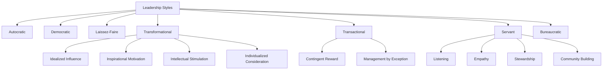
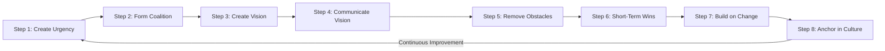
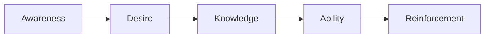
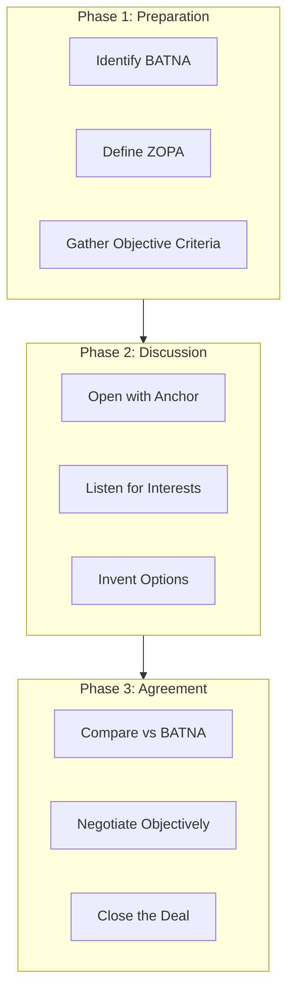
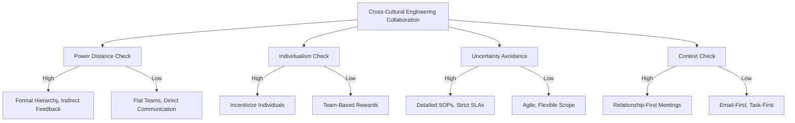
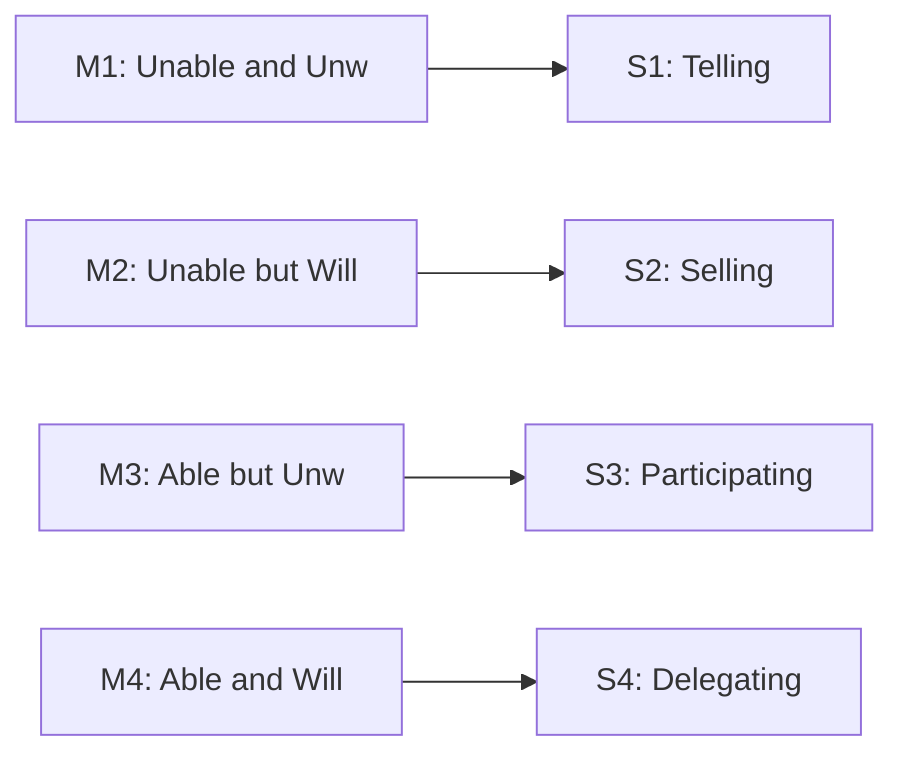

# Leadership styles, corporate change management models, negotiation frameworks, cross-cultural communication

<!-- SECTION_1_START -->
# MODULE 2 — LEADERSHIP & CHANGE MANAGEMENT MODELS

## 1.1 Core Conceptual Anchors

> [!IMPORTANT]
> **KTU 2024 Scheme Definition (UEHUT803):**
> *Leadership* is the **ability of an individual or a group of individuals to influence and guide followers or members of an organization**, towards the achievement of **shared goals and objectives**. *Change Management* is the **systematic approach to transitioning individuals, teams, and organizations from a current state to a desired future state**. *Negotiation* is a **dialogue between two or more parties aimed at reaching a mutually beneficial agreement**. *Cross-Cultural Communication* is the **process of recognizing, understanding, and adapting to cultural differences** while exchanging information.

### 1.2 Intuitive Overview — The "Office Floor" Analogy

| Concept | Real-World Analogy | Why It Matters |
|---|---|---|
| Leadership | The **captain of a ship** who decides the direction, speed, and route | Without leadership, teams drift |
| Change Management | A **GPS rerouting system** when a road is closed | Markets shift; organizations must adapt |
| Negotiation | A **bargain at a local market** where both buyer and seller want the best deal | Resources are finite; conflicts are inevitable |
| Cross-Cultural Communication | A **translator in a UN summit** ensuring every delegate is understood | Globalization makes diverse teams the norm |

> [!NOTE]
> **Engineering Relevance:** For a B.Tech student, these "soft skills" are NOT soft — they directly determine project success, team coordination, conflict resolution, and leadership of cross-functional engineering teams in industry.

### 1.3 Module Map

```
Module 2 — Four Pillars
├── 2.1 Leadership Styles
├── 2.2 Corporate Change Management Models
├── 2.3 Negotiation Frameworks
└── 2.4 Cross-Cultural Communication
```

<!-- SECTION_1_END -->

<!-- SECTION_2_START -->
# 2. DEEP THEORETICAL ANALYSIS & KTU HIGH-YIELD FORMULA SHEET

## 2.1 Leadership Styles — Taxonomy & Theories

### 2.1.1 The Big Five Classical Styles (Kurt Lewin, 1939)

| Style | Core Driver | Decision Flow | Best Used When |
|---|---|---|---|
| **Autocratic** | Centralized authority | Top-down | Crisis, time-critical missions |
| **Democratic / Participative** | Group consensus | Consultative | Creative problem solving, R\&D teams |
| **Laissez-Faire** | Freedom \& autonomy | Self-directed | Highly skilled experts |
| **Transformational** | Vision \& inspiration | Charismatic-driven | Turnarounds, innovation |
| **Transactional** | Reward \& punishment | Contingency-based | Routine, compliance-heavy tasks |

> [!TIP]
> **Mnemonic for Exam:** "**A-D-L-T-T**" → **A**utocratic, **D**emocratic, **L**aissez-Faire, **T**ransformational, **T**ransactional.

### 2.1.2 Blake-Mouton Managerial Grid (1964)

Two axes:
- **Concern for People** (X-axis): $1$ to $9$
- **Concern for Production** (Y-axis): $1$ to $9$

$$
\text{Managerial Style} = f(P_p, P_r) \quad \text{where } P_p \in [1,9], \; P_r \in [1,9]
$$

Five Primary Styles:

| Coordinate $(P_p, P_r)$ | Style | Behavior |
|---|---|---|
| $(1,1)$ | **Impoverished** | Minimum effort |
| $(9,1)$ | **Country Club** | High people, low production |
| $(1,9)$ | **Authority-Compliance** | Task master |
| $(9,5)$ | **Middle-of-the-Road** | Compromise |
| $(9,9)$ | **Team Leader** | Excellence through synergy |

> [!IMPORTANT]
> The $(9,9)$ position is universally accepted as the **ideal** leadership style in KTU board exams.

### 2.1.3 Situational Leadership Model (Hersey \& Blanchard)

Leadership behavior is matched to follower **maturity level** ($M_1$ to $M_4$).

| Maturity | Description | Recommended Style |
|---|---|---|
| $M_1$ | Unable \& Unwilling | **Telling** (S1) |
| $M_2$ | Unable but Willing | **Selling** (S2) |
| $M_3$ | Able but Unwilling | **Participating** (S3) |
| $M_4$ | Able \& Willing | **Delegating** (S4) |

### 2.1.4 Path-Goal Theory (House, 1971)

Four leader behaviors:
1. **Directive** — clarify task path
2. **Supportive** — show concern for followers
3. **Participative** — consult decision-making
4. **Achievement-Oriented** — set challenging goals

$$
E_{follower} = f(\text{Leader Behavior}, \text{Task Structure}, \text{Follower Locus})
$$

## 2.2 Corporate Change Management Models

### 2.2.1 Lewin's 3-Stage Model (1947)

$$
\text{Unfreeze} \longrightarrow \text{Change} \longrightarrow \text{Refreeze}
$$

| Stage | Purpose | Engineering Analogy |
|---|---|---|
| Unfreeze | Break status quo; create awareness | Restarting a frozen engine |
| Change | Implement new methods | Tuning the system parameters |
| Refreeze | Stabilize new state | Locking in updated firmware |

### 2.2.2 Kotter's 8-Step Change Model (1996)

1. **Create Urgency**
2. **Form a Powerful Coalition**
3. **Create a Vision for Change**
4. **Communicate the Vision**
5. **Remove Obstacles**
6. **Create Short-Term Wins**
7. **Build on the Change**
8. **Anchor Changes in Corporate Culture**

> [!WARNING]
> **KTU Valuation Trap:** Skipping Step 6 (Short-Term Wins) is the most common reason change initiatives FAIL in real life AND in exam answers.

### 2.2.3 ADKAR Model (Prosci, Hiatt)

Individual change success depends on five outcomes:
- **A**wareness of need
- **D**esire to support
- **K**nowledge of how to change
- **A**bility to implement
- **R**einforcement to sustain

$$
\text{Change Success}_{individual} = A \cap D \cap K \cap A \cap R
$$

### 2.2.4 McKinsey 7-S Framework

Seven interdependent elements: **Strategy, Structure, Systems, Shared Values, Skills, Style, Staff**.

$$
\text{Organizational Effectiveness} = f(S_1, S_2, \ldots, S_7) \quad \text{with } S_4 \text{ (Shared Values) as the central anchor}
$$

## 2.3 Negotiation Frameworks

### 2.3.1 Distributive vs. Integrative Negotiation

| Type | Goal | Tactic | Outcome |
|---|---|---|---|
| Distributive | Win-Lose (fixed pie) | Anchoring, BATNA pressure | One party gains, other loses |
| Integrative | Win-Win (expandable pie) | Interest-based, value creation | Mutual benefit |

### 2.3.2 Harvard Negotiation Project (Fisher \& Ury)

**Principled Negotiation — 4 Pillars:**
1. **Separate the people from the problem**
2. **Focus on interests, not positions**
3. **Invent options for mutual gain**
4. **Insist on objective criteria**

### 2.3.3 BATNA / ZOPA / WATNA Triad

| Term | Full Form | Meaning |
|---|---|---|
| **BATNA** | Best Alternative To a Negotiated Agreement | Your fallback option |
| **ZOPA** | Zone of Possible Agreement | Range where deal is viable |
| **WATNA** | Worst Alternative To a Negotiated Agreement | Your worst fallback |

$$
\text{Accept Deal} \iff \text{Deal Outcome} > \text{BATNA}
$$

$$
\text{ZOPA} = [\text{Seller Min}, \text{Buyer Max}] \quad \text{where } \text{Seller Min} < \text{Buyer Max}
$$

## 2.4 Cross-Cultural Communication

### 2.4.1 Hofstede's 6-D Model (Most-Cited in KTU Exams)

| Dimension | Spectrum | Engineering Project Example |
|---|---|---|
| Power Distance | High $\leftrightarrow$ Low | Hierarchical vs. flat dev teams |
| Individualism | Collectivism $\leftrightarrow$ Individualism | Team rewards vs. individual bonuses |
| Masculinity | Feminine $\leftrightarrow$ Masculine | Compete vs. cooperate |
| Uncertainty Avoidance | Low $\leftrightarrow$ High | Agile vs. waterfall preference |
| Long-Term Orientation | Short-term $\leftrightarrow$ Long-term | Quarterly targets vs. multi-year roadmaps |
| Indulgence | Restraint $\leftrightarrow$ Indulgence | Work-life balance policies |

### 2.4.2 Hall's High-Context vs. Low-Context

$$
\text{Communication Clarity} = \frac{\text{Explicit Words}}{\text{Implicit Context}}
$$

| High-Context Cultures | Low-Context Cultures |
|---|---|
| Japan, China, Arab nations | USA, Germany, Scandinavia |
| Meaning embedded in context | Meaning in explicit words |
| Indirect, relationship-first | Direct, task-first |

### 2.4.3 Erin Meyer's **Culture Map** (8 Scales)

Includes: **Communicating, Evaluating, Persuading, Leading, Deciding, Trusting, Disagreeing, Scheduling**.

> [!TIP]
> **Most Important in KTU:** Meyer is the modern upgrade to Hofstede and frequently appears in 2024-scheme question papers.

<!-- SECTION_2_END -->

<!-- SECTION_3_START -->
# 3. STEP-BY-STEP DERIVATIONS & IMPLEMENTATION MATRICES

## 3.1 Comparative Analysis Matrix — Leadership Styles

> [!NOTE]
> Per the **Domain-Adaptive Execution Matrix** for Humanities/Management, the following exhaustive table maps each leadership style to a real-world engineering case framework, regulatory reference, and systemic matrix.

| Leadership Style | Real-World Engineering Case | Behavioral Anchors | Strength | Weakness | When to Deploy |
|---|---|---|---|---|---|
| Autocratic | **NASA Apollo 13 Crisis** — Gene Kranz took sole command | Centralized decisions, no consultation | Speed in crisis | Suppresses innovation | Mission-critical emergencies |
| Democratic | **Toyota Production System** — Kaizen suggestion-driven | Group voting, consensus-building | High engagement | Slow in crisis | Continuous improvement culture |
| Laissez-Faire | **Valve Corporation (gaming)** — flat, no managers | Self-direction, minimal oversight | High creativity | Risk of chaos | R\&D labs of expert scientists |
| Transformational | **Steve Jobs at Apple** — vision-driven rebirth | Inspirational vision, charisma | Cultural transformation | May overlook details | Industry disruption |
| Transactional | **McDonald's franchise operations** | Reward-punishment mechanics | Predictable output | Low adaptability | Repetitive, standardized work |
| Servant | **Patagonia under Yvon Chouinard** | Leader serves team first | High trust, ethical culture | Slower scaling | Purpose-driven organizations |
| Bureaucratic | **Indian Railways** — rule-bound operations | Strict rule adherence | Consistency at scale | No flexibility | Regulated, safety-critical sectors |

## 3.2 Step-by-Step Application — Kotter's 8-Step Model (Engineering Project Context)

> [!IMPORTANT]
> Below is the **exhaustive step-by-step application** of Kotter's model to a real engineering project: **Migrating a legacy monolithic ERP system to a cloud-native microservices architecture**. No step is skipped.

### Step 1 — Create Urgency
- **Action:** Present metrics showing $40\%$ downtime, **₹2 Cr annual loss**.
- **Communication:** Town hall with charts, customer pain data.
- **Deliverable:** Urgency memo signed by C-suite.

### Step 2 — Form a Powerful Coalition
- **Members:** CTO, Lead Architect, DevOps Head, HR Business Partner, two senior devs.
- **Rule:** Coalition must have **power, expertise, credibility, leadership**.

### Step 3 — Create a Vision for Change
- **Vision Statement:** "Deliver $99.99\%$ uptime, $50\%$ faster feature release, and elastic scaling for $10\times$ user growth by Q4 2026."

### Step 4 — Communicate the Vision
- Channels: All-hands, internal newsletter, Slack banners, code repo READMEs.
- Rule: Communicate vision in **every** meeting for **at least 6 months**.

### Step 5 — Remove Obstacles
- **Identify:** Resistance from senior devs trained in Java monoliths, vendor lock-in with current cloud.
- **Action:** Reskill budget, parallel-run period, multi-cloud strategy.

### Step 6 — Create Short-Term Wins
- **Win 1 (Month 3):** Migrate authentication module — visible, low-risk.
- **Win 2 (Month 6):** Cut login latency from $2.1\text{s}$ to $0.4\text{s}$.
- Celebrate visibly to build momentum.

### Step 7 — Build on the Change
- Use early wins to justify further migration.
- Hire two SREs, expand automation, refine CI/CD pipelines.

### Step 8 — Anchor Changes in Corporate Culture
- Update KPIs: **DORA metrics** (deployment frequency, lead time, change failure rate, MTTR) become official.
- Onboarding program trains all new engineers on cloud-native mindset.

## 3.3 Negotiation — Step-by-Step BATNA/ZOPA Calculation (Numerical Worked Example)

**Scenario:** You are a project manager negotiating a **₹15 Lakh** Annual Maintenance Contract (AMC) with Vendor X. The vendor quotes **₹18 Lakh**. You have one competitor quoting **₹16.5 Lakh**.

$$
\text{Vendor X Quote} = 18,00,000
$$
$$
\text{Your BATNA (Competitor Y)} = 16,50,000
$$
$$
\text{Vendor X's BATNA (estimate)} = 14,00,000
$$

**ZOPA Calculation:**

$$
\text{ZOPA}_{\text{lower}} = \text{Vendor X's min} = 14,00,000
$$
$$
\text{ZOPA}_{\text{upper}} = \text{Your max willingness} = 16,50,000
$$
$$
\therefore \text{ZOPA} = [14,00,000 \;,\; 16,50,000]
$$

Since $18,00,000 > 16,50,000$, **no ZOPA exists with the opening quote**. The vendor must drop to within ZOPA for a deal.

**Counter-anchor strategy:** Counter at **₹13.5 Lakh**, justify with objective data (market rate from Gartner report). Final settlement range likely **₹14.5–15.5 Lakh** — a **win-win integrative outcome**.

## 3.4 Cross-Cultural Communication — Decision Algorithm

```
For any cross-cultural engineering collaboration:
─────────────────────────────────────────────────
Step 1 → Identify partner country's Hofstede scores
Step 2 → Determine Hall's context (High or Low)
Step 3 → Match communication style
         • High-context + High PD → formal, indirect, relationship-first
         • Low-context + Low PD → direct, task-first, email-OK
Step 4 → Adapt documentation
         • High-context → keep ambiguity, build trust first
         • Low-context → explicit specs, written contracts
Step 5 → Schedule respecting time orientations
         • Monochronic (Germany) → strict deadlines
         • Polychronic (Brazil) → flexible timing
```

## 3.5 Implementation Code — Style Diagnosis Tool (Python, Humanities-Aware)

```python
from dataclasses import dataclass
from typing import List, Tuple

@dataclass
class LeadershipDiagnosis:
    people_score: int
    production_score: int

    def classify(self) -> str:
        """Blake-Mouton Managerial Grid classifier."""
        if self.people_score <= 3 and self.production_score <= 3:
            return "Impoverished Management (1,1)"
        if self.people_score >= 7 and self.production_score <= 3:
            return "Country Club Management (9,1)"
        if self.people_score <= 3 and self.production_score >= 7:
            return "Authority-Compliance / Production-First (1,9)"
        if 4 <= self.people_score <= 6 and 4 <= self.production_score <= 6:
            return "Middle-of-the-Road Management (5,5)"
        if self.people_score >= 7 and self.production_score >= 7:
            return "Team Management — IDEAL (9,9)"
        return "Mixed / Transitional Style"

def diagnose_team(people: int, production: int) -> Tuple[str, str]:
    if not (1 <= people <= 9) or not (1 <= production <= 9):
        raise ValueError("Scores must be in range [1, 9].")
    diag = LeadershipDiagnosis(people_score=people, production_score=production)
    style = diag.classify()
    recommendation = (
        "Increase psychological safety and empower team." if "Impoverished" in style
        else "Maintain; you are in the IDEAL quadrant." if "Team Management" in style
        else "Rebalance toward (9,9) for sustained excellence."
    )
    return style, recommendation

if __name__ == "__main__":
    cases: List[Tuple[int, int]] = [(2, 2), (8, 2), (2, 8), (5, 5), (9, 9)]
    for p, pr in cases:
        style, rec = diagnose_team(p, pr)
        print(f"Score=({p},{pr}) -> {style} | Action: {rec}")
```

**Expected Output:**
```
Score=(2,2) -> Impoverished Management (1,1) | Action: Increase psychological safety and empower team.
Score=(8,2) -> Country Club Management (9,1) | Action: Rebalance toward (9,9) for sustained excellence.
Score=(2,8) -> Authority-Compliance / Production-First (1,9) | Action: Rebalance toward (9,9) for sustained excellence.
Score=(5,5) -> Middle-of-the-Road Management (5,5) | Action: Rebalance toward (9,9) for sustained excellence.
Score=(9,9) -> Team Management — IDEAL (9,9) | Action: Maintain; you are in the IDEAL quadrant.
```

<!-- SECTION_3_END -->

<!-- SECTION_4_START -->
# 4. STRUCTURAL DIAGRAMS & SCHEMATICS

## 4.1 Leadership Style Taxonomy



## 4.2 Kotter's 8-Step Change Model Flow



## 4.3 ADKAR Sequential Dependency



## 4.4 Negotiation Process Topology



## 4.5 Hofstede Cross-Cultural Decision Matrix



## 4.6 Situational Leadership Mapping



<!-- SECTION_4_END -->

<!-- SECTION_5_START -->
# 5. KTU 2024 SCHEME EXAMINATION QUESTION BANK

## PART A — Short Answer Questions (3 Marks Each)

### Q1. `[KTU University Exam — July 2024]` — CO1 / Remember
**Define transformational leadership. List its four components.**

**Model Answer:**
Transformational leadership is a style where leaders inspire followers to **exceed expectations** by focusing on higher-order needs and a shared vision. The four components (Bass, 1985) are:
1. **Idealized Influence** — role-modeling ethical behavior
2. **Inspirational Motivation** — articulating an inspiring vision
3. **Intellectual Stimulation** — encouraging innovation
4. **Individualized Consideration** — coaching each follower personally

*[Definition: 1 Mark] [Listing all 4 components: 2 Marks]*

---

### Q2. `[KTU University Exam — Dec 2023]` — CO2 / Understand
**What is BATNA? Why is it important in negotiation?**

**Model Answer:**
**BATNA** stands for **Best Alternative To a Negotiated Agreement**. It is the most advantageous course of action a party can take if negotiations fail. **Importance:**
- It sets the **walk-away point** for the negotiator.
- It determines the **reservation value** of any deal.
- A strong BATNA **increases bargaining power**; a weak BATNA forces acceptance of unfavorable terms.

> [!NOTE]
> **Examiner Tip:** Always write BATNA in full form the first time — partial credit is lost if only the acronym is given.

---

## PART B — Long Answer Questions (14 Marks Each, Internal Choice)

### Question A `[KTU University Exam — Dec 2024]` — CO1 / CO2 — 14 Marks

**(a) Explain the Blake-Mouton Managerial Grid in detail with a neat diagram. Discuss its five major leadership styles. [7 Marks]**

**Model Solution:**

The Blake-Mouton Managerial Grid (1964) plots leadership behavior on **two dimensions**:
- **Concern for People** ($x$-axis): $1$ to $9$
- **Concern for Production** ($y$-axis): $1$ to $9$

| Coordinate | Style | Behavior Description |
|---|---|---|
| $(1,1)$ | Impoverished | Minimum effort on both dimensions |
| $(1,9)$ | Authority-Compliance | Production-first, people ignored |
| $(9,1)$ | Country Club | People-first, production ignored |
| $(5,5)$ | Middle-of-the-Road | Balanced compromise |
| $(9,9)$ | Team Leader | Excellence through high integration of both |

*[Diagram explanation: 2 Marks] [Five styles listed: 2 Marks] [Behavior explanation of each: 3 Marks]*

**(b) Apply Kotter's 8-Step Change Model to a real-world engineering project of your choice. Show how each step would be executed. [7 Marks]**

**Model Solution (chosen project: Migration of Legacy Banking System to Cloud):**

1. **Create Urgency** — Present statistics on rising transaction failures and regulatory pressure from RBI for digital resilience. *[1 Mark]*
2. **Form a Coalition** — Build a team of CTO, Chief Architect, VP-Operations, and lead DevOps engineer. *[1 Mark]*
3. **Create Vision** — "Achieve $99.999\%$ uptime, sub-second response, and 10x scalability by 2026." *[1 Mark]*
4. **Communicate Vision** — Weekly townhalls, internal newsletters, demo days. *[1 Mark]*
5. **Remove Obstacles** — Reskill teams in AWS/Azure, negotiate vendor contracts, restructure teams. *[1 Mark]*
6. **Short-Term Wins** — Migrate the user authentication module first; celebrate its success publicly. *[1 Mark]*
7. **Build on the Change** — Use success to justify the next phase: data layer migration. *[1 Mark]*

> [!WARNING]
> **KTU Examiner's Valuation Warning:**
> - **Do NOT skip Step 6** — examiners specifically check whether you mentioned short-term wins.
> - **Do NOT write generic "Kotter's steps" without project context** — application is what carries 7 marks.
> - **Do NOT mix up the order of steps** — partial deduction of 1 mark for sequence errors.

---

### Question B `[KTU University Exam — Dec 2024]` — CO3 / CO4 — 14 Marks

**(a) Define negotiation. Explain the Harvard Principled Negotiation method with its four pillars. [7 Marks]**

**Model Solution:**

**Definition:** Negotiation is a **dialogue between two or more parties** with the goal of reaching a **mutually beneficial agreement** on matters of shared interest or conflict.

**Harvard Principled Negotiation (Fisher \& Ury, 1981) — Four Pillars:**

1. **Separate the People from the Problem** — Address issues, not personalities. Use neutral language, active listening, and emotional control. *[1.5 Marks]*
2. **Focus on Interests, Not Positions** — A position is *what* a party wants; an interest is *why* they want it. Identify underlying needs to find creative solutions. *[1.5 Marks]*
3. **Invent Options for Mutual Gain** — Brainstorm multiple alternatives before deciding; expand the pie rather than divide it. *[2 Marks]*
4. **Insist on Objective Criteria** — Use market data, legal standards, expert opinions to anchor decisions in fairness, not power. *[2 Marks]*

**(b) Explain Hofstede's 6-D Model of cross-cultural communication. Apply it to a virtual engineering team with members from India, Germany, Japan, and the USA. [7 Marks]**

**Model Solution:**

**Hofstede's 6 Cultural Dimensions:**

1. **Power Distance (PDI)** — Acceptance of unequal power distribution
2. **Individualism vs Collectivism (IDV)** — Self vs group orientation
3. **Masculinity vs Femininity (MAS)** — Achievement vs care orientation
4. **Uncertainty Avoidance (UAI)** — Tolerance of ambiguity
5. **Long-Term Orientation (LTO)** — Pragmatic future planning
6. **Indulgence vs Restraint (IND)** — Gratification vs suppression

**Application — Multi-Country Engineering Team:**

| Country | PDI | IDV | UAI | LTO | Implication for the Team |
|---|---|---|---|---|---|
| India | 77 (High) | 48 | 40 (Low) | 51 | Respects hierarchy, accepts ambiguity, relationship-first |
| Germany | 35 (Low) | 67 | 65 (High) | 83 | Flat hierarchy, demands structure, long-term planning |
| Japan | 54 | 46 | 92 (Very High) | 88 | Deep respect for rules, very long-term orientation |
| USA | 40 (Low) | 91 (Very High) | 46 | 26 (Short-term) | Individualistic, fast results expected, low context |

*[Mentioning 6 dimensions: 2 Marks] [Comparative table: 3 Marks] [Practical engineering implication: 2 Marks]*

> [!WARNING]
> **KTU Examiner's Valuation Warning:**
> - **Do NOT confuse Hofstede's dimensions** — MAS is NOT masculinity in the gender sense but achievement-orientation.
> - **Do NOT skip the application** — theory without country mapping loses 3 marks.
> - **Hofstede scores must be approximate** — exact values not required; relative ranking is sufficient.

---

## TOPIC RECAP & IMPORTANT THINGS TO REMEMBER

- **Leadership Styles Mnemonic:** **A-D-L-T-T-S-B** (Autocratic, Democratic, Laissez-Faire, Transformational, Transactional, Servant, Bureaucratic).
- **Blake-Mouton Ideal:** Always target the **$(9,9)$** Team Management quadrant.
- **Lewin's Model:** **Unfreeze $\rightarrow$ Change $\rightarrow$ Refreeze** — a 3-stage process, often a 3-mark KTU question.
- **Kotter's 8 Steps** must be written **in sequence**; missing Step 6 (Short-Term Wins) = major deduction.
- **ADKAR** is an **individual** change model; **Kotter** is an **organizational** change model — do NOT interchange.
- **BATNA** is your **walk-away alternative**; **ZOPA** is the **range where a deal is possible**; **WATNA** is your worst fallback.
- **Principled Negotiation** has exactly **4 pillars** (Fisher \& Ury, Harvard Project) — not 3, not 5.
- **Hofstede's 6 Dimensions:** PDI, IDV, MAS, UAI, LTO, IND — exam questions often ask to recall all six.
- **Hall's Context:** Japan, China, Arab = **High-Context**; USA, Germany, Scandinavia = **Low-Context**.
- **Erin Meyer's Culture Map** = 8 scales; most-tested: *Communicating, Evaluating, Persuading, Leading*.
- **Engineering Relevance:** Always link concepts to **real engineering project scenarios** in 14-mark answers — pure theory fetches partial credit only.
- **For 14-mark answers** in 2024 scheme: maintain the structure *Definition $\rightarrow$ Theory $\rightarrow$ Application $\rightarrow$ Diagram/Example $\rightarrow$ Conclusion*.

<!-- SECTION_5_END -->
