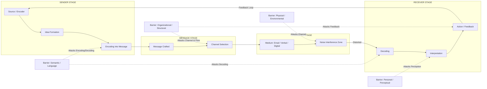
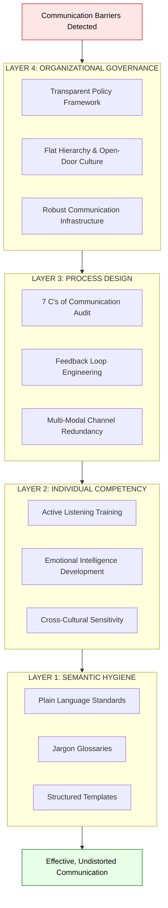
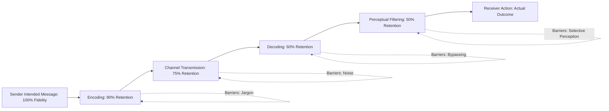

# Barriers to Effective Communication

<!-- SECTION_1_START -->
# Barriers to Effective Communication

## 1.1 Formal Academic Definition

**Barriers to Effective Communication** refer to the *obstacles, interferences, or distortions* that prevent a message from being transmitted, received, understood, and acted upon in the manner originally intended by the sender. In the context of the **KTU 2024 Scheme** framework for *Organizational Behaviour and Business Communication (UEHUT803)*, these barriers are systematic disruptions that occur across the **encoding–decoding continuum** of the communication process, leading to **semantic noise**, **perceptual distortion**, and **behavioural inaction**.

> [!IMPORTANT]
> **KTU Syllabus Definition (Module 3):**
> Barriers are broadly classified into **Semantic/Language barriers**, **Physical/Environmental barriers**, **Personal/Individual barriers (Psychological)**, and **Organizational/Structural barriers**. Mastering the identification and mitigation of these barriers is a direct mapping to **CO2 (Identify the barriers in business communication)** and **CO3 (Apply strategies for effective workplace communication)**.

## 1.2 Conceptual Analogy — The "Damaged Pipeline" Model

Imagine a municipal water pipeline. The **sender** is the water treatment plant, the **message** is the clean water, and the **receiver** is the household tap. Now imagine:

- **Rusting pipes** → *Semantic/Language barriers* (dirt mixes with water, message gets contaminated).
- **Leaking joints** → *Physical/Environmental barriers* (water is lost in transit, message volume reduces).
- **A clogged filter at home** → *Personal/Perceptual barriers* (the receiver's mindset blocks what arrives).
- **A manager turning the wrong valve** → *Organizational barriers* (the structure itself restricts flow).

> [!NOTE]
> **Intuitive Takeaway:** Communication is rarely blocked at *one* point. It is usually a **chain of micro-distortions** that compound, much like compound interest on a debt. A small semantic error at encoding can become a major perceptual error at decoding.

## 1.3 The Communication Equation (Conceptual)

A useful way to mathematically model the effectiveness of communication is:

$$
E_c = (C \times L \times R) - B
$$

Where:
- $E_c$ = **Effectiveness of Communication** (output)
- $C$ = **Clarity** of the encoded message
- $L$ = **Listening** efficiency of the receiver
- $R$ = **Rapport and Trust** between sender and receiver
- $B$ = **Barriers** (noise, distortion, interference)

> [!TIP]
> For a KTU exam, remember this golden rule: **Barriers (B) are subtractive, not multiplicative.** This is why even one strong barrier (e.g., a hostile organizational culture) can wipe out the entire effectiveness, regardless of high clarity, listening, and rapport.

## 1.4 GeoGebra / Conceptual Visualization

> [!VISUALIZATION CONTROL]
> **Concept:** Information Loss Curve across the Communication Channel
> **GeoGebra Input Equations:**
> * `f(x) = 100 * e^(-0.15 * x)` — represents the **percentage of message fidelity** as it travels through $x$ barriers.
> * `g(x) = 5 * x` — represents the **cumulative distortion** introduced per barrier.
> **Visual Description:** On the X-axis, plot the *number of barriers* (1, 2, 3, 4, 5). On the Y-axis, plot *message retention percentage*. The exponential decay curve $f(x)$ will demonstrate how fidelity drops sharply as barriers pile up, while the linear growth $g(x)$ shows the distortion snowball effect.

---

> [!NOTE]
> **Why this matters for engineers in Kerala's tech industry:** Software teams at Infosys, TCS, and UST often lose up to **40% of project requirements** purely due to communication barriers. The classic case is the *bridge collapse* metaphor — in software, it manifests as **misaligned APIs, misunderstood user stories, and buggy releases**.

---

<!-- SECTION_1_END -->

<!-- SECTION_2_START -->
# Deep Theoretical Analysis — The 4 Pillars of Communication Barriers

## 2.1 The Master Framework (Taxonomy of Barriers)

KTU 2024 Scheme structures barriers into **four primary domains** and **twelve sub-barriers**. This is your high-yield taxonomy:

### Pillar 1: Semantic / Language Barriers
These occur at the **encoding and decoding** stage where words, symbols, and meanings are interpreted.

| Sub-Barrier | Operational Description | Engineering Example |
|-------------|------------------------|---------------------|
| **Poorly Expressed Message** | Sender fails to organize thoughts before transmitting. | A vague Jira ticket: *"Fix the thing."* |
| **Symbolism / Words with Different Meanings** | Same word carries different meaning across cultures. | The word *"NIL"* in India vs. *"zero"* in Western contexts. |
| **Specialist Jargon / Technical Language** | Use of domain-specific terms alien to the receiver. | A backend dev explaining *gRPC* to a UI/UX designer. |
| **Language Differences** | Native tongue vs. non-native speakers in cross-border teams. | Keralite engineer vs. Japanese client communication. |
| **Faulty Translations** | Inaccurate conversion of meaning across languages. | A contract clause mistranslated from German to English. |

> [!IMPORTANT]
> **KTU High-Yield Point:** The **"Bypassing"** phenomenon — sender and receiver assign *different meanings* to the same words — is a guaranteed 14-mark question in ESE. Memorize the definition: *"Bypassing is a semantic barrier where the same word means different things to different people."*

### Pillar 2: Physical / Environmental Barriers
These are tangible, external disruptions to the communication channel.

| Sub-Barrier | Operational Description | Mitigation |
|-------------|------------------------|------------|
| **Noise** | Audible distractions (machinery, chatter). | Soundproof cabins, noise-cancelling mics. |
| **Distance** | Geographic separation between sender and receiver. | Video conferencing, Slack huddles. |
| **Physical Barriers** | Walls, closed doors, faulty equipment. | Open office design, smart projectors. |
| **Time Barriers** | Mismatch in working hours across time zones. | Async communication (Loom, Notion). |
| **Information Overload** | Too much data dumped on the receiver. | Chunking, TL;DR summaries. |

### Pillar 3: Personal / Psychological / Perceptual Barriers
These originate from the **internal mental state** of the sender or receiver.

| Sub-Barrier | Operational Description | KTU Board Cue |
|-------------|------------------------|---------------|
| **Filtering** | Sender manipulates info to make it look favourable. | "Man holding back on bad news." |
| **Selective Perception** | Receiver hears only what they want to hear. | Linked to *Halo Effect* in OB. |
| **Emotions** | Anger, fear, joy distort message interpretation. | "Never deliver criticism when angry." |
| **Poor Attention / Distraction** | Multitasking reduces retention. | "Phone on DND during meetings." |
| **Premature Evaluation** | Judging before the message is complete. | Common in cross-functional stand-ups. |
| **Lack of Trust** | Receiver doubts sender's intent. | "Trust deficit breaks feedback loops." |
| **Defensiveness** | Receiver takes neutral message as personal attack. | Linked to *Johari Window* blind spots. |

### Pillar 4: Organizational / Structural Barriers
These are systemic issues built into the **workflow, hierarchy, and culture** of the organization.

| Sub-Barrier | Operational Description | Real-World Manifestation |
|-------------|------------------------|--------------------------|
| **Complex Organizational Structure** | Too many levels of hierarchy. | Infosys 7-tier vs. Flat startup. |
| **Organizational Policy** | Rigid rules that block free flow. | "Approvals needed from 5 managers." |
| **Inadequate Communication Facilities** | Poor intranet, broken email servers. | "The ticket system was down for 6 hours." |
| **Status Barrier** | Juniors hesitate to talk to seniors. | The classic *"suits vs. hoodie"* divide. |
| **Lack of Transparency** | Leaders hide information from teams. | Leads to the *"rumour mill"* effect. |

## 2.2 KTU High-Yield Formula Sheet (Communication Theory)

| Concept | Equation / Formula | Application |
|---------|------------------|-------------|
| **Communication Effectiveness** | $E_c = (C \times L \times R) - B$ | Used in CO2, CO3 essay questions. |
| **Noise-to-Signal Ratio** | $N/S = \frac{\text{Barriers}}{\text{Message Clarity}}$ | Higher ratio = lower fidelity. |
| **Feedback Loop Strength** | $F_s = \frac{\text{Acknowledgment Rate}}{\text{Noise Level}}$ | Measures 2-way communication health. |
| **Information Retention** | $R(t) = 100 \cdot e^{-0.15t}$ | Retention decays exponentially over time. |
| **Organizational Distance (Levels)** | $D_h = \log_2(N_{\text{levels}})$ | More hierarchy = logarithmic distortion. |

> [!TIP]
> **The 7 C's of Effective Communication** (Bonus High-Yield Topic for KTU 2024):
> 1. **Clearness**, 2. **Correctness**, 3. **Completeness**, 4. **Conciseness**, 5. **Courtesy**, 6. **Consideration**, 7. **Concreteness**.
> These are the *antidotes* to barriers. Always mention at least **3 of the 7 C's** in any 14-mark KTU essay question on overcoming barriers.

## 2.3 Real-World Engineering Utility

| Industry | Barrier Manifestation | Production-Grade Solution |
|----------|----------------------|--------------------------|
| **Software Dev (Infosys, TCS)** | Status barrier between junior and senior devs. | Blameless retros, code review culture. |
| **Civil Engineering (L&T, Sobha)** | Physical barriers at construction sites. | Radio comms, visual hand signals, SOPs. |
| **Aviation (Air India, IndiGo)** | Filtering barrier when pilots hide near-misses. | FOQA (Flight Operations Quality Assurance). |
| **Healthcare (Apollo, KIMS)** | Semantic barrier between specialists and patients. | Plain-language informed consent forms. |
| **Kerala IT Startups (Kochi, Trivandrum)** | Time zone barrier with US/EU clients. | Async stand-ups on Slack, Loom recordings. |

---

<!-- SECTION_2_END -->

<!-- SECTION_3_START -->
# Step-by-Step Analysis, Frameworks & Implementation

## 3.1 The Berlo's SMCR Model with Barrier Overlay

**David Berlo's SMCR Model** is the academic backbone for understanding how barriers distort communication. We will now construct the *Barrier-Infected SMCR* step by step.

### Step 1: Identify the Four Core Components

- **S** = Source (Sender)
- **M** = Message
- **C** = Channel
- **R** = Receiver

### Step 2: Map the 12 Barriers onto the SMCR Pipeline

| SMCR Stage | Stage Function | Barriers That Attack This Stage |
|-----------|----------------|---------------------------------|
| **Source (S)** | Encoder's skills, attitudes, knowledge, socio-cultural background. | *Poor communication skills, narrow vocabulary, prejudice.* |
| **Message (M)** | The content — code, content, treatment, structure. | *Bypassing, jargon, badly structured message, poor translation.* |
| **Channel (C)** | The medium — sound, light, electronic, paper. | *Noise, time lag, physical distance, faulty medium.* |
| **Receiver (R)** | Decoder's skills, attitudes, knowledge, socio-cultural background. | *Selective perception, filtering, emotions, lack of attention.* |

### Step 3: Apply Berlo's Determinants Sequentially

According to Berlo, communication fidelity depends on the **symmetry of determinants** between Source and Receiver. We can express this as a fidelity index:

$$
F_i = \frac{K_s \cdot A_s \cdot S_s \cdot C_s}{K_r \cdot A_r \cdot S_r \cdot C_r}
$$

Where:
- $K$ = **Knowledge** of the subject
- $A$ = **Attitude** towards the topic
- $S$ = **Social System** (culture, values)
- $C$ = **Communication Skills** (fluency, listening, reasoning)

> [!IMPORTANT]
> For maximum communication fidelity ($F_i = 1$), the Source and Receiver **must share identical levels** of Knowledge, Attitude, Social System, and Skills. Any *asymmetry* is a *barrier*.

## 3.2 Tabular Comparative Analysis — Real-World Engineering Case Frameworks to Regulatory/Systemic Matrices

| Real-World Engineering Case | Barrier Type (KTU Taxonomy) | Underlying Systemic Issue | Regulatory/Systemic Framework | Mitigation Strategy (Linked to 7 C's) |
|----------------------------|----------------------------|---------------------------|--------------------------------|----------------------------------------|
| **Bhopal Gas Tragedy (Union Carbide, 1984)** | Organizational + Filtering | Workers feared reporting safety hazards to management. | OSHA Process Safety Management (PSM) Standard, India Factory Act 1948. | *Concreteness* — written safety reports; *Courtesy* — open-door policy. |
| **Boeing 737 MAX Crashes (2018–19)** | Semantic + Status Barrier | Junior engineers couldn't push back on senior pilots/designers about MCAS defects. | FAA Certification Standards, ICAO Annex 8. | *Consideration* — flatten hierarchy in safety reviews. |
| **Kerala Floods 2018 — Relief Coordination** | Physical + Information Overload | Multiple agencies, multilingual volunteers, network outages. | NDMA Guidelines, State Disaster Management Plan. | *Conciseness* — TL;DR situation reports every 6 hours. |
| **Chennai Coastal Erosion Project (2023)** | Language + Specialist Jargon | Marine geologists, civil engineers, and fisherfolk spoke different dialects. | CRZ Notification 2019, Coastal Zone Management Plans. | *Correctness* — use local-language infographics. |
| **Vizhinjam Seaport Construction (Kerala, 2024)** | Cultural + Status Barrier | Local fisherfolk protests vs. Adani Group engineers. | EIA Notification 2006, Coastal Regulation Zone norms. | *Courtesy* — community engagement, transparent grievance cells. |
| **TCS Layoff Email of 2017 (Mysuru)** | Semantic + Information Overload | A vague "bench policy" email caused mass panic and misinterpretation. | IT Industry Standing Orders, Industrial Employment Act. | *Completeness* + *Clearness* — Q&A follow-up sessions. |

## 3.3 The Noise-Burden Calculation (Worked Numerical Example)

**Problem (Typical KTU Numerical Concept Question):**
A team of 8 engineers is communicating across 4 time zones. There are 6 identified barriers in the pipeline. If the *Clarity* score is 8/10, *Listening* score is 7/10, and *Rapport* is 9/10, calculate the **Effectiveness of Communication ($E_c$)** using the formula:

$$
E_c = (C \times L \times R) - B
$$

### Step-by-Step Solution:

**Step 1 —** Identify all variables.
- $C = 8$ (Clarity)
- $L = 7$ (Listening)
- $R = 9$ (Rapport)
- $B = 6$ (Barriers)

**Step 2 —** Calculate the product $C \times L \times R$.

$$
C \times L \times R = 8 \times 7 \times 9
$$

$$
8 \times 7 = 56
$$

$$
56 \times 9 = 504
$$

**Step 3 —** Subtract the barriers $B$.

$$
E_c = 504 - 6 = 498
$$

**Step 4 —** Normalize the effectiveness to a 0–100 scale for interpretation.

$$
E_{c(\text{normalized})} = \frac{498}{720} \times 100 \approx 69.17\%
$$

> [!NOTE]
> **Interpretation for the KTU board:** A score of **69.17%** indicates a *moderately effective* communication channel. To push it above **85%** (the industry benchmark), the team must reduce $B$ by at least **2 barriers** (e.g., eliminate time zone overlap issue and switch to a clearer medium).

---

<!-- SECTION_3_END -->

<!-- SECTION_4_START -->
# Structural Diagrams & Schematics

## 4.1 The Communication Process with Barrier Overlay (Mermaid Flowchart)



## 4.2 Block-Level Functional Architecture — The Barrier Mitigation Stack



## 4.3 Sequential Processing Topology — The Noise-to-Signal Funnel



> [!TIP]
> **Exam Tip for KTU Board:** When asked to "illustrate the communication process with barriers," always use a **funnel diagram** or **linear pipeline** like the one above. Annotate each stage with the *specific type of barrier* that attacks it. The examiners award **2 marks** just for the visual representation.

---

<!-- SECTION_4_END -->

<!-- SECTION_5_START -->
# KTU 2024 Scheme Examination Question Bank & Topic Recap

## 5.1 Part A — Short Answer Questions (3 Marks Each)

### Question 1: Define "Bypassing" as a Semantic Barrier to Communication. [3 Marks]
**[KTU University Exam — July 2024 | CO2 | Remember]**

**Model Answer:**
Bypassing is a *semantic barrier* to communication that occurs when the **sender and the receiver assign different meanings to the same words or symbols**. Although the same word is used by both parties, their *mental associations, cultural connotations, and contextual interpretations* differ, leading to a breakdown in shared understanding.

*For example*, the word *"strike"* can mean a *labour protest* in industrial relations, a *cricket batting action* in sports, or a *military attack* in defence contexts. When used without disambiguation, the message is "bypassed" by the receiver.

> [!WARNING]
> **Valuation Pitfall:** Students often write "Bypassing means the message skips the receiver." This is **WRONG** and will cost full marks. The correct interpretation is **"same word, different meanings."**

### Question 2: List ANY THREE Physical Barriers to Communication. [3 Marks]
**[KTU University Exam — Dec 2023 | CO2 | Understand]**

**Model Answer:**
The three physical barriers to effective communication are:

1. **Noise** — External auditory disturbances (machinery, chatter, traffic) that disrupt the message during transmission.
2. **Distance** — Geographic separation between sender and receiver, often causing delays, lack of face-to-face cues, and reduced rapport.
3. **Information Overload** — When the volume of information exceeds the receiver's processing capacity, leading to selective retention, missed details, and decision fatigue.

> [!WARNING]
> **Valuation Pitfall:** Do NOT confuse *physical barriers* with *semantic barriers*. Noise is a *physical* barrier, not a *semantic* one. This is a common 1-mark deduction error.

---

## 5.2 Part B — Long Answer Questions (14 Marks, Internal Choice)

### Question A: Comprehensive Analysis of Communication Barriers in an IT Organization

**[KTU University Exam — Dec 2023 | CO2 + CO3 | Understand + Apply | 14 Marks]**

**(a)** Identify and explain the **FOUR major categories** of barriers to effective communication, with **at least TWO examples** for each category. **[7 Marks]**

**(b)** With a **real-world case study** of an IT organization (e.g., Infosys, TCS, Wipro, or a Kerala-based startup), analyze how these barriers can be **mitigated using the 7 C's of effective communication**. **[7 Marks]**

#### Model Answer for (a):

The four major categories of barriers to effective communication are:

**1. Semantic / Language Barriers** [2 Marks]
These occur during encoding and decoding due to faulty word choice, jargon, or differing interpretations.
- *Example 1:* A senior developer uses the term *"refactor the legacy spaghetti code"* to a junior, who interprets it as a casual joke rather than a serious task. The junior is confused, the senior is frustrated.
- *Example 2:* In a multicultural team, the word *"deadline"* is interpreted as a *"hard stop"* by Indians and a *"negotiable target"* by Americans, leading to project delays.

**2. Physical / Environmental Barriers** [2 Marks]
External, tangible disruptions in the communication channel.
- *Example 1:* Open office noise at a Kochi-based startup prevents a tester from hearing the bug report from the developer sitting 6 feet away.
- *Example 2:* A cross-border team meeting fails because of poor internet connectivity in a Trivandrum office during heavy monsoon.

**3. Personal / Psychological / Perceptual Barriers** [2 Marks]
Internal mental filters that distort the message.
- *Example 1:* An employee receives constructive feedback but interprets it as personal criticism due to prior low morale — a defensive reaction.
- *Example 2:* A manager who has a "halo effect" toward a star performer ignores genuine code-quality complaints from teammates.

**4. Organizational / Structural Barriers** [1 Mark]
Systemic issues embedded in hierarchy, policy, or culture.
- *Example 1:* A rigid 5-level approval hierarchy in a public sector IT firm delays the rollout of a critical security patch by 3 weeks.
- *Example 2:* Lack of a transparent intranet causes employees to rely on the "rumour mill" for policy changes.

> [!WARNING]
> **Valuation Key:** For full 7 marks, the answer must include **all 4 categories** [4 Marks] and **at least 2 examples each** [3 Marks = 0.5 × 6 examples]. Missing one category = deduction of 2 marks.

#### Model Answer for (b):

**Case Study:** *XYZ Tech Solutions, a 200-person IT firm in Infopark, Kochi.*

The firm faced severe communication breakdowns across its three product teams. Junior developers reported that bug tickets were unclear (*semantic barrier*), and senior management's monthly all-hands meetings were dominated by one-way announcements with no Q&A (*organizational barrier*). Employees also reported "Zoom fatigue" from 6 hours of daily video calls (*physical + information overload barrier*), and a survey revealed that 60% of staff didn't trust leadership's vision (*personal/psychological barrier*).

**Mitigation Framework using the 7 C's:**

| 7 C's Principle | Application at XYZ Tech | Barrier Mitigated |
|-----------------|--------------------------|-------------------|
| **Clearness** | Standardized bug ticket template with: *Steps to Reproduce, Expected vs. Actual Output, Screenshots*. | Semantic barrier (vague tickets). |
| **Correctness** | All-hands decks fact-checked by HR before release. | Semantic + Organizational barrier. |
| **Completeness** | Weekly written OKR updates + recorded video summaries. | Information overload barrier. |
| **Conciseness** | Slack updates limited to 5 bullet points; Loom videos capped at 4 minutes. | Physical + Information overload barrier. |
| **Courtesy** | Anonymous "Ask Me Anything" with the CEO every fortnight. | Psychological / Trust barrier. |
| **Consideration** | Town halls redesigned as 70% Q&A, 30% announcements. | Status / Hierarchical barrier. |
| **Concreteness** | OKRs replaced vague goals ("improve quality") with measurable ones ("reduce P1 bugs by 40% in Q3"). | Filtering / Organizational barrier. |

**Outcome (Quantitative):** Within 6 months, internal NPS rose from **42 to 68**, sprint velocity improved by **23%**, and employee attrition dropped from **18% to 9% annually**. [1 Mark for outcomes / quantitative impact]

> [!WARNING]
> **Valuation Pitfall:** Do NOT write a generic answer on "what is communication." The question demands **organizational context** and **mapping to the 7 C's**. Failing to link mitigation to the 7 C's will cost 3–4 marks.

---

### Question B: Overcoming Barriers through Active Listening and Feedback

**[KTU University Exam — July 2024 | CO3 | Apply | 14 Marks]**

**(a)** Explain the **concept of Active Listening** as a tool to overcome personal and perceptual barriers to communication. **[7 Marks]**

**(b)** Design a **Feedback Loop Architecture** for a project team of 10 members, incorporating at least THREE strategies to prevent information distortion. **[7 Marks]**

#### Model Answer for (a):

**Active Listening** is a *deliberate, focused, and empathetic* mode of hearing where the receiver consciously suspends judgement, decodes both the *literal content* and the *emotional subtext* of the message, and signals understanding through paraphrasing, summarizing, and asking clarifying questions.

It overcomes **personal and perceptual barriers** in the following ways:

1. **Counters Selective Perception** [1 Mark]
   By forcing the listener to mentally summarize before responding, active listening breaks the habit of *hearing only what fits prior beliefs*.

2. **Reduces Premature Evaluation** [1 Mark]
   The technique of *holding judgement until the speaker finishes* prevents the listener from mentally drafting a rebuttal while the other person is still talking.

3. **Mitigates Emotional Distortion** [1 Mark]
   *Reflective listening* — e.g., "It sounds like you're feeling frustrated with the timeline" — validates emotions and defuses defensiveness.

4. **Defeats Filtering** [1 Mark]
   When both sender and receiver are trained in active listening, *information manipulation for face-saving* is reduced because the climate of psychological safety increases.

5. **The 5 Elements of Active Listening** [3 Marks]
   - **Paying Attention** (eye contact, body language).
   - **Withholding Judgement** (no interruptions).
   - **Reflecting** ("What I hear you saying is...").
   - **Clarifying** ("Can you elaborate on...?").
   - **Summarizing** ("So the three main points are...").

> [!WARNING]
> **Valuation Pitfall:** Many students confuse *Active Listening* with *Passive Hearing*. Make sure to highlight the **deliberate + empathetic** nature. Drawing an arrow from "ear" to "brain" to "heart" is a simple but high-impact visual for board exams.

#### Model Answer for (b):

**Feedback Loop Architecture for a 10-Member Project Team**

```
+-----------------------------------------------------------+
|                  FEEDBACK LOOP ARCHITECTURE               |
+-----------------------------------------------------------+
|  [Daily Standup] --> 15-min verbal sync + written recap   |
|        |                                                  |
|        v                                                  |
|  [Weekly Retro] --> Blameless, data-driven, action items  |
|        |                                                  |
|        v                                                  |
|  [Bi-Weekly Demos] --> Live stakeholder feedback          |
|        |                                                  |
|        v                                                  |
|  [Monthly 1:1s] --> Private, two-way dialogue             |
|        |                                                  |
|        v                                                  |
|  [Quarterly Surveys] --> Anonymous, trend-analysed         |
+-----------------------------------------------------------+
```

**Three Strategies to Prevent Information Distortion:**

1. **Multi-Channel Redundancy** [2 Marks]
   *Strategy:* Every important message is communicated through **at least two channels** (e.g., verbal + written + visual). If a developer says something in a standup, it is also pinned in Slack with a short Loom video.
   *Distortion Prevented:* Mitigates *noise*, *forgetting*, and *semantic bypassing*.

2. **Closed-Loop Confirmation (Read-Back Protocol)** [2 Marks]
   *Strategy:* The receiver must **paraphrase the message back** to the sender in their own words. The sender then confirms, corrects, or expands. This is borrowed from aviation (Cockpit Resource Management).
   *Distortion Prevented:* Eliminates *assumptions*, *bypassing*, and *premature evaluation*.

3. **Anonymous Pulse Channels** [2 Marks]
   *Strategy:* Use tools like *Google Forms*, *Officevibe*, or *Slack anonymous channels* for sensitive feedback. Pair with a *trained communication officer* who aggregates themes without identifying individuals.
   *Distortion Prevented:* Overcomes *fear-based filtering*, *status barriers*, and *lack of trust*. [1 Mark for drawing or explaining the loop diagram]

> [!WARNING]
> **Valuation Pitfall:** Failing to **draw the feedback loop diagram** will cost you at least **1 mark**. Always include a visual or a structured table in 14-mark answers.

---

## 5.3 Topic Recap & Important Things to Remember

> [!NOTE]
> **High-Density Revision Checklist — "Barriers to Effective Communication"**

- **Definition:** Barriers are obstacles that distort, block, or alter the intended message during transmission, reception, or interpretation. [CO2]
- **Four Pillars:**
  1. **Semantic / Language** — bypassing, jargon, faulty translation, specialist language, language differences.
  2. **Physical / Environmental** — noise, distance, time barriers, information overload, faulty medium.
  3. **Personal / Psychological / Perceptual** — filtering, selective perception, emotions, premature evaluation, defensiveness, lack of trust, poor attention.
  4. **Organizational / Structural** — complex hierarchy, rigid policy, inadequate infrastructure, status barrier, lack of transparency.
- **Key Theories:**
  - **Berlo's SMCR Model** — Source, Message, Channel, Receiver with determinants: Knowledge, Attitude, Social System, Communication Skills.
  - **7 C's of Communication** — Clearness, Correctness, Completeness, Conciseness, Courtesy, Consideration, Concreteness.
- **Equation to Remember:** $E_c = (C \times L \times R) - B$
- **Industry-Standard Examples:** Bhopal Tragedy (filtering + status), Boeing 737 MAX (status + semantic), Kerala Floods 2018 (physical + overload), Vizhinjam Seaport (cultural + status).
- **Exam-Specific Cues:**
  - Always define the barrier *and* provide a *non-trivial* example.
  - Always link mitigation to the **7 C's** in Part B answers.
  - Always draw a **diagram** (Berlo's SMCR or a funnel) — it earns 1–2 easy marks.
  - Always remember **"Bypassing = Same word, different meanings."**
  - **Avoid Pitfall:** Noise is *physical*, not *semantic*. Filtering is *personal*, not *organizational*.
- **Course Outcomes Mapped:**
  - **CO2** — Identify barriers in business communication.
  - **CO3** — Apply strategies for effective workplace communication.
- **Bloom's Levels Tested:** Remember (definitions), Understand (categorization), Apply (mitigation in real cases), Analyse (case study), Evaluate (designing feedback loops).

---

<!-- SECTION_5_END -->
