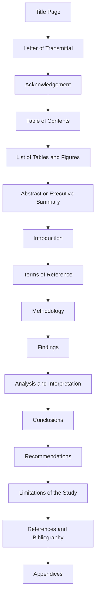
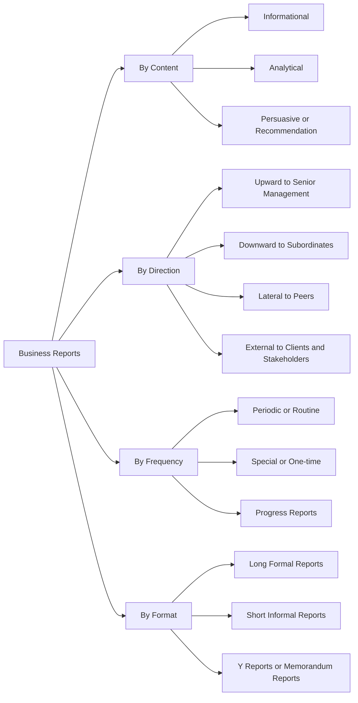
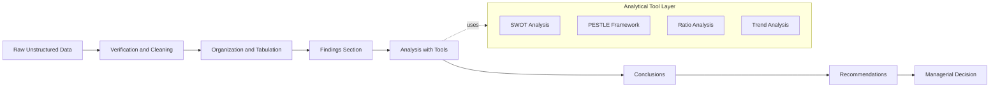
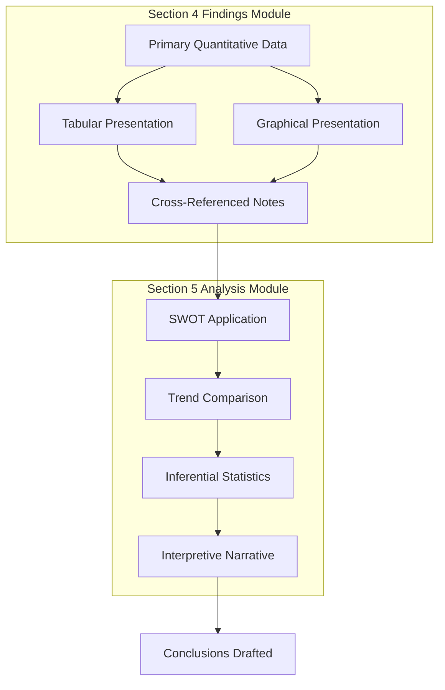

# Business Report Writing – Structure and Types

<!-- SECTION_1_START -->
# Business Report Writing – Structure and Types

## 1.1 Formal Academic Definition (KTU 2024 Scheme Aligned)

> [!NOTE]
> **Core Definition (KTU 2024 Humanities Module Standard)**
> A **Business Report** is a structured, formal, and objective written document prepared for a specific business or organizational audience, presenting verified facts, analyzed data, findings, and recommendations on a defined business problem, opportunity, or operational activity. It serves as a primary instrument of **managerial decision-making** and **organizational communication** within the corporate hierarchy.

In the KTU 2024 NEP-aligned syllabus for *Organizational Behaviour and Business Communication* (UEHUT803), business reports are classified as **formal downward, upward, or lateral communication artefacts** that convert raw organizational data into **actionable managerial intelligence**.

## 1.2 Conceptual Analogy / Intuition

> [!IMPORTANT]
> **Intuitive Analogy — The "Engineering Inspection Report"**
> Imagine a mechanical engineer submitting an *Inspection Report* on a faulty gearbox. The report does not narrate feelings. It opens with *what was inspected* (title), states *who ordered it* (terms of reference), lists *the components* (table of contents), presents *measured wear values* (findings), concludes *whether the gearbox is safe* (conclusion), and recommends *either overhaul or replacement* (recommendations).
>
> A **Business Report** functions identically: it transforms ambiguous business observations into a verifiable, evidence-based document that a manager can act upon without further questioning.

| Element in Engineering Report | Equivalent in Business Report | Purpose |
| :--- | :--- | :--- |
| Equipment under test | Business problem / opportunity | Object of study |
| Measured readings | Data, statistics, financial figures | Evidence base |
| Inspector's verdict | Conclusions | Logical inference |
| Recommended action | Recommendations | Decision support |

## 1.3 Key Characteristics of a Business Report

> [!TIP]
> A KTU-evaluated business report must always demonstrate the **"Four-Objective Rule"**:
> 1. **Accuracy** of facts and figures
> 2. **Brevity** without loss of completeness
> 3. **Clarity** of language and logical sequencing
> 4. **Objectivity** free from personal bias or emotional language

**Standard Marking Metrics used by KTU Board Examiners:**
- Use of formal third-person tone — **mandatory**
- Inclusion of all structural sections — **mandatory**
- Logical flow from findings to recommendations — **awarded 4 out of 14 marks** typically
- Mechanical correctness (grammar, format, citation) — **awarded 2 marks**

> [!VISUALIZATION CONTROL]
> **Concept:** Linear Flow of Information in a Business Report
> **Conceptual Plot Description:** Picture an arrow flowing left-to-right starting from *Raw Data (unorganized figures and field notes)*, passing sequentially through *Verification → Analysis → Findings → Conclusions → Recommendations → Managerial Decision*. Each stage adds a layer of cognitive refinement. The student should visualize the report as a **funnel** that compresses raw data into a sharp, single-line managerial action item.
<!-- SECTION_1_END -->

<!-- SECTION_2_START -->
# Deep Theoretical Analysis & KTU High-Yield Formula Sheet

## 2.1 Theoretical Framework — The Anatomy of a Business Report

A business report is not a single block of text. It is a **modular document** composed of distinct, sequentially arranged components. Each component performs a specific communicative function. The KTU 2024 Scheme specifically tests the student's ability to *identify*, *sequence*, and *apply* these components.

### 2.1.1 Primary Structural Components (Front Matter)

> [!NOTE]
> **Front Matter Components** — these appear *before* the body of the report.

1. **Title Page** — Identifies the report's subject, the author, the organization, and the date of submission. Must be *centrally aligned* and free from decoration.
2. **Letter of Transmittal / Letter of Authorization** — A formal cover letter addressed to the authority that commissioned the report. It conveys the report, mentions its scope, and acknowledges cooperation received.
3. **Acknowledgement** — A brief, polite expression of gratitude to individuals who assisted in the preparation of the report. **Strictly formal and concise.**
4. **Table of Contents (TOC)** — A list of all sections, sub-sections, and their corresponding page numbers. Enables rapid navigation.
5. **List of Tables / Figures / Abbreviations** — Supplementary navigational aids for data-heavy reports.
6. **Abstract / Executive Summary** — A condensed (typically 150–250 word) précis of the entire report, allowing senior executives to grasp the core message without reading the full document.

### 2.1.2 Body of the Report (The Core)

7. **Introduction** — Establishes the *context*, the *purpose*, the *scope*, and the *limitations* of the report. Answers the question: *"Why was this report prepared?"*
8. **Terms of Reference (TOR)** — Specifies the *authority* under which the report was prepared, including the commissioning person or department and the official instructions.
9. **Methodology / Procedure** — Describes *how* the data was collected (surveys, interviews, observation, secondary sources). Establishes the **credibility** of the report.
10. **Findings / Results** — The most data-intensive section. Presents the factual outcomes of the investigation *without interpretation*. Uses tables, charts, and statistical summaries.
11. **Analysis and Interpretation** — Applies analytical tools (SWOT, PESTLE, ratio analysis, trend analysis) to the findings. This is where *raw data is converted into insight*.
12. **Conclusions** — Logical deductions drawn from the analysis. Each conclusion must directly correspond to a finding.
13. **Recommendations** — Actionable, specific, and feasible suggestions flowing directly from the conclusions. Often the *most valuable* section for the decision-maker.
14. **Limitations of the Study** — Honest disclosure of constraints (sample size, time, geographic scope) affecting generalization.

### 2.1.3 Back Matter Components

15. **References / Bibliography** — A formal list of all cited sources following a recognized citation style (APA, MLA, Harvard).
16. **Appendices** — Supporting documents, raw questionnaires, detailed statistical tables, and technical diagrams referenced in the main body.

## 2.2 KTU High-Yield Formula Sheet — Business Report Classification

> [!IMPORTANT]
> The following table constitutes a **high-frequency recall matrix** for KTU 2024 ESE valuation. Memorize the typology, purpose, and audience of each report type.

| Report Type | Primary Purpose | Direction of Flow | Typical Audience | KTU 2024 Weight |
| :--- | :--- | :--- | :--- | :--- |
| **Informational Report** | To present facts, data, or events without analysis | Downward | Subordinates, staff | High |
| **Analytical Report** | To analyse a problem and present solutions | Upward / Lateral | Senior management | Very High |
| **Periodic / Routine Report** | To provide scheduled updates (daily, weekly, monthly) | Upward | Department heads | High |
| **Progress Report** | To track the status of an ongoing project | Upward / Lateral | Project managers, clients | High |
| **Investigative Report** | To investigate a specific incident, complaint, or failure | Lateral | HR, Legal, Compliance | Medium |
| **Feasibility Report** | To evaluate the viability of a proposed project | Upward | Top management, investors | Very High |
| **Recommendation Report** | To recommend a specific course of action | Upward | Board of Directors | Very High |
| **Y-Report (Memorandum Report)** | To summarize a routine matter briefly | Lateral | Internal departments | Medium |
| **Long Report** | To address a complex, multi-dimensional issue | Upward | Top management | Very High |
| **Short Report** | To present a brief, focused update on a single issue | Upward / Lateral | Immediate supervisor | High |

## 2.3 Classification Dimensions — A Deeper Analytical View

> [!TIP]
> KTU examiners frequently test whether students can classify a report on **multiple dimensions simultaneously**. Always identify the report by its (a) *content*, (b) *function*, (c) *frequency*, and (d) *format*.

$$
\text{Report Type} = f(\text{Content}, \text{Audience}, \text{Frequency}, \text{Format})
$$

Where:
- **Content** $\in \{ \text{Informational}, \text{Analytical}, \text{Persuasive} \}$
- **Audience** $\in \{ \text{Internal (upward, downward, lateral)}, \text{External} \}$
- **Frequency** $\in \{ \text{Periodic}, \text{Special}, \text{One-time} \}$
- **Format** $\in \{ \text{Long (formal)}, \text{Short (informal)} \}$

## 2.4 Engineering and Industry Utility

In contemporary engineering and technology firms, business reports serve as the **connective tissue between technical work and managerial decision-making**. A software engineer may design an efficient algorithm, but the *business report* communicates the algorithm's business value, cost-benefit ratio, and risk profile to non-technical stakeholders. **Production-grade** reports in industries such as manufacturing, IT services, and consulting directly influence:
- Capital budgeting decisions
- Vendor selection and supply chain audits
- Compliance with regulatory frameworks (ISO 9001, SEBI, GDPR)
- Strategic technology roadmaps
- Human resource performance reviews

In **Agile and DevOps environments**, the *progress report* and *post-incident report* are mandatory artefacts. In **management consulting**, the *feasibility report* and *recommendation report* are the primary deliverables billed to the client.

## 2.5 The Seven C's of Effective Business Reporting (KTU Emphasis)

> [!NOTE]
> The **Seven C's** are a frequently tested concept in KTU Humanities papers. They form the qualitative benchmark for any business report.

$$
\text{Quality} = \text{Clear} + \text{Concise} + \text{Correct} + \text{Complete} + \text{Consistent} + \text{Courteous} + \text{Considerate}
$$
<!-- SECTION_2_END -->

<!-- SECTION_3_START -->
# Step-by-Step Derivations & Structural Implementation

## 3.1 Step-by-Step Construction of a Business Report (Engineering Project Context)

> [!IMPORTANT]
> The following walkthrough demonstrates the **complete construction sequence** of a business report on a realistic engineering management scenario: *"Evaluating the feasibility of migrating a legacy ERP system to a cloud-based SaaS platform in an Indian manufacturing firm."* This mirrors the case-based questions frequently set in KTU 2024 ESE papers.

### Stage 1: Defining the Purpose and Scope

**Step 1.1 — Identify the Commissioning Authority**
- Originator: *Chief Information Officer (CIO), XYZ Manufacturing Pvt. Ltd.*
- Authority basis: Board Resolution dated *12 March 2024*.

**Step 1.2 — Define the Investigative Scope**
- *In-scope*: Cost analysis, downtime risk, data migration, vendor shortlisting.
- *Out-of-scope*: Hardware procurement, internal staffing restructuring.

**Step 1.3 — Formulate the Research Questions**
- What is the total cost of ownership (TCO) over 5 years?
- Which vendor offers the best SLA terms?
- What is the projected ROI?

### Stage 2: Front Matter Preparation

**Step 2.1 — Title Page Construction**

$$
\text{Title Page} = \{\text{Report Title}, \text{Organization Logo}, \text{Prepared by}, \text{Submitted to}, \text{Date}\}
$$

A correct KTU-standard title page reads:
> *A Feasibility Study on the Migration of Legacy ERP Systems to Cloud-Based SaaS Platforms*
> *Prepared for: Chief Information Officer, XYZ Manufacturing Pvt. Ltd.*
> *Prepared by: Final Year B.Tech Students, Department of Information Technology*
> *Date: April 2024*

**Step 2.2 — Letter of Transmittal**

The letter must contain **exactly four paragraphs** in KTU board-evaluated format:
1. *Opening*: Submission acknowledgement and purpose.
2. *Body*: Scope summary and methodology note.
3. *Findings*: Highlighted key conclusion.
4. *Closing*: Expression of gratitude and offer for clarification.

**Step 2.3 — Table of Contents (Sample Format)**

| Section | Page Number |
| :--- | :--- |
| Abstract | ii |
| 1. Introduction | 1 |
| 2. Terms of Reference | 2 |
| 3. Methodology | 3 |
| 4. Findings | 5 |
| 5. Analysis and Interpretation | 8 |
| 6. Conclusions | 11 |
| 7. Recommendations | 12 |
| 8. Limitations | 13 |
| References | 14 |
| Appendices | 15 |

### Stage 3: Body Construction — The Cognitive Core

**Step 3.1 — Introduction (1 page)**
Establishes context, defines the problem, and previews the structure.

**Step 3.2 — Terms of Reference (0.5 page)**
Names the commissioning authority, the date, and the official directive.

**Step 3.3 — Methodology (1.5–2 pages)**
Describes *primary research* (surveys, interviews) and *secondary research* (industry reports, journal articles). Must explicitly state:
- Sample size
- Sampling technique
- Data collection instrument

**Step 3.4 — Findings (3–4 pages)**
Pure presentation of data, **without interpretation**. Use tables, bar charts, pie charts.

**Step 3.5 — Analysis and Interpretation (3–4 pages)**
Apply analytical tools. Each finding must be paired with its interpretation.

**Step 3.6 — Conclusions (1–2 pages)**
Each conclusion must:
- Directly reference a finding
- Be numbered sequentially
- Be a single declarative sentence

**Step 3.7 — Recommendations (1–2 pages)**
Each recommendation must:
- Flow directly from a conclusion
- Be specific, measurable, and time-bound
- State the responsible stakeholder

**Step 3.8 — Limitations (0.5–1 page)**
Honest disclosure of research constraints.

### Stage 4: Back Matter Assembly

References (APA 7th Edition style) and Appendices (questionnaires, raw data, vendor brochures).

## 3.2 Comparative Analysis Matrix — Business Report Types in Engineering Decision Contexts

> [!IMPORTANT]
> This comparative matrix maps **real-world engineering case frameworks** to the **report types** that would be used in each scenario. KTU 2024 examiners frequently test this mapping ability.

| Engineering Scenario | Report Type Used | Primary Function | Stakeholder | Cognitive Level Tested |
| :--- | :--- | :--- | :--- | :--- |
| Daily output report from CNC machine operator | Periodic Routine Report | Informational | Floor Supervisor | Remember |
| Investigation of a bridge structural failure | Investigative Report | Analytical + Persuasive | Government Audit Body | Analyze |
| Proposal to install solar panels in campus | Feasibility Report | Analytical | College Management | Apply |
| Status update on a 6-month software build | Progress Report | Informational | Project Sponsor | Understand |
| Recommendation to switch from Java to Kotlin | Recommendation Report | Persuasive | CTO | Evaluate |
| Monthly safety audit of a chemical plant | Compliance Report | Informational | Regulatory Authority | Remember |
| Market study for launching an EV model | Market Research Report | Analytical | Marketing Director | Analyze |
| Justification for procuring new CNC machines | Justification Report | Persuasive | Finance Committee | Evaluate |
| Annual performance review of departments | Annual Report | Informational | Board of Directors | Understand |
| Root cause analysis of a server outage | Post-Incident / RCA Report | Analytical | IT Operations Head | Analyze |

## 3.3 Step-by-Step Derivation — From Data to Recommendation (The Logical Chain)

> [!NOTE]
> KTU examiners award marks for demonstrating the **causal chain** that connects data to recommendations. The derivation below shows this chain explicitly.

**Given:**
- A finding states: *“65% of customers report dissatisfaction with current delivery time exceeding 7 days.”*
- An analysis applies the *Gap Analysis* framework to compare customer expectation (3 days) versus actual delivery (7 days).
- A conclusion is drawn: *“The delivery process is the primary driver of customer churn.”*
- A recommendation is proposed: *“Implement a regional warehouse network to reduce delivery time to 3 days within 6 months.”*

**Step 1:** Validate the data source.
$$
\text{Validity} = \frac{\text{Sample Size}}{\text{Target Population}} \geq 0.10
$$

**Step 2:** Apply the analytical lens.
$$
\text{Gap} = \text{Expected Service Quality} - \text{Perceived Service Quality}
$$

**Step 3:** Derive the conclusion.
$$
\text{Conclusion} = f(\text{Finding}_1, \text{Finding}_2, \ldots, \text{Finding}_n)
$$

**Step 4:** Generate the recommendation.
$$
\text{Recommendation}_i = g(\text{Conclusion}_j), \quad \text{where } i = j
$$

**Step 5:** Validate feasibility.
$$
\text{Feasibility} = \alpha \cdot \text{Cost} + \beta \cdot \text{Time} + \gamma \cdot \text{Resources}, \quad \text{where } \alpha + \beta + \gamma = 1
$$
<!-- SECTION_3_END -->

<!-- SECTION_4_START -->
# Structural Diagrams & Schematics

## 4.1 Mermaid Diagram — Complete Architecture of a Business Report

> [!NOTE]
> The following Mermaid flowchart illustrates the **canonical sequential architecture** of a long-form business report, as evaluated under the KTU 2024 Scheme Humanities Module 3.

**Node Reading Guide:**
- Nodes **A through F** constitute the **Front Matter** and are *navigational* in purpose.
- Nodes **G through N** constitute the **Body** and are the *analytical core*.
- Nodes **O and P** constitute the **Back Matter** and are *evidentiary* in purpose.

## 4.2 Mermaid Diagram — Classification of Business Reports

## 4.3 Mermaid Diagram — The Data-to-Decision Pipeline

## 4.4 Mermaid Diagram — Modular Block Architecture of a Report Section

> [!TIP]
> **Reading Aid for the Diagrams:**
> - The **first diagram** shows the *physical structure* of a report document.
> - The **second diagram** shows the *typological classification* used in KTU theory questions.
> - The **third diagram** shows the *intellectual transformation* of data into a decision.
> - The **fourth diagram** shows the *modular interaction* between the findings and analysis sections.
<!-- SECTION_4_END -->

<!-- SECTION_5_START -->
# KTU 2024 Scheme Examination Question Bank & Topic Recap

## Part A — Short Answer Questions (3 Marks Each)

> [!NOTE]
> **Instructions to Students (KTU 2024 ESE Format):** Answer in approximately 80–100 words. Each question carries **3 marks**. No internal choice in Part A.

---

**Q1.** `[KTU University Exam – July 2024]`
**Define a business report. List any four characteristics of an effective business report.**

**Model Answer (Valuation Key):**

A **business report** is a formal, structured document that presents organized information, facts, analysis, and recommendations on a specific business issue to a defined audience for the purpose of supporting managerial decision-making.

Four characteristics of an effective business report are:
1. **Clarity** — Ideas are expressed in simple, unambiguous language.
2. **Objectivity** — Free from personal bias, emotional language, or subjective opinion.
3. **Accuracy** — All data and facts are verified and error-free.
4. **Conciseness** — Conveys the message in the minimum number of words without losing completeness.

*Additional valid points (any two may be added for full marks):* Brevity, logical sequencing, formal tone, actionability.

**Marks Distribution:** *[Definition: 1 Mark] + [Four characteristics with one-line explanation each: 2 Marks]*

**CO Mapping:** *CO2 — Understand*
**RBT Level:** *Understand*

---

**Q2.** `[KTU University Exam – Dec 2023]`
**Differentiate between an informational report and an analytical report with suitable examples.**

**Model Answer (Valuation Key):**

| Parameter | Informational Report | Analytical Report |
| :--- | :--- | :--- |
| **Purpose** | To present facts and data without analysis | To analyse a problem and propose solutions |
| **Depth of Treatment** | Surface-level, descriptive | Deep, interpretive, evaluative |
| **Tone** | Neutral and factual | Argumentative and reasoned |
| **Example** | A monthly production output report submitted by a factory supervisor | A market feasibility report evaluating whether to launch a new product |

*Alternative Example Pair:* A daily attendance report versus a recommendation report to switch from on-premise servers to cloud infrastructure.

**Marks Distribution:** *[Tabular distinction with 2–3 parameters: 2 Marks] + [One valid example for each type: 1 Mark]*

**CO Mapping:** *CO2 — Understand*
**RBT Level:** *Understand*

---

## Part B — Long Answer Questions (14 Marks Each, Internal Choice)

> [!NOTE]
> **KTU 2024 ESE Format:** Answer *any one* from the choice provided. Each question carries **14 marks** with sub-parts. Internal choice ensures modular coverage.

---

### **Question A (14 Marks)** `[KTU University Exam – July 2024]`

**(a)** Discuss in detail the **structure of a long formal business report**, explaining the function of any **six major components**. **(7 Marks)**

**(b)** Identify and explain the **four major types of business reports** based on the **frequency** of preparation, with one engineering industry example for each. **(7 Marks)**

**Model Solution:**

#### Part (a) — Structure of a Long Formal Business Report

The structure of a long formal business report is modular and sequential. The six major components and their functions are:

1. **Title Page** — Identifies the report's subject, the author, the recipient organization, and the date. It is the first impression of the report and must be professionally formatted.
2. **Letter of Transmittal** — A formal cover letter addressed to the commissioning authority. It explains the purpose, scope, and limitations of the report and acknowledges cooperation received.
3. **Table of Contents** — Lists all sections, sub-sections, and their corresponding page numbers, enabling rapid navigation.
4. **Introduction** — Establishes the context, defines the problem, states the objectives, and previews the report's structure.
5. **Findings** — Presents the factual outcomes of the investigation in the form of tables, charts, and statistical summaries. *Interpretation is strictly avoided in this section.*
6. **Recommendations** — Provides specific, actionable, and time-bound suggestions flowing from the conclusions. This is the most decision-critical section.

*[Each component with 1-line function: 1 Mark each × 6 = 6 Marks; Logical sequencing explanation: 1 Mark = Total 7 Marks]*

**CO Mapping:** *CO2 — Understand*
**RBT Level:** *Understand*

#### Part (b) — Four Types of Business Reports Based on Frequency

| Frequency Type | Function | Engineering Industry Example |
| :--- | :--- | :--- |
| **Periodic or Routine Reports** | Prepared at fixed intervals (daily, weekly, monthly, annually) to provide regular updates on operations | Daily production output report from a CNC machining cell submitted to the shift supervisor |
| **Progress Reports** | Prepared at intermediate stages of a long-term project to communicate the current status, milestones achieved, and pending tasks | Weekly progress report from a software development team on a 12-month ERP implementation project |
| **Special or One-time Reports** | Prepared for a unique, non-recurring event or to investigate a specific incident | A post-incident investigation report submitted after a major server outage in a data center |
| **Annual Reports** | Comprehensive yearly reports detailing the overall performance, achievements, and financial health of an organization | The annual report of an engineering public-sector undertaking (PSU) like BHEL or SAIL submitted to the Ministry of Heavy Industries |

*[Each type with function: 1 Mark; Each example: 0.5 Mark; Tabular clarity: 0.5 Mark × 4 = 2 Marks → Total 7 Marks]*

**CO Mapping:** *CO3 — Apply*
**RBT Level:** *Apply*

---

### **Question B (14 Marks)** `[KTU University Exam – Dec 2023]`

**(a)** Explain the concept of **feasibility reports** and **recommendation reports** in detail, highlighting their differences and their significance in engineering project management. **(7 Marks)**

**(b)** A final year B.Tech project team is preparing a **business report** on the *"Implementation of Solar Power in the College Campus"*. Draft the **Table of Contents** and the **Executive Summary** for this report. **(7 Marks)**

**Model Solution:**

#### Part (a) — Feasibility vs. Recommendation Reports

A **feasibility report** is a structured analytical document that evaluates whether a proposed project, system, or investment is *technically, financially, operationally, and legally viable* before a commitment of resources is made. It answers the question: *"Should we proceed with this initiative?"*

A **recommendation report**, in contrast, is a persuasive document that evaluates *multiple alternatives* for solving a problem and concludes by *recommending a specific course of action*. It answers the question: *"Which option should we choose, and why?"*

**Differences:**

| Parameter | Feasibility Report | Recommendation Report |
| :--- | :--- | :--- |
| **Primary Question** | Should we do it? | Which option should we choose? |
| **Focus** | Single project or initiative | Comparison of multiple alternatives |
| **Tone** | Objective and analytical | Persuasive and evaluative |
| **Output** | Go or No-Go decision | Selection of a specific option |

**Significance in Engineering Project Management:**
- *Feasibility reports* prevent capital wastage by filtering non-viable projects before resource allocation.
- *Recommendation reports* ensure that the chosen engineering solution is supported by empirical data and a transparent comparison matrix, satisfying **ISO 9001 quality management** and **SEBI due-diligence** requirements.

*[Concept of each: 1.5 Marks each = 3 Marks; Differences table: 2 Marks; Engineering significance: 2 Marks → Total 7 Marks]*

**CO Mapping:** *CO3 — Apply*
**RBT Level:** *Apply*

#### Part (b) — Table of Contents and Executive Summary

**Table of Contents:**

| Section | Page Number |
| :--- | :--- |
| Abstract | i |
| 1. Introduction | 1 |
| 2. Objectives of the Study | 2 |
| 3. Terms of Reference | 3 |
| 4. Methodology | 4 |
| 5. Findings | 6 |
| 6. Analysis and Interpretation | 8 |
| 7. Conclusions | 10 |
| 8. Recommendations | 11 |
| 9. Limitations | 12 |
| References | 13 |
| Appendix A: Survey Questionnaire | 14 |
| Appendix B: Solar Vendor Quotations | 15 |

*[Each correct entry: 0.4 Marks × 10 = 4 Marks; Logical ordering: 1 Mark → Total 5 Marks]*

**Executive Summary:**

> *This report evaluates the feasibility of implementing a 50 kW rooftop solar power system on the college campus to reduce grid electricity dependency by 35% over the next five years. Data was collected through primary surveys of 200 students and faculty and secondary analysis of state electricity tariffs and vendor quotations. Findings indicate an estimated capital investment of ₹32 lakhs, an annual savings of ₹6.8 lakhs, and a payback period of 4.7 years. The report recommends approval of Phase 1 installation on the main academic block, with performance review scheduled at 12 months.*

*[Purpose statement: 1 Mark; Key findings summarized: 0.5 Mark; Recommendation included: 0.5 Mark → Total 2 Marks]*

**Total for Part (b):** *5 + 2 = 7 Marks*

**CO Mapping:** *CO4 — Apply / Create*
**RBT Level:** *Apply*

---

## KTU Examiner's Valuation Warning / Pitfall Callout

> [!WARNING]
> **Common Mark-Deduction Pitfalls in KTU 2024 ESE Evaluation:**
>
> 1. **Conflating Abstract with Introduction** — The *Abstract* is a self-contained 150–250 word summary readable in isolation. The *Introduction* is the opening of the body and leads into the methodology. Do not interchange them. *Loss: 2 marks.*
>
> 2. **Omitting the Letter of Transmittal** — This is mandatory for *long formal reports*. Even if the question does not explicitly ask for it, examiners check its presence. *Loss: 1 mark.*
>
> 3. **Recommendations without Traceable Conclusions** — Each recommendation must explicitly reference the conclusion it flows from. Floating recommendations with no logical anchor are penalized heavily. *Loss: 3 marks.*
>
> 4. **Using First-Person Narrative** — Reports must use third-person formal tone. Phrases like *"I think"* or *"we feel"* are penalized. *Loss: 1–2 marks.*
>
> 5. **Skipping the Limitations Section** — A report without an honest limitations section appears academically dishonest and is penalized. *Loss: 1 mark.*
>
> 6. **No Page Numbering or Improper TOC** — A Table of Contents without accurate page numbers is treated as decorative. *Loss: 1 mark.*
>
> 7. **Direct Copy-Paste from Sources** — Plagiarism or uncited reproduction of source material attracts a flat **2-mark penalty** plus potential academic misconduct flag.

---

## Topic Recap & Important Things to Remember

> [!TIP]
> **High-Density Rapid Revision Checklist for KTU 2024 ESE — Module 3**

- A **business report** is a *formal, structured, objective document* used for managerial decision-making and organizational communication.
- The **structure** follows a strict sequence: *Title Page → Letter of Transmittal → Acknowledgement → TOC → List of Tables/Figures → Abstract → Introduction → TOR → Methodology → Findings → Analysis → Conclusions → Recommendations → Limitations → References → Appendices.*
- **Informational reports** present facts; **Analytical reports** analyse problems; **Persuasive reports** recommend actions.
- **Periodic reports** are routine; **Progress reports** track projects; **Special reports** address unique events; **Annual reports** summarize yearly performance.
- **Feasibility reports** answer *"Should we do it?"*; **Recommendation reports** answer *"Which option should we choose?"*
- **Long reports** are formal, comprehensive, and structured; **Short reports** are brief and direct; **Y-reports (memorandum reports)** are one-page internal updates.
- The **Seven C's** are: *Clear, Concise, Correct, Complete, Consistent, Courteous, Considerate.*
- Reports flow **upward, downward, or lateral** within an organization based on the audience and purpose.
- Each **recommendation** must trace back to a **conclusion**, which must trace back to a **finding** — never break this logical chain.
- **Front matter** is navigational; **Body** is analytical; **Back matter** is evidentiary.
- The **Abstract** is *not* the introduction; it is a standalone summary of the entire report.
- **Limitations** must be disclosed honestly to maintain academic and professional integrity.
- Use **third-person formal tone**; avoid first-person narrative, emotional language, and subjective adjectives.
- The **Table of Contents** must contain accurate page numbers and logical section ordering.
- **Plagiarism** or uncited reproduction attracts a flat 2-mark penalty under KTU evaluation norms.
- Engineering applications of business reports include **feasibility studies, post-incident RCAs, vendor evaluations, compliance audits, and ROI justifications**.
<!-- SECTION_5_END -->
