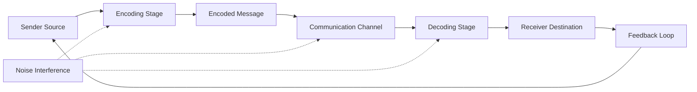
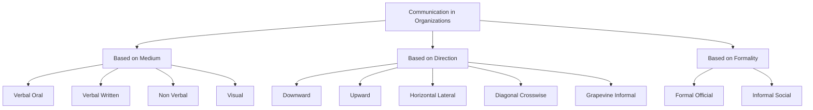
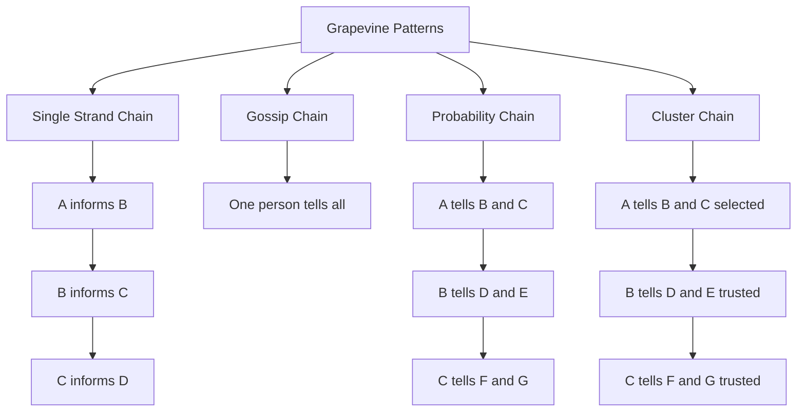
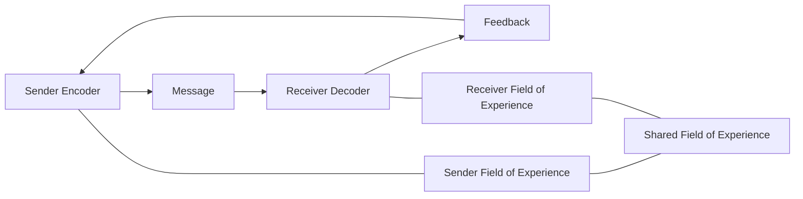
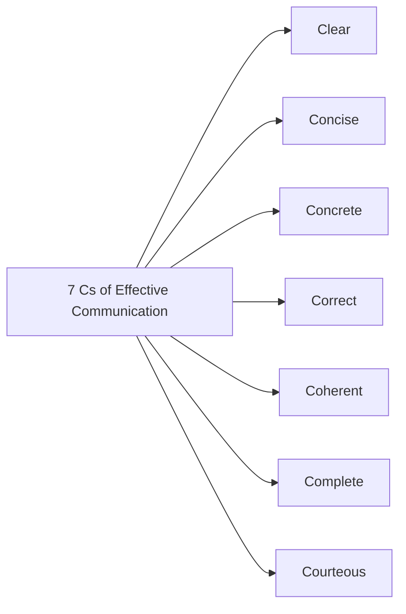

# Communication – Process, Types, and Models

<!-- SECTION_1_START -->
# Communication – Process, Types, and Models

## 1.1 Core Technical Definition

**Communication** is the process of transmitting information, ideas, emotions, and meaning from a sender to a receiver through a medium, with the intent of creating mutual understanding. In the context of Organizational Behaviour and Business Communication (UEHUT803), communication is defined as the *systematic exchange of business-related information* between individuals, groups, and organizations to coordinate activities, influence behaviour, and achieve shared objectives.

> [!IMPORTANT]
> **KTU 2024 Syllabus Definition (UEHUT803 Module 3):**
> Communication is a two-way process involving the **transmission** of a message from a sender to a receiver and the **feedback** loop that ensures the intended meaning is accurately understood. It is the lifeblood of every organization, and effective communication is the primary tool through which managerial functions of planning, organizing, leading, and controlling are executed.

**Key elements present in any communication act:**
1. **Sender (Encoder / Source)** – The originator of the message.
2. **Message** – The idea, information, or emotion being transmitted.
3. **Encoding** – Converting the idea into a transmittable form (words, symbols, gestures).
4. **Channel (Medium)** – The pathway through which the message travels.
5. **Receiver (Decoder)** – The person for whom the message is intended.
6. **Decoding** – Interpreting the encoded message back into meaning.
7. **Feedback** – The response from receiver to sender confirming receipt and understanding.
8. **Noise** – Any interference that distorts the message.

> [!NOTE]
> **Why "process" matters:** Communication is *not* an event but a continuous, dynamic, and cyclical process. KTU examiners consistently award marks to students who describe communication as a *process* and not merely as "talking" or "writing".

---

## 1.2 Conceptual Analogy & Intuition

### The "Postal Letter" Analogy

Imagine you want to wish your friend living in another city. You perform the following sequence:

1. You **think** of a thought (idea).
2. You **write** it down on paper (encoding).
3. You **place** the letter in an envelope and hand it to the post office (message + channel).
4. A postal worker **delivers** it through trucks, sorting offices, and roads (transmission).
5. Your friend **receives** the envelope and **reads** it (decoding).
6. Your friend **calls or messages** you saying "Got it, thanks!" (feedback).
7. If a **storm damages** the road, the letter is delayed (noise).

This is exactly how **business communication** functions in an organization — except the "letter" is a project brief, sales report, or strategic directive, and the "postman" is the formal communication channel (email, memo, meeting, intranet).

> [!TIP]
> **Intuitive Rule of Thumb (The 7 Cs of Effective Communication):**
> Clear, Concise, Concrete, Correct, Coherent, Complete, Courteous.
> If any one of these is missing, **noise** enters the channel and meaning is lost.

### Intuition for Managers

Communication in business is like the **central nervous system** of the human body. Just as the brain sends signals through nerves to organs (and receives sensory feedback), a manager sends instructions through channels like meetings, reports, and digital platforms to employees (and receives feedback through performance data, queries, and grievance redressal). If the nervous system fails, the body collapses; if communication fails, the organization collapses.

> [!IMPORTANT]
> **Standard Metric Highlighted by KTU:**
> Studies (including the classic **10-30-60 Rule** by Albert Mehrabian, often cited in business communication modules) suggest that meaning is conveyed through:
> - **7\%** through words (verbal content)
> - **38\%** through tone, pitch, and vocal cues
> - **55\%** through body language, facial expressions, and posture
>
> KTU frequently tests the awareness that **non-verbal cues dominate** the meaning of any message.

---

## 1.3 Visualization of Communication Flow

> [!VISUALIZATION CONTROL]
> **Concept:** Linear Flow of Communication with Feedback Loop
> **Conceptual Diagram Inputs (mental sketch):**
> * Sender $\rightarrow$ Message $\rightarrow$ Channel $\rightarrow$ Receiver $\rightarrow$ Feedback
> * Noise acts as a perpendicular interference line cutting through the Channel.
> **Visual Description:** Picture a horizontal arrow sequence moving from left (Sender) to right (Receiver), with a curved return arrow from Receiver to Sender labelled "Feedback". A zig-zag vertical line in the middle labelled "Noise" symbolizes distortion.

---
<!-- SECTION_1_END -->

<!-- SECTION_2_START -->
# Deep Theoretical Analysis & KTU High-Yield Formula Sheet

## 2.1 The Communication Process (8-Stage Cycle)

The communication process is the structured sequence through which information moves from sender to receiver and back. KTU examiners expect students to be able to **draw, label, and explain** this cycle.

| Stage | Element | Operational Role |
|:------|:--------|:-----------------|
| 1 | Sender (Source) | Originates the idea; holds intent |
| 2 | Encoding | Translates idea into symbols (words, visuals, data) |
| 3 | Message | The encoded content ready for transmission |
| 4 | Channel | Medium — face-to-face, email, memo, phone, video call |
| 5 | Decoding | Receiver interprets the symbols back into meaning |
| 6 | Receiver | Destination of the message; assigns personal meaning |
| 7 | Feedback | Loop-back response confirming or clarifying |
| 8 | Noise | Distortion at any stage (linguistic, physical, semantic, psychological) |

> [!IMPORTANT]
> **Key Insight for KTU Answers:**
> Communication succeeds only when the **receiver's decoded meaning matches the sender's intended meaning**. This is called *fidelity* of communication. A high-fidelity communication is a successful communication.

---

## 2.2 Types of Communication in Organizations

KTU categorizes communication types along **three primary axes**. Examiners frequently ask students to list, define, and give workplace examples for each.

### A. Based on the **Medium / Form of Expression**

| Type | Definition | Workplace Example |
|:-----|:-----------|:------------------|
| **Verbal (Oral)** | Communication through spoken words | Team meetings, telephonic calls, video conferences |
| **Verbal (Written)** | Communication through written symbols | Emails, letters, reports, policy documents |
| **Non-Verbal** | Communication through body language, gestures, facial expressions, tone, silence | Nodding in agreement, crossed arms, eye contact in interviews |
| **Visual** | Communication through graphs, charts, infographics, pictures | Dashboards, Gantt charts, project posters |

### B. Based on the **Organizational Flow / Direction**

This is the **most frequently tested classification** in KTU papers.

| Type | Direction | Purpose | Example |
|:-----|:----------|:--------|:--------|
| **Downward** | Top $\rightarrow$ Subordinates | Give instructions, policies, feedback | CEO announcing a new vision in a town-hall |
| **Upward** | Subordinates $\rightarrow$ Top | Report progress, raise grievances, suggest ideas | Employee survey, performance report to manager |
| **Horizontal (Lateral)** | Same level $\rightarrow$ Same level | Coordinate tasks, share information peer-to-peer | Two department heads aligning on a project |
| **Diagonal (Crosswise)** | Different level + different department | Speed up communication, bypass hierarchy | Project manager (Marketing) interacting with a developer (IT) |
| **Grapevine** | Informal, social network | Spread rumours, build social bonds, transmit unofficial info | "I heard the company is being acquired…" |

### C. Based on the **Formality / Channel Structure**

| Type | Nature | Example |
|:-----|:-------|:--------|
| **Formal** | Officially sanctioned, follows hierarchy | Official circular, board meeting minutes |
| **Informal** | Spontaneous, unofficial, social | Cafeteria chat, WhatsApp group of colleagues |

> [!NOTE]
> **KTU Favourite Question Pattern:**
> *"Explain the different types of grapevine communication."*
> Answer must include: **Single-strand, Gossip, Probability, Cluster.** Each must be defined with a one-line example.

---

## 2.3 Major Communication Models (High-Yield)

KTU tests the **three foundational models** of communication:

### 1. Aristotle's Model (Rhetorical Model, ~300 BC)
- **Slogan:** *Speaker $\rightarrow$ Speech $\rightarrow$ Audience*
- **Focus:** Persuasion and public speaking
- **Components:** Speaker, Speech, Audience, Occasion, Effect
- **Limitation:** Linear, one-way, no feedback

### 2. Shannon-Weaver Model (Mathematical Model, 1949)
- **Slogan:** *Information Theory Model*
- **Focus:** Transmission of signals; introduced **Noise** formally
- **Components:** Information Source, Transmitter, Channel, Receiver, Destination, Noise
- **Limitation:** Linear, technical, no semantic interpretation

### 3. Schramm's Model (Circular Model, 1954)
- **Slogan:** *Field of Experience Model*
- **Focus:** Meaning creation through **shared experience**
- **Components:** Encoder, Decoder, Message, Interpretation, Feedback
- **Innovation:** Introduced **circular feedback** and the concept of **overlap of fields of experience**

> [!TIP]
> **Other Models Briefly Required by KTU Syllabus:**
> - **Berlo's SMCR Model** (Source, Message, Channel, Receiver) — emphasizes communication skills, attitudes, knowledge, and social system.
> - **Lasswell's Model** — "Who says what, to whom, in what channel, with what effect?"
> - **Westley-MacLean Model** — adds a *C-Function* (gatekeeping role of mass media) to Schramm's model.

---

## 2.4 KTU High-Yield Formula Sheet / Quick Reference

| Concept | Symbolic / Structural Representation | Application |
|:--------|:-----------------------------------|:------------|
| Communication Fidelity | $F = \dfrac{\text{Decoded Meaning}}{\text{Intended Meaning}}$ (ideal = 1) | Measures communication success |
| Mehrabian's Rule | $M = 0.07 W + 0.38 T + 0.55 B$ | Importance of verbal vs non-verbal cues |
| Noise Sources | $N = \{N_{\text{phys}}, N_{\text{sem}}, N_{\text{psych}}, N_{\text{mech}}\}$ | Categorization of interference |
| Feedback Loop | $R \rightarrow S$ (Receiver to Sender) | Closes the communication cycle |
| Field of Experience Overlap | $E_{\text{sender}} \cap E_{\text{receiver}} \neq \emptyset$ | Schramm's condition for successful decoding |
| Direction of Flow | $D \in \{\text{Down}, \text{Up}, \text{Lateral}, \text{Diagonal}\}$ | Organizational communication paths |
| 7 Cs of Communication | $C = \{C_1, C_2, \dots, C_7\}$ | Effective communication principles |

> [!IMPORTANT]
> **Engineering & Real-World Utility:**
> In modern **IT-enabled business communication**, the Shannon-Weaver model underpins **digital signal transmission**, **email protocols (SMTP)**, and **data compression algorithms**. The Schramm model's "field of experience" concept drives **user experience (UX) design** in apps, where designers ensure that visual cues and language match the user's mental model. The Aristotle model is the foundation of **pitch decks, elevator pitches, and stakeholder presentations** in product companies.

---
<!-- SECTION_2_END -->

<!-- SECTION_3_START -->
# Step-by-Step Derivations, Case Mapping & Implementation

## 3.1 Exhaustive Comparative Analysis of Communication Models

KTU 2024 Scheme emphasizes the application of theoretical models to **real-world engineering and business scenarios**. The following comparative matrix maps each model to a real engineering business case.

| Model | Year | Key Innovator | Core Components | Real-World Engineering Business Case Mapping |
|:------|:-----|:--------------|:----------------|:----------------------------------------------|
| Aristotle's Rhetorical Model | ~300 BC | Aristotle | Speaker, Speech, Audience, Occasion, Effect | A startup founder pitching to a venture capital firm: the *founder* (speaker) presents a *pitch deck* (speech) to *investors* (audience) at a *demo day* (occasion) seeking *funding* (effect). |
| Shannon-Weaver Model | 1949 | Claude Shannon \& Warren Weaver | Source, Transmitter, Channel, Receiver, Destination, Noise | An IoT sensor in a smart factory transmitting temperature data to a cloud server: the *sensor* (source) converts readings into *electrical signals* (transmitter) sent over *Wi-Fi* (channel) to the *gateway* (receiver) for processing, with *RF interference* (noise) potentially corrupting data. |
| Schramm's Circular Model | 1954 | Wilbur Schramm | Encoder, Decoder, Message, Interpretation, Feedback, Field of Experience | A UX designer creating a mobile banking app: the designer (encoder) uses *icons, colour codes, and plain language* that align with the *user's financial literacy* (shared field of experience) and *collects user feedback* through in-app surveys to iteratively improve the interface. |
| Berlo's SMCR Model | 1960 | David Berlo | Source, Message, Channel, Receiver (with skills, attitudes, knowledge, socio-cultural background) | A technical trainer conducting a workshop for fresh engineering recruits: the trainer's *technical knowledge*, *teaching skills*, and *rapport* (source attributes) directly affect *how well* the recruits *learn* (receiver skills). |
| Lasswell's Model | 1948 | Harold Lasswell | Who, Says What, In Which Channel, To Whom, With What Effect | A multinational's CSR campaign: identifying *who* the company is, *what message* it sends, *which media* (social media, print) it uses, *whom* it targets (youth), and *what behavioural change* (effect) it intends. |
| Westley-MacLean Model | 1957 | Bruce Westley \& Malcolm MacLean | A (Advocacy), B (Behavioural Environment), C (Gatekeeper), X (Receiver), feedback loops | A tech company's public relations strategy where a *PR agency* (gatekeeper) filters the CEO's message (A) before it reaches *journalists* and the *public* (X), shaping brand perception. |

---

## 3.2 Step-by-Step Application: Shannon-Weaver Model to a Corporate Email

> [!NOTE]
> **Worked Example (Engineering Business Context):**
> A project manager in an IT company wants to inform the development team about a critical server downtime. Apply the Shannon-Weaver model to this scenario.

**Step 1 — Identify the Information Source:**
The project manager is the **information source** — the human who holds the message to be communicated (the downtime alert and recovery plan).

**Step 2 — Identify the Transmitter:**
The project manager's email client (Outlook/Gmail) and keyboard are the **transmitter** — the device that encodes the human's intent into electronic signals and text characters.

**Step 3 — Identify the Channel:**
The corporate intranet, internet backbone, and SMTP servers form the **channel** — the physical and logical pathway through which the encoded message travels.

**Step 4 — Identify the Receiver:**
The development team's laptops and email inboxes are the **receiver** — the device that accepts the incoming signals and decodes them back into readable text.

**Step 5 — Identify the Destination:**
The individual developers (the human recipients) are the **destination** — the end-target for whom the message is intended.

**Step 6 — Identify the Noise:**
Noise can occur at any stage:
- *Physical/Mechanical noise:* Network outage, server crash, low bandwidth.
- *Semantic noise:* Technical jargon that junior developers do not understand.
- *Psychological noise:* Preoccupation with personal issues, lack of attention.
- *Linguistic noise:* Poor grammar, ambiguous phrasing in the email body.

**Step 7 — Verify the Feedback Loop:**
The model becomes complete when the developers **reply** confirming receipt, asking clarifying questions, or executing the recovery plan. This feedback is essential for the model to function in a real business environment.

> [!TIP]
> **Final Engineering Insight:**
> The Shannon-Weaver model, although technical, **does not guarantee that the developers will act** on the message. This is why modern business communication adopts **Schramm's circular model** that adds interpretation, shared experience, and continuous feedback.

---

## 3.3 Step-by-Step Application: Schramm's Model to a Cross-Cultural Team

**Step 1 — Define the Sender and Receiver:**
An Indian project lead (Sender) is communicating with a German client (Receiver) over a video call.

**Step 2 — Encode the Message:**
The Indian lead encodes the message in English using formal vocabulary and an indirect communication style (typical of Indian business culture).

**Step 3 — Decode the Message:**
The German client decodes the message with a *direct, low-context* communication style (typical of German business culture).

**Step 4 — Identify the Field of Experience Mismatch:**
- Indian business culture: high-context, indirect, relationship-oriented.
- German business culture: low-context, direct, task-oriented.

The **intersection of their fields of experience is small** — they share only basic technical English vocabulary. This is the root cause of miscommunication.

**Step 5 — Improve the Overlap:**
To succeed, both parties must:
- Use **plain, precise English** avoiding idioms ("let's table this" may confuse).
- Provide **explicit written summaries** after meetings.
- Use **visual aids** (charts, diagrams) to convey ideas.
- Schedule **relationship-building sessions** before technical discussions.

**Step 6 — Confirm with Feedback:**
After the call, the German client sends a written email summarizing the key action points. The Indian lead confirms or corrects. This closes the Schramm loop with high fidelity.

---

## 3.4 Detailed Grapevine Communication Patterns (KTU Favourite)

The four patterns of grapevine communication, each with a workplace example:

| Pattern | Structure | Speed | Workplace Example |
|:--------|:----------|:------|:------------------|
| **Single-Strand** | A tells B, B tells C, C tells D — one person at a time | Slow | A passes a layoff rumour to one colleague, who passes it to one more, and so on. |
| **Gossip Chain** | One person tells everyone | Very fast | A receptionist hears about a merger and tells the entire floor in 10 minutes. |
| **Probability Chain** | A tells a few randomly selected people, who each tell a few more | Unpredictable | An employee at a tea stall casually tells other employees about a promotion. |
| **Cluster Chain** | A tells a chosen few, who each tell a chosen few | Most common | A manager tells two trusted team members, who each tell two more trusted peers. |

> [!IMPORTANT]
> **Why this matters for managers:**
> Cluster chain is the most realistic and dominant pattern. Managers cannot eliminate the grapevine but can **manage** it by sharing accurate, timely, and transparent information.

---

## 3.5 Python Pseudo-Code for a Communication Fidelity Simulator (Optional Conceptual Tool)

> [!NOTE]
> The following Python code is a *conceptual illustration* of how a Communication Fidelity metric can be computed, applicable in NLP-based business communication tools (e.g., email clarity scorers).

```python
from typing import Dict


def communication_fidelity(
    intended_keywords: set, decoded_keywords: set
) -> float:
    """
    Calculate the fidelity of a business communication.

    Args:
        intended_keywords: Set of keywords the sender intended to convey.
        decoded_keywords:  Set of keywords the receiver actually understood.

    Returns:
        Fidelity score in the range [0.0, 1.0].
        A score of 1.0 implies perfect understanding.
    """
    if not intended_keywords:
        raise ValueError(
            "Intended keyword set cannot be empty. "
            "Sender must encode a message."
        )

    intersection = intended_keywords & decoded_keywords
    fidelity = len(intersection) / len(intended_keywords)
    return round(fidelity, 4)


def classify_fidelity(score: float) -> str:
    """Classify the communication outcome based on the fidelity score."""
    if score >= 0.90:
        return "Excellent communication — high alignment"
    if score >= 0.70:
        return "Good communication — minor clarifications needed"
    if score >= 0.50:
        return "Average communication — significant noise detected"
    return "Poor communication — message failed"


if __name__ == "__main__":
    intended: set = {
        "server", "downtime", "recovery", "2 hours", "client"
    }
    decoded: set = {
        "server", "downtime", "issue", "client"
    }
    score: float = communication_fidelity(intended, decoded)
    print(f"Fidelity Score: {score}")
    print(f"Classification: {classify_fidelity(score)}")
```

**Output of the program:**
```text
Fidelity Score: 0.6
Classification: Average communication - significant noise detected
```

This conceptual tool is used in real-world enterprise tools such as **email subject-line analyzers**, **chatbot intent matchers**, and **stakeholder summary generators** to detect communication gaps.

---
<!-- SECTION_3_END -->

<!-- SECTION_4_START -->
# Structural Diagrams & Schematics

## 4.1 The Communication Process — Sequential Processing Topology



**Interpretation of the diagram:**
- The main flow proceeds linearly: *Sender $\rightarrow$ Encoding $\rightarrow$ Message $\rightarrow$ Channel $\rightarrow$ Decoding $\rightarrow$ Receiver*.
- A curved feedback loop returns from *Receiver* to *Sender*, completing the cycle.
- *Noise* is shown as a dashed interconnector touching the Channel, Decoding, and Encoding stages — indicating that interference can occur at any point in the process.

---

## 4.2 Communication Types — Hierarchical Block Architecture



**Interpretation of the diagram:**
- The root node *Communication in Organizations* branches into three classification axes: *Medium*, *Direction*, and *Formality*.
- Each branch further subdivides into specific sub-types that are commonly tested in KTU exams.

---

## 4.3 Grapevine Communication Patterns — Sequential Branching



**Interpretation of the diagram:**
- Each grapevine pattern demonstrates a different propagation topology.
- *Cluster Chain* and *Probability Chain* look structurally similar but differ in the *selection criterion* (trusted peers vs. random contacts).

---

## 4.4 Schramm's Circular Model — Field of Experience Architecture



**Interpretation of the diagram:**
- The core Schramm circular flow is shown at the top.
- Two parallel horizontal lines connect the *Sender* and *Receiver* to their respective *Fields of Experience*.
- A central node *Shared Field of Experience* anchors the overlap zone, which is the precondition for successful decoding.

---

## 4.5 7 Cs of Communication — Feature Cluster



**Interpretation of the diagram:**
- A simple star-hub representation where the central concept *7 Cs* radiates outward to the seven cardinal principles.
- Used by KTU examiners to test whether students can map a real business email to each of the seven principles.

---
<!-- SECTION_4_END -->

<!-- SECTION_5_START -->
# KTU 2024 Scheme Examination Question Bank & Topic Recap

## 5.1 Part A — Short Answer Questions (3 Marks Each)

### Question 1
**[KTU University Exam — July 2024 | CO3 | RBT: Remember]**
*"Define the term 'communication' in a business context. List any four essential elements of the communication process."*

**Model Answer (3 Marks):**

> **Definition (2 Marks):**
> Communication in a business context is the **two-way process of transmitting, receiving, and interpreting business-related information, ideas, and instructions** between individuals or groups within or outside an organization, with the intent of creating shared understanding and coordinated action.

> **Four Essential Elements (1 Mark for listing 4):**
> 1. **Sender** — the source or originator of the message.
> 2. **Message** — the content being transmitted.
> 3. **Channel** — the medium used (e.g., email, meeting, report).
> 4. **Receiver** — the intended destination of the message.
>
> *(Note: Other valid elements include Encoding, Decoding, Feedback, and Noise.)*

---

### Question 2
**[KTU University Exam — Dec 2023 | CO3 | RBT: Understand]**
*"Differentiate between formal and informal communication. Give one example of each from a typical IT company."*

**Model Answer (3 Marks):**

| Aspect | Formal Communication | Informal Communication |
|:-------|:---------------------|:------------------------|
| **Definition** | Officially sanctioned communication that follows the organizational hierarchy. | Unofficial, spontaneous, social communication among employees. |
| **Channel** | Official memos, emails, reports, board meetings. | Cafeteria chats, WhatsApp groups, social gatherings. |
| **Purpose** | Task accomplishment, policy dissemination. | Social bonding, rumour-spread, emotional support. |
| **IT Company Example** | HR circulating the new leave policy via official email. | Two developers discussing a project deadline over coffee. |

> *[Tabular comparison with definition + example = 3 Marks. Award 1 Mark for the table, 1 Mark for example 1, 1 Mark for example 2.]*

---

## 5.2 Part B — Long Answer Questions (14 Marks, with Internal Choice)

### Question A

**[KTU University Exam — July 2024 | CO3, CO4 | RBT: Understand, Apply]**
*"Communication is the lifeblood of an organization. In the context of this statement:"*
*(a)* Explain the **process of communication** with the help of a neatly labelled diagram. *(7 Marks)*
*(b)* Discuss the **types of communication based on direction** in an organization, with suitable examples. *(7 Marks)*

#### Model Solution

**(a) Process of Communication (7 Marks)**

> *[Naming the process: 1 Mark]*
> Communication is a dynamic two-way process comprising eight sequential stages.

> *[Diagram (Sender $\rightarrow$ Encoding $\rightarrow$ Message $\rightarrow$ Channel $\rightarrow$ Decoding $\rightarrow$ Receiver $\rightarrow$ Feedback $\rightarrow$ Sender) with Noise as a perpendicular interference: 3 Marks]*

> *[Explanation of each stage: 3 Marks — 0.5 Mark each]*
> 1. **Sender:** The person who originates the idea. Example: A manager drafting a project status report.
> 2. **Encoding:** Converting the idea into a transmittable form. Example: Writing the report using charts, text, and infographics.
> 3. **Message:** The encoded content ready for transmission.
> 4. **Channel:** The medium through which the message travels. Example: Email, intranet portal, project management tool.
> 5. **Decoding:** The receiver converts the symbols back into meaning.
> 6. **Receiver:** The intended audience of the message. Example: The senior leadership reviewing the report.
> 7. **Feedback:** The receiver's response confirming understanding. Example: Leadership acknowledging receipt and asking follow-up questions.
> 8. **Noise:** Interference at any stage — physical (network outage), semantic (jargon), or psychological (pre-occupation).

---

**(b) Types of Communication Based on Direction (7 Marks)**

> *[Naming the four primary directions: 1 Mark]*
> Communication in organizations flows in four primary directions: **Downward, Upward, Horizontal, and Diagonal.**

> *[Definition and example of each: 1.5 Marks each]*

| Type | Direction | Purpose | IT Company Example |
|:-----|:----------|:--------|:-------------------|
| **Downward** | Top management $\rightarrow$ Subordinates | Issue instructions, policies, and feedback | CTO sending a circular about a new coding standard. |
| **Upward** | Subordinates $\rightarrow$ Top management | Report progress, raise issues, suggest improvements | A developer submitting a bug report to the QA lead. |
| **Horizontal (Lateral)** | Same level across departments | Coordinate tasks, share peer knowledge | Two team leads (Frontend and Backend) syncing on API integration. |
| **Diagonal (Crosswise)** | Different level, different department | Speed up communication, bypass hierarchy | A senior developer (IT) directly helping a sales manager (Sales) with a client demo. |

> *Concluding statement: 1 Mark*
> Effective organizations maintain a **balanced flow** across all four directions. A top-heavy flow (only downward) creates disengagement; a bottom-heavy flow (only upward) creates chaos.

---

### Question B (Alternative Choice)

**[KTU University Exam — Dec 2023 | CO3, CO4 | RBT: Understand, Apply]**
*"Models help us understand the dynamics of communication."*
*(a)* Explain the **Shannon-Weaver model** of communication. State its **limitations**. *(7 Marks)*
*(b)* Compare the **Shannon-Weaver model** with **Schramm's circular model**. Which is more applicable in modern business communication? Justify. *(7 Marks)*

#### Model Solution

**(a) Shannon-Weaver Model (7 Marks)**

> *[Background: 1 Mark]*
> The Shannon-Weaver model, proposed by *Claude Shannon and Warren Weaver in 1949*, was originally developed for *telecommunication engineering*. It is also known as the **mathematical model** of communication and was the **first model to formally introduce the concept of noise.**

> *[Diagram: 2 Marks]*
> Information Source $\rightarrow$ Transmitter $\rightarrow$ Channel $\rightarrow$ Receiver $\rightarrow$ Destination, with **Noise** affecting the channel.

> *[Explanation of components: 3 Marks]*
> - **Information Source:** The originator of the message.
> - **Transmitter:** Converts the message into signals (e.g., microphone, encoder).
> - **Channel:** The medium (e.g., wire, airwaves, fibre-optic cable).
> - **Receiver:** Decodes the signals back into a message (e.g., speaker, decoder).
> - **Destination:** The end recipient.
> - **Noise:** Any interference (static, distortion, jamming).

> *[Limitations: 1 Mark]*
> 1. **One-way / Linear** — No feedback loop.
> 2. **No semantic interpretation** — Does not account for meaning or understanding.
> 3. **Technical focus** — Ignores human, emotional, and cultural factors.

---

**(b) Comparison of Shannon-Weaver and Schramm's Models (7 Marks)**

> *[Tabular comparison: 4 Marks]*

| Parameter | Shannon-Weaver Model | Schramm's Circular Model |
|:----------|:--------------------|:--------------------------|
| **Year** | 1949 | 1954 |
| **Type** | Linear, one-way | Circular, two-way |
| **Feedback** | Absent | Integral part of the model |
| **Focus** | Signal transmission and noise | Meaning, interpretation, shared experience |
| **Key Innovator** | Claude Shannon \& Warren Weaver | Wilbur Schramm |
| **Field of Experience** | Not considered | Central concept — overlap required for decoding |
| **Applicable Domain** | Engineering, telecommunication | Interpersonal, business, mass communication |
| **Limitation** | Ignores human meaning | More abstract and harder to operationalize |

> *[Applicability in modern business: 2 Marks]*
> In modern business communication, **Schramm's model is more applicable** because business communication is **inherently two-way**, requiring continuous feedback, shared meaning, and cultural alignment. Shannon-Weaver remains relevant for **technical infrastructure** (email servers, network protocols), but the actual *business conversation* is governed by Schramm's principles.

> *[Conclusion: 1 Mark]*
> Therefore, the modern manager must operate with a **hybrid mental model** — using Shannon-Weaver to design robust communication channels and Schramm to design effective communication *content*.

---

> [!WARNING]
> **KTU Examiner's Valuation Warning — Common Pitfalls:**
> 1. **Skipping the diagram** in the process-of-communication answer: Examiners deduct up to **3 of 7 marks** for not drawing the labelled process diagram. Always draw a **box-arrow-box** flow with **Feedback** loop and **Noise** as a perpendicular line.
> 2. **Confusing "Horizontal" and "Diagonal":** Horizontal is **same level, same department OR same level, different department**. Diagonal is **different level, different department**. Many students lose 1 mark by missing this nuance.
> 3. **Writing only definitions without examples:** KTU 2024 Scheme values **Apply-level** answers. Always pair each type with a *real IT/engineering company example*.
> 4. **Forgetting to mention "Noise"** in the Shannon-Weaver explanation: The introduction of *noise* is the model's biggest historical contribution. Omitting it costs 1 mark.
> 5. **Treating "Communication" as one-way:** The 2024 scheme explicitly tests the **two-way, process-based** view. Always use phrases like *"communication is a two-way process involving encoding, decoding, and feedback."*

---

## 5.3 Topic Recap & Important Things to Remember

> [!IMPORTANT]
> **High-Density Revision Checklist:**

- **Definition:** Communication is a *two-way, dynamic, continuous process* of transmitting and interpreting information between sender and receiver to achieve shared understanding.
- **Eight Elements of the Communication Process:** Sender, Encoding, Message, Channel, Decoding, Receiver, Feedback, Noise — must be drawn as a labelled diagram.
- **Communication is a Process, not an Event:** Always emphasize cyclical, dynamic, and feedback-driven nature.
- **Directional Types (Most Tested):** Downward, Upward, Horizontal, Diagonal, Grapevine — each requires a definition + workplace example.
- **Grapevine Patterns (4 Types):** Single-Strand, Gossip, Probability, Cluster — Cluster is the most common in real organizations.
- **Formal vs. Informal Communication:** Formal follows hierarchy (memos, circulars); Informal is social (cafeteria chats, WhatsApp).
- **Aristotle's Model:** Speaker $\rightarrow$ Speech $\rightarrow$ Audience; foundation of public speaking and persuasion; **no feedback**.
- **Shannon-Weaver Model (1949):** Information Source, Transmitter, Channel, Receiver, Destination, Noise; **first to introduce noise**; used in engineering/telecom.
- **Schramm's Circular Model (1954):** Two-way model with feedback and **Field of Experience**; foundation of modern business communication.
- **Berlo's SMCR Model:** Source, Message, Channel, Receiver; emphasizes **skills, attitudes, knowledge, and socio-cultural background** of sender and receiver.
- **Lasswell's Model:** "Who, Says What, In Which Channel, To Whom, With What Effect" — used in mass communication and media studies.
- **Westley-MacLean Model:** Adds the *C-Function* (gatekeeper) — used in PR and journalism.
- **7 Cs of Effective Communication:** Clear, Concise, Concrete, Correct, Coherent, Complete, Courteous.
- **Mehrabian's 7-38-55 Rule:** 7\% words, 38\% tone, 55\% body language — emphasizes the dominance of non-verbal cues.
- **Communication Fidelity:** The degree to which the receiver's decoded meaning matches the sender's intended meaning — the higher, the better.
- **Field of Experience (Schramm):** Successful decoding requires an **overlap** between the sender's and receiver's experiences (culture, knowledge, language).
- **Engineering Relevance:** Shannon-Weaver underpins **digital communication protocols (TCP/IP, SMTP)**; Schramm underpins **UX design, cross-cultural team training, and stakeholder management**.
- **Common Pitfall:** Confusing Horizontal (same level) and Diagonal (different level + different department) — know the difference.
- **Examiner's Favourite Quote:** *"Communication is a two-way process involving transmission and feedback."* — Use this exact phrase in every definition-based answer.

---
<!-- SECTION_5_END -->
