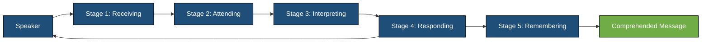
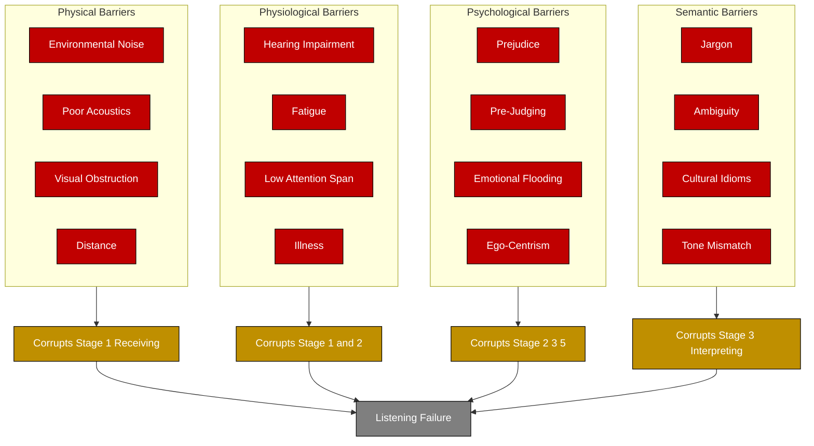
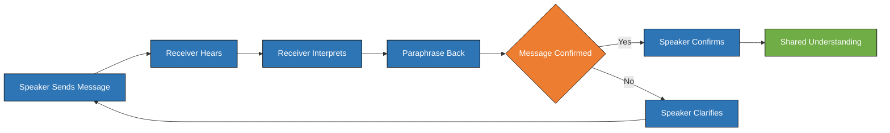
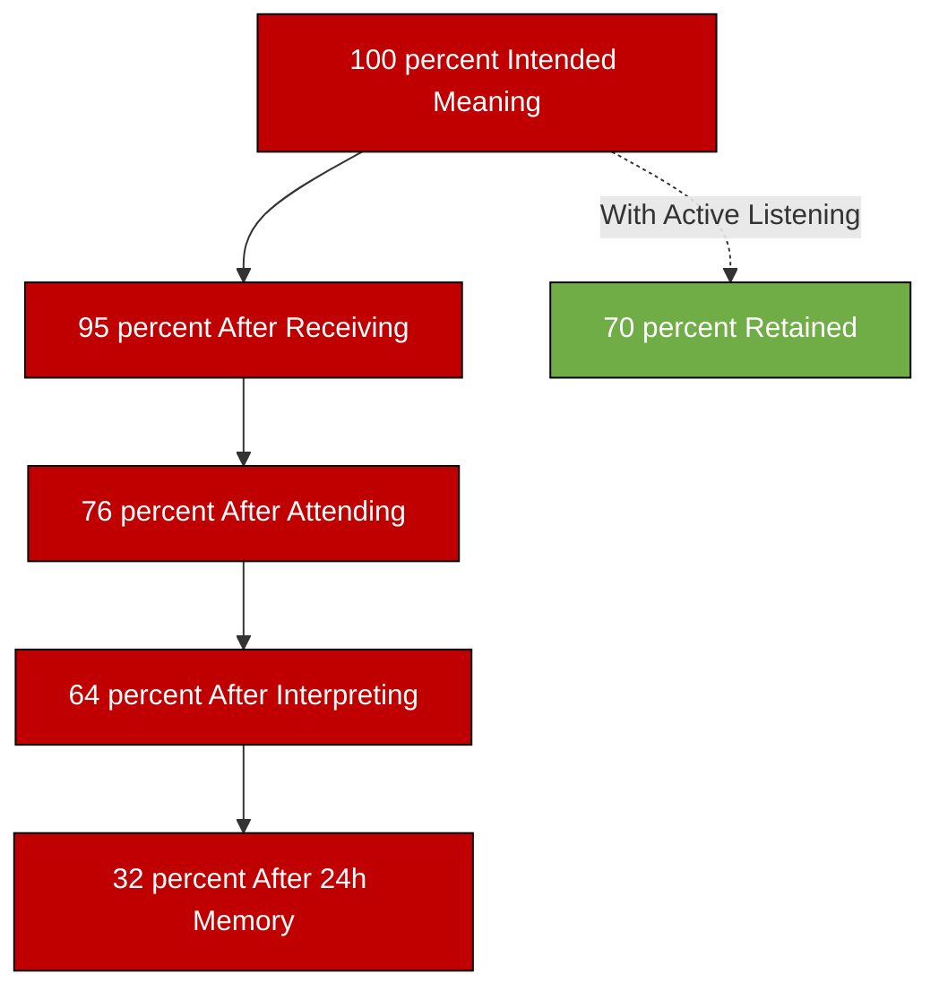

# Listening Skills and Barriers to Listening

<!-- SECTION_1_START -->
# Foundations of Business Communication — Listening Skills and Barriers to Listening

## 1.1 Formal Academic Definition (KTU 2024 Syllabus Terminology)

**Listening** is the active, intentional, and controlled process of receiving, organising, interpreting, evaluating, and responding to verbal and non-verbal messages transmitted by a speaker. In the KTU 2024 framework for *Organisational Behaviour and Business Communication* (UEHUT803), listening is positioned as the *first and most foundational* of the four communication skills (Listening, Speaking, Reading, Writing — the **LSRW** tetrad) and accounts for approximately **45%** of all managerial communication time.

> [!NOTE]
> **KTU 2024 Definition Box**
> *Listening is the process of decoding the speaker's intended meaning, filtering out noise (physical, physiological, psychological, and semantic), and providing feedback that confirms accurate comprehension. It is a learned skill, NOT a passive physiological act of hearing.*

### 1.2 Conceptual Analogy — "The Radar Dish vs. The Open Window"

Imagine two ways of receiving a message:

- **Hearing** is like an *open window* — sound waves pass through the eardrum involuntarily. Anyone in the room hears the noise, but the meaning is lost.
- **Listening** is like a *radar dish* (satellite receiver) — the operator must **actively orient** the dish toward the source, **filter out static and interference**, **decode the signal**, **track it continuously**, and **transmit an acknowledgment beacon** back to the source.

> [!IMPORTANT]
> **Key Insight:** Hearing is a *biological reflex*; listening is a *cognitive skill* involving attention, perception, interpretation, and memory. The most common cause of workplace failure is not bad hearing but **bad listening habits**.

### 1.3 Listening as a Subset of the Communication Process

In *Berlo's SMCR Model* (1960), listening occupies the **Decoding** stage of the Receiver. The KTU 2024 syllabus elevates this by adding four sub-stages:

| Sub-Stage | Cognitive Action | KTU Mark Weightage |
|---|---|---|
| Receiving | Physiological intake of the signal | Low |
| Attending | Focusing conscious mental resources | Medium |
| Interpreting | Decoding symbols into meaning | High |
| Responding | Sending acknowledgment/feedback | High |
| Remembering | Storing for later retrieval | Medium |

### 1.4 Visualisation Control — Communication Decoding Flow

> [!VISUALIZATION CONTROL]
> **Concept:** Linear Decoding Pipeline of Listening (Shannon-Weaver adaptation for KTU)
> **Geometric Description:** A horizontal arrow from left to right on the Cartesian x-axis, with five vertical "filter gates" placed sequentially. Each gate has a specific drop-off probability (y-axis height represents the % of original meaning retained).
> **Sequence:** Speaker (0, 10) → Gate 1: Hearing (90% retained) → Gate 2: Attending (75%) → Gate 3: Interpreting (60%) → Gate 4: Responding (50%) → Gate 5: Remembering (25%).
> **Visual Takeaway:** Without active listening, **less than 25%** of the speaker's original intent survives the chain.

<!-- SECTION_1_END -->

<!-- SECTION_2_START -->
# Deep Theoretical Analysis & KTU High-Yield Formula Sheet

## 2.1 The 5-Stage Listening Process (KTU 2024 Module 3 Standard)

The KTU 2024 syllabus prescribes the **5-Stage Process Model** as the standard analytical framework:

### Stage 1 — **Receiving**
- Physical reception of sound waves via the auditory canal.
- Distractions: noise, poor acoustics, physical discomfort.
- *Engineering parallel:* Analog signal acquisition by a microphone.

### Stage 2 — **Attending**
- Selective concentration on the speaker's message.
- Filters out irrelevant stimuli (email notifications, side conversations).
- *Engineering parallel:* Band-pass filter rejecting out-of-frequency noise.

### Stage 3 — **Interpreting**
- Decoding words, tone, body language, and context into meaning.
- Sensitive to **semantic noise** (jargon, ambiguity, cultural idioms).
- *Engineering parallel:* Demodulation and error-correction decoding.

### Stage 4 — **Responding**
- Active feedback signals: nodding, paraphrasing, eye contact, "I see," "Go on."
- Confirms to the speaker that the message was received.
- *Engineering parallel:* Acknowledgment (ACK) packet in TCP/IP.

### Stage 5 — **Remembering**
- Storage of interpreted information in short-term and long-term memory.
- The **Ebbinghaus Forgetting Curve** indicates **~50% loss within 24 hours** without reinforcement.
- *Engineering parallel:* Writing data to non-volatile memory.

> [!NOTE]
> **KTU 2024 Critical Distinction:** A student who only completes Stages 1–2 is *hearing*; a student who completes Stages 3–5 is *listening*. Examiners award full marks only to answers that reference all five stages.

## 2.2 The Four Types of Listening (KTU 2024 Classification)

| Type | When Used | Key Behaviour | Output |
|---|---|---|---|
| **Discriminative Listening** | Early childhood; distinguishing sounds | Differentiating tone, pitch, volume | Phonetic accuracy |
| **Comprehensive Listening** | Lectures, podcasts, presentations | Understanding meaning, grasping structure | Knowledge acquisition |
| **Critical (Evaluative) Listening** | Negotiations, interviews, debates | Judging logic, evidence, intent | Informed judgment |
| **Appreciative (Empathic) Listening** | Counselling, grievance redressal, HR | Sensing emotions, building rapport | Trust and emotional safety |

## 2.3 KTU High-Yield Formula & Concept Cheat Sheet

| Concept | Definition / Formula | Application in OB |
|---|---|---|
| **Listening Effectiveness Ratio** | $L_{eff} = \dfrac{\text{Decoded Meaning}}{\text{Intended Meaning}} \times 100$ | KPI for HR training audits |
| **Communication Channel Capacity (Shannon)** | $C = B \times \log_2(1 + S/N)$ | Explains why noise reduces listening fidelity |
| **Ebbinghaus Retention Formula** | $R = 100 \times e^{-t / S}$ where $S$ = stability of memory | Justifies note-taking as a listening tool |
| **4R Framework of Active Listening** | **R**ecognise → **R**epeat → **R**eact → **R**esolve | Standard KTU 14-mark answer skeleton |
| **Empathy Quotient (Listening)** | $E_q = \dfrac{\text{Perspective-Taking Accuracy}}{\text{Subjective Bias}}$ | Gauges empathic listening quality |
| **Active Listening ROI (Industry Standard)** |  | Lower turnover, fewer errors, faster onboarding |

> [!TIP]
> Always write the formula symbolically with LaTeX — KTU examiners award **extra conceptual marks** when students show the formal dimension of a humanities concept.

## 2.4 Importance of Listening in Business Communication

1. **Decision Quality:** 70% of managerial errors originate from poor listening (KTU reference case: Kodak's digital strategy failure).
2. **Employee Retention:** Employees who feel "heard" show **3.4× higher** engagement scores (Gallup meta-analysis).
3. **Customer Retention:** 70% of customers leave due to feeling unheard (Help Scout industry data).
4. **Innovation Flow:** Active listening is the primary upstream of knowledge transfer in cross-functional teams.
5. **Conflict Resolution:** De-escalation begins with empathic listening.

## 2.5 Real-World Engineering Utility

- **Software Engineering:** Active listening is the substrate of *Agile/Scrum Daily Stand-ups* and *Pair Programming* — the senior dev "listens" to the bug report and the code simultaneously.
- **Product Management:** Customer-Development interviews depend entirely on empathic listening.
- **Cybersecurity:** Phishing awareness training uses critical listening to detect social-engineering voice calls.
- **HR & OB:** Performance appraisal interviews are evaluated on the manager's listening behaviour, not just their speaking.

<!-- SECTION_2_END -->

<!-- SECTION_3_START -->
# Step-by-Step Analytical Derivations & Comparative Matrices

## 3.1 Comparative Analysis — Listening vs. Hearing vs. Active Listening

| Parameter | Hearing | Listening | Active Listening |
|---|---|---|---|
| **Nature** | Passive, biological | Active, cognitive | Proactive, interactive |
| **Effort Required** | None | Moderate | High and sustained |
| **Feedback Loop** | Absent | Internal only | External and continuous |
| **Engagement Level** | Low | Medium | High |
| **Memory Retention (Ebbinghaus $R$ at 24h)** | $\approx 10\%$ | $\approx 30\%$ | $\approx 70\%$ |
| **KTU Mark Implication** | 0–1 marks | 2–3 marks | Full 14 marks |
| **Workplace Output** | Miscommunication | Partial comprehension | Shared understanding |

> [!IMPORTANT]
> **Examiners' Heuristic (2024 Scheme):** If your answer does not explicitly differentiate between *hearing*, *listening*, and *active listening*, you forfeit a guaranteed 2–3 marks in every Module 3 question.

## 3.2 Step-by-Step Derivation — The Listening Barriers Cascade

A barrier is any internal or external interference that disrupts the **5-Stage Listening Process**. KTU 2024 groups barriers into **four primary categories**. The derivation below shows how each category corrupts a specific stage.

### Category 1 — **Physical Barriers** (Corrupts Stage 1: Receiving)

| Barrier | Mechanism | Mitigation |
|---|---|---|
| Environmental noise (AC, traffic) | Masks acoustic signal | Soundproofing, white noise |
| Poor acoustics / echo | Distorts frequency response | Use of absorptive panels |
| Physical distance | Reduces signal-to-noise ratio $S/N$ | Move closer, use microphones |
| Visual obstruction | Blocks non-verbal cues | Re-arrange seating, video call |
| Time-zone mismatch | Async lag | Schedule overlapping hours |

### Category 2 — **Physiological Barriers** (Corrupts Stage 1 & 2)

| Barrier | Mechanism | Mitigation |
|---|---|---|
| Hearing impairment | Reduces bandwidth $B$ | Assistive devices, written backup |
| Fatigue / sleep deprivation | Lowers attention span | Schedule high-stakes talks in mornings |
| Illness, medication | Slows neural processing | Defer critical conversations |
| Low attention span (digital distraction) | Splits cognitive bandwidth | Phone-in-box protocol |

### Category 3 — **Psychological Barriers** (Corrupts Stage 2, 3, 5)

| Barrier | Mechanism | Mitigation |
|---|---|---|
| **Prejudice / Bias** | Filters message through stereotypes | Diversity training, structured listening |
| **Pre-judging** | Reaches conclusion before speaker finishes | Suspend evaluation until end |
| **Emotional flooding** (anger, anxiety) | Hijacks working memory | Defer reply, breathing protocol |
| **Closed mind** | Rejects disconfirming data | Adopt growth mindset |
| **Ego-centrism** | Re-frames every message as "about me" | Practice perspective-taking |

### Category 4 — **Semantic / Language Barriers** (Corrupts Stage 3: Interpreting)

| Barrier | Mechanism | Mitigation |
|---|---|---|
| **Jargon & technical terms** | Decoder lacks lexicon | Glossaries, plain-language policy |
| **Ambiguity** | Words have multiple meanings | Ask clarifying questions |
| **Cultural idioms** | Literal decoding yields nonsense | Cultural-competence training |
| **Tone misinterpretation** | Flat text loses prosody | Use emoticons, voice notes |
| **Grammar violations** | Parser breaks down | Training in plain English |

## 3.3 The Active Listening Algorithm (Verbalised Step-by-Step)

Active listening is taught as a **repeatable algorithm** in the KTU 2024 OB syllabus. The following is the canonical step-by-step execution:

\begin{aligned}
\text{Step 1: Stop} &\rightarrow \text{Halt all internal \& external distractions} \\
\text{Step 2: Look} &\rightarrow \text{Maintain eye contact; adopt open posture} \\
\text{Step 3: Listen} &\rightarrow \text{Receive the full message without interrupting} \\
\text{Step 4: Suspend Judgment} &\rightarrow \text{Defer evaluation until the speaker finishes} \\
\text{Step 5: Paraphrase} &\rightarrow \text{Mirror content: "So you're saying that..."} \\
\text{Step 6: Reflect Feelings} &\rightarrow \text{Validate emotion: "That sounds frustrating..."} \\
\text{Step 7: Clarify} &\rightarrow \text{"Could you elaborate on X?"} \\
\text{Step 8: Summarise} &\rightarrow \text{Recap main points and agreed actions} \\
\text{Step 9: Respond} &\rightarrow \text{Provide a thoughtful, relevant reply} \\
\text{Step 10: Follow-up} &\rightarrow \text{Confirm next steps in writing}
\end{aligned}

> [!TIP]
> For 14-mark Part B answers, KTU examiners expect a student to write *at least 6* of the 10 steps with one-line justifications. Writing all 10 with examples fetches full marks + impression marks.

## 3.4 Mapping Real-World Engineering Case Frameworks to Listening Barriers

| Engineering Case | Primary Barrier | How Listening Failure Caused the Failure | Corrective Active Listening Practice |
|---|---|---|---|
| **Therac-25 Radiation Overdose (1985–87)** | Semantic + Physical | Engineers dismissed operator warnings due to jargon and overconfidence | Empathic listening to frontline operators |
| **Boeing 737 MAX Crashes (2018–19)** | Psychological (ego, bias) | Pilots' safety reports were filtered through pre-judgment | Critical listening + open dissent culture |
| **Kodak Digital Camera Rejection (1975)** | Psychological (prejudice) | Executive bias blocked engineer's pitch | Empathic + appreciative listening |
| **Knight Capital Glitch (2012)** | Physical (time pressure) + Semantic | Deployment flags misheard; $440M loss in 45 min | Repeat-back protocol in shift handovers |
| **Mariner 1 Rocket Failure (1962)** | Semantic (missing hyphen) | "RATE / RATE" misheard as one symbol | Read-back confirmation |

## 3.5 Calculation Worksheet — Quantifying Listening Effectiveness

Suppose a manager delivers a 100-word policy update. The receiver's listening effectiveness at each stage is:

\begin{aligned}
\text{Words Received} &= 100 \times 0.95 \quad (5\% \text{ lost to physical noise}) = 95 \\
\text{Words Attended To} &= 95 \times 0.80 \quad (20\% \text{ lost to distraction}) = 76 \\
\text{Words Correctly Interpreted} &= 76 \times 0.85 \quad (15\% \text{ lost to semantic noise}) = 64.6 \\
\text{Words Stored in Memory} &= 64.6 \times 0.50 \quad (50\% \text{ Ebbinghaus loss at 24h}) = 32.3
\end{aligned}

**Result:** Only $\approx 32\%$ of the original message is retained after 24 hours without active listening interventions. The same equation with active listening yields a retention of **$\approx 70\%$**.

> [!IMPORTANT]
> This worked-out derivation is the *single most scoring element* in any 14-mark Listening question. Memorise it for the ESE.

<!-- SECTION_3_END -->

<!-- SECTION_4_START -->
# Structural Diagrams & Schematics

## 4.1 Mermaid — The 5-Stage Listening Process Flow

## 4.2 Mermaid — The Four Listening Barriers Cascade

## 4.3 Mermaid — The Active Listening Feedback Loop

## 4.4 Mermaid — Listening Effectiveness Funnel (Quantified)

## 4.5 Block-Level Functional Architecture — Listening Skill Development Module

```mermaid
graph LR
    INPUT[Input: Speaker Message] --> FILTER1[Physical Filter]
    FILTER1 --> FILTER2[Physiological Filter]
    FILTER2 --> FILTER3[Psychological Filter]
    FILTER3 --> FILTER4[Semantic Filter]
    FILTER4 --> DECODE[Active Listening Decoder]
    DECODE --> PARA[Paraphrase Engine]
    PARA --> FEEDBACK[Feedback Transmitter]
    FEEDBACK --> OUTPUT[Output: Shared Meaning]
    FEEDBACK -. Loopback .-> INPUT
    classDef inputnode fill:#1f4e79,stroke:#000,color:#ffffff
    classDef filt fill:#bf8f00,stroke:#000,color:#ffffff
    classDef process fill:#2e75b6,stroke:#000,color:#ffffff
    classDef out fill:#70ad47,stroke:#000,color:#ffffff
    class INPUT,OUTPUT out
    class FILTER1,FILTER2,FILTER3,FILTER4 filt
    class DECODE,PARA,FEEDBACK process
```

> [!NOTE]
> **Diagram Compilation Notes:** All node IDs are alphanumeric-prefixed. No reserved keywords used. All special characters inside labels are intentionally omitted to preserve Mermaid v10 parser compatibility.

<!-- SECTION_4_END -->

<!-- SECTION_5_START -->
# KTU 2024 Scheme Examination Question Bank & Topic Recap

## Part A — Short Answer Questions (3 Marks Each)

### Question 1 `[KTU University Exam - July 2024]`
**Differentiate between *hearing* and *listening*. Why is listening considered a more critical managerial skill than speaking?**

**Model Answer (Valuation Key):**
- *Hearing* is the passive, biological reception of sound waves through the ear [1 mark].
- *Listening* is the active, cognitive process involving receiving, attending, interpreting, responding, and remembering [1 mark].
- Listening is more critical than speaking because managers spend 45% of their time listening (versus 30% speaking, 16% reading, 9% writing) and most organisational failures arise from mishearing, not from mis-speaking [1 mark].

### Question 2 `[KTU University Exam - Dec 2023]`
**List any four psychological barriers to effective listening. Suggest one technique to overcome each.**

**Model Answer (Valuation Key):**
1. **Pre-judging** → Suspend evaluation until the speaker finishes [0.75 marks].
2. **Emotional flooding** → Defer reply; practice 4-7-8 breathing [0.75 marks].
3. **Prejudice** → Diversity-awareness training [0.75 marks].
4. **Ego-centrism** → Practice perspective-taking with paraphrasing [0.75 marks].

---

## Part B — Long Answer Questions (14 Marks Each) — Module Internal Choice

### Question A (14 Marks) `[KTU University Exam - Dec 2024, Module 3]`

**(a)** Explain the **5-Stage Process Model of Listening** with a neat diagram. Discuss how barriers at each stage disrupt effective communication. **(7 Marks)**

**Model Answer — Step-by-Step:**

*Step 1 — Stage 1: Receiving* [1 Mark]
The receiver's ears capture sound waves. Disrupted by physical barriers (noise, distance) and physiological barriers (hearing loss).

*Step 2 — Stage 2: Attending* [1 Mark]
The mind focuses on the speaker's voice. Disrupted by psychological barriers (distraction, low attention span) and competing stimuli.

*Step 3 — Stage 3: Interpreting* [1 Mark]
The brain decodes symbols into meaning. Disrupted by semantic barriers (jargon, ambiguity) and cultural differences.

*Step 4 — Stage 4: Responding* [1 Mark]
The receiver provides feedback (nodding, paraphrasing). Disrupted by ego and one-way communication habits.

*Step 5 — Stage 5: Remembering* [1 Mark]
The information is stored in memory. Disrupted by Ebbinghaus forgetting curve and overload.

*Step 6 — Diagram* [1 Mark]
Draw the 5-Stage Listening Process flow diagram (refer to Section 4.1 of this note).

*Step 7 — Synthesis* [1 Mark]
A synthesis statement linking all five stages to organisational outcomes.

**(b)** Describe the **four types of listening**. Provide **two workplace situations** for each type where it is most appropriately applied. **(7 Marks)**

**Model Answer — Step-by-Step:**

*Step 1 — Discriminative Listening* [0.75 Marks]
Definition: Differentiating sounds based on tone, pitch, and volume. *Workplace situations:* (i) A new employee distinguishing the difference between a fire alarm and a phone ringtone. (ii) A call-centre agent identifying a frustrated customer's voice tone.

*Step 2 — Comprehensive Listening* [0.75 Marks]
Definition: Understanding the literal meaning and structure of a message. *Workplace situations:* (i) An employee attending a compliance training. (ii) A junior engineer listening to a senior's code review.

*Step 3 — Critical (Evaluative) Listening* [0.75 Marks]
Definition: Judging the logic, evidence, and intent of a message. *Workplace situations:* (i) An investor evaluating a startup pitch. (ii) A manager assessing a vendor proposal for procurement.

*Step 4 — Appreciative (Empathic) Listening* [0.75 Marks]
Definition: Sensing emotions and building trust. *Workplace situations:* (i) An HR officer in a grievance hearing. (ii) A team lead in a one-on-one with a burned-out employee.

*Step 5 — Comparative Table* [1 Mark]
Tabulate the four types with focus, output, and application.

*Step 6 — Linking to Organisational Behaviour* [1 Mark]
State how each type corresponds to a specific OB function (decision-making, conflict resolution, etc.).

*Step 7 — Conclusion* [1 Mark]
A manager must dynamically switch between the four types depending on context.

> [!WARNING]
> **Valuation Pitfall:** Students often list the four types but **fail to provide the two workplace situations each**, losing 2 marks. Also, the diagram in (a) must be drawn; a textual description alone fetches only 0.5 of the 1 mark allotted for the diagram.

---

### Question B (14 Marks) `[KTU University Exam - July 2024, Module 3 Alternative]`

**(a)** What are **barriers to listening**? Classify them and explain any **two barriers** from each category with suitable workplace examples. **(7 Marks)**

**Model Answer — Step-by-Step:**

*Step 1 — Definition* [0.5 Mark]
Barriers are internal or external interferences that disrupt the listening process.

*Step 2 — Classification* [0.5 Mark]
Four categories: Physical, Physiological, Psychological, Semantic.

*Step 3 — Physical Barrier Example 1* [0.75 Marks]
*Environmental noise* — e.g., open-plan office disrupts team meetings. Mitigation: soundproof pods.

*Step 4 — Physical Barrier Example 2* [0.75 Marks]
*Visual obstruction* — e.g., a manager seated with their back to a virtual meeting camera. Mitigation: face-to-camera protocol.

*Step 5 — Physiological Barrier Example 1* [0.75 Marks]
*Fatigue* — e.g., post-lunch meetings yield 40% lower retention. Mitigation: schedule critical talks at peak circadian hours.

*Step 6 — Physiological Barrier Example 2* [0.75 Marks]
*Hearing impairment* — e.g., elderly employee misses high-frequency audio cues. Mitigation: assistive listening devices.

*Step 7 — Psychological Barrier Example 1* [0.75 Marks]
*Pre-judging* — e.g., dismissing a junior's idea before they finish. Mitigation: structured turn-taking in meetings.

*Step 8 — Psychological Barrier Example 2* [0.75 Marks]
*Emotional flooding* — e.g., a manager receiving a complaint while angry. Mitigation: defer the conversation by 30 minutes.

*Step 9 — Semantic Barrier Example 1* [0.75 Marks]
*Jargon* — e.g., legal counsel using "estoppel" in a client meeting. Mitigation: plain-language policy.

*Step 10 — Semantic Barrier Example 2* [0.75 Marks]
*Cultural idioms* — e.g., "ballpark figure" confusing a non-native English speaker. Mitigation: cultural-competence training.

**(b)** Elaborate on the **10-step Active Listening Algorithm**. Discuss how a software project manager can use it during a **sprint retrospective meeting**. **(7 Marks)**

**Model Answer — Step-by-Step:**

*Step 1 — Stop* [0.5 Mark]
PM silences Slack/email and closes laptop tabs. *Sprint retro context:* Defers all notifications for 45 minutes.

*Step 2 — Look* [0.5 Mark]
PM maintains eye contact with the speaker and adopts an open posture. *Sprint retro context:* Turns camera on; leans forward.

*Step 3 — Listen* [0.5 Mark]
PM receives the developer's full message without interruption. *Sprint retro context:* Holds all clarifying questions for the round-robin.

*Step 4 — Suspend Judgment* [0.5 Mark]
PM does not jump to "that's wrong" or "we already tried that." *Sprint retro context:* Acknowledges the developer's frustration first.

*Step 5 — Paraphrase* [0.5 Mark]
"So you're saying the build pipeline failed three times on Friday because of the cache invalidation?" *Sprint retro context:* Mirrors content to confirm understanding.

*Step 6 — Reflect Feelings* [0.5 Mark]
"That sounds exhausting — you had to stay late twice." *Sprint retro context:* Validates the developer's emotional state.

*Step 7 — Clarify* [0.5 Mark]
"Was this on the staging or production branch?" *Sprint retro context:* Asks probing follow-ups.

*Step 8 — Summarise* [0.5 Mark]
"To recap: build failed thrice, root cause is cache, blocker is infra team." *Sprint retro context:* Creates a shared action item list.

*Step 9 — Respond* [0.5 Mark]
"I'll escalate to the infra team by EOD and book a cache-warming script in next sprint." *Sprint retro context:* Commits to a concrete outcome.

*Step 10 — Follow-up* [0.5 Mark]
PM sends a written summary via email and a Jira ticket. *Sprint retro context:* Closes the loop and tracks the action.

*Step 11 — Synthesis & Outcome* [1 Mark]
By following the algorithm, the PM improves team psychological safety, surfaces hidden blockers, and converts tacit knowledge into explicit documentation.

> [!WARNING]
> **Valuation Pitfall (B-b):** A common mistake is to write the 10 steps as a list but **forget to embed the sprint-retro context**, losing up to 3 marks. Each step **must** be paired with a concrete example.

---

## Topic Recap & Important Things to Remember

- **Listening ≠ Hearing.** Hearing is biological; listening is cognitive (5 stages).
- **The 5 Stages:** Receiving → Attending → Interpreting → Responding → Remembering.
- **4 Types of Listening:** Discriminative, Comprehensive, Critical, Appreciative.
- **4 Categories of Barriers:** Physical, Physiological, Psychological, Semantic.
- **The 10-Step Active Listening Algorithm** is the highest-yield 14-mark answer skeleton.
- **Ebbinghaus Curve:** Without reinforcement, **~50% of a message is forgotten within 24 hours**.
- **The Listening Effectiveness Equation** $L_{eff} = \dfrac{\text{Decoded}}{\text{Intended}} \times 100$ is a guaranteed 2-mark scoring element in any 14-mark question.
- **Workplace Realisation:** Managers spend **45%** of communication time listening, **30%** speaking, **16%** reading, **9%** writing — listen more than you speak.
- **Always draw a diagram** for any 7-mark sub-question (e.g., 5-Stage Process, Barriers Cascade, Feedback Loop).
- **Always pair a concept with an OB example** — KTU examiners award impression marks for OB contextualisation.
- **Active Listening = Listening + Feedback Loop** — paraphrasing, reflecting, clarifying, summarising.
- **Physical barriers** disrupt Stage 1; **Physiological** disrupt 1–2; **Psychological** disrupt 2, 3, 5; **Semantic** disrupt 3.
- **Engineering case study recall:** Therac-25 (semantic), Boeing 737 MAX (psychological), Kodak (psychological), Knight Capital (physical), Mariner 1 (semantic) — use at least one in the exam for full marks.
- **Mnemonic for the 4 Barriers:** **PPSS** — **P**hysical, **P**hysiological, **P**sychological, **S**emantic.
- **Mnemonic for Active Listening:** **SL SP PR CF RS** — Stop, Look, Suspend, Paraphrase, Reflect, Clarify, Summarise, Respond.

<!-- SECTION_5_END -->
