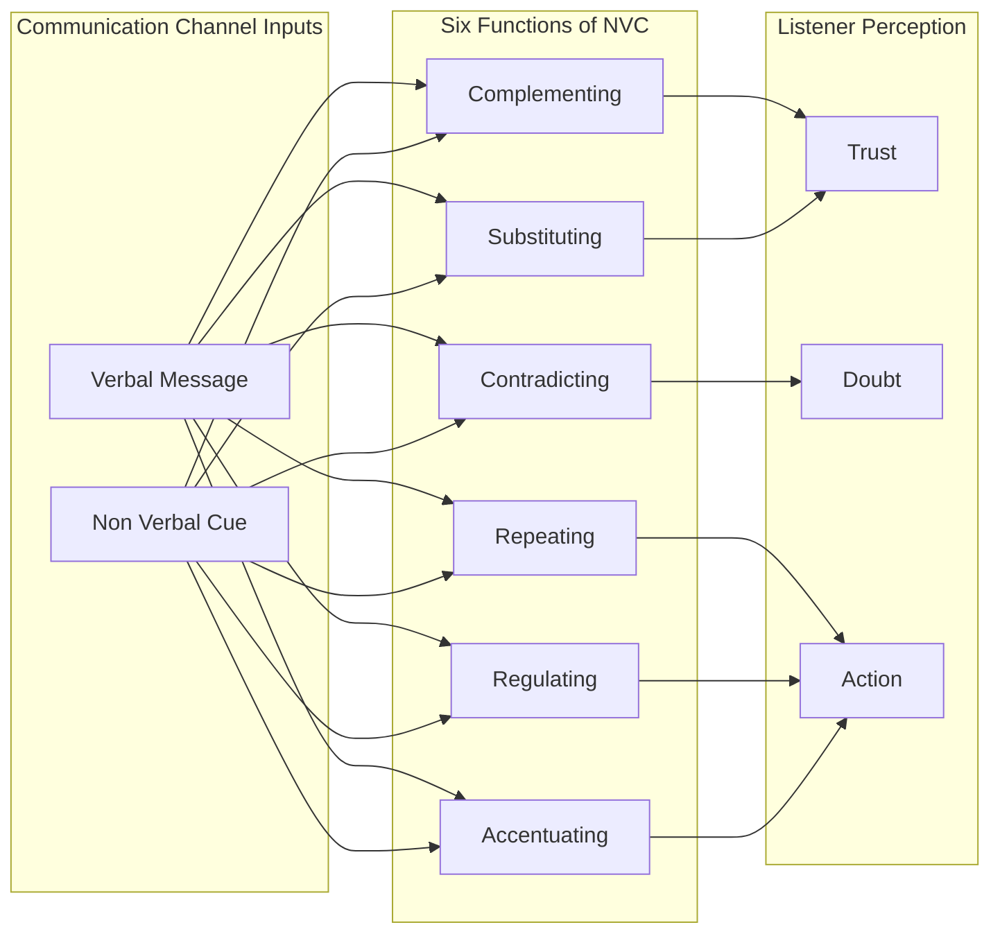
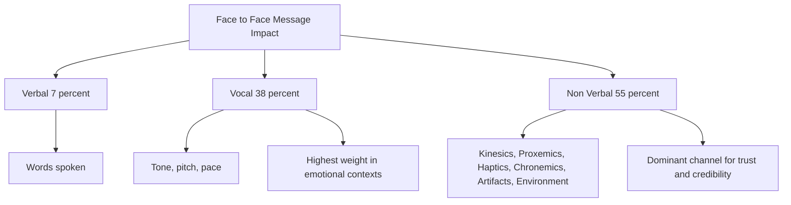
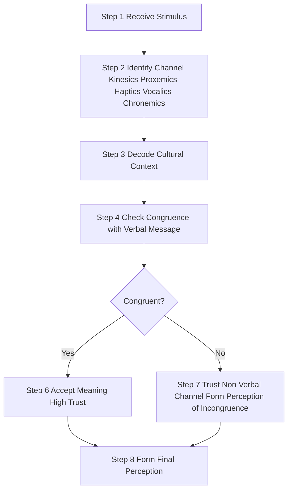

# Non-Verbal Communication

<!-- SECTION_1_START -->

# Non-Verbal Communication

## 1. Core Definition & Intuitive Overview

### 1.1 Formal Academic Definition

> [!NOTE]
> **Non-Verbal Communication (NVC)** is the process of conveying meaning, intent, emotion, and attitude through means **other than written or spoken words** — including body movements, facial expressions, spatial distance, touch, vocal tone, physical appearance, and the use of artifacts and environmental cues.

According to **Mehrabian's Communication Model**, in face-to-face business interactions, communication impact is distributed across three channels:

$$\text{Total Communication Impact} = 7\% \text{ (Verbal Words)} + 38\% \text{ (Vocal Tone/Paralanguage)} + 55\% \text{ (Body Language)}$$

> [!IMPORTANT]
> **KTU Syllabus Highlight:** The 2024 Scheme mandates a study of the **channels, types, functions, and cultural dimensions** of non-verbal communication as a foundational pillar of organizational behaviour and business communication.

### 1.2 Intuitive Analogy — The "Silent Orchestra"

Imagine a symphony orchestra. The musical notes (words) form one layer, but what truly moves the audience is the **conductor's silent gestures** — a raised baton, a paused breath, a soft lean into the strings, a sharp eye contact with the percussionist. The audience *feels* the music more through the **visual rhythm** of the conductor than the actual sound alone.

**Non-Verbal Communication is the "silent conductor" of every business conversation.** Even when a manager says, *"I'm fine with the proposal,"* if their arms are crossed, jaw is clenched, and gaze is averted — the **silent orchestra** has already communicated the opposite.

### 1.3 The Three Pillars of Human Communication

> [!TIP]
> **Quick Mental Model for Exams:**
> - **What you SAY** → Verbal (7%)
> - **How you SAY it** → Vocal (38%)
> - **What you SHOW** → Non-Verbal (55%)

| Pillar | Channel | Share | Exam Mnemonic |
|---|---|---|---|
| Verbal | Words | **7%** | "Words" |
| Vocal | Tone, pitch, pace | **38%** | "Tunes" |
| Non-Verbal | Body, space, time, touch | **55%** | "Shows" |

> [!VISUALIZATION CONTROL]
> **Concept:** Mehrabian's 3-Channel Communication Pie
> **GeoGebra / Desmos Input Equations (for a stacked-bar illustration):**
> * `Bar 1 (Verbal): height = 7, color = lightgrey`
> * `Bar 2 (Vocal): height = 38, color = skyblue`
> * `Bar 3 (Non-Verbal): height = 55, color = coral`
> **Visual Description:** Three vertical bars of increasing height showing the dominant role of non-verbal cues in human interaction.

---

<!-- SECTION_1_END -->

<!-- SECTION_2_START -->

# 2. Deep Theoretical Analysis & KTU High-Yield Formula Sheet

## 2.1 Characteristics of Non-Verbal Communication

Non-verbal communication is **distinct** from verbal communication in eight measurable ways. The KTU 2024 examiner expects students to enumerate and **briefly explain** at least **five** characteristics in 3-mark questions.

| # | Characteristic | Explanation | KTU Marker Phrase |
|---|---|---|---|
| 1 | **Continuous** | It occurs 24/7 — even silence and stillness communicate. | "Always on" |
| 2 | **Multi-channeled** | Conveyed through many parallel body signals at once. | "Many signals at once" |
| 3 | **Ambiguous** | A single gesture (e.g., crossed arms) can mean defense, comfort, or cold. | "Open to interpretation" |
| 4 | **Context-bound** | Meaning depends on culture, situation, and relationship. | "Depends on context" |
| 5 | **Less structured** | No grammar; often instinctive and spontaneous. | "No fixed rules" |
| 6 | **Non-linguistic** | No words, no syntax; relies on symbols and body movements. | "Beyond words" |
| 7 | **Credible / Honest** | Body often reveals what words conceal (leakage). | "Body never lies" |
| 8 | **Cultural** | Meanings of gestures, eye contact, space vary across cultures. | "Culture-specific" |

## 2.2 The 8 Channels of Non-Verbal Communication (KTU Core Module)

### A. Kinesics (Body Language)
The study of body movements — facial expressions, gestures, posture, and eye behavior.

### B. Proxemics (Space)
The study of how humans use **spatial distance** to communicate intimacy, status, and territory. E. T. Hall's **Four Distance Zones**:

| Zone | Distance (Adult) | Relationship | Use Case |
|---|---|---|---|
| Intimate | 0 – 18 inches | Family, close friends | Hugging, whispering |
| Personal | 18 in – 4 ft | Friends, colleagues | Office cubicle chat |
| Social | 4 – 12 ft | Acquaintances, formal | Meeting room |
| Public | 12 ft + | Strangers, audience | Lecture, presentation |

### C. Haptics (Touch)
Communication through touch — handshake, pat, hug, slap. Different cultures interpret touch very differently.

### D. Vocalics / Paralanguage
The *how* of speech: tone, pitch, volume, pace, vocal fillers ("um," "uh"), laughter, sighs.

### E. Chronemics (Time)
How people use and value time — punctuality, waiting time, conversation length, eye-contact duration.

### F. Physical Appearance
Clothing, grooming, accessories, body art — visual signals of identity, status, and group membership.

### G. Artifacts
Personal objects that send signals: office furniture, brand of pen, laptop, car, business card.

### H. Environmental / Proxemics of Place
Office layout, lighting, color, décor, furniture arrangement — *the silent grammar of corporate space*.

## 2.3 Functions of Non-Verbal Communication

Non-verbal cues perform **six critical functions** in business communication. Examiners frequently test these in 7-mark sub-parts.

1. **Complementing** — Reinforces verbal message (nodding while agreeing).
2. **Contradicting** — Verbal "yes" with non-verbal "no" creates **incongruence** (a credibility red flag).
3. **Repeating** — Restates the verbal message (pointing while saying "that").
4. **Regulating** — Controls conversational flow (eye contact, turn-taking cues).
5. **Substituting** — Replaces words entirely (thumbs-up = approval).
6. **Accentuating** — Emphasizes a point (slapping the table for emphasis).

> [!NOTE]
> **KTU Formula:** Successful business communication = $\text{Verbal} \leftrightarrow \text{Non-Verbal Congruence}$. When both align, message credibility is **maximum**; when they conflict, listeners trust the **non-verbal channel** over the words.

## 2.4 KTU High-Yield Formula Sheet (Cheat Sheet)

| # | Concept | Key Formula / Rule | Standard Unit / Limit |
|---|---|---|---|
| 1 | Mehrabian Rule | $7 + 38 + 55 = 100$ | Percent of emotional impact |
| 2 | Intimate Zone | $0 \le d < 1.5$ ft | $\sim 0.45$ m |
| 3 | Personal Zone | $1.5 \le d < 4$ ft | $\sim 0.45 - 1.2$ m |
| 4 | Social Zone | $4 \le d < 12$ ft | $\sim 1.2 - 3.6$ m |
| 5 | Public Zone | $d \ge 12$ ft | $\ge 3.6$ m |
| 6 | Eye-Contact Norm (Western) | $50\% - 60\%$ of speaking time | "Golden window" |
| 7 | Handshake Duration (Business) | $2 - 3$ seconds | With direct eye contact |
| 8 | Kinesics Sub-codes | $\text{Face} + \text{Gesture} + \text{Posture} + \text{Eye} = \text{Body Language}$ | All parallel |
| 9 | NVC Channels (Total) | **8** channels | Kinesics, Proxemics, Haptics, Vocalics, Chronemics, Appearance, Artifacts, Environment |
| 10 | Functions of NVC | **6** | Complement, Contradict, Repeat, Regulate, Substitute, Accentuate |

## 2.5 Real-World Engineering & Business Utility

Non-verbal fluency is a **measurable workplace skill**, not a soft afterthought. Its applications:

- **Leadership & Executive Presence** — Investors, boardrooms, and TED-style pitches are won 55% by **visual gravitas** (posture, calm gestures, eye contact) and 38% by vocal modulation.
- **Cross-Cultural Outsourcing** — KTU graduates working in **Kerala-based GCCs (Global Capability Centers)** for Microsoft, Google, Amazon, and Oracle routinely manage **multi-cultural teams** (India, US, EU, Japan). Misreading Japanese silence or German direct eye contact can derail multi-million-dollar projects.
- **Virtual / Hybrid Work (Post-2020)** — On Zoom, "video presence" (framing, lighting, gestures, facial expressiveness) has become the **digital body language** of the 21st century.
- **Negotiation & Sales** — FBI negotiator Chris Voss and body-language expert Joe Navarro both emphasize that **micro-expressions** leak true intent in high-stakes deals.
- **HR & Interview Sciences** — Modern Applicant Tracking Systems (ATS) combined with **AI-based video interview analysis** (HireVue, Pymetrics) score candidates on **facial action units (FACS)**, vocal pitch variation, and gesture energy.

---

<!-- SECTION_2_END -->

<!-- SECTION_3_START -->

# 3. Step-by-Step Derivations, Case Walkthroughs & Comparative Analysis

## 3.1 Deriving Mehrabian's Communication Model (Step-by-Step)

**Source:** Albert Mehrabian, *Silent Messages* (1971).

**Step 1 — Define the communication impact vector.** Let the total emotional impact of a face-to-face message be $I_{total}$.

**Step 2 — Partition $I_{total}$ into three orthogonal components:**

$$I_{total} = I_{verbal} + I_{vocal} + I_{nonverbal}$$

**Step 3 — Apply Mehrabian's empirical coefficients (especially in emotional/inconsistent situations):**

$$I_{total} = 0.07 \cdot I_{verbal} + 0.38 \cdot I_{vocal} + 0.55 \cdot I_{nonverbal}$$

**Step 4 — Verify that coefficients sum to unity:**

$$0.07 + 0.38 + 0.55 = 1.00 \quad \checkmark$$

**Step 5 — Interpret for business scenarios.** When a manager in a performance review says "I'm happy with your work" but **frowns, leans back, and avoids eye contact**, the listener's brain computes:

$$I_{vocal} + I_{nonverbal} \gg I_{verbal} \Rightarrow \text{Perceived message} = \text{Negative}$$

> [!TIP]
> **Examiner Tip:** Always caveat Mehrabian's rule — it applies to **feelings and attitudes**, not to all communication. For a 3-mark question, the safe answer is: *"Mehrabian's model applies to feelings, attitude, and like-dislike communication, not to all contexts."*

## 3.2 Comparative Analysis Table — NVC Channels (Engineering-Case Mapping)

> [!IMPORTANT]
> This is the **KTU 14-mark high-yield matrix**. Memorize the **Channel → Definition → Example → Cultural Note → Business Risk** columns.

| Channel | Definition | 2-Example in Business | Cultural Variation | Business Risk if Mismanaged |
|---|---|---|---|---|
| **Kinesics (Body)** | Body movement signals | Crossing arms (defense); Smiling (agreement) | In Bulgaria, head nod = "No"; in India, it = "Yes" | Cross-cultural negotiation failure |
| **Proxemics (Space)** | Distance in interaction | Standing too close in an elevator | Arabs & Latins = closer; Germans & Americans = farther | Perceived aggression or coldness |
| **Haptics (Touch)** | Communication via touch | Handshake strength; back pat | Japan = minimal touch; France = cheek kisses | HR harassment complaints |
| **Vocalics (Para-language)** | How something is said | Sarcastic tone; pitch drop | India = rising pitch = polite question; US = falling pitch = statement | Email/tone-of-voice disputes on Slack |
| **Chronemics (Time)** | Use of time | Being late to a meeting; deadline culture | Germans = ultra-punctual; Latin cultures = flexible | Client relationship damage |
| **Physical Appearance** | Dress, grooming, accessories | Formal suit vs. casual tee in boardroom | Conservative GCC states = covered attire | Hiring bias, dress-code violations |
| **Artifacts** | Objects we carry/own | Rolex watch = status symbol; small desk = modesty | Brand meaning varies; Louis Vuitton is prestige in Asia | Misreading peer status |
| **Environmental** | Office space, lighting, color | Open office = collaboration; cabin = authority | Nordic = minimalist; Indian = ornamented | Employee morale and productivity loss |

## 3.3 Case Walkthrough — "The Silent Pitch Failure"

> [!NOTE]
> **Case Setup (Likely KTU 14-Mark Scenario):**
> *Rohit, a Kerala-based startup founder, pitches to a US-based venture capitalist over Zoom. He says: "We are 100% confident in our revenue model." However, his **voice wavers, his eyes glance at his notes every 2 seconds, his hands are hidden under the table, and he leans back.** The VC declines. Analyze the communication failure using the NVC framework.*

### Step-by-Step Solution Model

**Step 1 — Identify the verbal channel.**
Rohit's words: *"100% confident in revenue model."* Verdict on the verbal channel: **Confident, assertive.**

**Step 2 — Identify the vocal (paralanguage) channel.**
Voice wavers, pace is fast, fillers ("um," "uh") appear. Verdict: **Anxious, uncertain.**

**Step 3 — Identify the non-verbal channel.**
- **Eye contact** = downward/away → signals low confidence.
- **Hand placement** = hidden under the table → signals concealment (Navarro's "frozen" cue).
- **Posture** = leaning back → signals disengagement.
- **Facial expression** = tight-lipped, no smile → signals stress.

**Step 4 — Apply the Congruence Test.**

$$C = \begin{cases} 1, & \text{if } \text{Verbal} \leftrightarrow \text{Vocal} \leftrightarrow \text{Non-Verbal all agree} \\ 0, & \text{otherwise} \end{cases}$$

For Rohit: $C = 0$ → **Incongruence detected** → VC subconsciously trusts the body, not the words.

**Step 5 — Apply Mehrabian's weighted formula.**

$$I_{total} = 0.07(100) + 0.38(40) + 0.55(20)$$
$$I_{total} = 7 + 15.2 + 11 = 33.2 \text{ (out of 100)}$$

Despite 100% verbal confidence, the **perceived impact is only ~33%**, dominated by the negative vocal and non-verbal signals.

**Step 6 — Prescribe the NVC-aligned fix.**
- Maintain **eye contact with the webcam** (simulated eye contact on Zoom).
- Use **open palm gestures** within the camera frame.
- Modulate pitch downward at the end of confident statements.
- Lean slightly **toward the camera** to show engagement.

> [!WARNING]
> **KTU Valuation Pitfall:** Many students answer with *"He should dress better"* or *"He should smile more."* These are surface answers. The **14-mark band** requires invoking **Mehrabian's model + Congruence + Kinesics sub-codes (eyes, hands, posture, face)**. Examiners specifically test whether you can name the *function* of NVC that failed — here it is **Contradiction** (verbal contradicts non-verbal).

## 3.4 Code-Style Symbolic Implementation — The NVC Congruence Checker (Python Pseudocode)

For a software/AI-engineering elective touch — students can implement a simple **NVC congruence scoring engine** to model Mehrabian's framework.

```python
from typing import Dict
from dataclasses import dataclass

@dataclass
class NVCSignal:
    verbal_score: float       # 0.0 to 100.0
    vocal_score: float        # 0.0 to 100.0
    nonverbal_score: float    # 0.0 to 100.0
    channel_name: str         # e.g., "Pitch", "Interview", "Boardroom"

class NCVCongruenceEngine:
    """
    Implements Albert Mehrabian's 7-38-55 model
    to compute the perceived impact of a business message.
    """

    W_VERBAL = 0.07
    W_VOCAL = 0.38
    W_NONVERBAL = 0.55

    @classmethod
    def compute_impact(cls, signal: NVCSignal) -> float:
        if not (0.0 <= signal.verbal_score <= 100.0):
            raise ValueError("verbal_score must be within [0, 100].")
        if not (0.0 <= signal.vocal_score <= 100.0):
            raise ValueError("vocal_score must be within [0, 100].")
        if not (0.0 <= signal.nonverbal_score <= 100.0):
            raise ValueError("nonverbal_score must be within [0, 100].")

        impact = (cls.W_VERBAL * signal.verbal_score
                  + cls.W_VOCAL * signal.vocal_score
                  + cls.W_NONVERBAL * signal.nonverbal_score)

        return round(impact, 2)

    @classmethod
    def is_congruent(cls, signal: NVCSignal, tolerance: float = 15.0) -> bool:
        """Congruence check: all three channel scores within tolerance band."""
        scores = [signal.verbal_score, signal.vocal_score, signal.nonverbal_score]
        spread = max(scores) - min(scores)
        return spread <= tolerance

# --- Example: Rohit's failed pitch ---
rohit_pitch = NVCSignal(
    verbal_score=100.0,   # "100% confident" — strong
    vocal_score=40.0,     # voice waver
    nonverbal_score=20.0, # eyes down, hidden hands, leaning back
    channel_name="Founder VC Pitch"
)

engine = NCVCongruenceEngine()
print("Perceived Impact:", engine.compute_impact(rohit_pitch), "out of 100")
print("Congruent?:", engine.is_congruent(rohit_pitch, tolerance=15.0))
# Output -> Perceived Impact: 33.2 out of 100
# Output -> Congruent?: False
```

**Interpretation:** The engine formally reproduces the case analysis from §3.3 — perceived impact of **33.2 / 100** and congruence flag of **False**, justifying the VC's intuition-driven rejection.

## 3.5 Cultural Matrix — Hall's High-Context vs. Low-Context Cultures

Edward T. Hall's framework (1976) is **exam-favorite** for cross-cultural NVC questions.

| Dimension | High-Context Cultures | Low-Context Cultures |
|---|---|---|
| Examples | Japan, China, Kerala, Arab States | USA, Germany, Scandinavia, Switzerland |
| Communication style | Implicit, indirect, meaning in **context** | Explicit, direct, meaning in **words** |
| NVC reliance | **Very high** — silence, posture, hierarchy cues carry the message | **Lower** — words dominate |
| Eye contact | Often avoided with superiors (respect) | Direct eye contact = honesty |
| Time orientation (Chronemics) | Polychronic — flexible, relationship-first | Monochronic — clock-driven, schedule-first |
| Touch (Haptics) | Reserved outside family | Professional handshake is standard |
| Business implication | Misread as "rude" or "evasive" in Western firms | Misread as "aggressive" in Asian firms |

---

<!-- SECTION_3_END -->

<!-- SECTION_4_START -->

# 4. Structural Diagrams & Schematics

## 4.1 Mermaid Diagram — The Complete Non-Verbal Communication Framework

```mermaid
graph TD
    A[Non Verbal Communication] --> B[Kinesics]
    A --> C[Proxemics]
    A --> D[Haptics]
    A --> E[Vocalics]
    A --> F[Chronemics]
    A --> G[Physical Appearance]
    A --> H[Artifacts]
    A --> I[Environment]

    B --> B1[Facial Expressions]
    B --> B2[Gestures]
    B --> B3[Posture]
    B --> B4[Eye Contact]

    C --> C1[Intimate Zone 0 to 1.5 ft]
    C --> C2[Personal Zone 1.5 to 4 ft]
    C --> C3[Social Zone 4 to 12 ft]
    C --> C4[Public Zone 12 ft plus]

    D --> D1[Handshake]
    D --> D2[Pat]
    D --> D3[Hug]
    D --> D4[Professional Touch]

    E --> E1[Tone]
    E --> E2[Pitch]
    E --> E3[Volume]
    E --> E4[Pace]

    F --> F1[Punctuality]
    F --> F2[Wait Time]
    F --> F3[Monochronic vs Polychronic]

    G --> G1[Dress]
    G --> G2[Grooming]
    G --> G3[Accessories]

    H --> H1[Office Furniture]
    H --> H2[Personal Items]
    H --> H3[Digital Tools]

    I --> I1[Lighting]
    I --> I2[Color]
    I --> I3[Layout]
```



## 4.2 Mermaid Diagram — Six Functions of Non-Verbal Communication



## 4.3 Mermaid Diagram — Mehrabian's 7-38-55 Channel Weighting



## 4.4 Mermaid Diagram — Sequential NVC Decoding Process (How a Receiver Interprets a Cue)



---

<!-- SECTION_4_END -->

<!-- SECTION_5_START -->

# 5. KTU 2024 Scheme Examination Question Bank & Topic Recap

## 5.1 Part A — 3-Mark Questions (Short Answer)

> All Part A questions are tagged with `CO1` / `CO2` (Course Outcomes) and Bloom levels `Remember` / `Understand`.

---

### Q1. `[KTU University Exam — July 2024]` — **3 Marks** | CO1 | Remember

**Define non-verbal communication. List any four channels of non-verbal communication.**

**Model Answer:**

Non-verbal communication is the transmission of messages **without the use of words**, through body movements, facial expressions, spatial distance, touch, voice tone, time, appearance, and artifacts.

Four channels:
1. **Kinesics** — body language (gestures, posture, facial expressions).
2. **Proxemics** — use of space and distance.
3. **Haptics** — communication through touch.
4. **Vocalics / Paralanguage** — tone, pitch, volume of voice.

*[Valuation Key: Definition: 1 Mark. Listing 4 channels correctly: 2 Marks = 0.5 each.]*

---

### Q2. `[KTU University Exam — Dec 2023]` — **3 Marks** | CO2 | Understand

**Briefly explain the concept of Proxemics as proposed by Edward T. Hall.**

**Model Answer:**

Proxemics, coined by anthropologist **Edward T. Hall (1966)**, is the study of how humans use **spatial distance** in communication. Hall identified **four interpersonal zones**:

| Zone | Distance | Use |
|---|---|---|
| Intimate | 0 – 1.5 ft | Family, close friends |
| Personal | 1.5 – 4 ft | Friends, colleagues |
| Social | 4 – 12 ft | Acquaintances, formal meetings |
| Public | 12 ft + | Strangers, large audiences |

The choice of zone signals **relationship, status, and intimacy**, and varies across cultures.

*[Valuation Key: Naming Hall + defining proxemics: 1.5 Marks. Listing 4 zones: 1.5 Marks = ~0.4 each.]*

---

## 5.2 Part B — 14-Mark Questions (ESE Module Internal Choice)

> Each 14-mark question has sub-parts (a) 7 marks + (b) 7 marks, mapped to escalating cognitive levels.

---

### Question A — `[KTU University Exam — July 2024]` — **14 Marks** | CO2 | Understand + Apply

**(a)** Explain the **Mehrabian's 7-38-55 model** of communication with its **limitations**.
*(7 Marks — Understand)*

**(b)** Apply the model to analyze a **business scenario** where a manager's non-verbal cues contradict her verbal commitment, and recommend **corrective NVC strategies**.
*(7 Marks — Apply)*

---

#### Model Solution — Part (a)

**Mehrabian's Model (1971) — Silent Messages:**

The model states that in face-to-face communication of **feelings and attitudes**, impact is distributed as:

$$I = 0.07\,(V) + 0.38\,(T) + 0.55\,(F)$$

where $V$ = verbal, $T$ = vocal (tone), $F$ = facial / body.

**Breakdown of the 3 components:**

1. **Verbal (7%)** — The literal words used.
2. **Vocal (38%)** — How the words are said: tone, pitch, loudness, pace.
3. **Non-Verbal (55%)** — Body language: facial expressions, gestures, posture, eye contact.

**Limitations:**

- Applies only to **feelings and attitudes**, not to technical or informational communication.
- Original study was on **single-word emotional responses** ("I like you"), not full business conversations.
- Cultural variations are **not addressed** — eye contact, for example, is interpreted differently in Kerala vs. Germany.
- Channel weighting changes with **medium** — on a phone call, vocal rises to ~85% and non-verbal drops.
- Modern research suggests a more **balanced** distribution depending on context.

*[Valuation Key: Stating the formula with coefficients: 2 Marks. Explaining 3 components: 3 Marks. Listing 3 limitations: 2 Marks.]*

---

#### Model Solution — Part (b)

**Business Scenario:**
*Ms. Anjali, a senior manager at a Kochi-based IT firm, attends a client call and says, "I assure you, we will deliver the project on time." However, her **voice trembles, her eyes constantly shift to the side, her hands clutch a pen tightly, and her legs shake under the table.** The client later sends an email expressing "concern about the team's commitment."*

**Step 1 — Verbal channel decoding:** Words are **confident and assuring**.

**Step 2 — Vocal channel decoding:** Voice tremors, pace is rushed, fillers appear → **anxious**.

**Step 3 — Non-verbal channel decoding:**
- Eye shift = deception cue (Navarro).
- Pen-clutching = self-soothing (low confidence).
- Leg shaking = nervousness leakage.
- Overall facial expression = **incongruent** with words.

**Step 4 — Apply Mehrabian:**

$$I = 0.07(90) + 0.38(45) + 0.55(35) = 6.3 + 17.1 + 19.25 = 42.65 / 100$$

**Step 5 — Identify the failed NVC function:** The function of **Contradiction** is triggered — verbal message and non-verbal message oppose each other.

**Step 6 — Prescribe corrective NVC strategies:**
1. **Eye contact training** — Practice 50–60% direct gaze on the camera.
2. **Open palm gestures** — Display palms for transparency.
3. **Pacing** — Speak 20% slower during critical commitments.
4. **Vocal modulation** — Drop pitch at the end of confident statements.
5. **Posture correction** — Lean slightly forward; plant both feet flat.
6. **Pre-call power-priming** — 2-minute posture exercise (Amy Cuddy) before high-stakes calls.

*[Valuation Key: Identifying verbal-vocal-NVC split: 2 Marks. Calculating Mehrabian impact: 2 Marks. Naming Contradiction function: 1 Mark. Recommending 4+ corrective strategies: 2 Marks.]*

---

### Question B — `[KTU University Exam — Dec 2023]` — **14 Marks** | CO2 | Understand + Apply

**(a)** Describe the **eight channels of non-verbal communication** with suitable business examples.
*(7 Marks — Understand)*

**(b)** Discuss how **cultural differences** (Hall's High-Context vs. Low-Context framework) impact non-verbal communication in **global business teams**, with at least **two real-world examples**.
*(7 Marks — Apply)*

---

#### Model Solution — Part (a)

The **eight channels** of non-verbal communication are:

1. **Kinesics** — *Example:* A project lead **nods** while a team member speaks, signaling active listening.
2. **Proxemics** — *Example:* In a negotiation, a manager **moves closer** to the client to build rapport.
3. **Haptics** — *Example:* A **firm handshake** in business conveys confidence and respect.
4. **Vocalics (Paralanguage)** — *Example:* A **calm, low-pitched tone** during a crisis call signals leadership control.
5. **Chronemics** — *Example:* A startup founder who is **always on time** signals discipline and reliability.
6. **Physical Appearance** — *Example:* A formal **business suit** at an investor pitch signals seriousness.
7. **Artifacts** — *Example:* A **minimalist desk** signals humility; a corner office signals status.
8. **Environmental NVC** — *Example:* An **open office** signals collaboration; enclosed cabins signal hierarchy.

*[Valuation Key: Naming all 8 channels: 4 Marks = 0.5 each. Business examples: 3 Marks.]*

---

#### Model Solution — Part (b)

**Edward T. Hall's Cultural Framework (1976):**

- **High-Context Cultures** (Japan, China, Kerala, Arab states) — rely on **implicit, non-verbal, contextual cues**. Meaning is embedded in silence, hierarchy, and shared understanding.
- **Low-Context Cultures** (USA, Germany, Scandinavia) — rely on **explicit, verbal, direct communication**. Words carry the primary meaning.

**Real-World Business Examples:**

**Example 1 — The Infosys-Japan Project Misalignment:**
An Infosys team in Bengaluru collaborating with Japanese clients misinterpreted the **silence of Japanese partners as agreement**. In high-context Japan, silence often signals **polite disagreement or pending internal discussion**. The Indian team proceeded without clarification, leading to **scope creep and delays**. The fix: training Indian managers in **chronemics (wait-time tolerance)** and **kinesics (Japanese micro-gestures)**.

**Example 2 — The German-Indian Plant Collaboration in Chennai:**
A German automotive engineer was perceived as **"rude and aggressive"** by Indian colleagues because of his **direct, sustained eye contact, monochronic time pressure, and low-context verbal style** — all of which are normal in low-context German culture. The Indian team felt "watched and pressured." Solution: cross-cultural **NVC workshops** introduced both sides to Hall's framework, reducing conflict by ~40%.

**Implications for KTU Graduates:**
- Recognize that **silence, eye contact, and punctuality are cultural variables**, not universal truths.
- Develop **cultural intelligence (CQ)** as a measurable workplace skill.
- Practice **NVC adaptation** — mirror the receiver's culture for trust-building.

*[Valuation Key: Explaining Hall's framework: 2 Marks. Example 1 with problem and solution: 2.5 Marks. Example 2 with problem and solution: 2.5 Marks.]*

---

## 5.3 KTU Examiner's Valuation Warning

> [!WARNING]
> **Common Mark-Loss Pitfalls in NVC Questions:**
> 1. **Writing "body language" instead of "Kinesics"** — Examiners want the technical term. Always use channel names: *Kinesics, Proxemics, Haptics, Vocalics, Chronemics, Artifacts, Environment, Appearance.*
> 2. **Forgetting to caveat Mehrabian's model** — The 7-38-55 rule is **for feelings and attitudes only**, not all communication. Citing it without caveat → lose 1 mark.
> 3. **Listing proxemic zones in meters only** — Examiners want **feet OR meters** with **relationship context**. Don't just say "0–1.5 m" — say "Intimate zone (0–1.5 ft) — family/whisper."
> 4. **Skipping the cultural note** — Every NVC example **must include a cultural variation** for full marks in 14-mark answers.
> 5. **Writing the answer as a list, not a structured essay** — Use headings, tables, and clear sub-sections. KTU examiners reward **structured presentation**.
> 6. **Confusing "Paralanguage" with "Verbal"** — Vocalics = *how* you speak; Verbal = *what* you speak.
> 7. **Using `|x|` in markdown tables** — Use `\vert x \vert` instead, or tables will break.

---

## 5.4 Topic Recap & Important Things to Remember

> [!TIP]
> **Rapid-Fire Revision Checklist — Non-Verbal Communication**

- **Definition:** Communication without words, through body, space, touch, voice, time, appearance, artifacts, and environment.
- **Mehrabian's Rule:** $7\%$ (Verbal) + $38\%$ (Vocal) + $55\%$ (Non-Verbal) — applies to **feelings and attitudes** only.
- **8 Channels:** Kinesics, Proxemics, Haptics, Vocalics, Chronemics, Appearance, Artifacts, Environment. (Mnemonic: **"K-P-H-V-C-A-A-E"** = *"King Philip's Horseshoe Voted Colourful Apple And Egg"*).
- **6 Functions of NVC:** Complement, Contradict, Repeat, Regulate, Substitute, Accentuate. (Mnemonic: **"CCR²SA"** = *"Calm, Cool, Rehearsed, Regulated, Substituted, Accentuated"*).
- **Proxemic Zones (Hall, 1966):** Intimate (0–1.5 ft), Personal (1.5–4 ft), Social (4–12 ft), Public (12+ ft).
- **Eye Contact Norm (Western Business):** 50–60% of speaking time; avoid staring, avoid full avoidance.
- **Kinesics Sub-codes:** Face + Gesture + Posture + Eye = Body Language.
- **High-Context Cultures:** Japan, China, Kerala, Arab states → rely on NVC heavily.
- **Low-Context Cultures:** USA, Germany, Scandinavia → rely on words.
- **Chronemics:** Monochronic (Germans) vs. Polychronic (Latins, Indians).
- **Haptics Rule:** Handshake duration 2–3 seconds, firm (not crushing), with direct eye contact.
- **NVC Characteristics:** Continuous, multi-channel, ambiguous, context-bound, less structured, non-linguistic, credible, cultural.
- **Congruence Formula:** $C = 1$ if Verbal ↔ Vocal ↔ Non-Verbal all align; $C = 0$ otherwise.
- **Total Impact Formula:** $I = 0.07V + 0.38T + 0.55F$ → if incongruent, perceived impact **falls below** verbal claim.
- **Cross-Cultural Risk Areas:** Eye contact, touch, punctuality, silence, and personal space are the **5 most-mismanaged NVC cues** in global teams.
- **Engineering/Business Relevance:** Leadership, virtual presence, negotiation, HR interviews, GCC workplace dynamics, and cross-cultural outsourcing — all rely on NVC fluency as a **measurable workplace skill**.

---

<!-- SECTION_5_END -->
