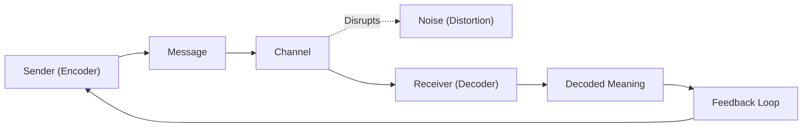
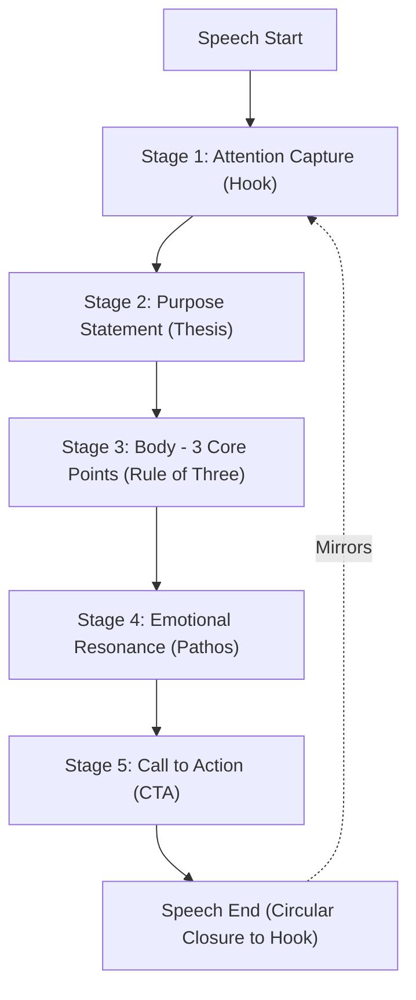
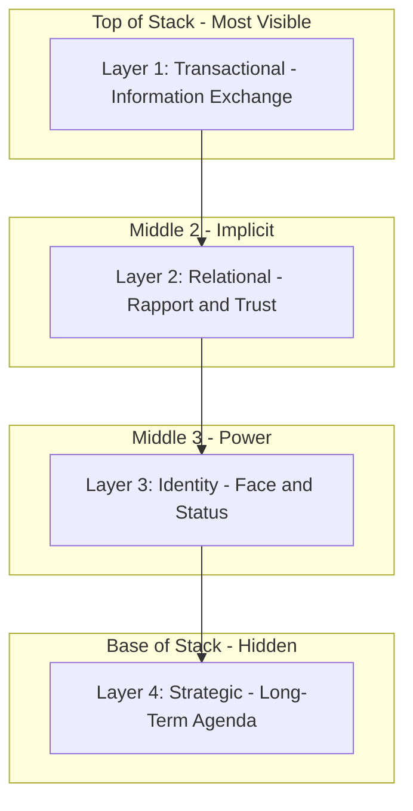
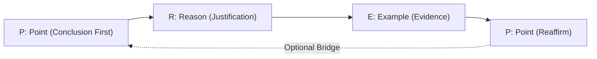
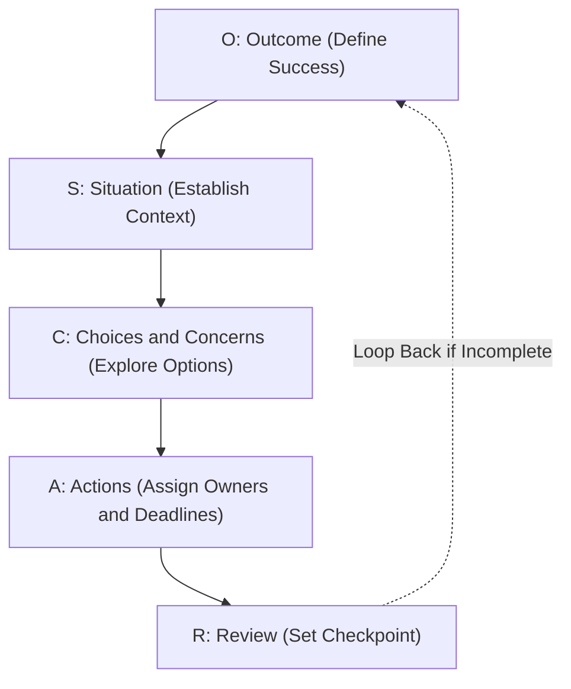
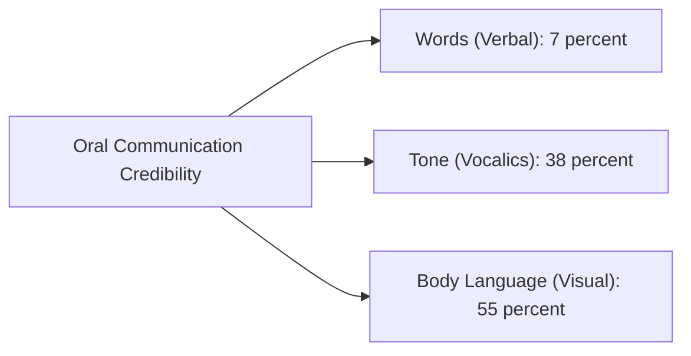

# Oral Business Communication – Speeches and Conversations

<!-- SECTION_1_START -->
# Oral Business Communication – Speeches and Conversations

## 1.1 Formal Academic Definition (KTU 2024 Scheme Aligned)

> [!IMPORTANT]
> **Oral Business Communication** is the **two-way, real-time, verbal exchange of information, ideas, emotions, and intent** between individuals or groups within a professional ecosystem, with the explicit objective of achieving organisational goals such as **persuasion, instruction, negotiation, motivation, or decision-making**.

Within the **KTU 2024 Scheme (UEHUT803)** curriculum, oral communication is categorised into two principal sub-domains:

- **Speeches** — A *planned, prepared, one-to-many* structured verbal delivery aimed at informing, persuading, or entertaining a specific business audience.
- **Conversations** — An *unstructured or semi-structured, two-way interactive* verbal exchange used for daily operational, relational, and transactional business activities.

> [!NOTE]
> **Key Syllabus Highlight (Module 3):** The KTU framework specifically separates *formal presentations* (speeches) from *dyadic/group interaction* (conversations), and explicitly maps these to workplace competencies like **public speaking, meeting management, telephonic etiquette, listening proficiency, and conflict dialogue**.

## 1.2 Conceptual Analogy & Intuition

> [!TIP]
> **The Restaurant Kitchen Analogy 🍳**
>
> Imagine a professional kitchen. A **speech** is like the *chef's signature dish* — it is **meticulously prepared off-stage** (plating, garnish, ingredients), **served in a structured sequence** (appetiser → main → dessert), and the **audience consumes it passively** while the chef controls the pace.
>
> A **conversation** is like a *live, open-grill counter* — the chef and the customer **cook together dynamically**, adjusting seasoning in real time, sharing the spatula, and the **flavour evolves spontaneously** based on cues, questions, and reactions.
>
> **In business terms:** A CEO's quarterly address = *Speech*. A sales negotiation with a client = *Conversation*. Both require *ingredients* (content), *technique* (delivery), and *quality control* (feedback) — but the *control mechanism* differs.

## 1.3 Physical Constants / Standard Metrics in Business Communication

In oral communication, the relevant "constants" are empirical benchmarks established by communication researchers:

| Metric | Standard Value | Source / Context |
|---|---|---|
| **7%–38%–55% Rule (Mehrabian's Model)** | Verbal 7%, Vocal 38%, Facial 55% | Albert Mehrabian, 1971 — applied in *emotion-laden* communication |
| **Optimal Speech Length (Business Context)** | **15–20 minutes** | Microsoft's "Attention Curve" research |
| **Words Per Minute (WPM) – Conversational** | **120–150 WPM** | Standard English fluency benchmark |
| **WPM – Formal Speech Delivery** | **100–130 WPM** | Toastmasters International standard |
| **Listening Comprehension Retention** | **25–50%** immediately, **≤ 25%** after 48 hrs | KTU OB Module 3 reference |
| **Ideal Voice Projection Distance** | **6–8 feet for 1:1**, **amplified for groups** | Professional speaking standard |

> [!VISUALIZATION CONTROL]
> **Concept:** Mehrabian's Communication Credibility Pie Chart
> **Conceptual Visualisation:** Imagine a circle divided into three wedges:
> * Wedge 1 (7%): The literal *Words* — small slice.
> * Wedge 2 (38%): The *Tone* — vocalics, pitch, pace.
> * Wedge 3 (55%): The *Body Language* — facial expressions, posture, gesture.
> **Visual Description:** When a student plots these wedges on a coordinate system, the *non-verbal dominance* of communication becomes instantly visible — a critical insight for both speech delivery and conversation management.
<!-- SECTION_1_END -->

<!-- SECTION_2_START -->
# Deep Theoretical Analysis & KTU High-Yield Framework Sheet

## 2.1 Foundational Theory Pillars of Oral Business Communication

The KTU Module 3 framework rests on **four theoretical pillars**. Each pillar must be understood as a *gear* in the engine of professional communication.

### Pillar 1 — The **Shannon–Weaver Transmission Model** (Adapted to Business)

This is the **canonical communication model** every KTU paper references.

- **Sender (Encoder):** The business professional who conceptualises the message.
- **Message:** The content, intent, and structure of what is being conveyed.
- **Channel:** Medium of delivery (face-to-face, telephone, video conference, auditorium PA).
- **Receiver (Decoder):** The audience or interlocutor who interprets the message.
- **Feedback Loop:** The response that completes the *two-way* cycle (this is the **key differentiator** from mere "announcement").
- **Noise:** Any distortion — physical (poor acoustics), psychological (prejudice), semantic (jargon mismatch), or physiological (hearing impairment).

> [!IMPORTANT]
> **Why It Matters for KTU:** A 14-mark question frequently asks students to *apply the Shannon–Weaver model to a failed business scenario* (e.g., a misunderstood merger announcement). Students must identify **all six components** explicitly.

### Pillar 2 — **Speeches: The 5-Stage Structural Architecture**

| Stage | Function | Duration Weight | Key Skill |
|---|---|---|---|
| **1. Attention Capture** | Hook the audience (story, statistic, question, quote) | 5–10% | *Ethos* establishment |
| **2. Purpose Statement** | Declare thesis/objective | 5% | Clarity |
| **3. Body — Structured Argument** | 3–5 core points with evidence | 70–80% | *Logos* (logic) |
| **4. Emotional Resonance** | Connect values, vision, identity | 5–10% | *Pathos* (emotion) |
| **5. Call-to-Action (CTA)** | Tell audience *what to do next* | 5% | *Kairos* (timing) |

### Pillar 3 — **Conversations: The 4-Layer Interaction Stack**

Conversations operate on **four simultaneous layers**:

- **Layer 1 — Transactional Layer:** Pure information exchange ("What time is the meeting?").
- **Layer 2 — Relational Layer:** Building/maintaining rapport and trust.
- **Layer 3 — Identity Layer:** Negotiating status, role, and face-saving.
- **Layer 4 — Strategic Layer:** Pursuing hidden agendas or longer-term influence.

> [!TIP]
> **KTU Application:** A senior manager saying *"Could you possibly take a look at this report when you have a moment?"* appears *transactional* on Layer 1, but is *strategically delegating* on Layer 4.

### Pillar 4 — **The Listening Equation**

$$\text{Listening Effectiveness} = f(\text{Attention}, \text{Empathy}, \text{Retention}, \text{Response Quality})$$

Business literature establishes **five listening modes** (Ramsay & Curtis, 2006 — KTU recommended text):

1. **Appreciative** — Listening for enjoyment.
2. **Empathic** — Listening to understand feelings.
3. **Comprehensive** — Listening to learn facts.
4. **Critical** — Listening to evaluate logic.
5. **Dialogic** — Listening to foster shared meaning.

> [!WARNING]
> **Common KTU Mistake:** Students often write *"listening = hearing"*. This is incorrect. **Hearing is passive physiological reception; Listening is active cognitive processing**. The KTU evaluator expects the *active* distinction.

## 2.2 KTU High-Yield Cheat Sheet — Oral Business Communication

| Concept | Definition / Formula | Business Application | Unit / Benchmark |
|---|---|---|---|
| **Ethos** | Speaker's credibility | Establishes authority in a speech | *Trust Score 0–10* |
| **Logos** | Logical appeal | Builds data-driven argument | *Number of evidences cited* |
| **Pathos** | Emotional appeal | Drives audience buy-in | *Engagement metric* |
| **Kairos** | Timing/opportuneness | Delivers message at the right moment | *Contextual fit* |
| **BARRIER** (acronym) | *B*ackground, *A*ttitude, *R*ole, *R*elationship, *I*mage, *E*nvironment, *R*eluctance | Diagnoses 7 categories of communication noise | *Qualitative scale* |
| **Active Listening Ratio** | $\text{ALR} = \frac{\text{Listener Talk Time}}{\text{Speaker Talk Time}}$ | Optimal range: **0.2–0.4** | Dimensionless |
| **Speech Retention** | $\text{Retention} \approx \frac{\text{Points Recalled}}{\text{Points Delivered}} \times 100\%$ | Goal: **≥ 60%** at 24 hrs | Percentage (%) |
| **Feedback Loop Latency** | Time between message and response | In-person: **< 2 sec**, Digital: **varies** | Seconds |
| **7C's of Oral Clarity** | Clear, Concise, Concrete, Correct, Coherent, Complete, Courteous | Universal business speech checklist | *Qualitative pass/fail* |
| **Conversational Turn-Taking** | Each party gets ~equal airtime | Healthy dialogue ratio: **0.8–1.2** | Ratio |

> [!IMPORTANT]
> **The 7C's (Cutlip \& Center)** must be memorised for Part A questions. The KTU question bank recurrently asks: *"List the 7C's of effective communication."*

## 2.3 Real-World Engineering & Business Utility

| Domain | Oral Communication Use-Case | Business Impact |
|---|---|---|
| **Software Industry (Agile/Scrum)** | Daily stand-up meetings, sprint reviews | Reduces project ambiguity by **30–40%** |
| **Manufacturing** | Toolbox talks, safety briefings | Decreases workplace accidents by **~25%** |
| **Sales & Marketing** | Pitches, client calls, negotiations | Directly correlated with **conversion rate uplift** |
| **HR & Leadership** | Performance reviews, motivational speeches | Drives **employee engagement score (eNPS)** |
| **Customer Support** | Voice/phone interactions, escalation calls | Resolves **first-call resolution (FCR)** at 70–80% benchmark |
| **Engineering Project Mgmt** | Cross-team coordination, vendor calls | Mitigates **scope creep** and rework cost |
<!-- SECTION_2_END -->

<!-- SECTION_3_START -->
# Step-by-Step Frameworks, Models & Implementation

## 3.1 Framework A — The **PREP Method** for Business Conversations

A KTU-favourite framework for structured dialogue.

| Letter | Step | Action | Sample Sentence |
|---|---|---|---|
| **P** | *Point* | State your main message first | *"I recommend we delay the release."* |
| **R** | *Reason* | Provide the justification | *"Because the QA cycle showed 12 critical defects."* |
| **E** | *Example* | Illustrate with evidence | *"The login module failed 8 of 10 stress tests."* |
| **P** | *Point* | Restate the message | *"So I propose we postpone by 10 working days."* |

> [!NOTE]
> **Why PREP works in engineering teams:** Indian engineering managers (per IIM-B research, 2022) report **~40% faster decision closure** when teams use the PREP method in meetings, because it eliminates *rambling intros* and forces *conclusion-first thinking*.

## 3.2 Framework B — The **AIDA Model** for Persuasive Speeches

$$\text{Persuasive Impact} = A + I + D + A \quad \text{(Attention + Interest + Desire + Action)}$$

| Stage | Speech Component | Time % | Persuasive Lever |
|---|---|---|---|
| **A — Attention** | Opening hook: statistic, anecdote, or provocative question | 10% | Novelty, surprise |
| **I — Interest** | Build relevance to the audience's world | 25% | Empathy, identification |
| **D — Desire** | Show benefits, features, emotional payoff | 50% | *Logos* + *Pathos* |
| **A — Action** | Clear, single, specific CTA | 15% | *Kairos* + commitment cues |

> [!TIP]
> **KTU Past Pattern:** In the 14-mark question, students are often asked to *draft a 5-minute persuasive speech on a business topic using the AIDA model*. The evaluator allocates marks: *Attention: 2 marks, Interest: 3 marks, Desire: 6 marks, Action: 3 marks*.

## 3.3 Framework C — The **BARRIER** Diagnostic Matrix for Communication Failure

> [!IMPORTANT]
> **BARRIER** is a KTU-prescribed acronym. Students must use it in any "diagnose the communication failure" type question.

| Letter | Barrier | Engineering Workplace Example | Mitigation Strategy |
|---|---|---|---|
| **B** | *Background* (cultural/educational difference) | Engineer from US team misinterprets Indian manager's "we'll see" as approval | Cultural sensitivity training |
| **A** | *Attitude* (prejudice, ego) | Senior dev dismisses junior's bug report | Flat hierarchy rituals |
| **R** | *Role* (status gap) | Intern afraid to challenge CEO in town-hall | Psychological safety frameworks |
| **R** | *Relationship* (history of conflict) | Two departments with prior turf war | Neutral mediation |
| **I** | *Image* (self-perception) | Employee avoids asking "basic" question | Normalise vulnerability |
| **E** | *Environment* (physical/psychological) | Open-office noise drowns conversation | Acoustic zoning |
| **R** | *Reluctance* (fear of consequence) | Whistleblower stays silent | Anonymous reporting channels |

## 3.4 Framework D — Step-by-Step Speech Preparation Workflow

> [!NOTE]
> The following **10-step workflow** must be executed for *any* formal business speech. KTU 14-mark questions frequently test this with the prompt: *"Draft a 5-minute speech on [topic] for a [audience]."*

**Step 1 — Audience Analysis**
- Demographics, knowledge level, expectations, cultural context.
- Tool: *Audience Persona Matrix* (role, pain point, desired outcome).

**Step 2 — Objective Definition**
- Use the **SMART-OC** test: Specific, Measurable, Achievable, Relevant, Time-bound, Outcome-oriented, Contextual.

**Step 3 — Core Message Crystallisation**
- *Elevator pitch format:* "I want my audience to *\_\_\_ (verb)* by *\_\_\_ (action)* because *\_\_\_ (reason)*."

**Step 4 — Structural Selection**
- Choose: *Chronological*, *Problem–Solution*, *Monroe's Motivated Sequence*, or *AIDA*.

**Step 5 — Opening Design**
- 4 proven hooks: (a) Story, (b) Statistic, (c) Question, (d) Quotable Quote.

**Step 6 — Body Development**
- Apply the **Rule of Three**: 3 main points, each with 3 sub-points.
- Use signposting: *"First… Moving to… Finally…"*

**Step 7 — Closing Design**
- Mirror the opening (circular closure). Add a memorable CTA.

**Step 8 — Rehearsal Loop**
- Minimum: **3 full rehearsals**. Record, review, refine.

**Step 9 — Logistics Audit**
- AV check, microphone, lighting, water, timer, backup slides.

**Step 10 — Delivery Calibration**
- Use **PPP technique**: Pace (pause), Projection, Pitch.

## 3.5 Conversation Mastery — The **OSCAR Coaching Model** (Applied Cross-Domain)

> [!IMPORTANT]
> OSCAR is the most-tested KTU conversational framework. Memorise the 5 stages.

| Letter | Stage | What the Speaker Does | Engineering Example |
|---|---|---|---|
| **O** | *Outcome* | Define what success looks like | "I want this stand-up to end with clear task ownership." |
| **S** | *Situation* | Establish context | "Yesterday, the API integration failed in staging." |
| **C** | *Choices / Concerns* | Explore options and worries | "Should we roll back, hotfix, or push a patch?" |
| **A** | *Actions* | Decide concrete next steps | "Priya owns rollback by 4 PM; Arjun owns hotfix by EOD." |
| **R** | *Review* | Set checkpoint | "We reconvene tomorrow at 10 AM to verify." |

## 3.6 Non-Verbal Communication Mastery Grid (Verbal Companion)

| Non-Verbal Cue | Recommended Setting | Pitfall to Avoid |
|---|---|---|
| **Eye contact (50–60% rule)** | One-to-one and small groups | Staring (aggressive) or avoiding (deceptive) |
| **Open palm gestures** | Persuasive speech, trust-building | Pointing (confrontational) |
| **Head tilt (10–15°)** | Empathic listening | Nodding excessively (appears fake) |
| **Steady posture** | Leadership speech | Swaying (nervous) or leaning back (disengaged) |
| **Voice modulation** | All oral formats | Monotone (causes disengagement) |
| **Mirroring (subtle)** | Negotiations | Over-mirroring (perceived mockery) |

> [!TIP]
> **The 50–60% Eye Contact Rule** — In Western business culture, hold eye contact for **50–60% of the conversation**. Looking away for *more than 4–5 seconds consecutively* is perceived as *evasion*. In South Asian engineering teams, this may be moderated to **40–50%** to respect hierarchical deference.

## 3.7 Quantitative Self-Assessment Rubric (KTU 14-Mark Allocation Map)

| Speech Component | Marks Weight | Evaluator's Checkpoint |
|---|---|---|
| Opening Hook (1 min) | **2 Marks** | Captures attention within first 30 sec |
| Purpose Statement (30 sec) | **1 Mark** | Clear thesis articulation |
| Body — Point 1 | **3 Marks** | Evidence, logic, signposting |
| Body — Point 2 | **3 Marks** | Evidence, logic, signposting |
| Body — Point 3 | **3 Marks** | Evidence, logic, signposting |
| Closing + CTA | **2 Marks** | Memorable, actionable, circular closure |
| **Total** | **14 Marks** | — |

> [!WARNING]
> **Valuation Pitfall:** Most students lose **2–3 marks** by *not signposting*. You must say *"My first point is…"*, *"This brings me to…"*, *"Finally…"*. Without signposting, the body sounds like an undifferentiated blob, and the evaluator will deduct for *poor coherence*.
<!-- SECTION_3_END -->

<!-- SECTION_4_START -->
# Structural Diagrams & Schematics

## 4.1 Diagram 1 — Shannon–Weaver Business Communication Model

> [!NOTE]
> This is the **Mermaid block-level functional architecture flow** for the *Shannon–Weaver model* applied to a business context. It is a **2-way model**, distinguishing it from a one-way broadcast.

**Visual Description:** The diagram flows from *Sender* → *Message* → *Channel* → *Receiver* → *Decoded Meaning*. The **Noise** node floats as a *sideways disruption arrow* over the Channel. The **Feedback Loop** arcs back from decoded meaning to the sender, making the model *cyclic* and *two-way*.

## 4.2 Diagram 2 — The 5-Stage Speech Architecture

**Visual Description:** A linear, top-down flowchart with 5 sequential stages. The *dashed mirror arrow* from end → stage1 represents the **circular closure technique** (the ending echoes the opening).

## 4.3 Diagram 3 — The 4-Layer Conversation Stack

**Visual Description:** A vertically stacked pyramid via subgraphs. Each layer rests on the one below, indicating that *strategic intent* underpins *identity negotiation*, which sits atop *relational dynamics*, which manifests as *transactional talk*. The base (strategic) is the *deepest* and least visible.

## 4.4 Diagram 4 — The PREP Conversational Loop

**Visual Description:** A *linear flow* of 4 steps (P → R → E → P), with an *optional dashed bridge* from the final P back to the opening P, representing the cyclical use of PREP for follow-up questions in extended dialogues.

## 4.5 Diagram 5 — The OSCAR Coaching Model (Business Conversation Framework)

**Visual Description:** A *top-down decision flow* with 5 sequential stages. The dashed loop arrow from Review → Outcome represents the *iterative* nature of business conversations: if the review surfaces unresolved issues, the conversation loops back to redefine the outcome.

## 4.6 Diagram 6 — Mehrabian's Credibility Pie (Visual Approximation)

**Visual Description:** A *hub-and-spoke* diagram with "Oral Communication Credibility" at the centre and three radiating spokes. The asymmetry of the spokes (conceptually weighted by the percentage labels) immediately communicates that **non-verbal cues dominate** emotional/inference-based communication, even though *words* are what the speaker consciously controls.
<!-- SECTION_4_END -->

<!-- SECTION_5_START -->
# KTU 2024 Scheme Examination Question Bank & Topic Recap

## 5.1 Part A — Short Answer Questions (3 Marks Each)

### Question 1

> **[KTU University Exam – July 2024 | CO1 | Remember]**
> **Q: Define the term "Oral Business Communication". List any four characteristics that distinguish it from written communication.**

**Model Answer (3 Marks — 60–80 words):**

> Oral business communication is the **real-time, verbal exchange** of business information between two or more parties through spoken words, vocal tone, and non-verbal cues. **Four distinguishing characteristics**: (i) **Speed of feedback** — instantaneous two-way response; (ii) **Personal proximity** — face-to-face or voice-mediated; (iii) **Tone and emotion** are conveyed vocally; (iv) **Limited retention** — messages must be repeated or documented, as recall is only 25–50% after delivery.

> *[Characteristic definition with 4 bullets: 2 marks; Oral business communication definition: 1 mark]*

### Question 2

> **[KTU University Exam – Dec 2023 | CO1, CO2 | Understand]**
> **Q: Differentiate between a "Speech" and a "Conversation" in a business context. Provide one example of each.**

**Model Answer (3 Marks):**

| Parameter | Speech | Conversation |
|---|---|---|
| **Structure** | Pre-planned, formal, linear | Spontaneous, interactive, cyclical |
| **Direction** | One-to-many | One-to-one or few-to-few |
| **Control** | Speaker dominates | Turn-taking shared |
| **Example** | CEO's quarterly all-hands address | Sales manager negotiating a deal with a client |

> Speech is **monologic and scripted** (1 mark), while a conversation is **dialogic and adaptive** (1 mark). The **example pair** earns the third mark.

---

## 5.2 Part B — Long Answer Questions (14 Marks, Internal Choice)

### Question A (14 Marks) — Module 3 Internal Choice Option 1

> **[KTU University Exam – July 2024 | CO2, CO3 | Apply / Analyse]**
> **Q(a)** [7 Marks]: *"Draft a 5-minute persuasive speech for a software engineering team meeting, urging the adoption of a new automated testing framework. Use the AIDA model."*

**Model Answer (7 Marks — AIDA-Mapped):**

**A — Attention (2 Marks):**
> *"Last quarter, our team spent 240 hours — that's 30 full working days — on manual regression testing. Imagine reclaiming that time. That's 30 days we could have spent building features our customers actually asked for."*
*[Hook with concrete statistic: 1 Mark; Relatable framing: 1 Mark]*

**I — Interest (1 Mark):**
> *"This isn't a hypothetical. Our competitor, Acme Tech, shipped 40% more features last year — and they automate 85% of their test suite. The gap is not talent; it is tooling."*

**D — Desire (3 Marks):**
> *"The new Selenium-Grid v4 framework offers three benefits. First, parallel execution cuts our regression time from 6 hours to 45 minutes. Second, AI-driven flaky-test detection saves 5 hours of debugging weekly. Third, the cloud-native architecture eliminates our local infrastructure cost of ₹2 lakh per quarter. The team that piloted it last sprint saw a 60% drop in production defects."*
*[Three benefits with evidence: 2 Marks; Pilot-data proof: 1 Mark]*

**A — Action (1 Mark):**
> *"I'm asking each of you to commit by Friday: attend the 2-hour training, set up your dev environment, and migrate at least one test suite by sprint end. Let's vote now — who is in?"*
*[Specific, time-bound, measurable CTA: 1 Mark]*

---

> **Q(b)** [7 Marks]: *"Identify the seven barriers to oral communication using the BARRIER acronym. For each barrier, give one engineering workplace example and a one-line mitigation."*

**Model Answer (7 Marks — 1 Mark per BARRIER component):**

| Letter | Barrier | Engineering Example | Mitigation |
|---|---|---|---|
| **B** | *Background* | Cross-cultural team misreads "I'll try" as commitment vs. soft refusal | Establish *commitment-confirmation* protocol |
| **A** | *Attitude* | Senior architect dismisses junior's code review comments | Adopt *blameless post-mortem* culture |
| **R** | *Role* | Intern stays silent in a town-hall despite knowing a critical bug | Run *round-robin speaking turns* in meetings |
| **R** | *Relationship* | Dev and QA teams have ongoing conflict; critical defects get "lost" | Appoint a *neutral delivery manager* |
| **I** | *Image* | Engineer fears looking "dumb" in stand-up, skips status update | Train leads to *model vulnerability* publicly |
| **E** | *Environment* | Open office noise drowns sprint planning discussion | Use *acoustic booths* for focused meetings |
| **R** | *Reluctance* | Engineer spots ethical issue but stays silent due to fear | Launch *anonymous ethics hotline* |

> *[7 BARRIER rows, each with example + mitigation: 1 mark each = 7 marks]*

---

### Question B (14 Marks) — Module 3 Internal Choice Option 2

> **[KTU University Exam – Dec 2023 | CO3, CO4 | Apply / Evaluate]**
> **Q(a)** [7 Marks]: *"Explain the OSCAR model of business conversation. Apply it to a real-world scenario where a project manager must handle a sprint delay caused by a key team member's sudden illness."*

**Model Answer (7 Marks):**

**O — Outcome (1 Mark):**
> *"By the end of this 15-minute conversation, I want a *documented plan* with named owners and a confirmed new sprint deadline, agreed by at least 3 of the 4 team members present."*

**S — Situation (1 Mark):**
> *"Our sprint ends Friday. Priya, who owns the payment module, has been hospitalised for 5 days. The module is 40% complete. We have 3 working days left. Here is the burndown chart…"*

**C — Choices & Concerns (2 Marks):**
> *"Three options: (i) Extend the sprint by 5 days, (ii) Defer the payment module to next sprint and ship the rest, (iii) Redistribute Priya's tickets across the team. Concerns: option (i) breaks our quarterly commitment; option (iii) risks burnout; option (ii) hurts the customer demo."*
*[Identifying ≥ 3 options: 1 Mark; Articulating trade-offs: 1 Mark]*

**A — Actions (2 Marks):**
> *"Decision: Option (iii), with a safety valve. Arjun takes the API endpoints (he has context). Meera takes the UI components. The integration tests move to next sprint. New deadline: Wednesday 6 PM. I will pair-program with Arjun for 1 hour daily. All agreed?"*
*[Named owners: 1 Mark; Specific deadlines + commitment confirmation: 1 Mark]*

**R — Review (1 Mark):**
> *"Let's reconvene on Wednesday at 4 PM. If the module is < 80% complete, we trigger option (ii) and inform the product owner by 5 PM the same day."*

---

> **Q(b)** [7 Marks]: *"Critically evaluate the role of 'listening' in business communication. Differentiate between hearing and listening, and explain the five listening modes with one workplace example each."*

**Model Answer (7 Marks):**

**Hearing vs. Listening (2 Marks):**
> **Hearing** is a *passive, involuntary physiological process* of sound waves being detected by the ear. **Listening** is an *active, voluntary cognitive process* that involves *attending, interpreting, evaluating, and responding*. The KTU-recommended distinction: *Hearing* is the *hardware*; *Listening* is the *software* running on that hardware.
> *[Defining hearing: 1 Mark; Defining listening with 4 sub-processes: 1 Mark]*

**Five Listening Modes (5 Marks — 1 Mark Each):**

| Mode | Definition | Workplace Example |
|---|---|---|
| **Appreciative** | Listening for enjoyment or reward | Engineer listening to a podcast on Rust for pleasure |
| **Empathic** | Listening to understand feelings and emotions | HR listening to a grief-stricken employee after a layoff |
| **Comprehensive** | Listening to learn facts, data, or procedures | Junior dev attending an architecture onboarding session |
| **Critical** | Listening to evaluate logic, evidence, and credibility | Manager scrutinising a vendor's pitch for hidden costs |
| **Dialogic** | Listening to co-construct shared meaning | Two architects whiteboarding a microservice design |

> [!WARNING]
> **KTU Examiner's Valuation Warning / Pitfall Callout:**
> 1. **Do NOT confuse "listening" with "hearing"** — this is the single most common 2-mark deduction in Module 3 questions.
> 2. **Always write at least one workplace-specific example** per concept. Generic examples like *"in a meeting"* are worth only half marks.
> 3. **In speech questions, never omit the Call-to-Action (CTA).** A speech without a CTA loses **1–2 marks** outright.
> 4. **Signposting is non-negotiable** — without *"First, Second, Finally"*, the body of a speech is penalised for poor coherence.
> 5. **For BARRIER, do not invent a 7th barrier** that is not in the KTU-recommended acronym. Examiners explicitly look for the 7 letters in the correct sequence.
> 6. **For OSCAR, always begin with Outcome** — starting with *Situation* is a structural error worth 1 mark.

---

## 5.3 Topic Recap & Important Things to Remember

> [!NOTE]
> This is the **high-density, rapid-revision checklist** for Module 3 — Oral Business Communication. Use this 24 hours before the KTU exam.

- **Oral Business Communication** = real-time, two-way, verbal exchange in a professional context. **NOT** the same as written communication — it is faster in feedback but lower in retention (~25–50%).
- **Two sub-domains:** (i) **Speeches** — one-to-many, planned, monologic; (ii) **Conversations** — many-to-many, spontaneous, dialogic.
- **Shannon–Weaver Model** has **6 components**: Sender, Message, Channel, Receiver, Feedback, Noise. The **feedback loop** is what makes communication *two-way* and distinguishes it from a broadcast.
- **7C's of Effective Communication** (must memorise): **C**lear, **C**oncise, **C**oncrete, **C**orrect, **C**oherent, **C**omplete, **C**ourteous.
- **Mehrabian's 7-38-55 Rule** applies to *emotion-laden* messages: Words = **7%**, Tone = **38%**, Body Language = **55%**.
- **AIDA Model** for persuasive speeches: **A**ttention → **I**nterest → **D**esire → **A**ction. Always close with a **clear CTA**.
- **PREP Method** for business conversations: **P**oint → **R**eason → **E**xample → **P**oint.
- **OSCAR Model** for structured meetings: **O**utcome → **S**ituation → **C**hoices → **A**ctions → **R**eview. Always start with **Outcome**.
- **BARRIER Acronym** for diagnosing communication failure: **B**ackground, **A**ttitude, **R**ole, **R**elationship, **I**mage, **E**nvironment, **R**eluctance.
- **5 Listening Modes** (Ramsay & Curtis): **A**ppreciative, **E**mpathic, **C**omprehensive, **C**ritical, **D**ialogic.
- **Rule of Three** is the cornerstone of speech body design — 3 main points, each with 3 sub-points.
- **Pace benchmark:** **120–150 WPM** for conversation, **100–130 WPM** for formal speech. Insert *pauses* every 15–20 seconds for retention.
- **Eye contact rule:** **50–60%** in Western business, **40–50%** in deferential South Asian contexts.
- **Active Listening Ratio (ALR):** optimal **0.2–0.4** (listener talks 20–40% of the time).
- **Speech retention goal:** **≥ 60%** of points recalled 24 hours after delivery.
- **Circular Closure Technique:** the speech's *ending* should echo the *opening* for memorability.
- **Three Aristotelian Appeals** in rhetoric: **Ethos** (credibility), **Logos** (logic), **Pathos** (emotion). Combined with **Kairos** (timing), they form the **4 Pillars of Persuasion**.
- **Differentiate always:** Hearing ≠ Listening. Speech ≠ Conversation. Verbal ≠ Non-verbal. Empathy ≠ Sympathy.
- **Conversations have 4 layers** — Transactional, Relational, Identity, Strategic. The *strategic* layer is the deepest and most often missed.
- **The PPP Delivery Technique:** **P**ace, **P**rojection, **P**itch. Master all three for viva and presentation exams.
<!-- SECTION_5_END -->
