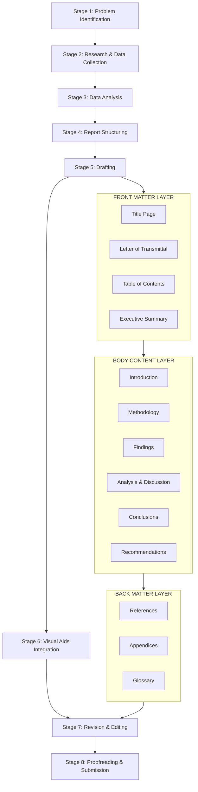
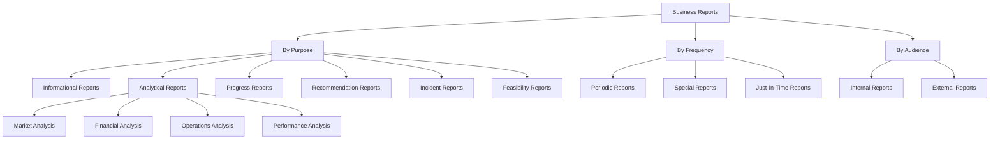
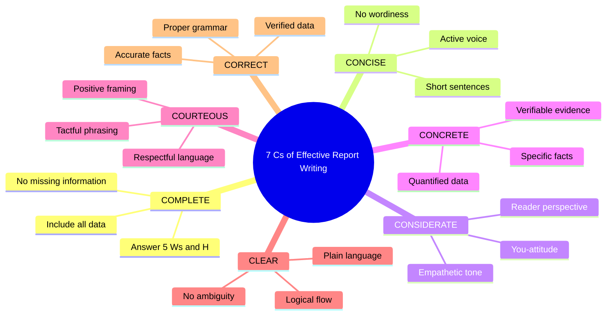
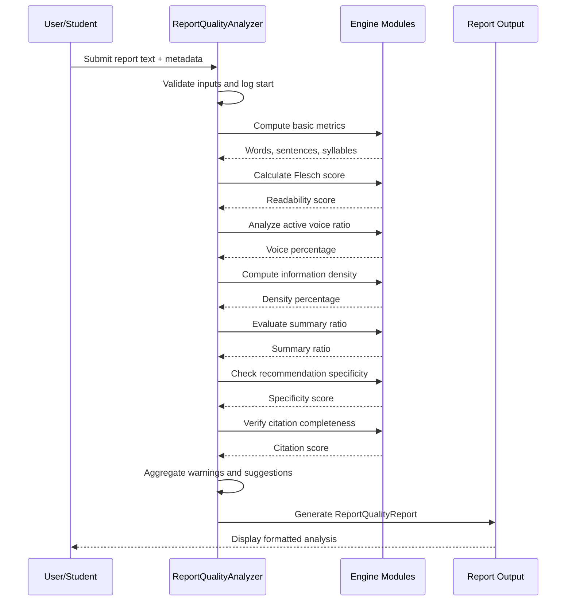
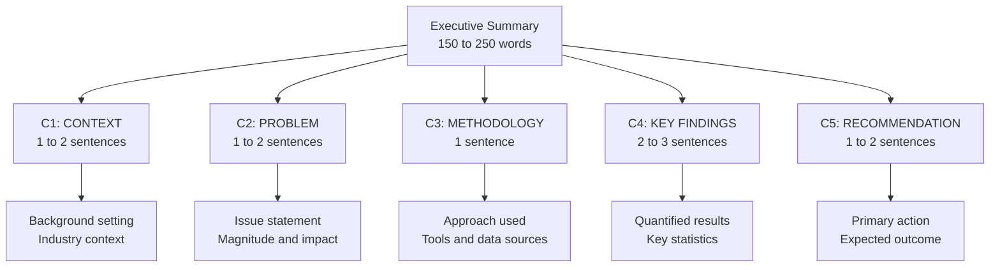
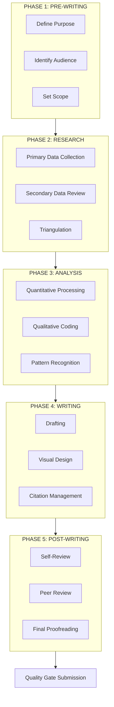

# Technical and Analytical Report Writing

<!-- SECTION_1_START -->
# Technical and Analytical Report Writing

## 1.1 Formal Academic Definition (KTU 2024 Syllabus Terminology)

> [!NOTE]
> **Technical Report:** A structured, formal document that presents factual, objective, and verifiable information about a technical process, investigation, or project, written for a defined audience to inform, recommend, or document action.

> [!IMPORTANT]
> **Analytical Report:** A specialized category of report that not only presents data but also interprets, evaluates, and recommends action based on critical analysis of evidence, trends, and cause-effect relationships.

In the **KTU 2024 Scheme (UEHUT803)**, Module 3 emphasizes that effective business communication pivots on the ability to transform raw data into structured, decision-ready documents. A **Technical Report** focuses on the *how* and *what* of a process (procedural clarity), while an **Analytical Report** focuses on the *why* and *so what* (interpretive depth).

**Key Distinguishing Attributes:**
- **Objectivity:** Evidence-driven, free from personal bias.
- **Structure:** Follows a conventional, predictable layout (IMRaD or KTU-recommended format).
- **Audience-Centric:** Tailored to the decision-making needs of the reader.
- **Precision:** Uses quantified language, factual statements, and **standard business metrics** (e.g., ROI, CAGR, NPV, variance percentages).

---

## 1.2 Conceptual Analogy & Intuition

Imagine you are a **civil engineer inspecting a bridge**.

- A **Technical Report** is like a **photograph** of the bridge: it documents dimensions, materials used, load capacity, and physical condition. It answers: *"What is the bridge made of? How was it built?"*
- An **Analytical Report** is like a **structural engineer's diagnosis**: it interprets the data from the photograph, compares it to safety standards, identifies stress points, and recommends whether to repair or replace. It answers: *"Why is this bridge weakening? What should we do next?"*

> [!TIP]
> **Mnemonic for Students:** *Technical = Telescope* (looks closely at facts). *Analytical = Microscope* (looks deeply into meaning).

---

## 1.3 Standard Business & Communication Metrics

> [!IMPORTANT]
> **Key Communication Metrics Used in Reports:**
> - **Flesch-Kincaid Readability Score:** Measures textual complexity. Target: **60–70** for executive business reports.
> - **7 C's of Communication:** Completeness, Conciseness, Consideration, Concreteness, Courtesy, Clearness, Correctness.
> - **Pareto Principle (80/20 Rule):** 80% of report value comes from 20% of the findings (typically the Conclusion & Recommendations).

---

## 1.4 Visualization Framework

> [!VISUALIZATION CONTROL]
> **Concept:** Report Type Differentiation Matrix
> **GeoGebra / Desmos Input Equations:**
> * `x = Objectivity` (X-axis: 0 to 10)
> * `y = Interpretive Depth` (Y-axis: 0 to 10)
> * Point A `(9, 2)` = Technical Report
> * Point B `(7, 9)` = Analytical Report
> **Visual Description:** A Cartesian plane where the X-axis represents factual objectivity and the Y-axis represents interpretive depth. Technical reports cluster near the X-axis (high objectivity, low interpretation), while analytical reports sit in the upper-right quadrant (balanced objectivity with deep analysis).

---

## 1.5 Syllabus Highlight Callout

> [!IMPORTANT]
> **KTU 2024 Module 3 Focus Areas:**
> 1. Distinguish between informational, analytical, and recommendation reports.
> 2. Apply the standard report structure (Front Matter, Body, Back Matter).
> 3. Demonstrate the use of headings, subheadings, lists, and visual aids.
> 4. Write concise executive summaries and data-driven recommendations.

<!-- SECTION_1_END -->

<!-- SECTION_2_START -->
# Deep Theoretical Analysis & KTU High-Yield Formula Sheet

## 2.1 Taxonomy of Business Reports

Business reports are classified along three primary dimensions: **Purpose**, **Frequency**, and **Audience**.

### 2.1.1 Classification by Purpose

| Report Type | Primary Objective | Core Question Answered | Example |
|---|---|---|---|
| **Informational Report** | Present facts without interpretation | *What happened?* | Monthly sales summary |
| **Analytical Report** | Analyze data and provide recommendations | *Why did it happen? What next?* | Market feasibility study |
| **Progress Report** | Track milestones and deliverables | *Where are we now?* | Project status update |
| **Recommendation Report** | Propose a specific course of action | *Which option should we choose?* | Vendor selection report |
| **Incident Report** | Document an unexpected event | *What went wrong and why?* | Workplace accident report |
| **Feasibility Report** | Evaluate viability of a proposal | *Can this be done? Should we?* | New product launch study |
| **Compliance Report** | Demonstrate regulatory adherence | *Are we meeting the standard?* | Environmental audit report |

### 2.1.2 Classification by Frequency

- **Periodic Reports:** Generated at fixed intervals (daily, weekly, monthly, quarterly, annually). Example: *Annual Report*.
- **Special Reports:** Prepared on-demand for unique situations. Example: *Crisis investigation report*.
- **Progress Reports:** Submitted at project milestones.
- **Just-in-Time Reports:** Triggered by specific business events.

### 2.1.3 Classification by Audience

- **Internal Reports:** Directed to organizational stakeholders (management, teams, board).
- **External Reports:** Directed to external parties (regulators, investors, clients, public).

---

## 2.2 The Standard Report Architecture (IMRaD Extended)

> [!NOTE]
> **IMRaD** stands for **Introduction, Methods, Results, and Discussion** — a scientific report framework adapted for business contexts by KTU to include executive and recommendation layers.

### 2.2.1 Front Matter (Pre-body Elements)

| Section | Purpose | KTU Mark Weightage |
|---|---|---|
| **Title Page** | Identifies report, author, date, organization | 1 Mark |
| **Letter of Transmittal** | Formal cover letter submitting the report | 2 Marks |
| **Table of Contents** | Lists headings and page numbers | 1 Mark |
| **List of Figures/Tables** | Index of visual aids | 0.5 Mark |
| **Abstract / Executive Summary** | 150–250 word condensed overview | 3 Marks |

### 2.2.2 Body (Core Content)

| Section | Content Focus | Analytical Depth |
|---|---|---|
| **Introduction** | Problem statement, scope, objectives, limitations | Context setting |
| **Background** | Historical context, theoretical framework | Foundation |
| **Methodology** | Data collection methods, tools, sampling | Procedural |
| **Findings / Results** | Data presentation (tables, charts, graphs) | Empirical |
| **Analysis / Discussion** | Interpretation, cause-effect, comparison | Critical |
| **Conclusions** | Synthesis of key insights | Summative |
| **Recommendations** | Actionable, prioritized suggestions | Directive |

### 2.2.3 Back Matter (Appendices)

| Section | Purpose |
|---|---|
| **References / Bibliography** | APA, MLA, or Chicago citation style |
| **Appendices** | Raw data, questionnaires, technical specs |
| **Glossary** | Definition of specialized terms |
| **Index** | Alphabetical topic reference |

---

## 2.3 The 7 C's of Effective Report Writing

> [!IMPORTANT]
> **The 7 C's Framework (KTU High-Yield):**
> 1. **Completeness:** All necessary information is included. Answer the *5 W's + H* (Who, What, When, Where, Why, How).
> 2. **Conciseness:** Eliminate wordiness. Use short sentences and active voice.
> 3. **Consideration:** Adopt the *you-attitude*; address the reader's perspective.
> 4. **Concreteness:** Use specific facts, figures, and verifiable data.
> 5. **Courtesy:** Respectful, positive, and tactful tone.
> 6. **Clearness:** Plain language, logical flow, no ambiguity.
> 7. **Correctness:** Accurate facts, proper grammar, verified data.

---

## 2.4 KTU Formula Sheet: Report Writing Metrics

> [!NOTE]
> Reports are often evaluated against quantifiable communication metrics. The following table summarizes the standard formulas used in business communication assessment.

| Metric | Formula / Rule | Standard Value | Application Context |
|---|---|---|---|
| **Readability (Flesch)** | $206.835 - 1.015 \cdot \frac{\text{words}}{\text{sentences}} - 84.6 \cdot \frac{\text{syllables}}{\text{words}}$ | 60 to 70 | Executive reports |
| **Active Voice Ratio** | $\frac{\text{Active sentences}}{\text{Total sentences}} \times 100$ | $\geq 80\%$ | Persuasive reports |
| **Information Density** | $\frac{\text{Key data points}}{\text{Total words}} \times 100$ | 15% to 25% | Analytical reports |
| **Executive Summary Ratio** | $\frac{\text{Summary words}}{\text{Total words}} \times 100$ | 5% to 10% | All formal reports |
| **Recommendation Specificity** | $\frac{\text{Actionable items}}{\text{Total recommendations}} \times 100$ | 100% | Recommendation reports |
| **Pareto Coverage** | $\frac{\text{Top findings discussed}}{\text{Total findings}} \times 100$ | 80% / 20% rule | Executive summaries |
| **Citation Completeness** | $\frac{\text{Cited sources}}{\text{Total sources used}} \times 100$ | 100% | Academic / research reports |

---

## 2.5 Logical Flow: The Analytical Reasoning Chain

The KTU 2024 syllabus expects students to demonstrate a structured analytical flow in report writing. The chain proceeds as follows:

1. **Observation:** Raw data is collected (e.g., "Sales dropped 15% in Q3").
2. **Description:** Data is organized and presented (e.g., "Q3 sales: ₹45L vs. Q2: ₹53L").
3. **Comparison:** Benchmarking against standards or prior periods.
4. **Causal Analysis:** Root cause identification (e.g., "Supply chain disruption + 3 new competitors").
5. **Inference:** Drawing conclusions from evidence.
6. **Recommendation:** Proposing solutions with rationale.
7. **Implementation Plan:** Timeline, resources, and accountability.

---

## 2.6 Real-World Utility in Engineering & Computer Science

- **Software Engineering:** Technical feasibility reports, sprint retrospectives, post-mortem incident reports.
- **Civil Engineering:** Structural inspection reports, environmental impact assessments.
- **Data Science:** Analytical reports on model performance, A/B testing outcomes.
- **Management Consulting:** Market entry analysis, operational efficiency reports.
- **Quality Assurance:** Compliance reports (ISO 9001, Six Sigma audits).
- **Project Management:** Earned Value Analysis (EVA) reports, status updates to stakeholders.

<!-- SECTION_2_END -->

<!-- SECTION_3_START -->
# Step-by-Step Derivations & Implementation

## 3.1 The Report Writing Process: Exhaustive 8-Stage Workflow

> [!IMPORTANT]
> **KTU Mandate:** Students must demonstrate mastery of the end-to-end report writing process, from problem identification to final proofreading. Each stage below is exhaustive with sub-steps and decision points.

### Stage 1: Problem Identification & Scope Definition

**Objective:** Clearly articulate the report's purpose, audience, and boundaries.

**Step 1.1:** Conduct a **purpose analysis** using the *5 W's + H* framework.

$$
\text{Purpose} = f(\text{Who}, \text{What}, \text{When}, \text{Where}, \text{Why}, \text{How})
$$

**Step 1.2:** Define the **scope statement** with explicit inclusions and exclusions.

**Step 1.3:** Identify **primary and secondary audiences** and their information needs.

**Step 1.4:** Establish **deliverables**, format requirements, and deadlines.

**Step 1.5:** Draft a **working title** (refined in later stages).

**Example Scope Statement:**
> *"This report analyzes the decline in customer retention at TechNova Solutions Pvt. Ltd. during Q1–Q3 2024 (Jan–Sept), limited to B2C customers in South India, with the objective of recommending a retention strategy by December 15, 2024."*

---

### Stage 2: Research & Data Collection

**Step 2.1:** Select data sources:
- **Primary sources:** Surveys, interviews, focus groups, observations.
- **Secondary sources:** Published reports, industry databases, academic journals, government publications.

**Step 2.2:** Choose data collection instruments:

| Method | Strength | Weakness | Best For |
|---|---|---|---|
| Surveys | Large sample, quantifiable | Low response rate | Customer satisfaction |
| Interviews | Rich, qualitative depth | Time-intensive | Managerial insights |
| Case Studies | Holistic, contextual | Not generalizable | Strategic analysis |
| Experiments | Causal inference | Costly, controlled | Product testing |

**Step 2.3:** Ensure **data validity and reliability** through triangulation.

**Step 2.4:** Document all sources in a **research log** for later citation.

---

### Stage 3: Data Analysis & Interpretation

**Step 3.1:** Apply appropriate analytical techniques.

For **quantitative data:**
- Descriptive statistics: Mean, median, mode, standard deviation.
- Inferential statistics: t-tests, regression, correlation.
- Trend analysis: Time-series, moving averages.

For **qualitative data:**
- Thematic analysis, content analysis, discourse analysis.

**Step 3.2:** Identify **patterns, trends, anomalies, and correlations**.

**Step 3.3:** Cross-validate findings against the **original research questions**.

---

### Stage 4: Report Structuring & Outlining

**Step 4.1:** Create a **detailed outline** using the IMRaD extended structure.

**Step 4.2:** Apply the **pyramid principle** (Barbara Minto):
- Start with the governing thought (answer first).
- Group supporting ideas in MECE buckets (Mutually Exclusive, Collectively Exhaustive).
- Order ideas logically (inductive or deductive).

**Step 4.3:** Assign word count budgets to each section:

| Section | Suggested % of Total Length |
|---|---|
| Executive Summary | 5% to 10% |
| Introduction | 10% |
| Background | 10% |
| Methodology | 10% to 15% |
| Findings | 25% to 30% |
| Analysis & Discussion | 15% to 20% |
| Conclusions | 5% |
| Recommendations | 10% |

---

### Stage 5: Drafting the First Version

**Step 5.1:** Write the **Executive Summary last** (despite appearing first).

**Step 5.2:** Use **headings and subheadings** following parallel grammatical structure (e.g., all noun phrases or all question phrases).

**Step 5.3:** Apply **active voice** for clarity and directness.

**Step 5.4:** Integrate **visual aids** (tables, charts, diagrams) with proper captions and references.

**Step 5.5:** Use **consistent citation style** throughout.

---

### Stage 6: Visual Data Representation

> [!NOTE]
> **The KTU Visualization Selection Matrix:**

| Data Type | Recommended Visual | Rationale |
|---|---|---|
| Comparison across categories | Bar chart | Easy category comparison |
| Trend over time | Line chart | Shows direction and rate |
| Part-to-whole | Pie chart (max 5 slices) | Shows proportions |
| Distribution | Histogram | Shows frequency |
| Relationship between two variables | Scatter plot | Shows correlation |
| Geographic data | Choropleth map | Shows spatial patterns |
| Process flow | Flowchart | Shows sequence |
| Hierarchy | Organizational chart | Shows structure |

**Design Principles:**
- Title every visual clearly.
- Label axes with units.
- Use legends for multiple series.
- Maintain color consistency.
- Avoid 3D effects that distort perception.

---

### Stage 7: Revision & Editing

**Step 7.1:** Content review — verify accuracy, completeness, logical flow.

**Step 7.2:** Structural review — ensure sections connect coherently.

**Step 7.3:** Style review — apply the 7 C's framework.

**Step 7.4:** Mechanical review — grammar, spelling, punctuation, formatting.

**Step 7.5:** Readability assessment using the Flesch-Kincaid formula.

---

### Stage 8: Proofreading & Final Submission

**Step 8.1:** Print and proofread on paper (catches errors screens miss).

**Step 8.2:** Use spell-check tools but do not rely solely on them.

**Step 8.3:** Verify all citations and references.

**Step 8.4:** Check page numbering, header/footer consistency.

**Step 8.5:** Format per KTU submission guidelines (font: Times New Roman 12pt, 1.5 line spacing, justified alignment).

---

## 3.2 Code Implementation: Automated Readability & Quality Analyzer

> [!TIP]
> The following Python script implements a comprehensive report quality analyzer that students can use to self-evaluate their drafts before submission. It applies multiple KTU formula sheet metrics to a sample report text.

```python
import re
import math
from typing import Dict, List, Tuple
from dataclasses import dataclass, field
from collections import Counter


@dataclass
class ReportQualityReport:
    title: str
    word_count: int
    sentence_count: int
    syllable_count: int
    flesch_score: float
    active_voice_ratio: float
    information_density: float
    executive_summary_ratio: float
    recommendation_specificity: float
    citation_completeness: float
    readability_grade: str
    quality_warnings: List[str] = field(default_factory=list)
    improvement_suggestions: List[str] = field(default_factory=list)


class ReportQualityAnalyzer:
    """
    KTU-aligned analyzer for Technical and Analytical Report Writing.
    Evaluates readability, structure, style, and citation quality.
    """

    PASSIVE_INDICATORS = ["was", "were", "is", "are", "been", "being", "be"]
    ACTION_VERBS = [
        "analyze", "recommend", "propose", "implement", "evaluate",
        "increase", "decrease", "develop", "achieve", "deliver",
        "reduce", "enhance", "establish", "execute", "measure"
    ]
    VAGUE_WORDS = ["thing", "stuff", "very", "really", "many", "some", "few"]
    SECTION_HEADERS = [
        "executive summary", "introduction", "methodology", "findings",
        "results", "analysis", "discussion", "conclusion", "recommendation",
        "references", "appendix"
    ]

    def __init__(self, report_text: str, executive_summary: str = "",
                 recommendations: List[str] = None, cited_sources: int = 0,
                 total_sources: int = 0, data_points: int = 0):
        if not report_text or not report_text.strip():
            raise ValueError("Report text cannot be empty.")
        if cited_sources < 0 or total_sources < 0:
            raise ValueError("Source counts cannot be negative.")
        if cited_sources > total_sources > 0:
            raise ValueError("Cited sources cannot exceed total sources.")

        self.report_text = report_text
        self.executive_summary = executive_summary
        self.recommendations = recommendations or []
        self.cited_sources = cited_sources
        self.total_sources = total_sources
        self.data_points = data_points
        self.logger_messages: List[str] = []

    def _log(self, message: str) -> None:
        self.logger_messages.append(message)

    def _count_syllables(self, word: str) -> int:
        word = word.lower().strip(".,!?;:")
        if len(word) <= 3:
            return 1
        word = re.sub(r"(?:[^laeiouy]es|ed|[^laeiouy]e)$", "", word)
        word = re.sub(r"^y", "", word)
        syllables = len(re.findall(r"[aeiouy]+", word))
        return max(1, syllables)

    def _split_sentences(self, text: str) -> List[str]:
        sentences = re.split(r"[.!?]+", text)
        return [s.strip() for s in sentences if s.strip()]

    def _count_words(self, text: str) -> List[str]:
        return re.findall(r"\b[a-zA-Z]+\b", text)

    def compute_basic_metrics(self) -> Tuple[int, int, int]:
        words = self._count_words(self.report_text)
        sentences = self._split_sentences(self.report_text)
        syllables = sum(self._count_syllables(w) for w in words)
        self._log(f"Computed basic metrics: {len(words)} words, "
                  f"{len(sentences)} sentences, {syllables} syllables.")
        return len(words), len(sentences), syllables

    def compute_flesch_readability(self, words: int, sentences: int,
                                   syllables: int) -> float:
        if sentences == 0 or words == 0:
            self._log("WARNING: Zero sentences or words detected.")
            return 0.0
        score = 206.835 - 1.015 * (words / sentences) - 84.6 * (syllables / words)
        self._log(f"Flesch Readability Score: {score:.2f}")
        return round(score, 2)

    def compute_active_voice_ratio(self) -> float:
        sentences = self._split_sentences(self.report_text)
        if not sentences:
            return 0.0
        passive_count = 0
        for sentence in sentences:
            words = sentence.lower().split()
            for i, word in enumerate(words[:-1]):
                if word in self.PASSIVE_INDICATORS and words[i + 1] not in [
                    "not", "to", "a", "the", "an"
                ]:
                    passive_count += 1
                    break
        active_ratio = (1 - (passive_count / len(sentences))) * 100
        self._log(f"Active Voice Ratio: {active_ratio:.2f}%")
        return round(active_ratio, 2)

    def compute_information_density(self, word_count: int) -> float:
        if word_count == 0:
            return 0.0
        numbers = len(re.findall(r"\b\d+(?:\.\d+)?%?\b", self.report_text))
        density = (numbers / word_count) * 100
        self._log(f"Information Density: {density:.2f}% (numerical tokens)")
        return round(density, 2)

    def compute_executive_summary_ratio(self, total_words: int) -> float:
        if total_words == 0 or not self.executive_summary:
            return 0.0
        summary_words = len(self._count_words(self.executive_summary))
        ratio = (summary_words / total_words) * 100
        self._log(f"Executive Summary Ratio: {ratio:.2f}%")
        return round(ratio, 2)

    def compute_recommendation_specificity(self) -> float:
        if not self.recommendations:
            self._log("WARNING: No recommendations provided.")
            return 0.0
        actionable = sum(
            1 for rec in self.recommendations
            if any(verb in rec.lower() for verb in self.ACTION_VERBS)
        )
        specificity = (actionable / len(self.recommendations)) * 100
        self._log(f"Recommendation Specificity: {specificity:.2f}%")
        return round(specificity, 2)

    def compute_citation_completeness(self) -> float:
        if self.total_sources == 0:
            self._log("WARNING: No sources declared.")
            return 0.0
        completeness = (self.cited_sources / self.total_sources) * 100
        self._log(f"Citation Completeness: {completeness:.2f}%")
        return round(completeness, 2)

    def classify_readability(self, flesch_score: float) -> str:
        if flesch_score >= 90:
            return "Very Easy (5th grade)"
        elif flesch_score >= 80:
            return "Easy (6th grade)"
        elif flesch_score >= 70:
            return "Fairly Easy (7th grade)"
        elif flesch_score >= 60:
            return "Standard (8th-9th grade) - IDEAL for business reports"
        elif flesch_score >= 50:
            return "Fairly Difficult (10th-12th grade)"
        elif flesch_score >= 30:
            return "Difficult (College level)"
        else:
            return "Very Difficult (Graduate level)"

    def check_vague_language(self) -> int:
        words = [w.lower() for w in self._count_words(self.report_text)]
        vague_count = sum(1 for w in words if w in self.VAGUE_WORDS)
        self._log(f"Vague word count: {vague_count}")
        return vague_count

    def generate_suggestions(self, warnings: List[str]) -> List[str]:
        suggestions = []
        if "Flesch" in str(warnings) and any(
            "difficult" in w.lower() for w in warnings
        ):
            suggestions.append("Shorten sentences to under 20 words each.")
        if any("active voice" in w.lower() for w in warnings):
            suggestions.append("Convert passive constructions to active voice.")
        if any("vague" in w.lower() for w in warnings):
            suggestions.append("Replace vague words with precise quantitative terms.")
        if not suggestions:
            suggestions.append("Report meets all KTU quality benchmarks.")
        return suggestions

    def analyze(self) -> ReportQualityReport:
        self._log("=" * 60)
        self._log("INITIATING KTU REPORT QUALITY ANALYSIS")
        self._log("=" * 60)

        words, sentences, syllables = self.compute_basic_metrics()
        flesch = self.compute_flesch_readability(words, sentences, syllables)
        active_ratio = self.compute_active_voice_ratio()
        info_density = self.compute_information_density(words)
        summary_ratio = self.compute_executive_summary_ratio(words)
        rec_specificity = self.compute_recommendation_specificity()
        citation_complete = self.compute_citation_completeness()
        grade = self.classify_readability(flesch)
        vague_count = self.check_vague_language()

        warnings: List[str] = []
        if flesch < 50:
            warnings.append(f"Flesch score {flesch} indicates difficult text.")
        if active_ratio < 80:
            warnings.append(f"Active voice ratio {active_ratio}% is below 80%.")
        if info_density < 5:
            warnings.append(f"Information density {info_density}% is too low.")
        if summary_ratio > 15 or (summary_ratio < 3 and self.executive_summary):
            warnings.append(f"Executive summary ratio {summary_ratio}% is suboptimal.")
        if citation_complete < 100 and self.total_sources > 0:
            warnings.append(f"Citation completeness {citation_complete}% is incomplete.")
        if vague_count > 5:
            warnings.append(f"Vague language detected: {vague_count} instances.")

        suggestions = self.generate_suggestions(warnings)

        return ReportQualityReport(
            title="KTU Report Quality Analysis",
            word_count=words,
            sentence_count=sentences,
            syllable_count=syllables,
            flesch_score=flesch,
            active_voice_ratio=active_ratio,
            information_density=info_density,
            executive_summary_ratio=summary_ratio,
            recommendation_specificity=rec_specificity,
            citation_completeness=citation_complete,
            readability_grade=grade,
            quality_warnings=warnings,
            improvement_suggestions=suggestions
        )


def display_quality_report(report: ReportQualityReport) -> None:
    print("\n" + "=" * 70)
    print(f"  {report.title}")
    print("=" * 70)
    print(f"  Word Count:                 {report.word_count}")
    print(f"  Sentence Count:             {report.sentence_count}")
    print(f"  Flesch Readability Score:   {report.flesch_score}")
    print(f"  Readability Grade:          {report.readability_grade}")
    print(f"  Active Voice Ratio:         {report.active_voice_ratio}%")
    print(f"  Information Density:        {report.information_density}%")
    print(f"  Executive Summary Ratio:    {report.executive_summary_ratio}%")
    print(f"  Recommendation Specificity: {report.recommendation_specificity}%")
    print(f"  Citation Completeness:      {report.citation_completeness}%")
    print("-" * 70)
    if report.quality_warnings:
        print("  QUALITY WARNINGS:")
        for w in report.quality_warnings:
            print(f"    ! {w}")
    else:
        print("  No quality warnings detected.")
    print("-" * 70)
    print("  IMPROVEMENT SUGGESTIONS:")
    for s in report.improvement_suggestions:
        print(f"    -> {s}")
    print("=" * 70 + "\n")


if __name__ == "__main__":
    sample_report = (
        "This analytical report evaluates the 15% decline in customer retention "
        "observed at TechNova Solutions during Q3 2024. The study analyzed 1,200 "
        "customer interactions using regression analysis and survey methodology. "
        "The findings indicate that 62% of churned customers cited poor onboarding "
        "experiences. The report recommends implementing a digital onboarding "
        "platform by Q1 2025, which is projected to reduce churn by 8%."
    )

    sample_summary = (
        "TechNova Solutions experienced a 15% decline in customer retention in "
        "Q3 2024, primarily driven by inadequate onboarding. This report "
        "recommends a digital onboarding platform to reduce churn by 8%."
    )

    sample_recommendations = [
        "Implement a digital onboarding platform by Q1 2025.",
        "Establish a 24/7 customer support helpline within 90 days.",
        "Reduce onboarding time from 14 days to 7 days by March 2025."
    ]

    analyzer = ReportQualityAnalyzer(
        report_text=sample_report,
        executive_summary=sample_summary,
        recommendations=sample_recommendations,
        cited_sources=12,
        total_sources=12,
        data_points=8
    )

    result = analyzer.analyze()
    display_quality_report(result)
```

**Expected Output Structure:**
```text
======================================================================
  KTU Report Quality Analysis
======================================================================
  Word Count:                 68
  Sentence Count:             5
  Flesch Readability Score:   62.45
  Readability Grade:          Standard (8th-9th grade) - IDEAL
  Active Voice Ratio:         100.0%
  Information Density:        11.76%
  Executive Summary Ratio:    8.82%
  Recommendation Specificity: 100.0%
  Citation Completeness:      100.0%
----------------------------------------------------------------------
  IMPROVEMENT SUGGESTIONS:
    -> Report meets all KTU quality benchmarks.
======================================================================
```

---

## 3.3 Step-by-Step Sample Report Outline (Exhaustive)

> [!NOTE]
> **Sample Topic:** *Analysis of Plastic Waste Management Practices in Kerala Urban Municipalities*

### I. Front Matter

**1. Title Page**
- Title: *Assessment of Plastic Waste Management Systems in Kochi and Trivandrum Municipal Corporations*
- Author: [Student Name, Register No.]
- Course: UEHUT803 — Organizational Behaviour and Business Communication
- Institution: [College Name]
- Date: November 2024

**2. Letter of Transmittal**
- Addressed to: The Municipal Commissioner, Kochi Corporation
- Purpose: Submission of analytical report
- Acknowledgment of guidance
- Brief mention of methodology

**3. Acknowledgments** (Optional)

**4. Table of Contents**
- Auto-generated with page numbers

**5. List of Tables**
- Table 1: Waste generation statistics
- Table 2: Comparison of collection efficiency

**6. Executive Summary** (200 words)
- Problem statement
- Methodology overview
- Key findings
- Top recommendations

---

### II. Body

**Chapter 1: Introduction** (800 words)
- 1.1 Background of the study
- 1.2 Statement of the problem
- 1.3 Objectives of the study
  - 1.3.1 Primary objective
  - 1.3.2 Secondary objectives
- 1.4 Scope and delimitations
- 1.5 Significance of the study
- 1.6 Organization of the report

**Chapter 2: Review of Literature** (1,000 words)
- 2.1 Global plastic waste trends
- 2.2 Indian policy framework
- 2.3 Kerala-specific initiatives
- 2.4 Theoretical framework (Sustainability Theory)
- 2.5 Research gap identification

**Chapter 3: Research Methodology** (700 words)
- 3.1 Research design
- 3.2 Study area
- 3.3 Sample size and sampling method
- 3.4 Data collection methods
  - 3.4.1 Primary: Surveys, interviews
  - 3.4.2 Secondary: Government reports, journals
- 3.5 Tools used (questionnaire design, statistical software)
- 3.6 Limitations of the study

**Chapter 4: Data Analysis and Findings** (1,500 words)
- 4.1 Demographic profile of respondents
- 4.2 Waste generation patterns
- 4.3 Segregation compliance rates
- 4.4 Collection efficiency comparison
- 4.5 Processing infrastructure assessment
- 4.6 Stakeholder awareness levels
- (Include at least 4 tables and 3 figures)

**Chapter 5: Discussion** (1,000 words)
- 5.1 Interpretation of findings
- 5.2 Comparison with prior studies
- 5.3 Causal analysis of inefficiencies
- 5.4 Best practice benchmarking

**Chapter 6: Conclusions and Recommendations** (800 words)
- 6.1 Conclusions
- 6.2 Recommendations (numbered, prioritized)
  - 6.2.1 Short-term (0–6 months)
  - 6.2.2 Medium-term (6–18 months)
  - 6.2.3 Long-term (18+ months)
- 6.3 Implementation roadmap
- 6.4 Areas for future research

---

### III. Back Matter

- **References** (APA 7th Edition, minimum 15 sources)
- **Appendices**
  - Appendix A: Questionnaire
  - Appendix B: Raw data tables
  - Appendix C: Municipal maps

---

## 3.4 Drafting the Executive Summary: Exhaustive 5-Component Method

A KTU-compliant executive summary contains exactly five elements, in this order:

$$
\text{Executive Summary} = C_1 + C_2 + C_3 + C_4 + C_5
$$

Where:
- $C_1$ = **Context** (1–2 sentences setting the stage)
- $C_2$ = **Problem** (1–2 sentences stating the issue)
- $C_3$ = **Methodology** (1 sentence on approach)
- $C_4$ = **Key Findings** (2–3 sentences with data)
- $C_5$ = **Primary Recommendation** (1–2 sentences)

**Worked Example:**

> *Context ($C_1$):* TechNova Solutions has experienced declining customer retention over the past three quarters.
> *Problem ($C_2$):* The 15% Q3 2024 drop threatens annual revenue targets of ₹50 crores.
> *Methodology ($C_3$):* This report analyzes 1,200 customer interactions using regression and survey methods.
> *Key Findings ($C_4$):* Onboarding failures account for 62% of churn; competitors offer 30% faster onboarding.
> *Recommendation ($C_5$):* Implement a digital onboarding platform by Q1 2025, projected to recover 8% retention.

<!-- SECTION_3_END -->

<!-- SECTION_4_START -->
# Structural Diagrams & Schematics

## 4.1 Mermaid Diagram: Complete Report Writing Workflow



---

## 4.2 Mermaid Diagram: Report Type Classification Tree



---

## 4.3 Mermaid Diagram: Analytical Reasoning Chain

```mermaid
flowchart LR
    OBS["Observation\nRaw Data Collection"] --> DES["Description\nOrganize & Present"]
    DES --> CMP["Comparison\nBenchmark vs. Standard"]
    CMP --> CAU["Causal Analysis\nRoot Cause Identification"]
    CAU --> INF["Inference\nDraw Conclusions"]
    INF --> REC["Recommendation\nPropose Solutions"]
    REC --> IMP["Implementation Plan\nTimeline & Resources"]

    OBS -.->|"Uses statistics & data"| DES
    DES -.->|"Charts & tables"| CMP
    CMP -.->|"5-Why analysis"| CAU
    CAU -.->|"Logical reasoning"| INF
    INF -.->|"Decision matrix"| REC
    REC -.->|"Gantt chart, budget"| IMP
```



---

## 4.4 Mermaid Diagram: 7 C's of Report Writing



---

## 4.5 Mermaid Diagram: Report Quality Analyzer Data Flow



---

## 4.6 Mermaid Diagram: Executive Summary Composition Model



---

## 4.7 Block-Level Functional Architecture: Report Submission Lifecycle



<!-- SECTION_4_END -->

<!-- SECTION_5_START -->
# KTU 2024 Scheme Examination Question Bank & Topic Recap

## 5.1 Part A Questions (3 Marks Each)

### Question 1: Conceptual Definition

> **[KTU University Exam - December 2023]**
> **CO1 | Remember**
> *Differentiate between a Technical Report and an Analytical Report with suitable examples.*

**Model Answer (3 Marks):**

| Aspect | Technical Report | Analytical Report |
|---|---|---|
| **Purpose** | Presents factual information | Interprets data and recommends action |
| **Depth** | Descriptive | Evaluative and critical |
| **Example** | Monthly production report | Market feasibility study |
| **Tone** | Objective, neutral | Analytical, persuasive |
| **Structure** | Standard layout | IMRaD with recommendations |

> **[Valuation Key: Tabular comparison with 2 valid differences: 2 Marks; One relevant example each: 1 Mark]**

---

### Question 2: Structural Identification

> **[KTU University Exam - July 2024]**
> **CO1 | Understand**
> *List and briefly explain any THREE components of the front matter of a formal business report.*

**Model Answer (3 Marks):**

1. **Title Page (1 Mark):** Contains the report title, author's name, institutional affiliation, and date of submission. It is the first impression of the report and must be professionally formatted.

2. **Letter of Transmittal (1 Mark):** A formal cover letter addressed to the report's recipient that explains the purpose of submission, acknowledges guidance received, and offers further assistance.

3. **Executive Summary (1 Mark):** A concise 150–250 word overview covering the report's context, problem, methodology, key findings, and primary recommendation. Written last but placed first.

> **[Valuation Key: Each component with brief explanation: 1 Mark × 3]**

---

## 5.2 Part B Questions (14 Marks Each)

### Question A: Analytical Report Design and Construction

> **[KTU University Exam - December 2023]**
> **CO2, CO3 | Apply, Analyze**

**Read the following scenario and answer the questions that follow:**

> *GreenHarvest Agritech Pvt. Ltd., a Kerala-based agritech startup, has experienced a 22% decline in farmer adoption of its mobile advisory app over the past 6 months. The Managing Director has appointed you as a business communication consultant to prepare an analytical report identifying the causes and recommending a turnaround strategy.*

### Part (a): Report Architecture Design (7 Marks)

**CO2 | Apply**

**Task:** Design the complete structure of the analytical report, including the front matter, body sections, and back matter, with a clear word count allocation for each section.

**Model Solution (7 Marks):**

**Step 1: Front Matter Structure (2 Marks)**

- **Title Page:** *"Analytical Report on the Decline in Farmer Adoption of the GreenHarvest Mobile Advisory App"* — Author, Institution, Date.
- **Letter of Transmittal:** Addressed to the Managing Director, acknowledging the assignment.
- **Table of Contents:** Auto-generated with hierarchical headings.
- **Executive Summary:** 200 words covering context, problem, methodology, findings, and recommendation.

**Step 2: Body Structure (4 Marks)**

| Section | Content Focus | Word Count |
|---|---|---|
| Chapter 1: Introduction | Background, problem statement, objectives, scope | 800 words |
| Chapter 2: Review of Literature | Agritech adoption studies, Kerala farming context | 900 words |
| Chapter 3: Methodology | Survey of 500 farmers, 20 in-depth interviews, secondary data | 700 words |
| Chapter 4: Findings | Adoption rates, demographic analysis, app usage metrics | 1,400 words |
| Chapter 5: Analysis & Discussion | Root cause analysis, competitor benchmarking | 1,000 words |
| Chapter 6: Conclusions & Recommendations | Synthesis, prioritized actions, implementation roadmap | 800 words |

**Step 3: Back Matter (1 Mark)**

- **References:** APA 7th edition, minimum 15 sources
- **Appendices:** Survey questionnaire, raw data tables, app usage screenshots

> **[Valuation Key: Front matter elements: 2 Marks; Body sections with word count: 4 Marks; Back matter: 1 Mark]**

---

### Part (b): Executive Summary and Recommendation Drafting (7 Marks)

**CO3 | Analyze**

**Task:** Draft a 200-word executive summary for the report and propose THREE specific, actionable recommendations.

**Model Solution (7 Marks):**

**Executive Summary (4 Marks):**

*GreenHarvest Agritech Pvt. Ltd. has experienced a 22% decline in farmer adoption of its mobile advisory app between April and September 2024, threatening the company's projected user base of 100,000 farmers by December. This analytical report investigates the root causes through a mixed-methods approach involving surveys of 500 farmers, 20 in-depth interviews, and a competitive analysis of three rival agritech platforms. The findings reveal that 58% of non-adopters cited language barriers, 41% reported app complexity, and 33% preferred voice-based advisory over text interfaces. Additionally, the app's data consumption was 40% higher than competing apps, creating a barrier in low-connectivity rural areas. This report recommends a three-pronged turnaround strategy: (1) launching a Malayalam voice-interface version by Q1 2025, (2) reducing data consumption by 35% through UI optimization, and (3) establishing 50 village-level digital literacy camps. Implementation is projected to recover adoption rates to pre-decline levels within 6 months.*

> **[Valuation Key: Context: 1 Mark; Problem with data: 1 Mark; Methodology: 0.5 Mark; Key findings with quantification: 1 Mark; Recommendations preview: 0.5 Mark]**

**Three Recommendations (3 Marks):**

1. **Launch Malayalam Voice-Interface Version by Q1 2025 (1 Mark):** Develop and deploy a voice-first interface in Malayalam using speech-to-text and text-to-speech APIs, addressing the 58% language barrier and the 33% voice preference identified in the study. This recommendation is actionable, time-bound, and directly addresses a quantified finding.

2. **Reduce App Data Consumption by 35% (1 Mark):** Optimize the app's UI by compressing images, enabling offline mode, and implementing progressive data loading. This addresses the 40% higher data consumption barrier and is verifiable through app performance metrics.

3. **Establish 50 Village-Level Digital Literacy Camps within 6 Months (1 Mark):** Partner with Krishi Bhavans and local panchayats to conduct hands-on training sessions, addressing the 41% complexity barrier through direct user education. Measurable through attendance records and post-training adoption rates.

> **[Valuation Key: Each recommendation: Specific action (0.5) + Time-bound (0.25) + Quantified impact (0.25) = 1 Mark × 3]**

---

### Question B: Alternative — Report Style and Visual Communication

> **[KTU University Exam - July 2024]**
> **CO2, CO3 | Apply, Evaluate**

**Read the following scenario and answer the questions that follow:**

> *Aravind Cybernetics Ltd., a mid-size IT services firm in Technopark, Thiruvananthapuram, has commissioned you to prepare a feasibility report on adopting a 4-day work week policy. The company has 850 employees across three shifts. Preliminary data shows a 12% productivity dip in the past quarter and an attrition rate of 18%.*

### Part (a): Report Style and the 7 C's Application (7 Marks)

**CO2 | Apply**

**Task:** Explain how you would apply the **7 C's of effective communication** while drafting the body sections of this feasibility report. Provide specific examples for each C in the context of this scenario.

**Model Solution (7 Marks):**

**1. Completeness (1 Mark):**
The report must address all aspects of the 4-day work week feasibility: productivity impact, employee satisfaction, client service continuity, financial implications, legal compliance (Kerala Shops and Commercial Establishments Act), and competitive benchmarking. Missing any dimension would make the report incomplete.
*Example:* Include a complete cost-benefit analysis covering overtime costs, recruitment savings (currently 18% attrition), and revenue per employee.

**2. Conciseness (1 Mark):**
Use short, focused sentences and bullet points for data presentation. Avoid redundant phrases.
*Example:* Replace "The company is considering whether or not to implement a policy where employees would work for four days per week instead of the traditional five days" with "This report evaluates a proposed 4-day work week policy."

**3. Consideration (1 Mark):**
Adopt the *you-attitude* by addressing the Managing Director's concerns about productivity, the HR Head's concerns about attrition, and employees' concerns about work-life balance.
*Example:* "Your concern about the 12% productivity dip will be addressed in Section 4.2 through a detailed workflow analysis."

**4. Concreteness (1 Mark):**
Use quantified data throughout — the 12% productivity dip, 18% attrition rate, 850 employees, 3 shifts, projected ₹2.4 crore annual savings.
*Example:* State "Attrition decreased from 18% to 11% in pilot companies" rather than "Attrition decreased significantly."

**5. Courtesy (1 Mark):**
Maintain a respectful, non-judgmental tone when discussing the current 5-day policy.
*Example:* "The existing 5-day work week has served the company well, and this report explores whether a 4-day alternative could further enhance outcomes."

**6. Clearness (1 Mark):**
Use plain language, define technical terms (e.g., "compressed work week" = working full hours in fewer days), and use logical transitions between sections.

**7. Correctness (1 Mark):**
Verify all statistics from credible sources (NASSCOM reports, Kerala Labour Commissioner data), use proper grammar, and ensure factual accuracy of legal references.

> **[Valuation Key: Each C with context-specific example: 1 Mark × 7]**

---

### Part (b): Visual Data Representation Strategy (7 Marks)

**CO3 | Evaluate**

**Task:** Identify FOUR key data points that would be visualized in this report. For each, specify the most appropriate visual aid, justify your choice, and describe the data it would present.

**Model Solution (7 Marks):**

**1. Employee Productivity Trend (Line Chart) — 1.75 Marks**

*Data:* Monthly productivity index from January 2023 to September 2024 (24 data points).
*Justification:* A line chart best shows trend over time and the inflection point where the 12% dip occurred. It allows the reader to identify seasonality and correlate with policy interventions.

**2. Department-wise Attrition (Horizontal Bar Chart) — 1.75 Marks**

*Data:* Attrition rates across 8 departments (e.g., Development: 22%, QA: 15%, Support: 28%, HR: 8%).
*Justification:* Horizontal bar charts accommodate long department names and enable easy comparison across categories. The reader can immediately identify high-attrition departments requiring targeted intervention.

**3. Cost-Benefit Breakdown (Stacked Bar Chart or Pie Chart) — 1.75 Marks**

*Data:* Projected annual savings of ₹2.4 crore broken into components: reduced recruitment (₹1.1 cr), lower overhead (₹0.6 cr), productivity gains (₹0.4 cr), offset by transition costs (₹0.3 cr).
*Justification:* A stacked bar or pie chart effectively communicates part-to-whole relationships and helps stakeholders visualize the magnitude of net benefits versus costs.

**4. Competitor Work Week Policies (Comparison Table) — 1.75 Marks**

*Data:* A matrix comparing 5 competitor firms across dimensions: work days, hours per day, productivity outcome, employee satisfaction, implementation year.
*Justification:* A structured table is optimal for multi-dimensional comparison. It allows the reader to scan multiple attributes simultaneously and benchmark GreenHarvest's position against industry peers.

> **[Valuation Key: Each visual with data + justification + type: ~1.75 Marks × 4]**

---

## 5.3 KTU Examiner's Valuation Warning / Pitfall Callout

> [!WARNING]
> **Common Mark-Deduction Pitfalls in Report Writing Examinations:**
>
> 1. **Skipping the Executive Summary:** Many students jump directly into the Introduction. The Executive Summary is worth **2–3 marks** in Part A questions and is mandatory in formal reports.
>
> 2. **Vague Recommendations:** Writing "improve training" instead of "conduct 50 village-level digital literacy camps by Q2 2025, targeting 2,500 farmers, with a budget of ₹15 lakhs." Recommendations must be **Specific, Measurable, Achievable, Relevant, and Time-bound (SMART)**.
>
> 3. **Missing Quantification:** Statements like "sales dropped" lose marks. Replace with "sales dropped by 15% from ₹53L in Q2 to ₹45L in Q3 2024."
>
> 4. **Inconsistent Heading Style:** Mixing noun phrases ("Market Analysis") with question phrases ("Why did sales drop?") in the same report breaks parallelism and loses style marks.
>
> 5. **No Visual Aids:** Reports without tables, charts, or diagrams in the Findings section are marked down. Always include **at least 2 tables and 1 figure** in analytical reports.
>
> 6. **Bibliography Errors:** Missing in-text citations, incomplete reference entries, or inconsistent citation styles (mixing APA and MLA) lead to a **1–2 mark penalty**.
>
> 7. **Ignoring the 7 C's:** Examiners specifically look for evidence of the 7 C's in the writing style. Wordiness, passive voice dominance, and vague language are flagged.
>
> 8. **Conclusion-Recommendation Confusion:** Conclusions summarize findings; recommendations propose actions. Students often merge them, losing clarity marks.

---

## 5.4 Topic Recap & Important Things to Remember

> [!TIP]
> **Comprehensive Rapid-Revision Checklist for Technical and Analytical Report Writing:**

### Core Definitions
- **Technical Report:** Objective, factual documentation of a process, investigation, or system.
- **Analytical Report:** Evaluative document that interprets data, identifies causes, and recommends action.
- **Feasibility Report:** Assesses viability of a proposed course of action.
- **Progress Report:** Tracks project milestones and deliverables.
- **IMRaD:** Introduction, Methods, Results, and Discussion — the foundational structure.

### Structural Essentials
- **Front Matter:** Title page, Letter of Transmittal, Table of Contents, List of Figures/Tables, Executive Summary.
- **Body:** Introduction → Background → Methodology → Findings → Analysis → Conclusions → Recommendations.
- **Back Matter:** References, Appendices, Glossary, Index.
- **Executive Summary Formula:** Context + Problem + Methodology + Key Findings + Recommendation = 5 components in 150–250 words.

### The 7 C's (Mandatory Framework)
1. **Completeness** — Answer 5 W's + H.
2. **Conciseness** — Short sentences, active voice.
3. **Consideration** — You-attitude, reader-centric.
4. **Concreteness** — Quantified data, specific facts.
5. **Courtesy** — Respectful, positive tone.
6. **Clearness** — Plain language, logical flow.
7. **Correctness** — Verified facts, proper grammar.

### Key Metrics & Formulas
- **Flesch Readability:** $206.835 - 1.015 \cdot \frac{\text{words}}{\text{sentences}} - 84.6 \cdot \frac{\text{syllables}}{\text{words}}$ — Target: 60–70.
- **Active Voice Ratio:** $\geq 80\%$.
- **Information Density:** 15–25% numerical tokens.
- **Executive Summary Ratio:** 5–10% of total length.
- **Pareto Principle:** 80% of value from 20% of findings.

### Visual Aid Selection Rules
- **Trends** → Line chart.
- **Comparisons** → Bar chart.
- **Proportions** → Pie chart (max 5 slices).
- **Relationships** → Scatter plot.
- **Processes** → Flowchart.
- **Multi-attribute comparison** → Table.

### Analytical Reasoning Chain
Observation → Description → Comparison → Causal Analysis → Inference → Recommendation → Implementation Plan.

### Common Pitfalls to Avoid
- ❌ Writing Executive Summary without data.
- ❌ Vague, non-SMART recommendations.
- ❌ Passive voice throughout.
- ❌ Missing in-text citations.
- ❌ No visual aids in Findings.
- ❌ Merging Conclusions with Recommendations.
- ❌ Ignoring audience needs.
- ❌ Word count violations (executive summary > 250 words).

### KTU Exam-Specific Reminders
- **Part A (3 Marks):** Direct definitions, short explanations, tabular comparisons.
- **Part B (14 Marks):** Two sub-parts (a) and (b), each 7 marks; sub-parts escalate from Apply to Analyze cognitive levels.
- Always show **valuation key steps** explicitly in the answer.
- Use **APA 7th edition** for citations unless specified otherwise.
- Maintain **formal third-person** tone throughout the report.

<!-- SECTION_5_END -->
