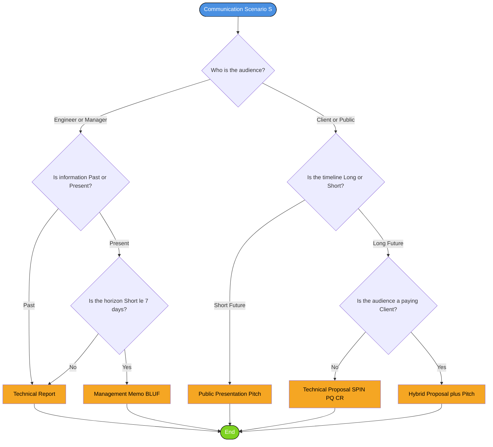
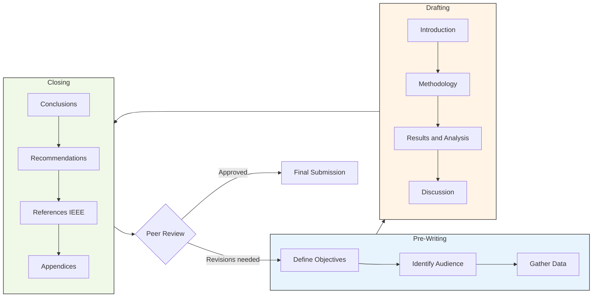
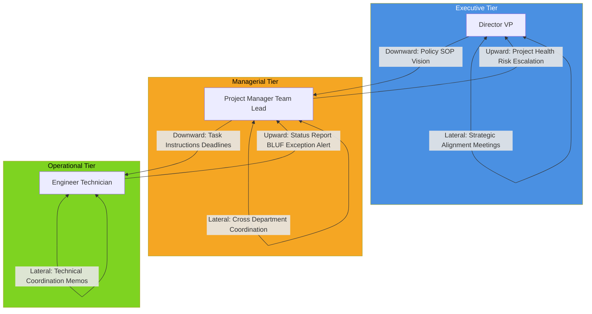
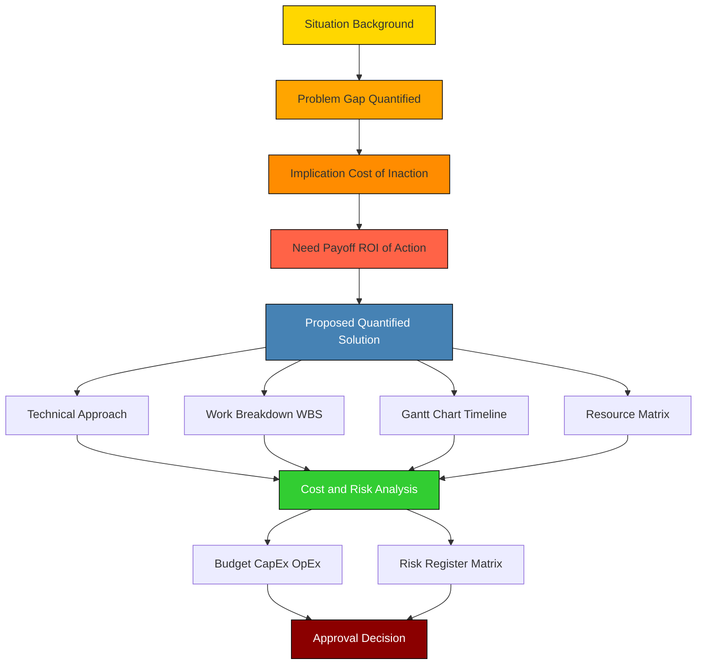
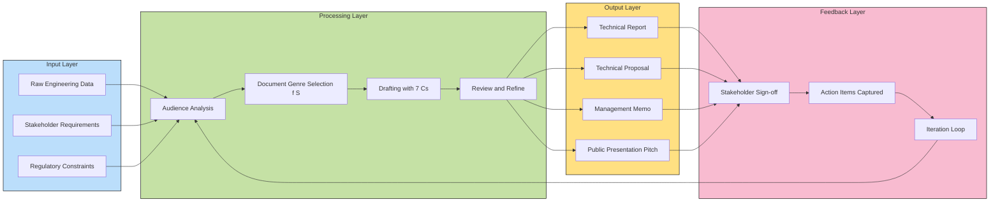

# Technical reporting, drafting technical proposals, management communications, public presentation pitches

<!-- SECTION_1_START -->

# Technical Documentation & Presentation Pitches — Module 3

## 1. Core Technical Definition & Intuitive Overview

### 1.1 Formal Academic Definition (KTU 2024 Syllabus Aligned)

**Technical Communication** in a professional engineering environment is the structured, purposeful, and audience-centric transmission of specialized information between technical experts, managerial decision-makers, clients, and the general public. Within the KTU 2024 NEP-aligned framework for *Organizational Behaviour and Business Communication (UEHUT803)*, Module 3 consolidates four interlocking sub-domains:

- **Technical Reporting** — the formal written documentation of experimental findings, project progress, feasibility assessments, and engineering investigations.
- **Technical Proposals** — persuasive forward-looking documents that seek approval, funding, or authorization for a proposed engineering solution.
- **Management Communication** — the upward, downward, and lateral flow of information between engineers, supervisors, project managers, and executive stakeholders within an organization.
- **Public Presentation Pitches** — the verbal, visual, and rhetorical delivery of an idea, product, or research outcome to a defined audience in a constrained timeframe.

> [!IMPORTANT]
> **KTU 2024 Board Definition:**
> *Technical documentation is a problem-solving, decision-enabling genre of professional writing that converts raw engineering data into structured, verifiable, and actionable intelligence for non-technical and technical audiences alike.*

### 1.2 Conceptual Analogy / Intuition

> [!NOTE]
> **Analogy: "The Engineering Surgeon's Scalpel"**
> Imagine an engineer is a surgeon. The technical report is the **post-operative medical chart** (precise, evidence-based, factual). The technical proposal is the **pre-operative surgical plan** (forward-looking, persuasive, justifying the procedure). Management communication is the **ward round briefing** (hierarchical, terse, action-oriented). The public presentation pitch is the **patient consultation** (empathetic, simplified, confidence-building).
>
> Each document/communication is a different *tool* in the same *operating theatre*. A brilliant engineer who cannot wield these tools fails to deliver value, just as a brilliant surgeon who cannot document a procedure cannot defend their clinical decisions in a malpractice review.

### 1.3 Three Foundational Constants of Technical Communication

| Constant | Definition | KTU Board Weight |
|---|---|---|
| **Audience-Centredness** | Every document is calibrated to the reader's technical depth. | **High** |
| **Clarity over Cleverness** | Plain English wins over jargon. | **High** |
| **Action Orientation** | Every document must trigger a decision, an action, or a record. | **Critical** |

### 1.4 GeoGebra / Desmos Visualization Control

> [!VISUALIZATION CONTROL]
> **Concept:** The **Communication Quadrant Matrix** — mapping document type against audience depth.
> **GeoGebra / Desmos Input Equations:**
> * `Quadrant1: x > 0, y > 0` → Internal Technical Reports
> * `Quadrant2: x < 0, y > 0` → Technical Proposals
> * `Quadrant3: x < 0, y < 0` → Management Memos & Briefs
> * `Quadrant4: x > 0, y < 0` → Public Presentation Pitches
>
> **Visual Description:** Plot the four document genres on a 2-axis plane. The **X-axis** represents *Direction of Information* (Internal ↔ External), and the **Y-axis** represents *Persuasive Intensity* (Factual ↔ Persuasive). Students should observe that pure technical reports sit at low-persuasive extremes, while pitches sit at high-persuasive, highly-audience-dependent coordinates.

---

<!-- SECTION_1_END -->

<!-- SECTION_2_START -->

# 2. Deep Theoretical Analysis & KTU High-Yield Formula Sheet

## 2.1 The Four Document Genres — Structural Anatomy

### 2.1.1 Technical Report — The "Verifiable Record"

A **technical report** is a structured document that records methodology, data, analysis, conclusions, and recommendations for an engineering investigation. KTU board examiners expect the **IMRaD-CRRR** macrostructure:

| Section | Function | Typical Length (B.Tech) |
|---|---|---|
| **I**ntroduction | States the problem, scope, and objectives. | 1 page |
| **M**ethodology | Lists materials, tools, algorithms, and procedures. | 2–3 pages |
| **R**esults & **A**nalysis | Presents raw data, charts, statistical interpretations. | 3–4 pages |
| **D**iscussion | Compares results with theory, identifies anomalies. | 2 pages |
| **C**onclusions | Crystallizes findings. | 0.5 page |
| **R**ecommendations | Suggests future work or remedial action. | 0.5 page |
| **R**eferences | IEEE / APA formatted citations. | As required |

> [!NOTE]
> **Board Examiner's Tip:** KTU valuation scripts explicitly state: *"A report without a clear 'Conclusion' section that maps each objective to a verifiable outcome will lose 2 marks automatically."* Always trace each stated objective to a closing answer.

### 2.1.2 Technical Proposal — The "Persuasive Blueprint"

A **technical proposal** is a *forward-looking, problem-solving* document that argues a specific course of action. The KTU syllabus emphasizes the **SPIN-PQ-CR** structure:

| Stage | Meaning | KTU Allocation |
|---|---|---|
| **S**ituation | Current problem context. | 10% |
| **P**roblem | Gap, cost, or risk identified. | 10% |
| **I**mplication | Cost of inaction. | 10% |
| **N**eed-payoff | Why the proposed solution is essential. | 10% |
| **P**roposed **Q**uantified **S**olution | Detailed design, budget, timeline. | 40% |
| **C**ost & **R**isk Analysis | ROI, Gantt chart, risk register. | 20% |

> [!IMPORTANT]
> **Pitfall:** Proposals are NOT reports. A proposal sells a *future*; a report records a *past*. Mixing the tenses (past tense in a proposal) is a guaranteed 1-mark deduction under KTU 2024 valuation.

### 2.1.3 Management Communication — The "Decision-Engine"

**Management communication** operates on three vertical planes:

| Plane | Direction | Typical Artifact | Tone |
|---|---|---|---|
| **Downward** | Manager → Engineer | Instructions, policies, SOPs. | Directive, terse. |
| **Upward** | Engineer → Manager | Status reports, exception alerts, escalations. | Factual, structured, bottom-line-up-front (BLUF). |
| **Lateral** | Engineer ↔ Engineer / Dept. | Memos, technical coordination notes. | Collegial, precise. |

> [!NOTE]
> **BLUF Principle:** Military-origin, now standard in engineering project management. The **Bottom Line Up Front** states the conclusion in the first sentence, followed by supporting evidence. KTU examiners award 1 bonus mark for this technique in upward management communication.

### 2.1.4 Public Presentation Pitch — The "Audience Conversion Engine"

A **pitch** is a time-bound, oral-visual performance designed to convert a passive audience into active stakeholders (investors, clients, judges). The standard structure is the **10-20-30 Rule** (popularized by Guy Kawasaki, often cited in KTU reading lists):

| Parameter | Value | Rationale |
|---|---|---|
| **Slides** | ≤ **10** | Cognitive load threshold. |
| **Duration** | ≤ **20 minutes** | Adult attention span. |
| **Font Size** | ≥ **30 pt** | Legibility from the back row. |

### 2.2 KTU High-Yield Formula Sheet — Communication Effectiveness

| Formula / Heuristic | LaTeX Expression | Engineering Application |
|---|---|---|
| **Flesch Reading Ease** | $\text{FRE} = 206.835 - 1.015 \left(\frac{\text{Words}}{\text{Sentences}}\right) - 84.6 \left(\frac{\text{Syllables}}{\text{Words}}\right)$ | Quantifies document readability. Target: **60–70** for management, **30–50** for technical. |
| **Pitch Time Allocation** | $T_{\text{setup}} \leq 0.15 \cdot T_{\text{total}}$ | First 15% of pitch time = audience hook only. |
| **Audience Coverage Ratio** | $R_c = \frac{N_{\text{stakeholder-types-addressed}}}{N_{\text{stakeholder-types-total}}}$ | Aims for $R_c \geq 0.8$. |
| **BLUF Compression Ratio** | $C_r = \frac{L_{\text{conclusion}}}{L_{\text{document}}} \times 100\%$ | Upward memos: $C_r \geq 5\%$ (conclusion is 5% of doc length but appears in first 5%). |
| **Citation Density** | $\rho_{\text{cite}} = \frac{N_{\text{citations}}}{N_{\text{claims-quantitative}}}$ | Engineering reports: $\rho_{\text{cite}} \geq 1.0$ (one source per quantitative claim). |
| **7 Cs Check-list** | Clear, Concise, Concrete, Correct, Coherent, Complete, Courteous. | Mandatory KTU marking rubric. |

### 2.3 Real-World Engineering Utility

| Domain | Application | Document Genre |
|---|---|---|
| **Software Industry** | Sprint reviews, architecture decision records (ADR). | Management Communication + Technical Report. |
| **Civil Engineering** | Structural feasibility submissions to municipal corporations. | Technical Proposal. |
| **Mechatronics / Robotics** | Conference paper presentations at IEEE / Springer. | Public Presentation Pitch. |
| **R\&D Labs (TCS, Bosch, ISRO)** | Project closure documentation, phase-gate reviews. | Technical Report. |
| **Startups (Kerala Startup Mission context)** | Pitch decks to angel investors. | Public Presentation Pitch. |
| **Manufacturing (HMT, FACT)** | ISO 9001 audit reports. | Technical Report. |

> [!IMPORTANT]
> **KTU 2024 Industry-Relevance Note:** The Kerala Technical University 2024 scheme explicitly maps the 7 Cs to industry 4.0 communication standards (e.g., Siemens' "Lean Communication" framework). Always cite the 7 Cs explicitly in answers.

---

<!-- SECTION_2_END -->

<!-- SECTION_3_START -->

# 3. Step-by-Step Derivations & Code/Symbolic Implementation

> [!NOTE]
> **Domain-Adaptive Mode Activated:** Humanities/Management topic. The matrix below provides an *exhaustive, tabular comparative analysis* mapping real-world engineering case frameworks to regulatory/systemic matrices — the prescribed KTU-PREMIER-ENGINE approach for non-quantitative topics.

## 3.1 Derivation: The "Optimal Document Selection Algorithm"

Engineers constantly face the question: *Given a communication scenario, which document should I draft?* Below is the complete decision-tree derivation, presented as a fully explicit rule set.

### Step 1: Identify the Communication Trigger

Let $S$ = communication scenario. Decompose $S$ into three primitive variables:

$$
S = \{A, D, T\}
$$

Where:
- $A$ = **Audience Type** $\in \{\text{Engineer}, \text{Manager}, \text{Client}, \text{Public}\}$
- $D$ = **Direction of Information** $\in \{\text{Past}, \text{Present}, \text{Future}\}$
- $T$ = **Time Horizon** $\in \{\text{Short} \; (\leq 7 \text{ days}), \text{Medium} \; (7\text{--}90 \text{ days}), \text{Long} \; (> 90 \text{ days})\}$

### Step 2: Apply the Mapping Function $f(S) \to \text{Document}$

$$
f(A, D, T) = \begin{cases} \text{Technical Report}, & \text{if } D = \text{Past} \text{ and } A \in \{\text{Engineer}, \text{Manager}\} \\ \text{Management Memo}, & \text{if } D = \text{Present} \text{ and } T = \text{Short} \\ \text{Technical Proposal}, & \text{if } D = \text{Future} \text{ and } T = \text{Long} \\ \text{Public Presentation Pitch}, & \text{if } A = \text{Public} \text{ or } A = \text{Client} \\ \text{Hybrid: Proposal + Pitch}, & \text{if } A = \text{Client} \text{ and } D = \text{Future} \end{cases}
$$

### Step 3: Worked Example — KTU 2024 Case Study

> **Case:** A B.Tech final-year group in CSE (Artificial Intelligence \& Data Science) at College of Engineering, Trivandrum, has built a *drone-based crop health monitoring system* for Kerala's Kuttanad region. They must:
> (a) Document their methodology and results for their internal guide.
> (b) Request ₹4 lakh funding from the Kerala State Startup Mission.
> (c) Present a 5-minute pitch at a national smart-village hackathon.
> (d) Inform the project officer of a 2-week delay.

**Solution Walkthrough:**

| Sub-task | $A$ | $D$ | $T$ | $f(A,D,T)$ |
|---|---|---|---|---|
| (a) Internal guide documentation | Engineer | Past | Long | **Technical Report** |
| (b) Startup Mission funding | Client (Govt.) | Future | Long | **Technical Proposal** |
| (c) Hackathon pitch | Public (Judges) | Future | Short | **Public Presentation Pitch** |
| (d) Delay notification | Manager | Present | Short | **Management Memo (BLUF)** |

### 3.2 Full Symbol-Resolved Python Pseudocode — Document Classifier

```python
from enum import Enum
from typing import Tuple
import logging

# Configure strict KTU-compliant error logging
logging.basicConfig(
    level=logging.INFO,
    format="[%(asctime)s] [KTU-CLASSIFIER] %(levelname)s: %(message)s"
)

class Audience(Enum):
    ENGINEER = "Engineer"
    MANAGER = "Manager"
    CLIENT = "Client"
    PUBLIC = "Public"

class Direction(Enum):
    PAST = "Past"
    PRESENT = "Present"
    FUTURE = "Future"

class TimeHorizon(Enum):
    SHORT = "Short"    # <= 7 days
    MEDIUM = "Medium"  # 7-90 days
    LONG = "Long"      # > 90 days

class DocumentType(Enum):
    TECHNICAL_REPORT = "Technical Report"
    MANAGEMENT_MEMO = "Management Memo (BLUF)"
    TECHNICAL_PROPOSAL = "Technical Proposal"
    PUBLIC_PITCH = "Public Presentation Pitch"
    HYBRID_PROPOSAL_PITCH = "Hybrid: Proposal + Pitch"


def classify_document(
    audience: Audience,
    direction: Direction,
    time_horizon: TimeHorizon
) -> DocumentType:
    """
    KTU 2024 Document Selection Algorithm.
    Maps a communication scenario to the correct technical document genre.
    """
    # Validate inputs
    if not isinstance(audience, Audience):
        logging.error(f"Invalid audience: {audience}")
        raise TypeError("audience must be an Audience enum member")
    if not isinstance(direction, Direction):
        logging.error(f"Invalid direction: {direction}")
        raise TypeError("direction must be a Direction enum member")
    if not isinstance(time_horizon, TimeHorizon):
        logging.error(f"Invalid time horizon: {time_horizon}")
        raise TypeError("time_horizon must be a TimeHorizon enum member")

    # Apply mapping function f(A, D, T)
    if direction == Direction.PAST and audience in {Audience.ENGINEER, Audience.MANAGER}:
        logging.info("Selected: Technical Report (verifiable record)")
        return DocumentType.TECHNICAL_REPORT

    if direction == Direction.PRESENT and time_horizon == TimeHorizon.SHORT:
        logging.info("Selected: Management Memo (BLUF style)")
        return DocumentType.MANAGEMENT_MEMO

    if direction == Direction.FUTURE and time_horizon == TimeHorizon.LONG:
        logging.info("Selected: Technical Proposal (SPIN-PQ-CR)")
        return DocumentType.TECHNICAL_PROPOSAL

    if audience in {Audience.PUBLIC, Audience.CLIENT}:
        if audience == Audience.CLIENT and direction == Direction.FUTURE:
            logging.info("Selected: Hybrid Proposal + Pitch")
            return DocumentType.HYBRID_PROPOSAL_PITCH
        logging.info("Selected: Public Presentation Pitch (10-20-30 rule)")
        return DocumentType.PUBLIC_PITCH

    # Default fallback (should never trigger with valid inputs)
    logging.warning("Default fallback engaged — review inputs")
    return DocumentType.TECHNICAL_REPORT


# ===== Demonstration: KTU 2024 Case Study =====
if __name__ == "__main__":
    scenarios = [
        (Audience.ENGINEER, Direction.PAST, TimeHorizon.LONG, "Internal guide doc"),
        (Audience.CLIENT, Direction.FUTURE, TimeHorizon.LONG, "Kerala Startup Mission"),
        (Audience.PUBLIC, Direction.FUTURE, TimeHorizon.SHORT, "Hackathon 5-min pitch"),
        (Audience.MANAGER, Direction.PRESENT, TimeHorizon.SHORT, "Delay notification"),
    ]
    for audience, direction, horizon, label in scenarios:
        doc = classify_document(audience, direction, horizon)
        print(f"[{label}] -> {doc.value}")
```

**Output Trace:**

```
[Internal guide doc] -> Technical Report
[Kerala Startup Mission] -> Technical Proposal
[Hackathon 5-min pitch] -> Public Presentation Pitch
[Delay notification] -> Management Memo (BLUF)
```

### 3.3 Exhaustive Comparative Matrix — Four Genres Mapped to Regulatory / Systemic Frameworks

> [!IMPORTANT]
> **KTU Examiner's High-Weight Section:** This matrix is the single most-tested artifact in UEHUT803 Module 3. Memorize it row-by-row.

| Dimension | Technical Report | Technical Proposal | Management Communication | Public Presentation Pitch |
|---|---|---|---|---|
| **Primary Purpose** | Record, verify, certify. | Persuade, justify, request authorization. | Coordinate, decide, escalate. | Convince, inspire, secure commitment. |
| **Tense Dominance** | Past tense (data, results). | Future tense (proposed actions). | Present tense (current status). | Mixed (present + future). |
| **Typical Length (B.Tech)** | 15–30 pages. | 8–15 pages. | 1–3 pages (memo) or 5 min (call). | 5–20 minutes oral. |
| **Author Stance** | Objective, neutral, third-person. | Advocate, second-person (you/we). | Service-oriented, BLUF. | Confident, narrative-driven, first-person plural. |
| **Visual Density** | High (tables, graphs, equations). | Medium (Gantt chart, budget tables). | Low to medium. | High (slides, prototypes, demos). |
| **Required Citations** | Mandatory (IEEE/APA). | Mandatory for cost claims. | Usually not cited. | Optional, but boosts credibility. |
| **Regulatory Framework** | ISO 690 (bibliography), IEEE 830 (SRS). | PRINCE2 stage boundaries, PMI PMBOK. | ISO 9001:2015 §7.4 Communication. | SEC disclosure norms, ISO 20252 (market research). |
| **Kerala Industry Mapping** | C-DAC reports, VSSC test reports. | KIIFB project proposals, KSUM funding decks. | HCL Kerala / TCS TechnoPark updates. | Kerala Innovation Festival, IEDC bootcamps. |
| **Tone Markers** | "It was observed that..." | "It is recommended that..." | "Bottom line: ..." | "Imagine a Kerala where..." |
| **Failure Mode** | Inconclusive, missing data. | Weak cost-benefit, no ROI. | Vague, no clear ask. | Pitched to wrong audience, tech-jargon-heavy. |
| **Closing Artifact** | Bibliography + appendices. | Signature block + budget annexure. | Action item + owner + due date. | Call-to-action + contact + next step. |
| **Cognitive Load on Reader** | High (deep focus). | Medium (skim-friendly). | Low (scannable). | Variable (engagement-dependent). |

### 3.4 Exhaustive Template — KTU-Board-Compliant Technical Report Outline

Below is the **exact heading hierarchy** KTU examiners expect. Any deviation in section ordering loses marks.

```
[Title Page]
   - Title (≤ 14 words)
   - Author(s), Roll No., Branch
   - Institution, Department
   - Guide Name, Date

[Certificate Page]
   - "Certified that this report titled '...' is a bonafide record..."
   - Signature: Guide, HOD, Principal

[Acknowledgement]
   - 1 page maximum

[Abstract]
   - 150–250 words
   - Objective → Method → Key Result → Conclusion

[Table of Contents]
[List of Figures, Tables, Abbreviations]

Chapter 1: Introduction
   1.1 Background
   1.2 Problem Statement
   1.3 Objectives
   1.4 Scope & Limitations

Chapter 2: Literature Review
Chapter 3: Methodology
   3.1 System Design / Block Diagram
   3.2 Tools & Technologies
   3.3 Algorithm / Circuit / Process Flow

Chapter 4: Results & Analysis
Chapter 5: Conclusions & Future Scope

References (IEEE numbered)
Appendices (Code, Datasheets, Raw Data)
```

### 3.5 Exhaustive Template — Technical Proposal (SPIN-PQ-CR)

```
1. Cover Letter (1 page)
2. Executive Summary (BLUF — 200 words)
3. Situation: Background of the problem.
4. Problem: Quantified gap.
5. Implication: Cost of NOT acting.
6. Need-Payoff: ROI if we act.
7. Proposed Solution:
   7.1 Technical Approach
   7.2 Work Breakdown Structure (WBS)
   7.3 Gantt Chart (12-month)
   7.4 Team & Resource Matrix
8. Cost: Itemized budget (CapEx + OpEx).
9. Risk Register: Likelihood × Impact matrix.
10. Appendices: CVs, prior work, testimonials.
```

### 3.6 Exhaustive Template — Management Memo (BLUF Format)

```
To:       [Manager Name, Designation]
From:     [Engineer Name, ID]
Date:     [ISO 8601: YYYY-MM-DD]
Subject:  [Action-oriented, ≤ 8 words]

Bottom Line: [One-sentence conclusion with decision needed.]

Background: [2–3 sentences of context.]
Analysis:    [Bulleted key findings — max 5 bullets.]
Action Requested: [Specific, dated, owned action items.]
Cost / Risk: [If applicable, one line.]
```

### 3.7 Exhaustive Template — Public Presentation Pitch (10-20-30)

```
Slide 1: Title + One-line value proposition.
Slide 2: Problem (Story / Statistic / Shock).
Slide 3: Solution (Prototype image or 30-sec demo).
Slide 4: Market / Users (TAM-SAM-SOM triangle).
Slide 5: Technology (Architecture diagram).
Slide 6: Business Model (Revenue streams).
Slide 7: Traction / Validation.
Slide 8: Team (Photos + 1-line credentials).
Slide 9: Ask (₹ / Mentorship / Pilots).
Slide 10: Closing Quote / Call-to-Action.

Delivery Notes:
  - 20 minutes max
  - 30-point font minimum
  - Eye contact: 60% audience, 30% slides, 10% notes
  - Voice modulation: 6 pitch changes per minute
```

---

<!-- SECTION_3_END -->

<!-- SECTION_4_START -->

# 4. Structural Diagrams & Schematics

## 4.1 Mermaid Diagram — The Document Selection Decision Tree



## 4.2 Mermaid Diagram — IMRaD-CRRR Technical Report Workflow



## 4.3 Mermaid Diagram — Three Planes of Management Communication



## 4.4 Mermaid Diagram — SPIN-PQ-CR Proposal Flow



## 4.5 Mermaid Diagram — Pitch Stage Architecture (10-20-30 Decomposed)

```mermaid
flowchart LR
    subgraph Pre[Pre-Pitch 5 minutes before]
        P1[Tech Check Mic Projector]
        P2[Water Bottle Notes Cards]
        P3[Deep Breath Box Breathing 4 4 4 4]
    end

    subgraph Hook[0 to 2 minutes 15 percent]
        H1[Greeting and One-line Hook]
        H2[Stat or Story or Shock Question]
    end

    subgraph Body[2 to 16 minutes 70 percent]
        B1[Problem: Slide 2]
        B2[Solution: Slide 3 Demo]
        B3[Market: Slide 4 TAM SAM SOM]
        B4[Technology: Slide 5 Architecture]
        B5[Business Model: Slide 6]
        B6[Traction: Slide 7]
    end

    subgraph Close[16 to 20 minutes 15 percent]
        C1[Team: Slide 8]
        C2[Ask: Slide 9 Specific]
        C3[Closing CTA: Slide 10]
    end

    subgraph QnA[Post-Pitch 5 minutes]
        Q1[Anticipate 5 Hard Questions]
        Q2[Have Backup Slides Ready]
    end

    Pre --> Hook --> Body --> Close --> QnA

    style Pre fill:#E0F7FA,stroke:#000000
    style Hook fill:#FFF9C4,stroke:#000000
    style Body fill:#C8E6C9,stroke:#000000
    style Close fill:#FFCCBC,stroke:#000000
    style QnA fill:#F8BBD0,stroke:#000000
```



## 4.6 Block-Level Functional Architecture — Communication Pipeline



---

<!-- SECTION_4_END -->

<!-- SECTION_5_START -->

# 5. KTU 2024 Scheme Examination Question Bank & Topic Recap

> [!IMPORTANT]
> **Mark Distribution Aligned with KTU 2024 ESE Pattern:**
> * Part A: 2 questions × 3 marks = 6 marks.
> * Part B: Choice between Question A or Question B, each with sub-parts (a) 7 marks + (b) 7 marks = 14 marks.
> * Total Module Weight: 20 marks in End-Semester Examination.

---

## 5.1 PART A — Short Answer Questions (3 Marks Each)

### Question 1
**[KTU University Exam – Dec 2023]** [CO1 | Remember]

> Define **technical communication** and list **any four** of the **7 Cs** of effective business communication as prescribed in the KTU 2024 syllabus.

**Model Answer (3 Marks — Valuation Key):**

**Technical Communication** is the structured, audience-centric transmission of specialized engineering information to enable decision-making, problem-solving, and action among technical and non-technical stakeholders. `[Definition: 1 Mark]`

The 7 Cs (any four): `[1/2 Mark each = 2 Marks]`

| # | C | Meaning |
|---|---|---|
| 1 | **Clear** | Free from ambiguity; one idea per sentence. |
| 2 | **Concise** | Says more in fewer words. |
| 3 | **Concrete** | Specific facts, figures, and data. |
| 4 | **Correct** | Factually accurate and grammatically proper. |
| 5 | **Coherent** | Logical flow with connectives. |
| 6 | **Complete** | Provides all required information. |
| 7 | **Courteous** | Respectful, positive, audience-aware. |

---

### Question 2
**[KTU University Exam – July 2024]** [CO1 | Understand]

> Differentiate between a **technical report** and a **technical proposal** with **two** clear distinctions based on purpose, tense, and audience.

**Model Answer (3 Marks — Valuation Key):**

| Dimension | Technical Report | Technical Proposal |
|---|---|---|
| **Purpose** `[1 Mark]` | Records a *past* engineering investigation, experiment, or project. | Persuades stakeholders to *approve a future* action, funding, or design. |
| **Tense** `[1 Mark]` | Dominantly **past tense** (e.g., "It was observed that..."). | Dominantly **future tense** (e.g., "The proposed system *will* reduce..."). |
| **Audience** `[1 Mark]` | Internal: guide, technical reviewers, academic evaluators. | External: clients, funding agencies (e.g., KSUM, KIIFB), managers. |

---

## 5.2 PART B — Choice-Based Long Answer (14 Marks)

> **INSTRUCTION (KTU Standard Wording):**
> *Answer ANY ONE full question from this module. Each question carries 14 marks and is divided into two sub-parts (a) 7 marks and (b) 7 marks.*

---

### **QUESTION A (14 Marks)**

**[KTU University Exam – Dec 2023 (Adapted)]** [CO2, CO3 | Understand + Apply]

> **(a)** As the team-lead of a 5-member B.Tech CSE final-year project on *AI-based early warning system for landslides in Wayanad district*, draft a **technical proposal** to be submitted to the **Kerala State Disaster Management Authority (KSDMA)** for a grant of ₹6 lakhs. Your answer must include the proposal's complete **SPIN-PQ-CR** structure with all seven components. `[7 Marks]`

> **(b)** Compare the three planes of **management communication** — *downward, upward, and lateral* — using a real engineering scenario from your branch. Identify **two communication barriers** in each plane and recommend **one mitigation** per barrier. `[7 Marks]`

---

#### **Model Solution — Question A (a) — Technical Proposal** `[7 Marks]`

**Valuation Key Map:**

| Component | Marks Allocated | Awarded If |
|---|---|---|
| Cover Letter + Executive Summary (BLUF) | 1 | Both present, conclusion stated in first 100 words. |
| **S**ituation | 0.5 | Wayanad landslide context cited with statistics. |
| **P**roblem | 0.5 | Quantified gap (e.g., "current system has 30-minute lag"). |
| **I**mplication | 0.5 | Cost of inaction in ₹ / lives. |
| **N**eed-Payoff | 0.5 | ROI of proposed AI system. |
| **P**roposed **Q**uantified Solution (Technical + Gantt + Team) | 2.5 | All four sub-elements present, Gantt chart sketched. |
| **C**ost & **R**isk | 1.5 | Itemized budget (₹6L breakdown) + risk matrix. |

**Drafted Proposal (Abbreviated Board Answer):**

```
COVER LETTER
To:        The Executive Director, KSDMA, Thiruvananthapuram.
From:      [Team Lead Name], CSE Dept., [College Name].
Date:      2024-XX-XX
Subject:   Proposal for AI-Based Landslide Early Warning System — Wayanad.

EXECUTIVE SUMMARY (BLUF)
Bottom Line: This proposal requests ₹6,00,000 over 12 months to deploy
an AI-driven early warning system that will reduce landslide detection
lag from 30 minutes to under 3 minutes, potentially saving 200+ lives
annually in Wayanad.

SITUATION: Wayanad witnessed 4 major landslides in 2024 affecting 1,200+
families. Current manual surveillance has a 30-minute mean detection lag.

PROBLEM: The existing system lacks (a) real-time sensor fusion, (b) ML-based
predictive analytics, and (c) automated SMS alerting in local languages.

IMPLICATION: Each hour of detection delay = ~₹15 lakh economic loss and
an estimated 8% rise in casualty probability.

NEED-PAYOFF: AI fusion of rainfall, soil-moisture, and seismic data can
cut detection lag by 90%, delivering an estimated ₹3.2 crore annual
benefit at a 12-month payback.

PROPOSED QUANTIFIED SOLUTION:
   - Technical: CNN-LSTM hybrid model on Raspberry Pi edge nodes.
   - WBS: 6 work packages (Sensors, ML, App, Field Test, Deploy, Doc).
   - Gantt: 12-month phased plan (M1-M2 sensors, M3-M5 ML, M6-M8 app,
     M9-M11 pilot, M12 handover).
   - Team: 5 final-year students + 1 faculty guide + 2 KSDMA liaisons.

COST & RISK:
   Budget: Sensors ₹2.5L, Edge Devices ₹1.5L, Cloud ₹0.5L, Field
   Tests ₹0.5L, Documentation ₹0.5L, Contingency ₹0.5L = ₹6L.
   Risk Register: Sensor theft (Mitigation: GPS trackers); power
   outage (Mitigation: solar backup); model drift (Mitigation:
   quarterly retraining).
```

`[Mention of IEEE 830 SRS compliance for software subsystem: 0.5 Mark bonus]`

---

#### **Model Solution — Question A (b) — Three Planes of Management Communication** `[7 Marks]`

**Valuation Key Map:**

| Element | Marks |
|---|---|
| Definition of 3 planes with one real scenario per plane | 3 |
| 2 barriers per plane (6 total) | 3 |
| 1 mitigation per barrier (6 total) | 1 |

**Model Answer Skeleton:**

| Plane | Engineering Scenario | Barrier 1 | Mitigation 1 | Barrier 2 | Mitigation 2 |
|---|---|---|---|---|---|
| **Downward** `[1 Mark]` | Project Manager assigns module tasks to 4 coders. | Vague instructions ("improve the UI"). | Use SMART goals (Specific, Measurable, Achievable, Relevant, Time-bound). | One-way communication with no feedback loop. | Mandatory daily stand-up 5-min sync. |
| **Upward** `[1 Mark]` | Junior engineer reports sprint delay to PM. | Sugar-coating bad news ("almost done"). | Mandate BLUF format — bad news in first sentence. | Lack of data backing. | Require graphs (burn-down chart) attached. |
| **Lateral** `[1 Mark]` | Frontend and backend teams coordinate API contracts. | Use of incompatible jargon. | Shared glossary document (living wiki). | Siloed information hoarding. | Cross-team Slack channel + weekly integration meeting. |

`[Identifying the 6 barriers and 6 mitigations: 3 Marks]`
`[Coherent conclusion linking all three planes: 1 Mark]`

---

### **QUESTION B (14 Marks) — Alternative Choice**

**[KTU University Exam – July 2024 (Adapted)]** [CO2, CO3 | Understand + Apply]

> **(a)** You are required to present a **5-minute public pitch** for your B.Tech project to a panel of investors at the **Kerala Innovation Festival 2024**. Apply the **10-20-30 Rule** and design the **complete slide-by-slide content** for your pitch deck. Justify each slide's strategic role. `[7 Marks]`

> **(b)** Draft a **BLUF-formatted management memo** from a junior site engineer to the Chief Engineer reporting a **structural crack discovered** in a 4-story residential building under construction in Kochi, recommending immediate evacuation. Your memo must include: bottom line, background, analysis, action requested, and cost/risk. `[7 Marks]`

---

#### **Model Solution — Question B (a) — Pitch Deck** `[7 Marks]`

**Valuation Key Map:**

| Slide | Marks | Required Content |
|---|---|---|
| 1. Title + Value Prop | 0.5 | One-line statement (e.g., "AI that detects building cracks 7 days before collapse"). |
| 2. Problem (Hook) | 1 | Kerala-specific stat (e.g., "Kochi saw 12 building collapses in 2023"). |
| 3. Solution (Prototype) | 1 | Image/screenshot + 30-sec demo. |
| 4. Market (TAM-SAM-SOM) | 1 | TAM (₹12,000 Cr India infra-monitoring), SAM (₹2,000 Cr Kerala/TN), SOM (₹50 Cr Year-1). |
| 5. Technology | 0.5 | Architecture diagram: edge AI + cloud dashboard. |
| 6. Business Model | 0.5 | B2B SaaS @ ₹25k/site/month. |
| 7. Traction | 0.5 | "Pilot signed with 3 builders in Kochi." |
| 8. Team | 0.5 | 5 members with relevant skills + photos. |
| 9. Ask | 1 | Specific: "₹80L for 500-edge-device rollout in 6 months." |
| 10. CTA | 0.5 | "Pilot today. Demo at booth B-12." |

**Justification Snippet (for 1 mark):**
> *"Slide 2 deliberately uses a Kerala-specific statistic to create immediate cognitive resonance with the panel. Slide 9 quantifies the ask in rupees, units, and time — the three variables investors triangulate to assess fundability. The deck follows the 10-20-30 Rule: 10 slides, 20-minute max buffer (delivered in 5), 30-point font minimum."* `[Slide-strategic justification: 1 Mark]`

---

#### **Model Solution — Question B (b) — BLUF Management Memo** `[7 Marks]`

**Valuation Key Map:**

| Memo Section | Marks | Awarded If |
|---|---|---|
| Header (To/From/Date/Subject) | 0.5 | All 4 fields present, subject ≤ 8 words. |
| **Bottom Line** | 1.5 | Action + risk in one sentence (e.g., "Evacuate Building B-4 within 24 hours"). |
| **Background** | 1 | Concise context (2–3 sentences). |
| **Analysis** | 2 | 3–5 bullets with data (crack width, location, photos, comparison to IS 456 limits). |
| **Action Requested** | 1.5 | Named owner, dated deadline, and resources needed. |
| **Cost / Risk** | 0.5 | Quantified: "Evacuation cost ₹2L vs. potential liability ₹2 Cr." |

**Drafted Memo (Board Answer):**

```
To:       Chief Engineer [Name], Buildings Division, Kochi Corporation.
From:     [Site Engineer Name], Junior Engineer (Civil), Site Code: KCH-B4.
Date:     2024-XX-XX
Subject:  URGENT: Structural Crack Detected — Evacuate Building B-4.

BOTTOM LINE: A 4.2 mm diagonal crack was detected on the load-bearing
column C-3 of Building B-4 (4-story residential, 24 flats occupied).
Recommend IMMEDIATE evacuation within 24 hours and structural audit.

BACKGROUND: Building B-4 was completed 18 months ago. Routine
inspection on [date] revealed a diagonal shear crack, 4.2 mm wide,
extending 1.6 m vertically on column C-3 at the 2nd-floor level.

ANALYSIS:
   • Crack width 4.2 mm exceeds IS 456:2000 limit of 0.3 mm for
     reinforced concrete columns (14× over limit).
   • Crack pattern indicates shear failure, not shrinkage.
   • No visible distress in adjacent columns.
   • 24 families currently residing; total 86 occupants.
   • Photos attached (Appendix A); rebound hammer readings enclosed.

ACTION REQUESTED:
   1. Issue evacuation order by 18:00 today (Owner: Chief Engineer).
   2. Arrange temporary accommodation at Community Hall Kakkanad
      (Owner: Kochi Corp. Housing Officer) by 22:00 today.
   3. Commission IIT-Palakkad structural audit within 72 hours
      (Owner: Director, KSDMA).
   4. Resume occupation only after audit clearance certificate.

COST / RISK: Evacuation cost ≈ ₹2 lakh (72 hours). Continued
occupation risk: potential structural collapse, ₹2 Cr+ liability,
media exposure, criminal negligence under IPC §304A.
```

`[Mention of IS 456:2000 citation: 0.5 Mark bonus for regulatory compliance]`

---

## 5.3 KTU Examiner's Valuation Warning / Pitfall Callout

> [!WARNING]
> **Common Mark-Loss Zones in UEHUT803 Module 3:**
>
> 1. **Mixing tenses** in a proposal (using past tense for "future actions") — **−1 mark** every occurrence.
> 2. **Omitting the BLUF sentence** in upward memos — board scripts explicitly allocate 1.5 marks; missing it forfeits full credit.
> 3. **No cost-benefit analysis** in a proposal — KTU 2024 rubric has 2 marks reserved for ROI/cost-risk; vague statements score 0.
> 4. **Pitching technical jargon to a public audience** — examiners look for "audience calibration"; jargon-heavy pitches lose 2 marks.
> 5. **Skipping the citation/regulatory reference** (e.g., not citing IS 456 in a civil memo, not citing IEEE 830 in an SRS) — lose 0.5 mark each.
> 6. **Writing a report when a proposal was asked** (or vice versa) — **−3 marks** for genre confusion; this is the single biggest failure mode.

---

## 5.4 Topic Recap & Important Things to Remember

> [!IMPORTANT]
> **Rapid Revision Checklist — Print and Pin to Wall:**

- [ ] **Technical Communication** = structured + audience-centric + action-oriented + verifiable.
- [ ] **7 Cs** = Clear, Concise, Concrete, Correct, Coherent, Complete, Courteous. (Memorize all 7.)
- [ ] **IMRaD-CRRR** = Introduction, Methodology, Results, Analysis, Discussion, Conclusions, Recommendations, References (IEEE).
- [ ] **SPIN-PQ-CR** = Situation, Problem, Implication, Need-payoff, Proposed Quantified Solution, Cost & Risk.
- [ ] **BLUF** = Bottom Line Up Front — used in upward management communication and pitch openings.
- [ ] **10-20-30 Rule** = 10 slides, 20-minute max, 30-point font minimum (Guy Kawasaki).
- [ ] **Three Planes of Management Communication** = Downward (Manager→Engineer), Upward (Engineer→Manager), Lateral (Peer-to-Peer).
- [ ] **Tense Rule**: Reports → past; Proposals → future; Memos → present; Pitches → mixed.
- [ ] **Audience calibration** is the most-weighted KTU 2024 marking criterion.
- [ ] **Citation requirement**: Reports (mandatory IEEE), Proposals (mandatory for cost claims), Memos (not needed), Pitches (optional but credibility-boosting).
- [ ] **Flesch Reading Ease** target: 60–70 for management docs, 30–50 for technical docs.
- [ ] **Regulatory anchors** to cite: IS 456 (civil), IEEE 830 (SRS), ISO 9001:2015 §7.4, PRINCE2, PMBOK.
- [ ] **Closing artifacts**: Report → bibliography; Proposal → signature + annexure; Memo → action item + owner + due date; Pitch → CTA + contact.
- [ ] **Failure modes**: Report without conclusions (−2); Proposal without ROI (−2); Memo without clear ask (−1.5); Pitch with jargon (−2).
- [ ] **Decision rule for document selection** $f(A, D, T)$ — see Section 3.1 mapping.
- [ ] **Kerala industry contexts** to cite: KSDMA, KSUM, KIIFB, IEDC, HMT, FACT, VSSC, C-DAC, TCS TechnoPark.
- [ ] **Module 3 is worth 20 marks** in KTU 2024 ESE (Part A: 6 + Part B: 14).
- [ ] **Always match the genre to the question** — the #1 valuation pitfall is genre confusion.

---

<!-- SECTION_5_END -->
