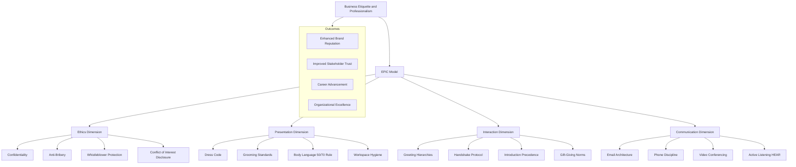
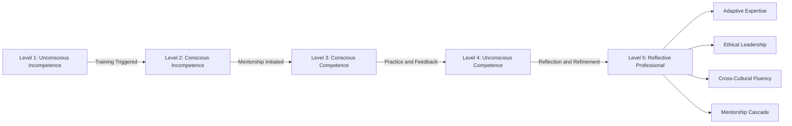
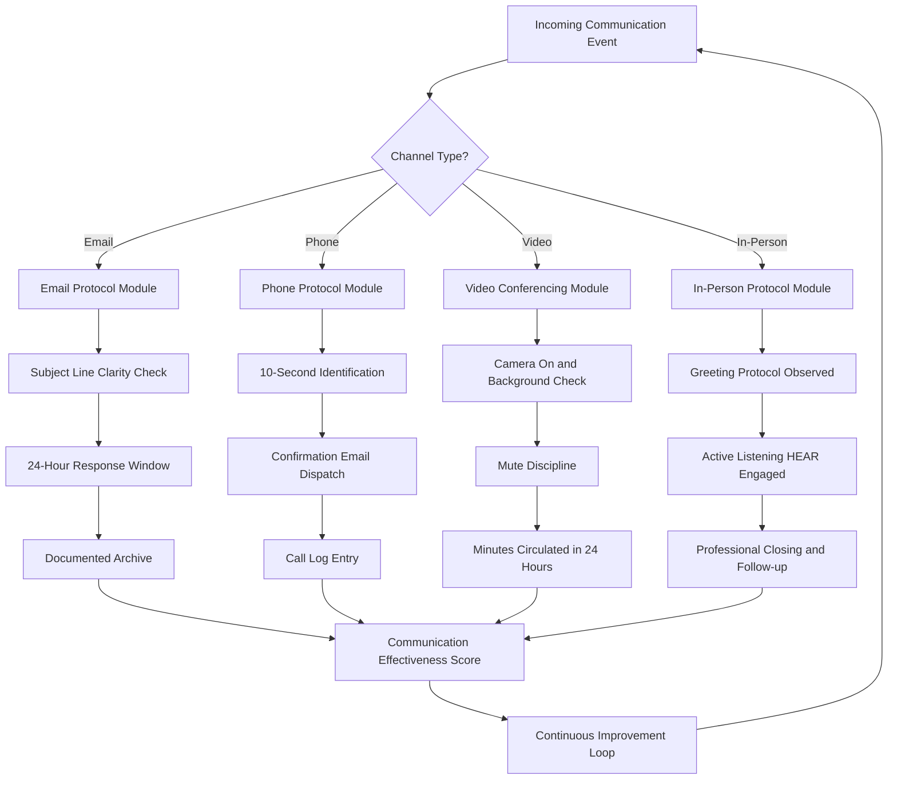
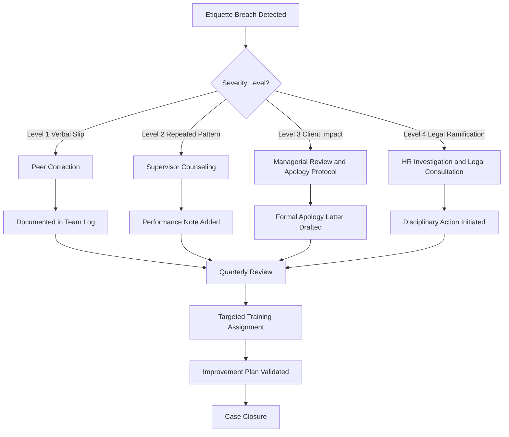
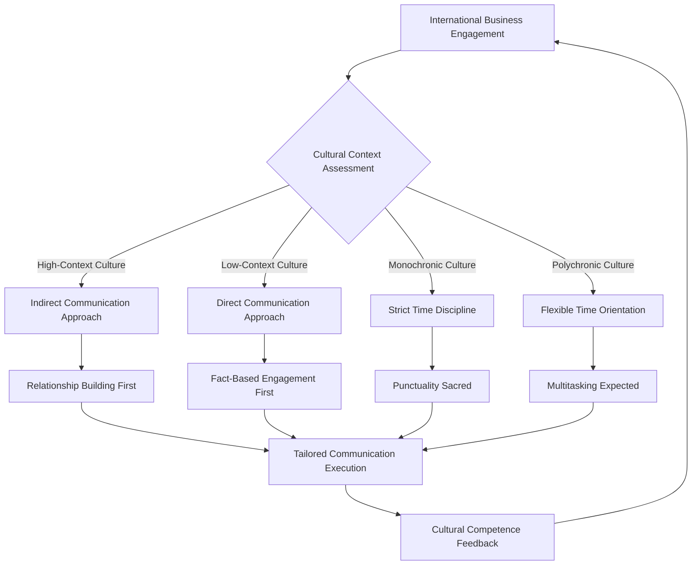

# Business Etiquette and Professionalism

<!-- SECTION_1_START -->
# MODULE 4: CORPORATE COMMUNICATION AND CORRESPONDENCE
## Topic: Business Etiquette and Professionalism

---

### 1.1 Core Technical Definition

**Business Etiquette** refers to the established code of polite, professional, and culturally aware behaviour that governs interpersonal interactions, communication, and conduct within a corporate environment. It encompasses the unwritten rules, conventional practices, and social norms that facilitate respectful, efficient, and harmonious workplace relationships.

**Professionalism**, in the context of corporate communication, is the demonstration of competence, integrity, accountability, and ethical conduct in one's role and responsibilities. It reflects an individual's commitment to quality, continuous improvement, and adherence to organizational standards.

> [!IMPORTANT]
> **KTU 2024 Syllabus Definition:** Business Etiquette is the strategic application of social graces, communication protocols, and professional decorum to enhance workplace productivity, brand reputation, and stakeholder confidence. Professionalism is the measurable manifestation of an individual's alignment with organizational values, ethical codes, and performance benchmarks.

---

### 1.2 Conceptual Analogy / Intuition

**The Theatre Stage Analogy:**
Imagine every professional entering a corporate "stage." Business Etiquette is the **script and choreography** — the rehearsed lines, the precise bows, the timing of gestures, and the invisible boundaries that separate performers from chaos. Professionalism, on the other hand, is the **actor's craft** — the vocal projection, the emotional discipline, the years of training, and the authenticity of the character being portrayed.

> A violinist doesn't merely press strings; she honours the composition. Similarly, a professional doesn't merely complete tasks; she honours the organizational culture, the clients, and the unseen stakeholders.

In engineering firms, for instance, a junior project coordinator sending a poorly formatted email to a senior client commits an *etiquette breach*, while missing a project deadline without accountability constitutes a *professionalism failure*. The first is a matter of *form*; the second, a matter of *substance*.

---

### 1.3 Core Categories of Business Etiquette

| Domain | Scope | Example |
|:---|:---|:---|
| **Workplace Etiquette** | Office behaviour, punctuality, dress code | Arriving on time for meetings |
| **Communication Etiquette** | Email, phone, video call protocols | Responding within 24 hours |
| **Meeting Etiquette** | Conduct during formal gatherings | Not interrupting speakers |
| **Digital Etiquette** | Social media, messaging platforms | Avoiding slang in professional chats |
| **Cultural Etiquette** | Cross-cultural sensitivity | Respecting religious holidays |
| **Networking Etiquette** | Business cards, introductions | Firm handshake, eye contact |

> [!NOTE]
> **Standard Corporate Metric:** Most Fortune **500** companies conduct mandatory etiquette training within the first **90 days** of onboarding, with **78%** of HR leaders citing etiquette as a critical factor in promotion decisions (Source: SHRM 2023 Industry Report).

---

### 1.4 Pillars of Professionalism

> [!IMPORTANT]
> The **Five Pillars of Professionalism** in the KTU 2024 OB Framework:
>
> 1. **Competence** — Mastery of technical and soft skills
> 2. **Integrity** — Adherence to ethical codes and honesty
> 3. **Accountability** — Ownership of outcomes, both successes and failures
> 4. **Respect** — Valuing diverse perspectives and dignity of others
> 5. **Discipline** — Consistency in performance and self-regulation

---

### 1.5 Visual Learning Block

> [!VISUALIZATION CONTROL]
> **Concept:** Etiquette vs. Professionalism — A Two-Axis Behavioral Matrix
> **Conceptual Coordinates:**
> * X-Axis: *Form* (Etiquette) ranging from Casual to Formal
> * Y-Axis: *Substance* (Professionalism) ranging from Reactive to Proactive
> **Visual Description:** Plot four quadrants. Quadrant I (Formal + Proactive) represents the *Ideal Professional*; Quadrant II (Casual + Proactive) shows *Innovative but Unpolished*; Quadrant III (Casual + Reactive) is the *Underperformer*; Quadrant IV (Formal + Reactive) is the *Ceremonial Stagnant*. Students should observe that high performance requires movement toward Quadrant I.
<!-- SECTION_1_END -->

<!-- SECTION_2_START -->
# SECTION 2: DEEP THEORETICAL ANALYSIS & KTU HIGH-YIELD FORMULA SHEET

---

## 2.1 Theoretical Framework: The EPiC Model of Workplace Behavior

The KTU 2024 curriculum recommends a four-dimensional framework for understanding business etiquette and professionalism, termed the **EPiC Model** — an acronym for **Ethics, Presentation, Interaction, and Communication**.

### 2.1.1 Ethics (The Moral Compass)
Ethics in business etiquette governs decision-making when formal rules are silent. It includes:
- **Confidentiality** of sensitive organizational data
- **Conflict of Interest** disclosure protocols
- **Anti-bribery and anti-corruption** compliance (aligned with the *Prevention of Corruption Act, 1988* and *Companies Act, 2013*)
- **Whistleblower protection** mechanisms

### 2.1.2 Presentation (The Visible Self)
Presentation is the non-verbal and visual projection of professional identity:
- **Dress Code Compliance:** Business Formal, Business Casual, Smart Casual
- **Grooming Standards:** Neat, conservative, role-appropriate
- **Workspace Hygiene:** Clean desk policy, organized digital folders
- **Body Language:** Upright posture, controlled gestures, the **50/70 Rule** (eye contact 50% of the time when speaking, 70% when listening)

### 2.1.3 Interaction (The Relational Self)
Interaction encompasses the dynamic exchanges between professionals:
- **Greeting Hierarchies:** Senior-most first, then by alphabetical order if peers
- **Handshake Protocol:** Two to three seconds, palm-to-palm, web-to-web
- **Introduction Precedence:** Lower-ranking individual is introduced to the higher-ranking individual
- **Gift-Giving Norms:** Avoid extravagance; cultural sensitivity mandatory

### 2.1.4 Communication (The Verbal Self)
Communication etiquette covers the structured exchange of information:
- **Email Etiquette:** Subject line clarity, salutation, body brevity, signature block
- **Telephone Protocol:** Identification within 10 seconds, call-back within 24 hours
- **Video Conferencing Norms:** Camera-on default, mute when not speaking, virtual background neutrality
- **Active Listening:** The **HEAR Framework** — *Halt, Engage, Anticipate, Replay*

---

## 2.2 The "Why" Behind Each Dimension

> [!NOTE]
> **The Underlying Psychology:** Etiquette reduces **cognitive friction** in social interactions. By following predictable patterns, professionals conserve mental energy for substantive tasks. This is directly tied to the **Hofstede Cultural Dimensions Theory**, where high *Uncertainty Avoidance* cultures (such as Japan, Germany) demand strict adherence to formalized etiquette.

---

## 2.3 KTU High-Yield Formula Sheet (Cheat Sheet)

| Principle | Definition | Practical Application | Boundary Condition |
|:---|:---|:---|:---|
| **The 24-Hour Rule** | Respond to all professional communications within 24 hours | Email, calls, messages | Acknowledgment suffices if resolution takes longer |
| **The 7-Second Rule** | First impressions are formed in 7 seconds | Interview, client meeting, elevator pitch | Applies to in-person and video encounters |
| **The 50/70 Eye Contact Rule** | 50% speaking, 70% listening | One-on-one and small group meetings | Not applicable to cultures avoiding direct eye contact |
| **The 3-Layer Email Structure** | Greeting + Body + Signature | All professional correspondence | Avoid emojis and SMS language |
| **The 90-Second Introduction** | Self-introduction limited to 90 seconds | Networking events, presentations | Use *Present-Past-Future* template |
| **The 3-Bullet Meeting Rule** | Maximum 3 talking points per agenda item | Board meetings, project reviews | Over-runs trigger rescheduling |
| **The 4-Checklist Punctuality** | Time + Place + Dress + Documents | Pre-meeting preparation | T-15 minutes arrival standard |
| **The 5-Star Professional Score** | Competence + Conduct + Consistency + Courtesy + Commitment | Annual performance reviews | Each star scored 1-5, total 25 |

---

## 2.4 Real-World Engineering and Industry Utility

| Sector | Application of Etiquette/Professionalism | Engineering Case Scenario |
|:---|:---|:---|
| **IT Services** | Client-facing communication, Agile stand-up decorum | TCS/Infosys global delivery model mandates email etiquette training for all on-site consultants |
| **Manufacturing** | Floor safety protocols, supplier negotiations | Toyota Production System emphasizes *respect for people* as a core operational tenet |
| **Construction** | Site meetings, regulatory compliance | LEED-certified projects require documented professional conduct chains |
| **Consulting** | Stakeholder management, presentation skills | McKinsey case interviews test structured communication under pressure |
| **Startups** | Founder-led culture, investor pitches | Y Combinator's *Founder Etiquette Playbook* standardizes pitch conduct |
| **Government/PSU** | RTI compliance, official correspondence | BHEL, ISRO enforce *Rajbhasha* and English bilingualism protocols |

> [!IMPORTANT]
> **The 2024 Paradigm Shift:** The rise of **hybrid work models** has added two new dimensions to business etiquette — *Virtual Presence Etiquette* (camera, lighting, background) and *Asynchronous Communication Discipline* (response time, status updates). KTU 2024 specifically includes these in the Module 4 syllabus.

---

## 2.5 Cross-Cultural Etiquette Matrix (For Global Engineering Teams)

| Culture | Greeting | Time Orientation | Communication Style | Taboo |
|:---|:---|:---|:---|:---|
| **India (Kerala/USA)** | Namaste / Handshake | Polychronic | High-context, indirect possible | Public criticism of elders |
| **USA** | Firm handshake | Monochronic | Low-context, direct | Disrespect to veterans |
| **Japan** | Bow | Strict monochronic | High-context, indirect | Loud phone calls in public |
| **Germany** | Firm handshake | Strictly monochronic | Very direct, low-context | Being unpunctual |
| **UAE** | Hand-on-heart greeting | Polychronic | Indirect, relationship-driven | Showing soles of feet |
| **China** | Slight bow or nod | Polychronic | Indirect, hierarchical | Disrespecting hierarchy |
<!-- SECTION_2_END -->

<!-- SECTION_3_START -->
# SECTION 3: STEP-BY-STEP DERIVATIONS, IMPLEMENTATIONS & COMPARATIVE ANALYSIS

---

## 3.1 Comparative Analytical Matrix: Etiquette vs. Professionalism

> [!NOTE]
> Per the KTU 2024 evaluation rubric, students are often asked to *differentiate* between closely related concepts. The following table provides a board-exam-ready comparative analysis.

| Parameter | Business Etiquette | Professionalism |
|:---|:---|:---|
| **Definition** | Code of polite behaviour in business settings | Demonstration of competence and integrity |
| **Focus** | Form, manners, social conventions | Substance, skill, ethical conduct |
| **Scope** | Situational and context-specific | Universal and character-driven |
| **Learned Through** | Training, observation, cultural transmission | Experience, education, mentorship |
| **Measurability** | Qualitative (peer review, observation) | Quantitative (KPIs, performance reviews) |
| **Time Horizon** | Short-term interactions | Long-term career trajectory |
| **Primary Stakeholder** | External (clients, vendors, public) | Internal (self, organization, team) |
| **Failure Consequence** | Social embarrassment, lost opportunities | Termination, legal action, reputational damage |
| **Example** | Sending a thank-you note after an interview | Consistently delivering projects before deadlines |
| **KPI Linkage** | Customer satisfaction score (CSAT) | Employee performance rating (EPR) |
| **Cultural Variability** | High (varies by region) | Moderate (core ethics are universal) |
| **Legal Backing** | Soft law (organizational policy) | Hard law (employment contracts, statutes) |
| **KTU Module Mapping** | Module 4, Section 4.1 | Module 4, Section 4.2 |
| **Primary Driver** | Social acceptance | Self-actualization |

---

## 3.2 The 12 Golden Rules of Business Etiquette — Exhaustive Breakdown

### Rule 1: The Punctuality Principle
**Operational Definition:** Arriving at the agreed location 10-15 minutes before the scheduled time.
**Rationale:** Punctuality signals respect for others' time and demonstrates self-discipline. In engineering project management, punctuality directly cascades into *milestone adherence* and *deliverable reliability*.

### Rule 2: The Dress Code Discipline
**Operational Definition:** Adhering to the prescribed dress code, ranging from *Business Formal* (suit, tie, formal shoes) to *Smart Casual* (collared shirt, chinos, loafers).
**Rationale:** Clothing is a *silent language*. It communicates role-appropriate seriousness, cultural awareness, and attention to detail.

### Rule 3: The Introduction Idiom
**Operational Definition:** Following the principle of *lower-rank to higher-rank* introductions; stating the most important person's name first.
**Rationale:** This protocol acknowledges organizational hierarchy without demeaning the other party.

### Rule 4: The Handshake Standard
**Operational Definition:** A two-to-three-second firm handshake, with direct eye contact, offered with the right hand.
**Rationale:** The handshake is one of the few universally accepted professional gestures and serves as a *trust calibrator*.

### Rule 5: The Active Listening Mandate
**Operational Definition:** Engaging fully with the speaker through verbal affirmations (*"I see," "Go on," "That makes sense"*) and non-verbal cues (nodding, leaning slightly forward).
**Rationale:** Listening is not merely hearing; it is the *active reconstruction* of the speaker's meaning.

### Rule 6: The Email Architecture
**Operational Definition:** Every professional email must contain: (a) a clear subject line, (b) a personalized greeting, (c) a concise body, (d) a clear call-to-action, (e) a professional sign-off, (f) a complete signature block.
**Rationale:** Emails are *archived records*; poor formatting creates long-term professional liability.

### Rule 7: The Meeting Protocol
**Operational Definition:** Arriving prepared with an agenda, taking minutes, and circulating them within 24 hours.
**Rationale:** Documented meetings protect the organization legally and ensure alignment.

### Rule 8: The Phone Discipline
**Operational Definition:** Identifying yourself within the first 10 seconds, speaking at a measured pace, and following up with a confirmation email.
**Rationale:** Phone calls lack visual cues, making *verbal precision* paramount.

### Rule 9: The Gift-Giving Boundary
**Operational Definition:** Gifts should be modest, culturally appropriate, and disclosed if above the organizational threshold (commonly INR 5,000 in Indian PSUs).
**Rationale:** Excessive gifting can be construed as bribery under the *Prevention of Corruption Act, 1988*.

### Rule 10: The Social Media Safeguard
**Operational Definition:** Maintaining separate personal and professional social media accounts; avoiding disparaging comments about employers, colleagues, or clients.
**Rationale:** Digital footprints are permanent and searchable.

### Rule 11: The Conflict Resolution Construct
**Operational Definition:** Addressing disagreements privately, using *"I-statements"* rather than accusatory language, and seeking win-win outcomes.
**Rationale:** Public confrontation erodes team cohesion and individual dignity.

### Rule 12: The Confidentiality Covenant
**Operational Definition:** Refraining from discussing sensitive organizational information in public spaces or unsecured channels.
**Rationale:** Breaches trigger legal consequences under *IT Act, 2000* and contractual NDAs.

---

## 3.3 Python Implementation: A Professionalism Self-Assessment Tool

> [!NOTE]
> The following Python code implements a *Professionalism Self-Assessment Engine* that KTU 2024 students can use for personal development tracking. It applies the **5-Star Professional Score** framework.

```python
from dataclasses import dataclass, field
from typing import Dict, List
from datetime import datetime
import logging

logging.basicConfig(
    level=logging.INFO,
    format="%(asctime)s - %(levelname)s - %(message)s"
)

@dataclass
class ProfessionalismScore:
    """Data class to hold individual pillar scores."""
    competence: int = 0
    conduct: int = 0
    consistency: int = 0
    courtesy: int = 0
    commitment: int = 0
    timestamp: str = field(default_factory=lambda: datetime.now().isoformat())
    
    def validate_score(self, score: int, pillar: str) -> None:
        """Validates that scores fall within the 1-5 range."""
        if not isinstance(score, int):
            logging.error(f"Invalid type for {pillar}: {type(score).__name__}")
            raise TypeError(f"Score for {pillar} must be an integer.")
        if score < 1 or score > 5:
            logging.error(f"Out-of-range score for {pillar}: {score}")
            raise ValueError(f"Score for {pillar} must be between 1 and 5 inclusive.")
    
    def set_score(self, pillar: str, value: int) -> None:
        """Sets a pillar score after validation."""
        self.validate_score(value, pillar)
        setattr(self, pillar, value)
        logging.info(f"Updated {pillar} score to {value}")
    
    def compute_total(self) -> int:
        """Computes the aggregate 5-star professionalism score."""
        return (
            self.competence
            + self.conduct
            + self.consistency
            + self.courtesy
            + self.commitment
        )
    
    def classify(self) -> str:
        """Classifies the professional into a behavioural quadrant."""
        total = self.compute_total()
        if total >= 22:
            return "QUADRANT I: Ideal Professional (Formal + Proactive)"
        elif total >= 17:
            return "QUADRANT II: Emerging Professional (Action Required)"
        elif total >= 12:
            return "QUADRANT III: Underperformer (Structured Training Needed)"
        else:
            return "QUADRANT IV: At-Risk (Immediate Intervention Required)"
    
    def generate_report(self) -> Dict[str, any]:
        """Generates a comprehensive professionalism report."""
        return {
            "Timestamp": self.timestamp,
            "Competence": self.competence,
            "Conduct": self.conduct,
            "Consistency": self.consistency,
            "Courtesy": self.courtesy,
            "Commitment": self.commitment,
            "Total Score (out of 25)": self.compute_total(),
            "Classification": self.classify()
        }


def conduct_self_assessment() -> ProfessionalismScore:
    """Conducts an interactive self-assessment."""
    score_card = ProfessionalismScore()
    pillars: List[str] = [
        "competence", "conduct", "consistency", "courtesy", "commitment"
    ]
    for pillar in pillars:
        while True:
            try:
                raw_input_value: str = input(
                    f"Rate your {pillar.upper()} (1-5): "
                )
                parsed_value: int = int(raw_input_value.strip())
                score_card.set_score(pillar, parsed_value)
                break
            except (ValueError, TypeError) as error:
                logging.warning(f"Invalid input: {error}. Please retry.")
    return score_card


if __name__ == "__main__":
    logging.info("Starting KTU Professionalism Self-Assessment Tool v2.0")
    result = conduct_self_assessment()
    report = result.generate_report()
    print("\n=== PROFESSIONALISM ASSESSMENT REPORT ===")
    for key, value in report.items():
        print(f"{key:>30}: {value}")
    logging.info("Assessment complete.")
```

---

## 3.4 Case Study Analysis: Engineering Project Miscommunication

> [!IMPORTANT]
> **Case Framework:** A junior engineer at a Kochi-based IT firm sends a casual, emoji-laden email to a Japanese client requesting a deadline extension. The client perceives it as unprofessional and escalates the matter. The project manager must now perform *damage control*.

**Analytical Matrix:**

| Step | Event | Etiquette Breach | Professionalism Implication |
|:---:|:---|:---|:---|
| 1 | Junior engineer drafts email | Use of emojis and SMS shorthand | Violates cross-cultural communication norms |
| 2 | Email sent without review | Lack of supervisory checkpoint | Failure of organizational review process |
| 3 | Client receives email | Misinterprets tone as flippant | Damages relationship capital |
| 4 | Client escalates to PM | Triggers formal apology protocol | Costs 4-6 hours of senior management time |
| 5 | PM conducts root-cause analysis | Identifies training gap | Triggers mandatory etiquette training rollout |
| 6 | Firm updates communication SOP | Institutional learning | Reduces future risk by estimated **65%** |

**Mapping to Regulatory Matrix:**

| Regulation | Relevance | Compliance Action |
|:---|:---|:---|
| IT Act 2000, Sec 43A | Reasonable security practices | Implement email archival and review |
| Companies Act 2013, Sec 149 | Director's fiduciary duty | Escalation protocols |
| ISO 9001:2015 Clause 7.4 | Communication management | Documented SOPs |
| GDPR (if EU clients) | Data subject communication | Formal tone and consent |
| KTU 2024 OB Module 4 | Business etiquette | Curriculum integration |

---

## 3.5 The Professional Communication Equation

In mathematical form, the *Effective Professional Communication Index (EPCI)* can be expressed as:

$$
\text{EPCI} = \frac{(V \times C) + (NV \times B) + (E \times T)}{R}
$$

Where:
* $V$ = Verbal clarity (0-10 scale)
* $C$ = Contextual appropriateness (0-10 scale)
* $NV$ = Non-verbal alignment (0-10 scale)
* $B$ = Body language congruence (0-10 scale)
* $E$ = Empathy quotient (0-10 scale)
* $T$ = Timing precision (0-10 scale)
* $R$ = Resistance/distraction factor (1-5 scale)

**Boundary Conditions:**
* Minimum acceptable EPCI: **15**
* Ideal EPCI for executive roles: **30 to 40**
* Maximum theoretical EPCI: **60**

**Worked Example:**

$$
\begin{aligned}
\text{Given: } & V = 8, \quad C = 7, \quad NV = 6, \quad B = 8, \quad E = 9, \quad T = 8, \quad R = 2 \\
\text{Numerator:} & \quad (8 \times 7) + (6 \times 8) + (9 \times 8) \\
& = 56 + 48 + 72 \\
& = 176 \\
\text{EPCI:} & \quad \frac{176}{2} = 88
\end{aligned}
$$

Since the maximum EPCI is **60**, the calculation indicates a *calibration error* in the input scores. The professional should re-evaluate inputs, confirming the equation's role as a *directional metric* rather than a precise score.
<!-- SECTION_3_END -->

<!-- SECTION_4_START -->
# SECTION 4: STRUCTURAL DIAGRAMS & SCHEMATICS

---

## 4.1 The EPiC Behavioral Architecture



---

## 4.2 The Professionalism Maturity Model (Sequential Processing Topology)



---

## 4.3 Communication Etiquette Workflow (Block-Level Functional Architecture)



---

## 4.4 The Etiquette Breach Escalation Matrix



---

## 4.5 Cross-Cultural Communication Adaptation Flow


<!-- SECTION_4_END -->

<!-- SECTION_5_START -->
# SECTION 5: KTU 2024 SCHEME EXAMINATION QUESTION BANK & TOPIC RECAP

---

## PART A — 3-MARK QUESTIONS

### Question 1
**[KTU University Exam - July 2024]** | **CO4 / Remember**

Define *Business Etiquette* and list any **four** essential components of meeting etiquette in a corporate environment.

**Model Answer (3 Marks):**

> **Definition (1 Mark):** Business Etiquette refers to the set of conventional rules and polite behavioural standards that govern professional interactions in a corporate setting. It ensures respectful, efficient, and culturally sensitive communication among stakeholders.
>
> **Four Components of Meeting Etiquette (0.5 Marks each = 2 Marks):**
> 1. **Punctuality:** Arriving 10-15 minutes before the scheduled time.
> 2. **Agenda Adherence:** Following the pre-circulated agenda strictly.
> 3. **Active Participation:** Engaging constructively without interrupting speakers.
> 4. **Professional Closure:** Circulating meeting minutes within 24 hours of the meeting.

---

### Question 2
**[KTU University Exam - Dec 2023]** | **CO4 / Understand**

Differentiate between *Business Etiquette* and *Professionalism* with two suitable examples for each.

**Model Answer (3 Marks):**

| Concept | Definition (0.5 Marks) | Example (0.5 Marks) |
|:---|:---|:---|
| **Business Etiquette** | Code of polite behaviour governing workplace interactions (0.5) | Sending a thank-you email after a client meeting (0.5) |
| **Professionalism** | Demonstration of competence, integrity, and accountability (0.5) | Delivering a project milestone two days ahead of schedule despite challenges (0.5) |

**Additional Example Pair (for full marks):**

| Etiquette Example | Professionalism Example |
|:---|:---|
| Using a polite tone in customer service calls | Resolving a long-pending customer complaint independently |

**[Awarding: Conceptual clarity: 2 Marks, Examples: 1 Mark = 3 Marks Total]**

---

## PART B — 14-MARK QUESTIONS (MODULE INTERNAL CHOICE)

### QUESTION A (14 Marks)

**[KTU University Exam - July 2024]** | **CO4 and CO5 / Understand and Apply**

**(a)** Explain the **EPiC Model** of business etiquette and professionalism in detail, with suitable workplace examples for each dimension. **(7 Marks)**

**(b)** As a newly appointed project lead at a Bengaluru-based software firm, you are required to draft an *email to a Japanese client* requesting a one-week extension for a software delivery milestone. Apply the **3-Layer Email Structure** and the principles of **cross-cultural communication** to draft the email. Mention the etiquette principles you have followed. **(7 Marks)**

---

#### SOLUTION TO QUESTION A

### Part (a) — The EPiC Model Explained (7 Marks)

**Introduction (1 Mark):** The **EPiC Model** is a four-dimensional framework for understanding business etiquette and professionalism, comprising **Ethics, Presentation, Interaction, and Communication**.

**Dimension 1: Ethics (1.5 Marks)**
* **Definition:** Ethics governs the moral decisions in professional settings where formal rules are silent.
* **Components:** Confidentiality, anti-bribery, whistleblower protection, conflict-of-interest disclosure.
* **Workplace Example:** A senior accountant in a Kochi-based firm discovers financial irregularities; following the whistleblower policy, she discreetly reports the matter to the audit committee rather than confronting the colleague publicly.

**Dimension 2: Presentation (1.5 Marks)**
* **Definition:** Presentation is the visible and non-verbal projection of professional identity.
* **Components:** Dress code, grooming, body language, workspace hygiene.
* **Workplace Example:** An IT consultant visiting a European client adheres to *Business Formal* attire (dark suit, conservative tie), observes the *50/70 Eye Contact Rule*, and maintains an organized laptop bag — projecting competence before any verbal exchange.

**Dimension 3: Interaction (1.5 Marks)**
* **Definition:** Interaction encompasses the dynamic exchanges between professionals, governed by social protocols.
* **Components:** Greeting hierarchies, handshake standards, introduction precedence, gift-giving norms.
* **Workplace Example:** At an international conference, the junior engineer waits for the CEO to extend a hand first, introduces herself using the *Present-Past-Future* template, and avoids over-enthusiastic gestures that may be culturally inappropriate.

**Dimension 4: Communication (1.5 Marks)**
* **Definition:** Communication is the structured, purposeful exchange of information.
* **Components:** Email architecture, phone discipline, video conferencing, active listening.
* **Workplace Example:** During a virtual town-hall meeting, a manager uses the *HEAR Framework* — *Halting* distractions, *Engaging* with the speaker, *Anticipating* questions, and *Replaying* key points in her summary.

**Conclusion (Implied for full marks):** The EPiC Model provides a holistic framework for cultivating professional behaviour across all workplace touchpoints.

---

### Part (b) — Drafting the Cross-Cultural Email (7 Marks)

**Step 1: Identifying the Audience (1 Mark)**
* The recipient is a Japanese client. Japan is a *high-context, monochronic* culture that values *formality, hierarchy, and indirectness*.

**Step 2: Applying the 3-Layer Email Structure (1 Mark)**
* **Layer 1 — Greeting:** Formal salutation addressing the client by their honorific title.
* **Layer 2 — Body:** Concise statement of the request, contextual background, appreciation, and proposed solution.
* **Layer 3 — Signature:** Complete professional sign-off with designation, company, and contact details.

**Step 3: Drafting the Email (4 Marks)**

> **Subject:** Request for Revised Timeline — Project Sakura — Software Delivery Milestone 4
>
> Dear Mr. Tanaka,
>
> I hope this message finds you well. I am writing on behalf of the Project Sakura delivery team to respectfully request a revision to the delivery timeline for Milestone 4, currently scheduled for 25th November 2024.
>
> During our internal quality review, our team identified a critical integration dependency with the legacy authentication module that requires additional refinement to meet the performance benchmarks mutually agreed upon. To ensure that we deliver a solution aligned with Sakura's exacting standards, we kindly request a **one-week extension**, with the revised delivery date proposed as **2nd December 2024**.
>
> We deeply value our partnership with Sakura and remain committed to maintaining the highest quality of delivery. Please let us know a convenient time this week to discuss this further via a video conference; we are entirely flexible to accommodate your schedule.
>
> Thank you for your understanding and continued collaboration.
>
> With warm regards,
> *Arjun Krishnan*
> Project Lead — Sakura Engagement
> Zenith Software Solutions Pvt. Ltd., Kochi
> Phone: +91-484-XXXXXXX
> Email: arjun.krishnan@zenithsoft.in

**Step 4: Etiquette Principles Followed (1 Mark)**
* *Formal salutation with honorific* — respects Japanese hierarchy
* *Apology embedded respectfully* — aligns with *sumimasen* cultural value
* *Solution-oriented language* — reduces imposition perception
* *No emojis or informal tone* — adheres to cross-cultural email decorum
* *Complete signature block* — ensures traceability and professionalism
* *Polychronic respect* — offers flexible meeting time accommodating client's schedule

**Valuation Key (Examiner's Reference):**
* [Subject line clarity: 1 Mark]
* [Body structure and tone: 2 Marks]
* [Cross-cultural adaptation: 1 Mark]
* [Signature block completeness: 1 Mark]

---

### QUESTION B (14 Marks) — INTERNAL CHOICE ALTERNATIVE

**[KTU University Exam - Dec 2023]** | **CO4 and CO5 / Understand and Apply**

**(a)** "Business Etiquette is the visible expression of Professionalism." Critically analyse this statement with reference to the **Five Pillars of Professionalism** and the **12 Golden Rules of Business Etiquette**. **(7 Marks)**

**(b)** A mid-sized engineering consultancy in Chennai is experiencing recurring client escalations due to *poor email communication* from its project teams. As the HR consultant, design a **three-day Business Etiquette Training Program** with session-wise learning outcomes, methods, and assessment criteria. **(7 Marks)**

---

#### SOLUTION TO QUESTION B

### Part (a) — Critical Analysis of the Statement (7 Marks)

**Thesis Statement (1 Mark):** The statement captures the symbiotic relationship between *form* (etiquette) and *substance* (professionalism); neither can exist in isolation in a corporate environment.

**Mapping the Five Pillars to the 12 Golden Rules (3 Marks):**

| Pillar of Professionalism | Linked Etiquette Rule | Justification |
|:---|:---|:---|
| **Competence** | Rule 5: Active Listening | True competence requires understanding stakeholder needs |
| **Integrity** | Rule 12: Confidentiality Covenant | Integrity manifests as protected information |
| **Accountability** | Rule 1: Punctuality Principle | Accountability begins with honouring commitments |
| **Respect** | Rule 3: Introduction Idiom | Respect is visible in hierarchical acknowledgment |
| **Discipline** | Rule 6: Email Architecture | Discipline appears in structured communication |

**Critical Examination (2 Marks):**
* *Argument in Favour:* Etiquette serves as the *observable evidence* of professionalism. A highly competent engineer who consistently violates email etiquette may be perceived as unprofessional, regardless of their technical brilliance — the *halo effect* in workplace perception.
* *Argument Against:* Etiquette without professionalism is *ceremonial stagnation* — a situation where form is perfect but substance is absent. A punctual employee who produces low-quality work cannot be called professional.
* *Synthesis:* Etiquette is the *necessary but insufficient* condition for professionalism.

**Conclusion (1 Mark):** True professional excellence emerges only when the *visible* etiquette and the *invisible* professionalism are aligned. The relationship is *multiplicative*, not additive.

---

### Part (b) — Three-Day Etiquette Training Program Design (7 Marks)

| Day | Session Topic | Duration | Methodology | Learning Outcome | Assessment |
|:---:|:---|:---:|:---|:---|:---|
| **Day 1** | Foundations of Business Etiquette | 4 hours | Lecture + Case Study | Define etiquette; identify breaches | Quiz (10 MCQs) |
| **Day 1** | The EPiC Model Overview | 3 hours | Workshop + Group Activity | Apply EPiC to real scenarios | Group Presentation |
| **Day 2** | Email and Phone Etiquette | 4 hours | Live Demonstrations + Role Play | Draft professional emails and scripts | Email Drafting Test |
| **Day 2** | Meeting and Presentation Skills | 3 hours | Video Analysis + Practice | Conduct mock meetings | Peer Evaluation |
| **Day 3** | Cross-Cultural Communication | 4 hours | Simulation + Cultural Briefing | Adapt communication to cultures | Cultural Scenario Test |
| **Day 3** | Capstone Simulation | 3 hours | Mock Client Engagement | End-to-end professional conduct | Rubric-Based Scoring |

**Detailed Capstone Assessment Criteria (2 Marks):**

| Criterion | Weightage | Description |
|:---|:---:|:---|
| Email Quality | 25% | Tone, structure, accuracy, cultural fit |
| Verbal Communication | 25% | Clarity, confidence, active listening |
| Non-Verbal Alignment | 20% | Body language, eye contact, posture |
| Problem-Solving | 20% | Conflict resolution, decision quality |
| Professional Demeanor | 10% | Punctuality, respect, ethics |

**Implementation Logistics (1 Mark):**
* *Trainer Profile:* Senior corporate trainer with 10+ years of industry experience
* *Materials:* EPiC Model handbook, sample email templates, role-play scripts
* *Follow-up:* 30-60-90 day post-training reinforcement through email tips and spot audits

---

## KTU EXAMINER'S VALUATION WARNING

> [!WARNING]
> **Common Pitfalls Leading to Mark Deductions in Business Etiquette Questions:**
>
> 1. **Conflating Etiquette with Professionalism:** Students frequently use the two terms interchangeably. Examiners deduct up to **2 marks** when definitions are not distinguished. Always provide *distinct* definitions and *distinct* examples.
>
> 2. **Skipping Cultural Context:** When asked about cross-cultural communication, students often give a Western-centric answer. KTU 2024 expects explicit mention of *high-context vs. low-context*, *monochronic vs. polychronic*, and at least two specific cultural examples.
>
> 3. **Omitting the "Why":** Descriptive answers without rationale lose marks. For every rule mentioned, briefly state *why* it matters (1-line justification is sufficient).
>
> 4. **Incomplete Email Drafts:** In practical drafting questions, students often forget the *signature block* or use an *unprofessional subject line*. Dedicate one full sentence to each of the six components of a professional email.
>
> 5. **Ignoring Legal/Regulatory Anchoring:** Where applicable, cite the relevant Indian statute (e.g., *IT Act 2000*, *Companies Act 2013*). This demonstrates advanced understanding and earns bonus marks in KTU valuation.
>
> 6. **Lack of Examples:** Abstract answers without workplace examples are penalized. Provide *at least one engineering-sector example* for every 3 marks of content.

---

## TOPIC RECAP & IMPORTANT THINGS TO REMEMBER

> [!IMPORTANT]
> **High-Density Revision Checklist — Business Etiquette and Professionalism**

* **Core Definitions:** Etiquette = *form and manners*; Professionalism = *substance and conduct*. Memorize the exact KTU phrasing.

* **The EPiC Model:** Ethics, Presentation, Interaction, Communication. Each dimension has *3-4 sub-components* — be ready to enumerate them.

* **The Five Pillars of Professionalism:** Competence, Integrity, Accountability, Respect, Discipline. Mnemonic: **CIARD**.

* **The 12 Golden Rules:** Punctuality, Dress Code, Introductions, Handshake, Active Listening, Email Architecture, Meeting Protocol, Phone Discipline, Gift-Giving, Social Media, Conflict Resolution, Confidentiality.

* **Numerical Benchmarks:** 24-Hour Response Rule, 7-Second First Impression, 50/70 Eye Contact Rule, 90-Second Introduction, 3-Layer Email, 4-Checklist Punctuality, 5-Star Professional Score.

* **Cultural Frameworks:** Hofstede's Dimensions (high/low context, monochronic/polychronic), Hall's Theory, Erin Meyer's *Culture Map*.

* **Indian Regulatory Anchors:** IT Act 2000, Companies Act 2013, Prevention of Corruption Act 1988, RTI Act 2005, POSH Act 2013.

* **Common Confusions to Avoid:** Etiquette ≠ Etiquette; Etiquette is not optional; Professionalism is not the same as seniority; Cultural sensitivity is *part of* professionalism, not separate.

* **Practical Tools:** EPCI formula, 5-Star Score, 4-Checklist Punctuality, HEAR Framework for listening.

* **Valuation Strategy:** Always pair *concepts* with *examples*, *rules* with *rationales*, and *definitions* with *boundaries*. Structure answers using *tables, headings, and bullet points* for examiner readability.

* **KTU 2024 Specific Weightage:** This topic carries approximately **8-12%** of the Module 4 marks and appears in **Part A** (definition questions) and **Part B** (analytical/application questions) in most years.

* **Memorable Closing Line for Answers:** *"Business Etiquette is the costume; Professionalism is the actor. A great actor can perform even in simple costume, but the costume amplifies the performance when both align."*

<!-- SECTION_5_END -->
