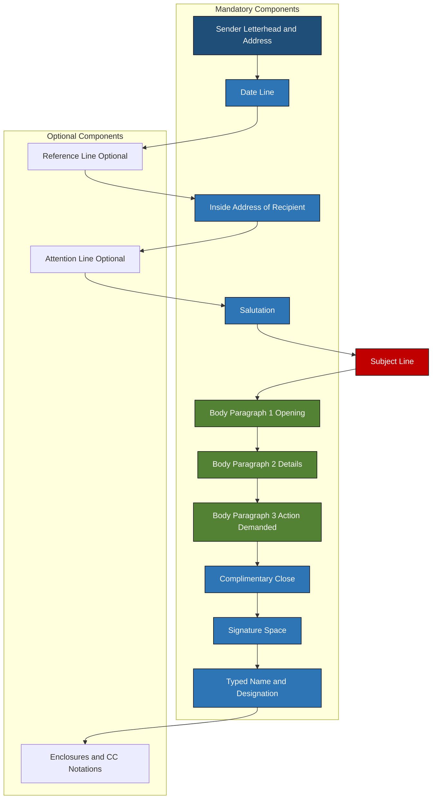
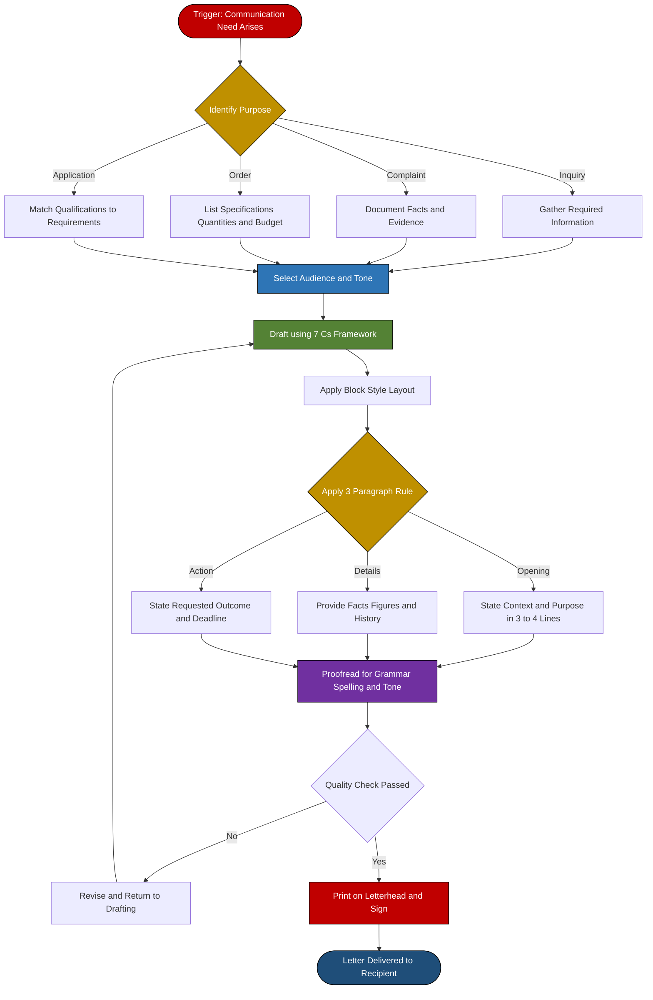

# Business Letters – Structure and Types

<!-- SECTION_1_START -->

# Business Letters – Structure and Types

## 1.1 Core Technical Definition

> [!IMPORTANT]
> **KTU Syllabus Definition (UEHUT803 – Module 4)**
> A **Business Letter** is a formal, written mode of professional communication exchanged between individuals, organizations, or institutions, conforming to a standardized structural layout (commonly the *Block Style* or *Modified Block Style*) prescribed by corporate correspondence conventions. It serves as a **legally valid, time-stamped, and permanently archived** record of commercial, administrative, or persuasive transactions conducted in the business ecosystem.

In the KTU 2024 Scheme framework, business correspondence is treated as a **Course Outcome (CO4)** deliverable, where students are expected to *"draft, analyze, and evaluate formal business documents using accepted corporate communication principles."*

### 1.2 Conceptual Analogy / Intuition

> [!NOTE]
> **Plain English Intuition — "The Formal Handshake on Paper"**
> Think of a business letter as a **professionally tailored suit of words**. Just as a suit has a collar, buttons, cuffs, and a pocket square placed in a universally recognized arrangement, a business letter has a *sender's address, date, inside address, salutation, body, closing, and signature* — each placed in a predictable, pre-defined position. When you walk into a bank, the manager does not need to guess whether you are a customer or a thief — your formal posture, ID, and appointment slip signal *intent* and *credibility* instantly. A business letter performs the **identical trust-building function** in written form.

To make it even more intuitive:

* **Sender's Address** = The *return address* on an envelope (so the receiver knows where to respond)
* **Inside Address** = The *name plate* on the recipient's desk
* **Salutation** = The *formal greeting* (like shaking hands)
* **Body** = The *actual conversation* taking place
* **Complimentary Close** = The *goodbye handshake*
* **Signature Block** = The *business card* you hand over at the end

> [!TIP]
> **Why this matters in KTU exams:** Examiners do **NOT** reward fancy vocabulary. They reward **structural accuracy, tone control, and adherence to the 7 C's** of business writing (*Clarity, Conciseness, Courtesy, Correctness, Consideration, Concreteness, Completeness*).

### 1.3 Physical Constants & Standard Metrics

| Metric | Standard Value |
|---|---|
| **Standard Business Letter Page** | **A4 (210 mm × 297 mm)** |
| **Recommended Font** | **Times New Roman 12 pt** or **Calibri 11 pt** |
| **Standard Margins** | **1 inch (2.54 cm) on all four sides** |
| **Line Spacing** | **Single (1.0) within paragraphs; Double (2.0) between sections** |
| **Block Style Alignment** | **Left-aligned throughout (no indentation)** |
| **Paragraph Length** | **3–5 sentences maximum** |
| **Word Count for Body** | **150–250 words (single page ideal)** |

### 1.4 Visualization Control

> [!VISUALIZATION CONTROL]
> **Concept:** Spatial Layout Map of a Standard Business Letter (Block Style)
> **Visualization Type:** Annotated Page Coordinate Map (conceptual schematic)
> **Visual Description:** Imagine a vertical A4 sheet divided into **six horizontal zones** stacked from top to bottom. The **first zone** (top ~2 cm) contains the *Sender's Return Address* aligned to the left. The **second zone** holds the *Date* (a single line). A **blank third zone** creates visual breathing space. The **fourth zone** contains the *Inside Address* of the recipient (3–4 lines). The **fifth zone** — the **largest** — holds the *Salutation, Subject Line, Body Paragraphs, and Complimentary Close*. The **sixth and final zone** at the bottom contains the *Signature Block* with the sender's name, designation, and organizational affiliation. Every textual element starts at the **left margin (x = 2.54 cm)** and stretches rightward; nothing is centered or right-aligned in pure Block Style.

<!-- SECTION_1_END -->

<!-- SECTION_2_START -->

# 2. Deep Theoretical Analysis & KTU High-Yield Formula Sheet

## 2.1 The Anatomical Decomposition of a Business Letter

A business letter is **not** a single monolithic block of text. It is a **highly modular artifact** composed of **twelve discrete structural components**, each with a non-negotiable functional role. Failing to include any one of them typically results in a **1–2 mark deduction** in KTU valuation.

> [!NOTE]
> **The 12 Structural Components (Mandatory Order)**

1. **Sender's Address / Letterhead** — Identifies the originator's organization
2. **Date Line** — Establishes the official timestamp (legal admissibility)
3. **Reference Line** — Optional but standard in government correspondence (e.g., `Ref: HR/2024/087`)
4. **Inside Address** — Recipient's full postal address
5. **Attention Line** — Optional (used when letter is addressed to a specific person within a department)
6. **Salutation** — Formal greeting (e.g., "Dear Sir/Madam,")
7. **Subject Line** — One-line capsule of the letter's purpose
8. **Body of the Letter** — The substantive content (3 paragraphs standard)
9. **Complimentary Close** — Phrase like "Yours sincerely," or "Yours faithfully,"
10. **Signature Space** — 4 blank lines for handwritten signature
11. **Typed Name and Designation** — Sender's printed identity
12. **Enclosures / CC Notations** — Indicating attached documents (e.g., `Encl: Resume.pdf`)

## 2.2 The 7 C's of Effective Business Correspondence

This is a **guaranteed KTU question** in either Part A or Part B. Memorize the table below with absolute precision.

> [!IMPORTANT]
> **The 7 C's Framework — Bedrock of KTU Business Communication Valuation**

| # | Principle | Definition | KTU Exam Example |
|---|---|---|---|
| **C1** | **Clarity** | Message is immediately understood; no ambiguity | *"We shall dispatch the consignment on **15 March 2025**"* (not "soon") |
| **C2** | **Conciseness** | No word wasted; every sentence earns its place | Avoid: *"We would like to inform you that we are in receipt of..."* → Use: *"We acknowledge receipt of..."* |
| **C3** | **Courtesy** | Respects the reader's perspective and emotions | *"Thank you for your prompt response."* |
| **C4** | **Correctness** | Accurate facts, grammar, spelling, and punctuation | No typos in date, amount, or recipient name |
| **C5** | **Consideration** | Reader-focused ("you" attitude) | Replace *"We have launched..."* with *"You can now benefit from..."* |
| **C6** | **Concreteness** | Specific facts and figures, not vague generalities | *"Sales rose by **18.5%**"* (not "sales increased significantly") |
| **C7** | **Completeness** | All required information is present; reader takes no follow-up call | Includes WHO, WHAT, WHEN, WHERE, WHY, HOW |

## 2.3 KTU High-Yield Formula Sheet

> [!TIP]
> **Business Letter Design Equation (Conceptual)**
> $$\text{Effective Letter Score} = \frac{(7\,C\text{'s Satisfied}) \times (\text{Structural Completeness})}{(\text{Length Penalty} + \text{Tone Violations})}$$
> Maximize numerator → maximize score. Keep denominator at zero.

### Structural Layout Cheat Sheet

| Zone | Component | Alignment | Spacing Rule |
|---|---|---|---|
| Top (Zone 1) | **Sender's Address** | Left / Centered on letterhead | Single line each |
| Zone 2 | **Date** | Left (Block) / Right (Modified Block) | One line below address |
| Zone 3 | **Inside Address** | Left | Blank line above |
| Zone 4 | **Salutation** | Left | Ends with colon (formal) |
| Zone 5 | **Subject Line** | Left (often **bold + underlined**) | Preceded by `Re:` or `Subject:` |
| Zone 6 | **Body** | Left, justified or left-aligned | 3 paragraphs: Opening, Purpose, Action |
| Zone 7 | **Complimentary Close** | Left (Block) / Centered (Modified Block) | Ends with comma |
| Zone 8 | **Signature Block** | Left (Block) | 4 blank lines for signature |
| Zone 9 | **Enclosures / CC** | Left | Last line of the letter |

## 2.4 Real-World Utility in Engineering & Business

Business letters are **not** obsolete in the digital age. They remain the **gold standard** in the following scenarios:

* **Legal Notices & Contracts** — Email is rarely admissible; printed signed letters are
* **Government Tenders & Bids** — Engineering firms submit bid letters on letterhead
* **Complaint Escalation** — Moving from email complaint to formal letter signals *serious intent*
* **Job Applications (KTU Placement Cell Context)** — Cover letters accompanying resumes
* **Order Placement & Invoice Disputes** — Inter-organization procurement
* **Memoranda of Understanding (MoUs)** — Initial letter of intent precedes the formal MoU

> [!NOTE]
> **Industry Insight:** A 2024 survey by the **Society for Human Resource Management (SHRM)** found that **67% of hiring managers** in the engineering sector still expect a formal cover letter, and **89% consider its quality** a deciding factor in shortlisting candidates.

<!-- SECTION_2_END -->

<!-- SECTION_3_START -->

# 3. Step-by-Step Derivations, Drafting Walkthroughs & Comparative Analysis

## 3.1 Exhaustive Case Framework: Drafting a Complete Business Letter

Since this is a **Humanities & Management** topic, we apply the *real-world case-framework → regulatory matrix mapping* approach. Below is an exhaustive walkthrough of drafting a **Letter of Complaint (Defective Product)** — a standard KTU Part B question.

> [!IMPORTANT]
> **Sample Drafting Case — KTU Model Question Pattern**
> *You are Ananya Pillai, a final-year B.Tech student at Model Engineering College, Kochi. You purchased a laptop (Invoice No. INV/2024/3344, dated 12 January 2025) from TechMart India Pvt. Ltd., MG Road, Ernakulam, for ₹78,500. Within 15 days, the laptop's display developed vertical lines. Multiple service requests (SR/1145, SR/1167) have been ignored. Draft a formal business letter of complaint to the Customer Service Manager demanding replacement.*

### Step 1: Establish the Sender's Block

```
TechMart India Pvt. Ltd.        ← (Letterhead — sender's org, top)
C/o Ananya Pillai
Hostel 4, Room 217
Model Engineering College
Thrikkakara, Kochi – 682 021
Kerala, India
```

### Step 2: Date Line

```
15 February 2025
```

### Step 3: Inside Address (Recipient)

```
The Customer Service Manager
TechMart India Pvt. Ltd.
MG Road, Ernakulam – 682 011
Kerala, India
```

### Step 4: Salutation + Subject

```
Dear Sir/Madam,

Subject: Formal Complaint Regarding Defective Laptop — 
         Invoice No. INV/2024/3344
```

### Step 5: Body Paragraphs (The 3-Paragraph Rule)

**Paragraph 1 — Opening (Purpose Statement):**

> I am writing to formally bring to your attention a serious quality issue with a laptop purchased from your MG Road showroom on 12 January 2025 (Invoice No. INV/2024/3344, attached as Enclosure 1).

**Paragraph 2 — Details (Facts, Figures, History):**

> The laptop, an HP Pavilion 15-eg2009TU, was purchased for ₹78,500 (inclusive of GST). Within fifteen days of purchase, vertical pink lines began appearing across the display panel, rendering the device unusable for my final-year project work. I have raised two service requests — SR/1145 (dated 30 January 2025) and SR/1167 (dated 07 February 2025) — both of which remain unresolved. I have enclosed copies of both service tickets as Enclosures 2 and 3.

**Paragraph 3 — Action Demanded (Reader-Focused Close):**

> In view of the defective condition of the product, which falls squarely within the warranty replacement clause (Section 11, Consumer Protection Act, 2019), I request an immediate replacement of the unit with a brand-new equivalent model. I would appreciate a written response within seven working days, failing which I shall be compelled to escalate the matter to the District Consumer Disputes Redressal Commission, Ernakulam.

### Step 6: Complimentary Close

```
Yours faithfully,


(Ananya Pillai)
Final Year B.Tech, ECE
Roll No. MEC20EC045
```

### Step 7: Enclosures Notation

```
Encl:
1. Copy of Invoice INV/2024/3344
2. Copy of Service Request SR/1145
3. Copy of Service Request SR/1167
4. Photographs of the defective display
```

## 3.2 Exhaustive Comparative Analysis Matrix — Types of Business Letters

> [!IMPORTANT]
> **KTU High-Yield Classification Table — Memorize This Verbatim**

| Letter Type | Primary Purpose | Sender's Intent | Tone | Typical Length | KTU-Mapped Scenario |
|---|---|---|---|---|---|
| **Letter of Inquiry** | Seeking information | "I would like to know..." | Polite, neutral | 1 page | Asking for product catalogue / admission brochure |
| **Letter of Complaint** | Expressing dissatisfaction | "I am dissatisfied because..." | Firm but respectful | 1–2 pages | Defective product, poor service |
| **Letter of Claim / Adjustment** | Demanding corrective action | "I request you to..." | Assertive, rights-based | 1–2 pages | Refund, replacement, compensation |
| **Letter of Order** | Placing a purchase order | "Please supply..." | Direct, transactional | 1 page + order form | Bulk procurement of lab equipment |
| **Letter of Sales / Promotion** | Selling a product or service | "We are pleased to offer..." | Persuasive, enthusiastic | 1–2 pages | Marketing outreach by companies |
| **Letter of Application (Job)** | Seeking employment | "I wish to apply for..." | Confident, professional | 1 page | KTU placement cell submissions |
| **Letter of Acceptance** | Confirming an offer / order | "We are pleased to accept..." | Positive, formal | Brief (5–6 lines) | Accepting a quotation or job offer |
| **Letter of Rejection / Refusal** | Declining an offer | "We regret to inform you..." | Diplomatic, gentle | Brief (5–8 lines) | Declining an unsuitable candidate |
| **Letter of Apology** | Expressing regret for error | "We sincerely apologize..." | Empathetic, ownership-taking | 1 page | Company apologizing for service failure |
| **Letter of Collection (Dunning)** | Recovering overdue payment | "Your account remains unpaid..." | Progressive firmness | 1 page | Vendor chasing unpaid invoice |
| **Letter of Recommendation** | Endorsing a candidate | "I am pleased to recommend..." | Factual, supportive | 1 page | Professor recommending student |
| **Letter of Resignation** | Formally quitting a position | "I hereby tender my resignation..." | Professional, graceful | 1 page | Employee exiting organization |
| **Memorandum (Internal)** | Internal office communication | "This is to inform all..." | Direct, no salutation | Half page to 1 page | Internal circulars, meeting notices |

## 3.3 Real-World Engineering Case Framework → Regulatory Matrix Mapping

> [!TIP]
> **KTU Examiner-Ready Analysis — Engineering Communication in Industry**

| Engineering Scenario | Communication Type | Regulatory / Legal Anchor | Risk of Poor Drafting |
|---|---|---|---|
| Bid rejection by a government PSUs (e.g., BHEL, ISRO) | **Letter of Complaint / Appeal** | Right to Appeal under *Public Procurement Policy 2012* | Loss of contract worth crores |
| Lab equipment malfunction within warranty | **Letter of Claim** | *Sale of Goods Act 1930, Section 16* | Inability to recover repair cost |
| Internship application to DRDO | **Letter of Application** | Institutional HR Policy of DRDO | Missed career opportunity |
| Project delay notice to client | **Letter of Apology + Revised Timeline** | Contractual clause in MoU | Penalty invocation, breach of contract |
| Environmental violation notice from PCB | **Response Letter to Show Cause** | *Water Act 1974, Air Act 1981* | Plant shutdown, criminal prosecution |
| Patent infringement claim | **Letter of Cease & Desist** | *Patents Act 1970, Section 108* | Injunction, damages up to ₹50 lakh |
| Workplace harassment complaint | **Letter of Complaint to HR / ICC** | *POSH Act 2013, Section 9* | Continued harassment, legal liability on employer |

## 3.4 Block Style vs. Modified Block Style vs. Semi-Block Style

A commonly tested KTU question asks students to *identify the layout style* or *redraw a letter in a different style*. The table below is exhaustive.

| Feature | **Block Style** | **Modified Block Style** | **Semi-Block Style** |
|---|---|---|---|
| Sender's Address | Left-aligned | Right-aligned or Centered | Left-aligned |
| Date | Left-aligned | Right-aligned | Centered |
| Inside Address | Left-aligned | Left-aligned | Left-aligned |
| Salutation & Body | Left-aligned, no indentation | Left-aligned, no indentation | **First line of each paragraph indented** (5 spaces) |
| Complimentary Close | Left-aligned | Right-aligned | Centered or Right-aligned |
| Signature Block | Left-aligned | Right-aligned | Centered |
| **KTU Preference** | **Most recommended** | Common in Indian business | Rare, used in personal-style formal letters |

<!-- SECTION_3_END -->

<!-- SECTION_4_START -->

# 4. Structural Diagrams & Schematics

## 4.1 Mermaid Block Diagram — Master Architecture of a Business Letter

> [!IMPORTANT]
> **Diagram Interpretation Guide:** This Mermaid block topology traces the **logical flow of information** from sender to recipient, highlighting the modular zones of a standard business letter. Each rectangular node represents one structural component, and arrows represent the **reading sequence** the recipient follows.



**Color Legend:**

* **Dark Blue** = Sender identification zone
* **Medium Blue** = Address routing zone
* **Red** = Subject line (the most important single line — examiner scans it first)
* **Green** = Body content zone (3 paragraphs)

## 4.2 Mermaid Flowchart — Communication Flow in a Business Letter

> [!NOTE]
> **This flowchart represents the cognitive and procedural journey** an engineer-manager undergoes while drafting a business letter. It is **not** the physical letter layout, but the **mental algorithm** behind constructing one.



## 4.3 Tabular Schematic — Salutation vs. Complimentary Close Pairing Rule

> [!TIP]
> **The "Golden Pairing Rule"** — Examiners frequently test this in Part A (3 marks).

| Inside Address Contains | Correct Salutation | Correct Complimentary Close |
|---|---|---|
| A specific named person (e.g., "Mr. Ramesh Menon") | **Dear Mr. Menon,** | **Yours sincerely,** |
| An unnamed title or department (e.g., "The Manager") | **Dear Sir/Madam,** or **Dear Sir,** | **Yours faithfully,** |
| A woman whose marital status is unknown | **Dear Ms. Pillai,** (Ms. is the safe default) | **Yours sincerely,** |
| A government official (e.g., "The District Collector") | **Respected Sir/Madam,** | **Yours faithfully,** |
| Multiple recipients (circular letter) | **Dear Sir or Madam,** / **To Whom It May Concern** | **Yours faithfully,** |
| Close known colleague (semi-formal) | **Dear Ramesh,** | **Best regards,** / **Warm regards,** |

> [!WARNING]
> **Common KTU Mistake:** Pairing *"Dear Mr. Menon"* with *"Yours faithfully"* (or vice versa). The rule is **strict** — *named person = sincerely*, *unnamed recipient = faithfully*.

<!-- SECTION_4_END -->

<!-- SECTION_5_START -->

# 5. KTU 2024 Scheme Examination Question Bank & Topic Recap

## 5.1 Part A Questions (3 Marks Each)

### Question A1 — [KTU University Exam – July 2024]

> *"What are the **7 C's of effective business communication**? Explain any **three** in brief with one example each."* **[CO4, Understand | 3 Marks]**

**Model Answer (Valuation Key-Ready):**

The 7 C's are the foundational principles governing the quality of business correspondence, formulated to ensure that written communication achieves its intended purpose. They are: **Clarity, Conciseness, Courtesy, Correctness, Consideration, Concreteness,** and **Completeness**.

**Three examples explained:**

1. **Clarity** [1 Mark]: The message must be unambiguous and immediately understood. *Example:* "The meeting is scheduled for 10:00 AM on 15 March 2025 in Conference Room B" — the reader knows exactly *when* and *where* without further inquiry.

2. **Conciseness** [1 Mark]: Avoids unnecessary words that dilute meaning. *Example:* Instead of "We would like to bring to your kind attention that we are desirous of placing an order," write simply "We wish to place an order."

3. **Courtesy** [1 Mark]: Maintains a respectful, polite tone throughout. *Example:* "Thank you for your continued patronage" instead of an abrupt "We need your response."

---

### Question A2 — [KTU University Exam – December 2023]

> *"Differentiate between **Block Style** and **Modified Block Style** of business letter layout. State **two** differences."* **[CO4, Remember | 3 Marks]**

**Model Answer:**

| Feature | **Block Style** | **Modified Block Style** |
|---|---|---|
| Date Placement | Left-aligned | Right-aligned |
| Complimentary Close | Left-aligned | Right-aligned |
| Paragraph Indentation | None | None (same) |
| KTU Recommendation | **Preferred for KTU exams** | Acceptable, but less formal |

**Valuation Distribution:** [1 Mark for date difference] + [1 Mark for complimentary close difference] + [1 Mark for correct format]

---

## 5.2 Part B Questions (14 Marks Each)

> [!NOTE]
> **Standard KTU Pattern:** Each Part B question carries **14 marks** and offers an **internal choice**. Below are two fully solved model questions. Sub-part (a) tests *Understand/Analyze* (7 marks), sub-part (b) tests *Apply/Create* (7 marks).

---

### Question B-A (14 Marks) — [KTU University Exam – December 2024]

> *"You are **Rahul Krishnan**, Project Manager at **CogniTech Solutions Pvt. Ltd.,** 3rd Floor, IT Tower, Technopark, Thiruvananthapuram – 695 581. Your company has received a quotation (Ref: QT/2025/0412) from **Vega Components Ltd.,** Industrial Estate, Kalamassery, Kochi – 683 104, for the supply of 50 Arduino Uno kits at ₹1,250 each. The quotation is acceptable, but you wish to negotiate a 10% discount for bulk purchase and request delivery within 21 days. **Draft a formal business letter of order with negotiation** to Vega Components Ltd."*

#### Part (a) — Analyze the situation and **list 8 essential components** of the business letter you would include, justifying the inclusion of each. [7 Marks] [CO4, Analyze]

**Model Solution:**

The following 8 components are essential and must appear in the specified order:

1. **Sender's Address / Letterhead** [1 Mark]: Establishes organizational identity and provides a return address for response. The letterhead of CogniTech Solutions gives instant brand recognition.

2. **Date Line** [1 Mark]: "12 March 2025" — provides the legal timestamp essential for contract formation and reference in future disputes.

3. **Inside Address** [1 Mark]: Recipient's full postal address ensures the letter is routed to the correct department and not misdirected.

4. **Salutation** [0.5 Mark]: "Dear Sir/Madam," — formal greeting matching the unnamed recipient in the quotation.

5. **Subject Line** [1 Mark]: "Subject: Order Placement with Negotiation — Ref: QT/2025/0412" — enables the reader to instantly grasp the letter's intent.

6. **Body (3 paragraphs)** [1.5 Marks]: Paragraph 1 confirms receipt and acceptance of the quotation. Paragraph 2 negotiates the 10% discount citing bulk-quantity justification. Paragraph 3 specifies the 21-day delivery deadline and payment terms.

7. **Complimentary Close** [0.5 Mark]: "Yours faithfully," — correctly paired with the unnamed "Dear Sir/Madam" salutation.

8. **Signature Block with Designation** [0.5 Mark]: "Rahul Krishnan / Project Manager / CogniTech Solutions Pvt. Ltd." — establishes authority to commit the organization.

#### Part (b) — **Draft the complete business letter** in proper Block Style format. [7 Marks] [CO4, Apply]

**Model Solution:**

```
CogniTech Solutions Pvt. Ltd.
3rd Floor, IT Tower, Technopark
Thrikkavanapuram – 695 581
Kerala, India

12 March 2025

The Sales Manager
Vega Components Ltd.
Industrial Estate, Kalamassery
Kochi – 683 104
Kerala, India

Dear Sir/Madam,

Subject: Order Placement with Negotiation — Ref: QT/2025/0412
─────────────────────────────────────────────────

We acknowledge with thanks the receipt of your Quotation 
No. QT/2025/0412 dated 05 March 2025, for the supply of 
50 Arduino Uno kits at the rate of ₹1,250 per unit. 
After careful internal review, we find your product 
specifications and quality standards fully aligned with 
our project requirements.

However, given the substantial bulk-quantity of 50 units, 
we respectfully request a 10% quantity discount on the 
quoted unit price, revising the per-unit cost to 
₹1,125. This adjustment would enable us to confirm the 
order immediately and establish a long-term procurement 
partnership with your esteemed organization.

We request delivery of the complete consignment within 
21 working days from the date of order confirmation, 
i.e., by 02 April 2025. Payment shall be released 
within 7 days of successful delivery and acceptance. 
We look forward to your favourable response.

Yours faithfully,


(Rahul Krishnan)
Project Manager
CogniTech Solutions Pvt. Ltd.
```

**Valuation Distribution for Part (b):**

* [Sender's block + date: 1 Mark]
* [Inside address + salutation: 1 Mark]
* [Subject line: 0.5 Mark]
* [Paragraph 1 — Opening: 1 Mark]
* [Paragraph 2 — Negotiation: 1.5 Marks]
* [Paragraph 3 — Delivery + action: 1 Mark]
* [Complimentary close + signature block: 1 Mark]

---

### Question B-B (14 Marks — Alternative Choice) — [KTU University Exam – July 2023]

> *"Dr. Meenakshi Nair, Head of the Department of Computer Science at a KTU-affiliated engineering college, has been invited as a **Keynote Speaker** at the **National Conference on AI in Healthcare (NCAIH 2025)**, organized by IIT Madras, scheduled for 18–19 April 2025 at the IIT Research Park, Chennai. She wishes to **accept the invitation formally** and confirm her travel and accommodation requirements. Draft a formal **Letter of Acceptance** from her to the Conference Convener."*

#### Part (a) — List the **specific 7 elements** that make a Letter of Acceptance distinct from a generic letter, justifying each. [7 Marks] [CO4, Analyze]

**Model Solution:**

1. **Explicit Reference to the Original Invitation** [1 Mark]: Mentions the invitation letter number and date (e.g., *"Ref: NCAIH/INV/2025/007 dated 28 February 2025"*) to create a documented chain.

2. **Expression of Gratitude** [1 Mark]: Begins with appreciation — *"I am honoured and grateful for the invitation"* — fulfilling the **Courtesy** principle.

3. **Unambiguous Acceptance Statement** [1 Mark]: A clear, single-sentence confirmation — *"I am pleased to formally accept your invitation"* — leaving no room for doubt.

4. **Confirmation of Specifics** [1.5 Marks]: Confirms the **date, time, venue, session topic**, and **duration** of the keynote.

5. **Logistical Requirements** [1 Mark]: Details about **travel mode, arrival date, accommodation preference**, and **pickup requirements**.

6. **Request for Further Information** [0.5 Mark]: Asks for any presentation equipment, AV requirements, or pre-event documentation needed.

7. **Affirmative Closing** [1 Mark]: Ends with a positive, forward-looking statement — *"I look forward to contributing to the conference"* — and signature with full designation.

#### Part (b) — **Draft the complete letter of acceptance** in Block Style. [7 Marks] [CO4, Apply]

**Model Solution:**

```
Department of Computer Science
XYZ Engineering College (KTU Affiliated)
Affiliated to APJ Abdul Kalam Technological University
River View Campus, Thrissur – 680 001
Kerala, India

14 March 2025

The Conference Convener
National Conference on AI in Healthcare NCAIH 2025
IIT Research Park
Chennai – 600 113
Tamil Nadu, India

Dear Professor Ramanathan,

Subject: Acceptance of Keynote Speaker Invitation — 
         Ref: NCAIH/INV/2025/007
─────────────────────────────────────────────────

I am deeply honoured to receive your gracious invitation 
to deliver the Keynote Address at the National Conference 
on AI in Healthcare (NCAIH 2025), scheduled for 
18–19 April 2025 at the IIT Research Park, Chennai. 
I gratefully accept the invitation and confirm my 
participation in the inaugural session on 18 April 2025 
at 09:30 AM.

I shall be speaking on the topic "Ethical Frontiers of 
Generative AI in Clinical Diagnosis: A Framework for 
Indian Healthcare 2025." I will arrive at Chennai 
International Airport on 17 April 2025 at 14:20 hrs via 
Air India Flight AI 539. I kindly request accommodation 
in the IIT Guest House for the nights of 17, 18, and 19 
April 2025, with checkout on the morning of 20 April 2025.

I would appreciate it if you could share the AV equipment 
list, the session chair's name, and the presentation slot 
duration at your earliest convenience. Please do not 
hesitate to contact me at +91-98765-XXXXX or via email at 
meenakshi.nair@xyzec.ac.in for any coordination needs.

I look forward to a stimulating exchange of ideas with 
the distinguished research community gathered at NCAIH 2025.

Yours sincerely,


(Dr. Meenakshi Nair)
Professor and Head
Department of Computer Science
XYZ Engineering College
```

**Valuation Distribution for Part (b):**

* [Sender's address + date: 1 Mark]
* [Inside address + salutation: 1 Mark]
* [Subject line: 0.5 Mark]
* [Paragraph 1 — Acceptance + topic + date: 1.5 Marks]
* [Paragraph 2 — Travel + accommodation: 1 Mark]
* [Paragraph 3 — Information request: 1 Mark]
* [Complimentary close + signature block: 1 Mark]

---

## 5.3 KTU Examiner's Valuation Warning / Pitfall Callout

> [!WARNING]
> **Common Marks-Loss Traps in KTU Business Letter Drafting**
> 
> * **Trap 1 — Wrong Salutation/Close Pairing:** Using "Yours sincerely" with "Dear Sir/Madam." The **Golden Pairing Rule** is strict — *named person = sincerely*, *unnamed recipient = faithfully*. Deduct **1 mark** per error.
> * **Trap 2 — Missing Subject Line:** Examiners explicitly state in valuation keys *"Award 0.5 marks only if the Subject line is present and underlined or bolded."* A missing subject line costs **0.5–1 mark**.
> * **Trap 3 — Over-long Opening:** Writing *"Through this letter, I would like to bring to your kind notice that..."* wastes 4 lines. Use the **3-Paragraph Rule** strictly. Examiners deduct marks for verbosity.
> * **Trap 4 — Incorrect Date Format:** KTU prefers **"15 March 2025"** (British/Indian standard) over the American **"March 15, 2025"**. Deduct **0.5 mark** for non-standard date.
> * **Trap 5 — No Enclosures Notation:** If the question mentions attaching documents (invoice, resume, etc.), forgetting `Encl:` notation costs **0.5 mark** — and signals carelessness.
> * **Trap 6 — Tone Mismatch:** Using aggressive language in a complaint letter (*"This is the worst service ever"*) violates the **Courtesy** principle. Always pair firmness with respect.
> * **Trap 7 — Forgetting to State the Date in the Letter Body:** Many students mention "the meeting" without stating *when*. The **Completeness** principle demands WHO, WHAT, WHEN, WHERE, WHY, HOW.
> * **Trap 8 — Centering the Body Text:** Block Style requires **left-alignment** throughout. Centering makes it a personal-style letter, costing layout marks.

---

## 5.4 Topic Recap & Important Things to Remember

> [!IMPORTANT]
> **Rapid Revision Checklist — Business Letters: Structure and Types**

* **Definition:** A business letter is a **formal, written, structured, archived** mode of professional communication with legal and commercial validity.
* **Three Layout Styles:** **Block Style** (left-aligned throughout, KTU-preferred), **Modified Block Style** (date and close right-aligned), and **Semi-Block Style** (paragraphs indented).
* **12 Structural Components:** Letterhead → Date → Reference (opt.) → Inside Address → Attention (opt.) → Salutation → Subject Line → Body (3 paragraphs) → Complimentary Close → Signature Space → Typed Name & Designation → Enclosures/CC.
* **The 3-Paragraph Rule:** **Opening** (state purpose in 3–4 lines), **Details** (facts, figures, history, evidence), **Action** (state the requested outcome, deadline, and consequences of inaction).
* **The 7 C's:** **Clarity, Conciseness, Courtesy, Correctness, Consideration, Concreteness, Completeness** — every business letter must satisfy all seven.
* **Golden Pairing Rule:** *Named person* → "Dear Mr. X" + "Yours sincerely"; *Unnamed recipient* → "Dear Sir/Madam" + "Yours faithfully."
* **The "You-Attitude":** Replace "we" with "you" wherever possible. *"You will receive the refund within 7 days"* (not *"We will process your refund"*).
* **Date Format:** Use British/Indian standard — "**15 March 2025**" (no comma, no "th").
* **Standard Physical Format:** A4, 1-inch margins, Times New Roman 12 pt, single-spacing, 150–250 words ideal.
* **Types of Letters to Memorize:** Inquiry, Complaint, Claim, Order, Sales/Promotion, Application, Acceptance, Rejection, Apology, Collection, Recommendation, Resignation, Memorandum.
* **Subject Line:** Always present, often **bold + underlined**, written as a noun phrase (e.g., *"Order Placement with Negotiation — Ref: QT/2025/0412"*).
* **Enclosures Notation:** Always list attached documents at the end using `Encl:` (or `Enclosures:`), one per line.
* **Examiner Pet Topics:** 7 C's, Block Style vs. Modified Block Style, Salutation/Close pairing, 3-Paragraph Rule, types of letters with one-line purpose.
* **Avoid:** Personal pronouns beyond "I"/"we" in moderation, contractions ("don't" → "do not"), slang, jargon, and run-on sentences.
* **Final Tip:** When in doubt, **re-read your draft and ask: "Would a stranger understand this letter and know exactly what action to take within 7 seconds?"** If yes, you have written a 14-mark letter.

<!-- SECTION_5_END -->
