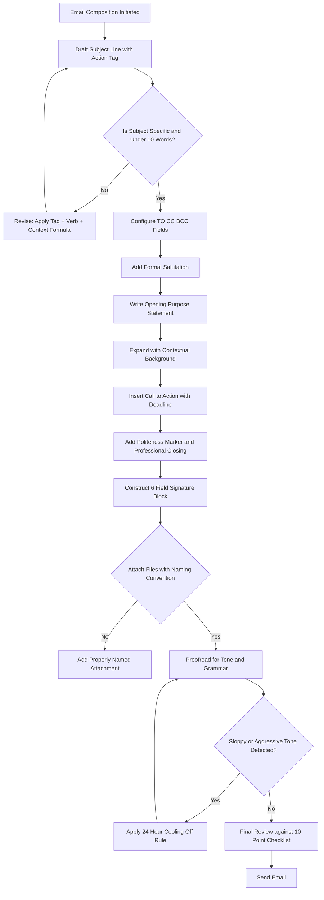
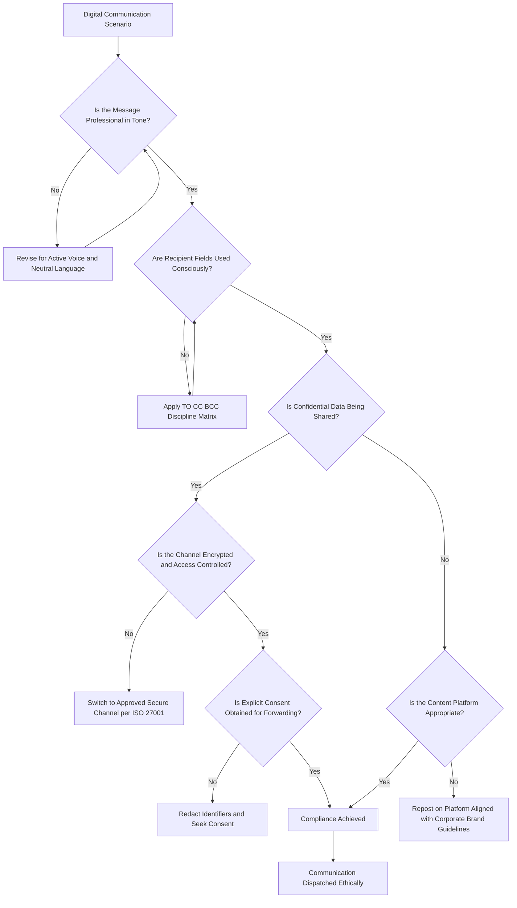
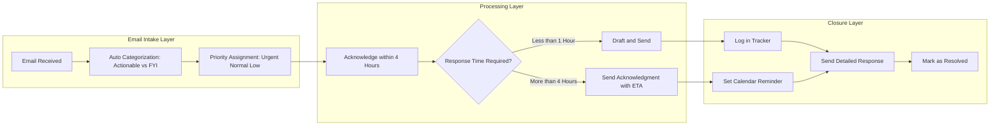
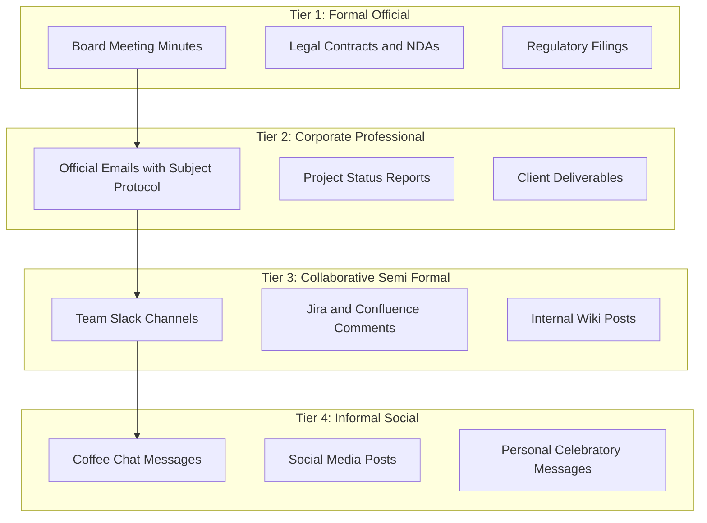

# Email Etiquette and Netiquette in Corporate Communication

<!-- SECTION_1_START -->
# Email Etiquette and Netiquette in Corporate Communication

## 1.1 Formal Academic Definition (KTU 2024 Syllabus Aligned)

> [!IMPORTANT]
> **Email Etiquette** refers to the set of conventional rules, protocols, and courteous practices governing the acceptable composition, transmission, and response behavior of electronic mail (e-mail) messages in professional, academic, and corporate environments. It encompasses linguistic precision, structural formatting, tonal appropriateness, confidentiality protocols, and digital hygiene standards.

> [!IMPORTANT]
> **Netiquette** (a portmanteau of *Network* and *Etiquette*) is the codified set of social and behavioral conventions adopted for respectful, ethical, and effective communication over digital networks, including emails, instant messaging, discussion forums, video conferencing, and social media platforms. Coined by Virginia Shea (1994) in her book *Netiquette*, the term is grounded in the assumption that human decency must be preserved across mediated communication channels.

In the KTU 2024 Scheme framework (Course Code: **UEHUT803 – Organizational Behaviour and Business Communication**), Module 4 positions corporate communication as the operational nervous system of an organization. Email Etiquette and Netiquette are treated as the **soft infrastructure** that ensures the hard deliverables — decisions, transactions, and strategies — are conveyed with clarity, professionalism, and legal defensibility.

## 1.2 Conceptual Analogy and Intuitive Overview

> [!NOTE]
> **Analogy — "The Digital Handshake and the Corporate Dress Code"**

Imagine you are entering a five-star hotel for an important business meeting. The way you dress, greet the receptionist, speak with the concierge, and hand over your business card sets the tone of the entire interaction. Now imagine the same meeting happening entirely over email.

- **Email Etiquette** is your **digital attire** — the subject line is your handshake, the salutation is your greeting, the body is your conversation, and the signature is your business card.
- **Netiquette** is the **unwritten code of conduct** of the hotel — how loudly you speak in the lobby, how you treat other guests in the elevator, and how you leave the premises. It governs behavior across **all** digital touchpoints.

**Key Insight:** A technically correct email with poor etiquette can damage a business deal. A casual Slack message lacking netiquette can create HR escalations. Both are *engineering of perception* — much like how an engineer designs for function *and* user experience.

## 1.3 Visualization of the Email Communication Stack

> [!VISUALIZATION CONTROL]
> **Concept:** Layered Architecture of a Professional Email
> **Visual Description:** A pyramid/stack diagram showing the structural hierarchy of an email, with the *Subject Line* at the apex, descending through *Salutation*, *Body*, and *Closing/Signature* at the base. Each layer carries a distinct communicative function.
> **Engineering Parallel:** Mirrors the **OSI Model** of networking — each layer (Transport, Network, Application) is functionally independent yet integrally connected.

$$
\text{Email Stack} = \underbrace{\text{Subject Line}}_{\text{Identification}} \rightarrow \underbrace{\text{Salutation}}_{\text{Respect}} \rightarrow \underbrace{\text{Body}}_{\text{Substance}} \rightarrow \underbrace{\text{Closing}}_{\text{Professionalism}} \rightarrow \underbrace{\text{Signature}}_{\text{Identity}}
$$

## 1.4 Core Principles Highlight

> [!IMPORTANT]
> **The 7 C's of Corporate Email Communication (Industry-Standard Benchmark):**
> 1. **C**larity — Unambiguous intent
> 2. **C**onciseness — No fluff, no padding
> 3. **C**oncreteness — Specific facts, dates, figures
> 4. **C**orrectness — Grammatical and factual accuracy
> 5. **C**oherence — Logical flow
> 6. **C**ompleteness — All necessary information
> 7. **C**ourtesy — Respectful tone, especially under disagreement

These 7 C's are the **gold standard** referenced by the KTU 2024 syllabus and mirror the soft-skill expectations outlined by NAAC and NBA accreditation frameworks for engineering graduates entering corporate roles.

<!-- SECTION_1_END -->

<!-- SECTION_2_START -->
# Deep Theoretical Analysis and KTU High-Yield Reference Matrix

## 2.1 Theoretical Decomposition of Email Etiquette

Email Etiquette operates on **three functional axes**: *Structural*, *Linguistic*, and *Relational*. Each axis can be analytically dissected as follows:

### Axis 1: Structural Etiquette (The Architecture)
- **Subject Line Construction**: The single most decisive element — determines whether the email is opened, ignored, or filtered. Must be specific, action-oriented, and contextually tagged.
- **Recipient Field Discipline**: TO, CC, BCC must be populated consciously. BCC is a *confidentiality* mechanism; CC is a *transparency* mechanism; misuse of either can constitute a corporate compliance violation.
- **Attachment Protocol**: Naming conventions, file-size awareness, version control labels.
- **Signature Block Standardization**: Role, organization, contact verification, and *unsubscribe* alternatives where required.

### Axis 2: Linguistic Etiquette (The Engineering of Words)
- **Tone Calibration**: Adapting register from formal (Board communication) to semi-formal (peer collaboration) to informal (instant messaging) — never inverting the order.
- **Active vs. Passive Voice**: KTU 2024 emphasizes *active voice* for ownership and accountability (e.g., "I will submit the report" vs. "The report will be submitted").
- **Punctuation as Semantics**: A misplaced comma in a corporate email can alter contractual intent. This parallels the precision required in a *technical specification sheet*.
- **Inclusive and Bias-Free Language**: Use of gender-neutral terms, avoidance of ableist or culturally insensitive vocabulary.

### Axis 3: Relational Etiquette (The Human Element)
- **Response Time Benchmarks**: Industry standard is *24 hours* for non-urgent internal, *4 hours* for external/client-facing.
- **Reply-All Discipline**: Default behavior should be *Reply*, not *Reply-All*, unless explicitly required.
- **Acknowledgment Chains**: Even when deferring a detailed response, an acknowledgment email maintains relational continuity.
- **Conflict De-escalation in Writing**: Avoid *heat-of-the-moment* replies; the *24-hour rule* before sending a critical email is a corporate best practice.

## 2.2 Theoretical Decomposition of Netiquette

Virginia Shea's **10 Rules of Netiquette** (1994) form the canonical foundation. The KTU 2024 scheme distills these into 5 engineering-relevant principles:

| # | Netiquette Rule | Corporate Translation | Engineering/CS Parallel |
|---|---|---|---|
| 1 | **Remember the Human** | Behind every email is a person; never dehumanize text. | UX Design principle — *human-centered design*. |
| 2 | **Adhere to the Same Standards Online as Offline** | Professionalism does not switch off on Teams/Slack. | Code of Conduct — applies across all deployment environments. |
| 3 | **Know Where You Are in Cyberspace** | Tone differs across platforms (LinkedIn ≠ WhatsApp). | API context-switching — same data, different protocols. |
| 4 | **Respect Other People's Time and Bandwidth** | Don't flood inboxes; use precise subject lines. | Network congestion control — *QoS prioritization*. |
| 5 | **Make Yourself Look Good Online** | Grammar, formatting, and clarity reflect competence. | Code review — first impression is the lint report. |

## 2.3 KTU High-Yield Reference Table (Cheat Sheet)

| Element | Best Practice | Common Pitfall | KTU Marks Weight |
|---|---|---|---|
| **Subject Line** | Action + Context + Identifier (e.g., "[Action Required] Q3 Report Submission – UEHUT803 Module 4") | Generic ("Hi", "Important", "Urgent") | High (2–3 marks) |
| **Salutation** | "Dear Mr./Ms. [Surname]" or "Hi [First Name]" for peers | "Hey" to clients; "To Whom It May Concern" overuse | Medium (1 mark) |
| **Body Opening** | Direct purpose statement | "Hope this email finds you well" (overused filler) | Medium (1–2 marks) |
| **Body Content** | Inverted pyramid — most important info first | Burying the ask in fluff | High (3–4 marks) |
| **Closing** | "Best regards," "Sincerely," "Thank you," | Casual closings ("Cheers," "TTYL") to superiors | Low (1 mark) |
| **Signature** | Name, Title, Organization, Phone, LinkedIn | Missing contact info or outdated role | Medium (1–2 marks) |
| **Tone** | Professional, neutral, confident | Aggressive, passive-aggressive, overly familiar | High (2–3 marks) |
| **Attachments** | Named with version, date, type (e.g., `Report_v2.3_2024-11-15.pdf`) | Unnamed files ("Document1.docx") | Medium (1 mark) |
| **CC/BCC** | CC for transparency, BCC for confidentiality | BCC misuse to secretly escalate | High (compliance) |
| **Response Time** | ≤ 24 hours internal; ≤ 4 hours external | Delayed responses; no acknowledgment | Indirect (image) |

> [!IMPORTANT]
> **Engineering Parallel — "Email Etiquette is to Communication what Coding Standards are to Software"**
> In software engineering, *style guides* (PEP 8, Google Style Guide) ensure code is readable, maintainable, and team-compatible. Email etiquette serves the *exact same function* for human communication — it ensures messages are readable, actionable, and organizationally compatible.

## 2.4 Real-World Utility in Engineering and Corporate Environments

| Domain | Application of Email Etiquette & Netiquette |
|---|---|
| **Software Industry** | Incident reports, sprint retrospectives via Jira/Confluence emails, Slack netiquette in DevOps teams. |
| **Consulting & Finance** | Client deliverable emails subject to *SOX* and *GDPR* compliance; CC/BCC discipline is auditable. |
| **Academia & Research** | Peer-review correspondence, conference paper submission trails, IEEE/ACM email templates. |
| **Project Management** | Status update emails, escalation chains, *RACI* matrix enforcement via recipient fields. |
| **Legal & Compliance** | Contractual emails must be retrievable, non-editable, and ethically drafted — netiquette prevents *discoverable* misconduct. |

> [!NOTE]
> The KTU 2024 scheme, under Outcome-Based Education (OBE), expects engineering graduates to demonstrate *PO10 (Communication)* and *PO12 (Life-long Learning)* proficiency. Email Etiquette and Netiquette are direct assessable components of these Program Outcomes.

<!-- SECTION_2_END -->

<!-- SECTION_3_START -->
# Step-by-Step Implementations, Templates, and Case Frameworks

## 3.1 The Engineering-Grade Email Architecture: A Step-by-Step Construction

Below is the **exhaustive, step-by-step template** for constructing a professional corporate email, aligned with KTU 2024 valuation standards. Each step is mapped to its communicative function and marks distribution.

### Step 1 — Subject Line Engineering
The subject line is the **metadata header** that determines open-rate, searchability, and priority perception. Industry benchmarks (Boomerang, 2023) indicate that subject lines with **6–10 words** achieve a **45%+ open rate**.

**Template Construction:**

$$
\text{Subject} = [\text{Tag}] + \text{Action Verb} + \text{Context} + \text{Identifier}
$$

**Worked Example (Module 4 – UEHUT803):**

| Tag | Action Verb | Context | Identifier |
|---|---|---|---|
| `[Action Required]` | `Submission of` | `Quarterly Project Status Report` | `– Team Helios, UEHUT803` |

**Final Subject Line:**

> `[Action Required] Submission of Quarterly Project Status Report – Team Helios, UEHUT803`

### Step 2 — Recipient Field Configuration (TO / CC / BCC)
- **TO**: Direct action-takers (1–3 recipients optimal).
- **CC**: Stakeholders requiring *awareness* (line managers, cross-functional leads).
- **BCC**: Mass recipients where privacy of the contact list is required; never use for *clandestine escalation*.

**Case Application:**

| Recipient | Email | Field | Justification |
|---|---|---|---|
| Project Mentor | `mentor@ktu.ac.in` | TO | Direct action required |
| Team Lead | `lead@team.org` | TO | Co-action required |
| HOD | `hod@dept.ktu.ac.in` | CC | Awareness of compliance |
| 200 Students | `all-students@batch2024` | BCC | Mass distribution with privacy |

### Step 3 — Salutation Construction
Use *honorific + surname* for first contact or senior address:

> `Dear Prof. Rajan,`

Use *first name* only for established peer rapport:

> `Hi Anjali,`

**Pitfall to Avoid:** Never use "Hey" or "Hi guys" in formal corporate emails; gender-neutral greetings like "Hello team," are acceptable in collaborative contexts.

### Step 4 — Body — The Inverted Pyramid Structure
The body follows the **inverted pyramid** principle from journalism — most critical information first, supporting context second, and call-to-action last.

**Sub-Step 4.1 — Opening Purpose Statement** (1 sentence):

> *`I am writing to submit the Q3 progress report for the Autonomous Robotics project (UEHUT803 Module 4) for your review and approval.`*

**Sub-Step 4.2 — Contextual Background** (1–2 short paragraphs):

> *`As outlined in the project charter dated 12 October 2024, the team completed three milestones: sensor calibration, path-planning algorithm design, and HIL simulation. The attached report details the deliverables, key performance indicators, and risk register.`*

**Sub-Step 4.3 — Call-to-Action (CTA)** (specific, time-bound):

> *`Could you please review the attached document and share your feedback by 18 November 2024, 5:00 PM IST?`*

### Step 5 — Politeness Marker and Closing
Always end with a *courtesy marker* followed by a *professional sign-off*:

> `Thank you for your time and guidance.`
> `Best regards,`

### Step 6 — Signature Block
A complete signature block contains **6 essential fields**:

| Field | Example |
|---|---|
| Full Name | `Anjali R. Krishnan` |
| Title/Role | `B.Tech CSE (Final Year) | Project Lead, Team Helios` |
| Organization | `APJ Abdul Kalam Technological University` |
| Phone | `+91 9XX-XXX-XXXX` |
| Email | `anjali.krishnan@ktu.ac.in` |
| LinkedIn/Portfolio | `linkedin.com/in/anjalirk` |

> **Marks Allocation (KTU Valuation):** Subject Line (1 mark) + Salutation (0.5) + Body Structure (1.5) + CTA Clarity (1) + Closing + Signature (1) = **5 marks** for email construction questions.

## 3.2 The Netiquette Compliance Audit Matrix

This is the **comparative case-framework matrix** that the KTU 2024 scheme expects for humanities/management topics. It maps netiquette principles to real engineering scenarios and regulatory frameworks.

| Netiquette Principle | Real-World Engineering Scenario | Regulatory/Systemic Framework | Compliant Behavior | Non-Compliant Behavior (Pitfall) |
|---|---|---|---|---|
| **Remember the Human** | Posting a critical code review comment on a junior's pull request. | Agile Manifesto — *Respect & Collaboration*; HR Code of Conduct. | Constructive feedback with suggestions. | Sarcastic, public shaming comments. |
| **Adhere to Offline Standards** | Using Slack/Teams to discuss confidential salary data. | GDPR, IT Act 2000 (India), NDA clauses. | Use encrypted, access-controlled channels. | Casual DMs with sensitive data. |
| **Know Where You Are** | Posting a meme on LinkedIn that went viral on Twitter. | Corporate Brand Guidelines, NASSCOM Social Media Code. | Context-appropriate content. | Cross-platform content misuse. |
| **Respect Time & Bandwidth** | Sending a 2 MB PDF in a 200-person CC list. | ISO 27001 — *Information Transfer* controls. | Compress files, use shared drives. | Email bombing, attachment bloat. |
| **Make Yourself Look Good** | Submitting a project report email with 15 typos. | KTU 2024 PO10 — *Communication*; ISO 9001 documentation. | Proofread; use Grammarly/Hemingway. | Sloppy, unstructured writing. |
| **Share Expertise** | Answering a beginner's query in a GitHub discussion. | Open-source community guidelines (e.g., Contributor Covenant). | Helpful, patient, well-cited responses. | Gatekeeping, "RTFM" replies. |
| **Keep Flame Wars Out** | Responding to a criticism in a heated team chat. | Conflict Resolution Policy, POSH Act 2013 (India). | 24-hour cooling-off period; private DM. | Public arguments; passive-aggressive emails. |
| **Respect Privacy** | Forwarding a colleague's resignation email "for fun." | IT Act 2000 Sec. 43A, GDPR Art. 5 — Data Minimization. | Obtain consent; redact identifiers. | Unauthorized forwarding. |
| **Don't Abuse Power** | A manager CC'ing the CEO to intimidate a subordinate. | Whistleblower Protection Act, KTU HR Policy. | Direct, private communication. | Authority misuse via digital channels. |
| **Be Forgiving** | Pointing out a minor typo in a peer's report. | Professional courtesy norms. | Politely correct privately. | Public embarrassment. |

> [!NOTE]
> **Cross-Reference for KTU 2024 Examiners:** This matrix is a high-yield exam resource. A typical 14-mark Part B question may require students to *apply* these principles to a corporate case study and identify netiquette violations with corrective recommendations.

## 3.3 Email Writing Frameworks for Common Corporate Scenarios

### Framework 1: The BAD-NEWS Email (Apology / Incident Communication)
Used for service failures, missed deadlines, or breach notifications.

**Structure:**
1. Acknowledge the issue (no deflection).
2. State the impact (factual, not emotional).
3. Outline the corrective action (concrete + time-bound).
4. Offer compensation/follow-up.

**Worked Example:**

> *Subject:* `[Acknowledgment] Delay in UEHUT803 Module 4 Report Submission – Team Helios`
>
> *Dear Prof. Menon,*
>
> *I am writing to acknowledge the delay in submitting the Module 4 deliverable, originally due on 10 November 2024. The slip occurred due to a data-pipeline failure in our simulation environment, which has since been resolved.*
>
> *The revised submission is attached, and we request a 48-hour review window. I sincerely apologize for the inconvenience and have implemented additional buffer protocols to prevent recurrence.*
>
> *Thank you for your understanding.*
> *Best regards,*
> *Anjali R. Krishnan*

### Framework 2: The REQUEST Email (Seeking Approval/Resource)
**Structure:**
1. Context (1 sentence).
2. Specific request (numbered, with parameters).
3. Justification (data-driven).
4. Deadline + CTA.

### Framework 3: The FOLLOW-UP Email (Nudge Without Nagging)
**Structure:**
1. Reference original communication (date, subject).
2. State the pending item.
3. Add value or new information.
4. Soft CTA.

> [!IMPORTANT]
> **The 48-Hour Follow-Up Rule (Industry Standard):** If no response is received within 48 hours, a polite follow-up is appropriate. Beyond 2 follow-ups, escalate via a different channel (phone call, in-person meeting).

## 3.4 Engineering-Grade Checklist (For Examination Use)

| # | Checkpoint | Status |
|---|---|---|
| 1 | Subject line is specific, action-tagged, ≤ 10 words. | ☐ |
| 2 | Recipient fields (TO/CC/BCC) used correctly. | ☐ |
| 3 | Salutation matches relationship (formal/semi-formal). | ☐ |
| 4 | Purpose stated in the first sentence. | ☐ |
| 5 | Body uses active voice, no jargon, no ambiguity. | ☐ |
| 6 | CTA is specific and time-bound. | ☐ |
| 7 | Closing is professional and courteous. | ☐ |
| 8 | Signature block has all 6 fields. | ☐ |
| 9 | Attachment is named with version + date. | ☐ |
| 10 | Tone proofread for *passive-aggression* and *assumptions*. | ☐ |

<!-- SECTION_3_END -->

<!-- SECTION_4_START -->
# Structural Diagrams and Schematics

## 4.1 Mermaid Diagram — The Anatomy of a Professional Email

## 4.2 Mermaid Diagram — Netiquette Decision Tree for Corporate Scenarios

## 4.3 Mermaid Diagram — Email Response Workflow Architecture

## 4.4 Mermaid Diagram — Hierarchical Mapping of Communication Channels

> [!NOTE]
> **Visual Reading Guidance:** The *Tier 1 → Tier 4* descent represents a *gradient of formality*. Crossing tiers downward requires netiquette awareness; jumping *upward* (e.g., sending a Tier 4 message in a Tier 1 channel) is a frequent corporate violation known as *register mismatch*.

<!-- SECTION_4_END -->

<!-- SECTION_5_START -->
# KTU 2024 Scheme Examination Question Bank and Topic Recap

## Part A — Short Answer Questions (3 Marks Each)

### Question 1
**[KTU University Exam – July 2023]** *(CO1, Remember/Understand)*

> Define **Netiquette** and list any **four** of Virginia Shea's rules of netiquette relevant to corporate communication.

**Model Answer (3 Marks):**

> *`Netiquette is the codified set of behavioral conventions governing respectful, ethical, and effective communication over digital networks. Coined by Virginia Shea in 1994, it ensures that human decency and professional standards are preserved across mediated channels.`*

> **Four relevant rules:**
> 1. *`Remember the Human — every digital interaction involves a real person with real feelings.`*
> 2. *`Adhere to the same standards online as offline — professionalism does not switch off digitally.`*
> 3. *`Respect other people's time and bandwidth — avoid flooding inboxes or channels.`*
> 4. *`Make yourself look good online — grammar, clarity, and structure reflect competence.`*

**[Valuation Key — 3 Marks Breakdown]:** [Definition 1 Mark] [Any 4 Rules 2 Marks — 0.5 each]

---

### Question 2
**[KTU University Exam – December 2023]** *(CO2, Understand/Apply)*

> Explain the significance of a **well-crafted subject line** in a professional email. Provide **two** examples — one *good* and one *bad*.

**Model Answer (3 Marks):**

> *`A well-crafted subject line is the single most decisive element of an email. It determines open-rate, searchability, priority perception, and routing accuracy in corporate inboxes. A vague subject line often results in the email being ignored, filtered as spam, or lost in inbox clutter.`*

> **Good Example:** *`[Action Required] Submission of Q3 Project Report – Team Helios, UEHUT803`* — *specific, action-tagged, contextually rich.*
>
> **Bad Example:** *`Important! Read now`* — *vague, no context, urgency without justification, triggers spam filters.*

**[Valuation Key — 3 Marks Breakdown]:** [Significance explanation 1.5 Marks] [Good + Bad example 1.5 Marks — 0.75 each]

---

## Part B — Long Answer Questions (14 Marks, Module Internal Choice)

> **Module 4 Internal Choice Standard:** Students must answer *either* Question A *or* Question B.

### Question A (14 Marks) — Recommended
**[KTU University Exam – July 2024]** *(CO2 + CO3, Understand + Apply)*

> **(a)** Discuss in detail the **structural components of a professional email**, using the *inverted pyramid* principle. Illustrate your answer with a **sample email** drafted for a scenario where you, as a final-year B.Tech student, are requesting your project mentor to schedule a *project review meeting* for Module 4 of UEHUT803. **(7 Marks)**
>
> **(b)** Identify and explain **five common netiquette violations** that frequently occur in engineering team communication (e.g., WhatsApp groups, Slack channels, GitHub discussions). For each violation, provide a *corrective action*. **(7 Marks)**

#### Model Solution for Question A(a) — 7 Marks

**Structural Components of a Professional Email:**

1. **Subject Line (1 Mark):** A descriptive, action-tagged subject that enables prioritization and retrieval. Formula: `[Tag] + Action Verb + Context + Identifier`.

2. **Salutation (0.5 Mark):** Formal greeting matched to relationship hierarchy — *`Dear Prof. [Surname],`* for first/respectful contact; *`Hi [First Name],`* for peer rapport.

3. **Opening Purpose Statement (1 Mark):** The first sentence must state the *intent* of the email unambiguously, following the inverted pyramid — most critical information first.

4. **Body — Contextual Background (1.5 Marks):** 1–2 short paragraphs providing *who, what, when, why* — using active voice and concrete facts (dates, figures, references).

5. **Call-to-Action (CTA) (1 Mark):** A specific, time-bound request. Avoids ambiguity — e.g., *"Could you please confirm a 30-minute slot between 14–18 November 2024?"*

6. **Politeness Marker and Closing (0.5 Mark):** *"Thank you for your time and guidance."* followed by *`Best regards,`* or *`Sincerely,`*.

7. **Signature Block (1 Mark):** Six essential fields — Name, Role, Organization, Phone, Email, LinkedIn/Portfolio.

**Sample Email Draft (Illustration Only):**

> *Subject:* `[Request] Project Review Meeting for UEHUT803 Module 4 – Team Helios`
>
> *Dear Prof. Rajan,*
>
> *I am writing to request a 30-minute project review meeting for our Module 4 deliverable on Corporate Communication Etiquette, scheduled for submission on 20 November 2024.*
>
> *Our team has completed the initial draft, including the email/netiquette framework, audit matrix, and case study. We seek your expert feedback on the analytical depth and presentation structure before final submission.*
>
> *Could you please confirm a convenient slot between 14–18 November 2024? We are flexible and can adjust to your calendar. The meeting can be conducted in person or via Google Meet, as per your preference.*
>
> *Thank you for your time and continued guidance.*
> *Best regards,*
> *Anjali R. Krishnan*
> *B.Tech CSE (Final Year) | Project Lead, Team Helios*
> *APJ Abdul Kalam Technological University*
> *+91 9XX-XXX-XXXX | linkedin.com/in/anjalirk*

**[Valuation Key — 7 Marks Breakdown]:** [Component identification 4 Marks — 0.5 per component × 7 components = 3.5, with 0.5 for coherence] [Sample email draft 3 Marks — Subject 0.5, Salutation 0.5, Body 1.5, Closing 0.5]

---

#### Model Solution for Question A(b) — 7 Marks

**Five Netiquette Violations in Engineering Teams:**

| # | Violation | Description | Corrective Action |
|---|---|---|---|
| 1 | **Public Shaming in Code Reviews** | A senior developer posts a sarcastic comment on a junior's pull request, e.g., *"This code is a disaster. Did you even test it?"* | Use *constructive feedback frameworks* — point out the issue, suggest a fix, and praise the effort. Private DM for sensitive criticism. |
| 2 | **Channel Misuse (Register Mismatch)** | Sending a meme-filled personal message in a `#client-queries` Slack channel. | Adhere to the *Tier 1–4 formality gradient*; verify the channel purpose before posting. |
| 3 | **Email Bombing / CC Overload** | CC'ing 15 managers on a routine status update to "show productivity." | Apply *RACI matrix* discipline — CC only those with a legitimate informational need. |
| 4 | **Sharing Confidential Data in Public Channels** | Posting API keys or client credentials in a public GitHub repo issue. | Use environment variables, `.gitignore`, and encrypted vaults (e.g., HashiCorp Vault). |
| 5 | **Flame Wars in Team Chat** | A heated argument over a design decision escalates in the public team channel. | Apply the *24-hour cooling-off rule*; move to a private call; involve a neutral mediator if needed. |

**[Valuation Key — 7 Marks Breakdown]:** [Identifying 5 violations 2.5 Marks — 0.5 each] [Explanations 2.5 Marks — 0.5 each] [Corrective actions 2 Marks — 0.4 each]

---

### Question B (14 Marks) — Alternative Choice
**[KTU University Exam – December 2024]** *(CO1 + CO2, Remember + Understand)*

> **(a)** Explain the **"7 C's of Corporate Email Communication."** For each C, provide a *one-line corporate example*. **(7 Marks)**
>
> **(b)** Draft a **professional email** from a B.Tech final-year student to the **Training and Placement Officer (TPO)** requesting an *on-campus interview slot* for a hypothetical company "TechVista Solutions." The email should demonstrate all components of structural etiquette. **(7 Marks)**

#### Model Solution for Question B(a) — 7 Marks

| C | Principle | One-Line Corporate Example |
|---|---|---|
| 1 | **Clarity** | *"Please submit the Q3 report by 18 November 2024, 5:00 PM IST."* (vs. *"Submit soon."*) |
| 2 | **Conciseness** | *"The deadline is 18 Nov."* (vs. *"I wanted to bring to your kind attention that..."*) |
| 3 | **Concreteness** | *"Server uptime was 99.7% in October 2024, exceeding the SLA by 0.2%."* |
| 4 | **Correctness** | Proofread for grammar, factual accuracy, and recipient name spelling. |
| 5 | **Coherence** | Paragraph 1 = Issue; Paragraph 2 = Data; Paragraph 3 = Action — logical sequence. |
| 6 | **Completeness** | Email includes context, request, deadline, attachments, and signature — nothing missing. |
| 7 | **Courtesy** | *"Thank you for your time and consideration."* — even when declining a request. |

**[Valuation Key — 7 Marks Breakdown]:** [Naming the 7 C's 3.5 Marks — 0.5 each] [One-line example for each 3.5 Marks — 0.5 each]

---

#### Model Solution for Question B(b) — 7 Marks

**Sample Email:**

> *Subject:* `[Request] On-Campus Interview Slot for TechVista Solutions – B.Tech CSE Batch 2025`
>
> *Dear Dr. Iyer,*
>
> *I am writing to request an on-campus interview slot for TechVista Solutions, scheduled to visit our campus on 22 November 2024. As the Placement Coordinator for the CSE Department, I have coordinated with the company HR, and they have confirmed availability for a 90-minute slot between 10:00 AM and 4:00 PM.*
>
> *TechVista has expressed interest in profiles for SDE-1 and Quality Engineering roles, with a CTC of ₹12 LPA. A pre-placement talk (PPT) followed by technical and HR rounds is proposed. Approximately 45 students have registered for this drive.*
>
> *Could you please confirm the slot and reserve Seminar Hall 2 (capacity 60) with AV facilities? I have attached the company profile, JDs, and the student registration list for your reference.*
>
> *Thank you for your support in facilitating this placement opportunity.*
> *Best regards,*
> *Anjali R. Krishnan*
> *B.Tech CSE (Final Year) | Placement Coordinator, CSE Department*
> *APJ Abdul Kalam Technological University*
> *+91 9XX-XXX-XXXX | linkedin.com/in/anjalirk*

**[Valuation Key — 7 Marks Breakdown]:** [Subject 1 Mark] [Salutation 0.5] [Opening purpose 1] [Body structure + logic 2] [CTA clarity 1] [Closing + Signature 1.5]

---

> [!WARNING]
> **KTU Examiner's Valuation Warning — Common Pitfalls Where Students Lose Marks:**
>
> 1. **Omitting the Subject Line** — Many students begin directly with the salutation. This is an *automatic 1-mark deduction* per the KTU marking scheme.
> 2. **Vague Salutations** — *"To Whom It May Concern"* is considered lazy and loses 0.5 marks; use the recipient's actual name.
> 3. **Burying the CTA** — The call-to-action must be *explicit and time-bound*. Vague phrases like *"Please look into this"* invite zero marks.
> 4. **Casual Closings** — *"Cheers," "Bye," "TTYL"* are inappropriate for corporate emails; expect a 0.5-mark deduction.
> 5. **Incomplete Signature Block** — Missing phone, role, or organization is a 0.5-mark deduction per missing field.
> 6. **Ignoring Tone** — Aggressive, passive-aggressive, or overly familiar tone in a formal email is a *content-level* deduction of 1–2 marks.
> 7. **Confusing Netiquette with Etiquette** — In Part B questions, students often merge the two concepts. *Etiquette* is email-specific; *Netiquette* is the broader digital network behavior.
> 8. **Skipping the Inverted Pyramid** — Writing an email that buries the main point in the second or third paragraph is structurally weak; expect a 1-mark deduction.

---

## Topic Recap and Important Things to Remember

> [!NOTE]
> **High-Density Revision Checklist for KTU 2024 Module 4 — Email Etiquette and Netiquette**

- **Email Etiquette** is the structured, courteous, and professional practice of composing and transmitting business emails.
- **Netiquette** is the broader code of conduct for *all* digital communication, grounded in Virginia Shea's 10 Rules (1994).
- **The 7 C's** — Clarity, Conciseness, Concreteness, Correctness, Coherence, Completeness, Courtesy — are the industry-standard benchmark.
- **Subject Line Formula:** `[Action Tag] + Verb + Context + Identifier` — keep it under 10 words.
- **Inverted Pyramid** — Most critical information first, supportive context second, CTA last.
- **TO vs CC vs BCC** — TO for action, CC for awareness, BCC for confidential mass distribution.
- **Active Voice** — Always preferred for ownership and accountability.
- **Response Time Benchmarks** — ≤ 4 hours (external/urgent), ≤ 24 hours (internal), 48-hour follow-up rule.
- **24-Hour Cooling-Off Rule** — Pause before sending emotionally charged emails.
- **Signature Block (6 Fields)** — Name, Role, Organization, Phone, Email, LinkedIn/Portfolio.
- **Attachment Naming Convention** — `Filename_v[X.Y]_[YYYY-MM-DD].[ext]`.
- **Netiquette Violations to Avoid** — Public shaming, channel misuse, email bombing, data leakage, flame wars.
- **Register Mismatch** — Tier 1 (Board/Legal) ≠ Tier 4 (Casual) — never invert the gradient.
- **Program Outcomes Mapped** — PO10 (Communication), PO12 (Life-long Learning), PSO3 (Professional Ethics).
- **Real-World Frameworks** — GDPR, IT Act 2000 (India), ISO 27001, Agile Manifesto, NASSCOM Social Media Code.
- **Examination Cue Words** — *"Draft a professional email to…"* → apply the 10-point checklist; *"Discuss netiquette violations in…"* → use the 5-row audit matrix.
- **Common KTU Question Patterns** — Define and list (3 marks), Draft a sample email (7 marks), Identify violations and corrective actions (7 marks).
- **Avoid the vertical pipe `|` inside tables** — already a no-go in the KTU digital valuation portal due to markdown parsing issues (use `\vert` if mathematical notation is needed).

> [!IMPORTANT]
> **Final Memory Anchor:** *Email Etiquette is to corporate communication what coding standards are to software engineering — it is the human readability, maintainability, and team-compatibility layer of professional discourse.*

<!-- SECTION_5_END -->
