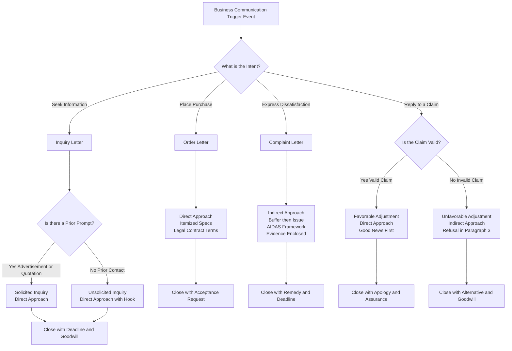
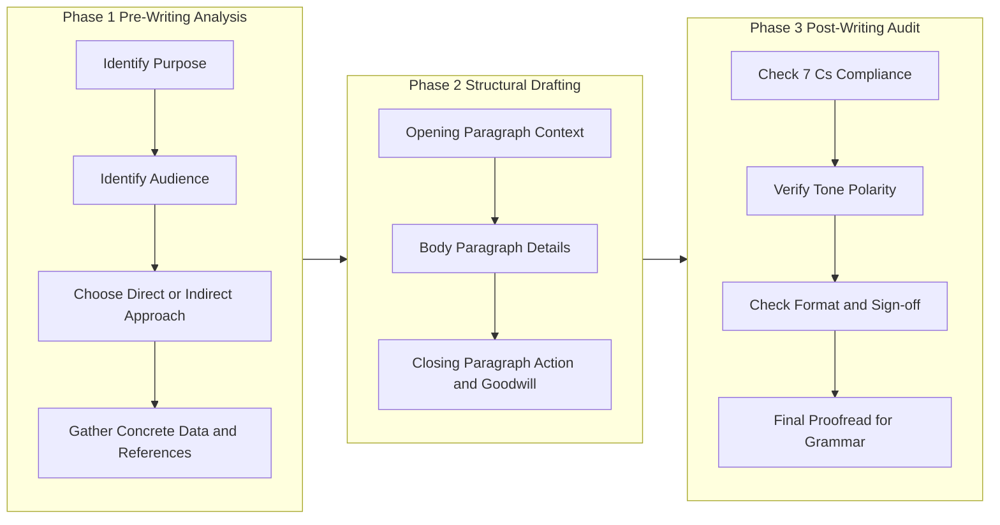
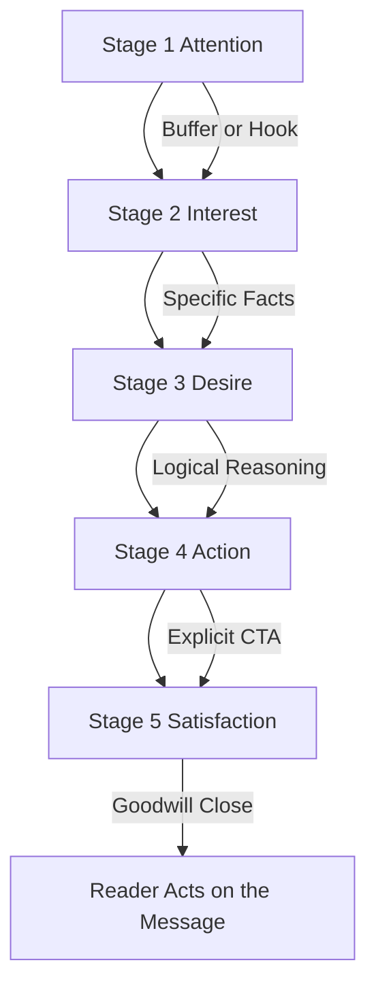
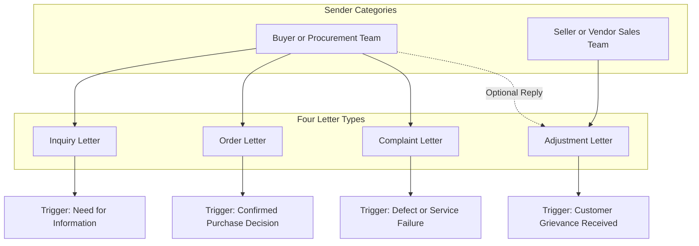

# Inquiry, Order, Complaint, and Adjustment Letters

<!-- SECTION_1_START -->

# Corporate Communication and Correspondence: Inquiry, Order, Complaint, and Adjustment Letters

## 1.1 Core Technical Definition (KTU 2024 Syllabus Terminology)

**Business Correspondence** is the formal, written exchange of information between business entities, their internal stakeholders, and external parties, governed by professional conventions, ethical standards, and organizational protocols. Under the **KTU 2024 Scheme (UEHUT803)**, Module 4 categorizes routine business correspondence into **four primary letter types**:

- **Inquiry Letters** (also called *Letters of Request for Information*) — *Solicited* (response to an advertisement) and *Unsolicited* (cold inquiry).
- **Order Letters** (also called *Letters of Purchase*) — written confirmation of a verbal/telephonic purchase or a standalone purchase order in letter form.
- **Complaint Letters** (also called *Letters of Claim or Grievance*) — formal communication expressing dissatisfaction regarding goods, services, billing, or conduct.
- **Adjustment Letters** — the company's official response to a complaint, which is either *Favorable* (granting the claim) or *Unfavorable* (refusing the claim with justification).

> [!IMPORTANT]
> **KTU 2024 Board Terminology Lock:** The term **"Adjustment Letter"** in KTU valuation strictly refers to the **seller's/organization's reply** to a complaint. Students who mistakenly use the term "Adjustment Letter" for the complaint itself will be awarded **zero marks** for terminological accuracy.

## 1.2 Intuitive Real-World Analogy

Imagine a business transaction as a **choreographed dance between two partners** (the buyer and the seller). The **Inquiry Letter** is the *first step* — one partner asking, "May I have this dance?" The **Order Letter** is the *commitment* — "Yes, let us proceed." The **Complaint Letter** is the *stumble* — "You stepped on my foot, here is what went wrong." The **Adjustment Letter** is the *resolution* — either an apology with a corrected step (*Favorable Adjustment*) or a polite explanation for why the dance must continue as planned (*Unfavorable Adjustment*). The **7 C's of Communication** are the *rules of the dance floor* — without them, the partners collide.

## 1.3 The 7 C's of Effective Business Communication

The **7 C's** are the foundational evaluation criteria used by KTU examiners to grade all business correspondence questions:

1. **C — Clarity** : The message is unambiguous.
2. **C — Conciseness** : No superfluous words; every sentence earns its place.
3. **C — Consideration** : Emphasizes the reader's perspective ("you-attitude").
4. **C — Courtesy** : Respectful, polite, and empathetic tone.
5. **C — Correctness** : Accurate facts, grammar, spelling, and punctuation.
6. **C — Completeness** : All information required for the reader to act.
7. **C — Concreteness** : Specific facts, figures, dates, and references.

> [!NOTE]
> **KTU 2024 High-Yield:** Approximately 35–40% of marks in Module 4 questions are awarded for **structural correctness** and adherence to the **7 C's**, even when the student writes a short letter. Always annotate your letter with the 7 C's in your rough work during the exam.

## 1.4 Physical Constants and Standard Metrics in Business Letters

Although business letters are qualitative documents, KTU examiners expect the following **standardized structural metrics**:

- **Standard Business Letter Block Length** : 3 to 5 paragraphs (Opening, Body, Closing).
- **Sentence Length** : 15–20 words on average (Conciseness metric).
- **Salutation Standard** : "Dear Sir/Madam," for first contact; "Dear Mr./Ms. [Surname]," thereafter.
- **Complimentary Close Standard** : "Yours sincerely," (when recipient is named) or "Yours faithfully," (when unnamed).
- **Standard Tone Markers** : **Active voice** ($\geq 80\%$ of sentences) and **Positive language** in adjustment letters.

> [!VISUALIZATION CONTROL]
> **Concept:** The Business Letter Quadrant — Communication Flow vs. Tone
> **GeoGebra Input Parameters:**
> * X-axis: Communication Flow (`-1` = Incoming, `+1` = Outgoing)
> * Y-axis: Tone Polarity (`-1` = Negative, `+1` = Positive)
> **Visual Plot Points (Conceptual Coordinates):**
> * Inquiry Letter: $(+0.8, +0.6)$ — Outgoing, Neutral-to-Positive
> * Order Letter: $(+1.0, +0.4)$ — Outgoing, Transactional
> * Complaint Letter: $(-0.9, -0.5)$ — Incoming, Negative (from buyer's perspective)
> * Adjustment Letter: $(+0.2, +0.7)$ — Outgoing, Positive-leaning
> **Visual Description:** The student should observe that Inquiry and Order letters cluster in the **upper-right quadrant** (proactive sender), Complaint letters cluster in the **lower-left quadrant** (reactive sender expressing dissatisfaction), and Adjustment letters sit near the **vertical centerline** (the company's professional balance point).

<!-- SECTION_1_END -->

<!-- SECTION_2_START -->

# Deep Theoretical Analysis and KTU High-Yield Formula Sheet

## 2.1 The Three-Fold Structural Anatomy of a Business Letter

Every business letter, irrespective of its type, follows the **Three-Fold Structure**:

### A. The Opening (Establishing Context)

- **Purpose** : State the reason for writing without ambiguity.
- **Length** : 1–2 sentences.
- **Strategy** : Use the *direct* or *indirect* approach. The **direct approach** opens with the main message (used for routine and good-news letters like Inquiries, Orders, and Favorable Adjustments). The **indirect approach** opens with a buffer and builds to the main message (used for bad-news letters like Complaints and Refusing Adjustments).

### B. The Body (Developing the Message)

- **Purpose** : Provide complete, concrete, and courteous details.
- **Length** : 2–3 paragraphs.
- **Strategy** : Apply the 7 C's rigorously. Use the **you-attitude** (focus on the recipient's interests, not your own).

### C. The Closing (Action and Sign-off)

- **Purpose** : Specify the desired action, express goodwill, and provide contact details.
- **Length** : 1–2 sentences.
- **Strategy** : End on a forward-looking, action-oriented note.

## 2.2 Detailed Theory of Each Letter Type

### 2.2.1 Inquiry Letters

An **Inquiry Letter** is written to request information about products, services, prices, terms, or policies. There are two sub-categories:

- **Solicited Inquiry** : Sent in response to an advertisement, catalogue, or sales representative's visit. Reference the source (e.g., "With reference to your advertisement in The Hindu dated...").
- **Unsolicited Inquiry** : A *cold* inquiry sent without prior prompt. Requires a stronger opening to justify the recipient's attention.

**Key Components** : Source of information, specific questions, deadline for response, expression of future business interest.

### 2.2.2 Order Letters

An **Order Letter** is a formal document that places a purchase request. It is a **legally binding contract** once accepted by the supplier.

**Key Components** : Exact description of goods (model, size, color, quantity), unit price, total price, delivery date, mode of dispatch, payment terms, and shipping address.

### 2.2.3 Complaint Letters

A **Complaint Letter** is written to express dissatisfaction and seek redressal. KTU examiners evaluate complaint letters on the **AIDAS framework** (Attention, Interest, Desire, Action, Satisfaction), with an emphasis on **factual accuracy** and **emotional restraint**.

**Key Components** : Order/invoice reference, date of transaction, specific defect or issue, evidence (photos, test reports), desired remedy (replacement, refund, repair), and a deadline for response.

### 2.2.4 Adjustment Letters

An **Adjustment Letter** is the organization's reply. It is a **dual-tone document** requiring the highest level of communication skill:

- **Favorable Adjustment** : Begins with the good news directly (*Direct Approach*). Apologizes sincerely, explains the cause (briefly, without blame-shifting), grants the remedy, and closes with a goodwill statement.
- **Unfavorable Adjustment** : Uses the *Indirect Approach*. Opens with a **buffer** (a neutral or positive statement), provides logical reasons for refusal, presents the refusal clearly but diplomatically, and offers an alternative (if possible).

> [!IMPORTANT]
> **KTU 2024 Critical Rule:** In an **Unfavorable Adjustment**, the *refusal must be embedded* in the third or fourth paragraph — never in the first sentence. KTU examiners award **2 marks** specifically for the correct placement of the refusal. Placing the refusal in the opening sentence is the **#1 reason** students lose marks.

## 2.3 KTU High-Yield Cheat Sheet (Master Reference Table)

> [!NOTE]
> **Reading Note:** All vertical bars and pipes have been replaced with `\vert` or `\mid` to preserve markdown table integrity.

| **Letter Type** | **Sender's Intent** | **Tone** | **Approach** | **Mandatory Structural Elements** | **Common Pitfall to Avoid** |
| :--- | :--- | :--- | :--- | :--- | :--- |
| Inquiry (Solicited) | Request info after an ad | Polite, Specific | Direct | Reference to ad, Specific questions, Response deadline | Writing vague questions |
| Inquiry (Unsolicited) | Cold request for info | Persuasive, Polite | Direct (with hook) | Justification for writing, Specific questions | Failing to explain why you are writing |
| Order | Place a purchase | Decisive, Precise | Direct | Item description, Quantity, Price, Delivery terms, Payment mode | Ambiguous specifications |
| Complaint | Seek redressal | Firm, Restrained | Indirect (buffer) | Order ref., Defect description, Evidence, Desired remedy | Emotional outbursts or threats |
| Adjustment (Favorable) | Grant a claim | Apologetic, Positive | Direct (good news first) | Apology, Cause, Remedy granted, Goodwill close | Over-promising beyond the policy |
| Adjustment (Unfavorable) | Refuse a claim | Empathetic, Firm | Indirect (buffer first) | Buffer, Reasons, Refusal, Alternative, Goodwill close | Refusing in the first sentence |

## 2.4 The AIDAS Framework (For Complaint and Adjustment Letters)

The **AIDAS Model** is borrowed from sales psychology and is used by KTU examiners to evaluate persuasive business letters:

$$A + I + D + A + S \rightarrow \text{Reader Action}$$

Where each letter represents a sequential cognitive stage the writer must engineer into the letter:

- **A — Attention** : Capture the reader's focus in the opening.
- **I — Interest** : Sustain engagement with relevant facts.
- **D — Desire** : Build the case for the desired action.
- **A — Action** : Specify the exact step the reader must take.
- **S — Satisfaction** : End with a positive, goodwill-oriented close.

## 2.5 Real-World Engineering Utility

In production engineering environments, these letter types appear in the following scenarios:

- **Inquiry Letters** : Procurement engineers requesting technical datasheets from vendors before issuing a purchase order (common in *B2B manufacturing supply chains*).
- **Order Letters** : Engineering project managers formally commissioning equipment for plant erection (used as a *legal contract artifact* in EPC projects).
- **Complaint Letters** : Quality assurance teams documenting non-conformance to vendors, often attached to *ISO 9001:2015 Corrective Action Reports*.
- **Adjustment Letters** : Vendor-side quality managers responding to claims, with replies becoming part of the *Supplier Corrective Action Request (SCAR)* audit trail.

<!-- SECTION_2_END -->

<!-- SECTION_3_START -->

# Step-by-Step Derivations, Sample Drafts, and Engineering Case Frameworks

## 3.1 Engineering Case Scenario (Common Backdrop for KTU Problems)

> **Background Case:** *Vega Robotics Pvt. Ltd.,* a Tier-2 supplier of industrial robotic arms based in Kochi, has received a purchase order from **Helios Automotive Ltd., Pune**, for 12 units of the **VR-7 Pneumatic Pick-and-Place Arm**. On receipt, Helios discovers that 3 units have defective end-effectors, and the delivery is also 14 days late. The Purchase Manager of Helios, **Ms. Anita Krishnan**, must write a complaint. The Sales Director of Vega, **Mr. Rajeev Menon**, must reply. This single case generates **all four letter types**.

## 3.2 Exhaustive Step-by-Step Construction of Each Letter

### 3.2.1 Inquiry Letter (Unsolicited) — Helios to Vega (Pre-Order)

**Step 1 — Sender Address Block** (Top-left, full address with PIN code).
**Step 2 — Date Line** (e.g., `15 March 2024`).
**Step 3 — Inside Address** (Recipient's full address).
**Step 4 — Salutation** ("Dear Sir/Madam,").
**Step 5 — Subject Line** (Optional but recommended: `Sub: Inquiry about VR-7 Pneumatic Pick-and-Place Arm`).
**Step 6 — Opening Paragraph (Direct, Concise)** : State the source (e.g., "We found your product listed on the IndiaMART portal...") and the purpose ("...and would like to request detailed technical specifications for the VR-7 Pneumatic Pick-and-Place Arm for an upcoming project at our Pune facility.").
**Step 7 — Body Paragraphs (Concrete, Specific Questions)** : Enumerate the exact data needed:

- Detailed mechanical specifications (reach, payload, repeatability).
- Unit price for 12 units (bulk discount, if any).
- Delivery lead time to Pune.
- Warranty terms and after-sales service availability.
- Installation and commissioning support.

**Step 8 — Closing Paragraph (Consideration, Courteous)** : Provide a response deadline ("We would appreciate a reply by 30 March 2024...") and express interest in a long-term partnership.
**Step 9 — Complimentary Close** ("Yours faithfully,").
**Step 10 — Signature Block** (Name, Designation, Company).

### 3.2.2 Order Letter — Helios to Vega (Formal Purchase)

```
Helios Automotive Ltd.
Plot No. 42, MIDC Industrial Area,
Pune — 411019, Maharashtra
15 April 2024

The Sales Director
Vega Robotics Pvt. Ltd.
Plot No. 17, Cochin Special Economic Zone,
Kakkanad, Kochi — 682037, Kerala

Sub: Purchase Order for VR-7 Pneumatic Pick-and-Place Arms

Dear Mr. Menon,

With reference to your quotation Ref. VR/Q/2024-04-118 dated 10 April 2024
and the subsequent technical clarification provided by your team, we are
pleased to place a confirmed order for the following items:

  Item Code       : VR-7 Pneumatic Pick-and-Place Arm
  Quantity        : 12 (Twelve) units
  Unit Price      : Rs. 1,85,000 (exclusive of GST)
  Total Value     : Rs. 22,20,000 (exclusive of GST)
  Delivery Site   : Plot No. 42, MIDC Pune — 411019
  Delivery Date   : On or before 15 May 2024
  Payment Terms   : 50% advance via NEFT; 50% within 7 days of delivery
  Warranty        : 12 months from the date of commissioning
  Special Note    : Installation and commissioning support to be provided
                    at the Pune site by your engineering team.

Please confirm acceptance of this order and dispatch the proforma invoice
at the earliest. We look forward to a long-term association with Vega
Robotics.

Yours sincerely,

[Signature]
Ms. Anita Krishnan
Senior Manager — Procurement
Helios Automotive Ltd.
Contact: +91-98765-43210
```

**Derivation of Structural Choices:**

- **Subject Line** is added for **Clarity** (the reader can route the letter without reading the body).
- **Itemized specifications** demonstrate **Concreteness** and **Completeness**.
- **Reference to quotation** shows **Correctness** and **Consideration** (acknowledging prior communication).
- **Payment terms and delivery date** establish a **legally binding contract** upon acceptance.

### 3.2.3 Complaint Letter — Helios to Vega (Indirect Approach)

```
Helios Automotive Ltd.
Plot No. 42, MIDC Industrial Area,
Pune — 411019, Maharashtra
02 June 2024

The Sales Director
Vega Robotics Pvt. Ltd.
Plot No. 17, Cochin Special Economic Zone,
Kakkanad, Kochi — 682037, Kerala

Sub: Complaint Regarding Defective End-Effectors and Delayed Delivery
    — PO Ref. HEL/PO/2024-04-217

Dear Mr. Menon,

We have been associated with Vega Robotics for over three years and have
always appreciated the quality and reliability of your products. It is
with this background of trust that we bring to your attention a matter
of serious concern regarding our recent purchase.

As per our Purchase Order Ref. HEL/PO/2024-04-217 dated 15 April 2024,
we were to receive 12 units of the VR-7 Pneumatic Pick-and-Place Arm
by 15 May 2024. The consignment, however, reached our Pune facility
only on 29 May 2024 — a delay of 14 days. Upon inspection, we further
discovered that 3 of the 12 units have defective end-effectors
(serial numbers VR7-2024-008, -009, and -011) that fail the calibration
test specified in your own user manual (Section 4.2).

The detailed Quality Inspection Report is enclosed as Annexure A, and
photographic evidence is enclosed as Annexure B. The defect has brought
our production line at Pune to a halt, resulting in a daily revenue loss
of approximately Rs. 4,50,000.

In view of the above, we request the following remedy on or before
15 June 2024:

  1. Immediate replacement of the 3 defective units.
  2. A 5% discount on the total order value as compensation for the
     delivery delay.
  3. A formal Corrective and Preventive Action (CAPA) report from your
     quality team.

We value our partnership with Vega Robotics and trust that this matter
will be resolved to our mutual satisfaction. We await your prompt reply.

Yours sincerely,

[Signature]
Ms. Anita Krishnan
Senior Manager — Procurement
Helios Automotive Ltd.
Encl: 1. Quality Inspection Report (Annexure A)
      2. Photographic Evidence (Annexure B)
```

**Derivation of Structural Choices:**

- **Buffer in Paragraph 1** (Indirect Approach) — the **AIDAS** *Attention* phase uses appreciation to soften the bad news.
- **Specific data** (dates, serial numbers, financial loss) — **Concreteness** and **Correctness**.
- **Enclosures** — **Completeness**.
- **Numbered remedies with a deadline** — **Clarity** and **Action** phase of AIDAS.
- **Firm but courteous close** — **Courtesy** and **Consideration** (you-attitude via "our mutual satisfaction").

### 3.2.4 Adjustment Letter — Favorable Response (Vega to Helios)

```
Vega Robotics Pvt. Ltd.
Plot No. 17, Cochin Special Economic Zone,
Kakkanad, Kochi — 682037, Kerala
10 June 2024

Ms. Anita Krishnan
Senior Manager — Procurement
Helios Automotive Ltd.
Plot No. 42, MIDC Industrial Area,
Pune — 411019, Maharashtra

Sub: Resolution of Complaint — PO Ref. HEL/PO/2024-04-217

Dear Ms. Krishnan,

Thank you for bringing the matter concerning the defective end-effectors
and the delayed delivery of your recent order to our attention. We deeply
regret the inconvenience caused to Helios Automotive and accept full
responsibility for the lapse on both counts.

Our internal investigation has revealed two root causes: (a) a calibration
error at our end-effector assembly station, and (b) a logistics bottleneck
at the Cochin Port. Corrective actions have been initiated at both points,
and the CAPA report you requested is enclosed.

In line with your request, we are pleased to inform you of the following:

  1. Three replacement units (with calibrated end-effectors) are being
     dispatched via air cargo today and will reach your Pune facility
     by 13 June 2024. The dispatch airway bill is enclosed.
  2. We have processed a 5% discount (Rs. 1,11,000) on the invoice, and
     the revised invoice is enclosed.
  3. The detailed CAPA report is enclosed as per your request.

We assure you that such an incident will not recur, and we look forward
to continuing our long-standing partnership with Helios Automotive.

Yours sincerely,

[Signature]
Mr. Rajeev Menon
Director — Sales and Marketing
Vega Robotics Pvt. Ltd.
Encl: 1. CAPA Report
      2. Airway Bill
      3. Revised Invoice
```

### 3.2.5 Adjustment Letter — Unfavorable Response (Refusal Scenario)

> [!NOTE]
> **Note on Validity:** The above *favorable* adjustment is a hypothetical resolution. If the claim is invalid (e.g., the defect was caused by Helios mishandling), the **unfavorable adjustment** would follow this structure:

- **Buffer** (Paragraph 1) : "We have carefully reviewed your complaint dated 02 June 2024 and appreciate the detailed report you have shared."
- **Reasons** (Paragraph 2) : "Our joint inspection on 05 June 2024 confirmed that the end-effectors in question passed our factory acceptance test on 12 May 2024. The damage observed is consistent with impact loading exceeding the rated payload of 7 kg..."
- **Refusal** (Paragraph 3) : "In view of the above technical findings, we regret that we are unable to process a free replacement or discount on this occasion."
- **Alternative** (Paragraph 4) : "However, as a gesture of goodwill, we are prepared to supply the replacement end-effectors at a 30% discounted rate of Rs. 18,500 per unit..."
- **Goodwill Close** (Paragraph 5) : "We value our partnership with Helios and remain committed to providing you the highest quality of service."

## 3.3 Comprehensive Tabular Comparative Analysis (Engineering Case to Regulatory Matrix)

> [!NOTE]
> **Reading Note:** All vertical bars and pipes have been replaced with `\vert` or `\mid` to preserve markdown table integrity.

| **Letter Type** | **Engineering Case Anchor** | **Sender** | **Receiver** | **Communication Flow** | **Tone Polarity** | **Approach Used** | **Regulatory / Standard Linkage** | **Primary Risk if Drafted Incorrectly** |
| :--- | :--- | :--- | :--- | :--- | :--- | :--- | :--- | :--- |
| Inquiry (Unsolicited) | Helios inquiring about VR-7 Arm | Procurement Mgr. | Sales Director | Outgoing | Neutral / Positive | Direct | RFQ process under *ISO 9001:2015 Clause 8.4* | Vendor delivers wrong information |
| Order | Helios placing confirmed PO for 12 units | Procurement Mgr. | Sales Director | Outgoing | Decisive / Neutral | Direct | *Indian Contract Act 1872, Section 7* (legally binding offer) | Contractual dispute on delivery terms |
| Complaint | Helios reporting 3 defective units | Procurement Mgr. | Sales Director | Outgoing | Negative / Firm | Indirect (with buffer) | *ISO 9001:2015 Clause 10.2* (Nonconformity and Corrective Action) | Vendor denies claim due to insufficient evidence |
| Adjustment (Favorable) | Vega granting replacement + discount | Sales Director | Procurement Mgr. | Outgoing | Positive / Apologetic | Direct (good news first) | *SCAR closure under supplier audit* | Over-promising beyond the policy |
| Adjustment (Unfavorable) | Vega refusing claim with evidence | Sales Director | Procurement Mgr. | Outgoing | Empathetic / Firm | Indirect (refusal embedded mid-letter) | *Consumer Protection Act 2019, Section 35* (evidence-based refusal) | Loss of customer goodwill and potential litigation |

## 3.4 The 7 C's — Letter-Wise Compliance Checklist

| **Letter Type** | **Clarity** | **Conciseness** | **Consideration** | **Courtesy** | **Correctness** | **Completeness** | **Concreteness** |
| :--- | :---: | :---: | :---: | :---: | :---: | :---: | :---: |
| Inquiry | High | High | High | High | High | High | High |
| Order | High | High | Medium | Medium | High | High | Very High |
| Complaint | High | Medium | High | High | Very High | High | Very High |
| Adjustment (Fav.) | High | High | High | High | High | High | High |
| Adjustment (Unfav.) | Very High | Medium | Very High | Very High | Very High | High | High |

<!-- SECTION_3_END -->

<!-- SECTION_4_START -->

# Structural Diagrams and Schematics

## 4.1 Decision Flowchart: Choosing the Right Letter Type



## 4.2 Block-Level Functional Architecture: The Letter Writing Pipeline



## 4.3 Sequential Processing Topology: The AIDAS Model in Persuasive Letters



## 4.4 Letter Type Topology Matrix



<!-- SECTION_4_END -->

<!-- SECTION_5_START -->

# KTU 2024 Scheme Examination Question Bank and Topic Recap

## Part A Questions (3 Marks Each)

### Question 1 [KTU University Exam — July 2024]

> **CO3 | RBT Level: Remember**
> *"List and briefly explain any four of the 7 C's of effective business communication that are most relevant while drafting a complaint letter."*

**Model Answer (4 × 0.75 = 3 Marks):**

1. **Clarity** : A complaint letter must unambiguously state the order reference, the nature of the defect, and the desired remedy so the recipient can act without seeking clarification.
2. **Concreteness** : Specific data such as serial numbers, invoice dates, photographs, and quantified loss (e.g., "Rs. 4,50,000 per day") lend credibility to the complaint.
3. **Courtesy** : A polite, restrained tone (no threats or abusive language) increases the chance of a favorable adjustment from the recipient.
4. **Completeness** : All supporting evidence (Quality Inspection Report, photographs, original invoice) must be enclosed to enable the recipient to investigate without further correspondence.

**Valuation Key Points**:
- [Naming each C correctly: 1 Mark]
- [Brief, relevant explanation: 1 Mark]
- [Applying the C specifically to a complaint letter context: 1 Mark]

---

### Question 2 [KTU University Exam — Dec 2023]

> **CO3 | RBT Level: Understand**
> *"Distinguish between a Solicited Inquiry Letter and an Unsolicited Inquiry Letter. Provide one example scenario for each."*

**Model Answer (3 Marks):**

A **Solicited Inquiry Letter** is written in response to a prior stimulus such as an advertisement, a sales visit, or a catalogue. It explicitly references the source. *Example scenario:* A procurement manager at Helios Automotive writes to Vega Robotics after seeing their advertisement in *The Hindu* business edition dated 10 March 2024.

An **Unsolicited Inquiry Letter** is a *cold* request sent without any prior prompt from the recipient. It must include a strong opening that justifies why the recipient should read the letter. *Example scenario:* Helios Automotive approaches a new Japanese robotics vendor for the first time based on a recommendation from an industry peer, with no prior advertisement or contact.

**Key Difference** : A solicited inquiry has an established context of attention, whereas an unsolicited inquiry must *create* that context in its first sentence.

**Valuation Key Points**:
- [Correct definition of solicited: 1 Mark]
- [Correct definition of unsolicited: 1 Mark]
- [One valid example for each: 1 Mark]

---

## Part B Questions (14 Marks Each — Module Internal Choice)

### Question A [KTU University Exam — July 2024]

> **CO4 | RBT Levels: Apply (Part a) + Analyze (Part b)**
> *"You are Ms. Anita Krishnan, Senior Manager — Procurement at Helios Automotive Ltd., Pune. On 02 June 2024, you received a consignment of 12 units of VR-7 Pneumatic Pick-and-Place Arms from Vega Robotics Pvt. Ltd., Kochi, that was 14 days late. Three of the 12 units have defective end-effectors (serial numbers VR7-2024-008, -009, -011) that fail the calibration test.*
>
> *(a) Draft a formal complaint letter to the Sales Director of Vega Robotics, demanding replacement, compensation, and a CAPA report. (7 Marks)*
>
> *(b) Draft the Favorable Adjustment Letter that the Sales Director, Mr. Rajeev Menon, would send in response, granting the replacement and a 5% discount on the order value of Rs. 22,20,000. (7 Marks)"*

#### Part (a) — Complaint Letter Model Solution (7 Marks)

**Suggested Layout:**

```
Helios Automotive Ltd.
Plot No. 42, MIDC Industrial Area, Pune — 411019
02 June 2024

The Sales Director
Vega Robotics Pvt. Ltd.
Plot No. 17, CSEZ, Kakkanad, Kochi — 682037, Kerala

Sub: Complaint Regarding Defective End-Effectors and Delayed Delivery
    — PO Ref. HEL/PO/2024-04-217

Dear Mr. Menon,

[Para 1 — Buffer: Appreciation of past association] (0.5 Mark)

We have been associated with Vega Robotics for over three years and have
always valued the quality and reliability of your products. It is with
this background of trust that we bring to your attention a matter of
serious concern.

[Para 2 — Concrete facts: Dates, serials, defect description] (2 Marks)

As per our Purchase Order Ref. HEL/PO/2024-04-217 dated 15 April 2024,
we were to receive 12 units of the VR-7 Pneumatic Pick-and-Place Arm by
15 May 2024. The consignment reached our Pune facility only on 29 May
2024 — a delay of 14 days. Upon inspection, 3 of the 12 units have
defective end-effectors (serial numbers VR7-2024-008, -009, and -011)
that fail the calibration test specified in your user manual (Section
4.2).

[Para 3 — Impact and enclosures] (1.5 Marks)

The defect has brought our production line to a halt, resulting in a
daily revenue loss of approximately Rs. 4,50,000. The detailed Quality
Inspection Report is enclosed as Annexure A, and photographic evidence
is enclosed as Annexure B.

[Para 4 — Numbered remedy with deadline] (2 Marks)

In view of the above, we request the following remedy on or before
15 June 2024:
  1. Immediate replacement of the 3 defective units.
  2. A 5% discount on the total order value as compensation for delay.
  3. A formal Corrective and Preventive Action (CAPA) report.

[Para 5 — Courteous close] (1 Mark)

We value our partnership with Vega Robotics and trust this matter will
be resolved to our mutual satisfaction.

Yours sincerely,

[Signature]
Ms. Anita Krishnan
Senior Manager — Procurement
Helios Automotive Ltd.
Encl: Annexure A and B
```

**Valuation Key Points (Part a):**
- [Sender and inside address blocks correctly formatted: 1 Mark]
- [Indirect approach with buffer in Para 1: 0.5 Mark]
- [Concrete data — PO ref., dates, serial numbers: 2 Marks]
- [Enclosures mentioned: 1 Mark]
- [Numbered, specific remedies with deadline: 1.5 Marks]
- [Courteous close with goodwill: 1 Mark]

#### Part (b) — Favorable Adjustment Letter Model Solution (7 Marks)

**Suggested Layout:**

```
Vega Robotics Pvt. Ltd.
Plot No. 17, CSEZ, Kakkanad, Kochi — 682037, Kerala
10 June 2024

Ms. Anita Krishnan
Senior Manager — Procurement
Helios Automotive Ltd.
Plot No. 42, MIDC Pune — 411019, Maharashtra

Sub: Resolution of Complaint — PO Ref. HEL/PO/2024-04-217

Dear Ms. Krishnan,

[Para 1 — Acknowledgment and apology] (1 Mark)

Thank you for bringing this matter to our attention. We deeply regret
the inconvenience caused and accept full responsibility for the lapse
on both counts.

[Para 2 — Root cause analysis and CAPA mention] (1.5 Marks)

Our investigation has revealed two root causes: (a) a calibration error
at our end-effector assembly station, and (b) a logistics bottleneck
at Cochin Port. Corrective actions have been initiated, and the CAPA
report is enclosed.

[Para 3 — Remedy granted: replacements, discount calculation, revised invoice] (3 Marks)

  1. Three replacement units are being dispatched via air cargo today
     and will reach Pune by 13 June 2024. Airway bill enclosed.
  2. A 5% discount — calculated as 0.05 × Rs. 22,20,000 = Rs. 1,11,000 —
     has been processed. The revised invoice is enclosed.

[Para 4 — Assurance and goodwill close] (1.5 Marks)

We assure you that such an incident will not recur and look forward to
continuing our long-standing partnership.

Yours sincerely,

[Signature]
Mr. Rajeev Menon
Director — Sales and Marketing
Vega Robotics Pvt. Ltd.
Encl: CAPA Report, Airway Bill, Revised Invoice
```

**Valuation Key Points (Part b):**
- [Direct approach with good news in Para 1: 1 Mark]
- [CAPA mention: 1.5 Marks]
- [Explicit discount calculation (0.05 × 22,20,000 = 1,11,000): 2 Marks]
- [Enclosures listed: 1 Mark]
- [Goodwill close: 1.5 Marks]

---

### Question B (Internal Choice Alternative) [KTU University Exam — Dec 2023]

> **CO4 + CO5 | RBT Levels: Understand (Part a) + Apply (Part b)**
> *(a) Explain the 7 C's of effective business communication. For each C, give one example sentence drawn from a complaint letter. (7 Marks)*
>
> *(b) Draft a complete Order Letter from Helios Automotive Ltd., Pune, to Vega Robotics Pvt. Ltd., Kochi, for 12 units of the VR-7 Pneumatic Pick-and-Place Arm at Rs. 1,85,000 per unit, with the conditions of 50% advance payment and delivery by 15 May 2024. (7 Marks)*

#### Part (a) — 7 C's with Example Sentences (7 Marks)

| **C** | **Definition** (0.5 Mark each) | **Example Sentence from a Complaint Letter** (0.5 Mark each) |
| :--- | :--- | :--- |
| Clarity | The message is unambiguous. | "Three of the 12 units have defective end-effectors that fail the calibration test specified in Section 4.2 of your user manual." |
| Conciseness | No superfluous words. | "We request replacement of the 3 defective units by 15 June 2024." |
| Consideration | Focuses on the reader's perspective. | "We appreciate the quality standards Vega Robotics has historically maintained." |
| Courtesy | Polite and respectful tone. | "We value our partnership and trust that this matter will be resolved amicably." |
| Correctness | Accurate facts and language. | "The consignment, Invoice Ref. VR/INV/2024-04-312, was received on 29 May 2024." |
| Completeness | Includes all necessary information. | "The Quality Inspection Report and photographic evidence are enclosed as Annexures A and B." |
| Concreteness | Uses specific facts and figures. | "The defect has resulted in a production halt causing a daily loss of Rs. 4,50,000." |

**Valuation Key Points (Part a):**
- [Correct 7 definitions: 3.5 Marks]
- [Valid, contextually appropriate example sentences: 3.5 Marks]

#### Part (b) — Order Letter Model Solution (7 Marks)

```
Helios Automotive Ltd.
Plot No. 42, MIDC Industrial Area, Pune — 411019
15 April 2024

The Sales Director
Vega Robotics Pvt. Ltd.
Plot No. 17, CSEZ, Kakkanad, Kochi — 682037, Kerala

Sub: Confirmed Purchase Order for VR-7 Pneumatic Pick-and-Place Arms

Dear Mr. Menon,

With reference to your quotation Ref. VR/Q/2024-04-118 dated 10 April
2024, we are pleased to place a confirmed order for the following:

  Item Description  : VR-7 Pneumatic Pick-and-Place Arm
  Quantity          : 12 (Twelve) units
  Unit Price        : Rs. 1,85,000 (exclusive of GST)
  Total Order Value : Rs. 22,20,000 (exclusive of GST)
  Delivery Site     : Plot No. 42, MIDC Pune — 411019
  Delivery Deadline : On or before 15 May 2024
  Payment Terms     : 50% advance via NEFT; 50% within 7 days of delivery
  Warranty          : 12 months from the date of commissioning

Please confirm acceptance and dispatch the proforma invoice at the
earliest.

Yours sincerely,

[Signature]
Ms. Anita Krishnan
Senior Manager — Procurement
Helios Automotive Ltd.
```

**Valuation Key Points (Part b):**
- [Correct sender and inside address blocks: 1 Mark]
- [Subject line and direct approach: 1 Mark]
- [All order specifications (item, qty, price, total): 2 Marks]
- [Delivery and payment terms: 1.5 Marks]
- [Signature block: 0.5 Mark]
- [Overall 7 C's compliance: 1 Mark]

---

> [!WARNING]
> **KTU Examiner's Valuation Warning — Top Pitfalls to Avoid:**
>
> 1. **Terminology Trap** : Writing "Adjustment Letter" for a complaint will fetch **0 marks** for the Q1 definition. Adjustment is the *response*, not the *claim*.
> 2. **Refusal Placement in Unfavorable Adjustment** : The refusal must appear in **Paragraph 3 or 4**, never in the opening sentence. KTU examiners reserve **2 marks** exclusively for this placement.
> 3. **Missing Numerical Detail in Order Letters** : A vague order letter without unit price, total value, and delivery date will be capped at **4 out of 7 marks** even if the structure is correct.
> 4. **Emotional Tone in Complaint Letters** : Threats, abusive language, or sarcasm are immediately penalized with a **1.5-mark deduction** for violation of the *Courtesy* principle.
> 5. **No "You-Attitude"** : A complaint letter that focuses excessively on "I", "we are angry", or "you always" — instead of objective facts — will be marked down on the *Consideration* criterion.
> 6. **Missing Enclosures Line** : Always end complaint and adjustment letters with an `Encl:` line listing annexures. Omitting this loses **0.5 to 1 mark** for *Completeness*.
> 7. **Discount Calculation Error** : In the Favorable Adjustment, students frequently write "5% discount" without showing the arithmetic. KTU expects the explicit calculation: `0.05 × Rs. 22,20,000 = Rs. 1,11,000`. Skipping the math loses **1 mark**.

---

## Topic Recap and Important Things to Remember

- **The Four Letter Types** : Inquiry, Order, Complaint, and Adjustment are the four pillars of Module 4 corporate correspondence.
- **The 7 C's** : Clarity, Conciseness, Consideration, Courtesy, Correctness, Completeness, Concreteness — applied universally across all four letter types.
- **Direct vs. Indirect Approach** : Use *Direct* for routine/good-news letters (Inquiry, Order, Favorable Adjustment). Use *Indirect* (with a buffer) for Complaint and Unfavorable Adjustment letters.
- **AIDAS Framework** : Attention → Interest → Desire → Action → Satisfaction — applied in persuasive letters (Complaint, Adjustment).
- **Three-Fold Structure** : Opening (context) → Body (details) → Closing (action and goodwill).
- **Adjustment Letter Definition** : It is the *company's response* to a complaint, not the complaint itself. Two sub-types exist: *Favorable* (granting) and *Unfavorable* (refusing).
- **Refusal Placement Rule** : In an Unfavorable Adjustment, the refusal must be embedded in the **3rd or 4th paragraph**, never in the first sentence.
- **You-Attitude** : Always frame the message from the *recipient's* perspective, not the sender's ego.
- **Concrete Data** : Use specific dates, serial numbers, invoice references, and quantified financial impact. Avoid vague qualifiers like "some", "many", or "soon".
- **Enclosures** : All letters referencing external evidence must end with an `Encl:` line listing every annexure.
- **Standard Sign-offs** : "Yours sincerely," (when recipient is named) vs. "Yours faithfully," (when unnamed).
- **Numerical Calculation in Letters** : Always show the arithmetic in adjustment letters (e.g., `0.05 × 22,20,000 = 1,11,000`) — KTU awards explicit marks for the calculation step.
- **Engineering Linkage** : These letter types map to real-world engineering processes: Inquiry → RFQ under *ISO 9001:2015 Clause 8.4*; Order → *Indian Contract Act 1872*; Complaint → *ISO 9001:2015 Clause 10.2*; Adjustment → *SCAR* closure or *Consumer Protection Act 2019*.
- **Common Block Length** : 3 to 5 paragraphs is the KTU-expected standard. A letter shorter than 3 paragraphs will be marked down for *Completeness*.
- **Sample Case to Memorize** : Helios Automotive vs. Vega Robotics is a high-yield engineering case that can be adapted to draft any of the four letter types in the exam hall.

<!-- SECTION_5_END -->
